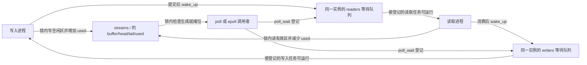
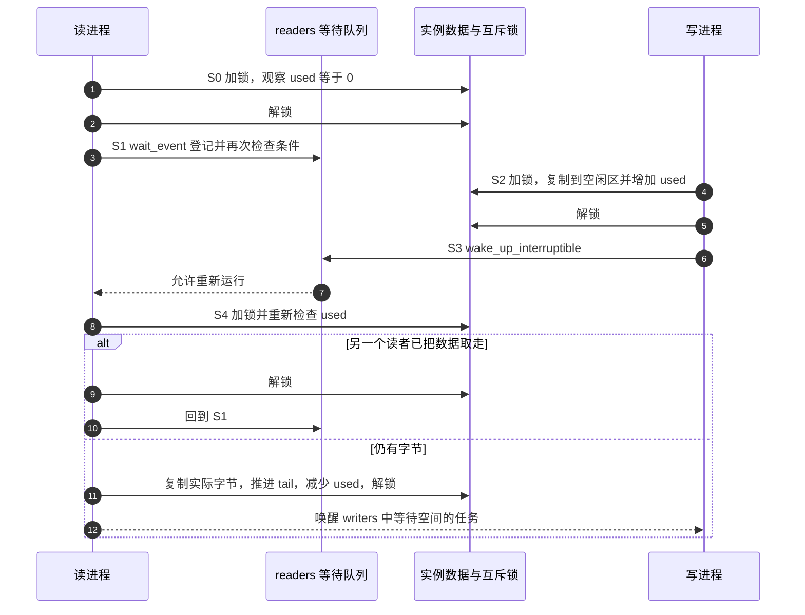

# 第13章\_流式字符设备与等待通知模板

第十章的窗口在读到有效长度时返回 0，读取者因此知道“这一遍已经读完”。现在换一个任务：进程甲陆续产生字节，进程乙处理这些字节。甲可能晚到几秒，也可能暂时比乙快。乙把当前缓存读空，只能说明这一刻没有数据，不能据此断定以后再也没有数据。

这就是本章与有限窗口的分界。沿用第十章已经完整建立的注册头文件、加载参数和整组模块生命周期，本章只增加一个环形缓冲区，以及“条件不满足时睡眠，条件改变时通知”的文件操作。先修是[读写契约](P05_文件操作契约与数据路径.md)、[等待与 poll](P06_阻塞_poll与异步通知.md)和[第十章完整模板](P10_字符设备驱动模板.md)。目标是解释并运行一条从等待读者到写入、唤醒、读取的完整路径，不把空队列、EOF 和设备移除混成一个返回值。

## 13.1\_从只能写满的窗口到可以循环使用的空间

窗口读取之后保留原数据。字节流不同：乙读走的字节已经消费，存储位置可以交还甲。用一个容量为 8 的数组，`head` 指向下一写入位置，`tail` 指向下一读取位置，`used` 记录已写入但尚未读走的字节数。下标走到 8 就回到 0，这就是“环形”的含义，并不要求申请一块环形物理内存。

初始三个数都是 0。写入 `ABCDEF` 后，`head=6, tail=0, used=6`；读走 `ABCD` 后，`head=6, tail=4, used=2`。现在还有六个空位，但从写入下标到数组末尾只有两个连续位置。想写 `wxyz` 时，本例先提交 `wx`，返回 2；调用者再次写剩下的 `yz`，便从下标 0 继续。消费顺序始终是 `EFwxyz`。

保留一个独立计数能区分“头尾相同但全空”和“头尾相同但全满”，所以容量 8 可以使用全部八个位置。代价是每次读写都要同时维护下标和计数。在实例互斥锁内保持 `0 <= used <= buffer_size`，并让 `head`、`tail` 始终小于容量。没有必要为这个教学实例要求容量是 2 的幂；取模已经表达回绕，换成位与之前必须额外建立幂次约束。

## 13.2\_谁持有条件谁负责通知

读者等待的是 `used != 0`，写者等待的是 `used < buffer_size`。条件保存在各实例自己的 `used` 字段；等待队列保存等待任务的登记，两者不能互相替代。向队列发通知没有“存入一份数据”，把 `used` 加一也不会自动调度睡眠中的任务。



用同一轮读取区分五个阶段：S0 在锁内检查是否有字节；S1 无数据时释放锁并登记等待；S2 写者在锁内提交内容与计数；S3 写者解锁后唤醒读者；S4 读者重新竞争锁，确认条件仍成立，复制并消费字节。若另一个读者抢先消费完，当前读者回到 S1，不能把被唤醒当作已经获赠了一个字节。



如果写入恰好发生在 S0 解锁与 S1 登记之间，`wait_event_interruptible` 会重新检查条件，不能只在 S0 检查一次就直接睡眠。等待表达式使用 `READ_ONCE(used)`，计数更新使用 `WRITE_ONCE`；这让不持有实例锁的条件探测成为明确的一次共享访问。它只是决定是否值得继续尝试，不负责发布或保护字节内容。真正访问缓冲区之前仍要获得实例锁；等待队列接口负责登记和唤醒的同步，不能把这些宏当成完整的通信协议。

## 13.3\_完整实现与每次复制的提交点

将下面完整的 [note_stream.c](../../../labs/kernel/character_device/materials/note_stream.c) 与第十章的 `note_registration.h` 放在同一目录。Makefile 中已有 `obj-m := note_window.o note_stream.o`，因此产生两个独立模块；实验只加载当前所学的一种。实例数、容量、设备号和自动节点参数含义不变。

沿用第十章的分配、设备号拆分、模块所有权和错误码。这里新增的文件标志 `O_NONBLOCK` 选择在条件暂不成立时返回错误码 `EAGAIN`；`EPOLLIN`、`EPOLLRDNORM` 是可读事件位，`EPOLLOUT`、`EPOLLWRNORM` 是可写事件位。先读两个传输回调怎样更新条件，再看 poll 回调怎样把相同条件翻译成事件，不要把事件位当作数据本身。

```c
// SPDX-License-Identifier: GPL-2.0
#define pr_fmt(format) KBUILD_MODNAME ": " format

#include <linux/init.h>
#include <linux/mutex.h>
#include <linux/poll.h>
#include <linux/slab.h>
#include <linux/uaccess.h>
#include <linux/wait.h>
#include "note_registration.h"

static unsigned int major_number;
static unsigned int instance_count = 1;
static unsigned int buffer_size = 4096;
static bool auto_create_node = true;
module_param(major_number, uint, 0444);
module_param(instance_count, uint, 0444);
module_param(buffer_size, uint, 0444);
module_param(auto_create_node, bool, 0444);

struct note_stream {
	char *buffer;
	size_t head;                 /* 下一次写入的位置。 */
	size_t tail;                 /* 下一次读取的位置。 */
	size_t used;                 /* 已提交且未消费的字节数。 */
	struct mutex lock;
	wait_queue_head_t readers;
	wait_queue_head_t writers;
};

static struct note_stream *streams;
static struct note_registration registration;

static int note_stream_open(struct inode *inode, struct file *file)
{
	unsigned int index = iminor(inode) - MINOR(registration.first);

	if (index >= instance_count)
		return -ENODEV;
	file->private_data = &streams[index];
	return stream_open(inode, file);
}

static ssize_t note_stream_read(struct file *file, char __user *destination,
			       size_t count, loff_t *position)
{
	struct note_stream *stream = file->private_data;
	size_t requested, copied;
	int error;

	/* 流式打开不使用 position，它可能是 NULL。 */
	if (!count)
		return 0;
	for (;;) {
		if (mutex_lock_interruptible(&stream->lock))
			return -ERESTARTSYS;
		if (stream->used)
			break;
		mutex_unlock(&stream->lock);
		if (file->f_flags & O_NONBLOCK)
			return -EAGAIN;
		error = wait_event_interruptible(stream->readers,
					 READ_ONCE(stream->used) != 0);
		if (error)
			return error;
		/* 醒来只得到竞争机会；必须加锁重新检查。 */
	}
	requested = min(count, stream->used);
	requested = min(requested, (size_t)buffer_size - stream->tail);
	copied = requested - copy_to_user(destination,
					 stream->buffer + stream->tail, requested);
	stream->tail = (stream->tail + copied) % buffer_size;
	WRITE_ONCE(stream->used, stream->used - copied);
	mutex_unlock(&stream->lock);
	if (copied)
		wake_up_interruptible(&stream->writers);
	return copied ? (ssize_t)copied : -EFAULT;
}

static ssize_t note_stream_write(struct file *file, const char __user *source,
				size_t count, loff_t *position)
{
	struct note_stream *stream = file->private_data;
	size_t requested, copied;
	int error;

	if (!count)
		return 0;
	for (;;) {
		if (mutex_lock_interruptible(&stream->lock))
			return -ERESTARTSYS;
		if (stream->used < buffer_size)
			break;
		mutex_unlock(&stream->lock);
		if (file->f_flags & O_NONBLOCK)
			return -EAGAIN;
		error = wait_event_interruptible(stream->writers,
					 READ_ONCE(stream->used) < buffer_size);
		if (error)
			return error;
	}
	requested = min(count, (size_t)buffer_size - stream->used);
	requested = min(requested, (size_t)buffer_size - stream->head);
	/* 目标完全位于空闲区，复制失败清零不会破坏尚未读取的数据。 */
	copied = requested - copy_from_user(stream->buffer + stream->head,
					   source, requested);
	stream->head = (stream->head + copied) % buffer_size;
	WRITE_ONCE(stream->used, stream->used + copied);
	mutex_unlock(&stream->lock);
	if (copied)
		wake_up_interruptible(&stream->readers);
	return copied ? (ssize_t)copied : -EFAULT;
}

static __poll_t note_stream_poll(struct file *file, poll_table *wait)
{
	struct note_stream *stream = file->private_data;
	__poll_t mask = 0;

	/* 先登记再检查，覆盖状态在二者之间改变的情况。 */
	poll_wait(file, &stream->readers, wait);
	poll_wait(file, &stream->writers, wait);
	mutex_lock(&stream->lock);
	if (stream->used)
		mask |= EPOLLIN | EPOLLRDNORM;
	if (stream->used < buffer_size)
		mask |= EPOLLOUT | EPOLLWRNORM;
	mutex_unlock(&stream->lock);
	return mask;
}

static const struct file_operations note_stream_operations = {
	.owner = THIS_MODULE,
	.open = note_stream_open,
	.read = note_stream_read,
	.write = note_stream_write,
	.poll = note_stream_poll,
};

static void note_stream_free(void)
{
	unsigned int index;

	for (index = 0; index < instance_count; ++index)
		kfree(streams[index].buffer);
	kfree(streams);
}

static int __init note_stream_init(void)
{
	unsigned int index;
	int error = -ENOMEM;

	if (!instance_count || instance_count > 16 ||
	    buffer_size < 8 || buffer_size > 65536)
		return -EINVAL;
	streams = kcalloc(instance_count, sizeof(*streams), GFP_KERNEL);
	if (!streams)
		return -ENOMEM;
	for (index = 0; index < instance_count; ++index) {
		mutex_init(&streams[index].lock);
		init_waitqueue_head(&streams[index].readers);
		init_waitqueue_head(&streams[index].writers);
		streams[index].buffer = kzalloc(buffer_size, GFP_KERNEL);
		if (!streams[index].buffer)
			goto fail;
	}
	error = note_register(&registration, &note_stream_operations,
		"note_stream", major_number, instance_count, auto_create_node);
	if (error)
		goto fail;
	pr_info("major=%u minors=0..%u capacity=%u\n",
		MAJOR(registration.first), instance_count - 1, buffer_size);
	return 0;
fail:
	note_stream_free();
	return error;
}

static void __exit note_stream_exit(void)
{
	note_unregister(&registration);
	note_stream_free();
}

module_init(note_stream_init);
module_exit(note_stream_exit);
MODULE_LICENSE("GPL");
MODULE_DESCRIPTION("教学用等待通知环形流字符设备");
```

`stream_open` 声明这个打开文件没有位置含义，关闭普通 seek 与显式位置读写，并设置流模式。本例不填写 `.llseek`，也不解引用 `position`；它可能是空指针。直接把窗口代码复制来，再删去位置更新，会遗漏打开模式仍保留的承诺。

读写函数只在“本次一个字节也没有处理，而且没有数据或空间”时进入等待。只要有可传输的连续片段，就复制一次，提交实际进度并返回。它不等待凑满调用者的 `count`，因此不会在已消费几个字节以后，又因为等待下一批数据而把整个调用的进度丢掉。用户空间若需要读满一条定长记录，应循环累加返回值，并定义中途信号、结束和超时的处理；记录边界不是这个字节流提供的保证。

写入没有使用窗口的临时区，是因为目标严格位于尚未发布的空闲区。部分失败导致的清零只能碰到这些空闲字节，尚未读走的有效数据不受影响；只有实际复制的前缀计入 `used`。读取则只把实际送到用户的前缀从 `used` 扣掉。如果零字节成功，返回 `EFAULT`，下标和计数不动。读写零长度请求都立即返回 0，即使流当前为空或已满。

使用 `O_NONBLOCK` 打开的文件，在无数据或无空间时返回 `EAGAIN`，表示当前不能完成传输。这个标志作用于打开文件，不需要另设“整个模块默认阻塞”的可变参数。它也不承诺回调绝不因争锁或用户缺页而睡眠；它承诺的是不等待本设备的数据或空间到来。

## 13.4\_就绪通知告诉你可以试一次

`poll_wait` 先把调用者登记到两个等待队列，随后回调加锁读取 `used` 并产生就绪位。登记放在检查之前很关键：如果先检查“没数据”、后登记，写者可能恰好在中间提交并完成通知，调用者就会错过这次变化。

有数据时返回可读位 `EPOLLIN | EPOLLRDNORM`；有空位时返回可写位 `EPOLLOUT | EPOLLWRNORM`。这些名字是内核使用的事件掩码，普通 `poll` 与 `select` 也会通过 VFS 对接相应的驱动回调。返回位是检查瞬间的判断；另一个进程可能紧接着取走数据，所以收到可读事件后执行非阻塞 read，仍必须能处理 `EAGAIN`。

本例从不因为“最后一个写入者关闭”返回 EOF，也不会据此报告挂断，因为它没有统计写入端的生命周期。下一次重新打开的写者仍然可以产生数据。需要管道式 EOF 时，要另外定义生产端计数、终止状态、终止时的唤醒，以及“剩余数据先读完还是立即结束”的规则。把 `eof_on_empty` 设为真只会让暂时空闲冒充终止。

同样，普通 `rmmod` 不能用来取消仍持有打开文件的阻塞读者：这些文件正在持有模块引用，退出回调尚未开始。应先让应用结束等待并关闭文件，再卸载。第九章的热移除模型需要独立的离线条件和对象引用，不是往本例退出函数末尾加两次唤醒就能完成。

## 13.5\_用八字节队列观察回绕与等待

在第十一章已完成匹配构建与节点核对的 Linux 实验环境中，加载本模块：

```bash
sudo insmod ./note_stream.ko buffer_size=8 instance_count=1
test -c /dev/note_stream0
cat /sys/class/note_stream/note_stream0/dev
ls -l /dev/note_stream0
```

两处设备号应相符；没有节点先按第十一章检查 devtmpfs 或手工建立本次实验的入口，不往缺失路径重定向。下面的小程序依赖目标的 Python 3，使用两个独立打开文件和非阻塞读写，先观察确定的回绕关系。没有 Python 的目标可把同一调用序列译为 C；这不是模块运行所需的依赖。

`O_RDONLY`、`O_WRONLY` 分别请求只读和只写打开，均叠加本章的非阻塞标志。`stat.S_ISCHR` 继续检查字符设备类型；`select.POLLIN` 是用户空间的可读事件位。`poll(0)` 只查询当前就绪状态，不等待未来事件，所以适合逐步观察每次读写怎样改变条件。

```python
import errno
import os
import select
import stat

path = "/dev/note_stream0"
reader = os.open(path, os.O_RDONLY | os.O_NONBLOCK)
writer = os.open(path, os.O_WRONLY | os.O_NONBLOCK)
try:
    assert stat.S_ISCHR(os.fstat(reader).st_mode)
    assert os.fstat(reader).st_rdev == os.fstat(writer).st_rdev
    ready = select.poll()
    ready.register(reader, select.POLLIN)
    assert ready.poll(0) == []
    try:
        os.read(reader, 1)
        raise AssertionError("空流没有返回 EAGAIN")
    except BlockingIOError as error:
        assert error.errno == errno.EAGAIN
    assert os.write(writer, b"ABCDEF") == 6
    assert ready.poll(0)[0][1] & select.POLLIN
    assert os.read(reader, 4) == b"ABCD"
    assert os.write(writer, b"wxyz") == 2  # 本次只到数组末尾
    assert os.write(writer, b"yz") == 2
    assert os.read(reader, 6) == b"EFwx"   # 读取同样在末尾短返回
    assert os.read(reader, 2) == b"yz"
    assert ready.poll(0) == []
    print("回绕、短传输和可读条件符合预期")
finally:
    os.close(writer)
    os.close(reader)
```

保存为 `stream_probe.py` 后用 `sudo python3 stream_probe.py` 执行；预期只有最后一行输出。它要求本次装载后队列为空且没有其他读写者。断言失败时保留现场，先按 `head/tail/used` 重建已成功步骤，不反复运行一个假设“初始为空”的脚本。

再验证真正的等待：终端甲执行 `sudo dd if=/dev/note_stream0 bs=1 count=1 status=none`，预期它在空流上等待；终端乙执行 `printf Q | sudo tee /dev/note_stream0 >/dev/null`，甲应收到 `Q` 并结束。此时只消费一个字节，不用 `cat` 等待一个本例永远不主动产生的 EOF。测试结束，确认两个终端程序都已退出，再执行 `sudo rmmod note_stream`。

以上输出是实验预期，不表示仓库作者已经在目标板完成运行。它们分别验证数据顺序、边界短返回、就绪条件和一次唤醒；还不能证明所有并发交错、真实用户缺页或热拔插正确。

## 13.6\_改变一个条件再判断结果

1. 把队列写满八字节后，以非阻塞方式再写一字节，会返回 0 还是报错？为什么零字节写是另一回事？
2. 两个读者都被一次写入唤醒，其中一个先读光数据，另一个应该继续复制还是重新等待？
3. 将写入的 `copy_from_user` 改到加锁之前，只保留计数更新在锁内，是否仍然安全？
4. 每次 poll 都显示可写，是否说明应用可以一次写入任意多字节？要提供“读取一整条消息”，还缺什么？

解答：第一题的非空请求得到 `EAGAIN`，因为空间暂不可用；零请求不需要空间，所以返回 0。第二题回到 S1，唤醒不授予数据所有权。第三题不安全，两个写者可能选中相同的空闲区，甚至与绕回来的消费者和后续写者交错；保护计数不能补救已经发生的数据覆盖。第四题只说明至少有一个空位，实际传输仍受空闲量、数组边界和复制进度限制。消息接口还需要长度或分隔协议、容量策略、原子提交及中途失败处理；第五章的记录提交是其中一部分。

本章把注册沿用为前提，新增的是消费式缓冲区、等待条件和通知路径。`used` 决定状态，锁保护内容与计数的一致操作，等待队列负责登记和唤醒，poll 把条件映射为可观察事件。四者职责连起来，才能说明一个晚到的字节怎样让读取者继续。

接口按 NXP 官方固定提交 `dfaf2136deb2af2e60b994421281ba42f1c087e0` 核对；`stream_open` 位于 `fs/open.c`，等待接口位于 `include/linux/wait.h`，poll 登记接口位于 `include/linux/poll.h`。普通进程上下文、无硬件中断、无热移除是本例边界。上一篇：[常见故障与排查](P12_常见故障与排查.md)。回到[专题大纲](大纲.md)。
