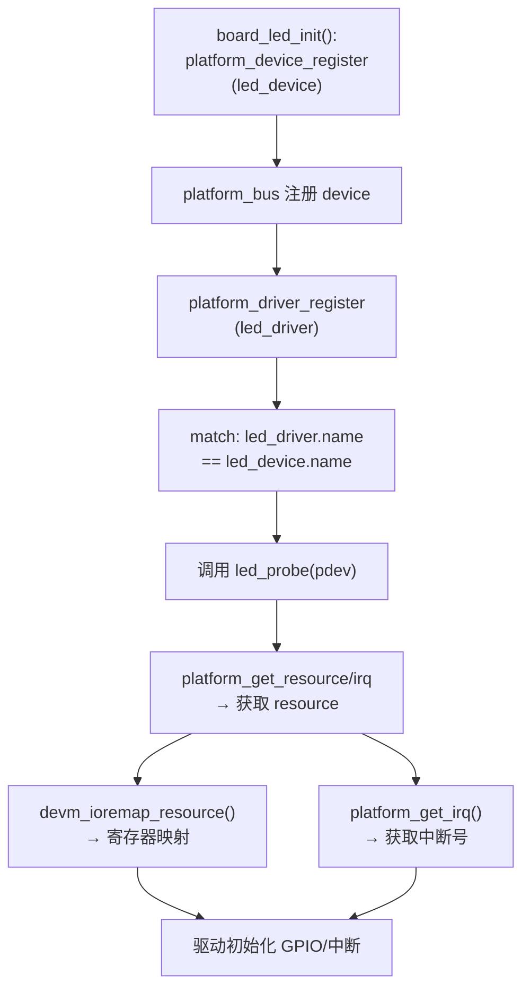
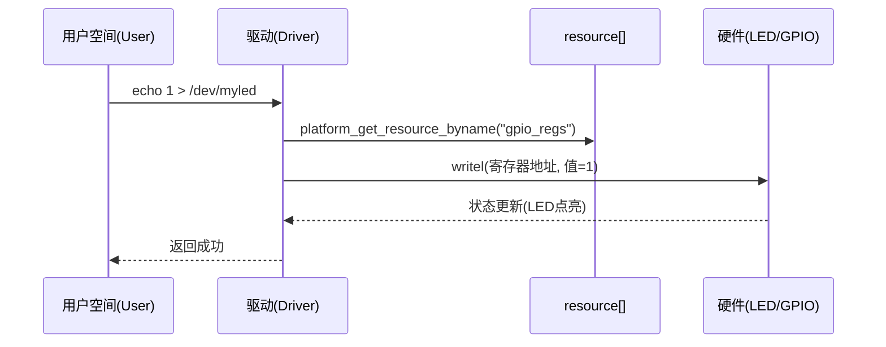
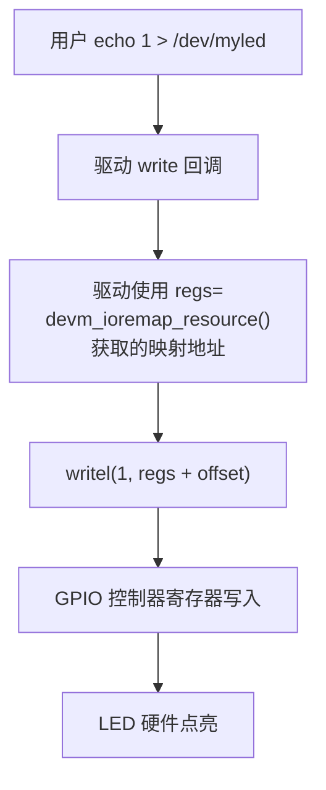

[TOC]

# 第1章_旧式平台设备与资源机制

------

## 1.1_主题引入

在 Linux 内核的早期阶段（特别是 2.6/3.x 内核），ARM 架构并没有设备树（Device Tree）。
 那时如果要使用外设（比如 UART、LED、网卡），必须通过 **板级文件 (board file)** 在内核里写死硬件资源：

- 设备寄存器物理地址在哪里？
- 需要多大的寄存器窗口？
- 对应哪个中断号？
- 是否有 DMA 通道？

这些信息都被封装到一个叫做 **`struct resource`** 的数据结构里，然后挂载到 **`struct platform_device`** 上，注册进内核。驱动加载时通过 **`platform_get_resource()`** 等 API 获取资源。

本章将详细讲解 **无设备树（board file 时代）** 的开发方式：

- 为什么需要 `struct resource`。
- `struct resource` 和 `struct platform_device` 的挂载关系。
- 驱动端如何获取这些资源。
- 用户态如何验证。

这部分知识虽然在现代内核里逐渐被 **设备树** 替代，但理解它对我们掌握 Linux 驱动模型非常重要。


------

## 1.2_数据结构视角

### 1.2.1_struct_resource

**文件位置**：`include/linux/ioport.h`
 **用途**：描述一段硬件资源（寄存器区、中断、IO端口、DMA 通道）。

```c
struct resource {
    resource_size_t start;   /* 起始地址或编号 */
    resource_size_t end;     /* 结束地址（包含） */
    const char *name;        /* 资源名字，可选 */
    unsigned long flags;     /* 类型标志，比如 IORESOURCE_MEM */
    struct resource *parent, *sibling, *child; /* 构成资源树 */
};
```

#### (1)_字段解释

- `start` / `end`
  - 对内存映射（MMIO）外设 → 寄存器物理地址范围
  - 对中断 → 中断号范围（一般 start=end）
- `flags`
  - `IORESOURCE_MEM` → 内存映射寄存器
  - `IORESOURCE_IRQ` → 中断号
  - `IORESOURCE_IO` → I/O 端口
  - `IORESOURCE_DMA` → DMA 通道
- `name`
  - 给资源起名字，便于驱动使用 `*_byname()` API 取到对应的资源
- `parent/child/sibling`
  - 用来挂接到内核的全局资源树（例如 `/proc/iomem` 背后的数据结构）

需要注意的是：

​	这些数据结构的操作都是自定义资源，然后获取资源。也就是说定义资源的方式是由开发者决定的，你可以用resource数据结构装载任何你能够表达的资源，而等你到使用的时候又用自己的设计思路将它获取。所以，这上面就是一个通用使用规范，并不是强制要求。不过能够遵守更好，毕竟还是要保持一致性。

#### (2)_关键注意点

- `end` 是 **包含端点** 的：
  长度 = `end - start + 1`。
- `struct resource` 只是“描述”，只有驱动调用 `request_mem_region()` / `request_irq()` 时，才会把它挂到内核的全局资源树。

------

### 1.2.2_struct_platform_device

**文件位置**：`include/linux/platform_device.h`
 **用途**：描述一个具体的外设，把 `struct resource` 挂到上面，交给 platform 总线。

```c
struct platform_device {
    const char *name;              /* 驱动匹配名 */
    int id;                        /* 多实例区分 (-1 = 单实例) */
    struct device dev;             /* 内嵌的通用 device 结构 */
    u32 num_resources;             /* 资源数量 */
    struct resource *resource;     /* 指向资源数组 */
};
```

#### (1)_挂载关系

- `resource` → 指向 `struct resource[]` 数组
- `num_resources` → 说明数组里有几个资源

**简化理解**：
 板级代码写好一组 `struct resource`，再写一个 `platform_device`，把资源数组挂上去，然后 `platform_device_register()` 注册。
 驱动的 `probe()` 里就能通过 API 把资源“吃下来”。


------

## 1.3_开发者视角

在没有设备树的年代，驱动开发分为两部分：

1. **板级文件（Board File）**：
   - 由 SoC 提供商或开发板厂商编写。
   - 作用：告诉内核“这块硬件有这些外设，它们的地址、中断号分别是多少”。
   - 用 **`struct resource`** + **`platform_device`** 来描述。
2. **驱动文件（Driver File）**：
   - 由驱动开发者编写。
   - 作用：告诉内核“我能驱动名字叫 X 的设备，并且会在 probe 里去获取资源并操作它”。
   - 用 **`platform_driver`**，在 `probe()` 中通过 `platform_get_resource()` 等 API 取出硬件信息。

下面我们用 **LED 驱动** 举例。

------

### 1.3.1_板级文件_定义资源和设备

假设 LED 接在 i.MX6ULL 的 GPIO1_IO03 上，寄存器地址 `0x0209C000 ~ 0x0209C0FF`，对应中断号 35。

#### (1)_板级文件代码

📄 **board_led.c**

```c
#include <linux/platform_device.h>
#include <linux/ioport.h>

/* Step 1: 定义资源 */
static struct resource led_resources[] = {
    {
        .start = 0x0209C000,          /* GPIO1 基地址 */
        .end   = 0x0209C0FF,          /* 地址区间，长度 0x100 */
        .flags = IORESOURCE_MEM,      /* 表示这是寄存器内存 */
        .name  = "gpio_regs",
    },
    {
        .start = 35,                  /* 中断号 */
        .end   = 35,
        .flags = IORESOURCE_IRQ,      /* 表示这是中断 */
        .name  = "gpio_irq",
    },
};

/* Step 2: 定义 platform_device */
static struct platform_device led_device = {
    .name = "my-led",                        	/* 必须和驱动的 .driver.name 一致 */
    .id   = -1,                              	/* 单实例设备 */
    .num_resources = ARRAY_SIZE(led_resources), /* 设置资源组的长度 */
    .resource      = led_resources,          	/* ★ 把资源数组挂到这里 */
};

/* Step 3: 注册设备 */
static int __init board_led_init(void)
{
    return platform_device_register(&led_device);
}
arch_initcall(board_led_init);
```

------

#### (2)_解释

- `led_resources[]` → 资源数组，描述 **GPIO1 的寄存器地址范围** + **中断号**。
- `led_device.resource = led_resources` → 把资源数组挂到设备上。
- `platform_device_register()` → 把设备丢到 **platform 总线**，等待驱动来匹配。

👉 这一步完成后，系统知道“有一个名字叫 `my-led` 的设备，它有寄存器区 + 中断号”。

------

### 1.3.2_驱动文件_获取资源并操作

#### (1)_驱动代码

📄 **led_driver.c**

```c
#include <linux/module.h>
#include <linux/platform_device.h>
#include <linux/io.h>
#include <linux/interrupt.h>

/* probe: 匹配成功时调用 */
static int led_probe(struct platform_device *pdev)
{
    void __iomem *regs;
    int irq;

    /* Step 1: 获取寄存器资源 */
    regs = devm_platform_ioremap_resource_byname(pdev, "gpio_regs");
    if (IS_ERR(regs))
        return PTR_ERR(regs);

    /* Step 2: 获取中断号 */
    irq = platform_get_irq_byname(pdev, "gpio_irq");
    if (irq < 0)
        return irq;

    dev_info(&pdev->dev, "LED device mapped: regs=%p irq=%d\n", regs, irq);

    /* Step 3: 此处可以初始化 GPIO，引脚配置，申请中断等 */
    return 0;
}

/* remove: 驱动卸载时调用 */
static int led_remove(struct platform_device *pdev)
{
    dev_info(&pdev->dev, "LED driver removed\n");
    return 0;
}

/* Step 4: 定义 platform_driver */
static struct platform_driver led_driver = {
    .probe  = led_probe,
    .remove = led_remove,
    .driver = {
        .name = "my-led",     /* 和 board 文件的 name 匹配 */
    },
};

module_platform_driver(led_driver);
MODULE_LICENSE("GPL");
```

------

#### (2)_解释

- `devm_platform_ioremap_resource_byname()`
  - 内部执行：`platform_get_resource_byname()` → `request_mem_region()` → `ioremap()`。
  - 好处：**一步完成**，并且会自动释放（devres）。
- `platform_get_irq_byname()`
  - 根据 `resource[].name` 找到 IRQ 号。
- `probe()`
  - 只有在 **设备和驱动名字匹配** 时才会被调用。
  - 匹配逻辑由 **platform 总线**（`drivers/base/platform.c`）负责。

👉 至此，驱动就能操作资源：

- 用 `readl()` / `writel()` 操作寄存器。
- 用 `request_irq()` 注册中断处理函数。

------

### 1.3.3_调用链可视化

下面用 **flowchart** 描述整个调用流程：



------

### 1.3.4_核心结论

- `struct resource[]` 由板级代码静态定义；
- `struct platform_device` 把资源挂上去，注册到内核；
- `platform_driver` 匹配成功后，`probe()` 用 API 拿到资源；
- 驱动才会真正调用 `ioremap`、`request_irq` 等函数来操作硬件。


------

## 1.4_用户视角

在旧式无设备树的开发方式里，**用户态能看到什么**，取决于驱动是否主动暴露接口：

- 如果驱动注册了 **字符设备**，用户可以通过 `/dev/xxx` 节点操作。
- 如果驱动只初始化了硬件（比如 LED 点灯），用户可能只能通过 **dmesg** 或 **sysfs 属性** 来验证。
- 即使驱动没有创建 `/dev` 节点，用户也可以通过 **内核调试接口**（`/proc`、`/sys`）观察资源是否被映射、是否在工作。

下面分几个常见的观测点。

------

### 1.4.1_验证驱动加载

加载驱动模块：

```bash
# 加载板级资源 + 驱动模块
insmod board_led.ko
insmod led_driver.ko

# 查看内核消息
dmesg | tail -n 10
```

如果匹配成功，会看到类似输出：

```
[   50.123456] my-led led_driver: LED device mapped: regs=ef7c0000 irq=35
```

- `regs=...` → 驱动成功 `ioremap` 了资源
- `irq=35` → 驱动获取到了中断号

------

### 1.4.2_查看_/proc/iomem

`/proc/iomem` 记录了内核已经分配的物理内存资源。

```bash
cat /proc/iomem | grep gpio
```

可能看到类似：

```
0209c000-0209c0ff : my-led.gpio_regs
```

👉 说明我们的 `resource[0]`（寄存器区间）已经被 **`request_mem_region()`** 占用。

------

### 1.4.3_查看_/proc/interrupts

驱动申请中断后（假设我们调用了 `request_irq()`），就能在 `/proc/interrupts` 看到：

```bash
cat /proc/interrupts | grep gpio
```

示例输出：

```
35:     1234  my-led.gpio_irq
```

- `35` → IRQ 号
- `1234` → 中断触发次数
- `my-led.gpio_irq` → 我们的驱动在资源里填的 `name`

------

### 1.4.4_查看_sysfs_设备节点

所有 platform_device 会挂在 `/sys/devices/platform/` 下。

```bash
ls /sys/devices/platform/
```

输出示例：

```
my-led
serial8250
soc@0
```

进入 `my-led` 目录：

```bash
ls /sys/devices/platform/my-led/
```

可能看到：

```
driver
modalias
of_node
subsystem
uevent
```

👉 如果驱动在 `probe()` 里注册了 **sysfs 属性**，这里还能看到对应文件。

------

### 1.4.5_如果驱动注册了字符设备

假设驱动里加了 `cdev` 注册逻辑，就会在 `/dev/` 下出现设备节点，例如：

```bash
ls -l /dev/myled
crw------- 1 root root 240, 0 Oct  3 12:00 /dev/myled
```

用户就可以用：

```bash
echo 1 > /dev/myled    # 点亮 LED
echo 0 > /dev/myled    # 熄灭 LED
```

👉 这属于 **驱动额外提供的接口**，和 `resource` 挂载关系本身没有直接关系，但它是用户和驱动交互的常见方式。

------

### 1.4.6_验证流程小结

用户空间可以通过以下手段验证资源：

| 验证手段           | 说明                                       |
| ------------------ | ------------------------------------------ |
| `dmesg`            | 确认 probe 是否调用，资源是否映射成功      |
| `/proc/iomem`      | 查看寄存器区是否被 request_mem_region 占用 |
| `/proc/interrupts` | 查看中断是否注册，是否有触发计数           |
| `/sys/devices`     | 验证设备是否挂到 platform 总线             |
| `/dev/xxx`         | 如果驱动实现了字符设备接口，可以直接操作   |

一句话总结：

> **在用户视角下，旧式驱动的“存在感”主要体现在 `/proc`、`/sys`、`/dev` 和 `dmesg`。**


------

## 1.5_可视化图示

------

### 1.5.1_系统目录结构示例

当我们在 **板级文件**里注册 `platform_device`，并在 **驱动 probe** 里完成初始化后，用户可以在 `/proc` 和 `/sys` 看到如下结构：

```bash
# /proc/iomem （片段）
0209c000-0209c0ff : my-led.gpio_regs

# /proc/interrupts （片段）
35:    12   0   0   0   my-led.gpio_irq

# /sys/devices/platform/
├── my-led/
│   ├── driver -> ../../../bus/platform/drivers/my-led
│   ├── modalias
│   ├── subsystem -> ../../../bus/platform
│   ├── uevent
│   └── (如果驱动创建了 sysfs 属性，还会有其他文件)
├── serial8250/
├── soc@0/
```

如果驱动注册了 **字符设备**，则在 `/dev` 下会出现节点：

```bash
/dev/
├── console
├── null
├── ttyS0
└── myled
```

------

### 1.5.2_时序图_用户空间到硬件的交互

下面用 Mermaid 的 **sequenceDiagram** 表示：



**解释：**

1. 用户通过 `/dev/myled` 写入 `1`。
2. 驱动在 `probe()` 时已经从 `resource[]` 里拿到 `gpio_regs`，并 `ioremap` 到虚拟地址。
3. 写操作最终转化为 `writel()`，写入硬件寄存器。
4. 硬件（GPIO 控制器）执行，LED 点亮。

------

### 1.5.3_流程图回顾(补充)

在 1.3 我们已经给了 **probe 调用链**，这里再给一个更偏向用户交互的版本：



------

一句话总结：

> **可视化上看，旧式驱动就是：板级文件里挂资源 → 驱动 probe() 拿到资源 → 用户态操作 /dev → 驱动通过寄存器访问硬件。**


------

## 1.6_调试与验证

旧式驱动的开发，最大的问题是：**资源描述是否正确、驱动是否真正拿到了资源**。
 因此，调试和验证主要围绕以下几点：

1. 驱动 `probe()` 是否被调用？
2. `ioremap` 是否成功？
3. 资源是否挂到系统资源树（`/proc/iomem` / `/proc/interrupts`）？
4. 硬件是否真正响应（例如 LED 是否亮、中断是否触发）？

------

### 1.6.1_验证驱动加载是否成功

加载模块：

```bash
insmod board_led.ko
insmod led_driver.ko
dmesg | tail -n 20
```

典型输出：

```
[   42.123456] my-led led_driver: LED device mapped: regs=ef7c0000 irq=35
```

说明：

- `probe()` 已经执行。
- `devm_platform_ioremap_resource_byname()` 成功返回映射地址。
- `platform_get_irq_byname()` 成功返回 IRQ=35。

------

### 1.6.2_验证资源是否真正挂载

- **查看寄存器区**

  ```bash
  cat /proc/iomem | grep gpio
  ```

  输出：

  ```
  0209c000-0209c0ff : my-led.gpio_regs
  ```

- **查看中断是否生效**

  ```bash
  cat /proc/interrupts | grep gpio
  ```

  输出：

  ```
  35:     42   0   0   0   my-led.gpio_irq
  ```

如果 IRQ 计数一直不变，说明中断未触发或驱动未 `request_irq`。

------

### 1.6.3_验证_/sys_和_/dev

- 在 `/sys/devices/platform/` 下能看到 `my-led/` 目录，证明设备成功注册到 **platform 总线**。

  ```bash
  ls /sys/devices/platform/my-led
  ```

- 如果驱动实现了字符设备，还能在 `/dev` 下看到节点：

  ```bash
  ls -l /dev/myled
  ```

------

### 1.6.4_硬件响应测试

如果驱动在 `write()` 中控制寄存器：

```bash
echo 1 > /dev/myled   # 点亮 LED
echo 0 > /dev/myled   # 熄灭 LED
```

如果是中断设备，可以手动触发硬件事件，观察 `/proc/interrupts` 计数是否增加。

------

### 1.6.5_常见错误与排查

| 常见错误                    | 现象                                       | 排查方法                                            |
| --------------------------- | ------------------------------------------ | --------------------------------------------------- |
| `end` 写错（忘记 `-1`）     | 资源长度不对，可能覆盖其他区域             | 确认 `end = start + size - 1`                       |
| `flags` 写错                | 驱动找不到资源（返回 NULL）                | 确认是 `IORESOURCE_MEM` 还是 `IORESOURCE_IRQ`       |
| 名字不一致                  | `platform_get_resource_byname()` 返回 NULL | 确认 `resource[].name` 与 `byname()` 传参一致       |
| 驱动名字不一致              | probe 没有被调用                           | 确认 `pdev->name` 和 `driver->name` 一致            |
| 未调用 `request_mem_region` | `/proc/iomem` 看不到资源                   | 改用 `devm_ioremap_resource()`                      |
| 中断未触发                  | `/proc/interrupts` 计数为 0                | 检查硬件是否真的发 IRQ，确认 `request_irq()` 已调用 |

------

### 1.6.6_调试小技巧

1. **打印资源**
   在 `probe()` 中打印 `pdev->resource[]`：

   ```c
   for (i = 0; i < pdev->num_resources; i++) {
       struct resource *r = &pdev->resource[i];
       dev_info(&pdev->dev, "res[%d]: %s start=0x%lx end=0x%lx flags=0x%lx\n",
                i, r->name, (unsigned long)r->start,
                (unsigned long)r->end, r->flags);
   }
   ```

   输出能帮助确认资源表挂载是否正确。

2. **用 hexdump 查看寄存器**
   如果驱动提供 `mmap`，可以在用户态 `devmem` 工具查看寄存器值。

   ```bash
   devmem 0x0209c000
   ```

3. **调试中断**
   在 `irq handler` 里 `printk(KERN_INFO "irq fired\n");`，配合 `/proc/interrupts` 双重验证。

------

一句话总结：

> **调试旧式驱动的核心思路：先看 `probe()` 是否执行，再查资源是否映射，最后验证硬件是否响应。**


------

## 1.7_小结

在本章中，我们完整介绍了 **旧式无设备树的开发方式**，即通过 **板级文件硬编码资源 → 挂载到 platform_device → 驱动 probe 获取资源** 的开发模式。

这种方式虽然在现代内核中逐渐被设备树替代，但它依然是理解 **Linux 资源管理与驱动模型** 的基础。

------

### 1.7.1_三视角总结表

| 阶段 / 视角      | 板级文件 (Board File)                                        | 驱动 (Driver)                                                | 用户空间 (User)                                              |
| ---------------- | ------------------------------------------------------------ | ------------------------------------------------------------ | ------------------------------------------------------------ |
| **要做的事**     | 定义 `struct resource[]`（寄存器、中断…）挂到 `platform_device` 并注册 | 在 `probe()` 用 `platform_get_resource()` / `devm_ioremap_resource()` / `platform_get_irq()` 获取资源并使用 | 通过 `/dev/`、`/sys/`、`/proc/`、`dmesg` 验证设备是否正常工作 |
| **关键数据结构** | `struct resource` `struct platform_device`                   | `struct platform_driver`                                     | `/proc/iomem` `/proc/interrupts` `/sys/devices/platform`     |
| **API / 接口**   | `platform_device_register()`                                 | `platform_get_resource()` `devm_ioremap_resource()` `platform_get_irq()` | `echo 1 > /dev/myled` `cat /proc/iomem`                      |
| **结果**         | 系统里出现一个带资源的设备                                   | 驱动成功获取寄存器和中断，完成初始化                         | 用户可以通过 `/dev` 或 `sysfs` 控制硬件并验证                |

------

### 1.7.2_旧式开发方式的特点

- **优点**
  - 简单直接，逻辑清晰。
  - 不依赖设备树，适合早期内核或学习驱动模型。
- **缺点**
  - 资源硬编码在内核中，移植性差。
  - 一个板子对应一份 board file，不同硬件平台需要重新修改源码并重新编译。
  - 维护难度大，不利于通用驱动开发。

------

### 1.7.3_一句话总结

> **旧式无设备树的开发方式 = “板级文件写死资源 → 驱动用 API 拿资源 → 用户空间通过 /dev 或 /sys 操作硬件”。**

------

✅ 至此，**第 1 章：旧式平台设备与资源机制** 完整结束。