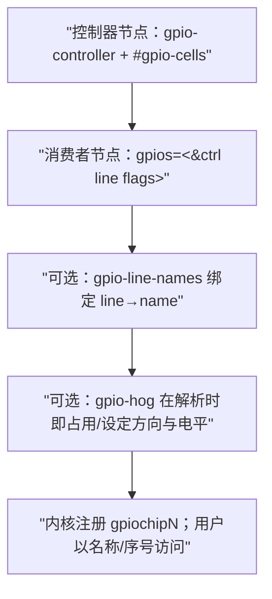
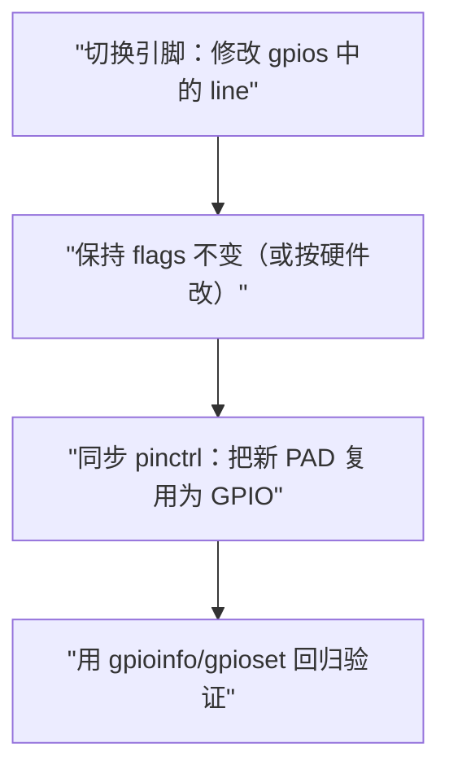
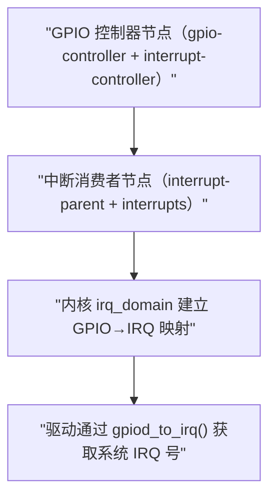
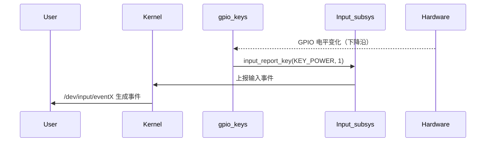
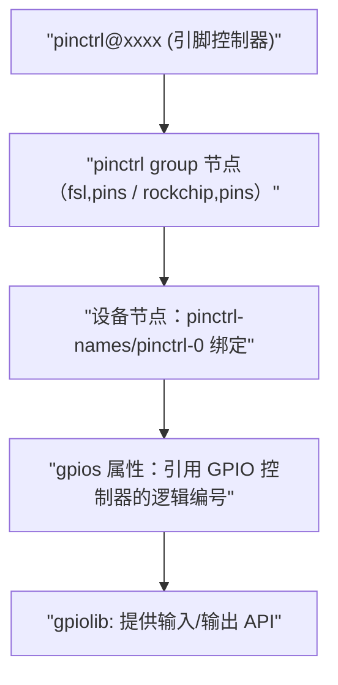
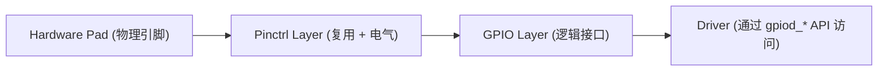

我是 **GPT-5**。

------

# 第1章_设备树中的_GPIO_语法(Kernel_6.1+)

## 1.1_主题引入

本章聚焦 **设备树（Device Tree, DT）层面的 GPIO 语法**：

- 控制器端：如何声明一个 GPIO 控制器节点？必需/可选属性有哪些？
- 消费者端：如何在外设节点中引用 GPIO？`#gpio-cells` 的参数顺序与含义？
- 命名与可读性：`gpio-line-names` 如何与引脚序号绑定？
- 自动占用：`gpio-hog` 如何在内核初始化阶段把某些线拉成固定电平或设为输入？
- 复用配合：与 `pinctrl` 的分工与边界（哪些放在 pinctrl，哪些放在 gpios flags）。
- 常见误区与修改示例：改引脚/改有效电平/多路 GPIO 列表/可移植写法。

> 一句话定位：**学完本章，你能仅凭设备树把 GPIO 的“谁、哪根、什么电平、什么时候占用”说清楚，并写对。**

------

## 1.2_数据结构视角(语法与含义对齐)

> 本节不谈内核 `struct`，只把**DT 属性**与**语义**对上号，方便后文写法不跑偏。

### 1.2.1_控制器节点(Controller)

- **节点必备**：
  - `gpio-controller`：无值布尔属性；声明“我是一个 GPIO 控制器”。
  - `#gpio-cells = <N>`：定义**消费者引用**该控制器时，每个 GPIO 条目的**单元数**（常见为 2）。
- **常见可选**：
  - `interrupt-controller` + `#interrupt-cells = <3>`：若该控制器能提供 GPIO 中断（ARM GIC 三元组）。
  - `gpio-line-names = "name0", "name1", ...;`：为**控制器下的每一根线**按**序号**命名（0 起）。
- **与 pinctrl 的边界**：
  - **复用/上下拉/驱动能力/速率等电气属性** → 写在 `pinctrl` 节点的 pin 配置里；
  - **有效电平（active-high/low）与开漏/开源语义** → 多用 `gpios` 参数 flags 表达（若 SoC 支持）。

### 1.2.2_消费者节点(Consumer)

- **核心属性**：`gpios = < &phandle line flags > [, <...> ...];`
  - `&phandle`：指向某个 `gpio-controller` 节点的句柄（典型以标签 `gpio1:`、`gpio3:` 等命名）。
  - `line`：该控制器内**局部引脚号**，**从 0 开始**。
  - `flags`：使用 `<dt-bindings/gpio/gpio.h>` 中的宏，常见：
    - `GPIO_ACTIVE_HIGH` / `GPIO_ACTIVE_LOW`
    - `GPIO_OPEN_DRAIN` / `GPIO_OPEN_SOURCE`（若控制器支持单端）
    - （**注意**：上下拉、bias 等多放在 pinctrl 的 pinconf，而不是这里）
- **属性命名规范**：
  - 单根信号：`reset-gpios`、`enable-gpios`、`power-gpios`、`cs-gpios`、`int-gpios` 等；
  - 多根数组：`gpios`（通用）、或具体含义的复数形，如 `cs-gpios`（多片选）。

### 1.2.3_自动占用(Hogger)

- **目的**：板子上某些 GPIO 开机就必须固定方向/电平（如关某电源、拉复位）。
- **写法**：在**控制器节点**下增加子节点，命名随意但常用 `hog-...`，并包含：
  - `gpios = < line flags >;`
  - **方向/初始化**：`input;`、`output-high;`、`output-low;`
  - 可选：`line-name = "FOO";`（为该线单独命名）
- **触发时机**：内核解析该控制器时即生效（无需驱动参与）。

------

## 1.3_核心语法清单(零歧义速查)

### 1.3.1_控制器节点必备/可选属性

| 属性                   | 类型        | 作用                                | 是否必需 |
| ---------------------- | ----------- | ----------------------------------- | -------- |
| `gpio-controller`      | boolean     | 宣告本节点为 GPIO 控制器            | ✅        |
| `#gpio-cells`          | `<u32>`     | 每条 `gpios` 引用的单元数（常见 2） | ✅        |
| `interrupt-controller` | boolean     | 本控制器可作为中断控制器            | 可选     |
| `#interrupt-cells`     | `<u32>`     | GIC 一般为 3（类型, 号, 触发）      | 可选     |
| `gpio-line-names`      | string-list | 逐线命名，序号与线号 1:1            | 可选     |

> **约定**：`#gpio-cells = <2>` 时，消费者端 `gpios` 每组严格为 `<&ctrl line flags>` 两个单元（不多不少）。

### 1.3.2_消费者端_gpios_参数

| 单元 | 名称       | 说明                                                       | 示例              |
| ---- | ---------- | ---------------------------------------------------------- | ----------------- |
| 0    | `&phandle` | 指向控制器                                                 | `&gpio1`          |
| 1    | `line`     | 局部线号（0 起）                                           | `3`               |
| 2    | `flags`    | 语义标志（若 `#gpio-cells` 是 2，此单元就是“第 2 个单元”） | `GPIO_ACTIVE_LOW` |

> **注意**：是否有第三单元取决于控制器声明的 `#gpio-cells`。本章默认 **2 单元**（最常见）。

### 1.3.3_flags_常用宏(来自_<dt-bindings/gpio/gpio.h>)

- **有效电平**：
  - `GPIO_ACTIVE_HIGH`（默认）
  - `GPIO_ACTIVE_LOW`
- **单端语义**（控制器支持时）：
  - `GPIO_OPEN_DRAIN`（开漏）
  - `GPIO_OPEN_SOURCE`（开源）
- **不建议在 `gpios` 中表达的**：
  - 上下拉/电气强度/速率 → **到 pinctrl 的 pinconf 去写**（如 `bias-pull-up`、`drive-strength` 等）

------

## 1.4_与_pinctrl_的配合与分工(强制掌握)

- **pinctrl 负责**：把某个物理 PAD 复用为 GPIO 功能，并配置上下拉、驱动能力、速度、施密特触发等**电气特性**。
- **GPIO `gpios` 负责**：告诉“谁使用哪根 GPIO、对该线的**逻辑语义**（active-high/low、开漏/开源）”。
- **必备先后**：**先 pinctrl** 把 PAD 复用为 GPIO，再由 `gpios` 被消费者节点引用。
- **典型错误**：只写 `gpios` 不写 `pinctrl`，导致 PAD 仍处于外设复用模式，读写不生效。

------

## 1.5_语法示例(按功能维度递进)

> **风格约定**：每段示例后**立即给出“语法解读”**，只围绕语法。

### 1.5.1_最小可用_GPIO_控制器与单_GPIO_引用

```dts
/ {
    compatible = "vendor,board";
};

gpio1: gpio@0209c000 {
    compatible = "fsl,imx6ul-gpio", "fsl,imx35-gpio";
    reg = <0x0209c000 0x4000>;
    gpio-controller;
    #gpio-cells = <2>;
};

leds {
    compatible = "gpio-leds";
    led0 {
        label = "user:red";
        gpios = <&gpio1 3 GPIO_ACTIVE_LOW>;
    };
};
```

**语法解读**：

- 控制器：必须有 `gpio-controller` 与 `#gpio-cells=<2>`。
- 消费者：`gpios` 使用**两单元**：`3`（线号）、`GPIO_ACTIVE_LOW`（语义）。
- 未配置 pinctrl，此例仅示范**最小 gpios 用法**；真实板级需配合 pinctrl。

------

### 1.5.2_为控制器_逐线命名_与名称一致性

```dts
gpio1: gpio@0209c000 {
    compatible = "fsl,imx6ul-gpio", "fsl,imx35-gpio";
    reg = <0x0209c000 0x4000>;
    gpio-controller;
    #gpio-cells = <2>;
    gpio-line-names =
        "LED_USER",    /* line 0 */
        "LED_PWR",     /* line 1 */
        "BTN_RESET",   /* line 2 */
        "UART_TX",     /* line 3 */
        "UART_RX",     /* line 4 */
        "I2C_SDA",     /* line 5 */
        "I2C_SCL",     /* line 6 */
        "SPI_CS";      /* line 7 */
};
```

**语法解读**：

- 字符串列表**严格与线号对齐**（0→第一项）。
- 仅影响**命名与用户侧可读性**，不改变电气功能或逻辑。

------

### 1.5.3_多根_GPIO(数组)与命名型属性

```dts
spi@40034000 {
    compatible = "vendor,spi-master";
    cs-gpios = <&gpio1 7 GPIO_ACTIVE_LOW>, <&gpio1 1 GPIO_ACTIVE_LOW>;
    /* 0 号 CS → line 7，1 号 CS → line 1 */
};
```

**语法解读**：

- `cs-gpios` 语义明确：多根片选线（顺序决定通道索引）。
- **数组以逗号分隔**，每组仍是 `#gpio-cells` 定义的单元数。

------

### 1.5.4_gpio-hog_开机即占用并拉成固定电平

```dts
gpio1: gpio@0209c000 {
    gpio-controller;
    #gpio-cells = <2>;

    hog-reset {
        gpios = <2 GPIO_ACTIVE_LOW>;
        output-high;        /* 方向+初值：高（注意此处结合 ACTIVE_LOW 表示“释放”语义） */
        line-name = "BOARD_RESET_HOG";
    };

    hog-discharge {
        gpios = <6 GPIO_ACTIVE_HIGH>;
        output-low;         /* 初始拉低 */
        line-name = "BAT_DISCHARGE_EN";
    };
};
```

**语法解读**：

- `hog-*` 子节点**定义在控制器下**；
- `gpios` 写**局部线号 + flags**（与消费者处一致，只是缺了 `&phandle` 因为已在控制器内）；
- 方向声明三选一：`input;`、`output-high;`、`output-low;`；
- `line-name` 仅用于人类可读性。

------

### 1.5.5_与_pinctrl_的组合(推荐上板写法)

```dts
&pinctrl {
    pinctrl_leds: ledsgrp {
        fsl,pins = <
            MX6UL_PAD_GPIO1_IO03__GPIO1_IO03  0x10B0  /* 复用为 GPIO 并配置上拉/速率等 */
        >;
    };
};

leds {
    compatible = "gpio-leds";
    pinctrl-names = "default";
    pinctrl-0 = <&pinctrl_leds>;
    led0 {
        label = "user:red";
        gpios = <&gpio1 3 GPIO_ACTIVE_LOW>;
    };
};
```

**语法解读**：

- **pinctrl** 决定**物理 PAD**“变成”GPIO，并定义电气属性；
- **gpios** 决定“谁在用这根线，什么语义（active-low）”；
- **两者缺一不可**（真正上板时）。

------

### 1.5.6_改语法不改驱动_的三种常见修改

1. **换引脚**：

```diff
- gpios = <&gpio1 3 GPIO_ACTIVE_LOW>;
+ gpios = <&gpio1 5 GPIO_ACTIVE_LOW>;
```

> 只改 `line`，保持 flags 与业务语义不变。注意同时更新 pinctrl 把新 PAD 复用为 GPIO。

1. **改有效电平**：

```diff
- gpios = <&gpio1 5 GPIO_ACTIVE_LOW>;
+ gpios = <&gpio1 5 GPIO_ACTIVE_HIGH>;
```

> 上下游语义对齐：若硬件接反（低有效），就写 `GPIO_ACTIVE_LOW`；用户/驱动以“**有效**”为语义操作。

1. **从推挽改为开漏**（控制器支持时）：

```diff
- gpios = <&gpio1 5 GPIO_ACTIVE_LOW>;
+ gpios = <&gpio1 5 (GPIO_ACTIVE_LOW | GPIO_OPEN_DRAIN)>;
```

> 多 flag 以“或”组合；电气细节（上拉电阻）仍建议在 pinctrl 的 pinconf 中配置。

------

## 1.6_用户视角(验证语法是否被正确解析)

> 目标：只靠 DT 与工具，检查“线名、序号、方向、占用状态”。

- 查看行与名称：

  ```bash
  gpioinfo gpiochip0
  ```

- 通过名称/序号操作（需 libgpiod 工具）：

  ```bash
  gpioset gpiochip0 "LED_USER"=1    # 通过 gpio-line-names
  gpioset gpiochip0 3=0             # 通过行号
  gpioget gpiochip0 "BTN_RESET"
  gpiomon gpiochip0 "BTN_RESET"
  ```

- 反编译校验 DT 生效：

  ```bash
  dtc -I dtb -O dts -o out.dts /sys/firmware/fdt
  grep -n "gpio-line-names" out.dts
  ```

------

## 1.7_可视化图示

### 1.7.1_从_DT_到可操作_GPIO_的流程



### 1.7.2_常见修改路径(不动驱动_仅改_DT)



------

## 1.8_调试与验证(问题_to_定位_to_修复)

| 现象                  | 可能原因                                 | 快速定位                                      | 处理建议                                |
| --------------------- | ---------------------------------------- | --------------------------------------------- | --------------------------------------- |
| `gpioinfo` 看不到名称 | 未写 `gpio-line-names` 或顺序错          | 反编译 DT 检查列表长度与序号                  | 名称长度与控制器 `ngpio` 对齐；不要缺项 |
| `gpioset` 不起作用    | 未做 pinctrl 复用                        | 查 `pinctrl-0`、`fsl,pins`/`rockchip,pins` 等 | 把 PAD 复用到 GPIO 模式，并配置 bias    |
| 电平逻辑反了          | flags 写成 `GPIO_ACTIVE_HIGH`/`LOW` 相反 | 用万用表或 `gpioget` 对比                     | **以“有效语义”为准**，改 flags 不改业务 |
| 上下拉不生效          | 误把 bias 写在 `gpios` flags             | 看 pinconf 是否设置 `bias-pull-*`             | 把上下拉移到 pinctrl 的 pinconf         |

------

## 1.9_小结

- **控制器端**：`gpio-controller` + `#gpio-cells` 决定**引用规范**；`gpio-line-names` 提升可读性；`gpio-hog` 提供**开机即占用**能力。
- **消费者端**：`gpios = <&ctrl line flags>` 是**唯一标准句式**；多根线以逗号分组。
- **分工**：**pinctrl 写电气与复用**，`gpios flags` 写**有效语义与单端语义**。
- **修改友好**：换引脚/改电平/扩展多线，只需修改 DT，驱动/应用可不变。

> **一句话总结**：
>  **GPIO 的 DT 写法＝控制器声明 + 消费者引用 +（可选）命名与 hog，占语义在 `gpios`，占电气在 `pinctrl`。**

------

# 第2章_设备树中的_GPIO_中断与_gpio-keys_语法(Kernel_6.1+)

## 2.1_主题引入

上一章我们完整讲解了 GPIO 的控制器定义与 `gpios` 属性语法。
 但在实际硬件中，很多 GPIO 除了作为输出（如 LED）外，还常作为**输入事件源**——最典型的就是**按键、复位信号、外部中断唤醒**。

Linux 内核在设备树层面允许 GPIO 同时被注册为**中断源（interrupt source）**，并由 `gpio-keys` 框架统一管理输入事件。
 本章目标：

- 理解 **GPIO → 中断控制器 → IRQ domain** 的映射语法；
- 掌握 **interrupt-parent / interrupts / interrupt-names** 的使用；
- 彻底弄清 **gpio-keys** 子系统的语法结构与 key code 定义；
- 学会写出零歧义、可维护的 GPIO 按键定义。

------

## 2.2_GPIO_中断语法基础

### 2.2.1_中断三层语义

设备树中的中断系统分为三层：

1. **中断控制器（interrupt-controller）**
    声明自己能管理中断号；
2. **中断消费者（interrupt consumer）**
    通过 `interrupts = <...>` 引用控制器；
3. **中断连接关系（interrupt-parent）**
    若节点本身可发出中断（例如 GPIO 控制器），还需声明它的上级中断控制器。

### 2.2.2_GPIO_作为中断源时的结构

#### (1)_语法形式

```dts
gpio1: gpio@0209c000 {
    compatible = "fsl,imx6ul-gpio";
    reg = <0x0209c000 0x4000>;
    gpio-controller;
    #gpio-cells = <2>;

    interrupt-controller;        // 声明自己可发出中断
    #interrupt-cells = <3>;      // 定义三元组格式
    interrupt-parent = <&gic>;   // 指明上级中断控制器
    interrupts = <GIC_SPI 66 IRQ_TYPE_LEVEL_HIGH>; // 自身连接到 GIC 的中断号
};
```

#### (2)_含义逐项解析

| 属性                        | 含义                                                         |
| --------------------------- | ------------------------------------------------------------ |
| `interrupt-controller`      | 当前 GPIO 控制器可作为中断源（下游设备可以用 interrupts = <...> 引用它） |
| `#interrupt-cells = <3>`    | 定义下游设备引用时每个中断的单元数                           |
| `interrupt-parent = <&gic>` | 指向上级中断控制器（例如 ARM GIC）                           |
| `interrupts`                | 当前控制器与上级控制器的连接描述（一般是 GIC SPI 号）        |

> **注意**：ARM 平台约定 `#interrupt-cells = <3>`，三元组顺序为：
>  `[ 中断类型, 中断号, 触发方式 ]`，
>  其中：
>
> - 中断类型：`GIC_SPI` / `GIC_PPI`
> - 触发方式：`IRQ_TYPE_LEVEL_HIGH` / `IRQ_TYPE_EDGE_FALLING` 等。

------

## 2.3_中断消费者语法

### 2.3.1_interrupt-parent_与_interrupts

普通设备引用中断控制器的写法如下：

```dts
uart1: serial@021e8000 {
    compatible = "fsl,imx6ul-uart";
    reg = <0x021e8000 0x4000>;
    interrupt-parent = <&gpio1>;
    interrupts = <3 IRQ_TYPE_EDGE_FALLING>;
};
```

解释：

- `interrupt-parent`：指向产生中断的 GPIO 控制器；
- `interrupts`：参数顺序与该控制器的 `#interrupt-cells` 一致；
  - `<3 IRQ_TYPE_EDGE_FALLING>` → 代表第 3 根 GPIO 线，下降沿触发；
- 当该 GPIO 控制器注册进内核时，会通过 IRQ domain 将该逻辑中断映射为系统 IRQ 号。

------

## 2.4_GPIO_与中断的关系_gpio_to_irq()

> 虽然本章不讲驱动实现，但语法背后的概念要懂。

GPIO 控制器实现了一个 `gpio_irq_chip`，内核在解析设备树时会通过 `irq_domain_add_linear()` 建立逻辑映射：
 `GPIO n` ↔ `IRQ base + n`。

当驱动调用：

```c
int irq = gpiod_to_irq(desc);
```

时，内核根据设备树映射关系获取到对应的系统 IRQ 号。
 因此——**只要设备树语法正确**，驱动无需手动写死中断号。

------

## 2.5_gpio-keys_子系统语法(标准输入按键定义)

### 2.5.1_核心结构

```dts
gpio-keys {
    compatible = "gpio-keys";
    pinctrl-names = "default";
    pinctrl-0 = <&pinctrl_keys>;

    key-power {
        label = "power";
        linux,code = <KEY_POWER>;
        gpios = <&gpio1 5 GPIO_ACTIVE_LOW>;
        debounce-interval = <10>;
    };

    key-reset {
        label = "reset";
        linux,code = <KEY_RESTART>;
        gpios = <&gpio1 6 GPIO_ACTIVE_LOW>;
    };
};
```

### 2.5.2_语法详解

| 属性                       | 说明                                                         |
| -------------------------- | ------------------------------------------------------------ |
| `compatible = "gpio-keys"` | 内核绑定 `drivers/input/keyboard/gpio_keys.c` 驱动           |
| `label`                    | 按键名称                                                     |
| `linux,code`               | 对应 Linux input 子系统的键值（定义于 `include/uapi/linux/input-event-codes.h`） |
| `gpios`                    | 指定 GPIO 控制器、引脚号、有效电平                           |
| `debounce-interval`        | 去抖时间（毫秒）                                             |
| `wakeup-source`            | 若存在此属性，表示可唤醒系统                                 |

### 2.5.3_语法变体

```dts
key-volume {
    label = "volume_up";
    linux,code = <KEY_VOLUMEUP>;
    gpios = <&gpio1 4 GPIO_ACTIVE_HIGH>;
    linux,input-type = <1>;  // 可选，指定 input_event 类型
    wakeup-source;
};
```

------

## 2.6_语法组合与常见场景

### 2.6.1_多控制器来源

```dts
gpio-keys {
    compatible = "gpio-keys";
    key1 { gpios = <&gpio1 2 GPIO_ACTIVE_LOW>; linux,code = <KEY_ENTER>; };
    key2 { gpios = <&gpio2 7 GPIO_ACTIVE_LOW>; linux,code = <KEY_BACK>;  };
};
```

> 多控制器无问题，只要每个控制器声明了 `gpio-controller`。

### 2.6.2_结合_gpio-line-names_提升可读性

```dts
gpio1: gpio@0209c000 {
    gpio-controller;
    #gpio-cells = <2>;
    gpio-line-names = "LED1", "LED2", "KEY_PWR", "KEY_RST";
};

gpio-keys {
    compatible = "gpio-keys";
    key-power {
        gpios = <&gpio1 2 GPIO_ACTIVE_LOW>;
        label = "KEY_PWR";
        linux,code = <KEY_POWER>;
    };
};
```

此时用户空间 `gpioinfo` 会自动显示：

```
line 2: "KEY_PWR" input active-low
```

------

## 2.7_可视化图示

### 2.7.1_GPIO_中断关联流程



### 2.7.2_gpio-keys_事件流



------

## 2.8_调试与验证

| 检查点              | 命令                          | 正常现象            |
| ------------------- | ----------------------------- | ------------------- |
| 查看 input 设备注册 | `cat /proc/bus/input/devices` | 出现 `"gpio-keys"`  |
| 实时监控按键        | `evtest /dev/input/eventX`    | 按键时输出 KEY_CODE |
| 查看 GPIO 电平      | `gpioget gpiochip0 5`         | 与按键状态对应      |
| 唤醒功能验证        | 待机后按键唤醒系统            | 唤醒成功            |

常见错误：

- `-EPROBE_DEFER`：GPIO 控制器未加载；
- 事件不触发：flags 写反（HIGH/LOW 错误）；
- 无抖动消除：未加 `debounce-interval`；
- 无法唤醒：漏写 `wakeup-source`。

------

## 2.9_小结

| 层级        | 属性关键字                                               | 功能要点           |
| ----------- | -------------------------------------------------------- | ------------------ |
| GPIO 控制器 | `interrupt-controller`, `#interrupt-cells`, `interrupts` | 允许 GPIO 发出中断 |
| 消费者节点  | `interrupt-parent`, `interrupts`                         | 绑定上级中断源     |
| gpio-keys   | `gpios`, `linux,code`, `wakeup-source`                   | 建立输入事件映射   |
| 中断语法    | 三元组 `<type, num, trigger>`                            | GIC 模型标准化表达 |

> **一句话总结**：
>  设备树中 GPIO 若要“会发中断”，必须在控制器端声明 `interrupt-controller`，在消费者端正确引用 `<line trigger>`，并通过 `gpio-keys` 框架将电平变化映射为输入事件，实现从硬件引脚到 `/dev/input/eventX` 的完整链路。

------

# 第3章_设备树中_GPIO_与_pinctrl_配合语法详解(Kernel_6.1+)

## 3.1_主题引入

在 Linux 的设备树体系中，**GPIO 与 pinctrl 并非独立存在**。
 两者分工如下：

| 子系统      | 职责                                                         | 作用层面               |
| ----------- | ------------------------------------------------------------ | ---------------------- |
| **pinctrl** | 管理引脚复用（pin multiplexing）与电气属性（pin configuration） | 硬件级（管脚控制器）   |
| **GPIO**    | 提供逻辑输入/输出接口（按电平语义访问）                      | 逻辑级（gpiolib 框架） |

换句话说：

> pinctrl 决定“**这个 PAD 是干什么用的**”，
>  GPIO 决定“**干这个活的时候，是高电平还是低电平**”。

例如一个物理引脚 `GPIO1_IO03`，既可能复用为 UART_TX，也可能复用为 GPIO。
 只有当 pinctrl 把它配置成 GPIO 模式时，`gpios = <&gpio1 3 ...>` 才真正生效。

------

## 3.2_pinctrl_语法基础

### 3.2.1_基本结构

```dts
&pinctrl {
    pinctrl_leds: ledsgrp {
        fsl,pins = <
            MX6UL_PAD_GPIO1_IO03__GPIO1_IO03  0x10B0
        >;
    };
};
```

解释：

- `pinctrl_leds`：是 pin 控制器子节点的标签；
- `fsl,pins`：厂商专用属性（NXP SoC 使用 `fsl,pins`，Rockchip 用 `rockchip,pins`）；
- 每一项是一个 `<复用宏 配置值>`；
- `0x10B0` 是 pin 的 **pad control 配置值**，控制上拉/下拉、驱动强度、速率、开漏、输入缓冲等电气特性。

------

### 3.2.2_节点层级关系

1. **顶层 pinctrl 节点**：通常名为 `pinctrl@xxxx`；
2. **分组（group）节点**：逻辑分组，如 `ledsgrp`、`uartgrp`；
3. **属性名**：
   - `pinctrl-names`：声明当前设备可选的 pinctrl 状态（如 `"default"`、`"sleep"`）；
   - `pinctrl-0`、`pinctrl-1` 等：绑定对应状态的分组。

### 3.2.3_电气配置宏结构(以_i.MX6ULL_为例)

```c
#define MX6UL_PAD_GPIO1_IO03__GPIO1_IO03  0x0000 0x0000 0x0000 0x0000 0x0
```

此宏由厂商在 `imx6ul-pinfunc.h` 定义，展开后为：

```
<复用寄存器地址, 配置寄存器地址, 复用模式, 输入配置, 初始值>
```

驱动或引脚子系统会根据该宏自动写寄存器。

------

## 3.3_pinctrl_与_GPIO_的绑定关系

在设备树中，pinctrl 与 GPIO 是**并行但关联的语法体系**。
 它们的交集在于“**该 PAD 被复用为 GPIO 模式**”。

### 3.3.1_典型组合示例

```dts
&pinctrl {
    pinctrl_leds: ledsgrp {
        fsl,pins = <
            MX6UL_PAD_GPIO1_IO03__GPIO1_IO03  0x10B0
        >;
    };
};

leds {
    compatible = "gpio-leds";
    pinctrl-names = "default";
    pinctrl-0 = <&pinctrl_leds>;
    led0 {
        gpios = <&gpio1 3 GPIO_ACTIVE_LOW>;
        label = "user_led";
    };
};
```

**语法逻辑：**

1. `pinctrl_leds` → 配置物理引脚复用为 GPIO；
2. `pinctrl-0` → 告诉驱动：启用该引脚组；
3. `gpios = <&gpio1 3 ...>` → 告诉 gpiolib：逻辑上操作 GPIO1_IO03。

> 若缺 `pinctrl`，即使 `gpios` 正确，LED 也不会亮，因为 PAD 未被设置为 GPIO 模式。

------

## 3.4_pinctrl_语法细化与可选属性

### 3.4.1_pinctrl-names_与_pinctrl-0_…_pinctrl-N

| 属性            | 类型        | 说明                                                  |
| --------------- | ----------- | ----------------------------------------------------- |
| `pinctrl-names` | string-list | 定义当前设备可选的 pinctrl 状态名（如 default/sleep） |
| `pinctrl-0`     | phandle     | 对应第一个状态                                        |
| `pinctrl-1`     | phandle     | 对应第二个状态                                        |
| …               | …           | 可以继续扩展                                          |

设备驱动会在运行时根据状态名切换不同引脚配置。
 例如某些外设在 suspend/resume 时使用不同引脚配置。

------

### 3.4.2_fsl,pins_/_rockchip,pins_属性结构

#### (1)_NXP_i.MX_风格

```dts
fsl,pins = <
    PAD_名称__功能复用  PAD_CONFIG值
>;
```

#### (2)_Rockchip_风格

```dts
rockchip,pins = <
    bank pin mux_flags config_flags
>;
```

| 参数         | 含义                               |
| ------------ | ---------------------------------- |
| bank         | GPIO 组号                          |
| pin          | GPIO 号                            |
| mux_flags    | 复用功能选择（如 GPIO 模式）       |
| config_flags | 配置电气属性（如上拉、驱动强度等） |

------

## 3.5_电气配置属性详解(Pin_Configuration)

### 3.5.1_标准属性(Linux_pinconf_通用)

| 属性                         | 作用             | 示例                      |
| ---------------------------- | ---------------- | ------------------------- |
| `bias-disable`               | 禁止上/下拉      |                           |
| `bias-pull-up`               | 上拉电阻使能     |                           |
| `bias-pull-down`             | 下拉电阻使能     |                           |
| `drive-strength`             | 驱动强度（mA）   | `<4>`                     |
| `input-enable`               | 启用输入缓冲     |                           |
| `output-high` / `output-low` | 初始化输出状态   |                           |
| `slew-rate`                  | 控制信号边沿速度 | `<0>`（慢）或 `<1>`（快） |

这些属性可单独或组合使用。
 不同平台可能扩展为 `fsl,drive-strength`、`rockchip,pull-up` 等私有形式。

------

### 3.5.2_bias_与_flags_的分工

| 场景         | 正确写法                        | 错误写法                       | 原因                             |
| ------------ | ------------------------------- | ------------------------------ | -------------------------------- |
| 配置上拉输入 | `bias-pull-up; input-enable;`   | `gpios = <... GPIO_ACTIVE_HIGH | GPIO_PULL_UP>`                   |
| 指定有效电平 | `gpios = <... GPIO_ACTIVE_LOW>` | 在 pinctrl 写 bias-pull-down   | 有效电平是逻辑语义，不是硬件偏置 |

> 记住：“**逻辑在 gpios，物理在 pinctrl**”。

------

## 3.6_多状态与动态切换语法

### 3.6.1_示例_定义_normal/sleep_两种状态

```dts
&pinctrl {
    pinctrl_uart_active: uart_active {
        fsl,pins = <
            MX6UL_PAD_UART1_TX_DATA__UART1_DCE_TX  0x1b0b1
            MX6UL_PAD_UART1_RX_DATA__UART1_DCE_RX  0x1b0b1
        >;
    };
    pinctrl_uart_sleep: uart_sleep {
        fsl,pins = <
            MX6UL_PAD_UART1_TX_DATA__GPIO1_IO16  0x10b0
            MX6UL_PAD_UART1_RX_DATA__GPIO1_IO17  0x10b0
        >;
    };
};

uart1: serial@021e8000 {
    compatible = "fsl,imx6ul-uart";
    reg = <0x021e8000 0x4000>;
    pinctrl-names = "default", "sleep";
    pinctrl-0 = <&pinctrl_uart_active>;
    pinctrl-1 = <&pinctrl_uart_sleep>;
};
```

**语法逻辑：**

- 定义两组 pins：一组 UART 模式、一组 GPIO 模式；
- 驱动可通过 `pinctrl_select_state()` 切换；
- `pinctrl-names` 需与 `pinctrl-N` 一一对应。

------

## 3.7_可视化图示

### 3.7.1_pinctrl_与_GPIO_语法层次关系



### 3.7.2_逻辑分层抽象



------

## 3.8_调试与验证

| 检查点               | 命令                                           | 说明                          |
| -------------------- | ---------------------------------------------- | ----------------------------- |
| 检查引脚复用是否生效 | `cat /sys/kernel/debug/pinctrl/*/pinmux-pins`  | 查看 pad 当前复用功能         |
| 检查 pin 配置        | `cat /sys/kernel/debug/pinctrl/*/pinconf-pins` | 查看 bias/drive-strength 等   |
| 验证逻辑方向         | `gpioinfo`                                     | 与 pinctrl 配置一致时方向正确 |
| 修改验证             | 修改 DT → 重新编译 → 重启 → 检查 pin 状态      | 验证复用切换                  |

------

## 3.9_小结

| 层级         | 功能                                 | 示例属性                                                 |
| ------------ | ------------------------------------ | -------------------------------------------------------- |
| **pinctrl**  | 复用与电气配置                       | `fsl,pins` / `rockchip,pins`、`bias-*`、`drive-strength` |
| **设备节点** | 绑定不同引脚状态                     | `pinctrl-names`、`pinctrl-0`                             |
| **GPIO 层**  | 逻辑操作接口                         | `gpios = <&gpioN x flags>`                               |
| **分工**     | 电气属性 → pinctrl；逻辑语义 → gpios | 明确边界避免混用                                         |

> **一句话总结：**
>  **pinctrl 让引脚成为“能当 GPIO 的引脚”，GPIO 让它“真的能拉高拉低”。**
>  两者的语法必须同时正确，系统才能在物理和逻辑层面一致。

------

是否继续进入 **第4章：《GPIO 的系统注册与 gpiolib 框架解析（从设备树到 /dev/gpiochipN）》**？