[TOC]

 因此，我会重新输出《第1章：pinctrl 总体概念与语法框架（正式增强版）》——
 这一版将做到：
 ✅ **每条语法都讲清“它是干什么的”**
 ✅ **每个属性都对应设备驱动中的使用场景**
 ✅ **给出“如果不写会怎样”“写了能做什么”这种语义级解释**
 ✅ **同时对照内核结构体，让读者理解数据落点**

------

# 第1章_pinctrl_总体概念与语法框架(Linux_Kernel_≥_6.1)

> 本章聚焦：**语法 + 含义 + 使用场景 + 数据结构映射。**
>  目标：让读者真正理解“为什么 DTS 要写这些属性，它们被内核怎么用”。

------

## 1.1_主题引入_pinctrl_的存在意义

在 SoC 上，每个引脚（Pin）往往能承担多个功能，如：

| 引脚       | 可复用功能                               |
| ---------- | ---------------------------------------- |
| GPIO1_IO03 | 通用 IO、UART1_TX、PWM_OUT、ENET_REF_CLK |

操作系统必须在启动前决定：

> “我到底要让这个引脚作为 GPIO 输出，还是让它连到 UART 的 TX？”

这种决策不能硬编码在驱动里（因为板级不同），所以：

- **硬件工程师** 在设备树中描述：这个引脚该复用成什么功能；
- **Linux 内核的 pinctrl 框架** 在运行时根据这些描述，配置对应寄存器。

这就是设备树中 `pinctrl` 语法存在的根本原因。
 它的目标不是“好看”，而是让硬件功能在系统启动时**被自动正确复用。**

------

## 1.2_pinctrl_框架三层模型

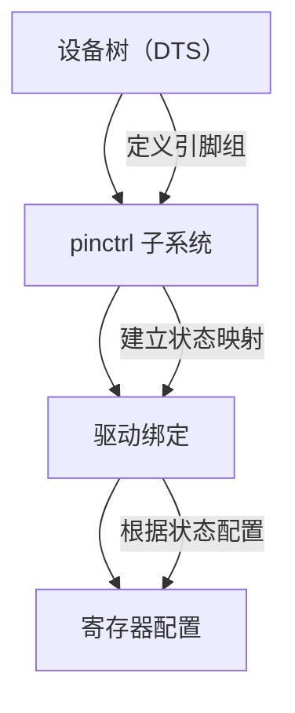

| 层级         | 对应内容             | 示例                         |
| ------------ | -------------------- | ---------------------------- |
| **控制器层** | SoC 的引脚控制器节点 | `iomuxc`、`pinctrl@020e0000` |
| **配置层**   | 某组引脚配置节点     | `pinctrl_uart1_default`      |
| **设备层**   | 外设节点引用配置     | `uart1: serial@02020000`     |

------

## 1.3_语法详解与使用语义

### 1.3.1_pinctrl-names_定义状态集合(名字空间)

**语法：**

```dts
pinctrl-names = "default", "sleep", "idle";
```

**作用：**
 定义设备的**引脚状态集合**，每个名字表示设备在某种运行阶段要使用的引脚配置。

| 名称        | 含义     | 使用场景                                  |
| ----------- | -------- | ----------------------------------------- |
| `"default"` | 默认状态 | 设备初始化或运行时使用的主配置            |
| `"sleep"`   | 睡眠状态 | 系统 suspend 前切换此状态（释放电气资源） |
| `"idle"`    | 空闲状态 | 设备空闲但未关闭时使用的引脚配置          |

**内核行为：**
 解析时为每个状态创建一个 `struct pinctrl_state`。
 当驱动调用 `pinctrl_select_state(dev, state)` 时，系统就会找到这个名字对应的引脚组。

------

### 1.3.2_pinctrl-0,_pinctrl-1,_…_状态到配置的绑定

**语法：**

```dts
pinctrl-0 = <&pinctrl_uart1_default>;
pinctrl-1 = <&pinctrl_uart1_sleep>;
```

**作用：**
 建立状态名与实际引脚配置的绑定关系。
 它引用控制器子节点（通过 `phandle`）。

**绑定规则：**

- `pinctrl-0` 对应 `pinctrl-names` 中第一个字符串 `"default"`；

- `pinctrl-1` 对应第二个字符串 `"sleep"`；

- 一条状态可引用多个组，例如：

  ```dts
  pinctrl-0 = <&uart1_tx &uart1_rx>;
  ```

  → 同时应用多个引脚组。

**使用场景：**
 在驱动里可以主动切换状态：

```c
pinctrl = devm_pinctrl_get(&pdev->dev);
state = pinctrl_lookup_state(pinctrl, "sleep");
pinctrl_select_state(pinctrl, state);
```

比如：

- Wi-Fi 芯片进入待机 → 切换 `"sleep"`；
- 屏幕进入关闭 → 切换 `"idle"`；
- 电机恢复工作 → 切回 `"default"`。

**内核结构对应：**

```c
struct pinctrl_state {
	const char *name;          // "default", "sleep"...
	struct pinctrl_map **maps; // 引用的配置表
};
```

------

### 1.3.3_控制器节点与_#pinctrl-cells_参数格式定义

**语法：**

```dts
pinctrl: pinctrl@020e0000 {
    compatible = "fsl,imx6ul-iomuxc";
    reg = <0x020e0000 0x4000>;
    #pinctrl-cells = <2>;
};
```

**作用：**
 告诉内核“引用我时，phandle 后面要跟几个参数”。

- 若 `#pinctrl-cells = <0>`：引用只需 `<&pinctrl_label>`
- 若 `#pinctrl-cells = <2>`：引用需 `<&pinctrl_label arg0 arg1>`，含义由厂商定义（如 pad 编号、配置值）。

**使用场景：**

- NXP i.MX 系列用 2 个单元：复用寄存器编号 + 配置值；
- Rockchip 用 1 个单元：引脚号；
- Allwinner 用 3 个单元：bank、pin、function。

------

### 1.3.4_fsl,pins_/_rockchip,pins_引脚组配置数组

**语法：**

```dts
pinctrl_uart1_default: uart1grp {
    fsl,pins = <
        MX6UL_PAD_UART1_TX_DATA__UART1_DCE_TX 0x1b0b1
        MX6UL_PAD_UART1_RX_DATA__UART1_DCE_RX 0x1b0b1
    >;
};
```

**作用：**
 声明引脚复用（pinmux）和配置（pinconf）组合。
 每一行对应一个引脚的复用及电气参数。

| 宏名                                    | 含义                         | 来源                    |
| --------------------------------------- | ---------------------------- | ----------------------- |
| `MX6UL_PAD_UART1_TX_DATA__UART1_DCE_TX` | 表示 TX 引脚复用为 UART 功能 | 来自 `imx6ul-pinfunc.h` |
| `0x1b0b1`                               | 寄存器配置值                 | 表示上拉/开漏/驱动能力  |

**使用场景：**
 如果你希望 UART1 能发送数据，就必须把对应引脚复用为 UART 模式。
 否则它仍保持 GPIO 模式。

**数据结构映射：**

```c
struct pinctrl_map {
	const char *group;      // uart1grp
	const char *function;   // UART1_DCE_TX
	struct pinctrl_dev *pctldev; // 控制器
};
```

------

### 1.3.5_bias-*_drive-strength_等电气配置属性

**语法：**

```dts
pinctrl_led: ledgrp {
    pins = "GPIO1_IO03";
    bias-pull-up;
    drive-strength = <4>;
};
```

**作用：**
 描述电气特性（电平驱动能力、上拉/下拉、电气模式）。

| 属性                   | 含义          | 等价寄存器操作     |
| ---------------------- | ------------- | ------------------ |
| `bias-disable`         | 禁用上拉/下拉 | PULL 关闭          |
| `bias-pull-up`         | 启用上拉      | 上拉电阻使能       |
| `drive-strength = <4>` | 设置驱动强度  | 输出电流能力 4mA   |
| `slew-rate = <1>`      | 上升沿速度    | 设置慢速或快速转换 |

**使用场景：**
 例如 LED 引脚要求大电流，I2C SDA/SCL 要弱上拉，CAN_TX 需高速转换，均可在此配置。

------

## 1.4_DTS_to_数据结构映射总览表

| DTS 属性                   | 对应结构体             | 字段                 | 含义           |
| -------------------------- | ---------------------- | -------------------- | -------------- |
| `pinctrl-names`            | `struct pinctrl_state` | `name`               | 状态名         |
| `pinctrl-0` / `pinctrl-1`  | `struct pinctrl_state` | `maps[]`             | 状态对应引脚组 |
| `#pinctrl-cells`           | `struct pinctrl_dev`   | `desc->npins`        | 参数格式控制   |
| `fsl,pins`                 | `struct pinctrl_map`   | `group` / `function` | 复用关系       |
| `bias-*`, `drive-strength` | `pinconf_ops`          | —                    | 电气配置       |

------

## 1.5_实战_UART_与_LED_的组合场景

### 1.5.1_UART(多状态)

```dts
uart1: serial@02020000 {
    compatible = "fsl,imx6ul-uart";
    pinctrl-names = "default", "sleep";
    pinctrl-0 = <&pinctrl_uart1_default>;
    pinctrl-1 = <&pinctrl_uart1_sleep>;
};
```

> 启动阶段使用 `default`，
>  休眠时内核自动切换到 `sleep`，释放 UART 引脚，避免功耗。

------

### 1.5.2_LED(单状态)

```dts
led@0 {
    compatible = "imx6ull-led";
    gpios = <&gpio1 3 GPIO_ACTIVE_LOW>;
    pinctrl-names = "default";
    pinctrl-0 = <&pinctrl_led>;
};
```

> 当驱动加载时，内核执行：

```c
pinctrl_select_state(pinctrl, "default");
```

→ GPIO1_IO03 被配置为输出模式，驱动可直接操作它点亮 LED。

------

## 1.6_验证与调试

| 方法         | 命令                                                         | 说明                   |
| ------------ | ------------------------------------------------------------ | ---------------------- |
| 编译期检查   | `make dtbs_check`                                            | 校验 YAML 语法与兼容性 |
| 查看引脚状态 | `cat /sys/kernel/debug/pinctrl/*/pinmux-pins`                | 查看复用状态           |
| 动态切换状态 | `echo sleep > /sys/kernel/debug/pinctrl/serial@02020000/pinmux-select` | 验证状态切换           |
| 查看配置参数 | `cat /sys/kernel/debug/pinctrl/*/pinconf-pins`               | 查看电气特性           |

------

## 1.7_小结

| 关键点                                                 | 说明                         |
| ------------------------------------------------------ | ---------------------------- |
| `pinctrl-names` 定义设备的运行状态集合                 | 告诉内核有哪些引脚状态可用   |
| `pinctrl-<index>` 将状态与引脚配置绑定                 | 设备运行时根据状态切换配置   |
| 控制器节点通过 `#pinctrl-cells` 定义参数格式           | 不同厂商语法差异由此决定     |
| 子节点如 `fsl,pins` / `rockchip,pins` 指定具体复用配置 | 实际写入硬件寄存器的内容     |
| 驱动通过 `pinctrl_select_state()` 动态切换引脚状态     | 实现低功耗、复用、多功能切换 |

------

# 第2章_pinctrl_控制器节点语法详解

> 主题：深入讲解 **控制器节点（controller node）** 的语法、参数格式与其在内核结构体中的映射关系。
>  目标：让读者理解 “控制器节点定义了什么、#pinctrl-cells 为什么重要、厂商语法差异体现在哪”。

------

## 2.1_主题引入_控制器节点的本质

**控制器节点（pinctrl controller node）** 是设备树中所有引脚配置的根。
 它描述的不是某个外设，而是 SoC 芯片上**引脚复用硬件的寄存器块**。

每个 SoC 都会包含一个负责引脚切换的 IP 模块（如 i.MX 的 IOMUXC、Rockchip 的 GRF、Allwinner 的 PIO）。
 Linux pinctrl 子系统通过这个节点知道：

1. 这个控制器负责哪些引脚；
2. 每个引脚的参数格式；
3. 如何配置它们（function、bias、drive 等）。

------

## 2.2_典型控制器节点语法结构

以 i.MX6ULL 为例：

```dts
pinctrl: pinctrl@020e0000 {
    compatible = "fsl,imx6ul-iomuxc";
    reg = <0x020e0000 0x4000>;
    #address-cells = <1>;
    #size-cells = <0>;
    #pinctrl-cells = <2>;

    pinctrl_uart1_default: uart1grp {
        fsl,pins = <
            MX6UL_PAD_UART1_TX_DATA__UART1_DCE_TX  0x1b0b1
            MX6UL_PAD_UART1_RX_DATA__UART1_DCE_RX  0x1b0b1
        >;
    };
};
```

------

### 2.2.1_compatible

**作用：** 告诉内核该控制器使用哪种厂商驱动解析。

- 内核会查找匹配的驱动文件，例如：
  - `"fsl,imx6ul-iomuxc"` → `drivers/pinctrl/freescale/pinctrl-imx6ul.c`
  - `"rockchip,rk3568-pinctrl"` → `drivers/pinctrl/rockchip/pinctrl-rk3568.c`
- 驱动注册时调用 `pinctrl_register()`，生成一个 `struct pinctrl_dev`。

**结构映射：**

```c
struct pinctrl_dev {
    struct device *dev;         // 对应的控制器设备节点
    struct pinctrl_desc *desc;  // 控制器描述符，包含 npins/ops 等
};
```

------

### 2.2.2_reg

**作用：** 定义寄存器的物理地址和长度。
 驱动使用 `devm_ioremap_resource()` 将其映射到虚拟地址。

- 示例：`reg = <0x020e0000 0x4000>;`
   表示此 pinctrl 控制器的寄存器块起始于 0x020E0000，长度 16KB。
- 若省略 `reg`，驱动无法访问 IOMUX 控制寄存器，编译不会报错但运行时初始化失败。

------

### 2.2.3_#pinctrl-cells

**作用：** 决定 **phandle** 引用时的参数个数。

| 值    | 含义               | 示例                   | 使用场景                       |
| ----- | ------------------ | ---------------------- | ------------------------------ |
| `<0>` | 不带参数           | `<&pinctrl_a>`         | 控制器自己定义 pin 名字        |
| `<1>` | 一个附加参数       | `<&pinctrl_a 3>`       | 参数可能是 pin ID              |
| `<2>` | 两个参数（最常见） | `<&pinctrl_a PAD_CFG>` | i.MX 定义复用 + 电气配置       |
| `<3>` | 三个参数           | `<&pio 1 3 1>`         | Allwinner: bank, pin, function |

**驱动解析函数：**

```c
static int imx_pmx_dt_node_to_map(struct pinctrl_dev *pctldev,
                                  struct device_node *np)
{
    const __be32 *list = of_get_property(np, "fsl,pins", &size);
    ...
}
```

→ 根据 `#pinctrl-cells` 决定 `list` 中每组数据的步进。

> **不写会怎样？**
>
> - `dtc` 不会报错，但 `of_xlate()` 无法正确解析，导致引脚配置全失效。

------

### 2.2.4_#address-cells_/_#size-cells

**作用：** 定义子节点中地址格式，常规固定值。
 一般 pinctrl 控制器不使用分段寻址，因此：

```dts
#address-cells = <1>;
#size-cells = <0>;
```

表示每个子节点的地址只需一个单元，不使用区间长度。

------

## 2.3_控制器子节点(引脚组节点)

控制器下的每个子节点代表一组“可被外设引用的引脚状态配置”。

### 2.3.1_常见写法

#### (1)_NXP_i.MX6ULL

```dts
pinctrl_uart1_default: uart1grp {
    fsl,pins = <
        MX6UL_PAD_UART1_TX_DATA__UART1_DCE_TX  0x1b0b1
        MX6UL_PAD_UART1_RX_DATA__UART1_DCE_RX  0x1b0b1
    >;
};
```

- `fsl,pins` 是 NXP 定义的属性；
- 每行一对值：`PAD_FUNC` + `CONFIG_VAL`。

#### (2)_Rockchip_RK3568

```dts
uart2m0_xfer: uart2m0-xfer {
    rockchip,pins = <
        1 16 1 &pcfg_pull_up   /* GPIO1_B0, mux UART2_TX */
        1 17 1 &pcfg_pull_up   /* GPIO1_B1, mux UART2_RX */
    >;
};
```

- 第 1、2、3 个数字分别是 bank、pin、mux；
- `&pcfg_pull_up` 是电气配置结构体的引用。

#### (3)_Allwinner_A100

```dts
uart2_pins: uart2-pins {
    pins = "PB0", "PB1";
    function = "uart2";
    bias-pull-up;
    drive-strength = <10>;
};
```

- 直接使用字符串声明引脚；
- 兼容 Linux 通用 `pinctrl-bindings.txt`。

------

### 2.3.2_属性详解

| 属性                              | 含义                   | 是否厂商特定 | 示例           |
| --------------------------------- | ---------------------- | ------------ | -------------- |
| `fsl,pins`                        | NXP 自定义 pin 表      | ✅            | i.MX           |
| `rockchip,pins`                   | Rockchip pin 表        | ✅            | RK356x         |
| `pins`                            | 通用写法               | ❌            | Allwinner / TI |
| `function`                        | 指定功能，如 `"uart2"` | ❌            | 通用           |
| `groups`                          | 指定预定义组名         | ❌            | 通用           |
| `bias-pull-up` / `drive-strength` | 电气配置属性           | ❌            | 通用           |

------

## 2.4_从_DTS_到内核的结构映射

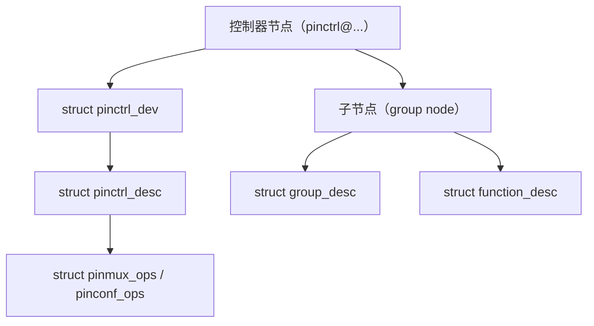

| DTS 节点                    | 内核结构体                     | 说明                     |
| --------------------------- | ------------------------------ | ------------------------ |
| 控制器节点                  | `pinctrl_dev`                  | 控制器实例               |
| `compatible`                | 驱动匹配 → 注册 desc           | 描述控制器特性           |
| 子节点                      | `group_desc` + `function_desc` | 每组引脚功能与配置       |
| `fsl,pins` / `pins`         | group 描述                     | 含引脚号、配置寄存器偏移 |
| `bias-*` / `drive-strength` | conf_ops                       | 通过 `pinconf_ops` 应用  |

------

## 2.5_应用场景_控制器节点的真实作用

| 场景                  | 控制器节点负责的部分                             |
| --------------------- | ------------------------------------------------ |
| UART/I2C/SPI 功能复用 | 告诉内核哪组引脚能复用为该功能                   |
| GPIO 控制             | 提供 GPIO bank 与 pin 的编号映射                 |
| 低功耗挂起            | 提供 sleep 状态下的引脚配置                      |
| 启动时初始化          | 设备 probe 前 pinctrl 核心通过控制器节点加载配置 |

如果不定义控制器节点或其子节点：

- 设备侧的 `pinctrl-0` 无法找到引用；
- 外设驱动 probe 时 `pinctrl_get()` 失败；
- 所有功能引脚退回到默认复用状态（GPIO 模式），导致设备失效。

------

## 2.6_调试与验证

| 检查项              | 命令                                               | 说明                     |
| ------------------- | -------------------------------------------------- | ------------------------ |
| 查看控制器注册      | `cat /sys/kernel/debug/pinctrl/*/info`             | 查看每个控制器名称       |
| 查看引脚表          | `cat /sys/kernel/debug/pinctrl/*/pins`             | 所有可控引脚             |
| 查看 group/function | `cat /sys/kernel/debug/pinctrl/*/pinmux-functions` | 已定义复用功能           |
| 验证配置            | `cat /sys/kernel/debug/pinctrl/*/pinconf-pins`     | 验证 bias / drive 等参数 |

------

## 2.7_小结

| 关键点                                     | 内容                                                    |
| ------------------------------------------ | ------------------------------------------------------- |
| **控制器节点是引脚复用系统的根**           | 决定整个 SoC 如何识别引脚配置                           |
| **`#pinctrl-cells` 定义 phandle 参数格式** | 决定外设节点如何引用控制器                              |
| **厂商自定义属性决定配置语法**             | 如 NXP 的 `fsl,pins`、Rockchip 的 `rockchip,pins`       |
| **子节点对应引脚组**                       | 每组配置 function + pin + config                        |
| **内核注册结构体链：**                     | `pinctrl_dev → pinctrl_desc → group_desc/function_desc` |


------

# 第3章_引脚复用(Pinmux)语法详解

> 主题：讲清 `function`、`groups`、`pins` 三大核心属性的语法、语义、作用、场景与内核对应结构。
>  示例平台：**NXP i.MX6ULL**（UART1 外设引脚复用）。

------

## 3.1_主题引入_为什么要有_pinmux_机制

SoC 中的每个引脚通常可承担多种功能：

| 引脚       | 可复用功能                 |
| ---------- | -------------------------- |
| GPIO1_IO03 | GPIO / UART1_TX / PWM_OUT  |
| GPIO1_IO04 | GPIO / UART1_RX / ENET_MDC |

若系统想让 UART 工作，必须先把这些引脚复用到 UART 功能，否则信号仍停留在 GPIO 模式。
 **pinmux 的意义**：

> 让设备树提前声明“某些引脚要切换到哪个功能”，内核在 probe 时一次性配置好寄存器。

------

## 3.2_完整示例_UART1_复用配置

下面是一个**可直接放入 imx6ull.dts 的完整示例**，演示 UART1 从 GPIO 模式切换到串口功能。

```dts
/ {
    pinctrl: pinctrl@020e0000 {
        compatible = "fsl,imx6ul-iomuxc";
        reg = <0x020e0000 0x4000>;
        #address-cells = <1>;
        #size-cells = <0>;
        #pinctrl-cells = <2>;

        /* === 1. 定义 UART1 的默认引脚复用组 === */
        pinctrl_uart1_default: uart1grp {
            fsl,pins = <
                MX6UL_PAD_UART1_TX_DATA__UART1_DCE_TX 0x1b0b1
                MX6UL_PAD_UART1_RX_DATA__UART1_DCE_RX 0x1b0b1
            >;
        };
    };

    /* === 2. 外设节点引用 pinctrl === */
    uart1: serial@02020000 {
        compatible = "fsl,imx6ul-uart", "fsl,imx-uart";
        reg = <0x02020000 0x4000>;
        pinctrl-names = "default";
        pinctrl-0 = <&pinctrl_uart1_default>;
        status = "okay";
    };
};
```

运行效果：

- 系统启动后，`UART1_TX` 和 `UART1_RX` 引脚被自动切换为串口功能；
- `/dev/ttymxc0` 设备可正常使用。

------

## 3.3_语法分层解析

| 层级     | 节点/属性               | 功能描述                 |
| -------- | ----------------------- | ------------------------ |
| 控制器层 | `pinctrl@020e0000`      | 定义整个 IOMUXC 控制器   |
| 组定义层 | `pinctrl_uart1_default` | 指定一组引脚复用为 UART1 |
| 外设层   | `uart1: serial@...`     | 外设节点引用该组引脚配置 |

------

## 3.4_function_指定外设功能模式

**通用语法（非 i.MX 特定）**

```dts
pins = "PB0", "PB1";
function = "uart2";
```

**在 i.MX6ULL 中**被宏替代为：

```dts
MX6UL_PAD_UART1_TX_DATA__UART1_DCE_TX
```

📖 **语义：**

- 告诉控制器“这组 pad 要切换为 UART1 功能”。
- 对应驱动层的 `struct function_desc.name` 字段。

💡 **使用场景：**

- 串口通信：`function = "uart1"`
- I²C 接口：`function = "i2c1"`
- SPI 接口：`function = "spi0"`

🚫 **若不写：**

- 引脚保持默认 GPIO 状态；

- 设备驱动在 probe 时无法与硬件连通；

- 内核打印：

  ```
  pinctrl-imx: failed to apply settings: function not specified
  ```

🧩 **结构体映射：**

```c
struct function_desc {
    const char *name;            // "uart1"
    const char **groups;         // 包含哪些组
    unsigned ngroups;
};
```

------

## 3.5_groups_功能对应的引脚组

**语法：**

```dts
groups = "uart1_grp";
function = "uart1";
```

📖 **语义：**

- `groups` 声明该功能涉及的**引脚集合**；
- 每个组在驱动中预定义，如 `uart1_tx_grp` 、`uart1_rx_grp` 。

💡 **作用：**
 将多根引脚打包为一个可统一切换的逻辑单元。
 例如：

```c
UART1_TX(GPIO1_IO16)
UART1_RX(GPIO1_IO17)
```

被注册为一个 group。

🚫 **若不写：**

- 控制器驱动找不到匹配组；

- 出现错误：

  ```
  pinctrl-imx: unknown group "uart1_grp"
  ```

🧩 **结构体映射：**

```c
struct group_desc {
    const char *name;       // "uart1_grp"
    const unsigned *pins;   // 引脚号数组
    unsigned npins;
};
```

------

## 3.6_pins_直接声明引脚(通用方式)

适用于 Allwinner / TI 等控制器：

```dts
pins = "PB0", "PB1";
function = "uart2";
bias-pull-up;
```

📖 **语义：**

- 用字符串方式直接列出引脚名称；
- 更直观，但依赖控制器驱动能识别这些字符串。

💡 **场景：**

- 小型 MCU 或 GPIO 命名统一的 SoC；
- 易读性强，适合教学或通用驱动。

🧩 **结构体映射：**
 DTS 解析后，驱动将每个字符串匹配到 `struct pin_desc.name` 并生成 `group_desc`。

------

## 3.7_示例解析_UART1_完整路径

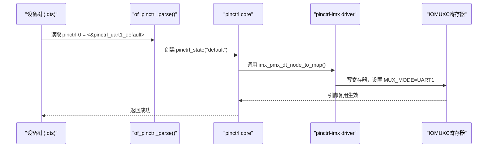

------

## 3.8_驱动层结构映射全景

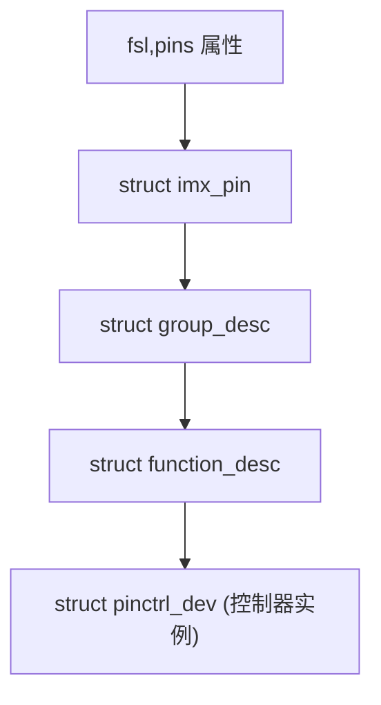

| 层级     | 结构体          | 主要字段                              | 对应 DTS 属性 |
| -------- | --------------- | ------------------------------------- | ------------- |
| 引脚配置 | `imx_pin`       | mux_reg, conf_reg, input_reg, mux_val | `fsl,pins`    |
| 引脚组   | `group_desc`    | name, pins[]                          | `groups`      |
| 功能描述 | `function_desc` | name, groups[]                        | `function`    |
| 控制器   | `pinctrl_dev`   | desc, pmxops                          | 控制器节点    |

------

## 3.9_验证_查看_UART1_的引脚复用状态

```bash
# 查看已注册的控制器
cat /sys/kernel/debug/pinctrl/*/info

# 查看所有功能
cat /sys/kernel/debug/pinctrl/*/pinmux-functions

# 查看 group 与引脚绑定
cat /sys/kernel/debug/pinctrl/*/pinmux-groups

# 查看实际复用情况
cat /sys/kernel/debug/pinctrl/*/pinmux-pins
```

输出示例：

```
function uart1 group uart1_grp: pins 16 17
pin 16 (UART1_TX) set to uart1
pin 17 (UART1_RX) set to uart1
```

------

## 3.10_小结

| 关键属性                     | 作用                                                         | 若省略后果                  |
| ---------------------------- | ------------------------------------------------------------ | --------------------------- |
| `function`                   | 指定外设功能模式（决定 MUX_MODE 值）                         | 引脚留在默认 GPIO 模式      |
| `groups`                     | 声明该功能涉及的引脚集合                                     | 驱动找不到匹配 group → 报错 |
| `pins`                       | 直接声明具体引脚                                             | 控制器需支持字符串解析      |
| `fsl,pins` / `rockchip,pins` | 厂商特定批量配置语法                                         | 解析错误或寄存器未写入      |
| **核心价值**                 | **让外设和物理引脚建立逻辑绑定关系**，驱动只需操作设备名，不再关心引脚编号 | —                           |

------


# 第4章_引脚配置(Pinconf)语法详解

> 本章承接第 3 章的 UART1 复用示例，讲解 **引脚电气特性配置（Pin Configuration, pinconf）** 的语法与在内核中的对应关系。
>  重点：**bias-pull-up / drive-strength / slew-rate / output-high 等属性的真实作用、写法、场景与结构体映射。**

------

## 4.1_主题引入_Pinmux_解决_连线_Pinconf_解决_电气

pinmux 解决了“这个引脚连到哪个外设”，
 但**还没解决电气特性**——例如：

- 输出驱动强度够不够？
- 上拉/下拉是否开启？
- 信号上升沿是否太快？

这些都由 **Pinconf** 负责。

举例：
 在 i.MX6ULL 的 UART1 中，TX 引脚可设置为：

- `drive-strength = <4>` 输出能力 4 mA；
- `bias-pull-up` 上拉电阻开启；
- `slew-rate = <0>` 信号变化速度慢；

------

## 4.2_完整示例_在_UART1_中添加_Pinconf_属性

```dts
/ {
    pinctrl: pinctrl@020e0000 {
        compatible = "fsl,imx6ul-iomuxc";
        reg = <0x020e0000 0x4000>;
        #address-cells = <1>;
        #size-cells = <0>;
        #pinctrl-cells = <2>;

        /* === UART1 默认引脚组，含电气配置 === */
        pinctrl_uart1_default: uart1grp {
            fsl,pins = <
                MX6UL_PAD_UART1_TX_DATA__UART1_DCE_TX  0x1b0b1
                MX6UL_PAD_UART1_RX_DATA__UART1_DCE_RX  0x1b0b1
            >;
            bias-pull-up;
            drive-strength = <4>;
            slew-rate = <1>;
        };
    };

    uart1: serial@02020000 {
        compatible = "fsl,imx6ul-uart", "fsl,imx-uart";
        reg = <0x02020000 0x4000>;
        pinctrl-names = "default";
        pinctrl-0 = <&pinctrl_uart1_default>;
        status = "okay";
    };
};
```

🔹 启动后，UART1 TX/RX 引脚被自动设置为：

- 上拉；
- 驱动强度 4 mA；
- 快速转换模式。

------

## 4.3_常用_Pinconf_属性语法与含义

| 属性                         | 作用               | 示例值              | 场景                            |
| ---------------------------- | ------------------ | ------------------- | ------------------------------- |
| `bias-disable`               | 禁用上下拉         | —                   | 输出信号口                      |
| `bias-pull-up`               | 开启上拉电阻       | —                   | I²C SDA/SCL                     |
| `bias-pull-down`             | 开启下拉电阻       | —                   | 输入检测脚                      |
| `drive-strength`             | 设置驱动能力（mA） | `<4>` `<8>`         | LED、UART TX 等需高驱动能力端口 |
| `slew-rate`                  | 设置信号上升沿速度 | `<0>` 慢 / `<1>` 快 | 控制噪声与功耗                  |
| `input-enable`               | 允许输入           | —                   | 数据采集脚                      |
| `output-high` / `output-low` | 固定输出电平       | —                   | 初始化复位脚或片选脚            |

📖 **解释：**
 这些属性的语法全部来自内核文档：
 `Documentation/devicetree/bindings/pinctrl/pinctrl-bindings.txt`

------

## 4.4_作用_与_使用场景_对照解析

### 4.4.1_bias-*_系列_控制上拉下拉

```dts
bias-pull-up;
```

**作用：**

- 打开内部上拉电阻；
- 保证引脚在未驱动时保持逻辑 1。

**场景：**

- I²C 总线（SDA/SCL）；
- 按键输入；
- UART RX 端（防止悬空）。

**不写会怎样：**

- 默认状态由硬件决定；
- 若引脚悬空，可能反复触发中断或输入抖动。

------

### 4.4.2_drive-strength_输出电流能力

```dts
drive-strength = <8>;
```

**作用：**
 设置引脚输出能力（单位 mA），影响电平稳定性与信号速度。

**场景：**

- LED 或 PWM 高电流输出；
- 高速 UART 或 SPI 信号。

**不写：**

- 使用默认 2 mA 或 4 mA；
- 过弱时信号上升慢、波形畸变。

**结构映射：**

```c
struct pinconf_ops {
    int (*pin_config_set)(struct pinctrl_dev *pctldev,
                          unsigned pin, unsigned long config);
};
```

驱动在此函数中写入寄存器实现配置。

------

### 4.4.3_slew-rate_上升沿/下降沿速度

```dts
slew-rate = <1>;
```

**作用：**
 控制信号边沿速度以平衡噪声与功耗。

| 值   | 含义                   |
| ---- | ---------------------- |
| `0`  | 慢速，干扰小，功耗低   |
| `1`  | 快速，延迟小，功耗略高 |

**场景：**

- I²C 或 GPIO 输入建议慢速；
- SPI 或 UART 高速通信建议快速。

------

### 4.4.4_output-high_/_output-low

```dts
output-high;
```

**作用：**

- 初始化阶段将引脚输出固定电平；
- 常用于复位信号（RESET_N）、片选（CS）。

**不写：**

- 默认输入状态，若硬件依赖初始电平则设备无法上电。

------

## 4.5_Pinconf_在内核中的数据结构映射

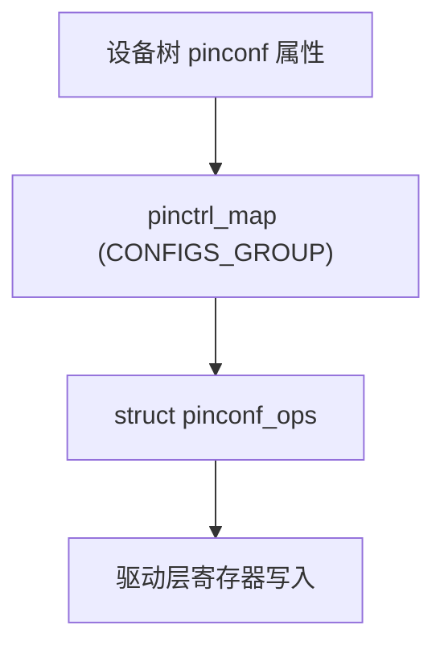

| 层级           | 结构体                | 说明                                |
| -------------- | --------------------- | ----------------------------------- |
| `pinconf` 属性 | 通过 pinctrl_map 解析 | 类型为 `PIN_MAP_TYPE_CONFIGS_GROUP` |
| 驱动接口       | `pinconf_ops` 结构体  | 提供 set/get 函数                   |
| 控制器实例     | `pinctrl_dev`         | 绑定 confops 操作集                 |

**示例：NXP i.MX6ULL 驱动内部**

```c
static const struct pinconf_ops imx_pinconf_ops = {
    .pin_config_get = imx_pinconf_get,
    .pin_config_set = imx_pinconf_set,
};
```

`imx_pinconf_set()` 根据 DTS 传入的配置值修改 IOMUXC 寄存器。

------

## 4.6_运行时验证

```bash
# 查看 pinconf 属性支持项
cat /sys/kernel/debug/pinctrl/*/pinconf-config

# 查看当前引脚配置值
cat /sys/kernel/debug/pinctrl/*/pinconf-pins

# 例如输出：
pin 16 (UART1_TX) bias-pull-up drive-strength=8 slew-rate=1
```

------

## 4.7_总结与思维导图

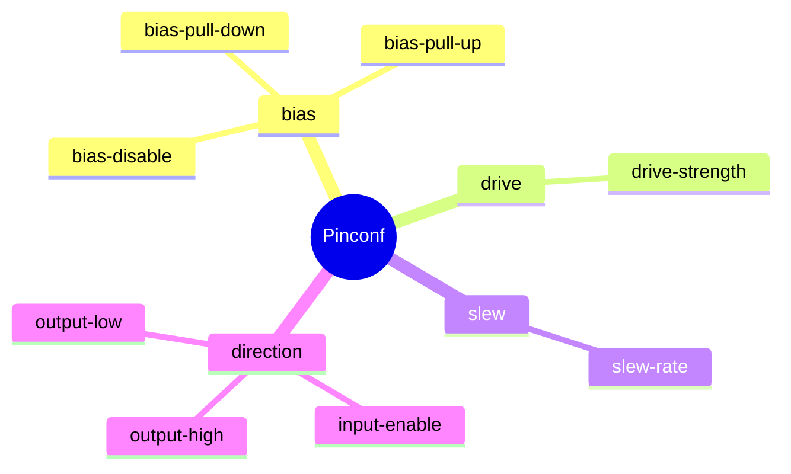

| 属性类别     | 主要功能         | 驱动映射接口        |
| ------------ | ---------------- | ------------------- |
| Bias 类      | 控制上下拉       | pinconf_ops → set() |
| Drive 类     | 控制驱动电流     | 同上                |
| Slew 类      | 控制边沿速度     | 同上                |
| Direction 类 | 控制输入输出电平 | 同上                |

------

## 4.8_小结

| 要点                                                         | 内容 |
| ------------------------------------------------------------ | ---- |
| Pinmux 决定“连线”，Pinconf 决定“电气特性”。                  |      |
| 常见属性：bias-pull-up、bias-disable、drive-strength、slew-rate、output-high 等。 |      |
| 每个属性对应驱动中的 `pinconf_ops` 接口，由控制器驱动负责写寄存器。 |      |
| 不写 Pinconf 属性通常不会报错，但设备可能因电气特性错误而不稳定或失效。 |      |
| 验证路径：`/sys/kernel/debug/pinctrl/*/pinconf-pins` 可直接查看当前配置。 |      |

------


# 第5章_设备节点中引用_pinctrl_的语法与状态切换机制

> **主题：** 讲解设备节点中 `pinctrl-names`、`pinctrl-0`、`pinctrl-1` 等属性的**语法、运行逻辑、驱动交互**与**低功耗切换机制**。
>  **目标：** 让读者理解 “为什么每个设备都要写 `pinctrl-names` / `pinctrl-0`”，“它在驱动什么时候被调用”，“状态切换到底改变了什么”。

------

## 5.1_主题引入_设备如何_引用_引脚配置

在前几章中，我们定义了控制器节点（pinctrl@...）和引脚配置（pinctrl_led、pinctrl_uart1_default 等）。
 但仅仅定义这些还不够 —— **谁来用它？**

外设节点需要显式告诉内核：

> “当我被初始化或休眠时，请使用哪组引脚配置。”

这个绑定关系就是通过以下属性实现的：

```dts
pinctrl-names = "default", "sleep";
pinctrl-0 = <&pinctrl_uart1_default>;
pinctrl-1 = <&pinctrl_uart1_sleep>;
```

------

## 5.2_语法总览与逻辑关系

| 属性                        | 类型         | 含义                                |
| --------------------------- | ------------ | ----------------------------------- |
| `pinctrl-names`             | 字符串数组   | 定义状态名称（有序）                |
| `pinctrl-0`、`pinctrl-1`... | phandle 引用 | 每个状态对应的引脚配置列表          |
| `status`                    | 字符串       | 是否启用设备（“okay” / “disabled”） |

这三者配合的核心逻辑是：

> `pinctrl-names` 按顺序定义状态名，
>  `pinctrl-0`、`pinctrl-1`... 分别引用具体配置节点。

例如：

```dts
uart1: serial@02020000 {
    pinctrl-names = "default", "sleep";
    pinctrl-0 = <&pinctrl_uart1_default>;
    pinctrl-1 = <&pinctrl_uart1_sleep>;
};
```

对应关系如下：

| 状态名      | 索引        | 引脚配置                   |
| ----------- | ----------- | -------------------------- |
| `"default"` | `pinctrl-0` | `<&pinctrl_uart1_default>` |
| `"sleep"`   | `pinctrl-1` | `<&pinctrl_uart1_sleep>`   |

------

## 5.3_具体示例_UART1_的两种状态配置

```dts
pinctrl: pinctrl@020e0000 {
    compatible = "fsl,imx6ul-iomuxc";
    reg = <0x020e0000 0x4000>;
    #pinctrl-cells = <2>;

    /* === 正常运行状态 === */
    pinctrl_uart1_default: uart1grp {
        fsl,pins = <
            MX6UL_PAD_UART1_TX_DATA__UART1_DCE_TX  0x1b0b1
            MX6UL_PAD_UART1_RX_DATA__UART1_DCE_RX  0x1b0b1
        >;
        bias-pull-up;
        drive-strength = <4>;
    };

    /* === 低功耗睡眠状态 === */
    pinctrl_uart1_sleep: uart1slpgrp {
        fsl,pins = <
            MX6UL_PAD_UART1_TX_DATA__GPIO1_IO16 0x1b0b0
            MX6UL_PAD_UART1_RX_DATA__GPIO1_IO17 0x1b0b0
        >;
        bias-pull-down;
        drive-strength = <2>;
    };
};

/* === 外设引用 === */
uart1: serial@02020000 {
    compatible = "fsl,imx6ul-uart";
    reg = <0x02020000 0x4000>;
    pinctrl-names = "default", "sleep";
    pinctrl-0 = <&pinctrl_uart1_default>;
    pinctrl-1 = <&pinctrl_uart1_sleep>;
    status = "okay";
};
```

📖 启动时：
 内核自动选择 `"default"` 状态，UART1 引脚复用为串口功能。

💤 进入休眠（`suspend`）时：
 驱动切换到 `"sleep"` 状态，引脚退回 GPIO 模式，关闭上拉、减弱驱动强度以降低功耗。

------

## 5.4_属性详细讲解与实际意义

### 5.4.1_pinctrl-names

**语法：**

```dts
pinctrl-names = "default", "sleep", "idle";
```

**作用：**
 定义**状态名集合**。
 内核会为每个状态创建一个 `struct pinctrl_state`，驱动可在不同阶段选择不同状态。

**使用场景：**

| 状态名      | 含义         | 典型用途                  |
| ----------- | ------------ | ------------------------- |
| `"default"` | 正常运行状态 | 外设初始化后使用          |
| `"sleep"`   | 睡眠状态     | suspend / resume 流程使用 |
| `"idle"`    | 空闲状态     | 外设暂不使用但保持供电    |
| `"init"`    | 初始化阶段   | 早期引脚配置（少见）      |

**驱动调用逻辑：**

```c
pinctrl = devm_pinctrl_get(&pdev->dev);
state = pinctrl_lookup_state(pinctrl, "sleep");
pinctrl_select_state(pinctrl, state);
```

**不写后果：**

- 内核不会创建 `pinctrl_state`；
- 驱动调用 `pinctrl_get()` 返回 NULL；
- 部分平台 probe 失败。

------

### 5.4.2_pinctrl-<index>

**语法：**

```dts
pinctrl-0 = <&pinctrl_uart1_default>;
pinctrl-1 = <&pinctrl_uart1_sleep>;
```

**作用：**
 建立 `pinctrl-names` 与配置节点的对应关系。

**特征：**

- `<index>` 顺序必须与 `pinctrl-names` 一致；

- 每个 index 可引用多个 phandle；

  ```dts
  pinctrl-1 = <&uart1_sleep &gpio_retain>;
  ```

**结构映射：**

```c
struct pinctrl_state {
    const char *name;           // 状态名
    struct pinctrl_map **maps;  // 引用配置列表
    unsigned num_maps;          // 配置数量
};
```

**不写后果：**

- 即使 `pinctrl-names` 存在，也找不到对应配置；

- 状态被创建为空列表；

- 内核报：

  ```
  pinctrl core: no maps for state "default"
  ```

------

## 5.5_运行机制_从_DTS_到寄存器

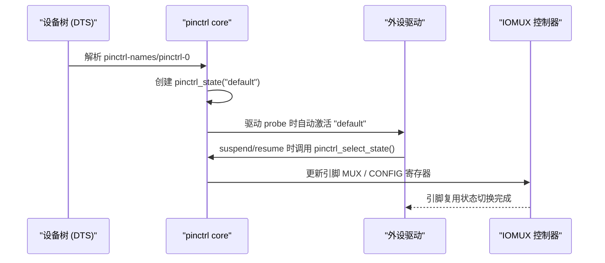

------

## 5.6_驱动层交互代码(以_i.MX_UART_为例)

```c
static int imx_uart_probe(struct platform_device *pdev)
{
    struct pinctrl *pctl;
    struct pinctrl_state *s;

    /* 1. 获取 pinctrl 句柄 */
    pctl = devm_pinctrl_get(&pdev->dev);

    /* 2. 选择 default 状态 */
    s = pinctrl_lookup_state(pctl, "default");
    pinctrl_select_state(pctl, s);

    /* ...初始化 UART 硬件... */
    return 0;
}

static int imx_uart_suspend(struct device *dev)
{
    struct pinctrl *pctl = dev_get_drvdata(dev);
    struct pinctrl_state *s = pinctrl_lookup_state(pctl, "sleep");
    return pinctrl_select_state(pctl, s);
}
```

📖 说明：

- probe 阶段自动切换 `"default"`；
- suspend 阶段切换 `"sleep"`；
- resume 阶段再切回 `"default"`。

------

## 5.7_验证与调试

| 检查内容                | 命令                                                         | 说明                           |
| ----------------------- | ------------------------------------------------------------ | ------------------------------ |
| 查看设备的 pinctrl 状态 | `cat /sys/kernel/debug/pinctrl/*/state`                      | 当前激活状态                   |
| 查看已注册状态          | `cat /sys/kernel/debug/pinctrl/*/states`                     | 显示 `"default"`, `"sleep"` 等 |
| 手动切换状态            | `echo sleep > /sys/kernel/debug/pinctrl/serial@02020000/pinmux-select` | 模拟休眠切换                   |
| 验证寄存器变化          | `devmem 0x020E0068`（或 iomux 地址）                         | 比较前后复用寄存器值           |

------

## 5.8_低功耗切换的实际意义

| 场景             | 切换行为                       | 效果                             |
| ---------------- | ------------------------------ | -------------------------------- |
| **系统 suspend** | 切换至 `"sleep"` 状态          | 引脚释放、关闭上拉、降低驱动强度 |
| **系统 resume**  | 切回 `"default"` 状态          | 恢复外设通信功能                 |
| **外设 idle**    | 可选 `"idle"` 状态             | 暂停信号输出、减少噪声           |
| **GPIO 保持**    | 在 `"sleep"` 状态下复用为 GPIO | 防止引脚漂浮                     |

🧠 **关键理解：**
 `pinctrl-names` + `pinctrl-<index>` 不仅仅是“配置名字”，
 而是系统在运行中用于**动态切换硬件电气状态**的机制。

------

## 5.9_数据结构映射总览

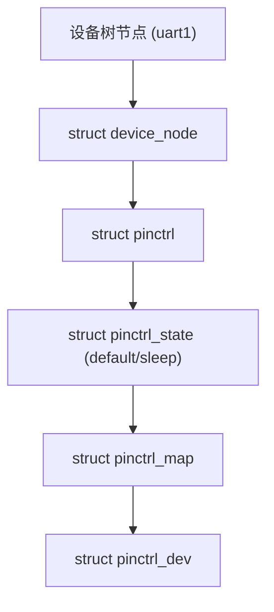

| 层级            | 结构体                      | 说明                 |
| --------------- | --------------------------- | -------------------- |
| `device_node`   | DTS 节点                    | 包含 pinctrl 属性    |
| `pinctrl`       | 管理设备的引脚配置          | 内核创建的控制对象   |
| `pinctrl_state` | 表示各状态（default/sleep） | 存放配置映射         |
| `pinctrl_map`   | 映射表                      | 指向控制器侧配置节点 |
| `pinctrl_dev`   | 控制器实体                  | 最终写寄存器         |

------

## 5.10_小结

| 关键属性          | 含义             | 对应结构                    | 驱动调用                 |
| ----------------- | ---------------- | --------------------------- | ------------------------ |
| `pinctrl-names`   | 定义状态名集合   | `struct pinctrl_state.name` | `pinctrl_lookup_state()` |
| `pinctrl-<index>` | 状态与配置绑定   | `pinctrl_state.maps[]`      | `pinctrl_select_state()` |
| `"default"`       | 上电默认状态     | —                           | probe 时自动使用         |
| `"sleep"`         | 低功耗状态       | —                           | suspend 时切换           |
| `"idle"`          | 空闲状态（可选） | —                           | 空载时切换               |

✅ **核心要点总结：**

- 设备节点通过 `pinctrl-names` + `pinctrl-<index>` 把不同状态绑定到控制器配置；
- 内核启动、挂起、恢复时自动切换状态，实现引脚电气的动态管理；
- 驱动通过 `pinctrl_select_state()` 主动控制引脚状态；
- `/sys/kernel/debug/pinctrl` 是最直观的验证入口。

------


# 第6章_pinctrl_与_GPIO_的关系及语法交叉

> **主题：** 本章讲解设备树中 **pinctrl 与 GPIO 子系统之间的关联语法**，重点是 `gpio-ranges`、`gpio-controller`、`gpio-line-names` 的语法、作用、场景与在内核中的映射关系。
>  **目标：** 让读者理解 —— 为什么 GPIO 节点通常是 pinctrl 控制器的子节点、
>  为什么必须写 `gpio-ranges` 才能让 pinctrl 与 GPIO 框架正确协同工作。

------

## 6.1_主题引入_pinctrl_与_GPIO_的_层次关系

在 ARM SoC 架构中，**GPIO 并不是完全独立的模块**。
 绝大多数 SoC 的 GPIO 控制器都是 **pinctrl 控制器的一部分** 或 **其上层逻辑**：

| SoC 厂商        | 控制结构                                           |
| --------------- | -------------------------------------------------- |
| NXP i.MX6ULL    | GPIO 属于 IOMUXC 子模块                            |
| Rockchip RK3568 | GPIO 与 pinctrl 共用 GRF（General Register Files） |
| Allwinner A100  | GPIO 直接由 PIO 控制器负责，兼具 pinmux 功能       |

因此在设备树中，GPIO 控制器通常被定义为 pinctrl 控制器的 **子节点或并列节点**，两者必须通过语法属性互相关联。

------

## 6.2_完整示例_GPIO_控制器与_pinctrl_的绑定

以 **i.MX6ULL** 平台为例：

```dts
pinctrl: pinctrl@020e0000 {
    compatible = "fsl,imx6ul-iomuxc";
    reg = <0x020e0000 0x4000>;
    #address-cells = <1>;
    #size-cells = <0>;
    #pinctrl-cells = <2>;

    gpio1: gpio@0209c000 {
        compatible = "fsl,imx6ul-gpio";
        reg = <0x0209c000 0x4000>;
        gpio-controller;
        #gpio-cells = <2>;
        gpio-ranges = <&pinctrl 0 0 32>;
    };
};
```

在这个结构中：

| 节点               | 含义                                  |
| ------------------ | ------------------------------------- |
| `pinctrl@020e0000` | 引脚控制器（IOMUXC）                  |
| `gpio@0209c000`    | GPIO 控制器（GPIO1）                  |
| `gpio-ranges`      | 将 pinctrl 的引脚编号映射为 GPIO 编号 |
| `gpio-controller`  | 声明该节点是一个 GPIO 控制器          |

------

## 6.3_gpio-controller_声明_GPIO_控制功能

**语法：**

```dts
gpio-controller;
```

📖 **作用：**
 告诉内核该节点实现了 `struct gpio_chip` 接口，是一个可注册的 GPIO 控制器。

💡 **在驱动中表现为：**

```c
struct gpio_chip {
    const char *label;
    unsigned int ngpio;   // GPIO 数量
    int (*request)(struct gpio_chip *chip, unsigned offset);
    void (*free)(struct gpio_chip *chip, unsigned offset);
    int (*direction_input)(struct gpio_chip *chip, unsigned offset);
    int (*direction_output)(struct gpio_chip *chip, unsigned offset, int value);
};
```

📌 **总结：**

- 没有该属性 → 内核不会识别为 GPIO 控制器；
- 必须与 `#gpio-cells` 搭配出现；
- 通常在 pinctrl 控制器的子节点中声明。

------

## 6.4_#gpio-cells_定义_phandle_参数格式

**语法：**

```dts
#gpio-cells = <2>;
```

📖 **作用：**
 定义其他设备引用 GPIO 时 `<&gpioX ...>` 的参数个数。
 格式通常为：

| 单元索引 | 参数名          | 说明                                   |
| -------- | --------------- | -------------------------------------- |
| 0        | GPIO 编号或偏移 | 指定第几个 GPIO 引脚                   |
| 1        | 极性            | `GPIO_ACTIVE_HIGH` / `GPIO_ACTIVE_LOW` |

📖 **示例：**

```dts
led@0 {
    gpios = <&gpio1 3 GPIO_ACTIVE_LOW>;
};
```

含义：

- 使用 GPIO1 控制器；
- 偏移 3；
- 低电平点亮。

**不写后果：**

- `of_get_named_gpio()` 无法解析；
- `leds-gpio`、`buttons` 等驱动加载失败。

------

## 6.5_gpio-ranges_建立_pinctrl_与_GPIO_的索引映射

**语法：**

```dts
gpio-ranges = <&pinctrl 0 0 32>;
```

📖 **作用：**
 建立 pinctrl 控制器与 GPIO 控制器之间的**引脚编号映射关系**。
 结构为四个单元：

| 单元 | 含义                 |
| ---- | -------------------- |
| 1️⃣    | &pinctrl             |
| 2️⃣    | GPIO 控制器起始编号  |
| 3️⃣    | pinctrl 引脚起始编号 |
| 4️⃣    | 引脚数量             |

📖 **内核解析逻辑：**
 `drivers/pinctrl/pinmux.c`

```c
static int pinctrl_gpio_request(struct gpio_chip *chip, unsigned offset)
{
    // 通过 gpio_ranges 映射到 pin_desc
    struct pin_desc *desc = pin_desc_get(gpio_to_pin(chip, offset));
}
```

💡 **作用场景：**

- 没有 `gpio-ranges` 时，GPIO 与 pinctrl 是孤立的；
- 有 `gpio-ranges` 时，`gpiod_set_value()` 可直接操作 pinmux 层寄存器。

🧩 **形象理解：**


------

## 6.6_gpio-line-names_为引脚命名

**语法：**

```dts
gpio-line-names =
    "LED0", "LED1", "BTN0", "BTN1",
    "UART_TX", "UART_RX", "", "";
```

📖 **作用：**
 为 GPIO 控制器的每一条引脚提供可读名称，
 方便在用户空间工具中识别（例如 `gpioinfo` 命令）。

📖 **使用场景：**

- 调试；
- 硬件标识；
- GPIO 复用映射分析。

🧰 **验证命令：**

```bash
gpioinfo
```

输出示例：

```
gpiochip0 - 32 lines:
        line  0:  "LED0"      "sysfs"  output  active-high
        line  1:  "LED1"      "sysfs"  output  active-high
        line  2:  "BTN0"      "input"  active-low
        line  3:  "BTN1"      "input"  active-low
```

------

## 6.7_示例_GPIO_+_Pinmux_+_Pinconf_三层联合配置

以下示例展示如何将 **GPIO1_IO03** 配置为 LED 控制输出，
 并通过 pinctrl 设置上拉与驱动强度。

```dts
/ {
    pinctrl: pinctrl@020e0000 {
        compatible = "fsl,imx6ul-iomuxc";
        reg = <0x020e0000 0x4000>;
        #pinctrl-cells = <2>;

        pinctrl_led: ledgrp {
            fsl,pins = <
                MX6UL_PAD_GPIO1_IO03__GPIO1_IO03 0x10b0
            >;
            bias-pull-up;
            drive-strength = <8>;
        };
    };

    gpio1: gpio@0209c000 {
        compatible = "fsl,imx6ul-gpio";
        reg = <0x0209c000 0x4000>;
        gpio-controller;
        #gpio-cells = <2>;
        gpio-ranges = <&pinctrl 0 0 32>;
        gpio-line-names = "LED0", "", "", "";
    };

    led@0 {
        compatible = "gpio-leds";
        pinctrl-names = "default";
        pinctrl-0 = <&pinctrl_led>;
        gpios = <&gpio1 3 GPIO_ACTIVE_LOW>;
        label = "status_led";
    };
};
```

📖 **解释：**

1. `pinctrl_led` 定义了引脚的复用与电气特性；
2. `gpio1` 提供 GPIO 控制能力；
3. `gpio-ranges` 连接两者，使 `<&gpio1 3>` 对应到 pinctrl 的第 3 号引脚；
4. `led@0` 使用 `gpio-leds` 驱动，实现用户可控 LED。

------

## 6.8_内核数据结构映射关系

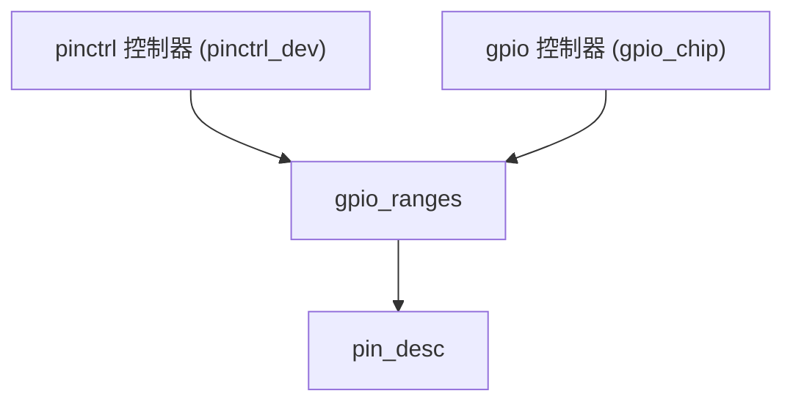

| 层级          | 结构体         | 含义                     |
| ------------- | -------------- | ------------------------ |
| `pinctrl_dev` | pin 控制器对象 | 管理所有引脚             |
| `gpio_chip`   | GPIO 控制器    | 提供输入输出接口         |
| `gpio_ranges` | 映射表         | 连接 pin 与 GPIO         |
| `pin_desc`    | 引脚描述       | 存储状态、复用、电气属性 |

------

## 6.9_调试与验证

| 验证项                    | 命令                                          | 说明             |
| ------------------------- | --------------------------------------------- | ---------------- |
| 查看 GPIO 与 pinctrl 映射 | `cat /sys/kernel/debug/pinctrl/*/gpio-ranges` | 显示映射关系     |
| 查看 GPIO 名称            | `gpioinfo`                                    | 查看 line 名称   |
| 查看引脚复用状态          | `cat /sys/kernel/debug/pinctrl/*/pinmux-pins` | 验证复用是否成功 |
| 控制 GPIO 输出            | `gpioset gpiochip0 3=1`                       | 点亮 LED         |
| 验证状态                  | `cat /sys/class/leds/status_led/trigger`      | 查看触发模式     |

------

## 6.10_小结

| 概念              | 作用                                                         | 对应关系                          |
| ----------------- | ------------------------------------------------------------ | --------------------------------- |
| `gpio-controller` | 声明此节点为 GPIO 控制器                                     | 创建 `struct gpio_chip`           |
| `#gpio-cells`     | 定义 GPIO 引用格式                                           | 控制 `<&gpioX N flags>`           |
| `gpio-ranges`     | 建立 GPIO ↔ Pinctrl 映射                                     | 保证统一编号与控制                |
| `gpio-line-names` | 为 GPIO 命名                                                 | 提高可读性与调试性                |
| **关系核心**      | GPIO 是 pinctrl 的逻辑子集，pinctrl 负责复用、电气；GPIO 负责输入输出。 | 两者通过 `gpio-ranges` 完成协同。 |

✅ **总结性理解：**

> pinctrl 定义“这个引脚是什么功能、什么电气特性”，
>  GPIO 决定“这个引脚现在要输出 0 还是 1”。
>  它们并非竞争关系，而是**上下层协作关系**。

------


# 第7章_厂商特定_pinctrl_语法与差异对比

> **主题：** 本章系统分析三大主流 SoC（NXP i.MX、Rockchip、Allwinner）在设备树中定义 pinctrl 节点时的**语法差异与内部逻辑对应关系**。
>  **目标：** 帮助读者理解每个厂商为什么要设计自己的 `fsl,pins`、`rockchip,pins`、`pins` 格式，以及这些语法与底层寄存器操作的对应方式。

------

## 7.1_主题引入_通用框架与厂商扩展的关系

Linux 内核的 pinctrl 框架提供统一的抽象接口：

- **通用层（Generic Layer）**：
   由内核核心（`drivers/pinctrl/core.c`）提供；
   它定义了 `struct pinctrl_dev`、`struct pinmux_ops`、`struct pinconf_ops` 等接口。
- **厂商驱动层（Vendor Layer）**：
   各 SoC 厂商根据自己的寄存器布局实现对应的驱动解析函数。

因此 DTS 的差异主要源自：

> “同样的逻辑语义 → 不同的寄存器结构 → 不同的语法封装”。

------

## 7.2_三种语法形式总览对比

| 厂商                         | 关键属性            | 示例                                              | 解析函数                          | 所属文件                                      |
| ---------------------------- | ------------------- | ------------------------------------------------- | --------------------------------- | --------------------------------------------- |
| **NXP (i.MX6/7/8)**          | `fsl,pins`          | `MX6UL_PAD_UART1_TX_DATA__UART1_DCE_TX 0x1b0b1`   | `imx_pmx_dt_node_to_map()`        | `drivers/pinctrl/freescale/pinctrl-imx.c`     |
| **Rockchip (RK33xx/35xx)**   | `rockchip,pins`     | `1 16 1 &pcfg_pull_up`                            | `rockchip_pinctrl_parse_groups()` | `drivers/pinctrl/rockchip/pinctrl-rockchip.c` |
| **Allwinner (sun8i / A100)** | `pins` + `function` | `"PB0", "PB1"; function = "uart2"; bias-pull-up;` | `sunxi_pinctrl_parse_pins()`      | `drivers/pinctrl/sunxi/pinctrl-sunxi.c`       |

------

## 7.3_NXP_i.MX_系列_fsl,pins

### 7.3.1_示例

```dts
pinctrl_uart1_default: uart1grp {
    fsl,pins = <
        MX6UL_PAD_UART1_TX_DATA__UART1_DCE_TX  0x1b0b1
        MX6UL_PAD_UART1_RX_DATA__UART1_DCE_RX  0x1b0b1
    >;
};
```

### 7.3.2_语法说明

每个 `<pad func conf>` 对应一组配置：

| 宏                                      | 含义                                                         |
| --------------------------------------- | ------------------------------------------------------------ |
| `MX6UL_PAD_UART1_TX_DATA__UART1_DCE_TX` | **复用定义宏**：展开后包含 mux_reg、conf_reg、input_reg、mux_val |
| `0x1b0b1`                               | **电气配置值**（pull-up、slew、drive 等位组合）              |

### 7.3.3_驱动解析逻辑

```c
static int imx_pmx_dt_node_to_map(...)
{
    const __be32 *list = of_get_property(np, "fsl,pins", &size);
    for (i = 0; i < size; i += 2)
        imx_pin_conf_parse(list[i], list[i+1]);
}
```

### 7.3.4_寄存器结构示意

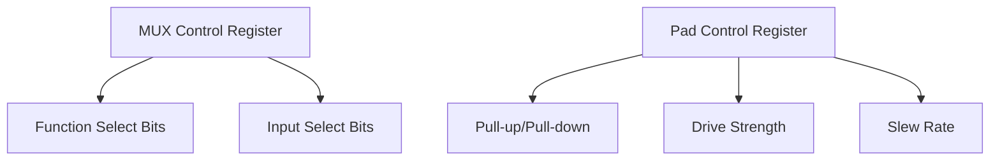

> 在 i.MX 平台上，每个 PAD 通常对应两个寄存器：
>
> - MUX 控制寄存器（选择功能）；
> - PAD 控制寄存器（电气特性）。

------

## 7.4_Rockchip_系列_rockchip,pins

### 7.4.1_示例

```dts
uart2m0_xfer: uart2m0-xfer {
    rockchip,pins = <
        1 16 1 &pcfg_pull_up   /* GPIO1_B0 UART2_TX */
        1 17 1 &pcfg_pull_up   /* GPIO1_B1 UART2_RX */
    >;
};
```

### 7.4.2_语法结构

| 参数序号 | 含义                        |
| -------- | --------------------------- |
| 1️⃣        | GPIO bank 编号（1 = GPIO1） |
| 2️⃣        | GPIO 号（16 = B0）          |
| 3️⃣        | 复用功能号（1 = UART）      |
| 4️⃣        | 电气配置引用（phandle）     |

### 7.4.3_电气配置节点

```dts
pcfg_pull_up: pcfg-pull-up {
    bias-pull-up;
    drive-strength = <8>;
    slew-rate = <1>;
};
```

Rockchip 将电气参数单独抽象为 **配置节点**，以便多个 group 重用。

### 7.4.4_驱动映射关系

```c
struct rockchip_pin_bank {
    void __iomem *reg_base;
    struct rockchip_pin_group *groups;
    ...
};
```

> `rockchip,pins` → 每组 `<bank pin mux>` 被注册为 `pin_group`
>  `&pcfg_pull_up` → 绑定到对应 `pin_config` 结构。

------

## 7.5_Allwinner_系列_pins_+_function

### 7.5.1_示例

```dts
uart2_pins: uart2-pins {
    pins = "PB0", "PB1";
    function = "uart2";
    bias-pull-up;
    drive-strength = <10>;
};
```

### 7.5.2_语法特征

- **纯字符串形式**，无需宏；
- 由驱动根据引脚名解析成编号；
- 支持通用属性（bias / drive / slew）。

### 7.5.3_解析函数

```c
sunxi_pinctrl_parse_pins(...)
{
    of_property_read_string_array(np, "pins", pins, npins);
    of_property_read_string(np, "function", &func);
}
```

### 7.5.4_寄存器结构(简化)

| 位域  | 含义            |
| ----- | --------------- |
| [2:0] | 功能选择（MUX） |
| [5:3] | 上下拉设置      |
| [7:6] | 驱动强度        |
| [8]   | 输入使能        |

Allwinner 采用**一寄存器多字段**方式，每个引脚只有一个 32-bit 寄存器，不再区分 MUX/CONF。

------

## 7.6_三者差异汇总表

| 特征        | **NXP (i.MX)**             | **Rockchip (RK)**       | **Allwinner (sunxi)**         |
| ----------- | -------------------------- | ----------------------- | ----------------------------- |
| 复用属性    | `fsl,pins` 宏批量定义      | `<bank pin mux>` 数组   | `"pins" + "function"` 字符串  |
| 电气配置    | 第二个数值（如 `0x1b0b1`） | 独立配置节点（phandle） | 内联属性（如 `bias-pull-up`） |
| MUX 与 CONF | 分离寄存器                 | 分离寄存器              | 合并寄存器                    |
| 可读性      | 中等（宏形式）             | 一般（数字形式）        | 高（字符串形式）              |
| 代码重用性  | 强，宏集中定义             | 中，引用可复用节点      | 高，每组独立声明              |
| DTS 大小    | 较小                       | 稍大                    | 稍大                          |
| 调试便利性  | 高（官方宏清晰）           | 中（需查 bank 映射）    | 高（直接可读）                |

------

## 7.7_示例对照_同一组_UART2_引脚配置

| 平台                | DTS 写法                                              |
| ------------------- | ----------------------------------------------------- |
| **NXP i.MX6ULL**    | `MX6UL_PAD_UART2_TX_DATA__UART2_DCE_TX 0x1b0b1`       |
| **Rockchip RK3568** | `1 16 1 &pcfg_pull_up`                                |
| **Allwinner A100**  | `pins = "PB0","PB1"; function="uart2"; bias-pull-up;` |

> 三种写法语义相同：**将 TX/RX 两个引脚复用为 UART2 功能并启用上拉**。
>  区别只在于厂商寄存器布局不同。

------

## 7.8_驱动框架统一性_pinctrl_子系统的抽象保证

虽然各厂商 DTS 语法不同，但都通过同一个接口注册：

```c
struct pinctrl_desc {
    const char *name;
    const struct pinmux_ops *pmxops;
    const struct pinconf_ops *confops;
    const struct pinctrl_pin_desc *pins;
    unsigned npins;
};
```

→ 内核在 probe 时统一调用：

```c
pinctrl_register(&pinctrl_desc, &pdev->dev, drvdata);
```

📖 **这意味着：**

- 不论是 `fsl,pins`、`rockchip,pins` 还是 `pins`；
- 最终都会转化为通用结构体：
  - `struct group_desc`；
  - `struct function_desc`；
  - `struct pinconf_ops`。

------

## 7.9_可视化对照图

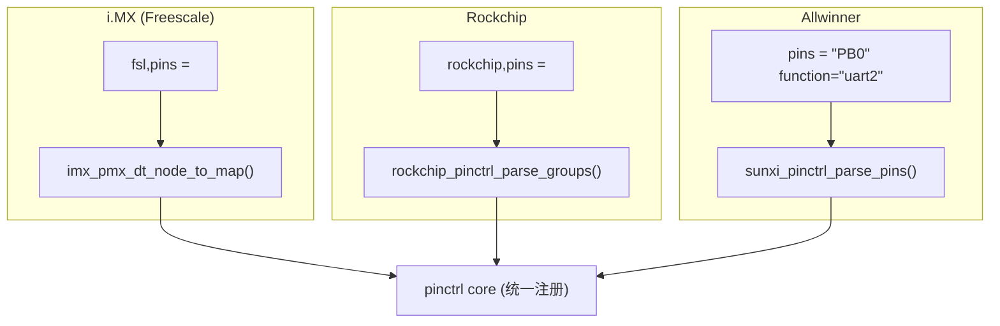

------

## 7.10_小结

| 核心要点                                                     | 内容                                                        |
| ------------------------------------------------------------ | ----------------------------------------------------------- |
| **语法差异来源于硬件寄存器布局不同**。                       | NXP 拆分 MUX/CONF；Rockchip 分 bank；Allwinner 合并寄存器。 |
| **语法层虽不同，但都归一到内核的 pinctrl 框架接口。**        | 最终映射到 `struct pinctrl_desc` 注册结构。                 |
| **通用属性（bias/drive/slew）始终一致。**                    | 兼容 `pinctrl-bindings.txt` 标准。                          |
| **电气配置写法是厂商风格化体现。**                           | 有的用 phandle（Rockchip），有的直接数值（NXP）。           |
| **推荐理解方式：** DTS 的差异是“表层皮肤”，真正的“骨架”是 pinctrl 子系统的统一架构。 |                                                             |

------


# 第8章_pinctrl_驱动解析流程_从设备树到寄存器写入全过程

> **主题：** 详细剖析从设备树 (`.dts`) 中的 pinctrl 节点定义，到内核启动时如何一步步解析节点、创建数据结构、匹配驱动、写入寄存器的完整生命周期。
>  **目标：** 让读者能清晰理解 pinctrl 子系统如何把 DTS 中的“文字配置”转化为硬件寄存器的“电气状态”。

------

## 8.1_主题引入_从_DTS_一行配置_到_硬件一位寄存器

在第 2～7 章中，我们学习了各种语法：

- `pinctrl@...` 控制器节点；
- `fsl,pins` / `rockchip,pins` 等定义；
- `pinctrl-names` / `pinctrl-0` 等状态引用；
- `bias-*` / `drive-strength` 等电气配置。

但这些属性在系统启动时是如何被“消化”的？
 到底是谁去读它们？
 谁去操作寄存器？
 **这正是本章要讲的核心。**

------

## 8.2_总体流程总览

在系统启动阶段，从 **设备树解析 → 控制器注册 → 设备绑定 → 状态应用**
 整个流程可分为五个阶段：

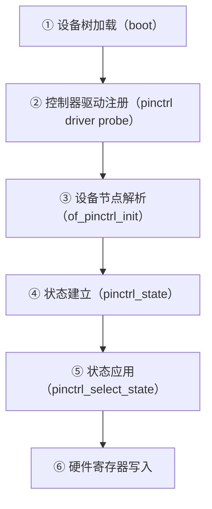

------

## 8.3_阶段①_设备树加载(Boot_阶段)

### 8.3.1_入口点

设备树被加载后，所有节点以 `struct device_node` 形式保存在内核中：

```c
struct device_node {
    const char *name;
    const char *type;
    struct property *properties;    // 属性链表
    struct device_node *parent, *child, *sibling;
};
```

在启动时：

- U-Boot 将 `.dtb` 拷贝到内核内存；
- 内核通过 `unflatten_device_tree()` 展开为内核对象；
- 形成以根节点 `/` 开始的完整节点树。

------

## 8.4_阶段②_控制器驱动注册

pinctrl 的每个控制器（如 i.MX6ULL 的 IOMUXC）都有独立驱动。

以 **NXP i.MX6ULL** 为例：

```c
static const struct of_device_id imx_pinctrl_of_match[] = {
    { .compatible = "fsl,imx6ul-iomuxc", .data = &imx6ul_pinctrl_data },
    { /* sentinel */ }
};
```

驱动入口：

```c
static int imx_pinctrl_probe(struct platform_device *pdev)
{
    // ① 解析设备树属性
    base = devm_platform_ioremap_resource(pdev, 0);

    // ② 注册 pinctrl 控制器
    return devm_pinctrl_register_and_init(&pdev->dev, desc, drvdata, &pctl);
}
```

**注册核心函数：**

```c
int devm_pinctrl_register_and_init(
    struct device *dev,
    const struct pinctrl_desc *desc,
    void *driver_data,
    struct pinctrl_dev **pctldev
);
```

注册结果：生成 `struct pinctrl_dev` 实例，代表整个 IOMUX 控制器。

------

## 8.5_阶段③_设备节点解析(of_pinctrl_init)

当外设节点（如 UART1）被解析时，核心函数 `of_pinctrl_init()` 会被调用：

```c
static int of_pinctrl_init(struct device *dev)
{
    struct device_node *np = dev->of_node;
    struct device_node *pinctrl_np;

    for_each_child_of_node(np, pinctrl_np)
        of_pinctrl_parse_one_pinctrl(dev, pinctrl_np);
}
```

该函数读取：

- `pinctrl-names`
- `pinctrl-0`, `pinctrl-1` ...
- 并建立状态结构。

------

## 8.6_阶段④_状态建立(pinctrl_state)

每个状态（如 `"default"`、`"sleep"`）被封装为：

```c
struct pinctrl_state {
    const char *name;
    struct pinctrl_map **maps;
    unsigned num_maps;
};
```

构建过程由 `pinctrl_dt_to_map()` 完成：

```c
static int pinctrl_dt_to_map(struct pinctrl *p)
{
    // 遍历 pinctrl-0, pinctrl-1...
    // 为每个引用的节点建立映射
    map = pinctrl_dt_node_to_map(np);
}
```

生成 `struct pinctrl_map`：

```c
struct pinctrl_map {
    enum pinctrl_map_type type;    // CONFIGS_GROUP / MUX_GROUP 等
    const char *name;              // 状态名
    const char *group;             // 引脚组名
    const char *function;          // 功能名
};
```

------

## 8.7_阶段⑤_状态应用(pinctrl_select_state)

当驱动 probe 或系统 resume 时，内核执行：

```c
pinctrl_select_state(p, state);
```

内部逻辑：

```c
int pinctrl_select_state(struct pinctrl *p, struct pinctrl_state *state)
{
    for_each_map_in_state(state)
        pinmux_enable_setting(map);
}
```

`pinmux_enable_setting()` → 由厂商驱动实现，用于**操作寄存器**。

------

## 8.8_阶段⑥_硬件寄存器写入(最终落地)

以 i.MX6ULL 为例，`imx_pinconf_set()` 最终执行寄存器写入：

```c
static int imx_pinconf_set(struct pinctrl_dev *pctldev,
                           unsigned pin_id, unsigned long config)
{
    void __iomem *mux_reg = base + pin->mux_reg;
    void __iomem *conf_reg = base + pin->conf_reg;
    writel(pin->mux_val, mux_reg);
    writel(pin->conf_val, conf_reg);
}
```

📖 **此刻硬件层结果：**

- `MUX_CTL` 寄存器选择了功能（如 UART1_TX）；
- `PAD_CTL` 寄存器设置了电气特性（如 Pull-up、Slew、Drive Strength）。

------

## 8.9_整体时序图_从_DTS_到寄存器

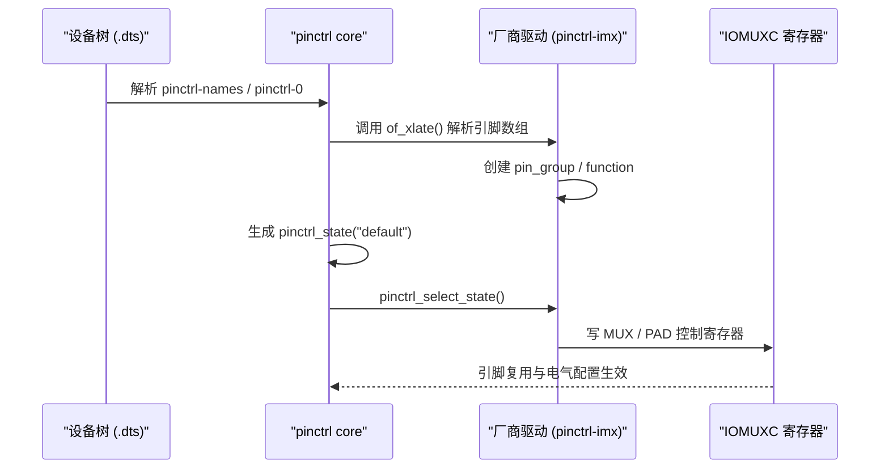

------

## 8.10_调试路径与验证方法

| 层级           | 命令                                               | 验证内容                  |
| -------------- | -------------------------------------------------- | ------------------------- |
| **控制器注册** | `cat /sys/kernel/debug/pinctrl/*/info`             | 确认 pinctrl 控制器已注册 |
| **引脚定义**   | `cat /sys/kernel/debug/pinctrl/*/pins`             | 查看引脚总表              |
| **组与功能**   | `cat /sys/kernel/debug/pinctrl/*/pinmux-functions` | 查看已定义 function       |
| **状态映射**   | `cat /sys/kernel/debug/pinctrl/*/maps`             | 查看状态与组映射          |
| **寄存器值**   | `devmem 0x020E0068`（或 GRF 地址）                 | 验证最终硬件写入值        |

------

## 8.11_关键结构体全景图

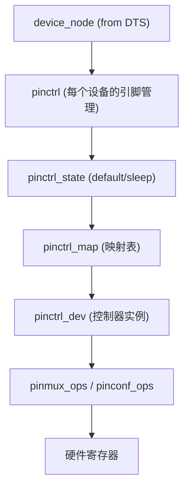

| 结构体                       | 来源                      | 功能                     |
| ---------------------------- | ------------------------- | ------------------------ |
| `device_node`                | DTS                       | 描述节点层级             |
| `pinctrl`                    | 内核创建                  | 每个设备独有的引脚管理器 |
| `pinctrl_state`              | 由 `pinctrl-names` 定义   | 不同运行状态             |
| `pinctrl_map`                | 由 `pinctrl-<index>` 生成 | 绑定 function/group      |
| `pinctrl_dev`                | 驱动注册                  | 控制器实体               |
| `pinmux_ops` / `pinconf_ops` | 厂商实现                  | 实际寄存器访问           |

------

## 8.12_流程总结(核心抽象)

| 阶段         | 内核调用                  | 数据结构        | 厂商钩子                   | 作用         |
| ------------ | ------------------------- | --------------- | -------------------------- | ------------ |
| 设备树加载   | `unflatten_device_tree()` | `device_node`   | —                          | 导入 DTS     |
| 控制器注册   | `pinctrl_register()`      | `pinctrl_dev`   | `pmxops/confops`           | 建立控制器   |
| 设备节点解析 | `of_pinctrl_init()`       | `pinctrl_map`   | —                          | 建立状态映射 |
| 状态创建     | `pinctrl_dt_to_map()`     | `pinctrl_state` | —                          | 关联状态名   |
| 状态切换     | `pinctrl_select_state()`  | —               | `set_mux()` / `set_conf()` | 写入寄存器   |

------

## 8.13_小结

| 层次                                                     | 说明 |
| -------------------------------------------------------- | ---- |
| **上层（设备树）**：定义逻辑关系与配置数据。             |      |
| **中层（pinctrl core）**：负责统一解析、映射、状态管理。 |      |
| **底层（厂商驱动）**：实现具体寄存器读写。               |      |
| **最终（硬件层）**：引脚电气与功能模式被实际配置。       |      |

✅ **一句话总结：**

> “设备树描述了意图，pinctrl 框架建立了规则，厂商驱动完成了执行。”

------


# 第9章_pinctrl_调试与问题定位实战指南

> **主题：** 本章专注于实战调试，讲解开发者在内核驱动开发中如何定位与解决 pinctrl 相关错误。
>  **核心内容：**
>
> - 常见报错与根因分析
> - 调试命令与 `debugfs` 路径
> - 动态切换与寄存器验证方法
> - 典型问题复现与修复方案

------

## 9.1_主题引入_为什么_pinctrl_问题最难调

在 Linux 驱动移植或定制过程中，
 **pinctrl 是最容易出错但最难排查的部分之一。**

原因在于：

1. DTS 属性正确但寄存器未生效；

2. 不同厂商的驱动解析方式不同；

3. 报错信息高度抽象，例如：

   ```
   pinctrl-imx: invalid function
   pinctrl core: failed to apply settings
   ```

要彻底掌握 pinctrl，必须能在实际系统中**看见内部状态与真实寄存器变化**。
 本章从开发者视角总结了一套完整的排查逻辑。

------

## 9.2_常见错误与原因对照表

| 内核日志片段                                     | 可能原因                                     | 解决方法                                      |
| ------------------------------------------------ | -------------------------------------------- | --------------------------------------------- |
| `pinctrl core: failed to lookup state 'default'` | `pinctrl-names` 与 `pinctrl-0` 不匹配        | 确保名称一致、索引正确                        |
| `pinctrl-imx: invalid function`                  | DTS 中 function 名不存在于驱动 function 列表 | 核对驱动 `imx*_functions[]` 定义              |
| `pinctrl core: failed to apply settings`         | DTS 属性无效或冲突                           | 检查 `fsl,pins` 或 `bias-*` 属性合法性        |
| `gpio-ranges missing or invalid`                 | GPIO 控制器未与 pinctrl 建立映射             | 添加 `gpio-ranges = <&pinctrl 0 0 N>;`        |
| `request GPIO failed (-22)`                      | 引脚未被声明为 GPIO 控制器                   | 确保节点含 `gpio-controller` 和 `#gpio-cells` |
| `no maps for state 'sleep'`                      | 未定义对应状态的配置节点                     | 添加 `pinctrl-1` 并命名 `"sleep"`             |

------

## 9.3_DebugFS_最强大的_pinctrl_调试入口

pinctrl 子系统在内核中自动创建了 debugfs 节点：
 `/sys/kernel/debug/pinctrl/`

```bash
# 典型结构
/sys/kernel/debug/pinctrl/
├── pinctrl@020e0000/       # 控制器实例
│   ├── info
│   ├── pins
│   ├── pinmux-pins
│   ├── pinmux-functions
│   ├── pinconf-pins
│   ├── gpio-ranges
│   └── maps
```

------

### 9.3.1_查看控制器信息

```bash
cat /sys/kernel/debug/pinctrl/*/info
```

输出：

```
driver name: pinctrl-imx
owner: module
pin base: 0
number of pins: 150
```

### 9.3.2_查看引脚定义

```bash
cat /sys/kernel/debug/pinctrl/*/pins
```

输出：

```
pin 16 (UART1_TX) 0x020E0068
pin 17 (UART1_RX) 0x020E006C
```

### 9.3.3_查看当前复用状态

```bash
cat /sys/kernel/debug/pinctrl/*/pinmux-pins
```

输出：

```
pin 16 (UART1_TX) function uart1 group uart1_grp
```

### 9.3.4_查看电气配置

```bash
cat /sys/kernel/debug/pinctrl/*/pinconf-pins
```

输出：

```
pin 16 (UART1_TX) bias-pull-up drive-strength=8 slew-rate=1
```

------

## 9.4_动态切换状态验证

### 9.4.1_查看所有状态

```bash
cat /sys/kernel/debug/pinctrl/*/states
```

示例输出：

```
default
sleep
```

### 9.4.2_手动切换状态

```bash
echo sleep > /sys/kernel/debug/pinctrl/serial@02020000/state
```

切换回默认状态：

```bash
echo default > /sys/kernel/debug/pinctrl/serial@02020000/state
```

**说明：**
 这条命令相当于在驱动中执行：

```c
pinctrl_select_state(pctl, pinctrl_lookup_state(pctl, "sleep"));
```

------

## 9.5_验证寄存器写入效果

### 9.5.1_查找寄存器地址

在 i.MX6ULL 中：

- `MUX_CTL` 寄存器基址：`0x020E0068`
- `PAD_CTL` 寄存器基址：`0x020E02F4`

### 9.5.2_使用_devmem_直接读写

```bash
# 读取复用寄存器
devmem 0x020E0068
# 输出电气配置
devmem 0x020E02F4
```

比较 `"default"` 与 `"sleep"` 状态切换前后的差值：

```bash
# 切换 sleep
echo sleep > /sys/kernel/debug/pinctrl/serial@02020000/state
# 再次读取
devmem 0x020E02F4
```

------

## 9.6_典型问题复现与修复

### 9.6.1_案例一_invalid_function

**现象：**

```
pinctrl-imx: invalid function uart3
```

**原因：**

- DTS 中 `function = "uart3"`；
- 驱动中只定义了 `"uart1"`, `"uart2"`。

**解决：**

- 查看源码 `drivers/pinctrl/freescale/pinctrl-imx6ul.c`
- 添加相应 group/function 定义；
- 或确认使用的 pad 宏对应正确外设。

------

### 9.6.2_案例二_gpio-ranges_missing

**现象：**

```
pinctrl core: GPIO ranges missing for gpio@0209c000
```

**原因：**
 GPIO 控制器与 pinctrl 未建立映射。

**修复：**

```dts
gpio-ranges = <&pinctrl 0 0 32>;
```

------

### 9.6.3_案例三_failed_to_apply_settings

**现象：**

```
pinctrl core: failed to apply settings for state 'default'
```

**原因：**

- DTS 中 group/function 不匹配；
- 或电气配置值超出硬件支持范围。

**调试思路：**

1. 打印 `/sys/kernel/debug/pinctrl/*/maps` 查看映射；
2. 确认 `group_desc` 与 `function_desc` 一致；
3. 重新比对寄存器数值。

------

### 9.6.4_案例四_电气配置未生效

**现象：**
 引脚能输出，但波形过弱或漂浮。

**验证步骤：**

1. `cat /sys/kernel/debug/pinctrl/*/pinconf-pins`；
2. 若缺少 `drive-strength` 字段 → DTS 属性未解析；
3. 检查驱动的 `pinconf_ops` 是否实现 `pin_config_set()`。

------

## 9.7_pinctrl_日志调试选项

启用内核日志调试：

```bash
echo "file drivers/pinctrl/* +p" > /sys/kernel/debug/dynamic_debug/control
```

输出示例：

```
pinctrl core: applied pinctrl state default
pinctrl-imx: set pin 16 mux=UART1_TX conf=0x1b0b1
```

> 💡 提示：
>  `dynamic_debug` 可针对模块动态启用详细日志，非常适合调试 pinctrl。

------

## 9.8_内核函数级调用路径(开发者视角)

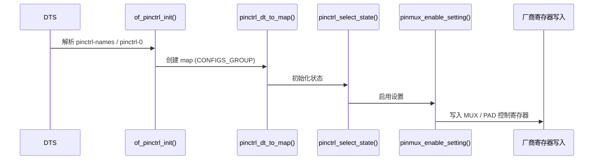

------

## 9.9_pinctrl_调试_checklist(建议打印保存)

| 调试目标         | 工具 / 命令                                    | 检查点             |
| ---------------- | ---------------------------------------------- | ------------------ |
| 控制器是否注册   | `cat /sys/kernel/debug/pinctrl/*/info`         | 驱动名正确         |
| 状态是否存在     | `cat /sys/kernel/debug/pinctrl/*/states`       | 含 “default/sleep” |
| 引脚是否复用     | `cat /sys/kernel/debug/pinctrl/*/pinmux-pins`  | 输出正确 function  |
| 电气参数是否生效 | `cat /sys/kernel/debug/pinctrl/*/pinconf-pins` | 有 drive-strength  |
| GPIO 是否映射    | `cat /sys/kernel/debug/pinctrl/*/gpio-ranges`  | 显示 range 关系    |
| 寄存器值正确     | `devmem 0xADDR`                                | 与 DTS 配置一致    |
| 日志是否异常     | `dmesg                                         | grep pinctrl`      |

------

## 9.10_小结

| 分类         | 核心要点                                                     |
| ------------ | ------------------------------------------------------------ |
| **错误类型** | 主要集中于 function/group 不匹配、状态缺失、电气配置未解析   |
| **排查路径** | DTS → debugfs → 寄存器 → 驱动代码                            |
| **验证工具** | `debugfs` + `devmem` + `dynamic_debug`                       |
| **修复思路** | 对应关系一一比对：控制器节点 → 引脚组 → 功能映射 → 状态调用  |
| **经验准则** | 若报错信息模糊，先看 `/sys/kernel/debug/pinctrl`，再看厂商驱动。 |

✅ **总结性理解：**

> 调试 pinctrl 的关键不是“猜配置”，
>  而是要学会**读出系统当前状态** —— 看引脚、看组、看函数、看寄存器。

------


# 第10章_pinctrl_在_suspend/resume_与_Runtime_PM_中的自动状态管理机制

> **主题：** 本章讲解内核如何在**系统挂起（suspend）**、**唤醒（resume）**、**运行时节能（Runtime PM）**中自动切换 `pinctrl-names` 中定义的 `"default"`、`"sleep"`、`"idle"` 等状态。
>  **目标：**
>
> - 弄清楚自动切换是如何触发的；
> - 驱动如何配合 pinctrl 框架进行电气管理；
> - 如何自定义和调试这些状态切换行为。

------

## 10.1_主题引入_pinctrl_不是_静态配置

在传统嵌入式系统中，pinmux 配置通常只在启动阶段写一次就完。
 但在 Linux 中，**pinctrl 是动态的**：

| 系统状态            | 需要的引脚模式                       |
| ------------------- | ------------------------------------ |
| 正常运行（default） | 外设启用，功能复用                   |
| 挂起休眠（sleep）   | 外设关闭，引脚置为 GPIO 下拉或高阻态 |
| 空闲待机（idle）    | 保持最小驱动功耗                     |
| 唤醒（resume）      | 恢复复用与电气特性                   |

Linux 内核通过 **pinctrl core + PM 通知链** 完成这些状态切换。

------

## 10.2_设备树状态定义回顾

典型 DTS 定义如下：

```dts
uart1: serial@02020000 {
    compatible = "fsl,imx6ul-uart";
    reg = <0x02020000 0x4000>;
    pinctrl-names = "default", "sleep";
    pinctrl-0 = <&pinctrl_uart1_default>;
    pinctrl-1 = <&pinctrl_uart1_sleep>;
    status = "okay";
};
```

| 状态名      | 含义       | 触发时机                  |
| ----------- | ---------- | ------------------------- |
| `"default"` | 设备工作态 | probe / resume            |
| `"sleep"`   | 低功耗态   | suspend / runtime_suspend |

------

## 10.3_核心调用关系总览

pinctrl 状态切换在 PM 框架中通过以下调用链完成：

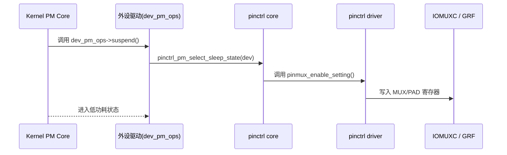

------

## 10.4_状态切换核心函数

### 10.4.1_pinctrl_pm_select_default_state()

```c
void pinctrl_pm_select_default_state(struct device *dev)
{
    struct pinctrl *p = dev_get_pinctrl(dev);
    if (p)
        pinctrl_select_state(p, p->default_state);
}
```

- 在设备 probe 或 resume 阶段被调用；
- 自动切换 `"default"` 状态。

### 10.4.2_pinctrl_pm_select_sleep_state()

```c
void pinctrl_pm_select_sleep_state(struct device *dev)
{
    struct pinctrl *p = dev_get_pinctrl(dev);
    if (p)
        pinctrl_select_state(p, p->sleep_state);
}
```

- 在 suspend 阶段调用；
- 将所有外设引脚切换到 `"sleep"` 状态；
- 若不存在该状态则静默跳过。

------

## 10.5_驱动框架中的整合

在设备驱动中（如 UART、I²C、SPI 等），通常不需要显式写入 pinctrl 调用，
 只要驱动注册了标准的 PM 回调，pinctrl 就会自动介入。

### 10.5.1_以_UART_驱动为例

```c
static const struct dev_pm_ops imx_uart_pm_ops = {
    .suspend = imx_uart_suspend,
    .resume  = imx_uart_resume,
};

static int imx_uart_suspend(struct device *dev)
{
    pinctrl_pm_select_sleep_state(dev);
    disable_irq(uart->irq);
    return 0;
}

static int imx_uart_resume(struct device *dev)
{
    pinctrl_pm_select_default_state(dev);
    enable_irq(uart->irq);
    return 0;
}
```

> 💡 若驱动未主动调用，系统 PM 框架也会在 `dpm_suspend_late()` 阶段自动处理。

------

## 10.6_Runtime_PM_支持(动态电源管理)

Runtime PM 是一种**非系统休眠场景**的动态功耗管理机制：
 例如 UART 在无人使用时自动关电、关闭引脚驱动。

### 10.6.1_调用链

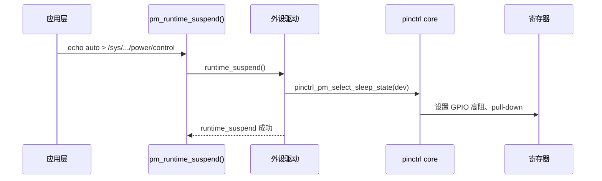

### 10.6.2_示例

```c
static int uart_runtime_suspend(struct device *dev)
{
    pinctrl_pm_select_sleep_state(dev);
    clk_disable(uart->clk);
    return 0;
}

static int uart_runtime_resume(struct device *dev)
{
    clk_enable(uart->clk);
    pinctrl_pm_select_default_state(dev);
    return 0;
}
```

------

## 10.7_典型状态切换时序

以 **i.MX6ULL + UART1** 为例：

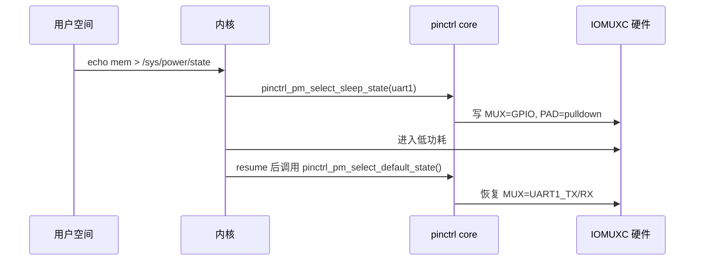

------

## 10.8_可视化寄存器变化(以_i.MX6ULL_为例)

| 阶段    | MUX 寄存器      | PAD 寄存器                     | 引脚状态 |
| ------- | --------------- | ------------------------------ | -------- |
| default | UART1_TX 功能号 | 0x1b0b1（pull-up + drive 4mA） | 串口输出 |
| sleep   | GPIO 模式       | 0x1b0b0（pull-down）           | 低功耗   |
| resume  | UART1_TX 功能号 | 0x1b0b1                        | 恢复通信 |

使用 `devmem` 即可实时验证：

```bash
devmem 0x020E0068  # MUX_CTL
devmem 0x020E02F4  # PAD_CTL
```

------

## 10.9_驱动与_pinctrl_的解耦优势

| 场景            | pinctrl 自动行为      | 驱动是否需要参与 |
| --------------- | --------------------- | ---------------- |
| 设备 probe      | 应用 `"default"` 状态 | 否（自动）       |
| 系统 suspend    | 应用 `"sleep"` 状态   | 否（自动）       |
| 系统 resume     | 切回 `"default"`      | 否（自动）       |
| Runtime suspend | 应用 `"sleep"`        | 可选             |
| Runtime resume  | 切回 `"default"`      | 可选             |

✅ 驱动可以不关心具体引脚，只要设备树状态配置正确。

------

## 10.10_调试_suspend/resume_切换

### 10.10.1_查看当前状态

```bash
cat /sys/kernel/debug/pinctrl/serial@02020000/state
```

### 10.10.2_手动触发挂起

```bash
echo mem > /sys/power/state
```

然后再次查看：

```bash
cat /sys/kernel/debug/pinctrl/serial@02020000/state
# 输出应为：sleep
```

### 10.10.3_唤醒后验证

```bash
cat /sys/kernel/debug/pinctrl/serial@02020000/state
# 输出应为：default
```

------

## 10.11_自定义状态扩展

有时，除了 `"default"` 与 `"sleep"`，
 还需要额外的 `"idle"`、`"low-speed"` 等中间状态：

```dts
pinctrl-names = "default", "idle", "sleep";
pinctrl-0 = <&uart1_highspeed>;
pinctrl-1 = <&uart1_idle>;
pinctrl-2 = <&uart1_sleep>;
```

在驱动中：

```c
s_idle = pinctrl_lookup_state(pctl, "idle");
pinctrl_select_state(pctl, s_idle);
```

**应用场景：**

- SPI 动态切换高速 / 低速；
- LCD 控制器关闭背光但保持时钟；
- WiFi 模块断电前先高阻状态。

------

## 10.12_pinctrl_与_Device_PM_Framework_的关系


📖 **关键点：**

- `pinctrl_pm_select_*_state()` 是 pinctrl 与设备电源管理之间的桥梁；
- 任何外设驱动只要使用标准 PM 接口，都会自动触发引脚状态切换。

------

## 10.13_常见问题与解决方案

| 问题                 | 原因                                  | 解决方法                                                     |
| -------------------- | ------------------------------------- | ------------------------------------------------------------ |
| 唤醒后外设无响应     | `"sleep"` 状态未恢复 `"default"`      | 检查驱动 resume 中是否调用 pinctrl_pm_select_default_state() |
| 系统 suspend 卡死    | 某状态未定义                          | DTS 添加 `"sleep"` 状态节点                                  |
| runtime_suspend 无效 | 驱动未启用 Runtime PM                 | 确认 `pm_runtime_enable(dev)` 已调用                         |
| 电气配置未改变       | `"sleep"` 与 `"default"` 寄存器值相同 | 分别定义不同 PAD 参数（如 pull-down）                        |

------

## 10.14_小结

| 层级         | 内容                                                         |
| ------------ | ------------------------------------------------------------ |
| **状态定义** | DTS 中用 `pinctrl-names` + `pinctrl-<index>` 明确列出各状态  |
| **系统行为** | 内核在 suspend/resume/runtime 阶段自动切换状态               |
| **关键接口** | `pinctrl_pm_select_default_state()`、`pinctrl_pm_select_sleep_state()` |
| **驱动职责** | 可完全交由 PM 框架处理，也可手动控制                         |
| **调试手段** | `/sys/kernel/debug/pinctrl/*/state` + `devmem` 验证寄存器    |
| **核心理解** | “default 用于工作，sleep 用于省电，PM 负责切换”              |

✅ **总结性结论：**

> pinctrl 子系统不仅定义引脚配置，更是 **Linux 电源管理的一部分**。
>  它让引脚在不同电源状态下自动切换，从而实现真正的系统级低功耗。

------


# 第11章_pinctrl_与中断(interrupts)子系统的协作机制

> **主题：** 解析当一个 GPIO 引脚既作为普通 I/O，又可复用为中断输入时，
>  pinctrl 与中断控制器（IRQ subsystem）如何协同工作。
>  **目标：**
>
> - 理解设备树中 `interrupt-parent`、`#interrupt-cells`、`interrupts` 的语法与含义；
> - 掌握 GPIO 与 IRQ 的绑定过程；
> - 理解 pinctrl 配置如何影响中断触发；
> - 给出完整的 DTS + 驱动示例。

------

## 11.1_主题引入_GPIO_与_IRQ_的关系

在多数 SoC（如 i.MX、RK、Allwinner）中，一个 GPIO 引脚既能：

- 作为通用输出（例如控制 LED），
- 也能作为中断输入（例如检测按键）。


Linux 采用 **gpiochip + irqchip 复合模型** 来管理这种双重功能。

* pinctrl 子系统在其中扮演“**引脚复用与电气前置配置**”角色。
* irqchip 负责“**中断路由与触发控制**”。

```mermaid
flowchart LR
    A["设备树 (.dts)"] --> B["pinctrl (MUX配置GPIO功能)"]
    B --> C["gpiochip (GPIO子系统)"]
    C --> D["irqchip (中断控制器)"]
    D --> E["驱动ISR (中断服务函数)"]
```

------

## 11.2_设备树语法_中断属性总览

在 DTS 中，一个设备节点若有中断输入，一般需要以下属性：

| 属性名                 | 作用                       | 是否必须                 |
| ---------------------- | -------------------------- | ------------------------ |
| `interrupt-parent`     | 指定中断控制器节点         | 否（若父节点已有默认值） |
| `interrupts`           | 指定中断号及触发方式       | 是                       |
| `#interrupt-cells`     | 控制器节点声明格式         | 是（控制器节点内定义）   |
| `interrupt-controller` | 表明该节点自身是中断控制器 | 是（控制器节点才有）     |

------

### 11.2.1_控制器节点(以_ARM_GIC_为例)

```dts
gic: interrupt-controller@00a01000 {
    compatible = "arm,cortex-a7-gic";
    interrupt-controller;
    #interrupt-cells = <3>;
    reg = <0x00a01000 0x1000>, <0x00a02000 0x100>;
};
```

解释：

| 参数                     | 含义                                       |
| ------------------------ | ------------------------------------------ |
| `#interrupt-cells = <3>` | 该控制器中断描述由 3 个单元组成            |
| 单元[0]                  | 中断类型（0=SPI, 1=PPI）                   |
| 单元[1]                  | 中断号                                     |
| 单元[2]                  | 触发类型（上升沿、下降沿、低电平、高电平） |

------

### 11.2.2_GPIO_控制器节点(可生成中断)

```dts
gpio1: gpio@0209c000 {
    compatible = "fsl,imx6ul-gpio";
    reg = <0x0209c000 0x4000>;
    gpio-controller;
    #gpio-cells = <2>;
    interrupt-controller;
    #interrupt-cells = <2>;
    interrupts = <GIC_SPI 66 IRQ_TYPE_LEVEL_HIGH>;
};
```

说明：

- 此节点既是 GPIO 控制器（`gpio-controller`），
- 又是中断控制器（`interrupt-controller`）。
- 它的每个引脚都能产生中断，并被父级 GIC 汇总。

------

### 11.2.3_外设节点引用示例

```dts
button@0 {
    compatible = "gpio-keys";
    pinctrl-names = "default";
    pinctrl-0 = <&pinctrl_button>;
    gpios = <&gpio1 3 GPIO_ACTIVE_LOW>;
    interrupt-parent = <&gpio1>;
    interrupts = <3 IRQ_TYPE_EDGE_BOTH>;
    label = "user_button";
};
```

| 属性                 | 说明                         |
| -------------------- | ---------------------------- |
| `gpios`              | 表明该引脚作为普通 GPIO 使用 |
| `interrupts`         | 同时定义该引脚为中断源       |
| `interrupt-parent`   | 指向 GPIO 控制器             |
| `IRQ_TYPE_EDGE_BOTH` | 表示上下沿均触发中断         |

------

## 11.3_pinctrl_在中断流程中的角色

在中断生效前，必须确保：

1. 引脚已被配置为 **GPIO 模式**；
2. 引脚方向为输入；
3. 电气属性（上拉/下拉）正确；
4. 中断控制器已注册。

这些前置条件由 **pinctrl** 完成。
 例如：

```dts
pinctrl_button: buttongrp {
    fsl,pins = <
        MX6UL_PAD_GPIO1_IO03__GPIO1_IO03  0x1b0b0 /* 输入 + 下拉 */
    >;
};
```

**若 pinctrl 未配置为 GPIO 模式，中断不会触发。**

------

## 11.4_从设备树到内核结构体的映射路径

```mermaid
flowchart TD
    A["button@0 (设备节点)"]
    B["gpios=<&gpio1 3 GPIO_ACTIVE_LOW>"]
    C["of_gpio_get()"]
    D["gpio_to_irq()"]
    E["irq_create_mapping()"]
    F["irqchip (gpio-mxc)"]

    A --> B --> C --> D --> E --> F
```

关键函数说明：

| 函数                   | 作用                           |
| ---------------------- | ------------------------------ |
| `of_gpio_get()`        | 从 DTS 解析 `gpios` 属性       |
| `gpio_to_irq()`        | 将 GPIO 号转换为 IRQ 号        |
| `irq_create_mapping()` | 建立逻辑 IRQ 到硬件 IRQ 的映射 |
| `request_irq()`        | 注册中断处理函数               |

------

## 11.5_驱动示例_GPIO_按键中断

### 11.5.1_DTS_部分

```dts
button@0 {
    compatible = "gpio-keys";
    label = "user_button";
    gpios = <&gpio1 3 GPIO_ACTIVE_LOW>;
    interrupt-parent = <&gpio1>;
    interrupts = <3 IRQ_TYPE_EDGE_BOTH>;
    linux,code = <KEY_ENTER>;
};
```

### 11.5.2_驱动部分(简化示例)

```c
static irqreturn_t btn_irq_handler(int irq, void *dev_id)
{
    pr_info("Button pressed!\n");
    return IRQ_HANDLED;
}

static int button_probe(struct platform_device *pdev)
{
    struct device *dev = &pdev->dev;
    int gpio, irq;

    gpio = of_get_named_gpio(dev->of_node, "gpios", 0);
    gpio_direction_input(gpio);

    irq = gpio_to_irq(gpio);
    devm_request_irq(dev, irq, btn_irq_handler,
                     IRQF_TRIGGER_RISING | IRQF_TRIGGER_FALLING,
                     "btn_irq", NULL);

    pinctrl_pm_select_default_state(dev);
    return 0;
}
```

------

## 11.6_触发类型详解

| 宏定义                  | 含义       |
| ----------------------- | ---------- |
| `IRQ_TYPE_EDGE_RISING`  | 上升沿触发 |
| `IRQ_TYPE_EDGE_FALLING` | 下降沿触发 |
| `IRQ_TYPE_EDGE_BOTH`    | 双沿触发   |
| `IRQ_TYPE_LEVEL_HIGH`   | 高电平触发 |
| `IRQ_TYPE_LEVEL_LOW`    | 低电平触发 |

**注意：**
 GPIO 驱动必须支持该类型，否则注册时会返回 `-EINVAL`。

------

## 11.7_结构体关联视图

```mermaid
flowchart TB
    A["struct device_node (button@0)"]
    B["struct gpio_desc"]
    C["struct gpio_chip"]
    D["struct irq_chip"]
    E["struct irq_desc"]
    F["ISR (中断处理函数)"]

    A --> B --> C --> D --> E --> F
```

每一层职责：

| 层级        | 功能            |
| ----------- | --------------- |
| device_node | DTS 节点信息    |
| gpio_desc   | GPIO 逻辑抽象   |
| gpio_chip   | GPIO 控制器接口 |
| irq_chip    | 中断控制器接口  |
| irq_desc    | 系统中断描述符  |
| ISR         | 驱动回调函数    |

------

## 11.8_pinctrl_与中断的关键接口联系

| 函数                     | 所属模块        | 作用                  |
| ------------------------ | --------------- | --------------------- |
| `pinctrl_select_state()` | pinctrl         | 设置引脚复用/电气属性 |
| `gpio_direction_input()` | gpiolib         | 设置为输入方向        |
| `gpio_to_irq()`          | gpiolib/irqchip | GPIO → IRQ 映射       |
| `irq_create_mapping()`   | irqdomain       | 建立逻辑中断映射      |
| `request_irq()`          | 驱动层          | 注册 ISR              |

------

## 11.9_调试与验证步骤

1️⃣ **查看 GPIO 控制器注册情况**

```bash
cat /sys/kernel/debug/gpio
```

2️⃣ **查看中断映射**

```bash
cat /proc/interrupts | grep gpio
```

3️⃣ **验证电气配置**

```bash
cat /sys/kernel/debug/pinctrl/*/pinconf-pins | grep GPIO1_IO03
```

4️⃣ **动态触发**
 手动短接引脚，观察 dmesg：

```
[  2.101] Button pressed!
```

------

## 11.10_常见问题与排查

| 现象                      | 原因                         | 解决方案                         |
| ------------------------- | ---------------------------- | -------------------------------- |
| 按键无反应                | 未设置 GPIO 输入模式         | 确认 pinctrl 为 GPIO 模式        |
| `irq_create_mapping` 失败 | 中断号越界或未注册 irqdomain | 确认 GPIO 控制器已注册为 irqchip |
| 只触发一次                | 未清除中断标志               | 检查驱动中断处理逻辑             |
| 中断抖动                  | 信号未滤波                   | 加入硬件 RC 或软件延迟           |
| 电平反转                  | GPIO_ACTIVE_LOW 未正确使用   | 校正 DTS 定义                    |

------

## 11.11_关键调试技巧

- 打开中断调试日志：

  ```bash
  echo 1 > /proc/sys/kernel/printk_devkmsg
  echo "file drivers/pinctrl/* +p" > /sys/kernel/debug/dynamic_debug/control
  ```

- 检查中断计数：

  ```bash
  watch -n 0.5 "cat /proc/interrupts | grep gpio"
  ```

- 检查电气状态：

  ```bash
  devmem 0x020E0068
  ```

------

## 11.12_小结

| 层级          | 说明                                           |
| ------------- | ---------------------------------------------- |
| **pinctrl**   | 决定引脚复用、电气属性，为中断功能准备输入通路 |
| **gpiochip**  | 管理逻辑 GPIO，引脚编号、方向控制              |
| **irqchip**   | 管理中断源与父级控制器之间的映射               |
| **irqdomain** | 将硬件 IRQ 映射到逻辑 IRQ                      |
| **驱动 ISR**  | 响应中断并完成业务逻辑                         |

✅ **一句话总结：**

> pinctrl 让引脚“能成为中断源”，
>  irqchip 让中断“能被路由与响应”，
>  两者协作，构成 Linux 中断体系的第一跳。

------


# 第12章_GPIO_控制器(gpio-controller)与_pinctrl_的整合机制

> **主题：** 讲解 Linux 内核如何通过 `gpio-ranges`、`pinctrl_gpio_request()`、`pinmux_request_gpio()` 等机制，
>  将 **GPIO 子系统 (gpiolib)** 与 **pinctrl 子系统** 打通，从而实现从 DTS 到硬件引脚的完整映射。
>
> **目标：**
>
> - 理解 `gpio-controller` 节点与 `gpio-ranges` 的真实作用；
> - 掌握 GPIO 编号与 pinctrl 引脚编号的对应关系；
> - 了解驱动中 GPIO 请求的底层调用路径；
> - 能在调试中准确判断 “GPIO 无效”“busy”“mux 错误” 等问题根因。

------

## 12.1_主题引入_为什么要整合_GPIO_与_pinctrl

> pinctrl 管 “引脚复用与电气特性”，
> gpiolib 管 “GPIO 编号与方向电平”。

如果两者不联通：

- 驱动层 `gpio_request()` 只知道逻辑号（如 23），
- 但不知道它对应的物理引脚（如 `GPIO1_IO23`），
- 也无法确保该引脚已经切换为 GPIO 模式。

因此，Linux 引入 **gpio-ranges** 机制，将两套系统映射为一个统一框架。

```mermaid
flowchart LR
    A["DTS: gpio@... (控制器节点)"]
    B["pinctrl: pad 控制器"]
    C["gpiochip (gpiolib)"]
    D["pinctrl_dev (pinctrl核心)"]
    E["硬件寄存器"]

    A -->|gpio-ranges| B
    B --> D --> E
    C --> D
```

------

## 12.2_设备树语法_gpio-controller_与_gpio-ranges

### 12.2.1_典型节点定义(以_i.MX6ULL_为例)

```dts
gpio1: gpio@0209c000 {
    compatible = "fsl,imx6ul-gpio";
    reg = <0x0209c000 0x4000>;
    gpio-controller;
    #gpio-cells = <2>;
    interrupt-controller;
    #interrupt-cells = <2>;
    gpio-ranges = <&pinctrl 0 0 32>;
};
```

| 属性                              | 含义                                           |
| --------------------------------- | ---------------------------------------------- |
| `gpio-controller`                 | 表示此节点是一个 GPIO 控制器                   |
| `#gpio-cells = <2>`               | 表示每个 GPIO 定义中有两个单元：`<编号, flag>` |
| `gpio-ranges = <&pinctrl 0 0 32>` | 建立 GPIO → pinctrl 映射区间                   |

------

## 12.3_gpio-ranges_的真实含义

`gpio-ranges` 语法格式如下：

```dts
gpio-ranges = <&pinctrl_controller gpio_offset pin_offset count>;
```

| 单元      | 含义                        |
| --------- | --------------------------- |
| 第1个参数 | 关联的 pinctrl 控制器节点   |
| 第2个参数 | GPIO 控制器的起始引脚号     |
| 第3个参数 | pinctrl 控制器的起始 pin 号 |
| 第4个参数 | 映射数量（引脚数）          |

📘 举例：
 `<&pinctrl 0 0 32>` 表示：

> GPIO 控制器的 0~31 号 对应 pinctrl 控制器的 0~31 号引脚。

------

### 12.3.1_结构体落点

该属性由内核解析为：

```c
struct pinctrl_gpio_range {
    struct list_head node;
    unsigned int id;
    unsigned int pin_base;     // pinctrl 内部引脚号起点
    unsigned int base;         // GPIO 控制器逻辑号起点
    unsigned int npins;        // 映射数量
    struct pinctrl_dev *pctldev;  // 对应的 pinctrl 控制器
};
```

注册函数：

```c
void pinctrl_add_gpio_range(struct pinctrl_dev *pctldev,
                            struct pinctrl_gpio_range *range);
```

最终形成“GPIO → pin”映射表。

------

## 12.4_系统解析流程_从_DTS_到结构体的落地

```mermaid
sequenceDiagram
    participant DTS as DTS
    participant OF as of_parse()
    participant GPIO as gpiolib
    participant PIN as pinctrl
    participant HW as 硬件

    DTS->>OF: 解析 gpio-ranges 属性
    OF->>GPIO: 创建 struct gpio_chip
    GPIO->>PIN: 调用 pinctrl_add_gpio_range()
    PIN->>PIN: 建立逻辑号与引脚号映射
    PIN->>HW: 确保对应引脚进入 GPIO 模式
```

------

## 12.5_驱动中的请求路径_gpio_request()_到_pinctrl_gpio_request()

### 12.5.1_调用栈

```c
gpio_request(gpio, "name")
 └── gpiod_request()
      └── gpiod_request_commit()
           └── pinctrl_gpio_request()
                └── pinmux_request_gpio()
                     └── set_mux() → 厂商驱动寄存器写入
```

> 也就是说，**调用 `gpio_request()` 会自动触发 pinmux 配置**，确保引脚真正切换为 GPIO 模式。

------

### 12.5.2_关键代码片段(来自_drivers/pinctrl/pinmux.c)

```c
int pinmux_request_gpio(struct pinctrl_dev *pctldev, unsigned pin)
{
    if (test_bit(pin, pctldev->desc->reserved_pins))
        return -EBUSY;

    return pinmux_gpio_request_enable(pctldev, pin);
}
```

→ 继续调用厂商驱动的 `set_mux()` 回调。

------

## 12.6_验证流程(以_i.MX6ULL_为例)

假设 DTS 中定义：

```dts
led_gpio: gpio@0209c000 {
    gpio-ranges = <&pinctrl 0 0 32>;
};
```

驱动执行：

```c
gpio_request(3, "led");
gpio_direction_output(3, 1);
```

内核日志：

```
pinctrl-imx: pinmux_set_gpio 3 -> GPIO1_IO03 (mux=GPIO mode)
```

此时：

- pinctrl 已确认引脚 3 属于该控制器；
- 自动配置复用寄存器为 GPIO 模式；
- `PAD_CTL` 保持先前配置（如驱动强度、上拉等）。

------

## 12.7_pinctrl_与_GPIO_编号体系的区别

| 分类          | 对象        | 编号逻辑                   | 典型用途                           |
| ------------- | ----------- | -------------------------- | ---------------------------------- |
| **GPIO 编号** | gpiolib     | 从 0 起编号，全局唯一      | 用户态操作（如 `/sys/class/gpio`） |
| **pin 编号**  | pinctrl     | 由厂商定义，按引脚物理顺序 | 驱动层硬件访问                     |
| **线性映射**  | gpio-ranges | 建立两者映射               | GPIO → 引脚互通                    |

------

### 12.7.1_查看映射表

```bash
cat /sys/kernel/debug/pinctrl/*/gpio-ranges
```

输出示例：

```
gpio-range: gpio1 -> pinctrl@020e0000 base 0 pin_base 0 npins 32
```

这意味着：

> GPIO1 控制器的 0~31 对应 pinctrl 控制器的 0~31。

------

## 12.8_驱动层的常见问题与排查

| 错误信息                                | 原因                 | 解决方案                        |
| --------------------------------------- | -------------------- | ------------------------------- |
| `pinctrl core: pin X already requested` | 该引脚被别的设备占用 | 检查 DTS 是否重复引用同一引脚   |
| `gpio: pinmux not configured for GPIO`  | 未建立 gpio-ranges   | 添加正确的 gpio-ranges 属性     |
| `gpiochip_add_data_with_key failed`     | 控制器注册失败       | 检查驱动初始化和 reg 基址       |
| `Invalid GPIO 512`                      | 编号超出范围         | 确认 base 与 npins 配置正确     |
| `export: Resource busy`                 | 引脚被默认状态占用   | 释放对应 pinctrl 状态或调整顺序 |

------

## 12.9_完整流程总览图

```mermaid
flowchart TB
    subgraph DTS
        A["gpio@0209c000 (gpio-controller)"]
        B["gpio-ranges = <&pinctrl 0 0 32>"]
    end
    subgraph Kernel
        C["of_gpiochip_add()"]
        D["pinctrl_add_gpio_range()"]
        E["gpio_request()"]
        F["pinctrl_gpio_request()"]
        G["pinmux_request_gpio()"]
    end
    subgraph HW
        H["MUX 控制寄存器"]
    end

    A --> B --> C --> D --> E --> F --> G --> H
```

------

## 12.10_调试命令汇总

| 目的                  | 命令                                           | 示例输出                                     |
| --------------------- | ---------------------------------------------- | -------------------------------------------- |
| 查看所有 GPIO 控制器  | `cat /sys/kernel/debug/gpio`                   | `gpiochip0: GPIOs 0-31 (gpio1)`              |
| 查看 gpio-ranges 映射 | `cat /sys/kernel/debug/pinctrl/*/gpio-ranges`  | `gpio-range: gpio1 -> pinctrl base0 npins32` |
| 验证复用状态          | `cat /sys/kernel/debug/pinctrl/*/pinmux-pins`  | `pin 3 (GPIO1_IO03) function gpio`           |
| 检查电气配置          | `cat /sys/kernel/debug/pinctrl/*/pinconf-pins` | `bias-pull-up drive-strength=4`              |
| 验证用户空间 GPIO     | `echo 3 > /sys/class/gpio/export`              | GPIO 可正常操作                              |

------

## 12.11_内核核心函数表

| 函数                              | 模块         | 作用                 |
| --------------------------------- | ------------ | -------------------- |
| `pinctrl_add_gpio_range()`        | pinctrl core | 注册映射表           |
| `gpiochip_add_data()`             | gpiolib      | 注册 GPIO 控制器     |
| `pinctrl_gpio_request()`          | pinctrl core | 请求引脚复用为 GPIO  |
| `pinmux_request_gpio()`           | pinmux       | 厂商具体实现         |
| `gpio_to_pin()` / `pin_to_gpio()` | 内部工具     | 编号转换             |
| `gpiochip_find()`                 | gpiolib      | 通过 base 寻找控制器 |

------

## 12.12_小结

| 层级                                        | 说明                                                     |
| ------------------------------------------- | -------------------------------------------------------- |
| **gpio-controller**                         | 定义逻辑 GPIO 控制器，提供输入输出接口                   |
| **pinctrl-controller**                      | 定义物理引脚控制器，管理复用与电气属性                   |
| **gpio-ranges**                             | 建立逻辑 GPIO 与物理引脚的一一映射                       |
| **gpio_request() → pinctrl_gpio_request()** | 自动完成 GPIO 模式切换与寄存器写入                       |
| **调试方式**                                | 通过 debugfs 验证映射与复用状态                          |
| **核心理解**                                | “pinctrl 管脚，gpiolib 管号，gpio-ranges 把两者绑在一起” |

✅ **一句话总结：**

> `gpio-ranges` 是 Linux 引脚子系统中最关键的“桥梁属性”，
>  它让 `gpio_request()` 具备了实际硬件意义——从逻辑编号直达寄存器控制。

------


# 第13章_pinctrl_与_gpiochip_的动态交互机制

> **主题：** 讲解在 Linux 运行时，一个引脚如何在 **GPIO 模式** 与 **外设复用模式** 之间安全切换，
>  内核如何通过 `pinctrl_gpio_request()` / `pinctrl_gpio_free()` / `pinmux_request_gpio()` / `pinmux_enable_setting()` 等机制动态管理资源。
>
> **目标：**
>
> - 理解引脚在不同子系统间的“动态迁移”过程；
> - 掌握驱动层如何正确 request / release GPIO；
> - 能调试运行时复用冲突、GPIO 复用失效、资源锁死等问题。

------

## 13.1_主题引入_GPIO_不是永远的_GPIO

在 SoC 中，大部分引脚的功能是**复用的**。
 例如：

| 引脚名     | 可选功能 | 说明             |
| ---------- | -------- | ---------------- |
| GPIO1_IO03 | GPIO     | 通用 I/O 模式    |
| GPIO1_IO03 | UART1_TX | 复用为 UART 输出 |
| GPIO1_IO03 | PWM1_OUT | 复用为 PWM 输出  |

在 Linux 中：

- **pinctrl 子系统**负责引脚复用配置（pinmux），
- **gpiolib 子系统**负责 GPIO 编号和 I/O 操作。

当驱动在运行时切换引脚用途时，就需要 pinctrl 与 gpiolib 协同工作。

------

## 13.2_系统层级关系图

```mermaid
flowchart LR
    subgraph User
        A["echo 1 > /sys/class/gpio/gpio3/value"]
    end
    subgraph Kernel
        B["gpiolib"]
        C["pinctrl core"]
        D["厂商驱动 (pinmux_ops)"]
    end
    subgraph HW
        E["MUX寄存器 / PAD寄存器"]
    end

    A --> B --> C --> D --> E
```

------

## 13.3_引脚在两大子系统间的生命周期

| 阶段      | 执行函数                                | 作用                          |
| --------- | --------------------------------------- | ----------------------------- |
| 请求 GPIO | `gpio_request()`                        | 向系统声明使用某引脚          |
| 配置复用  | `pinctrl_gpio_request()`                | 通知 pinctrl 切换为 GPIO 模式 |
| 方向设定  | `gpio_direction_input/output()`         | 设置输入/输出                 |
| 数据操作  | `gpio_set_value()` / `gpio_get_value()` | 读写电平                      |
| 释放 GPIO | `gpio_free()`                           | 释放占用                      |
| 回收复用  | `pinctrl_gpio_free()`                   | 通知 pinctrl 解除 GPIO 模式   |

📘 **关键点：**
 Linux 会自动确保复用安全：

- 当引脚被 GPIO 子系统占用时，不能再分配给 UART、PWM 等外设；
- 释放后，才能重新进入其他功能模式。

------

## 13.4_调用路径详解_GPIO_模式申请

```c
gpio_request(3, "led");
 └─> gpiod_request()
      └─> gpiod_request_commit()
           └─> pinctrl_gpio_request()
                └─> pinmux_request_gpio()
                     └─> drv->pinmux_ops->set_mux(GPIO_MODE)
```

### 13.4.1_pinctrl_gpio_request()

```c
int pinctrl_gpio_request(unsigned gpio)
{
    struct pinctrl_dev *pctldev;
    struct pinctrl_gpio_range *range;
    unsigned pin;

    range = pinctrl_find_gpio_range_from_gpio(gpio);
    pin = gpio - range->base + range->pin_base;

    return pinmux_request_gpio(pctldev, pin);
}
```

### 13.4.2_厂商实现_以_i.MX_为例

```c
static int imx_pinmux_gpio_request_enable(struct pinctrl_dev *pctldev,
                                          struct pinctrl_gpio_range *range,
                                          unsigned offset)
{
    imx_set_mux_mode(pin, MUX_MODE_GPIO);
    return 0;
}
```

------

## 13.5_GPIO_模式释放流程

当驱动执行：

```c
gpio_free(3);
```

调用链如下：

```c
gpio_free()
 └─> gpiod_free()
      └─> pinctrl_gpio_free()
           └─> pinmux_free_gpio()
                └─> drv->pinmux_ops->set_mux(DEFAULT_MODE)
```

即：

- 引脚被释放；
- pinctrl 通知底层驱动解除 GPIO 模式；
- 若该引脚在 DTS 中绑定外设 group，会恢复默认复用状态。

------

## 13.6_动态复用切换_GPIO_to_外设

### 13.6.1_示例场景

在运行时，需要把 GPIO3（LED 控制）切换为 UART1_TX：

```c
gpio_free(3);
pinctrl_select_state(p, pinctrl_lookup_state(p, "uart"));
```

调用链：

```c
pinctrl_select_state()
 └─> pinmux_enable_setting()
      └─> set_mux(UART1_TX)
```

📖 通过这种方式，一个引脚可在驱动中动态变换功能，而不会引发硬件冲突。

------

## 13.7_核心结构体关联图

```mermaid
flowchart TB
    A["struct gpio_desc"]
    B["struct gpio_chip"]
    C["struct pinctrl_gpio_range"]
    D["struct pinctrl_dev"]
    E["struct pinmux_ops"]
    F["硬件寄存器"]

    A --> B --> C --> D --> E --> F
```

| 结构体               | 来源     | 主要作用              |
| -------------------- | -------- | --------------------- |
| `gpio_desc`          | gpiolib  | 表示单个 GPIO 实例    |
| `gpio_chip`          | 驱动     | 描述 GPIO 控制器      |
| `pinctrl_gpio_range` | pinctrl  | 记录 GPIO ↔ 引脚 映射 |
| `pinctrl_dev`        | 驱动     | 控制整个引脚控制器    |
| `pinmux_ops`         | 厂商实现 | 实现实际复用切换      |

------

## 13.8_动态冲突检测机制

Linux 会在以下情况下拒绝复用操作：

| 检测条件                  | 错误返回  | 日志示例                         |
| ------------------------- | --------- | -------------------------------- |
| 同一引脚已被 GPIO 请求    | `-EBUSY`  | `pinctrl: pin already requested` |
| 同一引脚被多个 group 引用 | `-EINVAL` | `pinctrl: function mismatch`     |
| 复用状态冲突              | `-EEXIST` | `pinctrl: cannot change pinmux`  |

**原因机制：**
 内核在 `pinctrl_dev->pin_desc[].mux_usecount` 中维护引用计数，确保引脚状态唯一。

------

## 13.9_动态调试_追踪引脚复用切换

### 13.9.1_查看当前所有_GPIO

```bash
cat /sys/kernel/debug/gpio
```

示例输出：

```
gpiochip0: GPIOs 0-31, parent: platform/gpio@0209c000
 gpio-3   (led               ) out hi
```

### 13.9.2_查看引脚当前复用功能

```bash
cat /sys/kernel/debug/pinctrl/*/pinmux-pins | grep 3
```

输出：

```
pin 3 (GPIO1_IO03) function gpio group gpio1_3_grp
```

### 13.9.3_释放后再看

```bash
echo 3 > /sys/class/gpio/unexport
cat /sys/kernel/debug/pinctrl/*/pinmux-pins | grep 3
```

输出：

```
pin 3 (GPIO1_IO03) function uart1-tx
```

→ 说明系统自动恢复至默认外设复用。

------

## 13.10_运行时复用典型应用场景

| 场景                | 动态切换逻辑                      | 应用示例          |
| ------------------- | --------------------------------- | ----------------- |
| **LED / UART 复用** | GPIO 输出 ↔ 串口 TX               | 调试/量产模式切换 |
| **I²C / GPIO**      | GPIO 模拟 I²C ↔ 硬件 I²C          | 驱动兼容测试      |
| **PWM / GPIO**      | 关闭 PWM 时复用为 GPIO 低功耗模式 | 屏幕背光控制      |
| **摄像头 DVP**      | GPIO 待机 ↔ DVP 输入              | 节能设计          |

------

## 13.11_运行时冲突案例分析

### 13.11.1_案例一_复用冲突导致_GPIO_请求失败

**日志：**

```
pinctrl core: pin 16 already requested
```

**原因：**
 `pinctrl_select_state()` 已将引脚锁定为 UART 模式，
 而用户又执行了 `gpio_request(16)`。

**解决：**
 在申请 GPIO 前，先恢复为 GPIO 模式：

```c
pinctrl_select_state(p, pinctrl_lookup_state(p, "gpio"));
```

------

### 13.11.2_案例二_设备树缺少_gpio-ranges

**现象：**
 `gpio_request()` 返回 -EINVAL

**根因：**
 `gpio-ranges` 未定义，导致 pinctrl 无法找到对应范围。

**修复：**
 在 GPIO 控制器节点添加：

```dts
gpio-ranges = <&pinctrl 0 0 32>;
```

------

## 13.12_pinctrl_与_gpiolib_的相互调用逻辑

```mermaid
sequenceDiagram
    participant G as gpiolib
    participant P as pinctrl core
    participant D as Driver

    G->>P: pinctrl_gpio_request()
    P->>D: pinmux_request_gpio()
    D->>D: set_mux(GPIO_MODE)
    G->>D: gpio_direction_output()
    D->>HW: 写寄存器
```

------

## 13.13_调试技巧与命令

| 目标                  | 命令                                                         |
| --------------------- | ------------------------------------------------------------ |
| 查看 GPIO 与 pin 映射 | `cat /sys/kernel/debug/pinctrl/*/gpio-ranges`                |
| 查看当前复用功能      | `cat /sys/kernel/debug/pinctrl/*/pinmux-pins`                |
| 释放后验证恢复        | `echo <gpio> > /sys/class/gpio/unexport`                     |
| 跟踪复用日志          | `echo "file drivers/pinctrl/* +p" > /sys/kernel/debug/dynamic_debug/control` |
| 观察复用变化          | `watch -n 0.5 cat /sys/kernel/debug/pinctrl/*/pinmux-pins`   |

------

## 13.14_小结

| 层级             | 内容                       |
| ---------------- | -------------------------- |
| **pinctrl**      | 负责复用模式切换、资源管理 |
| **gpiolib**      | 提供 GPIO 逻辑接口         |
| **gpio-ranges**  | 构建两者映射               |
| **request/free** | 动态占用与释放 GPIO        |
| **冲突检测**     | 内核自动防止双重占用       |
| **调试工具**     | debugfs + dynamic_debug    |

✅ **一句话总结：**

> Linux 内核中，GPIO 与 pinctrl 是“共享一套物理引脚、两套逻辑视图”。
>  `gpio_request()` 与 `pinctrl_select_state()` 是双向通道，
>  前者确保 I/O 控制，后者保障复用安全。


------

# 第14章_pinctrl_子系统全景回顾与综合示例

> **主题：** 通过一个完整的示例（基于 **NXP i.MX6ULL**），把设备树语法、pinctrl 驱动解析、GPIO 绑定、状态切换、低功耗管理与调试方法全部串联起来。
>  **目标：**
>
> - 理解从 DTS → 驱动 → 硬件寄存器的“全闭环流程”；
> - 掌握 pinctrl 在外设驱动生命周期中的真实作用；
> - 熟悉调试步骤与验证工具；
> - 为后续移植或新板支持提供模板。

------

## 14.1_实验平台与目标说明

| 项目         | 内容                                                         |
| ------------ | ------------------------------------------------------------ |
| **SoC**      | NXP i.MX6ULL                                                 |
| **内核版本** | Linux 6.1.x                                                  |
| **实验目标** | 同一个引脚复用为 UART1_TX 与 GPIO1_IO03，实现两种模式动态切换 |
| **外设节点** | UART1 + GPIO 控制器                                          |
| **验证内容** | DTS → 驱动注册 → pinctrl 状态切换 → suspend/resume → debugfs 验证 |

------

## 14.2_完整_DTS_示例

```dts
/ {
    pinctrl: iomuxc@020e0000 {
        compatible = "fsl,imx6ul-iomuxc";
        #address-cells = <1>;
        #size-cells = <1>;
        ranges;
        reg = <0x020e0000 0x4000>;

        /* 定义 UART1 的默认复用状态 */
        pinctrl_uart1_default: uart1grp {
            fsl,pins = <
                MX6UL_PAD_UART1_TX_DATA__UART1_DCE_TX  0x1b0b1
                MX6UL_PAD_UART1_RX_DATA__UART1_DCE_RX  0x1b0b1
            >;
        };

        /* 定义 UART1 的 sleep 状态（GPIO 模式） */
        pinctrl_uart1_sleep: uart1grp_sleep {
            fsl,pins = <
                MX6UL_PAD_UART1_TX_DATA__GPIO1_IO16  0x1b0b0
                MX6UL_PAD_UART1_RX_DATA__GPIO1_IO17  0x1b0b0
            >;
        };

        /* 定义单独的 GPIO1_IO03 用作 LED */
        pinctrl_led_gpio: ledgrp {
            fsl,pins = <
                MX6UL_PAD_GPIO1_IO03__GPIO1_IO03 0x1b0b0
            >;
        };
    };

    gpio1: gpio@0209c000 {
        compatible = "fsl,imx6ul-gpio";
        reg = <0x0209c000 0x4000>;
        gpio-controller;
        #gpio-cells = <2>;
        interrupt-controller;
        #interrupt-cells = <2>;
        gpio-ranges = <&pinctrl 0 0 32>;
    };

    uart1: serial@02020000 {
        compatible = "fsl,imx6ul-uart";
        reg = <0x02020000 0x4000>;
        pinctrl-names = "default", "sleep";
        pinctrl-0 = <&pinctrl_uart1_default>;
        pinctrl-1 = <&pinctrl_uart1_sleep>;
        status = "okay";
    };

    led@0 {
        compatible = "demo-led";
        pinctrl-names = "default";
        pinctrl-0 = <&pinctrl_led_gpio>;
        gpios = <&gpio1 3 GPIO_ACTIVE_LOW>;
    };
};
```

------

## 14.3_语法结构与内核数据结构映射表

| DTS 节点                      | 内核结构体                  | 作用                     |
| ----------------------------- | --------------------------- | ------------------------ |
| `pinctrl@020e0000`            | `struct pinctrl_dev`        | 引脚控制器实例           |
| `uart1grp`                    | `struct group_desc`         | 功能组定义               |
| `fsl,pins`                    | `struct imx_pin_reg`        | MUX + PAD 控制寄存器定义 |
| `uart1: serial@...`           | `struct platform_device`    | 外设节点                 |
| `pinctrl-names` / `pinctrl-0` | `struct pinctrl_state`      | 状态管理                 |
| `gpio1: gpio@...`             | `struct gpio_chip`          | GPIO 控制器              |
| `gpio-ranges`                 | `struct pinctrl_gpio_range` | 建立 GPIO 与引脚映射     |

------

## 14.4_驱动注册与状态切换过程

```mermaid
sequenceDiagram
    participant DT as 设备树(.dts)
    participant Core as pinctrl core
    participant IMX as pinctrl-imx 驱动
    participant UART as uart 驱动
    participant HW as IOMUXC 硬件

    DT->>Core: 加载 pinctrl@020e0000
    Core->>IMX: 调用 imx_pinctrl_probe()
    IMX->>Core: 注册 pinctrl_dev (150个pin)
    DT->>UART: 加载 serial@02020000
    UART->>Core: 解析 pinctrl-names / pinctrl-0
    Core->>IMX: pinmux_enable_setting(uart1grp)
    IMX->>HW: 写 MUX=UART1, PAD=0x1b0b1
```

唤醒阶段：

```mermaid
sequenceDiagram
    Kernel->>UART: suspend()
    UART->>Core: pinctrl_pm_select_sleep_state()
    Core->>IMX: set_mux(GPIO1_IO16)
    IMX->>HW: 写入 PAD=0x1b0b0 (下拉)
```

------

## 14.5_内核关键函数调用路径

| 阶段       | 函数                       | 作用               |
| ---------- | -------------------------- | ------------------ |
| 注册控制器 | `imx_pinctrl_probe()`      | 注册 pinctrl_dev   |
| 状态解析   | `of_pinctrl_init()`        | 解析 pinctrl-names |
| 状态应用   | `pinctrl_select_state()`   | 选择并启用状态     |
| GPIO 映射  | `pinctrl_add_gpio_range()` | 绑定 GPIO 控制器   |
| 状态切换   | `pinmux_enable_setting()`  | 调用厂商 set_mux() |
| 电气配置   | `pinconf_apply_setting()`  | 应用 PAD 电气属性  |

------

## 14.6_驱动应用示例(LED_+_UART)

### 14.6.1_LED_驱动简化代码

```c
#define LED_GPIO  3

static int led_probe(struct platform_device *pdev)
{
    int gpio = of_get_named_gpio(pdev->dev.of_node, "gpios", 0);
    gpio_request(gpio, "led_gpio");
    gpio_direction_output(gpio, 0);
    pr_info("LED driver initialized.\n");
    return 0;
}
```

→ 当执行 `gpio_request()` 时，自动触发：

```
gpio_request() → pinctrl_gpio_request() → pinmux_request_gpio()
```

### 14.6.2_UART_驱动状态切换

```c
static int imx_uart_suspend(struct device *dev)
{
    pinctrl_pm_select_sleep_state(dev);
    return 0;
}

static int imx_uart_resume(struct device *dev)
{
    pinctrl_pm_select_default_state(dev);
    return 0;
}
```

------

## 14.7_调试与验证命令

| 目的       | 命令                                                  | 输出示例              |
| ---------- | ----------------------------------------------------- | --------------------- |
| 控制器注册 | `cat /sys/kernel/debug/pinctrl/*/info`                | `driver: pinctrl-imx` |
| 引脚定义   | `cat /sys/kernel/debug/pinctrl/*/pins`                | `pin 16 (UART1_TX)`   |
| 功能组     | `cat /sys/kernel/debug/pinctrl/*/pinmux-functions`    | `uart1grp`            |
| 状态映射   | `cat /sys/kernel/debug/pinctrl/*/maps`                | 显示 default/sleep    |
| 当前状态   | `cat /sys/kernel/debug/pinctrl/serial@02020000/state` | `default`             |
| 电气参数   | `cat /sys/kernel/debug/pinctrl/*/pinconf-pins`        | `bias-pull-up`        |
| 寄存器验证 | `devmem 0x020E0068`                                   | 确认 MUX 值正确       |

------

## 14.8_动态测试步骤

1️⃣ **启动系统后查看默认状态**

```bash
cat /sys/kernel/debug/pinctrl/serial@02020000/state
# 输出 default
```

2️⃣ **手动切换到 sleep 状态**

```bash
echo sleep > /sys/kernel/debug/pinctrl/serial@02020000/state
```

3️⃣ **读取寄存器验证变化**

```bash
devmem 0x020E0068
# 应为 GPIO 模式
```

4️⃣ **唤醒系统**

```bash
echo default > /sys/kernel/debug/pinctrl/serial@02020000/state
devmem 0x020E0068
# 应为 UART 模式
```

------

## 14.9_pinctrl_整体结构全景图

```mermaid
flowchart TB
    A["设备树 (.dts)"] --> B["device_node"]
    B --> C["pinctrl core"]
    C --> D["pinctrl_state"]
    C --> E["pinctrl_map"]
    E --> F["pinmux_ops / pinconf_ops"]
    F --> G["硬件寄存器 (MUX/PAD)"]
    C --> H["gpiochip"]
    H --> G
```

------

## 14.10_调试脚本(可直接放入_BusyBox_系统验证)

```bash
#!/bin/sh
# pinctrl 测试脚本
echo "=== Pinctrl 状态切换测试 ==="
echo "当前状态："
cat /sys/kernel/debug/pinctrl/serial@02020000/state

echo "切换至 sleep..."
echo sleep > /sys/kernel/debug/pinctrl/serial@02020000/state
sleep 1
devmem 0x020E0068

echo "恢复 default..."
echo default > /sys/kernel/debug/pinctrl/serial@02020000/state
sleep 1
devmem 0x020E0068
```

------

## 14.11_知识体系回顾图谱

```mermaid
mindmap
root((pinctrl 子系统))
  ("语法结构")
    ("pinctrl-names / pinctrl-0")
    ("fsl,pins / rockchip,pins")
    ("bias-* / drive-strength")
  ("数据结构")
    ("pinctrl_dev / pinctrl_state")
    ("pinctrl_map / pinmux_ops")
  ("驱动流程")
    ("of_pinctrl_init")
    ("pinctrl_select_state")
    ("pinmux_enable_setting")
  ("GPIO集成")
    ("gpio-controller / gpio-ranges")
    ("pinctrl_gpio_request")
  ("电源管理")
    ("pinctrl_pm_select_*")
    ("default / sleep / idle 状态切换")
  ("调试方法")
    ("debugfs")
    ("devmem")
    ("dynamic_debug")
```

------

## 14.12_章节小结

| 层级         | 内容                                        |
| ------------ | ------------------------------------------- |
| **设备树层** | 定义引脚控制器、功能组、电气参数与状态关系  |
| **内核层**   | pinctrl core 解析节点并注册控制器、映射状态 |
| **驱动层**   | 自动调用状态切换接口实现动态控制            |
| **硬件层**   | MUX/PAD 寄存器反映最终配置                  |
| **调试层**   | debugfs + devmem 形成验证闭环               |

✅ **总结性理解：**

> 设备树描述“引脚如何连接”；
>  pinctrl 框架定义“引脚如何工作”；
>  驱动控制“引脚何时切换”；
>  debugfs 验证“引脚是否生效”。


------

# 第15章_附录A_Linux_pinctrl_/_GPIO_子系统速查手册(Kernel_6.1+)

> **用途：**
>  作为随书附录或开发现场调试手册，
>  快速定位设备树语法对应的内核结构与调试命令。

------

## 15.1_A.1_核心结构体速查表(数据结构视角)

| 结构体名                    | 所在模块         | 功能描述                                | 常见成员                                      |
| --------------------------- | ---------------- | --------------------------------------- | --------------------------------------------- |
| `struct pinctrl_dev`        | pinctrl core     | 控制器实例对象（每个 IOMUX 控制器一个） | `desc`、`pinctrl_ops`、`pin_desc`             |
| `struct pinctrl_desc`       | 驱动层           | 描述控制器属性（名称、引脚表、ops）     | `pins[]`、`npins`、`pmxops`、`confops`        |
| `struct pinctrl_state`      | core             | 表示一个状态，如 `"default"`、`"sleep"` | `name`、`maps`、`num_maps`                    |
| `struct pinctrl_map`        | core             | DTS 状态映射关系                        | `type`、`group`、`function`                   |
| `struct pinctrl_gpio_range` | core             | 建立 GPIO ↔ pinctrl 控制器映射          | `base`、`pin_base`、`npins`                   |
| `struct pinmux_ops`         | 驱动层           | 复用操作集接口（SoC 专有）              | `set_mux()`、`get_functions_count()`          |
| `struct pinconf_ops`        | 驱动层           | 电气配置接口                            | `pin_config_set()`、`pin_config_get()`        |
| `struct gpio_chip`          | gpiolib          | GPIO 控制器对象                         | `base`、`ngpio`、`direction_input()`、`set()` |
| `struct gpio_desc`          | gpiolib          | 单个 GPIO 实例                          | `flags`、`label`、`chip`                      |
| `struct device_node`        | device tree core | DTS 节点表示                            | `name`、`properties`、`parent`                |
| `struct irq_chip`           | irq subsystem    | 中断控制器逻辑接口                      | `irq_enable()`、`irq_set_type()`              |

------

## 15.2_A.2_关键函数速查表(调用链视角)

| 函数名                              | 模块         | 调用时机              | 主要作用                                 |
| ----------------------------------- | ------------ | --------------------- | ---------------------------------------- |
| `pinctrl_register()`                | pinctrl core | 控制器驱动注册        | 注册 pinctrl_dev                         |
| `devm_pinctrl_register_and_init()`  | 驱动层       | probe 阶段            | 封装注册流程（自动释放）                 |
| `of_pinctrl_init()`                 | core         | 设备节点解析阶段      | 读取 `pinctrl-names` 与各状态            |
| `pinctrl_dt_to_map()`               | core         | 解析状态列表          | 建立 `pinctrl_map`                       |
| `pinctrl_select_state()`            | core         | 驱动调用              | 切换状态（调用 `pinmux_enable_setting`） |
| `pinctrl_pm_select_default_state()` | PM 框架      | resume 阶段           | 应用 `"default"` 状态                    |
| `pinctrl_pm_select_sleep_state()`   | PM 框架      | suspend 阶段          | 应用 `"sleep"` 状态                      |
| `pinctrl_add_gpio_range()`          | core         | gpiochip 注册阶段     | 建立 GPIO ↔ pin 映射                     |
| `pinctrl_gpio_request()`            | core         | `gpio_request()` 内部 | 申请 GPIO 时切换复用模式                 |
| `pinctrl_gpio_free()`               | core         | `gpio_free()` 内部    | 释放 GPIO 复用占用                       |
| `pinmux_request_gpio()`             | driver       | 内核调用厂商实现      | 切换到 GPIO 模式                         |
| `pinmux_enable_setting()`           | core         | 状态激活阶段          | 启用指定复用组                           |
| `pinconf_apply_setting()`           | core         | 状态激活阶段          | 应用电气配置                             |
| `gpio_to_irq()`                     | gpiolib      | 驱动层                | 将 GPIO 转换为 IRQ                       |
| `irq_create_mapping()`              | irqdomain    | irqchip 初始化        | 建立逻辑IRQ与硬件IRQ映射                 |
| `of_get_named_gpio()`               | gpiolib      | 驱动解析 DTS          | 提取 `gpios` 属性                        |
| `devm_request_irq()`                | 驱动层       | 驱动注册阶段          | 注册中断回调函数                         |

------

## 15.3_A.3_设备树关键属性速查表(语法视角)

| 属性名                            | 作用                | 示例                                  | 说明                          |
| --------------------------------- | ------------------- | ------------------------------------- | ----------------------------- |
| `pinctrl-names`                   | 状态名列表          | `"default", "sleep"`                  | 状态顺序必须与 pinctrl-x 对应 |
| `pinctrl-0` / `pinctrl-1`         | 引脚状态引用        | `<&pinctrl_uart1_default>`            | 按索引引用状态组              |
| `fsl,pins` / `rockchip,pins`      | 定义引脚与复用关系  | `MX6UL_PAD_UART1_TX...`               | 厂商特定                      |
| `bias-pull-up` / `drive-strength` | 电气配置属性        | `bias-pull-up; drive-strength = <8>;` | 由 pinconf_ops 解析           |
| `gpio-controller`                 | 声明为 GPIO 控制器  | —                                     | 必须搭配 `#gpio-cells`        |
| `gpio-ranges`                     | GPIO ↔ pinctrl 映射 | `<&pinctrl 0 0 32>`                   | 无此属性则无法切换复用        |
| `interrupt-controller`            | 声明中断控制器      | —                                     | 与 `#interrupt-cells` 联用    |
| `interrupts`                      | 中断号与触发类型    | `<GIC_SPI 74 IRQ_TYPE_LEVEL_HIGH>`    | 根据控制器 cells 解析         |
| `gpios`                           | GPIO 属性引用       | `<&gpio1 3 GPIO_ACTIVE_LOW>`          | 驱动获取 GPIO 号              |
| `compatible`                      | 匹配驱动            | `"fsl,imx6ul-uart"`                   | 用于 `of_match_table`         |

------

## 15.4_A.4_调试命令速查表(debugfs_与用户态工具)

| 调试目的         | 命令 / 路径                                                  | 示例输出                 |
| ---------------- | ------------------------------------------------------------ | ------------------------ |
| 查看控制器注册   | `cat /sys/kernel/debug/pinctrl/*/info`                       | 驱动名、引脚数量         |
| 查看所有引脚     | `cat /sys/kernel/debug/pinctrl/*/pins`                       | pin编号与名称            |
| 查看复用状态     | `cat /sys/kernel/debug/pinctrl/*/pinmux-pins`                | 当前 function 名         |
| 查看电气配置     | `cat /sys/kernel/debug/pinctrl/*/pinconf-pins`               | bias / drive 值          |
| 查看状态映射     | `cat /sys/kernel/debug/pinctrl/*/maps`                       | 状态到 group 对应关系    |
| 查看 GPIO 映射   | `cat /sys/kernel/debug/pinctrl/*/gpio-ranges`                | GPIO ↔ pinctrl 对应      |
| 查看 GPIO 控制器 | `cat /sys/kernel/debug/gpio`                                 | 所有 gpiochip 与引脚状态 |
| 检查中断映射     | `cat /proc/interrupts                                        | grep gpio`               |
| 验证寄存器       | `devmem 0xADDR`                                              | MUX/PAD 当前配置值       |
| 动态调试 pinctrl | `echo "file drivers/pinctrl/* +p" > /sys/kernel/debug/dynamic_debug/control` | 输出详细日志             |
| 手动切换状态     | `echo sleep > /sys/kernel/debug/pinctrl/<dev>/state`         | 强制状态变更             |
| 验证 runtime pm  | `cat /sys/kernel/debug/pinctrl/<dev>/state`                  | 确认 "sleep"/"default"   |

------

## 15.5_A.5_pinctrl_子系统时序图(全景回顾)

```mermaid
sequenceDiagram
    participant DTS as 设备树 (.dts)
    participant Core as pinctrl core
    participant Driver as 厂商驱动 (pinmux/pinconf)
    participant Dev as 外设驱动
    participant HW as 硬件寄存器

    DTS->>Core: 解析 pinctrl-names / pinctrl-0
    Core->>Driver: 注册 pinctrl_dev
    Dev->>Core: pinctrl_select_state("default")
    Core->>Driver: pinmux_enable_setting()
    Driver->>HW: 写入 MUX/PAD
    Kernel->>Core: suspend()
    Core->>Driver: pinctrl_pm_select_sleep_state()
    Driver->>HW: 切换 GPIO / 低功耗配置
```

------

## 15.6_A.6_典型验证脚本模板(适合_NFS/BusyBox_环境)

```bash
#!/bin/sh
echo "=== Pinctrl/GPIO 综合验证 ==="
echo "控制器信息："
cat /sys/kernel/debug/pinctrl/*/info

echo "查看状态："
cat /sys/kernel/debug/pinctrl/serial@02020000/state

echo "切换到 sleep..."
echo sleep > /sys/kernel/debug/pinctrl/serial@02020000/state
devmem 0x020E0068

echo "恢复 default..."
echo default > /sys/kernel/debug/pinctrl/serial@02020000/state
devmem 0x020E0068

echo "查看 GPIO 状态："
cat /sys/kernel/debug/gpio
```

------

## 15.7_A.7_学习与工程移植建议

| 阶段     | 学习重点                          | 建议                                      |
| -------- | --------------------------------- | ----------------------------------------- |
| 初学阶段 | DTS 语法 + 状态机制               | 手动写 `pinctrl-names` + `pinctrl-0` 验证 |
| 框架阶段 | pinctrl/core 源码阅读             | 从 `drivers/pinctrl/core.c` 入手          |
| 驱动阶段 | `pinmux_ops` / `pinconf_ops` 实现 | 对比 NXP / RK / Allwinner                 |
| 调试阶段 | debugfs 与 devmem 验证            | 熟练掌握寄存器地址查看                    |
| 移植阶段 | gpio-ranges 与电源管理            | 保证 GPIO 映射与 suspend 状态齐全         |

------

## 15.8_附录总结

| 分类           | 内容摘要                                                     |
| -------------- | ------------------------------------------------------------ |
| **语法层**     | 掌握 `pinctrl-*`、`gpio-*`、`interrupt-*` 属性结构           |
| **核心数据层** | 熟悉 `pinctrl_dev`、`pinctrl_state`、`gpio_chip` 等核心结构  |
| **驱动层**     | 明确函数调用链，从 `of_pinctrl_init()` 到 `pinmux_enable_setting()` |
| **调试层**     | 利用 debugfs + devmem + dynamic_debug 快速验证状态           |
| **应用层**     | 灵活切换 GPIO/外设复用，保证 suspend/resume 自动化           |

------

