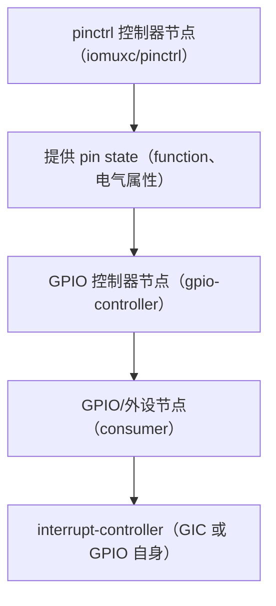
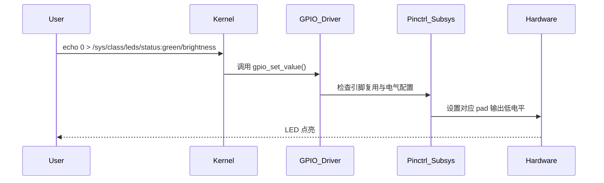
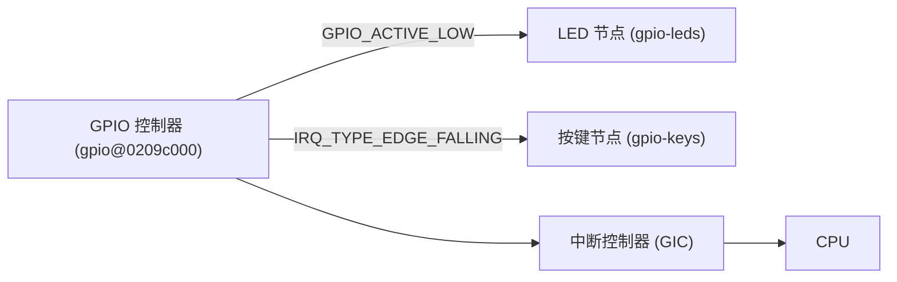
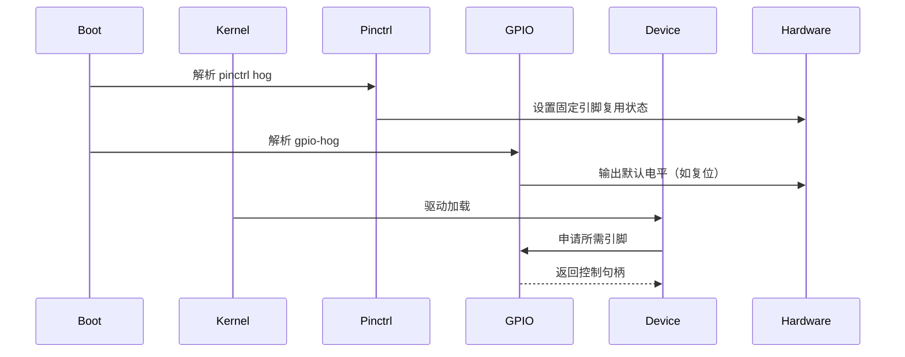
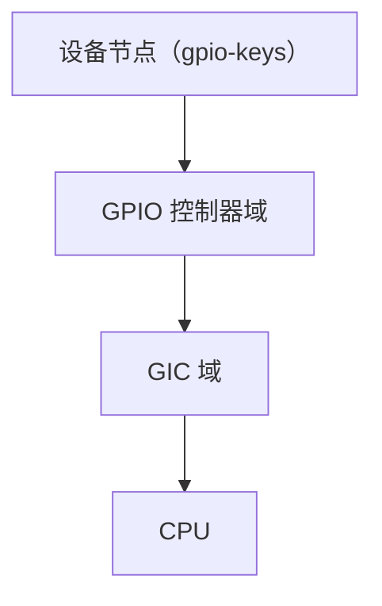
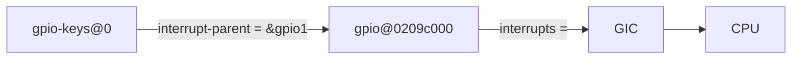
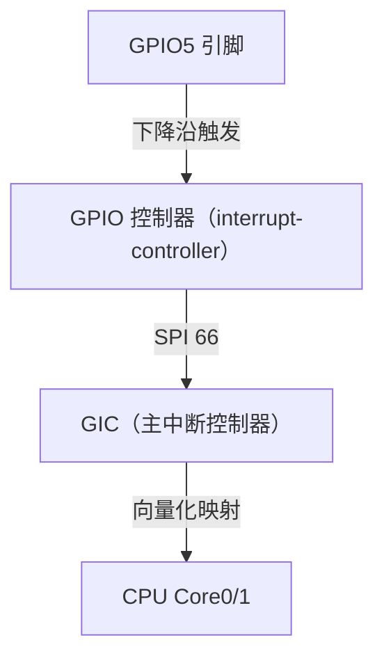
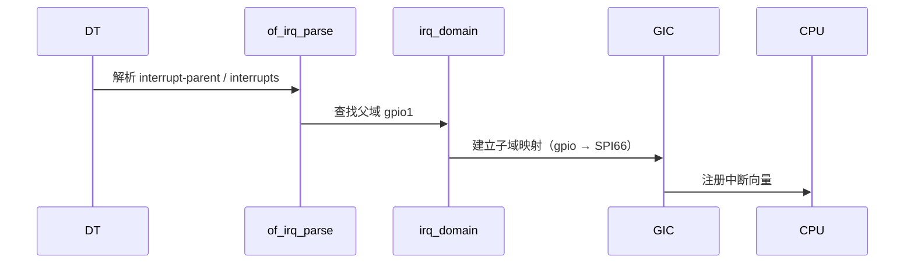

> **第 1 章：GPIO + pinctrl + interrupt 在 Linux Kernel 6.1 及之后版本中的设备树语法与应用**

------

# 第1章_GPIO_+_pinctrl_+_interrupt_的设备树语法与应用

------

## 1.1_主题引入

在 Linux 设备驱动开发中，**GPIO（通用输入输出）**、**pinctrl（管脚控制）** 与 **interrupt（中断系统）** 是连接驱动与硬件引脚的三大基础支柱。
 它们的关系就像一个硬件引脚的三重身份：

| 模块          | 作用                                                  | 对应设备树关键属性                                          |
| ------------- | ----------------------------------------------------- | ----------------------------------------------------------- |
| **pinctrl**   | 决定引脚的复用功能、电气属性（上拉/下拉、驱动强度等） | `pinctrl-names`, `pinctrl-0`, `function`, `bias-pull-up` 等 |
| **GPIO**      | 提供逻辑高低电平的控制接口                            | `*-gpios`, `gpio-controller`, `#gpio-cells`                 |
| **interrupt** | 把电平变化或信号事件上报至 CPU（GIC）                 | `interrupt-parent`, `interrupts`, `#interrupt-cells`        |

> 本章目标是系统讲解这三者在 **Linux Kernel 6.1+** 设备树中的完整语法体系与组合用法，并通过 i.MX6UL 与 Rockchip RK356x 平台为例，逐步解析从语法 → 代码 → 实例 → 验证的全过程。

------

## 1.2_数据结构视角

### 1.2.1_Linux_内核中的三层抽象

Linux 为引脚和中断提供了统一的三层抽象结构：

| 层次          | 代表结构体                                  | 说明                              |
| ------------- | ------------------------------------------- | --------------------------------- |
| **pinctrl**   | `struct pinctrl_desc`, `struct pinctrl_dev` | 描述一组管脚复用及配置能力        |
| **GPIO**      | `struct gpio_chip`                          | 抽象一组 GPIO 控制器与其引脚集    |
| **Interrupt** | `struct irq_domain`                         | 将不同来源的中断映射为统一 irq 号 |

#### (1)_GPIO_控制器描述结构_struct_gpio_chip

位于 `include/linux/gpio/driver.h`：

```c
struct gpio_chip {
	const char *label;
	struct device *parent;
	struct module *owner;
	int (*request)(struct gpio_chip *gc, unsigned offset);
	void (*free)(struct gpio_chip *gc, unsigned offset);
	int (*direction_input)(struct gpio_chip *gc, unsigned offset);
	int (*direction_output)(struct gpio_chip *gc, unsigned offset, int value);
	int (*get)(struct gpio_chip *gc, unsigned offset);
	void (*set)(struct gpio_chip *gc, unsigned offset, int value);
	int ngpio;
};
```

该结构与设备树的 `gpio-controller`、`#gpio-cells` 属性直接对应。
 **每一个 GPIO 控制器节点在设备树中定义后，都会生成一个 `gpio_chip` 实例。**

#### (2)_pinctrl_控制器描述结构_struct_pinctrl_desc

位于 `include/linux/pinctrl/pinctrl.h`：

```c
struct pinctrl_desc {
	const char *name;
	const struct pinctrl_ops *pctlops;
	const struct pinmux_ops *pmxops;
	const struct pinconf_ops *confops;
	unsigned int npins;
	const struct pinctrl_pin_desc *pins;
};
```

它负责将 DTS 中 `pinctrl-0`, `pinctrl-names`, `fsl,pins`, `function` 等描述翻译成 SoC 寄存器配置。

#### (3)_中断域结构_struct_irq_domain

位于 `include/linux/irqdomain.h`：

```c
struct irq_domain {
	struct list_head link;
	const struct irq_domain_ops *ops;
	unsigned int hwirq_max;
	struct device_node *of_node;
};
```

所有中断控制器（包括 GPIO 控制器的中断功能）都基于 **irq domain** 框架注册。

------

## 1.3_开发者视角_设备树_Provider_与_Consumer_的关系

在 DTS 中，所有控制关系都遵循以下逻辑：



- **pinctrl provider** 提供 pin function 与 bias；
- **GPIO provider** 提供逻辑电平控制；
- **Interrupt provider** 提供事件通知；
- **consumer** 设备节点负责引用这三者。

> 因此，在 DTS 编写中，通常一个外设节点要同时引用 **pinctrl** 与 **GPIO/Interrupt**，以完成“引脚功能 + 控制方式 + 事件响应”的完整闭环。

------

## 1.4_语法总览

### 1.4.1_GPIO_控制器节点(Provider)

```dts
gpio1: gpio@0209c000 {
    compatible = "fsl,imx6ul-gpio", "fsl,imx35-gpio";
    reg = <0x0209c000 0x4000>;
    interrupts = <GIC_SPI 66 IRQ_TYPE_LEVEL_HIGH>;

    gpio-controller;
    #gpio-cells = <2>;          // <offset flags>

    interrupt-controller;
    #interrupt-cells = <2>;     // <offset flags>
};
```

| 属性                     | 含义                                             |
| ------------------------ | ------------------------------------------------ |
| `gpio-controller`        | 声明该节点是 GPIO 控制器                         |
| `#gpio-cells = <2>`      | 表示 `<offset flags>` 两个单元构成一个 GPIO 描述 |
| `interrupt-controller`   | 声明它也能生成中断                               |
| `#interrupt-cells = <2>` | 表示 `<offset flags>` 构成中断 specifier         |

------

### 1.4.2_pinctrl_提供者节点

#### (1)_i.MX6UL_风格

```dts
iomuxc: pinctrl@020e0000 {
    compatible = "fsl,imx6ul-iomuxc";
    reg = <0x020e0000 0x4000>;

    pinctrl_led_default: led-default {
        fsl,pins = <
            MX6UL_PAD_GPIO1_IO03__GPIO1_IO03  0x10b0
        >;
    };
};
```

#### (2)_Rockchip_风格

```dts
pinctrl: pinctrl {
    compatible = "rockchip,pinctrl";

    led_default: led-default {
        pins = <RK_GPIO1 3 RK_FUNC_GPIO>;
        function = "gpio";
        bias-pull-up;
        drive-strength = <8>;
    };
};
```

| 属性                | 说明                                    |
| ------------------- | --------------------------------------- |
| `function`          | 指定复用功能（gpio、uart、spi、i2c 等） |
| `bias-*`            | 上下拉配置                              |
| `drive-strength`    | 驱动强度（mA）                          |
| `fsl,pins` / `pins` | 平台特定的 pin 配置描述                 |

------

### 1.4.3_中断控制器与中断描述

| 控制器类型      | cells 数 | 示例                               | 说明                |
| --------------- | -------- | ---------------------------------- | ------------------- |
| **GIC**         | 3        | `<GIC_SPI 74 IRQ_TYPE_LEVEL_HIGH>` | SPI/PPIs 直接连 CPU |
| **GPIO 控制器** | 2        | `<5 IRQ_TYPE_EDGE_FALLING>`        | GPIO 引脚转中断     |

------

## 1.5_示例一_LED_输出

```dts
/ {
    leds {
        compatible = "gpio-leds";
        pinctrl-names = "default";
        pinctrl-0 = <&pinctrl_led_default>;

        led0 {
            label = "status:green";
            gpios = <&gpio1 3 GPIO_ACTIVE_LOW>;
            default-state = "off";
        };
    };
};

&iomuxc {
    pinctrl_led_default: led-default {
        fsl,pins = <
            MX6UL_PAD_GPIO1_IO03__GPIO1_IO03  0x10b0
        >;
    };
};
```

**分析：**

- `pinctrl` 将引脚复用为 GPIO；
- `gpios` 指向 `&gpio1` 控制器；
- `GPIO_ACTIVE_LOW` 告诉驱动该引脚低电平有效；
- 驱动为 `gpio-leds`，可直接通过 sysfs 控制。

------

## 1.6_示例二_按键输入_+_中断触发

```dts
/ {
    gpio-keys {
        compatible = "gpio-keys";
        pinctrl-names = "default";
        pinctrl-0 = <&pinctrl_key_default>;

        key-enter {
            label = "ENTER";
            linux,code = <KEY_ENTER>;
            debounce-interval = <10>;
            interrupt-parent = <&gpio1>;
            interrupts = <5 IRQ_TYPE_EDGE_FALLING>;
        };
    };
};

&iomuxc {
    pinctrl_key_default: key-default {
        fsl,pins = <
            MX6UL_PAD_GPIO1_IO05__GPIO1_IO05  0x10b0
        >;
    };
};
```

**分析：**

- 按键节点通过 `gpio1` 作为中断控制器；
- `IRQ_TYPE_EDGE_FALLING` 表示下降沿触发；
- `linux,code` 定义键值；
- 可通过 `/dev/input/eventX` 读取。

------

## 1.7_可视化图示

### 1.7.1_设备树逻辑连接图


### 1.7.2_数据流关系图



------

## 1.8_调试与验证

| 验证项目          | 命令                                               | 说明                       |
| ----------------- | -------------------------------------------------- | -------------------------- |
| 查看 GPIO 映射    | `cat /sys/kernel/debug/gpio`                       | 列出所有 GPIO 控制器及状态 |
| LED 控制          | `echo 1 > /sys/class/leds/status:green/brightness` | 打开 LED                   |
| 按键中断测试      | `evtest /dev/input/eventX`                         | 查看键值触发               |
| 查看 pinctrl 状态 | `cat /sys/kernel/debug/pinctrl/*/pins`             | 检查复用状态               |
| 查看中断分配      | `cat /proc/interrupts`                             | 验证中断是否注册成功       |

------

## 1.9_小结

| 模块          | 关键属性                                    | 典型文件           | 功能说明               |
| ------------- | ------------------------------------------- | ------------------ | ---------------------- |
| **pinctrl**   | `pinctrl-names`, `pinctrl-0`, `function`    | `drivers/pinctrl/` | 配置引脚复用与电气特性 |
| **GPIO**      | `gpio-controller`, `#gpio-cells`, `*-gpios` | `drivers/gpio/`    | 控制通用 I/O 电平      |
| **Interrupt** | `interrupts`, `interrupt-parent`            | `drivers/irqchip/` | 负责事件上报与连接 GIC |

**一句话总结：**

> 在设备树中，`pinctrl` 决定“这根针脚是谁”，`GPIO` 决定“它怎么动”，`interrupt` 决定“它什么时候告诉我”。

------

# 第2章_GPIO_+_pinctrl_+_interrupt_的组合应用与高级语法

------

## 2.1_主题引入

在上一章中，我们了解了 GPIO、pinctrl 和 interrupt 三个子系统在设备树中的基本语法与典型应用。本章将进一步探讨这三者在 **组合与扩展场景** 下的多样化用法。
 这些高级语法常用于以下情形：

1. **多个引脚状态切换（多 state 配置）**；
2. **GPIO 和中断复用（GPIO 同时为输入和中断源）**；
3. **hog 机制（系统自动占用某些引脚）**；
4. **Pinconf（电气配置） 与 bias（上下拉） 细化语法**；
5. **跨控制器中断与多级中断连接**；
6. **GPIO ranges 映射与可视化调试技巧**。

> 本章内容面向内核驱动开发者与硬件平台移植工程师，旨在让你理解“**为什么一个引脚既能点灯，又能当中断口**”，以及“**如何在设备树里优雅地表达这些复杂关系**”。

------

## 2.2_数据结构视角_GPIO_与_pinctrl_的内部衔接

### 2.2.1_pinctrl_state_的生命周期

每个设备节点可定义多个 **pin control state**，例如 `"default"`, `"sleep"`, `"idle"` 等，对应的设备属性为：

```dts
pinctrl-names = "default", "sleep";
pinctrl-0 = <&pinctrl_uart_default>;
pinctrl-1 = <&pinctrl_uart_sleep>;
```

- `default`：驱动加载时激活；
- `sleep`：系统 suspend 时切换；
- `idle`：驱动手动切换。

内核结构体：

```c
struct pinctrl_state {
	struct list_head 	node;
	const char 		   *name;
	struct list_head 	settings;
};
```

在驱动加载时，内核会调用：

```c
pinctrl_lookup_state(pdev->dev.pins, "default");
pinctrl_select_state(pdev->dev.pins, state);
```

使得该状态对应的所有引脚被配置。

------

### 2.2.2_GPIO_控制器中的中断桥接机制

GPIO 控制器可注册为 **中断控制器**，使 GPIO 引脚既能输出电平，又能作为中断源。
 在设备树中，这体现为：

```dts
gpio-controller;
#gpio-cells = <2>;
interrupt-controller;
#interrupt-cells = <2>;
```

内核对应代码（简化）：

```c
static int gpiochip_irq_map(struct irq_domain *d, unsigned int virq, irq_hw_number_t hw)
{
	struct gpio_chip *gc = d->host_data;
	irq_set_chip_and_handler(virq, &gc->irqchip, handle_level_irq);
}
```

> 即：当某个 GPIO 被配置为中断源时，它的中断通过 `irq_domain` 桥接到 GIC 统一编号系统中。

------

## 2.3_开发者视角_高级组合语法详解

### 2.3.1_多状态_pinctrl_组合

一个外设节点可定义多个状态，对应不同运行阶段：

```dts
&uart1 {
    pinctrl-names = "default", "sleep";
    pinctrl-0 = <&pinctrl_uart1_default>;
    pinctrl-1 = <&pinctrl_uart1_sleep>;
    status = "okay";
};
&iomuxc {
    pinctrl_uart1_default: uart1-default {
        fsl,pins = <
            MX6UL_PAD_UART1_TX_DATA__UART1_DCE_TX 0x1b0b1
            MX6UL_PAD_UART1_RX_DATA__UART1_DCE_RX 0x1b0b1
        >;
    };

    pinctrl_uart1_sleep: uart1-sleep {
        fsl,pins = <
            MX6UL_PAD_UART1_TX_DATA__GPIO1_IO16  0x10b0
            MX6UL_PAD_UART1_RX_DATA__GPIO1_IO17  0x10b0
        >;
    };
};
```

解释：

| 阶段    | 复用功能    | 电气特性           |
| ------- | ----------- | ------------------ |
| default | UART1 TX/RX | 驱动强度 4mA，上拉 |
| sleep   | GPIO 模式   | 低功耗输入         |

> 这种配置使驱动在系统 suspend 时能主动切换引脚功能，实现低功耗。

------

### 2.3.2_GPIO_与中断复用的双重身份

在部分硬件中，同一引脚既是 GPIO 输入，又要触发中断。
 例如：一个按键引脚既要通过 GPIO 读取电平，又要通过 IRQ 通知。

```dts
key0 {
    label = "KEY0";
    linux,code = <KEY_ENTER>;
    gpios = <&gpio1 5 GPIO_ACTIVE_LOW>;
    interrupt-parent = <&gpio1>;
    interrupts = <5 IRQ_TYPE_EDGE_FALLING>;
};
```

语义解析：

| 属性               | 含义                                       |
| ------------------ | ------------------------------------------ |
| `gpios`            | 提供电平读取功能                           |
| `interrupts`       | 提供边沿触发中断能力                       |
| `interrupt-parent` | 明确中断的上级控制器（此处为 GPIO 控制器） |

> Linux 驱动会同时注册 GPIO 与 IRQ，且不会冲突，因为中断框架会自动屏蔽 GPIO 读写操作中的冲突位域。

------

### 2.3.3_GPIO_hog_系统自动占用引脚

GPIO hog 机制用于在系统启动时**自动设置特定引脚状态**，常用于控制电源、复位、或信号锁定。

```dts
gpio1: gpio@0209c000 {
    gpio-controller;
    #gpio-cells = <2>;

    wifi_reset {
        gpio-hog;
        gpios = <3 GPIO_ACTIVE_LOW>;
        output-high;
        line-name = "wifi-reset";
    };
};
```

解释：

| 属性          | 功能                                            |
| ------------- | ----------------------------------------------- |
| `gpio-hog`    | 表明为系统自动保留引脚                          |
| `gpios`       | 指定引脚编号与有效电平                          |
| `output-high` | 启动时拉高（可选 `output-low`）                 |
| `line-name`   | 人类可读名称（出现在 `/sys/kernel/debug/gpio`） |

调试验证：

```bash
cat /sys/kernel/debug/gpio
# 会看到：
# gpiochip1: GPIOs 0-31, parent: platform/0209c000.gpio, imx-gpio:
# gpio-3 (wifi-reset ) out hi
```

------

### 2.3.4_pinctrl_hog_自动固定_pinmux_状态

pinctrl hog 让某组引脚**永久固定某种复用模式**，不依赖驱动加载。

```dts
&iomuxc {
    pinctrl_hog_uart_debug: hog-uart-debug {
        pinctrl-single,pins = <
            MX6UL_PAD_UART1_TX_DATA__UART1_DCE_TX 0x1b0b1
            MX6UL_PAD_UART1_RX_DATA__UART1_DCE_RX 0x1b0b1
        >;
        hog;
    };
};
```

解释：

- `hog;`：标记为自动激活；
- 常用于调试 UART、LED、测试脚等无需驱动的功能；
- 可在早期 boot 阶段生效。

------

## 2.4_用户视角_验证与调试方法

### 2.4.1_查看_hog_状态

```bash
cat /sys/kernel/debug/pinctrl/*/hog
```

可输出：

```
Hog state: hog-uart-debug (active)
```

### 2.4.2_查看_GPIO_状态与映射

```bash
cat /sys/kernel/debug/gpio
```

输出示例：

```
gpiochip0: GPIOs 0-31, parent: platform/0209c000.gpio, imx-gpio:
 gpio-3 (wifi-reset ) out hi
 gpio-5 (KEY0        ) in  lo  IRQ
```

### 2.4.3_验证中断连接关系

```bash
cat /proc/interrupts | grep gpio
```

输出：

```
 72:   15    GIC-0   72  gpio-mxc  GPIO Key (KEY0)
```

表示 GPIO 控制器通过 GIC SPI 72 号中断连入主中断域。

------

## 2.5_可视化图示

### 2.5.1_引脚复用与中断流向示意



### 2.5.2_Hog_与_Consumer_时序关系



------

## 2.6_调试与验证技巧

| 调试目标         | 命令                                                         | 说明             |
| ---------------- | ------------------------------------------------------------ | ---------------- |
| 列出 GPIO 控制器 | `ls /sys/class/gpio/`                                        | 确认是否自动创建 |
| 动态导出引脚     | `echo 5 > /sys/class/gpio/export`                            | 导出 GPIO5       |
| 设置电平         | `echo out > /sys/class/gpio/gpio5/direction; echo 1 > /sys/class/gpio/gpio5/value` | 控制输出         |
| 验证中断边沿触发 | `cat /proc/interrupts                                        | grep gpio`       |
| 查看复用状态     | `cat /sys/kernel/debug/pinctrl/*/pins`                       | 确认当前状态     |

------

## 2.7_小结

| 功能                | 对应设备树属性                            | 使用场景               | 示例节点     |
| ------------------- | ----------------------------------------- | ---------------------- | ------------ |
| **多状态 pinctrl**  | `pinctrl-names`, `pinctrl-0`, `pinctrl-1` | 运行/休眠状态切换      | UART、I2C    |
| **GPIO + 中断复用** | `gpios`, `interrupts`                     | 按键输入、事件检测     | gpio-keys    |
| **GPIO hog**        | `gpio-hog`, `output-high`                 | 固定电平输出（复位脚） | gpio1 子节点 |
| **pinctrl hog**     | `hog;`                                    | 固定引脚复用           | UART debug   |
| **中断桥接**        | `interrupt-parent`, `#interrupt-cells`    | GPIO → GIC             | 各类外设     |

**一句话总结：**

> GPIO 是“逻辑手”，pinctrl 是“神经系统”，interrupt 是“信号线”。三者配合，才能让内核真正“触摸”到硬件世界。

------

# 第3章_Linux_中断模型深度解析与设备树中的级联机制(第_3_部分)

------

## 3.1_主题引入

在嵌入式 SoC 系统中，**中断系统（Interrupt Subsystem）** 是连接外设与 CPU 的“事件桥梁”。
 从 GPIO 按键到外部设备，每一次硬件信号变化都要经过一套严格的中断路由机制，最终到达 CPU 的 GIC（Generic Interrupt Controller）。

在上一章中，我们看到 GPIO 控制器既可以发出中断，也可以把中断上报给 GIC。本章将重点讲解以下问题：

1. `#interrupt-cells = 3` 的语义与 GIC 的 SPI/PPI 概念；
2. GPIO 控制器中断与 GIC 的**级联关系**；
3. DTS 中 `interrupt-parent` 与 `interrupts-extended` 的优先级；
4. 多级中断系统在内核中的注册与映射过程；
5. i.MX6ULL 与 Rockchip 平台的中断实例剖析。

> 读完本章，你将能够完整地理解：
>  “一个 GPIO 引脚的电平变化，是如何一路穿越中断域，最终让 CPU 执行到对应的 ISR（中断服务函数）。”

------

## 3.2_数据结构视角_从硬件中断号到虚拟_IRQ

### 3.2.1_中断域_irqdomain_内核中的中断映射核心

Linux 中断子系统通过 `struct irq_domain` 把不同来源的中断统一映射为 **虚拟中断号（virq）**。

```c
struct irq_domain {
	struct list_head link;
	struct fwnode_handle *fwnode;
	const struct irq_domain_ops *ops;
	unsigned int revmap_direct_max_irq;
	unsigned int revmap_size;
	struct device_node *of_node;
};
```

每个中断控制器（如 GIC、GPIO 控制器）都有自己的一套 `irq_domain`，并且可以形成**层级映射**：



> GIC 是顶级中断控制器；
>  GPIO 控制器是次级中断控制器（作为 GIC 的子域）。
>  它们之间通过 irqdomain 的父子关系建立层级。

------

### 3.2.2_GIC_中断模型与_#interrupt-cells_=_3

在 ARM 平台中，GIC 是标准的中断控制器，它的中断描述形式为：

```dts
interrupts = <GIC_SPI 74 IRQ_TYPE_LEVEL_HIGH>;
```

其 `#interrupt-cells = <3>` 含义如下：

| 参数序号 | 名称    | 说明                                               | 示例值                |
| -------- | ------- | -------------------------------------------------- | --------------------- |
| 0        | `type`  | 中断类型：GIC_SPI（共享外设），GIC_PPI（私有外设） | `GIC_SPI`             |
| 1        | `irq`   | 中断号（0–1019）                                   | `74`                  |
| 2        | `flags` | 触发类型（电平/边沿，高/低）                       | `IRQ_TYPE_LEVEL_HIGH` |

#### (1)_常见宏定义(来自_<dt-bindings/interrupt-controller/arm-gic.h>)

```c
#define GIC_SPI 0
#define GIC_PPI 1
#define IRQ_TYPE_NONE		0x00000000
#define IRQ_TYPE_EDGE_RISING	0x00000001
#define IRQ_TYPE_EDGE_FALLING	0x00000002
#define IRQ_TYPE_LEVEL_HIGH	0x00000004
#define IRQ_TYPE_LEVEL_LOW	0x00000008
```

------

### 3.2.3_GPIO_控制器作为中断控制器_#interrupt-cells_=_2

GPIO 控制器通过 `interrupt-controller` 声明自己也能产生中断。
 其语法形式一般为：

```dts
interrupt-parent = <&gpio1>;
interrupts = <5 IRQ_TYPE_EDGE_FALLING>;
```

这里的二元组 `<offset flags>` 对应：

| 参数序号 | 名称   | 说明                   |
| -------- | ------ | ---------------------- |
| 0        | offset | GPIO 控制器内部引脚号  |
| 1        | flags  | 触发类型（IRQ_TYPE_*） |

这使得 GPIO 控制器能将某个 GPIO 事件映射为中断输入。

------

## 3.3_开发者视角_中断级联的设备树语法

### 3.3.1_GPIO_to_GIC_的级联定义

以下示例展示 i.MX6ULL 平台的 GPIO 控制器中断如何接入 GIC：

```dts
gpio1: gpio@0209c000 {
    compatible = "fsl,imx6ul-gpio", "fsl,imx35-gpio";
    reg = <0x0209c000 0x4000>;
    interrupts = <GIC_SPI 66 IRQ_TYPE_LEVEL_HIGH>;
    gpio-controller;
    #gpio-cells = <2>;
    interrupt-controller;
    #interrupt-cells = <2>;
};
```

解释：

- 该控制器本身通过 `interrupts` 属性向 **GIC** 报告自己的中断输入（SPI 66）；
- 同时声明自己是一个新的中断控制器（`interrupt-controller;`），对外提供子中断（即每个 GPIO 引脚的中断事件）。

------

### 3.3.2_设备节点绑定_GPIO_中断

```dts
gpio-keys {
    compatible = "gpio-keys";
    interrupt-parent = <&gpio1>;
    interrupts = <5 IRQ_TYPE_EDGE_FALLING>;
};
```

这里 `gpio1` 的 `#interrupt-cells = <2>` 表明它能接受 `<offset flags>`。

内核解析过程：



最终路径：

> **gpio-keys → GPIO 控制器 → GIC → CPU**

------

### 3.3.3_使用_interrupts-extended_同时声明多个中断源

某些设备（如复合传感器）可能有多个中断脚，分别接入不同控制器。

```dts
multi-sensor {
    compatible = "my,multi-sensor";
    interrupts-extended = <&gpio1 5 IRQ_TYPE_EDGE_FALLING>,
                          <&gpio2 7 IRQ_TYPE_EDGE_RISING>;
};
```

这种写法相当于：

- 第一个中断来自 GPIO1；
- 第二个中断来自 GPIO2；
- 驱动会解析多个 irq line，并通过 `devm_request_threaded_irq()` 注册多个中断处理。

------

### 3.3.4_父中断控制器的自动继承机制

当子节点未显式声明 `interrupt-parent` 时，内核会从其父节点向上查找。
 因此，以下两种写法效果等价：

**写法 A：显式声明**

```dts
key0 {
    interrupt-parent = <&gpio1>;
    interrupts = <5 IRQ_TYPE_EDGE_FALLING>;
};
```

**写法 B：隐式继承**

```dts
gpio-keys {
    interrupt-parent = <&gpio1>;

    key0 {
        interrupts = <5 IRQ_TYPE_EDGE_FALLING>;
    };
};
```

> 建议在大型项目中使用 **写法 B**，可避免重复定义，且结构更清晰。

------

## 3.4_用户视角_中断调试与验证

### 3.4.1_查看内核分配的中断号

```bash
cat /proc/interrupts | grep gpio
```

输出示例：

```
 66:   150  GIC-0  66  gpio-mxc  GPIO Key (KEY0)
```

说明：

- `66`：对应 GIC SPI 中断号；
- `gpio-mxc`：驱动名称；
- `KEY0`：事件来源。

------

### 3.4.2_验证中断触发

安装工具：

```bash
apt install evtest
```

执行：

```bash
evtest /dev/input/event0
```

当按下按键时输出：

```
Event: time 12345.678901, type 1 (EV_KEY), code 28 (KEY_ENTER), value 1
Event: time 12345.789012, type 0 (EV_SYN), code 0 (SYN_REPORT), value 0
```

------

### 3.4.3_查看中断层级映射(debugfs)

```bash
cat /sys/kernel/debug/irq/irqs/66
```

输出示例：

```
handler: gpio_irq_handler
chip name: GICv2
parent irq: 32
```

可以清楚地看到：

- GPIO 控制器使用 GIC 作为 parent；
- 该中断由 `gpio_irq_handler` 处理。

------

## 3.5_可视化图示

### 3.5.1_GIC_+_GPIO_的中断层级关系



### 3.5.2_DTS_to_内核注册流程



------

## 3.6_调试与验证技巧

| 调试任务         | 命令                                        | 说明               |
| ---------------- | ------------------------------------------- | ------------------ |
| 查看中断分配情况 | `cat /proc/interrupts`                      | 统计各中断触发次数 |
| 查看 irq 域层级  | `cat /sys/kernel/debug/irq/irqs/<n>`        | 输出父域信息       |
| 临时禁用中断     | `echo disable > /proc/irq/<n>/smp_affinity` | 调试中断屏蔽       |
| 手动触发中断     | `echo 1 > /sys/class/gpio/gpio5/value`      | 验证下降沿         |
| 检查 DTS 解析    | `dmesg                                      | grep irq`          |

------

## 3.7_小结

| 内容             | 属性/机制                        | 对应结构体                             | 说明             |
| ---------------- | -------------------------------- | -------------------------------------- | ---------------- |
| **GIC 控制器**   | `#interrupt-cells = <3>`         | `struct irq_domain`                    | 顶层中断分配     |
| **GPIO 控制器**  | `#interrupt-cells = <2>`         | `struct gpio_chip` + `struct irq_chip` | 提供子中断       |
| **中断级联**     | `interrupt-parent`, `interrupts` | DTS 树形关系                           | GPIO → GIC       |
| **多中断设备**   | `interrupts-extended`            | 驱动中 irq 数组                        | 同时注册多个中断 |
| **debugfs 验证** | `/sys/kernel/debug/irq/`         | debugfs                                | 查看中断映射关系 |

**一句话总结：**

> Linux 的中断系统是一棵树，根是 GIC，枝是 GPIO 控制器，叶是每个设备的中断脚。理解树形级联，就理解了中断的灵魂。

------

（未完待续 —— 第 4 章将进入 **Pinconf 与 Bias 电气配置专题**，深入解析 pinctrl 子系统如何通过设备树精细控制引脚的上拉、下拉、驱动强度与输入/输出电气特性，并结合实际寄存器映射进行实战分析。）