好的 ✅
 从现在开始，我将正式进入《GPIO + pinctrl + interrupt 工程实例语法与机制解析》
 ——**以 i.MX6ULL 与 RK356x 系列为参考平台**的正式出版式写作阶段。

------

# 第1章_系统结构总览与工程语义基础

*(以 i.MX6ULL 与 RK356x 平台为参考)*

------

## 1.1_主题引入_从一根引脚到一个子系统的演化

在嵌入式系统中，**每一个物理引脚（Pad）** 都可能承担多种职责。
 同一个引脚既可能是 UART_TX，也可能是 GPIO 输出，甚至是外部中断输入。
 这种复用机制是现代 SoC（System-on-Chip）实现高集成度的核心特征。

Linux 内核为了解决这类引脚管理的复杂性，形成了三层架构：

| 层级 | 子系统               | 职责                                                     | 示例                       |
| ---- | -------------------- | -------------------------------------------------------- | -------------------------- |
| 1️⃣    | **pinctrl 子系统**   | 管理引脚复用（MUX）和电气特性（bias、drive-strength 等） | 将 PAD 选择为 UART 或 GPIO |
| 2️⃣    | **GPIO 子系统**      | 在被复用为 GPIO 时，提供输入输出访问接口                 | 控制电平高低、读取输入状态 |
| 3️⃣    | **interrupt 子系统** | 当引脚作为中断输入时，负责事件上报                       | 将电平变化映射为中断号     |

这三者在驱动开发中的关系如下：


### 1.1.1_举例说明

- 对于 **LED 灯**，只需要 pinctrl + GPIO；
- 对于 **按键**，需要 pinctrl + GPIO + interrupt；
- 对于 **Wi-Fi 模块**，还要再叠加 regulator 与时钟管理。

------

## 1.2_从硬件到软件的映射路径

以 **i.MX6ULL** 为例（NXP IOMUXC 控制器）：

```
PAD_GPIO1_IO03 → 选择功能 GPIO1_IO03 → 对应 GPIO 控制器 gpio1
gpio1 具备 interrupt-controller 属性 → 接入 GIC → 触发内核 ISR
```

以 **RK3568** 为例（Rockchip GRF/PMU 分域）：

```
PAD RK_PC2 → function = "gpio" or "uart2"
gpio2 控制器属于系统域 → 其 interrupt-controller 对接 GIC
```

二者差异主要体现在：

- **i.MX6ULL** 的引脚功能由 IOMUXC 寄存器集中管理（功能与电气统一设置）；
- **RK356x** 将引脚功能分散至 GRF（General Register File）和 PMU（Power Management Unit），电气配置独立。

------

## 1.3_数据结构视角_Linux_内核的三层模型

### 1.3.1_pinctrl_层

核心结构体：

```c
struct pinctrl_dev {
	struct pinctrl_desc *desc;
	struct list_head pin_descs;
	struct pinctrl_state *states;
};
```

- 描述所有引脚复用功能；
- 每个状态（state）对应 DTS 中一个 `<&xxx_pins>` 节点。

### 1.3.2_GPIO_层

```c
struct gpio_chip {
	int (*request)(struct gpio_chip *chip, unsigned offset);
	void (*set)(struct gpio_chip *chip, unsigned offset, int value);
	int (*get)(struct gpio_chip *chip, unsigned offset);
};
```

- 提供统一的逻辑接口，屏蔽硬件差异；
- 每个 GPIO 控制器在 DTS 中都以独立节点存在。

### 1.3.3_Interrupt_层

```c
struct irq_chip {
	const char *name;
	void (*irq_ack)(struct irq_data *data);
	void (*irq_mask)(struct irq_data *data);
	void (*irq_unmask)(struct irq_data *data);
};
```

- 管理中断号分配与中断触发模式；
- `irqdomain` 将“硬件中断号”映射为“逻辑中断号”。

------

## 1.4_工程语义_从_DTS_到驱动的加载顺序

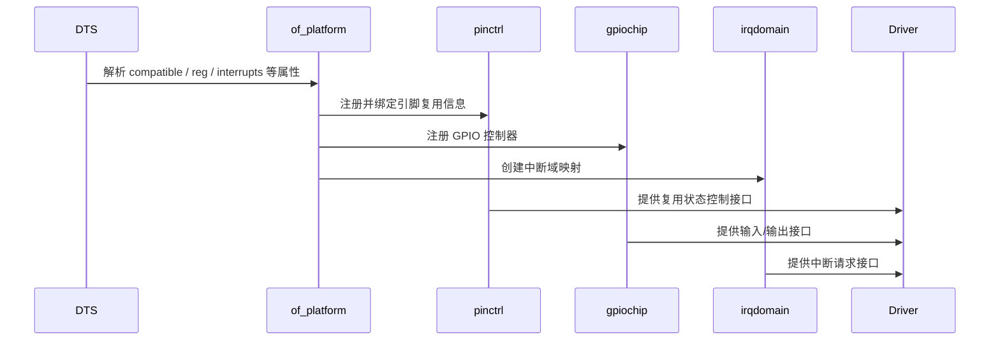

Linux 启动时，设备树会按如下逻辑展开：

1. `of_platform_populate()` 解析节点；
2. 匹配 `compatible` 并注册 platform device；
3. 若节点包含 `pinctrl-0` → 初始化引脚状态；
4. 若节点包含 `gpio-controller` → 注册 gpiochip；
5. 若节点包含 `interrupt-controller` → 注册 irqdomain；
6. 最终由驱动匹配并获取资源（GPIO、IRQ）。

------

## 1.5_i.MX6ULL_与_RK356x_平台特性对比

| 对比项               | i.MX6ULL                                            | RK356x                                                |
| -------------------- | --------------------------------------------------- | ----------------------------------------------------- |
| **引脚控制器**       | IOMUXC / IOMUXC_SNVS                                | GRF / PMU / IO-domain                                 |
| **复用配置语法**     | `fsl,pins = <MX6UL_PAD_GPIO1_IO03__GPIO1_IO03 ...>` | `rockchip,pins = <RK_PC2 RK_FUNC_GPIO &pcfg_pull_up>` |
| **电气配置方式**     | 一体化配置值（16bit）                               | 分离式属性（bias、drive-strength）                    |
| **GPIO 控制器数量**  | 5 组（gpio1–gpio5）                                 | 5 组（gpio0–gpio4）                                   |
| **中断控制器架构**   | GIC + GPIO interrupt-controller                     | GIC + GPIO irqdomain                                  |
| **特殊功能**         | SION 软件输入控制                                   | PMU 域电源隔离                                        |
| **DTS 节点命名习惯** | `&iomuxc` / `&iomuxc_snvs`                          | `&pinctrl` / `&pmuio`                                 |

------

## 1.6_用户视角_验证与调试路径

| 目标           | 命令                                                | 输出说明                   |
| -------------- | --------------------------------------------------- | -------------------------- |
| 查看 GPIO 状态 | `cat /sys/kernel/debug/gpio`                        | 显示控制器及引脚电平       |
| 查看引脚复用   | `cat /sys/kernel/debug/pinctrl/*/pins`              | 输出当前 MUX 映射          |
| 查看中断映射   | `cat /proc/interrupts`                              | 中断号、触发类型、驱动绑定 |
| 验证状态切换   | `echo sleep > /sys/kernel/debug/pinctrl/.../select` | 手动触发状态切换           |
| 验证电平       | `devmem 0x0209C000`（i.MX）                         | 直接读取寄存器状态         |

------

## 1.7_可视化系统关系图

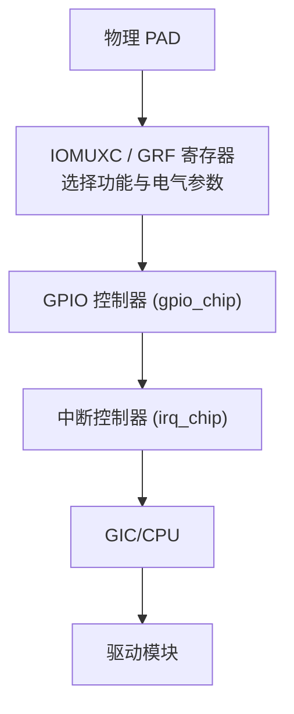

------

## 1.8_小结

| 层级          | 功能               | 关键 DTS 属性                    | 核心结构体           | 工程作用      |
| ------------- | ------------------ | -------------------------------- | -------------------- | ------------- |
| **pinctrl**   | 引脚复用与电气配置 | `pinctrl-names`, `pinctrl-0`     | `struct pinctrl_dev` | 决定引脚功能  |
| **GPIO**      | 输入输出抽象层     | `gpio-controller`, `#gpio-cells` | `struct gpio_chip`   | 控制/读取电平 |
| **Interrupt** | 中断域映射与触发   | `interrupts`, `interrupt-parent` | `struct irq_chip`    | 事件上报 CPU  |

**一句话总结：**

> Linux 对引脚的管理不是“单片机式寄存器操作”，
>  而是一套从 DTS → 驱动 → 子系统的层次化框架。
>  理解三者的边界，是后续工程语法分析的前提。

------

# 第2章_GPIO_子系统的工程语法与典型用法

*(适用平台：NXP i.MX6ULL / Rockchip RK356x / Linux Kernel ≥ 6.1)*

------

## 2.1_主题引入_从电平控制到系统自动化管理

在裸机世界，控制一根 GPIO 只需：

```c
*(GPIOx_DIR) |= (1 << y);
*(GPIOx_DATA) |= (1 << y);
```

但在 Linux 内核中，这个简单操作被抽象为：

> **设备树描述 + GPIO 子系统注册 + 驱动统一访问接口**

这样做的工程意义是：

- 不再直接访问寄存器，而是通过统一的 **gpiochip 驱动模型**；
- 每个 SoC 的 GPIO 控制器都注册为一个逻辑 `gpio_chip`；
- 其他模块通过设备树引用这些逻辑 GPIO；
- 电源、LED、Wi-Fi 等外设都可跨平台复用 DTS 配置。

------

## 2.2_数据结构视角_GPIO_框架核心机制

### 2.2.1_GPIO_控制器的核心结构体

```c
struct gpio_chip {
	const char *label;
	struct device *parent;
	unsigned int ngpio;          // 控制器管理的引脚数量
	int (*request)(struct gpio_chip *chip, unsigned int offset);
	void (*free)(struct gpio_chip *chip, unsigned int offset);
	int (*direction_input)(struct gpio_chip *chip, unsigned int offset);
	int (*direction_output)(struct gpio_chip *chip, unsigned int offset, int val);
	int (*get)(struct gpio_chip *chip, unsigned int offset);
	void (*set)(struct gpio_chip *chip, unsigned int offset, int val);
};
```

每一个 GPIO 控制器（如 `gpio1`, `gpio2`）都会对应一个 `gpio_chip` 实例。
 驱动开发者无需直接操纵寄存器，而只需填充上述函数。

------

### 2.2.2_设备树到驱动的映射关系

| 层级            | DTS 属性                     | 内核结构体         | 说明                           |
| --------------- | ---------------------------- | ------------------ | ------------------------------ |
| GPIO 控制器节点 | `gpio-controller`            | `struct gpio_chip` | 声明一个可被引用的 GPIO 控制器 |
| 子设备引用      | `gpios = <&gpioX pin flags>` | `gpiod_get()`      | 从设备树解析具体 GPIO 引脚     |
| 标志位          | `GPIO_ACTIVE_LOW / HIGH`     | `flags`            | 表示有效电平极性               |

------

## 2.3_开发者视角_GPIO_控制器的_DTS_语法

### 2.3.1_i.MX6ULL_GPIO_控制器语法

```dts
gpio1: gpio@0209c000 {
    compatible = "fsl,imx6ul-gpio", "fsl,imx35-gpio";
    reg = <0x0209c000 0x4000>;
    interrupts = <GIC_SPI 66 IRQ_TYPE_LEVEL_HIGH>;
    gpio-controller;
    #gpio-cells = <2>;
    interrupt-controller;
    #interrupt-cells = <2>;
};
```

- `gpio-controller;` ：声明该节点为 GPIO 控制器；
- `#gpio-cells = <2>;` ：定义子设备使用该控制器时的参数个数：
  - `<0>` 引脚偏移；
  - `<1>` 极性（如 `GPIO_ACTIVE_HIGH`）；
- `interrupt-controller;` 表明该 GPIO 控制器可发出中断；
- `#interrupt-cells = <2>;` 表示中断源的两元组（引脚号 + 触发类型）。

------

### 2.3.2_RK356x_GPIO_控制器语法

```dts
gpio2: gpio@fdd60000 {
    compatible = "rockchip,gpio-bank";
    reg = <0x0 0xfdd60000 0x0 0x100>;
    interrupts = <GIC_SPI 54 IRQ_TYPE_LEVEL_HIGH>;
    gpio-controller;
    #gpio-cells = <2>;
    interrupt-controller;
    #interrupt-cells = <2>;
    clocks = <&cru PCLK_GPIO2>;
    clock-names = "pclk";
};
```

与 i.MX 类似，但差异在于：

- `compatible` 指向 Rockchip 自有驱动；
- 时钟由 `cru` 控制；
- 中断输入同样接入 GIC，但部分 GPIO bank 位于 PMU 电源域。

------

## 2.4_工程实例一_LED_控制

### 2.4.1_i.MX6ULL_写法

```dts
leds {
    compatible = "gpio-leds";

    led0 {
        label = "status-led";
        gpios = <&gpio1 3 GPIO_ACTIVE_LOW>;
        default-state = "on";
    };
};
```

### 2.4.2_RK3568_写法

```dts
leds {
    compatible = "gpio-leds";

    power_led {
        label = "power-led";
        gpios = <&gpio2 RK_PC3 GPIO_ACTIVE_HIGH>;
        linux,default-trigger = "heartbeat";
    };
};
```

| 对比项   | i.MX6ULL          | RK356x             |
| -------- | ----------------- | ------------------ |
| 引脚标识 | 数字偏移（3）     | 宏定义（RK_PC3）   |
| 有效电平 | `GPIO_ACTIVE_LOW` | `GPIO_ACTIVE_HIGH` |
| 触发机制 | 固定电平驱动      | 可使用内核 trigger |

**驱动路径：** `drivers/leds/leds-gpio.c`
 解析 `gpios` 属性后，通过 `gpiod_set_value_cansleep()` 控制输出电平。

------

## 2.5_工程实例二_GPIO_控制电源(regulator_子系统)

### 2.5.1_典型应用_3.3V_模块电源

```dts
vcc_3v3: regulator@0 {
    compatible = "regulator-fixed";
    regulator-name = "vcc-3v3";
    gpio = <&gpio5 2 GPIO_ACTIVE_HIGH>;
    enable-active-high;
    regulator-min-microvolt = <3300000>;
    regulator-max-microvolt = <3300000>;
    startup-delay-us = <100000>;
};
```

- GPIO 控制器由 `gpio = <&gpio5 2>` 提供；
- regulator 框架会在上电时调用 `gpiod_set_value()`；
- `startup-delay-us` 用于延迟模块初始化，保证电源稳定。

### 2.5.2_驱动逻辑(regulator-fixed.c)

```c
static int regulator_enable_gpio(struct regulator_dev *rdev)
{
    struct fixed_voltage_data *data = rdev_get_drvdata(rdev);
    gpiod_set_value_cansleep(data->enable_gpio, data->enabled);
    usleep_range(data->startup_delay, data->startup_delay + 100);
    return 0;
}
```

------

## 2.6_工程实例三_系统自动拉高(gpio-hog)

### 2.6.1_典型语法

```dts
&gpio3 {
    camera_reset: camera-reset {
        gpio-hog;
        gpios = <5 GPIO_ACTIVE_HIGH>;
        output-high;
        line-name = "camera-reset";
    };
};
```

### 2.6.2_作用

- 系统启动阶段（内核注册 GPIO 控制器后）自动将此引脚设置为高电平；
- 不需要驱动参与；
- 常用于 **复位线、上电线、固定拉高/拉低的控制信号**。

**验证命令：**

```bash
cat /sys/kernel/debug/gpio
```

输出示例：

```
gpio-101 (camera-reset) out hi hog
```

------

## 2.7_可视化关系图

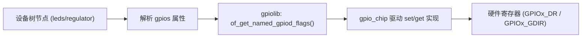

> DTS → of_get_named_gpiod_flags() → gpiochip 操作函数 → 实际寄存器。

------

## 2.8_调试与验证技巧

| 目标                | 命令                                             | 说明                       |
| ------------------- | ------------------------------------------------ | -------------------------- |
| 查看所有 GPIO       | `cat /sys/kernel/debug/gpio`                     | 列出所有 GPIO 控制器与状态 |
| 测试输出控制        | `echo 1 > /sys/class/leds/status-led/brightness` | 点亮 LED                   |
| 检查 regulator 状态 | `cat /sys/class/regulator/vcc-3v3/enable`        | 电源是否拉高               |
| 检查 hog 引脚       | `grep hog /sys/kernel/debug/gpio`                | 验证是否自动输出           |
| 检查 DTS 加载       | `dmesg                                           | grep gpio`                 |

------

## 2.9_工程陷阱与经验总结

| 问题                           | 原因                   | 解决                                    |
| ------------------------------ | ---------------------- | --------------------------------------- |
| LED 无法点亮                   | `GPIO_ACTIVE_LOW` 误设 | 确认电平极性                            |
| 电源不稳定                     | 缺少延时               | 增加 `startup-delay-us`                 |
| 引脚占用错误                   | pinctrl 与 GPIO 冲突   | 检查 `fsl,pins` 或 `rockchip,pins` 配置 |
| hog 引脚未生效                 | hog 定义顺序晚于主节点 | 提前定义 GPIO 控制器                    |
| 内核报错 “request GPIO failed” | 其他驱动已占用         | 改用共享模式或重命名节点                |

------

## 2.10_小结

| 功能层          | DTS 属性                         | 驱动接口                 | 工程意义           |
| --------------- | -------------------------------- | ------------------------ | ------------------ |
| **GPIO 控制器** | `gpio-controller`, `#gpio-cells` | `gpio_chip`              | 提供基础电平操作   |
| **外设节点**    | `gpios = <&gpioX pin flags>`     | `gpiod_get()`            | 引脚逻辑绑定       |
| **自动控制**    | `gpio-hog`                       | 无需驱动                 | 固定电平或复位信号 |
| **电源控制**    | `regulator-fixed` + `gpio`       | regulator 子系统         | 统一电源管理       |
| **调试工具**    | debugfs + sysfs                  | `/sys/kernel/debug/gpio` | 验证引脚状态       |

**一句话总结：**

> 在 Linux 中，GPIO 不只是“高低电平”的代名词，
>  它是 **子系统、设备树、驱动框架** 之间的统一抽象接口。
>  理解它的语法结构，是进入 pinctrl 与中断机制的基石。

------

好的 ✅
 接下来正式进入 **第 3 章：pinctrl 子系统的工程语法与状态机制**。
 这一章是整个“GPIO + pinctrl + interrupt”体系的核心部分 —— 它决定了引脚复用、电气特性、多状态切换，以及 suspend/resume 时的行为。

我们将以 **i.MX6ULL (NXP)** 和 **RK356x (Rockchip)** 两个平台为主线，从语法到工程机制全面讲解。

------

# 第3章_pinctrl_子系统的工程语法与状态机制

*(适用平台：NXP i.MX6ULL / Rockchip RK356x / Linux Kernel ≥ 6.1)*

------

## 3.1_主题引入_从复用到多状态

在嵌入式 SoC 上，一根引脚往往可以承担多种功能。
 例如 i.MX6ULL 的 `PAD_GPIO1_IO03`，可配置为：

- GPIO1_IO03
- UART1_CTS_B
- SPDIF_OUT
- 甚至 EIM_DA3

这些复用行为在硬件上由 **IOMUX（Input/Output Multiplexer）** 实现；
 而在 Linux 软件栈中，由 **pinctrl 子系统** 统一管理。

pinctrl 的核心目标是：

> “把引脚配置抽象成可命名的状态（state），让驱动能在不同运行阶段自由切换。”

------

## 3.2_数据结构视角_pinctrl_的多层抽象模型

### 3.2.1_内核核心结构体

```c
struct pinctrl {
	struct list_head states;     // 当前设备可用的状态集
	struct pinctrl_dev *p;       // 控制器设备
	struct device *dev;          // 绑定的设备
};
```

每个设备（如 UART、摄像头、Wi-Fi）在加载时都会获得一个 `pinctrl` 句柄。
 每个状态（state）对应设备树中的一个 `pinctrl-N`。

```c
struct pinctrl_state {
	const char *name;            // 状态名，如 "default"、"sleep"
	struct list_head settings;   // 引脚配置列表
};
```

------

### 3.2.2_设备树_to_状态映射机制

在 DTS 中：

```dts
&uart1 {
    pinctrl-names = "default", "sleep";
    pinctrl-0 = <&uart1_pins_default>;
    pinctrl-1 = <&uart1_pins_sleep>;
};
```

解析结果：

| 状态名  | 索引号 | 对应节点              | 自动行为             |
| ------- | ------ | --------------------- | -------------------- |
| default | 0      | `&uart1_pins_default` | probe 阶段自动加载   |
| sleep   | 1      | `&uart1_pins_sleep`   | suspend 阶段自动切换 |

Linux 会在驱动 probe 时自动选择第一个状态（通常为 `"default"`）。
 当系统挂起时，PM 框架会触发 `"sleep"` 状态。

------

## 3.3_工程语法_pinctrl_节点结构与配置项

### 3.3.1_i.MX6ULL_的_pinctrl_写法

i.MX 平台通过 IOMUXC 控制引脚，DTS 语法示例：

```dts
&iomuxc {
    uart1_pins_default: uart1-default {
        fsl,pins = <
            MX6UL_PAD_UART1_TX_DATA__UART1_DCE_TX  0x1b0b1
            MX6UL_PAD_UART1_RX_DATA__UART1_DCE_RX  0x1b0b1
        >;
    };

    uart1_pins_sleep: uart1-sleep {
        fsl,pins = <
            MX6UL_PAD_UART1_TX_DATA__GPIO1_IO16 0x10b0
            MX6UL_PAD_UART1_RX_DATA__GPIO1_IO17 0x10b0
        >;
    };
};
```

> `fsl,pins` 是一个多元组数组，形如：
>
> ```
> <PadName__MuxFunction ConfigValue>
> ```
>
> 其中 `ConfigValue` 是 16-bit 复合值，包含：
>
> - 驱动强度（Drive Strength）
> - 上拉/下拉（Pull Up/Down）
> - SION（Software Input On）
> - HYS（Hysteresis）

例如 `0x1b0b1` 拆解：

| 位段    | 功能    | 含义            |
| ------- | ------- | --------------- |
| [15:14] | DSE     | 驱动强度（8mA） |
| [13]    | HYS     | 启用迟滞        |
| [12:10] | PUE/PUS | 上拉 100KΩ      |
| [4]     | SION    | 软件输入使能    |

> 实际取值可参考 `arch/arm/boot/dts/imx6ul-pinfunc.h` 中定义。

------

### 3.3.2_RK356x_的_pinctrl_写法

Rockchip 采用分域控制模型：

- **GRF**：系统引脚复用；
- **PMU**：低功耗域引脚；
- **IO domains**：电气参数独立设置。

```dts
&pinctrl {
    uart2_pins: uart2-pins {
        rockchip,pins = <
            RK_PC0 2 &pcfg_pull_up
            RK_PC1 2 &pcfg_pull_up
        >;
    };

    uart2_sleep: uart2-sleep {
        rockchip,pins = <
            RK_PC0 RK_FUNC_GPIO &pcfg_pull_none
            RK_PC1 RK_FUNC_GPIO &pcfg_pull_none
        >;
    };
};
```

| 参数            | 含义                     |
| --------------- | ------------------------ |
| `RK_PC0`        | 引脚名（Port C 第 0 位） |
| `2`             | 复用功能编号（FUNC2）    |
| `&pcfg_pull_up` | 引脚电气配置结构体引用   |

电气配置节点定义如下：

```dts
&pcfg_pull_up {
    bias-pull-up;
    drive-strength = <8>;
    slew-rate = <1>;
};
```

------

## 3.4_工程实例一_UART_引脚复用与休眠切换

### 3.4.1_i.MX6ULL_示例

```dts
&uart1 {
    pinctrl-names = "default", "sleep";
    pinctrl-0 = <&uart1_pins_default>;
    pinctrl-1 = <&uart1_pins_sleep>;
    status = "okay";
};
```

驱动加载 → 默认状态启用；
 系统挂起 → 自动切换为 `"sleep"`（GPIO 模式，避免漏电）。

### 3.4.2_RK356x_示例

```dts
&uart2 {
    pinctrl-names = "default", "sleep";
    pinctrl-0 = <&uart2_pins>;
    pinctrl-1 = <&uart2_sleep>;
    status = "okay";
};
```

对应状态切换逻辑由 `drivers/pinctrl/core.c` 中实现：

```c
int pinctrl_pm_select_sleep_state(struct device *dev)
{
    struct pinctrl_state *state = pinctrl_lookup_state(p, "sleep");
    return pinctrl_select_state(p, state);
}
```

------

## 3.5_工程实例二_摄像头三态模型

### 3.5.1_i.MX6ULL_OV5640

```dts
pinctrl-names = "init", "default", "sleep";
pinctrl-0 = <&pinctrl_cam_init>;
pinctrl-1 = <&pinctrl_cam_default>;
pinctrl-2 = <&pinctrl_cam_sleep>;
```

| 状态    | 功能                                     |
| ------- | ---------------------------------------- |
| init    | 引脚高阻、无驱动，防止上电瞬间短路       |
| default | 工作状态，CLK、PWDN、RESET、I2C 正常运行 |
| sleep   | 关闭 MCLK、GPIO 输出低，降低功耗         |

------

### 3.5.2_驱动切换逻辑

```c
struct pinctrl *p;
struct pinctrl_state *default_state, *sleep_state;

p = devm_pinctrl_get(dev);
default_state = pinctrl_lookup_state(p, "default");
sleep_state = pinctrl_lookup_state(p, "sleep");

pinctrl_select_state(p, default_state);
...
pinctrl_select_state(p, sleep_state);
```

------

## 3.6_工程实例三_Wi-Fi_模块的引脚状态与上电时序

### 3.6.1_RK3568_+_AP6256_模块

```dts
&wifi {
    pinctrl-names = "default", "sleep";
    pinctrl-0 = <&wifi_pins_default>;
    pinctrl-1 = <&wifi_pins_sleep>;

    reset-gpios = <&gpio3 RK_PD4 GPIO_ACTIVE_LOW>;
    host-wake-gpios = <&gpio3 RK_PD5 GPIO_ACTIVE_HIGH>;
};
wifi_pins_default: wifi-default {
    rockchip,pins = <
        RK_PD4 0 &pcfg_pull_none  // WL_REG_ON
        RK_PD5 0 &pcfg_pull_none  // HOST_WAKE
    >;
};
```

### 3.6.2_驱动时序逻辑

1. 拉高 `WL_REG_ON`；
2. 延时等待电源稳定；
3. 使能 SDIO；
4. 启用 `HOST_WAKE` 中断；
5. 进入 `"sleep"` 状态时，反向关闭顺序。

------

## 3.7_电气配置属性详解

| 属性                    | 功能              | 示例值        | 说明             |
| ----------------------- | ----------------- | ------------- | ---------------- |
| `bias-pull-up` / `down` | 上拉 / 下拉       | —             | 保证空闲状态稳定 |
| `drive-strength`        | 输出驱动电流 (mA) | `<4>` / `<8>` | 负载能力         |
| `slew-rate`             | 上升沿速度        | `<0>` / `<1>` | 0: 慢速, 1: 快速 |
| `input-enable`          | 允许输入功能      | —             | 配合 SION 位     |
| `output-high/low`       | 初始输出电平      | —             | 常用于复位线     |

> RK 平台将电气属性拆为独立 `&pcfg_xxx` 节点；
>  i.MX 平台以 16-bit 值编码。

------

## 3.8_可视化图示

### 3.8.1_状态机模型

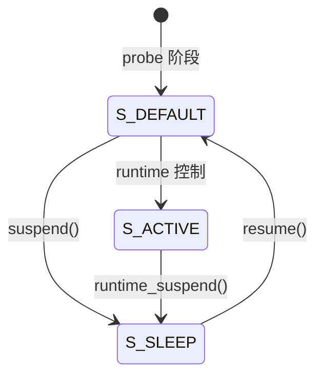

### 3.8.2_DTS_to_内核加载流程

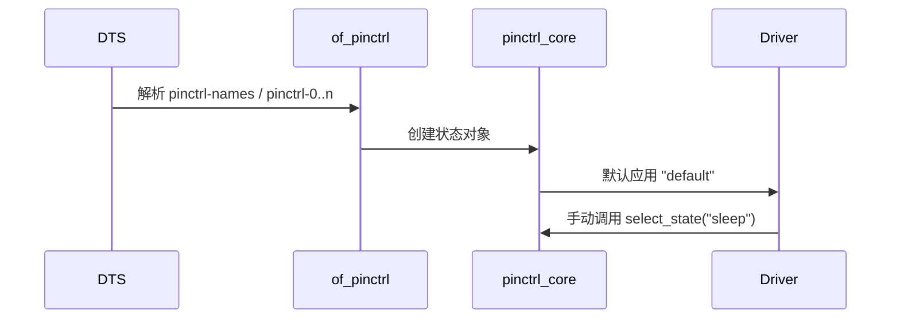

------

## 3.9_调试与验证技巧

| 操作              | 命令                                                  | 说明               |
| ----------------- | ----------------------------------------------------- | ------------------ |
| 查看状态列表      | `cat /sys/kernel/debug/pinctrl/<dev>/maps`            | 显示所有状态与引脚 |
| 查看当前状态      | `cat /sys/kernel/debug/pinctrl/<dev>/state`           | 当前生效状态       |
| 手动切换状态      | `echo sleep > /sys/kernel/debug/pinctrl/<dev>/select` | 手动切换           |
| 验证电气参数      | `cat /sys/kernel/debug/pinctrl/<dev>/pinconf-pins`    | 查看 bias/drive    |
| 检查 DTS 加载顺序 | `dmesg                                                | grep pinctrl`      |

------

## 3.10_小结

| 功能层       | DTS 属性                      | 内核函数                 | 工程意义          |
| ------------ | ----------------------------- | ------------------------ | ----------------- |
| **状态定义** | `pinctrl-names` / `pinctrl-0` | `pinctrl_lookup_state()` | 定义多态配置      |
| **自动切换** | default/sleep                 | `pinctrl_pm_select_*`    | 挂起/恢复自动行为 |
| **电气配置** | bias / drive-strength         | pinconf_ops              | 控制信号质量      |
| **复用功能** | function/pins                 | IOMUX / GRF              | 决定引脚功能      |
| **调试接口** | `/sys/kernel/debug/pinctrl/`  | 用户验证通道             | 方便现场排查      |

**一句话总结：**

> pinctrl 是 Linux 引脚管理的“灵魂层”。
>  它不仅定义“引脚是谁”，还定义“它在不同阶段该做什么”。

------

# 第4章_interrupt_子系统的工程语法与级联机制

*(参考平台：NXP i.MX6ULL / Rockchip RK356x · Linux ≥ 6.1)*

------

## 4.1_主题引入_事件如何从脚到_CPU

在工程现场，你最常遇到的不是“如何设个中断号”，而是**这条中断线到底挂在谁的域上**、**触发类型是否和电气一致**、**两级/三级域如何级联**、**多个中断脚怎么一起管**。
 本章以真实场景为骨架，讲清楚：

- `interrupts` / `interrupt-parent` / `interrupts-extended` 的**组合语法**；
- **GPIO 控制器作为中断控制器**时的 2-cells 语义；
- **GIC** 的 3-cells 语义（SPI/PPI + 触发方式）；
- **级联**：GPIO 域 → GIC 域的上报路径；
- **多中断源设备**、**扩展器**、**共享中断**、**线程化中断**在工程里的落地方式与调试套路。

------

## 4.2_数据结构视角_irqdomain_把不同控制器_装进同一地图

- **irqdomain**：把“硬件中断号（hwirq）”映射到“Linux 虚拟中断号（virq）”。
- **父子域**：GPIO 控制器的中断域是 **子域**，GIC 是 **父域**。
- 流程概念：
  1. 设备在 DTS 指向“某个中断控制器（interrupt-parent）”；
  2. 该控制器根据自身 `#interrupt-cells` 解析 specifier；
  3. irqdomain 建立 virq ↔ hwirq 映射；
  4. 最终用 `request_threaded_irq()` 把 virq 交给你的驱动回调。

------

## 4.3_语法要点速查(工程向)

| 场景                          | 关键属性                                                     | cells | 典型值/说明                      |
| ----------------------------- | ------------------------------------------------------------ | ----- | -------------------------------- |
| **GIC 直连**                  | `interrupts = <type id flags>`                               | 3     | `GIC_SPI 74 IRQ_TYPE_LEVEL_HIGH` |
| **GPIO 控制器发中断**         | `interrupts = <offset flags>` + `interrupt-parent = <&gpioX>` | 2     | `<5 IRQ_TYPE_EDGE_FALLING>`      |
| **同设备多个中断脚**          | `interrupts-extended = <&gpio1 5 ...>, <&gpio2 7 ...>`       | 混合  | 同一属性里列多个源               |
| **GPIO 控制器声明为 irqchip** | `interrupt-controller; #interrupt-cells = <2>;`              | 2     | 通常在 `gpio@...` 节点里         |
| **中断防抖**                  | 设备节点私有属性或 pinconf                                   | —     | `debounce-interval = <10>` 等    |
| **共享/线程化**               | 驱动 `request_threaded_irq()` 标志位                         | —     | `IRQF_SHARED`, `IRQF_ONESHOT`    |

> 经验法则：
>
> - **谁接线就找谁当 `interrupt-parent`**；
> - **GPIO → GIC** 是两级：设备指向 GPIO；GPIO 再通过自己的 `interrupts = <GIC_SPI ...>` 连 GIC。

------

## 4.4_工程实例一_按键(gpio-keys)从_GPIO_域到_GIC

### 4.4.1_i.MX6ULL_版本(GPIO1_IO05_为下降沿触发)

```dts
/ {
    gpio-keys {
        compatible = "gpio-keys";
        pinctrl-names = "default";
        pinctrl-0 = <&pinctrl_key_default>;

        key_enter: key-enter {
            label = "ENTER";
            linux,code = <KEY_ENTER>;
            debounce-interval = <10>;
            interrupt-parent = <&gpio1>;
            interrupts = <5 IRQ_TYPE_EDGE_FALLING>;
        };
    };
};

&iomuxc {
    pinctrl_key_default: key-default {
        fsl,pins = <
            MX6UL_PAD_GPIO1_IO05__GPIO1_IO05  0x10b0
        >;
    };
};
```

**解析**

- 设备**指向 GPIO1** 作为 parent（2-cells）；
- GPIO1 控制器在自己节点里**另有** `interrupts = <GIC_SPI ...>` 接入 GIC。
- **调试**：`cat /proc/interrupts | grep gpio` 应看到相应计数递增。

### 4.4.2_RK356x_版本(GPIO2_C1_上升沿)

```dts
/ {
    gpio-keys {
        compatible = "gpio-keys";
        pinctrl-names = "default";
        pinctrl-0 = <&pinctrl_key_default>;

        key_enter: key-enter {
            label = "ENTER";
            linux,code = <KEY_ENTER>;
            debounce-interval = <10>;
            interrupt-parent = <&gpio2>;
            interrupts = <RK_PC1 IRQ_TYPE_EDGE_RISING>;
        };
    };
};

&pinctrl {
    pinctrl_key_default: key-default {
        rockchip,pins = <
            RK_PC1 RK_FUNC_GPIO &pcfg_pull_down
        >;
    };
};
```

**要点**

- RK 写法用 `RK_PC1` 宏，触发沿与 bias 一致更稳定。
- **常见坑**：`interrupt-parent` 写成 `&gic` 会导致**根本不触发**（设备并没有直接连 GIC）。

------

## 4.5_工程实例二_多中断源设备(READY_+_FAULT)

某 SPI 传感器有两根中断脚：`READY`（上升沿），`FAULT`（下降沿），分别接在不同 GPIO bank。

### 4.5.1_DTS(通用写法_i.MX6ULL_举例)

```dts
sensor@0 {
    compatible = "vendor,sensorx";
    reg = <0>;
    spi-max-frequency = <10000000>;

    interrupts-extended = <&gpio2 12 IRQ_TYPE_EDGE_RISING>,
                          <&gpio3  7 IRQ_TYPE_EDGE_FALLING>;
    interrupt-names = "ready", "fault";
};
```

### 4.5.2_驱动侧关键点

```c
int irq_ready = platform_get_irq_byname(pdev, "ready");
int irq_fault = platform_get_irq_byname(pdev, "fault");

devm_request_threaded_irq(dev, irq_ready,  NULL, isr_ready,
                          IRQF_ONESHOT | IRQF_TRIGGER_RISING, "sensorx-ready", dev);
devm_request_threaded_irq(dev, irq_fault,  NULL, isr_fault,
                          IRQF_ONESHOT | IRQF_TRIGGER_FALLING, "sensorx-fault", dev);
```

**经验**

- 用 `interrupts-extended` + `interrupt-names` 让**多源**在 DTS/驱动里一一对应；
- `IRQF_ONESHOT` 能避免 top-half 返回后线程化 handler 与芯片重复触发的竞争。

------

## 4.6_工程实例三_I/O_扩展器(MCP23017_/_PCA9539)级联中断

扩展器自己是 **GPIO 控制器 + 中断控制器**，它的 **INT 引脚** 再接到主控的某个 GPIO。

### 4.6.1_i.MX6ULL_版本(PCA9539_举例)

```dts
&i2c1 {
    pca9539: gpio-exp@20 {
        compatible = "nxp,pca9539";
        reg = <0x20>;

        /* 扩展器的中断输出脚连到了主控 GPIO5_IO11 */
        interrupt-parent = <&gpio5>;
        interrupts = <11 IRQ_TYPE_EDGE_FALLING>;

        gpio-controller;
        #gpio-cells = <2>;
        interrupt-controller;
        #interrupt-cells = <2>;
    };
};

/* 下面这个下游设备，直接把 pca9539 当做中断控制器使用 */
some-device@0 {
    compatible = "vendor,foo";
    interrupt-parent = <&pca9539>;
    interrupts = <3 IRQ_TYPE_EDGE_RISING>;  /* 扩展器的第3脚 */
};
```

### 4.6.2_要点

- **两级域**：设备 → 扩展器（子域） → 主控 GPIO（更高一级）→ GIC；
- 扩展器驱动里会 `gpiochip_irqchip_add()`，把每根扩展 GPIO 暴露成可路由的 irq。
- **调试**： `/proc/interrupts` 能看到**扩展器驱动名**与**主控 GPIO 对应的 SPI 号**。

------

## 4.7_工程实例四_共享中断(IRQF_SHARED)

某些板级设计把两个设备的中断线 **物理并联** 到同一根 GPIO；或者某控制器的一个 IRQ 线上挂多个设备（较少见）。

### 4.7.1_DTS(并联到_gpio2_pc1)

```dts
devA: device-a@0 {
    compatible = "vendor,a";
    interrupt-parent = <&gpio2>;
    interrupts = <RK_PC1 IRQ_TYPE_EDGE_FALLING>;
};

devB: device-b@1 {
    compatible = "vendor,b";
    interrupt-parent = <&gpio2>;
    interrupts = <RK_PC1 IRQ_TYPE_EDGE_FALLING>;
};
```

### 4.7.2_驱动侧(都要用_IRQF_SHARED)

```c
devm_request_threaded_irq(dev, irq, NULL, isr_a,
    IRQF_ONESHOT | IRQF_SHARED | IRQF_TRIGGER_FALLING, "devA", dev);
devm_request_threaded_irq(dev, irq, NULL, isr_b,
    IRQF_ONESHOT | IRQF_SHARED | IRQF_TRIGGER_FALLING, "devB", dev);
```

**注意**

- handler 内**必须判别**是否由本设备触发（读状态寄存器）；
- 若任一 handler 不返回 `IRQ_HANDLED/IRQ_NONE` 合理值，会导致**中断风暴**或丢中断。

------

## 4.8_工程实例五_唤醒中断(Wakeup_IRQ)与电气一致性

### 4.8.1_场景

- Wi-Fi `HOST_WAKE` / 触摸屏 `INT` 需要在系统挂起时唤醒 SoC。

### 4.8.2_DTS_关键点(i.MX6ULL_举例)

```dts
brcmf: wifi@1 {
    compatible = "brcm,bcm4339-fmac";
    interrupt-parent = <&gpio5>;
    interrupts = <10 IRQ_TYPE_LEVEL_HIGH>;
    wakeup-source;                /* 关键：声明为系统唤醒源 */
};
```

### 4.8.3_驱动/电气一致性

- 中断触发类型与实际硬件电气要**配套**（上拉 + 上升沿 / 下拉 + 下降沿）；
- 某些平台（RK）还需在 `pinctrl sleep` 状态里保证 `input-enable` 与合适的 `bias`。

------

## 4.9_典型调试路径与一键排查清单

### 4.9.1_快速三步

1. **确认层级**：
    `cat /proc/interrupts | egrep 'gpio|gic|pca|mcp'`
   - 看是否注册；计数是否递增；所属驱动是否正确。
2. **确认 parent**：
   - 设备节点 `interrupt-parent` 是否指向 GPIO 控制器而不是 GIC；
   - GPIO 控制器本身节点是否声明了 `interrupts = <GIC_SPI ...>`。
3. **确认触发+电气**：
   - `interrupts` 的触发类型与 `pinctrl` 的 `bias` 是否一致；
   - 上拉/下拉与外部电路匹配；
   - 必要时在 `sleep` 状态确保 `input-enable`。

### 4.9.2_debugfs/trace

- `cat /sys/kernel/debug/irq/irqs/<virq>`：看父域、handler；
- `echo function irq:irq_handler_entry > /sys/kernel/debug/tracing/set_ftrace_filter` + `cat trace`：看是否进入 handler；
- `cat /sys/kernel/debug/pinctrl/*/pinconf-pins`：看当前 pin 的 bias/drive。

------

## 4.10_常见坑位与修复模板

| 现象            | 根因                                      | 修复                                                         |
| --------------- | ----------------------------------------- | ------------------------------------------------------------ |
| 按键完全不触发  | `interrupt-parent` 写成 `&gic`            | 改成对应 `&gpioX`；由 GPIO 控制器做 parent                   |
| 偶发抖动/连发   | 边沿类型与电气配置不匹配                  | 上拉配上升沿、下拉配下降沿；必要时添加 `debounce-interval`   |
| 共享中断风暴    | 其中一个 handler 不清 pending             | 在各自 handler 里精准判别源并清状态                          |
| resume 后丢中断 | `sleep` 状态未启用 `input-enable` 或 bias | 在 sleep pinctrl state 中补足 pinconf                        |
| 设备映射失败    | 扩展器未声明 `interrupt-controller`       | 在扩展器节点加 `interrupt-controller; #interrupt-cells = <2>;` |
| 触发类型错误    | SoC 驱动不支持该类型                      | 改为 SoC 支持的 `IRQ_TYPE_*`，或在驱动里 mask/ack 转换       |

------

## 4.11_可视化_两级域与多源中断

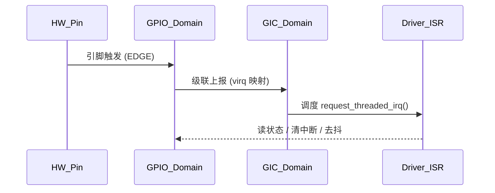

------

## 4.12_小结

| 要点                              | 工程结论                                                     |
| --------------------------------- | ------------------------------------------------------------ |
| `interrupt-parent` 决定**第一站** | 线接到谁，就指向谁（GPIO 还是扩展器），别直接指 GIC          |
| 2-cells vs 3-cells                | GPIO 域：`<offset flags>`；GIC：`<type id flags>`            |
| 多源中断                          | 用 `interrupts-extended` + `interrupt-names`，驱动 `platform_get_irq_byname()` |
| 级联                              | 扩展器/GPIO 当子域，最终走 GIC，问题多半卡在**域关系或电气不一致** |
| 线程化与共享                      | `IRQF_ONESHOT/SHARED` 是工程保险丝，记得在 ISR 里**判别来源** |
| 低功耗唤醒                        | `wakeup-source;` + sleep state 的 `input-enable` 与正确 `bias` |

**一句话总结：**

> 把“谁是 parent、触发类型、电气 bias、级联层级”四件事捋顺，你就掌控了 Linux 的中断工程世界。

------

我们现在进入本书最关键、最有“实战含金量”的章节。
 前面三章是“单子系统语法”，第四章讲了中断的层级机制，而这一章 ——
 将第一次把 **GPIO + pinctrl + interrupt 三者结合起来**，
 以完整外设为例进行“语法—机制—实例—调试”的一体化工程讲解。

------

# 第5章_三者协同机制与混合工程实例

*(以 i.MX6ULL 与 RK356x 为主要参考平台 · Linux ≥ 6.1)*

------

## 5.1_主题引入_三者协同的意义

> “为什么设备树里一堆 `gpios`、`pinctrl`、`interrupts`，缺一个都跑不起来？”

—— 这是很多初学者最早在 Linux 驱动移植中遇到的疑惑。

现实工程中，一个外设几乎从不只使用单一子系统：

- **Wi-Fi 模块**：需要 GPIO 控制上电（REG_ON）、pinctrl 配置复用、HOST_WAKE 中断；
- **摄像头模块**：PWDN、RESET、MCLK 都是 GPIO 控制，且伴随中断唤醒；
- **RS485/UART**：需要引脚复用、GPIO 控制方向、可能还有接收中断；
- **触摸屏**：I²C 传输 + GPIO 中断 + bias 电气属性。

这些外设的节点往往跨越三个子系统的语法边界。
 所以本章的目标是让你理解并**掌握三者之间的协同机制**。

------

## 5.2_数据结构与机制层级关系

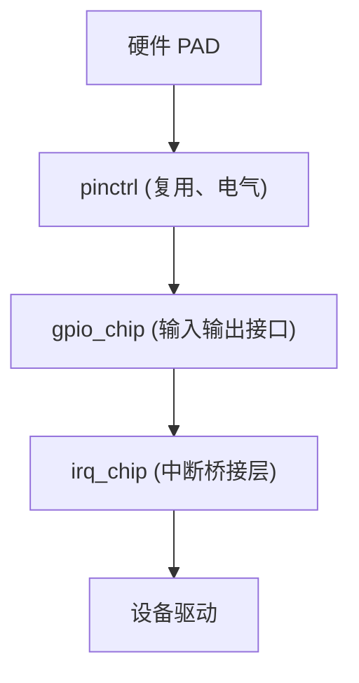

| 层级    | 所属子系统 | 关键结构体           | 职责               |
| ------- | ---------- | -------------------- | ------------------ |
| PAD     | 硬件       | —                    | 物理引脚           |
| MUX     | pinctrl    | `struct pinctrl_dev` | 功能选择、电气配置 |
| GPIO    | gpio       | `struct gpio_chip`   | 电平操作接口       |
| IRQCHIP | irq        | `struct irq_chip`    | 边沿/电平触发映射  |
| DRIVER  | 驱动层     | —                    | 执行业务逻辑       |

> **理解顺序**：`pinctrl` 决定“脚是谁”；`gpio` 决定“电平怎么动”；`interrupt` 决定“事件怎么来”。

------

## 5.3_工程实例一_Wi-Fi_模块完整组合(REG_ON_+_HOST_WAKE)

### 5.3.1_i.MX6ULL_平台_DTS

```dts
wifi@1 {
    compatible = "brcm,bcm4339-fmac";
    reg = <1>;
    interrupt-parent = <&gpio5>;
    interrupts = <10 IRQ_TYPE_LEVEL_HIGH>;
    wakeup-source;

    pinctrl-names = "default", "sleep";
    pinctrl-0 = <&pinctrl_wifi_default>;
    pinctrl-1 = <&pinctrl_wifi_sleep>;

    brcm,reset-gpios = <&gpio5 2 GPIO_ACTIVE_LOW>;  /* WL_REG_ON */
};

&iomuxc {
    pinctrl_wifi_default: wifi-default {
        fsl,pins = <
            MX6UL_PAD_SNVS_TAMPER0__GPIO5_IO00 0x1b0b1  /* HOST_WAKE */
            MX6UL_PAD_SNVS_TAMPER2__GPIO5_IO02 0x1b0b0  /* WL_REG_ON */
        >;
    };
    pinctrl_wifi_sleep: wifi-sleep {
        fsl,pins = <
            MX6UL_PAD_SNVS_TAMPER0__GPIO5_IO00 0x10b0
            MX6UL_PAD_SNVS_TAMPER2__GPIO5_IO02 0x10b0
        >;
    };
};
```

### 5.3.2_RK3568_平台_DTS

```dts
&wifi {
    compatible = "brcm,bcm43456-fmac";
    interrupt-parent = <&gpio2>;
    interrupts = <RK_PC5 IRQ_TYPE_LEVEL_HIGH>;
    wakeup-source;

    pinctrl-names = "default", "sleep";
    pinctrl-0 = <&wifi_pins_default>;
    pinctrl-1 = <&wifi_pins_sleep>;

    reset-gpios = <&gpio2 RK_PC3 GPIO_ACTIVE_LOW>;
};

&pinctrl {
    wifi_pins_default: wifi-default {
        rockchip,pins = <
            RK_PC3 RK_FUNC_GPIO &pcfg_pull_none  /* WL_REG_ON */
            RK_PC5 RK_FUNC_GPIO &pcfg_pull_up    /* HOST_WAKE */
        >;
    };
    wifi_pins_sleep: wifi-sleep {
        rockchip,pins = <
            RK_PC3 RK_FUNC_GPIO &pcfg_pull_down
            RK_PC5 RK_FUNC_GPIO &pcfg_pull_down
        >;
    };
};
```

------

### 5.3.3_驱动行为链路

1️⃣ **pinctrl**

- 加载 `"default"` 状态，配置 GPIO 功能与电气属性；
- 系统挂起时切换 `"sleep"`，关闭上拉以节能。

2️⃣ **GPIO 控制**

- `reset-gpios` 由 `mmc-pwrseq-simple` 控制模块上电；
- `gpiod_set_value()` 控制 WL_REG_ON 输出。

3️⃣ **interrupt**

- `HOST_WAKE` 接入 GPIO5 → GIC；
- 触发唤醒中断。

4️⃣ **电气匹配**

- HOST_WAKE 为 **高电平有效**，对应 `IRQ_TYPE_LEVEL_HIGH`；
- bias 需设置 `pull-up` 以防悬空。

------

### 5.3.4_调试验证

| 检查点     | 命令                                           | 验证结果              |
| ---------- | ---------------------------------------------- | --------------------- |
| GPIO 电平  | `cat /sys/kernel/debug/gpio`                   | WL_REG_ON 电平切换    |
| 中断号注册 | `cat /proc/interrupts                          | grep wifi`            |
| 引脚状态   | `cat /sys/kernel/debug/pinctrl/*/pinconf-pins` | bias / drive 显示正确 |
| 唤醒功能   | `cat /sys/devices/.../power/wakeup`            | `enabled`             |

------

## 5.4_工程实例二_摄像头模块(PWDN_+_RESET_+_IRQ)

### 5.4.1_i.MX6ULL_版本

```dts
ov5640: camera@3c {
    compatible = "ovti,ov5640";
    reg = <0x3c>;

    pinctrl-names = "init", "default", "sleep";
    pinctrl-0 = <&pinctrl_cam_init>;
    pinctrl-1 = <&pinctrl_cam_default>;
    pinctrl-2 = <&pinctrl_cam_sleep>;

    reset-gpios = <&gpio3 3 GPIO_ACTIVE_LOW>;
    pwdn-gpios  = <&gpio3 4 GPIO_ACTIVE_HIGH>;

    interrupt-parent = <&gpio1>;
    interrupts = <2 IRQ_TYPE_EDGE_FALLING>;
};
```

#### (1)_状态切换逻辑

| 状态    | 行为                             |
| ------- | -------------------------------- |
| init    | 上电前，GPIO 高阻                |
| default | 工作时，复位低、PWDN 拉低        |
| sleep   | 掉电时，所有 GPIO 拉低、输入禁止 |

#### (2)_机制链

- pinctrl 决定引脚复用；
- GPIO 控制 PWDN/RESET；
- interrupt 负责帧同步信号；
- 驱动层：`ov5640.c` 调用 `devm_gpiod_get_optional()`、`request_threaded_irq()`。

------

### 5.4.2_RK3568_版本(类似配置)

```dts
ov5640: camera@3c {
    compatible = "ovti,ov5640";
    reg = <0x3c>;
    reset-gpios = <&gpio3 RK_PC3 GPIO_ACTIVE_LOW>;
    pwdn-gpios  = <&gpio3 RK_PC4 GPIO_ACTIVE_HIGH>;
    interrupt-parent = <&gpio2>;
    interrupts = <RK_PD1 IRQ_TYPE_EDGE_FALLING>;
    ...
};
```

------

## 5.5_工程实例三_RS485/UART_半双工方向控制

RS485 驱动常见于工业串口板，发送与接收共用一根信号线，因此要用 GPIO 控制 DE/RE 引脚的方向。

### 5.5.1_DTS

```dts
&uart2 {
    pinctrl-names = "default";
    pinctrl-0 = <&uart2_pins>;
    rs485-rts-active-high;
    rs485-rts-delay = <0 0>;
    linux,rs485-enabled-at-boot-time;
    gpio-rs485-de = <&gpio2 10 GPIO_ACTIVE_HIGH>;
    status = "okay";
};
```

### 5.5.2_驱动机制

```c
rs485_config.enabled = true;
rs485_config.delay_rts_before_send = 0;
rs485_config.delay_rts_after_send  = 0;
gpio_direction_output(rs485_de, 0);

serial_rs485_start_tx(port)
{
    gpio_set_value(rs485_de, 1);  // 使能发送
}

serial_rs485_stop_tx(port)
{
    gpio_set_value(rs485_de, 0);  // 回到接收
}
```

→ **pinctrl 管脚配置** 确保此 GPIO 已复用为输出。
 → **GPIO 控制发送方向**。
 → **中断驱动数据完成回调**中释放方向信号。

------

## 5.6_可视化_协同路径总览

**流程图：**


**时序图：**

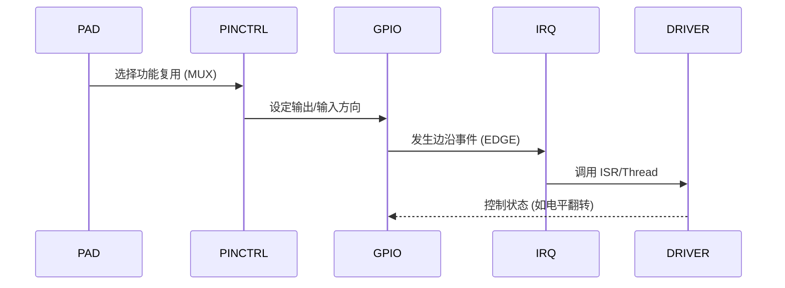

------

## 5.7_调试与验证指南

| 目标         | 命令                                           | 说明            |
| ------------ | ---------------------------------------------- | --------------- |
| 引脚复用状态 | `cat /sys/kernel/debug/pinctrl/*/pins`         | 看是否切换成功  |
| GPIO 输出值  | `cat /sys/kernel/debug/gpio`                   | 电平实时监控    |
| 中断触发次数 | `cat /proc/interrupts`                         | 验证触发路径    |
| 休眠状态     | `echo mem > /sys/power/state`                  | 验证唤醒逻辑    |
| 电气配置     | `cat /sys/kernel/debug/pinctrl/*/pinconf-pins` | 查看 pull/drive |

------

## 5.8_常见问题与修复策略

| 问题现象         | 可能原因                  | 修复方案                          |
| ---------------- | ------------------------- | --------------------------------- |
| 模块无法唤醒系统 | `wakeup-source` 未设置    | DTS 添加 `wakeup-source;`         |
| GPIO 不响应中断  | parent 错误               | 检查 `interrupt-parent`           |
| 引脚电平异常     | pinctrl 冲突              | 确认 `pinctrl-0` 与其他驱动未复用 |
| 模块上电后卡死   | bias 设置错误             | 校正 pull-up/down                 |
| 摄像头图像花屏   | sleep 状态未禁用 CLK/MCLK | 补充 `pinctrl-sleep` 状态         |
| RS485 发不出     | GPIO 未设为输出           | 检查 pinmux 与 direction          |

------

## 5.9_小结

| 组合类型            | DTS 语法关键点                   | 内核调用路径                                            | 工程重点       |
| ------------------- | -------------------------------- | ------------------------------------------------------- | -------------- |
| GPIO + pinctrl      | `gpios`, `pinctrl-names`         | `of_get_named_gpiod_flags()` + `pinctrl_select_state()` | 电平与功能同步 |
| GPIO + interrupt    | `interrupt-parent`, `interrupts` | `irqdomain_create_mapping()`                            | 中断桥接       |
| pinctrl + interrupt | `bias-*`, `drive-strength`       | `pinconf_ops` + irqchip                                 | 电气稳定       |
| 三者协同            | 上述组合全包含                   | DTS → 驱动 → ISR                                        | 完整事件链路   |

**一句话总结：**

> Linux 里的“引脚事件”不是孤立的寄存器动作，
>  而是跨越 **pinctrl → gpio → interrupt → driver** 的四级协作。
>  理解这一条链，你才能真正掌控板级硬件的“生命线”。

------


这一章将不再仅仅讨论语法或数据结构，而是总结 **i.MX6ULL 与 RK356x 平台在驱动层、设备树层、中断层、电气层的实现差异与调试策略**，让你能在工程环境中快速定位问题。

------

# 第6章_平台差异与工程问题汇总

*(对比 i.MX6ULL 与 RK356x 平台 · Linux Kernel ≥ 6.1)*

------

## 6.1_主题引入_为什么同样的设备树在另一平台就不工作

驱动开发者常常有这样的经历：

> “在 i.MX6ULL 上一切正常，但换到 RK3568 上完全不响应中断。”

这并不是驱动代码错了，而是：

- **设备树语法同名而语义不同；**
- **GPIO 子系统实现存在 platform-specific glue layer；**
- **pinctrl 解析逻辑与 irqdomain 注册路径不同。**

因此，本章将从**语法层、结构体层、寄存器映射层、调试工具层**全面剖析这两大平台的差异。

------

## 6.2_平台体系差异概览

| 维度           | i.MX6ULL                                  | RK356x                                        | 影响点                         |
| -------------- | ----------------------------------------- | --------------------------------------------- | ------------------------------ |
| SoC 厂商       | NXP                                       | Rockchip                                      | 不同的 IOMUX/IP block          |
| pinctrl 实现   | `drivers/pinctrl/freescale/pinctrl-imx.c` | `drivers/pinctrl/rockchip/pinctrl-rockchip.c` | MUX 寄存器布局不同             |
| GPIO 控制器    | `drivers/gpio/gpio-mxc.c`                 | `drivers/gpio/gpio-rockchip.c`                | gpio_chip ops 差异             |
| irqdomain 机制 | 单一线性 irqdomain                        | hierarchical irqdomain                        | 中断映射路径不同               |
| DTS bias 属性  | `fsl,pins`                                | `rockchip,pins`                               | 解析函数不同                   |
| 驱动层级       | `fsl_gpio_probe()`                        | `rockchip_gpio_probe()`                       | GPIO controller 初始化机制不同 |

------

## 6.3_DTS_层差异_属性语法与引脚配置对比

### 6.3.1_pinctrl_节点差异

| 语法关键字       | i.MX6ULL                             | RK356x                                    |
| ---------------- | ------------------------------------ | ----------------------------------------- |
| 功能节点         | `fsl,pins`                           | `rockchip,pins`                           |
| 电气属性         | 16-bit 数值，如 `0x1b0b1`            | 指针引用，如 `&pcfg_pull_up`              |
| 复用宏           | `MX6UL_PAD_*__GPIOx_IOy`             | `RK_PxY`                                  |
| 电气参数解析函数 | `imx_pinconf_parse_generic_config()` | `rockchip_pinconf_parse_generic_config()` |
| 状态管理         | pinctrl-names = "default"/"sleep"    | 同上，但状态切换函数不同                  |
| 子节点命名       | `pinctrl_XXX_default`                | `XXX_pins_default`                        |

------

### 6.3.2_GPIO_与中断属性差异

| 属性             | i.MX6ULL               | RK356x                 | 备注          |
| ---------------- | ---------------------- | ---------------------- | ------------- |
| interrupt-parent | `<&gpioN>`             | `<&gpioN>`             | 一致          |
| interrupts       | `<pin irq-type>`       | `<bank pin irq-type>`  | RK 需三级表示 |
| IRQ 类型宏       | `IRQ_TYPE_EDGE_RISING` | `IRQ_TYPE_EDGE_RISING` | 通用          |
| GPIO 号体系      | 平面索引（全局编号）   | bank + offset          | RK 更复杂     |
| 唤醒标志         | `wakeup-source;`       | `wakeup-source;`       | 一致支持      |
| gpio-hog         | 支持                   | 支持                   | 引脚固定用途  |

------

## 6.4_中断域机制差异详解

### 6.4.1_i.MX6ULL

```c
/* drivers/gpio/gpio-mxc.c */
irq_create_mapping(mxc_gpio_irq_domain, irq);
irq_set_chip_and_handler_name(irq, &mxc_gpio_irq_chip,
                              handle_level_irq, "gpio-irq");
```

- 使用线性 irqdomain；
- GPIO 控制器直接注册至 GIC；
- 中断号与 GPIO 引脚一一对应；
- probe 时直接调用 `gpiochip_add_data()`；
- `irq_set_chained_handler()` 注册共享中断入口。

### 6.4.2_RK356x

```c
/* drivers/gpio/gpio-rockchip.c */
rockchip_gpio_irqdomain_map()
{
    irq_domain_create_hierarchy(parent, ...);
    irq_set_chip_data();
}
```

- 使用 **层级中断域（hierarchical irqdomain）**；
- GPIO → parent irqchip → GIC；
- 同一个 bank 内的多个 GPIO 共用中断入口；
- 每个 bank 注册自己的 irqdomain；
- 最终映射由 `rockchip_gpio_irq_handler()` 完成。

------

### 6.4.3_可视化差异

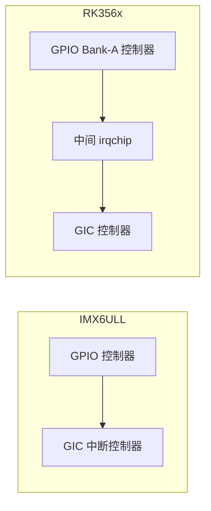

> i.MX 为一层直连，RK 为两层级联。
>  RK 的架构允许每个 GPIO bank 拥有独立的中断汇聚层，更易扩展，但解析链更长。

------

## 6.5_电气配置差异与驱动初始化

### 6.5.1_i.MX6ULL_的电气配置逻辑

```c
/* drivers/pinctrl/freescale/pinctrl-imx.c */
imx_pinconf_set(struct pinctrl_dev *pctldev, unsigned pin_id, unsigned long *configs)
{
    // 解析 config -> pad control 寄存器
    imx_set_pad_config(pad_reg, val);
}
```

电气配置由 `pad control register` 完成：
 `0x1b0b1` → drive strength + pull + slew rate 等。

### 6.5.2_RK356x_的电气配置逻辑

```c
rockchip_pinconf_set(struct pinctrl_dev *pctldev, unsigned pin, unsigned long *configs)
{
    pinconf_to_config_packed();
    rockchip_set_pull(bank, pin, arg);
    rockchip_set_drive(bank, pin, arg);
}
```

RK 使用独立的 pull/drive 寄存器字段，通过 `pcfg_*` 宏调用。
 驱动层以结构体 `rockchip_pin_bank` 管理各 bank 的寄存器基址。

------

## 6.6_常见工程问题对照表

| 问题              | 平台   | 现象                   | 原因                        | 解决方案                    |
| ----------------- | ------ | ---------------------- | --------------------------- | --------------------------- |
| GPIO 电平无法切换 | RK     | 写高后仍为 0           | MUX 未复用为 GPIO           | pinctrl-state 配置错误      |
| 中断不触发        | i.MX   | probe OK，但不进 ISR   | `interrupt-parent` 指错     | 指向 gpio 控制器而非 GIC    |
| 唤醒失败          | RK     | suspend 可进但唤醒无效 | GPIO 未注册为 wakeup-source | DTS 增加 `wakeup-source;`   |
| bias 不生效       | i.MX   | 引脚悬空               | pinconf 未解析正确          | 检查 0x1b0b1 电气位         |
| 引脚复用冲突      | 两平台 | probe 时报错 -EBUSY    | 同引脚被多个节点占用        | 通过 debugfs 查 pin owner   |
| 低功耗模式电流高  | RK     | sleep 模式电流异常     | 未切换至 sleep pinctrl      | `pinctrl-1 = <&pins_sleep>` |

------

## 6.7_调试命令体系(通用_+_平台特有)

| 类别         | 命令                                   | 说明                  |
| ------------ | -------------------------------------- | --------------------- |
| GPIO 状态    | `cat /sys/kernel/debug/gpio`           | 电平、电气状态        |
| pinctrl 调试 | `cat /sys/kernel/debug/pinctrl/*/pins` | 引脚复用信息          |
| 中断调试     | `cat /proc/interrupts`                 | IRQ 计数验证          |
| 唤醒源       | `cat /sys/kernel/debug/wakeup_sources` | 验证唤醒链            |
| i.MX 专属    | `devmem 0x020E0000`                    | 直接读 PAD_CTL 寄存器 |
| RK 专属      | `devmem 0xFDC20000`                    | 读 bank 控制寄存器    |
| 驱动调试     | `echo 8 > /proc/sys/kernel/printk`     | 临时放宽内核 log 等级 |

------

## 6.8_可视化_跨平台机制图

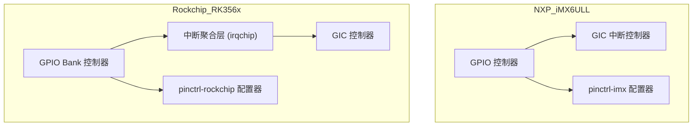

------

## 6.9_小结

| 层级      | i.MX6ULL          | RK356x         | 结论             |
| --------- | ----------------- | -------------- | ---------------- |
| MUX 配置  | 16-bit 值编码     | 宏指针配置     | RK 更易读        |
| GPIO 控制 | 线性号映射        | bank + offset  | RK 更复杂        |
| 中断体系  | 线性 irqdomain    | 层级 irqdomain | RK 可扩展性更强  |
| 电气配置  | PADCTL 一体寄存器 | 分离寄存器     | RK 更精细        |
| 驱动接口  | 通用              | 通用           | 驱动层兼容性好   |
| 关键挑战  | MUX 值理解        | IRQ 映射追踪   | 工程调试差异显著 |

**一句话总结：**

> i.MX6ULL 追求简单直接，RK356x 强调层次与灵活。
>  前者易移植，后者更可扩展 —— 真正掌握两者差异，才能在工程现场中“看 log 识平台”。

------

# 第7章_调试与验证技巧_从引脚到中断的全链路追踪

------

## 7.1_主题引入_驱动成功加载_≠_驱动真正工作

许多初学者在调试驱动时，只看到了：

```
[    1.234567] mydriver: probe success
```

于是误以为驱动已经“正常运行”。
 但在实际系统中，真正要确认以下 3 个层次：

| 层次                     | 验证目标                   | 判断依据                        |
| ------------------------ | -------------------------- | ------------------------------- |
| **设备树 → pinctrl**     | 引脚复用、电气属性配置正确 | 引脚状态、bias、电平方向        |
| **GPIO → 驱动控制**      | 电平变化符合预期           | GPIO debugfs 电平变化           |
| **Interrupt → 事件响应** | 中断触发与 ISR 调用链完整  | `/proc/interrupts` + trace 验证 |

**本章目标：**
 构建一个可以在任何 SoC 上快速验证 GPIO / pinctrl / IRQ 状态的调试体系。

------

## 7.2_调试框架层级图

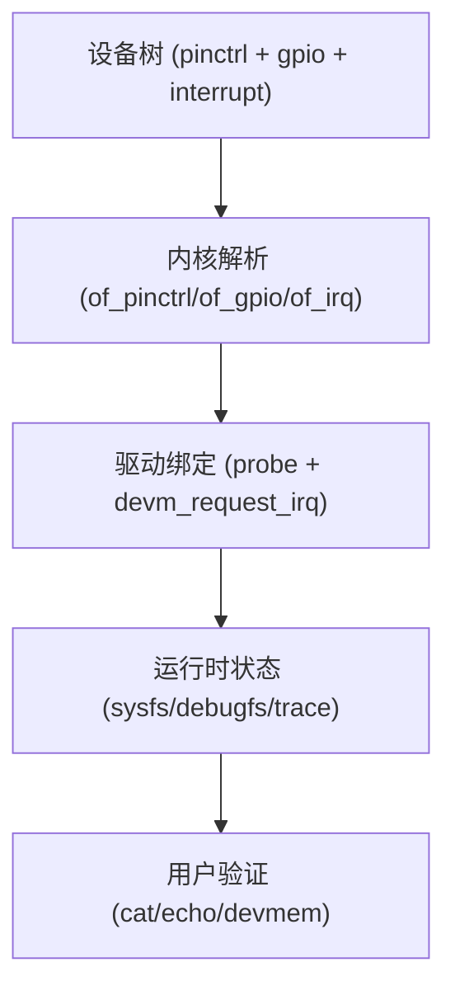

------

## 7.3_数据结构视角_如何在运行时定位引脚信息

### 7.3.1_设备树_to_pinctrl_解析路径

1️⃣ **设备树节点**

```dts
mydev@0 {
    pinctrl-names = "default";
    pinctrl-0 = <&pinctrl_mydev_default>;
};
```

2️⃣ **内核解析函数**

```c
of_pinctrl_get(dev);
pinctrl_select_state(p, "default");
```

3️⃣ **验证命令**

```bash
cat /sys/kernel/debug/pinctrl/*/pins
cat /sys/kernel/debug/pinctrl/*/pinmux-pins
```

🧭 **输出示例（i.MX6ULL）**

```
pin 43 (GPIO1_IO11): mydev function gpio, pull-up, drive-strength 3
```

------

### 7.3.2_GPIO_层调试

```bash
cat /sys/kernel/debug/gpio
```

输出类似：

```
gpiochip1: GPIOs 0-31, parent: platform/2020000.gpio, 2020000.gpio:
 gpio-10 (reset               ) out hi
 gpio-12 (wakeup              ) in  lo IRQ
```

**开发者解读：**

- “out hi” → 当前输出高；
- “in lo IRQ” → 该 GPIO 为输入且绑定中断；
- 可通过 `echo 1 > /sys/class/gpio/gpio10/value` 测试输出。

------

### 7.3.3_中断层调试

```bash
cat /proc/interrupts | grep gpio
```

输出：

```
122:     40    0   GIC  122  Edge  gpio-keys
```

若触发中断后数字增长，说明中断正常；
 若不增长，则进入 **中断追踪阶段**（见 §7.6）。

------

## 7.4_用户视角_可视化验证引脚行为

### 7.4.1_引脚电平验证(示波器_/_逻辑分析仪)

| 动作          | 预期波形       | 典型异常                      |
| ------------- | -------------- | ----------------------------- |
| GPIO 输出切换 | 方波稳定       | 拉不高（未复用/电气属性错误） |
| 外设唤醒信号  | 单次高电平脉冲 | 一直高（未释放）              |
| 中断输入信号  | 突变沿         | 平线（中断未连接）            |

> 推荐结合 `echo 1/0` 控制 GPIO，再同步观测波形。

------

### 7.4.2_sysfs_实验(手动控制)

```bash
echo 10 > /sys/class/gpio/export
echo out > /sys/class/gpio/gpio10/direction
echo 1 > /sys/class/gpio/gpio10/value
```

> 若报错 “Device or resource busy”，说明该引脚被驱动占用，不能通过 sysfs 控制。

------

## 7.5_开发者视角_内核动态调试与_trace

### 7.5.1_动态_printk

```bash
echo "file drivers/gpio/gpiolib*.c +p" > /sys/kernel/debug/dynamic_debug/control
```

即可看到：

```
gpiolib.c: gpiochip_add_data: registered GPIO chip 2020000.gpio with 32 GPIOs
```

### 7.5.2_tracepoint_GPIO_&_IRQ

```bash
echo 1 > /sys/kernel/debug/tracing/events/gpio/enable
echo 1 > /sys/kernel/debug/tracing/events/irq/enable
cat /sys/kernel/debug/tracing/trace_pipe
```

输出示例：

```
irq_handler_entry: irq=122 name=gpio-keys
irq_handler_exit: irq=122 ret=handled
```

> 通过 trace 可以观察中断触发时间、频率与处理结果。

------

## 7.6_中断调试_逐层验证链路

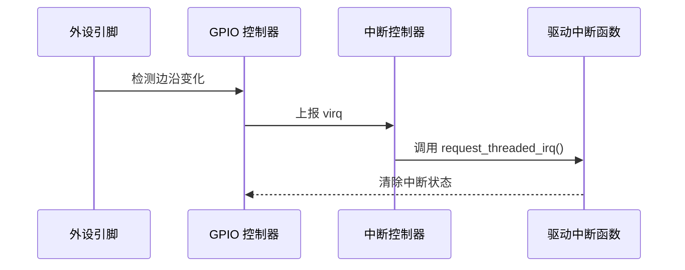

### 7.6.1_调试步骤

| 步骤 | 命令                                          | 目标               |
| ---- | --------------------------------------------- | ------------------ |
| 1    | `cat /proc/interrupts`                        | 检查中断号是否注册 |
| 2    | `grep "gpio" /sys/kernel/debug/irq/*`         | 验证中断所属控制器 |
| 3    | `trace_pipe`                                  | 查看中断触发频率   |
| 4    | `cat /sys/kernel/debug/pinctrl/*/pinmux-pins` | 检查复用正确性     |

------

## 7.7_常见错误与排查技巧

| 现象                   | 原因               | 验证命令                          | 修复                     |
| ---------------------- | ------------------ | --------------------------------- | ------------------------ |
| GPIO 不响应输出        | 未设置方向         | `/sys/class/gpio/gpio*/direction` | 设置 `out`               |
| 无法导出 GPIO          | 被驱动占用         | `cat /sys/kernel/debug/gpio`      | 使用内核 API 操作        |
| 中断不触发             | 边沿类型错误       | `/proc/interrupts` + `trace`      | 修改 DTS 中 `IRQ_TYPE_*` |
| probe 成功但外设无动作 | pinctrl 状态未切换 | `cat /sys/kernel/debug/pinctrl/*` | 检查 `pinctrl-names`     |
| 中断计数溢出           | 抖动过多           | trace 验证后加去抖逻辑            | 加硬件/软件去抖          |

------

## 7.8_可视化_完整调试链

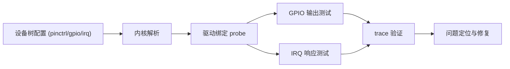

------

## 7.9_小结

| 调试阶段     | 工具命令                     | 作用                |
| ------------ | ---------------------------- | ------------------- |
| pinctrl 验证 | `/sys/kernel/debug/pinctrl`  | 复用状态、电气属性  |
| GPIO 验证    | `/sys/kernel/debug/gpio`     | 输出/输入方向、电平 |
| 中断验证     | `/proc/interrupts`           | 计数与触发          |
| trace 验证   | `/sys/kernel/debug/tracing/` | 实时事件流          |
| sysfs 试验   | `/sys/class/gpio`            | 手动控制 GPIO       |
| devmem 验证  | `devmem <addr>`              | 直接读寄存器位      |

**一句话总结：**

> 驱动开发不是“写代码”，而是“观察系统是否按预期反应”。
>  只有掌握 debugfs、trace 与电气验证三位一体的方法，
>  才能真正让一个外设从“亮起来”到“可靠运行”。

------

