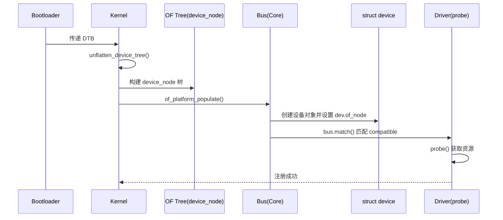
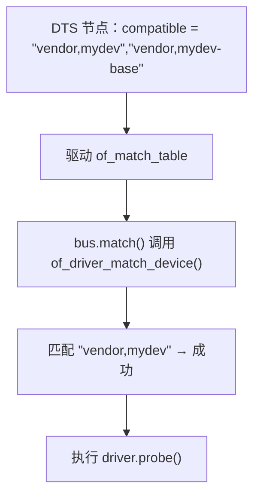
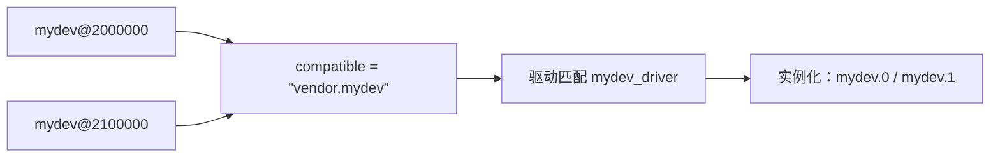
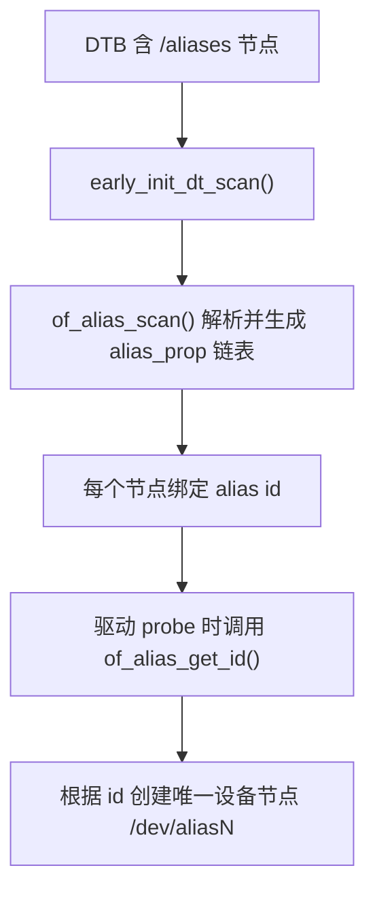
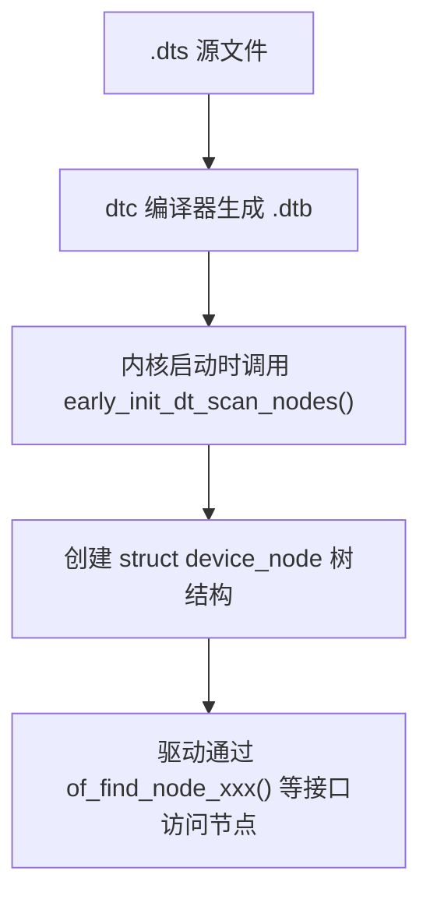
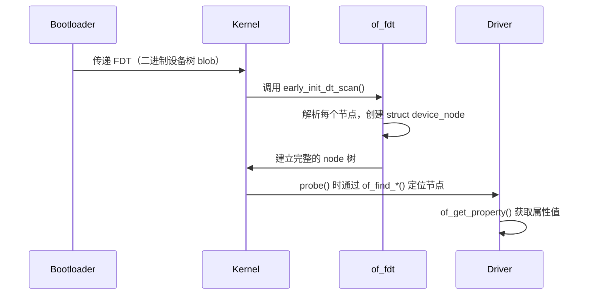
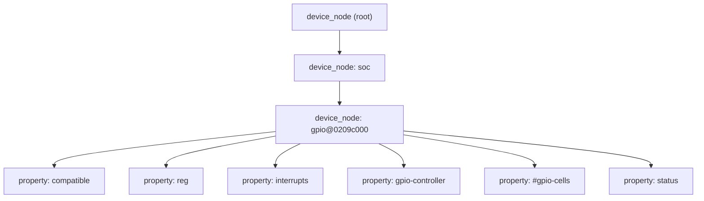

[TOC]


------

# 第1章_设备树到设备节点的绑定流程(从_DTB_到_driver_probe)

## 1.1_主题引入

**目标**：讲解 Linux 启动后从 **DTB → OF 树构建 → 设备对象生成 → 驱动匹配 → probe() 调用** 的完整机制。本章将精确说明每个阶段涉及的 **数据结构、函数、属性与绑定逻辑**，确保开发者能将 **设备树语法（DTS）** 与 **内核数据结构（struct device / device_node）** 一一对应，掌握设备与驱动绑定的完整原理。

------

## 1.2_数据结构视角

### 1.2.1_设备树节点与_device_node

| 元素                          | 类型       | 说明                                              |
| ----------------------------- | ---------- | ------------------------------------------------- |
| `device_node`                 | 内核结构体 | 每个 DT 节点在内核中对应一个 `struct device_node` |
| `name` / `type` / `full_name` | 字符串     | 节点名称与完整路径                                |
| `properties`                  | 链表       | 节点属性（compatible、reg、interrupts 等）        |
| `phandle`                     | 整数       | 节点引用句柄，用于 `&gpio1` 等                    |

`struct device_node` 说明参考 [附录 A/struct device_node](#struct device_node)。

**属性语义与绑定意义：**

- `compatible`：用于驱动匹配；
- `reg`：声明寄存器地址与大小；
- `interrupts`：声明中断号；
- `clocks` / `resets`：声明依赖；
- `*-gpios`：GPIO 控制信号；
- `pinctrl-*`：复用与电气配置。

------

### 1.2.2_设备与驱动的结构映射

| 结构体                   | 含义     | 关键成员                           |
| ------------------------ | -------- | ---------------------------------- |
| `struct device`          | 设备对象 | `.of_node`（指向 device_node）     |
| `struct platform_device` | 平台设备 | `.resource[]`（reg 等）            |
| `struct device_driver`   | 驱动对象 | `.of_match_table`（compatible 表） |

**关键关系**：

```text
device_node (from DTS)
       ↓
struct device (.of_node)
       ↓
struct platform_device / i2c_client / spi_device
       ↓
struct device_driver (of_match_table)

┌────────────────────────────────────────────────────────────┐
│ ① 设备树加载阶段（bootloader → kernel）                   │
└────────────────────────────────────────────────────────────┘
    ├─ Bootloader 将编译好的 .dtb 地址传递给内核启动参数。
    │   例如：r2 = <dtb address> 传入 setup_arch()。
    │
    ├─ 内核早期解析函数：
    │     start_kernel()
    │       → setup_arch()
    │         → early_init_dt_scan()
    │           → early_init_dt_scan_nodes()
    │             → unflatten_device_tree()
    │
    ├─ 功能：解析 FDT（Flattened Device Tree）二进制结构，
    │        构造内核内存中的 “struct device_node” 树。
    │
    └─ 结果：所有 DTS 节点都以 device_node 链接成一棵内核树。
              全局根节点存储于全局变量 of_root。

              例如：
              /soc/gpio@0209c000
              /soc/i2c@021a0000
              /soc/spi@021f8000
              等节点都已存在。


┌────────────────────────────────────────────────────────────┐
│ ② 平台设备自动创建阶段（of_platform_populate）             │
└────────────────────────────────────────────────────────────┘
    ├─ 入口：
    │     drivers/of/platform.c
    │     of_platform_default_populate_init()
    │       → of_platform_populate(of_root, NULL, NULL, NULL)
    │
    ├─ 功能：
    │     遍历 device_node 树，找到具有 “compatible”、
    │     “status = okay”、以及 “reg” 等关键属性的节点。
    │
    ├─ 对每个匹配节点调用：
    │     of_platform_device_create_pdata(np, bus_id, pdata)
    │       └→ platform_device_alloc()
    │       └→ pdev->dev.of_node = np;        ← 关键绑定
    │       └→ platform_device_add(pdev)
    │
    ├─ 至此：
    │     struct platform_device 中的 dev.of_node 指针
    │     已经指向对应的 struct device_node。
    │
    └─ 意义：
          device_node → platform_device 已完成物理层绑定。


┌────────────────────────────────────────────────────────────┐
│ ③ 设备注册到平台总线（platform_bus_type）                  │
└────────────────────────────────────────────────────────────┘
    ├─ 函数：platform_device_add()
    │       → device_add(&pdev->dev)
    │
    ├─ 结果：
    │     该设备（pdev->dev）被挂载到 “platform_bus_type” 总线下。
    │
    ├─ 同时通知总线：
    │     bus_add_device()
    │     bus_probe_device()
    │       → device_attach(dev)
    │         → __device_attach(dev, driver)
    │
    └─ 含义：
          内核开始尝试在该总线的所有驱动中寻找匹配项。


┌────────────────────────────────────────────────────────────┐
│ ④ 驱动注册阶段（module_init → platform_driver_register）    │
└────────────────────────────────────────────────────────────┘
    ├─ 驱动模块加载时：
    │     module_platform_driver(myled_driver)
    │       → platform_driver_register(&myled_driver)
    │         → driver_register(&driver->driver)
    │
    ├─ 平台驱动注册到同一条 platform_bus_type 总线。
    │
    └─ 驱动包含匹配表：
          const struct of_device_id of_match_table[] = {
              { .compatible = "mycompany,myled" },
              {}
          };
          driver->of_match_table = of_match_table;


┌────────────────────────────────────────────────────────────┐
│ ⑤ 匹配与绑定阶段（核心匹配逻辑）                          │
└────────────────────────────────────────────────────────────┘
    ├─ 内核自动执行匹配：
    │     device_attach(dev)
    │       → driver_match_device(driver, dev)
    │         → driver->bus->match(driver, dev)
    │
    ├─ 对于 platform_bus_type：
    │     match = of_driver_match_device(dev, driver)
    │
    ├─ of_driver_match_device() 内部逻辑：
    │     np = dev->of_node;
    │     match = of_match_device(driver->of_match_table, dev);
    │       → of_match_node(table, np);
    │         → 比较 compatible 串：
    │               np->"compatible"
    │               ↔
    │               driver->of_match_table[].compatible
    │
    ├─ 如果匹配成功：
    │     dev->driver = driver;
    │     driver->probe(dev) 被调用；
    │
    └─ probe() 内部：
          pdev = to_platform_device(dev);
          np = pdev->dev.of_node;      // 直接获得对应设备树节点
          of_get_property(np, "reg", NULL);
          → 驱动可访问 DTS 定义的属性。


┌────────────────────────────────────────────────────────────┐
│ ⑥ 结果验证（设备与驱动绑定成功）                          │
└────────────────────────────────────────────────────────────┘
    ├─ /sys/bus/platform/devices/ 目录下出现设备节点：
    │     myled@0/
    │
    ├─ /sys/bus/platform/drivers/myled/bind
    │     → 显示驱动已绑定设备。
    │
    ├─ dmesg 输出：
    │     [  1.123456 ] myled: probe() called for /soc/myled@0
    │
    └─ 至此绑定闭环完成：
          device_node (DT)
              ↓
          device (.of_node)
              ↓
          platform_device
              ↓
          device_driver (of_match_table)
              ↓
          → probe() 执行成功


┌────────────────────────────────────────────────────────────┐
│ ⑦ 调试提示与追踪路径                                      │
└────────────────────────────────────────────────────────────┘
    ├─ 打印节点信息：
    │     pr_info("%pOF\n", pdev->dev.of_node);
    │
    ├─ 查看 sysfs：
    │     cat /sys/firmware/devicetree/base/soc/myled@0/compatible
    │
    ├─ 查看绑定状态：
    │     ls /sys/bus/platform/drivers/
    │
    └─ 若未匹配成功：
          检查：
          - compatible 字符串是否一致；
          - DTS 节点 status = "okay"；
          - 驱动是否注册在 platform_bus_type；
          - probe() 是否正确声明为 platform_driver。
```

* device.of_node会在分析设备树的时候创建出设备节点;
* struct device_driver的of_match_table会绑定对应的compatible，通过设备节点的compatible和device_driver进行绑定。这样device就完成了和驱动的映射关系。

------

## 1.3_开发者视角_从启动到_probe_全流程

### 1.3.1_内核启动阶段

1. **Bootloader** 传递 `DTB` 地址；

2. 内核函数：

   ```c
   early_init_dt_scan();
   unflatten_device_tree();
   ```

   → 将扁平化 FDT 转换为 **OF 树**；

3. 生成 `/sys/firmware/devicetree/base/` 可查看的节点。

若 DTB 未传递或损坏 → `OF_ROOT` 为空，内核无法实例化任何设备。

------

### 1.3.2_设备实例化阶段

**函数调用链**：

- 平台设备：`of_platform_default_populate_init()` → `of_platform_populate()`；
- I2C 从设备：`of_i2c_register_devices()`；
- SPI 从设备：`spi_of_register_slave()`。

在该阶段，系统：

- 遍历 device_node；
- 创建对应的 `struct device`；
- 将 `dev->of_node` 指向原始节点；
- 注册到对应 bus。

若节点无 `status = "okay"` 或 `compatible` 缺失 → 不生成设备对象。

------

### 1.3.3_驱动匹配阶段

**匹配机制：**

- 核心函数：`of_driver_match_device()`；
- 匹配规则：
  1. 比较 `device->of_node->compatible`；
  2. 匹配 `driver->of_match_table[].compatible`；
  3. 成功后由 bus 调用驱动的 `probe()`。

**优先级：**
 越具体的 compatible（如 SoC 型号）优先；
 兼容的 generic 项次级。

------

### 1.3.4_probe_阶段资源解析

驱动的 `probe(struct platform_device *pdev)` 执行以下步骤：

```c
struct device *dev = &pdev->dev;
dev->of_node;  // 指向设备树节点
platform_get_resource();  // 解析 reg
platform_get_irq();       // 获取中断
devm_clk_get();           // 取时钟
devm_gpiod_get(dev, "reset", GPIOD_OUT_HIGH); // GPIO
devm_pinctrl_get_select_default(dev);         // 引脚配置
```

**deferred probe：**
 依赖资源未就绪时返回 `-EPROBE_DEFER`，系统稍后自动重试。

------

## 1.4_用户视角_设备树实例与作用

### 1.4.1_平台设备示例

```dts
&iomuxc {
    pinctrl_mydev_default: mydevgrp0 {
        fsl,pins = <
            MX6UL_PAD_GPIO1_IO03__GPIO1_IO03 0x10b0
        >;
    };
};

mydev@0209c000 {
    compatible = "vendor,mydev-imx6ull", "vendor,mydev";
    reg = <0x0209c000 0x1000>;
    interrupts = <GIC_SPI 75 IRQ_TYPE_LEVEL_HIGH>;
    clocks = <&clks IMX6UL_CLK_IPG>;
    clock-names = "ipg";
    reset-gpios = <&gpio1 3 GPIO_ACTIVE_LOW>;
    pinctrl-names = "default";
    pinctrl-0 = <&pinctrl_mydev_default>;
    status = "okay";
};
```

**解释：**

| 属性         | 含义         | 不写的后果              |
| ------------ | ------------ | ----------------------- |
| `compatible` | 驱动匹配依据 | 驱动不加载              |
| `reg`        | IO 映射区域  | 访问失败                |
| `interrupts` | 中断定义     | 无法注册中断            |
| `pinctrl-*`  | 引脚复用组   | GPIO 未切换成功         |
| `status`     | 节点启用     | disabled 时节点不实例化 |

------

## 1.5_可视化流程

### 1.5.1_设备树到驱动绑定时序



------

## 1.6_示例代码(驱动绑定)

```c
static const struct of_device_id mydev_of_match[] = {
    { .compatible = "vendor,mydev-imx6ull" },
    { .compatible = "vendor,mydev" },
    {}
};
MODULE_DEVICE_TABLE(of, mydev_of_match);

static int mydev_probe(struct platform_device *pdev)
{
    struct device *dev = &pdev->dev;
    struct resource *res;
    void __iomem *base;
    struct gpio_desc *reset_gpio;

    res = platform_get_resource(pdev, IORESOURCE_MEM, 0);
    base = devm_ioremap_resource(dev, res);

    reset_gpio = devm_gpiod_get(dev, "reset", GPIOD_OUT_HIGH);
    dev_info(dev, "device bound successfully\n");
    return 0;
}

static struct platform_driver mydev_driver = {
    .driver = {
        .name = "mydev",
        .of_match_table = mydev_of_match,
    },
    .probe = mydev_probe,
};
module_platform_driver(mydev_driver);
```

------

## 1.7_调试与验证

| 检查项       | 命令                                | 说明              |
| ------------ | ----------------------------------- | ----------------- |
| 节点是否生效 | `ls /sys/firmware/devicetree/base/` | 确认 DTB 正常加载 |
| 实例化结果   | `ls /sys/bus/platform/devices/`     | 查看生成设备      |
| 匹配信息     | `dmesg                              | grep mydev`       |
| 模块加载     | `modprobe mydev`                    | 触发 probe        |
| 延迟探测     | `dmesg                              | grep deferred`    |

------

## 1.8_小结

- 设备树通过 `unflatten_device_tree()` 生成 `device_node`；
- `of_platform_populate()` 或总线注册函数实例化设备；
- `dev->of_node` 是绑定关键；
- 驱动通过 `of_match_table` 匹配；
- probe() 阶段解析资源；
- `status` 与 `compatible` 决定设备能否绑定成功；
- 所有 `gpiod_get()` / `clk_get()` / `pinctrl` 均依赖设备节点的正确绑定。


------

# 第2章_设备树_compatible_属性与驱动匹配机制详解

------

## 2.1_主题引入

本章将深入讲解 `compatible` 属性的作用、语法、匹配规则与多级兼容策略。
 在设备树中，`compatible` 是 **驱动绑定的核心键值**。
 无论是 platform、I²C、SPI 还是 MFD 子设备，其最终能否触发驱动的 `probe()` 调用，都取决于 compatible 与内核驱动表的匹配成功与否。

------

## 2.2_数据结构视角

### 2.2.1_struct_of_device_id

设备树匹配核心结构体定义如下（摘自 include/linux/mod_devicetable.h）：

```c
struct of_device_id {
    char name[32];
    char type[32];
    char compatible[128];
    const void *data;
};
```

| 成员         | 类型   | 含义                                 |
| ------------ | ------ | ------------------------------------ |
| `name`       | 字符串 | 节点名匹配（极少使用）               |
| `type`       | 字符串 | 节点类型匹配（历史兼容）             |
| `compatible` | 字符串 | 匹配 DTS 的 compatible 属性          |
| `data`       | 指针   | 传递给驱动的私有数据，可区分不同版本 |

匹配时主要依赖 **`compatible` 字段**。
 内核在匹配成功后，会通过

```c
of_match_device(const struct of_device_id *matches, const struct device *dev);
```

返回对应表项的指针，驱动即可通过：

```c
const struct of_device_id *match = of_match_device(my_of_match, dev);
```

拿到 `.data` 指向的版本信息。

------

### 2.2.2_struct_platform_driver

```c
struct platform_driver {
    int (*probe)(struct platform_device *);
    int (*remove)(struct platform_device *);
    struct device_driver driver;
};
```

其中：

```c
driver.of_match_table = mydev_of_match;
```

是匹配的关键入口。
 `of_match_table` 会在驱动注册时附加到全局 bus 链表。

------

### 2.2.3_匹配调用关系

```text
platform_bus_type.match()
    ↓
of_driver_match_device()
    ↓
of_match_device()
    ↓
of_match_node()
-----------------------------------------------------------------------
驱动注册:
    └── driver->of_match_table = my_match_table;

设备注册:
    └── dev->of_node = node_from_dts;

匹配阶段:
    platform_bus_type.match()
        └── of_driver_match_device(dev, drv)
              └── of_match_device(drv->of_match_table, dev)
                    └── of_match_node(table, dev->of_node)
                          └── __of_match_node() 比较 compatible/type/name
                                ├─ 若匹配成功 → 返回 match
                                └─ 否则 → NULL

匹配成功:
    → dev->driver = drv;
    → 调用 drv->probe(dev);
```

匹配结果直接决定 `.probe()` 是否被调用。

------

## 2.3_开发者视角_匹配机制全过程

### 2.3.1_内核匹配入口

当 `platform_device` 被添加时：

```c
driver_probe_device()
    → bus_for_each_drv()
        → __driver_attach()
            → driver_match_device()
                → of_driver_match_device()
```

### 2.3.2_匹配策略

1. **主匹配：compatible**
   - 以 DTS 中的 compatible 属性为准；
   - 多个字符串按顺序比较，**最先匹配者优先**。
2. **次匹配：name/type**
   - 仅当驱动表未定义 compatible 时启用。

------

### 2.3.3_compatible_的多级设计

DTS 允许多个兼容字符串，如：

```dts
compatible = "fsl,imx6ull-uart", "fsl,imx-uart";
```

| 顺序  | 说明                     |
| ----- | ------------------------ |
| 第1个 | 具体型号（SoC 专属）     |
| 第2个 | 通用 IP 驱动（共用代码） |

**匹配原则：从前到后，遇到第一个匹配项即停止。**
 **驱动应覆盖最上层通用项，优先匹配最具体项。**

------

### 2.3.4_驱动端的多级表设计

```c
static const struct of_device_id fsl_uart_dt_ids[] = {
    { .compatible = "fsl,imx6ull-uart", .data = &fsl_uart_cfg_imx6ull },
    { .compatible = "fsl,imx-uart",     .data = &fsl_uart_cfg_generic },
    {}
};
MODULE_DEVICE_TABLE(of, fsl_uart_dt_ids);
```

在 `probe()` 中：

```c
const struct of_device_id *match = of_match_device(fsl_uart_dt_ids, &pdev->dev);
const struct fsl_uart_config *cfg = match->data;
```

驱动可根据不同平台加载差异化配置。

------

## 2.4_用户视角_设备树语法及用法

### 2.4.1_基本语法

```dts
uart1: serial@2020000 {
    compatible = "fsl,imx6ull-uart", "fsl,imx-uart";
    reg = <0x02020000 0x4000>;
    interrupts = <GIC_SPI 26 IRQ_TYPE_LEVEL_HIGH>;
    clocks = <&clks IMX6UL_CLK_UART1>;
    status = "okay";
};
```

**说明：**

- 设备节点名：`serial@2020000`；
- `compatible`：两级定义，分别对应具体与通用；
- `status` 必须为 `"okay"` 才会实例化；
- 对应驱动：`drivers/tty/serial/fsl_lpuart.c`。

------

### 2.4.2_特殊情况_重复_compatible

多个节点可能声明相同 compatible（例如多个 UART 控制器）。
 系统通过 **device_node 路径唯一性** 区分，如：

```text
/serial@02020000
/serial@021e8000
```

因此 compatible 可以相同，只要地址或 alias 不冲突。

**驱动侧通过 platform_device.name 自动编号**：

```text
uart-imx.0
uart-imx.1
```

由 `/aliases` 节点和注册顺序决定。

------

## 2.5_可视化图示

### 2.5.1_compatible_匹配流程



### 2.5.2_重复_compatible_的区分路径



------

## 2.6_示例代码_兼容表匹配

```c
static const struct of_device_id mydev_of_match[] = {
    { .compatible = "vendor,mydev-v2", .data = (void *)2 },
    { .compatible = "vendor,mydev",    .data = (void *)1 },
    {}
};
MODULE_DEVICE_TABLE(of, mydev_of_match);

static int mydev_probe(struct platform_device *pdev)
{
    const struct of_device_id *match;
    match = of_match_device(mydev_of_match, &pdev->dev);
    if (!match)
        return -ENODEV;

    dev_info(&pdev->dev, "Matched compatible: %s\n", match->compatible);
    dev_info(&pdev->dev, "Version index: %ld\n", (long)match->data);
    return 0;
}
```

**匹配顺序验证**：

- 若 DTS 使用 `"vendor,mydev-v2"`，匹配第一项；
- 若 DTS 仅写 `"vendor,mydev"`，匹配第二项；
- 若 DTS 使用其他字符串，probe 不会触发。

------

## 2.7_调试与验证

| 步骤 | 命令                                                 | 检查目标                                     |
| ---- | ---------------------------------------------------- | -------------------------------------------- |
| 1    | `grep compatible your.dts`                           | 检查字符串拼写一致性                         |
| 2    | `dmesg                                               | grep -i probe`                               |
| 3    | `cat /sys/bus/platform/devices/*/of_node/compatible` | 验证节点绑定                                 |
| 4    | `cat /sys/firmware/devicetree/base/.../compatible`   | 验证设备树加载内容                           |
| 5    | `modinfo mydev.ko`                                   | 确认 MODULE_DEVICE_TABLE(of, …) 是否导出成功 |

**常见错误与后果**：

| 错误                           | 现象                        | 原因               |
| ------------------------------ | --------------------------- | ------------------ |
| compatible 拼写错误            | probe 不触发                | 驱动匹配失败       |
| status = "disabled"            | 节点未实例化                | 内核跳过设备创建   |
| 驱动未导出 MODULE_DEVICE_TABLE | modprobe 无法自动加载       | 缺少设备与模块映射 |
| DTS 多写空格或换行错误         | of_match_device() 返回 NULL | 编译正确但匹配失败 |

------

## 2.8_小结

- `compatible` 是驱动绑定的唯一可靠入口；

- 多级 compatible 体现从具体到通用的层级匹配；

- 驱动的 `of_match_table` 可用 `.data` 区分版本；

- 同 compatible 的多个节点通过 device_node 路径和 alias 区分；

- 匹配链路核心：

  ```
  of_match_device() → of_match_node() → probe()
  ```

- 确保：

  1. DTS 中 compatible 拼写精确；
  2. 驱动表注册完整；
  3. 模块正确导出 `MODULE_DEVICE_TABLE(of, ...)`；
  4. 若匹配失败，可通过 `dmesg` + `/sys/firmware/devicetree` 逐层验证。


------

# 第3章_设备树_alias_与节点唯一性机制

------

## 3.1_主题引入

在大型 SoC 系统中，同一类外设（如 UART、SPI、I²C 等）通常存在多个实例。
 这些外设在 DTS 中拥有相同的 `compatible` 属性，仅通过寄存器地址 `reg` 区分。
 若缺少 alias 机制，系统在不同编译、启动顺序或 SoC 版本下，
 设备号（如 `ttyS0`、`spi0.0`）可能出现漂移，导致驱动初始化与用户空间设备路径不一致。

本章围绕以下核心问题展开：

1. **alias 节点如何定义与解析？**
2. **内核如何根据 /aliases 节点生成唯一编号？**
3. **驱动如何在 probe 阶段读取 alias 信息并创建多个设备实例？**
4. **alias 缺失时系统如何自动编号？**
5. **如何编写驱动与应用层验证 alias 绑定行为？**

------

## 3.2_数据结构视角

### 3.2.1_/aliases_节点结构

在设备树根节点下定义：

```dts
/ {
    aliases {
        serial0 = &uart1;
        serial1 = &uart2;
        spi0 = &ecspi1;
        spi1 = &ecspi2;
        i2c0 = &i2c1;
        i2c1 = &i2c2;
    };
};
```

**语义：**

| 元素         | 含义                   |
| ------------ | ---------------------- |
| `serial0`    | 逻辑名称（alias 键）   |
| `&uart1`     | 指向的设备节点 phandle |
| 数字后缀 `0` | 用作唯一编号 id        |

------

### 3.2.2_内核数据结构_struct_alias_prop

定义位置：`drivers/of/base.c`

```c
struct alias_prop {
    struct list_head link;
    const char *alias;      /* alias 名称 如 "serial0" */
    struct device_node *np; /* 指向目标节点 */
    int id;                 /* 数字后缀 如 0 */
};
```

解析流程由 `of_alias_scan()` 完成：

```c
void of_alias_scan(void)
{
    struct device_node *np = of_find_node_by_path("/aliases");
    for_each_property_of_node(np, pp) {
        struct device_node *tgt = of_find_node_by_phandle(phandle);
        add_alias(tgt, alias_name, id);
    }
}
```

解析结果被保存在全局链表中，
 供驱动通过 `of_alias_get_id()` 等 API 查询。

------

### 3.2.3_内核接口

| 函数                            | 作用                          | 返回值      |
| ------------------------------- | ----------------------------- | ----------- |
| `of_alias_get_id(np, "serial")` | 获取指定类型 alias 的数字后缀 | 0, 1, 2 …   |
| `of_alias_get_alias(np)`        | 返回完整 alias 字符串         | `"serial0"` |
| `of_alias_get_alias_list()`     | 获取全局 alias 链表           | 调试用      |

------

## 3.3_开发者视角_alias_的必要性

当 DTS 中存在多个相同类型节点时，例如：

```dts
uart1: serial@02020000 { compatible = "fsl,imx6ull-uart"; };
uart2: serial@021e8000 { compatible = "fsl,imx6ull-uart"; };
```

两者 `compatible` 完全相同。
 若不定义 alias，系统在不同版本的 DTB 或引导顺序中可能导致：

- `/dev/ttyS0` 与 `/dev/ttyS1` 互换；
- 网络接口 `eth0` 与 `eth1` 顺序变化；
- 多 SPI 设备号漂移，导致驱动探测错误。

因此，`/aliases` 节点的存在使系统能获得：

1. **固定序号** —— 同一逻辑设备总是 0、1 顺序；
2. **探测稳定** —— 设备实例化顺序确定；
3. **用户空间可预测命名** —— /dev 路径稳定。

------

### 3.3.1_解析与绑定时序概览




------

## 3.4_自动编号机制与_alias_的缺省行为

### 3.4.1_of_alias_get_id()_的行为规则

当节点存在 `alias` 时：

```c
id = of_alias_get_id(dev->of_node, "serial");
```

返回 `/aliases` 中定义的数字后缀（如 0 或 1）。

当节点未出现在 `/aliases` 中时：

- 函数返回 **-ENODEV (-1)**；
- 驱动可检测到该值并采用自动递增编号。

------

### 3.4.2_内核自动编号逻辑

若缺少 `alias` 节点，内核仍可实例化设备：

1. 每个 `device_node` 生成 `platform_device` ；
2. `platform_device_register()` 会按注册顺序赋予临时编号（从 0 起）；
3. 设备名形如：
    `imx-uart.0`, `imx-uart.1`, `spi.0`, `spi.1`。

但此时编号**不稳定**，编译顺序或节点位置变动即可影响探测次序。

------

### 3.4.3_验证方法

```bash
cat /proc/device-tree/aliases
# 若该节点缺失，则 of_alias_get_id 返回 -1
```

------

## 3.5_驱动完整实现_多实例_alias_绑定

以下驱动用于验证 alias 机制。
 它能检测每个设备节点、打印其 alias 名称与 id，
 并创建设备文件 `/dev/aliasN`。

------

### 3.5.1_设备树定义

```dts
/ {
    aliases {
        serial0 = &alias_demo0;
        serial1 = &alias_demo1;
    };

    alias_demo0: alias-demo@2000000 {
        compatible = "demo,alias";
        reg = <0x02000000 0x1000>;
        status = "okay";
    };

    alias_demo1: alias-demo@2100000 {
        compatible = "demo,alias";
        reg = <0x02100000 0x1000>;
        status = "okay";
    };
};
```

------

### 3.5.2_驱动源码_drivers/demo/alias_demo.c

```c
// SPDX-License-Identifier: GPL-2.0
#define pr_fmt(fmt) KBUILD_MODNAME ": " fmt
#define dev_fmt(fmt) KBUILD_MODNAME ": " fmt

#include <linux/module.h>
#include <linux/platform_device.h>
#include <linux/of_device.h>
#include <linux/fs.h>
#include <linux/cdev.h>
#include <linux/uaccess.h>

#define DRIVER_NAME "alias_demo"
#define DEVICE_NAME "alias"
#define MAX_ALIAS_DEV 8

struct alias_dev {
    struct platform_device *pdev;
    struct cdev cdev;
    dev_t devno;
    char alias_name[32];
    int alias_id;
};

static dev_t base_dev;
static struct class *alias_class;
static const struct of_device_id alias_of_match[] = {
    { .compatible = "demo,alias" },
    {}
};
MODULE_DEVICE_TABLE(of, alias_of_match);

static ssize_t alias_read(struct file *f, char __user *buf, size_t len, loff_t *off)
{
    struct alias_dev *ad = f->private_data;
    char tmp[128];
    int n;

    n = snprintf(tmp, sizeof(tmp),
        "alias=%s id=%d node=%s\n",
        ad->alias_name,
        ad->alias_id,
        of_node_full_name(ad->pdev->dev.of_node));

    if (*off >= n) return 0;
    if (len > n - *off) len = n - *off;
    if (copy_to_user(buf, tmp + *off, len)) return -EFAULT;
    *off += len;
    return len;
}

static int alias_open(struct inode *i, struct file *f)
{
    f->private_data = container_of(i->i_cdev, struct alias_dev, cdev);
    return 0;
}

static const struct file_operations alias_fops = {
    .owner = THIS_MODULE,
    .open  = alias_open,
    .read  = alias_read,
};

static int alias_probe(struct platform_device *pdev)
{
    struct device *dev = &pdev->dev;
    struct alias_dev *ad;
    int ret;

    ad = devm_kzalloc(dev, sizeof(*ad), GFP_KERNEL);
    if (!ad) return -ENOMEM;

    ad->pdev = pdev;
    ad->alias_id = of_alias_get_id(dev->of_node, "serial");
    const char *alias_str = of_alias_get_alias(dev->of_node);
    if (alias_str)
        strscpy(ad->alias_name, alias_str, sizeof(ad->alias_name));
    else
        snprintf(ad->alias_name, sizeof(ad->alias_name),
            "serial%d", ad->alias_id >= 0 ? ad->alias_id : 0);

    if (!alias_class) {
        ret = alloc_chrdev_region(&base_dev, 0, MAX_ALIAS_DEV, DRIVER_NAME);
        if (ret) return ret;
        alias_class = class_create(THIS_MODULE, DRIVER_NAME);
    }

    ad->devno = MKDEV(MAJOR(base_dev), (ad->alias_id >= 0 ? ad->alias_id : 0));
    cdev_init(&ad->cdev, &alias_fops);
    ad->cdev.owner = THIS_MODULE;
    cdev_add(&ad->cdev, ad->devno, 1);
    device_create(alias_class, NULL, ad->devno, NULL,
        DEVICE_NAME "%d", (ad->alias_id >= 0 ? ad->alias_id : 0));

    dev_info(dev, "probe() for node=%s alias=%s id=%d\n",
        of_node_full_name(dev->of_node),
        ad->alias_name, ad->alias_id);
    return 0;
}

static int alias_remove(struct platform_device *pdev)
{
    struct alias_dev *ad;
    int i;
    dev_t devno;

    for (i = 0; i < MAX_ALIAS_DEV; i++) {
        devno = MKDEV(MAJOR(base_dev), i);
        device_destroy(alias_class, devno);
        cdev_del(&ad->cdev);
    }
    return 0;
}

static struct platform_driver alias_driver = {
    .probe  = alias_probe,
    .remove = alias_remove,
    .driver = {
        .name = DRIVER_NAME,
        .of_match_table = alias_of_match,
    },
};
module_platform_driver(alias_driver);
MODULE_LICENSE("GPL");
MODULE_AUTHOR("Leaf");
MODULE_DESCRIPTION("Alias binding demonstration driver");
```

------

### 3.5.3_probe_执行次数与多设备创建原理

| 步骤 | 说明                                                         |
| ---- | ------------------------------------------------------------ |
| ①    | 系统解析 DTB 时发现两个节点 `alias-demo@2000000` 与 `alias-demo@2100000` ； |
| ②    | 为每个节点创建独立 `platform_device` ；                      |
| ③    | `of_driver_match_device()` 匹配成功后分别调用 `alias_probe()` ； |
| ④    | 每次 probe 都执行一次 `cdev_add()` + `device_create()` ；    |
| ⑤    | 最终生成 `/dev/alias0` 与 `/dev/alias1` 。                   |

> 因此驱动**只注册一次**，但 probe 会**对每个匹配节点执行一次**。

------

### 3.5.4_验证日志

```text
alias_demo alias-demo@2000000: probe() for node=/alias-demo@2000000 alias=serial0 id=0
alias_demo alias-demo@2100000: probe() for node=/alias-demo@2100000 alias=serial1 id=1
```

`/dev` 下可见：

```bash
ls /dev/alias*
/dev/alias0  /dev/alias1
```

------

## 3.6_应用层验证示例

### 3.6.1_读取设备信息

```bash
cat /dev/alias0
alias=serial0 id=0 node=/alias-demo@2000000

cat /dev/alias1
alias=serial1 id=1 node=/alias-demo@2100000
```

### 3.6.2_查看_sysfs_绑定关系

```bash
ls /sys/bus/platform/devices/
/sys/bus/platform/devices/alias-demo.0
/sys/bus/platform/devices/alias-demo.1
```

### 3.6.3_查看_/proc/device-tree_别名

```bash
cat /proc/device-tree/aliases/serial0
# 输出二进制 phandle 内容
```

------

## 3.7_无_alias_时的系统行为

删除 `/aliases` 节点后重新加载模块：

```text
alias_demo alias-demo@2000000: probe() for node=/alias-demo@2000000 alias=serial-1 id=-1
alias_demo alias-demo@2100000: probe() for node=/alias-demo@2100000 alias=serial-1 id=-1
```

驱动仍能创建两个设备节点，但其编号 (-1) 不稳定；
 每次启动时顺序可能变化。

------

## 3.8_小结

| 要点           | 说明                                          |
| -------------- | --------------------------------------------- |
| alias 的作用   | 为同类设备提供固定编号与稳定命名              |
| 解析位置       | `of_alias_scan()` 在早期启动阶段解析          |
| 驱动获取接口   | `of_alias_get_id()` 与 `of_alias_get_alias()` |
| probe 调用次数 | 等于匹配的设备节点数（每节点执行一次）        |
| 创建节点逻辑   | 每次 probe 都创建设备文件 `/dev/aliasN`       |
| alias 缺失后果 | 设备仍可使用，但编号不稳定                    |
| 调试命令       | `cat /proc/device-tree/aliases`、`dmesg       |

------


# 第4章_附录_A_数据结构

## 4.1_struct_device_node

设备树节点核心结构体详解。

### 4.1.1_1_主题引入

在 Linux 设备树机制中，`struct device_node` 是内核用于表示设备树（Device Tree, DT）中**每一个节点（Node）**的核心数据结构。
 设备树文件（.dts / .dtb）在内核解析后，每个 `<node>` 都会被解析成一个 `device_node` 实例，从而在内核空间中形成一棵树形数据结构，与物理设备层级一一对应。

设备树 → 内核的解析过程如下：



------

### 4.1.2_2_数据结构视角

定义位置：`include/linux/of.h`

#### (1)_结构体定义(精简摘录)

```c
struct device_node {
	const char *name;                  /* 节点名，例如 "gpio1" */
	const char *type;                  /* 节点类型，可选字段 */
	phandle phandle;                   /* 设备树唯一句柄 */
	const char *full_name;             /* 节点完整路径名，如 "/soc/gpio@0209c000" */

	struct fwnode_handle fwnode;       /* 通用固件抽象层接口 */
	struct	property *properties;       /* 属性链表头，存储 <key, value> 对 */
	struct	device_node *parent;        /* 父节点 */
	struct	device_node *child;         /* 第一个子节点 */
	struct	device_node *sibling;       /* 下一个兄弟节点 */

	unsigned long _flags;              /* 标志位，如已绑定等 */
	void *data;                        /* 驱动层自定义挂载数据 */
#if defined(CONFIG_OF_DYNAMIC)
	struct kref kref;                  /* 动态节点引用计数 */
#endif
};
```

------

#### (2)_字段语义解释

| 成员名       | 类型                   | 作用说明                                                     | 不写的后果                               |
| ------------ | ---------------------- | ------------------------------------------------------------ | ---------------------------------------- |
| `name`       | `const char *`         | 存储节点的简短名称（来自 `<node-name@unit-address>` 之前部分） | 若为空，不影响功能，但影响调试打印可读性 |
| `type`       | `const char *`         | 可选类型描述字段（例如 `"ethernet"`, `"gpio"`)               | 很少被使用，仅某些旧版驱动依赖           |
| `phandle`    | `phandle`              | 设备树引用标识符，用于 cross-node 引用                       | 缺失则导致 `phandle`/`&label` 无法解析   |
| `full_name`  | `const char *`         | 节点完整路径（从根开始）                                     | 若未生成，调试信息无法显示完整路径       |
| `fwnode`     | `struct fwnode_handle` | 与 ACPI/DT 通用的抽象封装接口                                | 不影响传统 DT 驱动，但新框架必须保留     |
| `properties` | `struct property *`    | 属性链表（key-value 列表）                                   | 若无该指针，节点无法携带属性             |
| `parent`     | `struct device_node *` | 父节点指针                                                   | 必须存在，否则树结构断裂                 |
| `child`      | `struct device_node *` | 指向第一个子节点                                             | 缺失则无法遍历下级节点                   |
| `sibling`    | `struct device_node *` | 同级下一个节点                                               | 缺失则兄弟节点链表断裂                   |
| `_flags`     | `unsigned long`        | 节点状态标志，例如 `OF_POPULATED`                            | 缺失则节点生命周期管理异常               |
| `data`       | `void *`               | 驱动可附加的自定义数据                                       | 非必须，仅在绑定阶段使用                 |

------

### 4.1.3_3_内核解析流程视角(开发者视角)

设备树从 `.dtb` 到 `device_node` 的构建过程如下：



------

### 4.1.4_4_用户视角_常用_API_接口

| 函数名                                                       | 作用                       | 返回类型               | 使用场景                        |
| ------------------------------------------------------------ | -------------------------- | ---------------------- | ------------------------------- |
| `of_find_node_by_path(const char *path)`                     | 根据路径查找节点           | `struct device_node *` | 已知节点路径                    |
| `of_find_compatible_node(struct device_node *from, const char *type, const char *compat)` | 根据 `compatible` 查找节点 | 同上                   | 驱动匹配阶段                    |
| `of_get_parent(struct device_node *np)`                      | 获取父节点                 | 同上                   | 向上层遍历                      |
| `of_get_next_child(struct device_node *np, struct device_node *prev)` | 获取子节点                 | 同上                   | 遍历下级节点                    |
| `of_get_property(struct device_node *np, const char *name, int *lenp)` | 获取属性值                 | `const void *`         | 获取 `"reg"`, `"status"` 等属性 |
| `of_node_put(struct device_node *np)`                        | 释放引用                   | void                   | 与查找配套使用                  |

> ⚠️ 每次 `of_find_*` 查找后，必须调用 `of_node_put()` 释放引用计数。

------

### 4.1.5_5_可视化结构

以一个简化的 GPIO 控制器设备树为例：

```dts
gpio1: gpio@0209c000 {
    compatible = "fsl,imx6ul-gpio", "fsl,imx35-gpio";
    reg = <0x0209c000 0x4000>;
    interrupts = <0 66 0>;
    gpio-controller;
    #gpio-cells = <2>;
    status = "okay";
};
```

解析后在内核中的结构如下：



------

### 4.1.6_6_调试与验证

调试命令：

```bash
cat /sys/firmware/devicetree/base/soc/gpio@0209c000/compatible
```

输出：

```
fsl,imx6ul-gpio
fsl,imx35-gpio
```

或在驱动代码中使用：

```c
pr_info("Node: %pOF\n", np);
```

输出样例：

```
Node: /soc/gpio@0209c000
```

------

### 4.1.7_7_小结

| 分类             | 内容                                                      |
| ---------------- | --------------------------------------------------------- |
| **定义位置**     | `include/linux/of.h`                                      |
| **作用**         | 表示设备树中的单个节点                                    |
| **组成**         | 属性链表 + 父子兄弟指针 + 路径信息                        |
| **主要使用者**   | 内核 OF 框架、驱动匹配、平台总线、GPIO 子系统             |
| **典型 API**     | `of_find_node_*`, `of_get_property`, `of_node_put`        |
| **生命周期管理** | 动态引用计数（CONFIG_OF_DYNAMIC 时）                      |
| **与驱动绑定**   | probe 阶段通过 `pdev->dev.of_node` 或 `dev->of_node` 获取 |

------


# 第5章_附录_B_接口定义