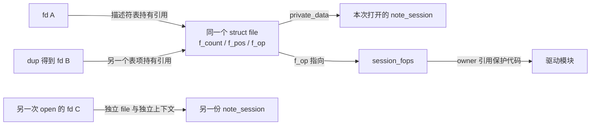
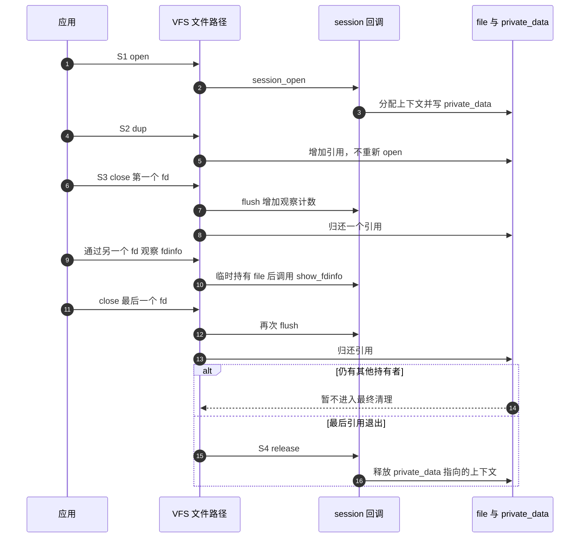

# 第1章\_一次打开与最后一次释放

上一单元的 [misc 问候服务](../misc/readme.md)在文件打开期间阻止普通模块卸载。现在换一个看似很小的条件：打开一次以后，用 dup 得到第二个文件描述符，再关闭第一个。驱动应该清理那份打开状态吗？

本章承接 misc 和[字符设备读写契约](../character_device/P05_文件操作契约与数据路径.md)。我们暂时不传输业务数据，只观察 open、flush、release 和 fdinfo。读完后应能在两次独立 open 与一次 open 后 dup 之间，画出不同的对象关系。

## 1.1\_数字入口与打开对象分开

文件描述符 fd 是进程描述符表中的一个索引，struct file 是内核中保存一次打开状态的对象，其中有当前位置、状态标志、操作表 f_op 和私有指针 private_data。dup 新建一个数字入口指向同一个 file；再次 open 则通常新建另一个 file。因而“两个 fd”不等于“两次打开”。

驱动把每次打开需要的上下文放入 private_data。若在 open 中分配，必须确定谁最终回收它。最早关闭的 fd 还不能决定：dup、继承的描述符、映射和内核临时引用都可能继续持有同一个 file。



file 的 f_count 是本版本的引用计数，不是驱动应手工增减的业务计数。VFS 及其调用方通过取得、归还文件引用协调寿命；驱动只实现自己的上下文协议。操作表的 owner 由取得该表的路径配合模块引用使用，不是每条回调执行之前都临时增加一次引用，更不是任意数据对象的保护锁。

## 1.2\_关闭一次与最终清理

open 回调在打开建立路径中执行，不会因为 fget 查到已有文件而再次调用。成功后，后续操作可以使用 private_data；失败时，open 必须回滚自己已经取得的私有资源，不能期待成功文件的 release 来替失败初始化兜底。

flush 是文件关闭路径中的可选操作。关闭一个 dup 出来的描述符，仍可能对共享的 file 调用 flush，因此它不能释放其他描述符还会使用的上下文。这个名字也不意味着文件数据自动持久化；有明确持久化需求时应看 fsync 的契约。

release 在最后文件引用归还后进入最终清理。最后一个 fd 关闭不一定已经没有其他引用，最终清理也可能通过任务工作等机制延后。release 的返回值不是一个能可靠传回当初 close 调用者的错误通道，不要把关键保存操作拖到这里才首次尝试。

用同一周期描述正常路径：S0 尚无打开上下文；S1 open 分配成功并写入 private_data；S2 dup 或其他持有者增加 file 引用；S3 某次关闭调用 flush 并归还一个引用；S4 最后引用退出后 release 释放私有上下文。



这里没有驱动自己轮询“还剩几个 fd”。file 的引用协议决定最终回调时机。下一章的 I/O 请求也可能暂时持有它；第三章会看到 fd 已经关掉而映射仍在的具体例子。

## 1.3\_让状态自己说明发生了什么

以下完整模块保存为 note_session.c，材料在[实验目录](../../../labs/kernel/file_operations/materials/README.md)。其登记方式、许可证标识与模块元信息沿用 misc，新增的只有每次打开上下文、两个清理阶段和观察回调。

kzalloc 在这里分配并清零一份上下文；GFP_KERNEL 是普通可睡眠分配标志，适用于本例的打开调用环境，不能把它原样放进中断处理。分配失败的 ENOMEM 表示没有取得所需内存。atomic_t 保存一个原子计数，配套的设置、增加、读取只保障这个计数的相应操作，不自动把几个业务字段组成一致快照。

```c
// SPDX-License-Identifier: GPL-2.0
#include <linux/module.h>
#include <linux/miscdevice.h>
#include <linux/fs.h>
#include <linux/slab.h>
#include <linux/atomic.h>
#include <linux/seq_file.h>

struct note_session {
    atomic_t flush_count;
};

static int session_open(struct inode *inode, struct file *file)
{
    struct note_session *session;

    session = kzalloc(sizeof(*session), GFP_KERNEL);
    if (!session)
        return -ENOMEM;
    atomic_set(&session->flush_count, 0);
    /* 每次成功打开持有一个上下文；dup 不会再调用这里。 */
    file->private_data = session;
    return nonseekable_open(inode, file);
}

static int session_flush(struct file *file, fl_owner_t owner)
{
    struct note_session *session = file->private_data;

    atomic_inc(&session->flush_count);
    return 0;
}

static void session_fdinfo(struct seq_file *seq, struct file *file)
{
    struct note_session *session = file->private_data;

    seq_printf(seq, "note_flushes:\t%d\n",
               atomic_read(&session->flush_count));
}

static int session_release(struct inode *inode, struct file *file)
{
    struct note_session *session = file->private_data;

    pr_info("note_session: release after %d flushes\n",
            atomic_read(&session->flush_count));
    kfree(session);
    return 0;
}

static const struct file_operations session_fops = {
    .owner = THIS_MODULE,
    .open = session_open,
    .flush = session_flush,
    .release = session_release,
    .show_fdinfo = session_fdinfo,
};

static struct miscdevice session_device = {
    .minor = MISC_DYNAMIC_MINOR,
    .name = "note_session",
    .fops = &session_fops,
    .mode = 0600,
};

static int __init session_init(void)
{
    return misc_register(&session_device);
}

static void __exit session_exit(void)
{
    misc_deregister(&session_device);
}

module_init(session_init);
module_exit(session_exit);
MODULE_LICENSE("GPL");
MODULE_DESCRIPTION("每次打开与关闭引用教学示例");
```

flush_count 只用于本次短实验计数，采用 atomic_t 避免两个描述符并发关闭时丢失增加；读取是单个计数的观察，不承诺复合业务快照。它不是实际 file 引用计数。kzalloc 失败返回 -ENOMEM；本版本 nonseekable_open 只清除定位能力并返回 0，因此成功分配后没有另一条失败分支。

show_fdinfo 使用 seq_printf 向内核管理的文本输出对象追加一行。读取 /proc 中目标文件的 fdinfo 时，内核先取得目标 file 引用，再调用此回调，所以它不会与该 file 的最终 release 交错成悬空访问。内容可能随着另一次关闭变化，引用保护不等于冻结计数。

这个模块没有 read/write，不能用 cat /dev/note_session 检查“是否成功”；我们提供的是一个可打开、可观察关闭过程的实验对象，不是假装所有设备都必须有数据传输。

## 1.4\_两次打开和三次关闭

构建沿用[模块工程](../../../engineering/build/kernel_modules/大纲.md)，在完整材料目录设置 KDIR 为匹配目标的已构建内核目录。交叉参数按该工程设置，在目标机执行装载和 C 观察。程序用 fopen/fgets 读取 fdinfo 的 note_flushes 行，以 dup 共享打开对象，以第二次 open 创建独立对象；close_one 将已归还的描述符置为 -1，保证后续清理不重复关闭：

```bash
make -C "$KDIR" M="$PWD" modules
sudo insmod ./note_session.ko
```

保存下面完整程序为 `session_probe.c`。它使用 Linux 用户空间头文件和 C11 编译器，编译后在装有对应教学模块的目标运行：

```c
/* 通过 fdinfo 比较 dup 共享的打开对象与独立 open 的对象。 */
#include <fcntl.h>
#include <stdio.h>
#include <unistd.h>

static int flushes(int fd, unsigned int *value)
{
    char path[64], line[128];
    FILE *info;
    int found = 0;
    snprintf(path, sizeof(path), "/proc/self/fdinfo/%d", fd);
    info = fopen(path, "r");
    if (!info) { perror("fopen fdinfo"); return 0; }
    while (fgets(line, sizeof(line), info)) {
        if (sscanf(line, "note_flushes: %u", value) == 1) {
            found = 1;
            break;
        }
    }
    if (ferror(info)) { perror("read fdinfo"); found = 0; }
    if (fclose(info) != 0) { perror("fclose fdinfo"); found = 0; }
    if (!found)
        fputs("未取得 note_flushes 计数\n", stderr);
    return found;
}

static int close_one(int *fd)
{
    int owned = *fd;
    *fd = -1; /* Linux close 错误后不重复关闭可能已被复用的数字。 */
    if (owned >= 0 && close(owned) < 0) {
        perror("close");
        return 0;
    }
    return 1;
}

int main(void)
{
    int first = -1, alias = -1, separate = -1, result = 1;
    unsigned int shared_count, separate_count;
    first = open("/dev/note_session", O_RDONLY);
    if (first < 0) { perror("open first"); goto out; }
    alias = dup(first);
    if (alias < 0) { perror("dup"); goto out; }
    separate = open("/dev/note_session", O_RDONLY);
    if (separate < 0) { perror("open separate"); goto out; }
    if (!flushes(alias, &shared_count) || !flushes(separate, &separate_count))
        goto out;
    printf("before: %u %u\n", shared_count, separate_count);
    if (shared_count != 0 || separate_count != 0)
        goto out;
    if (!close_one(&first) || !flushes(alias, &shared_count) ||
        !flushes(separate, &separate_count))
        goto out;
    printf("after: %u %u\n", shared_count, separate_count);
    result = shared_count == 1 && separate_count == 0 ? 0 : 1;
out:
    if (!close_one(&first)) result = 1;
    if (!close_one(&alias)) result = 1;
    if (!close_one(&separate)) result = 1;
    return result;
}
```

```bash
cc -std=c11 -Wall -Wextra -Werror -pedantic session_probe.c -o session_probe
sudo ./session_probe
sudo dmesg | tail -n 12
sudo rmmod note_session
```

预期 before 两个计数均为 0；关闭 first 后，alias 看到 1，separate 仍为 0。读取 fdinfo 打开的是另一个 proc 文件，不会增加实验设备的 flush_count。程序最后关闭 alias 和 separate，日志应分别出现一次“2 flushes”和一次“1 flushes”的 release；不同环境可能夹入其他日志，比较内容而不复制时间戳或整段输出。

这证明 dup 共享打开上下文、独立 open 拥有不同上下文。它不证明任意关闭都立即运行 release。若 /proc 未启用或挂载，先确认观察条件；若节点没有出现，按 misc 单元定位节点管理，不用没有读回调的 cat 代替诊断。初始化失败不需再调用模块退出，成功装载则在所有观察者退出后普通卸载。

## 1.5\_回顾与迁移

1. 把 kfree 移到 flush，为什么第一次 close 后还可能出错？
2. 在 open 中先分配 A，再分配 B，B 失败后返回错误，谁释放 A？
3. 每个 fd 都保存一个独立偏移吗？dup 与再次 open 有何区别？
4. show_fdinfo 安全取得 file，是否意味着无需保护任意设备统计数据？

参考思路：flush 时 alias 仍持有同一上下文；失败的 open 自己释放 A；位置属于 file，因此 dup 共享而独立 open 分离；文件寿命保护不代替业务数据的并发一致性。更完整的引用模型见[VFS 文件生命周期](../../kernel_subsystems/vfs/P13_fd_table与file生命周期.md)。

版本证据先由[源码总索引](../../../research/source_reading/character_device/navigation/P01_Linux_6.12_字符设备源码阅读索引.md#1.1_版本和阅读边界)确认身份，再读[文件操作源码导读](../../../research/source_reading/character_device/navigation/P03_文件操作与打开寿命导读.md)。[filp_close 实现](../../../research/source_reading/character_device/source_explanations/fs/open.c.md#1.1_filp_close归还文件引用)说明通用归还路径；[本版本 close 系统调用](../../../research/source_reading/character_device/source_explanations/fs/open.c.md#1.2_close系统调用的同步清理)则在最后引用时同步清理，不可混为每次都延后。

下一篇：[多段缓冲与请求位置](P02_迭代读取与请求位置.md) · [大纲](大纲.md)。
