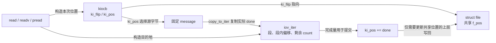
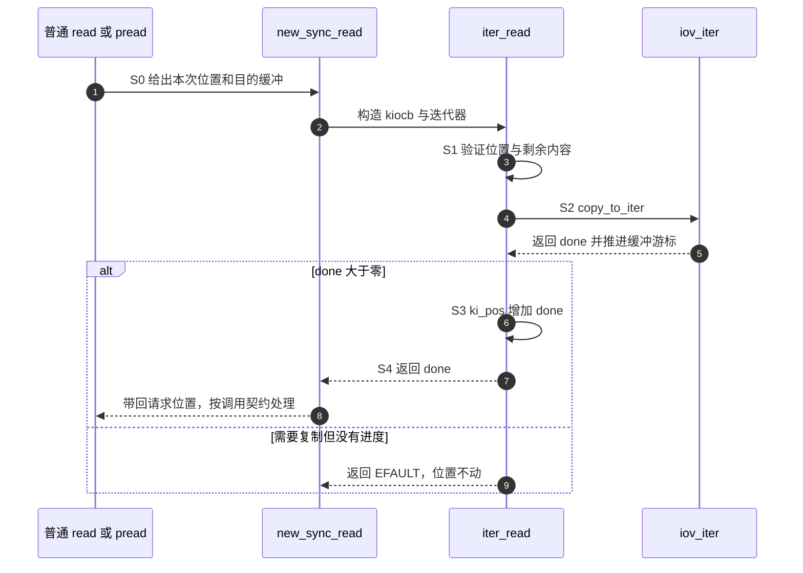

# 第2章\_迭代读取与请求位置

前一章区分了描述符与打开对象，字符设备单元则已经说明 read 的长度、位置与短传输。现在应用希望一次把内容分别填入“头部数组”和“剩余数组”，而不是先读入临时大数组再自行拆开。它可以提交多个缓冲区，这就引出迭代读取接口。

本章仍返回固定文本，只改变请求的表达方式。它不制造新等待队列，也不把同步复制包装成异步或零拷贝；读完后应能解释 read、readv 与 pread 为什么可以复用同一个回调，却不能随意共用同一个位置变量。

## 2.1\_请求位置与缓冲游标是两件事

readv 的 v 表示向量，一次调用提供若干地址和长度。内核用 iov_iter 描述已经校验、正在推进的数据目的地；它记录当前段、段内位置和剩余字节数。驱动询问 iov_iter_count 得到剩余总量，调用 copy_to_iter 向其中写入数据，辅助函数跨段推进游标并返回 **实际复制量**。

另一组状态是从设备内容的哪个位置开始取。read_iter 接收的 kiocb 是一次 I/O 请求描述，ki_filp 指向对应 file，ki_pos 保存本次请求位置。缓冲游标回答“写进哪段用户空间”，ki_pos 回答“从内容的哪里读”；二者都按完成量前进，但不能互相代替。

普通 read 使用并更新打开文件的 f_pos，pread 则使用调用者指定的位置而不改变该共享位置。若驱动直接读写 ki_filp->f_pos，就会把 pread 的请求位置丢掉。正确做法是更新 ki_pos，让上层根据本次调用的契约决定是否写回 f_pos。



迭代器统一了缓冲表达，不代表数据没有被复制。copy_to_iter 的名字就表明本例仍在复制。内核虚拟缓冲、页数组等后端有各自类型和限制，不能把旧资料中的所有后端名称套到当前版本；也不能因为实现 read_iter 就宣布已经支持所有异步执行约束。

## 2.2\_一个只实现read\_iter的完整模块

保存为 note_iter.c，或使用[对应材料](../../../labs/kernel/file_operations/materials/note_iter.c)。文本 hello from iter 加换行共 16 字节，与上一单元的有限内容一样，末尾返回 0。

程序继续采用 misc 的动态次设备号和当前模块所有者。FMODE_ATOMIC_POS 是文件模式位，本例在打开时设置它，使共享打开位置参与常规读取路径的位置协调；它不锁住设备数据。fixed_size_llseek 是有固定内容上界的定位帮助函数，下面用它限定可定位范围。错误码 EINVAL 表示位置参数无效，EFAULT 表示需要复制但没有取得进度，后文再比较短复制与末尾。

```c
// SPDX-License-Identifier: GPL-2.0
#include <linux/module.h>
#include <linux/miscdevice.h>
#include <linux/fs.h>
#include <linux/uio.h>

static const char message[] = "hello from iter\n";

static int iter_open(struct inode *inode, struct file *file)
{
    /* 保留定位能力；共享打开文件的常规读取协调 f_pos。 */
    file->f_mode |= FMODE_ATOMIC_POS;
    return 0;
}

static loff_t iter_seek(struct file *file, loff_t offset, int whence)
{
    return fixed_size_llseek(file, offset, whence, sizeof(message) - 1);
}

static ssize_t iter_read(struct kiocb *request, struct iov_iter *to)
{
    loff_t pos = request->ki_pos;
    size_t want, done;

    if (pos < 0)
        return -EINVAL;
    if (!iov_iter_count(to) || pos >= sizeof(message) - 1)
        return 0;

    want = min_t(size_t, iov_iter_count(to), sizeof(message) - 1 - pos);
    done = copy_to_iter(message + pos, want, to);
    if (!done)
        return -EFAULT;
    /* 请求位置只提交实际完成量，不直接改 file->f_pos。 */
    request->ki_pos = pos + done;
    return done;
}

static const struct file_operations iter_fops = {
    .owner = THIS_MODULE,
    .open = iter_open,
    .llseek = iter_seek,
    .read_iter = iter_read,
};

static struct miscdevice iter_device = {
    .minor = MISC_DYNAMIC_MINOR,
    .name = "note_iter",
    .fops = &iter_fops,
    .mode = 0400,
};

static int __init iter_init(void)
{
    return misc_register(&iter_device);
}

static void __exit iter_exit(void)
{
    misc_deregister(&iter_device);
}

module_init(iter_init);
module_exit(iter_exit);
MODULE_LICENSE("GPL");
MODULE_DESCRIPTION("同步迭代读取与独立请求位置");
```

iter_open 保留可定位能力，并沿用字符窗口单元的位置协调标志；fixed_size_llseek 将可定位范围限定在 0 到内容长度之间。这里的数据永不变化，所以两个独立请求只读同一数组，不需要内容锁。这个理由不能推广到可写缓冲。

回调先拒绝负位置，再处理零请求和末尾。只有存在需要复制的字节时，复制量 0 才返回 -EFAULT；这与“队列暂时没有数据”的 -EAGAIN 不同。部分复制大于 0 时报告实际进度并增加 ki_pos，避免上层重试时重复先前字节。

对 write_iter，copy_from_iter 同样返回实际复制量，不是 copy_from_user 那种“未复制量”。写入有可能在失败前已经修改部分目的数据；是否允许部分提交，必须由应用契约决定。记录必须完整替换的情况，继续使用[读写契约中的暂存和提交模型](../character_device/P05_文件操作契约与数据路径.md)，不能只把函数名替换为 iter 就宣称原子写入。

## 2.3\_亲自比较readv与pread

使用[材料目录](../../../labs/kernel/file_operations/materials/README.md)的 Makefile 和目标匹配的 KDIR 构建。只加载本篇模块：

```bash
make -C "$KDIR" M="$PWD" modules
sudo insmod ./note_iter.ko
```

保存下面完整程序为 `iter_probe.c`。iovec 数组保存两段独立目标地址和容量，readv 把一次请求交给它们；pread 另带显式位置，返回后不推进普通 read 的共享位置。它使用 Linux 用户空间头文件和 C11 编译器，编译后在装有对应教学模块的目标运行：

```c
/* 比较 readv、显式位置读取和共享位置，不测复制性能。 */
#define _POSIX_C_SOURCE 200809L
#include <fcntl.h>
#include <stdio.h>
#include <string.h>
#include <sys/uio.h>
#include <unistd.h>

int main(void)
{
    char first[5] = { 0 }, rest[11] = { 0 }, data[5];
    struct iovec parts[2] = {
        { .iov_base = first, .iov_len = sizeof(first) },
        { .iov_base = rest, .iov_len = sizeof(rest) }
    };
    int fd = open("/dev/note_iter", O_RDONLY);
    int result = 1;
    ssize_t count;
    if (fd < 0) { perror("open"); return 1; }
    count = readv(fd, parts, 2);
    if (count < 0) { perror("readv"); goto out; }
    if (count != 16 || memcmp(first, "hello", 5) ||
        memcmp(rest, " from iter\n", 11))
        goto mismatch;
    printf("readv=%zd first=%.*s rest_bytes=%zu\n", count, 5, first, sizeof(rest));
    count = read(fd, data, 1);
    if (count < 0) { perror("read end"); goto out; }
    if (count != 0) goto mismatch;
    puts("end=0");
    count = pread(fd, data, sizeof(data), 0);
    if (count < 0) { perror("pread"); goto out; }
    if (count != 5 || memcmp(data, "hello", 5)) goto mismatch;
    printf("positioned=%.*s\n", 5, data);
    count = read(fd, data, 1);
    if (count < 0) { perror("read still end"); goto out; }
    if (count != 0) goto mismatch;
    puts("still end=0");
    if (lseek(fd, 0, SEEK_SET) < 0) { perror("lseek"); goto out; }
    count = read(fd, data, sizeof(data));
    if (count < 0) { perror("read rewound"); goto out; }
    if (count != 5 || memcmp(data, "hello", 5)) goto mismatch;
    printf("rewound=%.*s\n", 5, data);
    result = 0;
    goto out;
mismatch:
    fputs("字节或位置结果与预测不符\n", stderr);
out:
    if (close(fd) < 0) { perror("close"); result = 1; }
    return result;
}
```

```bash
cc -std=c11 -Wall -Wextra -Werror -pedantic iter_probe.c -o iter_probe
sudo ./iter_probe
sudo rmmod note_iter
```

第一行应报告 readv=16、first=hello、rest_bytes=11；程序也逐字节核对第二段含换行的剩余内容。接着 end=0。pread 从位置 0 读到 hello，下一次普通 read 仍报告 still end=0，因为 pread 没有改变共享位置。最后 lseek 明确改变共享位置，再读才得到 hello。

若把 iter_read 改成访问 file->f_pos，pread 的结果或后面的 still end 就会背离这个预测。先用这种可区分的观察检验位置协议，比只执行一次 cat 更有意义。不要把请求完成得很快解释成零拷贝。

## 2.4\_同一张表为何不能猜优先级

固定基线的普通 vfs_read 先检查 .read，缺少它才经 new_sync_read 适配到 .read_iter；vfs_readv 则先考虑 .read_iter，缺少它才尝试逐段调用旧式回调。因而“VFS 总是优先 iter”是错误的概括。

本例只实现一套数据路径，普通 read 由上层同步适配。S0 上层构造请求及迭代器，S1 回调确定可用范围，S2 复制，S3 按 done 提交请求位置，S4 返回结果并由调用路径处理共享位置。一次同步 read 的适配函数不会接受回调随意返回“稍后完成”的 -EIOCBQUEUED；异步契约必须连同调用路径、完成者与寿命一起设计。



普通可睡眠的同步复制可以作为小服务实现。若要接入要求不阻塞的提交路径，还要明确请求标志、无法立即完成时的退让、谁持有请求、谁只完成一次以及取消时怎样收回。io_uring 可以把某些工作转交工作线程，但这不免除驱动对自己声明的能力负责。

源码先由[总索引](../../../research/source_reading/character_device/navigation/P01_Linux_6.12_字符设备源码阅读索引.md#1.1_版本和阅读边界)确认版本，再按[文件操作导读](../../../research/source_reading/character_device/navigation/P03_文件操作与打开寿命导读.md)进入；分派的具体代码见[vfs_read 与同步适配](../../../research/source_reading/character_device/source_explanations/fs/read_write.c.md#1.1_vfs_read选择回调)。

## 2.5\_回顾与练习

1. copy_to_iter 返回 3，请求 8，应该把位置增加 3 还是 8？
2. 请求长度 0，而设备内容在末尾，应返回错误还是 0？
3. 同时保留语义不同的 .read 与 .read_iter，为什么只测试 cat 不够？
4. 为了支持可变数据，仅增加 FMODE_ATOMIC_POS 是否能保护两个独立 open 的内容访问？

参考思路：提交 3；零请求正常返回 0；readv 可能进入另一套实现；位置保护面向同一打开对象，设备内容共享还需要自己的协议。迭代器增加的是表达能力，不是额外的并发保证。

上一篇：[打开与释放](P01_一次打开与最后一次释放.md)

下一篇：[映射的长期引用](P03_只读映射与后备页寿命.md) · [大纲](大纲.md)。
