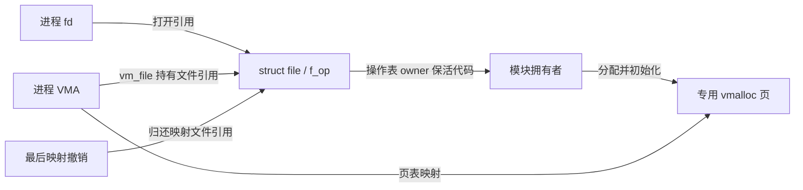
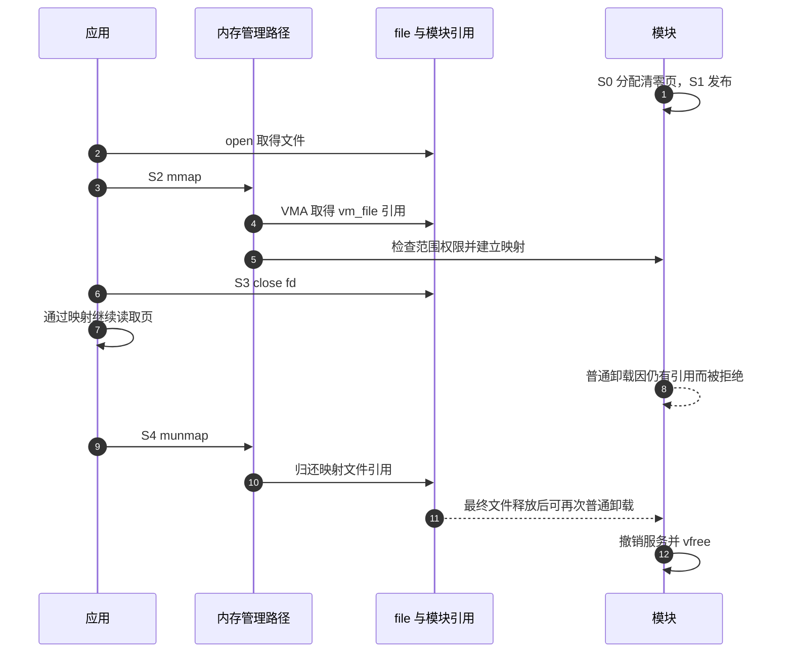

# 第3章\_只读映射与后备页寿命

前两章中，应用每次读取都进入文件操作回调。现在应用希望反复查看一块不变的数据，不再为每次查看发出 read。mmap 可以在进程地址空间中建立映射，此后的普通内存读取沿页表访问后备页。这减少了重复调用与复制的机会，却引入了更长的使用期。

本章只映射一页专用、清零、只读的普通内存。它不是硬件寄存器或 DMA 缓冲教程。完成实验后，你应能解释为什么关掉 fd 后还能读，以及为什么此时仍不能普通卸载模块。

## 3.1\_先问映射出去的究竟是什么

映射以页为单位建立地址关系。若把一个很小的 kmalloc 对象所在页直接公开，用户能访问的页内范围可能超过原对象，触及同页的其他数据。仅检查“用户请求长度不大于对象大小”并不能改变页表的粒度，也不能证明分配器布局适合公开。

本例使用 vmalloc_user 分配专门可映射给用户的、清零的内存，再用 remap_vmalloc_range 把它接到 VMA。VMA 是 Virtual Memory Area，即进程虚拟地址区间的内核描述，保存范围、权限和文件关系。这个方案适合教学中的普通内存；对于设备 I/O 地址，应遵循该资源的映射协议，DMA 分配则优先使用其匹配的映射接口，不能把 DMA 地址一概当 CPU 物理地址传给 remap_pfn_range。

物理连续与可公开映射也不是同一保证。直接 virt_to_phys 一个任意内核指针，无法证明页所有权、缓存属性、隔离和寿命都正确。vmalloc 地址本身通常不代表连续物理页，更不能用它的数值假造物理地址。

## 3.2\_完整的一页只读模块

保存为 note_mapping.c，材料见[实验目录](../../../labs/kernel/file_operations/materials/README.md)。要求目标启用内存管理单元（Memory Management Unit，MMU）支持，即 CONFIG_MMU；无 MMU 系统的映射契约另有规则。

PAGE_SIZE 是本内核配置的一页字节数，不在程序中猜成固定的 4096。vm_start/vm_end 描述区间端点，vm_pgoff 以页为单位表示请求偏移。权限位中的 VM_SHARED 表示共享映射，VM_WRITE/VM_EXEC 表示当前可写/可执行，VM_MAYWRITE/VM_MAYEXEC 表示以后允许获得对应权限的上限。代码先拒绝不符合接口的请求，再收紧未来权限；EINVAL 表示范围或形式无效，EPERM 表示本服务禁止所请求的权限。

```c
// SPDX-License-Identifier: GPL-2.0
#include <linux/module.h>
#include <linux/miscdevice.h>
#include <linux/fs.h>
#include <linux/mm.h>
#include <linux/vmalloc.h>
#include <linux/string.h>

static void *mapping_page;

static int mapping_mmap(struct file *file, struct vm_area_struct *vma)
{
    unsigned long size = vma->vm_end - vma->vm_start;

    if (vma->vm_pgoff != 0 || size != PAGE_SIZE)
        return -EINVAL;
    if (!(vma->vm_flags & VM_SHARED))
        return -EINVAL;
    if (vma->vm_flags & (VM_WRITE | VM_EXEC))
        return -EPERM;

    /* 不允许后续 mprotect 把这份只读数据改成可写或可执行。 */
    vm_flags_clear(vma, VM_MAYWRITE | VM_MAYEXEC);
    return remap_vmalloc_range(vma, mapping_page, 0);
}

static const struct file_operations mapping_fops = {
    .owner = THIS_MODULE,
    .mmap = mapping_mmap,
};

static struct miscdevice mapping_device = {
    .minor = MISC_DYNAMIC_MINOR,
    .name = "note_mapping",
    .fops = &mapping_fops,
    .mode = 0400,
};

static int __init mapping_init(void)
{
    static const char message[] = "hello mapped page\n";
    int ret;

    /* 专用、清零、允许映射给用户的页，不暴露 slab 内的邻接对象。 */
    mapping_page = vmalloc_user(PAGE_SIZE);
    if (!mapping_page)
        return -ENOMEM;
    memcpy(mapping_page, message, sizeof(message) - 1);

    ret = misc_register(&mapping_device);
    if (ret) {
        vfree(mapping_page);
        mapping_page = NULL;
    }
    return ret;
}

static void __exit mapping_exit(void)
{
    /* 仅演示普通模块卸载，已有映射保留的 file 引用会阻止它。 */
    misc_deregister(&mapping_device);
    vfree(mapping_page);
    mapping_page = NULL;
}

module_init(mapping_init);
module_exit(mapping_exit);
MODULE_LICENSE("GPL");
MODULE_DESCRIPTION("专用只读页与映射持有的文件引用");
```

mapping_page 的拥有者是模块：初始化先分配并填入 18 字节文本，再发布服务；登记失败立即释放；正常退出先撤销服务再释放。这是一组很小的静态所有权关系，刻意没有加入热拔插和可变共享数据。

mmap 回调检查的是内核已经按页整理的 VMA 范围。非零 vm_pgoff 表示请求从后备存储的后续页开始，本例拒绝它；范围必须恰好一页，因此不会通过偏移加长度溢出越界。只接受共享映射是本例主动限定的接口，不代表所有 mmap 都应拒绝私有映射。

当前可写/可执行权限通过 VM_WRITE/VM_EXEC 拒绝；潜在的后续权限提升通过清除 VM_MAYWRITE/VM_MAYEXEC 禁止。只检查当前权限，却允许以后 mprotect 提升，不能兑现“一直只读”的承诺。remap_vmalloc_range 的失败原样返回，不能把不同失败都改成看起来可以重试的错误。

本例没有自定义 get_unmapped_area：通用地址选择已经足够。若将通用分配器返回值简单向上对齐，可能把原本不重叠的区域推到另一份映射上；正确的特殊对齐方案必须在搜索时同时保证完整范围空闲，不能在最后对一个地址做算术就当作完成。

## 3.3\_比fd活得更久的引用

这是三组不同状态：服务是否登记、模块拥有的页是否存在、进程是否还有引用该 file 的映射。正常操作按 S0 分配页、S1 发布服务、S2 创建 VMA、S3 关闭 fd、S4 撤销最后映射并允许卸载推进。



Linux 文件映射保存 vm_file 并持有 file 引用。关闭数字描述符只是归还描述符那一份引用；VMA 还在时，最终文件释放尚未发生，操作表的模块引用也仍在。这个例子由普通模块卸载协议间接保持后备页：存在映射就不能进入正常模块退出释放页。



若设备可以在模块仍加载时被拔出，这条证明就不够了：模块代码没消失，不代表硬件或实例页仍能用。必须另行持有后备对象、协调失效和访问者，必要时定义失效后的故障语义。也不能用 volatile 代替共享可写区的原子性与内存顺序协议；本例数据初始化后不再变动，正是为了把这个问题留到需要它的时候。

## 3.4\_关掉描述符再观察

在目标机使用匹配的 KDIR 构建并装载模块。下面的完整 C 程序会先映射，再关闭数字描述符，然后继续读取并等候回车；它没有额外复制 fd，能把映射引用单独留在现场。

sysconf 查询目标系统的页大小，O_RDONLY 以只读方式打开设备。mmap 的 PROT_READ 请求读权限，MAP_SHARED 选择本例接受的共享方式；失败标记是 MAP_FAILED，不能用空指针代替判断。munmap 撤销用户虚拟地址区间；其后不得再通过 area 访问那份地址。与前两章相比，这次 close 和最后一次使用数据被特意分开。

```c
#include <stdio.h>
#include <unistd.h>
#include <fcntl.h>
#include <sys/mman.h>

int main(void)
{
    long page_size = sysconf(_SC_PAGESIZE);
    int fd;
    void *area;

    if (page_size <= 0)
        return 1;
    fd = open("/dev/note_mapping", O_RDONLY);
    if (fd < 0) {
        perror("open");
        return 1;
    }
    area = mmap(NULL, (size_t)page_size, PROT_READ, MAP_SHARED, fd, 0);
    if (area == MAP_FAILED) {
        perror("mmap");
        close(fd);
        return 1;
    }
    if (close(fd)) { /* 成功后不再保留数字描述符。 */
        perror("close");
        munmap(area, (size_t)page_size);
        return 1;
    }
    fwrite(area, 1, 18, stdout);
    puts("fd 已关闭；完成另一个终端的普通卸载观察后按回车。");
    (void)getchar();
    if (munmap(area, (size_t)page_size)) {
        perror("munmap");
        return 1;
    }
    return 0;
}
```

将 C 程序保存为 mapping_probe.c，在目标用户空间用 cc -Wall -Wextra -Werror 编译；交叉构建时使用与目标用户空间 ABI 匹配的编译器，不用内核模块构建来编译它。材料也保存了这份完整程序。

```bash
make -C "$KDIR" M="$PWD" modules
cc -Wall -Wextra -Werror mapping_probe.c -o mapping_probe
sudo insmod ./note_mapping.ko
sudo ./mapping_probe
```

将上述命令运行的终端称为 A。

在 A 等待期间，终端 B 执行 `sudo rmmod note_mapping`，应因仍有引用而失败；回到 A 结束映射后再执行，才应成功。预期文本是 hello mapped page 加换行。这个结果展示映射寿命，不是 DMA 一致性或热拔插安全证明。只使用普通卸载。

故障预测也可以不访问映射内容就完成：把请求偏移改成一页，应失败；把长度改成两页，应失败；把权限加入执行，应被拒绝。若希望试验这些条件，一次只改一项，检查 mmap 的返回值；不要在 MAP_FAILED 上继续读内存。

## 3.5\_回顾与练习

1. 为什么不能把一小块 slab 分配当作可以任意公开的一页？
2. 关闭 fd 后还能读，证明的是“页永远有效”还是“当前映射仍持有约定的对象”？
3. 拿到某个空闲地址后做 ALIGN，为什么不能保证整个映射仍不重叠？
4. 如果改成内核和用户都能写，原来的不变数组证明还剩哪些部分？

参考思路：页粒度可能公开邻接对象；证明只限当前引用及后备协议；对齐改变起点，需要重新验证整个范围；引用可以保活对象，但内容一致性须另行设计。通用页缓存和缺页行为继续看[VFS 映射](../../kernel_subsystems/vfs/P18_文件mmap与page_fault.md)，不要把本例专用普通页混成所有文件映射的模型。

源码先由[总索引](../../../research/source_reading/character_device/navigation/P01_Linux_6.12_字符设备源码阅读索引.md#1.1_版本和阅读边界)确认版本，再按[文件操作导读](../../../research/source_reading/character_device/navigation/P03_文件操作与打开寿命导读.md#3.3_映射怎样留住文件)定位 vmalloc 映射与 VMA 文件引用。

上一篇：[迭代读取](P02_迭代读取与请求位置.md)

下一篇：[扩展接口选择](P04_扩展接口的契约与选择.md) · [大纲](大纲.md)。
