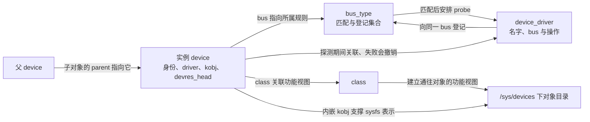
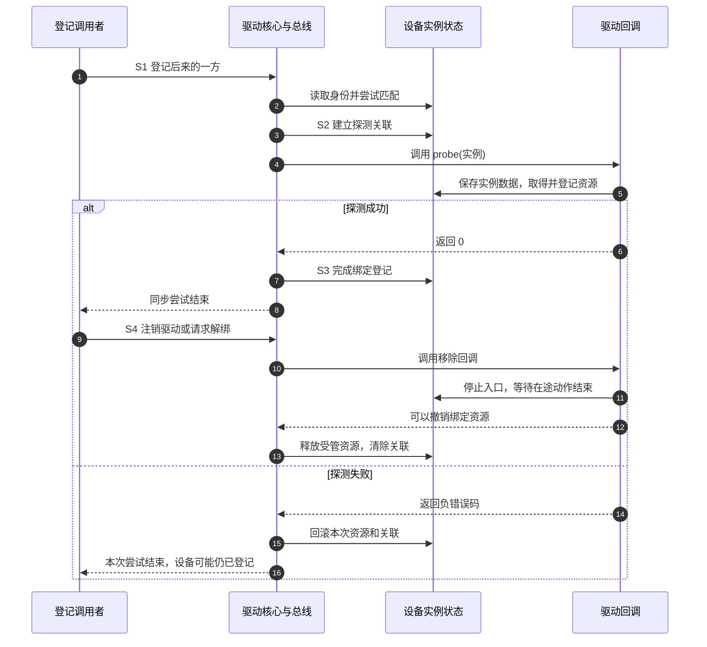

# 第1章\_驱动框架模型

[前言](前言.md)已经把具体实例与共享操作分开，也说明匹配成功还要经过探测。现在带着一个问题进入 Linux：同一份驱动面对两个设备时，哪些状态属于设备，哪些属于驱动，为什么 sysfs 中会从几个目录看到同一个对象？

本章建立对象关系和一轮绑定过程，再用只读程序观察它们。先修是前言与模块入口；完整探测实验沿用[错误指针四路径实验](../../../linux/error_handling/error_pointer/P04_观察返回值与释放顺序.md)，不在此复制第二套模块。若暂未完成该实验，仍可先观察机器已有的 platform 设备。

## 1.1\_四种对象分别回答什么

先写下前言两只传感器的实例资料。每只都有自己的身份、父对象和资源描述。Linux 用 `struct device` 承载公共的设备身份，再由具体子系统扩展。例如 platform 设备对象 `struct platform_device` 内嵌一个 device，并携带该类平台设备需要的信息。对象并不等于裸硬件：软件服务也可能被组织为设备对象。

共享操作则登记为 `struct device_driver`，其中记录名字、所属总线等公共信息；platform 驱动的 `struct platform_driver` 内嵌这份公共描述，提供该子系统的探测和移除回调。同一驱动的函数可以被多个实例调用，因此把临时状态随便放到全局变量里仍然会串台。

设备与驱动通过 `struct bus_type` 描述的总线规则相遇。它组织两边的登记集合，并提供匹配等操作。登记顺序可以是先有设备，也可以是先有驱动，后到的一方触发寻找候选。注册一个驱动不是再创建一只设备。

最后，应用或管理员常想按功能查找对象，而不想先猜它连接在哪条总线上。`struct class` 表达这种按功能组织的视图，例如同一类字符服务。class 不替总线匹配硬件，也不会因为名字叫某种设备就让 read 自动可用。总线回答“按哪套规则连接”，class 回答“从哪种功能入口查找”。



这里的箭头是关联或动作，不是继承图。device 内的 `driver` 指针、sysfs 链接与“probe 最终成功”也不能在任意瞬间划等号：驱动核心在探测过程中先建立一部分关联，失败时再撤销。管理员的一次目录读取只是观察窗口。

具体保存位置按[固定版本源码索引](../../../../research/source_reading/driver_entries/navigation/P01_Linux_6.12_驱动入口源码阅读索引.md)核对：总线对应的私有结构 subsys_private 用 klist_devices 和 klist_drivers 保存两侧登记集合；device 的私有节点 dev->p->knode_bus 加入前者，driver 的私有节点 drv->p->knode_bus 加入后者。成功绑定另把 dev->p->knode_driver 加入该驱动的 drv->p->klist_devices。这三种节点分别回答“在哪条总线”“有哪些驱动”“已经服务哪些设备”，由登记和绑定路径改写、遍历和拆除路径消费，不是一个全局设备列表替代所有关系。

## 1.2\_追踪一次完整绑定

为了把时序固定下来，选一个最小场景：驱动采用同步探测，设备已经存在，后注册驱动，并且没有供应者依赖未就绪。所谓同步，是当前登记调用会沿调用栈执行本次探测；其他配置可能排队到异步执行，不能把下面的时刻当作所有驱动的统一时间表。

这不是一个整数表示的单一状态机。设备是否登记、驱动是否登记、是否绑定、资源是否取得、用户入口是否发布，是多组有关联但不等价的状态。S0～S4 只是我们给这一次操作周期划分的观察阶段。

| 阶段 | 触发与动作 | 状态落点、读者与退出条件 |
| --- | --- | --- |
| S0 准备 | 设备创建者初始化实例，驱动准备回调 | 对象尚未登记，创建者负责保证所指数据有效；初始化成功才可发布 |
| S1 相遇 | 登记调用把设备和驱动纳入总线集合 | subsys_private 的 klist_devices/klist_drivers 供驱动核心遍历；不匹配时保持未绑定，匹配才进入探测 |
| S2 准备服务 | 驱动核心建立暂时关联并调用 probe | device 的 driver 关联和实例私有状态发生变化；probe 取得的受管资源登记到 device 的 devres_head；返回 0 才完成本次探测 |
| S3 服务 | 成功绑定后执行实际请求 | dev->p->knode_driver 加入驱动的 klist_devices；实例数据由驱动按其同步协议读写，用户入口须由驱动或子系统另外建立 |
| S4 撤销服务 | 解绑或驱动注销触发移除 | 移除回调先停止新请求及在途活动，框架再回收本次受管资源、清除关联；设备对象可继续登记，随后另由其创建者撤销 |

S2 失败不会经过一个“假装成功”的 S3。驱动需要撤回自己发布的外部效果，框架执行该失败路径的受管资源清理并撤销关联。设备可以留待后续尝试；何时重试取决于错误原因与驱动核心策略，不是任意失败都立即无限重试。



这里的控制信息主要通过同一调用栈、返回值与受锁保护的共享对象传播；不是每次状态变化都要额外发送一条消息。实际框架的设备锁协调同一设备的绑定与解绑，驱动仍须为中断、工作线程和文件回调设计自己的同步。设备锁不会自动包围所有业务代码。

## 1.3\_把抽象动作映射到真实接口

有了阶段，再看接口才不容易把名字猜成含义。通用层用 device_register/device_unregister 登记与撤销设备，用 driver_register/driver_unregister 登记与撤销驱动。前者组合初始化与加入，device_add 适用于已经初始化的对象；不能重复初始化一个已在使用的对象。

总线本身可用 bus_register/bus_unregister 建立和撤销。bus_for_each_dev 是遍历已有设备，不能拿来代替设备登记。普通驱动通常使用子系统包装，例如 platform_driver_register；它们会接入公共模型并补充本子系统的约束。

设备被撤销后，其内存也未必立即消失。登记关系撤掉的是可达入口，最终释放还要等持有的引用归还；remove 回调结束与 device 的 release 回调执行是不同事件。完整所有权在[设备模型生命周期](../../../linux/object_lifetime/integration/P01_kobject_device_devres_kref_生命周期集成.md)继续讨论，本章只要求你避免在还有使用者时直接释放实例。

观察用户入口也要保持同样区分。内核通过事件机制向用户空间报告设备变化，用户空间的管理程序可据此处理名称、权限等策略；devtmpfs 还可按已发布的设备号维护节点。事件本身不是系统调用，也不是“执行了事件就保证程序能打开”。字符服务的号码映射、节点与回调分别由[设备号和发布过程](../../character_device/P02_设备号_注册与设备节点.md)解释。

## 1.4\_在自己的机器上寻找对象

先预测：若 platform 设备目录中的某个名称是符号链接，解析后会留在 /sys/bus 下面吗？sysfs 用多种视图帮助查找，同一个对象通常实际组织在 /sys/devices 拓扑下，总线目录提供通往它的链接。

把下面的完整程序保存为 sysfs_view.cpp，或取用[同名材料](../../../../labs/kernel/driver_entries/materials/sysfs_view.cpp)。它只读目录，默认列前五个 platform 设备；第二行给出解析后的对象位置，第三行给出当前观察到的驱动名。C++17 的 filesystem 提供路径、目录迭代和 canonical 链接解析；error_code 保存一次查询的错误，避免把不存在与权限失败都说成“没有设备”。

```cpp
// 只读视图：每次查询都有失败边界，不冻结设备拓扑。
#include <algorithm>
#include <filesystem>
#include <iostream>
#include <system_error>
#include <vector>

namespace fs = std::filesystem;

static void describe(const fs::path &entry)
{
    std::error_code error;
    const fs::path location = fs::canonical(entry, error);
    if (error) {
        std::cout << entry.filename().string() << ": object unavailable: "
                  << error.message() << '\n';
        return;
    }
    std::cout << entry.filename().string() << "\n  object="
              << location.string() << '\n';
    const fs::path driver = fs::canonical(entry / "driver", error);
    if (error == std::errc::no_such_file_or_directory)
        std::cout << "  driver=(no resolvable driver link)\n";
    else if (error)
        std::cout << "  driver unavailable: " << error.message() << '\n';
    else
        std::cout << "  driver=" << driver.filename().string() << '\n';
}

int main(int argc, char **argv)
{
    if (argc > 2) {
        std::cerr << "用法: sysfs_view [设备目录]\n";
        return 1;
    }
    const fs::path root = argc == 2 ? argv[1] : "/sys/bus/platform/devices";
    try {
        if (!fs::is_directory(root)) {
            std::cerr << "不是设备目录: " << root.string() << '\n';
            return 1;
        }
        std::vector<fs::path> entries;
        for (const auto &entry : fs::directory_iterator(root))
            entries.push_back(entry.path());
        std::sort(entries.begin(), entries.end());
        if (entries.empty())
            std::cout << "当前目录没有设备；这不表示内核中没有其他总线。\n";
        const std::size_t count = std::min(entries.size(), std::size_t{5});
        for (std::size_t index = 0; index < count; ++index)
            describe(entries[index]);
    } catch (const fs::filesystem_error &error) {
        std::cerr << "目录观察失败: " << error.what() << '\n';
        return 1;
    }
}
```

```bash
c++ -std=c++17 -Wall -Wextra -Werror -pedantic sysfs_view.cpp -o sysfs_view
./sysfs_view
```

机器上的设备名由实际环境决定，所以不提供一组假定每台机器都应出现的名字。如果看到 object 指向 /sys/devices，而 driver 有一个名称，说明这次读取看到了设备拓扑与驱动关联。若是 no resolvable driver link，可能尚未成功绑定、链接已失效，或正在转换状态；仅凭这条输出无法确定原因，更不能宣布硬件不存在。

程序在两个读取动作之间仍可能遇到设备变化，甚至在后续路径解析时继续失败。这是有意保留的观察边界：我们没有锁住内核设备模型，输出不是原子快照。不要为了让示例看起来稳定而向不认识的设备写 unbind。

若已做过前置错误探测实验，分别在成功和失败情形下观察那个实验设备的目录、driver 链接与日志，便能用同一个对象验证 S2/S3 的区别。不要把“目录还在”解读成探测成功。该实验才负责主动制造失败，本程序只负责观察。

## 1.5\_固定版本证据与下一步

本章所用具体接口按 NXP 官方 Linux 6.12.20、固定提交 `dfaf2136deb2af2e60b994421281ba42f1c087e0` 核对。版本阅读从[驱动入口源码索引](../../../../research/source_reading/driver_entries/navigation/P01_Linux_6.12_驱动入口源码阅读索引.md)进入；绑定路径继续沿已有[错误指针源码索引](../../../../research/source_reading/error_pointer/navigation/P01_Linux_6.12_错误指针源码阅读索引.md)进入 dd.c。相关 sysfs 观察要求目标启用并挂载 sysfs；本章未把本地配置当作官方发布配置。

此刻已经能解释“两个实例共用一份代码”和“几个目录看同一个对象”，还没有解释对象目录究竟怎样创建、怎样接入一个属性。下一篇[kobject 与只读属性](kobject讲解.md)缩小到这个问题；更完整的总线、依赖与热拔插学习沿[设备模型专题](../../../linux/device_model/大纲.md)推进。

1. 预测：先登记驱动，再创建设备，会永久错过匹配吗？
2. 排错：probe 返回错误，设备目录依然存在。这是否证明清理泄漏？
3. 修改：把两个实例的缓存从实例结构搬到一个静态数组，需要补哪些约束？
4. 迁移：为了让音频设备可被声音应用发现，能否只创建一个名为 sound 的 class？

参考思路：第一题后来的设备登记也会触发寻找，是否自动探测还受实际策略控制。第二题不能，登记身份与绑定资源独立；应核对具体泄漏对象。第三题要明确哪个实例用哪段、并发访问如何保护、解绑后谁仍可访问，静态并不等于安全。第四题不能，应用依赖声音子系统约定的协议及数据路径，class 名称不能代替它。

上一篇：[问题从哪里来](前言.md) · 下一篇：[可见对象与属性](kobject讲解.md) · [大纲](大纲.md)。
