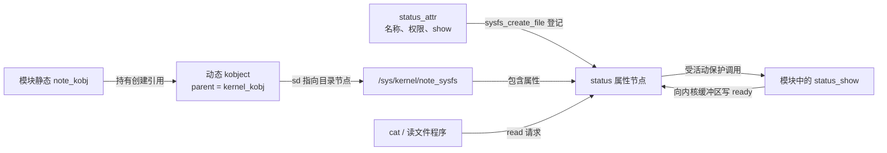
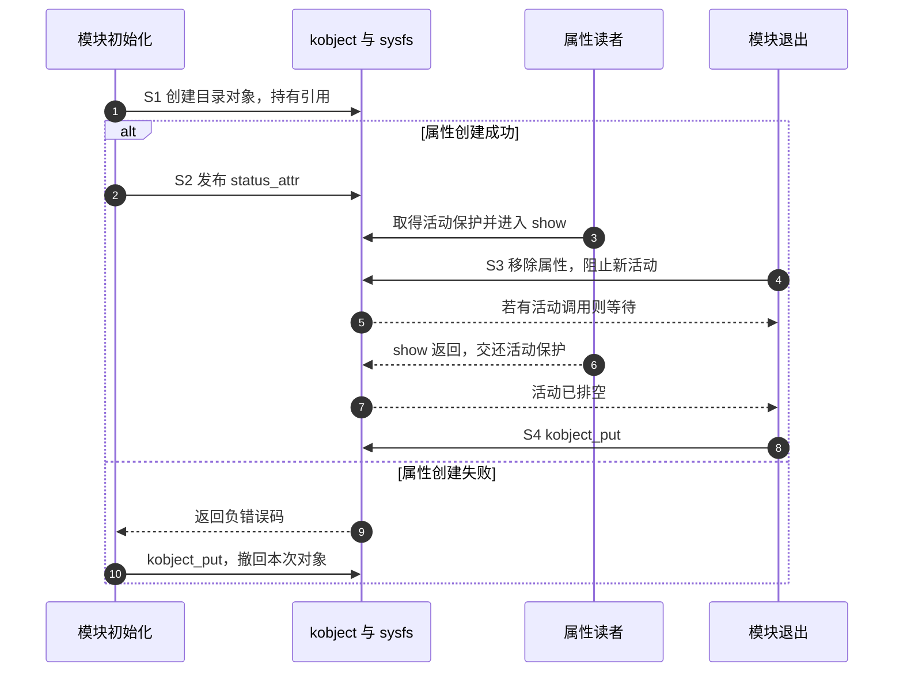

# 第1章\_kobject与一个只读属性

上一章用 sysfs 看到了设备关系，却没有说明目录与对象怎样相连。现在只做一件小事：装载模块后出现 /sys/kernel/note_sysfs/status，读取它得到 ready，卸载后这个入口消失。这个文件不是字符设备节点，也不需要设备号；它使我们能单独研究对象的表示与寿命。

本章承接[驱动框架模型](P01_驱动框架模型.md)，构建与模块装卸沿用[Hello 工程](../../../../engineering/build/kernel_modules/大纲.md)。完成后，你应能指出一次属性读取调用了谁，以及为什么删除文件和释放对象引用要分开做。

## 1.1\_从目录需要的共同信息出发

若每个子系统都自行管理对象名字、父目录、引用计数和属性入口，公共规则很容易出现细微差异。Linux 用 kobject 提供这些对象的公共基础：它是一个可嵌入其他结构的对象，不是所有内核对象都必须继承的“万能父类”。

一个 device 内嵌 kobject，因此设备模型能复用命名、层次与引用管理。单独学习时，也可以创建一个动态 kobject；这正是本章实验要做的。它只代表一个教学对象，不表示总线上真的发现了一块硬件。

在固定版本的 `struct kobject` 中，`name` 保存名字，`parent` 指向父对象，`kref` 保存引用计数，`ktype` 指向该类对象的公共操作，`sd` 指向 sysfs 背后的 `struct kernfs_node`。kernfs 是支撑这类内核虚拟文件系统节点的内部设施；sd 不是用户态文件描述符，也不是旧资料中的 sysfs_dirent 类型。

可选的 `kset` 是把若干 kobject 组织在一起的集合，`entry` 是对象加入集合所用的链表节点。集合成员关系、目录父子关系与驱动匹配是不同的关系，不能因为都长得像树或表，就让其中一个代替另一个。

引用计数回答“是否还有持有者”，并不回答“业务是否还能运行”。取得一个对象引用只能阻止按该引用协议执行的最终销毁，不能让已经停止的硬件重新工作，也不自动保护它的所有业务字段。

对象还可以参与向用户空间发送 uevent 的协议，报告添加、移除等事件；事件必须由对应调用路径明确发出，不能把每次属性值改变都视为自动通知。单独的 kobject_add 不会替本实验发布添加事件；本章只观察已经存在的 sysfs 目录，不依赖用户空间事件监听。

## 1.2\_让属性读取成为一次回调

sysfs 属性把一个小的对象属性接到文件操作上。读取时，sysfs 在自己的缓冲区中调用对象的 show 方法，方法写入文本并返回字节数。它不是字符驱动中接收用户指针的 read 回调，不在这里调用 copy_to_user。

本例只有固定字符串，因此不需要为可变业务状态加锁。属性名用 status，显示函数必须叫 status_show，`__ATTR_RO(status)` 把二者联系起来并生成只读权限；RO 表示 read-only。若未来增加写操作，需要定义 store、验证输入并制定并发协议，不能只把权限从只读改成可写。



图中有两种寿命需要分开：动态 kobject 的内存和模块里的属性/回调代码。仅仅说“最后 put 一下”不够，卸载前还必须保证以后不会再进入这个模块的 show，当前已经进入的调用也已经结束。

## 1.3\_完整的只读属性模块

保存为 note_sysfs.c。首行 SPDX-License-Identifier 是机器可读的许可证标识，GPL-2.0 表示这份示例的许可证；末尾的模块元信息沿用 Hello。ENOMEM 是内存不足错误码，本例如何处理创建原因将在代码后说明。对应[下载文件](../../../../labs/kernel/driver_entries/materials/note_sysfs.c)与下列程序一致。

```c
// SPDX-License-Identifier: GPL-2.0
#include <linux/module.h>
#include <linux/init.h>
#include <linux/kobject.h>
#include <linux/sysfs.h>
#include <linux/errno.h>

static struct kobject *note_kobj;

/* 属性只返回不变的内容，不保存用户缓冲区地址。 */
static ssize_t status_show(struct kobject *kobj,
                           struct kobj_attribute *attr, char *buf)
{
    return sysfs_emit(buf, "ready\n");
}

static struct kobj_attribute status_attr = __ATTR_RO(status);

static int __init note_sysfs_init(void)
{
    int ret;

    note_kobj = kobject_create_and_add("note_sysfs", kernel_kobj);
    if (!note_kobj)
        return -ENOMEM;

    ret = sysfs_create_file(note_kobj, &status_attr.attr);
    if (ret) {
        kobject_put(note_kobj);
        note_kobj = NULL;
        return ret;
    }
    return 0;
}

static void __exit note_sysfs_exit(void)
{
    /* 先撤销属性并等待活动回调结束，再交还对象引用。 */
    sysfs_remove_file(note_kobj, &status_attr.attr);
    kobject_put(note_kobj);
    note_kobj = NULL;
}

module_init(note_sysfs_init);
module_exit(note_sysfs_exit);
MODULE_LICENSE("GPL");
MODULE_DESCRIPTION("只读 sysfs 属性教学示例");
```

创建函数成功时返回一个已登记的动态对象，并把它挂到 kernel_kobj 表示的 /sys/kernel 下面；失败返回 NULL。这个便利函数把不同失败原因折叠成 NULL，因此本例统一向模块装载者返回 -ENOMEM，并不表示底层每种失败都真的是内存不足。如果需要保留加入阶段的原始错误，应使用分别初始化与加入的接口，并承担它们的完整清理协议。

属性创建返回整数状态：成功为 0，失败为负错误码。它失败时，模块初始化不会成功，退出函数也不会补做回滚，所以初始化函数立即归还对象引用。对象已经有类型规定的 release 方法，不能用 kfree 代替 kobject_put。

sysfs_emit 向 sysfs 提供的缓冲区格式化小段文本，返回写入长度；本例的 ready 加换行共 6 字节。字符串后加换行便于文本工具读取。返回值是字节数，不能把成功统一写成 0，否则读者会立即遇到文件结束。

## 1.4\_一轮创建读取与拆除

用同一组阶段追踪两条寿命轴：S0 未创建，S1 目录对象已登记，S2 属性可读，S3 撤销属性并排空活动调用，S4 归还创建引用。

| 阶段转换 | 执行者与状态地址 | 后续谁读取与完成条件 |
| --- | --- | --- |
| S0 → S1 | 初始化路径把动态对象地址写入 note_kobj；对象保存名字、parent 与引用 | sysfs 使用其目录表示；失败则保持未创建 |
| S1 → S2 | sysfs_create_file 把 status_attr 接到对象的目录节点 | 文件读取路径可取得活动保护后调用 status_show；失败则 put 回 S0 |
| S2 → S3 | 退出路径删除 status 属性；kernfs 停止接受该节点的新活动并等待已有活动结束 | 已进入的 show 返回后交还活动保护，移除路径才可继续 |
| S3 → S4 | 退出路径 kobject_put 归还创建引用 | 最后引用消失后由该对象类型的 release 清理内存；这不等于在任何配置下都立即 free |



移除等待的依据不是“sleep 一会儿应该读完了”，而是 kernfs 节点的活动状态。该保证针对经过这条 sysfs 路径的调用，不会自动取消你额外启动的工作、定时器或 DMA。本例根本没有这些异步使用者。

若启用延迟释放调试，kobject 最终内存清理可以延后。这里动态对象的 release 属于内核公共实现，模块自己的 status_attr 和 status_show 则已经在 S3 与新调用隔离；这也是显式先移除属性的价值。不要把这个例子的释放函数照搬到内嵌 kobject 的自定义对象，后者应由其类型的 release 回收外层对象。

更一般的 kobject_init、kobject_add、kobject_del、kobject_put 分别承担初始化、加入层次、撤销登记、归还引用。del 不等于归还调用方自己的所有引用，put 也不等于“无论计数多少都强制删除”。引用与业务可用性继续见[对象集成生命周期](../../../linux/object_lifetime/integration/P01_kobject_device_devres_kref_生命周期集成.md)。

## 1.5\_构建观察并改变一个条件

把源码与[Makefile](../../../../labs/kernel/driver_entries/materials/Makefile)放在同一个实验目录。该文件会同时构建本章和下一篇的 misc 模块，所以直接使用完整[材料目录](../../../../labs/kernel/driver_entries/materials/README.md)。先按 Hello 工程设置变量 KDIR 为与目标内核匹配且已经构建的内核构建目录；交叉构建时还需该工程说明的 ARCH 与 CROSS_COMPILE。

```bash
make -C "$KDIR" M="$PWD" modules
sudo insmod ./note_sysfs.ko
cat /sys/kernel/note_sysfs/status
stat -c '%a %F' /sys/kernel/note_sysfs/status
sudo rmmod note_sysfs
test ! -e /sys/kernel/note_sysfs/status && echo removed
```

在目标启用并挂载 sysfs、模块成功装载的条件下，cat 应打印 ready，stat 应看到权限 444 的普通文件视图，退出后应打印 removed。权限和文件类型说的是 sysfs 属性，不是磁盘上持久存储的普通文件。没有 /dev/note_sysfs 才是本实验的正常结果。

现在预测一次错误操作：普通用户向 status 写入文本会怎样？它没有写权限，也没有 store 回调，不能靠重定向把 ready 改掉。无需改变系统权限来“修好”它；只读正是我们承诺的接口。

若加载失败，先查看返回错误及内核日志，不要直接执行依赖目录已存在的后续步骤。发现重名应查清已有对象的所有者，不要删除别人的目录。成功加载以后才需在结束时 rmmod；初始化失败的清理已在函数内完成。

本章代码按 NXP 官方 Linux 6.12.20 固定提交核对，版本入口见[源码阅读索引](../../../../research/source_reading/driver_entries/navigation/P01_Linux_6.12_驱动入口源码阅读索引.md)。创建与引用的具体函数见[唯一实现说明](../../../../research/source_reading/driver_entries/source_explanations/P01_对象创建与misc分派.md#1.1_动态kobject的创建引用)。观察步骤需在匹配目标上执行，本仓库的静态检查不代表这些命令已在目标机跑过。

## 1.6\_回顾与练习

我们从一个文件的出现追到了对象、属性和回调，又从卸载追到两种寿命：先排空对模块代码的使用，再交还对象引用。kobject 提供公共身份与引用协议，sysfs 才把属性接到文件视图；它们都没有自动创建字符设备号。

1. 预测：把 show 的返回值改为 0，缓冲区仍写了 ready，cat 会显示什么？
2. 小修改：把固定文本改为 online，并保留换行。需要改属性名吗？
3. 排错：属性创建失败后只返回 ret 而不 put，遗漏了什么？
4. 迁移：若 show 要读取一个由工作线程更新的计数，现有“只移除属性再 put”是否足够？

参考思路：第一题读取会报告没有数据，写缓冲区不等于提交长度。第二题只改文本即可，名称和属性值属于不同层。第三题创建所得引用及已登记对象无人归还。第四题还需协调计数并发，并在模块退出时停止工作来源、等待工作结束；sysfs 排空并不代表工作线程也停止。

上一篇：[驱动框架模型](P01_驱动框架模型.md) · 下一篇：[misc 小型字符入口](../../misc/readme.md) · [大纲](大纲.md)。
