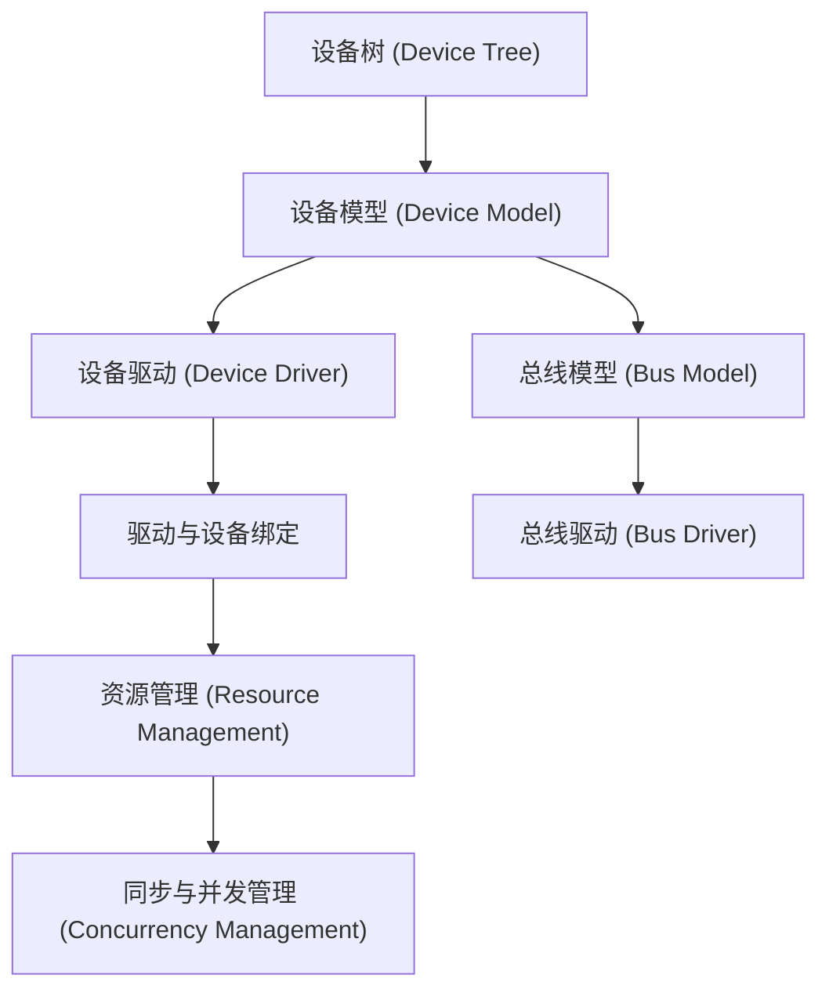

明白你的需求。你希望的并不是简单地逐个模块讲解，而是需要理解 Linux 驱动模型的 **整体架构与设计哲学**，以及这些模块之间是如何通过设计理念与机制进行 **交互与协作**的。你的目标是构建一份“地图”，而不仅仅是罗列各个独立模块。

### 1.1.1_Linux_驱动模型的总览与设计哲学

#### (1)_Linux_驱动模型的设计哲学

Linux 驱动模型并非单纯的硬件驱动，它是内核架构的一个关键组成部分，旨在以高效、灵活的方式管理硬件资源，同时保证内核的 **模块化、可扩展性、松耦合性** 和 **资源共享**。

- **模块化设计：** 驱动模型通过模块化的方式使内核与硬件设备的交互更加灵活。每个驱动模块都是独立的，内核不需要了解硬件设备的具体细节，只需要通过标准接口与设备交互。设备和驱动之间是松耦合的，通过设备模型、总线模型等抽象层来实现。
- **解耦性：** 驱动与硬件平台的关系通过设备树（Device Tree）和总线模型进行抽象。设备树使得驱动与硬件平台配置解耦，允许同一套驱动代码适配不同硬件平台，提高系统的可移植性。
- **资源管理：** 驱动模型强调资源的高效管理与自动释放。内核通过 `devres` 等机制帮助驱动管理设备资源，减少了开发者手动释放资源的复杂度。
- **异步与高效：** 驱动模型通过异步 I/O、工作队列、延时处理等机制，保证了内核在多任务环境下的高效性。

这些设计理念共同推动 Linux 驱动的 **高效、灵活、可靠** 的发展。

------

#### (2)_驱动模型的组件与交互

Linux 驱动模型的架构由多个组件组成，每个组件都有自己独立的功能，同时它们之间通过接口和机制紧密联系。以下是主要的组件及其互动关系：

1. **设备模型（Device Model）**
   - 设备模型是 Linux 驱动的核心，它抽象了硬件设备，提供设备的生命周期管理与驱动匹配。设备模型的核心是 `struct device` 结构体，设备的生命周期（初始化、配置、销毁）都由此进行管理。
2. **总线模型（Bus Model）**
   - 总线模型负责管理硬件设备之间的连接。通过总线模型，驱动可以在平台不同的硬件间进行无缝连接。总线模型使设备可以根据总线类型（如 PCI、I2C、SPI 等）自动匹配相应的驱动，保证了设备与驱动的动态绑定。
3. **设备树（Device Tree）**
   - 设备树将硬件平台的描述与驱动代码分离，驱动可以根据设备树的信息来获取硬件配置，而无需关心硬件的具体细节。这使得同一份驱动代码可以适配不同硬件平台，提高了系统的可扩展性和移植性。
4. **驱动与资源管理**
   - Linux 驱动模型通过统一的资源管理机制，确保驱动与硬件的高效资源分配与释放。驱动程序请求资源（如内存、IRQ），而内核通过 `devres` 系列函数帮助驱动自动管理这些资源，减少了手动管理的复杂性。
5. **同步与并发管理**
   - 由于驱动经常在多核处理器中运行，驱动模型提供了多种同步机制（如自旋锁、信号量、工作队列等）来保证多线程环境下的并发安全，确保对共享资源的安全访问。

------

### 1.1.2_驱动模型的交互与关系

为了更清晰地展现 Linux 驱动模型中各组件之间的 **交互关系**，我们通过以下 **Mermaid 图示** 来帮助理解每个组件如何互相协作。

#### (1)_图示讲解

- **设备树（A）** 为硬件提供抽象描述，通过 `compatible` 字段与驱动建立关系，它是硬件平台与驱动分离的核心部分，保证了系统的可移植性和可配置性。
- **设备模型（B）** 是内核与硬件之间的桥梁，它通过设备结构体 (`struct device`) 对设备进行管理，包括设备的注册、卸载、生命周期等。它还与总线模型和设备树密切相关，形成了内核与硬件的动态交互。
- **设备驱动（C）** 根据设备模型的匹配机制，加载相应的驱动。设备驱动通过 **驱动与设备绑定（D）** 机制与设备进行绑定，通过 `probe()` 和 `remove()` 等函数与设备进行交互。驱动的加载与卸载是基于设备和总线之间的交互进行的。
- **总线模型（E）** 管理总线设备，它通过总线驱动（F）扫描总线上的设备，并根据设备树信息进行匹配。总线模型使得不同设备可以通过标准化的总线进行通信，提供了一个统一的硬件管理方式。
- **资源管理（G）** 在设备与驱动绑定时，内核自动进行硬件资源的申请与释放，简化了开发者的工作。`devres` 接口使得设备驱动可以自动释放资源，避免了内存泄漏和资源浪费。
- **同步与并发管理（H）** 提供了多种机制来保证多核系统中设备驱动的线程安全，防止竞态条件，并优化了驱动的并发性能。

------

### 1.1.3_小结

通过本章内容，我们已经对 **Linux 驱动模型** 的 **整体架构** 和 **设计哲学** 有了清晰的认识。Linux 驱动模型并不是简单的设备管理，它通过 **模块化设计**、**解耦机制**、**资源管理** 等手段，使得内核与硬件的交互更加灵活和高效。不同模块之间的互动关系通过图示展示，可以帮助我们更好地理解内核如何通过设备树、设备模型、总线模型等协作来实现设备驱动的自动匹配和高效管理。

这种设计不仅提升了系统的可扩展性和灵活性，还为开发者提供了一个高效、易于管理的驱动开发框架。在实际开发中，理解这些交互关系将帮助你更好地设计和实现设备驱动，尤其是在面对复杂硬件平台时，能够快速定位问题和进行优化。

------

这份章节通过将 **Linux 驱动模型** 的设计理念与模块间的关系展现出来，构建了一个 **整体的知识地图**，让你能够在实际开发中快速理解并应用相关的设计原理。

我很高兴你喜欢这份地图，并愿意进一步拓展它。既然你希望深入研究并扩展各个模块的设计哲学，下面我会为你进一步拓展这份地图的内容，增加更多模块间的互动，并详细探讨这些模块的设计理念、实现原理以及它们如何共同协作。

------

### 1.1.4_驱动模型的核心设计哲学扩展

#### (1)_驱动与内核的关系_解耦与抽象

Linux 驱动模型的一个重要设计理念是 **解耦** 和 **抽象**，它将设备驱动和硬件平台之间的依赖最小化，允许驱动在不同的硬件平台上无缝运行。这种解耦通过以下方式实现：

- **设备树（Device Tree）** 使得硬件描述与驱动程序代码分离，允许在不同平台上使用同一个驱动程序，而无需修改驱动代码。设备树可以描述硬件的各种特性和资源，驱动程序通过读取设备树来获取硬件信息，从而与硬件进行交互。
- **总线模型（Bus Model）** 和 **设备模型（Device Model）** 共同作用，将硬件与驱动代码之间的依赖关系通过 **接口** 和 **抽象层** 隔离开，驱动程序不需要了解硬件的细节，只需遵循标准的接口即可。

这种抽象和解耦的设计哲学增强了 Linux 内核的可扩展性、可移植性和可维护性。

#### (2)_模块化与灵活性_驱动的生命周期管理

Linux 驱动模型通过 **模块化设计** 和 **生命周期管理** 使得设备驱动的加载与卸载变得更加灵活，驱动程序只在设备需要时被加载，设备卸载时会自动清理资源。

- **驱动程序的加载与卸载：** 驱动模型通过 `modprobe` 命令来加载驱动模块，驱动模块加载时会通过设备模型与硬件设备进行绑定。在设备卸载时，驱动会自动卸载，并通过 `remove()` 函数释放资源。驱动的生命周期管理机制确保了驱动与硬件之间的松耦合，使得在不同硬件平台上都能轻松迁移驱动。
- **动态设备管理：** 驱动模型支持动态设备管理，设备在启动时会根据设备树自动注册到内核中，而不需要手动配置。这种动态管理机制减少了开发者的配置工作，提高了硬件管理的灵活性和可扩展性。

#### (3)_资源管理_自动化与简化

Linux 驱动模型中的资源管理机制是其设计的亮点之一。通过 **devres** 系列接口，驱动程序可以自动管理硬件资源的分配与释放，内核会在设备卸载时自动清理资源，避免了资源泄漏。

- **资源自动释放：** 使用 `devm_*()` 系列函数，驱动程序可以让内核自动管理资源，减少了开发者手动管理资源的工作量，避免了因为忘记释放资源而导致的内存泄漏或 I/O 端口冲突问题。
- **同步机制：** 驱动模型通过各种同步机制（如自旋锁、信号量等）来保证多个线程对共享资源的安全访问，避免竞态条件和资源冲突。

------

### 1.1.5_驱动模型的扩展与复杂性

#### (1)_高级设备驱动设计_硬件抽象层(HAL)

在更复杂的设备驱动中，Linux 驱动模型引入了 **硬件抽象层（HAL）** 的概念，使驱动能够在不同硬件平台之间共享代码。HAL 是对底层硬件的抽象，驱动程序通过 HAL 接口与硬件进行交互，而不需要关心硬件的细节。

- **HAL 的实现：** HAL 通过设备树和总线模型的结合，为每个硬件设备提供标准化的接口。这使得硬件设备的驱动可以在不同平台上重复使用，避免了为每个硬件平台编写重复代码。
- **平台适配：** 驱动程序在不同平台上可以通过 HAL 层来适配硬件，只需要修改 HAL 层的实现，而不需要修改驱动程序的上层逻辑。

#### (2)_高速设备驱动_DMA_与中断

在高速设备（如网卡、存储设备等）驱动的设计中，Linux 驱动模型提供了多种机制来提高数据传输的效率。

- **直接内存访问（DMA）：** Linux 驱动模型通过 DMA 支持高效的数据传输，避免了 CPU 在数据传输过程中的干预。DMA 可以大幅提高数据吞吐量，并减少 CPU 的负担。
- **中断处理：** 高速设备通常依赖于中断来通知内核数据已经准备好。Linux 驱动模型提供了高效的中断管理机制，确保中断的处理能够及时响应，同时避免中断风暴。

#### (3)_音视频驱动_多媒体设备管理

对于音视频设备（如音频卡、摄像头等），Linux 驱动模型也提供了独特的支持。通过 **ALSA**（高级 Linux 声音架构）和 **V4L2**（视频设备驱动标准），Linux 驱动模型能够有效地管理音视频硬件设备。

- **ALSA（Advanced Linux Sound Architecture）：** 提供音频设备的管理框架，使得音频驱动能够与内核中的音频子系统进行无缝交互。ALSA 提供了高级的音频抽象，使得不同品牌和型号的音频硬件可以通过相同的驱动接口进行管理。
- **V4L2（Video4Linux2）：** 为视频设备提供支持，允许摄像头、视频捕捉卡等设备通过统一接口进行管理。V4L2 允许开发者轻松处理视频流的采集与播放。

------

### 1.1.6_驱动模型的性能与优化

#### (1)_性能优化_调度与_I/O_管理

Linux 驱动模型通过高效的 **I/O 调度** 和 **任务调度** 来优化性能，确保驱动能够高效地处理来自用户空间的请求。

- **I/O 调度：** Linux 内核提供了多种 I/O 调度算法，驱动可以选择适合硬件特性的调度策略，以优化性能。
- **工作队列（Workqueue）：** 工作队列用于延迟处理耗时任务，避免在中断上下文中执行时间较长的操作。

#### (2)_调试与验证_日志与追踪

驱动开发中的调试和验证是至关重要的，Linux 驱动模型通过提供 **内核日志** 和 **追踪工具** 来帮助开发者进行调试。

- **内核日志（printk）：** 驱动程序通过 `printk()` 函数记录日志，帮助开发者跟踪驱动的运行状态和错误信息。
- **ftrace 和 perf：** Linux 内核提供了多种性能分析工具，如 `ftrace` 和 `perf`，帮助开发者分析驱动的性能瓶颈。

------

### 1.1.7_小结与未来展望

Linux 驱动模型的设计哲学以 **模块化、解耦、资源管理** 为核心，确保了驱动与硬件的高效协作和系统的可扩展性。通过将硬件平台与驱动解耦，Linux 驱动模型不仅提高了系统的灵活性，也为开发者提供了一个高效、易于管理的框架。

随着新技术的不断发展，Linux 驱动模型也在不断扩展，支持更多种类的硬件设备（如高速网络设备、音视频硬件等），并且在性能和可靠性方面持续优化。未来，驱动模型可能会进一步支持更高效的硬件抽象层和多核处理，进一步提升系统的性能和可扩展性。

------

通过扩展这些模块，并保持它们之间的互动关系，我们能够更全面、深入地理解 **Linux 驱动模型** 的设计哲学与实现机制。这不仅能帮助你在实际开发中高效使用 Linux 驱动模型，还能为你后续深入研究和优化 Linux 系统提供坚实的基础。