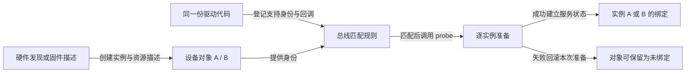

# 第1章\_从一个驱动到多个设备

Hello 模块使一段代码进入了内核，字符设备实验又使程序能通过文件操作调用这段代码。接下来换一个条件：同一块板上接了两个型号相同的传感器，一个测入口温度，一个测出口温度。是复制两份驱动，还是让一份代码照顾两个实例？

本章承接[模块与设备入口](../../../linux/architecture/modules_and_device_nodes/大纲.md)。只要求你分清“代码已装载”和“设备节点存在”，不要求已经掌握设备模型。我们先从两只传感器推导框架需要分开的职责；读完应能解释为什么改板子、换设备、停止一次服务与卸载模块是四种不同操作。

## 1.1\_先让一只设备工作

设第一版程序知道传感器的通信地址、如何发出测量命令、怎样解释返回字节，并把温度交给应用。它把这些事情写在一起，少量代码就能完成工作。这种做法在验证单一硬件时有价值：路径短，出了问题容易逐步观察。

第二只同型号器件加入后，读取协议并没有改变，改变的是“本次跟谁通信”以及“把结果放在哪份状态里”。若直接复制整份程序，一处换算修正需要修改两次；如果两份代码意外使用同一个全局缓存，出口测量还会覆盖入口测量。问题不是文件数量本身，而是 **实例状态与共享操作没有分开**。

因此先做一个普通 C 程序也能理解的拆分：每只器件保存自己的地址、测量缓存和运行状态；读取函数接收指向该实例的指针，按照相同协议操作。这里的“设备”首先指具体实例；“驱动”指知道如何操作这一类实例的代码。一个驱动可以服务多个设备，各实例仍有各自的数据和资源。

假设两个器件需要不同的时钟或校准参数。它们不必变成两份驱动，但代码必须检查参数是否受支持。共享代码并没有消除硬件差异，只是让差异有明确入口。

## 1.2\_谁告诉驱动有哪些设备

驱动已经能接收实例参数，下一步却不是让它自行遍历所有地址。盲目读一个地址可能遇到另一种器件，也可能触发有副作用的寄存器。系统需要在允许的发现方式下建立设备描述。

有些连接体系允许控制器枚举实际存在的设备；有些板载器件不能自行报告身份，需要固件或板级描述提供地址、中断和连接关系。设备树就是后者常用的一种描述方式：它保存硬件事实，内核中相应的代码解释这些事实并创建对象。设备树不是驱动，也不会仅凭一段文字把任意硬件变成可用设备。

描述与操作分离的价值此时才出现：换板子主要改变连接参数，相同协议代码仍可能复用。成立条件是新板的控制器、资源提供者、器件协议及绑定约定均已获得支持；若协议或硬件能力变了，驱动照样需要修改。“使用设备树”不是免除移植工作的通行证。

为了把实例交给合适的操作代码，还要有人规定身份怎样比较。Linux 的总线类型承担这种组织职责：设备加入某种总线，驱动也向该总线登记，匹配规则决定二者是否值得尝试协作。这里的总线既可能对应真实连线，也可能是软件组织方式。后面要观察的 platform 总线用于组织一类平台设备，它的名称并不表示又多出了一根硬件总线。

## 1.3\_匹配只是邀请服务

身份比较成功只能说明“这份驱动可能认识它”。资源可能尚未就绪，内存分配可能失败，器件也可能没有响应。于是框架调用驱动的探测回调，通常名为 `probe`，让驱动为这个实例取得资源、检查能力并建立工作状态。

探测成功后，设备与驱动才形成一次有效绑定。失败时，设备对象可能继续存在，驱动代码也可能继续存在，缺少的是这次成功的服务关系。这解释了一个常见现象：模块装载成功，却没有可用设备。模块负责让代码进入系统，探测负责让代码服务某个对象；两者不是同一个返回值。

```mermaid
flowchart LR
    desc["硬件发现或固件描述"] -->|"创建实例与资源描述"| dev["设备对象 A / B"]
    code["同一份驱动代码"] -->|"登记支持身份与回调"| bus["总线匹配规则"]
    dev -->|"提供身份"| bus
    bus -->|"匹配后调用 probe"| probe["逐实例准备"]
    probe -->|"成功建立服务状态"| service["实例 A 或 B 的绑定"]
    probe -->|"失败回滚本次准备"| retry["对象可保留为未绑定"]
```

每个箭头都有承担动作的代码。图里的“框架”不是一个会自动修好失败的总管。受管资源只能回收登记过的对象；硬件已经启动、外部任务已经排队等效果，还要由驱动明确停止。失败协议接着沿[错误指针专题](../../../linux/error_handling/error_pointer/大纲.md)展开。

当一个实例被解绑，驱动需要停止该实例的服务，释放这次绑定占用的资源。另一个实例可以继续工作，所以 **解绑一个设备不等于卸载整份模块**。反过来，模块退出通常要先撤销其驱动登记，由框架逐一解除有关绑定，再允许代码退出。

## 1.4\_设备怎样面对应用

到这里，系统知道“谁存在、谁认识它、是否准备好了”，应用却还不知道从哪里读取温度。用户接口是另一个设计决定。

若设备属于成熟功能领域，优先接入该领域的子系统。声音领域的 ALSA（Advanced Linux Sound Architecture，Linux 声音框架）和视频领域的 V4L2（Video for Linux 2，视频接口框架）规定了各自的对象、数据格式与操作方式。它们使应用面对统一功能接口，但底层驱动仍需实现具体硬件操作。不是每个传感器都应该借用声音或视频接口；举这两个例子是为了区分“共同管理设备”与“统一某一类功能”。

小型专用服务也可以发布字符设备入口。若只是查看一个对象的小属性，可以使用 sysfs：内核把对象组织成目录，把属性操作接到文件读写上。下一章会区分设备拓扑、总线视图与按功能分类的 class；后续实验再对比 sysfs 属性和 misc 字符入口。**有设备对象、有 sysfs 目录、有 /dev 节点** 是三个需要分别证明的事实。

中断是硬件向处理器报告事件的一种途径。中断到来后，驱动更新状态或唤醒等待者；应用下次读取，或者之前阻塞的读取恢复，才接到事件结果。不能把硬件中断直接画成“执行应用的系统调用”，因为系统调用由应用主动进入内核。

## 1.5\_框架没有替我们承担什么

现在给传感器增加持续采样。一次读取尚未完成，另一项请求已经到来，原来的逐条程序需要新的协调。先判断哪些状态可并行、哪些操作必须串行，再选择锁、等待或工作队列。工作队列把工作安排到工作线程执行，本身并不保证所有共享数据互斥；取消工作与等待已运行工作结束也需要明确协议。

采样数据量继续增加时，可以考虑 DMA（Direct Memory Access，直接内存访问），即让设备或控制器按已配置的传输描述搬运数据，减少 CPU 逐字节搬运。驱动仍要安排缓冲区、处理地址映射与缓存一致性、启动传输并处理完成。它改变的是搬运环节，不是让 CPU 与对象生命周期退出整个过程。中断也不自动防止中断风暴，驱动与控制器仍要正确应答和控制事件源。

这些优化应从可观察的瓶颈出发：请求在哪里排队，CPU 时间花在哪里，设备是否已经满负荷。日志适合重建事件，跟踪工具适合观察时间关系，性能计数用于定量比较；过多日志本身也会扰动时序。块设备的 I/O 调度属于特定数据路径，不能当作所有字符驱动都具备的加速器。

框架的收益是复用公共组织与生命周期协议，代价是必须遵守这些协议并理解回调时机。一次性的最小硬件验证可以先保持简单；成为可维护驱动后，应把实例状态、资源所有权、公共接口和拆除责任放到相应层次，而不是单纯增加更多结构体。

## 1.6\_回顾与练习

现在可以从具体需求推出四件事：不同实例需要不同状态，相同操作适合复用，总线负责组织匹配，探测建立一次服务关系。硬件描述、模块装载、绑定和用户入口因此不能混为一谈。还没解决的是这些关系在 Linux 中放在哪里；[下一章](P01_驱动框架模型.md)将把这张图落到可观察对象上。

1. 预测：只有传感器 B 探测失败，是否必须让 A 停止？
2. 修改条件：新板仍用相同传感器，但通信控制器变了。只复制设备树就足够吗？
3. 排错：模块已在列表里，设备也能在 sysfs 找到，应用却找不到 /dev 文件。应先确认哪个设计决定？
4. 迁移：收到中断后需要做耗时、可能睡眠的处理。把工作放到工作队列以后，哪些责任还在驱动手中？

参考思路：第一题不必，实例失败应局限在其资源与绑定，除非它们确实共享一个不可用的依赖。第二题还需控制器驱动、连接参数及资源提供者支持。第三题先确认驱动是否设计了字符入口及是否已成功发布，而不是先反复 mknod。第四题仍要保护共享状态、限制排队、在拆除时禁止新工作并等待旧工作结束。

专题入口：[驱动框架学习地图](大纲.md)。
