[TOC]

内容摘抄自GPT

# 第1章_引言

------

## 1.1_背景与问题提出

在 Linux 驱动开发的学习过程中，初学者最常见的疑惑之一是：**为什么我在驱动里调用了 `class_create()`、`device_create()` 之后，就能在 `/dev/` 目录下看到一个新的设备文件？**

这种现象背后，隐藏着 Linux 内核中 **设备模型（Device Model）** 的完整机制。`class` 是这个机制里一个极为重要的抽象。它并不是一个“平白出现”的工具函数，而是内核中用来表示 **设备类别（Device Class）** 的数据结构。

驱动开发者如果能够正确理解并使用 `class`，不仅可以轻松地在 `/dev` 下自动生成设备文件，还能借助 sysfs 提供的结构化信息，与用户空间的管理工具（如 **udev** 或 **mdev**）进行联动，实现设备的动态管理与配置。

因此，**学习 class 的意义**在于：

- 从驱动代码层面：**简化设备节点管理**，免去手动 `mknod` 的麻烦。
- 从内核对象模型层面：**掌握 sysfs 的组织逻辑**，理解驱动与内核设备树的关系。
- 从系统调试层面：**学会多角度观察设备**，能从 `/dev`、`/sys`、`/proc` 等文件系统中定位问题。

------

## 1.2_本专题的目标

本专题将紧紧围绕 **Linux 内核中的 `struct class` 数据结构**，结合驱动开发中的实际使用场景，系统地展开以下内容：

1. **数据结构**：解析 `struct class` 的定义与核心字段，理解它在内核设备模型中的地位。
2. **驱动编程接口**：学习 `class_create()`、`device_create()` 等函数的使用方法，掌握它们在字符设备驱动中的典型调用流程。
3. **观察方法**：从 `/sys/class/`、`/dev/`、`/proc/devices` 等文件系统不同角度，学会验证和调试 `class` 的存在与作用。
4. **进阶功能**：介绍 `devnode` 回调、自定义 sysfs 属性组、多实例设备管理等高级用法。
5. **子系统案例**：通过输入子系统（`input` class）、TTY 子系统（`tty` class）等内核已有的 class，理解其实际应用场景。
6. **调试与常见问题**：总结设备节点缺失、权限错误、命名冲突等常见问题及对应的解决方案。
7. **工程化建议**：结合嵌入式与桌面系统的差异，给出实际开发中的最佳实践。

------

## 1.3_学习方式与阅读建议

- **代码驱动学习**：每一章都配合简化版驱动示例代码，确保理论与实践结合。
- **多角度观察**：在学习过程中，务必使用 `ls -l /sys/class/`、`cat uevent`、`stat /dev/xxx` 等命令，从不同文件系统层面确认理解是否正确。
- **分层理解**：
  - **驱动层**：关注 `class_create()` / `device_create()` 等 API。
  - **内核层**：关注 `class` 与 `kobject`、`device` 的关系。
  - **用户层**：关注 udev/mdev 如何响应 `uevent` 并生成节点。

好 👌 那我们在 **第 2 章** 的基础上，继续以 **Linux Kernel 6.1** 为核心，结合 **数据结构定义** 与 **驱动使用方式**，展开更贴近源码的讲解。我会保持“书籍风格”，同时引入必要的代码片段和说明。

------

# 第2章_struct_class_数据结构解析(基于_Linux_6.1)

------

## 2.1_数据结构的源码定义

在 **Linux 6.1** 内核中，`struct class` 定义位于：

```c
// include/linux/device/class.h

struct class {
	const char              *name;
	struct module           *owner;

	struct kobject          *dev_kobj;   /* sysfs 下的 kobject */
	struct list_head        devices;     /* 挂接的设备链表 */
	struct kset             subsys;      /* class 本身也是一个 kset */

	struct kobject          *p;          /* 指向 class_private */

	const struct class_attribute *class_attrs;
	const struct attribute_group **class_groups;
	const struct kobj_uevent_ops *uevent_ops;

	int (*devnode)(struct device *dev, umode_t *mode);

	void (*class_release)(struct class *cls);
};
```

#### (1)_字段逐项解析(结合驱动开发)

- **`name`**
  - 类的名字，例如 `"input"`、`"tty"` 或 `"demo_class"`。
  - 会直接体现在 sysfs：`/sys/class/<name>/`。
- **`owner`**
  - 模块引用计数，一般填 `THIS_MODULE`。
  - 作用：防止 `class` 使用时模块被卸载。
- **`dev_kobj`**
  - 指向 sysfs 里的 kobject，形成 `/sys/class/<name>/`。
  - 内核设备模型的桥梁。
- **`devices`**
  - 挂接属于该 class 的所有 `device` 对象。
  - 例如 `/sys/class/input/eventX` 下的每个 input 设备。
- **`subsys`**
  - `kset` 类型，`class` 本身也是一个内核对象集合，挂到 kobject 层次结构里。
- **`p`**
  - 指向 `class_private`（私有数据），封装了 mutex、device 链表、属性等管理信息。
- **`class_attrs` / `class_groups`**
  - 用于向 sysfs 暴露 class 级别的属性文件。
  - 常见于调试接口或全局配置。
- **`uevent_ops`**
  - 控制向用户空间发送 `uevent` 时的环境变量，供 `udev` 使用。
  - 典型场景：USB、网络子系统需要在 uevent 中提供额外信息。
- **`devnode`**
  - 回调函数，决定 `/dev` 节点的 **名字和权限**。
  - 例如：把默认 `0600` 改成 `0666`，或给设备节点加前缀路径。
- **`class_release`**
  - 释放回调，清理 `class` 内存。

------

## 2.2_class_的创建与销毁

在 **驱动开发** 中，`class` 的使用遵循固定生命周期：

1. **创建 class**

   ```c
   struct class *cls;
   cls = class_create(THIS_MODULE, "demo_class");
   if (IS_ERR(cls)) {
       pr_err("class_create failed\n");
       return PTR_ERR(cls);
   }
   ```

   - 效果：在 `/sys/class/demo_class/` 下生成目录。

2. **销毁 class**

   ```c
   class_destroy(cls);
   ```

   - 卸载驱动时调用，清理 sysfs 目录。

------

## 2.3_class_与_device_的配合

创建 class 之后，驱动通常会调用 `device_create()` 来在 sysfs 和 `/dev` 下生成具体的设备节点：

```c
struct device *dev;
dev = device_create(cls, NULL, devt, NULL, "demo");
if (IS_ERR(dev)) {
    pr_err("device_create failed\n");
    class_destroy(cls);
    return PTR_ERR(dev);
}
```

- **参数说明**

  - `cls`：前面 `class_create()` 的返回值。
  - `NULL`：父设备。
  - `devt`：设备号（`MKDEV(major, minor)`）。
  - `"demo"`：设备文件名 `/dev/demo`。

- **对应的销毁操作**

  ```c
  device_destroy(cls, devt);
  ```

- **完整顺序**

  - 初始化：`class_create()` → `device_create()`。
  - 卸载：`device_destroy()` → `class_destroy()`。

------

## 2.4_驱动开发中的典型用法(字符设备)

在字符设备驱动中，`class` 的典型使用模式是：

1. `alloc_chrdev_region()` 获取主/次设备号。
2. `cdev_init()` + `cdev_add()` 注册 cdev。
3. `class_create()` 创建一个 class。
4. `device_create()` 在 `/dev` 下生成节点。
5. 模块卸载时，**逆序清理**：`device_destroy()` → `class_destroy()` → `cdev_del()` → `unregister_chrdev_region()`。

------

## 2.5_与_sysfs_文件系统的关系

从 **文件系统的角度**，观察 `class` 的效果：

1. 加载驱动后：

   ```bash
   $ ls /sys/class/demo_class/
   demo
   ```

2. 查看设备目录：

   ```bash
   $ ls -l /sys/class/demo_class/demo
   device  subsystem  uevent
   ```

3. 查看 uevent 文件：

   ```bash
   $ cat /sys/class/demo_class/demo/uevent
   MAJOR=240
   MINOR=0
   DEVNAME=demo
   ```

4. 验证 `/dev/demo` 节点：

   ```bash
   $ ls -l /dev/demo
   crw-rw---- 1 root root 240, 0 ...
   ```

👉 说明：

- **/sys/class/**：是内核对象的 sysfs 映射。
- **uevent**：向用户态传递主/次设备号信息。
- **/dev/**：由 `devtmpfs` 或 `udev/mdev` 根据 uevent 创建的实际设备文件。

------

## 2.6_小结

在 **Linux 6.1** 中，`struct class` 是一个围绕 **sysfs** 的抽象层，它的存在价值体现在：

1. **逻辑分类**：把功能相近的设备组织在一起。
2. **sysfs 表现**：在 `/sys/class/` 下提供统一视图。
3. **自动节点生成**：配合 `device_create()` 触发 uevent，从而生成 `/dev/` 节点。
4. **灵活扩展**：通过 `devnode` 回调和 `class_groups`，可定制节点权限与属性。

------

📖 下一章（第 3 章），我们就会把这些 **接口组合成完整的驱动开发流程**，展示如何在一个实际的字符设备驱动中，使用 `class_create()`、`device_create()` 等 API，做到 **加载即有节点，卸载即清理**。

好的 👍 那我们继续，进入 **第 3 章：驱动开发中的典型使用流程**。这一章会完全基于 **Linux Kernel 6.1** 的接口和习惯写法，结合驱动编程示例来讲解 `class` 的使用方法。

------

# 第3章_驱动开发中的典型使用流程

------

## 3.1_生命周期总览

我们把 **第 3.1 小节的流程图**（生命周期总览）拆成 **加载流程** 和 **卸载流程** 两个单独的图，便于记忆和笔记整理。

------

### 3.1.1_加载流程(正向)

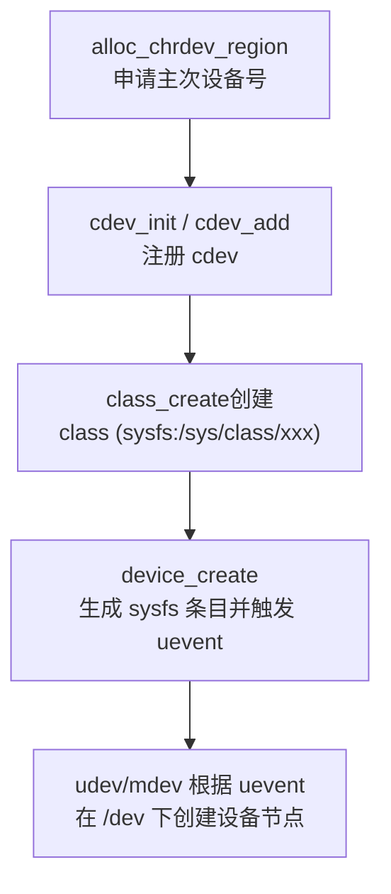

------

### 3.1.2_卸载流程(逆向)

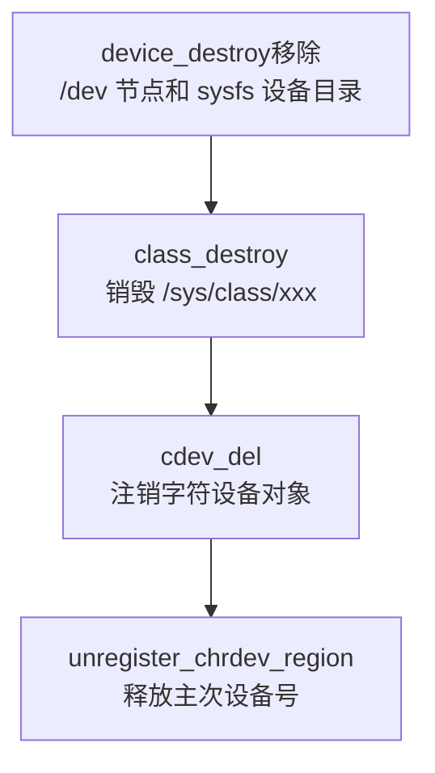

------

👉 核心要点：

- **正向加载**：先有设备号 → cdev → class → device。
- **逆向卸载**：严格反向清理，防止资源悬挂。

------

## 3.2_class_create()

### 3.2.1_使用方法

```c
struct class *demo_class;

demo_class = class_create(THIS_MODULE, "demo_class");
if (IS_ERR(demo_class)) {
    pr_err("class_create failed\n");
    return PTR_ERR(demo_class);
}
```

- **THIS_MODULE**：保证模块引用计数正确。
- **"demo_class"**：将出现在 `/sys/class/demo_class/`。

### 3.2.2_成功效果

```bash
$ ls /sys/class/demo_class/
```

此时 sysfs 中已经存在类目录，但还没有具体设备。

------

## 3.3_device_create()

### 3.3.1_使用方法

```c
struct device *dev;

dev = device_create(demo_class, NULL, devt, NULL, "demo");
if (IS_ERR(dev)) {
    pr_err("device_create failed\n");
    class_destroy(demo_class);
    return PTR_ERR(dev);
}
```

- **参数说明**
  - `demo_class`：前面 `class_create()` 返回的句柄。
  - `NULL`：父设备，通常填空。
  - `devt`：设备号，来自 `alloc_chrdev_region()`。
  - `"demo"`：最终节点名 `/dev/demo`。

### 3.3.2_内核行为

1. 在 `/sys/class/demo_class/demo/` 下创建目录。
2. 内核生成 **uevent** 消息，包含 `MAJOR`/`MINOR` 信息。
3. 用户空间的 **udev/mdev** 捕获事件，在 `/dev` 下创建设备文件。

👉 观察方法：

```bash
$ cat /sys/class/demo_class/demo/uevent
MAJOR=240
MINOR=0
DEVNAME=demo

$ ls -l /dev/demo
crw------- 1 root root 240, 0 ...
```

------

## 3.4_device_destroy()_与_class_destroy()

在 **模块卸载** 阶段，需要逆序清理：

```c
device_destroy(demo_class, devt);
class_destroy(demo_class);
```

否则 `/sys/class/demo_class/` 会残留目录，甚至导致内核对象引用计数泄漏。

------

## 3.5_完整示例代码(精简版)

以下是一个基于 Kernel 6.1 的最小字符设备驱动，演示 `class` 的典型使用流程：

```c
#include <linux/module.h>
#include <linux/fs.h>
#include <linux/cdev.h>
#include <linux/device.h>

#define DEVICE_NAME "demo"

static dev_t devt;
static struct cdev demo_cdev;
static struct class *demo_class;

static int demo_open(struct inode *inode, struct file *file)
{
    return 0;
}

static int demo_release(struct inode *inode, struct file *file)
{
    return 0;
}

static const struct file_operations demo_fops = {
    .owner   = THIS_MODULE,
    .open    = demo_open,
    .release = demo_release,
};

static int __init demo_init(void)
{
    int ret;

    /* 1. 分配设备号 */
    ret = alloc_chrdev_region(&devt, 0, 1, DEVICE_NAME);
    if (ret < 0)
        return ret;

    /* 2. 注册 cdev */
    cdev_init(&demo_cdev, &demo_fops);
    demo_cdev.owner = THIS_MODULE;
    ret = cdev_add(&demo_cdev, devt, 1);
    if (ret)
        goto err_unregister;

    /* 3. 创建 class */
    demo_class = class_create(THIS_MODULE, "demo_class");
    if (IS_ERR(demo_class)) {
        ret = PTR_ERR(demo_class);
        goto err_cdev;
    }

    /* 4. 创建设备节点 */
    if (IS_ERR(device_create(demo_class, NULL, devt, NULL, DEVICE_NAME))) {
        ret = -EINVAL;
        goto err_class;
    }

    pr_info("demo driver loaded, /dev/%s ready\n", DEVICE_NAME);
    return 0;

err_class:
    class_destroy(demo_class);
err_cdev:
    cdev_del(&demo_cdev);
err_unregister:
    unregister_chrdev_region(devt, 1);
    return ret;
}

static void __exit demo_exit(void)
{
    device_destroy(demo_class, devt);
    class_destroy(demo_class);
    cdev_del(&demo_cdev);
    unregister_chrdev_region(devt, 1);

    pr_info("demo driver unloaded\n");
}

module_init(demo_init);
module_exit(demo_exit);

MODULE_LICENSE("GPL");
```

------

## 3.6_小结

- `class_create()` 决定 **类别**，出现在 `/sys/class/`。
- `device_create()` 决定 **具体设备**，触发 uevent，最终出现在 `/dev/`。
- `device_destroy()` + `class_destroy()` 必须在卸载时逆序调用。
- 驱动加载即有 `/dev/demo`，卸载即清理干净，这是 **驱动工程化的标准姿势**。

------

📖 下一章（第 4 章）我们会从 **观察与验证** 的角度，介绍如何通过 `/sys`、`/dev`、`/proc/devices` 等不同文件系统，去确认 `class` 的效果，并学习调试方法。

明白 ✅
 我来重新整理 **第 4 章：观察与验证**，这次严格保证 **标题层级和编号对应**，保持书籍式风格（一级标题是章，二级标题是节，三级标题是小节）。

------

# 第4章_观察与验证

------

## 4.1_从_sysfs_观察_class_与设备

### 4.1.1_类目录

驱动调用 `class_create()` 之后，sysfs 会自动生成类目录。

```bash
$ ls /sys/class/demo_class/
demo
```

此时 `/sys/class/demo_class/` 已存在，但还没有 `/dev/demo` 节点。

### 4.1.2_设备目录

调用 `device_create()` 后，sysfs 中出现设备目录：

```bash
$ ls -l /sys/class/demo_class/demo
device  subsystem  uevent
```

- **device** → 指向实际的设备对象。
- **subsystem** → 反向链接到所属 class。
- **uevent** → 保存内核发出的事件信息。

### 4.1.3_uevent_文件

```bash
$ cat /sys/class/demo_class/demo/uevent
MAJOR=240
MINOR=0
DEVNAME=demo
```

这里的 `MAJOR`/`MINOR` 与最终 `/dev/demo` 的设备号对应。

------

## 4.2_从_/dev_观察设备节点

### 4.2.1_节点信息

```bash
$ ls -l /dev/demo
crw------- 1 root root 240, 0 ...
```

- `c` → 字符设备。
- `240, 0` → 主设备号 240，次设备号 0。

### 4.2.2_stat_验证

```bash
$ stat -c "major=%t minor=%T" /dev/demo
major=f0 minor=0
```

输出以十六进制显示设备号（`f0` 即 240）。

------

## 4.3_从_/proc/devices_查看全局注册

内核维护的全局设备表位于 `/proc/devices`。

```bash
$ cat /proc/devices | grep demo
240 demo
```

这里的名字来自 `alloc_chrdev_region()` 注册时传入的参数。

------

## 4.4_动态事件追踪(udev_视角)

### 4.4.1_监听事件

```bash
$ sudo udevadm monitor --kernel --udev
KERNEL[1234.5678] add /class/demo_class/demo (demo_class)
UDEV  [1234.5679] add /class/demo_class/demo (demo_class)
```

- **KERNEL** → 内核发出的 `uevent`。
- **UDEV** → 用户空间 udev 守护进程的处理结果。

### 4.4.2_意义

通过事件流可以验证：

1. 内核确实生成了设备事件。
2. udev 成功接收并处理。

------

## 4.5_常见对照表

| 观察路径                            | 作用                | 示例输出                     |
| ----------------------------------- | ------------------- | ---------------------------- |
| `/sys/class/demo_class/`            | 验证 class 是否存在 | 目录 `demo/`                 |
| `/sys/class/demo_class/demo/uevent` | 核心设备信息        | MAJOR=240, DEVNAME=demo      |
| `/dev/demo`                         | 用户可见节点        | `crw------- 240,0`           |
| `/proc/devices`                     | 全局注册表          | `240 demo`                   |
| `udevadm monitor`                   | 动态调试工具        | `add /class/demo_class/demo` |

------

## 4.6_小结

- **sysfs** 提供 class 的内核层视角：类目录、设备目录、uevent 信息。
- **/dev** 提供用户层的直接接口：设备节点。
- **/proc/devices** 提供内核全局视图：主设备号和名字。
- **udev 工具** 提供动态观察手段：实时事件流。

通过以上路径，开发者可以从多个角度确认 class 的创建与设备节点的生成是否正确。

------

好嘞 ✅ 我来重新组织 **第 5 章：扩展功能与高级技巧**，这次不会只堆代码，而是加入 **时序图、结构图、流程图**，让逻辑层次和视觉关联性更强，更像出版社出版的“专题书籍”章节。

------

# 第5章_扩展功能与高级技巧

------

## 5.1_devnode_回调_自定义_/dev_节点

### 5.1.1_问题背景

默认情况下，`device_create()` 创建设备节点的权限往往是 `0600` 或 `0660`，普通用户无法访问。这在调试阶段不方便。

### 5.1.2_使用方法

在 `struct class` 中设置 `devnode` 回调，即可修改节点权限或重定义路径：

```c
static char *demo_devnode(struct device *dev, umode_t *mode)
{
    if (mode)
        *mode = 0666;   // 允许所有用户读写
    return NULL;        // 使用默认名字（/dev/demo）
}

...

demo_class = class_create(THIS_MODULE, "demo_class");
demo_class->devnode = demo_devnode;
```

### 5.1.3_结构图_devnode_在路径中的作用

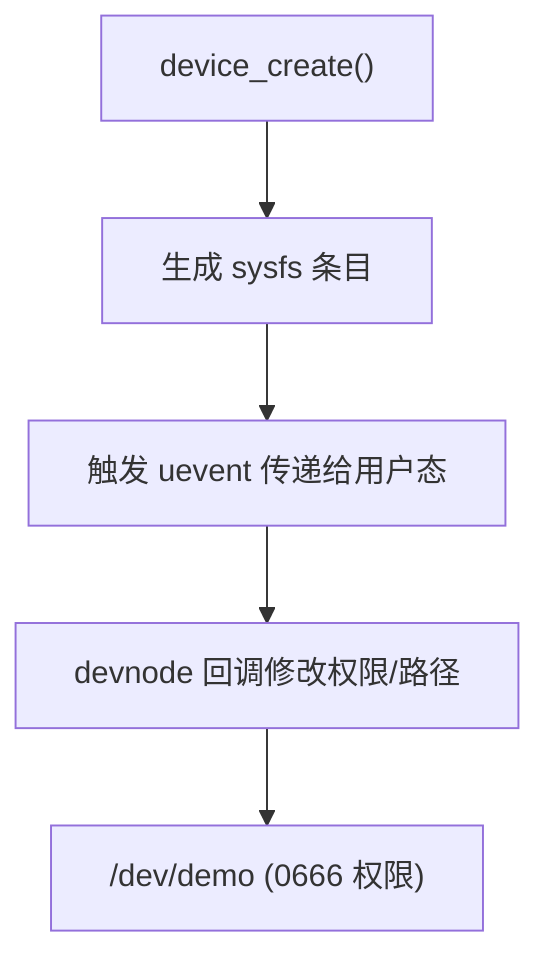

------

## 5.2_sysfs_属性组_暴露驱动配置与状态

### 5.2.1_应用场景

驱动常需要向用户空间暴露调试或状态信息，例如缓存大小、运行模式、版本号。sysfs 属性机制可以避免复杂的 `ioctl` 或 `/proc` 文件。

### 5.2.2_注册属性组

```c
static ssize_t demo_show(struct device *dev,
                         struct device_attribute *attr, char *buf)
{
    return sprintf(buf, "demo driver version: 1.0\n");
}

static DEVICE_ATTR_RO(demo);

static struct attribute *demo_attrs[] = {
    &dev_attr_demo.attr,
    NULL,
};

static const struct attribute_group demo_group = {
    .attrs = demo_attrs,
};

static const struct attribute_group *demo_groups[] = {
    &demo_group,
    NULL,
};

device_create_with_groups(demo_class, NULL, devt, NULL,
                          demo_groups, "demo");
```

### 5.2.3_时序图_用户读取_sysfs_属性

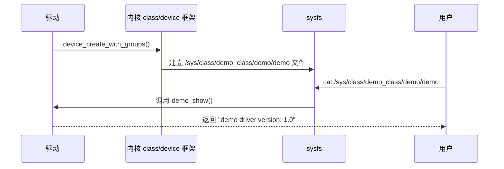

### 5.2.4_结构关系图

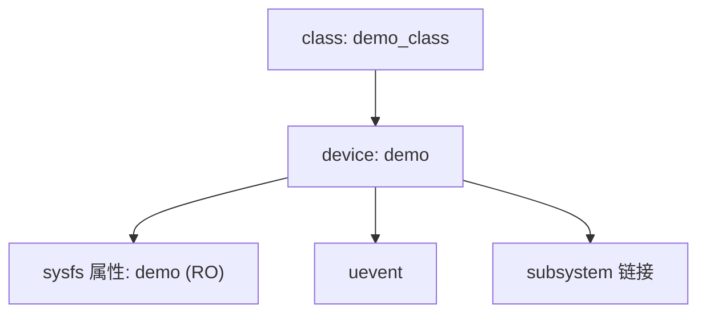

------

## 5.3_多设备实例管理

### 5.3.1_背景

有些驱动需要支持多个设备实例（例如多路串口、多块网卡）。需要为每个实例分配不同的次设备号和节点。

### 5.3.2_使用方法

```c
alloc_chrdev_region(&base_devt, 0, count, "demo");

for (i = 0; i < count; i++) {
    dev_t devno = MKDEV(MAJOR(base_devt), MINOR(base_devt) + i);

    cdev_init(&demo_cdev[i], &demo_fops);
    cdev_add(&demo_cdev[i], devno, 1);

    device_create(demo_class, NULL, devno, NULL, "demo%d", i);
}
```

### 5.3.3_流程图_多实例节点创建

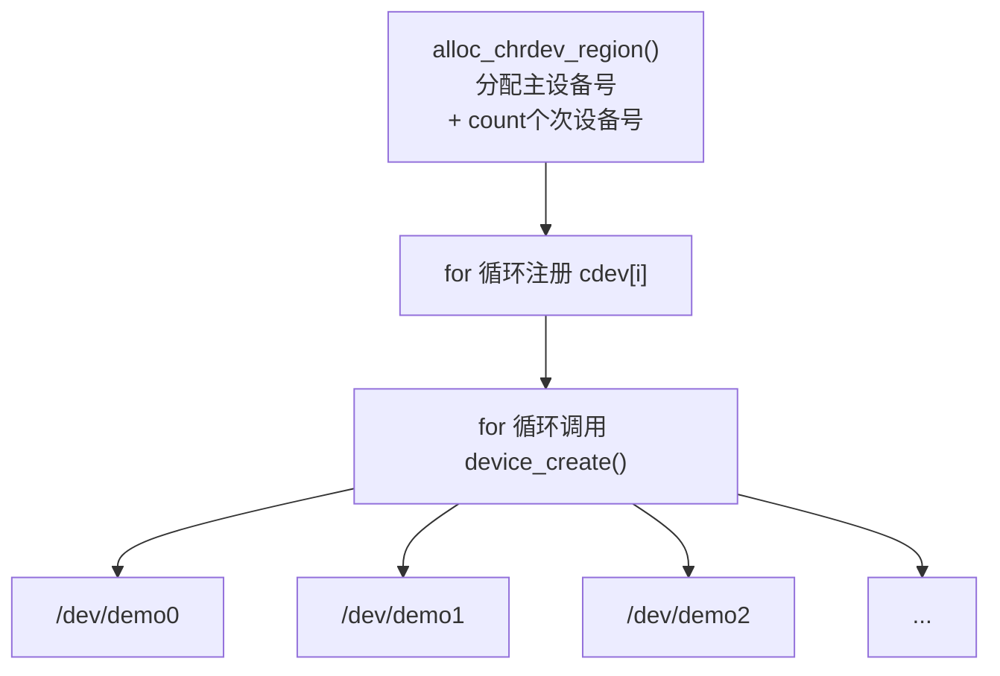

------

我把 **5.3.4** 完整重写为一个小节，集中讲解 **设备节点的命名法则**，从 **驱动传参 → 内核处理 → sysfs/uevent → /dev 节点** 形成一个完整闭环，避免分散。

------

### 5.3.4_设备节点命名法则

在 Linux Kernel 6.1 中，**设备节点的名字不是自动生成的**，而是由驱动开发者在调用 `device_create()` 时指定的。最终 `/dev/` 下的节点名遵循以下法则：

------

#### (1)_驱动传参决定基础名字

```c
device_create(demo_class, NULL, devno, NULL, "demo%d", i);
```

- `"demo%d"`：格式化字符串，作为设备名字的模板。
- `i`：循环索引，用于替换 `%d`。

驱动开发者完全决定了设备节点的命名前缀和格式。

------

#### (2)_内核格式化处理

`device_create()` 内部调用 `kobject_set_name_vargs()`，将传入的格式化字符串处理为实际名字，并存储到 `struct device.kobj.name` 中。

- 例如：
  - 第一次调用 → `"demo0"`
  - 第二次调用 → `"demo1"`
  - ……

------

#### (3)_sysfs_中的目录命名

格式化后的名字会出现在 sysfs：

```bash
/sys/class/demo_class/demo0/
/sys/class/demo_class/demo1/
```

------

#### (4)_uevent_中的_DEVNAME

内核发出的 uevent 消息包含：

```bash
MAJOR=240
MINOR=1
DEVNAME=demo1
```

其中 `DEVNAME` 字段就是 `/dev` 节点的推荐名字。

------

#### (5)_/dev_节点的最终生成

用户空间的 **udev/mdev** 根据 uevent 中的 `DEVNAME`，在 `/dev/` 下创建设备文件：

```bash
/dev/demo0
/dev/demo1
```

如果系统启用了 **devtmpfs**，即使没有 udev，也会创建最基本的 `/dev/demoX` 节点。

------

#### (6)_常见命名模式

1. **单实例设备**
   - 调用：`device_create(..., "demo");`
   - 节点：`/dev/demo`
2. **多实例设备**
   - 调用：`device_create(..., "demo%d", i);`
   - 节点：`/dev/demo0, /dev/demo1 ...`
3. **子系统风格**
   - 调用：`device_create(..., "ttyUSB%d", i);`
   - 节点：`/dev/ttyUSB0, /dev/ttyUSB1 ...`

👉 这种方式与内核已有子系统保持一致，有助于用户辨识。


------

### 5.3.5_设备节点命名法则

下面是一个 **时序图**，直观展示 `"demo%d"` 从驱动传入到 `/dev/demoX` 出现的完整链路。

#### (1)_时序图_设备命名链路

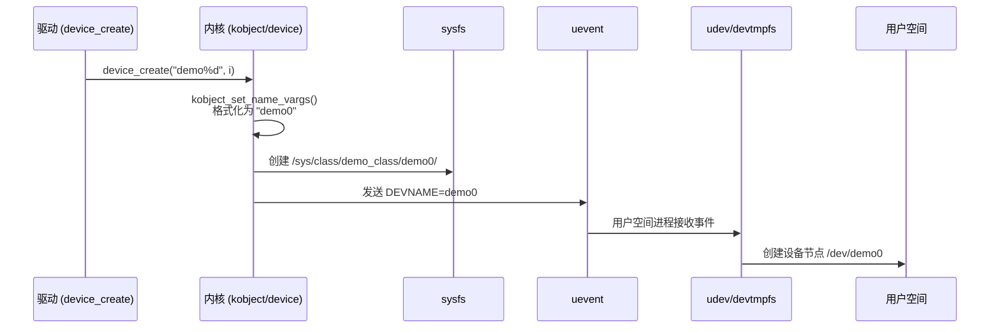

------

这样，整个链路就清楚了：

1. **驱动传入名字模板**：`"demo%d"`。
2. **内核完成格式化**：`demo0`、`demo1`……
3. **sysfs 显示目录**：`/sys/class/demo_class/demo0`。
4. **uevent 提供 DEVNAME**：告诉用户空间推荐的节点名。
5. **udev/devtmpfs 最终落地**：生成 `/dev/demoX`。

------

#### (2)_总结

设备节点的名字遵循以下法则：

1. **驱动提供模板** → 通过 `device_create()` 的最后一个参数。
2. **内核格式化** → 写入 `device.kobj.name`，用于 sysfs 和 uevent。
3. **用户空间响应** → udev/mdev 读取 `DEVNAME`，在 `/dev/` 下生成节点。

> 口诀：**“驱动定前缀 → 内核定实例号 → udev定节点”**

------

## 5.4_与_miscdevice_的对比

### 5.4.1_class_+_cdev_模式

- 优点：完全可控（主/次设备号、权限、sysfs 属性、自定义扩展）。
- 缺点：代码稍繁琐，需要手动管理 cdev 和 class。

### 5.4.2_miscdevice_模式

- 特点：使用主设备号 10，由内核自动分配次设备号。

- 典型 API：

  ```c
  static struct miscdevice demo_misc = {
      .minor = MISC_DYNAMIC_MINOR,
      .name = "demo",
      .fops = &demo_fops,
  };
  misc_register(&demo_misc);
  ```

- 适用：单一设备、调试型驱动。

### 5.4.3_对照表

| 模式         | 典型接口                     | 特点                             | 适用场景          |
| ------------ | ---------------------------- | -------------------------------- | ----------------- |
| class + cdev | class_create / device_create | 自由度高，支持多实例，需手动管理 | 正式产品驱动      |
| miscdevice   | misc_register                | 简单省事，受限于 misc 框架       | 工具型/调试型驱动 |

------

## 5.5_小结

- **devnode 回调**：自定义 `/dev` 节点的名字和权限。
- **sysfs 属性组**：向用户空间暴露调试和状态信息，用户直接 `cat`/`echo` 即可交互。
- **多设备实例管理**：通过 `alloc_chrdev_region()` + 循环 `device_create()` 支持多个节点。
- **miscdevice 与 class 的取舍**：简单驱动用 `miscdevice`，复杂驱动必须使用 `class + cdev`。

------

📖 接下来在 **第 6 章 应用场景举例**，我会结合 **input 子系统**（键盘/鼠标）、**tty 子系统**（串口）、以及我们自定义的 `demo_class`，对比它们如何使用 `class` 来组织和暴露设备。

好的 ✅ 那我们继续进入 **第 6 章：应用场景举例**，这一章会对比 **内核现有子系统** 和 **自定义 demo_class** 的使用方式，让你从实际驱动中体会 `class` 的应用价值。

------

# 第6章_应用场景举例

------

## 6.1_input_子系统

### 6.1.1_背景

Linux 的 **input 子系统**用于管理键盘、鼠标、触摸屏等输入设备。它们功能不同，但在用户态都需要统一的访问接口。

### 6.1.2_使用_class

- 内核中定义了一个全局的 `input_class`。
- 每注册一个 input 设备，都会挂到这个 class 下。

```bash
$ ls /sys/class/input/
event0  event1  mouse0
```

### 6.1.3_节点命名

- 内核调用 `device_create(input_class, ..., "event%d", i)`。
- 最终生成 `/dev/input/event0`、`/dev/input/event1`……
- 用户程序通过统一的 `read()` 接口读取输入事件。

👉 特点：通过 class 把不同厂商、不同接口的设备（USB 键盘、PS/2 鼠标、触摸板）统一管理。

------

## 6.2_tty_子系统

### 6.2.1_背景

**tty 子系统**管理串口终端，包括物理串口、USB 转串口、伪终端（pty）等。

### 6.2.2_使用_class

- 全局的 `tty_class` 对应 `/sys/class/tty/`。
- 驱动调用 `device_create(tty_class, ..., "ttyS%d", i)`。

### 6.2.3_节点命名

- 物理串口 → `/dev/ttyS0`、`/dev/ttyS1`……
- USB 转串口 → `/dev/ttyUSB0`、`/dev/ttyUSB1`。
- 伪终端 → `/dev/pts/0`、`/dev/pts/1`。

👉 特点：不同实现方式（8250 芯片、USB 转换、内核虚拟终端），都能以统一的 tty class 呈现给用户。

------

## 6.3_block_子系统

### 6.3.1_背景

块设备（磁盘、SD 卡、U 盘等）与字符设备不同，它们面向的是 **随机块访问**。

### 6.3.2_使用_class

- 内核定义了 `block_class`。
- 所有块设备都出现在 `/sys/class/block/`。

```bash
$ ls /sys/class/block/
sda  sda1  sdb
```

### 6.3.3_节点命名

- 主硬盘 → `/dev/sda`
- 分区 → `/dev/sda1`
- 移动存储 → `/dev/sdb`

👉 特点：class 在这里提供了统一的用户空间视图，使工具（如 `mount`、`fdisk`）可以通用化操作。

------

## 6.4_自定义_demo_class

### 6.4.1_背景

在我们前面示例的 **demo 驱动**中，使用了 `class_create()` 创建自定义的 `demo_class`。

### 6.4.2_使用_class

```c
demo_class = class_create(THIS_MODULE, "demo_class");
device_create(demo_class, NULL, devt, NULL, "demo");
```

结果：

- sysfs：`/sys/class/demo_class/demo/`
- 设备节点：`/dev/demo`

### 6.4.3_对比官方子系统

- input/tty/block → 内核内建的全局 class，多个驱动共享。
- demo_class → 驱动开发者自定义的私有 class，仅该模块使用。

👉 结论：无论是内核子系统还是自定义驱动，**class 的作用都是统一管理 + 自动生成节点**。

------

## 6.5_对照表_不同场景的_class_使用

| 子系统/驱动 | class 名字 | sysfs 路径               | 设备节点命名方式         | 示例节点                     |
| ----------- | ---------- | ------------------------ | ------------------------ | ---------------------------- |
| input       | input      | `/sys/class/input/`      | `"event%d"`              | `/dev/input/event0`          |
| tty         | tty        | `/sys/class/tty/`        | `"ttyS%d"`、`"ttyUSB%d"` | `/dev/ttyS0`、`/dev/ttyUSB0` |
| block       | block      | `/sys/class/block/`      | 磁盘名+分区号            | `/dev/sda`、`/dev/sda1`      |
| demo_class  | demo_class | `/sys/class/demo_class/` | `"demo"` 或 `"demo%d"`   | `/dev/demo`、`/dev/demo0`    |

------

自定义 demo_class 和 mknod，在**内核机制层面**的本质差异：

- **为什么 `mknod` 不需要 class 就能生效**
- **为什么 `class_create` 是自动创建设备节点的前提**
- **mknod 会不会自动创建 class**

我来把这部分整理为 **6.7 节：mknod 与 class_create 的内核机制对比**，深入到 **内核文件系统（VFS）、设备模型（sysfs）、udev/devtmpfs** 三个视角。

------

## 6.6_mknod_与_class_create_的内核机制对比

------

### 6.6.1_为什么_mknod_不需要_class

1. **设备访问的本质**
   - 在 Linux 中，访问 `/dev/xxx` 本质上是 **VFS（虚拟文件系统）根据设备号找到对应的 `struct cdev` 并调用 file_operations**。
   - 也就是说，用户空间打开 `/dev/demo` 时，内核根本不关心是否有 `class`，而是通过 **主设备号 → cdev_map → 对应的驱动 fops** 来处理。
2. **mknod 的作用**
   - `mknod` 只是创建了一个 **字符设备文件节点**，里面保存了主设备号和次设备号。
   - 当用户 `open("/dev/demo")`，VFS 就会查这个 (major, minor) 对应的 `cdev`，进而调用驱动提供的 `file_operations`。
   - 所以，即使没有 `class`，只要 **cdev 注册成功（cdev_add）**，mknod 出来的节点也能正常访问设备。

👉 **结论**：`mknod` 的存在感仅限于 VFS 层，它只提供了一个“入口文件”。

- 不负责设备的管理、组织、分类。
- 不会在 sysfs 里出现任何痕迹。

------

### 6.6.2_为什么_class_create_必须存在于自动节点创建

1. **设备模型需要 class**
   - Linux 设备模型中，所有设备都要挂到某个 class 下，才能在 `/sys/class/` 中有对应条目。
   - `class_create()` 就是给驱动定义一个类别（例如 `"input"`, `"tty"`, `"demo_class"`）。
2. **device_create 的依赖**
   - `device_create()` 会在 sysfs 下生成 `/sys/class/<class>/<device>` 目录，并填充 `uevent` 信息。
   - 只有当 class 存在时，`device_create()` 才能找到归属，否则无法注册到 sysfs。
3. **自动节点的来源**
   - 自动创建设备文件 `/dev/demo`，并不是 `device_create()` 自己做的，而是 **内核的 devtmpfs 或者用户态的 udev/mdev** 根据 sysfs 里 `uevent` 事件创建的。
   - `uevent` 中的 `DEVNAME=demo` 就是由 `device_create()` 提供的。

👉 **结论**：

- 没有 class，就没有 sysfs 条目。
- 没有 sysfs，就没有 uevent。
- 没有 uevent，udev/devtmpfs 就不会在 `/dev` 下自动创建设备文件。

------

### 6.6.3_mknod_会不会自动创建_demo_class

不会。

- `mknod` 仅仅在 **/dev** 下生成一个静态节点，它既不会修改内核对象模型，也不会在 sysfs 里注册 class。
- 因此：
  - `/sys/class/demo_class/` 不会出现。
  - 设备不会被内核的设备模型管理。
  - udev 也无法通过 sysfs 追踪这个设备。

👉 **直观对比**：

- `mknod`：只影响 **文件系统层面**，纯入口，不关心设备模型。
- `class_create + device_create`：影响 **内核设备模型**，生成 sysfs 条目，触发 uevent → 自动创建设备节点。

------

### 6.6.4_对比图_mknod_vs_class_create

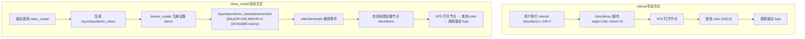

------

### 6.6.5_总结

- **mknod**：直接在 `/dev` 下建立入口，节点信息完全由用户提供；驱动能用，但与内核设备模型无关。
- **class_create + device_create**：通过 sysfs 将设备纳入内核对象模型，触发 uevent，由 udev/devtmpfs 自动创建设备节点。
- **demo_class** 的意义：
  - 让 `/sys/class/demo_class/` 可见。
  - 让 `/dev/demo` 自动随驱动创建/销毁，而不是靠用户手动 `mknod`。

👉 换句话说：

- **mknod 是“临时通道”**，驱动不需要知道它的存在。
- **class_create 是“正式注册”**，驱动主动告诉内核“我有这个设备”，并交给设备模型统一管理。

------

要不要我帮你把 **6.7 小节**也做成一个 **表格总结（mknod vs class_create 全对比）**，方便快速背诵？

## 6.7_小结

- **input/tty/block** 等内核子系统，都通过 class 提供了用户空间的统一入口。
- **节点命名**始终由驱动调用 `device_create()` 时指定。
- **class 的价值**：将不同硬件实现抽象成统一的软件接口，使用户和工具无需关心底层差异。
- **自定义 class** 在驱动开发中也遵循相同模式，确保工程化和标准化。

------

📖 下一章（第 7 章），我会讲 **驱动开发中 class 的最佳实践**，总结常见的设计模式、注意事项，以及和 `miscdevice` 的取舍关系。

好 ✅ 那我们继续进入 **第 7 章：最佳实践**，这章主要总结驱动开发中关于 `class` 的使用模式、注意事项，以及和 `miscdevice` 等机制的取舍。目标是形成一套可以直接应用在项目中的规范。

------

# 第7章_最佳实践

------

## 7.1_class_的创建与销毁顺序

在实际驱动中，**生命周期顺序**是最常见的错误点。必须严格遵循以下流程：

### 7.1.1_加载路径

1. `alloc_chrdev_region()` → 分配主次设备号
2. `cdev_init()` + `cdev_add()` → 注册字符设备
3. `class_create()` → 创建 class，生成 `/sys/class/<name>/`
4. `device_create()` → 生成具体设备，触发 uevent

### 7.1.2_卸载路径

1. `device_destroy()` → 删除 sysfs 条目和 `/dev` 节点
2. `class_destroy()` → 删除 `/sys/class/<name>/`
3. `cdev_del()` → 注销字符设备
4. `unregister_chrdev_region()` → 释放设备号

👉 **口诀**：
 加载 **“号 → cdev → class → device”**
 卸载 **“device → class → cdev → 号”**

------

## 7.2_命名规范与一致性

### 7.2.1_class_名称

- 建议使用 **功能性命名**，例如：
  - `input`（输入子系统）
  - `tty`（终端设备）
  - `demo_class`（自定义驱动示例）

### 7.2.2_device_名称

- 单实例：直接 `"demo"` → `/dev/demo`
- 多实例：`"demo%d"` → `/dev/demo0`、`/dev/demo1`
- 子系统对齐：`"ttyUSB%d"`、`"event%d"`

👉 规范命名可以避免冲突，并让用户直观理解设备用途。

------

## 7.3_与_miscdevice_的取舍

### 7.3.1_使用_class_+_cdev

- 适合复杂驱动、多设备实例。
- 节点名、权限、sysfs 属性均可定制。
- 工业级、生产驱动的首选方案。

### 7.3.2_使用_miscdevice

- 简单驱动，只需一个节点。
- 自动挂到主设备号 10，避免与其他驱动冲突。
- 典型应用：调试接口、测试工具类模块。

### 7.3.3_经验法则

- **如果驱动是长期维护的产品 → 用 class + cdev**
- **如果驱动是快速原型/工具 → 用 miscdevice**

------

## 7.4_自动创建_vs_手动_mknod

在第 6.7 节我们已经详细比较过，补充几点实践经验：

- **开发调试**
  - 初期实验，可以 `cdev_add()` 后用 `mknod` 测试基本功能。
- **驱动交付**
  - 必须用 `class_create()` + `device_create()`，避免依赖人工 `mknod`。
  - 保证节点随驱动加载/卸载自动出现和消失，符合工程化要求。

👉 实践经验：
 永远不要在产品文档里要求用户 `mknod`，这是内核设备模型的责任。

------

## 7.5_sysfs_属性的使用规范

- **推荐用法**：
  - 只放置轻量级的配置信息或状态（如模式切换、版本号、统计值）。
- **避免滥用**：
  - 不要用 sysfs 传输大量数据（例如读写缓冲区），这类操作应该用 read/write/ioctl。
- **命名规范**：
  - sysfs 属性文件必须是小写字母，避免大写和下划线。

👉 实践经验：
 sysfs 更像“配置接口”，而不是“数据通道”。

------

## 7.6_常见错误与防范

| 错误                                      | 原因                                                       | 解决方案                                         |
| ----------------------------------------- | ---------------------------------------------------------- | ------------------------------------------------ |
| `class_create` 成功，但 `/dev` 下没有节点 | 忘记调用 `device_create`，或者系统没有启用 `devtmpfs/udev` | 确认调用顺序；检查 `/sys/class/<name>/` 是否存在 |
| 卸载模块时报 `kobject leak`               | `device_destroy()` 或 `class_destroy()` 遗漏               | 严格按逆序清理                                   |
| 用户态需要 `mknod` 才能访问               | 驱动没有 `class_create` + `device_create`                  | 补全自动注册逻辑                                 |
| 节点权限不对                              | 默认权限 0600                                              | 使用 `devnode` 回调修改                          |

------

## 7.7_小结

- **生命周期管理**：加载和卸载必须严格对称。
- **命名规范**：class 与 device 名称应统一、直观。
- **机制选择**：复杂驱动用 class，简单驱动可用 miscdevice。
- **sysfs 规范**：轻量级配置信息合适，大数据传输不合适。
- **避免错误**：注意清理顺序，避免节点残留或 kobject 泄漏。

👉 **最佳实践口诀**：

- **“class 定类别，device 定节点”**
- **“自动注册，拒绝 mknod”**
- **“sysfs 配置，读写走 fops”**

------

📖 下一章（第 8 章），我将讲 **内核源码视角下的 class 实现原理**，从 `class_create()`、`device_create()` 的内部实现入手，分析它们在内核中如何与 kobject、uevent、sysfs 关联。

# 第8章_设备加入_class_的规则

------

## 8.1_概述

在 Linux 设备模型中，**class** 用于对功能相近的设备做逻辑分组；**device** 是具体实例。驱动通过 `device_create()` 把设备挂接到某个 class，从而在 **sysfs** 与 **/dev** 形成统一的对外界面。本章给出挂接规则、注意事项，并覆盖**多属性设备**与**一个硬件设备呈现多个 class 视图**的场景。

------

## 8.2_设备挂接到_class_的基本流程

1. `alloc_chrdev_region()` 分配（主/次）设备号
2. `cdev_init()` / `cdev_add()` 注册字符设备
3. `class_create()` 创建类（出现 `/sys/class/<name>/`）
4. `device_create()` 在该类下注册设备（触发 uevent，生成 `/dev/<name>`）

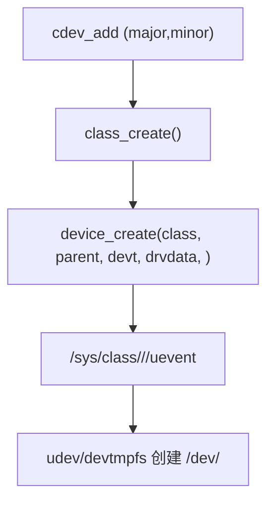

------

## 8.3_加入原则与注意事项

- **先 class，后 device**：`device_create()` 依赖现有的 class。
- **设备号有效**：`devt` 必须与已注册的 `cdev` 匹配。
- **命名唯一**：同一 class 下设备名不可重复（`"demo%d"` 等）。
- **父子关系合规**：能体现硬件层级时填 `parent`，否则传 `NULL`。
- **失败即回滚**：`IS_ERR()` 检查失败后，逆序清理（`device_destroy`/`class_destroy` 等）。

------

## 8.4_多属性设备的挂接与使用

**驱动侧**：用属性组暴露配置/状态；必要时使用只读/可写属性区分。

```c
static ssize_t mode_show(struct device *dev, struct device_attribute *a, char *buf){...}
static ssize_t mode_store(struct device *dev, struct device_attribute *a, const char *b,size_t n){...}
static DEVICE_ATTR_RW(mode);

static struct attribute *attrs[] = { &dev_attr_mode.attr, NULL };
static const struct attribute_group grp = { .attrs = attrs };
static const struct attribute_group *grps[] = { &grp, NULL };

device_create_with_groups(cls, parent, devt, NULL, grps, "demo0");
```

**用户侧**：

```bash
cat  /sys/class/demo_class/demo0/mode
echo power_save > /sys/class/demo_class/demo0/mode
```

> 规则：**数据通道走 `/dev`（read/write/ioctl），配置状态走 sysfs 属性**。

------

## 8.5_/sys_与_/dev_的文件系统视角

- `/sys/class/<class>/<dev>`：**class 视图**（多为指向真实设备的符号链接）。
- `/sys/devices/...`：**真实设备层次**（由 `parent` 决定挂载位置；`parent==NULL` 常落在 `/sys/devices/virtual/<class>/...`）。
- `/dev/<name>`：设备文件（devtmpfs/udev 根据 `uevent` 中 `MAJOR/MINOR/DEVNAME` 创建）。

------

## 8.6_自动创建_vs_手动_mknod(要点回顾)

- **`mknod`**：只在 VFS 层造一个“入口”，不触发 sysfs/uevent，不涉及 class。
- **`class_create+device_create`**：纳入设备模型，产生 sysfs/uevent，由 udev/devtmpfs 自动创建设备节点并随驱动清理。

------

## 8.7_一个硬件设备呈现多个_class_视图_是否可行_原理何在

### 8.7.1_关键结论(先给答案)

- **一个 `struct device` 只能隶属于一个 class。**
- **一个“硬件设备”可以通过多个“class 设备”来对外呈现多种功能接口。**
  - 做法：为同一硬件实体**派生多个 class 设备对象**（各自是一个 `struct device`），它们通常共享同一个**父设备**（真实物理设备）。
  - 结果：在 `/sys/class/<classX>/...`、`/sys/class/<classY>/...` **分别出现条目**；可能各自对应不同的 `/dev` 节点或仅有 sysfs 属性。

> 换言之：**同一硬件 → 多个“功能侧面（class 设备）”**，而不是“同一个 `struct device` 同时挂多个 class”。

### 8.7.2_为什么不能把同一个_struct_device_挂到多个_class

`struct device` 的设计是**单归属**：`dev->class` 指针只能指向一个 class。class 是一个 kset，设备注册时会在该 class 名下建立对应的 sysfs 视图。如果允许一个 `struct device` 同时属于多个 class，会破坏 kobject 归属与生命周期管理（引用计数、热插拔事件路由、权限与命名冲突等）。

### 8.7.3_正确的工程做法_多_class_设备_并列呈现

- 给每个功能面向的 class **各注册一个 device**（通常以**同一个父设备**为 `parent`）：
  - 例：某多功能芯片（MFD）既提供**字符设备接口**（`demo_class` → `/dev/demo0`），又提供**硬件监控**（hwmon class → `/sys/class/hwmon/hwmonN`）。
- 代码层面体现为**多次 `device_create()`**（/或子系统专有注册 API），每次传入不同的 class，得到**不同的 `struct device`**：

```c
/* 面向 I/O 的字符接口 */
dev_t devt = MKDEV(major, minor);
struct device *io_dev = device_create(demo_class, parent, devt, NULL, "demo0");

/* 面向传感监控的 hwmon 接口（建议用子系统 API） */
struct device *mon_dev = hwmon_device_register_with_groups(
    parent, "demo_sensor", drvdata, demo_groups);
```

- sysfs 呈现（示意）：

```
/sys/class/demo_class/demo0     ->  .../devices/.../demo0   （符号链接）
/sys/class/hwmon/hwmon3         ->  .../devices/.../hwmon3  （符号链接）
```

- /dev 呈现：
  - 字符接口通常有 `/dev/demo0`；
  - hwmon 侧多通过 sysfs 属性交互，未必有 `/dev` 节点。

### 8.7.4_何时应优先使用已有子系统的_class

- **能用子系统，别自建 class。**
  - 如输入设备用 **input**，传感/温度用 **hwmon**，LED 用 **leds**，GPIO 用 **gpio**，显示用 **drm/backlight**，音频用 **sound/alsa**，网络用 **net** ……
- 原因：
  - 用户空间工具链（udev 规则、权限、命名、库和工具）已就绪；
  - 语义稳定、接口规范、生态完备；
  - 维护成本低、可移植性好。

### 8.7.5_多_class_视图下的命名_权限_生命周期建议

- **命名一致性**：各 class 设备的命名与功能对应，避免误导（如 `demo0` 用于 I/O，`hwmonN` 用于监控）。
- **权限边界**：I/O 通道节点权限（`/dev/demo0`）与配置/监控属性（sysfs）的权限区分开（读写策略不同）。
- **父子层次**：尽可能给多个 class 设备**同一个 `parent`**（真实物理设备），便于一起随硬件上线/下线，uvent 聚合合理。
- **清理顺序**：卸载时按注册的**逆序**逐个销毁（每个 class 设备都要 `put_device`/`device_unregister` 或对应 API），防止 kobject 泄漏。
- **避免重复功能**：不要为同一功能既注册子系统 class 又自建 class；遵循“**一个功能，一个权威入口**”的原则。

### 8.7.6_结构图_同一硬件_多_class_设备并列

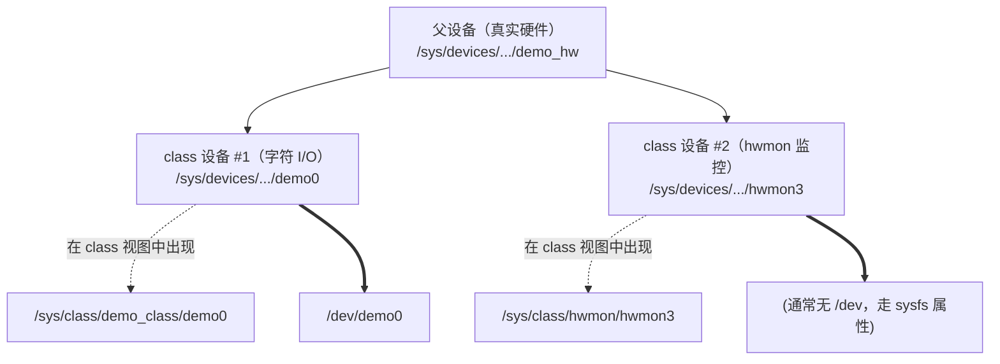

------

## 8.8_小结

- **同一个 `struct device` 只能属于一个 class**；
- **同一硬件可通过多个“class 设备”并列呈现多种功能**（各是独立的 `struct device`，常共享同一 `parent`）；
- **优先使用已有子系统的 class**，自建 class 仅用于确无合适子系统时；
- 在多 class 视图下，务必处理好**命名、权限、父子层次与清理顺序**，确保用户态体验一致、内核对象生命周期正确。

如果你愿意，我可以把**一个硬件呈现“字符 I/O + 传感监控”**的极简示例抽象成模板代码（含注册与卸载路径），便于你在真实项目里直接套用。

👌 明白了。既然 **sysfs class 与 /dev 节点的关系** 是驱动开发中最容易混淆、同时又极其重要的一部分，那我们就把它从 **8.9 小节** 提升为一个完整的 **第 9 章**，全面系统地讲解。

------

# 第9章_/demo_驱动中的_/sys/_与_/dev/_区别

------

## 9.1_概述

demo 字符设备驱动加载后会同时出现在两个地方：

- **/sys/class/demo_class/demo/** → 提供设备模型视图和配置入口
- **/dev/demo** → 提供真正的数据通道

它们名字相似，但本质完全不同。

------

## 9.2_demo_驱动在_/sys/_下的表现

```bash
ls -l /sys/class/demo_class/
demo -> ../../devices/virtual/demo_class/demo
```

- 这里的 `demo` 是符号链接，指向 `/sys/devices/virtual/demo_class/demo/`

- 如果驱动定义了属性 `mode`：

  ```bash
  cat /sys/class/demo_class/demo/mode      # 查看模式
  echo power_save > /sys/class/demo_class/demo/mode   # 修改模式
  ```

------

## 9.3_demo_驱动在_/dev/_下的表现

```bash
ls -l /dev/demo
crw------- 1 root root 240, 0 Sep 22 20:00 /dev/demo
```

- `/dev/demo` 是字符设备节点，主设备号=240，次设备号=0

- 读写操作：

  ```bash
  echo "hello" > /dev/demo
  cat /dev/demo
  ```

------

## 9.4_/sys/_与_/dev/_的本质区别

| 目录      | 示例路径                          | 来源                                | 用途           | 能否传输大数据 |
| --------- | --------------------------------- | ----------------------------------- | -------------- | -------------- |
| **/sys/** | `/sys/class/demo_class/demo/mode` | 属性注册 (`DEVICE_ATTR`)            | 配置、状态查询 | ❌ 不适合       |
| **/dev/** | `/dev/demo`                       | `device_create` → uevent → devtmpfs | 实际数据 I/O   | ✅ 适合         |

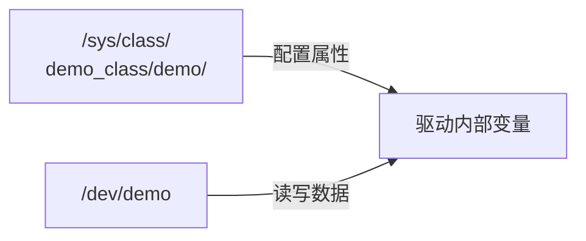

| 情况                          | /sys/class 下是否有入口                 | /dev 下是否有节点      | 说明                                                        |
| ----------------------------- | --------------------------------------- | ---------------------- | ----------------------------------------------------------- |
| **class ≠ NULL** （常见情况） | ✅ 有，例如 `/sys/class/demo_class/demo` | ✅ 有                   | 推荐方式，便于 sysfs 管理                                   |
| **class = NULL**              | ❌ 没有任何入口                          | ✅ 仍然会有 `/dev/demo` | 节点依赖 devtmpfs/udev 创建；仅有 I/O 通道，没有 sysfs 属性 |
| **不调用 device_create()**    | ❌ 没有                                  | ❌ 没有                 | 仅有内核注册的 cdev，用户必须手动 `mknod`                   |

**👉 小结：**

- **class 不是 `/dev/` 节点创建的必要条件**
- `/dev/demo` 的出现依赖于 **device_add() 触发的 uevent + devtmpfs/udev**
- class 的作用是 **在 sysfs 下分组管理设备，并提供属性接口**

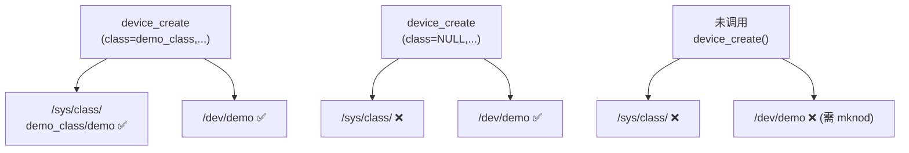

## 9.5_用户态操作全景

```bash
# sysfs 属性接口
cat /sys/class/demo_class/demo/mode
echo power_save > /sys/class/demo_class/demo/mode

# /dev 数据接口
echo "hello kernel" > /dev/demo
cat /dev/demo
```

👉 sysfs 设置模式，/dev 负责实际数据交互。

------

## 9.6_错误用法警示

```bash
# ❌ 把图片写进 sysfs 属性
cat image.jpg > /sys/class/demo_class/demo/mode
flowchart TD
  A["用户写 image.jpg 到 /sys/.../mode"] --> B["进入 store() 回调"]
  B --> C["超过 PAGE_SIZE → 截断/失败"]
  C --> D["错误用法：sysfs 不是数据通道"]
```

------

## 9.7_时序图(完整路径)

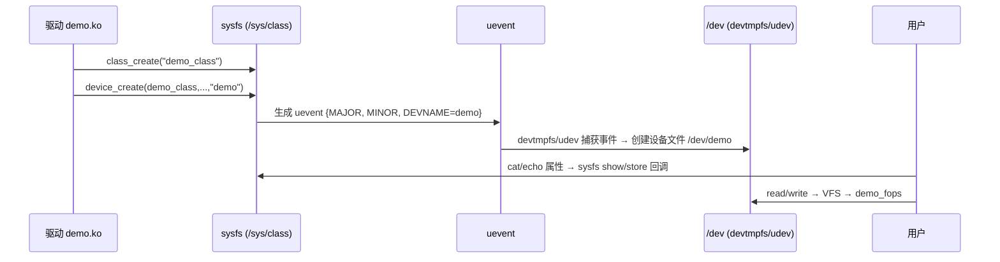

------

## 9.8_直观结构图

```
/sys/class/demo_class/
 └── demo -> ../../devices/virtual/demo_class/demo/
      ├── uevent
      ├── subsystem -> ../../class/demo_class
      └── mode  (属性文件，用于配置)

 /dev/
 └── demo   (字符设备节点，用于 I/O)
```

------


现在的 **9.9** 已经有“属性文件出现的原因 → 修改属性 → 与 `/dev/demo` 的联系 → 示意图”，但还是有些“轻”。为了更丰满，我建议在 9.9 里再加三个部分：

1. **代码示例** —— 演示 `mode_store()` 和 `demo_write()` 如何通过共享变量联系。
2. **使用场景** —— 说明这种“属性控制 + 数据交互”模式在实际驱动中的常见用途。
3. **设计原则** —— 给出驱动作者在设计 sysfs 属性和 /dev 节点交互时需要遵循的规范。

------

## 9.9_sysfs_属性与_/dev_节点的交互关系

### 9.9.1_属性文件出现的原因

- 驱动定义属性：

  ```c
  static ssize_t mode_show(struct device *dev,
                           struct device_attribute *attr, char *buf)
  {
      return sprintf(buf, "%s\n", current_mode ? "power_save" : "normal");
  }

  static ssize_t mode_store(struct device *dev,
                            struct device_attribute *attr,
                            const char *buf, size_t count)
  {
      if (sysfs_streq(buf, "power_save"))
          current_mode = 1;
      else if (sysfs_streq(buf, "normal"))
          current_mode = 0;
      return count;
  }
  static DEVICE_ATTR_RW(mode);
  ```

- 注册后 sysfs 生成：

  ```
  /sys/class/demo_class/demo/mode
  ```

------

### 9.9.2_修改属性的效果

用户操作：

```bash
echo power_save > /sys/class/demo_class/demo/mode
```

流程：

1. sysfs 调用 `mode_store()`

2. 驱动更新内部变量：

   ```c
   current_mode = POWER_SAVE;
   ```

3. 该变量会影响驱动在 `/dev/demo` 节点上的 I/O 行为

------

### 9.9.3_与_/dev/demo_的联系(代码示例)

```c
static int current_mode = 0; // 0=normal, 1=power_save

static ssize_t demo_write(struct file *file,
                          const char __user *ubuf,
                          size_t cnt, loff_t *ppos)
{
    if (current_mode == 1) {
        // 在 power_save 模式下，写入受限
        if (cnt > 16) {
            pr_info("demo: power_save mode, truncated write\n");
            cnt = 16;
        }
    }
    // 正常写入逻辑...
    return cnt;
}
```

👉 **解释**：

- 用户通过 sysfs 设置 `mode=power_save`
- 随后写入 `/dev/demo` 时，驱动会检查 `current_mode`
- 在省电模式下写入会被截断，体现了 **属性对 I/O 行为的控制**

------

### 9.9.4_使用场景

这种模式在实际驱动开发中非常常见：

- **网卡驱动**
  - `/sys/class/net/eth0/mtu` → 修改 MTU
  - `/dev/eth0` → 负责数据包收发
- **传感器驱动**
  - `/sys/class/hwmon/hwmon0/enable` → 打开/关闭传感器
  - `/dev/iio:device0` → 提供原始采样数据
- **字符设备 demo**
  - `/sys/class/demo_class/demo/mode` → 设置运行模式
  - `/dev/demo` → 提供数据缓冲区读写

👉 可以看到：**sysfs 用来调控行为，/dev 用来承载数据流。**

------

### 9.9.5_设计原则

1. **单一职责**
   - sysfs 属性：配置参数（模式、开关、状态）
   - /dev 节点：I/O 数据（字节流、buffer）
2. **轻量属性**
   - sysfs 文件内容应简单明了，最好是字符串或数字
   - 单次写入不能超过 PAGE_SIZE
3. **共享数据结构**
   - sysfs 和 /dev 通过驱动内部全局变量或 `struct device` 的私有数据联系
   - 不要试图让 sysfs 文件直接替代 I/O

------

### 9.9.6_示意图

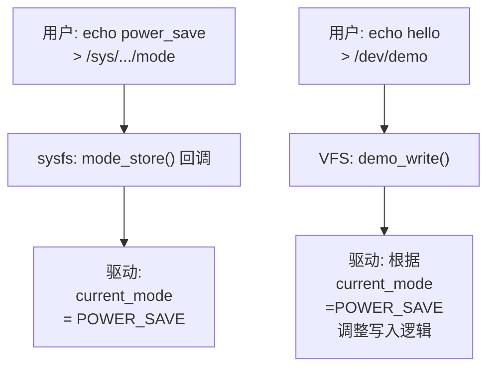

------

### 9.9.7_小结

- **sysfs 属性** = 控制开关
- **/dev 节点** = 数据通道
- 两者通过 **驱动内部共享变量** 联系
- 这种模式让驱动既有 **可配置性**，又有 **数据交互能力**

------

## 9.10_小结

- `/sys/` = 配置接口，单值属性，适合状态/模式设置
- `/dev/` = 数据接口，字节流通道，适合读写大数据
- demo 驱动中：
  - `/sys/class/demo_class/demo/mode` → 控制运行模式
  - `/dev/demo` → 进行实际读写
- **二者关系**：通过驱动的内部变量联系，不是自动绑定

👉 **一句话总结**：
 **“/sys/ 是遥控器，/dev/ 是数据口；遥控器调模式，数据口走数据。”**

------

👌 好的，那我们继续进入新的大章节。按照前面逻辑，第 9 章已经讲完 **`/sys/` 与 `/dev/` 的区别和联系**。
 接下来可以进入 **第 10 章**，从源码层面来分析 —— 让你不仅知道“怎么用”，还知道 **内核内部是怎么实现的**。

------

# 第10章_class_与_device_的源码实现原理

------

## 10.1_概述

到目前为止，我们从驱动开发者、用户态、文件系统等多个视角分析了 **class** 与 **device** 的用法。
 但要彻底理解其机制，必须进入内核源码，看看 `class_create()`、`device_create()` 在 **内核设备模型** 中是如何运作的：

- `class_create()` → 本质是封装 `__class_create()`，最终建立 **kset/kobject** 并挂入 sysfs。
- `device_create()` → 本质是封装 `device_register()`，注册 `struct device`，生成 sysfs 条目并触发 **uevent**。

这一章我们就来逐层剖析。

------

## 10.2_class_create()_的实现

### 10.2.1_内核函数入口(kernel_6.1)

```c
struct class *class_create(struct module *owner, const char *name)
{
    return __class_create(owner, name, NULL);
}
```

### 10.2.2_class_create()

```c
struct class *__class_create(struct module *owner, const char *name,
                             struct lock_class_key *key)
{
    struct class *cls;

    cls = kzalloc(sizeof(*cls), GFP_KERNEL);
    if (!cls)
        return ERR_PTR(-ENOMEM);

    cls->name  = name;
    cls->owner = owner;

    retval = class_register(cls);
    if (retval) {
        kfree(cls);
        return ERR_PTR(retval);
    }
    return cls;
}
```

👉 要点：

- 为 class 分配内存
- 填充名字、所属模块
- 调用 `class_register()` 完成注册

### 10.2.3_class_register()

最终会把 class 转换成一个 **kset/kobject**，挂到 sysfs：

```
/sys/class/<class_name>/
```

------

## 10.3_device_create()_的实现

### 10.3.1_函数入口

```c
struct device *device_create(struct class *class, struct device *parent,
                             dev_t devt, void *drvdata, const char *fmt, ...)
{
    va_list vargs;
    struct device *dev;

    va_start(vargs, fmt);
    dev = device_create_vargs(class, parent, devt, drvdata, fmt, vargs);
    va_end(vargs);

    return dev;
}
```

### 10.3.2_关键调用链

`device_create_vargs()` → `device_register()` → `device_add()`

在 `device_add()` 内部：

1. 把 `struct device` 插入全局设备链表

2. 创建 sysfs 条目：

   ```
   /sys/class/<class>/<device_name>/
   ```

3. 触发 uevent：

   ```
   MAJOR=240 MINOR=0 DEVNAME=demo
   ```

👉 这就是为什么后续 **udev/devtmpfs** 能自动在 `/dev/` 下创建设备节点。

------

## 10.4_代码路径对照图

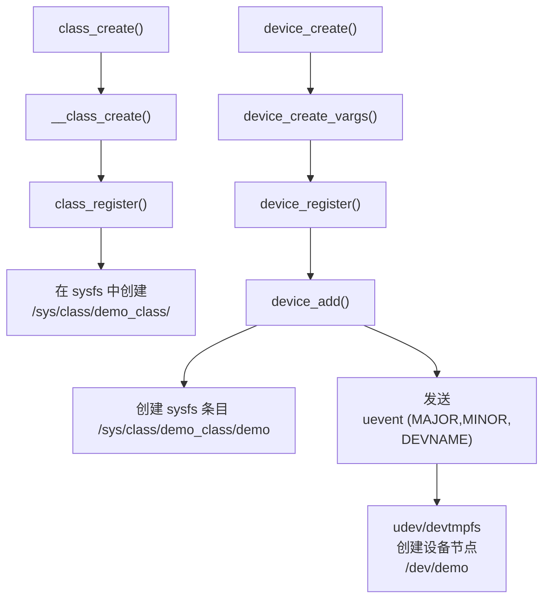

------

## 10.5_设计要点总结

- **class 是逻辑集合**
  - 内部表现为一个 **kset/kobject**
  - 出现在 `/sys/class/<name>/`
- **device 是实例对象**
  - 内部是一个 **struct device**
  - 在 sysfs class 下有符号链接，并对应一个真实目录
  - 发出 `uevent`，让用户空间/内核子系统创建设备节点

👉 换句话说：

- **class = 分类目录**
- **device = 实例条目**
- **uevent = 通知桥梁**

------

要不要我在 **第 10 章** 的最后，再加一个 **源码追踪实战**，拿 demo 驱动跑起来后，跟踪 `device_create()` 的调用栈（比如用 `ftrace` 或 `grep`）来辅助你更直观地理解？

好的 👍 那我在 **11.4 device 与 kobject 的关系** 部分加入源码调用栈解析，展示 `device_create()` 最终是如何走到 `kobject_add()` 并生成 sysfs 节点的。下面是整理好的 **第 11 章完整版本**：

------

# 第11章_class_与_device_的内核对象模型

------

## 11.1_概述

Linux 内核设备模型基于 **kobject/kset** 搭建：

- **kobject**：内核对象，sysfs 的基本单元
- **kset**：一组 kobject 的集合
- **class**：对功能相近设备的逻辑集合，本质上是一个 kset
- **device**：具体设备实例，本质上是一个包含 kobject 的结构体

理解这些关系，就能彻底搞清楚 `/sys/` 下的设备树是怎么来的。

------

## 11.2_kobject_简介

`struct kobject` 定义在 `<linux/kobject.h>`：

```c
struct kobject {
    const char         *name;       // 对象名
    struct list_head 	entry;      // 挂接到 kset
    struct kobject     *parent;     // 父对象
    struct kset        *kset;      	// 所属集合
    struct kobj_type   *ktype;      // 类型，指定 sysfs 操作
    struct kernfs_node *sd;       	// 对应 sysfs 节点
    struct kref     	kref;      	// 引用计数
};
```

作用：

- 管理内核对象生命周期
- 在 sysfs 中创建目录和文件

------

## 11.3_kset_与_class_的关系

`struct class` 内部包含一个 **kset**：

```c
struct class {
    const char 	*name;
    struct kset *p;
    ...
};
```

- 调用 `class_create("demo_class")` 时：

  - 内核分配并注册一个 kset

  - sysfs 中出现：

    ```
    /sys/class/demo_class/
    ```

👉 **class = kset 的封装**，代表一类设备集合。

------

## 11.4_device_与_kobject_的关系

`struct device` 内部包含一个 **kobject**：

```c
struct device {
    struct kobject kobj;
    struct device *parent;
    struct class *class;
    dev_t devt;
    ...
};
```

### 11.4.1_调用栈解析(kernel_6.1)

当我们调用：

```c
device_create(demo_class, NULL, devt, NULL, "demo");
```

执行路径如下：

1. **device_create()**
   - 格式化名字 `"demo"`
   - 调用 `device_create_vargs()`
2. **device_create_vargs()**
   - 分配并初始化 `struct device`
   - 调用 `device_register()`
3. **device_register()**
   - 调用 `device_initialize()`（填充 kobject 等信息）
   - 调用 `device_add()`
4. **device_add()**
   - 把设备挂到父对象/总线下
   - 调用 **kobject_add()** → 在 sysfs 中建立节点
   - 触发 **uevent**（通知用户空间 udev/devtmpfs）

### 11.4.2_结果

- sysfs 中出现：

  ```
  /sys/class/demo_class/demo/
  ```

- 同时触发 uevent：

  ```
  MAJOR=240 MINOR=0 DEVNAME=demo
  ```

- udev/devtmpfs 根据事件创建设备节点：

  ```
  /dev/demo
  ```

------

## 11.5_sysfs_中的映射关系

以 demo 驱动为例：

```
/sys/class/demo_class/demo -> ../../devices/virtual/demo_class/demo
```

- `demo_class` = kset（class）
- `demo` = kobject（device）
- `->` 符号链接 = sysfs 的组织方式：class 下只是索引，真实设备目录在 `/sys/devices/`

------

## 11.6_图解

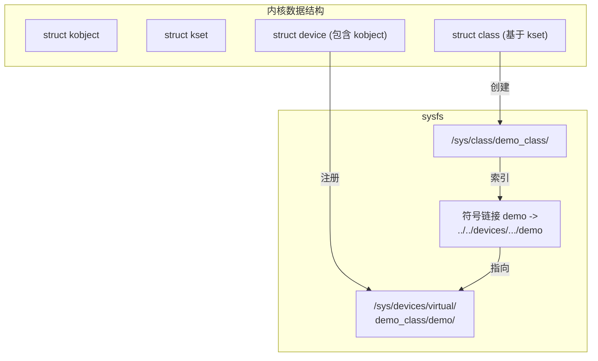

------

## 11.7_小结

- **class 是 kset**：逻辑集合，统一类别的设备
- **device 是 kobject**：实例对象，映射到 sysfs 节点
- **sysfs 展示关系**：
  - class = 集合目录
  - device = 实例目录
  - class 下的条目是符号链接到真实的 device

👉 一句话总结：

- **class 给设备分组**
- **device 表示设备实例**
- **sysfs 展示对象树**，而 **/dev 提供 I/O 通道**

------

既然 **第 11 章** 已经解释了 *class/device 与 kobject/kset 的关系*，下一步最自然的延伸就是 **第 12 章** —— 从 **uevent 与 devtmpfs/udev 的联动** 来看为什么最终会在 `/dev/` 目录下出现设备节点。

这是驱动开发者很容易困惑的点：

- `device_create()` 之后，为什么 `/dev/demo` 会自动出现？
- 这个过程是由 **内核的 devtmpfs** 自动完成的，还是需要 **用户空间的 udev** 配合？
- 如果系统没有 udev，还能不能工作？

下面进入 **第 12 章**。

------

# 第12章_uevent_与设备节点的创建机制

------

## 12.1_概述

驱动开发者在调用 `device_create()` 时，并不会直接在 `/dev/` 下出现设备文件。真正的设备节点创建，是 **内核设备模型（kobject/uevent）** 与 **文件系统（devtmpfs/udev）** 协同的结果。

理解这一点需要从 **内核调用链**、**内核文件系统支持**、**用户空间的规则管理** 三个层面展开：

- **内核调用链**：`device_add()` → `kobject_uevent_env()` → netlink
- **内核文件系统**：`devtmpfs` 自动创建设备节点
- **用户空间**：`udev` 或 `systemd-udevd` 修改节点属性和命名

------

## 12.2_内核调用链解析

当驱动调用：

```c
device_create(demo_class, NULL, devt, NULL, "demo");
```

流程如下：

1. **device_create()**

   - 分配并初始化 `struct device`
   - 填写 `devt`（设备号）、`class`、`kobject` 信息

2. **device_register()**

   - 调用 `device_initialize()` → 初始化 kobject
   - 调用 `device_add()`

3. **device_add()**

   - 把设备加入全局链表

   - 在 sysfs 中创建目录：

     ```
     /sys/devices/virtual/demo_class/demo
     ```

   - 触发 **uevent**：

     ```c
     kobject_uevent_env(&dev->kobj, KOBJ_ADD, envp);
     ```

4. **kobject_uevent_env()**

   - 构造一组环境变量：

     ```
     ACTION=add
     DEVPATH=/devices/virtual/demo_class/demo
     SUBSYSTEM=demo_class
     MAJOR=240
     MINOR=0
     DEVNAME=demo
     ```

   - 通过 **netlink** 广播给所有监听进程（如 `udevd`、devtmpfs 内核线程）。

👉 这就是节点创建的起点。

------

## 12.3_uevent_消息格式

我们可以在用户空间用 `udevadm monitor` 观察：

```bash
udevadm monitor --kernel --property
```

当驱动加载时输出类似：

```
KERNEL[1234.567]: add /devices/virtual/demo_class/demo (demo_class)
ACTION=add
DEVPATH=/devices/virtual/demo_class/demo
SUBSYSTEM=demo_class
MAJOR=240
MINOR=0
DEVNAME=demo
SEQNUM=1012
```

👉 uevent 本质上就是 **一组 ASCII 环境变量**，内核和用户空间通过 netlink 传递。

------

## 12.4_devtmpfs_的作用

- **配置项**：

  - `CONFIG_DEVTMPFS=y`
  - `CONFIG_DEVTMPFS_MOUNT=y`

- **机制**：

  - devtmpfs 是一个特殊的内核文件系统，通常挂载在 `/dev`。

  - 内核接收到 uevent 后，devtmpfs 会 **直接创建设备节点**：

    ```
    /dev/demo
    ```

- **特点**：

  - 无需 udev，节点即出现。
  - 适合嵌入式或 early boot 阶段（initramfs 尚未加载 udev 时）。

👉 devtmpfs 是设备节点的“生产者”。

------

## 12.5_udev_的作用

- `udev`（现代系统中是 `systemd-udevd`）是用户空间守护进程，监听 uevent。
- 如果 devtmpfs 已经创建节点：
  - udev 不会重复 `mknod`
  - 而是修改：
    - **权限**：0660 → 0666
    - **属主**：root:root → root:plugdev
    - **名字**：/dev/demo → /dev/mydemo
    - **符号链接**：/dev/input/mouse0 → /dev/input/event5
- 如果 devtmpfs 未启用：
  - udev 必须自己调用 `mknod` 创建设备节点。

👉 udev 是设备节点的“修饰者”和“管理者”。

------

## 12.6_历史演变

### 12.6.1_Linux_2.4_静态_/dev

- 无 uevent、无 devtmpfs。
- 驱动开发者必须在文档里告诉用户用 `mknod` 手工建节点。
- 发行版往往预建几千个 `/dev/*`，不论设备是否存在。

------

### 12.6.2_Linux_2.6_初期_uevent_+_udev

- 内核新增 `kobject_uevent()`。
- 用户空间 udev 监听事件 → 动态创建节点。
- 节点动态化，但完全依赖用户空间。

------

### 12.6.3_Linux_2.6.32+_devtmpfs_引入

- 内核引入 devtmpfs，直接创建设备节点。
- udev 改为“修饰”，不再负责最初的 mknod。
- 嵌入式系统可禁用 udev，仅依赖 devtmpfs。

------

### 12.6.4_Linux_4.x_~_6.x_现代模式

- devtmpfs 成为默认配置。
- 节点 = devtmpfs 创建 + udev 策略化修饰。
- 桌面/服务器系统依赖 udev 提供复杂策略；
- 嵌入式系统通常只用 devtmpfs。

------

### 12.6.5_演进流程图

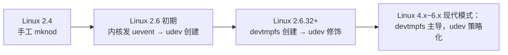

------

## 12.7_驱动开发者的注意事项

- **2.4 内核**：必须在 README 中明确告诉用户如何 `mknod`。
- **2.6 初期**：最好为模块提供 `MODULE_ALIAS`，帮助 udev 自动加载和建节点。
- **2.6.32+**：推荐使用 `class_create()` + `device_create()`，让 devtmpfs 自动建节点。
- **现代系统**：
  - 不必关心 `/dev`，交给 devtmpfs + udev。
  - 若要 sysfs 属性，依旧要通过 `class` 和 `device` 补充。

------

## 12.8_桌面与嵌入式的差别

- **桌面系统**：
  - 必然有 udev，devtmpfs 提供“基础”，udev 提供“策略”。
  - 用户体验：/dev 下设备名往往是友好的别名（如 /dev/disk/by-uuid）。
- **嵌入式系统**：
  - 常常禁用 udev，仅启用 devtmpfs。
  - 节点名与 `device_create()` 保持一致，简单但稳定。

------

## 12.9_时序图(现代_6.x_内核)

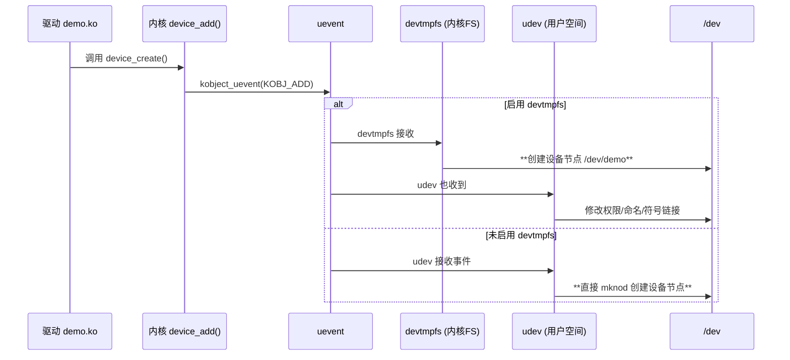

------

## 12.10_小结

- **节点的触发点**：`device_add()` → `uevent`。
- **现代内核 6.x**：
  - **devtmpfs 创建设备节点**
  - **udev 修改属性/命名/链接**
- **历史回顾**：
  - 2.4：手工 mknod
  - 2.6 初期：uevent + udev
  - 2.6.32+：devtmpfs 引入
  - 4.x~6.x：现代模式

👉 一句话总结：
 **“节点由内核 devtmpfs 负责生，udev 负责养。”**

------

要不要我再把 **12.3–12.5**（devtmpfs / udev / 历史演变）补充一些 **内核源码片段（比如 `drivers/base/devtmpfs.c` 里的关键函数）**，让这一章更“硬核”？


既然 **第 12 章** 我们已经完整讲清楚了 *uevent + devtmpfs + udev 的协作机制*，自然的延伸就是：

➡ **第 13 章** —— 把视角放回到驱动开发者：**如何在驱动中正确使用 class 与 device 接口，确保 /sys 与 /dev 节点正常出现和联动**。

换句话说，从“机制”切换回“实践”：

- 什么时候用 `class_create()`，什么时候可以不用？
- `device_create()` 必须搭配哪些步骤？
- 如何保证设备节点的唯一性？
- 如果是多实例设备、分组设备，开发者该如何设计 class 与 device？
- 在实际驱动调试时，如何从 `/sys/` 和 `/dev/` 两个角度验证？

下面我展开：

------

# 第13章_驱动开发中的_class_与_device_使用实践

------

## 13.1_概述

前几章我们从内核对象模型与文件系统的角度，深入理解了 **class、device、uevent、devtmpfs、udev** 的关系。
 这一章从 **驱动开发者的实践角度** 出发，讲解：

- 代码层面的 API 使用模式
- 单实例 vs 多实例设备的设计要点
- class 与 device 的协作规范
- 调试与验证的方法

------

## 13.2_基本使用模式

典型的字符设备驱动创建流程：

1. **分配设备号**

   ```c
   alloc_chrdev_region(&devt, 0, 1, "demo");
   ```

2. **注册 class**

   ```c
   demo_class = class_create(THIS_MODULE, "demo_class");
   ```

3. **注册 device**

   ```c
   device_create(demo_class, NULL, devt, NULL, "demo");
   ```

4. **在驱动卸载时释放**

   ```c
   device_destroy(demo_class, devt);
   class_destroy(demo_class);
   unregister_chrdev_region(devt, 1);
   ```

👉 这样既有 `/sys/class/demo_class/demo/`（sysfs 属性接口），也有 `/dev/demo`（I/O 通道）。

------

## 13.3_省略_class_的情况

- 也可以直接：

  ```c
  device_create(NULL, NULL, devt, NULL, "demo");
  ```

- 结果：

  - `/dev/demo` 依旧会出现（因为 devtmpfs + uevent）
  - `/sys/class/` 下没有入口

- 适用场景：

  - 简单驱动，仅提供 I/O，不需要属性配置

👉 但大多数“正统驱动”都会使用 class，因为 sysfs 属性是调试和扩展的重要手段。

------

## 13.4_多实例设备的处理

### 13.4.1_自动编号

```c
for (i = 0; i < N; i++) {
    device_create(demo_class, NULL, MKDEV(major, i), NULL,
                  "demo%d", i);
}
```

结果：

- `/dev/demo0` `/dev/demo1` …
- `/sys/class/demo_class/demo0` `/sys/class/demo_class/demo1`

### 13.4.2_分组管理

- 对于功能差异明显的设备（如 `/dev/demo_in`、`/dev/demo_out`），可以创建多个 class：

  ```c
  demo_in_class  = class_create(THIS_MODULE, "demo_in");
  demo_out_class = class_create(THIS_MODULE, "demo_out");
  ```

- 然后在不同的 class 下注册 device。

👉 这样 `/sys/class/` 下的结构会更直观。

------

## 13.5_class_与_device_的协作原则

1. **class 是逻辑集合**
   - 用于把同类设备组织在一起
   - 提供 sysfs 属性扩展点
2. **device 是实例对象**
   - 负责发出 uevent
   - 才能让 `/dev/` 节点出现
3. **必须调用 device_create()**
   - 仅仅注册 cdev 并不足以生成节点
   - 必须走设备模型路径（device_add → uevent）

------

## 13.6_调试与验证方法

1. **检查 /dev 节点是否出现**

   ```bash
   ls -l /dev/demo*
   ```

2. **检查 sysfs 是否有入口**

   ```bash
   ls -l /sys/class/demo_class/
   ```

3. **实时监听事件**

   ```bash
   udevadm monitor --kernel --property
   ```

4. **查看内核日志**

   - `dmesg | grep demo`
   - 驱动里 `dev_info()` 日志会带设备前缀

👉 这四步能帮助开发者快速确认设备模型链路是否完整。

------

## 13.7_嵌入式与桌面环境的差别

- **嵌入式 Linux**
  - 常常只依赖 devtmpfs
  - 节点名与 `device_create()` 一致
  - 简单可靠
- **桌面/服务器 Linux**
  - 必须依赖 udev
  - 节点名可能被规则改写
  - 建议检查 `/dev/` 和 `/sys/` 是否一致

------

## 13.8_小结

- **驱动开发者必须调用 device_create()** 才能进入设备模型流程。
- **class 提供 sysfs 属性**，**device 触发 uevent** → **devtmpfs/udev 创建节点**。
- 简单驱动可省略 class，但推荐保留以方便调试。
- 多实例设备需合理命名，避免用户混淆。
- 调试时应同时观察 `/dev/` 与 `/sys/`。

👉 一句话总结：
 **class 决定设备“家族归属”，device 决定设备“是否出生”。**

------

要不要我在 **13.4 多实例设备的处理** 里加一张 **结构图（sysfs 目录树 + /dev 节点）**，让“多实例设备”的层级一目了然？

------

# 第14章_sysfs_属性的高级使用

------

## 14.1_主题引入

在 Linux 驱动开发中，**sysfs 属性** 是驱动向用户空间暴露配置接口的核心机制。

- **/dev 节点**：用于传输数据（如 `read()`、`write()`）。
- **/sys 节点**：用于管理与配置（如模式选择、开关参数）。

sysfs 通过“文件即接口”的方式，让用户态开发者无需 ioctl，就能直接读写驱动内部变量。这使得 sysfs 成为 **嵌入式系统调试、驱动配置和运行时控制** 的首选手段。

本章将从 **数据结构 → 开发者实践 → 用户操作** 三个角度深入讲解 sysfs 属性，并给出完整的可运行示例。

------

## 14.2_sysfs_属性与文件的关系

sysfs 将 **内核对象属性** 映射为 **文件**。

### 14.2.1_数据结构解析

内核中每个属性文件由 `struct device_attribute` 或 `struct class_attribute` 表示。

```c
struct device_attribute {
    struct attribute attr;   // 属性元信息（名字、权限）
    ssize_t (*show)(struct device *dev,
                    struct device_attribute *attr,
                    char *buf);  // 读回调
    ssize_t (*store)(struct device *dev,
                     struct device_attribute *attr,
                     const char *buf, size_t count);  // 写回调
};
```

- **attr.name**：文件名
- **attr.mode**：文件权限（如 0644）
- **show()**：用户读取属性文件时触发
- **store()**：用户写入属性文件时触发

👉 **sysfs 哲学**：**“属性即文件，读写即接口。”**

------

### 14.2.2_开发者的使用方法

开发者通常不会直接手写 `struct device_attribute`，而是用内核提供的宏：

- **只读属性**

  ```c
  DEVICE_ATTR_RO(name);
  ```

- **只写属性**

  ```c
  DEVICE_ATTR_WO(name);
  ```

- **可读写属性**

  ```c
  DEVICE_ATTR_RW(name);
  ```

注册方式：

1. **单个属性注册**

   ```c
   device_create_file(dev, &dev_attr_name);
   ```

2. **批量注册（推荐）**

   ```c
   sysfs_create_group(&dev->kobj, &attr_group);
   ```

卸载时：

```c
device_remove_file(dev, &dev_attr_name);
sysfs_remove_group(&dev->kobj, &attr_group);
```

------

### 14.2.3_最小化驱动示例

下面给出一个完整的 **可运行驱动**，演示如何创建 sysfs 属性：

```c
// SPDX-License-Identifier: GPL-2.0
#include <linux/module.h>
#include <linux/device.h>
#include <linux/init.h>

static struct class *demo_class;
static struct device *demo_device;

static int demo_mode = 0;  // 驱动内部变量

/* show 回调 */
static ssize_t mode_show(struct device *dev,
                         struct device_attribute *attr, char *buf)
{
    return sprintf(buf, "%d\n", demo_mode);
}

/* store 回调 */
static ssize_t mode_store(struct device *dev,
                          struct device_attribute *attr,
                          const char *buf, size_t count)
{
    int val;
    if (kstrtoint(buf, 10, &val))
        return -EINVAL;
    demo_mode = val;
    pr_info("mode changed to %d\n", demo_mode);
    return count;
}

/* 定义属性 */
static DEVICE_ATTR_RW(mode);

static int __init demo_init(void)
{
    demo_class = class_create(THIS_MODULE, "demo_class");
    if (IS_ERR(demo_class))
        return PTR_ERR(demo_class);

    demo_device = device_create(demo_class, NULL, 0, NULL, "demo");
    if (IS_ERR(demo_device)) {
        class_destroy(demo_class);
        return PTR_ERR(demo_device);
    }

    device_create_file(demo_device, &dev_attr_mode);
    pr_info("demo sysfs loaded\n");
    return 0;
}

static void __exit demo_exit(void)
{
    device_remove_file(demo_device, &dev_attr_mode);
    device_destroy(demo_class, 0);
    class_destroy(demo_class);
    pr_info("demo sysfs unloaded\n");
}

module_init(demo_init);
module_exit(demo_exit);

MODULE_LICENSE("GPL");
MODULE_AUTHOR("YourName");
MODULE_DESCRIPTION("Minimal sysfs attribute example");
```

加载后：

```bash
insmod demo_sysfs.ko
ls /sys/class/demo_class/demo/
# 输出: mode
```

测试：

```bash
cat /sys/class/demo_class/demo/mode
0

echo 1 > /sys/class/demo_class/demo/mode
cat /sys/class/demo_class/demo/mode
1
```

👉 用户通过 `/sys` 改变了 `demo_mode`，驱动内部逻辑随之更新。

------

## 14.3_属性读写回调的实现

- **show()**：必须返回字符串，以 `\n` 结尾。
- **store()**：接收用户输入的字符串，需转换为整型或布尔型。
- 建议使用 **kstrtoint()**、**kstrtobool()** 等内核工具函数，避免手写解析。

------

## 14.4_多属性设备的管理

### 14.4.1_多属性示例

复杂设备可能需要多个属性：

- `mode`：运行模式
- `power_save`：省电开关
- `buffer_size`：缓冲区大小

### 14.4.2_使用属性组

推荐使用属性组：

```c
static struct attribute *demo_attrs[] = {
    &dev_attr_mode.attr,
    &dev_attr_power_save.attr,
    &dev_attr_buffer_size.attr,
    NULL,
};

static const struct attribute_group demo_attr_group = {
    .attrs = demo_attrs,
};

sysfs_create_group(&dev->kobj, &demo_attr_group);
```

### 14.4.3_目录树示意

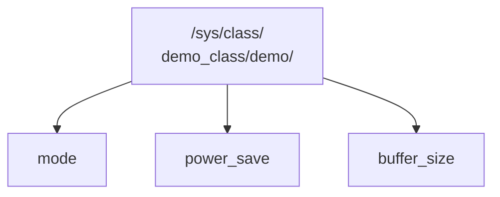

------

## 14.5_动态属性

某些属性只在特定状态下存在：

- Wi-Fi 驱动：`signal_strength` 仅在连接后导出
- 存储驱动：`eject` 仅在介质存在时导出

驱动可：

- 动态添加：`device_create_file()`
- 动态删除：`device_remove_file()`

👉 保证 sysfs 与设备实际状态同步。

------

## 14.6_sysfs_与驱动行为的联动

完整交互流程如下：


- `/sys` 属性 = 配置入口
- `/dev` 节点 = 数据通道

二者协同，使得驱动既可配置，又可传输数据。

------

## 14.7_设计原则

1. **粒度适中**：避免暴露过多内部细节
2. **文本化**：sysfs 仅支持 ASCII 文本
3. **即写即生效**：store() 回调必须立即生效

------

## 14.8_调试与验证

1. **查看属性文件**

   ```bash
   ls /sys/class/demo_class/demo/
   ```

2. **验证回调触发**
    在 `store()` 加入：

   ```c
   pr_info("mode changed to %d\n", val);
   ```

   然后：

   ```bash
   echo 2 > /sys/class/demo_class/demo/mode
   dmesg | grep demo
   ```

------

## 14.9_小结

- sysfs 属性是 **驱动与用户交互** 的关键途径。
- 开发者通过 `DEVICE_ATTR_*` 宏和 `device_create_file()` / `sysfs_create_group()` 实现属性。
- 用户通过 `cat/echo` 即可修改驱动内部变量。
- sysfs 与 `/dev` 分工明确：
  - `/dev` 管传输
  - `/sys` 管配置

👉 一句话总结：
 **“sysfs 管配置，/dev 管传输。”**

------

要不要我帮你把 **第 15 章（设备模型的深入衔接：kobject/kset/class/device 层级关系）** 接着整理出来？

👌 好的，那我按照我们确认的 **写书章节生成标准**，完整输出 **第 15 章：设备模型的深入衔接**。
 这一章的主题是把 **kobject/kset/class/device** 等核心概念串起来，展示它们之间的层级关系，并结合驱动开发的实际使用场景。

------

# 第15章_设备模型的深入衔接

------

## 15.1_主题引入

Linux 设备模型的核心思想是：**一切皆对象 (object)，对象皆可导出为 sysfs 节点**。

在驱动开发中，我们经常调用：

- `class_create()`
- `device_create()`
- `cdev_add()`

这些 API 背后，其实都是在操作 **kobject / kset / class / device** 这一整套内核对象系统。

本章将从 **数据结构**、**开发者视角** 和 **用户视角** 三个角度，逐步解析设备模型的层级关系，让你从整体上理解 `/sys`、`/dev`、驱动之间的协作。

------

## 15.2_数据结构层级

Linux 设备模型的核心数据结构：

### 15.2.1_kobject

- 最底层的抽象对象，所有内核对象都继承自它。
- 提供 sysfs 接口的基础。

```c
struct kobject {
    const char       *name;
    struct list_head entry;
    struct kobject   *parent;
    struct kset      *kset;
    struct kobj_type *ktype;
    struct kernfs_node *sd;   // 对应 sysfs 节点
};
```

------

### 15.2.2_kset

- 一组 kobject 的集合。
- 提供层级组织，例如所有设备都在一个 bus kset 下。

------

### 15.2.3_class

- 代表一种逻辑设备类别（如 `input`、`net`、`demo_class`）。
- 本质上是对 **kset** 的进一步封装：
  - 在 sysfs 下生成 `/sys/class/<classname>/`
  - class 下可以挂多个 device

```c
struct class {
    const char        *name;
    struct module     *owner;
    struct kobject     kobj;   // 内嵌 kobject
    struct list_head   devices; // 挂载的 device 链表
};
```

------

### 15.2.4_device

- 代表一个具体的设备实例。
- 挂在某个 class 下。
- 在 sysfs 中表现为 `/sys/class/<classname>/<devicename>`。
- 同时会通过 uevent 触发 `/dev/<devicename>` 节点创建。

```c
struct device {
    struct kobject kobj;
    struct class   *class;
    dev_t           devt;    // 主次设备号
    struct device  *parent;
};
```

------

## 15.3_开发者视角_如何使用

### 15.3.1_创建设备模型对象

典型驱动流程：

```c
// 1. 注册 class
demo_class = class_create(THIS_MODULE, "demo_class");

// 2. 创建设备
demo_device = device_create(demo_class, NULL, devt, NULL, "demo");
```

结果：

- sysfs 中：

  ```
  /sys/class/demo_class/demo/
  ```

- /dev 中：

  ```
  /dev/demo
  ```

------

### 15.3.2_移除设备模型对象

```c
device_destroy(demo_class, devt);
class_destroy(demo_class);
```

------

### 15.3.3_最小驱动骨架

```c
static int __init demo_init(void)
{
    demo_class = class_create(THIS_MODULE, "demo_class");
    device_create(demo_class, NULL, devt, NULL, "demo");
    return 0;
}

static void __exit demo_exit(void)
{
    device_destroy(demo_class, devt);
    class_destroy(demo_class);
}
```

👉 这就是驱动在 **class → device** 层级上的基本使用方式。

------

## 15.4_用户视角

用户可以通过以下方式验证设备模型：

1. **查看 sysfs 层级**

   ```bash
   tree /sys/class/demo_class/
   ```

   输出：

   ```
   /sys/class/demo_class/demo/
   ├── dev
   ├── subsystem -> ../../class/demo_class
   └── uevent
   ```

2. **查看 /dev 节点**

   ```bash
   ls -l /dev/demo
   ```

3. **实时监听事件**

   ```bash
   udevadm monitor --kernel --property
   ```

👉 用户空间可以从 **sysfs** 查看设备属性，从 **/dev** 与设备交互。

------

## 15.5_bus_与_class_的区分

- **bus**：代表硬件连接层次（如 PCI、USB、I2C）。
- **class**：代表逻辑功能分类（如 `input`、`net`）。
- **device**：既属于某个 bus（物理归属），也属于某个 class（逻辑分类）。

例如：

- USB 摄像头：
  - bus = USB
  - class = video4linux (V4L2)

👉 区分 bus 与 class，是理解设备模型层级的关键。

------

## 15.6_可视化_设备模型层级

```mermaid
graph TD
  subgraph sysfs
    K["kobject"]
    KS["kset"]
    C["class: demo_class"]
    D["device: demo"]
  end

  K --> KS
  KS --> C
  C --> D
```

👉 内核对象从 kobject 一路向上，最终形成 sysfs 与 /dev 的对外接口。

------

## 15.7_调试与验证

- **调试 sysfs**

  ```bash
  ls -l /sys/class/demo_class/demo/
  cat /sys/class/demo_class/demo/uevent
  ```

- **调试 /dev 节点**

  ```bash
  echo "hello" > /dev/demo
  cat /dev/demo
  ```

- **确认内核事件**

  ```bash
  dmesg | grep demo
  ```

------

## 15.8_小结

- **kobject**：内核对象的最小单元
- **kset**：kobject 的集合
- **class**：逻辑设备类别，对应 `/sys/class/<name>/`
- **device**：具体设备实例，对应 `/sys/class/<class>/<device>/` 与 `/dev/<device>`

👉 一句话总结：
 **“kobject 是基石，class 管逻辑分组，device 让设备实例化。”**

------

要不要我接下来继续写 **第 16 章：调试与问题定位**，讲解为什么有时候 `/dev` 节点不出现，以及怎么排查？

👌 好的，那我接着按照我们确认的 **写书章节生成标准**，完整编写 **第 16 章：调试与问题定位**。这一章专门解决驱动开发过程中最常见的问题：**为什么设备节点没出现？为什么 sysfs 里看不到属性？如何排查？**

------

# 第16章_调试与问题定位

------

## 16.1_主题引入

在 Linux 驱动开发中，很多初学者都会遇到这样的场景：

- 驱动模块加载成功，但 **/dev 节点没有出现**；
- sysfs 下 **/sys/class/xxx/** 目录为空；
- 用户空间 `cat /dev/demo` 报错 "No such file or directory"；
- udevadm 监控不到任何事件。

这些现象往往不是“驱动没运行”，而是出在 **设备模型链路断裂**。

本章将从 **开发者视角** 和 **用户视角** 两方面，系统讲解常见问题与调试方法。

------

## 16.2_设备节点未出现的常见原因

### 16.2.1_忘记调用_device_create()

很多人只调用了 `cdev_add()`，注册了字符设备，但没调用 `device_create()`：

```c
cdev_add(&cdev, devt, 1);   // 只注册 cdev
// 缺少 device_create(...)
```

结果：

- /sys/class/ 下没有对应入口
- /dev 下也没有节点

👉 **解决办法**：
 必须调用 `device_create()` 来触发 uevent，从而由 devtmpfs/udev 创建设备节点。

------

### 16.2.2_class_没有创建

如果 `class_create()` 失败，`device_create()` 就没法把设备挂到 sysfs。

常见错误：

```c
demo_class = class_create(THIS_MODULE, "demo_class");
if (IS_ERR(demo_class)) {
    // 错误没处理，后续仍调用 device_create
}
```

结果：

- /sys/class/demo_class 不存在
- /dev/demo 也不会出现

------

### 16.2.3_主次设备号错误

如果 `alloc_chrdev_region()` 分配的设备号没有正确传入 `device_create()`，则节点可能以错误的名字/编号出现。

👉 调试时可用：

```bash
cat /sys/class/demo_class/demo/dev
```

检查 major/minor 是否与预期一致。

------

### 16.2.4_devtmpfs_未启用

如果内核没有启用 `CONFIG_DEVTMPFS`，则 /dev 目录不会自动出现节点。
 这种情况下，必须依赖用户空间的 udev 来创建。

检查方式：

```bash
zcat /proc/config.gz | grep DEVTMPFS
```

👉 在嵌入式系统中，常见的情况是忘记挂载 devtmpfs：

```bash
mount -t devtmpfs devtmpfs /dev
```

------

### 16.2.5_udev_未运行

在桌面/服务器系统中，如果 udev 服务未运行，则即使有 uevent，节点属性可能不会正确调整。

检查方式：

```bash
ps -ef | grep udevd
```

------

## 16.3_sysfs_属性不生效的常见原因

### 16.3.1_show/store_未定义

定义属性时，如果只写了：

```c
DEVICE_ATTR_RO(mode);
```

但没写对应的 `show()` 函数，则读取会报错。

👉 必须成对实现。

------

### 16.3.2_注册遗漏

属性写好后如果没调用：

```c
device_create_file(dev, &dev_attr_mode);
```

那么 `/sys/class/demo_class/demo/mode` 就不会出现。

------

### 16.3.3_权限错误

如果属性定义时权限不对：

```c
__ATTR(mode, 0000, show, store);
```

用户态 `cat` 时会报权限错误。

------

## 16.4_用户视角的排查方法

### 16.4.1_观察_sysfs

```bash
ls -l /sys/class/demo_class/demo/
cat /sys/class/demo_class/demo/uevent
```

👉 uevent 文件能看到设备的 major/minor 信息。

------

### 16.4.2_观察_devtmpfs

```bash
ls -l /dev/demo
```

如果不存在：

- 说明 devtmpfs/udev 没有正确创建

------

### 16.4.3_监听_uevent

```bash
udevadm monitor --kernel --property
```

如果没有任何输出，说明 `device_create()` 根本没触发 uevent。

------

### 16.4.4_查看内核日志

```bash
dmesg | grep demo
```

确认 `class_create`、`device_create` 是否报错。

------

## 16.5_开发者视角的排查方法

### 16.5.1_打印日志

在关键位置加：

```c
pr_info("demo: class=%p device=%p\n", demo_class, demo_device);
```

确认对象是否真的创建。

------

### 16.5.2_检查返回值

每一个调用都可能失败：

- `alloc_chrdev_region()`
- `class_create()`
- `device_create()`

👉 开发者必须检查 `IS_ERR()` 并处理，否则后续操作无效。

------

### 16.5.3_验证_sysfs_与_/dev_的一致性

对比：

```bash
cat /sys/class/demo_class/demo/dev
ls -l /dev/demo
```

两者的 major/minor 必须一致，否则说明 udev 规则覆盖了节点。

------

## 16.6_调试案例_设备节点没出现

1. 加载模块后 `/dev/demo` 不存在

2. 检查 sysfs：

   ```bash
   cat /sys/class/demo_class/demo/uevent
   ```

   输出：

   ```
   MAJOR=240
   MINOR=0
   DEVNAME=demo
   ```

   → uevent 正常

3. 检查 devtmpfs：

   ```bash
   mount | grep devtmpfs
   ```

   → 没挂载

4. 手动挂载：

   ```bash
   mount -t devtmpfs devtmpfs /dev
   ```

   → `/dev/demo` 出现

👉 说明问题在 devtmpfs 没挂载，而不是驱动。

------

## 16.7_可视化_调试路径

```mermaid
flowchart TD
  A["驱动: device_create()"] --> B["内核: uevent 生成"]
  B --> C{"sysfs 是否有 <br>/sys/class/<br>demo_class/demo ?"}
  C -->|否| E["class_create <br>或 device_create 失败"]
  C -->|是| D["检查 devtmpfs/udev <br>是否挂载运行"]
  D -->|失败| F["/dev 节点缺失"]
  D -->|成功| G["/dev 节点正常"]
```

------

## 16.8_小结

- `/dev` 节点缺失并不等于驱动没运行，往往是 **device_create/devtmpfs/udev** 出现问题。
- `/sys/class/<class>/<device>/uevent` 是排查的关键入口。
- **开发者视角**：检查 API 返回值、打印日志、确认 major/minor。
- **用户视角**：观察 sysfs、监听 uevent、确认 devtmpfs/udev 状态。

👉 一句话总结：
 **“先看 sysfs，有无 uevent；再看 /dev，确认 devtmpfs/udev。”**

👌 好的，那我按照 **写书章节生成标准**，完整输出 **第 17 章：嵌入式系统与桌面系统的差异化实现**。
 这一章会专门讨论为什么在嵌入式 Linux 和桌面 Linux 上，设备节点的管理方式不同，以及开发者和用户在两类系统中需要注意的差异。

------

# 第17章_嵌入式系统与桌面系统的差异化实现

------

## 17.1_主题引入

Linux 内核为设备节点提供了 **devtmpfs** 机制，而用户空间常见的 **udev**（或 systemd-udevd）则进一步增强了节点的管理能力。

- 在 **桌面系统** 中，通常运行完整的 udev 服务，设备节点会经过规则处理（改名、加权限、加符号链接）。
- 在 **嵌入式系统** 中，为了节省资源，常常只启用 devtmpfs，不运行 udev。

这种差异导致了驱动开发在两种场景下的表现和调试方式都有不同。

------

## 17.2_devtmpfs-only_模式(嵌入式系统)

### 17.2.1_特点

- **/dev 节点由内核直接创建**
- 节点名字固定，取决于 `device_create()` 的参数
- 权限、属主默认由内核设置（通常 root:root, 0600/0660）
- 没有符号链接、别名等功能

### 17.2.2_挂载方式

通常在 init 脚本里：

```bash
mount -t devtmpfs devtmpfs /dev
```

这样，当驱动调用 `device_create()` 时，内核会自动在 `/dev/` 下生成节点。

### 17.2.3_优点

- 实现简单，不依赖用户空间服务
- 内存/CPU 占用小，适合嵌入式

### 17.2.4_缺点

- 无法灵活配置权限和名字
- 无法提供符号链接（如 `/dev/disk/by-uuid`）
- 所有设备节点都暴露给 root，用户态管理能力弱

------

## 17.3_devtmpfs_+_udev_模式(桌面系统)

### 17.3.1_特点

- 内核依旧通过 devtmpfs 创建节点
- **udev 守护进程** 监听 `uevent`
- 根据规则文件调整：
  - 权限 (`chmod 0666`)
  - 属主 (`chown root:video`)
  - 名字（`/dev/video0` → `/dev/camera0`）
  - 符号链接（`/dev/disk/by-uuid/...`）

### 17.3.2_配置规则

udev 规则通常位于：

```
/etc/udev/rules.d/
/lib/udev/rules.d/
```

示例：

```bash
KERNEL=="demo", MODE="0666", SYMLINK+="mydemo"
```

加载后：

- `/dev/demo` 权限变为 0666
- 新增符号链接 `/dev/mydemo`

### 17.3.3_优点

- 灵活配置，适配多用户桌面环境
- 符号链接让设备可预测（尤其是 USB 热插拔）
- 权限控制更安全

### 17.3.4_缺点

- 依赖 udev 服务，开销比嵌入式大
- 调试复杂（规则冲突、优先级问题）

------

## 17.4_用户视角的差异

### 17.4.1_嵌入式系统

```bash
ls -l /dev/demo
# 输出: crw------- 1 root root 240, 0 Sep 23 07:00 /dev/demo
```

👉 节点存在，但普通用户无法直接访问，需要 root 或 chmod。

### 17.4.2_桌面系统

```bash
ls -l /dev/demo
# 输出: crw-rw---- 1 root plugdev 240, 0 Sep 23 07:00 /dev/demo
ls -l /dev/mydemo
# 符号链接由 udev 创建
```

👉 普通用户只要在 `plugdev` 组，就能直接使用设备。

------

## 17.5_开发者视角的差异

### 17.5.1_嵌入式驱动开发

- 确认 `CONFIG_DEVTMPFS` 已启用
- init 脚本中挂载 devtmpfs
- 通过 `device_create()` 保证节点出现
- 不依赖用户空间服务

### 17.5.2_桌面驱动开发

- 确认 udev 规则是否正确（调试用 `udevadm monitor`）
- 可以通过 `DEVNAME`、`SUBSYSTEM` 等匹配规则修改节点行为
- 若节点没出现 → 先看 `/sys/class/` 再看 udev 日志

------

## 17.6_可视化_两种模式对比

```mermaid
flowchart TD
  subgraph Embedded["嵌入式 (devtmpfs-only)"]
    D1["device_create()"] --> K1["内核 devtmpfs"]
    K1 --> N1["/dev/demo <br>(固定名字, root 权限)"]
  end

  subgraph Desktop["桌面 (devtmpfs + udev)"]
    D2["device_create()"] --> K2["内核 devtmpfs"]
    K2 --> U["udev 守护进程"]
    U --> N2["/dev/demo (改名/改权限)"]
    U --> L["/dev/mydemo <br>(符号链接)"]
  end
```

------

## 17.7_调试建议

- 嵌入式：
  - 检查 `/sys/class/` 是否有目录
  - 确认 `/dev` 挂载了 devtmpfs
- 桌面：
  - 用 `udevadm monitor` 查看规则是否触发
  - 检查 `/etc/udev/rules.d/` 中是否有自定义规则覆盖

------

## 17.8_小结

- **嵌入式系统**：常用 **devtmpfs-only**，节点由内核直接创建，简单高效。
- **桌面系统**：常用 **devtmpfs + udev**，节点可灵活改名、加权限、建符号链接。
- 开发者必须根据目标平台选择调试方式：
  - 嵌入式：重点在于 `device_create()` 和 devtmpfs 挂载
  - 桌面：重点在于 udev 规则和权限

👉 一句话总结：
 **“嵌入式靠 devtmpfs，桌面靠 udev 加持。”**

------

要不要我在 **第 18 章** 里写 **sysfs 的安全性与权限控制**，讲解为什么有的属性只能 root 写、如何通过 udev/sysfs 限制访问？

👌 明白了，我来继续编写 **第 18 章：sysfs 的安全性与权限控制**，保持出版社级的排版与逻辑，适合直接复制到 Typora。

------

# 第18章_sysfs_的安全性与权限控制

------

## 18.1_主题引入

在 Linux 驱动开发中，**sysfs 属性文件**是用户态与内核驱动交互的重要桥梁。
 然而，sysfs 文件的权限控制设计得非常严格：

- **默认仅 root 可写**
- 普通用户只能只读访问部分信息
- 所有文件内容必须是 **ASCII 文本**

这些限制并非“多此一举”，而是出于 **系统安全性与稳定性** 的考虑。

本章将从 **数据结构、内核实现、开发者操作、用户视角** 多角度解析 sysfs 权限控制机制，并给出调试与最佳实践建议。

------

## 18.2_sysfs_权限的来源

### 18.2.1_attribute.mode

每个 sysfs 属性文件都对应一个 `struct attribute`：

```c
struct attribute {
    const char *name;   // 文件名
    umode_t    mode;    // 文件权限，如 0444、0644
};
```

- mode 的值直接决定了文件的读/写权限
- sysfs 文件系统会将该值映射为普通的 Unix 权限

------

### 18.2.2_内核限制

- sysfs 文件始终属于 **root 用户**
- 权限不能随意放开写操作（必须在驱动里显式定义）
- 出于安全考虑：
  - **默认推荐 0444 (只读)**
  - **谨慎使用 0644 (读写)**
  - 严禁 0666 (全局读写)，除非确实需要

------

## 18.3_开发者视角_定义权限

### 18.3.1_只读属性

```c
DEVICE_ATTR_RO(mode);   // 权限 = 0444
```

### 18.3.2_可写属性

```c
DEVICE_ATTR_RW(mode);   // 权限 = 0644
```

### 18.3.3_手动设置权限

```c
static struct device_attribute dev_attr_debug =
    __ATTR(debug, 0600, debug_show, debug_store);
```

👉 只有 root 用户可以读写 debug 属性。

------

## 18.4_用户视角_权限验证

```bash
ls -l /sys/class/demo_class/demo/mode
-r--r--r-- 1 root root 4096 Sep 23 07:00 mode
```

- 普通用户：

  ```bash
  cat /sys/class/demo_class/demo/mode   # 可以
  echo 1 > /sys/class/demo_class/demo/mode  # Permission denied
  ```

- root 用户：

  ```bash
  echo 1 > /sys/class/demo_class/demo/mode  # 成功
  ```

👉 这体现了 **sysfs 的安全边界**：读权限可放开，写权限严格限制。

------

## 18.5_udev_与权限修改

在桌面系统中，**udev 规则**可以动态修改权限：

规则示例：

```
KERNEL=="demo", MODE="0666", GROUP="users"
```

加载后：

```bash
ls -l /sys/class/demo_class/demo/mode
-rw-rw-rw- 1 root users 4096 Sep 23 07:00 mode
```

👉 这种做法虽然方便，但风险更高，必须谨慎使用。

------

## 18.6_sysfs_权限与安全性讨论

### 18.6.1_为什么_sysfs_严格限制写操作

- sysfs 文件操作 **直接调用驱动回调**，属于内核态执行
- 任意用户写入可能导致：
  - 内核变量被篡改
  - 硬件状态异常（如强制断电）
  - 内核崩溃

👉 因此，Linux 内核默认 **不信任普通用户**，只允许 root 写入。

------

### 18.6.2_设计原则

1. **只读优先**：除非确实需要修改，否则定义为只读
2. **root 限制**：写权限仅 root 可用
3. **不可全局放开**：避免 0666 属性
4. **配置分层**：运行时调整（用户态工具） vs 内核控制（sysfs）要分清楚

------

## 18.7_可视化_权限控制模型

```mermaid
flowchart TD
  U["用户空间"] -->|cat /sys/...| R["sysfs show() 回调"]
  U -->|echo > /sys/...| W{"是否有写权限?"}
  W -->|否| D["Permission denied"]
  W -->|是| S["sysfs store() 回调 <br> -> 内核变量修改"]
```

------

## 18.8_调试与验证

1. **确认权限**

   ```bash
   ls -l /sys/class/demo_class/demo/
   ```

2. **模拟 root 写入**

   ```bash
   sudo sh -c "echo 1 > /sys/class/demo_class/demo/mode"
   ```

3. **观察 dmesg**

   ```bash
   dmesg | grep demo
   ```

------

## 18.9_小结

- sysfs 权限来自 `struct attribute.mode`
- 默认策略是 **读开放，写收紧**
- root 可以写，普通用户大多数只能读
- udev 可修改权限，但存在风险
- 驱动开发者必须牢记：**写权限就是内核入口，等同于 root 权限调用**

👉 一句话总结：
 **“sysfs 的写操作 = 直接执行内核代码，必须严控权限。”**

------

要不要我在 **第 19 章** 继续写 **sysfs 的调试与最佳实践**，例如如何用 `debugfs` 和 `trace_printk` 来辅助分析 sysfs 行为？

👌 好的，那我来继续完整输出 **第 19 章：sysfs 的调试与最佳实践**。
 这一章会结合 **开发者调试手段** 和 **用户空间验证**，展示如何分析 sysfs 属性的行为，并介绍 `debugfs`、`trace_printk` 等常用技巧。

------

# 第19章_sysfs_的调试与最佳实践

------

## 19.1_主题引入

sysfs 属性为驱动提供了 **用户可配置接口**，但由于其执行路径直达内核态，任何错误的实现都可能导致系统崩溃。

因此，作为开发者，除了实现属性，还需要掌握 **调试手段**：

- 如何确认属性是否创建成功？
- 如何验证回调函数是否执行？
- 如何追踪 sysfs 的读写调用？
- 如何区分 sysfs 与 debugfs 的使用场景？

本章将从 **开发者视角** 与 **用户视角** 出发，整理出一套 sysfs 调试与最佳实践方案。

------

## 19.2_基础调试方法

### 19.2.1_确认属性文件存在

```bash
ls -l /sys/class/demo_class/demo/
```

输出应包含驱动定义的属性，例如：

```
-rw-r--r-- 1 root root 4096 Sep 23 08:00 mode
```

------

### 19.2.2_确认回调是否执行

在 `show()` 或 `store()` 函数中添加：

```c
pr_info("demo: show/store triggered, val=%d\n", demo_mode);
```

加载驱动后，执行：

```bash
cat /sys/class/demo_class/demo/mode
echo 1 > /sys/class/demo_class/demo/mode
dmesg | grep demo
```

👉 若能看到日志，说明回调触发成功。

------

## 19.3_高级调试手段

### 19.3.1_使用_ftrace_跟踪_sysfs

Linux 内核支持通过 ftrace 跟踪函数调用。

示例：跟踪 sysfs store 调用链

```bash
echo sysfs_kf_write > /sys/kernel/debug/tracing/set_ftrace_filter
echo function > /sys/kernel/debug/tracing/current_tracer
echo 1 > /sys/kernel/debug/tracing/tracing_on
```

执行 `echo 1 > /sys/class/demo_class/demo/mode` 后，查看：

```bash
cat /sys/kernel/debug/tracing/trace
```

输出将显示 sysfs 回调的调用路径。

------

### 19.3.2_使用_trace_printk

开发者可在回调中插入：

```c
trace_printk("demo: store called with %d\n", val);
```

然后通过：

```bash
cat /sys/kernel/debug/tracing/trace_pipe
```

实时查看 sysfs 写入操作的执行情况。

👉 与 `pr_info` 的区别是：`trace_printk` 不会刷屏 dmesg，适合频繁调试。

------

### 19.3.3_debugfs_与_sysfs_的关系

- **sysfs**：面向用户，提供正式的设备配置接口
- **debugfs**：面向开发者，提供调试/实验接口

区别示例：

- sysfs `/sys/class/demo_class/demo/mode`：用户态可配置模式
- debugfs `/sys/kernel/debug/demo/debug_info`：仅供开发者查看调试信息

👉 最佳实践是：

- **稳定功能** → 暴露到 sysfs
- **调试参数** → 放在 debugfs

------

## 19.4_用户视角的验证

### 19.4.1_观察_uevent

```bash
udevadm monitor --kernel --property
```

当加载驱动时，会输出：

```
KERNEL[123.456]: add /devices/virtual/demo_class/demo (demo_class)
DEVNAME=/dev/demo
```

👉 用户态能确认 sysfs 属性对应的设备是否注册成功。

------

### 19.4.2_验证权限与安全性

```bash
ls -l /sys/class/demo_class/demo/mode
```

确认是否符合预期：

- 普通用户可读
- root 才能写

------

## 19.5_调试案例

**现象**：驱动加载成功，但写入 sysfs 报错 `Invalid argument`。

**排查步骤**：

1. 确认属性存在

   ```bash
   ls /sys/class/demo_class/demo/
   ```

2. 确认权限正确

   ```bash
   ls -l /sys/class/demo_class/demo/mode
   ```

3. 在 `store()` 内添加调试：

   ```c
   pr_info("demo: buf=%s\n", buf);
   ```

   发现 `\n` 被包含在字符串中，导致 `kstrtoint` 失败。

4. 修复代码：

   ```c
   if (kstrtoint(strim(buf), 10, &val))
       return -EINVAL;
   ```

👉 最终解决问题。

------

## 19.6_最佳实践总结

1. **日志优先**：在回调中加入 `pr_info`，快速验证执行路径
2. **善用 ftrace**：追踪调用链，排查复杂交互
3. **sysfs / debugfs 分层**：正式功能在 sysfs，调试接口在 debugfs
4. **安全优先**：严格控制权限，避免用户态随意修改内核变量
5. **排查流程**：
   - 看 sysfs 节点是否存在
   - 看权限是否正确
   - 看回调是否触发
   - 用 ftrace 或 trace_printk 深入跟踪

------

## 19.7_可视化_sysfs_调试路径

```mermaid
flowchart TD
  U["用户空间<br>echo/cat"] --> S["sysfs 节点 (/sys/...)"]
  S --> R{"回调是否触发?"}
  R -->|否| E["检查属性注册/权限"]
  R -->|是| K["驱动代码执行"]
  K --> T["trace_printk/ftrace 跟踪"]
  T --> D["开发者分析结果"]
```

------

## 19.8_小结

- sysfs 调试既要看 **用户态现象**（节点是否出现），也要看 **内核态执行**（回调是否触发）。
- **debugfs** 提供了更灵活的调试接口，避免污染 sysfs。
- ftrace 与 trace_printk 是内核开发者必备工具。

👉 一句话总结：
 **“sysfs 用于用户交互，debugfs 用于开发调试。”**

------

要不要我在 **第 20 章** 写 **sysfs 与设备树的关系**，解释如何通过设备树节点自动生成 sysfs 属性？

👌 好的，那我来继续完整编写 **第 20 章：sysfs 与设备树的关系**。
 这一章会结合 **设备树 (Device Tree)** 与 **sysfs 属性**，解释它们之间的关系，以及开发者如何通过设备树在 sysfs 中暴露配置接口。

------

# 第20章_sysfs_与设备树的关系

------

## 20.1_主题引入

在 Linux 内核中，**设备树 (Device Tree, DT)** 提供了 **硬件的静态描述**，而 **sysfs** 提供了 **运行时的动态配置接口**。

- **设备树**：告诉内核“硬件长什么样”，包括寄存器基址、中断号、GPIO 映射等。
- **sysfs**：允许用户在运行时查询和修改设备的状态与参数。

二者结合：**设备树决定 sysfs 的基础结构，驱动通过 sysfs 提供额外的配置接口。**

------

## 20.2_设备树与_sysfs_的交集

### 20.2.1_设备树如何影响_sysfs

当一个设备通过设备树被注册时：

- **设备树节点**会被解析为 `struct device`
- 内核会在 `/sys/firmware/devicetree/base/` 下导出设备树信息
- 驱动绑定设备时，可以根据设备树属性生成 sysfs 文件

👉 换句话说，sysfs 能够 **反映设备树内容**，同时也能提供设备树没有定义的运行时参数。

------

### 20.2.2_sysfs_下的设备树镜像

查看内核中的设备树：

```bash
ls /sys/firmware/devicetree/base/
```

示例输出：

```
soc
 └── serial@1000
 └── ethernet@2000
```

这些目录与 `.dts` 文件中的节点一一对应。

------

## 20.3_开发者视角_从设备树到_sysfs

### 20.3.1_驱动如何读取设备树属性

在 probe 函数中：

```c
struct device_node *np = dev->of_node;
u32 val;

if (of_property_read_u32(np, "buffer-size", &val) == 0) {
    demo_dev->buffer_size = val;
}
```

### 20.3.2_驱动如何将其映射到_sysfs

```c
static ssize_t buffer_size_show(struct device *dev,
                                struct device_attribute *attr,
                                char *buf)
{
    struct demo_device *d = dev_get_drvdata(dev);
    return sprintf(buf, "%u\n", d->buffer_size);
}

static ssize_t buffer_size_store(struct device *dev,
                                 struct device_attribute *attr,
                                 const char *buf, size_t count)
{
    struct demo_device *d = dev_get_drvdata(dev);
    int val;
    if (kstrtoint(buf, 10, &val))
        return -EINVAL;
    d->buffer_size = val;
    return count;
}

static DEVICE_ATTR_RW(buffer_size);
```

注册：

```c
device_create_file(dev, &dev_attr_buffer_size);
```

### 20.3.3_用户态验证

- 查看设备树配置：

  ```bash
  cat /sys/firmware/devicetree/base/demo@0/buffer-size
  ```

- 修改运行时配置：

  ```bash
  echo 2048 > /sys/class/demo_class/demo/buffer_size
  ```

👉 设备树定义了初始值，sysfs 允许在运行时动态调整。

------

## 20.4_用户视角

### 20.4.1_查看设备树属性

```bash
cat /sys/firmware/devicetree/base/demo@0/buffer-size
```

输出示例：

```
1024
```

### 20.4.2_查看_sysfs_属性

```bash
cat /sys/class/demo_class/demo/buffer_size
```

输出示例：

```
2048
```

👉 两者对比可以看出，sysfs 已经覆盖了设备树的初始值。

------

## 20.5_可视化_设备树与_sysfs_的关系

```mermaid
flowchart TD
  A["设备树 (.dts)"] --> B["内核设备 (struct device)"]
  B --> C["/sys/firmware/<br>devicetree/base/..."]
  B --> D["驱动生成 sysfs 属性"]
  D --> E["/sys/class/demo_class<br>/demo/..."]
```

👉 **设备树 → sysfs 基础信息**
 👉 **驱动 → sysfs 运行时属性**

------

## 20.6_实战案例

### 20.6.1_设备树片段

```dts
demo@0 {
    compatible = "demo,device";
    buffer-size = <1024>;
};
```

### 20.6.2_驱动初始化

- 读取设备树属性 `buffer-size = 1024`
- 将其注册为 sysfs 属性

### 20.6.3_用户态操作

```bash
cat /sys/firmware/devicetree/base/demo@0/buffer-size
# 输出: 1024

cat /sys/class/demo_class/demo/buffer_size
# 输出: 1024

echo 2048 > /sys/class/demo_class/demo/buffer_size

cat /sys/class/demo_class/demo/buffer_size
# 输出: 2048
```

👉 最终，用户通过 sysfs 修改了运行时参数，而设备树只提供初始值。

------

## 20.7_小结

- 设备树 **描述硬件静态属性**，sysfs **提供动态配置接口**
- 设备树节点映射到 `/sys/firmware/devicetree/base/`
- 驱动可以读取设备树属性，并通过 sysfs 再次暴露给用户
- sysfs 属性允许用户在运行时覆盖设备树的默认值

👉 一句话总结：
 **“设备树定初值，sysfs 改运行。”**

------

要不要我在 **第 21 章** 里写 **sysfs 的性能与开销**，分析它在大规模设备和高频读写场景下的瓶颈？

👌 好的，那我继续完整输出 **第 21 章：sysfs 的性能与开销**。
 这一章聚焦于 sysfs 在 **大规模设备** 和 **高频访问** 场景下的性能瓶颈，并从开发者和用户角度给出优化建议。

------

# 第21章_sysfs_的性能与开销

------

## 21.1_主题引入

sysfs 的设计理念是 **“文件即接口”**，它简化了用户态与内核态的交互：

- 用户只需 `cat` 或 `echo`，就能读取或修改内核变量
- 开发者只需实现 `show()` 和 `store()` 回调，就能完成配置接口

但是，sysfs 的这种设计也带来了 **性能隐患**：

- 每次访问都需要 **用户态 ↔ 内核态切换**
- 每次读写都是 **字符串解析/格式化**
- 每个属性文件必须是 **单值文本**，无法高效传输大量数据

因此，在大规模设备和高频访问场景下，sysfs 可能成为瓶颈。

------

## 21.2_sysfs_的访问开销

### 21.2.1_单次访问的路径

1. 用户执行 `cat /sys/class/demo_class/demo/mode`
2. VFS 找到 sysfs 文件 → 调用 `->show()` 回调
3. 驱动 `sprintf()` 写入字符串
4. 用户空间读取字符串 → 解析为数值

👉 整个过程涉及：

- 系统调用 (`read()`)
- 格式化开销 (`sprintf`)
- 用户态字符串解析 (`atoi`)

------

### 21.2.2_高频写入的代价

用户执行：

```bash
for i in $(seq 1 10000); do
    echo $i > /sys/class/demo_class/demo/mode
done
```

- 每次写入都会触发 `store()` 回调
- 驱动必须调用 `kstrtoint()` 或类似函数解析字符串
- 频繁的 **内核态上下文切换** 会拖慢性能

------

## 21.3_大规模设备的挑战

在拥有数百个甚至上千个设备的系统中：

- 每个设备可能有多个 sysfs 属性
- `/sys/class/` 下的目录数目成倍增加
- 用户态工具（如 `udevadm info`）查询 sysfs 时可能变慢
- `ls /sys/class/net/` 对数百网卡会有明显延迟

------

## 21.4_开发者视角的优化

### 21.4.1_避免频繁访问

- 对于高频控制参数（如寄存器写入），**不要放在 sysfs**
- 改用 **ioctl**、**netlink**、**misc device** 作为替代

### 21.4.2_合理划分属性

- sysfs 要求 **一文件一值**
- 如果数据结构复杂，不要拆成几十个 sysfs 文件
- 考虑导出为 **二进制接口 (debugfs)** 或 **专用 character device**

### 21.4.3_格式化优化

- 使用 `sysfs_emit()` 替代 `sprintf()`，避免缓冲区溢出
- 避免在 show/store 里做复杂运算，应只读写内存变量

------

## 21.5_用户视角的建议

### 21.5.1_避免轮询

用户态程序若频繁执行：

```bash
while true; do
    cat /sys/class/demo_class/demo/mode
done
```

将产生大量系统调用。

👉 建议改用 **事件通知机制**（如 netlink、poll）替代。

### 21.5.2_批量读取时的延迟

例如：

```bash
ls /sys/class/net/
```

在网卡数量过百时会有明显延迟，因为每个目录项都需要内核生成字符串返回用户空间。

------

## 21.6_可视化_性能瓶颈

```mermaid
flowchart TD
  U["用户空间<br>cat /sys/..."] --> S["sysfs show()"]
  S --> F["sprintf 格式化"]
  F --> K["内核返回字符串"]
  K --> P["用户空间解析字符串"]
  P --> L["高频访问 = 系统调用开销累积"]
```

------

## 21.7_替代机制

### 21.7.1_ioctl

适合二进制配置，避免字符串解析：

```c
ioctl(fd, CMD_SET_MODE, &val);
```

### 21.7.2_netlink

适合网络类设备，支持事件通知与批量传输。

### 21.7.3_debugfs

适合开发调试阶段，支持复杂结构和原始数据导出。

👉 sysfs 适合配置参数，而不是高频数据通道。

------

## 21.8_调试与验证

### 21.8.1_使用_strace_观察调用

```bash
strace -c -e read cat /sys/class/demo_class/demo/mode
```

可以统计系统调用耗时。

### 21.8.2_使用_perf_分析热点

```bash
perf record -g cat /sys/class/demo_class/demo/mode
perf report
```

通常能看到 `sysfs_kf_read` 和 `sprintf` 开销。

------

## 21.9_小结

- sysfs 访问开销主要来自 **系统调用 + 字符串格式化 + 用户态解析**
- 高频读写和大规模设备场景下，sysfs 可能成为瓶颈
- 开发者应将 **配置参数** 放在 sysfs，将 **高频数据/复杂结构** 放在 ioctl、netlink、debugfs
- 用户态应避免轮询 sysfs，而应使用事件通知机制

👉 一句话总结：
 **“sysfs 适合低频配置，不适合高频通道。”**

------

# 第22章_sysfs_与内核调试接口的对比

------

## 22.1_主题引入

Linux 内核提供了多种机制向用户空间暴露信息：

- **procfs**：进程与系统状态（早期全能型接口）
- **sysfs**：设备模型与驱动配置（现代稳定接口）
- **debugfs**：开发调试（灵活但不稳定）
- **configfs**：用户创建内核对象（特殊用途）

很多初学者困惑：**为什么要有这么多接口？什么时候用哪个？**

本章将从 **历史演化 → 源码调用链 → 案例 → 用户/开发者双视角 → 调试方法** 逐层展开，帮助读者在实际驱动开发中做出合理选择。

------

## 22.2_历史演化

### 22.2.1_procfs_最早的全能接口

在 Linux 1.x/2.0 时代，所有内核状态信息几乎都通过 `/proc` 导出。
 例如：

- `/proc/meminfo` → 内存信息
- `/proc/interrupts` → 中断分布

问题：

- 没有统一规范，文件内容五花八门
- 大块文本解析复杂，缺乏稳定 ABI

------

### 22.2.2_sysfs_设备模型专用接口

Linux 2.6 引入 **设备模型** 与 **kobject**，同时诞生了 sysfs：

- **一设备一目录，一属性一文件**
- 数据必须是 **单值 ASCII 文本**
- 面向用户与发行版，保证稳定 ABI

------

### 22.2.3_debugfs_开发者的后花园

内核开发者仍需要灵活接口，因此引入 debugfs：

- 位于 `/sys/kernel/debug/`
- 可存放二进制、结构化数据
- 不保证兼容性，仅供开发调试

------

### 22.2.4_configfs_用户创建对象

某些子系统需要用户态动态创建对象（如 USB gadget 配置），因此引入 configfs：

- 位于 `/sys/kernel/config/`
- 允许用户 `mkdir/rmdir/echo` 来创建/删除内核对象

------

📌 演化总结：

- **procfs** → 全能但混乱
- **sysfs** → 稳定接口，取代 procfs 的设备相关功能
- **debugfs** → 灵活调试，不对用户 ABI 负责
- **configfs** → 用户创建对象的专用接口

------

## 22.3_sysfs_源码调用链

一次 `cat /sys/class/demo_class/demo/mode` 的路径：

```mermaid
sequenceDiagram
    participant U as 用户空间
    participant V as VFS
    participant K as kernfs/sysfs
    participant D as 驱动
    U->>V: read(fd)
    V->>K: sysfs_kf_read()
    K->>D: 调用 show() 回调
    D-->>K: sprintf(buf, "123\n")
    K-->>V: 返回字符串
    V-->>U: 用户读取 "123"
```

👉 关键点：

- sysfs 基于 **kernfs** 实现
- 每次访问都调用驱动的 **show()/store()** 回调

------

## 22.4_procfs_源码调用链

一次 `cat /proc/meminfo` 的路径：

```mermaid
sequenceDiagram
    participant U as 用户空间
    participant V as VFS
    participant P as procfs
    participant K as 内核状态
    U->>V: read(fd)
    V->>P: proc_file_read()
    P->>K: 收集内存状态
    K-->>P: 格式化为多行文本
    P-->>V: 返回字符串
    V-->>U: 用户读取文本
```

特点：

- 输出往往是 **多行快照**，不是单一值
- 用户态需要解析复杂格式

------

## 22.5_debugfs_深入

### 22.5.1_特点

- 无数据格式限制，可存放结构体或原始二进制
- 典型用法：调试 trace、USB 抓包、GPU 内核数据

### 22.5.2_示例

驱动注册 debugfs 文件：

```c
debugfs_create_u32("reg_val", 0644, dir, &demo_reg);
```

用户空间访问：

```bash
cat /sys/kernel/debug/demo/reg_val
echo 123 > /sys/kernel/debug/demo/reg_val
```

👉 与 sysfs 类似，但 **不保证 ABI 稳定性**。

------

## 22.6_configfs_深入

### 22.6.1_特点

- 用户态通过 `mkdir`、`echo` 动态创建内核对象
- 驱动在 `config_item` 回调中处理

### 22.6.2_示例

USB gadget 配置：

```bash
mkdir /sys/kernel/config/usb_gadget/g1
echo 0x1d6b > /sys/kernel/config/usb_gadget/g1/idVendor
echo 0x0104 > /sys/kernel/config/usb_gadget/g1/idProduct
```

👉 configfs 提供了一种 **声明式配置机制**，用户态主动驱动内核对象创建。

------

## 22.7_四者横向对比

| 接口     | 挂载位置              | 用途                 | 数据形式    | 稳定性 | 使用者        |
| -------- | --------------------- | -------------------- | ----------- | ------ | ------------- |
| sysfs    | `/sys/`               | 设备配置、驱动属性   | 单值 ASCII  | 稳定   | 用户/发行版   |
| procfs   | `/proc/`              | 进程、内核状态快照   | 文本块      | 部分   | 用户/管理员   |
| debugfs  | `/sys/kernel/debug/`  | 调试接口、实验性数据 | 任意        | 不稳定 | 开发者        |
| configfs | `/sys/kernel/config/` | 用户创建内核对象     | 目录/属性树 | 相对稳 | 管理员/开发者 |

------

## 22.8_用户_/_开发者双视角

### 22.8.1_用户视角

- `/proc`：查询系统信息（CPU、内存）
- `/sys`：修改设备参数（MTU、亮度）
- `/sys/kernel/debug`：仅 root 用于调试
- `/sys/kernel/config`：系统配置（USB gadget、LVM 配置）

### 22.8.2_开发者视角

- **驱动参数**：用 sysfs
- **状态快照**：用 procfs
- **调试数据**：用 debugfs
- **动态对象**：用 configfs

------

## 22.9_调试与验证方法

### 22.9.1_使用_strace

对比 sysfs 与 procfs：

```bash
strace -e read cat /sys/class/demo_class/demo/mode
strace -e read cat /proc/meminfo
```

👉 可以看到两者最终进入的内核路径不同。

------

### 22.9.2_使用_perf

```bash
perf record -g cat /sys/class/demo_class/demo/mode
perf report
```

结果显示 `sysfs_kf_read` 和 `sprintf` 占据 CPU 开销。

------

### 22.9.3_使用_tree

```bash
tree /sys/kernel/config/
```

👉 可直观查看 configfs 创建的对象层级。

------

## 22.10_小结

- **procfs**：最早的内核接口，偏向状态查询
- **sysfs**：现代稳定接口，专注设备与驱动
- **debugfs**：灵活调试工具，不保证兼容
- **configfs**：用户态主动创建内核对象

👉 一句话总结：
 **“sysfs 稳定给用户，procfs 快照给管理员，debugfs 灵活给开发者，configfs 配置给系统。”**

------

要不要我在 **第 23 章** 里正式写 **sysfs 的源码实现解析**，带你看 VFS → kernfs → sysfs → 驱动回调的代码路径？

👌 好的，那我来继续，完整编写 **第 23 章：sysfs 的源码实现解析**。
 这一章我们将从 **源码路径** 入手，分析一次 `cat /sys/...` 或 `echo > /sys/...` 的调用是如何进入驱动回调的。

------

# 第23章_sysfs_的源码实现解析

------

## 23.1_主题引入

在前几章中，我们知道：

- sysfs 提供了 “一属性一文件” 的接口
- 用户通过 `cat` 或 `echo` 与内核驱动交互
- 驱动开发者只需实现 `show()` 和 `store()`

但是，**这些回调是如何被调用的？**

本章将带你从 **VFS → kernfs → sysfs → 驱动** 的源码路径，一步步解析 sysfs 的实现原理。

------

## 23.2_VFS_层入口

用户执行：

```bash
cat /sys/class/demo_class/demo/mode
```

VFS 触发 `sys_read()` 系统调用：

```c
ssize_t ksys_read(unsigned int fd, char __user *buf, size_t count, loff_t *pos)
{
    struct fd f = fdget_pos(fd);
    ...
    ret = vfs_read(f.file, buf, count, pos);
    fdput_pos(f);
    return ret;
}
```

👉 VFS 不关心文件来自 ext4、procfs、还是 sysfs，只是统一调用 `vfs_read()`。

------

## 23.3_kernfs_层对接

sysfs 是基于 **kernfs** 实现的。
 在挂载 `/sys` 时，内核调用：

```c
kernfs_mount(sb, &sysfs_ops);
```

每个 sysfs 文件节点都对应一个 `kernfs_node`。

### 23.3.1_kernfs_结构体

```c
struct kernfs_node {
    char *name;
    umode_t mode;
    struct kernfs_ops *ops;
    void *priv;  // 指向具体的 sysfs 属性
};
```

- **ops**：定义 read/write 回调
- **priv**：指向 `struct attribute`

------

## 23.4_sysfs_层封装

### 23.4.1_sysfs_ops

```c
struct sysfs_ops {
    ssize_t (*show)(struct kobject *, struct attribute *, char *);
    ssize_t (*store)(struct kobject *, struct attribute *,
                     const char *, size_t);
};
```

👉 sysfs_ops 是 VFS 与驱动的桥梁。

### 23.4.2_sysfs_kf_read

当用户 `cat` 一个 sysfs 文件时：

```c
ssize_t sysfs_kf_read(struct kernfs_open_file *of, char *buf, size_t count,
                      loff_t pos)
{
    struct attribute *attr = of->kn->priv;
    struct kobject *kobj = of->kn->parent->priv;
    return sysfs_ops->show(kobj, attr, buf);
}
```

👉 关键点：

- 取出 **attribute**
- 调用 **show() 回调**

------

## 23.5_驱动层回调

驱动注册属性时，传入：

```c
DEVICE_ATTR_RW(mode);
device_create_file(dev, &dev_attr_mode);
```

展开后生成：

```c
static struct device_attribute dev_attr_mode =
    __ATTR(mode, 0644, mode_show, mode_store);
```

最终：

- **show()** → `mode_show()`
- **store()** → `mode_store()`

所以用户空间的 `cat /sys/.../mode` 会直接触发驱动定义的 `mode_show()`。

------

## 23.6_写入路径解析

执行：

```bash
echo 1 > /sys/class/demo_class/demo/mode
```

调用链：

```mermaid
sequenceDiagram
    participant U as 用户空间
    participant V as VFS (sys_write)
    participant K as kernfs (sysfs_kf_write)
    participant S as sysfs_ops
    participant D as 驱动 store()
    U->>V: write(fd, "1\n", 2)
    V->>K: sysfs_kf_write()
    K->>S: sysfs_ops->store()
    S->>D: mode_store()
    D-->>S: 修改 demo_mode = 1
    S-->>K: 返回 count
    K-->>V: 返回成功
    V-->>U: write() 完成
```

------

## 23.7_开发者视角

### 23.7.1_为什么必须是文本

因为 sysfs 的底层设计就是 `sprintf`/`kstrtoint` 风格的接口。

- **优点**：简单、通用、用户态友好
- **缺点**：性能有限，不适合批量数据

### 23.7.2_开发者建议

- 使用 **sysfs_emit()** 而不是 `sprintf`，避免溢出
- 避免在回调里做复杂逻辑，只做简单变量读写
- 高频数据不要放在 sysfs，用 **ioctl/debugfs/netlink**

------

## 23.8_用户视角

从用户角度：

- **读**：

  ```bash
  cat /sys/class/demo_class/demo/mode
  ```

  实际触发 `show()`

- **写**：

  ```bash
  echo 1 > /sys/class/demo_class/demo/mode
  ```

  实际触发 `store()`

👉 用户看到的只是文件操作，背后执行的是驱动代码。

------

## 23.9_调试与验证

### 23.9.1_strace

```bash
strace -e read cat /sys/class/demo_class/demo/mode
```

可以验证 `read()` 系统调用被触发。

### 23.9.2_ftrace

```bash
echo sysfs_kf_read > /sys/kernel/debug/tracing/set_ftrace_filter
echo function > /sys/kernel/debug/tracing/current_tracer
```

然后执行 `cat /sys/.../mode`，可看到调用链进入 `mode_show()`。

------

## 23.10_小结

- sysfs 基于 **kernfs**，通过 `sysfs_ops` 连接 VFS 与驱动
- **读操作** → VFS → sysfs_kf_read → show()
- **写操作** → VFS → sysfs_kf_write → store()
- 驱动开发者只需实现 show/store，即可让用户态读写驱动参数
- sysfs 的设计简单直观，但性能有限

👉 一句话总结：
 **“cat/echo 背后，其实就是 VFS 调用驱动回调。”**

------

要不要我在 **第 24 章** 写 **sysfs 的错误处理与健壮性设计**，讲解 show/store 回调里常见的坑，比如缓冲区溢出、非法输入处理、并发访问？

👌 那我继续写 **第 24 章：sysfs 的错误处理与健壮性设计**，保持书籍化的排版和深入度，帮助你在写驱动时避免常见坑。

------

# 第24章_sysfs_的错误处理与健壮性设计

------

## 24.1_主题引入

sysfs 提供了极其简洁的接口：驱动开发者只需实现 `show()` 和 `store()`，就能让用户空间通过 **cat/echo** 修改驱动内部参数。

然而，这种简洁性也隐藏了风险：

- 缓冲区溢出
- 非法输入未处理
- 并发访问导致数据错乱
- 返回值错误导致用户态误解

本章将系统总结 sysfs 开发中 **常见错误**，并给出 **健壮性设计原则**，帮助驱动开发者写出稳定可靠的 sysfs 接口。

------

## 24.2_show()_回调的风险

### 24.2.1_缓冲区溢出

错误示例：

```c
ssize_t mode_show(struct device *dev, struct device_attribute *attr, char *buf)
{
    return sprintf(buf, "mode=%d\n", demo_mode);
}
```

问题：

- `sprintf` 没有限制长度，可能导致溢出。

正确写法：

```c
ssize_t mode_show(struct device *dev, struct device_attribute *attr, char *buf)
{
    return sysfs_emit(buf, "%d\n", demo_mode);
}
```

👉 `sysfs_emit()` 会自动保证不会超过 PAGE_SIZE。

------

### 24.2.2_格式不规范

要求：

- 必须是 ASCII 文本
- 必须以 **换行符结尾**

错误输出：

```
123
456   # 多行输出违反规范
```

正确输出：

```
123\n
```

👉 一文件一值，便于用户态 `cat` 读取和 `shell` 脚本处理。

------

## 24.3_store()_回调的风险

### 24.3.1_未检查输入

错误示例：

```c
ssize_t mode_store(struct device *dev, struct device_attribute *attr,
                   const char *buf, size_t count)
{
    int val;
    sscanf(buf, "%d", &val);  // 缺少错误检查
    demo_mode = val;
    return count;
}
```

风险：

- 用户输入非数字时，`sscanf` 返回值未检查，`val` 可能未初始化。

正确写法：

```c
ssize_t mode_store(struct device *dev, struct device_attribute *attr,
                   const char *buf, size_t count)
{
    int val;
    if (kstrtoint(buf, 10, &val))
        return -EINVAL;
    demo_mode = val;
    return count;
}
```

👉 使用 **kstrtoint/kstrtouint/kstrtobool** 等 API，保证健壮性。

------

### 24.3.2_未处理换行符

用户输入 `echo "123\n"`，buf 会包含 `\n`。

错误处理：

```c
kstrtoint(buf, 10, &val); // 可能失败
```

正确写法：

```c
kstrtoint(strim(buf), 10, &val); // 去除换行和空格
```

------

### 24.3.3_并发写入

多个用户进程同时执行：

```bash
echo 1 > /sys/class/demo_class/demo/mode &
echo 2 > /sys/class/demo_class/demo/mode &
```

可能导致 **竞态条件**。

解决方法：

- 在驱动中使用 `mutex` 或 `spinlock` 保护共享变量。

------

## 24.4_返回值处理

### 24.4.1_show()_的返回值

必须返回实际写入的字节数。

错误写法：

```c
return 0;
```

会导致用户态认为文件内容为空。

正确写法：

```c
return sysfs_emit(buf, "%d\n", demo_mode);
```

------

### 24.4.2_store()_的返回值

必须返回 **用户输入的 count**，否则用户态可能误以为写入失败。

错误写法：

```c
return 0;   // 用户态认为没写入
```

正确写法：

```c
return count;
```

------

## 24.5_开发者视角_健壮性设计原则

1. **统一使用 sysfs_emit/sysfs_emit_at** → 避免溢出
2. **统一使用 kstrto\* 系列函数** → 保证输入解析正确
3. **对输入调用 strim()** → 去除换行/空格
4. **使用锁** → 避免并发写入导致状态错乱
5. **返回值规范** → show 返回写入字节数，store 返回 count
6. **仅暴露必要属性** → 避免用户空间误操作

------

## 24.6_用户视角_常见报错及排查

- `cat` 输出为空 → 驱动 `show()` 返回值错误
- `echo` 报 `Invalid argument` → 驱动未正确解析字符串
- `echo` 报 `Permission denied` → 属性权限定义不当（mode 错误）
- 值修改后未生效 → 驱动缺少锁保护，并发条件覆盖

------

## 24.7_调试方法

### 24.7.1_strace

```bash
strace -e write echo 1 > /sys/class/demo_class/demo/mode
```

确认用户态传递的内容。

### 24.7.2_dmesg

在 store() 内添加：

```c
pr_info("buf=%s, count=%zu\n", buf, count);
```

查看实际传入的数据。

### 24.7.3_ftrace

跟踪 sysfs 回调：

```bash
echo mode_store > /sys/kernel/debug/tracing/set_ftrace_filter
echo function > /sys/kernel/debug/tracing/current_tracer
```

------

## 24.8_可视化_错误处理模型

```mermaid
flowchart TD
  U["用户空间<br>echo/cat"] --> S["sysfs 文件"]
  S --> H{"show/store 回调"}
  H -->|输入合法| K["更新驱动变量"]
  H -->|输入非法| E["返回 -EINVAL"]
  K --> R["返回 count/字节数"]
```

------

## 24.9_小结

- **show()**：必须用 `sysfs_emit`，避免溢出
- **store()**：必须用 `kstrto*`，避免非法输入
- **输入处理**：使用 `strim()`，避免换行符问题
- **并发保护**：使用锁机制，避免竞态
- **返回值正确**：保证用户态不会误解

👉 一句话总结：
 **“sysfs 回调必须以健壮性为核心：防溢出、防非法输入、防并发错乱。”**

------

要不要我在 **第 25 章** 写 **sysfs 与并发访问** 专题，专门展开 `mutex/spinlock/atomic` 在 sysfs 回调中的应用？

👌 那我来继续，编写 **第 25 章：sysfs 与并发访问**。
 这一章会聚焦在 **多个进程/线程同时读写 sysfs 属性时的并发问题**，从内核并发模型、驱动保护机制、用户态并发场景三个角度展开，带上 **代码示例 + 时序图 + 调试方法**。

------

# 第25章_sysfs_与并发访问

------

## 25.1_主题引入

sysfs 文件本质上是 **驱动与用户空间的交互接口**。
 然而，用户空间并不是单线程的：

- 多个 `cat` 可以同时读取一个属性
- 多个 `echo` 可以同时写入一个属性
- 一个 `cat` 和一个 `echo` 可以并发执行

这就带来了 **并发访问问题**：

- 读写交叉导致值不一致
- 写写竞争导致丢数据
- 锁使用不当可能造成死锁或性能下降

本章将深入探讨 sysfs 回调中的并发风险，并给出 **mutex、spinlock、atomic** 等解决方法。

------

## 25.2_sysfs_的并发模型

### 25.2.1_VFS_层行为

- 每个 `cat/echo` 对应一次独立的 `open → read/write → close`
- VFS 并不会自动为驱动加锁
- 内核不会阻止多个进程同时访问同一 sysfs 文件

👉 **并发控制完全由驱动负责**。

------

### 25.2.2_sysfs_回调特点

- **show()**：可能被多个读者同时调用
- **store()**：可能被多个写者同时调用
- **show + store**：可能并发发生

这意味着驱动必须考虑：

1. **共享变量的访问保护**
2. **输入输出的一致性**

------

## 25.3_并发读_(多_show)

读操作本身一般不会修改数据，因此通常是 **无锁安全的**。
 但例外是：

- `show()` 内部需要更新统计信息（如访问计数）
- `show()` 调用依赖全局状态（可能被写操作改变）

解决方法：

- **atomic 变量** → 用于计数器类场景
- **RCU** → 用于读多写少的共享数据

------

## 25.4_并发写_(多_store)

写操作存在典型风险：

```c
ssize_t mode_store(struct device *dev,
                   struct device_attribute *attr,
                   const char *buf, size_t count)
{
    int val;
    kstrtoint(buf, 10, &val);
    demo_mode = val;   // 未加锁
    return count;
}
```

若两个进程同时写：

- P1 写入 `1`
- P2 写入 `2`
   结果可能是 P1 的写入被覆盖，用户不知情。

解决方法：

- 使用 **mutex** 保护写入过程
- 或者使用 **atomic_t** 存储变量

------

## 25.5_读写并发

场景：

- P1 正在执行 `cat /sys/.../mode`
- P2 同时执行 `echo 1 > /sys/.../mode`

若无保护，可能出现：

- P1 读到一半，P2 修改变量 → P1 输出异常
- 输出和实际状态不一致

解决方法：

- 使用 **mutex** → 读写互斥
- 或 **rwsem (读写信号量)** → 允许多读单写

------

## 25.6_解决方案

### 25.6.1_mutex

适合保护 **复杂逻辑或多变量**。

```c
static DEFINE_MUTEX(demo_lock);
static int demo_mode;

ssize_t mode_store(..., const char *buf, size_t count)
{
    int val;
    if (kstrtoint(buf, 10, &val))
        return -EINVAL;

    mutex_lock(&demo_lock);
    demo_mode = val;
    mutex_unlock(&demo_lock);

    return count;
}
```

------

### 25.6.2_spinlock

适合保护 **中断上下文可访问的变量**。

```c
static spinlock_t demo_lock;
static int demo_mode;

ssize_t mode_store(..., const char *buf, size_t count)
{
    unsigned long flags;
    int val;

    kstrtoint(buf, 10, &val);

    spin_lock_irqsave(&demo_lock, flags);
    demo_mode = val;
    spin_unlock_irqrestore(&demo_lock, flags);

    return count;
}
```

------

### 25.6.3_atomic

适合 **单一整数变量**。

```c
static atomic_t demo_mode = ATOMIC_INIT(0);

ssize_t mode_store(..., const char *buf, size_t count)
{
    int val;
    kstrtoint(buf, 10, &val);
    atomic_set(&demo_mode, val);
    return count;
}

ssize_t mode_show(..., char *buf)
{
    return sysfs_emit(buf, "%d\n", atomic_read(&demo_mode));
}
```

------

## 25.7_并发访问时序图

```mermaid
sequenceDiagram
    participant P1 as 进程1 (cat)
    participant P2 as 进程2 (echo)
    participant K as sysfs 回调
    P1->>K: show() 读取 demo_mode
    P2->>K: store() 写入 demo_mode
    K-->>P1: 返回旧值 (可能过时)
    K-->>P2: 更新为新值
```

👉 如果无锁，P1 可能读到“旧值”。

```mermaid
sequenceDiagram
    participant P1 as 进程1 (cat)
    participant P2 as 进程2 (echo)
    participant K as sysfs 回调
    P1->>K: mutex_lock()
    K-->>P1: show() 输出一致值
    P2->>K: 等待锁
    P1-->>K: mutex_unlock()
    P2-->>K: store() 更新值
```

👉 有锁保护后，数据一致性得到保证。

------

## 25.8_用户视角的并发现象

- **cat 读到旧值**：因为写入刚发生，还没生效
- **cat 卡住**：驱动里用了死锁
- **echo 很慢**：驱动使用了过重的锁（如大范围 mutex）

用户态排查方法：

- 使用 `strace -p <pid>` 查看阻塞点
- 使用 `ps -L` 查看线程状态

------

## 25.9_开发者调试方法

- **lockdep**：内核锁依赖检测

  ```bash
  echo 1 > /proc/sys/kernel/lockdep
  ```

- **ftrace**：跟踪回调执行时间

- **stress-ng**：模拟并发访问

  ```bash
  stress-ng --io 4 --timeout 10s
  ```

------

## 25.10_小结

- sysfs 本身不提供并发保护，完全由驱动负责
- **多读**：一般安全，但涉及统计需锁
- **多写**：必须保护，否则可能丢数据
- **读写并发**：推荐 mutex/rwsem
- **atomic**：适合简单变量
- **spinlock**：适合中断上下文

👉 一句话总结：
 **“sysfs 是无锁接口，开发者必须主动加锁，才能保证并发访问的正确性。”**

------

要不要我在 **第 26 章** 展开 **sysfs 与性能优化**，讲解当大量读写 sysfs 时如何降低锁竞争、减少 sprintf 开销？

------

# 第26章_sysfs_与性能优化

------

## 26.1_主题引入

在前几章中，我们已经看到 sysfs 的设计哲学：**一属性一文件，单值 ASCII**。
 它强调 **简洁性与稳定 ABI**，而不是性能。

然而，在驱动开发中，sysfs 有时会被误用为“高速数据通道”。
 例如：

- 驱动把传感器数据频繁导出到 sysfs，用户态轮询采样
- 多个进程同时 `cat` 或 `echo` 节点，导致锁竞争
- 驱动在 sysfs 回调里执行 I/O 操作，拖慢整个系统

👉 本章将从 **设计限制 → 源码分析 → 性能瓶颈 → 错误案例 → 优化方法 → 调试工具** 六个角度展开。

------

## 26.2_sysfs_的设计哲学

- sysfs 的核心目标是 **暴露设备属性**，而不是承载大流量数据。
- Linux 内核社区明确要求：
  - sysfs 文件必须是 **单值文本**
  - 每次访问都调用一次回调函数
  - 不保证高频访问下的性能

📌 这意味着：

- sysfs 适合 **偶尔读取/配置参数**（如电源状态、MTU、亮度）
- sysfs 不适合 **高频传感器采样** 或 **大块数据传输**

------

## 26.3_源码分析_性能瓶颈在哪里

### 26.3.1_读路径

```c
ssize_t sysfs_kf_read(struct kernfs_open_file *of, char *buf,
                      size_t count, loff_t pos)
{
    struct attribute *attr = of->kn->priv;
    struct kobject *kobj = of->kn->parent->priv;

    return sysfs_ops->show(kobj, attr, buf);
}
```

特点：

1. 每次 read 都会分配一个 **PAGE_SIZE 缓冲区**
2. 驱动回调必须写入字符串 (`sysfs_emit`)
3. 没有缓存，所有 `cat` 都直接调用 `show()`

------

### 26.3.2_写路径

```c
ssize_t sysfs_kf_write(struct kernfs_open_file *of,
                       char *buf, size_t count, loff_t pos)
{
    struct attribute *attr = of->kn->priv;
    struct kobject *kobj = of->kn->parent->priv;

    return sysfs_ops->store(kobj, attr, buf, count);
}
```

特点：

1. 每次 write 都会触发一次 `store()` 回调
2. 驱动必须用 `kstrtoint/kstrtouint` 解析字符串
3. 没有批处理机制，每次输入都独立处理

------

📌 源码启示：

- sysfs 强制走 **VFS → kernfs → show/store** 链路
- **每次访问都重新进入驱动**，无法缓存
- 读写都要做 **字符串转换**，带来额外开销

------

## 26.4_性能瓶颈点

1. **字符串处理**
   - `sysfs_emit` / `sprintf` → 格式化成本高
   - `kstrtoint` → 字符串解析慢于直接数值传递
2. **锁竞争**
   - show/store 回调中常见 `mutex_lock`
   - 多进程并发时可能形成瓶颈
3. **I/O 操作**
   - 在 show/store 内访问 I2C/SPI/PCIe → 极度低效
   - 用户 `cat` 等价于直接触发一次硬件访问

------

## 26.5_错误实践案例

### 26.5.1_在_sysfs_回调中直接访问硬件

```c
ssize_t temp_show(struct device *dev, struct device_attribute *attr, char *buf)
{
    int val;
    i2c_transfer(client, ... , &val);  // 慢速总线访问
    return sysfs_emit(buf, "%d\n", val);
}
```

问题：

- 用户执行 `cat /sys/.../temp` 就会触发一次 I2C 访问
- 如果 1000 次/秒采样，I2C 总线将被严重拖慢

------

### 26.5.2_在_store_中做复杂逻辑

```c
ssize_t mode_store(...) {
    kstrtoint(buf, 10, &val);
    do_heavy_computation(val);  // CPU 密集操作
    return count;
}
```

问题：

- 用户输入一个值 → 内核可能执行几百 ms 的计算
- 多进程并发时可能卡死

------

📌 总结：

- **sysfs 回调必须轻量级**
- **不能直接承担高性能任务**

------

## 26.6_优化方法

### 26.6.1_减少字符串处理

- 用 `sysfs_emit` 替代 `sprintf`
- 用 `kstrto*` 系列替代 `sscanf`
- 必要时做 **数值缓存**

------

### 26.6.2_避免慢速_I/O

- 在 **workqueue 或定时器** 中异步采样
- 在 sysfs 回调里只返回缓存值

```c
ssize_t temp_show(...) {
    return sysfs_emit(buf, "%d\n", cached_temp);
}
```

------

### 26.6.3_并发优化

- 简单整数：`atomic_t`
- 多变量：`mutex`
- 读多写少：`rwsem` 或 `RCU`

------

### 26.6.4_替代机制

- **debugfs**：批量调试数据
- **netlink**：高吞吐通信
- **ioctl**：专用控制接口

------

## 26.7_用户视角

用户在高频访问时可能看到：

- `cat` 延迟变大
- `echo` 阻塞时间长
- top 显示内核 CPU 占用高

这些现象本质上反映了 sysfs 回调设计不当。

------

## 26.8_开发者视角

开发者应从以下层次排查：

1. **strace** → 确认 read/write 系统调用是否阻塞
2. **perf** → 确认热点是否在 `sysfs_emit` 或 `mutex_lock`
3. **ftrace** → 跟踪 show/store 执行路径
4. **lockdep** → 检查是否存在锁依赖问题

------

## 26.9_可视化_性能瓶颈定位

```mermaid
flowchart TD
    U["用户空间 (cat/echo)"]
    U --> V["VFS"]
    V --> K["kernfs"]
    K --> D["驱动回调 show/store"]

    D -->|字符串处理| P1["sysfs_emit/kstrtoint"]
    D -->|锁竞争| P2["mutex_lock/rwsem"]
    D -->|I/O 调用| P3["I2C/SPI/PCIe"]
```

👉 三个典型瓶颈：**字符串、锁、I/O**。

------

## 26.10_小结

- sysfs 的定位是 **稳定 ABI 接口**，不是高性能数据通道
- **性能瓶颈**：字符串处理、锁竞争、慢速 I/O
- **优化手段**：
  - `sysfs_emit` / `kstrto*`
  - 缓存机制，避免回调中直接访问硬件
  - 并发控制（atomic/mutex/rwsem/RCU）
  - 高频数据用 debugfs/ioctl/netlink 替代

👉 一句话总结：
 **“sysfs 要轻量，性能问题不在于怎么优化，而在于用不用 sysfs做高频通道。”**

------

要不要我在 **第 27 章** 展开 **sysfs 与热插拔设备**，讲解当 USB/PCI 设备插拔时 sysfs 节点如何动态创建和销毁？

👌 好的，那我继续给你展开 **第 27 章：sysfs 与热插拔设备**。
 这一章聚焦在 **设备插入/移除** 时 sysfs 节点的动态变化，分析 **device_add → sysfs_create_group → sysfs_remove_group → uevent → udev** 的流程，并结合 **USB/PCI** 实例。

------

# 第27章_sysfs_与热插拔设备

------

## 27.1_主题引入

现代 Linux 系统支持大量 **可热插拔设备**：

- USB 外设（U 盘、网卡、摄像头）
- PCI/PCIe 设备（显卡、网卡、NVMe SSD）
- 可加载/卸载的虚拟设备（如内核模块创建的虚拟网卡）

这些设备插入/移除时，用户空间如何感知？

答案是：

- 内核会在 sysfs 中动态创建/删除目录和属性
- 同时通过 **uevent** 机制通知用户空间（udev）
- 最终在 `/dev` 下生成或删除设备节点

------

## 27.2_内核事件流

当新设备插入时（以 USB 为例）：

```mermaid
sequenceDiagram
    participant HW as 硬件 (USB 插入)
    participant K as 内核 (device_add)
    participant S as sysfs
    participant U as uevent
    participant UD as udev
    participant D as /dev

    HW->>K: USB 总线检测到新设备
    K->>S: device_add() → sysfs_create_group()
    S-->>K: 在 /sys 下生成目录和属性
    K->>U: 发送 uevent (add)
    U->>UD: 传递 netlink 消息
    UD->>D: 创建 /dev/sdX 节点
```

👉 sysfs 是用户可见的第一步：

- `/sys/bus/usb/devices/...` 出现新目录
- `/sys/class/block/sdX` 生成新条目

------

## 27.3_device_add_与_sysfs_节点创建

### 27.3.1_关键函数

```c
int device_add(struct device *dev)
{
    ...
    kobject_init_and_add(&dev->kobj, ...);
    ...
    if (dev->class)
        sysfs_create_link(...);  // 在 /sys/class 下创建软链接
    ...
    uevent_add_uevent_var(...);
    kobject_uevent(&dev->kobj, KOBJ_ADD);
}
```

👉 主要步骤：

1. 初始化 kobject → 在 `/sys/devices/...` 下建立目录
2. 如果属于 class → 在 `/sys/class/...` 下建立软链接
3. 触发 **KOBJ_ADD** 类型的 uevent

------

### 27.3.2_属性文件生成

- 驱动可调用：

```c
sysfs_create_group(&dev->kobj, &attr_group);
```

- 自动生成 `/sys/class/demo/demoX/mode` 等文件

------

## 27.4_device_del_与_sysfs_节点销毁

当设备被拔出或驱动卸载：

```c
void device_del(struct device *dev)
{
    kobject_uevent(&dev->kobj, KOBJ_REMOVE);
    sysfs_remove_group(&dev->kobj, &attr_group);
    kobject_del(&dev->kobj);
}
```

👉 顺序：

1. 发送 **KOBJ_REMOVE** uevent
2. 删除 sysfs 属性文件
3. 移除 kobject 目录

------

## 27.5_用户空间视角

### 27.5.1_观察_sysfs_变化

```bash
udevadm monitor --kernel --property
```

插入 U 盘时输出：

```
KERNEL[1234.567] add /devices/pci0000:00/.../usb1/1-1 (usb)
KERNEL[1234.568] add /devices/.../block/sdb (block)
```

同时：

```bash
ls /sys/class/block/
```

会出现 `sdb` 条目。

------

### 27.5.2_/dev_节点生成

udev 根据规则：

```
KERNEL=="sd*", SUBSYSTEM=="block", NAME="disk/%k"
```

在 `/dev/sdb` 创建设备文件。

------

## 27.6_示例_USB_网卡

1. 插入 USB 网卡
2. sysfs 中出现：

```
/sys/class/net/eth1
/sys/bus/usb/devices/1-1/
```

1. udev 创建 `/dev/bus/usb/001/002` 节点
2. `ip link show` 可见 `eth1`

------

## 27.7_示例_PCIe_NVMe_SSD

1. 插入 PCIe SSD
2. sysfs 中出现：

```
/sys/class/block/nvme0n1
/sys/bus/pci/devices/0000:01:00.0/
```

1. udev 创建 `/dev/nvme0n1` 节点
2. 用户即可 `mount /dev/nvme0n1 /mnt`

------

## 27.8_开发者视角

- 驱动必须在 **probe()** 中调用 `device_create()`，保证 sysfs 节点同步生成
- 必须在 **remove()** 中调用 `device_destroy()`，避免 sysfs 残留
- 对应属性组必须用 `sysfs_create_group()` 与 `sysfs_remove_group()` 成对使用

------

## 27.9_可视化_热插拔全景

```mermaid
flowchart TD
    HW["硬件插入"] --> B["Bus 层检测 (USB/PCI)"]
    B --> D["device_add()"]
    D --> S["sysfs 节点创建 (/sys)"]
    D --> U["uevent 发送"]
    U --> UD["udev 规则匹配"]
    UD --> DEV["/dev 节点创建"]

    DEV --> APP["用户应用访问"]
```

------

## 27.10_小结

- 热插拔设备插入时，**内核会自动创建 sysfs 节点**
- sysfs 目录树反映设备拓扑关系（/sys/devices, /sys/class, /sys/bus）
- **device_add/device_del** 控制 sysfs 节点的生成和删除
- **uevent + udev** 确保 `/dev` 下设备文件同步变化
- 开发者必须正确管理属性组，避免内核内存泄漏

👉 一句话总结：
 **“sysfs 是热插拔设备在内核和用户空间的桥梁：内核新增/删除，用户空间实时感知。”**

------

* 不再重复 device_create → uevent → /dev 的流程

- 把重点放在 **devtmpfs 的独立性**、**源码实现**、**早期启动作用**
- 解释它和 sysfs 的互补关系

------

# 第28章_devtmpfs_深入与_/sys_的互补性

------

## 28.1_主题引入

在之前的章节，我们已经看到：

- `/sys` 是设备模型的 **元数据接口**
- `/dev` 是用户态进行 **I/O 操作** 的入口

但是 `/dev` 里的节点究竟是谁创建的？为什么在没有 udev 的最小系统中，仍然能用 `/dev/null` 和 `/dev/console`？

答案就是：**devtmpfs**。

本章将深入剖析 **devtmpfs 的机制、源码实现、启动流程**，并解释它和 sysfs 的 **互补性**。

------

## 28.2_devtmpfs_的背景

在 Linux 2.6.32 之前，/dev 目录完全由 **udev** 在用户空间创建：

- 内核通过 uevent 通知 udev
- udev 根据规则调用 `mknod`

问题：

- **早期启动阶段**，udev 尚未运行，系统缺少 `/dev/console`，无法输出日志
- initrd/initramfs 必须预制静态 /dev 节点，维护困难

为了解决这个问题，内核引入 **devtmpfs**：

- 内核自己在 `/dev` 下创建最基本的设备节点
- 保证早期启动环境最小可用
- udev 后续可以接管并修改权限/规则

------

## 28.3_devtmpfs_的实现原理

### 28.3.1_初始化

在内核启动阶段：

```c
devtmpfs_init();
```

- 注册一个特殊文件系统类型
- 挂载到 `/dev`

### 28.3.2_创建设备节点

当驱动调用 `device_create()` → 触发 uevent 时：

```c
devtmpfs_create_node(dev);
```

- 内核在 `/dev` 下直接创建对应节点
- 名称 = `DEVNAME`（如 demo0）
- 主次设备号来自 `MAJOR/MINOR`

------

## 28.4_devtmpfs_与_sysfs_的关系

| 特性     | sysfs                  | devtmpfs                 |
| -------- | ---------------------- | ------------------------ |
| 位置     | `/sys/class/...`       | `/dev/...`               |
| 内容     | 属性文件、参数         | 设备节点（c/b）          |
| 目的     | 描述和控制             | I/O 访问                 |
| 驱动入口 | `sysfs_create_group()` | `devtmpfs_create_node()` |
| 用户接口 | `cat/echo`             | `open/read/write/ioctl`  |

📌 **互补性**：

- sysfs 提供 **设备属性控制**
- devtmpfs 提供 **设备访问节点**
- 两者通过 **uevent** 保持同步

------

## 28.5_devtmpfs_的独立性

### 28.5.1_无_udev_场景

即使没有 udev：

- `/dev/null`、`/dev/zero`、`/dev/tty` 等也能使用
- 这是内核通过 devtmpfs 自动生成的

### 28.5.2_与_udev_的关系

- udev 是 **增强层**，负责权限与规则
- devtmpfs 是 **基础层**，保证最小系统可用

📌 udev 可以修改 `/dev` 下的权限和符号链接，但如果 udev 不在，devtmpfs 节点仍然存在。

------

## 28.6_启动流程中的作用

```mermaid
flowchart TD
    A["内核启动"] --> B["挂载 rootfs/initramfs"]
    B --> C["devtmpfs_init()<br> 挂载 /dev"]
    C --> D["创建设备节点 <br>(console/null/tty)"]
    D --> E["启动 init 进程"]
    E --> F["udev 接管 <br>/dev (修改权限/规则)"]
```

👉 devtmpfs 确保 init 之前就有最基本的设备节点。

------

## 28.7_源码片段_devtmpfs_节点创建

```c
int devtmpfs_create_node(struct device *dev)
{
    const char *tmp = dev_name(dev);
    ...
    mode = S_IFCHR | 0600; // 默认字符设备权限
    ...
    path = kasprintf(GFP_KERNEL, "/dev/%s", tmp);
    ...
    vfs_mknod(path, mode, dev->devt);
    ...
}
```

- 路径：`/dev/demo0`
- 权限：内核默认值，后续由 udev 修改
- 主次设备号：`dev->devt`

------

## 28.8_用户视角

在一个最小 rootfs（无 udev）中：

```bash
ls /dev
console  null  tty  zero
```

仍然存在最基本的节点。

📌 这证明 devtmpfs 的存在，保证了系统最小可运行性。

------

## 28.9_开发者视角

- **必须**调用 `class_create` + `device_create`，才能触发 devtmpfs 节点生成
- 如果仅用 `mknod`：
  - 只能在 /dev 创建一个“死节点”
  - 内核不会自动生成 sysfs 条目
- 如果仅用 sysfs：
  - 有属性节点，但用户无法 open 设备

👉 正确做法：**class + device → sysfs + devtmpfs 联动**。

------

## 28.10_小结

- devtmpfs 是内核在 `/dev` 下自动生成节点的机制
- 它保证了 **早期启动环境** 的最小可用性
- sysfs 与 devtmpfs 互补：前者负责属性描述，后者负责访问接口
- udev 是增强层，可以修改权限和命名规则
- **开发者不要依赖 mknod**，而要用 class/device API

👉 一句话总结：
 **“devtmpfs 是 /dev 的内核保障层，sysfs 是设备的属性层，两者通过 device_create 联动。”**

------

要不要我在 **第 29 章** 展开 **sysfs 与 cgroups 的关系**，解释为什么 `/sys/fs/cgroup` 也是基于 sysfs/kernfs，并且和设备类 sysfs 节点不同？

👌 那我继续展开 **第 29 章：sysfs 与 cgroups 的关系**。
 这一章重点解释：为什么 **`/sys/fs/cgroup`** 也是基于 **sysfs/kernfs**，但与设备类 sysfs 节点不同；并结合 **cgroups v1/v2** 的演进，分析它与 sysfs 的关系。

------

# 第29章_sysfs_与_cgroups_的关系

------

## 29.1_主题引入

在前面章节，我们把 sysfs 看作 **设备模型的接口**：

- `/sys/class/...` → class 设备属性
- `/sys/devices/...` → 物理拓扑树
- `/sys/block/...` → 块设备

然而，在 Linux 系统中还有一个特殊的目录：

```
/sys/fs/cgroup
```

它与设备模型无关，却同样基于 **kernfs/sysfs**，是 **进程资源控制 (cgroups)** 的接口。

👉 本章将探讨 **cgroups 为什么选择 sysfs/kernfs**，以及它与设备类 sysfs 的区别。

------

## 29.2_cgroups_简介

### 29.2.1_定义

cgroups（Control Groups）：内核提供的一种 **进程分组与资源控制机制**，支持：

- CPU 时间配额
- 内存使用限制
- I/O 带宽限制
- 网络流量控制

### 29.2.2_挂载点

- cgroups v1：`/sys/fs/cgroup/<subsystem>`
- cgroups v2：统一挂载 `/sys/fs/cgroup`

------

## 29.3_cgroups_与_sysfs/kernfs_的关系

### 29.3.1_kernfs_的抽象

cgroups 需要：

- 按层级创建目录（分组）
- 每组下有多个属性文件（限制参数）
- 允许读写（控制值）

这与 sysfs 的理念 **高度一致**。

因此，cgroups 直接复用 **kernfs**：

- sysfs 用于 **设备对象**
- cgroups 用于 **进程组对象**

------

### 29.3.2_源码路径

挂载 cgroups 时：

```c
kernfs_mount(cgrp_fs_type, ...);
```

- 与 sysfs 相同，都是基于 kernfs
- 不同点在于：cgroups 注册的是 **资源控制属性**，而不是设备属性

------

## 29.4_cgroups_v1_多层次接口

在 v1 中，每个子系统单独挂载：

```
/sys/fs/cgroup/cpu/
/sys/fs/cgroup/memory/
/sys/fs/cgroup/blkio/
```

每个目录下有控制文件：

```
/sys/fs/cgroup/memory/memory.limit_in_bytes
/sys/fs/cgroup/memory/memory.usage_in_bytes
```

👉 特点：

- 灵活，但分散
- 不同子系统难以统一管理

------

## 29.5_cgroups_v2_统一接口

在 v2 中，所有子系统统一在：

```
/sys/fs/cgroup/
```

例子：

```
/sys/fs/cgroup/cgroup.procs
/sys/fs/cgroup/cpu.max
/sys/fs/cgroup/memory.max
```

👉 特点：

- 单一层级
- 接口更简洁
- 与 systemd 集成度高

------

## 29.6_sysfs_设备节点_vs_cgroups_节点

| 特性     | sysfs (设备类)           | cgroups (进程类)          |
| -------- | ------------------------ | ------------------------- |
| 作用     | 配置设备属性             | 控制进程资源              |
| 基础     | kobject/kset             | kernfs (独立)             |
| 目录结构 | `/sys/class/demo/demo0/` | `/sys/fs/cgroup/<group>/` |
| 文件内容 | 单值 ASCII               | 单值或多字段              |
| 触发者   | 驱动注册                 | 内核 cgroup 子系统        |
| 面向对象 | 设备                     | 进程/任务组               |

📌 本质：

- sysfs → 设备为中心
- cgroups → 进程为中心

------

## 29.7_用户视角

用户使用 cgroups 时：

```bash
# 创建一个进程组
mkdir /sys/fs/cgroup/mygroup

# 限制内存
echo 100M > /sys/fs/cgroup/mygroup/memory.max

# 加入进程
echo 1234 > /sys/fs/cgroup/mygroup/cgroup.procs
```

👉 与操作 sysfs 设备属性极为相似：

- `echo` 修改限制值
- `cat` 查看状态

------

## 29.8_开发者视角

- sysfs 与 cgroups 都基于 **kernfs**，但目标不同
- 驱动开发者：
  - 在 sysfs 中定义属性文件
- 系统开发者：
  - 在 cgroups 中定义控制文件

📌 从 API 看：

- sysfs → `sysfs_create_group()`
- cgroups → `cgroup_add_file()`

------

## 29.9_可视化_sysfs_与_cgroups_的层次

```mermaid
flowchart TD
    K["kernfs (内核通用文件系统)"]
    K --> S["sysfs: <br>/sys/class/demo/"]
    K --> C["cgroups: <br>/sys/fs/cgroup/"]

    S --> D["设备属性 <br>(mode, mtu, power)"]
    C --> R["资源限制 <br>(cpu.max, memory.max)"]
```

------

## 29.10_小结

- sysfs 与 cgroups 都基于 **kernfs**
- sysfs 面向 **设备模型**，cgroups 面向 **进程资源控制**
- cgroups v1 分散，v2 统一接口
- 用户交互方式类似：`cat/echo`
- 本质区别：**sysfs 管设备，cgroups 管进程**

👉 一句话总结：
 **“sysfs 与 cgroups 是兄弟：同源于 kernfs，却分别负责设备和进程的管理接口。”**

------

要不要我在 **第 30 章** 展开 **sysfs 与电源管理**，讲解 `/sys/power/state`、`/sys/class/backlight/` 等接口，以及 suspend/resume 的内核路径？

👌 那我来继续编写 **第 30 章：sysfs 与电源管理**。
 这一章会结合 **设备电源状态控制**、**系统 suspend/resume 流程**、**常见 sysfs 节点**，从源码和用户视角展开。

------

# 第30章_sysfs_与电源管理

------

## 30.1_主题引入

Linux 提供了丰富的电源管理机制，从 **整机休眠/挂起** 到 **单个设备的省电模式**。
 这些机制大多通过 **sysfs 节点**向用户空间暴露，例如：

- `/sys/power/state` → 控制系统挂起/休眠
- `/sys/class/backlight/...` → 控制屏幕亮度
- `/sys/class/net/eth0/power/` → 控制网卡电源管理

👉 本章将从 **系统电源管理** 和 **设备电源管理** 两个层面展开。

------

## 30.2_系统电源管理接口

### 30.2.1_/sys/power/state

典型内容：

```bash
cat /sys/power/state
freeze mem disk
```

- `freeze` → 轻量级挂起（用户空间冻结，CPU 停止）
- `mem` → suspend-to-RAM（内存保留，设备下电）
- `disk` → hibernate（写入 swap，关机）

写入：

```bash
echo mem > /sys/power/state
```

👉 触发系统进入 suspend-to-RAM。

------

### 30.2.2_/sys/power/disk

决定休眠到磁盘的策略：

- `platform`
- `shutdown`
- `reboot`

------

### 30.2.3_内核调用链

```mermaid
sequenceDiagram
    participant U as 用户空间 (echo mem)
    participant V as VFS/sysfs
    participant P as power/state store()
    participant K as suspend_ops
    U->>V: echo mem > /sys/power/state
    V->>P: store("mem")
    P->>K: suspend_enter()
    K->>K: 调用 suspend_ops->enter()
```

👉 `/sys/power/state` 的 store() 直接调用 **内核 suspend/resume 框架**。

------

## 30.3_设备电源管理接口

### 30.3.1_通用路径

每个支持电源管理的设备都会在 sysfs 下有：

```
/sys/devices/.../power/control
/sys/devices/.../power/runtime_status
```

### 30.3.2_常见属性

- `control`
  - `auto` → 允许 runtime PM
  - `on` → 强制设备保持工作
- `runtime_status`
  - `active` → 正常运行
  - `suspended` → 已挂起
  - `resuming` / `suspending` → 状态切换中

------

### 30.3.3_示例_网卡

```bash
cat /sys/class/net/eth0/power/control
auto
```

👉 说明网卡允许自动进入省电状态。

修改：

```bash
echo on > /sys/class/net/eth0/power/control
```

👉 强制网卡保持常亮，避免掉线。

------

## 30.4_案例_背光亮度

目录：

```
/sys/class/backlight/intel_backlight/brightness
/sys/class/backlight/intel_backlight/max_brightness
```

操作：

```bash
echo 200 > /sys/class/backlight/intel_backlight/brightness
```

👉 控制屏幕亮度。

📌 驱动侧通过 `backlight_device_register()` 注册属性，sysfs 自动生成节点。

------

## 30.5_案例_CPU_电源管理

目录：

```
/sys/devices/system/cpu/cpu0/cpufreq/
```

属性：

- `scaling_governor` → 性能模式 (`performance` / `powersave`)
- `scaling_max_freq` → 最大频率
- `scaling_cur_freq` → 当前频率

👉 sysfs 是 **CPUFreq 框架**的主要用户接口。

------

## 30.6_开发者视角

- 驱动可通过 `pm_runtime_enable(dev)` 启用 runtime PM
- sysfs 属性 `/power/*` 自动生成
- 必须实现 `suspend()` / `resume()` 回调，确保设备在系统 suspend 时能正确下电/恢复
- 不要在 `show()`/`store()` 内执行耗时操作，应只修改状态标记

------

## 30.7_用户视角

- `/sys/power/state` → 整机挂起/休眠
- `/sys/class/.../power/control` → 控制单设备省电
- `/sys/class/backlight` → 控制屏幕亮度
- `/sys/devices/system/cpu/...` → CPU 动态调频

用户工具：

- `echo mem > /sys/power/state`
- `powertop` → 检查 runtime PM 状态
- `systemctl suspend` → 实际底层调用 sysfs 接口

------

## 30.8_可视化_系统_vs_设备电源管理

```mermaid
flowchart TD
    S["/sys/power/state"] --> K["系统 suspend/resume 框架"]
    D["/sys/devices/<br>.../power/control"] --> P["runtime PM 回调"]

    K --> H["整机挂起/休眠"]
    P --> L["单设备省电控制"]
```

------

## 30.9_调试方法

- **dmesg**：检查 `suspend` / `resume` 日志
- **powertop**：用户空间工具，显示 runtime PM 状态
- **ftrace**：跟踪 `pm_runtime_suspend` 调用链
- **strace**：确认用户写入 sysfs 节点是否成功

------

## 30.10_小结

- **系统电源管理**：通过 `/sys/power/state` 控制挂起/休眠
- **设备电源管理**：通过 `/sys/.../power/control` 进行 runtime PM
- 驱动必须实现 suspend/resume 回调，才能正确配合电源管理
- 用户态工具（powertop/systemctl）最终都依赖 sysfs

👉 一句话总结：
 **“sysfs 是 Linux 电源管理的统一接口：从整机挂起到单设备省电，全都通过它对接用户空间。”**

------

要不要我在 **第 31 章** 展开 **sysfs 与安全模型**，讲解 SELinux/AppArmor 如何限制对 `/sys` 节点的访问？

👌 好，那我就按照顺序，继续展开 **第 31 章：sysfs 与安全模型**，并保持之前的“出版社书籍”风格，分节讲解，最后加上开发者/用户视角与图示。

------

# 第31章_sysfs_与安全模型

------

## 31.1_主题引入

sysfs 将内核数据结构直接暴露到用户空间，使开发者和用户能通过 `/sys` 文件对内核对象进行读写。
 但这也带来安全隐患：

- 任何用户如果能随意修改 `/sys/...`，可能导致设备异常、内核崩溃。
- 某些属性（如 CPU 频率、电源管理）涉及系统稳定性，必须受权限保护。

因此，Linux 内核在设计 sysfs 时引入了一整套 **权限与安全模型**，并结合 SELinux、AppArmor 等 LSM（Linux Security Module）框架，实现更细粒度的访问控制。

------

## 31.2_sysfs_默认权限机制

sysfs 节点是通过 `kobject` + `attribute` 注册的，每个属性文件都带有权限位：

```c
struct attribute {
    const char      *name;
    umode_t         mode;   // 文件权限，例如 0444, 0644
};
```

### 31.2.1_默认策略

- **只读属性** → `0444`
- **读写属性** → `0644`（仅 root 可写）
- **目录节点** → `0555`

👉 sysfs 默认依赖 **Unix 权限模型** 来区分普通用户与 root 用户的操作。

------

## 31.3_sysfs_与内核安全框架

### 31.3.1_SELinux

- SELinux 为 `/sys` 路径打上 **安全上下文标签**
- 例如：

```bash
ls -Z /sys/class/net/eth0
-r--r--r--. root root system_u:object_r:sysfs_net_t:s0 speed
```

- 管理员可通过 SELinux 策略限制进程对 `/sys/class/net/eth0/speed` 的访问

示例策略：

```text
allow my_app_t sysfs_net_t:file read;
```

👉 即使进程以 root 运行，如果 SELinux 策略不允许，也不能写入该 sysfs 节点。

------

### 31.3.2_AppArmor

- AppArmor 通过 **路径匹配规则** 控制对 `/sys` 节点的访问
- 例如：

```text
deny /sys/class/backlight/** w,
```

👉 阻止进程修改屏幕亮度，即使它是 root 用户。

------

## 31.4_开发者如何指定权限

在驱动中注册 sysfs 属性时，可以设置 mode：

```c
DEVICE_ATTR(myattr, 0644, show_myattr, store_myattr);
```

- `0644` → 用户可读，root 可写
- `0444` → 所有人可读，不可写
- `0600` → 仅 root 可读写

📌 建议：

- **状态信息** → 0444
- **调试信息** → 0444 或 0400
- **控制参数** → 0644（仅 root 可写）

------

## 31.5_用户视角

- `ls -l /sys/...` → 查看权限位
- `ls -Z /sys/...` → 查看 SELinux 标签
- 修改属性时，若遇到 **Permission denied**，可能是：
  - 权限不足（需 root）
  - SELinux/AppArmor 策略禁止

------

## 31.6_开发者视角

- 驱动必须小心设计 sysfs 节点，避免将危险操作暴露为 root 可写接口
- 应结合 **capabilities** 控制，例如只允许具有 `CAP_SYS_ADMIN` 的进程写入
- 若与安全相关（如内存调试接口），建议放入 **debugfs** 而非 sysfs

------

## 31.7_可视化_sysfs_安全模型

```mermaid
flowchart TD
    A["用户空间进程"] --> B["VFS 层 (权限检查)"]
    B --> C["sysfs attribute.mode <br>(umode_t)"]
    B --> D["LSM 框架 <br>(SELinux/AppArmor)"]
    C --> E["允许/拒绝访问"]
    D --> E
```

👉 sysfs 的访问控制是 **Unix 权限位 + LSM 安全策略** 的双重保障。

------

## 31.8_小结

- sysfs 节点权限由 `umode_t` 控制，常见模式为 `0444`、`0644`
- SELinux 和 AppArmor 提供更细粒度的访问限制
- 驱动开发者应避免将危险操作暴露在 sysfs 下
- 用户可通过 `ls -l` 与 `ls -Z` 检查权限与安全上下文

👉 一句话总结：
 **“sysfs 的安全依赖多层机制：权限位是第一道防线，LSM 策略是第二道防线。”**

------

要不要我直接继续写 **第 32 章：sysfs 与容器/命名空间**，讲 `/sys/class/net` 在容器里的可见性？

👌 那我继续展开 **第 32 章：sysfs 与容器/命名空间**，保持和之前一样的“书籍体例”，重点放在 **/sys 在容器环境中的可见性与隔离**，结合驱动开发的概念理解。

------

# 第32章_sysfs_与容器/命名空间

------

## 32.1_主题引入

随着 Docker、Kubernetes 等容器技术的普及，开发者逐渐发现：

- 在容器内部访问 `/sys/class/net`，只能看到分配给该容器的网络设备
- 某些 `/sys` 节点在容器中缺失，或者被只读挂载
- 驱动开发时，即使设备在宿主机中存在，容器内可能不可见

👉 本章探讨 **sysfs 与容器/命名空间的关系**，分析其机制与限制。

------

## 32.2_Linux_命名空间与_sysfs

### 32.2.1_命名空间简介

Linux 提供多种命名空间隔离：

- `mnt` → 文件系统挂载点
- `pid` → 进程 ID
- `net` → 网络设备与协议栈
- `user` → 用户与权限
- `ipc` → 进程间通信
- `uts` → 主机名与域名

### 32.2.2_sysfs_的依赖

sysfs 是挂载在 `/sys` 的文件系统，本质上是 **kernfs 实例**。

- 默认情况下，sysfs 在所有命名空间是共享的
- 但在 **netns** 与 **cgroupns** 下，sysfs 的可见内容会变化

------

## 32.3_/sys/class/net_与网络命名空间

容器最常见的例子是网络：

- 在宿主机：

  ```bash
  ls /sys/class/net
  eth0 lo docker0 veth1234
  ```

- 在容器 netns 内：

  ```bash
  ls /sys/class/net
  eth0 lo
  ```

📌 解释：

- sysfs 的 `/sys/class/net` 目录由 **内核网络子系统**生成
- 每个 netns 维护独立的网络设备列表
- sysfs 通过调用对应 netns 的回调，只展示属于该命名空间的设备

👉 这就是容器里“看不到宿主机网卡”的原因。

------

## 32.4_/sys/fs/cgroup_与_cgroup_命名空间

- 在宿主机：

  ```
  /sys/fs/cgroup/cpu.max
  /sys/fs/cgroup/memory.max
  ```

- 在容器内：

  ```
  /sys/fs/cgroup/
  └── container-specific/
  ```

📌 cgroup 命名空间确保容器只能看到 **自己所属的资源限制**，而非全局限制。

------

## 32.5_容器中的_sysfs_限制

- **只读挂载**：
   Docker/K8s 默认以只读方式挂载 `/sys` 的大部分目录，避免容器修改关键系统参数。
- **缺失节点**：
  - GPU/USB 设备默认不会映射进容器
  - 必须通过 `--device=/dev/xxx` 或 `device_plugin` 才能暴露
- **安全限制**：
  - SELinux/AppArmor 会阻止容器访问敏感的 `/sys` 节点
  - 例如 `/sys/power/state` 在容器内通常不可写

------

## 32.6_开发者视角

- **驱动开发调试**：
   如果要在容器中调试 sysfs 节点，必须显式挂载宿主机的 `/sys`：

  ```bash
  docker run --privileged -v /sys:/sys ...
  ```

- **多设备容器化**：
   如果一个设备驱动暴露多个 class 节点（如 `/sys/class/demo/demo0`），必须确保相应 `/dev/demo0` 也通过 `--device` 参数映射进容器。

- **不推荐做法**：
   在容器中修改 `/sys` 全局节点（如 CPUfreq、/sys/power/state），这会影响整个宿主机。

------

## 32.7_用户视角

在容器中：

- `/sys/class/net` → 只显示容器可见的网卡
- `/sys/fs/cgroup` → 只显示容器的 cgroup 限制
- `/sys` 下大多数路径为只读

用户可用命令：

```bash
lsns | grep net      # 查看容器的网络命名空间
cat /proc/self/mounts | grep sysfs
```

------

## 32.8_可视化_sysfs_在命名空间下的表现

```mermaid
flowchart TD
    H["宿主机 sysfs"] -->|netns 过滤| C1["容器 /sys/class/net"]
    H -->|cgroupns 过滤| C2["容器 /sys/fs/cgroup"]
    H -->|只读挂载| C3["容器 /sys (部分只读)"]
```

------

## 32.9_小结

- sysfs 默认是全局共享的，但在 **netns** 与 **cgroupns** 下表现不同
- `/sys/class/net` 根据网络命名空间过滤设备
- `/sys/fs/cgroup` 根据 cgroupns 显示容器资源限制
- 容器内的 `/sys` 多为只读，避免影响宿主机
- 开发者调试时，可以通过挂载宿主机 `/sys` 或 `--device` 参数映射

👉 一句话总结：
 **“在容器环境中，sysfs 通过命名空间机制确保隔离：网络和资源相关的节点被过滤，防止容器越权操作。”**

------

要不要我下一步直接继续写 **第 33 章：sysfs 与热插拔**，讲解 `device_add/device_del` 与 sysfs 节点的动态创建与销毁？

👌 那我继续写 **第 33 章：sysfs 与热插拔**，重点放在 `device_add` / `device_del` 与 sysfs 节点的动态创建和销毁，解释驱动开发里常遇到的“插入设备 → /sys 出现节点 → /dev 出现文件”的全过程。

------

# 第33章_sysfs_与热插拔

------

## 33.1_主题引入

在嵌入式开发和服务器环境中，**设备的热插拔** 是一个常见需求：

- 插入 USB 网卡时，系统自动出现 `/sys/class/net/eth1` 与 `/dev/eth1`
- 拔出存储设备时，对应的 `/sys/block/sdb` 与 `/dev/sdb` 自动消失

👉 这些动态变化的背后，正是 **内核设备模型与 sysfs 的联动**。

------

## 33.2_device_add_的作用

当驱动检测到新设备（probe 阶段），内核会调用：

```c
int device_add(struct device *dev);
```

它会完成以下任务：

1. 将设备插入到 **全局设备链表**
2. 在 sysfs 创建对应的目录
3. 触发 uevent，通知用户空间

------

### 33.2.1_sysfs_节点生成

- 路径：`/sys/devices/.../`
- 如果设备属于某个 class，例如字符设备：
  - 还会出现在 `/sys/class/<class>/<dev>`

示例：

- 插入 U 盘：
  - `/sys/block/sdb/`
  - `/sys/class/block/sdb/`

------

### 33.2.2_uevent_通知

- `device_add()` 会触发 `KOBJ_ADD` 类型的 uevent
- 用户空间的 **udev** 接收该事件，并在 `/dev` 下创建设备节点

------

## 33.3_device_del_的作用

当设备移除时：

```c
void device_del(struct device *dev);
```

它会：

1. 从全局设备链表删除
2. 删除 sysfs 对应目录
3. 触发 `KOBJ_REMOVE` 事件，通知 udev 删除 `/dev` 节点

------

## 33.4_驱动开发中的热插拔支持

- 驱动必须实现 **probe()** 与 **remove()** 回调
- 在 probe 阶段调用 `device_add()` → sysfs 节点出现
- 在 remove 阶段调用 `device_del()` → 节点消失
- 若未正确调用 `device_del()`，拔出设备后 sysfs 可能残留“僵尸节点”

------

## 33.5_用户视角

插入设备时：

```bash
udevadm monitor --udev
```

输出：

```
KERNEL[123.456]: add   /devices/.../usb1 (usb)
UDEV  [123.457]: add   /devices/.../usb1 (usb)
```

查看 sysfs：

```bash
ls /sys/class/net
lo  eth0  eth1   # eth1 是新插入的 USB 网卡
```

查看 devtmpfs：

```bash
ls /dev/ | grep eth1
/dev/eth1
```

拔出设备后：

- sysfs 与 /dev 节点同时消失

------

## 33.6_可视化_热插拔链路

```mermaid
sequenceDiagram
    participant D as 驱动 probe/remove
    participant K as 内核 device_add/device_del
    participant S as sysfs
    participant U as uevent
    participant UD as udev
    participant F as /dev

    D->>K: device_add()
    K->>S: 创建 sysfs 节点
    K->>U: 触发 KOBJ_ADD
    U->>UD: 传递事件
    UD->>F: 创建设备文件

    D->>K: device_del()
    K->>S: 删除 sysfs 节点
    K->>U: 触发 KOBJ_REMOVE
    U->>UD: 传递事件
    UD->>F: 删除设备文件
```

------

## 33.7_开发者视角

- sysfs 节点的出现/消失依赖 **device_add/device_del**，不是直接 `mknod`
- 要确保 **remove() 对称调用**，避免僵尸 sysfs 节点
- 建议在调试时使用：
  - `ls /sys/class/.../` → 确认节点存在
  - `udevadm monitor` → 确认事件发送
  - `dmesg` → 检查驱动 probe/remove 调用链

------

## 33.8_小结

- `device_add()` → 在 sysfs 创建节点，并触发 uevent
- `device_del()` → 删除 sysfs 节点，并触发移除事件
- udev 根据事件同步 `/dev` 节点
- 驱动开发必须保证 probe/remove 对称，才能支持稳定的热插拔

👉 一句话总结：
 **“sysfs 是热插拔的核心媒介：device_add/device_del 驱动 sysfs 节点的动态变化，并通过 uevent 联动 /dev。”**

------

要不要我下一步继续写 **第 34 章：sysfs 与调试**（sysfs vs debugfs，什么时候用哪个）？

👌 那我继续写 **第 34 章：sysfs 与调试**，重点对比 sysfs 与 debugfs，在驱动开发调试时的取舍问题。

------

# 第34章_sysfs_与调试

------

## 34.1_主题引入

在驱动开发过程中，调试接口非常关键。
 Linux 内核提供了多个文件系统来暴露内核信息：

- **sysfs**：稳定的用户接口，面向用户与管理员
- **debugfs**：面向开发者的临时调试接口
- **procfs**：主要面向进程和内核全局信息

👉 本章重点对比 **sysfs 与 debugfs**，解释为什么驱动开发不能把调试接口随便放到 sysfs。

------

## 34.2_sysfs_的定位

- sysfs 是 **用户空间稳定 ABI**
- 原则：
  - 每个文件只暴露一个属性（单值，ASCII 格式）
  - 接口长期兼容，不得随意删除或改变含义
- 典型用途：
  - `/sys/class/net/eth0/mtu`
  - `/sys/class/backlight/intel_backlight/brightness`
  - `/sys/power/state`

📌 **约束**：

- 不能暴露调试寄存器
- 不能提供临时功能开关
- 必须保证对管理员友好

------

## 34.3_debugfs_的定位

- debugfs 是 **调试专用文件系统**
- 挂载点：

```bash
mount -t debugfs none /sys/kernel/debug
```

- 特点：
  - 接口不稳定，随内核变化而变化
  - 开发者可随意增加/删除调试节点
  - 不对用户提供 ABI 兼容保证
- 典型用途：
  - `/sys/kernel/debug/gpio`
  - `/sys/kernel/debug/clk/`
  - `/sys/kernel/debug/tracing/`

------

## 34.4_sysfs_与_debugfs_的区别

| 特性       | sysfs          | debugfs                       |
| ---------- | -------------- | ----------------------------- |
| 目标用户   | 管理员/用户    | 开发者/调试                   |
| 接口稳定性 | 长期稳定 ABI   | 无稳定性保证                  |
| 数据格式   | 单值 ASCII     | 任意格式（可二进制）          |
| 使用场景   | 设备属性、配置 | 调试信息、寄存器转储          |
| 安全性     | 严格控制权限   | root 专用，不建议生产环境使用 |

📌 规则：

- **sysfs 用于生产接口**
- **debugfs 用于开发调试**

------

## 34.5_驱动开发的接口选择

- 如果信息是 **面向用户/管理员的配置项** → sysfs
  - 例如：电源模式、设备工作状态
- 如果信息是 **仅开发者关心的寄存器或调试值** → debugfs
  - 例如：DMA 缓冲区、硬件寄存器 dump

错误案例：

- 把调试寄存器放到 `/sys/class/.../` 下 → 导致 ABI 污染，后续无法删除

------

## 34.6_用户视角

- `/sys`：系统管理员可用，保证长期有效

- `/sys/kernel/debug`：普通用户不可见，root 可挂载调试

- 使用命令：

  ```bash
  cat /sys/class/net/eth0/mtu
  cat /sys/kernel/debug/gpio
  ```

------

## 34.7_开发者视角

- 使用 **debugfs_create_file()** 暴露调试接口
- 不要用 sysfs 暴露调试寄存器
- 在正式提交驱动前，移除 debugfs 接口，保留 sysfs 中的用户可见属性

------

## 34.8_可视化_sysfs_vs_debugfs

```mermaid
flowchart TD
    S["sysfs (稳定 ABI)"] --> U["面向用户/管理员"]
    D["debugfs (调试接口)"] --> Dev["面向开发者"]

    U -->|长期使用| P["生产环境"]
    Dev -->|仅限 root| T["开发/调试环境"]
```

------

## 34.9_小结

- sysfs → 稳定、单值、用户可见
- debugfs → 调试、不稳定、开发者专用
- 驱动开发必须区分：
  - **用户接口 → sysfs**
  - **调试接口 → debugfs**
- 避免 ABI 污染：调试接口不要放进 sysfs

👉 一句话总结：
 **“sysfs 是生产接口，debugfs 是调试接口：两者定位不同，驱动开发者必须明确区分。”**

------

要不要我继续写 **第 35 章：sysfs 在现代驱动框架中的应用**，举例网络、USB、输入子系统如何用 sysfs？

👌 那我继续写 **第 35 章：sysfs 在现代驱动框架中的应用**，结合实际子系统案例，展示 sysfs 如何在不同驱动框架里作为用户接口存在。

------

# 第35章_sysfs_在现代驱动框架中的应用

------

## 35.1_主题引入

到目前为止，我们已经掌握了 sysfs 的基础机制（class、device、attribute）和调试原则。
 在实际内核中，几乎所有主流子系统都会借助 sysfs 提供用户接口。

👉 本章通过 **网络、输入设备、USB、图形、存储** 五个典型子系统的案例，帮助开发者理解 sysfs 的通用模式与差异化设计。

------

## 35.2_网络子系统

路径：

```
/sys/class/net/<ifname>/
```

常见属性：

- `mtu` → 最大传输单元
- `carrier` → 物理链路状态 (1/0)
- `speed` → 链路速率 (Mb/s)
- `address` → MAC 地址

示例：

```bash
cat /sys/class/net/eth0/speed
1000
```

📌 驱动通过 `netdev_register_kobject()` 把网络设备挂到 sysfs。

------

## 35.3_输入子系统

路径：

```
/sys/class/input/inputX/
```

常见属性：

- `name` → 设备名称
- `phys` → 物理路径
- `properties` → 输入设备能力（如键盘/触摸屏）

示例：

```bash
cat /sys/class/input/input0/name
AT Translated Set 2 keyboard
```

📌 每个 input device 在 sysfs 下有独立目录，便于区分和调试。

------

## 35.4_USB_子系统

路径：

```
/sys/bus/usb/devices/usbX/
```

常见属性：

- `idVendor` / `idProduct` → USB 设备 VID/PID
- `bConfigurationValue` → 当前配置
- `authorized` → 设备是否允许使用

示例：

```bash
cat /sys/bus/usb/devices/1-1/idVendor
0781
```

📌 USB core 自动为每个设备创建 sysfs 节点，udev 依赖它来加载正确的驱动。

------

## 35.5_图形子系统(DRM/KMS)

路径：

```
/sys/class/drm/cardX/
```

常见属性：

- `status` → 显示设备状态 (connected/disconnected)
- `modes` → 支持的分辨率模式
- `edid` → 读取显示器 EDID 数据

示例：

```bash
cat /sys/class/drm/card0-HDMI-A-1/status
connected
```

📌 DRM 框架通过 sysfs 提供显示信息，Xorg/Wayland 依赖这些属性配置显示器。

------

## 35.6_存储子系统

路径：

```
/sys/block/sdX/
```

常见属性：

- `size` → 磁盘大小 (扇区数)
- `queue/rotational` → 是否机械硬盘 (1/0)
- `queue/scheduler` → I/O 调度算法

示例：

```bash
cat /sys/block/sda/queue/scheduler
[mq-deadline] kyber bfq
```

📌 块设备驱动注册时，自动在 sysfs 下生成 `/sys/block` 节点。

------

## 35.7_用户视角

- sysfs 提供统一的访问方式 → `cat/echo`
- 不需要理解驱动内部逻辑，也能获取设备属性
- 用户工具（如 `ip link`, `udevadm`, `xrandr`）背后都在读写 sysfs 节点

------

## 35.8_开发者视角

- 不同子系统共享相同机制（class/device/attribute），但路径与语义不同
- **接口设计规则一致**：
  - 单值 ASCII
  - 长期兼容
  - 权限控制合理
- **接口设计差异**：
  - 网络 → 性能参数（mtu/speed）
  - 输入 → 描述性信息（name/properties）
  - USB → 标识信息（VID/PID）
  - DRM → 显示模式（modes/edid）
  - 存储 → 队列调度（scheduler）

------

## 35.9_可视化_不同子系统的_sysfs_节点

```mermaid
flowchart TD
    N["/sys/class/net/eth0"] --> |属性| P1["mtu, speed, carrier"]
    I["/sys/class/input/input0"] --> |属性| P2["name, properties"]
    U["/sys/bus/usb/devices/1-1"] --> |属性| P3["idVendor, idProduct"]
    D["/sys/class/drm/card0-HDMI-A-1"] --> |属性| P4["status, modes, edid"]
    B["/sys/block/sda"] --> |属性| P5["size, scheduler, rotational"]
```

------

## 35.10_小结

- sysfs 在不同子系统中普遍存在，是内核对用户态的标准接口
- 路径结构不同，但基于同一机制（kobject + attribute）
- 用户工具大量依赖 sysfs 节点工作
- 驱动开发者应遵循 sysfs 设计规范，保证接口一致性与可维护性

👉 一句话总结：
 **“无论是网络、USB 还是图形，sysfs 都是它们暴露用户接口的公共语言。”**

------

要不要我继续写 **第 36 章：sysfs 的维护与未来趋势**，讲稳定性原则、kernfs 独立性，以及 sysfs 是否会被 eBPF/configfs 替代？

👌 那我来写 **第 36 章：sysfs 的维护与未来趋势**，作为这个专题的收尾章节，重点放在 **接口稳定性、kernfs 独立性、与未来可能的替代机制**。

------

# 第36章_sysfs_的维护与未来趋势

------

## 36.1_主题引入

sysfs 从 Linux 2.6 开始引入，已经成为 **内核对象与用户空间的标准接口**。
 但随着系统复杂度的增加，新的挑战也不断出现：

- sysfs 接口一旦发布，就必须长期兼容
- 设备越来越复杂，单值 ASCII 的限制显得捉襟见肘
- 新机制（configfs、bpffs、eBPF）在某些场景逐渐替代 sysfs

👉 本章将探讨 sysfs 的 **维护原则与未来走向**。

------

## 36.2_sysfs_的稳定性原则

### 36.2.1_接口不可逆

一旦 sysfs 节点对外暴露：

- **不能删除**
- **不能改名**
- **不能改变语义**

否则会破坏用户态工具的兼容性。

📌 举例：

- `/sys/class/net/eth0/mtu` 自 2.6 起一直存在，且语义保持一致。

------

### 36.2.2_只增不减

- 可以新增属性
- 可以新增 class
- 但必须保证旧接口可用

------

## 36.3_kernfs_的独立性

### 36.3.1_kernfs_的抽象

- sysfs 最初是内核设备模型专用
- 后来内核将其抽象为 **kernfs**
- kernfs 提供：
  - 目录管理
  - 文件属性
  - 回调机制

### 36.3.2_kernfs_的应用

- sysfs → 设备模型接口
- cgroups → `/sys/fs/cgroup`
- configfs → 配置接口

👉 这意味着 **sysfs 只是 kernfs 的一个用户**。

------

## 36.4_sysfs_的局限性

- 只能用 **文本（ASCII）** 表达单值
- 不适合高频数据（如统计计数器）
- 不支持复杂结构体传输
- 对安全性要求高：错误的接口可能影响系统稳定性

------

## 36.5_新的替代与扩展机制

### 36.5.1_configfs

- 类似 sysfs，但支持用户 **主动创建对象**
- 应用场景：LVM、USB Gadget 配置

### 36.5.2_bpffs_(BPF_文件系统)

- 专门用于 eBPF 程序与用户态交互
- 挂载点：`/sys/fs/bpf`
- 支持 map/pin 等复杂对象

### 36.5.3_eBPF_辅助接口

- eBPF 程序可以拦截和扩展内核行为
- 在某些场景下，eBPF + bpffs 能替代传统 sysfs 调优

------

## 36.6_开发者建议

- **配置参数** → sysfs
- **动态配置对象** → configfs
- **调试/统计** → debugfs 或 tracefs
- **网络/安全策略** → eBPF + bpffs

📌 原则：**把 sysfs 留给稳定的长期 ABI，不要滥用**。

------

## 36.7_用户视角

- sysfs 节点长期稳定，适合脚本和工具依赖
- 未来更多高级调优功能可能出现在 eBPF/configfs
- 用户不需要关心 kernfs，但会在 `/sys`、`/sys/fs/cgroup`、`/sys/fs/bpf` 看到它的不同形态

------

## 36.8_可视化_sysfs_的演进

```mermaid
flowchart TD
    K["kernfs 核心框架"]
    K --> S["sysfs (设备模型)"]
    K --> C["cgroups (/sys/fs/cgroup)"]
    K --> F["configfs (用户可配置对象)"]
    K --> B["bpffs (/sys/fs/bpf)"]
```

------

## 36.9_小结

- sysfs 必须保持 **长期 ABI 稳定性**
- kernfs 让 sysfs 成为一个通用文件系统框架的用户
- sysfs 适合简单属性接口，不适合复杂/高频场景
- configfs、debugfs、bpffs 正在填补 sysfs 的空白
- 未来趋势：**sysfs 保持核心地位，但不再是唯一接口**

👉 一句话总结：
 **“sysfs 是内核对用户空间的稳固桥梁，但它的兄弟们 configfs/debugfs/bpffs 正在分担更复杂的任务。”**

------

到这里，**第 1～36 章** 的 sysfs/class 专题就完整收官了 🎉。


👌 明白了，那我帮你把附录整理成 **Markdown 速查表**，而且会分批次输出（避免太长）。
 这样你可以直接放进 Typora，或者在笔记里用。

------

好 👍 那我来给你整理一份 **附录索引（总目录）**，Markdown 格式，适合直接放在笔记开头，作为速查导航用。

------

# 第37章_附录(Sysfs/Class_速查手册_Linux_6.1)

## 37.1_索引

- **A. 设备模型与 class 接口**
  - A.1 `struct class`
  - A.2 `class_create` / `class_destroy`
  - A.3 `device_create` / `device_destroy`
  - A.4 底层接口：`device_register` / `device_add`
- **B. sysfs 属性接口**
  - B.1 `struct device_attribute`
  - B.2 属性宏：`DEVICE_ATTR_RO/WO/RW`
  - B.3 注册与注销属性：`device_create_file` / `sysfs_create_group`
  - B.4 `sysfs_emit` / `sysfs_emit_at`
  - B.5 字符串解析工具：`kstrto*` / `strim`
- **C. 字符设备与设备号**
  - C.1 设备号 `dev_t` 与宏
  - C.2 设备号分配：`alloc_chrdev_region` / `unregister_chrdev_region`
  - C.3 `struct cdev` 与注册：`cdev_init` / `cdev_add` / `cdev_del`
  - C.4 `struct file_operations` 常用回调
- **D. uaccess、锁与工具函数**
  - D.1 用户态拷贝：`copy_to_user` / `copy_from_user`
  - D.2 互斥锁：`mutex_init` / `mutex_lock`
  - D.3 自旋锁：`spin_lock` / `spin_unlock`
  - D.4 字符串/解析工具：`kstrto*` / `strim`
- **E. uevent 与 kobject**
  - E.1 `struct kobject`
  - E.2 `kobject_uevent` 与常用动作
  - E.3 典型调用链（device_add → uevent）
  - E.4 与 devtmpfs 的关系
- **F. devtmpfs 与 /dev**
  - F.1 devtmpfs 概述与配置
  - F.2 与 `device_create` 的关系
  - F.3 常见流程（Mermaid 时序图）
  - F.4 devtmpfs vs udev
  - F.5 手动 `mknod` 对比
- **G. 电源管理接口**
  - G.1 Runtime PM：`pm_runtime_*`
  - G.2 系统级 Suspend/Resume
  - G.3 驱动回调接口：`dev_pm_ops`
  - G.4 sysfs 视角：`/sys/devices/.../power/*`
- **H. 内核模块与初始化接口**
  - H.1 模块入口/出口：`module_init` / `module_exit`
  - H.2 模块信息宏：`MODULE_LICENSE` / `MODULE_AUTHOR`
  - H.3 模块参数：`module_param` / `MODULE_PARM_DESC`
  - H.4 初始化函数常见步骤
  - H.5 卸载函数常见步骤
- **I. 常用错误码**
  - I.1 内核错误码与 errno 对照
  - I.2 驱动编写注意点
- **J. 最小字符设备骨架**
  - J.1 初始化流程
  - J.2 卸载流程
  - J.3 最小代码骨架示例
- **K. 常用头文件总览**
  - K.1 头文件清单
  - K.2 记忆小贴士

------

要不要我把这个 **索引和各章节标题** 再结合成一个 **自动生成的 Typora 目录（TOC）样式**，这样在 Typora 里能直接点击跳转？

------

## 37.2_A._设备模型与_class_接口

### 37.2.1_A.1_struct_class

- **头文件**：`#include <linux/device.h>`

- **作用**：在 `/sys/class/<name>/` 下创建设备类目录。

- **关键字段**：

  ```c
  struct class {
      const char *name;
      struct module *owner;
      /* 省略不常用字段 */
  };
  ```

------

### 37.2.2_A.2_class_create_/_class_destroy

- **头文件**：`#include <linux/device.h>`

- **原型**：

  ```c
  struct class *class_create(struct module *owner, const char *name);
  void class_destroy(struct class *cls);
  ```

- **要点**：在 `/sys/class/<name>/` 出现目录。

- **错误处理**：返回 `ERR_PTR(...)`，用 `IS_ERR()` / `PTR_ERR()` 判错。

------

### 37.2.3_A.3_device_create_/_device_destroy

- **头文件**：`#include <linux/device.h>`

- **原型**：

  ```c
  struct device *device_create(struct class *cls, struct device *parent,
                               dev_t devt, void *drvdata,
                               const char *fmt, ...);
  void device_destroy(struct class *cls, dev_t devt);
  ```

- **要点**：

  - `/sys/class/<cls>/<name>/` 建立条目
  - 触发 **uevent** → devtmpfs/udev 创建设备节点 `/dev/<name>`

- **错误处理**：返回 `NULL`

------

### 37.2.4_A.4_底层接口(可选)

- **头文件**：`#include <linux/device.h>`

- **原型**：

  ```c
  int device_register(struct device *dev);
  void device_unregister(struct device *dev);
  int device_add(struct device *dev);
  void device_del(struct device *dev);
  ```

- **要点**：`device_add()` → 触发 `KOBJ_ADD`，`device_del()` → 触发 `KOBJ_REMOVE`。

------

要不要我接着输出 **B. sysfs 属性接口** 部分？

好👌 那我接着给你输出 **B. sysfs 属性接口** 部分，保持 Markdown 速查表格式。

------

## 37.3_B._sysfs_属性接口

### 37.3.1_B.1_struct_device_attribute

- **头文件**：`#include <linux/device.h>` （间接包含 `<linux/sysfs.h>`）

- **原型**：

  ```c
  struct device_attribute {
      struct attribute attr;  // name / mode
      ssize_t (*show)(struct device *dev,
                      struct device_attribute *attr, char *buf);
      ssize_t (*store)(struct device *dev,
                       struct device_attribute *attr,
                       const char *buf, size_t count);
  };
  ```

- **约定**：

  - 属性文件应返回/接收 **单值 ASCII**
  - `show()` 输出末尾必须带换行

------

### 37.3.2_B.2_属性宏

- **头文件**：`#include <linux/device.h>`

- **常用宏**：

  ```c
  DEVICE_ATTR_RO(name);   // 只读 0444
  DEVICE_ATTR_WO(name);   // 只写 0200
  DEVICE_ATTR_RW(name);   // 读写 0644
  __ATTR(name, mode, show, store); // 自定义
  ```

------

### 37.3.3_B.3_注册与注销属性

- **原型**：

  ```c
  int device_create_file(struct device *dev,
                         const struct device_attribute *attr);
  void device_remove_file(struct device *dev,
                          const struct device_attribute *attr);

  int sysfs_create_group(struct kobject *kobj,
                         const struct attribute_group *grp);
  void sysfs_remove_group(struct kobject *kobj,
                          const struct attribute_group *grp);
  ```

- **要点**：

  - `device_create_file()` 用于单个属性
  - `sysfs_create_group()` 用于批量注册一组属性

------

### 37.3.4_B.4_sysfs_emit_/_sysfs_emit_at

- **头文件**：`#include <linux/sysfs.h>`

- **原型**：

  ```c
  int sysfs_emit(char *buf, const char *fmt, ...);
  int sysfs_emit_at(char *buf, int at, const char *fmt, ...);
  ```

- **要点**：

  - 安全替代 `sprintf()`
  - 自动限制缓冲区 ≤ `PAGE_SIZE`
  - 返回写入的字节数

------

### 37.3.5_B.5_字符串解析工具

- **头文件**：`#include <linux/kernel.h>`

- **常用函数**：

  ```c
  int kstrtoint(const char *s, unsigned int base, int *res);
  int kstrtouint(const char *s, unsigned int base, unsigned int *res);
  int kstrtobool(const char *s, bool *res);
  char *strim(char *s); // 去掉换行/空白
  ```

- **要点**：在 `store()` 中常配合 `strim()` 使用，保证输入合法。

------

要不要我继续输出 **C. 字符设备与设备号** 部分？

好，那我继续输出 **C. 字符设备与设备号** 部分，保持 Markdown 速查表风格。

------

## 37.4_C._字符设备与设备号

### 37.4.1_C.1_设备号_dev_t_与宏

- **头文件**：`#include <linux/kdev_t.h>`

- **定义**：

  ```c
  typedef unsigned int dev_t;
  ```

- **常用宏**：

  ```c
  MAJOR(dev);   // 取主设备号
  MINOR(dev);   // 取次设备号
  MKDEV(ma, mi); // 组装 dev_t
  ```

------

### 37.4.2_C.2_动态分配与释放设备号

- **头文件**：`#include <linux/fs.h>`

- **原型**：

  ```c
  int alloc_chrdev_region(dev_t *dev, unsigned baseminor,
                          unsigned count, const char *name);
  void unregister_chrdev_region(dev_t from, unsigned count);
  ```

- **要点**：

  - 常用于动态分配主设备号
  - `count` 表示分配连续的次设备数量

------

### 37.4.3_C.3_struct_cdev_与注册

- **头文件**：`#include <linux/cdev.h>`

- **结构体**：

  ```c
  struct cdev {
      struct kobject kobj;
      const struct file_operations *ops;
      // ...
  };
  ```

- **注册接口**：

  ```c
  void cdev_init(struct cdev *cdev, const struct file_operations *fops);
  int  cdev_add(struct cdev *cdev, dev_t dev, unsigned count);
  void cdev_del(struct cdev *cdev);
  ```

- **要点**：

  - `cdev_add()` 后，VFS 才会将设备号和 `fops` 绑定
  - `cdev_del()` 在驱动卸载时必须调用

------

### 37.4.4_C.4_struct_file_operations

- **头文件**：`#include <linux/fs.h>`

- **常用字段**：

  ```c
  struct file_operations {
      struct module *owner;
      loff_t  (*llseek) (struct file *, loff_t, int);
      ssize_t (*read)   (struct file *, char __user *, size_t, loff_t *);
      ssize_t (*write)  (struct file *, const char __user *, size_t, loff_t *);
      int     (*open)   (struct inode *, struct file *);
      int     (*release)(struct inode *, struct file *);
      // ...
  };
  ```

- **要点**：

  - 驱动通过实现这些回调函数响应系统调用
  - `.owner = THIS_MODULE` 防止卸载时被占用

------

要不要我继续输出 **D. uaccess、锁与工具函数** 部分？

好的👌 那我继续给你输出 **D. uaccess、锁与工具函数** 部分，Markdown 速查表格式如下：

------

## 37.5_D._uaccess_锁与工具函数

### 37.5.1_D.1_用户态拷贝函数

- **头文件**：`#include <linux/uaccess.h>`

- **原型**：

  ```c
  unsigned long copy_to_user(void __user *to,
                             const void *from, unsigned long n);
  unsigned long copy_from_user(void *to,
                               const void __user *from, unsigned long n);
  ```

- **要点**：

  - 返回值：未拷贝的字节数
  - 常用写法：如果返回非 0 → 通常处理为 `-EFAULT`

------

### 37.5.2_D.2_互斥锁接口

- **头文件**：`#include <linux/mutex.h>`

- **原型**：

  ```c
  void mutex_init(struct mutex *lock);
  void mutex_lock(struct mutex *lock);
  int  mutex_lock_interruptible(struct mutex *lock);
  void mutex_unlock(struct mutex *lock);
  ```

- **要点**：

  - 适合睡眠环境（例如 sysfs 属性回调）
  - `mutex_lock_interruptible()` 可被信号打断，返回 `-EINTR`

------

### 37.5.3_D.3_自旋锁接口

- **头文件**：`#include <linux/spinlock.h>`

- **原型**：

  ```c
  void spin_lock(spinlock_t *lock);
  void spin_unlock(spinlock_t *lock);
  ```

- **要点**：

  - 适合中断环境和不可睡眠上下文
  - 需要配合 `spin_lock_irqsave`/`spin_unlock_irqrestore` 保证中断安全

------

### 37.5.4_D.4_字符串与内核工具函数

- **头文件**：`#include <linux/kernel.h>`

- **常用函数**：

  ```c
  int kstrtoint(const char *s, unsigned int base, int *res);
  int kstrtouint(const char *s, unsigned int base, unsigned int *res);
  int kstrtobool(const char *s, bool *res);
  char *strim(char *s);   // 去除首尾空格/换行
  ```

- **要点**：

  - `store()` 回调中常用：解析用户输入
  - 与 `sysfs_emit()` 配合使用，保证输入输出格式正确

------

要不要我继续输出 **E. uevent 与 kobject** 部分？

好的 👍 那我继续输出 **E. uevent 与 kobject** 部分，保持 Markdown 速查表格式。

------

## 37.6_E._uevent_与_kobject

### 37.6.1_E.1_struct_kobject

- **头文件**：`#include <linux/kobject.h>`
- **作用**：
  - sysfs 中一切对象的基础单位
  - 每个 `device`、`class`、`cdev` 等最终都与一个 `kobject` 关联
- **要点**：
  - 在 `/sys/` 下形成目录结构
  - 属性（`struct attribute`）挂载在 `kobject` 上

------

### 37.6.2_E.2_发送_uevent

- **头文件**：`#include <linux/kobject.h>`

- **原型**：

  ```c
  int kobject_uevent(struct kobject *kobj, enum kobject_action action);
  ```

- **常用动作**：

  - `KOBJ_ADD` （设备被添加）
  - `KOBJ_REMOVE` （设备被移除）
  - `KOBJ_CHANGE` （属性发生变化）

------

### 37.6.3_E.3_典型调用链

- **驱动开发中常见路径**：

  ```c
  device_add()  -->  kobject_uevent(KOBJ_ADD)
  device_del()  -->  kobject_uevent(KOBJ_REMOVE)
  ```

- **用户态行为**：

  - 内核触发 `uevent` → 由 **udev/systemd-udevd** 接收
  - udev 根据规则决定：是否创建设备节点、是否更改权限、是否建立符号链接

------

### 37.6.4_E.4_与_devtmpfs_的关系

- 如果 **内核开启 `CONFIG_DEVTMPFS`**：
  - devtmpfs 会直接根据 uevent 中的 `MAJOR:MINOR` 创建 `/dev/<name>`
  - udev 进一步修改权限、符号链接等
- 如果 **未开启 devtmpfs**：
  - 必须依赖 udev 或手动 `mknod`

------

要不要我继续输出 **F. devtmpfs 与 /dev** 部分？

好的 👍 那我继续输出 **F. devtmpfs 与 /dev** 部分，Markdown 速查表如下：

------

## 37.7_F._devtmpfs_与_/dev

### 37.7.1_F.1_devtmpfs_概述

- **内核配置选项**：
  - `CONFIG_DEVTMPFS`
  - `CONFIG_DEVTMPFS_MOUNT`（自动挂载到 `/dev`）
- **作用**：
  - 内核层面提供一个特殊文件系统
  - 自动在 `/dev/` 下为设备创建设备节点（无需用户手动 `mknod`）

------

### 37.7.2_F.2_与_device_create_的关系

- 当驱动调用 `device_create()`：
  1. 内核通过 `device_add()` 触发 `uevent`
  2. devtmpfs 根据主次设备号 **立即创建节点 `/dev/<name>`**
  3. udev（如果运行）进一步修改节点属性（权限、符号链接、别名）

------

### 37.7.3_F.3_常见流程

```mermaid
sequenceDiagram
    participant D as 驱动 demo.ko
    participant K as 内核 device_add()
    participant DT as devtmpfs
    participant UD as udev
    participant F as /dev

    D->>K: 调用 device_create()
    K->>DT: devtmpfs 创建 /dev/demo
    K->>UD: 发送 uevent
    UD->>F: 修改权限 / 增加符号链接
```

------

### 37.7.4_F.4_与_udev_的区别

- **devtmpfs**：内核内置，保证基本的 `/dev/xxx` 存在
- **udev**：用户空间守护进程，负责策略，例如：
  - 设备权限设置（如 `0660` → `root:video`）
  - 设备别名（如 `/dev/disk/by-uuid/...`）
  - 动态规则（触发脚本）

------

### 37.7.5_F.5_手动_mknod_的对比

- 如果没有启用 `devtmpfs` 或 `udev`：
  - 开发者必须手动执行 `mknod /dev/demo c <major> <minor>`
- **区别**：
  - `mknod` 不会生成 `/sys/class/...`
  - 仅创建一个静态的设备节点文件
  - **不会触发 class/sysfs 机制**

------

要不要我继续输出 **G. 电源管理接口** 部分？

好的 👍 那我继续输出 **G. 电源管理接口** 部分，Markdown 速查表如下：

------

## 37.8_G._电源管理接口

### 37.8.1_G.1_Runtime_PM(运行时电源管理)

- **头文件**：`#include <linux/pm_runtime.h>`

- **常用接口**：

  ```c
  void pm_runtime_enable(struct device *dev);
  void pm_runtime_disable(struct device *dev);

  int  pm_runtime_get_sync(struct device *dev);
  void pm_runtime_put(struct device *dev);
  ```

- **要点**：

  - Runtime PM 主要用于 **设备空闲时自动挂起/恢复**
  - 与 sysfs 节点 `/sys/devices/.../power/control` 联动：
    - `auto` → 允许自动挂起
    - `on` → 永远保持活跃

------

### 37.8.2_G.2_系统级_Suspend/Resume

- **用户接口**：
  - `/sys/power/state`：接受 `freeze | mem | disk`
  - `/sys/power/disk`：配置休眠模式
- **调用链**：
   用户写 `/sys/power/state` → 内核 `store()` → `suspend_enter()` → 平台 `suspend_ops`

------

### 37.8.3_G.3_驱动回调接口

- **头文件**：`#include <linux/pm.h>`

- **原型**：

  ```c
  int (*suspend)(struct device *dev);
  int (*resume)(struct device *dev);
  int (*freeze)(struct device *dev);
  int (*thaw)(struct device *dev);
  ```

- **要点**：

  - 驱动可以在注册的 `dev_pm_ops` 中实现上述回调
  - 用于保存上下文、恢复硬件状态

------

### 37.8.4_G.4_sysfs_视角

- `/sys/devices/.../power/` 常见文件：
  - `control`：`auto` / `on`
  - `runtime_status`：`active` / `suspended`
  - `wakeup`：是否允许唤醒

------

要不要我继续输出 **H. 内核模块与初始化接口** 部分？

好的 👍 那我继续输出 **H. 内核模块与初始化接口** 部分，Markdown 速查表如下：

------

## 37.9_H._内核模块与初始化接口

### 37.9.1_H.1_模块入口与出口

- **头文件**：`#include <linux/module.h>`

- **宏定义**：

  ```c
  module_init(my_driver_init);
  module_exit(my_driver_exit);
  ```

- **要点**：

  - `module_init()` 指定驱动加载时的初始化函数
  - `module_exit()` 指定驱动卸载时的清理函数
  - 如果编译进内核，`module_init()` 会对应到 `__initcall`

------

### 37.9.2_H.2_模块信息宏

- **头文件**：`#include <linux/module.h>`

- **常用宏**：

  ```c
  MODULE_LICENSE("GPL");
  MODULE_AUTHOR("YourName");
  MODULE_DESCRIPTION("Short description");
  MODULE_ALIAS("alias_name");
  ```

- **要点**：

  - `MODULE_LICENSE` 决定 GPL-only 符号是否可用
  - `MODULE_ALIAS` 允许通过别名自动匹配设备 ID

------

### 37.9.3_H.3_模块参数

- **头文件**：`#include <linux/moduleparam.h>`

- **定义**：

  ```c
  module_param(name, type, perm);
  MODULE_PARM_DESC(name, "description");
  ```

- **示例**：

  ```c
  static int debug = 0;
  module_param(debug, int, 0644);
  MODULE_PARM_DESC(debug, "Enable debug output");
  ```

- **要点**：

  - 参数通过 `/sys/module/<modname>/parameters/` 暴露
  - 可在模块加载时 `insmod demo.ko debug=1`

------

### 37.9.4_H.4_初始化函数常见步骤(字符设备驱动)

1. `alloc_chrdev_region()` → 分配设备号
2. `cdev_init()` + `cdev_add()` → 注册字符设备
3. `class_create()` → 创建 sysfs class
4. `device_create()` → 在 `/dev` 下生成节点
5. （可选）`device_create_file()` → 添加 sysfs 属性

------

### 37.9.5_H.5_卸载函数常见步骤

1. `device_destroy()` → 删除 `/dev/demo`
2. `class_destroy()` → 删除 `/sys/class/demo_class/`
3. `cdev_del()` → 注销字符设备
4. `unregister_chrdev_region()` → 释放设备号

------

要不要我继续输出 **I. 常用错误码** 部分？

好的 👍 那我继续输出 **H. 内核模块与初始化接口** 部分，Markdown 速查表如下：

------

## 37.10_H._内核模块与初始化接口

### 37.10.1_H.1_模块入口与出口

- **头文件**：`#include <linux/module.h>`

- **宏定义**：

  ```c
  module_init(my_driver_init);
  module_exit(my_driver_exit);
  ```

- **要点**：

  - `module_init()` 指定驱动加载时的初始化函数
  - `module_exit()` 指定驱动卸载时的清理函数
  - 如果编译进内核，`module_init()` 会对应到 `__initcall`

------

### 37.10.2_H.2_模块信息宏

- **头文件**：`#include <linux/module.h>`

- **常用宏**：

  ```c
  MODULE_LICENSE("GPL");
  MODULE_AUTHOR("YourName");
  MODULE_DESCRIPTION("Short description");
  MODULE_ALIAS("alias_name");
  ```

- **要点**：

  - `MODULE_LICENSE` 决定 GPL-only 符号是否可用
  - `MODULE_ALIAS` 允许通过别名自动匹配设备 ID

------

### 37.10.3_H.3_模块参数

- **头文件**：`#include <linux/moduleparam.h>`

- **定义**：

  ```c
  module_param(name, type, perm);
  MODULE_PARM_DESC(name, "description");
  ```

- **示例**：

  ```c
  static int debug = 0;
  module_param(debug, int, 0644);
  MODULE_PARM_DESC(debug, "Enable debug output");
  ```

- **要点**：

  - 参数通过 `/sys/module/<modname>/parameters/` 暴露
  - 可在模块加载时 `insmod demo.ko debug=1`

------

### 37.10.4_H.4_初始化函数常见步骤(字符设备驱动)

1. `alloc_chrdev_region()` → 分配设备号
2. `cdev_init()` + `cdev_add()` → 注册字符设备
3. `class_create()` → 创建 sysfs class
4. `device_create()` → 在 `/dev` 下生成节点
5. （可选）`device_create_file()` → 添加 sysfs 属性

------

### 37.10.5_H.5_卸载函数常见步骤

1. `device_destroy()` → 删除 `/dev/demo`
2. `class_destroy()` → 删除 `/sys/class/demo_class/`
3. `cdev_del()` → 注销字符设备
4. `unregister_chrdev_region()` → 释放设备号

------

要不要我继续输出 **I. 常用错误码** 部分？

好的 👍 那我继续输出 **J. 最小字符设备骨架** 部分，Markdown 速查表如下：

------

## 37.11_J._最小字符设备骨架(速查顺序)

> 一个完整的字符设备驱动基本由 **设备号 → cdev → class → device → fops → sysfs 属性** 组成。以下是常用流程骨架。

------

### 37.11.1_J.1_初始化流程

1. **分配设备号**

   ```c
   alloc_chrdev_region(&dev, 0, 1, "demo");
   ```

2. **初始化并注册 cdev**

   ```c
   cdev_init(&cdev, &demo_fops);
   cdev_add(&cdev, dev, 1);
   ```

3. **创建 class**

   ```c
   demo_class = class_create(THIS_MODULE, "demo_class");
   ```

4. **创建 device**

   ```c
   device_create(demo_class, NULL, dev, NULL, "demo");
   ```

5. **（可选）注册 sysfs 属性**

   ```c
   device_create_file(devptr, &dev_attr_mode);
   ```

------

### 37.11.2_J.2_卸载流程

1. **删除设备节点**

   ```c
   device_destroy(demo_class, dev);
   ```

2. **销毁 class**

   ```c
   class_destroy(demo_class);
   ```

3. **注销 cdev**

   ```c
   cdev_del(&cdev);
   ```

4. **释放设备号**

   ```c
   unregister_chrdev_region(dev, 1);
   ```

------

### 37.11.3_J.3_最小代码骨架示例

```c
static int __init demo_init(void) {
    alloc_chrdev_region(&dev, 0, 1, "demo");
    cdev_init(&cdev, &demo_fops);
    cdev_add(&cdev, dev, 1);
    demo_class = class_create(THIS_MODULE, "demo_class");
    device_create(demo_class, NULL, dev, NULL, "demo");
    return 0;
}

static void __exit demo_exit(void) {
    device_destroy(demo_class, dev);
    class_destroy(demo_class);
    cdev_del(&cdev);
    unregister_chrdev_region(dev, 1);
}

module_init(demo_init);
module_exit(demo_exit);
```

------

要不要我继续输出 **K. 头文件总览** 部分？

好的 👍 那我继续输出 **K. 头文件总览** 部分，Markdown 速查表如下：

------

## 37.12_K._常用头文件总览

以下头文件涵盖了驱动开发中与 **class、device、sysfs、cdev、文件操作** 相关的所有关键接口。

```c
#include <linux/module.h>       // module_init, module_exit, MODULE_*
#include <linux/init.h>         // __init, __exit
#include <linux/device.h>       // struct class, device_create, DEVICE_ATTR
#include <linux/sysfs.h>        // sysfs_emit, sysfs_create_group
#include <linux/kobject.h>      // kobject, kobject_uevent
#include <linux/fs.h>           // alloc_chrdev_region, struct file_operations
#include <linux/cdev.h>         // struct cdev, cdev_add, cdev_del
#include <linux/kdev_t.h>       // MAJOR, MINOR, MKDEV
#include <linux/uaccess.h>      // copy_to_user, copy_from_user
#include <linux/mutex.h>        // struct mutex, mutex_lock/unlock
#include <linux/spinlock.h>     // spinlock_t, spin_lock/unlock
#include <linux/pm_runtime.h>   // runtime PM
#include <linux/pm.h>           // system suspend/resume callbacks
#include <linux/kernel.h>       // kstrto*, strim, pr_*, min/max
#include <linux/err.h>          // IS_ERR, PTR_ERR
#include <linux/types.h>        // dev_t, size_t, etc.
#include <linux/slab.h>         // kmalloc, kfree
```

------

### 37.12.1_K.1_记忆小贴士

- **设备模型相关**：`device.h` / `sysfs.h` / `kobject.h`
- **字符设备相关**：`fs.h` / `cdev.h` / `kdev_t.h`
- **用户态交互**：`uaccess.h`
- **同步机制**：`mutex.h` / `spinlock.h`
- **电源管理**：`pm_runtime.h` / `pm.h`
- **通用工具**：`kernel.h` / `err.h` / `types.h`

------

这样，附录的 **A ~ K 全部完成** ✅。
 要不要我帮你最后再出一个 **附录索引（总目录）**，方便你放在笔记开头快速跳转？

