[TOC]

我是 **GPT-5 Thinking**。

# 第1章_GPIO_总览与生态演进(以_6.1_为基线_按时间线叙述)

## 1.1_主题引入

**本章要解决的问题**：

* GPIO 的**用户态接口**与**内核态编程范式**在过去十余年如何演进？
* 今天（以 Linux 6.1 为基线）应当采用哪套“正确姿势”？

**为什么重要**：很多旧文档仍以 `/sys/class/gpio`（sysfs）为例，但**官方已明确将其标注为废弃**，并引导新项目使用 **字符设备 ABI（/dev/gpiochipN）+ libgpiod**；同时内核驱动编程应以 **描述符 API（`gpiod_*`）** 为中心，不再使用旧的整数 API（`gpio_*`）。这些变化不是“6.1 才出现”，而是**逐步发生**并在 6.x 时代完全稳固。([kernel.org](https://www.kernel.org/doc/html/next/admin-guide/gpio/sysfs.html?utm_source=chatgpt.com))

### 1.1.1_关键里程碑(时间线)

| 年份 / 版本       | 事件                               | 含义                                                         |
| ----------------- | ---------------------------------- | ------------------------------------------------------------ |
| **~2008 · 2.6.x** | sysfs GPIO 用户态接口广泛使用      | `/sys/class/gpio` 成为早期事实标准入口。([lwn.net](https://lwn.net/Articles/532714/?utm_source=chatgpt.com)) |
| **2014 · 3.14**   | **描述符式 Consumer API** 文档成形 | `gpiod_*` 与 `gpio_*` 并存，推荐新驱动用描述符。([git.ti.com](https://git.ti.com/cgit/ti-linux-kernel/ti-linux-kernel/tree/Documentation/gpio/consumer.txt?h=linux-3.14.y&utm_source=chatgpt.com)) |
| **2016 · 4.8**    | **GPIO 字符设备 ABI（v1）** 引入   | 用户态转向 `/dev/gpiochipN` 模型的开始。([libgpiod.readthedocs.io](https://libgpiod.readthedocs.io/en/stable/?utm_source=chatgpt.com)) |
| **2020 · 5.10**   | **字符设备 ABI v2** 引入           | 明确标注为“v2（first added in 5.10）”。([docs.kernel.org](https://docs.kernel.org/userspace-api/gpio/chardev.html?utm_source=chatgpt.com)) |
| **5.x 文档期**    | **sysfs 明确标注为已废弃**         | 新用户态程序应使用字符设备 ABI。([kernel.org](https://www.kernel.org/doc/html/next/admin-guide/gpio/sysfs.html?utm_source=chatgpt.com)) |

> 结论：到 **6.1** 时，推荐组合已非常明确——**驱动用 `gpiod_\*`，用户态走字符设备 + libgpiod**，sysfs 仅维护兼容。([kernel.org](https://www.kernel.org/doc/html/next/admin-guide/gpio/sysfs.html?utm_source=chatgpt.com))
>
> [buildroot 添加libgpiod工具说明参考](../../../platforms/arm/nxp/imx6ull/porting/imx6ull-移植u-boot-2025.04_and_kernel-6.1.md#第11章_buildroot_下载工具): buildroot 下载工具。libgpiod 属于用户工具，不属于内核固定模块，需要手动安装到根文件系统，因此需要采用 buildroot 重新下载搭建 libgpiod 工具。

------

## 1.2_数据结构视角

### 1.2.1_Provider(控制器)侧

- **[struct gpio_chip](#16.1_struct_gpio_chip)**：

  - 抽象一组 GPIO 的控制器，定义方向/读写回调、`ngpio`、`can_sleep` 等；

  - 常用 `devm_gpiochip_add_data()` 注册，必要时与 pinctrl 通过 `gpio-ranges` 建立映射。([docs.kernel.org](https://docs.kernel.org/driver-api/gpio/index.html?utm_source=chatgpt.com))


- **[struct gpio_irq_chip](#16.2_struct_gpio_irq_chip)**（内嵌在 `gpio_chip` 中）：

  - 承载中断域接入（irqdomain），配置 `irq_chip` 回调（mask/unmask/ack/set_type）与合适的 `handler`，在注册芯片时一次性完成装配。([docs.kernel.org](https://docs.kernel.org/driver-api/gpio/index.html?utm_source=chatgpt.com))


> **cells 提示**：GPIO 控制器节点多用 `#gpio-cells = <2>`（如 `<pin flags>`）；而 GIC 这类**顶层中断控制器**常用 `#interrupt-cells = <3>`（类型/编号/触发），二者语义层级不同（第 6 章详述）。

### 1.2.2_Consumer(外设驱动)侧

- **[struct gpio_desc](#16.3_struct_gpio_desc)**：

  - GPIO 描述符（不透明句柄）。
  - 用 `devm_gpiod_get*()` 获取、`gpiod_put()` 释放；
  - 方向/电平通过 `gpiod_direction_*()`、`gpiod_set/get_value[_cansleep]()`；
  - 依据 `gpiod_cansleep()` 决定是否必须使用 `_cansleep` 变体。([docs.kernel.org](https://docs.kernel.org/driver-api/gpio/consumer.html?utm_source=chatgpt.com))


### 1.2.3_用户空间_ABI

- **字符设备**：

  - 每个控制器对应一个 `/dev/gpiochipN`；
  - 配合 **libgpiod** 工具（`gpiodetect / gpioinfo / gpioget / gpioset / gpiomon / gpiofind`）与 C API 使用。
  - **v2 ABI 自 5.10 起提供**。([libgpiod.readthedocs.io](https://libgpiod.readthedocs.io/en/latest/gpio_tools.html?utm_source=chatgpt.com))


- **sysfs**：

  - 文档警告“**THIS ABI IS DEPRECATED**”，仅维护不扩展，新用户态请使用字符设备 ABI。([kernel.org](https://www.kernel.org/doc/html/next/admin-guide/gpio/sysfs.html?utm_source=chatgpt.com))


------

## 1.3_开发者视角(今天应该怎样写)

### 1.3.1_驱动迁移_三步走_(按时间线给出依据)

1. **内核 Consumer 代码**：

   * 将 `gpio_request()/gpio_set_value()` 等**整数接口**替换为 **`devm_gpiod_get\*()` + `gpiod_\*`** 描述符接口（TI维护的 kernel 3.14 文档已建议）。([git.ti.com](https://git.ti.com/cgit/ti-linux-kernel/ti-linux-kernel/tree/Documentation/gpio/consumer.txt?h=linux-3.14.y&utm_source=chatgpt.com))。

   * 想要看完整的devres API接口参考本地文档 [devres API说明.md](../../linux/object_lifetime/devres/devres_API说明.md)，或者直接查阅[devres官方公告](https://docs.kernel.org/driver-api/driver-model/devres.html?utm_source=chatgpt.com)。


2. **用户空间**：

   * 把 sysfs 脚本迁移到 **字符设备 + libgpiod**（4.8 引入、5.10 起 v2）。[libgpiod 官方文档](https://libgpiod.readthedocs.io/en/stable/?utm_source=chatgpt.com)。

   * **libgpiod core API** 文档参考 [libgpiod core API官方文档](https://libgpiod.readthedocs.io/en/stable/core_api.html)。


3. **控制器驱动（Provider）**：

   * 以 `gpio_chip`/`devm_gpiochip_add_data()` 注册；
   * 若带中断则在 `gpio_chip.irq` 填好 `gpio_irq_chip`，由 gpiolib 完成 irqdomain 集成。
   * [kernel gpio 官方文档介绍](https://docs.kernel.org/driver-api/gpio/index.html?utm_source=chatgpt.com)。


### 1.3.2_Kconfig_清单(6.1_基线)

- `CONFIG_GPIOLIB=y`、`CONFIG_GPIO_CDEV=y`（字符设备）
- 目标 SoC/扩展器的具体 GPIO 控制器驱动
- （可选）`CONFIG_GPIO_AGGREGATOR` 用于访问控制/虚拟化隔离。([infradead.org](https://www.infradead.org/~mchehab/kernel_docs/admin-guide/gpio/gpio-aggregator.html?utm_source=chatgpt.com))
- **不推荐**：`CONFIG_GPIO_SYSFS`（仅为兼容遗留）。([kernel.org](https://www.kernel.org/doc/html/next/admin-guide/gpio/sysfs.html?utm_source=chatgpt.com))

------

## 1.4_用户视角(他们能看到/如何验证)

### 1.4.1_libgpiod_工具最小闭环

**注意**：libgpiod 属于用户态工具，需要手动集成到 **rootfs** (根文件系统) 在中才能使用。否则下述命令将会提示找不到命令。

```bash
# 列出芯片
gpiodetect
# 查看所有线信息
gpioinfo gpiochip0
# 读取第 3 号线
gpioget gpiochip0 3
# 设置第 3 号线为 1
gpioset gpiochip0 3=1
# 监听边沿事件（示例）
gpiomon gpiochip0 3
```

> 这些命令均来自 **libgpiod** 工具套件，是字符设备 ABI 的官方配套实践。([libgpiod.readthedocs.io](https://libgpiod.readthedocs.io/en/latest/gpio_tools.html?utm_source=chatgpt.com))

以下是一些命令示例：

```shell
~ # ls
bin      etc      linuxrc  proc     run      sys      usr
dev      lib      mnt      root     sbin     tmp
~ # which gpiodetect
/usr/bin/gpiodetect
~ # ls
bin      etc      linuxrc  proc     run      sys      usr
dev      lib      mnt      root     sbin     tmp
~ # gpiodetect
gpiochip0 [209c000.gpio] (32 lines)
gpiochip1 [20a0000.gpio] (32 lines)
gpiochip2 [20a4000.gpio] (32 lines)
gpiochip3 [20a8000.gpio] (32 lines)
gpiochip4 [20ac000.gpio] (32 lines)
~ # gpioinfo gpiochip0
gpiochip0 - 32 lines:
        line   0:      unnamed       unused   input  active-high
        line   1:      unnamed       unused   input  active-high
        line   2:      unnamed       unused   input  active-high
        line   3:      unnamed       unused   input  active-high
        line   4:      unnamed       unused   input  active-high
        line   5:      unnamed       unused   input  active-high
        line   6:      unnamed       unused   input  active-high
        line   7:      unnamed       unused   input  active-high
        line   8:      unnamed       unused  output  active-high
        line   9:      unnamed "regulator-sd1-vmmc" output active-high [used]
        line  10:      unnamed       unused   input  active-high
        line  11:      unnamed       unused   input  active-high
        line  12:      unnamed       unused   input  active-high
        line  13:      unnamed       unused   input  active-high
        line  14:      unnamed       unused   input  active-high
        line  15:      unnamed       unused   input  active-high
        line  16:      unnamed       unused   input  active-high
        line  17:      unnamed       unused   input  active-high
        line  18:      unnamed       unused   input  active-high
        line  19:      unnamed         "cd"   input   active-low [used]
        line  20:      unnamed       unused   input  active-high
        line  21:      unnamed       unused   input  active-high
        line  22:      unnamed       unused   input  active-high
        line  23:      unnamed       unused   input  active-high
        line  24:      unnamed       unused   input  active-high
        line  25:      unnamed       unused   input  active-high
        line  26:      unnamed       unused   input  active-high
        line  27:      unnamed       unused   input  active-high
        line  28:      unnamed       unused   input  active-high
        line  29:      unnamed       unused   input  active-high
        line  30:      unnamed       unused   input  active-high
        line  31:      unnamed       unused   input  active-high
~ #
```


### 1.4.2_状态保持_语义提示

- `gpioset` 的输出状态**由持有请求的进程维持**；进程退出后状态不再保证。

------

## 1.5_可视化图示

### 1.5.1_总体调用链(flowchart)

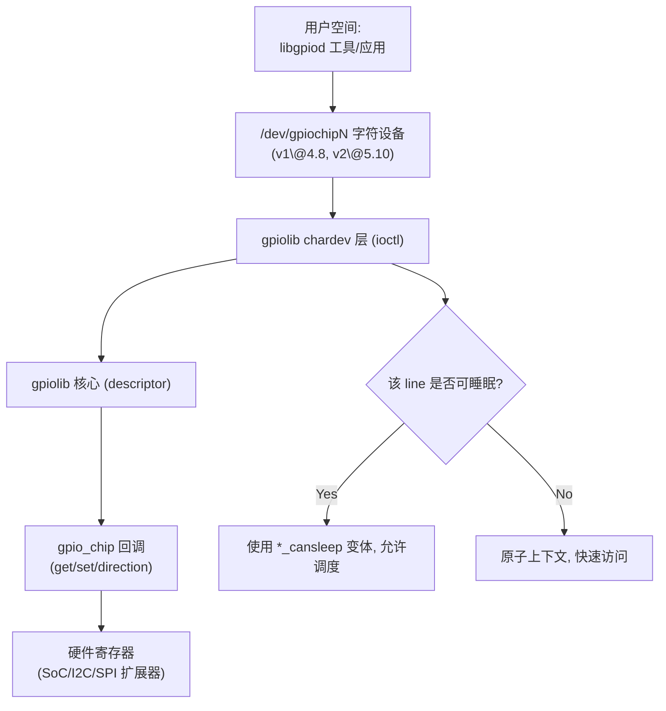
```mermaid
flowchart TD
  A["用户空间: <br/>libgpiod 工具/应用"] --> B["/dev/gpiochipN 字符设备 <br/>(v1\@4.8, v2\@5.10)"]
  B --> C["gpiolib chardev 层 (ioctl)"]
  C --> D["gpiolib 核心 (descriptor)"]
  D --> E["gpio_chip 回调 <br/>(get/set/direction)"]
  E --> F["硬件寄存器 <br/>(SoC/I2C/SPI 扩展器)"]

  C --> G{"该 line 是否可睡眠?"}
  G -->|Yes| H["使用 *_cansleep 变体, 允许调度"]
  G -->|No| I["原子上下文, 快速访问"]
```

### 1.5.2_用户写入到_LED_的时序(sequenceDiagram)

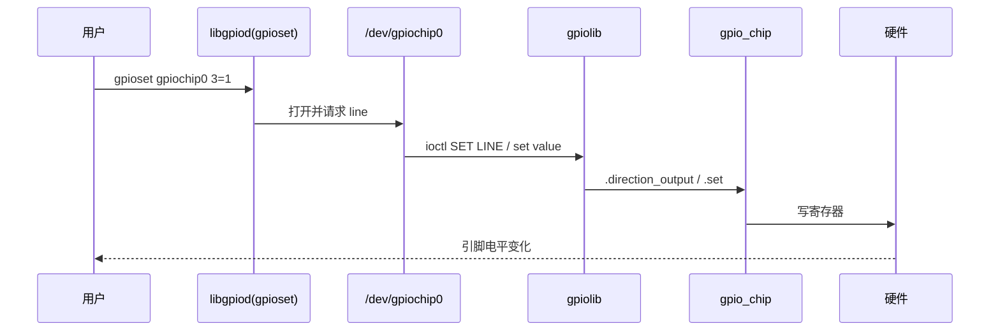
```mermaid
sequenceDiagram
  participant U as 用户
  participant T as libgpiod(gpioset)
  participant D as /dev/gpiochip0
  participant GL as gpiolib
  participant GC as gpio_chip
  participant HW as 硬件

  U->>T: gpioset gpiochip0 3=1
  T->>D: 打开并请求 line
  D->>GL: ioctl SET LINE / set value
  GL->>GC: .direction_output / .set
  GC->>HW: 写寄存器
  HW-->>U: 引脚电平变化
```

> 注：Mermaid 用**通用语法**、节点文本全部加引号，分支为 **Yes/No**。

------

## 1.6_示例代码(最小可用)

### 1.6.1_内核_Consumer(仅演示_描述符_API_用法)

```c
// demo_gpiod_consumer.c — 6.x 最小消费示例（仅演示关键路径）
#include <linux/module.h>
#include <linux/gpio/consumer.h>

static struct gpio_desc *led;

static int __init demo_init(void)
{
    /* 真实驱动应使用 devm_gpiod_get(dev,"status",GPIOD_OUT_LOW)
     * 下面仅为演示：全局查找，便于快速移植示例
     */
    led = gpiod_get(NULL, "status", GPIOD_OUT_LOW);
    if (IS_ERR(led))
        return PTR_ERR(led);

    /* 如果为低有效，则写 0 代表点亮；此处仅示意 */
    gpiod_set_value_cansleep(led, 1);
    pr_info("gpiod demo: status=1\n");
    return 0;
}
static void __exit demo_exit(void)
{
    gpiod_set_value_cansleep(led, 0);
    gpiod_put(led);
}
module_init(demo_init);
module_exit(demo_exit);
MODULE_LICENSE("GPL");
```

> **要点**：
>
> * 仅使用 `gpiod_*` 描述符 API；
> * 依据可睡眠属性选择 `_cansleep` 变体。([git.ti.com](https://git.ti.com/cgit/ti-linux-kernel/ti-linux-kernel/tree/Documentation/gpio/consumer.txt?h=linux-3.14.y&utm_source=chatgpt.com))

### 1.6.2_用户态(libgpiod_C_API_一读一写)

```c
// u_gpiod_basic.c — 通过字符设备 ABI 读/写一根线（v2 自 5.10 起）
#include <gpiod.h>
#include <stdio.h>
int main(void) {
    struct gpiod_chip *chip = gpiod_chip_open_by_name("gpiochip0");
    struct gpiod_line *line = gpiod_chip_get_line(chip, 3);
    gpiod_line_request_output(line, "u_gpiod_basic", 1); // 置 1
    printf("line3=%d\n", gpiod_line_get_value(line));
    gpiod_line_set_value(line, 0); // 再置 0
    gpiod_line_release(line);
    gpiod_chip_close(chip);
    return 0;
}
```

> **要点**：
>
> * 用户态走字符设备 + libgpiod；
> * **v2 ABI first added in 5.10**。([docs.kernel.org](https://docs.kernel.org/userspace-api/gpio/chardev.html?utm_source=chatgpt.com))

------

## 1.7_调试与验证

1. **字符设备/工具链自检**

   ```shell
   gpiodetect               # 芯片枚举
   gpioinfo gpiochip0       # 线方向/消费方/偏好名
   gpioget gpiochip0 3      # 读取
   gpioset gpiochip0 3=1    # 置 1（注意进程持有语义）
   gpiomon gpiochip0 3      # 事件监听
   ```

   > 工具与用法以 libgpiod 文档为准。([libgpiod.readthedocs.io](https://libgpiod.readthedocs.io/en/latest/gpio_tools.html?utm_source=chatgpt.com))

2. **内核端视图与动态调试**

   ```shell
   sudo mount -t debugfs none /sys/kernel/debug
   sudo cat /sys/kernel/debug/gpio              # 概览所有 gpiochip
   echo 'file drivers/gpio/gpiolib*.c +p' | sudo tee /sys/kernel/debug/dynamic_debug/control
   dmesg -w
   ```

   log示例，tee工具没有下载，所以第三条 shell 命令没有示例：

   ```shell
   ~ # sudo mount -t debugfs none /sys/kernel/debug
   -/bin/sh: sudo: not found

   ~ # mount -t debugfs none /sys/kernel/debug
   ~ # cat /sys/kernel/debug/gpio
   gpiochip0: GPIOs 0-31, parent: platform/209c000.gpio, 209c000.gpio:
    gpio-9   (                    |regulator-sd1-vmmc  ) out hi
    gpio-19  (                    |cd                  ) in  lo IRQ ACTIVE LOW

   gpiochip1: GPIOs 32-63, parent: platform/20a0000.gpio, 20a0000.gpio:

   gpiochip2: GPIOs 64-95, parent: platform/20a4000.gpio, 20a4000.gpio:

   gpiochip3: GPIOs 96-127, parent: platform/20a8000.gpio, 20a8000.gpio:

   gpiochip4: GPIOs 128-159, parent: platform/20ac000.gpio, 20ac000.gpio:
    gpio-130 (                    |regulator-peri-3v3  ) out lo ACTIVE LOW
    gpio-132 (                    |Headphone detection ) in  lo IRQ
    gpio-135 (                    |phy-reset           ) out hi
    gpio-136 (                    |phy-reset           ) out hi
   ~ #
   ```


3. **常见问题清单（按时间线给出定位方向）**

- **“/sys/class/gpio 不可用/功能缺失”**：

  - 不是 bug——**已弃用**，新项目应改用字符设备 ABI（4.8 起有、5.10 起 v2）。([kernel.org](https://www.kernel.org/doc/html/next/admin-guide/gpio/sysfs.html?utm_source=chatgpt.com))


- **`gpioset` 状态“自动复原”**：

  - line 的输出状态通常随**请求持有期**而维持，进程退出则不再保证；

  - 参考工具手册的说明（可用超时/交互模式/守护方式）。([manpages.debian.org](https://manpages.debian.org/experimental/gpiod/gpioset.1.en.html?utm_source=chatgpt.com))


- **驱动仍用 `gpio_\*`**：

  - 请迁移至 `gpiod_*` 描述符（kernel 3.14 文档已建议）。([git.ti.com](https://git.ti.com/cgit/ti-linux-kernel/ti-linux-kernel/tree/Documentation/gpio/consumer.txt?h=linux-3.14.y&utm_source=chatgpt.com))


------

## 1.8_小结

### 1.8.1_对比表_历史接口_vs_今天的推荐实践

| 维度       | 旧 sysfs `/sys/class/gpio`（2.6 时代兴起） | **字符设备 `/dev/gpiochipN`（4.8 引入，5.10 起 v2，推荐）** |
| ---------- | ------------------------------------------ | ----------------------------------------------------------- |
| 官方状态   | **Deprecated**（仅维护）                   | **方向明确**，持续演进                                      |
| 用户态工具 | `echo/cat`                                 | **libgpiod** 工具与 C API                                   |
| 事件/多路  | 能力有限                                   | line request / event / 批量                                 |
| 未来保障   | 逐步退出                                   | **主线方向**                                                |

> **一句话总结**：**按时间线**看，GPIO 的正确姿势已从“sysfs + `gpio_*`”演进为“**字符设备 + libgpiod**（用户态）与 **`gpiod_\*` 描述符**（内核态）”（kernel 3.14 文档已建议）；到 6.1 时代，这条路线已是事实标准。([kernel.org](https://www.kernel.org/doc/html/next/admin-guide/gpio/sysfs.html?utm_source=chatgpt.com))

------

### 1.8.2_参考资料

| 内容                                               | 说明                                                         |
| -------------------------------------------------- | ------------------------------------------------------------ |
| **GPIO Sysfs（已废弃）**                           | 官方管理员指南页面。([kernel.org](https://www.kernel.org/doc/html/next/admin-guide/gpio/sysfs.html?utm_source=chatgpt.com)) |
| **GPIO 字符设备 ABI（v2，5.10 起）**               | 官方 userspace-API 文档。([docs.kernel.org](https://docs.kernel.org/userspace-api/gpio/chardev.html?utm_source=chatgpt.com)) |
| **GPIO Descriptor Consumer Interface（驱动消费）** | 官方驱动 API 文档。([docs.kernel.org](https://docs.kernel.org/driver-api/gpio/consumer.html?utm_source=chatgpt.com)) |
| **早期 3.14 文档（描述符 vs 整数接口）**           | TI 维护的 3.14 文档副本。([git.ti.com](https://git.ti.com/cgit/ti-linux-kernel/ti-linux-kernel/tree/Documentation/gpio/consumer.txt?h=linux-3.14.y&utm_source=chatgpt.com)) |
| **libgpiod 工具手册**                              | 命令及用法。([libgpiod.readthedocs.io](https://libgpiod.readthedocs.io/en/latest/gpio_tools.html?utm_source=chatgpt.com)) |


# 第2章_设备树中的_GPIO_基础语义

## 2.1_主题引入

**本章要解决的问题**：

* 如何在 DeviceTree（DT）中**准确描述** GPIO 控制器（Provider）与使用 GPIO 的外设（Consumer），并让内核在启动时把 DT 信息正确映射到 **gpiolib 描述符 API** 与 **字符设备 ABI**？


**为什么重要**：

* DT 是 SoC/板级适配的“事实来源”。引脚一旦选错或 flags 配置不当，后续驱动即使写对了也无效；
* 同时，**迁移/换脚**几乎都发生在 DT 层，不应在驱动里硬编码。


------

## 2.2_数据结构视角(DT_基本语义)

### 2.2.1_Provider_侧常用属性(GPIO_控制器节点)

- `gpio-controller`：布尔属性，声明该节点是一个 GPIO 控制器。
- `#gpio-cells = <2>`：GPIO 说明符（specifier）单元数。**通用为 2**：`<pin flags>`。
  - `pin`：该控制器内部的**偏移号**（从 0 开始）。
  - `flags`：位掩码（见 2.2.3），如 `GPIO_ACTIVE_LOW/OPEN_DRAIN/PULL_UP` 等。
- `gpio-ranges`（可选）：把本控制器的 GPIO 号段映射到 **pinctrl** 的管脚号段，用于 pinctrl 与 gpiolib 的一致性。
- `gpio-line-names`（可选）：为每根线命名，`gpioinfo` 会显示，便于调试。
- **若本 GPIO 控制器还能充当中断控制器**：
  - `interrupt-controller`、`#interrupt-cells = <2>`（多见 `<hwirq type>`），以及连接父中断域的 `interrupts`/`interrupt-parent`。
  - 注意：**GIC 之类顶层中断控制器**常用 `#interrupt-cells = <3>`（编号/类型/触发），与 GPIO 控制器的 2 cells **语义层级不同**。

> 设计提醒：控制器驱动注册使用 `struct gpio_chip`/`devm_gpiochip_add_data()`；若带中断，在 `gpio_chip.irq` 内填好 `struct gpio_irq_chip`，一次性与 irqdomain 装配。


### 2.2.2_Consumer_侧约定(外设节点如何引用_GPIO)

- **通用书写**：`<name>-gpios = <&chip pin flags>;`
  - 例如：`reset-gpios`、`enable-gpios`、`cs-gpios`、`status-gpios` 等。

    ```dts
    &fec1 {
    	pinctrl-names = "default";
    	pinctrl-0 = <&pinctrl_enet1
    				 &pinctrl_enet1_reset>;	// 添加复位控制引脚

    	phy-reset-gpios = <&gpio5 7 GPIO_ACTIVE_LOW>;		// phy-reset-gpios
    	...
    };

    spi-4 {
        compatible = "spi-gpio";
        pinctrl-names = "default";
        pinctrl-0 = <&pinctrl_spi4>;
        status = "disabled";
        gpio-sck = <&gpio5 11 0>;						   // gpio-sck
        gpio-mosi = <&gpio5 10 0>;						   // gpio-mosi
        cs-gpios = <&gpio5 7 GPIO_ACTIVE_LOW>;				// cs-gpios
        num-chipselects = <1>;
        #address-cells = <1>;
        #size-cells = <0>;

        gpio_spi: gpio@0 {
            compatible = "fairchild,74hc595";
            gpio-controller;
            #gpio-cells = <2>;
            reg = <0>;
            registers-number = <1>;
            registers-default = /bits/ 8 <0x57>;
            spi-max-frequency = <100000>;
            enable-gpios = <&gpio5 8 GPIO_ACTIVE_LOW>; 		// enable-gpios
        };
    };
    ```

  - 在驱动里以 `devm_gpiod_get(dev, "reset", ...)` 等方式取到 [struct gpio_desc](#16.3_struct_gpio_desc)。


- **标准子系统**：

  - `gpio-leds`：`leds { foo { gpios = <...>; default-state = "on/off"; }; }`

  - `gpio-keys`：按键 `debounce-interval`、中断/轮询等。

  - `regulator`/`mmc`/`spi` 等均有各自 binding 里定义的 `*-gpios` 属性名。


### 2.2.3_flags_常用取值(来自_dt-bindings/gpio/gpio.h)

- **极性**：`GPIO_ACTIVE_HIGH`（默认） / `GPIO_ACTIVE_LOW`。
- **电气属性**：`GPIO_OPEN_DRAIN`、`GPIO_OPEN_SOURCE`、`GPIO_PULL_UP`、`GPIO_PULL_DOWN`（是否生效取决于控制器/引脚是否支持，通过 pinctrl/pinconf 更可靠）。
- **方向/默认值**：不在 flags 中表达，**用 pinctrl 配置**或消费者驱动中通过 `GPIOD_OUT_LOW/HIGH`、`gpiod_direction_*()` 设定。

> 时间线注记：DT 基本语义在 **3.x–4.x** 即已稳定；到 **6.1** 时代更多是 binding 细化与新控制器补充。


------

## 2.3_开发者视角(如何写/改)

### 2.3.1_最小控制器节点(演示)

```dts
mygpio: gpio-controller@40000000 {
    compatible = "leaf,mygpio-mmio";     // 与驱动匹配的标识符（驱动匹配表 of_device_id 使用该字符串）
    reg = <0x40000000 0x1000>;           // 控制器的寄存器映射区：起始地址 0x40000000，大小 0x1000 字节

    gpio-controller;                     // 声明该节点为 GPIO 控制器（提供 GPIO 资源）
    #gpio-cells = <2>;                   // 表示消费者引用时参数个数为 2，格式为 <pin flags>
                                         // 第一个参数是 GPIO 引脚偏移号（offset）
                                         // 第二个参数是 GPIO 标志，如 GPIO_ACTIVE_LOW、GPIO_PULL_UP 等

    gpio-line-names = "LED0", "LED1", "BTN0", "BTN1"; // 为每个 GPIO 引脚定义名称（便于调试和 sysfs 显示）
                                                      // 名称顺序与引脚编号顺序一致，数量应等于 GPIO 总数
                                                      // 这里的引脚和gpio-ranges属性映射的引脚数量和位置相互照应。

    // 如果该 GPIO 控制器可以产生中断（支持级联到上级中断控制器）
    // interrupt-controller;              				// 声明该节点本身也是中断控制器
    // #interrupt-cells = <2>;            				// 指定中断参数个数（通常为 <hwirq type>）
    // interrupts = <GIC_SPI 116 IRQ_TYPE_LEVEL_HIGH>;   // 若该控制器挂在更上层的 GIC 控制器，则定义其输入中断号
    // interrupt-parent = <&gic>;         // 指定父级中断控制器为 GIC（ARM Generic Interrupt Controller）

    // 若需要将 GPIO 与 pinctrl 引脚建立映射，可定义 gpio-ranges 属性
    // gpio-ranges = <&pinctrl 0 100 16>; 	// 表示：将 pinctrl 控制器中编号 100~115 的引脚
                                         	// 映射为本 GPIO 控制器的 0~15 号 GPIO 引脚
};
```

### 2.3.2_最小消费节点(两种典型方式)

**A. 用通用子系统（gpio-leds）**

```dts
leds {
    compatible = "gpio-leds";

    status_led: status {
        label = "status:green";
        gpios = <&mygpio 3 GPIO_ACTIVE_LOW>;
        default-state = "off";
    };
};
```

**B. 在自有设备节点里用 `<name>-gpios`**

```dts
mydev@0 {
    compatible = "leaf,mydev";
    status-gpios = <&mygpio 3 GPIO_ACTIVE_LOW>;   // 驱动里 devm_gpiod_get(dev,"status",...)
    reset-gpios  = <&mygpio 7 GPIO_ACTIVE_HIGH>;
    /* … */
};
```

### 2.3.3_pinctrl_绑定与_换脚_操作要点

**核心原则**：**引脚复用（mux）与电气（pull/drive）应在 pinctrl 中描述；GPIO 控制/状态在 gpiolib/驱动中完成。换脚时先改 pinctrl**，再确保 `*-gpios` 的 `<&chip pin flags>` 与之对应。

**i.MX6ULL 示例（IOMUXC）**

```dts
/* 1) pinctrl: 选择 PAD 复用为 GPIO，并设置上拉/驱动等 */
&pinctrl {
    pinctrl_led: ledgrp {
        fsl,pins = <
            MX6UL_PAD_GPIO1_IO03__GPIO1_IO03  0x10B0   // 复用为GPIO, 上拉/速度见 SoC 手册
        >;
    };
};

/* 2) consumer: 指向 &gpio1 偏移 3，并与 pinctrl-0 对齐 */
leds {
    compatible = "gpio-leds";
    pinctrl-names = "default";
    pinctrl-0 = <&pinctrl_led>;

    led0 {
        gpios = <&gpio1 3 GPIO_ACTIVE_LOW>;
        default-state = "off";
    };
};
```

**RK356x 示例（rockchip,pinctrl）**

```dts
&pinctrl {
    led0: led0 {
        rockchip,pins = <0 RK_PA3 RK_FUNC_GPIO &pcfg_pull_none>; // GPIO0_A3
    };
};

leds {
    compatible = "gpio-leds";
    pinctrl-names = "default";
    pinctrl-0 = <&led0>;

    led0 {
        gpios = <&gpio0 RK_PA3 GPIO_ACTIVE_LOW>;  // 与 pinctrl 一致
        default-state = "off";
    };
};
```

> 实务建议：**换脚**时先在 pinctrl 修改到新 PAD/管脚，再把 `<chip, pin>` 对应到新偏移；避免只改 `gpios` 却忘了更新 pinmux，导致“方向/电平操作都正常但硬件没反应”。

### 2.3.4_gpio-hog_上电即固定占用的线

```dts
&gpio1 {
    gpio-hog;
    hog_reset: reset_hold {
        gpios = <3 GPIO_ACTIVE_LOW>;
        output-high;           // 上电后立即输出 1（结合极性决定真实电平）
        line-name = "hold-reset";
    };
};
```

> 典型用于 **电源保持/强制复位** 等不需要驱动参与的场景。行为在早期内核已可用，6.x 仍按此语义。


------

### 2.3.5_小节_通过_devres_接口获取设备树中的_GPIO_属性

本节说明如何使用 **devm_gpiod_get\*** 系列接口读取设备树中定义的 GPIO 属性。示例基于以下节点：

```dts
mydev@0 {
    compatible = "leaf,mydev";
    status-gpios = <&mygpio 3 GPIO_ACTIVE_LOW>;
    reset-gpios  = <&mygpio 7 GPIO_ACTIVE_HIGH>;
    gpio-led     = <&gpio1 1 0>;
};
```

------

#### (1)_标准写法(推荐方式)

在设备树中，GPIO 属性通常以 `<names>-gpios` 命名。
 推荐将属性写成如下格式：

```dts
mydev@0 {
    led-gpios = <&gpio1 1 GPIO_ACTIVE_HIGH>;
};
```

驱动侧使用标准接口读取：

```c
#include <linux/gpio/consumer.h>

struct gpio_desc *led;

/* 根据 "led" 前缀匹配 led-gpios 属性 */
led = devm_gpiod_get(dev, "led", GPIOD_OUT_LOW);
if (IS_ERR(led))
    return dev_err_probe(dev, PTR_ERR(led), "get led-gpios failed\n");

/* 控制输出 */
gpiod_set_value_cansleep(led, 1);
gpiod_set_value_cansleep(led, 0);
```

##### 1)_说明

- `devm_gpiod_get()` 与 `devm_gpiod_get_optional()` 均由 **devres** 管理；
   驱动卸载或 probe 失败时自动释放资源。
- `"led"` 对应属性名 `led-gpios` 的前缀部分。
- 第 3 个参数定义方向和默认电平，如：
  - `GPIOD_OUT_LOW`：输出低电平；
  - `GPIOD_IN`：输入；
  - `GPIOD_ASIS`：保持默认方向。

------

#### (2)_非标准属性名(无法使用_*-gpios)

若设备树中属性名为 **`gpio-led`**，
 则标准接口无法识别该命名方式。此时应使用：

```c
#include <linux/gpio/consumer.h>
#include <linux/of.h>

struct gpio_desc *led;

if (!dev->of_node)
    return -ENODEV;

led = devm_gpiod_get_from_of_node(dev, dev->of_node,
                                  "gpio-led", 0, GPIOD_OUT_LOW, "led");
if (IS_ERR(led))
    return dev_err_probe(dev, PTR_ERR(led), "get gpio-led failed\n");

gpiod_set_value_cansleep(led, 1);
```

##### 1)_说明

- `devm_gpiod_get_from_of_node()`
   允许显式指定属性名，无需遵循 “`*-gpios`” 命名规则。
- 参数含义：
  - `dev->of_node`：设备节点；
  - `"gpio-led"`：属性名；
  - `0`：索引（第几个 GPIO）；
  - `GPIOD_OUT_LOW`：配置方向；
  - `"led"`：日志标签（label）。

------

#### (3)_多_GPIO_组(带索引的读取)

若同一前缀对应多路 GPIO，可使用带索引的接口：

```dts
mydev@0 {
    led-gpios = <&gpio1 1 GPIO_ACTIVE_HIGH>,
                <&gpio1 2 GPIO_ACTIVE_LOW>;
};
struct gpio_desc *led0, *led1;

led0 = devm_gpiod_get_index(dev, "led", 0, GPIOD_OUT_LOW);
led1 = devm_gpiod_get_index(dev, "led", 1, GPIOD_OUT_LOW);
```

##### 1)_说明

- `devm_gpiod_get_index()` 允许按序号获取 `led-gpios` 中的多个条目；
- 适合多路 LED、复数控制信号等场景。

------

#### (4)_gpios_标准但是无名称属性获取

设备树代码示例：

```dts
// 新增LED节点：dt_led
dt_led: led@0 {
    compatible = "nxp,imx6ull-dt-led"; // 与驱动匹配的compatible属性
    status = "okay";                  // 启用该节点
    gpios = <&gpio1 3 GPIO_ACTIVE_LOW>;// 引用GPIO1_IO03，低电平点亮
    pinctrl-names = "default";        // 引脚配置名称（与pinctrl-0对应）
    pinctrl-0 = <&pinctrl_dt_led>;    // 关联上述引脚复用配置组
};
```

> 这里的设备树示例只采用了gpios属性，无\<names\>-gpios 属性，但是它是标准命名，因此采用devres接口时，names = NULL。

c源码示例：

```c
// 获取GPIO资源
// devm_gpiod_get: 自动管理gpio资源，无需手动释放
// 第二个参数NULL：匹配设备树"gpios"属性（无名称时）
// GPIOD_OUT_LOW：默认输出低电平（熄灭，因GPIO_ACTIVE_LOW实际为高电平）
led_dev.gpiod = devm_gpiod_get(dev, NULL, GPIOD_OUT_LOW);
if (IS_ERR(led_dev.gpiod)) {
    dev_err(dev, "devm_gpiod_get failed\n");
    ret = PTR_ERR(led_dev.gpiod);
    goto err_get_gpio;
}
dev_info(dev, "LED GPIO acquired\n");
return 0;
```


#### (5)_小结

| 使用场景                  | 推荐接口                                           | 属性命名示例               | 备注                          |
| ------------------------- | -------------------------------------------------- | -------------------------- | ----------------------------- |
| 标准 `<names>-gpios` 属性 | `devm_gpiod_get()` / `devm_gpiod_get_optional()`   | `led-gpios`、`reset-gpios` | 最常见、最简洁                |
| 自定义属性名              | `devm_gpiod_get_from_of_node()`                    | `gpio-led`、`gpio-status`  | 可显式指定属性名              |
| 多路 GPIO                 | `devm_gpiod_get_index()`                           | `led-gpios = <...>, <...>` | 支持多引脚数组                |
| 标准 `gpios` 属性         | `devm_gpiod_get()` / ``devm_gpiod_get_optional()`` | `gpios`                    | devres接口参数 names = NULL。 |

------

#### (6)_最佳实践建议

1. **命名规范化**：优先使用 `*-gpios` 形式，兼容性最佳。
2. **避免手动释放**：统一采用 `devm_` 前缀接口，由设备资源框架自动管理。
3. **可睡眠访问**：若 GPIO 可能位于 I²C/SPI 扩展器上，应使用
    `gpiod_set_value_cansleep()` / `gpiod_get_value_cansleep()`。
4. **诊断日志**：建议使用 `dev_dbg()` / `dev_err_probe()` 输出 GPIO 获取结果。


------

## 2.4_用户视角(他们能看到/怎么验证)

### 2.4.1_从运行系统导出_DT_并检查

```bash
# 导出当前设备树为 dts（需要 root）
sudo dtc -I fs -O dts -o /tmp/running.dts /sys/firmware/devicetree/base

# 或者快速查看某节点
ls -l /proc/device-tree/leds/status
hexdump -C /proc/device-tree/leds/status/gpios
```

### 2.4.2_用_libgpiod_验证_DT_与标注

```bash
gpiodetect
gpioinfo gpiochip0        # 观察 line-name、used by、方向
gpioset gpiochip0 3=0     # 试拉低/拉高匹配 LED 极性
gpioget gpiochip0 3
```

------

## 2.5_可视化图示

**2.5.1 从 DT 到硬件的解析流程（flowchart）**

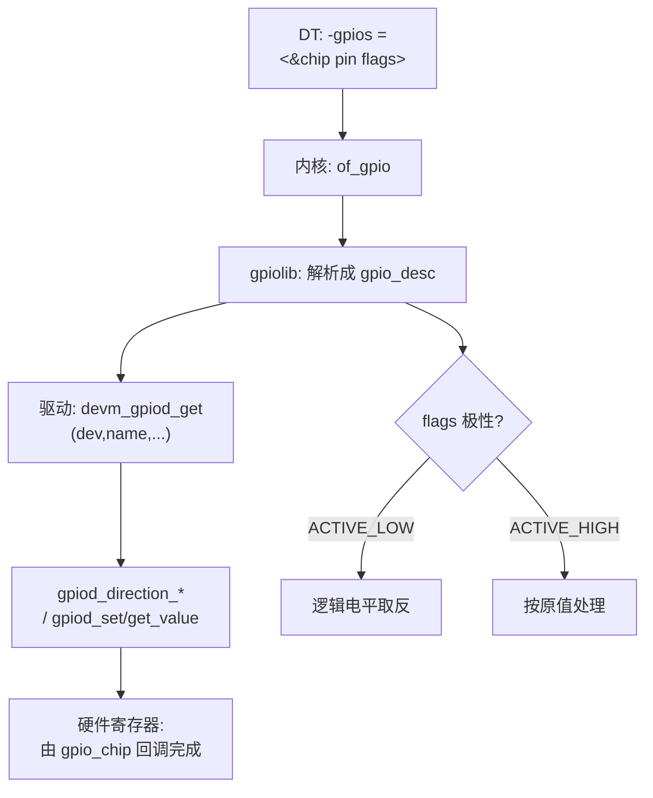
```mermaid
flowchart TD
A[DT: <name>-gpios = <br/><&chip pin flags>] --> B[内核: of_gpio]
B --> C[gpiolib: 解析成 gpio_desc]
C --> D["驱动: devm_gpiod_get<br/>(dev,name,...)"]
D --> E[gpiod_direction_*<br/> / gpiod_set/get_value]
E --> F[硬件寄存器:<br/> 由 gpio_chip 回调完成]

C --> G{flags 极性?}
G -->|ACTIVE_LOW| H[逻辑电平取反]
G -->|ACTIVE_HIGH| I[按原值处理]
```

**2.5.2 “换脚”时序（sequenceDiagram）**

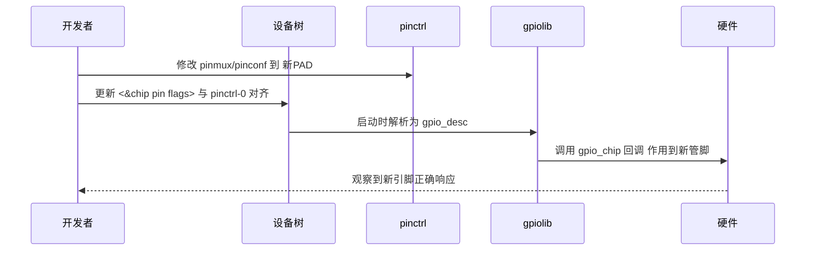
```mermaid
sequenceDiagram
  participant Dev as 开发者
  participant DTS as 设备树
  participant P as pinctrl
  participant GL as gpiolib
  participant HW as 硬件

  Dev->>P: 修改 pinmux/pinconf 到 新PAD
  Dev->>DTS: 更新 <&chip pin flags> 与 pinctrl-0 对齐
  DTS->>GL: 启动时解析为 gpio_desc
  GL->>HW: 调用 gpio_chip 回调 作用到新管脚
  HW-->>Dev: 观察到新引脚正确响应
```


------

## 2.6_调试与验证

1. **常见失败模式与排查**

   * **方向/电平都在变，但硬件没反应**：

     * 十有八九是 **pinctrl 未切到 GPIO 功能** 或复用到别的外设；

     * 核对 `pinctrl-0` 与 `rockchip,fsl` 等 SoC 专有属性。


   * **电平颠倒**：

     * `GPIO_ACTIVE_LOW` 与板上电路极性不匹配；

     * 或 LED 低有效写 1 不亮/写 0 反而亮。


   * **不可睡眠警告**：

     * 硬件访问需要睡眠时，控制器驱动要把 `gc.can_sleep = true`；

     * 消费者使用 `*_cansleep`。


   * **多驱动争用一根 GPIO**：

     * `gpioinfo` 可看到 `consumer` 名；
     * 清理重复的 `gpio-hog` 或错误的 `status = "okay"` 节点。


2. **核查 pinctrl 与 gpiolib 的一致性**

   * i.MX6ULL：`fsl,pins` 中 `__GPIO` 复用是否正确、pad control 值是否合理（上拉/驱动能力）。

   * RK356x：`rockchip,pins` 的 `<bank pin func cfg>` 是否为 `GPIO` 功能、`pcfg_pull_*` 是否匹配电路。


3. **变更后快速自检**

   * 只改了 `*-gpios` 而**没改 pinctrl**：高频坑；务必同时检视两处。
   * 导出运行时 DTS 对比（2.4.1），同时看 `gpioinfo` 与硬件行为。

------

## 2.7_小结

### 2.7.1_要点表

| 主题          | 正确做法                                                    | 备注                                                         |
| ------------- | ----------------------------------------------------------- | ------------------------------------------------------------ |
| Provider 定义 | `gpio-controller` + `#gpio-cells=<2>`                       | 如需中断：加 `interrupt-controller` + `#interrupt-cells=<2>` |
| Consumer 引用 | `<name>-gpios = <&chip pin flags>`                          | 驱动用 `devm_gpiod_get(dev,"name",...)`                      |
| 极性与电气    | `GPIO_ACTIVE_LOW/HIGH`，`OPEN_DRAIN/SOURCE`，`PULL_UP/DOWN` | 电气更建议在 **pinctrl/pinconf** 表达                        |
| 换脚流程      | **先改 pinctrl，再改 <&chip pin>**                          | 保持 pinmux 与 gpiolib 对齐                                  |
| 上电即控      | `gpio-hog`（`input`/`output-high/low`/`line-name`）         | 不需要驱动即可固定一根线                                     |

**一句话总结**：**DT 决定“接哪根脚、怎么接”**，而驱动只关心“用这根脚做什么”；换脚或改电气必须首先在 **pinctrl** 落地，再由 `*-gpios` 精确指向对应 offset 与 flags。


------

# 第3章_pinctrl_/_pinmux_与_GPIO_的关系

## 3.1_主题引入

**本章要解决的问题：**

* 在 SoC 中，为什么同一引脚既能是 UART_TX、SPI_MOSI，又能当作 GPIO？
* pinctrl（pin control）与 gpiolib（GPIO library）如何协作，让驱动层面既能控制引脚复用，又能安全操作 GPIO 电平？


**核心关注点：**

1. **引脚复用（pinmux）**：决定引脚的“功能模式”。
2. **引脚配置（pinconf）**：决定电气属性（上拉、下拉、驱动强度等）。
3. **GPIO 控制（gpiolib）**：在复用为 GPIO 模式后进行方向/电平读写。
4. **状态切换机制**：`default / sleep / idle` 等多状态。
5. **移植与换脚**：修改设备树时如何同步 pinctrl 与 GPIO。

------

## 3.2_数据结构视角(内核架构关系)

### 3.2.1_三层核心结构

在 Linux 内核中，pinctrl 与 GPIO 的关系可以抽象为下图：

```
SoC IOMUX 控制器
 ├── pinctrl driver（硬件复用控制层）
 │    ├── pinmux 子模块（功能选择）
 │    └── pinconf 子模块（电气属性）
 └── gpiolib（GPIO 通用框架）
      └── gpio_chip（每组 GPIO 控制器）
```

> 所有这些模块最终都服务于同一片**引脚（pin）**。
>  pinctrl 决定“引脚当前干什么”，gpiolib 决定“如果是 GPIO，该如何操作”。

------

### 3.2.2_主要数据结构

#### (1)_[struct_pinctrl_desc](#struct_pinctrl_desc)(定义一个_pinctrl_控制器)

`struct pinctrl_desc` 详细定义请参考 （[附录 A/ struct pinctrl_desc](#16.4_struct_pinctrl_desc)）:

```c
struct pinctrl_desc {
    const char 			*name;             	// 控制器名称（如 imx6ul-iomuxc）
    struct pinmux_ops 	*pmxops;        	// 功能复用操作集
    struct pinconf_ops 	*confops;      		// 电气配置操作集
    struct pctlops 		*pctlops;          	// pinctrl 基础操作
    unsigned int 		npins;              // 支持的 pin 数量
    const struct pinctrl_pin_desc *pins;  	// 每个 pin 的描述数组
};
```

#### (2)_[struct_pinctrl_state](#struct_pinctrl_state)(一组_状态设置_如_default/sleep)

```c
/**
 * struct pinctrl_state - 设备的一个 pinctrl 状态
 * @node:   用于挂接到 struct pinctrl 的 @states 链表中的链表节点
 * @name:   此状态的名称
 * @settings: 该状态对应的一组管脚配置（settings）链表
 */
struct pinctrl_state {
    struct list_head 	node;
    const char 		   *name;
    struct list_head 	settings;
};
```

#### (3)_[struct_gpio_chip](#struct_gpio_chip)(GPIO_控制器抽象)

详细定义参考[附录 A / struct gpio_chip](#16.1_struct_gpio_chip)。

与 pinctrl 通过 `gpio-ranges` 绑定：

```c
struct gpio_chip {
    const char *label;
    struct device *parent;
    int (*direction_input)(struct gpio_chip *chip, unsigned offset);
    int (*direction_output)(struct gpio_chip *chip, unsigned offset, int value);
    void (*set)(struct gpio_chip *chip, unsigned offset, int value);
    int  (*get)(struct gpio_chip *chip, unsigned offset);
    unsigned int ngpio;
    struct list_head list;
};
```

> 通过 `gpiochip_add_pin_range()` 或 DT 的 `gpio-ranges` 将 pinctrl 与 gpiolib 对齐。

------

### 3.2.3_设备树绑定关系

设备树中 `pinctrl` 节点通常定义在 SoC 的 IOMUX 控制器下：

```dts
&pinctrl {
    pinctrl_led: ledgrp {
        fsl,pins = <
            MX6UL_PAD_GPIO1_IO03__GPIO1_IO03 0x10B0
        >;
    };
};
```

**字段说明**

| 字段                               | 含义                                                  |
| ---------------------------------- | ----------------------------------------------------- |
| `MX6UL_PAD_GPIO1_IO03__GPIO1_IO03` | 管脚复用为 GPIO1_IO03 功能                            |
| `0x10B0`                           | pad control 电气配置（上拉、速度、驱动强度等）        |
| `pinctrl_led`                      | 状态标签，可在外设节点中 `pinctrl-0 = <&pinctrl_led>` |

**消费者节点引用：**

```dts
leds {
    compatible = "gpio-leds";
    pinctrl-names = "default";
    pinctrl-0 = <&pinctrl_led>;   // 激活 default 状态
    led0 {
        gpios = <&gpio1 3 GPIO_ACTIVE_LOW>;
        default-state = "off";
    };
};
```

讲解下这里的设备树属性映射关系：

#### (1)_pinctrl-names_与_pinctrl-N_属性

在设备树中，pinctrl-names 与 pinctrl-N 个数是一一对应的。如果没有形成一一映射关系，就说明驱动中不会用到缺乏定义的 pinctrl-N，并且是个残缺的设备树定义。

* **pinctrl-names**：

  * 是一个字符串或者字符串数组，它代表着为每一个 pinctrl-N 取名字。因此它是一个数组属性，在devres接口中需要表示取 names 的坐标。
  * 这些名字表示设备的gpio引脚的配置属性所表示的设备状态，如 sleep，active，speed，default等。

* **pinctrl-N**：

  * 根据绑定的 iomuxc的 pinctrl 状态绑定个数来取名字。因此它是一个数组属性，在devres接口中需要表示取 N 的坐标。
  * 它的 N 表示 0~N。这里的 N 还有层含义是指和 pinctrl-names 的第几个字符串绑定的意思。

  ```dts
  &usdhc1 {
  	pinctrl-names = "default", "state_100mhz", "state_200mhz";	// 对应pinctrl-N

  	pinctrl-0 = <&pinctrl_usdhc1>;							  // 对应pinctrl-names
  	pinctrl-1 = <&pinctrl_usdhc1_100mhz>;
  	pinctrl-2 = <&pinctrl_usdhc1_200mhz>;

  	cd-gpios = <&gpio1 19 GPIO_ACTIVE_LOW>;
  	keep-power-in-suspend;
  	wakeup-source;
  	vmmc-supply = <&reg_sd1_vmmc>;
  	status = "okay";
  };

  &iomuxc {
  	...
      pinctrl_usdhc1: usdhc1grp {
          fsl,pins = <
              MX6UL_PAD_SD1_CMD__USDHC1_CMD     	0x17059
              MX6UL_PAD_SD1_CLK__USDHC1_CLK		0x10071
              MX6UL_PAD_SD1_DATA0__USDHC1_DATA0 	0x17059
              MX6UL_PAD_SD1_DATA1__USDHC1_DATA1 	0x17059
              MX6UL_PAD_SD1_DATA2__USDHC1_DATA2 	0x17059
              MX6UL_PAD_SD1_DATA3__USDHC1_DATA3 	0x17059
              MX6UL_PAD_UART1_RTS_B__GPIO1_IO19       0x17059 /* SD1 CD */
              MX6UL_PAD_GPIO1_IO05__USDHC1_VSELECT    0x17059 /* SD1 VSELECT */
              MX6UL_PAD_GPIO1_IO09__GPIO1_IO09        0x17059 /* SD1 RESET */
          >;
      };

      pinctrl_usdhc1_100mhz: usdhc1grp100mhz {
          fsl,pins = <
              MX6UL_PAD_SD1_CMD__USDHC1_CMD     0x170b9
              MX6UL_PAD_SD1_CLK__USDHC1_CLK     0x100b9
              MX6UL_PAD_SD1_DATA0__USDHC1_DATA0 0x170b9
              MX6UL_PAD_SD1_DATA1__USDHC1_DATA1 0x170b9
              MX6UL_PAD_SD1_DATA2__USDHC1_DATA2 0x170b9
              MX6UL_PAD_SD1_DATA3__USDHC1_DATA3 0x170b9

          >;
      };

      pinctrl_usdhc1_200mhz: usdhc1grp200mhz {
          fsl,pins = <
              MX6UL_PAD_SD1_CMD__USDHC1_CMD     0x170f9
              MX6UL_PAD_SD1_CLK__USDHC1_CLK     0x100f9
              MX6UL_PAD_SD1_DATA0__USDHC1_DATA0 0x170f9
              MX6UL_PAD_SD1_DATA1__USDHC1_DATA1 0x170f9
              MX6UL_PAD_SD1_DATA2__USDHC1_DATA2 0x170f9
              MX6UL_PAD_SD1_DATA3__USDHC1_DATA3 0x170f9
          >;
      };
  };
  ```


------

## 3.3_开发者视角(如何正确协同)

本小节主讲：

* 设备树中 pinctrl 的基本写法；
* 驱动中如何获取对应的 pinctrl；
* 多 pinctrl 的示例；

### 3.3.1_编写_pinctrl_节点的基本步骤

1. **查 SoC IOMUX 表**：确定目标 PAD。
2. **定义 pinctrl 子节点**：在 pinctrl 控制器下编写 `default/sleep` 等状态。
3. **在外设节点声明**：`pinctrl-names` 与 `pinctrl-0/1`。
4. **核对一致性**：pinmux 选择的 PAD 必须与 `*-gpios = <&chip pin flags>` 指向的 pin 一致。

**示例：IMX6ULL 使用 GPIO1_IO03 控制 LED**

```dts
&pinctrl {
    pinctrl_led: ledgrp {
        fsl,pins = <
            MX6UL_PAD_GPIO1_IO03__GPIO1_IO03 0x10B0
        >;
    };
};

leds {
    compatible = "gpio-leds";
    pinctrl-names = "default";
    pinctrl-0 = <&pinctrl_led>;
    led0 {
        gpios = <&gpio1 3 GPIO_ACTIVE_LOW>;
        default-state = "off";
    };
};
```


### 3.3.2_驱动中调用_pinctrl_API(最小模式)

```c
struct pinctrl *pinctrl;
struct pinctrl_state *state;

pinctrl = devm_pinctrl_get(&pdev->dev);
if (IS_ERR(pinctrl))
    return PTR_ERR(pinctrl);

state = pinctrl_lookup_state(pinctrl, "default");
if (!IS_ERR(state))
    pinctrl_select_state(pinctrl, state);
```

> `devm_pinctrl_get()`：自动解析 `pinctrl-names`。
>  `pinctrl_select_state()`：在 default/sleep 等状态间切换。

------

### 3.3.3_多状态切换示例(DT_+_驱动)

**DT：**

```dts
&pinctrl {
    uart_pins_default: uartgrp {
        fsl,pins = <
            MX6UL_PAD_UART1_TX_DATA__UART1_DCE_TX 0x1b0b1
            MX6UL_PAD_UART1_RX_DATA__UART1_DCE_RX 0x1b0b1
        >;
    };

    uart_pins_sleep: uartgrp_sleep {
        fsl,pins = <
            MX6UL_PAD_UART1_TX_DATA__GPIO1_IO16 0x1b0b0
            MX6UL_PAD_UART1_RX_DATA__GPIO1_IO17 0x1b0b0
        >;
    };
};
```

**驱动：**

```c
pinctrl_select_state(pinctrl, pinctrl_lookup_state(pinctrl, "default"));
/* ... 运行期 ... */
pinctrl_select_state(pinctrl, pinctrl_lookup_state(pinctrl, "sleep"));
```

> 休眠时可切换为 GPIO 并拉到安全电平，避免误动作。

------

### 3.3.4_GPIO_与_pinctrl_的依赖关系

| 项目                      | 由谁负责       | 生效阶段       |
| ------------------------- | -------------- | -------------- |
| 复用为 GPIO 功能          | pinctrl/pinmux | 设备初始化     |
| 电气特性（上拉/驱动能力） | pinconf        | 初始化阶段     |
| 电平读写                  | gpiolib        | 运行阶段       |
| 休眠态切换                | pinctrl 状态机 | suspend/resume |

------

## 3.4_实战_最小可运行驱动(pinctrl_+_gpiod_+_PM_+_sysfs)

### 3.4.1_DTS

```dts
/* 1) IOMUX/pinctrl：把目标 PAD 复用为 GPIO，并配置电气 */
&pinctrl {
    pinctrl_mydev_default: mydev_default {
        /* 示例：i.MX6ULL，把具体 PAD 与 padcfg 换成你的板级参数 */
        fsl,pins = <
            MX6UL_PAD_GPIO1_IO03__GPIO1_IO03 0x10B0
        >;
    };
    pinctrl_mydev_sleep: mydev_sleep {
        /* 休眠态的低功耗/安全配置（示例值） */
        fsl,pins = <
            MX6UL_PAD_GPIO1_IO03__GPIO1_IO03 0x10A0
        >;
    };
};

/* 2) Consumer：功能语义节点名，避免与标准属性同名的 label */
mydev@0 {
    compatible = "leaf,mydev-demo";
    pinctrl-names = "default", "sleep";
    pinctrl-0 = <&pinctrl_mydev_default>;
    pinctrl-1 = <&pinctrl_mydev_sleep>;

    /* 驱动里用 devm_gpiod_get(dev,"status",...) 获取 */
    status-gpios = <&gpio1 3 GPIO_ACTIVE_LOW>;

    /* 可选：上电默认逻辑态（0=灭 1=亮），驱动读取为初值 */
    led-default = <0>;
    status = "okay";
};
```

### 3.4.2_驱动源码(Linux_6.x_可编_逻辑闭环)

```c
// drivers/misc/leaf_pinctrl_gpiod_demo.c
// SPDX-License-Identifier: GPL-2.0
#include <linux/module.h>
#include <linux/platform_device.h>
#include <linux/of.h>
#include <linux/gpio/consumer.h>
#include <linux/pinctrl/consumer.h>
#include <linux/pm.h>
#include <linux/sysfs.h>

struct mydev {
    struct device        *dev;
    struct pinctrl       *pctl;
    struct pinctrl_state *st_default;
    struct pinctrl_state *st_sleep;
    struct gpio_desc     *status;     /* status-gpios 描述符 */
    bool                  active_low; /* gpiod_is_active_low() */
    int                   logical_on; /* 逻辑态：0/1（抽象亮/灭） */
};

static int __mydev_apply_logic(struct mydev *m, int on)
{
    int level = m->active_low ? !on : on;
    int ret;

    if (gpiod_cansleep(m->status)) {
        ret = gpiod_set_value_cansleep(m->status, level);
    } else {
        gpiod_set_value(m->status, level);
        ret = 0;
    }

    if (!ret)
        m->logical_on = on;
    return ret;
}

/* /sys/.../led: 读 0/1，写 0/1 控制逻辑态 */
static ssize_t led_show(struct device *dev, struct device_attribute *a, char *buf)
{
    struct mydev *m = dev_get_drvdata(dev);
    int val = gpiod_get_value_cansleep(m->status);
    if (val < 0) val = m->active_low ? !m->logical_on : m->logical_on; /* 回退上次态 */
    val = m->active_low ? !val : val;
    return sysfs_emit(buf, "%d\n", val);
}

static ssize_t led_store(struct device *dev, struct device_attribute *a,
                         const char *buf, size_t count)
{
    struct mydev *m = dev_get_drvdata(dev);
    int on;
    if (kstrtoint(buf, 0, &on) || (on != 0 && on != 1))
        return -EINVAL;
    if (__mydev_apply_logic(m, on))
        return -EIO;
    return count;
}
static DEVICE_ATTR_RW(led);

static void mydev_select_state(struct mydev *m, struct pinctrl_state *st)
{
    if (!IS_ERR_OR_NULL(st))
        pinctrl_select_state(m->pctl, st);
}

static int mydev_probe(struct platform_device *pdev)
{
    struct device *dev = &pdev->dev;
    struct mydev *m;
    int ret, def = 0;

    m = devm_kzalloc(dev, sizeof(*m), GFP_KERNEL);
    if (!m)
        return -ENOMEM;

    m->dev = dev;
    platform_set_drvdata(pdev, m);

    /* 1) pinctrl 获取与切到 default */
    m->pctl = devm_pinctrl_get(dev);
    if (IS_ERR(m->pctl))
        return PTR_ERR(m->pctl);

    m->st_default = pinctrl_lookup_state(m->pctl, "default");
    m->st_sleep   = pinctrl_lookup_state(m->pctl, "sleep");  /* 可能不存在 */
    mydev_select_state(m, m->st_default);

    /* 2) 获取 GPIO 描述符（输出口，默认安全值） */
    m->status = devm_gpiod_get(dev, "status", GPIOD_OUT_LOW);
    if (IS_ERR(m->status))
        return PTR_ERR(m->status);

    m->active_low = gpiod_is_active_low(m->status);

    /* 3) 读取默认逻辑态并应用 */
    of_property_read_u32(dev->of_node, "led-default", &def);
    __mydev_apply_logic(m, !!def);

    /* 4) 导出简易 sysfs 属性：/sys/bus/platform/devices/<dev>/led */
    ret = device_create_file(dev, &dev_attr_led);
    if (ret)
        return ret;

    dev_info(dev, "ready: active_low=%d default=%d\n", m->active_low, m->logical_on);
    return 0;
}

static int mydev_remove(struct platform_device *pdev)
{
    struct mydev *m = platform_get_drvdata(pdev);
    device_remove_file(m->dev, &dev_attr_led);
    return 0; /* devm_* 自动清理 */
}

/* 系统休眠/唤醒 */
static int __maybe_unused mydev_suspend(struct device *dev)
{
    struct mydev *m = dev_get_drvdata(dev);
    __mydev_apply_logic(m, 0);                /* 入睡前拉到安全态（示例：灭） */
    mydev_select_state(m, m->st_sleep);       /* 切 sleep 引脚状态（若存在） */
    return 0;
}

static int __maybe_unused mydev_resume(struct device *dev)
{
    struct mydev *m = dev_get_drvdata(dev);
    mydev_select_state(m, m->st_default);     /* 回到工作态 */
    __mydev_apply_logic(m, m->logical_on);    /* 恢复逻辑态 */
    return 0;
}

static const struct dev_pm_ops mydev_pm_ops = {
    SET_SYSTEM_SLEEP_PM_OPS(mydev_suspend, mydev_resume)
};

static const struct of_device_id mydev_of_match[] = {
    { .compatible = "leaf,mydev-demo" },
    { /* 哨兵 */}
};
MODULE_DEVICE_TABLE(of, mydev_of_match);

static struct platform_driver mydev_driver = {
    .probe  = mydev_probe,
    .remove = mydev_remove,
    .driver = {
        .name           = "leaf-pinctrl-gpiod-demo",
        .of_match_table = mydev_of_match,
        .pm             = &mydev_pm_ops,
    },
};
module_platform_driver(mydev_driver);

MODULE_LICENSE("GPL");
MODULE_AUTHOR("Leaf Book");
MODULE_DESCRIPTION("Demo: pinctrl + gpiod + sysfs + suspend/resume");
```

**Kbuild / Kconfig 提示**

- `obj-m += leaf_pinctrl_gpiod_demo.o`
- 需启用：`CONFIG_PINCTRL=y`、`CONFIG_GPIOLIB=y`、`CONFIG_GPIO_CDEV=y`

------

## 3.5_用户视角(验证是否配置正确)

### 3.5.1_查看_pinctrl_控制器及引脚状态(debugfs)

```bash
sudo mount -t debugfs none /sys/kernel/debug
ls /sys/kernel/debug/pinctrl/
cat /sys/kernel/debug/pinctrl/*/pinmux-pins | grep -E 'GPIO1_IO03|mydev'
cat /sys/kernel/debug/pinctrl/*/pinconf-pins | grep GPIO1_IO03
```

### 3.5.2_验证_GPIO_模式(libgpiod)

```bash
gpiodetect
gpioinfo gpiochip0
gpioset gpiochip0 3=0   # 进程持有语义：退出后状态可能恢复
gpioget gpiochip0 3
```

### 3.5.3_验证_sysfs_属性(驱动导出)

```bash
cd /sys/bus/platform/devices
ls | grep leaf-pinctrl-gpiod-demo
cat <devdir>/led
echo 1 | sudo tee <devdir>/led   # 亮
echo 0 | sudo tee <devdir>/led   # 灭
```

### 3.5.4_检测状态切换(休眠/唤醒)

```bash
sudo sh -c 'echo mem > /sys/power/state'
dmesg | tail -n 50   # 观察 default/sleep 切换
```

------

## 3.6_可视化图示

### 3.6.1_pinctrl_与_GPIO_交互流程

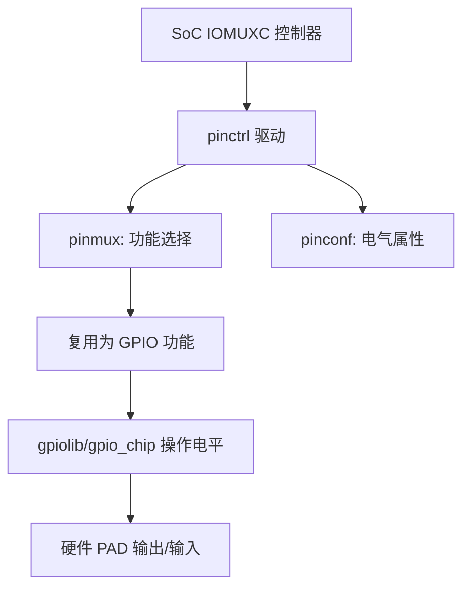
```mermaid
flowchart TD
A[SoC IOMUXC 控制器] --> B[pinctrl 驱动]
B --> C[pinmux: 功能选择]
B --> D[pinconf: 电气属性]
C --> E[复用为 GPIO 功能]
E --> F[gpiolib/gpio_chip 操作电平]
F --> G[硬件 PAD 输出/输入]
```

### 3.6.2_状态切换时序

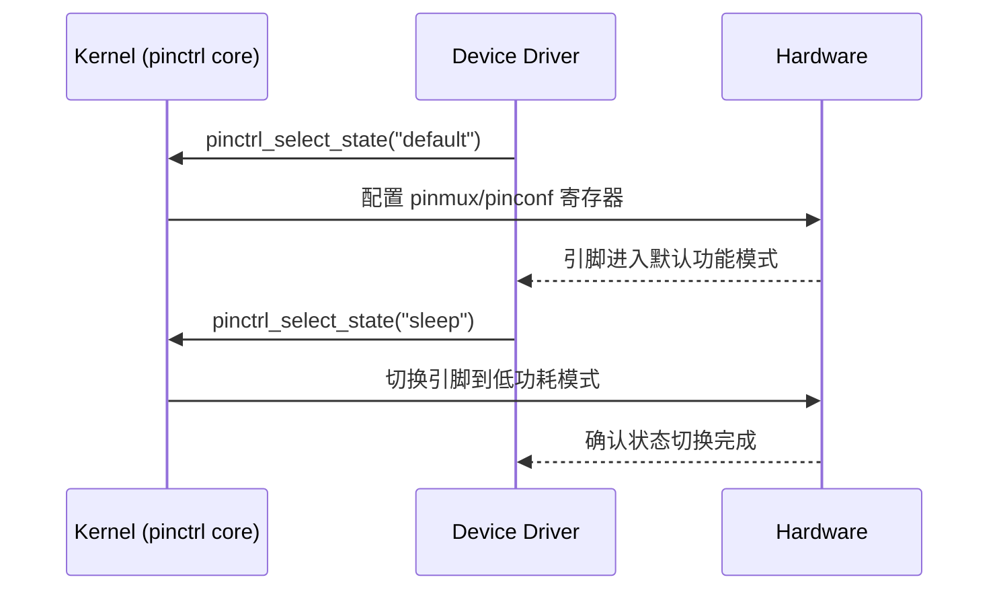
```mermaid
sequenceDiagram
participant K as Kernel (pinctrl core)
participant D as Device Driver
participant H as Hardware

D->>K: pinctrl_select_state("default")
K->>H: 配置 pinmux/pinconf 寄存器
H-->>D: 引脚进入默认功能模式
D->>K: pinctrl_select_state("sleep")
K->>H: 切换引脚到低功耗模式
H-->>D: 确认状态切换完成
```

------

## 3.7_调试与验证技巧

| 问题现象            | 排查方向                       | 常见原因                     |
| ------------------- | ------------------------------ | ---------------------------- |
| 电平无法输出        | `pinmux-pins` 显示非 GPIO 功能 | pinctrl 节点没生效或冲突     |
| GPIO 可见但控制无效 | pad 未配置驱动强度/上下拉      | 电气属性或状态错误           |
| 休眠后外设误触发    | 无 `sleep` 状态或未切换        | `pinctrl-1` 缺失、驱动未切换 |
| `-EINVAL`           | phandle/引用错误               | label/`&`/节点名拼写问题     |
| 崩溃或死机          | NULL 指针/返回值未检查         | `IS_ERR`/ret 未处理完备      |

> 建议顺序：**pinmux → pinconf → gpiolib → dmesg/PM**。先看 `pinmux-pins`，再看 `gpioinfo`，最后看状态切换日志。

------

## 3.8_小结

| 模块    | 功能          | 控制层         | 关键位置                     |
| ------- | ------------- | -------------- | ---------------------------- |
| pinctrl | 管脚控制框架  | 平台层（SoC）  | `/sys/kernel/debug/pinctrl/` |
| pinmux  | 功能复用选择  | pinctrl 子模块 | `pinmux-pins`                |
| pinconf | 电气特性设置  | pinctrl 子模块 | `pinconf-pins`               |
| gpiolib | GPIO 电平控制 | 驱动层         | `/dev/gpiochipN`、`gpioinfo` |

**一句话总结：**
	**pinctrl 决定“脚干什么”，GPIO 决定“怎么干”**；default/sleep 两态 + 逻辑映射 + 用户态验证，缺一不可。


------

# 第4章_GPIO_Consumer_描述符_API(内核侧)

## 4.1_主题引入

**本章要解决的问题：**

* 如何在**内核驱动**中正确使用 **GPIO 描述符 API（`gpiod_\*`）** 获取/控制 GPIO？包括：
  * 获取方式（单线/可选/按索引/批量）、
  * 方向设置、
  * 逻辑/物理电平、
  * `_cansleep` 语义，
  * 以及与 DeviceTree 的标准写法配合。


**为什么重要：**

- 描述符 API 自 3.x 时代逐步确立为推荐接口；旧的整数 API（`gpio_*`）属于历史兼容。
- 正确使用 `gpiod_*` 能减少并发/睡眠上下文问题，清晰处理 **active-low** 等硬件极性。
- 在 6.x 时代，结合字符设备 ABI（用户态），这是最稳妥的“生产级范式”。

------

## 4.2_数据结构视角(原理_&_调用链)

### 4.2.1_核心对象与职责

| 对象/概念                      | 作用                                  | 典型来源/使用                                                |
| ------------------------------ | ------------------------------------- | ------------------------------------------------------------ |
| `struct gpio_desc`             | **不透明句柄**，代表一根 GPIO 线      | `devm_gpiod_get*(dev,"name",flags)` 获取；`gpiod_put()` 释放（devm 自动） |
| `gpiod_is_active_low()`        | 读取**极性**信息（低有效时取反）      | 与 DT `GPIO_ACTIVE_LOW/HIGH` 对应                            |
| `gpiod_get_value[_cansleep]()` | 读电平（逻辑值：已考虑 `active_low`） | 中断/睡眠上下文选用 `_cansleep` 变体                         |
| `gpiod_set_value[_cansleep]()` | 写电平（逻辑值）                      | 同上；需先设置方向                                           |
| `gpiod_set_raw/get_raw_*()`    | **原始电平**（不做 active_low 取反）  | 少用，调试/特殊场景才需要                                    |
| `GPIOD_OUT_LOW/HIGH`           | 获取时指定**方向+默认电平**           | 避免“先输出后置值”的毛刺                                     |
| `GPIOD_IN`                     | 获取为输入                            | 与 `gpiod_direction_input()` 等价                            |

> **逻辑 vs 物理电平**：`gpiod_set_value(desc, 1)` 表示“**逻辑 1**”。若 `active_low`，则最终写入**物理低电平**。原始模式用 `gpiod_set_raw_value()`。

### 4.2.2_调用链(驱动侧_to_gpiolib_to_控制器)

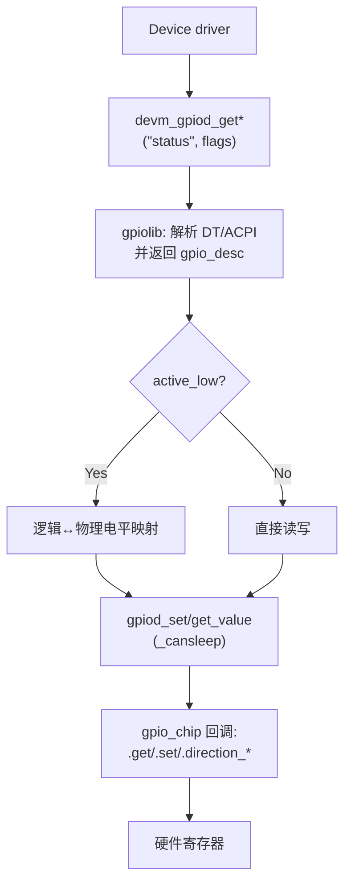
```mermaid
flowchart TD
A[Device driver] --> B["devm_gpiod_get*<br/>(&quot;status&quot;, flags)"]
B --> C[gpiolib: 解析 DT/ACPI <br/>并返回 gpio_desc]
C --> D{active_low?}
D -->|Yes| E[逻辑↔物理电平映射]
D -->|No| F[直接读写]
E --> G["gpiod_set/get_value<br/>(_cansleep)"]
F --> G["gpiod_set/get_value<br/>(_cansleep)"]
G --> H[gpio_chip 回调: <br/>.get/.set/.direction_*]
H --> I[硬件寄存器]
```

> 分支 `|Yes|` 与后续节点名之间**无多余空格**（保证在 Typora 正常渲染）。

------

## 4.3_开发者视角(API_用法与最小驱动)

### 4.3.1_与_DeviceTree_的标准约定(Consumer)

常见属性：`<name>-gpios = <&chip pin flags>;`
 示例（与第 3 章风格一致）：

```dts
mydev@0 {
    compatible = "leaf,mydev-consumer";
    /* 允许 default/sleep 两态，但本章聚焦 Consumer API */
    pinctrl-names = "default";
    pinctrl-0 = <&pinctrl_mydev_default>;

    status-gpios = <&gpio1 3 GPIO_ACTIVE_LOW>;  /* 输出口：状态指示 */
    reset-gpios  = <&gpio1 7 GPIO_ACTIVE_HIGH>; /* 输出口：外设复位 */
    ctrl-gpios   = <&gpio2 1 GPIO_ACTIVE_HIGH>,
                   <&gpio2 2 GPIO_ACTIVE_HIGH>; /* 多根线（按索引 0/1 获取） */

    status = "okay";
};
```

### 4.3.2_API_速查表(常用子集)

| 需求                 | 首选接口                                     | 备注                                      |
| -------------------- | -------------------------------------------- | ----------------------------------------- |
| 获取一根线（必须有） | `devm_gpiod_get(dev,"name",flags)`           | `flags`: `GPIOD_OUT_LOW/HIGH`、`GPIOD_IN` |
| 获取一根线（可选）   | `devm_gpiod_get_optional(...)`               | 若属性缺失返回 `NULL` 而非错误            |
| 同名属性按索引       | `devm_gpiod_get_index(dev,"ctrl",idx,flags)` | `ctrl-gpios` 的第 `idx` 项                |
| 读取/写入（逻辑值）  | `gpiod_get/set_value[_cansleep]()`           | 根据 `can_sleep` 选择变体                 |
| 读取/写入（原始值）  | `gpiod_get/set_raw_value[_cansleep]()`       | **不**处理 active_low                     |
| 方向切换             | `gpiod_direction_input/output()`             | 通常获取时用 `flags` 一步到位             |

> **`_cansleep` 何时用？** 控制器访问需要可能睡眠（I²C/SPI 扩展器等）时，使用 `_cansleep` 变体（或者在不确定时**保守地**使用 `_cansleep`）。

------

### 4.3.3_可运行最小驱动_多路_GPIO_的_Consumer_示例

**目标**：演示 **必须/可选/按索引** 三种获取方式，统一处理 **active_low**，导出几个 sysfs 属性便于验证。

```c
// drivers/misc/leaf_gpiod_consumer_demo.c
// SPDX-License-Identifier: GPL-2.0
#include <linux/module.h>
#include <linux/platform_device.h>
#include <linux/of.h>
#include <linux/gpio/consumer.h>
#include <linux/sysfs.h>

struct lgcd {
    struct device *dev;
    struct gpio_desc *g_status;                 /* 必须存在 */
    struct gpio_desc *g_reset;                  /* 可选 */
    struct gpio_desc *g_ctrl[2];                /* 按索引 0/1 */
    bool status_active_low, reset_active_low, ctrl_active_low[2];
};

static int lgcd_set_logic(struct gpio_desc *g, bool alow, int on)
{
    int level = alow ? !on : on;
    if (!g) return -ENODEV;
    if (gpiod_cansleep(g)) return gpiod_set_value_cansleep(g, level);
    gpiod_set_value(g, level);
    return 0;
}
static int lgcd_get_logic(struct gpio_desc *g, bool alow)
{
    int v = gpiod_get_value_cansleep(g);
    if (v < 0) return v;
    return alow ? !v : v;
}

/* 生成两个简单的属性: status / reset （0/1） */
static ssize_t status_show(struct device *dev, struct device_attribute *a, char *buf)
{
    struct lgcd *d = dev_get_drvdata(dev);
    return sysfs_emit(buf, "%d\n", lgcd_get_logic(d->g_status, d->status_active_low));
}
static ssize_t status_store(struct device *dev, struct device_attribute *a, const char *buf, size_t cnt)
{
    struct lgcd *d = dev_get_drvdata(dev); int on;
    if (kstrtoint(buf, 0, &on) || (on&~1)) return -EINVAL;
    return lgcd_set_logic(d->g_status, d->status_active_low, on) ? -EIO : cnt;
}
static DEVICE_ATTR_RW(status);

static ssize_t reset_show(struct device *dev, struct device_attribute *a, char *buf)
{
    struct lgcd *d = dev_get_drvdata(dev);
    if (!d->g_reset) return sysfs_emit(buf, "NA\n");
    return sysfs_emit(buf, "%d\n", lgcd_get_logic(d->g_reset, d->reset_active_low));
}
static ssize_t reset_store(struct device *dev, struct device_attribute *a, const char *buf, size_t cnt)
{
    struct lgcd *d = dev_get_drvdata(dev); int on;
    if (!d->g_reset) return -ENODEV;
    if (kstrtoint(buf, 0, &on) || (on&~1)) return -EINVAL;
    return lgcd_set_logic(d->g_reset, d->reset_active_low, on) ? -EIO : cnt;
}
static DEVICE_ATTR_RW(reset);

/* ctrl0/ctrl1 两根线（按索引获取），属性名 ctrl0/ctrl1 */
static ssize_t ctrlN_show(struct device *dev, struct device_attribute *a, char *buf)
{
    struct lgcd *d = dev_get_drvdata(dev);
    int idx = (a->attr.name[4] - '0'); /* "ctrl0"/"ctrl1" */
    if (idx < 0 || idx > 1 || !d->g_ctrl[idx]) return -ENODEV;
    return sysfs_emit(buf, "%d\n", lgcd_get_logic(d->g_ctrl[idx], d->ctrl_active_low[idx]));
}
static ssize_t ctrlN_store(struct device *dev, struct device_attribute *a, const char *buf, size_t cnt)
{
    struct lgcd *d = dev_get_drvdata(dev); int on, idx = (a->attr.name[4] - '0');
    if (idx < 0 || idx > 1 || !d->g_ctrl[idx]) return -ENODEV;
    if (kstrtoint(buf, 0, &on) || (on&~1)) return -EINVAL;
    return lgcd_set_logic(d->g_ctrl[idx], d->ctrl_active_low[idx], on) ? -EIO : cnt;
}
static DEVICE_ATTR(ctrl0, 0644, ctrlN_show, ctrlN_store);
static DEVICE_ATTR(ctrl1, 0644, ctrlN_show, ctrlN_store);

static struct attribute *lgcd_attrs[] = {
    &dev_attr_status.attr, &dev_attr_reset.attr,
    &dev_attr_ctrl0.attr, &dev_attr_ctrl1.attr, NULL
};
static const struct attribute_group lgcd_group = { .attrs = lgcd_attrs };

static int lgcd_probe(struct platform_device *pdev)
{
    struct device *dev = &pdev->dev;
    struct lgcd *d;
    int i, ret;

    d = devm_kzalloc(dev, sizeof(*d), GFP_KERNEL);
    if (!d) return -ENOMEM;
    d->dev = dev;
    platform_set_drvdata(pdev, d);

    /* 1) 必须存在的 status 线（输出低为安全态） */
    d->g_status = devm_gpiod_get(dev, "status", GPIOD_OUT_LOW);
    if (IS_ERR(d->g_status)) return PTR_ERR(d->g_status);
    d->status_active_low = gpiod_is_active_low(d->g_status);

    /* 2) 可选的 reset 线（缺失则允许继续） */
    d->g_reset = devm_gpiod_get_optional(dev, "reset", GPIOD_OUT_HIGH);
    if (IS_ERR(d->g_reset)) return PTR_ERR(d->g_reset);
    if (d->g_reset) d->reset_active_low = gpiod_is_active_low(d->g_reset);

    /* 3) 同名属性 ctrl-gpios，按索引 0/1 获取 */
    for (i = 0; i < 2; i++) {
        d->g_ctrl[i] = devm_gpiod_get_index_optional(dev, "ctrl", i, GPIOD_OUT_LOW);
        if (IS_ERR(d->g_ctrl[i])) return PTR_ERR(d->g_ctrl[i]);
        if (d->g_ctrl[i]) d->ctrl_active_low[i] = gpiod_is_active_low(d->g_ctrl[i]);
    }

    /* 4) 导出属性组：/sys/bus/platform/devices/.../{status,reset,ctrl0,ctrl1} */
    ret = sysfs_create_group(&dev->kobj, &lgcd_group);
    if (ret) return ret;

    dev_info(dev, "consumer ready (status%s, reset%s, ctrl[0..1])\n",
             d->status_active_low ? " AL" : "", d->g_reset ? (d->reset_active_low ? " AL" : "") : " NA");
    return 0;
}

static int lgcd_remove(struct platform_device *pdev)
{
    sysfs_remove_group(&pdev->dev.kobj, &lgcd_group);
    return 0;
}

static const struct of_device_id lgcd_of_match[] = {
    { .compatible = "leaf,mydev-consumer" }, { }
};
MODULE_DEVICE_TABLE(of, lgcd_of_match);

static struct platform_driver lgcd_driver = {
    .probe = lgcd_probe,
    .remove = lgcd_remove,
    .driver = {
        .name = "leaf-gpiod-consumer-demo",
        .of_match_table = lgcd_of_match,
    },
};
module_platform_driver(lgcd_driver);

MODULE_LICENSE("GPL");
MODULE_AUTHOR("Leaf Book");
MODULE_DESCRIPTION("Demo: GPIO descriptor consumer (required/optional/index)");
```

**Kbuild 提示**

```make
obj-m += leaf_gpiod_consumer_demo.o
# make -C /path/to/linux-6.1 M=$(PWD) modules
```

> 要点回顾：
>
> - `devm_gpiod_get_optional()` 让属性缺失时**不失败**。
> - `devm_gpiod_get_index_optional()` 对 `ctrl-gpios` **按索引**取第 0/1 根。
> - 统一用“逻辑值”操作，并由 `active_low` 自动映射到“物理电平”。
> - 使用 `_cansleep` 变体保证在可能睡眠的控制器上安全；不确定时也可保守选用。

------

## 4.4_用户视角(如何操作/验证)

### 4.4.1_上电自检(字符设备与工具)

```bash
ls /dev/gpiochip*
gpiodetect
gpioinfo gpiochip0     # 观察 consumer 名称与 active-low 标记
```

### 4.4.2_驱动导出的_sysfs_属性

```bash
cd /sys/bus/platform/devices
ls | grep leaf-gpiod-consumer-demo -n
cd <devdir>
cat status    # 0/1
echo 1 | sudo tee status
echo 0 | sudo tee status

cat reset     # 若 NA 说明 reset-gpios 未提供
echo 1 | sudo tee ctrl0
echo 0 | sudo tee ctrl1
```

### 4.4.3_与_libgpiod_交叉验证

```bash
# 比对 sysfs 的写入效果与芯片线电平变化
gpioget gpiochip0 <line>     # 根据你的板级偏移号
gpioset gpiochip0 <line>=1   # 注意进程持有语义
```

> **可视化路径**：`gpioinfo` 中的 consumer 一般会展示 `<devname>:<con_id>`，便于追踪是哪段驱动在占用该线。

------

## 4.5_可视化图示

### 4.5.1_获取与控制流程(flowchart)

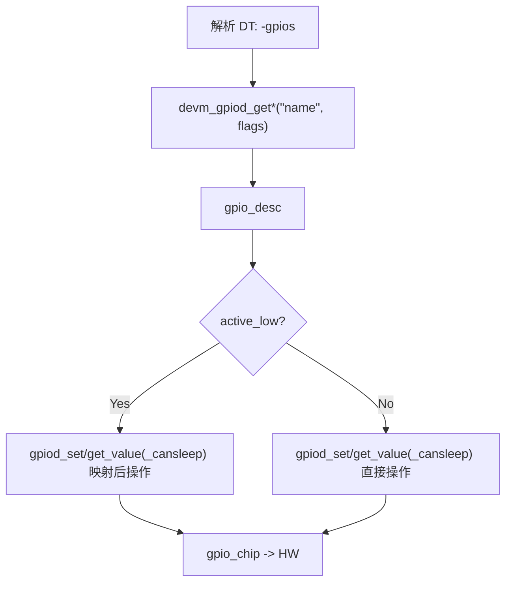
```mermaid
flowchart TD
    A[解析 DT: <name>-gpios] --> B["devm_gpiod_get*(&quot;name&quot;, flags)"]
    B --> C[gpio_desc]
    C --> D{active_low?}
    D -->|Yes| E["gpiod_set/get_value(_cansleep) 映射后操作"]
    D -->|No| F["gpiod_set/get_value(_cansleep) 直接操作"]
    E --> G[gpio_chip -> HW]
    F --> G[gpio_chip -> HW]
```

### 4.5.2_驱动-用户交互(sequenceDiagram)

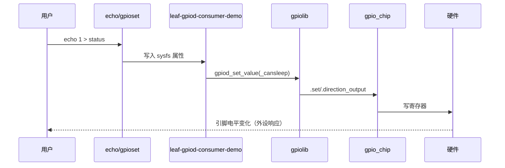
```mermaid
sequenceDiagram
participant U as 用户
participant APP as echo/gpioset
participant DRV as leaf-gpiod-consumer-demo
participant GL as gpiolib
participant CHIP as gpio_chip
participant HW as 硬件

U->>APP: echo 1 > status
APP->>DRV: 写入 sysfs 属性
DRV->>GL: gpiod_set_value(_cansleep)
GL->>CHIP: .set/.direction_output
CHIP->>HW: 写寄存器
HW-->>U: 引脚电平变化（外设响应）
```

------

## 4.6_调试与验证(Checklist)

| 现象                                | 可能原因                       | 排查与修复                                                   |
| ----------------------------------- | ------------------------------ | ------------------------------------------------------------ |
| `-EPROBE_DEFER`                     | 依赖控制器/电源未就绪          | 允许重试；确认依赖驱动顺序与电源域                           |
| `-ENOENT`（get_optional 返回 NULL） | 属性缺失                       | 合理：代表“可选未提供”；驱动需容错                           |
| `-EBUSY`                            | 该线已被其他驱动占用           | `gpioinfo` 看 `consumer`，排重或改线                         |
| “睡眠中写GPIO”告警                  | 使用了非 `_cansleep` 变体      | 改用 `_cansleep`，或确认控制器可原子访问                     |
| 逻辑/物理颠倒                       | 极性配置不当                   | 检查 DT `GPIO_ACTIVE_LOW`；用 `gpiod_is_active_low()` 统一映射 |
| “能写但硬件不动”                    | pinmux 不是 GPIO、pad 电气不当 | 参考第 3 章：`pinmux-pins`/`pinconf-pins` 交叉验证           |

**动态调试建议**

```bash
# 查看所有 GPIO 注册与占用情况
sudo cat /sys/kernel/debug/gpio

# 打开 gpiolib 动态调试
echo 'file drivers/gpio/gpiolib*.c +p' | sudo tee /sys/kernel/debug/dynamic_debug/control
dmesg -w
```

------

## 4.7_小结

### 4.7.1_API_要点表

| 类别   | 推荐做法                                       | 反例/不推荐                    |
| ------ | ---------------------------------------------- | ------------------------------ |
| 获取   | `devm_gpiod_get/optional/index` + 合理 `flags` | 先 `output` 再 `set` 容易毛刺  |
| 读写   | **逻辑值**：`gpiod_set/get_value(_cansleep)`   | 混用 raw/逻辑导致行为混乱      |
| 极性   | 统一以 `gpiod_is_active_low()` 做映射          | 代码里手翻极性、处处写 `!`     |
| 上下文 | 不确定能否原子访问→用 `_cansleep`              | 在可能睡眠路径用非 `_cansleep` |
| 兼容   | 新代码用 `gpiod_*` 描述符 API                  | 继续写 `gpio_*` 整数 API       |

**一句话总结：**
 👉 **在驱动里只谈“逻辑值”，把“物理细节”交给 `gpiod_\*` 与 `active_low` 映射处理；获取时用好 `flags`，访问时选对 `_cansleep` 变体。**

------

## 4.8_cansleep_系列函数(结构化详解)

### 4.8.1_背景与术语

- **描述符 API：** gpiolib 提供两套读写接口（“逻辑值”与“原始值”各一套）：
  - 逻辑值（考虑极性）：
    `gpiod_get_value()` / `gpiod_set_value()`
    `gpiod_get_value_cansleep()` / `gpiod_set_value_cansleep()`
  - 原始值（不考虑极性）：
    `gpiod_get_raw_value()` / `gpiod_set_raw_value()`
    `gpiod_get_raw_value_cansleep()` / `gpiod_set_raw_value_cansleep()`
- **`can_sleep` 语义：** GPIO 控制器驱动在 `struct gpio_chip` 中声明 `can_sleep`：
  - `false`：访问寄存器无需睡眠（典型：SoC 内部 MMIO）。
  - `true`：可能通过 I²C/SPI/Regmap 等间接访问，**访问可能睡眠**（典型：GPIO 扩展器）。
- **核心约束：** `_cansleep` 版本**必须**在可睡眠上下文调用；非 `_cansleep` 版本**仅**能在 `can_sleep=false` 的线且调用点允许的上下文中使用。

------

### 4.8.2_语义与上下文约束

- **可睡眠上下文（✅ 可用 `_cansleep`）：** 线程上下文（`probe/remove`、普通 file ops、`workqueue`、`kthread`）、**threaded IRQ** 处理函数。
- **原子上下文（❌ 禁止 `_cansleep`）：** 硬中断上半部、软中断/tasklet、自旋锁持有区、硬定时器回调等。
- **非 `_cansleep` 的前提：** 只有当 `gpiod_cansleep(desc) == false` 时，才能在原子上下文使用 `gpiod_get/set_value()` 系列。

> 实现细节：`*_cansleep` 路径包含 `might_sleep()` 检查；即使底层最终不睡，也会在原子上下文触发告警。因此 **不要**在原子上下文调用 `_cansleep` 版本。

------

### 4.8.3_选择规则(决策树)

1. **先判上下文**：当前是否允许睡眠？
2. **再判线能力**：`gpiod_cansleep(desc)` 返回是否可能睡眠？
3. **据此选函数族**：

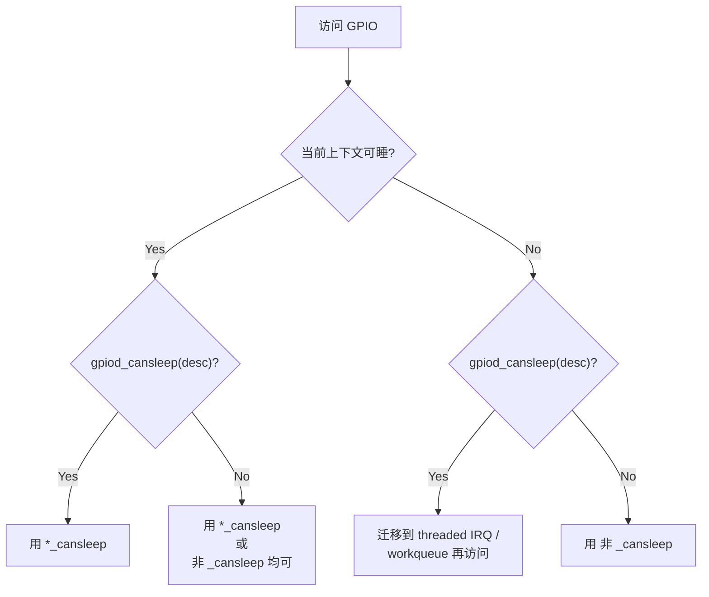
```mermaid
flowchart TD
A[访问 GPIO] --> B{当前上下文可睡?}
B -->|Yes| C{"gpiod_cansleep(desc)?"}
B -->|No| D{"gpiod_cansleep(desc)?"}
C -->|Yes| E[用 *_cansleep]
C -->|No| F[用 *_cansleep <br/>或<br/> 非 _cansleep 均可]
D -->|Yes| G[迁移到 threaded IRQ / <br/>workqueue 再访问]
D -->|No| H[用 非 _cansleep]
```

> 备注：在可睡上下文中，`*_cansleep` 与非 `_cansleep` 对 `can_sleep=false` 的线都可用；但为跨平台稳定性，**推荐统一用 `\*_cansleep`**。

------

### 4.8.4_控制器分类与判断方法

- **SoC GPIO（MMIO，常见于 `pinctrl-<SoC>` 旗下）**：通常 `can_sleep=false`。

- **GPIO 扩展器（I²C/SPI/PMIC 等）**：通常 `can_sleep=true`。

- **运行时判断：**

  ```c
  if (gpiod_cansleep(desc))   // true 表示该线访问可能睡眠
      gpiod_set_value_cansleep(desc, level);
  else
      gpiod_set_value(desc, level);
  ```

------

### 4.8.5_逻辑值与原始电平(与极性的一致处理)

- **逻辑值接口**：`gpiod_get/set_value[_cansleep]()` —— 自动考虑 DT 的 `GPIO_ACTIVE_LOW/HIGH`。
- **原始值接口**：`gpiod_get/set_raw_value[_cansleep]()` —— 不做极性映射。
- **建议：** 驱动统一使用“逻辑值接口”，由 `gpiod_is_active_low(desc)` 做一次性映射，避免各处手写 `!`。

> 逻辑到物理的统一写法：

```c
static inline int gpiod_set_logic_safe(struct gpio_desc *d, bool active_low, int on)
{
    int level = active_low ? !on : on;
    if (!d) return -ENODEV;
    if (gpiod_cansleep(d)) return gpiod_set_value_cansleep(d, level);
    gpiod_set_value(d, level);
    return 0;
}

static inline int gpiod_get_logic_safe(struct gpio_desc *d, bool active_low)
{
    int v = gpiod_cansleep(d) ? gpiod_get_value_cansleep(d)
                              : gpiod_get_value(d);
    return (v < 0) ? v : (active_low ? !v : v);
}
```

------

### 4.8.6_编码模板(可直接复用)

**A）通用读写模板（可睡/不可睡自适应）**

```c
int my_gpio_write(struct gpio_desc *d, bool on)
{
    bool al = gpiod_is_active_low(d);
    int level = al ? !on : on;
    if (gpiod_cansleep(d)) return gpiod_set_value_cansleep(d, level);
    gpiod_set_value(d, level);
    return 0;
}

int my_gpio_read(struct gpio_desc *d)
{
    bool al = gpiod_is_active_low(d);
    int v = gpiod_cansleep(d) ? gpiod_get_value_cansleep(d)
                              : gpiod_get_value(d);
    return (v < 0) ? v : (al ? !v : v);
}
```

**B）硬中断上半部安全调用（仅限 `can_sleep=false` 的线）**

```c
irqreturn_t my_irq_handler(int irq, void *data)
{
    struct gpio_desc *d = data;
    if (unlikely(gpiod_cansleep(d)))  // 保险检查
        return IRQ_NONE;              // 或标记并延后到线程化处理
    gpiod_set_value(d, 1);            // 非 _cansleep，原子安全
    return IRQ_HANDLED;
}
```

**C）线程化中断 / 工作队列（通吃 `can_sleep=true/false`）**

```c
irqreturn_t my_irq_thread(int irq, void *data)
{
    struct gpio_desc *d = data;
    /* 线程上下文，可睡；统一走 *_cansleep */
    return gpiod_set_value_cansleep(d, 0) ? IRQ_NONE : IRQ_HANDLED;
}
```

------

### 4.8.7_端到端示例_A_I²C_扩展器(can_sleep=true)

**场景：** PCF8574 等 I²C GPIO 控制 LED，在中断事件里翻转 LED。

**DTS（节选）：**

```dts
i2c1: i2c@40066000 {
    exp0: gpio@20 {
        compatible = "nxp,pcf8574";
        reg = <0x20>;
        gpio-controller;
        #gpio-cells = <2>;
        /* ... 省略 pinctrl ... */
    };
};

mydev@0 {
    compatible = "leaf,my-cansleep-demo";
    status-gpios = <&exp0 0 GPIO_ACTIVE_LOW>;
    status = "okay";
};
```

**驱动处理：** 使用 **threaded IRQ** 或 `workqueue`，在可睡上下文调用 `_cansleep`：

```c
static irqreturn_t my_top(int irq, void *p) { return IRQ_WAKE_THREAD; } // 上半部最小化
static irqreturn_t my_thread(int irq, void *p)
{
    struct gpio_desc *d = p; // 来自 devm_gpiod_get(...)
    /* 线程上下文：安全使用 *_cansleep */
    int val = gpiod_get_value_cansleep(d);
    if (val >= 0)
        gpiod_set_value_cansleep(d, !val);
    return IRQ_HANDLED;
}

/* 绑定中断 */
devm_request_threaded_irq(dev, irq, my_top, my_thread,
                          IRQF_ONESHOT, "mycansleep", desc);
```

------

### 4.8.8_端到端示例_B_SoC_GPIO(can_sleep=false)硬中断快路径

**场景：** SoC 内部 GPIO 控制一个引脚脉冲，要求中断上半部立刻拉高 10us 再拉低。

```c
static irqreturn_t my_top_fast(int irq, void *p)
{
    struct gpio_desc *d = p;
    if (unlikely(gpiod_cansleep(d)))
        return IRQ_NONE; /* 设计上不应发生，保护性返回 */

    gpiod_set_value(d, 1);          /* 非 _cansleep，原子安全 */
    udelay(10);                     /* 原子上下文短延时 */
    gpiod_set_value(d, 0);
    return IRQ_HANDLED;
}
```

> 若移植到含扩展器的平台，**必须**改为线程化中断或下发工作队列。

------

### 4.8.9_调试与验证方法

1. **检查谁在使用 GPIO：**

   ```bash
   sudo cat /sys/kernel/debug/gpio
   gpioinfo  # 查看 consumer 名称与 active-low 标记
   ```

2. **启用 gpiolib 动态调试（观察调用路径）：**

   ```bash
   echo 'file drivers/gpio/gpiolib*.c +p' | sudo tee /sys/kernel/debug/dynamic_debug/control
   dmesg -w
   ```

3. **定位上下文错误：** 若在原子上下文调用 `_cansleep`，内核会打印类似
   `BUG: sleeping function called from invalid context`。出现该日志，说明调用点需要迁移到可睡位置。

------

### 4.8.10_常见问题与修复

| 问题                                 | 典型根因                              | 修复建议                                                     |
| ------------------------------------ | ------------------------------------- | ------------------------------------------------------------ |
| 原子上下文触发 “sleeping function …” | 在 top-half/softirq 调用 `*_cansleep` | 使用 **threaded IRQ/workqueue**；或仅在 `gpiod_cansleep(desc)==false` 时用非 `_cansleep` |
| 在 MMIO 平台正常，换扩展器平台异常   | 代码全程使用非 `_cansleep`            | 按 **4.8.3** 决策树改造；统一在可睡上下文用 `_cansleep`      |
| 亮灭颠倒/跨板不一致                  | 混用 raw/逻辑接口或随处手写 `!`       | 统一逻辑接口 + `gpiod_is_active_low()` 一次性映射            |
| 读写卡顿                             | 扩展器访问在快路径                    | 把慢路径移到线程/worker；快路径仅做标记                      |

------

### 4.8.11_兼容性与性能注意

- 在**可睡上下文**对 `can_sleep=false` 的线调用 `*_cansleep` **没有功能问题**；只是多了一次 `might_sleep()` 检查的开销，通常可忽略。
- 在**原子上下文**调用 `*_cansleep` **不被允许**，即使底层当前不会睡，也会触发检查告警。

------

### 4.8.12_小结

- **规则**：先判上下文、再判 `gpiod_cansleep(desc)`，据此选择 `_cansleep` 或非 `_cansleep`。
- **实践**：可睡上下文统一用 `*_cansleep`，原子上下文仅在 `can_sleep=false` 时使用非 `_cansleep`。
- **一致性**：逻辑值接口 + 极性一次映射，避免跨平台行为差异。

**一句话总结：**
 **在能睡的地方使用 `\*_cansleep`，在不能睡的地方只操作 `can_sleep=false` 的 GPIO；拿不准就用 `gpiod_cansleep()` 判定并迁移到可睡上下文。**


------

# 第5章_字符设备_ABI_与_libgpiod(用户态)

## 5.1_主题引入

**本章要解决的问题：**

* 用户态如何通过 **GPIO 字符设备 ABI** 与 **libgpiod 2.x** 安全、可移植地控制 GPIO（输出、输入、边沿事件）？
* 如何在 v1/v2 ABI 差异下写出可维护的脚本与程序？


**为什么重要：**

- 旧的 **sysfs GPIO** 接口已在内核中标记弃用（多年历史），现代系统应使用 **/dev/gpiochipN** 字符设备。
- **libgpiod 2.x**（配合内核 **v2 chardev ABI：≥5.10**）提供统一、可移植的 C API 与命令行工具集。
- 正确的**请求/持有/释放**模型与**事件读取**模式，是避免竞态与权限问题的关键。

------

## 5.2_概念与时间线

- **4.8（2016）**：首次引入 **GPIO chardev v1**（/dev/gpiochipN）。
- **5.10（2020）**：引入 **GPIO chardev v2**（增强批量请求、事件、设置）。v1 仍可回退。
- **6.1（2022 LTS）**：大量发行版默认采用 **chardev + libgpiod** 路线；libgpiod 2.x **优先使用 v2**，**内核不支持时自动回退 v1**。
- **现状**：新项目一律使用 **chardev + libgpiod 2.x**；sysfs 仅用于遗留系统。

------

## 5.3_角色与对象(用户空间视角)

| 对象                                                         | 含义/职责                            | 典型作用                                                 |
| ------------------------------------------------------------ | ------------------------------------ | -------------------------------------------------------- |
| `/dev/gpiochipN`                                             | 一个 GPIO 控制器的字符设备           | 通过 ioctl（v1/v2 ABI）进行行（line）请求/释放、事件订阅 |
| libgpiod（C 语言库）                                         | chardev 的轻量封装                   | 芯片打开、line 配置（方向/极性/偏置/驱动）、事件读取     |
| 工具集（gpiodetect/gpioinfo/gpioget/gpioset/gpiomon/gpiofind） | 运维/调试命令                        | 快速查看、拉高/拉低、边沿监听、按名称查线                |
| “行（line）”/“偏移（offset）”                                | 控制器中的某个 GPIO 号（0..ngpio-1） | 在一个 request 中按 **索引**顺序操作                     |

> 术语注意：在 libgpiod 2.x 中，请求一个或多根线后，**请求内的“索引”\**与\**原始 offset**是两个概念：后续读写以**索引 0..N-1**为主（按你传入 offsets 数组的顺序映射）。

------

## 5.4_工具法(零代码快速验证)

### 5.4.1_安装与自检

- RootFS 中安装 **libgpiod-tools**（Buildroot、Yocto 或手工交叉编译，见第 2 章补充）。

- 验证字符设备：

  ```bash
  ls /dev/gpiochip*
  gpiodetect          # 列出芯片
  gpioinfo gpiochip0  # 列出线的名称、方向、active-low、consumer 等
  ```

### 5.4.2_读写与持有语义

```bash
# 读一根线（逻辑值；自动考虑 active-low）
gpioget gpiochip0 3

# 设置为 1 并“保持持有”（进程退出前保持）
gpioset gpiochip0 3=1

# 设置为 1 并退出时释放（-m exit 让工具退出后恢复默认）
gpioset -m exit gpiochip0 3=1
```

> “进程持有语义”：**谁持有就谁生效**。工具退出会释放行，电平可能回到默认或被其他消费者接管。

### 5.4.3_边沿事件监听

```bash
# 监听两根输入线的上/下沿，打印时间戳
gpiomon --rising --falling gpiochip0 5 6
```

------

## 5.5_C_语言_libgpiod_2.x_最小示例

> 下面两段 C 代码分别演示 **输出** 与 **事件输入**。均基于 **libgpiod 2.x** 的对象式 API（`chip` / `line_settings` / `line_config` / `request`）。

### 5.5.1_单线输出(设为高_再拉低)

应用程序示例：

```c
// build: cc -Wall -O2 -o gpio_out gpio_out.c -lgpiod
#include <gpiod.h>
#include <stdio.h>
#include <stdlib.h>

int main(void)
{
    const char *chipname = "gpiochip0";
    unsigned int offsets[] = { 3 };  // 目标偏移
    struct gpiod_chip *chip = NULL;
    struct gpiod_line_settings *ls = NULL;
    struct gpiod_line_config *lc = NULL;
    struct gpiod_request_config *rc = NULL;
    struct gpiod_line_request *req = NULL;
    int ret = 0;

    chip = gpiod_chip_open_by_name(chipname);
    if (!chip) { perror("chip_open"); return 1; }

    ls = gpiod_line_settings_new();
    gpiod_line_settings_set_direction(ls, GPIOD_LINE_DIRECTION_OUTPUT);
    gpiod_line_settings_set_output_value(ls, GPIOD_LINE_VALUE_INACTIVE); // 初始低

    lc = gpiod_line_config_new();
    gpiod_line_config_add_line_settings(lc, offsets, 1, ls);

    rc = gpiod_request_config_new();
    gpiod_request_config_set_consumer(rc, "gpio_out_demo");

    req = gpiod_chip_request_lines(chip, rc, lc);
    if (!req) {
        perror("request_lines");
        ret = 1;
        goto out;
    }

    // 注意：请求内索引 0 对应 offsets[0]（即芯片偏移 3）
    gpiod_line_request_set_value(req, 0, GPIOD_LINE_VALUE_ACTIVE);   // 置高
    gpiod_line_request_set_value(req, 0, GPIOD_LINE_VALUE_INACTIVE); // 置低

out:
    if (req)  gpiod_line_request_release(req);
    if (rc)   gpiod_request_config_free(rc);
    if (lc)   gpiod_line_config_free(lc);
    if (ls)   gpiod_line_settings_free(ls);
    if (chip) gpiod_chip_close(chip);
    return ret;
}
```

**关键点：**

- `gpiod_line_request_set_value(req, **索引** , value)`：**索引**是你在 `add_line_settings()` 里传入 offsets 的顺序（0..N-1），不是原始 offset。
- `ACTIVE/INACTIVE` 是**逻辑值**。若线为 active-low，逻辑 1 会写入物理低电平（底层映射）。

### 5.5.2_单线输入_+_边沿事件(RISING/FALLING)

```c
// build: cc -Wall -O2 -o gpio_evt gpio_evt.c -lgpiod
#include <gpiod.h>
#include <stdio.h>
#include <stdlib.h>
#include <inttypes.h>
#include <time.h>

static void print_event(const struct gpiod_edge_event *ev)
{
    const struct timespec *ts = gpiod_edge_event_get_timestamp(ev);
    enum gpiod_edge_event_type tp = gpiod_edge_event_get_event_type(ev);
    printf("%ld.%09ld: %s\n", (long)ts->tv_sec, ts->tv_nsec,
           tp == GPIOD_EDGE_EVENT_RISING_EDGE ? "rising" : "falling");
}

int main(void)
{
    const char *chipname = "gpiochip0";
    unsigned int offsets[] = { 5 }; // 监听偏移 5
    struct gpiod_chip *chip = NULL;
    struct gpiod_line_settings *ls = NULL;
    struct gpiod_line_config *lc = NULL;
    struct gpiod_request_config *rc = NULL;
    struct gpiod_line_request *req = NULL;
    struct gpiod_edge_event_buffer *buf = NULL;
    int ret = 0;

    chip = gpiod_chip_open_by_name(chipname);
    if (!chip) {
        perror("chip_open");
        return 1;
    }

    ls = gpiod_line_settings_new();
    gpiod_line_settings_set_direction(ls, GPIOD_LINE_DIRECTION_INPUT);
    gpiod_line_settings_set_edge_detection(ls, GPIOD_LINE_EDGE_BOTH);
    // 可选：上拉/下拉/去抖
    // gpiod_line_settings_set_bias(ls, GPIOD_LINE_BIAS_PULL_UP);
    // gpiod_line_settings_set_debounce_period_us(ls, 5000);

    lc = gpiod_line_config_new();
    gpiod_line_config_add_line_settings(lc, offsets, 1, ls);

    rc = gpiod_request_config_new();
    gpiod_request_config_set_consumer(rc, "gpio_evt_demo");

    req = gpiod_chip_request_lines(chip, rc, lc);
    if (!req) { perror("request_lines"); ret = 1; goto out; }

    buf = gpiod_edge_event_buffer_new(16);

    while (1) {
        int n = gpiod_line_request_wait_edge_events(req, NULL); // NULL=无限等待
        if (n < 0) { perror("wait_edge"); break; }
        n = gpiod_line_request_read_edge_events(req, buf, 16);
        if (n < 0) { perror("read_edge"); break; }
        for (int i = 0; i < n; i++) {
            const struct gpiod_edge_event *ev = gpiod_edge_event_buffer_get_event(buf, i);
            print_event(ev);
        }
    }

out:
    if (buf)  gpiod_edge_event_buffer_free(buf);
    if (req)  gpiod_line_request_release(req);
    if (rc)   gpiod_request_config_free(rc);
    if (lc)   gpiod_line_config_free(lc);
    if (ls)   gpiod_line_settings_free(ls);
    if (chip) gpiod_chip_close(chip);
    return ret;
}
```

**关键点：**

- 事件读取流程：`wait_edge_events` → `read_edge_events` → 遍历 `buffer`。
- 去抖（可选）：在 **line settings** 设置 `debounce_period_us`，内核支持则生效（与控制器能力相关）。

------

## 5.6_目录结构与交互流程(图示)

### 5.6.1_用户态请求流程(flowchart)

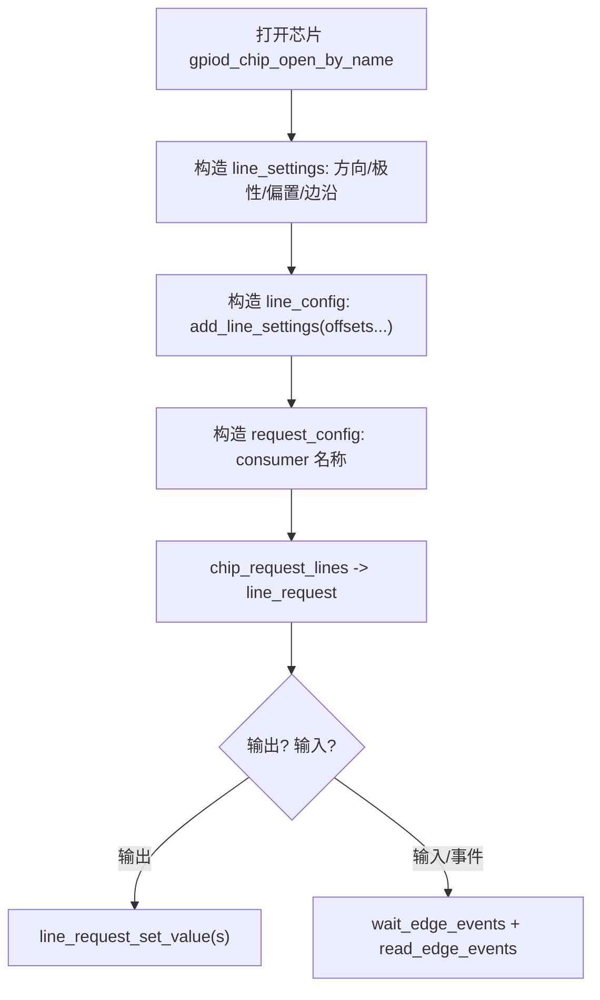
```mermaid
flowchart TD
A[打开芯片 gpiod_chip_open_by_name] --> B[构造 line_settings: 方向/极性/偏置/边沿]
B --> C["构造 line_config: add_line_settings(offsets...)"]
C --> D[构造 request_config: consumer 名称]
D --> E[chip_request_lines -> line_request]
E --> F{输出? 输入?}
F -->|输出| G["line_request_set_value(s)"]
F -->|输入/事件| H[wait_edge_events + read_edge_events]
```

### 5.6.2_事件读取时序(sequenceDiagram)

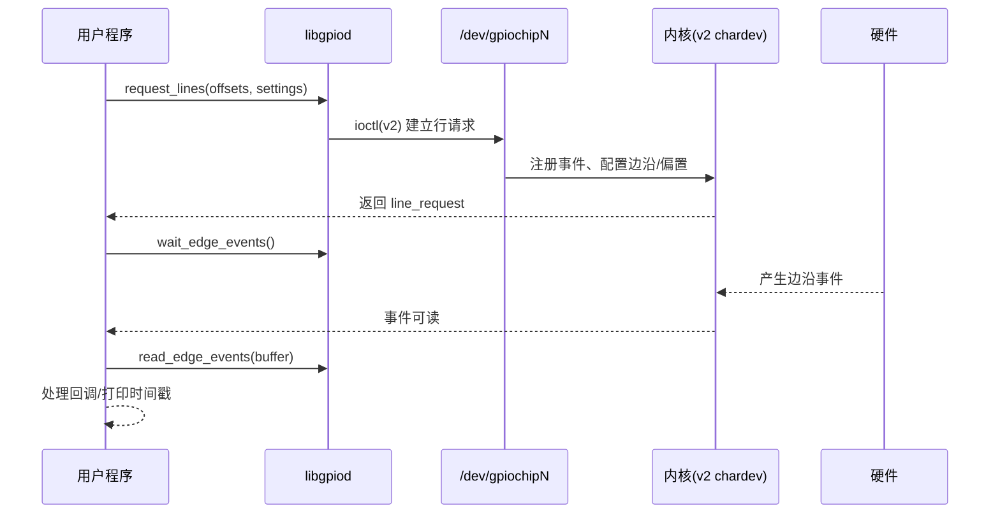
```mermaid
sequenceDiagram
participant APP as 用户程序
participant LIB as libgpiod
participant DEV as /dev/gpiochipN
participant K as 内核(v2 chardev)
participant HW as 硬件

APP->>LIB: request_lines(offsets, settings)
LIB->>DEV: ioctl(v2) 建立行请求
DEV->>K: 注册事件、配置边沿/偏置
K-->>APP: 返回 line_request
APP->>LIB: wait_edge_events()
HW-->>K: 产生边沿事件
K-->>APP: 事件可读
APP->>LIB: read_edge_events(buffer)
APP-->>APP: 处理回调/打印时间戳
```

------

## 5.7_常见错误与排查

| 现象/报错                                | 可能原因                               | 解决                                              |
| ---------------------------------------- | -------------------------------------- | ------------------------------------------------- |
| `No such file or directory`（工具/程序） | rootfs 未安装 libgpiod 工具或库        | 将 **libgpiod-tools**（或静态二进制）加入 rootfs  |
| `Permission denied` / `EPERM`            | /dev/gpiochip* 权限不足                | `sudo` 或配置 udev 规则                           |
| `Device or resource busy` / `EBUSY`      | 该线已被其他 consumer 持有             | `gpioinfo` 查看 consumer，释放或换线              |
| 电平“没变化”                             | pinmux 未切到 GPIO（第 3 章）          | `debugfs`：`pinmux-pins`、`pinconf-pins` 交叉验证 |
| 事件“收不到”                             | 方向/边沿设置错误，或外部上拉/下拉不对 | `gpioinfo` 查 bias/方向；检查硬件电气与阈值       |
| 逻辑与物理颠倒                           | active-low 未配置或误用 raw 接口       | 统一使用**逻辑接口**，由 settings/DT 决定极性     |

> 调试通道：
>
> - `gpioinfo` 看 consumer/active-low；
> - `sudo cat /sys/kernel/debug/gpio` 看全局占用；
> - `dmesg` 观察字符设备/权限相关日志。

------

## 5.8_与内核/设备树的衔接(回顾要点)

- 用户态的逻辑成立，前提是：
  **① pinmux 已将目标 PAD 复用为 GPIO**，**② pinconf 电气设置合理**（上拉/下拉/驱动），**③ 控制器驱动已注册 gpiochip**。
- `gpioinfo` 的 **line-name** 来源：
  - 控制器 `gpio-line-names`；
  - 或由内核/驱动消费时填充的 consumer 名称（便于排查谁在用这根线）。
- 事件监听的可靠性依赖硬件电气（上拉/下拉）与边沿阈值——对于抖动强的按键，优先在 **line settings** 或硬件侧提供去抖。

------

## 5.9_小结

### 5.9.1_工具与_API_对照

| 目标            | 工具命令                                 | C API（libgpiod 2.x）                                     |
| --------------- | ---------------------------------------- | --------------------------------------------------------- |
| 查看芯片/线信息 | `gpiodetect` / `gpioinfo`                | `gpiod_chip_*` / `gpiod_line_*_settings`                  |
| 读单线          | `gpioget chip off`                       | `gpiod_line_request_get_value(req, idx)`                  |
| 写单线          | `gpioset chip off=1`                     | `gpiod_line_request_set_value(req, idx, ACTIVE/INACTIVE)` |
| 监听边沿        | `gpiomon --rising --falling chip off...` | `wait_edge_events` + `read_edge_events`                   |

**一句话总结：**
 **在用户态，统一走 `/dev/gpiochipN + libgpiod 2.x`；按“请求→持有→读写/事件→释放”的生命周期操作，逻辑值与极性交给库处理，电气与复用交给第 3 章的方法验证。**

------

我是 **GPT-5 Thinking**。

------

# 第6章_GPIO_中断(IRQ)与_gpio-keys_/_自定义驱动

## 6.1_主题引入

**本章要解决的问题：**

* 如何在 Linux 6.1 及以后，通过 **GPIO→IRQ** 路径可靠地处理**边沿事件**（按键、插拔、检测信号等）？
* 何时使用 **通用驱动 gpio-keys**，何时自己写 **platform 驱动 + threaded IRQ**？
* 如何处理 **极性、触发类型、去抖、唤醒** 等关键细节？


**核心关注点：**

1. **GPIO→IRQ 映射**：`gpiod_to_irq()`、`irqdomain`、触发类型设置。
2. **通用方案**：`gpio-keys`（推荐：按键/开关场景）。
3. **自定义方案**：`devm_request_threaded_irq()` + `threaded IRQ`。
4. **去抖与抖动**：硬件/控制器/软件三层策略。
5. **低功耗/唤醒**：`enable_irq_wake()` 与 pinctrl `sleep` 状态协同。

------

## 6.2_数据结构视角(内核架构关系)

### 6.2.1_关键对象与关系

| 组件/结构                | 作用                      | 说明                                               |
| ------------------------ | ------------------------- | -------------------------------------------------- |
| `struct gpio_desc`       | GPIO 线的描述符           | 来自 `devm_gpiod_get(dev,"name",GPIOD_IN)`         |
| `gpiod_to_irq(desc)`     | 将 GPIO 线映射为 IRQ 号   | 通过 **irqdomain** 完成映射                        |
| `struct irq_chip`        | 控制器的 IRQ 实现         | `.irq_set_type/.irq_ack/.irq_mask/...`             |
| `request_threaded_irq()` | 绑定**上半部/线程化**处理 | 推荐使用 **threaded**，利于 `_cansleep`            |
| `gpio-keys` 驱动         | 通用按键→input 事件       | 读取 `gpios`、`linux,code`、`debounce-interval` 等 |

> 时间线提示：GPIO→IRQ 的 `irqdomain` 模型在 3.x 时代成熟；6.x 时推荐**线程化中断**，配合 `_cansleep` 与 libgpiod 用户态工具。

### 6.2.2_触发类型与极性

- **极性**（电平正/负）来自 **GPIO 绑定**（如 `GPIO_ACTIVE_LOW`），影响**逻辑值解释**。
- **触发类型**（RISING/FALLING/BOTH/LEVEL）作用于 **IRQ 控制器**：
  - 设置点：`irq_set_irq_type(irq, IRQ_TYPE_EDGE_BOTH /*…*/)`
  - 某些控制器也支持 `gpiod_set_debounce(desc, usec)`（返回 `-ENOTSUPP` 表示不支持）。

------

## 6.3_开发者视角(一)_通用驱动_gpio-keys

### 6.3.1_适用场景

- 实体按键、开关、键帽阵列等，目标是**生成 input 子系统事件**（`/dev/input/eventX`），而非你自己的专用设备。

### 6.3.2_设备树(最小可用)

```dts
/* pinctrl：把 PAD 配成 GPIO 输入并配置上拉/下拉 */
&pinctrl {
    pinctrl_btn_default: btn_default {
        fsl,pins = <
            MX6UL_PAD_GPIO1_IO05__GPIO1_IO05 0x10B1  /* 示例：上拉+合适的滞回 */
        >;
    };
};

gpio_keys: gpio-keys {
    compatible = "gpio-keys";
    pinctrl-names = "default";
    pinctrl-0 = <&pinctrl_btn_default>;

    button0: button@0 {
        gpios = <&gpio1 5 GPIO_ACTIVE_LOW>;   /* 低有效按下 */
        linux,code = <KEY_ENTER>;             /* 输入事件键值 */
        label = "user-enter";
        debounce-interval = <10>;             /* ms，软件去抖 */
        wakeup-source;                         /* 可作为唤醒源 */
        /* autorepeat;  // 可选：长按连发 */
    };
};
```

### 6.3.3_用户验证

```bash
# 设备与事件节点
ls /sys/firmware/devicetree/base/gpio-keys
ls /dev/input/event*

# 监听键值（按下/松开）
sudo evtest /dev/input/eventX
# 或 libinput-debug-events（桌面环境）
```

> `gpio-keys` 自动完成 **GPIO→IRQ**、**去抖**、**input 事件**、**唤醒** 等通用工作。能用它，就别自己重造轮子。

------

## 6.4_开发者视角(二)_自定义_platform_驱动_+_threaded_IRQ

当你要在**内核驱动里**把 GPIO 中断与设备逻辑深度耦合（不是 input 事件），用以下模板。

### 6.4.1_设备树(与第_3_章风格一致)

```dts
&pinctrl {
    pinctrl_myirq_default: myirq_default {
        fsl,pins = <
            MX6UL_PAD_GPIO1_IO06__GPIO1_IO06 0x10B1
        >;
    };
    pinctrl_myirq_sleep: myirq_sleep {
        fsl,pins = <
            MX6UL_PAD_GPIO1_IO06__GPIO1_IO06 0x10A1
        >;
    };
};

myirq@0 {
    compatible = "leaf,myirq-demo";
    pinctrl-names = "default", "sleep";
    pinctrl-0 = <&pinctrl_myirq_default>;
    pinctrl-1 = <&pinctrl_myirq_sleep>;

    intr-gpios = <&gpio1 6 GPIO_ACTIVE_LOW>; /* 输入：低有效 */
    status = "okay";
};
```

### 6.4.2_驱动源码(可编可跑_含去抖/唤醒/PM)

```c
// drivers/misc/leaf_gpio_irq_demo.c
// SPDX-License-Identifier: GPL-2.0
#include <linux/module.h>
#include <linux/platform_device.h>
#include <linux/of.h>
#include <linux/gpio/consumer.h>
#include <linux/interrupt.h>
#include <linux/pinctrl/consumer.h>
#include <linux/pm.h>
#include <linux/kfifo.h>
#include <linux/ktime.h>

struct myirq_dev {
    struct device        *dev;
    struct pinctrl       *pctl;
    struct pinctrl_state *st_def, *st_slp;
    struct gpio_desc     *g_intr;
    int                   irq;
    bool                  active_low;
    /* 简易事件统计/去抖 */
    unsigned int          debounce_us;   /* 0 表示不用软件去抖 */
    ktime_t               last_ts;
    /* 事件计数（rising/falling） */
    atomic64_t            cnt_rising;
    atomic64_t            cnt_falling;
};

static irqreturn_t myirq_top(int irq, void *data)
{
    /* 最小化上半部：把工作交给线程化处理 */
    return IRQ_WAKE_THREAD;
}

static irqreturn_t myirq_thread(int irq, void *data)
{
    struct myirq_dev *m = data;
    ktime_t now = ktime_get();
    if (m->debounce_us) {
        s64 us = ktime_us_delta(now, m->last_ts);
        if (us >= 0 && us < m->debounce_us)
            return IRQ_HANDLED; /* 丢弃抖动 */
    }
    m->last_ts = now;

    /* 读取当前逻辑值，统计上/下沿（示例：用上一次值推断边沿更严谨，这里简化） */
    int v = gpiod_get_value_cansleep(m->g_intr);
    if (v < 0) return IRQ_HANDLED;
    /* active_low 场景下，逻辑按“按下=1/松开=0”理解 */
    v = m->active_low ? !v : v;
    if (v)
        atomic64_inc(&m->cnt_rising);
    else
        atomic64_inc(&m->cnt_falling);

    dev_dbg(m->dev, "irq event: logic=%d @%lldus\n",
            v, (long long)ktime_to_us(now));
    /* TODO: 在此触发你的设备状态机/唤醒等待队列等 */
    return IRQ_HANDLED;
}

static ssize_t stats_show(struct device *dev, struct device_attribute *a, char *buf)
{
    struct myirq_dev *m = dev_get_drvdata(dev);
    return sysfs_emit(buf, "rising=%lld, falling=%lld, debounce_us=%u\n",
        (long long)atomic64_read(&m->cnt_rising),
        (long long)atomic64_read(&m->cnt_falling),
        m->debounce_us);
}
static DEVICE_ATTR_RO(stats);

static int myirq_probe(struct platform_device *pdev)
{
    struct device *dev = &pdev->dev;
    struct myirq_dev *m;
    int ret;

    m = devm_kzalloc(dev, sizeof(*m), GFP_KERNEL);
    if (!m) return -ENOMEM;
    m->dev = dev;
    platform_set_drvdata(pdev, m);

    /* pinctrl 状态 */
    m->pctl = devm_pinctrl_get(dev);
    if (IS_ERR(m->pctl)) return PTR_ERR(m->pctl);
    m->st_def = pinctrl_lookup_state(m->pctl, "default");
    m->st_slp = pinctrl_lookup_state(m->pctl, "sleep");
    if (!IS_ERR_OR_NULL(m->st_def)) pinctrl_select_state(m->pctl, m->st_def);

    /* GPIO 输入线 */
    m->g_intr = devm_gpiod_get(dev, "intr", GPIOD_IN);
    if (IS_ERR(m->g_intr)) return PTR_ERR(m->g_intr);
    m->active_low = gpiod_is_active_low(m->g_intr);

    /* 硬件去抖（如支持） */
    m->debounce_us = 5000; /* 示例：5ms，可改为 DT 属性读取 */
    ret = gpiod_set_debounce(m->g_intr, m->debounce_us);
    if (ret == -ENOTSUPP) {
        /* 控制器不支持；保留软件去抖（myirq_thread） */
        ret = 0;
    } else if (ret) {
        dev_warn(dev, "set_debounce failed: %d\n", ret);
    }

    /* GPIO -> IRQ 映射与触发类型设置 */
    m->irq = gpiod_to_irq(m->g_intr);
    if (m->irq < 0) return m->irq;

    /* 例如双边沿触发；也可根据硬件写成 RISING/FALLING/LEVEL */
    ret = irq_set_irq_type(m->irq, IRQ_TYPE_EDGE_BOTH);
    if (ret) return ret;

    /* 线程化中断，允许在处理里使用 *_cansleep */
    ret = devm_request_threaded_irq(dev, m->irq,
            myirq_top, myirq_thread,
            IRQF_ONESHOT | IRQF_TRIGGER_RISING | IRQF_TRIGGER_FALLING,
            "leaf-myirq", m);
    if (ret) return ret;

    /* sysfs 只读统计，便于用户查看 */
    ret = device_create_file(dev, &dev_attr_stats);
    if (ret) return ret;

    device_init_wakeup(dev, true); /* 可被唤醒设备 */
    dev_info(dev, "irq=%d active_low=%d debounce_us=%u\n",
             m->irq, m->active_low, m->debounce_us);
    return 0;
}

static int myirq_remove(struct platform_device *pdev)
{
    struct myirq_dev *m = platform_get_drvdata(pdev);
    device_remove_file(m->dev, &dev_attr_stats);
    device_init_wakeup(m->dev, false);
    return 0;
}

/* PM：作为唤醒源使用 */
static int __maybe_unused myirq_suspend(struct device *dev)
{
    struct myirq_dev *m = dev_get_drvdata(dev);
    if (!IS_ERR_OR_NULL(m->st_slp)) pinctrl_select_state(m->pctl, m->st_slp);
    if (device_may_wakeup(dev))
        enable_irq_wake(m->irq);
    return 0;
}
static int __maybe_unused myirq_resume(struct device *dev)
{
    struct myirq_dev *m = dev_get_drvdata(dev);
    if (!IS_ERR_OR_NULL(m->st_def)) pinctrl_select_state(m->pctl, m->st_def);
    if (device_may_wakeup(dev))
        disable_irq_wake(m->irq);
    return 0;
}

static const struct dev_pm_ops myirq_pm_ops = {
    SET_SYSTEM_SLEEP_PM_OPS(myirq_suspend, myirq_resume)
};

static const struct of_device_id myirq_of_match[] = {
    { .compatible = "leaf,myirq-demo" }, { }
};
MODULE_DEVICE_TABLE(of, myirq_of_match);

static struct platform_driver myirq_driver = {
    .probe  = myirq_probe,
    .remove = myirq_remove,
    .driver = {
        .name           = "leaf-gpio-irq-demo",
        .of_match_table = myirq_of_match,
        .pm             = &myirq_pm_ops,
    },
};
module_platform_driver(myirq_driver);

MODULE_LICENSE("GPL");
MODULE_AUTHOR("Leaf Book");
MODULE_DESCRIPTION("Demo: GPIO -> IRQ with threaded handler, debounce, wakeup");
```

> 要点：
>
> - **threaded IRQ** 里可安全使用 `*_cansleep`（第 4 章 4.8）。
> - **触发类型**用 `irq_set_irq_type()` 或 `IRQF_TRIGGER_*`；不同平台对标志处理略有差异，二者并用更稳妥。
> - **去抖策略**：优先硬件去抖 `gpiod_set_debounce()`；不支持则在线程中做**时间窗丢弃**。
> - **唤醒**：`device_init_wakeup()` + `enable_irq_wake()`/`disable_irq_wake()`。

**Kbuild**

```make
obj-m += leaf_gpio_irq_demo.o
# make -C /path/to/linux-6.1 M=$(PWD) modules
```

------

## 6.5_用户视角(验证步骤)

### 6.5.1_gpio-keys_路线

```bash
# 观察 input 事件
sudo evtest /dev/input/eventX
# 连续快速按键，验证 debounce 是否符合预期
```

### 6.5.2_自定义驱动路线

```bash
# 统计读数
cd /sys/bus/platform/devices
ls | grep leaf-gpio-irq-demo
cat <devdir>/stats
# 反复触发（短接/按键），计数应累加
```

### 6.5.3_使用_libgpiod_验证边沿

```bash
# 与内核驱动并行监听要谨慎：同一行可能被独占
# 如需只做板级连通性验证，可在未加载自定义驱动时测试
gpiomon --rising --falling gpiochip0 6
```

> 如果行被占用（`EBUSY`），用 `gpioinfo` 查看 **consumer**，确认是谁持有该线。

------

## 6.6_可视化图示

### 6.6.1_中断路径(flowchart)

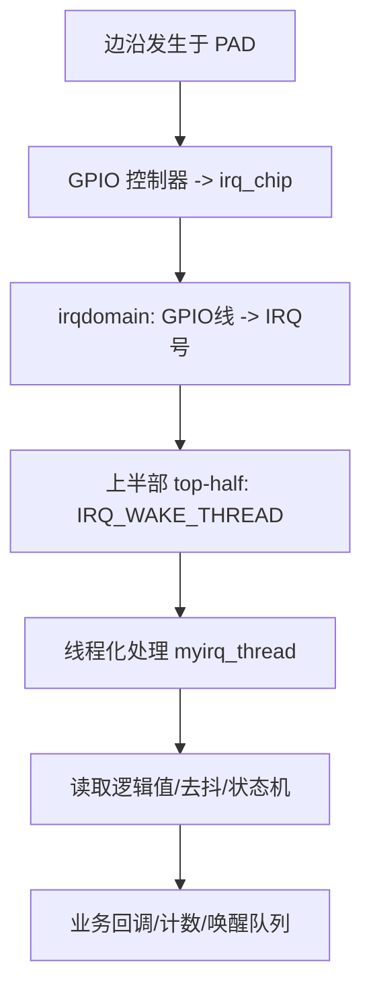
```mermaid
flowchart TD
A[边沿发生于 PAD] --> B[GPIO 控制器 -> irq_chip]
B --> C[irqdomain: GPIO线 -> IRQ号]
C --> D[上半部 top-half: IRQ_WAKE_THREAD]
D --> E[线程化处理 myirq_thread]
E --> F[读取逻辑值/去抖/状态机]
F --> G[业务回调/计数/唤醒队列]
```

### 6.6.2_唤醒时序(sequenceDiagram)

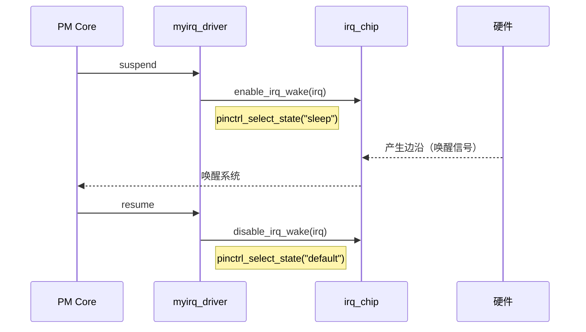
```mermaid
sequenceDiagram
participant PM as PM Core
participant DRV as myirq_driver
participant IRQ as irq_chip
participant HW as 硬件

PM->>DRV: suspend
DRV->>IRQ: enable_irq_wake(irq)
Note right of DRV: pinctrl_select_state("sleep")
HW-->>IRQ: 产生边沿（唤醒信号）
IRQ-->>PM: 唤醒系统
PM->>DRV: resume
DRV->>IRQ: disable_irq_wake(irq)
Note right of DRV: pinctrl_select_state("default")
```

------

## 6.7_调试与验证(Checklist)

| 现象                     | 快速定位                      | 可能原因                                      | 解决                                               |
| ------------------------ | ----------------------------- | --------------------------------------------- | -------------------------------------------------- |
| 收不到中断               | `cat /proc/interrupts` 无计数 | 触发类型不符/极性配置错                       | 校正 `irq_set_irq_type()` 与 DT `GPIO_ACTIVE_*`    |
| 收到一串抖动             | 秒级多发                      | 硬件无上拉/下拉或接线过长                     | 开启 `gpiod_set_debounce()`；软件时间窗丢弃；加 RC |
| `EBUSY` 请求失败         | `gpioinfo` 显示被占用         | 行被其他驱动/工具持有                         | 释放冲突 consumer，或更换线                        |
| 按下无事件、松开才有     | 极性/触发类型组合不当         | 低有效配合 RISING/FALLING 错                  | 对应修正（低有效按下通常是**下降沿**）             |
| 休眠唤不醒               | 没有 wake 设置                | 未调用 `enable_irq_wake()` 或设备未标记可唤醒 | `device_init_wakeup()+enable_irq_wake()`           |
| `_cansleep` 报上下文错误 | 在 top-half 调用会睡路径      | 没有线程化                                    | 使用 `request_threaded_irq()`，逻辑放线程里        |

------

## 6.8_小结

- **两条路**：能用 **gpio-keys** 就用它（省心、直接出 input 事件）；需要自定义逻辑就用 **threaded IRQ**。
- **四件套**：**触发类型**要对、**极性**要准、**去抖**要稳、**唤醒**要配。
- **协同**：与第 3 章的 **pinctrl default/sleep**、第 4 章的 **`\*_cansleep`** 原则、以及第 5 章的 **用户态验证**形成闭环。

**一句话总结：**
 **GPIO 中断的正确姿势 = 线程化中断 + 正确触发类型/极性 + 去抖 + 唤醒协同**；能复用 `gpio-keys` 就别自造轮子，自己写时遵循 `_cansleep` 与 pinctrl 状态机的基本法则。


按我们确认的“**子模块导向**”目录与你的排版标准，下面给出**完整第 7 章**（标准消费者子模块总览与实战）。本章聚焦 *现成驱动* 的工程化用法：**gpio-keys / gpio-leds / gpio-backlight / regulator-fixed (GPIO 使能) / gpio-mux / gpio-poweroff**，统一给出**属性矩阵 + 最小 DTS + 用户验证 + 调试要点**。Mermaid 为 Typora 通用语法；避免与标准属性同名的 label。

------

# 第7章_标准消费者子模块总览与实战

## 7.1_主题引入

**本章要解决的问题：**

* 当“只是想把某个功能接在 GPIO 上”时，是否需要自己写驱动？通常**不需要**。内核已经提供了大量**标准消费者子模块**（consumer drivers），直接在 **DeviceTree** 里用标准属性即可落地，包括：按键、LED、背光、稳压器使能、模拟/信号复用、关机/重启等。


**为什么重要：**

- 减少自定义驱动数量 → 代码更少、维护性更高；
- 配置在设备树 → **移植/换脚/变体机型**成本极低；
- 框架内置 **PM/事件/权限** 等通用机制 → 更稳。

------

## 7.2_子模块选型总览(一页表)

| 需求类别                        | 首选子模块                       | 典型属性                                                     | 用户空间验证                        |
| ------------------------------- | -------------------------------- | ------------------------------------------------------------ | ----------------------------------- |
| 物理按键/开关 → input 事件      | **gpio-keys**                    | `gpios`、`linux,code`、`debounce-interval`、`wakeup-source`  | `evtest /dev/input/eventX`          |
| 单色/多色 LED、触发器           | **gpio-leds**                    | `gpios`、`default-state`、`linux,default-trigger`、`function`、`color` | `/sys/class/leds/*/`                |
| 简单背光（GPIO 开关/占空）      | **gpio-backlight**               | `gpios`、`default-brightness-level`                          | `/sys/class/backlight/*/brightness` |
| GPIO 控电/使能 LDO/DC-DC        | **regulator-fixed**（GPIO 使能） | `enable-active-high`、`gpio`、`regulator-boot-on`、`vin-supply` | `debugfs` regulator；消费端能工作   |
| 用 GPIO 控制外部模拟/数字复用器 | **gpio-mux**                     | `mux-gpios`、`idle-state`                                    | 功能通断/信号路由验证               |
| 用 GPIO 拉低关机/复位           | **gpio-poweroff / gpio-restart** | `gpios`、`active-low`、`timeout-ms`                          | `poweroff` / `reboot` 行为          |

> 以上都是**现成驱动**，无需自定义 C 代码。重点是写对 **DTS**，并知道如何验证。

------

## 7.3_内核/框架视角(简要)

- **gpio-keys → input 子系统**：把 GPIO 边沿事件转为 `EV_KEY`。
- **gpio-leds → LED class**：统一出 `/sys/class/leds/<name>/`，支持 `trigger`（心跳、磁盘活动等）。
- **gpio-backlight → backlight class**：出 `/sys/class/backlight/<name>/brightness`。
- **regulator-fixed → regulator 框架**：外设通过 `<supply>-supply` 引用稳压器节点，框架统一时序/依赖。
- **gpio-mux → MUX 框架**：通过 GPIO 组合选择外部多路器的通道。
- **gpio-poweroff / gpio-restart → PM/重启**：在关机/重启阶段拉特定 GPIO 完成动作。

------

## 7.4_gpio-keys(按键_to_input_事件)

### 7.4.1_属性矩阵(常用)

| 属性                | 含义           | 说明/取值                           |
| ------------------- | -------------- | ----------------------------------- |
| `gpios`             | 指定按键输入线 | `<&gpioX pin GPIO_ACTIVE_LOW/HIGH>` |
| `linux,code`        | 键值           | 如 `<KEY_ENTER>`、`<KEY_VOLUMEUP>`  |
| `label`             | 键名           | 可选，便于区分                      |
| `debounce-interval` | 软件去抖       | 毫秒，典型 5–20                     |
| `wakeup-source`     | 唤醒源         | 存在则可唤醒系统                    |
| `autorepeat`        | 长按连发       | 可选                                |

### 7.4.2_最小_DTS

```dts
&pinctrl {
    pinctrl_btn_default: btn_default {
        fsl,pins = <
            MX6UL_PAD_GPIO1_IO05__GPIO1_IO05 0x10B1
        >;
    };
};

gpio_keys: gpio-keys {
    compatible = "gpio-keys";
    pinctrl-names = "default";
    pinctrl-0 = <&pinctrl_btn_default>;

    button_enter: button@0 {
        gpios = <&gpio1 5 GPIO_ACTIVE_LOW>;
        linux,code = <KEY_ENTER>;
        label = "user-enter";
        debounce-interval = <10>;
        wakeup-source;
    };
};
```

### 7.4.3_用户验证

```bash
gpiodetect
gpioinfo gpiochip0 | grep -i "user-enter"

# 事件监听
sudo evtest /dev/input/eventX
# 或：libinput-debug-events（桌面）
```

### 7.4.4_事件链路(sequenceDiagram)

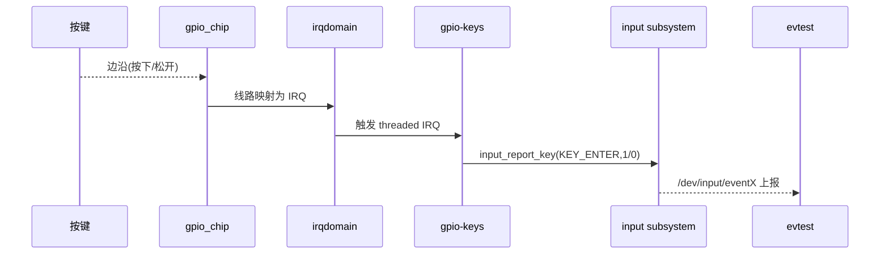
```mermaid
sequenceDiagram
participant HW as 按键
participant GPIO as gpio_chip
participant IRQ as irqdomain
participant DRV as gpio-keys
participant IN as input subsystem
participant APP as evtest

HW-->>GPIO: 边沿(按下/松开)
GPIO->>IRQ: 线路映射为 IRQ
IRQ->>DRV: 触发 threaded IRQ
DRV->>IN: input_report_key(KEY_ENTER,1/0)
IN-->>APP: /dev/input/eventX 上报
```

**调试要点**：边沿混乱多半是**上拉/下拉或去抖**；先硬件上拉，再用 `debounce-interval` 或控制器 `set_debounce`。

------

## 7.5_gpio-leds(LED_与触发器)

### 7.5.1_属性矩阵(常用)

| 属性                    | 含义       | 说明/取值                                               |
| ----------------------- | ---------- | ------------------------------------------------------- |
| `gpios`                 | LED 控制线 | `<&gpioX pin GPIO_ACTIVE_LOW/HIGH>`                     |
| `default-state`         | 默认状态   | `"on"` / `"off"` / `"keep"`                             |
| `linux,default-trigger` | 默认触发器 | `"heartbeat"` / `"mmc0"` / `"cpu0"` …                   |
| `function` / `color`    | 语义化命名 | 如 `function = "status"; color = <LED_COLOR_ID_GREEN>;` |

### 7.5.2_最小_DTS

```dts
&pinctrl {
    pinctrl_led_default: led_default {
        fsl,pins = <
            MX6UL_PAD_GPIO1_IO03__GPIO1_IO03 0x10B0
        >;
    };
};

leds {
    compatible = "gpio-leds";
    pinctrl-names = "default";
    pinctrl-0 = <&pinctrl_led_default>;

    led_status {
        gpios = <&gpio1 3 GPIO_ACTIVE_LOW>;
        default-state = "off";
        linux,default-trigger = "heartbeat";
        function = "status";
        color = <LED_COLOR_ID_GREEN>;
    };
};
```

### 7.5.3_用户验证

```bash
ls /sys/class/leds/
cat /sys/class/leds/status:green:status/trigger
echo none | sudo tee /sys/class/leds/status:green:status/trigger
echo 1   | sudo tee /sys/class/leds/status:green:status/brightness
echo 0   | sudo tee /sys/class/leds/status:green:status/brightness
```

**流程图（flowchart）**

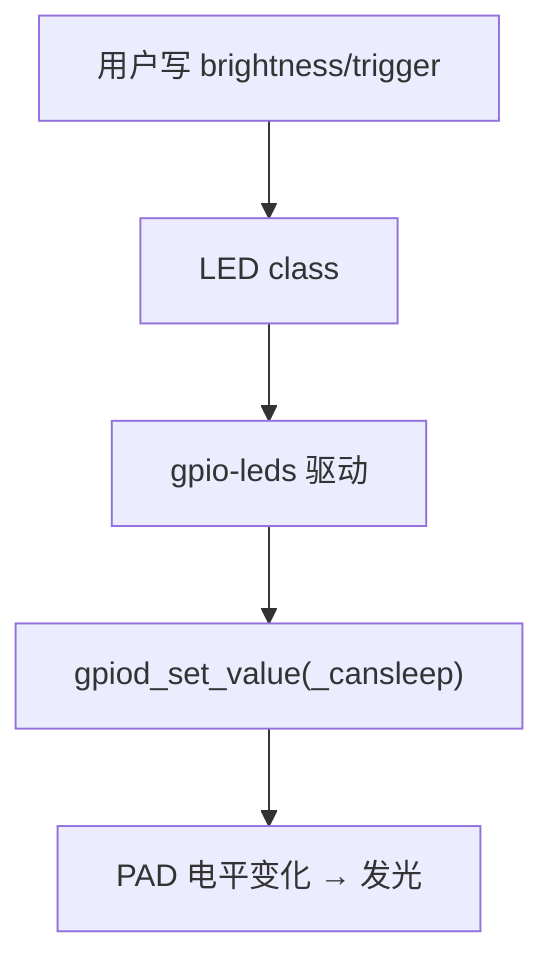
```mermaid
flowchart TD
A["用户写 brightness/trigger"] --> B[LED class]
B --> C["gpio-leds 驱动"]
C --> D["gpiod_set_value(_cansleep)"]
D --> E["PAD 电平变化 → 发光"]
```

**调试要点**：亮灭反常 → 检查 `GPIO_ACTIVE_LOW`；触发器不生效 → 先 `echo none > trigger` 再手动验证。

------

## 7.6_gpio-backlight(简单背光)

### 7.6.1_属性矩阵(常用)

| 属性                       | 含义               | 说明                                   |
| -------------------------- | ------------------ | -------------------------------------- |
| `gpios`                    | 背光开关/占空 GPIO | 高/低有效                              |
| `default-brightness-level` | 上电默认亮度       | 整数；实现多为开关型，亮度常映射为 0/1 |

### 7.6.2_最小_DTS

```dts
&pinctrl {
    pinctrl_bl_default: bl_default {
        fsl,pins = <
            MX6UL_PAD_GPIO1_IO10__GPIO1_IO10 0x10B0
        >;
    };
};

backlight {
    compatible = "gpio-backlight";
    pinctrl-names = "default";
    pinctrl-0 = <&pinctrl_bl_default>;
    gpios = <&gpio1 10 GPIO_ACTIVE_HIGH>;
    default-brightness-level = <1>;
};
```

### 7.6.3_用户验证

```bash
ls /sys/class/backlight/
cat /sys/class/backlight/gpio-backlight/brightness
echo 0 | sudo tee /sys/class/backlight/gpio-backlight/brightness
echo 1 | sudo tee /sys/class/backlight/gpio-backlight/brightness
```

**调试要点**：部分面板需要电源/时序；确保 **regulator/enable-reset** 已就绪（见 7.7/7.9）。

------

## 7.7_regulator-fixed(GPIO_使能的稳压器)

> 目标：用一根 GPIO 作为 **电源使能**，供其它外设节点通过 `<supply>-supply` 引用。

### 7.7.1_属性矩阵(常用)

| 属性                             | 含义                                                 |
| -------------------------------- | ---------------------------------------------------- |
| `compatible = "regulator-fixed"` | 固定电压稳压器                                       |
| `enable-active-high`             | 使能极性（若省略则可能默认为低有效，依具体 binding） |
| `gpio`                           | 使能 GPIO                                            |
| `regulator-boot-on`              | 开机即使能                                           |
| `vin-supply`                     | 上级电源依赖                                         |

### 7.7.2_最小_DTS

```dts
reg_3v3: regulator-3v3 {
    compatible = "regulator-fixed";
    regulator-name = "vcc-3v3";
    regulator-boot-on;
    enable-active-high;
    gpio = <&gpio2 7 GPIO_ACTIVE_HIGH>;
    vin-supply = <&reg_5v>;
};

eth@1 {
    compatible = "vendor,eth";
    phy-supply = <&reg_3v3>;    /* 消费者通过 *-supply 引用 */
    /* ... */
};
```

### 7.7.3_用户/调试

```bash
# 看电源树与状态
sudo cat /sys/kernel/debug/regulator/regulator_summary | grep -E 'vcc-3v3|eth'
```

**要点**：不要在消费者驱动里“手抠 GPIO 使能”，统一走 **regulator**，电源顺序/引用更安全。

------

## 7.8_gpio-mux(用_GPIO_选择外部多路器通道)

### 7.8.1_属性矩阵(常用)

| 属性                     | 含义                                    |
| ------------------------ | --------------------------------------- |
| `mux-gpios`              | 一组用于选择的 GPIO（可多根，组合编码） |
| `idle-state`             | 空闲态选择（如 `0`/`1`/`2`…）           |
| `states`（部分 binding） | 通道枚举/映射说明                       |

### 7.8.2_最小_DTS

```dts
mux0: mux-controller {
    compatible = "gpio-mux";
    mux-gpios = <&gpio3 1 GPIO_ACTIVE_HIGH>,
                <&gpio3 2 GPIO_ACTIVE_HIGH>;
    idle-state = <0>;  /* 两根线 00 → 通道0 */
};

# 消费者设备可以通过特定子系统引用 mux0 的通道（依具体绑定）
```

**验证思路**：随输入切换实际被路由的信号（例如音频/射频/ADC 通道），配合示波器/业务层读数验证。

------

## 7.9_gpio-poweroff_/_gpio-restart(GPIO_控制关机/重启)

### 7.9.1_最小_DTS(关机)

```dts
gpio_poweroff: gpio-poweroff {
    compatible = "gpio-poweroff";
    gpios = <&gpio4 5 GPIO_ACTIVE_LOW>;
    timeout-ms = <3000>;   /* 保持拉低时间 */
};
```

> 调用 `poweroff` 时，驱动会拉该 GPIO，触发板级关机电路/PMIC。

### 7.9.2_最小_DTS(重启)

```dts
gpio_restart: gpio-restart {
    compatible = "gpio-restart";
    gpios = <&gpio4 6 GPIO_ACTIVE_LOW>;
    priority = <200>;      /* 覆盖默认重启处理优先级 */
    active-delay-ms = <100>; /* 拉低保持 */
};
```

**验证**：执行 `poweroff`/`reboot`；若无响应，检查极性、拉低保持时间与外部电路逻辑。

------

## 7.10_统一调用链图(概览)

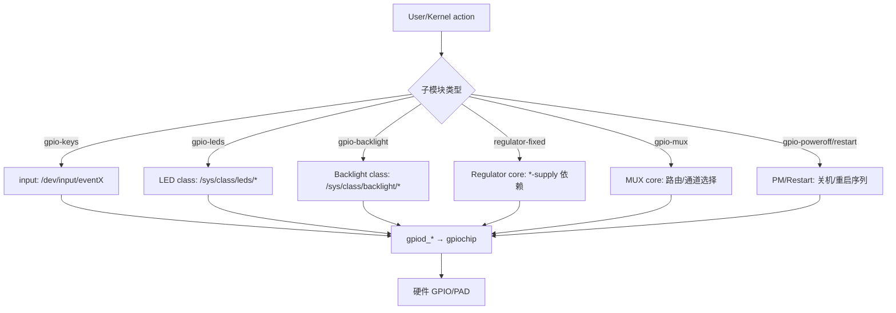
```mermaid
flowchart TD
A[User/Kernel action] --> B{子模块类型}
B -->|gpio-keys| C[input: /dev/input/eventX]
B -->|gpio-leds| D[LED class: /sys/class/leds/*]
B -->|gpio-backlight| E[Backlight class: /sys/class/backlight/*]
B -->|regulator-fixed| F[Regulator core: *-supply 依赖]
B -->|gpio-mux| G[MUX core: 路由/通道选择]
B -->|gpio-poweroff/restart| H[PM/Restart: 关机/重启序列]
C-->I[gpiod_* → gpiochip]
D-->I
E-->I
F-->I
G-->I
H-->I
I-->J[硬件 GPIO/PAD]
```

------

## 7.11_调试与验证(通用_Checklist)

| 现象                 | 优先查看                                   | 可能原因              | 处理                                         |
| -------------------- | ------------------------------------------ | --------------------- | -------------------------------------------- |
| 行被占用 `EBUSY`     | `gpioinfo` consumer 名称                   | 被别的子模块/驱动持有 | 释放冲突或换线                               |
| 亮灭/按键逻辑颠倒    | `GPIO_ACTIVE_LOW/HIGH`                     | 极性错误              | 修正 flags                                   |
| 事件抖动多发         | `debounce-interval` / `gpiod_set_debounce` | 无硬件上拉/线缆过长   | 加上拉/RC，软件去抖                          |
| 背光不亮             | regulator/时序未就绪                       | 依赖没拉起            | 用 regulator-fixed/时序核查                  |
| 关机/重启无效        | 外部电路条件不符                           | 极性/保持时间不对     | 调 `active-delay-ms/timeout-ms`              |
| DTS 看似正确但不生效 | `pinctrl` 未切到 GPIO                      | 复用冲突/漏配         | `pinmux-pins`/`pinconf-pins` 核对（第 3 章） |

------

## 7.12_小结

- **优先复用标准子模块**：多数“GPIO + 某功能”的需求，**无需写驱动**。
- **四件套**：**属性矩阵**要对、**最小 DTS**要全、**用户验证**要闭环、**调试清单**要上手。
- **协同**：与第 3 章（pinctrl）、第 4 章（`*_cansleep`）、第 5 章（libgpiod）与第 6 章（中断）形成整体工程方法论。

**一句话总结：**
 👉 **能用子模块就用子模块：把复杂留给框架，把变更留给设备树。**

------

我是 **GPT-5 Thinking**。

------

# 第8章_设备树_GPIO_绑定通用范式

## 8.1_主题引入

**本章要解决的问题：**

- 设备树里 GPIO 的**通用书写范式**是什么？`<name>-gpios = <&chip pin flags>` 的每一项代表什么？
- `GPIO_ACTIVE_LOW/HIGH`、`GPIO_OPEN_DRAIN/SOURCE`、`GPIO_PULL_*` 等 **flags** 如何配合 **pinctrl** 电气设置？
- 如何用 `gpio-line-names` 统一命名、用 `gpio-hog` 设定上电默认态、用 `gpio-ranges` 对齐 pinctrl 与 gpiolib？


**为什么重要：**
 GPIO 绑定是**驱动无感**的“协议层”。写对它，换脚/换板/量产变体都只改 DTS；写错它，驱动再完美也“拉不动电平”。

> 时间线提示：本章描述的绑定范式自 **4.x** 即稳定，至 **6.1+** 仍然适用；个别 flags/控制器能力与具体 SoC 有差异，会在文中说明。

------

## 8.2_数据结构视角(绑定要素与结构)

### 8.2.1_控制器节点(provider)

一个 GPIO 控制器（通常在 pinctrl/IOMUX 节点下或并列）应具备：

```dts
gpio1: gpio@0209c000 {
    compatible = "fsl,imx6ul-gpio";  /* 举例：i.MX6ULL */
    reg = <0x0209c000 0x4000>;
    interrupts = <GIC_SPI 66 IRQ_TYPE_LEVEL_HIGH>;
    gpio-controller;                 /* 关键：声明为 GPIO 提供者 */
    #gpio-cells = <2>;               /* 常见为 2：<pin flags> */
    gpio-line-names = "LED_STAT", "BTN_USER", /* ...数量=ngpio ... */;
    /* 可选：与 pinctrl 对齐的 ranges（见 8.2.4） */
    gpio-ranges = <&iomuxc 0 0 32>;  /* 含义：从 pinctrl 起始 0 到本控制器 0，共 32 个 */
};
```

- **`gpio-controller`**：声明“我是一个 GPIO 提供者”。
- **`#gpio-cells`**：GPIO 规格器（specifier）的单元数，用于描述gpio的引脚的表达方式。它的值表示为一个数字，该数字表示用于描述gpio引脚的参数个数：
  - **2**（最常见）：`<pin flags>`。
  - **3**（少数控制器）：`<port pin flags>` 或 `<bank pin flags>`。
- **`gpio-line-names`**（可选）：为每条线起“人类可读名字”（便于 `gpioinfo`、调试与生产测试）。

> **兼容差异**：大多数主流 SoC（NXP i.MX、Rockchip、TI、Allwinner 等）采用 `#gpio-cells = <2>`。若控制器使用 **3 cells**，文档会明确说明其含义（例：`<bank pin flags>`）。

------

### 8.2.2_消费者节点(consumer)与_<name>-gpios

消费者节点通过 **`<name>-gpios`** 属性指向具体 GPIO 线：

```dts
mydev@0 {
    compatible = "leaf,my-consumer";
    /* pinctrl 负责把 PAD 复用为 GPIO，详见第 3 章 */
    pinctrl-names = "default";
    pinctrl-0 = <&pinctrl_mydev_default>;

    reset-gpios = <&gpio1 7 GPIO_ACTIVE_HIGH>;  /* 单根线 */
    ctrl-gpios  = <&gpio2 1 GPIO_ACTIVE_HIGH>,  /* 多根线，按索引 0/1 获取 */
                  <&gpio2 2 GPIO_ACTIVE_HIGH>;
    /* ... */
};
```

**解析规则**：

- `<&gpioX ...>` 是 **phandle** 指向 provider；后续单元在 provider 的 `#gpio-cells` 解释下解码。
- 常见 **flags** 来自 `include/dt-bindings/gpio/gpio.h`：
  - **极性**：`GPIO_ACTIVE_HIGH`/`GPIO_ACTIVE_LOW`
  - **驱动**：`GPIO_OPEN_DRAIN`/`GPIO_OPEN_SOURCE`
  - **偏置**：`GPIO_PULL_UP`/`GPIO_PULL_DOWN`/`GPIO_PULL_DISABLE`
- **多根线**用逗号分隔；驱动端通过 `devm_gpiod_get_index()` 获取索引 **0..N-1**。

------

### 8.2.3_flags_的作用域(与_pinconf_的关系)

| 分类        | flags（放在 `<name>-gpios`） | pinconf（放在 pinctrl 状态）          | 谁生效                                     |
| ----------- | ---------------------------- | ------------------------------------- | ------------------------------------------ |
| 极性        | `GPIO_ACTIVE_LOW/HIGH`       | —                                     | **gpiolib/驱动层**：逻辑↔物理映射          |
| 开漏/开源   | `GPIO_OPEN_DRAIN/SOURCE`     | 部分 SoC 也可在 pinconf 设定          | **共同**：gpiolib 可模拟，控制器可硬件支持 |
| 逻辑偏置    | `GPIO_PULL_UP/DOWN/DISABLE`  | `pinconf` 的 bias 上拉/下拉           | **建议以 pinconf 为准**（更接近硬件）      |
| 强驱动/速率 | —                            | `pinconf`（drive-strength/slew-rate） | **pinconf**                                |

> **工程建议**：**电气与时序尽量放在 pinconf（pinctrl）**；`<name>-gpios` 的 flags 主要表达**语义（极性/开漏）\**与\**最小偏置**，保持分层清晰。

------

### 8.2.4_gpio-ranges_与_pinctrl_的对齐

`gpio-ranges` 用来把 **GPIO line 编号空间**与 **pinctrl pin 索引**对齐，便于调试/查表及某些平台的跨框架协作：

```dts
gpio1: gpio@... {
    gpio-controller;
    #gpio-cells = <2>;
    gpio-ranges = <&iomuxc 0 0 32>;  /* pinctrl起始 0 ↔ gpio1 起始 0 ↔ 数量 32 */
};
```

不是所有平台都要求该属性；但在多 bank/跨控制器平台上，配齐能减少“编号对不上”的困惑。

------

### 8.2.5_gpio-line-names(统一命名)

在 **provider** 上声明各线含义，`gpioinfo` 会显示：

```dts
gpio1: gpio@... {
    gpio-controller;
    #gpio-cells = <2>;
    gpio-line-names = "LED_STAT", "BTN_USER", "MODE_SW", "RF_EN", /* ...共ngpio */;
};
```

好处：生产测试脚本无需记偏移；与文档、原理图统一。

------

### 8.2.6_gpio-hog(上电即占用)

在 **provider** 下创建子节点，声明某条线在**内核早期**即被驱动为固定输入/输出：

```dts
gpio1: gpio@... {
    gpio-controller;
    #gpio-cells = <2>;

    keep_rf_off {
        gpio-hog;
        gpios = <12 GPIO_ACTIVE_HIGH>; /* hog使用 gpios 指定“控制器内部 pin 编号+flags” */
        output-low;                     /* 选一：input / output-low / output-high */
        line-name = "RF_KILL";
    };
};
```

> **典型用途**：上电先“拉低禁用某电源/射频”，待驱动接管后再释放或改变。

------

## 8.3_开发者视角(通用写法与最小示例)

### 8.3.1_模式_A_单根线(必选)

**DTS**

```dts
mydev@0 {
    compatible = "leaf,my-consumer";
    pinctrl-names = "default";
    pinctrl-0 = <&pinctrl_mydev_default>;
    reset-gpios = <&gpio1 7 GPIO_ACTIVE_HIGH>;
};
```

**驱动（获取+安全输出）**

```c
struct gpio_desc *g_reset;
bool alow;

/* probe 中 */
g_reset = devm_gpiod_get(dev, "reset", GPIOD_OUT_LOW); /* 先设安全态 */
if (IS_ERR(g_reset)) return PTR_ERR(g_reset);
alow = gpiod_is_active_low(g_reset);

/* 需要拉复位：逻辑 1 表示“复位有效”，底层负责极性映射 */
gpiod_set_value_cansleep(g_reset, 1);
/* 释放复位 */
gpiod_set_value_cansleep(g_reset, 0);
```

------

### 8.3.2_模式_B_多根线(按索引)

**DTS**

```dts
mydev@0 {
    compatible = "leaf,my-consumer";
    ctrl-gpios = <&gpio2 1 GPIO_ACTIVE_HIGH>,
                 <&gpio2 2 GPIO_ACTIVE_HIGH>;
};
```

**驱动**

```c
struct gpio_desc *g_ctrl[2];
for (int i = 0; i < 2; i++) {
    g_ctrl[i] = devm_gpiod_get_index(dev, "ctrl", i, GPIOD_OUT_LOW);
    if (IS_ERR(g_ctrl[i])) return PTR_ERR(g_ctrl[i]);
}
/* 使用：索引 0/1 即对应 DTS 顺序 */
gpiod_set_value_cansleep(g_ctrl[0], 1);
gpiod_set_value_cansleep(g_ctrl[1], 0);
```

------

### 8.3.3_模式_C_可选线(属性可有可无)

**DTS**

```dts
mydev@0 {
    compatible = "leaf,my-consumer";
    irq-gpios = <&gpio3 5 GPIO_ACTIVE_LOW>; /* 也许某些机型不焊接 */
};
```

**驱动**

```c
struct gpio_desc *g_irq;
g_irq = devm_gpiod_get_optional(dev, "irq", GPIOD_IN);
if (IS_ERR(g_irq)) return PTR_ERR(g_irq);
if (g_irq) {
    /* 有这根线才注册中断/事件 */
}
```

------

### 8.3.4_模式_D_开漏(Open-Drain)与极性

**DTS**

```dts
mydev@0 {
    compatible = "leaf,my-consumer";
    alert-gpios = <&gpio1 9 (GPIO_ACTIVE_LOW | GPIO_OPEN_DRAIN)>;
};
```

**说明与建议**

- **开漏**常见于**线与电源的“拉低触发”**，例如外设复位脚、RF 开关等；
- 若硬件有上拉电阻，**释放**时应保证线被“拉高/高阻”；`GPIO_OPEN_DRAIN` 会让 gpiolib 采取**只拉低/不强拉高**策略；
- 和 pinconf 的 **bias** 上拉/下拉配置**配合使用**，以确保释放态稳定。

------

### 8.3.5_模式_E_gpio-hog(默认拉低外设使能)

**DTS（provider 下）**

```dts
gpio2: gpio@... {
    gpio-controller;
    #gpio-cells = <2>;

    hold_periph_off {
        gpio-hog;
        gpios = <7 GPIO_ACTIVE_HIGH>;
        output-low;          /* 上电即拉低：关闭某外设 */
        line-name = "PERIPH_EN";
    };
};
```

> 这会在**内核早期**就把 `GPIO2_7` 拉低，避免外设乱入电源/噪声状态；等消费者驱动加载后再接管。

------

### 8.3.6_模式_F_gpio-line-names(统一命名与测试)

**DTS（provider）**

```dts
gpio1: gpio@... {
    gpio-controller;
    #gpio-cells = <2>;
    gpio-line-names = "LED_STAT","BTN_USER","MODE_SW","RF_EN", /* ... */;
};
```

**用户验证**

```bash
gpioinfo gpiochip0 | sed -n '1,25p'
# 可看到每行的 name/consumer/flags
```

------

## 8.4_用户视角(如何验证绑定是否正确)

### 8.4.1_直接查看设备树(运行时)

```bash
# 方式一：从 /sys 反编译（多数发行版提供）
sudo dtc -I fs -O dts /sys/firmware/devicetree/base | less

# 方式二：定位特定节点/属性
grep -R "my-consumer" -n /proc/device-tree 2>/dev/null
```

### 8.4.2_查看_GPIO_芯片与线状态

```bash
gpiodetect
gpioinfo gpiochip0     # 关注 line name / consumer / active-low / open-drain 等
sudo cat /sys/kernel/debug/gpio  # 可看到 hog、占用者、方向等
```

### 8.4.3_交叉验证_pinctrl(与第_3_章配合)

```bash
sudo mount -t debugfs none /sys/kernel/debug
grep -E 'GPIO.*|mydev_default' /sys/kernel/debug/pinctrl/*/pinmux-pins
grep -E 'GPIO.*'               /sys/kernel/debug/pinctrl/*/pinconf-pins
```

### 8.4.4_基本读写/事件测试(用户态)

```bash
# 注意：若该线被驱动持有，会返回 EBUSY
gpioget gpiochip0 7
gpioset -m exit gpiochip0 7=1
gpiomon --rising --falling gpiochip0 5
```

------

## 8.5_可视化图示

### 8.5.1_绑定解析流程(flowchart)

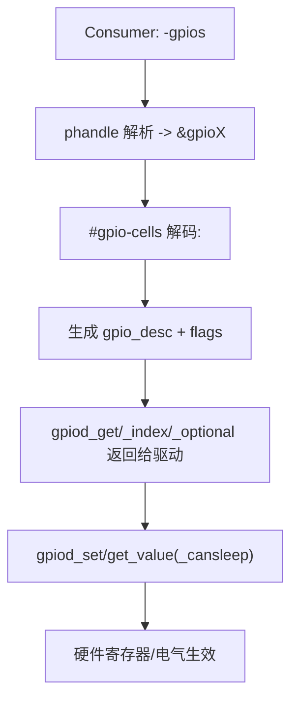
```mermaid
flowchart TD
A[Consumer: <name>-gpios] --> B[phandle 解析 -> &gpioX]
B --> C["#gpio-cells 解码: <pin[,bank] flags>"]
C --> D[生成 gpio_desc + flags]
D --> E[gpiod_get/_index/_optional 返回给驱动]
E --> F["gpiod_set/get_value(_cansleep)"]
F --> G[硬件寄存器/电气生效]
```

### 8.5.2_目录结构与验证路径(tree)

```
/sys/firmware/devicetree/base/
 ├─ gpio@... (provider)       # gpio-controller, #gpio-cells, gpio-line-names, gpio-ranges
 ├─ mydev@0 (consumer)        # reset-gpios, ctrl-gpios, ...
/sys/kernel/debug/
 ├─ gpio                       # 全局占用、hog、方向
 └─ pinctrl/...                # pinmux-pins / pinconf-pins
```

------

## 8.6_调试与验证(Checklist)

| 现象               | 快速定位                   | 常见原因                                   | 处理                                             |
| ------------------ | -------------------------- | ------------------------------------------ | ------------------------------------------------ |
| `-EINVAL` 解析失败 | dmesg + `dtc -I fs`        | `#gpio-cells` 不匹配、specifier 单元数写错 | 对照 SoC binding 文档修正单元数                  |
| 逻辑颠倒           | `gpioinfo` 显示 active-low | flags 写反                                 | 改为 `GPIO_ACTIVE_LOW` 或修正硬件                |
| 写入无效           | `pinmux-pins` 非 GPIO      | pinctrl 未复用为 GPIO / 冲突               | 修正 `pinctrl-0`；查重复用                       |
| `EBUSY` 占用       | `gpioinfo`/debugfs         | 被别的驱动/工具持有                        | 换线或释放占用                                   |
| 上电异常           | debugfs `gpio` 中看到 hog  | hog 配置不当                               | 调整 `output-low/high` 或移除 hog                |
| 抖动多发           | gpiomon / 驱动计数         | 硬件无上拉/线长/电磁干扰                   | pinconf bias 上拉/下拉 + `set_debounce`/软件去抖 |
| 控制器编号混乱     | `gpio-ranges` 缺失         | 多 bank 映射不清                           | 补充 `gpio-ranges` 与文档对齐                    |
| 名称混乱           | `gpio-line-names` 缺失     | 没起名/与原理图不一致                      | 填写 line-names，统一文档与测试                  |

------

## 8.7_小结

### 8.7.1_一页式要点表

| 要点           | 建议                                                        |
| -------------- | ----------------------------------------------------------- |
| `<name>-gpios` | 用 `<&gpioX pin flags>`，多根按索引取                       |
| flags 用途     | 极性/开漏/最小偏置放 `<name>-gpios`；**电气细节放 pinconf** |
| 命名           | 在 provider 写 `gpio-line-names`，统一文档/测试             |
| 默认态         | 早期需要固定电平→用 `gpio-hog`                              |
| 对齐           | 多 bank/多控制器建议写 `gpio-ranges`                        |
| 验证           | `dtc -I fs`/`gpioinfo`/`debugfs(gpio,pinctrl)` 交叉验证     |

**一句话总结：**
 **让“语义与连接”写在 `<name>-gpios`，让“电气与时序”落在 pinctrl；命名用 `gpio-line-names`，上电态用 `gpio-hog`，多控制器对齐用 `gpio-ranges`。**

------

# 第9章_GPIO_扩展器与桥接器(I²C_/_SPI_/_PMIC)

## 9.1_主题引入

**本章要解决的问题：**
 当片上 GPIO 不够或需要隔离/跨板时，如何选择/使用 **I²C/SPI GPIO 扩展器**？如何在**设备树**正确绑定，在**驱动**里安全使用（`_cansleep`、threaded IRQ、批量 I/O），并在**用户态**验证事件与电平？

**为什么重要：**

- 扩展器把 GPIO 搬到**慢总线**，带来**时延/并发/抖动**等新约束；
- 很多扩展器带**中断聚合、去抖、PWM**等特性，合理使用可大幅减负；
- 选择/配置一旦不当，会出现“偶现翻车”：丢沿、卡顿、占用冲突。

------

## 9.2_数据结构与内核路径(概览)

### 9.2.1_逻辑关系

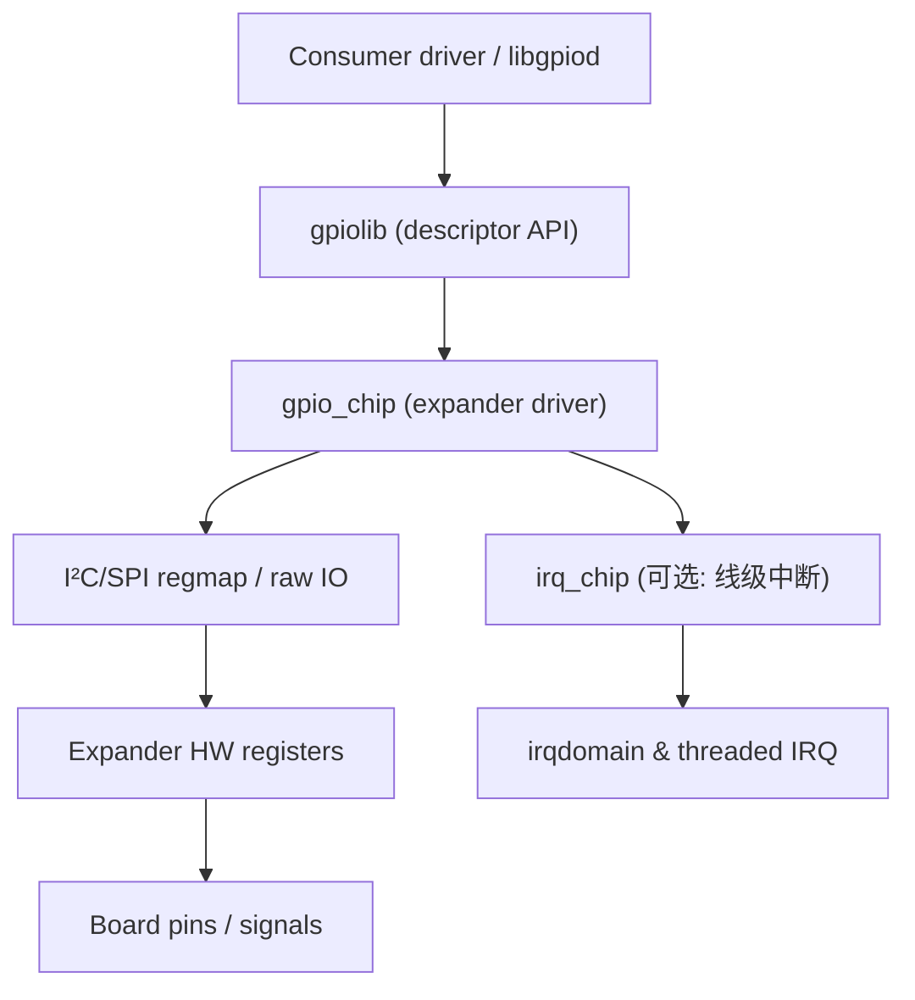
```mermaid
flowchart TD
A[Consumer driver / libgpiod] --> B["gpiolib (descriptor API)"]
B --> C["gpio_chip (expander driver)"]
C --> D[I²C/SPI regmap / raw IO]
D --> E[Expander HW registers]
E --> F[Board pins / signals]
C --> G["irq_chip (可选: 线级中断)"]
G --> H[irqdomain & threaded IRQ]
```

**要点**

- 扩展器的 `gpio_chip.can_sleep = true` → **驱动/上层必须走 `\*_cansleep`**；
- 存在 `irq_chip` 的扩展器可把**多条线事件**汇总到**一根中断**（中断聚合）。

### 9.2.2_常见器件能力对比(简表)

| 器件         | 总线 | 线数 | 中断                       | 去抖/滤波        | 额外特性               | 典型用例                   |
| ------------ | ---- | ---- | -------------------------- | ---------------- | ---------------------- | -------------------------- |
| **PCF8574**  | I²C  | 8    | 无（仅引脚层次，通常轮询） | 否               | 准双向端口             | 最简单的扩展，低速控制指示 |
| **MCP23017** | I²C  | 16   | 有（两路 INT）             | 否               | 方向/极性/上拉寄存器   | 多键输入、通用 IO          |
| **TCA9539**  | I²C  | 16   | 有（单/双 INT，低有效）    | 限               | 简明寄存器映射         | 大量输入、边沿响应         |
| **SX1509**   | I²C  | 16   | 有                         | 有（寄存器去抖） | **内建 PWM、键盘引擎** | 键盘矩阵、呼吸灯           |
| **MCP23S17** | SPI  | 16   | 有                         | 否               | 与 MCP23017 类似       | SPI 场景/更高吞吐          |

> 以上为**概念级**对比；具体绑定与属性以对应内核 binding 文档为准。

------

## 9.3_设备树绑定(Provider_与_Consumer)

> 下面是**典型片段**，用于说明结构与关键属性；请按目标器件的 binding 文档具体调整。

### 9.3.1_I²C_MCP23017(带中断)

```dts
i2c1: i2c@40066000 {
    /* ... I²C 控制器属性略 ... */

    exp_mcp23017: gpio-expander@20 {
        compatible = "microchip,mcp23017";
        reg = <0x20>;
        gpio-controller;
        #gpio-cells = <2>;                 /* <pin flags> */
        interrupt-controller;               /* 线级中断提供者 */
        #interrupt-cells = <2>;             /* <pin IRQ_TYPE_*> */
        interrupts = <GIC_SPI 150 IRQ_TYPE_LEVEL_LOW>; /* 与 SoC 连接的外部 INT */
        /* 可选：gpio-line-names，省略 */
    };
};

/* Consumer: 用 expander 的第3号脚作为输入中断线，和第7号脚作为复位输出 */
periph@0 {
    compatible = "leaf,exp-consumer";
    intr-gpios = <&exp_mcp23017 3 GPIO_ACTIVE_LOW>;
    reset-gpios = <&exp_mcp23017 7 GPIO_ACTIVE_HIGH>;
    /* 也可使用来自扩展器的中断作为中断源（若需要）：
     * interrupts-extended = <&exp_mcp23017 3 IRQ_TYPE_EDGE_FALLING>;
     */
    status = "okay";
};
```

### 9.3.2_I²C_TCA9539(结构类似)

```dts
i2c1: i2c@40066000 {
    exp_tca9539: gpio-expander@74 {
        compatible = "ti,tca9539";
        reg = <0x74>;
        gpio-controller;
        #gpio-cells = <2>;
        interrupt-controller;
        #interrupt-cells = <2>;
        interrupts = <GIC_SPI 151 IRQ_TYPE_LEVEL_LOW>; /* INT# 低有效 */
    };
};
```

### 9.3.3_I²C_PCF8574(无专用中断_适合轮询或简化输入)

```dts
i2c1: i2c@40066000 {
    exp_pcf8574: gpio-expander@20 {
        compatible = "nxp,pcf8574";
        reg = <0x20>;
        gpio-controller;
        #gpio-cells = <2>;
        /* 无 interrupt-controller，一般不提供线级中断 */
    };
};
```

### 9.3.4_SPI_MCP23S17(SPI_版本)

```dts
spi2: spi@4003c000 {
    exp_mcp23s17: gpio-expander@0 {
        compatible = "microchip,mcp23s17";
        reg = <0>;                   /* 片选四号，依具体控制器 */
        spi-max-frequency = <10000000>;
        gpio-controller;
        #gpio-cells = <2>;
        interrupt-controller;
        #interrupt-cells = <2>;
        interrupts = <GIC_SPI 152 IRQ_TYPE_LEVEL_LOW>;
        /* 可选：microchip,spi-present-mask 等，依 binding */
    };
};
```

------

## 9.4_开发者视角_驱动使用范式(_cansleep_+_threaded_IRQ)

### 9.4.1_获取与读写(逻辑值_线程上下文)

```c
/* probe 中 */
struct gpio_desc *g_rst = devm_gpiod_get(dev, "reset", GPIOD_OUT_LOW);
if (IS_ERR(g_rst)) return PTR_ERR(g_rst);
/* 统一逻辑值语义，扩展器上必走 *_cansleep */
gpiod_set_value_cansleep(g_rst, 1);
gpiod_set_value_cansleep(g_rst, 0);
```

**原则**：**扩展器 = can_sleep=true**。在**可睡眠上下文**使用 `*_cansleep`；中断处理走**threaded IRQ**。

### 9.4.2_扩展器线级中断(threaded_IRQ_模板)

```c
/* 获取作为输入中断的线 */
struct gpio_desc *g_intr = devm_gpiod_get(dev, "intr", GPIOD_IN);
if (IS_ERR(g_intr))
    return PTR_ERR(g_intr);

int irq = gpiod_to_irq(g_intr);
if (irq < 0)
    return irq;

/* 触发类型：多数扩展器中断为“latch + 低有效”，建议 BOTH + 在线程中读寄存器确认 */
irq_set_irq_type(irq, IRQ_TYPE_EDGE_BOTH);

ret = devm_request_threaded_irq(dev, irq,
        NULL,                                   /* top-half最小化 */
        my_threaded_isr,                        /* 在线程里安全访问扩展器 */
        IRQF_ONESHOT | IRQF_TRIGGER_RISING | IRQF_TRIGGER_FALLING,
        "expander-event", data);
static irqreturn_t my_threaded_isr(int irq, void *data)
{
    /* 在线程上下文：允许 *_cansleep，或者由扩展器驱动内部完成寄存器清中断 */
    int v = gpiod_get_value_cansleep(((struct myctx*)data)->g_intr);
    if (v < 0) return IRQ_HANDLED;
    /* 根据逻辑电平或进一步的“状态寄存器读取”确认事件源 */
    /* ... do work ... */
    return IRQ_HANDLED;
}
```

> **注意**：很多扩展器的中断为“电平+锁存”，需要**读取状态寄存器**清除；若你的驱动只是消费 **GPIO 逻辑值**，扩展器的**核心驱动**通常已处理清中断，你只需在**线程化处理**里读线的逻辑值做业务。

### 9.4.3_批量_I/O(降低总线开销)

- 优先使用**批量设置**（驱动侧由扩展器 core 完成寄存器合并）；
- 同一请求内多线设置 → 尽量合并为**一次**总线事务；
- 避免在**高频路径**里频繁 `get/set` 单线；把控制集中到**workqueue**。

------

## 9.5_用户视角_识别_读写_监听

### 9.5.1_识别芯片与线

```bash
gpiodetect
# 例：gpiochip2 [mcp23017] (16 lines)
gpioinfo gpiochip2 | sed -n '1,40p'
```

### 9.5.2_快速读写/持有语义

```bash
# 读第7号线（逻辑值）
gpioget gpiochip2 7

# 拉高并在进程退出后释放（-m exit）
gpioset -m exit gpiochip2 7=1
```

### 9.5.3_监听边沿(若扩展器支持中断/驱动映射)

```bash
# 监听第3号输入边沿
gpiomon --rising --falling gpiochip2 3
```

> **EBUSY** 提示：可能线被内核驱动持有（比如你的 consumer 驱动）；用 `gpioinfo` 看 **consumer**，避免冲突。

------

## 9.6_可视化图示

### 9.6.1_事件路径(flowchart)

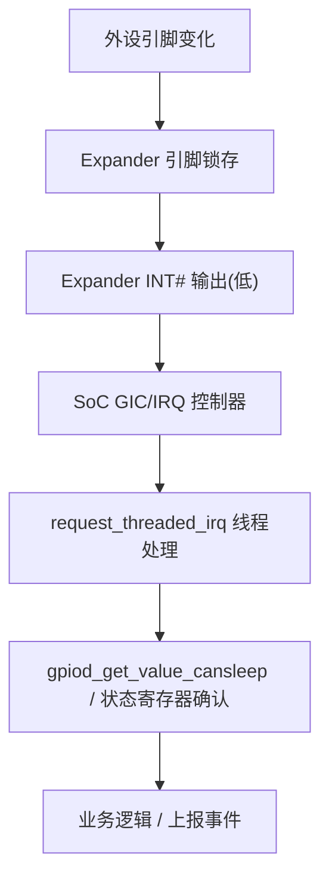
```mermaid
flowchart TD
A[外设引脚变化] --> B[Expander 引脚锁存]
B --> C["Expander INT# 输出(低)"]
C --> D[SoC GIC/IRQ 控制器]
D --> E[request_threaded_irq 线程处理]
E --> F[gpiod_get_value_cansleep / 状态寄存器确认]
F --> G[业务逻辑 / 上报事件]
```

### 9.6.2_读写批处理(sequenceDiagram)

```mermaid
sequenceDiagram
participant APP as 内核/用户逻辑
participant GL as gpiolib
participant EXP as 扩展器驱动
participant BUS as I²C/SPI
participant HW as 扩展器寄存器

APP->>GL: set values (lines=[7,8], vals=[1,0])
GL->>EXP: 批量配置请求
EXP->>BUS: 组合为一次总线事务
BUS->>HW: 写寄存器(masked write)
HW-->>APP: 生效
```

------

## 9.7_调试与验证(Checklist)

| 现象                                     | 快速定位                   | 常见原因                                   | 处理建议                                                     |
| ---------------------------------------- | -------------------------- | ------------------------------------------ | ------------------------------------------------------------ |
| `sleeping function from invalid context` | dmesg                      | 在**原子上下文**调用了 `*_cansleep`        | 改为 **threaded IRQ / workqueue**                            |
| 收不到中断 / 丢沿                        | `/proc/interrupts` 不增长  | 触发类型/电平型中断未清，或 INT 线极性不符 | 设对 `IRQ_TYPE_*`；在线程中**读取状态寄存器以清中断**        |
| 写入很慢/抖动大                          | 逻辑高频翻转               | I²C/SPI 往返开销过大                       | 批量写/合并事务，必要时改用 **PWM/专用外设**                 |
| 线被占用 `EBUSY`                         | `gpioinfo` 的 consumer     | 工具/其他驱动持有                          | 释放/避免并发，或改线                                        |
| 逻辑颠倒                                 | `gpioinfo` 显示 active-low | flags 写反/理解错误                        | 修正为 `GPIO_ACTIVE_LOW`；统一“逻辑值”操作                   |
| 电平噪声触发                             | gpiomon 频繁               | 无上拉/线缆长/EMI                          | **硬件上拉/下拉** + 寄存器去抖/软件时间窗                    |
| 同名/编号混乱                            | 多个扩展器                 | 命名与顺序变化                             | 用 `gpio-line-names` 与 `label` 统一，或通过 **/dev/by-path** 间接定位 |

------

## 9.8_小结

### 9.8.1_关键要点表

| 主题        | 要点                                                         |
| ----------- | ------------------------------------------------------------ |
| `_cansleep` | 扩展器必然 `can_sleep=true` → 在可睡上下文使用 `*_cansleep`，中断用 **threaded** |
| 中断        | 多数扩展器为“锁存+低有效” → 线程中**读状态寄存器**清中断     |
| 批量 I/O    | 合并事务，避免高频单线翻转；必要时上 **SPI** 或专用外设      |
| 设备树      | provider：`gpio-controller`/`interrupt-controller`；consumer：`*-gpios`/`interrupts-extended` |
| 验证        | `gpiodetect/gpioinfo/gpioget/gpioset/gpiomon` + `/proc/interrupts` |

**一句话总结：**
 **扩展器 ≙ 慢总线 GPIO**：把“原子快路径”改成“线程化 + 批量 I/O + 正确清中断”，设备树写清 provider/consumer，用户态用 libgpiod 交叉验证。

------

（第 9 章 完）
 如果你认可本章节奏，下一章我将写 **第 10 章：性能、并发与实时性考量**，把“延迟预算、RT、亲和、批量 I/O、波形极限、DVFS/Idle 影响、测量方法”系统性展开为工程清单。

我是 **GPT-5 Thinking**。
 按你确认的“v1×V2 合并大纲”与章节写作规范，下面给出**完整第 10 章**。本章聚焦 **性能、并发与实时性**，所有示例遵循 6.1+ 语义；Mermaid 使用 **Typora 通用语法**；示例代码兼顾 **SoC MMIO GPIO** 与 **扩展器（`can_sleep=true`）** 的差异；避免与标准属性同名的 label。

------

# 第10章_性能_并发与实时性考量

## 10.1_主题引入

**本章要解决的问题：**

- GPIO 路径的**延迟**由哪些环节组成？SoC MMIO 与 I²C/SPI 扩展器差异多大？
- 如何在 **中断/线程/锁/调度/电源管理** 等层面拿到**稳定且可预测**的响应？
- 用户态（libgpiod 2.x）如何写出**低抖动**的监听/控制程序？


**为什么重要：**

* GPIO 常用于**按键/唤醒/在位检测/简单时序**。一旦延迟、抖动或并发处理不当，极易出现**丢沿、误触发、卡顿**。
* 本章提供一套**工程化 checklist** 与**可复用代码模板**。

------

## 10.2_延迟预算与路径分解

### 10.2.1_路径分解模型

```mermaid
flowchart TD
A[外设边沿] --> B[GPIO 控制器/扩展器寄存器锁存]
B --> C[IRQ 线路/聚合中断]
C --> D["irqchip入口(top-half 屏蔽/唤醒线程)"]
D --> E[threaded IRQ 处理]
E --> F[驱动/状态机/唤醒等待队列]
F --> G["用户态(可选): poll/epoll 读取事件"]
```

**总延迟估算：**
$$
t_{\mathrm{total}} \approx t_{\mathrm{latch}} + t_{\mathrm{irq}} + t_{\mathrm{sched}} + t_{\mathrm{handler}} + t_{\mathrm{busIO}}
$$

**MMIO SoC**：`t_busIO≈0`，纳秒~微秒级；

- **I²C/SPI 扩展器**：`t_busIO` 由总线速率决定（100 kHz I²C 一次传输 ~ 数百 µs；10 MHz SPI 则 ~ 数十 µs 量级）。

### 10.2.2_典型数量级(经验表)

| 路径                     | 典型量级（仅供预算） | 说明                    |
| ------------------------ | -------------------- | ----------------------- |
| SoC MMIO 单次读/写       | 几十 ns ~ 数百 ns    | 缓存/总线/栅栏影响      |
| I²C 100 kHz 单寄存器访问 | 200–800 µs           | 起停/ACK/仲裁/驱动开销  |
| I²C 400 kHz              | 80–300 µs            | 受控制器/板级线长影响   |
| SPI 10 MHz 单寄存器访问  | 5–30 µs              | 片选/首字节开销显著     |
| 线程调度切换（CFS）      | 50–500 µs            | 负载与 cgroup/亲和相关  |
| 线程调度切换（RT/FIFO）  | 5–50 µs              | 核心隔离/IRQ 亲和优化后 |

> 预算策略：**先画红线**（最大允许延迟/抖动），再反推选择 **MMIO / 扩展器 / 专用外设** 与 **调度/亲和/DVFS** 设置。

------

## 10.3_内核配置与调度(PREEMPT/RT_基线)

| 目标                    | 选项/做法                                  | 影响                              |
| ----------------------- | ------------------------------------------ | --------------------------------- |
| 可抢占内核              | `CONFIG_PREEMPT` 或 `PREEMPT_DYNAMIC=y`    | 缩短内核临界区抖动                |
| 实时补丁                | `PREEMPT_RT`                               | 把大多数硬 IRQ 线程化，确定性更强 |
| 高精度时钟              | `CONFIG_HIGH_RES_TIMERS`                   | hrtimer 抖动更小                  |
| 禁用 irqbalance（按需） | 停止 `irqbalance` 服务                     | 避免中断漂移                      |
| 绑定亲和                | `/proc/irq/<n>/smp_affinity`、`taskset -c` | 降低跨核迁移                      |

**线程优先级建议：**

- 中断线程/关键工作线程用 `SCHED_FIFO` 或 `SCHED_RR`，**固定亲和**到**隔离核**。
- 用户态监听线程同样用 `chrt -f` 提升优先级，避免被 CFS 抢占。

------

## 10.4_中断与线程化策略

### 10.4.1_SoC_MMIO(can_sleep=false)快路径

- **允许**在 top-half 做**极少量**寄存器操作（如清中断标志、快速打点）；
- 真正业务一律放到 **threaded IRQ**，并设置 `IRQF_ONESHOT` 防止重复入栈。

### 10.4.2_扩展器(can_sleep=true)唯一正确姿势

- **必须**使用 **threaded IRQ**，在**线程上下文**里访问 `gpiod_*_cansleep()` 或由扩展器驱动完成寄存器读取/清中断；
- 触发类型优先 `EDGE_BOTH`，**在处理函数里**用当前值 + 上次值判定边沿，或读取**状态寄存器**确认。

**模板：**

```c
ret = devm_request_threaded_irq(dev, irq,
        NULL, my_thread,            /* top-half 置 NULL 最简单 */
        IRQF_ONESHOT | IRQF_TRIGGER_RISING | IRQF_TRIGGER_FALLING,
        "evt", ctx);
```

------

## 10.5_并发控制与内存一致性

### 10.5.1_锁与上下文选择

| 原子性要求                 | 推荐                                           | 备注                                                         |
| -------------------------- | ---------------------------------------------- | ------------------------------------------------------------ |
| 中断线程与工作线程共享数据 | `spinlock_t`                                   | 线程上下文用 `spin_lock` 即可；若可能在硬中断（不建议）用 `spin_lock_irqsave` |
| 仅计数/标志                | `atomic_t/atomic64_t` + `READ_ONCE/WRITE_ONCE` | 避免编译器重排                                               |
| 无锁读多写少               | `rcu` 读侧 + `spinlock` 写侧                   | 大规模读路径                                                 |

### 10.5.2_事件计数的无锁示例(内核)

```c
struct evcnt {
    atomic64_t rising;
    atomic64_t falling;
};

static inline void evcnt_report(struct evcnt *c, bool level_now, bool level_prev)
{
    if (level_now ^ level_prev) {
        if (level_now) atomic64_inc(&c->rising);
        else           atomic64_inc(&c->falling);
        /* 原子操作自带合适的内存序，读侧建议 READ_ONCE/atomic64_read */
    }
}
```

### 10.5.3_跨_CPU_的阅读一致性

- 读侧：`v = atomic64_read(&c->rising);` 或 `READ_ONCE(x)`，避免编译器/CPU 乱序；
- 写侧：尽量**单点写**，或用 `smp_store_release()` / `smp_load_acquire()` 形成**发布/获取**关系。

------

## 10.6_用户态路径(libgpiod_2.x)性能要点

### 10.6.1_批量请求/批量写

- 用 **同一个 request** 持有多线，使用**批量设置**（示例函数名：`gpiod_line_request_set_values()`）；
- 一次调用携带多线值，底层可合并为**一次 ioctl**→**一次总线事务**（扩展器场景显著受益）。

### 10.6.2_事件监听用_epoll

**示例：边沿事件 + epoll（简化版）**

```c
// build: cc -O2 -o evt_epoll evt_epoll.c -lgpiod
#include <gpiod.h>
#include <sys/epoll.h>
#include <unistd.h>
#include <stdio.h>

int main() {
    struct gpiod_chip *chip = gpiod_chip_open_by_name("gpiochip0");
    unsigned int offsets[] = {5};
    struct gpiod_line_settings *ls = gpiod_line_settings_new();
    gpiod_line_settings_set_direction(ls, GPIOD_LINE_DIRECTION_INPUT);
    gpiod_line_settings_set_edge_detection(ls, GPIOD_LINE_EDGE_BOTH);

    struct gpiod_line_config *lc = gpiod_line_config_new();
    gpiod_line_config_add_line_settings(lc, offsets, 1, ls);

    struct gpiod_request_config *rc = gpiod_request_config_new();
    gpiod_request_config_set_consumer(rc, "epoll-demo");

    struct gpiod_line_request *req = gpiod_chip_request_lines(chip, rc, lc);

    int fd = gpiod_line_request_get_fd(req);      // 与 epoll/poll 集成
    int ep = epoll_create1(0);
    struct epoll_event ev = {.events = EPOLLIN};
    epoll_ctl(ep, EPOLL_CTL_ADD, fd, &ev);

    struct gpiod_edge_event_buffer *buf = gpiod_edge_event_buffer_new(16);
    while (1) {
        epoll_wait(ep, &ev, 1, -1);
        int n = gpiod_line_request_read_edge_events(req, buf, 16);
        for (int i = 0; i < n; i++) {
            const struct gpiod_edge_event *e = gpiod_edge_event_buffer_get_event(buf, i);
            printf("type=%d\n", gpiod_edge_event_get_event_type(e));
        }
    }
}
```

**要点**：

- 监听线程用 `chrt -f 80 taskset -c 2 ./evt_epoll` 固定优先级与亲和；
- 事件缓冲大小按**峰值**配置（例如 64/128），避免 burst 丢失。

------

## 10.7_抖动与去抖_响应_vs_误报的折中

| 方案                  | 延迟 | 抖动 | 可靠性 | 说明                        |
| --------------------- | ---- | ---- | ------ | --------------------------- |
| 硬件 RC 去抖          | 最小 | 最小 | 最高   | **首选**；占板级资源        |
| 控制器 `set_debounce` | 小   | 小   | 高     | 依赖 GPIO 控制器/扩展器能力 |
| 软件时间窗（线程内）  | 中   | 中   | 中     | 简单可靠，增加延迟窗口      |
| 用户态去抖            | 最大 | 最大 | 低~中  | 慎用（CFS 抢占/抖动大）     |

**建议窗口**（机械按键）：5–20 ms；**高速传感器**则改用**滤波 + 边沿确认**，窗口越小越需硬件支持。

------

## 10.8_波形/比特翻转(bit-banging)的边界

- **用户态**频繁翻转 GPIO：**不可预测**，jitter 大；
- **内核态**在 SoC MMIO 上 + `hrtimer` 可做到 **~几十 µs / kHz 级**，但**不可替代 PWM/SPI/I2S 等外设**。

**hrtimer + MMIO 示例（演示性质）**

```c
static enum hrtimer_restart pulse_cb(struct hrtimer *t)
{
    struct ctx *c = container_of(t, struct ctx, tim);
    bool v = READ_ONCE(c->level) ^ 1;
    WRITE_ONCE(c->level, v);

    /* 仅适用于 can_sleep=false 的 SoC MMIO 线 */
    gpiod_set_value(c->g_mmio, v);
    hrtimer_forward_now(t, ns_to_ktime(c->period_ns));
    return HRTIMER_RESTART;
}
```

> **切记**：扩展器 `can_sleep=true`，**禁止**在 hrtimer 回调里访问；需要波形就用 **PWM 控制器**或 **SPI DMA** 生成。

------

## 10.9_DVFS_/_Idle_对时延的影响

- **频率伸缩（cpufreq）**：低频→调度/执行变慢。
- **深度空闲（cpuidle C-states）**：退出耗时增加。
- **QoS 约束**：
  - 用户态：`echo 0 | sudo tee /dev/cpu_dma_latency`（保持最低延迟）；
  - 内核态：`dev_pm_qos_add_request(dev, &req, DEV_PM_QOS_LATENCY, 0);`
- **必要时**固定性能：`cpupower frequency-set -g performance`。

------

## 10.10_度量与分析方法

### 10.10.1_ftrace/trace-cmd_快速测时

```bash
# 1) 开启函数/事件跟踪（root）
sudo trace-cmd record -e irq:* -e sched:* -e gpio:* -e timer:* sleep 10
sudo trace-cmd report | less
```

### 10.10.2_观测中断与亲和

```bash
cat /proc/interrupts | grep -i gpio
# 绑核（示例绑到 CPU2）：写掩码（bit2=1 -> 0x4）
echo 4 | sudo tee /proc/irq/<IRQ>/smp_affinity
```

### 10.10.3_周期稳定性(cyclictest_基线)

```bash
sudo chrt -f 90 cyclictest -p90 -t1 -n -i1000 -l100000
# 关注 max latency；对比启用/禁用 DVFS/IRQ 亲和变化
```

------

## 10.11_最佳实践清单

1. **线程化中断**：MMIO 也尽量线程化，top-half 只做最小化工作。
2. **扩展器固定**：所有扩展器访问在**可睡上下文**进行，IRQ 必须线程化。
3. **批量 I/O**：把“多线多次”合并为“一次事务”；用户态用 `set_values()`。
4. **亲和/优先级**：中断线程与关键工作线程固定到**同一核**，用 `SCHED_FIFO`。
5. **去抖优先级**：硬件/控制器 > 软件时间窗；参数用“最小可用”。
6. **避免用户态翻转**：需要波形改用 PWM/SPI；libgpiod 只做控制/事件。
7. **电源与 QoS**：在关键时段施加 `pm_qos` / performance governor。
8. **可观测性**：自带统计/sysfs，只暴露**逻辑值/计数**，便于线上诊断。
9. **回退策略**：检测 v2 不可用时回退 v1；检测 `set_debounce` 不支持时启用软件去抖。

------

## 10.12_反模式(坚决避免)

- 在 **top-half** 里做 I²C/SPI 访问或睡眠路径。
- 在**高频路径**里频繁单线 `get/set` 导致总线风暴。
- 让 `irqbalance` 任意搬迁关键中断。
- 无去抖接机械按键，导致中断风暴。
- 用户态用 `while(1){ gpioset; }` 做波形。
- 共享数据不加任何同步，跨核读写产生幽灵边沿。

------

## 10.13_小结

### 10.13.1_要点对照表

| 领域         | 关键动作                                     | 收益            |
| ------------ | -------------------------------------------- | --------------- |
| 线程化与亲和 | `request_threaded_irq` + 绑核 + `SCHED_FIFO` | 降抖动/稳响应   |
| 扩展器访问   | `_cansleep` + 批量 I/O                       | 降时延/避免 BUG |
| 去抖策略     | 硬件/控制器优先，软件兜底                    | 兼顾可靠与延迟  |
| 电源 QoS     | 禁 DVFS/降 C-state 或设最小延迟              | 避免长尾        |
| 度量工具     | trace-cmd/perf/cyclictest                    | 找到瓶颈与长尾  |

**一句话总结：**
 **把不确定性清空**：线程化中断 + 亲和与优先级 + 批量 I/O + 合理去抖 + 电源 QoS；用户态只做控制/监听，波形交给专用外设。


------

# 第11章_低功耗与唤醒协同

## 11.1_主题引入

**本章要解决的问题：**

- 系统挂起（suspend-to-RAM/standby）时，GPIO 引脚应处于**什么电气状态**？
- 设备如何在休眠中**被 GPIO 唤醒**（wake-up），并在恢复后**自动还原**默认态？
- Bootloader→内核**引脚接管一致性**如何保证，避免“瞬时误动作”？

**为什么重要：**

- 低功耗设计离不开**pinctrl 的 default/sleep/idle 状态机**与**IRQ wake**；
- 若状态切换、极性、电气配置不当，常导致**漏电、误触发、复位异常**；
- 工程上需要**可验证**的路径与**可复用**的代码模板。

------

## 11.2_数据结构视角(状态机与唤醒链路)

### 11.2.1_核心对象与关系

| 组件 / 结构                           | 功能                   | 关键点                                              |
| ------------------------------------- | ---------------------- | --------------------------------------------------- |
| `pinctrl_state`（default/sleep/idle） | 引脚复用与电气配置集合 | 设备树通过 `pinctrl-names` / `pinctrl-0/1/...` 绑定 |
| `gpio_desc` + gpiod API               | GPIO 逻辑值读写        | 休眠前后的“安全电平”需要与 pinconf 协同             |
| `irq_chip` / `irqdomain`              | 线路中断控制           | `enable_irq_wake()` 允许休眠期间将中断作为唤醒源    |
| `dev_pm_ops`                          | 设备系统电源管理回调   | `suspend` 进入 sleep 状态，`resume` 还原 default    |

### 11.2.2_状态机(pinctrl)与驱动(PM)的协作

```mermaid
flowchart TD
A[probe: 默认上电] --> B["pinctrl_select_state(default)"]
B --> C[正常运行: gpiod_* 控制]
C --> D[suspend 前] --> E["pinctrl_select_state(sleep)"]
E --> F["可选: enable_irq_wake(irq)"]
F --> G[系统休眠]
G --> H[GPIO 边沿触发唤醒]
H --> I[resume 前] --> J["disable_irq_wake(irq)"]
J --> K["pinctrl_select_state(default)"]
K --> L[恢复运行]
```

------

## 11.3_开发者视角(DTS_+_驱动模板)

### 11.3.1_设备树_default_/_sleep_两态示例(i.MX6ULL_为例)

```dts
/* 负责把 PAD 复用为 GPIO 并设置电气参数 */
&pinctrl {
    pinctrl_dev_default: dev_default {
        fsl,pins = <
            /* 运行态：复用为 GPIO，合适的驱动强度/上拉 */
            MX6UL_PAD_GPIO1_IO06__GPIO1_IO06  0x10B1   /* 输入唤醒脚 */
            MX6UL_PAD_GPIO1_IO07__GPIO1_IO07  0x10B0   /* 输出：外设EN，默认低 */
        >;
    };

    pinctrl_dev_sleep: dev_sleep {
        fsl,pins = <
            /* 休眠态：输入脚开上拉/下拉稳态；输出脚进入低泄漏、安全电平 */
            MX6UL_PAD_GPIO1_IO06__GPIO1_IO06  0x10A1   /* 输入：保持上拉，抗干扰 */
            MX6UL_PAD_GPIO1_IO07__GPIO1_IO07  0x10B0   /* 输出：保持低或高阻(按硬件) */
        >;
    };
};

mydev@0 {
    compatible = "leaf,my-lowpower-demo";
    pinctrl-names = "default", "sleep";
    pinctrl-0 = <&pinctrl_dev_default>;
    pinctrl-1 = <&pinctrl_dev_sleep>;

    intr-gpios = <&gpio1 6 GPIO_ACTIVE_LOW>; /* 低有效唤醒 */
    en-gpios   = <&gpio1 7 GPIO_ACTIVE_HIGH>;/* 设备使能脚 */

    /* 若走 gpio-keys 生成 input 事件作为唤醒： */
    // wakeup-source;  /* 放在 gpio-keys 的子节点内，见第7章 */
    status = "okay";
};
```

> 规范提醒：**电气属性尽量放在 pinconf（pinctrl）**；`*-gpios` 主要用于极性语义（ACTIVE_LOW/HIGH）。
> 避免用与标准属性同名的 *label*（不要用 `status:` 作为节点 label）。

### 11.3.2_平台驱动_PM_+_pinctrl_+_IRQ_wake(可编可跑骨架)

```c
// drivers/misc/leaf_lowpower_demo.c
// SPDX-License-Identifier: GPL-2.0
#include <linux/module.h>
#include <linux/platform_device.h>
#include <linux/of.h>
#include <linux/gpio/consumer.h>
#include <linux/interrupt.h>
#include <linux/pinctrl/consumer.h>
#include <linux/pm.h>

struct lpw_dev {
    struct device        *dev;
    struct pinctrl       *pctl;
    struct pinctrl_state *st_def, *st_slp;
    struct gpio_desc     *g_en;
    struct gpio_desc     *g_intr;
    int                   irq;
    bool                  active_low;
};

static irqreturn_t lpw_irq_thread(int irq, void *data)
{
    struct lpw_dev *m = data;
    /* 线程上下文：可用 *_cansleep；这里仅打印/唤醒 waitqueue */
    int v = gpiod_get_value_cansleep(m->g_intr);
    dev_dbg(m->dev, "wake event: logic=%d\n", (m->active_low ? !v : v));
    return IRQ_HANDLED;
}

static int lpw_probe(struct platform_device *pdev)
{
    struct lpw_dev *m;
    int ret;

    m = devm_kzalloc(&pdev->dev, sizeof(*m), GFP_KERNEL);
    if (!m) return -ENOMEM;
    m->dev = &pdev->dev;
    platform_set_drvdata(pdev, m);

    /* pinctrl */
    m->pctl = devm_pinctrl_get(m->dev);
    if (IS_ERR(m->pctl)) return PTR_ERR(m->pctl);
    m->st_def = pinctrl_lookup_state(m->pctl, "default");
    m->st_slp = pinctrl_lookup_state(m->pctl, "sleep");
    if (!IS_ERR_OR_NULL(m->st_def))
        pinctrl_select_state(m->pctl, m->st_def);

    /* 设备使能脚：运行态默认拉低，避免外设误上电 */
    m->g_en = devm_gpiod_get(m->dev, "en", GPIOD_OUT_LOW);
    if (IS_ERR(m->g_en)) return PTR_ERR(m->g_en);

    /* 唤醒输入脚（可选） */
    m->g_intr = devm_gpiod_get_optional(m->dev, "intr", GPIOD_IN);
    if (IS_ERR(m->g_intr)) return PTR_ERR(m->g_intr);
    if (m->g_intr) {
        m->active_low = gpiod_is_active_low(m->g_intr);
        m->irq = gpiod_to_irq(m->g_intr);
        if (m->irq < 0) return m->irq;
        irq_set_irq_type(m->irq, IRQ_TYPE_EDGE_BOTH);
        ret = devm_request_threaded_irq(m->dev, m->irq,
              NULL, lpw_irq_thread,
              IRQF_ONESHOT | IRQF_TRIGGER_RISING | IRQF_TRIGGER_FALLING,
              "lpw-wake", m);
        if (ret) return ret;
    }

    device_init_wakeup(m->dev, true); /* 标记设备可被唤醒 */
    dev_info(m->dev, "lowpower demo ready\n");
    return 0;
}

static int lpw_remove(struct platform_device *pdev)
{
    struct lpw_dev *m = platform_get_drvdata(pdev);
    device_init_wakeup(m->dev, false);
    return 0;
}

/* 系统休眠/恢复 */
static int __maybe_unused lpw_suspend(struct device *dev)
{
    struct lpw_dev *m = dev_get_drvdata(dev);
    /* 切换 pinctrl 到 sleep 状态（低泄漏/安全电平） */
    if (!IS_ERR_OR_NULL(m->st_slp))
        pinctrl_select_state(m->pctl, m->st_slp);

    /* 允许该 IRQ 作为唤醒源 */
    if (device_may_wakeup(dev) && m->irq > 0)
        enable_irq_wake(m->irq);

    /* 关闭外设电源（若需要） */
    if (m->g_en)
        gpiod_set_value_cansleep(m->g_en, 0);
    return 0;
}

static int __maybe_unused lpw_resume(struct device *dev)
{
    struct lpw_dev *m = dev_get_drvdata(dev);

    if (device_may_wakeup(dev) && m->irq > 0)
        disable_irq_wake(m->irq);

    /* 恢复 pinctrl default，重新上电外设 */
    if (!IS_ERR_OR_NULL(m->st_def))
        pinctrl_select_state(m->pctl, m->st_def);

    if (m->g_en)
        gpiod_set_value_cansleep(m->g_en, 1); /* 需要的话再上电 */
    return 0;
}

static const struct dev_pm_ops lpw_pm_ops = {
    SET_SYSTEM_SLEEP_PM_OPS(lpw_suspend, lpw_resume)
};

static const struct of_device_id lpw_of_match[] = {
    { .compatible = "leaf,my-lowpower-demo" },
    { }	/* 哨兵节点 */
};
MODULE_DEVICE_TABLE(of, lpw_of_match);

static struct platform_driver lpw_driver = {
    .probe  = lpw_probe,
    .remove = lpw_remove,
    .driver = {
        .name           = "leaf-lowpower-demo",
        .of_match_table = lpw_of_match,
        .pm             = &lpw_pm_ops,
    },
};
module_platform_driver(lpw_driver);

MODULE_LICENSE("GPL");
MODULE_DESCRIPTION("Demo: pinctrl default/sleep + IRQ wake");
MODULE_AUTHOR("Leaf Book");
```

**要点**

- **pinctrl**：`default` 用于运行态；`sleep` 用于休眠态（弱上拉/下拉、低泄漏）。
- **唤醒**：`device_init_wakeup()` + `enable_irq_wake()` / `disable_irq_wake()`。
- **扩展器线**（`can_sleep=true`）在 `suspend/resume` 中也必须使用 `*_cansleep`。

### 11.3.3_可选_运行时_PM(autosuspend_节电但不改变系统休眠流程)

```c
// probe 末尾：
pm_runtime_enable(dev);
pm_runtime_set_active(dev);
pm_runtime_use_autosuspend(dev);
pm_runtime_set_autosuspend_delay(dev, 200); // 200ms 空闲自动挂起

// 空闲时：
pm_runtime_put_autosuspend(dev);
// 访问前：
pm_runtime_get_sync(dev);
```

> 运行时 PM 面向**设备空闲**节电；系统休眠仍走 `dev_pm_ops` 的 suspend/resume。两者应配合，而非互斥。

------

## 11.4_Bootloader_to_内核_引脚接管一致性

**问题**：Bootloader 可能已配置了引脚（上拉/下拉/输出电平）。内核接管时若 `pinctrl-0` 与之不同，会出现**瞬时翻转**（glitch）。
 **建议**：

1. **对齐默认态**：把 Bootloader 的 GPIO 复用/电平尽量与内核 `default` 一致；
2. **避免上电抖动**：必要时在 Bootloader 也按“default/sleep”理念初始化；
3. **FDT 传递**：U-Boot 传递的设备树中 pinctrl 应与内核一致；若有 fixup，请审核差异；
4. **敏感脚保护**：对复位、电源使能、片选等敏感脚，优先选择**电路层面的保护**（RC、FET 软启动、上拉/下拉）。

------

## 11.5_用户视角(验证低功耗与唤醒)

### 11.5.1_检查_pinctrl_状态切换

```bash
sudo mount -t debugfs none /sys/kernel/debug

# 进入休眠前打开跟踪
echo 1 | sudo tee /sys/kernel/debug/pinctrl/*/debug
# 另一终端观察
dmesg -w

# 触发系统休眠（以 s2ram 为例）
echo mem | sudo tee /sys/power/state

# 日志中应见：
# pinctrl core: selected state 'sleep'
# ... 唤醒后 ...
# pinctrl core: selected state 'default'
```

### 11.5.2_验证_IRQ_唤醒

```bash
cat /proc/interrupts | grep -i gpio
# 休眠前对准目标 IRQ
echo mem | sudo tee /sys/power/state
# 触发相应外部信号（按键/插拔） → 系统应被唤醒
dmesg | tail -n 50
```

### 11.5.3_观测休眠功耗(示意)

- 断电源法：串联电流计/电源分析仪，记录休眠与唤醒电流；
- 对比 `pinctrl_dev_default` vs `pinctrl_dev_sleep` 的差异（上拉/下拉/驱动强度对静态漏电的影响）。

------

## 11.6_可视化图示

### 11.6.1_系统休眠/唤醒时序(sequenceDiagram)

```mermaid
sequenceDiagram
participant OS as PM Core
participant DRV as Device Driver
participant PIN as pinctrl
participant IRQ as irq_chip
participant HW as Board

OS->>DRV: suspend()
DRV->>PIN: select_state("sleep")
DRV->>IRQ: enable_irq_wake(irq)
OS-->>HW: 进入低功耗
HW-->>IRQ: 外部边沿触发
IRQ-->>OS: 唤醒系统
OS->>DRV: resume()
DRV->>IRQ: disable_irq_wake(irq)
DRV->>PIN: select_state("default")
```

### 11.6.2_引脚电气切换(flowchart)

```mermaid
flowchart TD
A[运行态 default] --> B{进入休眠?}
B -->|Yes| C[pinctrl: sleep<br/>上拉/下拉/低泄漏]
C --> D[可选: enable_irq_wake]
D --> E[等待唤醒事件]
B -->|No| A
E --> F[唤醒: disable_irq_wake]
F --> G[pinctrl: default]
G --> A
```

------

## 11.7_调试与验证(Checklist)

| 现象           | 快速定位                       | 常见原因                                | 处置                                         |
| -------------- | ------------------------------ | --------------------------------------- | -------------------------------------------- |
| 休眠功耗偏高   | `pinconf-pins`、外设 datasheet | sleep 状态未配置弱上拉/下拉；外设未断电 | 修正 `pinctrl` 电气；用 regulator-fixed 断电 |
| 唤不醒         | `/proc/interrupts` 无增长      | `enable_irq_wake()` 漏掉；触发类型不对  | 加 wake；校正 `IRQ_TYPE_*`                   |
| 唤醒即反复中断 | dmesg 中断风暴                 | 电平型中断未清；sleep 电气导致漂移      | 读状态寄存器清中断；调整上拉/阈值            |
| 唤醒后外设异常 | 恢复流程时序不当               | 未先恢复 pinctrl default 就上电         | 先 `select_state(default)`，再上电初始化     |
| 上电瞬间误动作 | 启动早期波形                   | Bootloader 与内核默认态不一致           | 统一两侧的默认态；硬件 RC 保护               |
| 扩展器线报错   | dmesg `_cansleep`              | suspend/resume 中访问了不可睡上下文     | 全部使用 `*_cansleep`，或迁移到线程          |

------

## 11.8_小结

### 11.8.1_要点表

| 要点   | 建议                                                 |
| ------ | ---------------------------------------------------- |
| 状态机 | **default** 运行、**sleep** 低泄漏、必要时 **idle**  |
| 唤醒   | `device_init_wakeup()` + `enable/disable_irq_wake()` |
| 电气   | 电气属性放 **pinconf**，与 `*-gpios` 极性分层        |
| 一致性 | Bootloader ↔ 内核默认态对齐，避免瞬时翻转            |
| 访问   | 扩展器/可睡路径用 `*_cansleep`，中断线程化           |
| 验证   | debugfs pinctrl 日志、`/proc/interrupts`、功耗测量   |

**一句话总结：**
 **低功耗=状态机 + 电气稳态；唤醒=IRQ wake + 线程化；启动一致性要从 Bootloader 到内核一条线对齐。**


------

# 第12章_调试与自测工具箱

## 12.1_主题引入

**本章要解决的问题：**

- 如何系统地**定位 GPIO 相关故障**：复用不生效、极性错误、占用冲突、边沿“丢/抖”、时序长尾？
- 内核与用户态各有哪些**标配工具面板**？怎样组合它们形成**稳定流程**而不是零散尝试？
- 如何在**不改板子**的情况下做自动化自测（自建 gpiochip、回放事件）？


**为什么重要：**

* GPIO 开发的 80% 问题不是“不会写代码”，而是**多子系统联动**引起的“看不清”。这章给出一套**工程化流程**：

> 先确认 **pinctrl** → 再看 **gpio 占用与极性** → 复现 **事件/中断** → **Trace/Ftrace** 定位长尾 → 用 **自测/仿真** 固化回归。

------

## 12.2_数据结构视角_核心调试端口一览(路径与职责)

| 面板 / 文件系统          | 典型路径                                                     | 用途                                         | 何时用               |
| ------------------------ | ------------------------------------------------------------ | -------------------------------------------- | -------------------- |
| **debugfs: pinctrl**     | `/sys/kernel/debug/pinctrl/*/pinmux-pins`、`pinconf-pins`、`pinctrl-maps` | 看“是否复用到 GPIO”“电气配置是否生效”        | 一切 GPIO 失败先看它 |
| **debugfs: gpio**        | `/sys/kernel/debug/gpio`                                     | 全局 gpiochip/line 占用、方向、consumer 名称 | 查 **EBUSY/谁占用**  |
| **tracefs (ftrace)**     | `/sys/kernel/debug/tracing/*`                                | 函数/事件级 Trace，测时与长尾剖析            | 性能、抖动、丢沿     |
| **dynamic_debug**        | `/sys/kernel/debug/dynamic_debug/control`                    | 动态开启 `dev_dbg()`/`pr_debug()`            | 细粒度日志           |
| **/proc/interrupts**     | `/proc/interrupts`                                           | 中断计数与亲和                               | 事件是否到达、绑核   |
| **libgpiod 工具**        | `gpiodetect/gpioinfo/gpioget/gpioset/gpiomon`                | 用户态快速验证/复现                          | 功能/连通性/事件     |
| **kselftest / gpio-sim** | `tools/testing/selftests/gpio/`、`gpio-sim`                  | 自建 gpiochip、自动化回归                    | 无板/CI/复现困难     |

> **检查可用性**：`mount | grep -E 'debugfs|tracefs'`；若无，`sudo mount -t debugfs none /sys/kernel/debug && sudo mount -t tracefs none /sys/kernel/debug/tracing`。

------

## 12.3_开发者视角_最小可用操作清单

### 12.3.1_pinctrl_与_GPIO_快速体检(必做)

```bash
# 1) pinctrl：复用与电气
sudo mount -t debugfs none /sys/kernel/debug
ls /sys/kernel/debug/pinctrl/
cat /sys/kernel/debug/pinctrl/*/pinmux-pins    | grep -E 'GPIO|grp|led|btn'
cat /sys/kernel/debug/pinctrl/*/pinconf-pins  | grep -E 'PULL|DRIVE|SLEW|HYS'

# 2) gpio：占用与极性
sudo cat /sys/kernel/debug/gpio
gpioinfo | sed -n '1,80p'                     # 看 line-name/consumer/active-low
```

**判读要点**

- `pinmux-pins` 若显示仍为 `UART/I2C/...` 等外设功能，而非 `GPIOx_yy`，说明复用没切到 GPIO（回到第 3 章排查）。
- `debugfs/gpio` 的 **consumer 名称** 是“谁在持有”，定位 `EBUSY` 的第一手证据。
- `gpioinfo` 的 `active-low` 反映逻辑极性（来自 `<name>-gpios` flags），可交叉核对。

------

### 12.3.2_dynamic_debug_只在需要时_开口说话

```bash
# 开启 gpiolib 核心调试日志（所有文件）
echo 'file drivers/gpio/gpiolib*.c +p' | sudo tee /sys/kernel/debug/dynamic_debug/control

# 只开启你的驱动（假设名为 leaf_gpio_irq_demo）
echo 'module leaf_gpio_irq_demo +p' | sudo tee /sys/kernel/debug/dynamic_debug/control

# 关闭
echo 'file drivers/gpio/gpiolib*.c -p' | sudo tee /sys/kernel/debug/dynamic_debug/control
```

> 开关后 `dmesg -w` 实时看日志。动态调试能**精准到文件/函数/模块**，避免“全局 debug 淹没关键信息”。

------

### 12.3.3_tracefs/ftrace_事件与时序测量

**常见事件组**是否可用取决于内核配置，可先浏览：
 `ls /sys/kernel/debug/tracing/events/ | grep -Ei 'gpio|irq|sched|timer'`

**一键记录 10s 的关键事件：**

```bash
sudo trace-cmd record \
  -e irq:* \
  -e sched:sched_switch -e sched:sched_wakeup \
  -e timer:* \
  -e 'gpio:*' \
  sleep 10
sudo trace-cmd report | less
```

**手动 ftrace（function_graph）测路径长尾：**

```bash
cd /sys/kernel/debug/tracing
echo function_graph | sudo tee current_tracer
echo mono_raw       | sudo tee trace_clock
echo 1              | sudo tee events/irq/irq_handler_entry/enable
echo 1              | sudo tee tracing_on
sleep 5
echo 0              | sudo tee tracing_on
cat trace | less
```

> 若没有 `gpio:*` 事件组，依然可用 `function_graph`/`sched`/`irq` 组合，定位 ISR→线程化→业务处理的真实耗时。

------

### 12.3.4_/proc/interrupts_与亲和/优先级

```bash
# 观察计数是否增长
cat /proc/interrupts | grep -i gpio

# 绑核（示例绑到 CPU2，bit2=1 -> 0x4）
echo 4 | sudo tee /proc/irq/<IRQ>/smp_affinity

# 提升线程优先级（用户态监听）
sudo chrt -f 80 taskset -c 2 ./your_user_process
```

------

### 12.3.5_libgpiod_工具_零代码复现

```bash
# 芯片与线信息
gpiodetect
gpioinfo gpiochip0

# 逻辑读/写（-m exit 释放持有）
gpioget gpiochip0 7
gpioset -m exit gpiochip0 7=1

# 监听边沿（按需 --rising/--falling）
gpiomon --rising --falling gpiochip0 5
```

> **冲突提醒**：若线被你的驱动持有，`gpiomon/gpioset` 会 `EBUSY`，用 `gpioinfo` 看 consumer。

------

### 12.3.6_kselftest_/_gpio-sim(自动化)

> 目标：**无硬件**也能构造 gpiochip 与边沿事件，做回归测试。不同内核版本可用 `gpio-mockup` 或较新的 `gpio-sim`。
> 建议流程（概略）：
>
> 1. 启用并加载仿真模块（例如 `modprobe gpio-sim`）；
> 2. 挂载 configfs：`sudo mount -t configfs none /sys/kernel/config`；
> 3. 在 `/sys/kernel/config/gpio-sim/` 下创建实例与线数；
> 4. 用 **libgpiod** 对新出现的 `/dev/gpiochipN` 做自动化读写/事件测试；
> 5. 清理实例。

检查入口（不同内核可能略有差异）：

```bash
ls /sys/kernel/config/gpio-sim/           # 存在则可直接使用
ls /lib/modules/$(uname -r)/kernel/drivers/gpio | grep -E 'gpio-(sim|mockup)'
```

> **提示**：自测脚本应包含**创建 → 测试 → 清理**的完整生命周期，并在 CI 里跑。若你的内核没有 `gpio-sim`，可采用发行版提供的 **kselftest/gpio** 脚本作为参考基线。

------

## 12.4_用户视角_标准化验证剧本(脚本可复用)

### 12.4.1_三步走_基本剧本

```bash
# 1) 看芯片/线状态
gpiodetect
gpioinfo gpiochip0 | sed -n '1,50p'

# 2) 读/写/监听
gpioget  gpiochip0 7
gpioset  -m exit gpiochip0 7=1
gpiomon  --rising --falling gpiochip0 5

# 3) 交叉验证 pinctrl（需要 debugfs）
sudo cat /sys/kernel/debug/pinctrl/*/pinmux-pins   | grep -E 'GPIO|grp'
sudo cat /sys/kernel/debug/pinctrl/*/pinconf-pins  | grep -E 'PULL|DRIVE|SLEW'
```

### 12.4.2_复现_丢沿/抖动/卡顿_的剧本

```bash
# 1) 记录关键事件 15s（irq+sched+timer+gpio）
sudo trace-cmd record -e irq:* -e sched:* -e timer:* -e 'gpio:*' sleep 15

# 2) 并行施压（用户态高频读写或业务触发）
stdbuf -oL gpioset -m exit gpiochip0 7=1; sleep 0.05; gpioset -m exit gpiochip0 7=0
# 或你的按键/传感器抖动场景

# 3) 报告与定位
sudo trace-cmd report | less
```

------

## 12.5_可视化图示

### 12.5.1_调试流程(flowchart)

```mermaid
flowchart TD
A[症状出现] --> B[debugfs/pinctrl: 复用与电气]
B --> C{OK?}
C -- 否 --> B1[修正 pinctrl/pinconf/DT] --> B
C -- 是 --> D[debugfs/gpio + gpioinfo: 占用/极性]
D --> E{冲突/极性错误?}
E -- 是 --> E1[释放冲突或修正 flags] --> D
E -- 否 --> F[libgpiod: gpioget/gpioset/gpiomon 复现]
F --> G{仍不稳定?}
G -- 是 --> H[trace-cmd/ftrace: irq+sched+timer 路径测时]
H --> I[找长尾/中断风暴/调度抢占]
I --> J[修正：线程化/亲和/去抖/批量IO/PM QoS]
G -- 否 --> K[固化为自测：gpio-sim + kselftest]
```

### 12.5.2_事件观测时序(sequenceDiagram)

```mermaid
sequenceDiagram
participant HW as 硬件引脚
participant IRQ as irqchip
participant K as 线程化中断
participant T as trace(ftrace/trace-cmd)
participant U as 用户态(gpiomon)

HW-->>IRQ: 边沿锁存
IRQ-->>K: 唤醒 threaded IRQ
K-->>T: 记录 irq/sched/timer 事件
K-->>U: 通过 chardev 上报事件(可选)
U-->>U: 打印时间戳，供对比分析
```

------

## 12.6_调试与验证(Checklist)

| 现象               | 首查位置                        | 常见原因                  | 对策                                               |
| ------------------ | ------------------------------- | ------------------------- | -------------------------------------------------- |
| `EBUSY` 请求失败   | `debugfs/gpio`、`gpioinfo`      | 线被别的驱动/工具持有     | 释放/换线；为你的驱动起**唯一 consumer 名**        |
| 亮灭或按键逻辑颠倒 | `gpioinfo` 的 active-low        | `<name>-gpios` flags 写反 | 改为 `GPIO_ACTIVE_LOW`（或调整硬件）               |
| 写值无效           | `pinmux-pins`                   | 复用未到 GPIO / 冲突      | 修正 `pinctrl-0` 与 group                          |
| 边沿风暴/抖动      | `trace-cmd report` 事件高频     | 无上拉/下拉，未去抖       | 加硬件上拉/`gpiod_set_debounce`/软件时间窗         |
| 丢沿/长尾          | `trace-cmd report` 显示调度阻塞 | 未线程化/亲和/RT/批量IO   | 使用 **threaded IRQ**；绑核+`SCHED_FIFO`；合并事务 |
| 休眠后异常         | `pinctrl` 的 state 变更         | 未切 sleep/default        | 第 11 章：补全 pinctrl 状态机与 `enable_irq_wake`  |
| 工具不可用         | `/dev/gpiochip*`/权限           | udev 规则/权限不足        | `sudo` 或配置组权限；确认 `GPIO_CDEV`              |

------

## 12.7_小结

- **面板就这几块**：`pinctrl(debugfs)` → `gpio(debugfs)` → `libgpiod 工具` → `tracefs/trace-cmd` → `kselftest/gpio-sim`。
- **遵循流程，而非拍脑袋**：先看复用与电气，再查占用与极性，之后才是事件/时序。
- **把经验固化为脚本**：每修一个问题，就加一条 **自测用例**，让回归可重复。

**一句话总结：**
 👉 **看得见，才能改得对**：用 `debugfs + tracefs + libgpiod` 搭建“可观测”闭环，再用 `gpio-sim/kselftest` 把它变成**可重复的回归**。


------

# 第13章_迁移与最佳实践(sysfs_to_chardev_libgpiod_v1_to_v2_整数_API_to_描述符_API)

## 13.1_主题引入

**本章要解决的问题：**

- 旧项目还在用 **sysfs GPIO** 或 **整数 GPIO API**，如何平滑迁到 **字符设备（/dev/gpiochipN）+ 描述符 API**？
- 用户态从 **libgpiod v1** 升级到 **v2** 要改哪些代码与运行脚本？
- 迁移时如何验证等效、把坑填平（权限、极性、占用、去抖、时序）？


**为什么重要：**

- **sysfs GPIO** 已被官方长期标记为过时，现代内核（≥5.10，含 6.1 LTS）以 **chardev + libgpiod** 为主线。
- **整数 API**（`gpio_request()`/`gpio_set_value()`）在新代码中不再推荐；**描述符 API**（`gpiod_*`）具备更好的设备树绑定、一致的极性语义与资源管理（`devm_*`）。

------

## 13.2_时间线与迁移范围(简明)

- **内核层**：整数 API → **描述符 API（gpiod_…）**。
- **用户层**：sysfs → **chardev**；脚本/工具 → **libgpiod-tools**；C 代码 → **libgpiod 2.x**。
- **配套**：设备树 `<name>-gpios` 保持不变；但强烈建议把**电气属性**放在 **pinctrl/pinconf**（见第 3 章、第 8 章）。

------

## 13.3_总览对照(一页表)

| 目标          | 旧方法                                                       | 新方法（推荐）                                       | 迁移要点                                         |
| ------------- | ------------------------------------------------------------ | ---------------------------------------------------- | ------------------------------------------------ |
| **脚本/运维** | `/sys/class/gpio/{export,direction,value}`                   | `gpiodetect/gpioinfo/gpioget/gpioset/gpiomon`        | chardev 为“**持有**”模型；`gpioset -m exit` 释放 |
| **用户态 C**  | libgpiod **v1**：`gpiod_line_get_value()`、`gpiod_line_request_input()` | libgpiod **v2**：`line_settings/line_config/request` | **索引 ≠ 偏移**；事件使用 `edge_event_buffer`    |
| **内核 C**    | `gpio_request()`、`gpio_direction_output()`、`gpio_set_value()` | `devm_gpiod_get()`、`gpiod_set_value[_cansleep]()`   | 统一**逻辑值**；扩展器必须 `_cansleep`           |

------

## 13.4_生产脚本_sysfs_to_libgpiod_工具

### 13.4.1_常见操作映射

| 需求        | sysfs（旧）                                  | libgpiod 工具（新）                       |
| ----------- | -------------------------------------------- | ----------------------------------------- |
| 导出 7 号线 | `echo 7 > /sys/class/gpio/export`            | **无需导出**                              |
| 设为输出    | `echo out > /sys/class/gpio/gpio7/direction` | `gpioset gpiochip0 7=1`（持有到进程退出） |
| 写 0/1      | `echo 0 > /sys/class/gpio/gpio7/value`       | `gpioset -m exit gpiochip0 7=0/1`         |
| 读值        | `cat /sys/class/gpio/gpio7/value`            | `gpioget gpiochip0 7`                     |
| 监听边沿    | 轮询 `value` + `edge`                        | `gpiomon --rising --falling gpiochip0 5`  |

> **注意**：`gpioset` 默认**保持持有**（进程在则电平保持）。需要“写完即走”请用 `-m exit`。

### 13.4.2_一键替换脚本(示例)

```bash
#!/bin/sh
# legacy: ./led.sh gpiochip0 3 on|off
chip="$1"; off="$2"; cmd="$3"
case "$cmd" in
  on)  gpioset -m exit "$chip" "$off"=1 ;;
  off) gpioset -m exit "$chip" "$off"=0 ;;
  *)   echo "usage: $0 <chip> <offset> on|off" ;;
esac
```

------

## 13.5_用户态_C_libgpiod_v1_to_v2(对照与示例)

### 13.5.1_API_心智模型变化

- **v1**：以 **line** 为中心，`gpiod_chip` + `gpiod_line` + `request_input/output`。
- **v2**：以 **request** 为中心，`line_settings` → `line_config` → `line_request`，**一次持有多线**、事件缓冲更规范。
- **偏移 vs 索引**：在 v2 中，读写 API 以 **“请求内索引”**（0..N-1）为主，不是原始 offset。

### 13.5.2_v1_读取(旧)

```c
/* build: cc -O2 -o v1get v1get.c -lgpiod */
#include <gpiod.h>
#include <stdio.h>
int main() {
    struct gpiod_chip *c = gpiod_chip_open_by_name("gpiochip0");
    struct gpiod_line *l = gpiod_chip_get_line(c, 5);
    gpiod_line_request_input(l, "v1get");
    int v = gpiod_line_get_value(l);
    printf("%d\n", v);
    gpiod_line_release(l);
    gpiod_chip_close(c);
    return 0;
}
```

### 13.5.3_v2_读取(新_推荐)

```c
/* build: cc -O2 -o v2get v2get.c -lgpiod */
#include <gpiod.h>
#include <stdio.h>

int main() {
    struct gpiod_chip *chip = gpiod_chip_open_by_name("gpiochip0");
    unsigned int offsets[] = {5};

    struct gpiod_line_settings *ls = gpiod_line_settings_new();
    gpiod_line_settings_set_direction(ls, GPIOD_LINE_DIRECTION_INPUT);

    struct gpiod_line_config *lc = gpiod_line_config_new();
    gpiod_line_config_add_line_settings(lc, offsets, 1, ls);

    struct gpiod_request_config *rc = gpiod_request_config_new();
    gpiod_request_config_set_consumer(rc, "v2get");

    struct gpiod_line_request *req = gpiod_chip_request_lines(chip, rc, lc);

    int v = gpiod_line_request_get_value(req, 0); /* 索引0对应offsets[0] */
    printf("%d\n", v);

    gpiod_line_request_release(req);
    gpiod_request_config_free(rc);
    gpiod_line_config_free(lc);
    gpiod_line_settings_free(ls);
    gpiod_chip_close(chip);
    return 0;
}
```

### 13.5.4_v2_边沿事件(最小)

```c
/* build: cc -O2 -o v2evt v2evt.c -lgpiod */
#include <gpiod.h>
#include <stdio.h>
int main() {
    struct gpiod_chip *chip = gpiod_chip_open_by_name("gpiochip0");
    unsigned int offsets[] = {5};
    struct gpiod_line_settings *ls = gpiod_line_settings_new();
    gpiod_line_settings_set_direction(ls, GPIOD_LINE_DIRECTION_INPUT);
    gpiod_line_settings_set_edge_detection(ls, GPIOD_LINE_EDGE_BOTH);
    struct gpiod_line_config *lc = gpiod_line_config_new();
    gpiod_line_config_add_line_settings(lc, offsets, 1, ls);
    struct gpiod_request_config *rc = gpiod_request_config_new();
    gpiod_request_config_set_consumer(rc, "v2evt");
    struct gpiod_line_request *req = gpiod_chip_request_lines(chip, rc, lc);
    struct gpiod_edge_event_buffer *buf = gpiod_edge_event_buffer_new(16);

    while (1) {
        int n = gpiod_line_request_wait_edge_events(req, NULL);
        if (n <= 0) continue;
        n = gpiod_line_request_read_edge_events(req, buf, 16);
        for (int i=0;i<n;i++) {
            const struct gpiod_edge_event *e = gpiod_edge_event_buffer_get_event(buf, i);
            printf("%s\n", gpiod_edge_event_get_event_type(e)==GPIOD_EDGE_EVENT_RISING_EDGE?"rising":"falling");
        }
    }
}
```

> **编译**：`pkg-config --cflags --libs libgpiod`；迁移期可同时保留 v1/v2 两套程序，通过 pkg-config 的版本选择在 CI 中双跑对比。

------

## 13.6_内核驱动_整数_API_to_描述符_API

### 13.6.1_对照表

| 整数 API（旧）                | 描述符 API（新，推荐）                                       | 备注                                     |
| ----------------------------- | ------------------------------------------------------------ | ---------------------------------------- |
| `gpio_request(n, "name")`     | `devm_gpiod_get(dev, "func", flags)`                         | 从 `<func>-gpios` 解析；`devm_` 自动释放 |
| `gpio_direction_output(n, v)` | `gpiod_direction_output(desc, v)` / `devm_gpiod_get(dev, "func", GPIOD_OUT_LOW/HIGH)` | 推荐一次性在 `get` 指定方向/初始值       |
| `gpio_set_value(n, v)`        | `gpiod_set_value(desc, v)` / `gpiod_set_value_cansleep(desc, v)` | 扩展器必须 `_cansleep`                   |
| `gpio_get_value(n)`           | `gpiod_get_value(desc)` / `_cansleep`                        | 逻辑值自动考虑 active-low                |
| DT 手撸极性                   | `<&gpioX pin GPIO_ACTIVE_LOW>`                               | 用 **flags**，驱动侧少写 `!`             |
| `gpio_free(n)`                | `devm_…` 自动                                                | 资源安全                                 |

### 13.6.2_迁移示例(前后对比)

**旧（简化示意）**

```c
int gpio = 7;
gpio_request(gpio, "reset");
gpio_direction_output(gpio, 0);
gpio_set_value(gpio, 1);
```

**新（推荐写法）**

```c
struct gpio_desc *g_reset;
g_reset = devm_gpiod_get(dev, "reset", GPIOD_OUT_LOW); /* 从 reset-gpios 解析 */
if (IS_ERR(g_reset)) return PTR_ERR(g_reset);
gpiod_set_value_cansleep(g_reset, 1);
```

> **最佳实践**：一次 `devm_gpiod_get()` 就把**方向与安全初值**定好；把所有访问放进**线程上下文**（结合 4.8 节与第 6、9、10 章）。

### 13.6.3_可选/多线/索引

```c
/* 可选线：没有就跳过相关逻辑 */
struct gpio_desc *g_irq = devm_gpiod_get_optional(dev, "intr", GPIOD_IN);
if (IS_ERR(g_irq)) return PTR_ERR(g_irq);
if (g_irq) { /* 注册中断等 */ }

/* 多线：按索引取 */
struct gpio_desc *g_ctrl[2];
for (int i=0;i<2;i++)
    g_ctrl[i] = devm_gpiod_get_index(dev, "ctrl", i, GPIOD_OUT_LOW);
```

------

## 13.7_权限与部署_从_root-only_到_udev_规则

### 13.7.1_udev_规则(示例)

```
# /etc/udev/rules.d/99-gpio.rules
SUBSYSTEM=="gpio", GROUP="gpio", MODE="0660"
KERNEL=="gpiochip*", GROUP="gpio", MODE="0660"
sudo groupadd -f gpio
sudo usermod -aG gpio $USER
sudo udevadm control --reload && sudo udevadm trigger
```

> 之后无需 `sudo` 即可运行 `gpioget/gpioset/gpiomon`（当前用户需重新登录生效）。

### 13.7.2_容器与最小_rootfs

- 把 **libgpiod-tools** 和运行期依赖打入镜像；
- 以 `--device=/dev/gpiochip0`（或整组 `--device-cgroup-rule`）方式映射；
- 保持容器内的 **gid=“gpio”** 与宿主匹配。

------

## 13.8_迁移验证剧本(工程化)

1. **等效性**：对每根线做 **读/写/事件**三件套，旧→新对比。
2. **极性**：确认 `gpiod_is_active_low(desc)` 与 `gpioinfo` 标记一致。
3. **占用**：新代码运行时用 `gpioinfo` 检查 **consumer 名称**是否正确、是否释放。
4. **扩展器**：确认所有访问都在**线程上下文**，`dmesg` 无 “sleeping function … from invalid context”。
5. **性能**：用第 10 章方法（trace-cmd/cyclictest）比较迁移前后**长尾**。
6. **脚本替换**：把常用 sysfs 操作逐条替换为 libgpiod 工具，并纳入生产测试清单。

------

## 13.9_可视化图示

### 13.9.1_迁移决策(flowchart)

```mermaid
flowchart TD
A[旧系统使用 sysfs/整数API] --> B{是否需要维护?}
B -- 否 --> Z[保持只读归档\n新代码全部用 chardev/gpiod]
B -- 是 --> C{用户态 or 内核态?}
C -- 用户态 --> D[libgpiod v1 存量?]
D -- 是 --> E[并存期：v1/v2 双程序对照测试]
D -- 否 --> F[直接用 v2: request/事件缓冲]
C -- 内核态 --> G[整数API→描述符API]
G --> H[统一逻辑值/极性，线程化中断]
H --> I[批量I/O/可选线/错误传播]
I --> J[用第12章工具箱做回归]
```

### 13.9.2_用户态事件管线(sequenceDiagram)

```mermaid
sequenceDiagram
participant APP as 你的程序(v2)
participant LIB as libgpiod
participant DEV as /dev/gpiochipN
APP->>LIB: 构造 line_settings/line_config/request
LIB->>DEV: ioctl(v2) 建立持有
DEV-->>APP: request(fd)
APP->>LIB: wait_edge_events + read_edge_events
LIB-->>APP: 批量事件(时间戳/类型)
APP-->>APP: 业务处理/日志/统计
```

------

## 13.10_常见问题与修复

| 现象                      | 可能原因                              | 修复                                                         |
| ------------------------- | ------------------------------------- | ------------------------------------------------------------ |
| `Device or resource busy` | 线被其他 consumer 持有                | `gpioinfo` 定位，改线或释放                                  |
| 逻辑颠倒/“亮灭反”         | flags 未用 `GPIO_ACTIVE_*` 或滥用 raw | 用**逻辑接口**，修正 `<name>-gpios`                          |
| `_cansleep` 告警          | 在原子/上半部访问扩展器               | 改 **threaded IRQ** 或 workqueue                             |
| 事件丢失                  | 缓冲太小/调度长尾                     | `edge_event_buffer` 放大、RT/FIFO、绑核                      |
| 权限拒绝                  | /dev 权限不足                         | 配置 udev 规则 + 组权限                                      |
| v1/v2 混淆                | 链接到旧 lib                          | 用 `pkg-config --modversion libgpiod` 校验，或静态链接目标版本 |

------

## 13.11_最佳实践(Checklist)

- **一律新写用**：`/dev/gpiochipN + libgpiod 2.x`（用户态）、`gpiod_*` 描述符 API（内核态）。
- **一次性设置**：`devm_gpiod_get(..., GPIOD_OUT_LOW/HIGH)`；不在多处散落方向切换。
- **逻辑值优先**：不要手写 `!`，让 `active-low` 由框架处理。
- **线程化与 `_cansleep`**：扩展器必须在线程上下文访问。
- **批量请求**：同类线合并持有、合并写入，降低系统调用与总线开销。
- **工具闭环**：`gpioinfo/gpioget/gpioset/gpiomon` + 第 12 章 trace 工具箱。
- **CI 回归**：没有板也能用 **gpio-sim/kselftest** 跑用例。
- **权限侧写**：在镜像/容器里预置 udev 规则与 `gpio` 组。

**一句话总结：**
 👉 **迁移不是“翻译 API”，而是“换范式”**：把 **“导出+文件写入”** 变为 **“请求+持有+事件/批量”**，把 **“整数号”** 变为 **“描述符+语义”**，把**极性/电气**交给 **DT + pinctrl**，把**时序与稳定性**交给 **线程化+批量 I/O+QoS**。


------

# 第14章_案例集与版型(可直接复用)

## 14.1_主题引入

**本章要解决的问题：**
 把前 3–13 章的方法论落到“能拷贝即用”的模板：**LED/按键/复位钩子**、**传感器电源+复位+唤醒**、**gpio-mux 复用切换**、**生产测试脚本**。每个模板都给出**设备树 + 代码（如需）+ 用户验证 + 调试要点**。

**为什么重要：**
 工程落地最需要“**版型**”：结构规范、边界清晰、便于移植。模板能显著减少**反复踩坑与返工**。

------

## 14.2_数据结构视角(模板中的共性)

| 领域    | 关键对象                                      | 在模板中的体现                                     |
| ------- | --------------------------------------------- | -------------------------------------------------- |
| pinctrl | `pinctrl_state`（default/sleep）              | 每个外设给出 default/sleep 两态，休眠安全          |
| gpiolib | `struct gpio_desc`（required/optional/index） | 驱动端统一用 `devm_gpiod_get*`                     |
| 中断    | `request_threaded_irq()`                      | 需要事件的模板全部线程化                           |
| 电源    | regulator 框架                                | 由 `regulator-fixed` 提供使能；消费者用 `*-supply` |
| 用户态  | libgpiod 2.x                                  | `gpioget/gpioset/gpiomon` 验证闭环                 |

------

## 14.3_版型_A_板载_LED_+_按键_+_复位钩子_最小实现

### 14.3.1_设备树(LED_+_按键_+_复位钩子)

```dts
/* 1) pinctrl：给 LED/BTN/RESET 各自分组（i.MX6ULL 示例） */
&pinctrl {
    pinctrl_led_default: led_default {
        fsl,pins = <MX6UL_PAD_GPIO1_IO03__GPIO1_IO03 0x10B0>;
    };
    pinctrl_btn_default: btn_default {
        fsl,pins = <MX6UL_PAD_GPIO1_IO05__GPIO1_IO05 0x10B1>;
    };
    pinctrl_rst_default: rst_default {
        fsl,pins = <MX6UL_PAD_GPIO1_IO07__GPIO1_IO07 0x10B0>;
    };
}

/* 2) LED：gpio-leds 子模块 */
leds {
    compatible = "gpio-leds";
    pinctrl-names = "default";
    pinctrl-0 = <&pinctrl_led_default>;

    led_status_node {
        gpios = <&gpio1 3 GPIO_ACTIVE_LOW>;
        default-state = "off";
        linux,default-trigger = "heartbeat";
        function = "status";
        color = <LED_COLOR_ID_GREEN>;
    };
};

/* 3) 按键：gpio-keys 子模块 */
gpio_keys: gpio-keys {
    compatible = "gpio-keys";
    pinctrl-names = "default";
    pinctrl-0 = <&pinctrl_btn_default>;

    button_enter: button@0 {
        gpios = <&gpio1 5 GPIO_ACTIVE_LOW>;
        linux,code = <KEY_ENTER>;
        label = "user-enter";
        debounce-interval = <10>;
        wakeup-source;
    };
};

/* 4) 复位钩子：提供一个专用 platform 设备，给驱动读取 reset-gpios */
reset-hook@0 {
    compatible = "leaf,reset-hook";
    pinctrl-names = "default";
    pinctrl-0 = <&pinctrl_rst_default>;
    reset-gpios = <&gpio1 7 GPIO_ACTIVE_HIGH>;
    status = "okay";
};
```

### 14.3.2_复位钩子最小驱动(可编可跑)

> 功能：在 `/sys/bus/platform/devices/leaf-reset-hook/` 暴露 `reset_now` 与 `pulse_us`，用于板级“短按复位线”。

```c
// drivers/misc/leaf_reset_hook.c
// SPDX-License-Identifier: GPL-2.0
#include <linux/module.h>
#include <linux/platform_device.h>
#include <linux/gpio/consumer.h>
#include <linux/delay.h>

struct reset_ctx {
    struct device *dev;
    struct gpio_desc *g_rst;
    unsigned int pulse_us;
};

static ssize_t pulse_us_show(struct device *d, struct device_attribute *a, char *buf)
{
    struct reset_ctx *c = dev_get_drvdata(d);
    return sysfs_emit(buf, "%u\n", c->pulse_us);
}
static ssize_t pulse_us_store(struct device *d, struct device_attribute *a,
                              const char *buf, size_t len)
{
    struct reset_ctx *c = dev_get_drvdata(d);
    unsigned int v;
    if (kstrtouint(buf, 0, &v) == 0) c->pulse_us = v;
    return len;
}

static ssize_t reset_now_store(struct device *d, struct device_attribute *a,
                               const char *buf, size_t len)
{
    struct reset_ctx *c = dev_get_drvdata(d);
    if (!c->g_rst) return -ENODEV;
    /* 安全：用户态写 sysfs 在可睡眠上下文，使用 *_cansleep */
    gpiod_set_value_cansleep(c->g_rst, 1);
    if (c->pulse_us) udelay(c->pulse_us);
    gpiod_set_value_cansleep(c->g_rst, 0);
    dev_info(c->dev, "reset pulse %u us\n", c->pulse_us);
    return len;
}

static DEVICE_ATTR_RW(pulse_us);
static DEVICE_ATTR_WO(reset_now);

static struct attribute *attrs[] = {
    &dev_attr_pulse_us.attr,
    &dev_attr_reset_now.attr,
    NULL,
};
static const struct attribute_group grp = { .attrs = attrs };

static int reset_probe(struct platform_device *pdev)
{
    struct device *dev = &pdev->dev;
    struct reset_ctx *c = devm_kzalloc(dev, sizeof(*c), GFP_KERNEL);
    if (!c) return -ENOMEM;
    platform_set_drvdata(pdev, c);
    c->dev = dev;
    c->pulse_us = 10000; /* 默认 10ms */

    c->g_rst = devm_gpiod_get(dev, "reset", GPIOD_OUT_LOW);
    if (IS_ERR(c->g_rst)) return PTR_ERR(c->g_rst);

    return sysfs_create_group(&dev->kobj, &grp);
}

static int reset_remove(struct platform_device *pdev)
{
    sysfs_remove_group(&pdev->dev.kobj, &grp);
    return 0;
}

static const struct of_device_id of_match[] = {
    { .compatible = "leaf,reset-hook" }, { }
};
MODULE_DEVICE_TABLE(of, of_match);

static struct platform_driver drv = {
    .probe = reset_probe,
    .remove = reset_remove,
    .driver = { .name = "leaf-reset-hook", .of_match_table = of_match },
};
module_platform_driver(drv);

MODULE_LICENSE("GPL");
MODULE_AUTHOR("Leaf Book");
MODULE_DESCRIPTION("Board reset hook via GPIO");
```

**Kbuild**

```make
obj-m += leaf_reset_hook.o
# make -C /path/to/linux-6.1 M=$(PWD) modules
```

### 14.3.3_用户验证

```bash
# LED：查看/控制
ls /sys/class/leds/
cat /sys/class/leds/status:green:status/trigger
echo none | sudo tee /sys/class/leds/status:green:status/trigger
echo 1    | sudo tee /sys/class/leds/status:green:status/brightness

# 按键：监听 input 事件
sudo evtest /dev/input/eventX

# 复位钩子：触发一次 8ms 脉冲
cd /sys/bus/platform/devices/leaf-reset-hook/
echo 8000 | sudo tee pulse_us
echo 1    | sudo tee reset_now
```

### 14.3.4_调试_Checklist

- LED 亮灭颠倒 → 检查 `GPIO_ACTIVE_LOW/HIGH`。
- 按键抖动 → 用 `debounce-interval` 或控制器 `set_debounce`。
- `reset_now` 无效 → 查 `debugfs/pinctrl` 是否复用为 GPIO；看 `gpioinfo` consumer。

------

## 14.4_版型_B_传感器(VDD_使能_+_复位_+_唤醒按钮)组合

### 14.4.1_设备树(regulator-fixed_+_复位_+_唤醒)

```dts
/* 电源：用 GPIO 使能 3v3，供传感器引用 */
reg_3v3: regulator-3v3 {
    compatible = "regulator-fixed";
    regulator-name = "vcc-3v3";
    regulator-boot-on;
    enable-active-high;
    gpio = <&gpio2 7 GPIO_ACTIVE_HIGH>;
};

&pinctrl {
    pinctrl_snsr_default: snsr_default {
        fsl,pins = <
            MX6UL_PAD_GPIO1_IO10__GPIO1_IO10 0x10B0  /* RESET# */
            MX6UL_PAD_GPIO1_IO11__GPIO1_IO11 0x10B1  /* DRDY/INT */
        >;
    };
    pinctrl_snsr_sleep: snsr_sleep {
        fsl,pins = <
            MX6UL_PAD_GPIO1_IO10__GPIO1_IO10 0x10A0
            MX6UL_PAD_GPIO1_IO11__GPIO1_IO11 0x10A0
        >;
    };
}

/* 传感器节点（举例） */
sensor@1a {
    compatible = "leaf,my-sensor";
    reg = <0x1a>;
    pinctrl-names = "default", "sleep";
    pinctrl-0 = <&pinctrl_snsr_default>;
    pinctrl-1 = <&pinctrl_snsr_sleep>;

    vdd-supply = <&reg_3v3>;                 /* 电源依赖 */
    reset-gpios = <&gpio1 10 GPIO_ACTIVE_LOW>;
    intr-gpios  = <&gpio1 11 GPIO_ACTIVE_LOW>;
    wakeup-source;                            /* 可唤醒 */
    status = "okay";
};
```

### 14.4.2_最小驱动逻辑(PM_+_线程化_IRQ)

```c
// 片段：probe/PM/IRQ 主干
struct snsr {
    struct device *dev;
    struct gpio_desc *g_rst, *g_int;
    struct pinctrl *pctl;
    struct pinctrl_state *st_def, *st_slp;
    int irq;
};

static irqreturn_t snsr_thread(int irq, void *data)
{
    struct snsr *s = data;
    int v = gpiod_get_value_cansleep(s->g_int); /* 线程上下文，安全 */
    if (v < 0) return IRQ_HANDLED;
    /* TODO: 读取 I2C/SPI 状态寄存器，清中断/上报数据 */
    return IRQ_HANDLED;
}

static int snsr_probe(struct platform_device *pdev)
{
    struct device *dev = &pdev->dev;
    struct snsr *s = devm_kzalloc(dev, sizeof(*s), GFP_KERNEL);
    int ret;

    platform_set_drvdata(pdev, s);
    s->dev = dev;

    s->pctl = devm_pinctrl_get(dev);
    s->st_def = pinctrl_lookup_state(s->pctl, "default");
    s->st_slp = pinctrl_lookup_state(s->pctl, "sleep");
    if (!IS_ERR_OR_NULL(s->st_def)) pinctrl_select_state(s->pctl, s->st_def);

    s->g_rst = devm_gpiod_get(dev, "reset", GPIOD_OUT_HIGH); /* 低有效，先释放复位 */
    if (IS_ERR(s->g_rst)) return PTR_ERR(s->g_rst);
    s->g_int = devm_gpiod_get_optional(dev, "intr", GPIOD_IN);
    if (IS_ERR(s->g_int)) return PTR_ERR(s->g_int);

    /* 上电时序：regulator 框架会由消费者自动申请；如需延时，使用 usleep_range */
    usleep_range(1000, 2000);
    gpiod_set_value_cansleep(s->g_rst, 0); /* 断言复位 */
    usleep_range(1000, 2000);
    gpiod_set_value_cansleep(s->g_rst, 1); /* 释放复位 */

    if (s->g_int) {
        s->irq = gpiod_to_irq(s->g_int);
        irq_set_irq_type(s->irq, IRQ_TYPE_EDGE_BOTH);
        ret = devm_request_threaded_irq(dev, s->irq, NULL, snsr_thread,
              IRQF_ONESHOT | IRQF_TRIGGER_RISING | IRQF_TRIGGER_FALLING,
              "snsr-int", s);
        if (ret) return ret;
        device_init_wakeup(dev, true);
    }
    dev_info(dev, "sensor ready\n");
    return 0;
}

static int __maybe_unused snsr_suspend(struct device *dev)
{
    struct snsr *s = dev_get_drvdata(dev);
    if (device_may_wakeup(dev) && s->irq > 0)
        enable_irq_wake(s->irq);
    if (!IS_ERR_OR_NULL(s->st_slp)) pinctrl_select_state(s->pctl, s->st_slp);
    return 0;
}
static int __maybe_unused snsr_resume(struct device *dev)
{
    struct snsr *s = dev_get_drvdata(dev);
    if (device_may_wakeup(dev) && s->irq > 0)
        disable_irq_wake(s->irq);
    if (!IS_ERR_OR_NULL(s->st_def)) pinctrl_select_state(s->pctl, s->st_def);
    return 0;
}
```

### 14.4.3_用户验证

```bash
# 供电：regulator 关系
sudo cat /sys/kernel/debug/regulator/regulator_summary | grep -E 'vcc-3v3|sensor'

# 复位线：快速翻转测试（需要你的驱动暴露 sysfs 或 debug 接口）
# 中断：是否计数
cat /proc/interrupts | grep -i snsr-int
```

### 14.4.4_调试_Checklist

- 上电后无响应 → 核对 **时序**（电源→复位→配置），必要时在驱动里留 `dev_dbg()` 打点。
- 休眠唤不醒 → 检查 `wakeup-source` + `enable_irq_wake()`。
- 中断风暴 → 加 `gpiod_set_debounce()` 或软件时间窗（第 6、10 章）。

------

## 14.5_版型_C_gpio-mux_复用切换(两根位选_to_四路通道)

> 目标：用两根 GPIO 选择一个外部多路器的四个通道（`00/01/10/11`）。提供一个极简 **policy 驱动**，通过 sysfs 设置通道。

### 14.5.1_设备树

```dts
&pinctrl {
    pinctrl_mux_default: mux_default {
        fsl,pins = <
            MX6UL_PAD_GPIO1_IO12__GPIO1_IO12 0x10B0  /* SEL0 */
            MX6UL_PAD_GPIO1_IO13__GPIO1_IO13 0x10B0  /* SEL1 */
        >;
    };
}

mux4@0 {
    compatible = "leaf,gpio-mux4";
    pinctrl-names = "default";
    pinctrl-0 = <&pinctrl_mux_default>;
    sel-gpios = <&gpio1 12 GPIO_ACTIVE_HIGH>,
                <&gpio1 13 GPIO_ACTIVE_HIGH>;  /* 两根位选，按索引 0/1 取 */
    idle-state = <0>;                           /* 空闲态 = 00 */
    status = "okay";
};
```

### 14.5.2_极简_policy_驱动(sysfs:_channel)

```c
// drivers/misc/leaf_gpio_mux4.c
// SPDX-License-Identifier: GPL-2.0
#include <linux/module.h>
#include <linux/platform_device.h>
#include <linux/gpio/consumer.h>

struct mux4 {
    struct device *dev;
    struct gpio_desc *sel[2];
    int chan;     /* 0..3 */
    int idle;     /* 空闲态 */
};

static int mux4_apply(struct mux4 *m, int ch)
{
    if (ch < 0 || ch > 3) return -EINVAL;
    gpiod_set_value_cansleep(m->sel[0], (ch >> 0) & 1);
    gpiod_set_value_cansleep(m->sel[1], (ch >> 1) & 1);
    m->chan = ch;
    return 0;
}

static ssize_t channel_show(struct device *d, struct device_attribute *a, char *buf)
{
    struct mux4 *m = dev_get_drvdata(d);
    return sysfs_emit(buf, "%d\n", m->chan);
}
static ssize_t channel_store(struct device *d, struct device_attribute *a,
                             const char *buf, size_t len)
{
    struct mux4 *m = dev_get_drvdata(d);
    int ch;
    if (kstrtoint(buf, 0, &ch) == 0) mux4_apply(m, ch);
    return len;
}
static DEVICE_ATTR_RW(channel);

static int mux4_probe(struct platform_device *pdev)
{
    struct device *dev = &pdev->dev;
    struct mux4 *m = devm_kzalloc(dev, sizeof(*m), GFP_KERNEL);
    int ret;
    platform_set_drvdata(pdev, m);
    m->dev = dev;

    for (int i = 0; i < 2; i++) {
        m->sel[i] = devm_gpiod_get_index(dev, "sel", i, GPIOD_OUT_LOW);
        if (IS_ERR(m->sel[i])) return PTR_ERR(m->sel[i]);
    }
    device_property_read_u32(dev, "idle-state", &m->idle);
    ret = mux4_apply(m, m->idle);
    if (ret) return ret;

    return device_create_file(dev, &dev_attr_channel);
}

static int mux4_remove(struct platform_device *pdev)
{
    struct mux4 *m = platform_get_drvdata(pdev);
    mux4_apply(m, m->idle);
    device_remove_file(&pdev->dev, &dev_attr_channel);
    return 0;
}

static const struct of_device_id of_match[] = {
    { .compatible = "leaf,gpio-mux4" }, { }
};
MODULE_DEVICE_TABLE(of, of_match);

static struct platform_driver drv = {
    .probe = mux4_probe,
    .remove = mux4_remove,
    .driver = { .name = "leaf-gpio-mux4", .of_match_table = of_match },
};
module_platform_driver(drv);

MODULE_LICENSE("GPL");
MODULE_DESCRIPTION("GPIO 2-bit mux policy");
```

### 14.5.3_用户验证

```bash
# 切换通道
cd /sys/bus/platform/devices/leaf-gpio-mux4/
cat channel
echo 2 | sudo tee channel     # SEL1:SEL0 = 1:0

# 结合仪器/业务数据验证通道切换是否生效
```

### 14.5.4_调试_Checklist

- “通道对不上” → 核对硬件位权（SEL0/SEL1 接线是否与 0/1 对应）。
- 休眠唤醒后乱序 → 在驱动 `suspend/resume` 中恢复 `idle-state`（可按第 11 章范式扩展）。

------

## 14.6_版型_D_生产测试脚本(零侵入_依赖_line-names)

> 目标：在**不修改驱动**的前提下，基于 **`gpio-line-names`** 做快速连通性测试。
> 假设已在 provider 节点写入：`gpio-line-names = "LED_STAT","BTN_USER","MODE_SW","RF_EN", ...;`

### 14.6.1_脚本(可直接用)

```bash
#!/usr/bin/env bash
# file: gpci.sh  (GPIO Production Check - i/o)
# 用法: ./gpci.sh gpiochip0 LED_STAT:out=1 RF_EN:out=0 BTN_USER:in
set -euo pipefail
chip="${1:-gpiochip0}"; shift || true

mapfile -t lines < <(gpioinfo "$chip" | awk -F: '/line/ {gsub(/^[ ]+|[ ]+$/,"",$2); print $2}')
# 生成 name -> offset 映射
declare -A idx; i=0
for nm in "${lines[@]}"; do idx["$nm"]="$i"; ((i++)); done

pass=0; fail=0
for spec in "$@"; do
  name="${spec%%:*}"; rest="${spec#*:}"
  off="${idx[$name]:-__NA__}"
  if [["$off"_==_"_NA_"]]; then echo "MISS:$name"; ((fail++)); continue; fi

  if [["$rest"_=~_^out=(0|1)$ ]]; then
      v="${BASH_REMATCH[1]}"
      gpioset -m exit "$chip" "$off"="$v" || { echo "FAIL:set $name"; ((fail++)); continue; }
      echo "OK:set $name=$v (offset $off)"
      ((pass++))
  elif [["$rest"_==_"in"]]; then
      val=$(gpioget "$chip" "$off" || echo "E")
      [["$val"_==_"E"]] && { echo "FAIL:get $name"; ((fail++)); continue; }
      echo "OK:get $name=$val (offset $off)"
      ((pass++))
  else
      echo "BADSPEC:$spec"; ((fail++))
  fi
done
echo "SUMMARY: PASS=$pass FAIL=$fail"
[[$fail_-eq_0]] || exit 1
```

**运行示例**

```bash
chmod +x gpci.sh
./gpci.sh gpiochip0 LED_STAT:out=1 RF_EN:out=0 BTN_USER:in
```

### 14.6.2_调试_Checklist

- `MISS:<name>` → provider 未配置 `gpio-line-names` 或名字不一致。
- `EBUSY` → 线被驱动占用；改用可用时段/更换线或在固件中开放测试窗口。

------

## 14.7_可视化图示

### 14.7.1_传感器上电与事件时序(sequenceDiagram)

```mermaid
sequenceDiagram
participant PMU as Regulator(vcc-3v3)
participant RST as RESET#
participant INT as INT#
participant DRV as 驱动
participant APP as 用户态(可选)

DRV->>PMU: enable(vcc-3v3)
PMU-->>DRV: power good
DRV->>RST: 低->高(按时序释放)
DRV->>INT: 配置为输入/边沿
INT-->>DRV: 产生事件
DRV-->>APP: (可选) 上报数据/统计
```

### 14.7.2_生产测试流程(flowchart)

```mermaid
flowchart TD
A[读取 gpio-line-names] --> B[构建 name->offset 映射]
B --> C{规范化输入?}
C -- 否 --> D[报告 BADSPEC/退出]
C -- 是 --> E[按 spec 逐项 set/get]
E --> F{返回 EBUSY 或 MISS?}
F -- 是 --> G[提示占用/缺失并继续]
F -- 否 --> H[记录 OK]
G --> I[统计 FAIL]
H --> J[统计 PASS]
I --> K[打印 SUMMARY]
J --> K
```

------

## 14.8_调试与验证(总表)

| 现象         | 优先查看                       | 常见原因               | 对策                                          |
| ------------ | ------------------------------ | ---------------------- | --------------------------------------------- |
| LED 反相     | `gpioinfo` active-low          | flags 写反             | 修正 `<&gpioX pin GPIO_ACTIVE_LOW>`           |
| 按键不进事件 | `/proc/interrupts`、`debounce` | 复用未到 GPIO/去抖不足 | 修正 pinctrl；加 `debounce-interval`/硬件上拉 |
| 复位钩子无效 | `pinmux-pins`                  | 未复用/驱动没拿到线    | 查 DTS 和 `devm_gpiod_get()` 返回值           |
| 传感器唤不醒 | `enable_irq_wake()`            | 缺少 wake 配置         | 按第 11 章补齐                                |
| mux 通道混乱 | 线序/位权错误                  | SEL0/SEL1 反了         | 交换索引或改线                                |
| 脚本 MISS    | `gpio-line-names` 缺失         | 未命名                 | 在 provider 填好 line-names                   |

------

## 14.9_小结

- **可直接复用的四个模板**：
  1. **LED+按键+复位钩子**（纯子模块 + 极简 sysfs 钩子）；
  2. **传感器（电源+复位+IRQ+唤醒）**（regulator 协同 + 线程化中断）；
  3. **gpio-mux 四路选择**（两位编码 + 空闲态）；
  4. **生产测试脚本**（基于 `gpio-line-names` 的零侵入自检）。
- **工程共性**：pinctrl 状态机、描述符 API、线程化 IRQ、`*_cansleep`、line-names、regulator 依赖。
- **落地方法**：先用模板跑通**单一功能**，再按项目需求拓展属性/时序，最后把验证脚本纳入 CI。

**一句话总结：**
 👉 **先有版型，再做变化**：用模板把“结构与职责”钉牢，再在 DTS/属性/时序上做定制，能以最小代价拿到稳定方案。


------

# 第15章_FAQ_/_附录

## 15.1_主题引入

**本章要解决的问题：**
 把工程里最常见的**错误码与 dmesg 提示**、**设备树片段**、**Kconfig/Kbuild 模板**、**Mermaid 图元规范**与**术语表**打成一个“随手查”的附录，帮助你快速定位和复用。

**使用方法：**

- 先按 15.2 的 **错误码速查表** 定位方向；
- 再参考 15.3 的 **DTS Cookbook** 验证绑定是否标准；
- 需要写最小驱动时用 15.4 的 **Kconfig/Kbuild 模板**；
- 画图遵循 15.5 的 **Mermaid 规范**；
- 不确定术语就翻 15.6 **术语表**。

------

## 15.2_常见错误码与_dmesg_速查

| 现象 / 错误       | 典型 dmesg / 返回码                             | 常见根因                                                     | 快速修复                                                     |
| ----------------- | ----------------------------------------------- | ------------------------------------------------------------ | ------------------------------------------------------------ |
| 请求线失败        | `-EBUSY` / `Device or resource busy`            | 该线被别的驱动/工具持有（consumer 冲突）                     | `gpioinfo` 查 **consumer**，释放或换线；清理残留进程         |
| 解析 GPIO 失败    | `-EINVAL` / `Failed to parse <name>-gpios`      | `<#gpio-cells>` 或 specifier 单元数/顺序写错；phandle 拼写错 | 对照 SoC binding 修正 `<&ctrl pin flags>`；检查 `&label`     |
| 方向/极性逻辑颠倒 | 设备“亮灭反”/“按下松开反”                       | `GPIO_ACTIVE_LOW`/`HIGH` 写错；驱动用原始值而非逻辑值        | 改 flags；在驱动只用 **`gpiod_\*` 逻辑接口**                 |
| 写入无效          | “值写了不动”                                    | **pinctrl** 未把 PAD 复用为 GPIO；或有别的功能抢占           | 看 `/sys/kernel/debug/pinctrl/*/pinmux-pins`；修 `pinctrl-0` |
| 内核告警          | `sleeping function called from invalid context` | 在原子/中断上半部调用了 `*_cansleep`（常见于扩展器）         | 改用 **threaded IRQ/工作队列**；所有扩展器访问走 `_cansleep` |
| 中断风暴/丢沿     | `/proc/interrupts` 激增 / 计数不增              | 触发类型错；未清电平型中断；抖动未去除                       | 设对 `IRQ_TYPE_*`；线程里读寄存器清中断；配置去抖            |
| 设备延迟大/抖动大 | 用户体感卡顿                                    | 无线程化；CPU 亲和漂移；DVFS/C-State 长尾                    | `request_threaded_irq` + 绑核 + `SCHED_FIFO`；`pm_qos`/performance |
| probe 次序问题    | `-EPROBE_DEFER`                                 | 依赖（regulator/clk/gpio-provider）尚未就绪                  | 正常现象，等待重试；核对 `*-supply`/phandle 是否写对         |
| 工具不可用        | `gpiodetect: No such file or directory`         | 未启用 `GPIO_CDEV` 或权限不足                                | 配置内核选项；添加 udev 规则与用户组                         |

------

## 15.3_设备树片段速查(Cookbook)

> 片段只示范结构与关键属性；电气参数请放到 **pinctrl/pinconf**（见第 3 章）。

### 15.3.1_Provider_基本形态(以_i.MX_为例)

```dts
gpio1: gpio@0209c000 {
    compatible = "fsl,imx6ul-gpio";
    reg = <0x0209c000 0x4000>;
    interrupts = <GIC_SPI 66 IRQ_TYPE_LEVEL_HIGH>;
    gpio-controller;
    #gpio-cells = <2>;                      /* <pin flags> */
    gpio-line-names = "LED_STAT", "BTN_USER", /* ... */ ;
    gpio-ranges = <&iomuxc 0 0 32>;         /* 可选：与 pinctrl 对齐 */
};
```

### 15.3.2_单根输出线(安全初值)

```dts
&pinctrl {
    pinctrl_led_default: led_default {
        fsl,pins = <MX6UL_PAD_GPIO1_IO03__GPIO1_IO03 0x10B0>;
    };
};

mydev@0 {
    compatible = "leaf,mydev";
    pinctrl-names = "default";
    pinctrl-0 = <&pinctrl_led_default>;
    led-gpios = <&gpio1 3 GPIO_ACTIVE_LOW>; /* 逻辑1=点亮 */
};
```

**驱动要点**（逻辑值、一次性设初值）：

```c
desc = devm_gpiod_get(dev, "led", GPIOD_OUT_LOW); /* 上电默认灭 */
gpiod_set_value_cansleep(desc, 1);                /* 点亮（考虑 active_low） */
```

### 15.3.3_输入_+_边沿中断

```dts
sensor@0 {
    compatible = "leaf,sensor";
    intr-gpios = <&gpio2 5 GPIO_ACTIVE_LOW>;
    /* 可选：直接用 GPIO 控制器的中断 */
    interrupts-extended = <&gpio2 5 IRQ_TYPE_EDGE_FALLING>;
};
```

### 15.3.4_开漏/开源(与上拉配合)

```dts
reset-gpios = <&gpio1 7 (GPIO_ACTIVE_LOW | GPIO_OPEN_DRAIN)>; /* 只拉低，释放靠上拉 */
```

> 上拉/下拉建议在 pinconf 配置：`bias-pull-up/down`。

### 15.3.5_gpio-keys_/_gpio-leds(优先用子模块)

```dts
gpio_keys: gpio-keys {
    compatible = "gpio-keys";
    button_ok: button@0 {
        gpios = <&gpio1 5 GPIO_ACTIVE_LOW>;
        linux,code = <KEY_ENTER>;
        debounce-interval = <10>;
        wakeup-source;
    };
};

leds {
    compatible = "gpio-leds";
    led_status_node {
        gpios = <&gpio1 3 GPIO_ACTIVE_LOW>;
        default-state = "off";
        linux,default-trigger = "heartbeat";
    };
};
```

### 15.3.6_regulator-fixed(GPIO_使能电源)

```dts
reg_3v3: regulator-3v3 {
    compatible = "regulator-fixed";
    regulator-name = "vcc-3v3";
    regulator-boot-on;
    enable-active-high;
    gpio = <&gpio2 7 GPIO_ACTIVE_HIGH>;
    vin-supply = <&reg_5v>;
};
```

### 15.3.7_gpio-hog(上电默认拉位)

```dts
gpio1: gpio@... {
    gpio-controller; #gpio-cells = <2>;
    hold_rf_off {
        gpio-hog;
        gpios = <12 GPIO_ACTIVE_HIGH>;
        output-low;
        line-name = "RF_KILL";
    };
};
```

### 15.3.8_扩展器(MCP23017_带中断)

```dts
i2c@... {
    exp_mcp23017: gpio-expander@20 {
        compatible = "microchip,mcp23017";
        reg = <0x20>;
        gpio-controller; #gpio-cells = <2>;
        interrupt-controller; #interrupt-cells = <2>;
        interrupts = <GIC_SPI 150 IRQ_TYPE_LEVEL_LOW>;
    };
};

periph@0 {
    compatible = "leaf,periph";
    intr-gpios = <&exp_mcp23017 3 GPIO_ACTIVE_LOW>;
    reset-gpios = <&exp_mcp23017 7 GPIO_ACTIVE_HIGH>;
};
```

------

## 15.4_Kconfig_/_Kbuild_模板(可直接用)

**Kconfig**

```kconfig
config LEAF_GPIO_DEMO
    tristate "Leaf GPIO demo driver"
    depends on GPIOLIB && OF
    help
      Minimal gpiod consumer demo for 6.1+.
```

**Makefile**

```make
obj-$(CONFIG_LEAF_GPIO_DEMO) += leaf_gpio_demo.o
```

**leaf_gpio_demo.c（最小驱动骨架）**

```c
// SPDX-License-Identifier: GPL-2.0
#include <linux/module.h>
#include <linux/platform_device.h>
#include <linux/gpio/consumer.h>
#include <linux/of.h>
#include <linux/delay.h>

struct leaf_ctx { struct gpio_desc *g_rst; };

static int leaf_probe(struct platform_device *pdev)
{
    struct leaf_ctx *c = devm_kzalloc(&pdev->dev, sizeof(*c), GFP_KERNEL);
    if (!c) return -ENOMEM;
    platform_set_drvdata(pdev, c);

    c->g_rst = devm_gpiod_get(&pdev->dev, "reset", GPIOD_OUT_LOW);
    if (IS_ERR(c->g_rst)) return PTR_ERR(c->g_rst);

    gpiod_set_value_cansleep(c->g_rst, 1);
    msleep(10);
    gpiod_set_value_cansleep(c->g_rst, 0);

    dev_info(&pdev->dev, "reset toggled\n");
    return 0;
}

static const struct of_device_id leaf_of_match[] = {
    { .compatible = "leaf,mydev" }, {}
};
MODULE_DEVICE_TABLE(of, leaf_of_match);

static struct platform_driver leaf_drv = {
    .probe = leaf_probe,
    .driver = { .name = "leaf-gpio-demo", .of_match_table = leaf_of_match },
};
module_platform_driver(leaf_drv);

MODULE_AUTHOR("Leaf/GPT");
MODULE_DESCRIPTION("Minimal gpiod consumer demo for 6.1+");
MODULE_LICENSE("GPL");
```

------

## 15.5_Mermaid_图元库与约定(Typora_兼容)

> 结合你前面的反馈，这里列出**可直接复制**的图元，并强调**语法细节**，避免渲染错误。

### 15.5.1_流程图(flowchart)

```mermaid
flowchart TD
A[症状出现] --> B[检查 pinctrl: pinmux/pinconf]
B --> C{已为 GPIO?}
C -- 否 --> B1[修正设备树 pinctrl-0] --> B
C -- 是 --> D[检查 /sys/kernel/debug/gpio]
D --> E{占用/极性问题?}
E -- 是 --> E1[释放冲突/修正 flags] --> D
E -- 否 --> F[libgpiod 复现 + trace-cmd]
```

**避免错误的小贴士**

- **方括号/圆角**任选，但**节点 ID 不带空格**：`A`、`B1`，不要写 `中 | I` 这类带空格/管道符的 ID。
- 带说明的文字**放在方括号里**，不要在连线 `-- 文本 -->` 的文本周围加多余空格或奇怪字符。
- 若要**竖线标签**（如 `--No-->`），写在连线中间，不要和节点 ID 混在一起。

### 15.5.2_时序图(sequenceDiagram)

```mermaid
sequenceDiagram
participant HW as 硬件引脚
participant IRQ as irqchip
participant TH as 线程化中断
participant APP as 用户程序

HW-->>IRQ: 产生边沿（锁存）
IRQ-->>TH: 唤醒 threaded IRQ
TH-->>APP: 通过 chardev 上报事件
APP-->>APP: 业务处理
```

------

## 15.6_术语表(到_6.1+)

| 术语                       | 含义                     | 要点                                       |
| -------------------------- | ------------------------ | ------------------------------------------ |
| **gpiolib**                | 内核 GPIO 框架           | 提供 `gpio_chip`、描述符 API、chardev 接口 |
| **gpio_chip**              | 控制器抽象               | 每个 SoC/扩展器注册一个或多个 chip         |
| **descriptor**             | `struct gpio_desc*`      | 绑定 `<name>-gpios`，统一**逻辑值**、极性  |
| **active-low/high**        | 逻辑与物理电平映射       | 逻辑 1/0 → 根据 flags 自动翻转             |
| **pinctrl/pinmux/pinconf** | 复用/电气配置框架        | “脚干什么/电气如何”，在 **pinctrl** 配     |
| **gpio-hog**               | 上电即占用               | 在 provider 子节点声明固定输入/输出        |
| **gpio-line-names**        | 线命名                   | 统一生产测试/脚本，可读性高                |
| **gpio-cdev**              | 字符设备接口             | /dev/gpiochipN（v1/v2 ABI）                |
| **libgpiod**               | 用户态库/工具            | 推荐 v2：`request/edge_event_buffer`       |
| **can_sleep**              | 控制器是否可在原子态访问 | 扩展器=**true** → 必须 `_cansleep`         |
| **threaded IRQ**           | 线程化中断               | 在可睡上下文处理 GPIO/扩展器               |
| **debounce**               | 去抖                     | 硬件/控制器优先，软件兜底                  |

------

## 15.7_小结

- 这份附录提供了**查错→改 DT → 写驱动 → 画图 → 对术语**的一站式速查。
- 工程侧的核心纪律依旧：**极性归 flags，电气归 pinconf；线程化中断，扩展器 `_cansleep`；复用用子模块**。

**一句话总结：**
 👉 **遇事先翻附录，按表格改，不走弯路。**

------

# 第16章_附录_A_数据结构(kernel_6.1_为基准)

## 16.1_struct_gpio_chip

```c
// include/linux/gpio/driver.h

/**
 * struct gpio_chip - GPIO 控制器抽象结构体
 *
 * @label: GPIO 设备的功能性名称，例如部件编号或实现该功能的 SoC IP 模块名称。
 * @gpiodev: 内部状态持有者，是一个不透明结构体（由 gpiolib 管理）。
 * @parent: 可选的父设备，提供这些 GPIO。
 * @fwnode: 可选的固件节点（firmware node），用于描述该控制器的属性。
 * @owner: 指向拥有此 GPIO 控制器模块的引用，防止模块在 GPIO 被使用时被卸载。
 *
 * @request: 可选的钩子函数，用于执行与芯片相关的激活操作，
 *           例如打开模块电源或使能时钟；该函数可能会睡眠。
 * @free: 可选的钩子函数，用于执行与芯片相关的释放操作，
 *        例如关闭模块电源或禁用时钟；该函数可能会睡眠。
 *
 * @get_direction: 返回某个 GPIO “offset” 的方向，0 表示输出，1 表示输入，
 *                 （与 GPIO_LINE_DIRECTION_OUT / GPIO_LINE_DIRECTION_IN 含义相同），
 *                 或返回负数表示错误。建议所有 GPIO 控制器都实现该函数，
 *                 即便是仅输入或仅输出的芯片。
 *
 * @direction_input: 将信号 “offset” 配置为输入，或返回错误。
 *                   对仅输入或仅输出的芯片可以省略。
 *
 * @direction_output: 将信号 “offset” 配置为输出，或返回错误。
 *                    对仅输入或仅输出的芯片可以省略。
 *
 * @get: 读取某个 GPIO “offset” 的当前值，返回 0 表示低电平，1 表示高电平，
 *       返回负数表示错误。
 *
 * @get_multiple: 一次性读取多个 GPIO 引脚的值。“mask” 定义要读取的引脚，
 *                结果保存在 “bits” 中。成功返回 0，否则返回负数错误码。
 *
 * @set: 设置某个 GPIO “offset” 的输出值。
 *
 * @set_multiple: 设置多个 GPIO 的输出值，由 “mask” 定义操作的位。
 *
 * @set_config: 可选钩子，用于执行各种配置操作。
 *              使用与通用 pinconf 相同的打包配置格式。
 *
 * @to_irq: 可选钩子，用于支持非静态的 gpio_to_irq() 映射；
 *          实现该函数时不能睡眠。
 *
 * @dbg_show: 可选函数，用于在 debugfs 中显示 GPIO 芯片内容；
 *            若省略则使用默认实现，但自定义实现可以显示更多状态信息，
 *            如上拉/下拉配置。
 *
 * @init_valid_mask: 可选函数，用于初始化 @valid_mask，
 *                   当并非所有 GPIO 都可用时使用。
 *
 * @add_pin_ranges: 可选函数，用于初始化引脚映射范围（pin ranges），
 *                  当 GPIO 引脚与硬件引脚之间存在特殊映射关系时使用。
 *                  该函数会在添加 GPIO 芯片之后、添加 IRQ 芯片之前调用。
 *
 * @en_hw_timestamp: （依赖于具体芯片）可选函数，用于启用硬件时间戳。
 * @dis_hw_timestamp: （依赖于具体芯片）可选函数，用于禁用硬件时间戳。
 *
 * @base: 该芯片处理的第一个 GPIO 编号；
 *        若在注册时为负值，则表示请求动态分配 GPIO 号。
 *        **弃用说明**：显式设置非负的 base 值（即固定 GPIO 编号）
 *        已被弃用。应始终传递 -1，让 gpiolib 自动选择 base。
 *        长期目标是彻底移除静态 GPIO 编号空间。
 *
 * @ngpio: 此控制器管理的 GPIO 数量；最后一个 GPIO 的编号为 (base + ngpio - 1)。
 *
 * @offset: 当多个 gpio_chip 属于同一个设备时，可用此字段表示设备内的偏移量，
 *          便于友好命名。
 *
 * @names: 若设置，则应为一个字符串数组，用作该芯片 GPIO 的别名。
 *         数组长度必须为 @ngpio，未使用的条目可为 NULL。
 *         名称中可以包含一个无符号整数的 printk 格式化说明符，
 *         将被实际的 GPIO 编号替换。
 *
 * @can_sleep: 若 get()/set() 方法可能睡眠（例如通过 I2C/SPI 控制的 GPIO 扩展器），
 *             必须将此标志置位。
 *             若芯片支持中断，则 IRQ 必须为线程化中断，因为访问芯片寄存器可能睡眠。
 *
 * @read_reg: 通用 GPIO 的寄存器读函数。
 * @write_reg: 通用 GPIO 的寄存器写函数。
 *
 * @be_bits: 若通用 GPIO 使用大端位序（bit31 表示 line0，bit30 表示 line1，以此类推），
 *           则由 GPIO 通用核心设置为 true，仅用于内部管理。
 *
 * @reg_dat: 通用 GPIO 的数据输入寄存器地址。
 * @reg_set: 通用 GPIO 的输出置位寄存器（输出高电平）。
 * @reg_clr: 通用 GPIO 的输出清零寄存器（输出低电平）。
 * @reg_dir_out: 通用 GPIO 的方向设置为输出的寄存器。
 * @reg_dir_in: 通用 GPIO 的方向设置为输入的寄存器。
 *
 * @bgpio_dir_unreadable: 表示方向寄存器不可读，需依赖内部状态追踪。
 *
 * @bgpio_bits: 通用 GPIO 使用的寄存器位数，即寄存器宽度 × 8。
 *
 * @bgpio_lock: 用于锁定 chip->bgpio_data；同时确保影子寄存器与真实寄存器同步写入。
 *
 * @bgpio_data: 通用 GPIO 的影子数据寄存器，用于安全地清除或设置位。
 *
 * @bgpio_dir: 通用 GPIO 的影子方向寄存器，用于安全地设置方向。
 *              值为 1 表示该引脚设置为输出。
 *
 * ---
 *
 * gpio_chip 用于帮助平台抽象不同来源的 GPIO 控制器，
 * 从而可以通过统一的编程接口访问它们。
 *
 * 示例来源包括：
 *   - SoC 内部控制器
 *   - FPGA
 *   - 多功能芯片（multifunction device）
 *   - 专用 GPIO 扩展器（如 I2C/SPI IO expander）
 *
 * 每个 GPIO 控制器管理若干个信号，
 * 通过“offset”参数（范围 0..@ngpio-1）在方法调用中标识。
 * 当使用 gpio_get_value(gpio) 这类 API 时，
 * offset 的值等于 GPIO 全局编号减去 @base。
 */

struct gpio_chip {
	const char			    *label;
	struct gpio_device		*gpiodev;
	struct device			*parent;
	struct fwnode_handle	 *fwnode;
	struct module			*owner;

	int			(*request)			(struct gpio_chip *gc, unsigned int offset);
	void		(*free)   			(struct gpio_chip *gc, unsigned int offset);
	int			(*get_direction)  	(struct gpio_chip *gc, unsigned int offset);
	int			(*direction_input)	(struct gpio_chip *gc, unsigned int offset);
	int			(*direction_output)	(struct gpio_chip *gc, unsigned int offset, int value);
	int			(*get)			    (struct gpio_chip *gc, unsigned int offset);
	int			(*get_multiple)		(struct gpio_chip *gc, unsigned long *mask, unsigned long *bits);
	void		(*set)				(struct gpio_chip *gc, unsigned int offset, int value);
	void		(*set_multiple)		(struct gpio_chip *gc, unsigned long *mask, unsigned long *bits);
	int			(*set_config)		(struct gpio_chip *gc, unsigned int offset, unsigned long config);
	int			(*to_irq)			(struct gpio_chip *gc, unsigned int offset);
	void		(*dbg_show)			(struct seq_file *s, struct gpio_chip *gc);
	int			(*init_valid_mask)	(struct gpio_chip *gc, unsigned long *valid_mask, unsigned int ngpios);
	int			(*add_pin_ranges)	(struct gpio_chip *gc);
	int			(*en_hw_timestamp)	(struct gpio_chip *gc, u32 offset, unsigned long flags);
	int			(*dis_hw_timestamp)	(struct gpio_chip *gc, u32 offset, unsigned long flags);
	int			base;
	u16			ngpio;
	u16			offset;
	const char* const *names;
	bool		can_sleep;

#if IS_ENABLED(CONFIG_GPIO_GENERIC)
	unsigned long 	(*read_reg)	(void __iomem *reg);
	void 		    (*write_reg)(void __iomem *reg, unsigned long data);
	bool be_bits;
	void __iomem *reg_dat;
	void __iomem *reg_set;
	void __iomem *reg_clr;
	void __iomem *reg_dir_out;
	void __iomem *reg_dir_in;
	bool 		 	bgpio_dir_unreadable;
	int 		 	bgpio_bits;
	raw_spinlock_t 	bgpio_lock;
	unsigned long 	bgpio_data;
	unsigned long 	bgpio_dir;
#endif /* CONFIG_GPIO_GENERIC */

#ifdef CONFIG_GPIOLIB_IRQCHIP
	/*
	 * 当启用了 CONFIG_GPIOLIB_IRQCHIP 时，
	 * gpiolib 框架会在内部提供一个 irqchip，
	 * 用于在大多数实际场景中处理 GPIO 中断。
	 */

	/**
	 * @irq:
	 *
	 * 将中断控制器（irqchip）功能与 GPIO 控制器集成在一起。
	 * 这可以在大多数实际场景中用于处理 GPIO 中断。
	 *
	 * 说明：
	 *   gpio_irq_chip 结构体允许 GPIO 控制器直接管理中断，
	 *   无需为每个 GPIO 独立注册外部 irqchip。
	 *   这样可实现 GPIO 与 IRQ 的一体化抽象，
	 *   常用于支持 “GPIO 可中断输入” 的控制器。
	 */
	struct gpio_irq_chip irq;
#endif /* CONFIG_GPIOLIB_IRQCHIP */


    /**
     * @valid_mask:
     *
     * 若不为 %NULL，则保存该芯片中可被使用的 GPIO 位掩码（bitmask）。
     * 仅标记为 1 的 GPIO 可被用户访问。
     *
     * 示例：
     *   若一个芯片声明有 32 个 GPIO，但实际只有 0–23 有效，
     *   则 valid_mask[0] = 0x00FFFFFF，剩余位无效。
     */
    unsigned long *valid_mask;

#if defined(CONFIG_OF_GPIO)
    /*
     * 当启用了 CONFIG_OF_GPIO 时，
     * 所有在设备树（Device Tree）中描述的 GPIO 控制器，
     * 都可以自动获得设备树（OF）中的 GPIO 翻译（translation）支持。
     */

    /**
     * @of_node:
     *
     * 指向代表该 GPIO 控制器的设备树节点（device tree node）。
     * 用于在驱动与设备树之间建立对应关系。
     *
     * 示例：
     *   在 DTS 中定义的节点：
     *     gpio0: gpio@0209c000 {
     *         compatible = "fsl,imx6ul-gpio";
     *         reg = <0x0209c000 0x4000>;
     *     };
     *   内核解析后，gc->of_node 即指向该节点。
     */
    struct device_node *of_node;

    /**
     * @of_gpio_n_cells:
     *
     * 表示形成 GPIO 描述符（specifier）所需的单元数。
     * 即在设备树引用 GPIO 时使用的 <...> 参数个数。
     *
     * 示例：
     *   NXP i.MX 平台的 GPIO 通常为：
     *     #gpio-cells = <2>;
     *   对应语法：
     *     gpios = <&gpio1 3 GPIO_ACTIVE_LOW>;
     *   此时 of_gpio_n_cells = 2。
     */
    unsigned int of_gpio_n_cells;

    /**
     * @of_xlate:
     *
     * 回调函数，用于将设备树中的 GPIO 描述符（specifier）
     * 翻译为芯片内部的 GPIO 号及标志位（flags）。
     *
     * 参数：
     *   @gc       — 当前 GPIO 控制器（gpio_chip）
     *   @gpiospec — 设备树中的 GPIO 描述符
     *   @flags    — 翻译后返回的标志位（如 GPIO_ACTIVE_LOW 等）
     *
     * 返回值：
     *   返回芯片内部的 GPIO 偏移号，或负数表示错误。
     *
     * 示例：
     *   在设备树中：
     *     led0 { gpios = <&gpio1 3 GPIO_ACTIVE_LOW>; };
     *   内核解析时：
     *     of_xlate(gpio_chip_for_gpio1, {3, GPIO_ACTIVE_LOW}, &flags)
     *     → 返回 offset = 3, flags = GPIO_ACTIVE_LOW
     */
    int (*of_xlate)(struct gpio_chip *gc,
            const struct of_phandle_args *gpiospec, u32 *flags);

    /**
     * @of_gpio_ranges_fallback:
     *
     * 当设备树节点 “np” 中没有定义 `gpio-ranges` 属性时，
     * 可选的回调函数用于提供兼容性处理。
     *
     * 说明：
     *   在较早版本的设备树（未引入 gpio-ranges 属性前），
     *   GPIO 与 pinctrl 的对应关系可能依赖于传统方式。
     *   此函数用于在缺少 gpio-ranges 的情况下提供后备映射逻辑，
     *   以维持向后兼容。
     *
     * 示例：
     *   一些旧 SoC 可能没有显式定义 gpio-ranges，
     *   通过该回调可手动建立 GPIO 与引脚控制器之间的关系。
     */
    int (*of_gpio_ranges_fallback)(struct gpio_chip *gc, struct device_node *np);
#endif /* CONFIG_OF_GPIO */
};
```

## 16.2_struct_gpio_irq_chip

```c
// include/linux/gpio/driver.h

/**
 * struct gpio_irq_chip - GPIO 中断控制器
 *
 * 该结构用于在 GPIO 控制器中集成中断控制功能（IRQ chip），
 * 实现 GPIO 到中断的统一抽象。
 */
struct gpio_irq_chip {
	/**
	 * @chip:
	 *
	 * 由 GPIO 驱动程序提供的中断控制器（IRQ chip）实现。
	 * 它定义了该 GPIO 控制器的中断行为。
	 */
	struct irq_chip *chip;

	/**
	 * @domain:
	 *
	 * 中断翻译域（IRQ domain），用于在 GPIO 硬件中断号（hwirq）
	 * 与 Linux 系统的逻辑中断号（IRQ number）之间进行映射。
	 */
	struct irq_domain *domain;

	/**
	 * @domain_ops:
	 *
	 * 与该 IRQ 芯片关联的中断域操作函数表。
	 * 定义如何创建、销毁、映射或查询中断。
	 */
	const struct irq_domain_ops *domain_ops;

#ifdef CONFIG_IRQ_DOMAIN_HIERARCHY
	/**
	 * @fwnode:
	 *
	 * 与该 GPIO/IRQ 控制器对应的固件节点（firmware node），
	 * 在启用分层中断域（hierarchical irqdomain）时必需。
	 */
	struct fwnode_handle *fwnode;

	/**
	 * @parent_domain:
	 *
	 * 若不为 NULL，则表示该 GPIO 控制器的中断域拥有一个父中断域，
	 * 用于建立分层中断结构（hierarchical interrupt domain）。
	 * 存在该字段时，会启用分层中断支持。
	 */
	struct irq_domain *parent_domain;

	/**
	 * @child_to_parent_hwirq:
	 *
	 * 在分层中断架构中，将子中断控制器的硬件中断号（child hwirq）
	 * 转换为父中断控制器的硬件中断号（parent hwirq）。
	 *
	 * - 子硬件中断号对应 GPIO 索引 0..ngpio-1（参见 gpio_chip 的 ngpio）。
	 * - 驱动需要根据 offset 或查表方式计算父中断号和触发类型（IRQ_TYPE_*）。
	 * - 成功返回 0。
	 *
	 * 若部分 GPIO 范围不存在对应的父 HWIRQ，应返回 -EINVAL，
	 * 并通过 @valid_mask 与 @need_valid_mask 屏蔽这些不可用的 GPIO。
	 */
	int (*child_to_parent_hwirq)(struct gpio_chip *gc,
				     unsigned int child_hwirq,
				     unsigned int child_type,
				     unsigned int *parent_hwirq,
				     unsigned int *parent_type);

	/**
	 * @populate_parent_alloc_arg:
	 *
	 * 可选回调，用于为父中断域分配并填充特定的结构体。
	 * 若未指定，则默认使用 gpiochip_populate_parent_fwspec_twocell()。
	 * 若为四单元（four-cell）描述，可使用
	 * gpiochip_populate_parent_fwspec_fourcell() 变体。
	 */
	int (*populate_parent_alloc_arg)(struct gpio_chip *gc,
					 union gpio_irq_fwspec *fwspec,
					 unsigned int parent_hwirq,
					 unsigned int parent_type);

	/**
	 * @child_offset_to_irq:
	 *
	 * 可选回调，用于将 GPIO 控制器的引脚偏移量（offset）
	 * 转换为中断号，供 gpio_to_irq() 回调使用。
	 * 若未实现，则默认回调会直接返回 offset。
	 */
	unsigned int (*child_offset_to_irq)(struct gpio_chip *gc,
					    unsigned int pin);

	/**
	 * @child_irq_domain_ops:
	 *
	 * 该 GPIO IRQ 控制器使用的 IRQ 域操作集。
	 * 若未提供，则会自动填充默认的层级初始化操作。
	 * 某些驱动需要自定义 translate() 回调来完成设备树解析。
	 */
	struct irq_domain_ops child_irq_domain_ops;
#endif /* CONFIG_IRQ_DOMAIN_HIERARCHY */

	/**
	 * @handler:
	 *
	 * 该 GPIO IRQ 芯片使用的中断处理函数，
	 * 通常为内核预定义的中断流处理函数（irq_flow_handler_t）。
	 */
	irq_flow_handler_t handler;

	/**
	 * @default_type:
	 *
	 * GPIO 驱动初始化时的默认中断触发类型，
	 * 例如 IRQ_TYPE_LEVEL_HIGH、IRQ_TYPE_EDGE_RISING 等。
	 */
	unsigned int default_type;

	/**
	 * @lock_key:
	 *
	 * 每个 GPIO IRQ 芯片的 IRQ 锁的 lockdep 类，
	 * 用于内核死锁检测（Lockdep）系统。
	 */
	struct lock_class_key *lock_key;

	/**
	 * @request_key:
	 *
	 * 每个 GPIO IRQ 芯片的 IRQ 请求锁的 lockdep 类。
	 */
	struct lock_class_key *request_key;

	/**
	 * @parent_handler:
	 *
	 * 该 GPIO 控制器父级中断的处理函数。
	 * 若父中断为“嵌套（nested）”结构而非“级联（cascaded）”，则可为 NULL。
	 */
	irq_flow_handler_t parent_handler;

	union {
		/**
		 * @parent_handler_data:
		 *
		 * 若 @per_parent_data 为 false，则该字段为单一指针，
		 * 用作所有父中断的共享数据。
		 */
		void *parent_handler_data;

		/**
		 * @parent_handler_data_array:
		 *
		 * 若 @per_parent_data 为 true，则该字段为一个数组，
		 * 长度为 @num_parents，用于为每个父中断分别提供数据。
		 * 当 @per_parent_data 为 true 时，该指针不能为空。
		 */
		void **parent_handler_data_array;
	};

	/**
	 * @num_parents:
	 *
	 * 表示该 GPIO 芯片拥有的父中断数量。
	 * 例如一个 GPIO 控制器可级联两个上层中断输入。
	 */
	unsigned int num_parents;

	/**
	 * @parents:
	 *
	 * GPIO 芯片的父中断号列表。
	 * 该列表由驱动所有，核心框架只引用不会修改。
	 */
	unsigned int *parents;

	/**
	 * @map:
	 *
	 * 每个 GPIO 引脚对应的父中断号映射表。
	 * 用于精确描述每个 GPIO 的中断来源。
	 */
	unsigned int *map;

	/**
	 * @threaded:
	 *
	 * 若为 true，表示中断处理使用嵌套线程（nested threaded IRQ）。
	 */
	bool threaded;

	/**
	 * @per_parent_data:
	 *
	 * 若为 true，则 parent_handler_data_array 表示一个大小为
	 * @num_parents 的数组，用于存放父中断的专有数据。
	 */
	bool per_parent_data;

	/**
	 * @initialized:
	 *
	 * 标志位，用于追踪 GPIO 芯片中 IRQ 成员的初始化状态。
	 * 防止在初始化完成前被误用。
	 */
	bool initialized;

	/**
	 * @domain_is_allocated_externally:
	 *
	 * 若为 true，表示该 irq_domain 由外部（非 gpiolib）分配，
	 * 因此 gpiolib 在释放时不会自行销毁该 irq_domain。
	 */
	bool domain_is_allocated_externally;

	/**
	 * @init_hw:
	 *
	 * 可选回调，用于在添加 IRQ 芯片前执行硬件初始化。
	 * 通常用于清除中断相关寄存器，以防止产生无效中断。
	 */
	int (*init_hw)(struct gpio_chip *gc);

	/**
	 * @init_valid_mask:
	 *
	 * 可选回调，用于初始化 @valid_mask。
	 * 若某些 GPIO 无法触发中断（例如固定输入），
	 * 则可在此函数中将对应位清零。
	 *
	 * 默认情况下 valid_mask 的前 ngpios 位均为 1，
	 * 回调函数可将不可用的位清为 0。
	 */
	void (*init_valid_mask)(struct gpio_chip *gc,
				unsigned long *valid_mask,
				unsigned int ngpios);

	/**
	 * @valid_mask:
	 *
	 * 若不为 %NULL，则保存该 GPIO 控制器中可作为中断源的 GPIO 位掩码。
	 */
	unsigned long *valid_mask;

	/**
	 * @first:
	 *
	 * 当启用静态 IRQ 分配时使用。
	 * 若设置该值，则 irq_domain_add_simple() 会在初始化时
	 * 分配并映射所有中断。
	 */
	unsigned int first;

	/**
	 * @irq_enable:
	 *
	 * 保存旧的 irq_chip 的 irq_enable 回调指针。
	 * 用于在嵌套或包装 IRQ 逻辑时调用原始实现。
	 */
	void (*irq_enable)(struct irq_data *data);

	/**
	 * @irq_disable:
	 *
	 * 保存旧的 irq_chip 的 irq_disable 回调指针。
	 */
	void (*irq_disable)(struct irq_data *data);

	/**
	 * @irq_unmask:
	 *
	 * 保存旧的 irq_chip 的 irq_unmask 回调指针。
	 */
	void (*irq_unmask)(struct irq_data *data);

	/**
	 * @irq_mask:
	 *
	 * 保存旧的 irq_chip 的 irq_mask 回调指针。
	 */
	void (*irq_mask)(struct irq_data *data);
};
```

## 16.3_struct_gpio_desc

```c
// drivers/gpio/gpiolib.h

/**
 * struct gpio_desc - GPIO 的不透明描述符结构体
 *
 * @gdev:               指向所属 GPIO 设备的指针（父级 gpio_device）
 * @flags:              二进制标志位（bit-level descriptor flags）
 * @label:              使用该 GPIO 的消费者名称（consumer label）
 * @name:               GPIO 线路（line）的名称
 * @hog:                若该引脚被系统预留（hogged），则指向占用该引脚的设备节点
 * @debounce_period_us: 消抖周期（单位：微秒）
 *
 * 说明：
 * - 该结构体的实例由 gpiod_get() 等接口返回，用于替代旧的基于整数编号的 GPIO 句柄。
 * - 相比整数 ID，指向 &struct gpio_desc 的指针在 GPIO 释放之前始终有效，
 *   因此可安全长期引用。
 *
 * GPIO 描述符（gpio_desc）是 gpiolib 框架的核心对象，用于抽象 GPIO 引脚的
 * 状态与配置，而非简单的整数编号。
 */
struct gpio_desc {
	struct gpio_device	*gdev;   /* 指向所属的 GPIO 控制器对象 */
	unsigned long		flags;   /* 状态标志字段，以 bit 方式记录各种 GPIO 状态 */

	/* --- flag 位定义（以下为 flags 字段中每个 bit 的功能定义） --- */
#define FLAG_REQUESTED	        	0   	/* GPIO 已被请求（gpiod_request() 已调用） */
#define FLAG_IS_OUT	        		1   	/* GPIO 当前处于输出模式 */
#define FLAG_EXPORT	        		2   	/* GPIO 已被导出（受 sysfs_lock 保护） */
#define FLAG_SYSFS	        		3   	/* GPIO 已通过 /sys/class/gpio 接口导出 */
#define FLAG_ACTIVE_LOW	        	6   	/* GPIO 为低电平有效（active low） */
#define FLAG_OPEN_DRAIN	        	7   	/* GPIO 为开漏（open-drain）类型 */
#define FLAG_OPEN_SOURCE        	8   	/* GPIO 为开源（open-source）类型 */
#define FLAG_USED_AS_IRQ        	9   	/* GPIO 已连接至中断（IRQ） */
#define FLAG_IRQ_IS_ENABLED    		10   	/* GPIO 对应的中断当前已启用 */
#define FLAG_IS_HOGGED	        	11  	/* GPIO 被系统预留（hogged） */
#define FLAG_TRANSITORY        		12   	/* GPIO 状态在睡眠或复位后可能丢失 */
#define FLAG_PULL_UP           		13   	/* GPIO 具有上拉电阻 */
#define FLAG_PULL_DOWN         		14   	/* GPIO 具有下拉电阻 */
#define FLAG_BIAS_DISABLE      		15   	/* GPIO 禁用了上/下拉偏置 */
#define FLAG_EDGE_RISING       		16   	/* GPIO CDEV 检测上升沿事件 */
#define FLAG_EDGE_FALLING      		17   	/* GPIO CDEV 检测下降沿事件 */
#define FLAG_EVENT_CLOCK_REALTIME 	18 		/* GPIO CDEV 事件报告使用 REALTIME 时间戳 */
#define FLAG_EVENT_CLOCK_HTE      	19 		/* GPIO CDEV 事件报告使用硬件时间戳 (HTE) */

	/* 消费者标识标签，用于记录哪个模块或设备在使用该 GPIO */
	const char		*label;

	/* GPIO 的线路名称（可选） */
	const char		*name;

#ifdef CONFIG_OF_DYNAMIC
	/* 若启用了设备树动态修改（OF_DYNAMIC），
	   则此字段指向占用该 GPIO 的设备节点（hog 节点） */
	struct device_node	*hog;
#endif

#ifdef CONFIG_GPIO_CDEV
	/* 消抖时间，单位为微秒，用于过滤短暂的电平跳变 */
	unsigned int		debounce_period_us;
#endif
};
```

## 16.4_struct_pinctrl_desc

```c
// include/linux/pinctrl/pinctrl.h

/**
 * struct pinctrl_desc - 引脚控制器描述符，用于注册到 pinctrl 子系统
 *
 * @name:                引脚控制器名称（用于标识该控制器）
 * @pins:                指向引脚描述符数组（描述该控制器管理的所有引脚）
 * @npins:               引脚描述符数量，通常使用 ARRAY_SIZE(pins)
 * @pctlops:             pinctrl 操作函数表（可选），用于实现全局性概念，
 *                      如引脚分组、状态管理等。
 * @pmxops:              pinmux 操作函数表（若驱动支持引脚复用功能，则需实现）
 * @confops:             pinconf 操作函数表（若驱动支持引脚配置功能，则需实现）
 * @owner:               提供该 pinctrl 的模块指针（用于引用计数）
 *
 * @num_custom_params:   驱动自定义参数数量（用于从硬件描述中解析自定义属性）
 * @custom_params:       指向驱动自定义参数表，用于解析设备树或 ACPI 中的属性
 * @custom_conf_items:   对应 custom_params 的调试信息表，用于 debugfs 输出显示，
 *                      数组长度必须与 @custom_params 相同。
 *
 * @link_consumers:      若为 true，则在 pinctrl 与其消费者设备之间创建 device link，
 *                      有助于确保挂起/恢复（suspend/resume）时的正确顺序。
 */
struct pinctrl_desc {
	const char *name;                                  // 控制器名称
	const struct pinctrl_pin_desc *pins;               // 管理的引脚描述符数组
	unsigned int npins;                                // 引脚数量
	const struct pinctrl_ops *pctlops;                 // pinctrl 操作集（全局控制）
	const struct pinmux_ops *pmxops;                   // 引脚复用操作集
	const struct pinconf_ops *confops;                 // 引脚配置操作集
	struct module *owner;                              // 模块所属指针，用于引用计数

#ifdef CONFIG_GENERIC_PINCONF
	unsigned int 					    num_custom_params; // 自定义配置参数数量
	const struct pinconf_generic_params  *custom_params;	// 自定义配置参数表
	const struct pin_config_item 		*custom_conf_items; // 自定义参数的调试信息表
#endif

	bool link_consumers;                               // 是否创建与消费者设备的依赖链
};
```


## 16.5_struct_pinctrl_state

```c
// drivers/pinctrl/core.h

/**
 * struct pinctrl_state - 设备的一个 pinctrl 状态
 * @node:   用于挂接到 struct pinctrl 的 @states 链表中的链表节点
 * @name:   此状态的名称
 * @settings: 该状态对应的一组管脚配置（settings）链表
 */
struct pinctrl_state {
    struct list_head node;
    const char *name;
    struct list_head settings;
};

```


