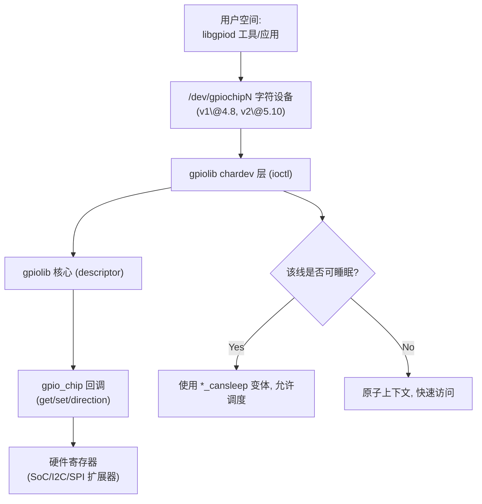
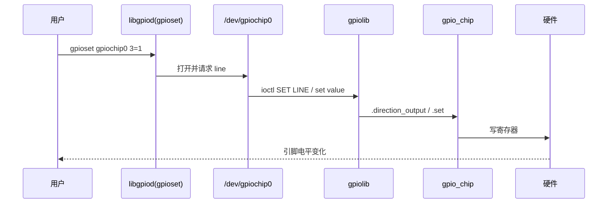
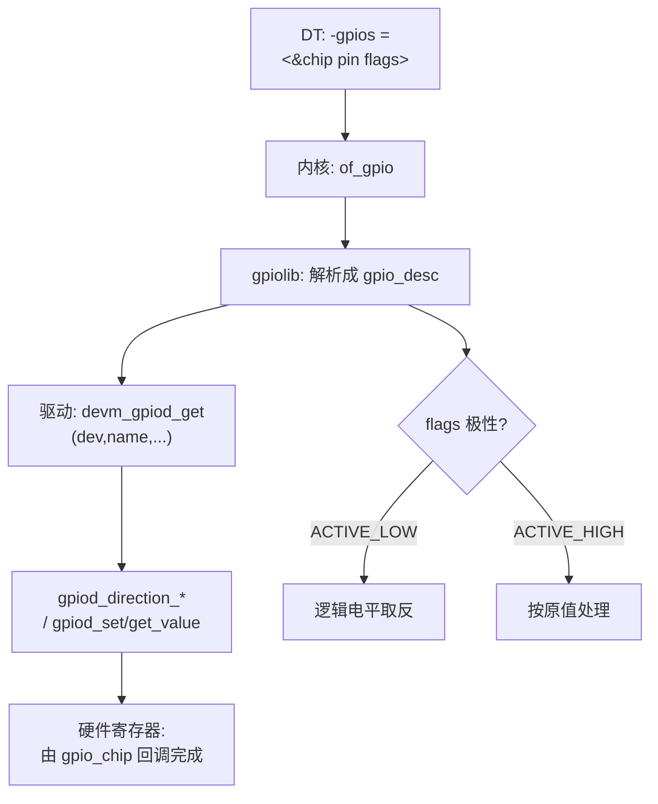
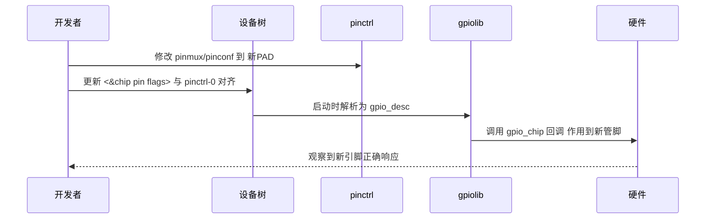
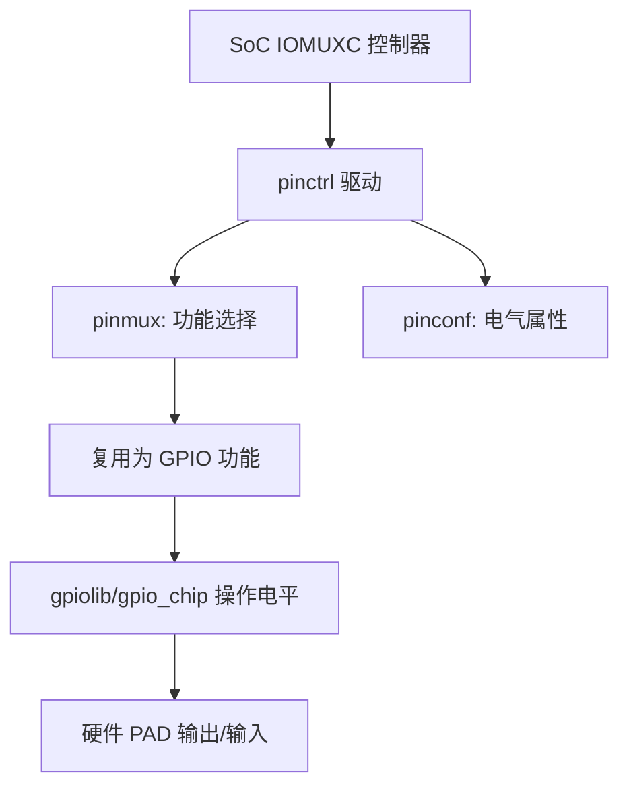
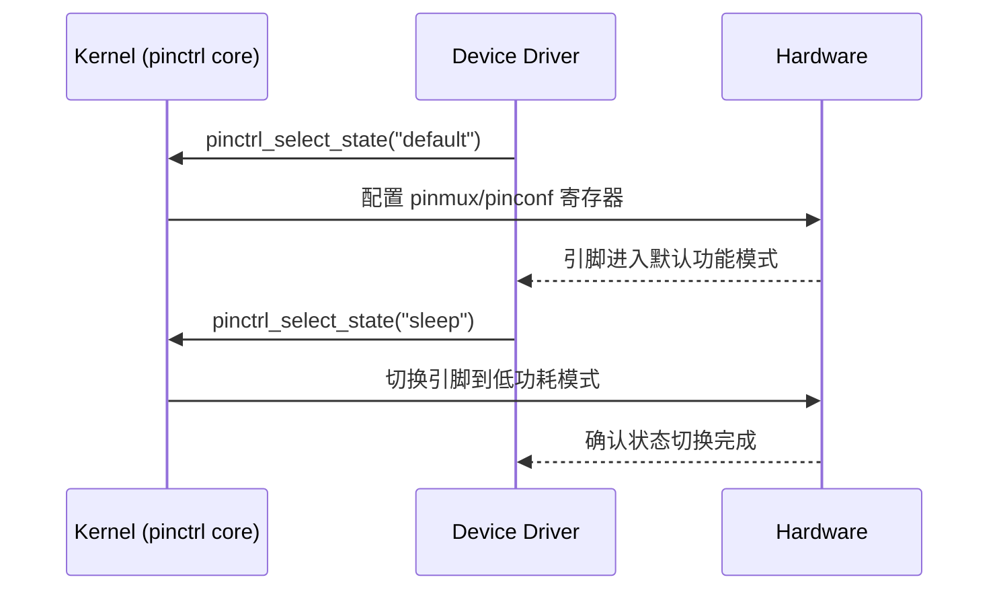

# 第1章_基础与总体框架

我是 **GPT-5 Thinking**。

## 1.1_GPIO_总览与生态演进(以_6.1_为基线_按时间线叙述)

### 1.1.1_主题引入

**本章要解决的问题**：

* GPIO 的**用户态接口**与**内核态编程范式**在过去十余年如何演进？
* 今天（以 Linux 6.1 为基线）应当采用哪套“正确姿势”？


**为什么重要**：很多旧文档仍以 `/sys/class/gpio`（sysfs）为例，但**官方已明确将其标注为废弃**，并引导新项目使用 **字符设备 ABI（/dev/gpiochipN）+ libgpiod**；同时内核驱动编程应以 **描述符 API（`gpiod_\*`）** 为中心，不再使用旧的整数 API（`gpio_*`）。这些变化不是“6.1 才出现”，而是**逐步发生**并在 6.x 时代完全稳固。([kernel.org](https://www.kernel.org/doc/html/next/admin-guide/gpio/sysfs.html?utm_source=chatgpt.com))

#### (1)_关键里程碑(时间线)

| 年份 / 版本       | 事件                               | 含义                                                         |
| ----------------- | ---------------------------------- | ------------------------------------------------------------ |
| **~2008 · 2.6.x** | sysfs GPIO 用户态接口广泛使用      | `/sys/class/gpio` 成为早期事实标准入口。([lwn.net](https://lwn.net/Articles/532714/?utm_source=chatgpt.com)) |
| **2014 · 3.14**   | **描述符式 Consumer API** 文档成形 | `gpiod_*` 与 `gpio_*` 并存，推荐新驱动用描述符。([git.ti.com](https://git.ti.com/cgit/ti-linux-kernel/ti-linux-kernel/tree/Documentation/gpio/consumer.txt?h=linux-3.14.y&utm_source=chatgpt.com)) |
| **2016 · 4.8**    | **GPIO 字符设备 ABI（v1）** 引入   | 用户态转向 `/dev/gpiochipN` 模型的开始。([libgpiod.readthedocs.io](https://libgpiod.readthedocs.io/en/stable/?utm_source=chatgpt.com)) |
| **2020 · 5.10**   | **字符设备 ABI v2** 引入           | 明确标注为“v2（first added in 5.10）”。([docs.kernel.org](https://docs.kernel.org/userspace-api/gpio/chardev.html?utm_source=chatgpt.com)) |
| **5.x 文档期**    | **sysfs 明确标注为已废弃**         | 新用户态程序应使用字符设备 ABI。([kernel.org](https://www.kernel.org/doc/html/next/admin-guide/gpio/sysfs.html?utm_source=chatgpt.com)) |

> 结论：到 **6.1** 时，推荐组合已非常明确——**驱动用 `gpiod_\*`，用户态走字符设备 + libgpiod**，sysfs 仅维护兼容。([kernel.org](https://www.kernel.org/doc/html/next/admin-guide/gpio/sysfs.html?utm_source=chatgpt.com))

------

### 1.1.2_数据结构视角

#### (1)_Provider(控制器)侧

- **`struct gpio_chip`**：抽象一组 GPIO 的控制器，定义方向/读写回调、`ngpio`、`can_sleep` 等；常用 `devm_gpiochip_add_data()` 注册，必要时与 pinctrl 通过 `gpio-ranges` 建立映射。([docs.kernel.org](https://docs.kernel.org/driver-api/gpio/index.html?utm_source=chatgpt.com))
- **`struct gpio_irq_chip`**（内嵌在 `gpio_chip` 中）：承载中断域接入（irqdomain），配置 `irq_chip` 回调（mask/unmask/ack/set_type）与合适的 `handler`，在注册芯片时一次性完成装配。([docs.kernel.org](https://docs.kernel.org/driver-api/gpio/index.html?utm_source=chatgpt.com))

> **cells 提示**：GPIO 控制器节点多用 `#gpio-cells = <2>`（如 `<pin flags>`）；而 GIC 这类**顶层中断控制器**常用 `#interrupt-cells = <3>`（类型/编号/触发），二者语义层级不同（第 6 章详述）。

#### (2)_Consumer(外设驱动)侧

- **`struct gpio_desc`**：GPIO 描述符（不透明句柄）。用 `devm_gpiod_get*()` 获取、`gpiod_put()` 释放；方向/电平通过 `gpiod_direction_*()`、`gpiod_set/get_value[_cansleep]()`；依据 `gpiod_cansleep()` 决定是否必须使用 `_cansleep` 变体。([docs.kernel.org](https://docs.kernel.org/driver-api/gpio/consumer.html?utm_source=chatgpt.com))

#### (3)_用户空间_ABI

- **字符设备**：每个控制器对应一个 `/dev/gpiochipN`；配合 **libgpiod** 工具（`gpiodetect/gpioinfo/gpioget/gpioset/gpiomon/gpiofind`）与 C API 使用。**v2 ABI 自 5.10 起提供**。([libgpiod.readthedocs.io](https://libgpiod.readthedocs.io/en/latest/gpio_tools.html?utm_source=chatgpt.com))
- **sysfs**：文档警告“**THIS ABI IS DEPRECATED**”，仅维护不扩展，新用户态请使用字符设备 ABI。([kernel.org](https://www.kernel.org/doc/html/next/admin-guide/gpio/sysfs.html?utm_source=chatgpt.com))

------

### 1.1.3_开发者视角(今天应该怎样写)

#### (1)_驱动迁移_三步走_(按时间线给出依据)

1. **内核 Consumer 代码**：将 `gpio_request()/gpio_set_value()` 等**整数接口**替换为 **`devm_gpiod_get\*()` + `gpiod_\*`** 描述符接口（3.14 文档已确立方向）。([git.ti.com](https://git.ti.com/cgit/ti-linux-kernel/ti-linux-kernel/tree/Documentation/gpio/consumer.txt?h=linux-3.14.y&utm_source=chatgpt.com))
2. **用户空间**：把 sysfs 脚本迁移到 **字符设备 + libgpiod**（4.8 引入、5.10 起 v2）。([libgpiod.readthedocs.io](https://libgpiod.readthedocs.io/en/stable/?utm_source=chatgpt.com))
3. **控制器驱动（Provider）**：以 `gpio_chip`/`devm_gpiochip_add_data()` 注册；若带中断则在 `gpio_chip.irq` 填好 `gpio_irq_chip`，由 gpiolib 完成 irqdomain 集成。([docs.kernel.org](https://docs.kernel.org/driver-api/gpio/index.html?utm_source=chatgpt.com))

#### (2)_Kconfig_清单(6.1_基线)

- `CONFIG_GPIOLIB=y`、`CONFIG_GPIO_CDEV=y`（字符设备）
- 目标 SoC/扩展器的具体 GPIO 控制器驱动
- （可选）`CONFIG_GPIO_AGGREGATOR` 用于访问控制/虚拟化隔离。([infradead.org](https://www.infradead.org/~mchehab/kernel_docs/admin-guide/gpio/gpio-aggregator.html?utm_source=chatgpt.com))
- **不推荐**：`CONFIG_GPIO_SYSFS`（仅为兼容遗留）。([kernel.org](https://www.kernel.org/doc/html/next/admin-guide/gpio/sysfs.html?utm_source=chatgpt.com))

------

### 1.1.4_用户视角(他们能看到/如何验证)

#### (1)_libgpiod_工具最小闭环

**注意**：libgpiod 属于用户态工具，需要手动集成到 **rootfs** (根文件系统) 在中才能使用。否则下述命令将会提示找不到命令。

```bash
# 列出芯片
gpiodetect
# 查看所有线信息
gpioinfo gpiochip0
# 读取第 3 号线
gpioget gpiochip0 3
# 设置第 3 号线为 1
gpioset gpiochip0 3=1
# 监听边沿事件（示例）
gpiomon gpiochip0 3
```

> 这些命令均来自 **libgpiod** 工具套件，是字符设备 ABI 的官方配套实践。([libgpiod.readthedocs.io](https://libgpiod.readthedocs.io/en/latest/gpio_tools.html?utm_source=chatgpt.com))

#### (2)_状态保持_语义提示

- `gpioset` 的输出状态**由持有请求的进程维持**；进程退出后状态不再保证（脚本里要考虑守护/超时/交互模式）。([manpages.debian.org](https://manpages.debian.org/experimental/gpiod/gpioset.1.en.html?utm_source=chatgpt.com))

------

### 1.1.5_可视化图示

#### (1)_总体调用链(flowchart)



#### (2)_用户写入到_LED_的时序(sequenceDiagram)



> 注：Mermaid 用**通用语法**、节点文本全部加引号，分支为 **Yes/No**。

------

### 1.1.6_示例代码(最小可用)

#### (1)_内核_Consumer(仅演示_描述符_API_用法)

```c
// demo_gpiod_consumer.c — 6.x 最小消费示例（仅演示关键路径）
#include <linux/module.h>
#include <linux/gpio/consumer.h>

static struct gpio_desc *led;

static int __init demo_init(void)
{
    /* 真实驱动应使用 devm_gpiod_get(dev,"status",GPIOD_OUT_LOW)
     * 下面仅为演示：全局查找，便于快速移植示例
     */
    led = gpiod_get(NULL, "status", GPIOD_OUT_LOW);
    if (IS_ERR(led))
        return PTR_ERR(led);

    /* 如果为低有效，则写 0 代表点亮；此处仅示意 */
    gpiod_set_value_cansleep(led, 1);
    pr_info("gpiod demo: status=1\n");
    return 0;
}
static void __exit demo_exit(void)
{
    gpiod_set_value_cansleep(led, 0);
    gpiod_put(led);
}
module_init(demo_init);
module_exit(demo_exit);
MODULE_LICENSE("GPL");
```

> **要点**：仅使用 `gpiod_*` 描述符 API（3.14 文档已确立）；依据可睡眠属性选择 `_cansleep` 变体。([git.ti.com](https://git.ti.com/cgit/ti-linux-kernel/ti-linux-kernel/tree/Documentation/gpio/consumer.txt?h=linux-3.14.y&utm_source=chatgpt.com))

#### (2)_用户态(libgpiod_C_API_一读一写)

```c
// u_gpiod_basic.c — 通过字符设备 ABI 读/写一根线（v2 自 5.10 起）
#include <gpiod.h>
#include <stdio.h>
int main(void) {
    struct gpiod_chip *chip = gpiod_chip_open_by_name("gpiochip0");
    struct gpiod_line *line = gpiod_chip_get_line(chip, 3);
    gpiod_line_request_output(line, "u_gpiod_basic", 1); // 置 1
    printf("line3=%d\n", gpiod_line_get_value(line));
    gpiod_line_set_value(line, 0); // 再置 0
    gpiod_line_release(line);
    gpiod_chip_close(chip);
    return 0;
}
```

> **要点**：用户态走字符设备 + libgpiod；**v2 ABI first added in 5.10**。([docs.kernel.org](https://docs.kernel.org/userspace-api/gpio/chardev.html?utm_source=chatgpt.com))

------

### 1.1.7_调试与验证

1. **字符设备/工具链自检**

```bash
gpiodetect               # 芯片枚举
gpioinfo gpiochip0       # 线方向/消费方/偏好名
gpioget gpiochip0 3      # 读取
gpioset gpiochip0 3=1    # 置 1（注意进程持有语义）
gpiomon gpiochip0 3      # 事件监听
```

> 工具与用法以 libgpiod 文档为准。([libgpiod.readthedocs.io](https://libgpiod.readthedocs.io/en/latest/gpio_tools.html?utm_source=chatgpt.com))

1. **内核端视图与动态调试**

```bash
sudo mount -t debugfs none /sys/kernel/debug
sudo cat /sys/kernel/debug/gpio              # 概览所有 gpiochip
echo 'file drivers/gpio/gpiolib*.c +p' | sudo tee /sys/kernel/debug/dynamic_debug/control
dmesg -w
```

1. **常见问题清单（按时间线给出定位方向）**

- **“/sys/class/gpio 不可用/功能缺失”**：不是 bug——**已弃用**，新项目应改用字符设备 ABI（4.8 起有、5.10 起 v2）。([kernel.org](https://www.kernel.org/doc/html/next/admin-guide/gpio/sysfs.html?utm_source=chatgpt.com))
- **`gpioset` 状态“自动复原”**：line 的输出状态通常随**请求持有期**而维持，进程退出则不再保证；参考工具手册的说明（可用超时/交互模式/守护方式）。([manpages.debian.org](https://manpages.debian.org/experimental/gpiod/gpioset.1.en.html?utm_source=chatgpt.com))
- **驱动仍用 `gpio_\*`**：请迁移至 `gpiod_*` 描述符（3.14 文档已建议）。([git.ti.com](https://git.ti.com/cgit/ti-linux-kernel/ti-linux-kernel/tree/Documentation/gpio/consumer.txt?h=linux-3.14.y&utm_source=chatgpt.com))

------

### 1.1.8_小结

#### (1)_对比表_历史接口_vs_今天的推荐实践

| 维度       | 旧 sysfs `/sys/class/gpio`（2.6 时代兴起） | **字符设备 `/dev/gpiochipN`（4.8 引入，5.10 起 v2，推荐）** |
| ---------- | ------------------------------------------ | ----------------------------------------------------------- |
| 官方状态   | **Deprecated**（仅维护）                   | **方向明确**，持续演进                                      |
| 用户态工具 | `echo/cat`                                 | **libgpiod** 工具与 C API                                   |
| 事件/多路  | 能力有限                                   | line request / event / 批量                                 |
| 未来保障   | 逐步退出                                   | **主线方向**                                                |

> **一句话总结**：**按时间线**看，GPIO 的正确姿势已从“sysfs + `gpio_*`”演进为“**字符设备 + libgpiod**（用户态）与 **`gpiod_\*` 描述符**（内核态）”；到 6.1 时代，这条路线已是事实标准。([kernel.org](https://www.kernel.org/doc/html/next/admin-guide/gpio/sysfs.html?utm_source=chatgpt.com))

------

#### (2)_参考资料(建议你在本机保存)

- **GPIO Sysfs（已废弃）**：官方管理员指南页面。([kernel.org](https://www.kernel.org/doc/html/next/admin-guide/gpio/sysfs.html?utm_source=chatgpt.com))
- **GPIO 字符设备 ABI（v2，5.10 起）**：官方 userspace-API 文档。([docs.kernel.org](https://docs.kernel.org/userspace-api/gpio/chardev.html?utm_source=chatgpt.com))
- **GPIO Descriptor Consumer Interface（驱动消费）**：官方驱动 API 文档。([docs.kernel.org](https://docs.kernel.org/driver-api/gpio/consumer.html?utm_source=chatgpt.com))
- **早期 3.14 文档（描述符 vs 整数接口）**：TI 维护的 3.14 文档副本。([git.ti.com](https://git.ti.com/cgit/ti-linux-kernel/ti-linux-kernel/tree/Documentation/gpio/consumer.txt?h=linux-3.14.y&utm_source=chatgpt.com))
- **libgpiod 工具手册**：命令及用法。([libgpiod.readthedocs.io](https://libgpiod.readthedocs.io/en/latest/gpio_tools.html?utm_source=chatgpt.com))


## 1.2_设备树中的_GPIO_基础语义

### 1.2.1_主题引入

**本章要解决的问题**：

* 如何在 DeviceTree（DT）中**准确描述** GPIO 控制器（Provider）与使用 GPIO 的外设（Consumer），并让内核在启动时把 DT 信息正确映射到 **gpiolib 描述符 API** 与 **字符设备 ABI**？


**为什么重要**：DT 是 SoC/板级适配的“事实来源”。引脚一旦选错或 flags 配置不当，后续驱动即使写对了也无效；同时，**迁移/换脚**几乎都发生在 DT 层，不应在驱动里硬编码。

------

### 1.2.2_数据结构视角(DT_基本语义)

#### (1)_Provider_侧常用属性(GPIO_控制器节点)

- `gpio-controller`：布尔属性，声明该节点是一个 GPIO 控制器。
- `#gpio-cells = <2>`：GPIO 说明符（specifier）单元数。**通用为 2**：`<pin flags>`。
  - `pin`：该控制器内部的**偏移号**（从 0 开始）。
  - `flags`：位掩码（见 2.2.3），如 `GPIO_ACTIVE_LOW/OPEN_DRAIN/PULL_UP` 等。
- `gpio-ranges`（可选）：把本控制器的 GPIO 号段映射到 **pinctrl** 的管脚号段，用于 pinctrl 与 gpiolib 的一致性。
- `gpio-line-names`（可选）：为每根线命名，`gpioinfo` 会显示，便于调试。
- **若本 GPIO 控制器还能充当中断控制器**：
  - `interrupt-controller`、`#interrupt-cells = <2>`（多见 `<hwirq type>`），以及连接父中断域的 `interrupts`/`interrupt-parent`。
  - 注意：**GIC 之类顶层中断控制器**常用 `#interrupt-cells = <3>`（编号/类型/触发），与 GPIO 控制器的 2 cells **语义层级不同**。

> 设计提醒：控制器驱动注册使用 `struct gpio_chip`/`devm_gpiochip_add_data()`；若带中断，在 `gpio_chip.irq` 内填好 `struct gpio_irq_chip`，一次性与 irqdomain 装配（第 8–9 章详述）。

#### (2)_Consumer_侧约定(外设节点如何引用_GPIO)

- **通用书写**：`<name>-gpios = <&chip pin flags>;`
  - 例如：`reset-gpios`、`enable-gpios`、`cs-gpios`、`status-gpios` 等。
  - 在驱动里以 `devm_gpiod_get(dev, "reset", ...)` 等方式取到 `struct gpio_desc`。
- **标准子系统**：
  - `gpio-leds`：`leds { foo { gpios = <...>; default-state = "on/off"; }; }`
  - `gpio-keys`：按键 `debounce-interval`、中断/轮询等。
  - `regulator`/`mmc`/`spi` 等均有各自 binding 里定义的 `*-gpios` 属性名。

#### (3)_flags_常用取值(来自_dt-bindings/gpio/gpio.h)

- **极性**：`GPIO_ACTIVE_HIGH`（默认） / `GPIO_ACTIVE_LOW`。
- **电气属性**：`GPIO_OPEN_DRAIN`、`GPIO_OPEN_SOURCE`、`GPIO_PULL_UP`、`GPIO_PULL_DOWN`（是否生效取决于控制器/引脚是否支持，通过 pinctrl/pinconf 更可靠）。
- **方向/默认值**：不在 flags 中表达，**用 pinctrl 配置**或消费者驱动中通过 `GPIOD_OUT_LOW/HIGH`、`gpiod_direction_*()` 设定。

> 时间线注记：DT 基本语义在 **3.x–4.x** 即已稳定；到 **6.1** 时代更多是 binding 细化与新控制器补充。

------

### 1.2.3_开发者视角(如何写/改)

#### (1)_最小控制器节点(演示)

```dts
mygpio: gpio-controller@40000000 {
    compatible = "leaf,mygpio-mmio";
    reg = <0x40000000 0x1000>;
    gpio-controller;
    #gpio-cells = <2>;                // <pin flags>
    gpio-line-names = "LED0", "LED1", "BTN0", "BTN1", /* ... */;

    // 若能级联到父中断域
    // interrupt-controller;
    // #interrupt-cells = <2>;        // <hwirq type>
    // interrupts = <...>;            // 接到 GIC/父域
    // interrupt-parent = <&gic>;

    // 可与 pinctrl 的管脚区间建立映射（按需）
    // gpio-ranges = <&pinctrl 0 100 16>; // 示例：把 pinctrl 的100..115映射到本chip 0..15
};
```

#### (2)_最小消费节点(两种典型方式)

**A. 用通用子系统（gpio-leds）**

```dts
leds {
    compatible = "gpio-leds";

    status_led: status {
        label = "status:green";
        gpios = <&mygpio 3 GPIO_ACTIVE_LOW>;
        default-state = "off";
    };
};
```

**B. 在自有设备节点里用 `<name>-gpios`**

```dts
mydev@0 {
    compatible = "leaf,mydev";
    status-gpios = <&mygpio 3 GPIO_ACTIVE_LOW>;   // 驱动里 devm_gpiod_get(dev,"status",...)
    reset-gpios  = <&mygpio 7 GPIO_ACTIVE_HIGH>;
    /* … */
};
```

#### (3)_pinctrl_绑定与_换脚_操作要点

**核心原则**：**引脚复用（mux）与电气（pull/drive）应在 pinctrl 中描述；GPIO 控制/状态在 gpiolib/驱动中完成。换脚时先改 pinctrl**，再确保 `*-gpios` 的 `<&chip pin flags>` 与之对应。

**i.MX6ULL 示例（IOMUXC）**

```dts
/* 1) pinctrl: 选择 PAD 复用为 GPIO，并设置上拉/驱动等 */
&pinctrl {
    pinctrl_led: ledgrp {
        fsl,pins = <
            MX6UL_PAD_GPIO1_IO03__GPIO1_IO03  0x10B0   // 复用为GPIO, 上拉/速度见 SoC 手册
        >;
    };
};

/* 2) consumer: 指向 &gpio1 偏移 3，并与 pinctrl-0 对齐 */
leds {
    compatible = "gpio-leds";
    pinctrl-names = "default";
    pinctrl-0 = <&pinctrl_led>;

    led0 {
        gpios = <&gpio1 3 GPIO_ACTIVE_LOW>;
        default-state = "off";
    };
};
```

**RK356x 示例（rockchip,pinctrl）**

```dts
&pinctrl {
    led0: led0 {
        rockchip,pins = <0 RK_PA3 RK_FUNC_GPIO &pcfg_pull_none>; // GPIO0_A3
    };
};

leds {
    compatible = "gpio-leds";
    pinctrl-names = "default";
    pinctrl-0 = <&led0>;

    led0 {
        gpios = <&gpio0 RK_PA3 GPIO_ACTIVE_LOW>;  // 与 pinctrl 一致
        default-state = "off";
    };
};
```

> 实务建议：**换脚**时先在 pinctrl 修改到新 PAD/管脚，再把 `<chip, pin>` 对应到新偏移；避免只改 `gpios` 却忘了更新 pinmux，导致“方向/电平操作都正常但硬件没反应”。

#### (4)_gpio-hog_上电即固定占用的线

```dts
&gpio1 {
    gpio-hog;
    hog_reset: reset_hold {
        gpios = <3 GPIO_ACTIVE_LOW>;
        output-high;           // 上电后立即输出 1（结合极性决定真实电平）
        line-name = "hold-reset";
    };
};
```

> 典型用于 **电源保持/强制复位** 等不需要驱动参与的场景。行为在早期内核已可用，6.x 仍按此语义。

------

### 1.2.4_用户视角(他们能看到/怎么验证)

#### (1)_从运行系统导出_DT_并检查

```bash
# 导出当前设备树为 dts（需要 root）
sudo dtc -I fs -O dts -o /tmp/running.dts /sys/firmware/devicetree/base

# 或者快速查看某节点
ls -l /proc/device-tree/leds/status
hexdump -C /proc/device-tree/leds/status/gpios
```

#### (2)_用_libgpiod_验证_DT_与标注

```bash
gpiodetect
gpioinfo gpiochip0        # 观察 line-name、used by、方向
gpioset gpiochip0 3=0     # 试拉低/拉高匹配 LED 极性
gpioget gpiochip0 3
```

------

### 1.2.5_可视化图示

**2.5.1 从 DT 到硬件的解析流程（flowchart）**



**2.5.2 “换脚”时序（sequenceDiagram）**



> 注意：本章所有 Mermaid 使用 **Typora 通用写法**；分支 `|ACTIVE_LOW|` 与 `I[` 之间**无多余空格**。

------

### 1.2.6_调试与验证

1. **常见失败模式与排查**

- **方向/电平都在变，但硬件没反应**：十有八九是 **pinctrl 未切到 GPIO 功能** 或复用到别的外设；核对 `pinctrl-0` 与 `rockchip,fsl` 等 SoC 专有属性。
- **电平颠倒**：`GPIO_ACTIVE_LOW` 与板上电路极性不匹配；或 LED 低有效写 1 不亮/写 0 反而亮。
- **不可睡眠警告**：硬件访问需要睡眠时，控制器驱动要把 `gc.can_sleep = true`；消费者使用 `*_cansleep`。
- **多驱动争用一根 GPIO**：`gpioinfo` 可看到 `consumer` 名；清理重复的 `gpio-hog` 或错误的 `status = "okay"` 节点。

1. **核查 pinctrl 与 gpiolib 的一致性**

- i.MX6ULL：`fsl,pins` 中 `__GPIO` 复用是否正确、pad control 值是否合理（上拉/驱动能力）。
- RK356x：`rockchip,pins` 的 `<bank pin func cfg>` 是否为 `GPIO` 功能、`pcfg_pull_*` 是否匹配电路。

1. **变更后快速自检**

- 只改了 `*-gpios` 而**没改 pinctrl**：高频坑；务必同时检视两处。
- 导出运行时 DTS 对比（2.4.1），同时看 `gpioinfo` 与硬件行为。

------

### 1.2.7_小结

#### (1)_要点表

| 主题          | 正确做法                                                    | 备注                                                         |
| ------------- | ----------------------------------------------------------- | ------------------------------------------------------------ |
| Provider 定义 | `gpio-controller` + `#gpio-cells=<2>`                       | 如需中断：加 `interrupt-controller` + `#interrupt-cells=<2>` |
| Consumer 引用 | `<name>-gpios = <&chip pin flags>`                          | 驱动用 `devm_gpiod_get(dev,"name",...)`                      |
| 极性与电气    | `GPIO_ACTIVE_LOW/HIGH`，`OPEN_DRAIN/SOURCE`，`PULL_UP/DOWN` | 电气更建议在 **pinctrl/pinconf** 表达                        |
| 换脚流程      | **先改 pinctrl，再改 <&chip pin>**                          | 保持 pinmux 与 gpiolib 对齐                                  |
| 上电即控      | `gpio-hog`（`input`/`output-high/low`/`line-name`）         | 不需要驱动即可固定一根线                                     |

**一句话总结**：**DT 决定“接哪根脚、怎么接”**，而驱动只关心“用这根脚做什么”；换脚或改电气必须首先在 **pinctrl** 落地，再由 `*-gpios` 精确指向对应 offset 与 flags。

------

## 1.3_pinctrl_/_pinmux_与_GPIO_的关系

### 1.3.1_主题引入

**本章要解决的问题：**

* 在 SoC 中，为什么同一引脚既能是 UART_TX、SPI_MOSI，又能当作 GPIO？
* pinctrl（pin control）与 gpiolib（GPIO library）如何协作，让驱动层面既能控制引脚复用，又能安全操作 GPIO 电平？


**核心关注点：**

1. **引脚复用（pinmux）**：决定引脚的“功能模式”。
2. **引脚配置（pinconf）**：决定电气属性（上拉、下拉、驱动强度等）。
3. **GPIO 控制（gpiolib）**：在复用为 GPIO 模式后进行方向/电平读写。
4. **状态切换机制**：`default / sleep / idle` 等多状态。
5. **移植与换脚**：修改设备树时如何同步 pinctrl 与 GPIO。

------

### 1.3.2_数据结构视角(内核架构关系)

#### (1)_三层核心结构

在 Linux 内核中，pinctrl 与 GPIO 的关系可以抽象为下图：

```
SoC IOMUX 控制器
 ├── pinctrl driver（硬件复用控制层）
 │    ├── pinmux 子模块（功能选择）
 │    └── pinconf 子模块（电气属性）
 └── gpiolib（GPIO 通用框架）
      └── gpio_chip（每组 GPIO 控制器）
```

> 所有这些模块最终都服务于同一片**引脚（pin）**。
>  pinctrl 决定“引脚当前干什么”，gpiolib 决定“如果是 GPIO，该如何操作”。

------

#### (2)_主要数据结构

##### 1)_struct_pinctrl_desc(定义一个_pinctrl_控制器)

```c
struct pinctrl_desc {
    const char *name;                 // 控制器名称（如 imx6ul-iomuxc）
    struct pinmux_ops *pmxops;        // 功能复用操作集
    struct pinconf_ops *confops;      // 电气配置操作集
    struct pctlops *pctlops;          // pinctrl 基础操作
    unsigned int npins;               // 支持的 pin 数量
    const struct pinctrl_pin_desc *pins;  // 每个 pin 的描述数组
};
```

##### 2)_struct_pinctrl_state(一组_状态设置_如_default/sleep)

```c
struct pinctrl_state {
    const char *name;                // 对应设备树 pinctrl-names 的字符串
    struct list_head settings;       // 引脚配置集合
};
```

##### 3)_struct_gpio_chip(GPIO_控制器抽象)

与 pinctrl 通过 `gpio-ranges` 绑定：

```c
struct gpio_chip {
    const char *label;
    struct device *parent;
    int (*direction_input)(struct gpio_chip *chip, unsigned offset);
    int (*direction_output)(struct gpio_chip *chip, unsigned offset, int value);
    void (*set)(struct gpio_chip *chip, unsigned offset, int value);
    int  (*get)(struct gpio_chip *chip, unsigned offset);
    unsigned int ngpio;
    struct list_head list;
};
```

> 通过 `gpiochip_add_pin_range()` 或 DT 的 `gpio-ranges` 将 pinctrl 与 gpiolib 对齐。

------

#### (3)_设备树绑定关系

设备树中 `pinctrl` 节点通常定义在 SoC 的 IOMUX 控制器下：

```dts
&pinctrl {
    pinctrl_led: ledgrp {
        fsl,pins = <
            MX6UL_PAD_GPIO1_IO03__GPIO1_IO03 0x10B0
        >;
    };
};
```

**字段说明**

| 字段                               | 含义                                                  |
| ---------------------------------- | ----------------------------------------------------- |
| `MX6UL_PAD_GPIO1_IO03__GPIO1_IO03` | 管脚复用为 GPIO1_IO03 功能                            |
| `0x10B0`                           | pad control 电气配置（上拉、速度、驱动强度等）        |
| `pinctrl_led`                      | 状态标签，可在外设节点中 `pinctrl-0 = <&pinctrl_led>` |

**消费者节点引用：**

```dts
leds {
    compatible = "gpio-leds";
    pinctrl-names = "default";
    pinctrl-0 = <&pinctrl_led>;   // 激活 default 状态
    led0 {
        gpios = <&gpio1 3 GPIO_ACTIVE_LOW>;
        default-state = "off";
    };
};
```

> 驱动加载时，`pinctrl_select_state(dev, "default")` 会驱动 pinmux 复用为 GPIO 并写入 PAD 控制。

------

### 1.3.3_开发者视角(如何正确协同)

#### (1)_编写_pinctrl_节点的基本步骤

1. **查 SoC IOMUX 表**：确定目标 PAD。
2. **定义 pinctrl 子节点**：在 pinctrl 控制器下编写 `default/sleep` 等状态。
3. **在外设节点声明**：`pinctrl-names` 与 `pinctrl-0/1`。
4. **核对一致性**：pinmux 选择的 PAD 必须与 `*-gpios = <&chip pin flags>` 指向的 pin 一致。

**示例：IMX6ULL 使用 GPIO1_IO03 控制 LED**

```dts
&pinctrl {
    pinctrl_led: ledgrp {
        fsl,pins = <
            MX6UL_PAD_GPIO1_IO03__GPIO1_IO03 0x10B0
        >;
    };
};

leds {
    compatible = "gpio-leds";
    pinctrl-names = "default";
    pinctrl-0 = <&pinctrl_led>;
    led0 {
        gpios = <&gpio1 3 GPIO_ACTIVE_LOW>;
        default-state = "off";
    };
};
```

------

#### (2)_驱动中调用_pinctrl_API(最小模式)

```c
struct pinctrl *pinctrl;
struct pinctrl_state *state;

pinctrl = devm_pinctrl_get(&pdev->dev);
if (IS_ERR(pinctrl))
    return PTR_ERR(pinctrl);

state = pinctrl_lookup_state(pinctrl, "default");
if (!IS_ERR(state))
    pinctrl_select_state(pinctrl, state);
```

> `devm_pinctrl_get()`：自动解析 `pinctrl-names`。
>  `pinctrl_select_state()`：在 default/sleep 等状态间切换。

------

#### (3)_多状态切换示例(DT_+_驱动)

**DT：**

```dts
&pinctrl {
    uart_pins_default: uartgrp {
        fsl,pins = <
            MX6UL_PAD_UART1_TX_DATA__UART1_DCE_TX 0x1b0b1
            MX6UL_PAD_UART1_RX_DATA__UART1_DCE_RX 0x1b0b1
        >;
    };

    uart_pins_sleep: uartgrp_sleep {
        fsl,pins = <
            MX6UL_PAD_UART1_TX_DATA__GPIO1_IO16 0x1b0b0
            MX6UL_PAD_UART1_RX_DATA__GPIO1_IO17 0x1b0b0
        >;
    };
};
```

**驱动：**

```c
pinctrl_select_state(pinctrl, pinctrl_lookup_state(pinctrl, "default"));
/* ... 运行期 ... */
pinctrl_select_state(pinctrl, pinctrl_lookup_state(pinctrl, "sleep"));
```

> 休眠时可切换为 GPIO 并拉到安全电平，避免误动作。

------

#### (4)_GPIO_与_pinctrl_的依赖关系

| 项目                      | 由谁负责       | 生效阶段       |
| ------------------------- | -------------- | -------------- |
| 复用为 GPIO 功能          | pinctrl/pinmux | 设备初始化     |
| 电气特性（上拉/驱动能力） | pinconf        | 初始化阶段     |
| 电平读写                  | gpiolib        | 运行阶段       |
| 休眠态切换                | pinctrl 状态机 | suspend/resume |

------

### 1.3.4_实战_最小可运行驱动(pinctrl_+_gpiod_+_PM_+_sysfs)

#### (1)_DTS(两态齐全_避免歧义命名)

```dts
/* 1) IOMUX/pinctrl：把目标 PAD 复用为 GPIO，并配置电气 */
&pinctrl {
    pinctrl_mydev_default: mydev_default {
        /* 示例：i.MX6ULL，把具体 PAD 与 padcfg 换成你的板级参数 */
        fsl,pins = <
            MX6UL_PAD_GPIO1_IO03__GPIO1_IO03 0x10B0
        >;
    };
    pinctrl_mydev_sleep: mydev_sleep {
        /* 休眠态的低功耗/安全配置（示例值） */
        fsl,pins = <
            MX6UL_PAD_GPIO1_IO03__GPIO1_IO03 0x10A0
        >;
    };
};

/* 2) Consumer：功能语义节点名，避免与标准属性同名的 label */
mydev@0 {
    compatible = "leaf,mydev-demo";
    pinctrl-names = "default", "sleep";
    pinctrl-0 = <&pinctrl_mydev_default>;
    pinctrl-1 = <&pinctrl_mydev_sleep>;

    /* 驱动里用 devm_gpiod_get(dev,"status",...) 获取 */
    status-gpios = <&gpio1 3 GPIO_ACTIVE_LOW>;

    /* 可选：上电默认逻辑态（0=灭 1=亮），驱动读取为初值 */
    led-default = <0>;
    status = "okay";
};
```

#### (2)_驱动源码(Linux_6.x_可编_逻辑闭环)

```c
// drivers/misc/leaf_pinctrl_gpiod_demo.c
// SPDX-License-Identifier: GPL-2.0
#include <linux/module.h>
#include <linux/platform_device.h>
#include <linux/of.h>
#include <linux/gpio/consumer.h>
#include <linux/pinctrl/consumer.h>
#include <linux/pm.h>
#include <linux/sysfs.h>

struct mydev {
    struct device        *dev;
    struct pinctrl       *pctl;
    struct pinctrl_state *st_default;
    struct pinctrl_state *st_sleep;
    struct gpio_desc     *status;     /* status-gpios 描述符 */
    bool                  active_low; /* gpiod_is_active_low() */
    int                   logical_on; /* 逻辑态：0/1（抽象亮/灭） */
};

static int __mydev_apply_logic(struct mydev *m, int on)
{
    int level = m->active_low ? !on : on;
    int ret;

    if (gpiod_cansleep(m->status))
        ret = gpiod_set_value_cansleep(m->status, level);
    else
        { gpiod_set_value(m->status, level); ret = 0; }

    if (!ret)
        m->logical_on = on;
    return ret;
}

/* /sys/.../led: 读 0/1，写 0/1 控制逻辑态 */
static ssize_t led_show(struct device *dev, struct device_attribute *a, char *buf)
{
    struct mydev *m = dev_get_drvdata(dev);
    int val = gpiod_get_value_cansleep(m->status);
    if (val < 0) val = m->active_low ? !m->logical_on : m->logical_on; /* 回退上次态 */
    val = m->active_low ? !val : val;
    return sysfs_emit(buf, "%d\n", val);
}

static ssize_t led_store(struct device *dev, struct device_attribute *a,
                         const char *buf, size_t count)
{
    struct mydev *m = dev_get_drvdata(dev);
    int on;
    if (kstrtoint(buf, 0, &on) || (on != 0 && on != 1))
        return -EINVAL;
    if (__mydev_apply_logic(m, on))
        return -EIO;
    return count;
}
static DEVICE_ATTR_RW(led);

static void mydev_select_state(struct mydev *m, struct pinctrl_state *st)
{
    if (!IS_ERR_OR_NULL(st))
        pinctrl_select_state(m->pctl, st);
}

static int mydev_probe(struct platform_device *pdev)
{
    struct device *dev = &pdev->dev;
    struct mydev *m;
    int ret, def = 0;

    m = devm_kzalloc(dev, sizeof(*m), GFP_KERNEL);
    if (!m) return -ENOMEM;
    m->dev = dev;
    platform_set_drvdata(pdev, m);

    /* 1) pinctrl 获取与切到 default */
    m->pctl = devm_pinctrl_get(dev);
    if (IS_ERR(m->pctl)) return PTR_ERR(m->pctl);
    m->st_default = pinctrl_lookup_state(m->pctl, "default");
    m->st_sleep   = pinctrl_lookup_state(m->pctl, "sleep");  /* 可能不存在 */
    mydev_select_state(m, m->st_default);

    /* 2) 获取 GPIO 描述符（输出口，默认安全值） */
    m->status = devm_gpiod_get(dev, "status", GPIOD_OUT_LOW);
    if (IS_ERR(m->status)) return PTR_ERR(m->status);
    m->active_low = gpiod_is_active_low(m->status);

    /* 3) 读取默认逻辑态并应用 */
    of_property_read_u32(dev->of_node, "led-default", &def);
    __mydev_apply_logic(m, !!def);

    /* 4) 导出简易 sysfs 属性：/sys/bus/platform/devices/<dev>/led */
    ret = device_create_file(dev, &dev_attr_led);
    if (ret) return ret;

    dev_info(dev, "ready: active_low=%d default=%d\n", m->active_low, m->logical_on);
    return 0;
}

static int mydev_remove(struct platform_device *pdev)
{
    struct mydev *m = platform_get_drvdata(pdev);
    device_remove_file(m->dev, &dev_attr_led);
    return 0; /* devm_* 自动清理 */
}

/* 系统休眠/唤醒 */
static int __maybe_unused mydev_suspend(struct device *dev)
{
    struct mydev *m = dev_get_drvdata(dev);
    __mydev_apply_logic(m, 0);                /* 入睡前拉到安全态（示例：灭） */
    mydev_select_state(m, m->st_sleep);       /* 切 sleep 引脚状态（若存在） */
    return 0;
}
static int __maybe_unused mydev_resume(struct device *dev)
{
    struct mydev *m = dev_get_drvdata(dev);
    mydev_select_state(m, m->st_default);     /* 回到工作态 */
    __mydev_apply_logic(m, m->logical_on);    /* 恢复逻辑态 */
    return 0;
}

static const struct dev_pm_ops mydev_pm_ops = {
    SET_SYSTEM_SLEEP_PM_OPS(mydev_suspend, mydev_resume)
};

static const struct of_device_id mydev_of_match[] = {
    { .compatible = "leaf,mydev-demo" }, { }
};
MODULE_DEVICE_TABLE(of, mydev_of_match);

static struct platform_driver mydev_driver = {
    .probe  = mydev_probe,
    .remove = mydev_remove,
    .driver = {
        .name           = "leaf-pinctrl-gpiod-demo",
        .of_match_table = mydev_of_match,
        .pm             = &mydev_pm_ops,
    },
};
module_platform_driver(mydev_driver);

MODULE_LICENSE("GPL");
MODULE_AUTHOR("Leaf Book");
MODULE_DESCRIPTION("Demo: pinctrl + gpiod + sysfs + suspend/resume");
```

**Kbuild / Kconfig 提示**

- `obj-m += leaf_pinctrl_gpiod_demo.o`
- 需启用：`CONFIG_PINCTRL=y`、`CONFIG_GPIOLIB=y`、`CONFIG_GPIO_CDEV=y`

------

### 1.3.5_用户视角(验证是否配置正确)

#### (1)_查看_pinctrl_控制器及引脚状态(debugfs)

```bash
sudo mount -t debugfs none /sys/kernel/debug
ls /sys/kernel/debug/pinctrl/
cat /sys/kernel/debug/pinctrl/*/pinmux-pins | grep -E 'GPIO1_IO03|mydev'
cat /sys/kernel/debug/pinctrl/*/pinconf-pins | grep GPIO1_IO03
```

#### (2)_验证_GPIO_模式(libgpiod)

```bash
gpiodetect
gpioinfo gpiochip0
gpioset gpiochip0 3=0   # 进程持有语义：退出后状态可能恢复
gpioget gpiochip0 3
```

#### (3)_验证_sysfs_属性(驱动导出)

```bash
cd /sys/bus/platform/devices
ls | grep leaf-pinctrl-gpiod-demo
cat <devdir>/led
echo 1 | sudo tee <devdir>/led   # 亮
echo 0 | sudo tee <devdir>/led   # 灭
```

#### (4)_检测状态切换(休眠/唤醒)

```bash
sudo sh -c 'echo mem > /sys/power/state'
dmesg | tail -n 50   # 观察 default/sleep 切换
```

------

### 1.3.6_可视化图示

#### (1)_pinctrl_与_GPIO_交互流程



#### (2)_状态切换时序



------

### 1.3.7_调试与验证技巧

| 问题现象            | 排查方向                       | 常见原因                     |
| ------------------- | ------------------------------ | ---------------------------- |
| 电平无法输出        | `pinmux-pins` 显示非 GPIO 功能 | pinctrl 节点没生效或冲突     |
| GPIO 可见但控制无效 | pad 未配置驱动强度/上下拉      | 电气属性或状态错误           |
| 休眠后外设误触发    | 无 `sleep` 状态或未切换        | `pinctrl-1` 缺失、驱动未切换 |
| `-EINVAL`           | phandle/引用错误               | label/`&`/节点名拼写问题     |
| 崩溃或死机          | NULL 指针/返回值未检查         | `IS_ERR`/ret 未处理完备      |

> 建议顺序：**pinmux → pinconf → gpiolib → dmesg/PM**。先看 `pinmux-pins`，再看 `gpioinfo`，最后看状态切换日志。

------

### 1.3.8_小结

| 模块    | 功能          | 控制层         | 关键位置                     |
| ------- | ------------- | -------------- | ---------------------------- |
| pinctrl | 管脚控制框架  | 平台层（SoC）  | `/sys/kernel/debug/pinctrl/` |
| pinmux  | 功能复用选择  | pinctrl 子模块 | `pinmux-pins`                |
| pinconf | 电气特性设置  | pinctrl 子模块 | `pinconf-pins`               |
| gpiolib | GPIO 电平控制 | 驱动层         | `/dev/gpiochipN`、`gpioinfo` |

**一句话总结：**
 👉 **pinctrl 决定“脚干什么”，GPIO 决定“怎么干”**；default/sleep 两态 + 逻辑映射 + 用户态验证，缺一不可。

