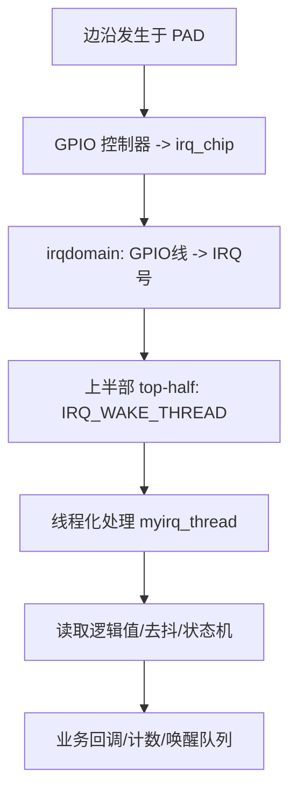
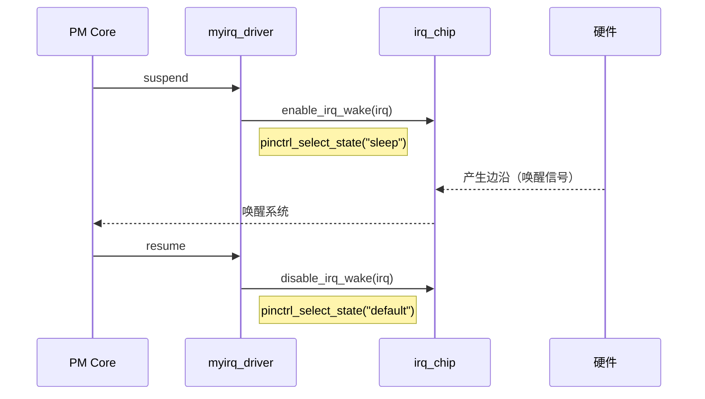
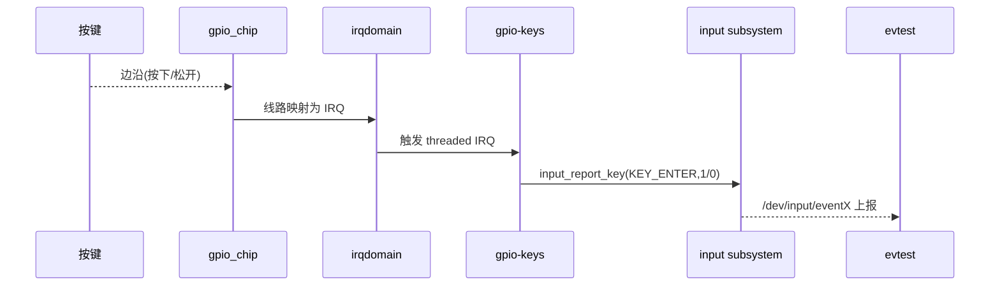
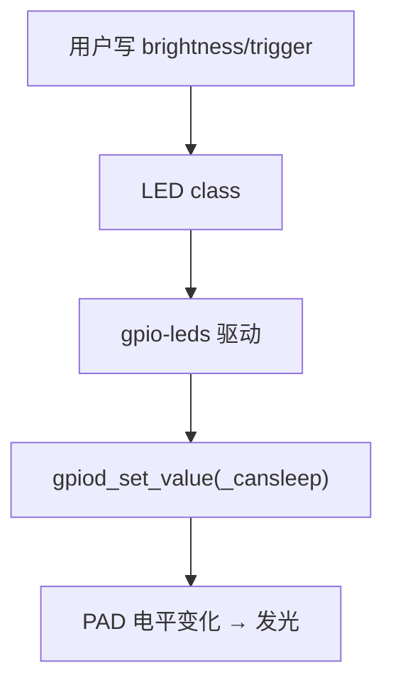
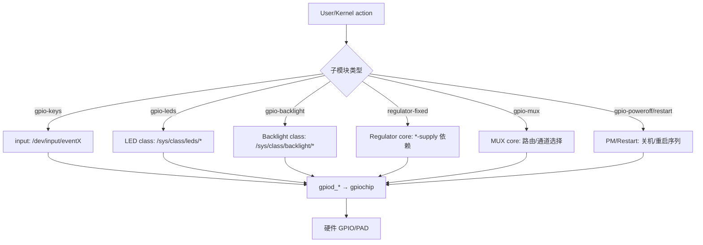

# 第3章_中断与高级特性

我是 **GPT-5 Thinking**。

------

## 3.1_GPIO_中断(IRQ)与_gpio-keys_/_自定义驱动

### 3.1.1_主题引入

**本章要解决的问题：**

* 如何在 Linux 6.1 及以后，通过 **GPIO→IRQ** 路径可靠地处理**边沿事件**（按键、插拔、检测信号等）？
* 何时使用 **通用驱动 gpio-keys**，何时自己写 **platform 驱动 + threaded IRQ**？
* 如何处理 **极性、触发类型、去抖、唤醒** 等关键细节？


**核心关注点：**

1. **GPIO→IRQ 映射**：`gpiod_to_irq()`、`irqdomain`、触发类型设置。
2. **通用方案**：`gpio-keys`（推荐：按键/开关场景）。
3. **自定义方案**：`devm_request_threaded_irq()` + `threaded IRQ`。
4. **去抖与抖动**：硬件/控制器/软件三层策略。
5. **低功耗/唤醒**：`enable_irq_wake()` 与 pinctrl `sleep` 状态协同。

------

### 3.1.2_数据结构视角(内核架构关系)

#### (1)_关键对象与关系

| 组件/结构                | 作用                      | 说明                                               |
| ------------------------ | ------------------------- | -------------------------------------------------- |
| `struct gpio_desc`       | GPIO 线的描述符           | 来自 `devm_gpiod_get(dev,"name",GPIOD_IN)`         |
| `gpiod_to_irq(desc)`     | 将 GPIO 线映射为 IRQ 号   | 通过 **irqdomain** 完成映射                        |
| `struct irq_chip`        | 控制器的 IRQ 实现         | `.irq_set_type/.irq_ack/.irq_mask/...`             |
| `request_threaded_irq()` | 绑定**上半部/线程化**处理 | 推荐使用 **threaded**，利于 `_cansleep`            |
| `gpio-keys` 驱动         | 通用按键→input 事件       | 读取 `gpios`、`linux,code`、`debounce-interval` 等 |

> 时间线提示：GPIO→IRQ 的 `irqdomain` 模型在 3.x 时代成熟；6.x 时推荐**线程化中断**，配合 `_cansleep` 与 libgpiod 用户态工具。

#### (2)_触发类型与极性

- **极性**（电平正/负）来自 **GPIO 绑定**（如 `GPIO_ACTIVE_LOW`），影响**逻辑值解释**。
- **触发类型**（RISING/FALLING/BOTH/LEVEL）作用于 **IRQ 控制器**：
  - 设置点：`irq_set_irq_type(irq, IRQ_TYPE_EDGE_BOTH /*…*/)`
  - 某些控制器也支持 `gpiod_set_debounce(desc, usec)`（返回 `-ENOTSUPP` 表示不支持）。

------

### 3.1.3_开发者视角(一)_通用驱动_gpio-keys

#### (1)_适用场景

- 实体按键、开关、键帽阵列等，目标是**生成 input 子系统事件**（`/dev/input/eventX`），而非你自己的专用设备。

#### (2)_设备树(最小可用)

```dts
/* pinctrl：把 PAD 配成 GPIO 输入并配置上拉/下拉 */
&pinctrl {
    pinctrl_btn_default: btn_default {
        fsl,pins = <
            MX6UL_PAD_GPIO1_IO05__GPIO1_IO05 0x10B1  /* 示例：上拉+合适的滞回 */
        >;
    };
};

gpio_keys: gpio-keys {
    compatible = "gpio-keys";
    pinctrl-names = "default";
    pinctrl-0 = <&pinctrl_btn_default>;

    button0: button@0 {
        gpios = <&gpio1 5 GPIO_ACTIVE_LOW>;   /* 低有效按下 */
        linux,code = <KEY_ENTER>;             /* 输入事件键值 */
        label = "user-enter";
        debounce-interval = <10>;             /* ms，软件去抖 */
        wakeup-source;                         /* 可作为唤醒源 */
        /* autorepeat;  // 可选：长按连发 */
    };
};
```

#### (3)_用户验证

```bash
# 设备与事件节点
ls /sys/firmware/devicetree/base/gpio-keys
ls /dev/input/event*

# 监听键值（按下/松开）
sudo evtest /dev/input/eventX
# 或 libinput-debug-events（桌面环境）
```

> `gpio-keys` 自动完成 **GPIO→IRQ**、**去抖**、**input 事件**、**唤醒** 等通用工作。能用它，就别自己重造轮子。

------

### 3.1.4_开发者视角(二)_自定义_platform_驱动_+_threaded_IRQ

当你要在**内核驱动里**把 GPIO 中断与设备逻辑深度耦合（不是 input 事件），用以下模板。

#### (1)_设备树(与第_3_章风格一致)

```dts
&pinctrl {
    pinctrl_myirq_default: myirq_default {
        fsl,pins = <
            MX6UL_PAD_GPIO1_IO06__GPIO1_IO06 0x10B1
        >;
    };
    pinctrl_myirq_sleep: myirq_sleep {
        fsl,pins = <
            MX6UL_PAD_GPIO1_IO06__GPIO1_IO06 0x10A1
        >;
    };
};

myirq@0 {
    compatible = "leaf,myirq-demo";
    pinctrl-names = "default", "sleep";
    pinctrl-0 = <&pinctrl_myirq_default>;
    pinctrl-1 = <&pinctrl_myirq_sleep>;

    intr-gpios = <&gpio1 6 GPIO_ACTIVE_LOW>; /* 输入：低有效 */
    status = "okay";
};
```

#### (2)_驱动源码(可编可跑_含去抖/唤醒/PM)

```c
// drivers/misc/leaf_gpio_irq_demo.c
// SPDX-License-Identifier: GPL-2.0
#include <linux/module.h>
#include <linux/platform_device.h>
#include <linux/of.h>
#include <linux/gpio/consumer.h>
#include <linux/interrupt.h>
#include <linux/pinctrl/consumer.h>
#include <linux/pm.h>
#include <linux/kfifo.h>
#include <linux/ktime.h>

struct myirq_dev {
    struct device        *dev;
    struct pinctrl       *pctl;
    struct pinctrl_state *st_def, *st_slp;
    struct gpio_desc     *g_intr;
    int                   irq;
    bool                  active_low;
    /* 简易事件统计/去抖 */
    unsigned int          debounce_us;   /* 0 表示不用软件去抖 */
    ktime_t               last_ts;
    /* 事件计数（rising/falling） */
    atomic64_t            cnt_rising;
    atomic64_t            cnt_falling;
};

static irqreturn_t myirq_top(int irq, void *data)
{
    /* 最小化上半部：把工作交给线程化处理 */
    return IRQ_WAKE_THREAD;
}

static irqreturn_t myirq_thread(int irq, void *data)
{
    struct myirq_dev *m = data;
    ktime_t now = ktime_get();
    if (m->debounce_us) {
        s64 us = ktime_us_delta(now, m->last_ts);
        if (us >= 0 && us < m->debounce_us)
            return IRQ_HANDLED; /* 丢弃抖动 */
    }
    m->last_ts = now;

    /* 读取当前逻辑值，统计上/下沿（示例：用上一次值推断边沿更严谨，这里简化） */
    int v = gpiod_get_value_cansleep(m->g_intr);
    if (v < 0) return IRQ_HANDLED;
    /* active_low 场景下，逻辑按“按下=1/松开=0”理解 */
    v = m->active_low ? !v : v;
    if (v)
        atomic64_inc(&m->cnt_rising);
    else
        atomic64_inc(&m->cnt_falling);

    dev_dbg(m->dev, "irq event: logic=%d @%lldus\n",
            v, (long long)ktime_to_us(now));
    /* TODO: 在此触发你的设备状态机/唤醒等待队列等 */
    return IRQ_HANDLED;
}

static ssize_t stats_show(struct device *dev, struct device_attribute *a, char *buf)
{
    struct myirq_dev *m = dev_get_drvdata(dev);
    return sysfs_emit(buf, "rising=%lld, falling=%lld, debounce_us=%u\n",
        (long long)atomic64_read(&m->cnt_rising),
        (long long)atomic64_read(&m->cnt_falling),
        m->debounce_us);
}
static DEVICE_ATTR_RO(stats);

static int myirq_probe(struct platform_device *pdev)
{
    struct device *dev = &pdev->dev;
    struct myirq_dev *m;
    int ret;

    m = devm_kzalloc(dev, sizeof(*m), GFP_KERNEL);
    if (!m) return -ENOMEM;
    m->dev = dev;
    platform_set_drvdata(pdev, m);

    /* pinctrl 状态 */
    m->pctl = devm_pinctrl_get(dev);
    if (IS_ERR(m->pctl)) return PTR_ERR(m->pctl);
    m->st_def = pinctrl_lookup_state(m->pctl, "default");
    m->st_slp = pinctrl_lookup_state(m->pctl, "sleep");
    if (!IS_ERR_OR_NULL(m->st_def)) pinctrl_select_state(m->pctl, m->st_def);

    /* GPIO 输入线 */
    m->g_intr = devm_gpiod_get(dev, "intr", GPIOD_IN);
    if (IS_ERR(m->g_intr)) return PTR_ERR(m->g_intr);
    m->active_low = gpiod_is_active_low(m->g_intr);

    /* 硬件去抖（如支持） */
    m->debounce_us = 5000; /* 示例：5ms，可改为 DT 属性读取 */
    ret = gpiod_set_debounce(m->g_intr, m->debounce_us);
    if (ret == -ENOTSUPP) {
        /* 控制器不支持；保留软件去抖（myirq_thread） */
        ret = 0;
    } else if (ret) {
        dev_warn(dev, "set_debounce failed: %d\n", ret);
    }

    /* GPIO -> IRQ 映射与触发类型设置 */
    m->irq = gpiod_to_irq(m->g_intr);
    if (m->irq < 0) return m->irq;

    /* 例如双边沿触发；也可根据硬件写成 RISING/FALLING/LEVEL */
    ret = irq_set_irq_type(m->irq, IRQ_TYPE_EDGE_BOTH);
    if (ret) return ret;

    /* 线程化中断，允许在处理里使用 *_cansleep */
    ret = devm_request_threaded_irq(dev, m->irq,
            myirq_top, myirq_thread,
            IRQF_ONESHOT | IRQF_TRIGGER_RISING | IRQF_TRIGGER_FALLING,
            "leaf-myirq", m);
    if (ret) return ret;

    /* sysfs 只读统计，便于用户查看 */
    ret = device_create_file(dev, &dev_attr_stats);
    if (ret) return ret;

    device_init_wakeup(dev, true); /* 可被唤醒设备 */
    dev_info(dev, "irq=%d active_low=%d debounce_us=%u\n",
             m->irq, m->active_low, m->debounce_us);
    return 0;
}

static int myirq_remove(struct platform_device *pdev)
{
    struct myirq_dev *m = platform_get_drvdata(pdev);
    device_remove_file(m->dev, &dev_attr_stats);
    device_init_wakeup(m->dev, false);
    return 0;
}

/* PM：作为唤醒源使用 */
static int __maybe_unused myirq_suspend(struct device *dev)
{
    struct myirq_dev *m = dev_get_drvdata(dev);
    if (!IS_ERR_OR_NULL(m->st_slp)) pinctrl_select_state(m->pctl, m->st_slp);
    if (device_may_wakeup(dev))
        enable_irq_wake(m->irq);
    return 0;
}
static int __maybe_unused myirq_resume(struct device *dev)
{
    struct myirq_dev *m = dev_get_drvdata(dev);
    if (!IS_ERR_OR_NULL(m->st_def)) pinctrl_select_state(m->pctl, m->st_def);
    if (device_may_wakeup(dev))
        disable_irq_wake(m->irq);
    return 0;
}

static const struct dev_pm_ops myirq_pm_ops = {
    SET_SYSTEM_SLEEP_PM_OPS(myirq_suspend, myirq_resume)
};

static const struct of_device_id myirq_of_match[] = {
    { .compatible = "leaf,myirq-demo" }, { }
};
MODULE_DEVICE_TABLE(of, myirq_of_match);

static struct platform_driver myirq_driver = {
    .probe  = myirq_probe,
    .remove = myirq_remove,
    .driver = {
        .name           = "leaf-gpio-irq-demo",
        .of_match_table = myirq_of_match,
        .pm             = &myirq_pm_ops,
    },
};
module_platform_driver(myirq_driver);

MODULE_LICENSE("GPL");
MODULE_AUTHOR("Leaf Book");
MODULE_DESCRIPTION("Demo: GPIO -> IRQ with threaded handler, debounce, wakeup");
```

> 要点：
>
> - **threaded IRQ** 里可安全使用 `*_cansleep`（第 4 章 4.8）。
> - **触发类型**用 `irq_set_irq_type()` 或 `IRQF_TRIGGER_*`；不同平台对标志处理略有差异，二者并用更稳妥。
> - **去抖策略**：优先硬件去抖 `gpiod_set_debounce()`；不支持则在线程中做**时间窗丢弃**。
> - **唤醒**：`device_init_wakeup()` + `enable_irq_wake()`/`disable_irq_wake()`。

**Kbuild**

```make
obj-m += leaf_gpio_irq_demo.o
# make -C /path/to/linux-6.1 M=$(PWD) modules
```

------

### 3.1.5_用户视角(验证步骤)

#### (1)_gpio-keys_路线

```bash
# 观察 input 事件
sudo evtest /dev/input/eventX
# 连续快速按键，验证 debounce 是否符合预期
```

#### (2)_自定义驱动路线

```bash
# 统计读数
cd /sys/bus/platform/devices
ls | grep leaf-gpio-irq-demo
cat <devdir>/stats
# 反复触发（短接/按键），计数应累加
```

#### (3)_使用_libgpiod_验证边沿

```bash
# 与内核驱动并行监听要谨慎：同一行可能被独占
# 如需只做板级连通性验证，可在未加载自定义驱动时测试
gpiomon --rising --falling gpiochip0 6
```

> 如果行被占用（`EBUSY`），用 `gpioinfo` 查看 **consumer**，确认是谁持有该线。

------

### 3.1.6_可视化图示

#### (1)_中断路径(flowchart)



#### (2)_唤醒时序(sequenceDiagram)



------

### 3.1.7_调试与验证(Checklist)

| 现象                     | 快速定位                      | 可能原因                                      | 解决                                               |
| ------------------------ | ----------------------------- | --------------------------------------------- | -------------------------------------------------- |
| 收不到中断               | `cat /proc/interrupts` 无计数 | 触发类型不符/极性配置错                       | 校正 `irq_set_irq_type()` 与 DT `GPIO_ACTIVE_*`    |
| 收到一串抖动             | 秒级多发                      | 硬件无上拉/下拉或接线过长                     | 开启 `gpiod_set_debounce()`；软件时间窗丢弃；加 RC |
| `EBUSY` 请求失败         | `gpioinfo` 显示被占用         | 行被其他驱动/工具持有                         | 释放冲突 consumer，或更换线                        |
| 按下无事件、松开才有     | 极性/触发类型组合不当         | 低有效配合 RISING/FALLING 错                  | 对应修正（低有效按下通常是**下降沿**）             |
| 休眠唤不醒               | 没有 wake 设置                | 未调用 `enable_irq_wake()` 或设备未标记可唤醒 | `device_init_wakeup()+enable_irq_wake()`           |
| `_cansleep` 报上下文错误 | 在 top-half 调用会睡路径      | 没有线程化                                    | 使用 `request_threaded_irq()`，逻辑放线程里        |

------

### 3.1.8_小结

- **两条路**：能用 **gpio-keys** 就用它（省心、直接出 input 事件）；需要自定义逻辑就用 **threaded IRQ**。
- **四件套**：**触发类型**要对、**极性**要准、**去抖**要稳、**唤醒**要配。
- **协同**：与第 3 章的 **pinctrl default/sleep**、第 4 章的 **`\*_cansleep`** 原则、以及第 5 章的 **用户态验证**形成闭环。

**一句话总结：**
 **GPIO 中断的正确姿势 = 线程化中断 + 正确触发类型/极性 + 去抖 + 唤醒协同**；能复用 `gpio-keys` 就别自造轮子，自己写时遵循 `_cansleep` 与 pinctrl 状态机的基本法则。


按我们确认的“**子模块导向**”目录与你的排版标准，下面给出**完整第 7 章**（标准消费者子模块总览与实战）。本章聚焦 *现成驱动* 的工程化用法：**gpio-keys / gpio-leds / gpio-backlight / regulator-fixed (GPIO 使能) / gpio-mux / gpio-poweroff**，统一给出**属性矩阵 + 最小 DTS + 用户验证 + 调试要点**。Mermaid 为 Typora 通用语法；避免与标准属性同名的 label。

------

## 3.2_标准消费者子模块总览与实战

### 3.2.1_主题引入

**本章要解决的问题：**

* 当“只是想把某个功能接在 GPIO 上”时，是否需要自己写驱动？通常**不需要**。内核已经提供了大量**标准消费者子模块**（consumer drivers），直接在 **DeviceTree** 里用标准属性即可落地，包括：按键、LED、背光、稳压器使能、模拟/信号复用、关机/重启等。


**为什么重要：**

- 减少自定义驱动数量 → 代码更少、维护性更高；
- 配置在设备树 → **移植/换脚/变体机型**成本极低；
- 框架内置 **PM/事件/权限** 等通用机制 → 更稳。

------

### 3.2.2_子模块选型总览(一页表)

| 需求类别                        | 首选子模块                       | 典型属性                                                     | 用户空间验证                        |
| ------------------------------- | -------------------------------- | ------------------------------------------------------------ | ----------------------------------- |
| 物理按键/开关 → input 事件      | **gpio-keys**                    | `gpios`、`linux,code`、`debounce-interval`、`wakeup-source`  | `evtest /dev/input/eventX`          |
| 单色/多色 LED、触发器           | **gpio-leds**                    | `gpios`、`default-state`、`linux,default-trigger`、`function`、`color` | `/sys/class/leds/*/`                |
| 简单背光（GPIO 开关/占空）      | **gpio-backlight**               | `gpios`、`default-brightness-level`                          | `/sys/class/backlight/*/brightness` |
| GPIO 控电/使能 LDO/DC-DC        | **regulator-fixed**（GPIO 使能） | `enable-active-high`、`gpio`、`regulator-boot-on`、`vin-supply` | `debugfs` regulator；消费端能工作   |
| 用 GPIO 控制外部模拟/数字复用器 | **gpio-mux**                     | `mux-gpios`、`idle-state`                                    | 功能通断/信号路由验证               |
| 用 GPIO 拉低关机/复位           | **gpio-poweroff / gpio-restart** | `gpios`、`active-low`、`timeout-ms`                          | `poweroff` / `reboot` 行为          |

> 以上都是**现成驱动**，无需自定义 C 代码。重点是写对 **DTS**，并知道如何验证。

------

### 3.2.3_内核/框架视角(简要)

- **gpio-keys → input 子系统**：把 GPIO 边沿事件转为 `EV_KEY`。
- **gpio-leds → LED class**：统一出 `/sys/class/leds/<name>/`，支持 `trigger`（心跳、磁盘活动等）。
- **gpio-backlight → backlight class**：出 `/sys/class/backlight/<name>/brightness`。
- **regulator-fixed → regulator 框架**：外设通过 `<supply>-supply` 引用稳压器节点，框架统一时序/依赖。
- **gpio-mux → MUX 框架**：通过 GPIO 组合选择外部多路器的通道。
- **gpio-poweroff / gpio-restart → PM/重启**：在关机/重启阶段拉特定 GPIO 完成动作。

------

### 3.2.4_gpio-keys(按键_to_input_事件)

#### (1)_属性矩阵(常用)

| 属性                | 含义           | 说明/取值                           |
| ------------------- | -------------- | ----------------------------------- |
| `gpios`             | 指定按键输入线 | `<&gpioX pin GPIO_ACTIVE_LOW/HIGH>` |
| `linux,code`        | 键值           | 如 `<KEY_ENTER>`、`<KEY_VOLUMEUP>`  |
| `label`             | 键名           | 可选，便于区分                      |
| `debounce-interval` | 软件去抖       | 毫秒，典型 5–20                     |
| `wakeup-source`     | 唤醒源         | 存在则可唤醒系统                    |
| `autorepeat`        | 长按连发       | 可选                                |

#### (2)_最小_DTS

```dts
&pinctrl {
    pinctrl_btn_default: btn_default {
        fsl,pins = <
            MX6UL_PAD_GPIO1_IO05__GPIO1_IO05 0x10B1
        >;
    };
};

gpio_keys: gpio-keys {
    compatible = "gpio-keys";
    pinctrl-names = "default";
    pinctrl-0 = <&pinctrl_btn_default>;

    button_enter: button@0 {
        gpios = <&gpio1 5 GPIO_ACTIVE_LOW>;
        linux,code = <KEY_ENTER>;
        label = "user-enter";
        debounce-interval = <10>;
        wakeup-source;
    };
};
```

#### (3)_用户验证

```bash
gpiodetect
gpioinfo gpiochip0 | grep -i "user-enter"

# 事件监听
sudo evtest /dev/input/eventX
# 或：libinput-debug-events（桌面）
```

#### (4)_事件链路(sequenceDiagram)



**调试要点**：边沿混乱多半是**上拉/下拉或去抖**；先硬件上拉，再用 `debounce-interval` 或控制器 `set_debounce`。

------

### 3.2.5_gpio-leds(LED_与触发器)

#### (1)_属性矩阵(常用)

| 属性                    | 含义       | 说明/取值                                               |
| ----------------------- | ---------- | ------------------------------------------------------- |
| `gpios`                 | LED 控制线 | `<&gpioX pin GPIO_ACTIVE_LOW/HIGH>`                     |
| `default-state`         | 默认状态   | `"on"` / `"off"` / `"keep"`                             |
| `linux,default-trigger` | 默认触发器 | `"heartbeat"` / `"mmc0"` / `"cpu0"` …                   |
| `function` / `color`    | 语义化命名 | 如 `function = "status"; color = <LED_COLOR_ID_GREEN>;` |

#### (2)_最小_DTS

```dts
&pinctrl {
    pinctrl_led_default: led_default {
        fsl,pins = <
            MX6UL_PAD_GPIO1_IO03__GPIO1_IO03 0x10B0
        >;
    };
};

leds {
    compatible = "gpio-leds";
    pinctrl-names = "default";
    pinctrl-0 = <&pinctrl_led_default>;

    led_status {
        gpios = <&gpio1 3 GPIO_ACTIVE_LOW>;
        default-state = "off";
        linux,default-trigger = "heartbeat";
        function = "status";
        color = <LED_COLOR_ID_GREEN>;
    };
};
```

#### (3)_用户验证

```bash
ls /sys/class/leds/
cat /sys/class/leds/status:green:status/trigger
echo none | sudo tee /sys/class/leds/status:green:status/trigger
echo 1   | sudo tee /sys/class/leds/status:green:status/brightness
echo 0   | sudo tee /sys/class/leds/status:green:status/brightness
```

**流程图（flowchart）**



**调试要点**：亮灭反常 → 检查 `GPIO_ACTIVE_LOW`；触发器不生效 → 先 `echo none > trigger` 再手动验证。

------

### 3.2.6_gpio-backlight(简单背光)

#### (1)_属性矩阵(常用)

| 属性                       | 含义               | 说明                                   |
| -------------------------- | ------------------ | -------------------------------------- |
| `gpios`                    | 背光开关/占空 GPIO | 高/低有效                              |
| `default-brightness-level` | 上电默认亮度       | 整数；实现多为开关型，亮度常映射为 0/1 |

#### (2)_最小_DTS

```dts
&pinctrl {
    pinctrl_bl_default: bl_default {
        fsl,pins = <
            MX6UL_PAD_GPIO1_IO10__GPIO1_IO10 0x10B0
        >;
    };
};

backlight {
    compatible = "gpio-backlight";
    pinctrl-names = "default";
    pinctrl-0 = <&pinctrl_bl_default>;
    gpios = <&gpio1 10 GPIO_ACTIVE_HIGH>;
    default-brightness-level = <1>;
};
```

#### (3)_用户验证

```bash
ls /sys/class/backlight/
cat /sys/class/backlight/gpio-backlight/brightness
echo 0 | sudo tee /sys/class/backlight/gpio-backlight/brightness
echo 1 | sudo tee /sys/class/backlight/gpio-backlight/brightness
```

**调试要点**：部分面板需要电源/时序；确保 **regulator/enable-reset** 已就绪（见 7.7/7.9）。

------

### 3.2.7_regulator-fixed(GPIO_使能的稳压器)

> 目标：用一根 GPIO 作为 **电源使能**，供其它外设节点通过 `<supply>-supply` 引用。

#### (1)_属性矩阵(常用)

| 属性                             | 含义                                                 |
| -------------------------------- | ---------------------------------------------------- |
| `compatible = "regulator-fixed"` | 固定电压稳压器                                       |
| `enable-active-high`             | 使能极性（若省略则可能默认为低有效，依具体 binding） |
| `gpio`                           | 使能 GPIO                                            |
| `regulator-boot-on`              | 开机即使能                                           |
| `vin-supply`                     | 上级电源依赖                                         |

#### (2)_最小_DTS

```dts
reg_3v3: regulator-3v3 {
    compatible = "regulator-fixed";
    regulator-name = "vcc-3v3";
    regulator-boot-on;
    enable-active-high;
    gpio = <&gpio2 7 GPIO_ACTIVE_HIGH>;
    vin-supply = <&reg_5v>;
};

eth@1 {
    compatible = "vendor,eth";
    phy-supply = <&reg_3v3>;    /* 消费者通过 *-supply 引用 */
    /* ... */
};
```

#### (3)_用户/调试

```bash
# 看电源树与状态
sudo cat /sys/kernel/debug/regulator/regulator_summary | grep -E 'vcc-3v3|eth'
```

**要点**：不要在消费者驱动里“手抠 GPIO 使能”，统一走 **regulator**，电源顺序/引用更安全。

------

### 3.2.8_gpio-mux(用_GPIO_选择外部多路器通道)

#### (1)_属性矩阵(常用)

| 属性                     | 含义                                    |
| ------------------------ | --------------------------------------- |
| `mux-gpios`              | 一组用于选择的 GPIO（可多根，组合编码） |
| `idle-state`             | 空闲态选择（如 `0`/`1`/`2`…）           |
| `states`（部分 binding） | 通道枚举/映射说明                       |

#### (2)_最小_DTS

```dts
mux0: mux-controller {
    compatible = "gpio-mux";
    mux-gpios = <&gpio3 1 GPIO_ACTIVE_HIGH>,
                <&gpio3 2 GPIO_ACTIVE_HIGH>;
    idle-state = <0>;  /* 两根线 00 → 通道0 */
};

# 消费者设备可以通过特定子系统引用 mux0 的通道（依具体绑定）
```

**验证思路**：随输入切换实际被路由的信号（例如音频/射频/ADC 通道），配合示波器/业务层读数验证。

------

### 3.2.9_gpio-poweroff_/_gpio-restart(GPIO_控制关机/重启)

#### (1)_最小_DTS(关机)

```dts
gpio_poweroff: gpio-poweroff {
    compatible = "gpio-poweroff";
    gpios = <&gpio4 5 GPIO_ACTIVE_LOW>;
    timeout-ms = <3000>;   /* 保持拉低时间 */
};
```

> 调用 `poweroff` 时，驱动会拉该 GPIO，触发板级关机电路/PMIC。

#### (2)_最小_DTS(重启)

```dts
gpio_restart: gpio-restart {
    compatible = "gpio-restart";
    gpios = <&gpio4 6 GPIO_ACTIVE_LOW>;
    priority = <200>;      /* 覆盖默认重启处理优先级 */
    active-delay-ms = <100>; /* 拉低保持 */
};
```

**验证**：执行 `poweroff`/`reboot`；若无响应，检查极性、拉低保持时间与外部电路逻辑。

------

### 3.2.10_统一调用链图(概览)



------

### 3.2.11_调试与验证(通用_Checklist)

| 现象                 | 优先查看                                   | 可能原因              | 处理                                         |
| -------------------- | ------------------------------------------ | --------------------- | -------------------------------------------- |
| 行被占用 `EBUSY`     | `gpioinfo` consumer 名称                   | 被别的子模块/驱动持有 | 释放冲突或换线                               |
| 亮灭/按键逻辑颠倒    | `GPIO_ACTIVE_LOW/HIGH`                     | 极性错误              | 修正 flags                                   |
| 事件抖动多发         | `debounce-interval` / `gpiod_set_debounce` | 无硬件上拉/线缆过长   | 加上拉/RC，软件去抖                          |
| 背光不亮             | regulator/时序未就绪                       | 依赖没拉起            | 用 regulator-fixed/时序核查                  |
| 关机/重启无效        | 外部电路条件不符                           | 极性/保持时间不对     | 调 `active-delay-ms/timeout-ms`              |
| DTS 看似正确但不生效 | `pinctrl` 未切到 GPIO                      | 复用冲突/漏配         | `pinmux-pins`/`pinconf-pins` 核对（第 3 章） |

------

### 3.2.12_小结

- **优先复用标准子模块**：多数“GPIO + 某功能”的需求，**无需写驱动**。
- **四件套**：**属性矩阵**要对、**最小 DTS**要全、**用户验证**要闭环、**调试清单**要上手。
- **协同**：与第 3 章（pinctrl）、第 4 章（`*_cansleep`）、第 5 章（libgpiod）与第 6 章（中断）形成整体工程方法论。

**一句话总结：**
 👉 **能用子模块就用子模块：把复杂留给框架，把变更留给设备树。**

------

