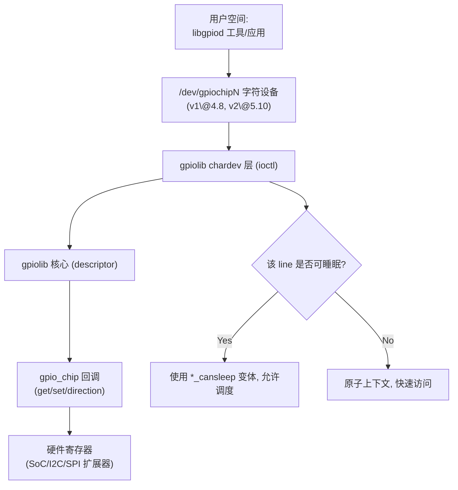
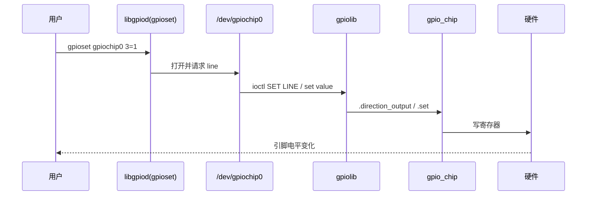
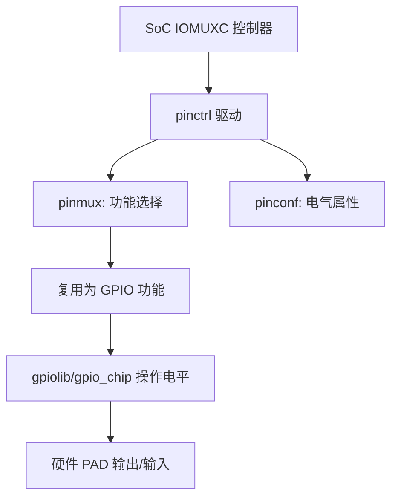
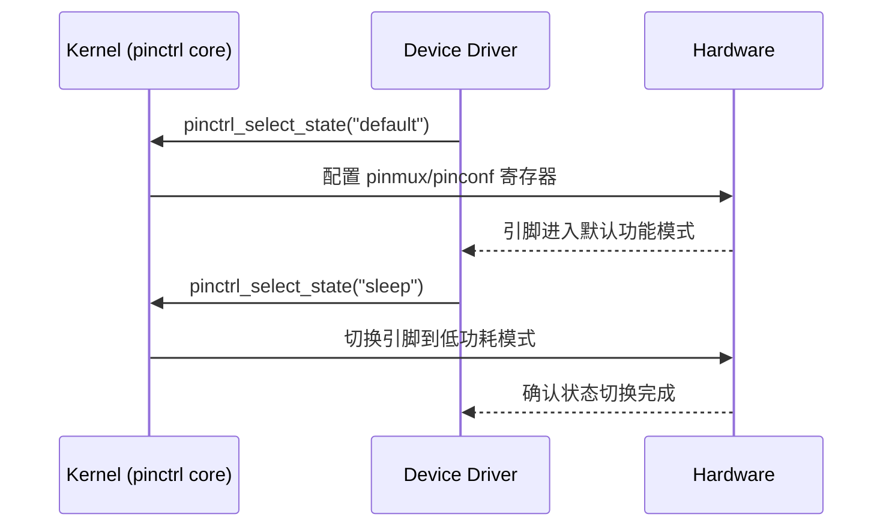
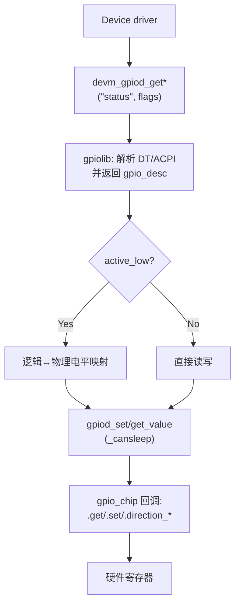
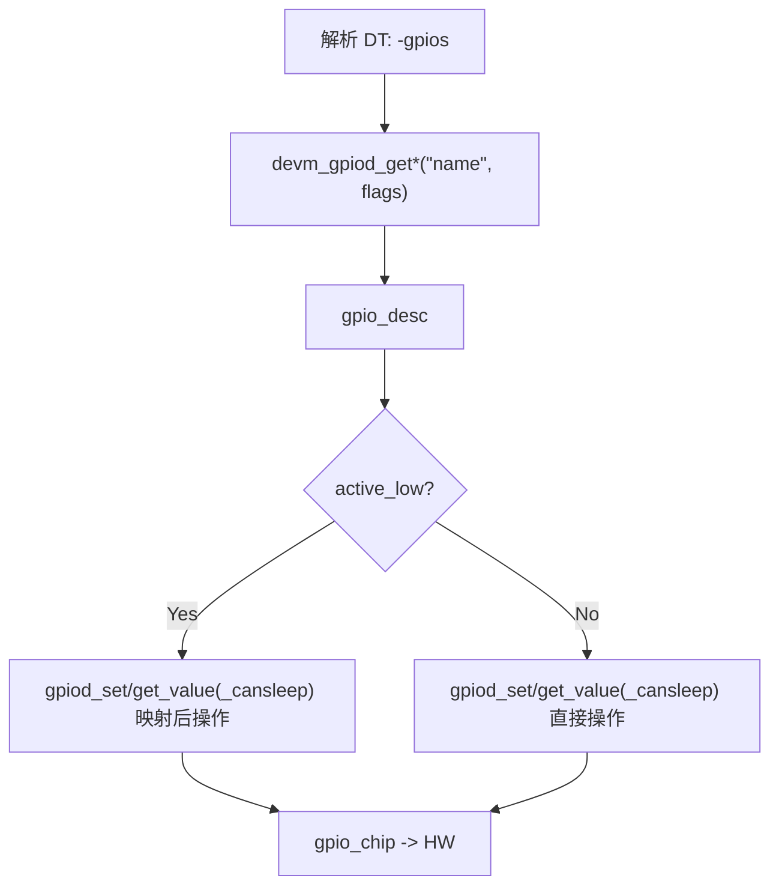
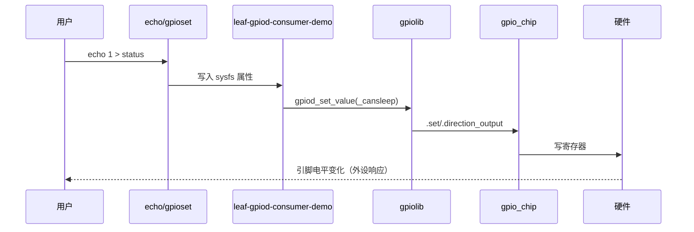
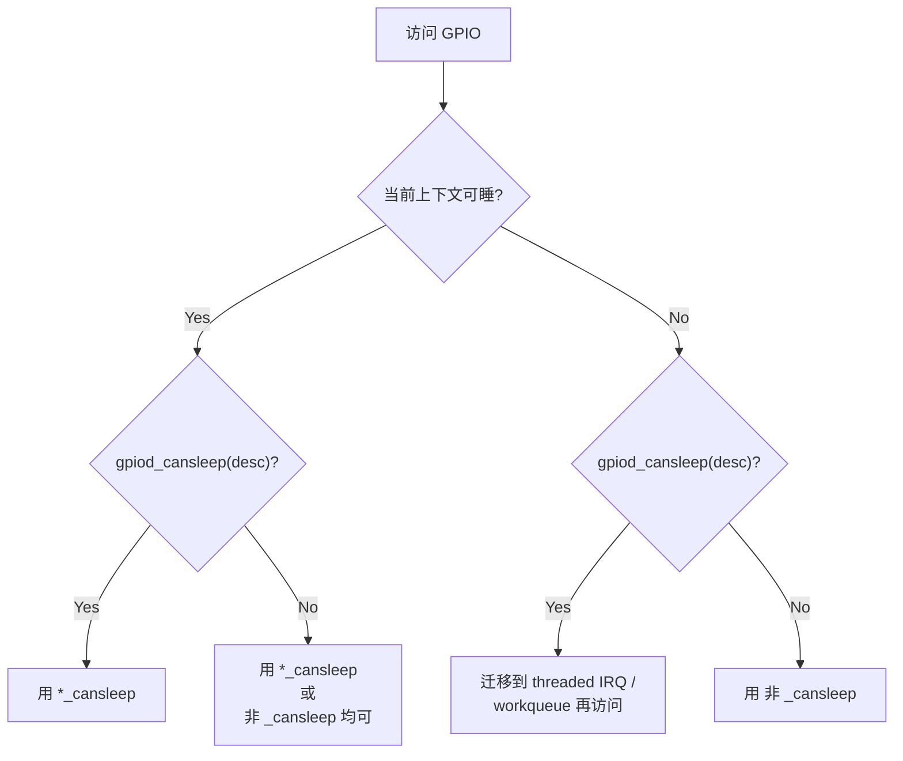

[TOC]


# 第1章\_GPIO\_总览与生态演进

## 1.1\_主题引入

**本章要解决的问题**：

* GPIO 的**用户态接口**与**内核态编程范式**在过去十余年如何演进？
* 今天（以 Linux 6.1 为基线）应当采用哪套“正确姿势”？


**为什么重要**：很多旧文档仍以 `/sys/class/gpio`（sysfs）为例，但**官方已明确将其标注为废弃**，并引导新项目使用 **字符设备 ABI（/dev/gpiochipN）+ libgpiod**；同时内核驱动编程应以 **描述符 API（`gpiod_*`）** 为中心，不再使用旧的整数 API（`gpio_*`）。这些变化不是“6.1 才出现”，而是**逐步发生**并在 6.x 时代完全稳固。([kernel.org](https://www.kernel.org/doc/html/next/admin-guide/gpio/sysfs.html?utm_source=chatgpt.com))

### 1.1.1\_关键里程碑(时间线)

| 年份 / 版本       | 事件                               | 含义                                                         |
| ----------------- | ---------------------------------- | ------------------------------------------------------------ |
| **~2008 · 2.6.x** | sysfs GPIO 用户态接口广泛使用      | `/sys/class/gpio` 成为早期事实标准入口。([lwn.net](https://lwn.net/Articles/532714/?utm_source=chatgpt.com)) |
| **2014 · 3.14**   | **描述符式 Consumer API** 文档成形 | `gpiod_*` 与 `gpio_*` 并存，推荐新驱动用描述符。([git.ti.com](https://git.ti.com/cgit/ti-linux-kernel/ti-linux-kernel/tree/Documentation/gpio/consumer.txt?h=linux-3.14.y&utm_source=chatgpt.com)) |
| **2016 · 4.8**    | **GPIO 字符设备 ABI（v1）** 引入   | 用户态转向 `/dev/gpiochipN` 模型的开始。([libgpiod.readthedocs.io](https://libgpiod.readthedocs.io/en/stable/?utm_source=chatgpt.com)) |
| **2020 · 5.10**   | **字符设备 ABI v2** 引入           | 明确标注为“v2（first added in 5.10）”。([docs.kernel.org](https://docs.kernel.org/userspace-api/gpio/chardev.html?utm_source=chatgpt.com)) |
| **5.x 文档期**    | **sysfs 明确标注为已废弃**         | 新用户态程序应使用字符设备 ABI。([kernel.org](https://www.kernel.org/doc/html/next/admin-guide/gpio/sysfs.html?utm_source=chatgpt.com)) |

> 结论：到 **6.1** 时，推荐组合已非常明确——**驱动用 `gpiod_*`，用户态走字符设备 + libgpiod**，sysfs 仅维护兼容。([kernel.org](https://www.kernel.org/doc/html/next/admin-guide/gpio/sysfs.html?utm_source=chatgpt.com))
>
> [buildroot 添加 libgpiod 工具说明参考](../../../platforms/arm/nxp/imx6ull/porting/imx6ull-移植u-boot-2025.04_and_kernel-6.1.md#第11章_buildroot_下载工具): buildroot 下载工具。libgpiod 属于用户工具，不属于内核固定模块，需要手动安装到根文件系统，因此需要采用 buildroot 重新下载搭建 libgpiod 工具。

------

## 1.2\_数据结构视角

### 1.2.1\_Provider(控制器)侧

- **[struct gpio_chip](./附录A_gpio_数据结构.md#struct gpio_chip)**：

  - 抽象一组 GPIO 的控制器，定义方向/读写回调、`ngpio`、`can_sleep` 等；

  - 常用 `devm_gpiochip_add_data()` 注册，必要时与 pinctrl 通过 `gpio-ranges` 建立映射。([docs.kernel.org](https://docs.kernel.org/driver-api/gpio/index.html?utm_source=chatgpt.com))

  - 详细代码参考 [附录A/struct gpio_chip](./附录A_gpio_数据结构.md#struct gpio_chip) 。


- **[struct gpio_irq_chip](./附录A_gpio_数据结构.md#struct gpio_irq_chip)**（内嵌在 `gpio_chip` 中）：

  - 承载中断域接入（irqdomain），配置 `irq_chip` 回调（mask/unmask/ack/set_type）与合适的 `handler`，在注册芯片时一次性完成装配。([docs.kernel.org](https://docs.kernel.org/driver-api/gpio/index.html?utm_source=chatgpt.com))

  - 详细代码参考 [附录A/struct gpio_irq_chip](./附录A_gpio_数据结构.md#struct gpio_irq_chip) 。


> **cells 提示**：GPIO 控制器节点多用 `#gpio-cells = <2>`（如 `<pin flags>`）；而 GIC 这类**顶层中断控制器**常用 `#interrupt-cells = <3>`（类型/编号/触发），二者语义层级不同（第 6 章详述）。

### 1.2.2\_Consumer(外设驱动)侧

- **[struct gpio_desc](./附录A_gpio_数据结构.md#struct gpio_desc)**：

  - GPIO 描述符（不透明句柄）。
  - 用 `devm_gpiod_get*()` 获取、`gpiod_put()` 释放；
  - 方向/电平通过 `gpiod_direction_*()`、`gpiod_set/get_value[_cansleep]()`；
  - 依据 `gpiod_cansleep()` 决定是否必须使用 `_cansleep` 变体。([docs.kernel.org](https://docs.kernel.org/driver-api/gpio/consumer.html?utm_source=chatgpt.com))


### 1.2.3\_用户空间\_ABI

- **字符设备**：

  - 每个控制器对应一个 `/dev/gpiochipN`；
  - 配合 **libgpiod** 工具（`gpiodetect / gpioinfo / gpioget / gpioset / gpiomon / gpiofind`）与 C API 使用。
  - **v2 ABI 自 5.10 起提供**。([libgpiod.readthedocs.io](https://libgpiod.readthedocs.io/en/latest/gpio_tools.html?utm_source=chatgpt.com))


- **sysfs**：

  - 文档警告“**THIS ABI IS DEPRECATED**”，仅维护不扩展，新用户态请使用字符设备 ABI。([kernel.org](https://www.kernel.org/doc/html/next/admin-guide/gpio/sysfs.html?utm_source=chatgpt.com))


------

## 1.3\_开发者视角(今天应该怎样写)

### 1.3.1\_驱动迁移\_三步走\_(按时间线给出依据)

1. **内核 Consumer 代码**：

   * 将 `gpio_request()/gpio_set_value()` 等**整数接口**替换为 **`devm_gpiod_get\*()` + `gpiod_\*`** 描述符接口（TI维护的 kernel 3.14 文档已建议）。([git.ti.com](https://git.ti.com/cgit/ti-linux-kernel/ti-linux-kernel/tree/Documentation/gpio/consumer.txt?h=linux-3.14.y&utm_source=chatgpt.com))。

   * 想要看完整的devres API接口参考本地文档 [devres API说明.md](../../linux/object_lifetime/devres/devres_API说明.md)，或者直接查阅[devres官方公告](https://docs.kernel.org/driver-api/driver-model/devres.html?utm_source=chatgpt.com)。


2. **用户空间**：

   * 把 sysfs 脚本迁移到 **字符设备 + libgpiod**（4.8 引入、5.10 起 v2）。[libgpiod 官方文档](https://libgpiod.readthedocs.io/en/stable/?utm_source=chatgpt.com)。

   * **libgpiod core API** 文档参考 [libgpiod core API官方文档](https://libgpiod.readthedocs.io/en/stable/core_api.html)。


3. **控制器驱动（Provider）**：

   * 以 `gpio_chip`/`devm_gpiochip_add_data()` 注册；
   * 若带中断则在 `gpio_chip.irq` 填好 `gpio_irq_chip`，由 gpiolib 完成 irqdomain 集成。
   * [kernel gpio 官方文档介绍](https://docs.kernel.org/driver-api/gpio/index.html?utm_source=chatgpt.com)。


### 1.3.2\_Kconfig\_清单(6.1\_基线)

- `CONFIG_GPIOLIB=y`、`CONFIG_GPIO_CDEV=y`（字符设备）
- 目标 SoC/扩展器的具体 GPIO 控制器驱动
- （可选）`CONFIG_GPIO_AGGREGATOR` 用于访问控制/虚拟化隔离。([infradead.org](https://www.infradead.org/~mchehab/kernel_docs/admin-guide/gpio/gpio-aggregator.html?utm_source=chatgpt.com))
- **不推荐**：`CONFIG_GPIO_SYSFS`（仅为兼容遗留）。([kernel.org](https://www.kernel.org/doc/html/next/admin-guide/gpio/sysfs.html?utm_source=chatgpt.com))

------

## 1.4\_用户视角(他们能看到/如何验证)

### 1.4.1\_libgpiod\_工具最小闭环

**注意**：libgpiod 属于用户态工具，需要手动集成到 **rootfs** (根文件系统) 在中才能使用。否则下述命令将会提示找不到命令。

```bash
# 列出芯片
gpiodetect
# 查看所有线信息
gpioinfo gpiochip0
# 读取第 3 号线
gpioget gpiochip0 3
# 设置第 3 号线为 1
gpioset gpiochip0 3=1
# 监听边沿事件（示例）
gpiomon gpiochip0 3
```

> 这些命令均来自 **libgpiod** 工具套件，是字符设备 ABI 的官方配套实践。([libgpiod.readthedocs.io](https://libgpiod.readthedocs.io/en/latest/gpio_tools.html?utm_source=chatgpt.com))

以下是一些命令示例：

```shell
~ # ls
bin      etc      linuxrc  proc     run      sys      usr
dev      lib      mnt      root     sbin     tmp
~ # which gpiodetect
/usr/bin/gpiodetect
~ # ls
bin      etc      linuxrc  proc     run      sys      usr
dev      lib      mnt      root     sbin     tmp
~ # gpiodetect
gpiochip0 [209c000.gpio] (32 lines)
gpiochip1 [20a0000.gpio] (32 lines)
gpiochip2 [20a4000.gpio] (32 lines)
gpiochip3 [20a8000.gpio] (32 lines)
gpiochip4 [20ac000.gpio] (32 lines)
~ # gpioinfo gpiochip0
gpiochip0 - 32 lines:
        line   0:      unnamed       unused   input  active-high
        line   1:      unnamed       unused   input  active-high
        line   2:      unnamed       unused   input  active-high
        line   3:      unnamed       unused   input  active-high
        line   4:      unnamed       unused   input  active-high
        line   5:      unnamed       unused   input  active-high
        line   6:      unnamed       unused   input  active-high
        line   7:      unnamed       unused   input  active-high
        line   8:      unnamed       unused  output  active-high
        line   9:      unnamed "regulator-sd1-vmmc" output active-high [used]
        line  10:      unnamed       unused   input  active-high
        line  11:      unnamed       unused   input  active-high
        line  12:      unnamed       unused   input  active-high
        line  13:      unnamed       unused   input  active-high
        line  14:      unnamed       unused   input  active-high
        line  15:      unnamed       unused   input  active-high
        line  16:      unnamed       unused   input  active-high
        line  17:      unnamed       unused   input  active-high
        line  18:      unnamed       unused   input  active-high
        line  19:      unnamed         "cd"   input   active-low [used]
        line  20:      unnamed       unused   input  active-high
        line  21:      unnamed       unused   input  active-high
        line  22:      unnamed       unused   input  active-high
        line  23:      unnamed       unused   input  active-high
        line  24:      unnamed       unused   input  active-high
        line  25:      unnamed       unused   input  active-high
        line  26:      unnamed       unused   input  active-high
        line  27:      unnamed       unused   input  active-high
        line  28:      unnamed       unused   input  active-high
        line  29:      unnamed       unused   input  active-high
        line  30:      unnamed       unused   input  active-high
        line  31:      unnamed       unused   input  active-high
~ #
```


### 1.4.2\_状态保持\_语义提示

- `gpioset` 的输出状态**由持有请求的进程维持**；进程退出后状态不再保证。

------

## 1.5\_可视化图示

### 1.5.1\_总体调用链(flowchart)



### 1.5.2\_用户写入到\_LED\_的时序(sequenceDiagram)



> 注：Mermaid 用**通用语法**、节点文本全部加引号，分支为 **Yes/No**。

------

## 1.6\_示例代码(最小可用)

### 1.6.1\_内核\_Consumer(仅演示\_描述符\_API\_用法)

```c
// demo_gpiod_consumer.c — 6.x 最小消费示例（仅演示关键路径）
#include <linux/module.h>
#include <linux/gpio/consumer.h>

static struct gpio_desc *led;

static int __init demo_init(void)
{
    /* 真实驱动应使用 devm_gpiod_get(dev,"status",GPIOD_OUT_LOW)
     * 下面仅为演示：全局查找，便于快速移植示例
     */
    led = gpiod_get(NULL, "status", GPIOD_OUT_LOW);
    if (IS_ERR(led))
        return PTR_ERR(led);

    /* 如果为低有效，则写 0 代表点亮；此处仅示意 */
    gpiod_set_value_cansleep(led, 1);
    pr_info("gpiod demo: status=1\n");
    return 0;
}
static void __exit demo_exit(void)
{
    gpiod_set_value_cansleep(led, 0);
    gpiod_put(led);
}
module_init(demo_init);
module_exit(demo_exit);
MODULE_LICENSE("GPL");
```

> **要点**：
>
> * 仅使用 `gpiod_*` 描述符 API；
> * 依据可睡眠属性选择 `_cansleep` 变体。([git.ti.com](https://git.ti.com/cgit/ti-linux-kernel/ti-linux-kernel/tree/Documentation/gpio/consumer.txt?h=linux-3.14.y&utm_source=chatgpt.com))

### 1.6.2\_用户态(libgpiod\_C\_API\_一读一写)

```c
// u_gpiod_basic.c — 通过字符设备 ABI 读/写一根线（v2 自 5.10 起）
#include <gpiod.h>
#include <stdio.h>
int main(void) {
    struct gpiod_chip *chip = gpiod_chip_open_by_name("gpiochip0");
    struct gpiod_line *line = gpiod_chip_get_line(chip, 3);
    gpiod_line_request_output(line, "u_gpiod_basic", 1); // 置 1
    printf("line3=%d\n", gpiod_line_get_value(line));
    gpiod_line_set_value(line, 0); // 再置 0
    gpiod_line_release(line);
    gpiod_chip_close(chip);
    return 0;
}
```

> **要点**：
>
> * 用户态走字符设备 + libgpiod；
> * **v2 ABI first added in 5.10**。([docs.kernel.org](https://docs.kernel.org/userspace-api/gpio/chardev.html?utm_source=chatgpt.com))

------

## 1.7\_调试与验证

1. **字符设备/工具链自检**

   ```shell
   gpiodetect               # 芯片枚举
   gpioinfo gpiochip0       # 线方向/消费方/偏好名
   gpioget gpiochip0 3      # 读取
   gpioset gpiochip0 3=1    # 置 1（注意进程持有语义）
   gpiomon gpiochip0 3      # 事件监听
   ```

   > 工具与用法以 libgpiod 文档为准。([libgpiod.readthedocs.io](https://libgpiod.readthedocs.io/en/latest/gpio_tools.html?utm_source=chatgpt.com))

2. **内核端视图与动态调试**

   ```shell
   sudo mount -t debugfs none /sys/kernel/debug
   sudo cat /sys/kernel/debug/gpio              # 概览所有 gpiochip
   echo 'file drivers/gpio/gpiolib*.c +p' | sudo tee /sys/kernel/debug/dynamic_debug/control
   dmesg -w
   ```

   log示例，tee工具没有下载，所以第三条 shell 命令没有示例：

   ```shell
   ~ # sudo mount -t debugfs none /sys/kernel/debug
   -/bin/sh: sudo: not found

   ~ # mount -t debugfs none /sys/kernel/debug
   ~ # cat /sys/kernel/debug/gpio
   gpiochip0: GPIOs 0-31, parent: platform/209c000.gpio, 209c000.gpio:
    gpio-9   (                    |regulator-sd1-vmmc  ) out hi
    gpio-19  (                    |cd                  ) in  lo IRQ ACTIVE LOW

   gpiochip1: GPIOs 32-63, parent: platform/20a0000.gpio, 20a0000.gpio:

   gpiochip2: GPIOs 64-95, parent: platform/20a4000.gpio, 20a4000.gpio:

   gpiochip3: GPIOs 96-127, parent: platform/20a8000.gpio, 20a8000.gpio:

   gpiochip4: GPIOs 128-159, parent: platform/20ac000.gpio, 20ac000.gpio:
    gpio-130 (                    |regulator-peri-3v3  ) out lo ACTIVE LOW
    gpio-132 (                    |Headphone detection ) in  lo IRQ
    gpio-135 (                    |phy-reset           ) out hi
    gpio-136 (                    |phy-reset           ) out hi
   ~ #
   ```


3. **常见问题清单（按时间线给出定位方向）**

- **“/sys/class/gpio 不可用/功能缺失”**：

  - 不是 bug——**已弃用**，新项目应改用字符设备 ABI（4.8 起有、5.10 起 v2）。([kernel.org](https://www.kernel.org/doc/html/next/admin-guide/gpio/sysfs.html?utm_source=chatgpt.com))


- **`gpioset` 状态“自动复原”**：

  - line 的输出状态通常随**请求持有期**而维持，进程退出则不再保证；

  - 参考工具手册的说明（可用超时/交互模式/守护方式）。([manpages.debian.org](https://manpages.debian.org/experimental/gpiod/gpioset.1.en.html?utm_source=chatgpt.com))


- **驱动仍用 `gpio_\*`**：

  - 请迁移至 `gpiod_*` 描述符（kernel 3.14 文档已建议）。([git.ti.com](https://git.ti.com/cgit/ti-linux-kernel/ti-linux-kernel/tree/Documentation/gpio/consumer.txt?h=linux-3.14.y&utm_source=chatgpt.com))


------

## 1.8\_小结

### 1.8.1\_对比表\_历史接口\_vs\_今天的推荐实践

| 维度       | 旧 sysfs `/sys/class/gpio`（2.6 时代兴起） | **字符设备 `/dev/gpiochipN`（4.8 引入，5.10 起 v2，推荐）** |
| ---------- | ------------------------------------------ | ----------------------------------------------------------- |
| 官方状态   | **Deprecated**（仅维护）                   | **方向明确**，持续演进                                      |
| 用户态工具 | `echo/cat`                                 | **libgpiod** 工具与 C API                                   |
| 事件/多路  | 能力有限                                   | line request / event / 批量                                 |
| 未来保障   | 逐步退出                                   | **主线方向**                                                |

> **一句话总结**：**按时间线**看，GPIO 的正确姿势已从“sysfs + `gpio_*`”演进为“**字符设备 + libgpiod**（用户态）与 **`gpiod_\*` 描述符**（内核态）”（kernel 3.14 文档已建议）；到 6.1 时代，这条路线已是事实标准。([kernel.org](https://www.kernel.org/doc/html/next/admin-guide/gpio/sysfs.html?utm_source=chatgpt.com))

------

### 1.8.2\_参考资料

| 内容                                               | 说明                                                         |
| -------------------------------------------------- | ------------------------------------------------------------ |
| **GPIO Sysfs（已废弃）**                           | 官方管理员指南页面。([kernel.org](https://www.kernel.org/doc/html/next/admin-guide/gpio/sysfs.html?utm_source=chatgpt.com)) |
| **GPIO 字符设备 ABI（v2，5.10 起）**               | 官方 userspace-API 文档。([docs.kernel.org](https://docs.kernel.org/userspace-api/gpio/chardev.html?utm_source=chatgpt.com)) |
| **GPIO Descriptor Consumer Interface（驱动消费）** | 官方驱动 API 文档。([docs.kernel.org](https://docs.kernel.org/driver-api/gpio/consumer.html?utm_source=chatgpt.com)) |
| **早期 3.14 文档（描述符 vs 整数接口）**           | TI 维护的 3.14 文档副本。([git.ti.com](https://git.ti.com/cgit/ti-linux-kernel/ti-linux-kernel/tree/Documentation/gpio/consumer.txt?h=linux-3.14.y&utm_source=chatgpt.com)) |
| **libgpiod 工具手册**                              | 命令及用法。([libgpiod.readthedocs.io](https://libgpiod.readthedocs.io/en/latest/gpio_tools.html?utm_source=chatgpt.com)) |

# 第2章\_设备树中的\_GPIO\_基础语义

## 2.1\_主题引入

**本章要解决的问题**：

* 如何在 DeviceTree（DT）中**准确描述** GPIO 控制器（Provider）与使用 GPIO 的外设（Consumer），并让内核在启动时把 DT 信息正确映射到 **gpiolib 描述符 API** 与 **字符设备 ABI**？

> [buildroot 添加 libgpiod 工具说明参考](../../../platforms/arm/nxp/imx6ull/porting/imx6ull-移植u-boot-2025.04_and_kernel-6.1.md#第11章_buildroot_下载工具): buildroot 下载工具。libgpiod 属于用户工具，不属于内核固定模块，需要手动安装到根文件系统，因此需要采用 buildroot 重新下载搭建 libgpiod 工具。


**重要**：

* DT 是 SoC/板级适配的“事实来源”。引脚一旦选错或 flags 配置不当，后续驱动即使写对了也无效；
* 同时，**迁移/换脚**几乎都发生在 DT 层，不应在驱动里硬编码。


------

## 2.2\_数据结构视角(DT\_基本语义)

### 2.2.1\_Provider\_侧常用属性(GPIO\_控制器节点)

- `gpio-controller`：布尔属性，声明该节点是一个 GPIO 控制器。参考 [附录D/gpio-controller](./附录D_gpio_设备树语法.md#第3章_gpio-controller)。
- `#gpio-cells = <2>`：GPIO 说明符（specifier）单元数。**通用为 2**：`<pin flags>`。参考 [附录D/gpio-cells](./附录D_gpio_设备树语法.md#gpio-cells)。
  - `pin`：该控制器内部的**偏移号**（从 0 开始）。
  - `flags`：位掩码（见 2.2.3），如 `GPIO_ACTIVE_LOW/OPEN_DRAIN/PULL_UP` 等。
- `gpio-ranges`（可选）：把本控制器的 GPIO 号段映射到 **pinctrl** 的管脚号段，用于 pinctrl 与 gpiolib 的一致性。参考 [附录D/gpio-ranges](./附录D_gpio_设备树语法.md#第4章_gpio-ranges)。
- `gpio-line-names`（可选）：为每根线命名，`gpioinfo` 会显示，便于调试。
- **若本 GPIO 控制器还能充当中断控制器**：
  - `interrupt-controller`、`#interrupt-cells = <2>`（多见 `<hwirq type>`），以及连接父中断域的 `interrupts`/`interrupt-parent`。
  - 注意：**GIC 之类顶层中断控制器**常用 `#interrupt-cells = <3>`（编号/类型/触发），与 GPIO 控制器的 2 cells **语义层级不同**。

> 设计提醒：控制器驱动注册使用 `struct gpio_chip`/`devm_gpiochip_add_data()`；若带中断，在 `gpio_chip.irq` 内填好 `struct gpio_irq_chip`，一次性与 irqdomain 装配。


### 2.2.2\_Consumer\_侧约定(外设节点如何引用\_GPIO)

- **通用书写**：`<name>-gpios = <&chip pin flags>;`

  - 例如：`reset-gpios`、`enable-gpios`、`cs-gpios`、`status-gpios` 等。

    ```dts
    &fec1 {
    	pinctrl-names = "default";
    	pinctrl-0 = <&pinctrl_enet1
    				 &pinctrl_enet1_reset>;	// 添加复位控制引脚

    	phy-reset-gpios = <&gpio5 7 GPIO_ACTIVE_LOW>;		// phy-reset-gpios
    	...
    };

    spi-4 {
        compatible = "spi-gpio";
        pinctrl-names = "default";
        pinctrl-0 = <&pinctrl_spi4>;
        status = "disabled";
        gpio-sck = <&gpio5 11 0>;						   // gpio-sck
        gpio-mosi = <&gpio5 10 0>;						   // gpio-mosi
        cs-gpios = <&gpio5 7 GPIO_ACTIVE_LOW>;				// cs-gpios
        num-chipselects = <1>;
        #address-cells = <1>;
        #size-cells = <0>;

        gpio_spi: gpio@0 {
            compatible = "fairchild,74hc595";
            gpio-controller;
            #gpio-cells = <2>;
            reg = <0>;
            registers-number = <1>;
            registers-default = /bits/ 8 <0x57>;
            spi-max-frequency = <100000>;
            enable-gpios = <&gpio5 8 GPIO_ACTIVE_LOW>; 		// enable-gpios
        };
    };
    ```

  - 在驱动里以 `devm_gpiod_get(dev, "reset", ...)` 等方式取到 [struct gpio_desc](#struct gpio_desc)。


- **标准子系统**：

  - `gpio-leds`：`leds { foo { gpios = <...>; default-state = "on/off"; }; }`

  - `gpio-keys`：按键 `debounce-interval`、中断/轮询等。

  - `regulator`/`mmc`/`spi` 等均有各自 binding 里定义的 `*-gpios` 属性名。


### 2.2.3\_flags\_常用取值(来自\_dt-bindings/gpio/gpio.h)

- **极性**：`GPIO_ACTIVE_HIGH`（默认） / `GPIO_ACTIVE_LOW`。
- **电气属性**：`GPIO_OPEN_DRAIN`、`GPIO_OPEN_SOURCE`、`GPIO_PULL_UP`、`GPIO_PULL_DOWN`（是否生效取决于控制器/引脚是否支持，通过 pinctrl/pinconf 更可靠）。
- **方向/默认值**：不在 flags 中表达，**用 pinctrl 配置**或消费者驱动中通过 `GPIOD_OUT_LOW/HIGH`、`gpiod_direction_*()` 设定。

> 时间线注记：DT 基本语义在 **3.x–4.x** 即已稳定；到 **6.1** 时代更多是 binding 细化与新控制器补充。


------

## 2.3\_开发者视角(如何写/改)

### 2.3.1\_最小控制器节点(演示)

```dts
mygpio: gpio-controller@40000000 {
    compatible = "leaf,mygpio-mmio";     // 与驱动匹配的标识符（驱动匹配表 of_device_id 使用该字符串）
    reg = <0x40000000 0x1000>;           // 控制器的寄存器映射区：起始地址 0x40000000，大小 0x1000 字节

    gpio-controller;                     // 声明该节点为 GPIO 控制器（提供 GPIO 资源）
    #gpio-cells = <2>;                   // 表示消费者引用时参数个数为 2，格式为 <pin flags>
                                         // 第一个参数是 GPIO 引脚偏移号（offset）
                                         // 第二个参数是 GPIO 标志，如 GPIO_ACTIVE_LOW、GPIO_PULL_UP 等

    gpio-line-names = "LED0", "LED1", "BTN0", "BTN1"; // 为每个 GPIO 引脚定义名称（便于调试和 sysfs 显示）
                                                      // 名称顺序与引脚编号顺序一致，数量应等于 GPIO 总数
                                                      // 这里的引脚和gpio-ranges属性映射的引脚数量和位置相互照应。

    // 如果该 GPIO 控制器可以产生中断（支持级联到上级中断控制器）
    // interrupt-controller;              				// 声明该节点本身也是中断控制器
    // #interrupt-cells = <2>;            				// 指定中断参数个数（通常为 <hwirq type>）
    // interrupts = <GIC_SPI 116 IRQ_TYPE_LEVEL_HIGH>;   // 若该控制器挂在更上层的 GIC 控制器，则定义其输入中断号
    // interrupt-parent = <&gic>;         // 指定父级中断控制器为 GIC（ARM Generic Interrupt Controller）

    // 若需要将 GPIO 与 pinctrl 引脚建立映射，可定义 gpio-ranges 属性
    // gpio-ranges = <&pinctrl 0 100 16>; 	// 表示：将 pinctrl 控制器中编号 100~115 的引脚
                                         	// 映射为本 GPIO 控制器的 0~15 号 GPIO 引脚
};
```

### 2.3.2\_最小消费节点(两种典型方式)

**A. 用通用子系统（gpio-leds）**

```dts
leds {
    compatible = "gpio-leds";

    status_led: status {
        label = "status:green";
        gpios = <&mygpio 3 GPIO_ACTIVE_LOW>;
        default-state = "off";
    };
};
```

**B. 在自有设备节点里用 `<name>-gpios`**

```dts
mydev@0 {
    compatible = "leaf,mydev";
    status-gpios = <&mygpio 3 GPIO_ACTIVE_LOW>;   // 驱动里 devm_gpiod_get(dev,"status",...)
    reset-gpios  = <&mygpio 7 GPIO_ACTIVE_HIGH>;
    /* … */
};
```

### 2.3.3\_pinctrl\_绑定与\_换脚\_操作要点

**核心原则**：**引脚复用（mux）与电气（pull/drive）应在 pinctrl 中描述；GPIO 控制/状态在 gpiolib/驱动中完成。换脚时先改 pinctrl**，再确保 `*-gpios` 的 `<&chip pin flags>` 与之对应。

**i.MX6ULL 示例（IOMUXC）**

```dts
/* 1) pinctrl: 选择 PAD 复用为 GPIO，并设置上拉/驱动等 */
&pinctrl {
    pinctrl_led: ledgrp {
        fsl,pins = <
            MX6UL_PAD_GPIO1_IO03__GPIO1_IO03  0x10B0   // 复用为GPIO, 上拉/速度见 SoC 手册
        >;
    };
};

/* 2) consumer: 指向 &gpio1 偏移 3，并与 pinctrl-0 对齐 */
leds {
    compatible = "gpio-leds";
    pinctrl-names = "default";
    pinctrl-0 = <&pinctrl_led>;

    led0 {
        gpios = <&gpio1 3 GPIO_ACTIVE_LOW>;
        default-state = "off";
    };
};
```

**RK356x 示例（rockchip,pinctrl）**

```dts
&pinctrl {
    led0: led0 {
        rockchip,pins = <0 RK_PA3 RK_FUNC_GPIO &pcfg_pull_none>; // GPIO0_A3
    };
};

leds {
    compatible = "gpio-leds";
    pinctrl-names = "default";
    pinctrl-0 = <&led0>;

    led0 {
        gpios = <&gpio0 RK_PA3 GPIO_ACTIVE_LOW>;  // 与 pinctrl 一致
        default-state = "off";
    };
};
```

> 实务建议：**换脚**时先在 pinctrl 修改到新 PAD/管脚，再把 `<chip, pin>` 对应到新偏移；避免只改 `gpios` 却忘了更新 pinmux，导致“方向/电平操作都正常但硬件没反应”。

### 2.3.4\_gpio-hog\_上电即固定占用的线

```dts
&gpio1 {
    gpio-hog;
    hog_reset: reset_hold {
        gpios = <3 GPIO_ACTIVE_LOW>;
        output-high;           // 上电后立即输出 1（结合极性决定真实电平）
        line-name = "hold-reset";
    };
};
```

> 典型用于 **电源保持/强制复位** 等不需要驱动参与的场景。行为在早期内核已可用，6.x 仍按此语义。


------

### 2.3.5\_小节\_通过\_devres\_接口获取设备树中的\_GPIO\_属性

本节说明如何使用 **devm_gpiod_get\*** 系列接口读取设备树中定义的 GPIO 属性。示例基于以下节点：

```dts
mydev@0 {
    compatible = "leaf,mydev";
    status-gpios = <&mygpio 3 GPIO_ACTIVE_LOW>;
    reset-gpios  = <&mygpio 7 GPIO_ACTIVE_HIGH>;
    gpio-led     = <&gpio1 1 0>;
};
```

------

#### (1)\_标准写法(推荐方式)

在设备树中，GPIO 属性通常以 `<names>-gpios` 命名。推荐将属性写成如下格式：

```dts
mydev@0 {
    led-gpios = <&gpio1 1 GPIO_ACTIVE_HIGH>;
};
```

针对单gpio时，驱动侧使用标准接口 `devm_gpiod_get()` 读取：

```c
#include <linux/gpio/consumer.h>

struct gpio_desc *led;

/* 根据 "led" 前缀匹配 led-gpios 属性 */
led = devm_gpiod_get(dev, "led", GPIOD_OUT_LOW);
if (IS_ERR(led))
    return dev_err_probe(dev, PTR_ERR(led), "get led-gpios failed\n");

/* 控制输出 */
gpiod_set_value_cansleep(led, 1);
gpiod_set_value_cansleep(led, 0);
```

##### 1)\_说明

- `devm_gpiod_get()` 与 `devm_gpiod_get_optional()` 均由 **devres** 管理；
  驱动卸载或 probe 失败时自动释放资源。
- `"led"` 对应属性名 `led-gpios` 的前缀部分。
- 第 3 个参数定义方向和默认电平，如：
  - `GPIOD_OUT_LOW`：输出低电平；
  - `GPIOD_IN`：输入；
  - `GPIOD_ASIS`：保持默认方向。

------

#### (2)\_非标准属性名(无法使用\_*-gpios)

若设备树中属性名为 **`gpio-led`**，则标准接口无法识别该命名方式。此时应通过设备节点访问gpio属性，使用 [devm_gpiod_get_from_of_node()](./附录B_devres_接口.md#第3章_devm_gpiod_get_from_of_node())：

```c
#include <linux/gpio/consumer.h>
#include <linux/of.h>

struct gpio_desc *led;

if (!dev->of_node)
    return -ENODEV;

led = devm_gpiod_get_from_of_node(dev, dev->of_node,
                                  "gpio-led", 0, GPIOD_OUT_LOW, "led");
if (IS_ERR(led))
    return dev_err_probe(dev, PTR_ERR(led), "get gpio-led failed\n");

gpiod_set_value_cansleep(led, 1);
```

##### 1)\_说明

- `devm_gpiod_get_from_of_node()`：允许显式指定属性名，无需遵循 “`*-gpios`” 命名规则。
- 参数含义：
  - `dev->of_node`：设备节点；
  - `"gpio-led"`：属性名；
  - `0`：索引（第几个 GPIO）；
  - `GPIOD_OUT_LOW`：配置方向；
  - `"led"`：日志标签（label）。
- 详细参考 [附录B/devm_gpiod_get_from_of_node()](./附录B_devres_接口.md#第3章_devm_gpiod_get_from_of_node())

------

#### (3)\_多\_GPIO\_组(带索引的读取)

若同一前缀对应多路 GPIO，可使用带索引的接口 `devm_gpiod_get_index()`：

```dts
mydev@0 {
    led-gpios = <&gpio1 1 GPIO_ACTIVE_HIGH>,
                <&gpio1 2 GPIO_ACTIVE_LOW>;
};
struct gpio_desc *led0, *led1;

led0 = devm_gpiod_get_index(dev, "led", 0, GPIOD_OUT_LOW);
led1 = devm_gpiod_get_index(dev, "led", 1, GPIOD_OUT_LOW);
```

##### 1)\_说明

- `devm_gpiod_get_index()` 允许按序号获取 `led-gpios` 中的多个条目；
- 适合多路 LED、复数控制信号等场景。
- `devm_gpiod_get_index()` 说明参考[附录B/devm_gpiod_get_index()](./附录B_devres_接口.md#第2章_devm_gpiod_get_index())。

------

#### (4)\_gpios\_标准但是无名称属性获取

设备树代码示例：

```dts
// 新增LED节点：dt_led
dt_led: led@0 {
    compatible = "nxp,imx6ull-dt-led"; // 与驱动匹配的compatible属性
    status = "okay";                  // 启用该节点
    gpios = <&gpio1 3 GPIO_ACTIVE_LOW>;// 引用GPIO1_IO03，低电平点亮
    pinctrl-names = "default";        // 引脚配置名称（与pinctrl-0对应）
    pinctrl-0 = <&pinctrl_dt_led>;    // 关联上述引脚复用配置组
};
```

> 这里的设备树示例只采用了gpios属性，无\<names\>-gpios 属性，但是它是标准命名，因此采用devres接口时，names = NULL。

c源码示例：

```c
// 获取GPIO资源
// devm_gpiod_get: 自动管理gpio资源，无需手动释放
// 第二个参数NULL：匹配设备树"gpios"属性（无名称时）
// GPIOD_OUT_LOW：默认输出低电平（熄灭，因GPIO_ACTIVE_LOW实际为高电平）
led_dev.gpiod = devm_gpiod_get(dev, NULL, GPIOD_OUT_LOW);
if (IS_ERR(led_dev.gpiod)) {
    dev_err(dev, "devm_gpiod_get failed\n");
    ret = PTR_ERR(led_dev.gpiod);
    goto err_get_gpio;
}
dev_info(dev, "LED GPIO acquired\n");
return 0;
```


#### (5)\_小结

| 使用场景                  | 推荐接口                                           | 属性命名示例               | 备注                          |
| ------------------------- | -------------------------------------------------- | -------------------------- | ----------------------------- |
| 标准 `<names>-gpios` 属性 | `devm_gpiod_get()` / `devm_gpiod_get_optional()`   | `led-gpios`、`reset-gpios` | 最常见、最简洁                |
| 自定义属性名              | `devm_gpiod_get_from_of_node()`                    | `gpio-led`、`gpio-status`  | 可显式指定属性名              |
| 多路 GPIO                 | `devm_gpiod_get_index()`                           | `led-gpios = <...>, <...>` | 支持多引脚数组                |
| 标准 `gpios` 属性         | `devm_gpiod_get()` / ``devm_gpiod_get_optional()`` | `gpios`                    | devres接口参数 names = NULL。 |

------

#### (6)\_最佳实践建议

1. **命名规范化**：优先使用 `*-gpios` 形式，兼容性最佳。
2. **避免手动释放**：统一采用 `devm_` 前缀接口，由设备资源框架自动管理。
3. **可睡眠访问**：若 GPIO 可能位于 I²C/SPI 扩展器上，应使用
   `gpiod_set_value_cansleep()` / `gpiod_get_value_cansleep()`。
4. **诊断日志**：建议使用 `dev_dbg()` / `dev_err_probe()` 输出 GPIO 获取结果。


# 第3章\_pinctrl\_/\_pinmux\_与\_GPIO\_的关系

## 3.1\_主题引入

**本章要解决的问题：**

* 在 SoC 中，为什么同一引脚既能是 UART_TX、SPI_MOSI，又能当作 GPIO？
* pinctrl（pin control）与 gpiolib（GPIO library）如何协作，让驱动层面既能控制引脚复用，又能安全操作 GPIO 电平？


**核心关注点：**

1. **引脚复用（pinmux）**：决定引脚的“功能模式”。
2. **引脚配置（pinconf）**：决定电气属性（上拉、下拉、驱动强度等）。
3. **GPIO 控制（gpiolib）**：在复用为 GPIO 模式后进行方向/电平读写。
4. **状态切换机制**：`default / sleep / idle` 等多状态。
5. **移植与换脚**：修改设备树时如何同步 pinctrl 与 GPIO。

------

## 3.2\_数据结构视角(内核架构关系)

### 3.2.1\_三层核心结构

在 Linux 内核中，pinctrl 与 GPIO 的关系可以抽象为下图：

```
SoC IOMUX 控制器
 ├── pinctrl driver（硬件复用控制层）
 │    ├── pinmux 子模块（功能选择）
 │    └── pinconf 子模块（电气属性）
 └── gpiolib（GPIO 通用框架）
      └── gpio_chip（每组 GPIO 控制器）
```

> 所有这些模块最终都服务于同一片**引脚（pin）**。
> pinctrl 决定“引脚当前干什么”，gpiolib 决定“如果是 GPIO，该如何操作”。

------

### 3.2.2\_主要数据结构

#### (1)\_[struct\_pinctrl\_desc](./附录A_gpio_数据结构.md#struct_pinctrl_desc)(定义一个\_pinctrl\_控制器)

`struct pinctrl_desc` 详细定义请参考 （[附录 A/ struct pinctrl_desc](./附录A_gpio_数据结构.md#struct pinctrl_desc)）:

```c
struct pinctrl_desc {
    const char 			*name;             	// 控制器名称（如 imx6ul-iomuxc）
    struct pinmux_ops 	*pmxops;        	// 功能复用操作集
    struct pinconf_ops 	*confops;      		// 电气配置操作集
    struct pctlops 		*pctlops;          	// pinctrl 基础操作
    unsigned int 		npins;              // 支持的 pin 数量
    const struct pinctrl_pin_desc *pins;  	// 每个 pin 的描述数组
};
```

#### (2)\_[struct\_pinctrl\_state](./附录A_gpio_数据结构.md#struct_pinctrl_state)(一组\_状态设置\_如\_default/sleep)

```c
/**
 * struct pinctrl_state - 设备的一个 pinctrl 状态
 * @node:   用于挂接到 struct pinctrl 的 @states 链表中的链表节点
 * @name:   此状态的名称
 * @settings: 该状态对应的一组管脚配置（settings）链表
 */
struct pinctrl_state {
    struct list_head 	node;
    const char 		   *name;
    struct list_head 	settings;
};
```

#### (3)\_[struct\_gpio\_chip](./附录A_gpio_数据结构.md#struct_gpio_chip)(GPIO\_控制器抽象)

详细定义参考[附录 A / struct gpio_chip](./附录A_gpio_数据结构.md#struct gpio_chip)。

与 pinctrl 通过 `gpio-ranges` 绑定：

```c
struct gpio_chip {
    const char *label;
    struct device *parent;
    int (*direction_input)(struct gpio_chip *chip, unsigned offset);
    int (*direction_output)(struct gpio_chip *chip, unsigned offset, int value);
    void (*set)(struct gpio_chip *chip, unsigned offset, int value);
    int  (*get)(struct gpio_chip *chip, unsigned offset);
    unsigned int ngpio;
    struct list_head list;
};
```

> 通过 `gpiochip_add_pin_range()` 或 DT 的 `gpio-ranges` 将 pinctrl 与 gpiolib 对齐。

------

### 3.2.3\_设备树绑定关系

设备树中 `pinctrl` 节点通常定义在 SoC 的 IOMUX 控制器下：

```dts
&pinctrl {
    pinctrl_led: ledgrp {
        fsl,pins = <
            MX6UL_PAD_GPIO1_IO03__GPIO1_IO03 0x10B0
        >;
    };
};
```

**字段说明**

| 字段                               | 含义                                                  |
| ---------------------------------- | ----------------------------------------------------- |
| `MX6UL_PAD_GPIO1_IO03__GPIO1_IO03` | 管脚复用为 GPIO1_IO03 功能                            |
| `0x10B0`                           | pad control 电气配置（上拉、速度、驱动强度等）        |
| `pinctrl_led`                      | 状态标签，可在外设节点中 `pinctrl-0 = <&pinctrl_led>` |

**消费者节点引用：**

```dts
leds {
    compatible = "gpio-leds";
    pinctrl-names = "default";
    pinctrl-0 = <&pinctrl_led>;   // 激活 default 状态
    led0 {
        gpios = <&gpio1 3 GPIO_ACTIVE_LOW>;
        default-state = "off";
    };
};
```

讲解下这里的设备树属性映射关系：

#### (1)\_pinctrl-names\_与\_pinctrl-N\_属性

在设备树中，pinctrl-names 与 pinctrl-N 个数是一一对应的。如果没有形成一一映射关系，就说明驱动中不会用到缺乏定义的 pinctrl-N，并且是个残缺的设备树定义。

* **pinctrl-names**：

  * 是一个字符串或者字符串数组，它代表着为每一个 pinctrl-N 取名字。因此它是一个数组属性，在devres接口中需要表示取 names 的坐标。
  * 这些名字表示设备的gpio引脚的配置属性所表示的设备状态，如 sleep，active，speed，default等。

* **pinctrl-N**：

  * 根据绑定的 iomuxc的 pinctrl 状态绑定个数来取名字。因此它是一个数组属性，在devres接口中需要表示取 N 的坐标。
  * 它的 N 表示 0~N。这里的 N 还有层含义是指和 pinctrl-names 的第几个字符串属性值绑定的意思。

  ```dts
  &usdhc1 {
  	pinctrl-names = "default", "state_100mhz", "state_200mhz";	// 对应pinctrl-N

  	pinctrl-0 = <&pinctrl_usdhc1>;							  // 对应pinctrl-names
  	pinctrl-1 = <&pinctrl_usdhc1_100mhz>;
  	pinctrl-2 = <&pinctrl_usdhc1_200mhz>;

  	cd-gpios = <&gpio1 19 GPIO_ACTIVE_LOW>;
  	keep-power-in-suspend;
  	wakeup-source;
  	vmmc-supply = <&reg_sd1_vmmc>;
  	status = "okay";
  };

  &iomuxc {
  	...
      pinctrl_usdhc1: usdhc1grp {
          fsl,pins = <
              MX6UL_PAD_SD1_CMD__USDHC1_CMD     	0x17059
              MX6UL_PAD_SD1_CLK__USDHC1_CLK		0x10071
              MX6UL_PAD_SD1_DATA0__USDHC1_DATA0 	0x17059
              MX6UL_PAD_SD1_DATA1__USDHC1_DATA1 	0x17059
              MX6UL_PAD_SD1_DATA2__USDHC1_DATA2 	0x17059
              MX6UL_PAD_SD1_DATA3__USDHC1_DATA3 	0x17059
              MX6UL_PAD_UART1_RTS_B__GPIO1_IO19       0x17059 /* SD1 CD */
              MX6UL_PAD_GPIO1_IO05__USDHC1_VSELECT    0x17059 /* SD1 VSELECT */
              MX6UL_PAD_GPIO1_IO09__GPIO1_IO09        0x17059 /* SD1 RESET */
          >;
      };

      pinctrl_usdhc1_100mhz: usdhc1grp100mhz {
          fsl,pins = <
              MX6UL_PAD_SD1_CMD__USDHC1_CMD     0x170b9
              MX6UL_PAD_SD1_CLK__USDHC1_CLK     0x100b9
              MX6UL_PAD_SD1_DATA0__USDHC1_DATA0 0x170b9
              MX6UL_PAD_SD1_DATA1__USDHC1_DATA1 0x170b9
              MX6UL_PAD_SD1_DATA2__USDHC1_DATA2 0x170b9
              MX6UL_PAD_SD1_DATA3__USDHC1_DATA3 0x170b9

          >;
      };

      pinctrl_usdhc1_200mhz: usdhc1grp200mhz {
          fsl,pins = <
              MX6UL_PAD_SD1_CMD__USDHC1_CMD     0x170f9
              MX6UL_PAD_SD1_CLK__USDHC1_CLK     0x100f9
              MX6UL_PAD_SD1_DATA0__USDHC1_DATA0 0x170f9
              MX6UL_PAD_SD1_DATA1__USDHC1_DATA1 0x170f9
              MX6UL_PAD_SD1_DATA2__USDHC1_DATA2 0x170f9
              MX6UL_PAD_SD1_DATA3__USDHC1_DATA3 0x170f9
          >;
      };
  };
  ```


------

## 3.3\_开发者视角(如何正确协同)

本小节主讲：

* 设备树中 pinctrl 的基本写法；
* 驱动中如何获取对应的 pinctrl；
* 多 pinctrl 的示例；

### 3.3.1\_编写\_pinctrl\_节点的基本步骤

1. **查 SoC IOMUX 表**：确定目标 PAD。
2. **定义 pinctrl 子节点**：在 pinctrl 控制器下编写 `default/sleep` 等状态。
3. **在外设节点声明**：`pinctrl-names` 与 `pinctrl-0/1`。
4. **核对一致性**：pinmux 选择的 PAD 必须与 `*-gpios = <&chip pin flags>` 指向的 pin 一致。

**示例：IMX6ULL 使用 GPIO1_IO03 控制 LED**

```dts
&pinctrl {
    pinctrl_led: ledgrp {
        fsl,pins = <
            MX6UL_PAD_GPIO1_IO03__GPIO1_IO03 0x10B0
        >;
    };
};

leds {
    compatible = "gpio-leds";
    pinctrl-names = "default";
    pinctrl-0 = <&pinctrl_led>;
    led0 {
        gpios = <&gpio1 3 GPIO_ACTIVE_LOW>;
        default-state = "off";
    };
};
```


### 3.3.2\_驱动中调用\_pinctrl\_API(最小模式)

```c
struct pinctrl *pinctrl;
struct pinctrl_state *state;

pinctrl = devm_pinctrl_get(&pdev->dev);
if (IS_ERR(pinctrl))
    return PTR_ERR(pinctrl);

state = pinctrl_lookup_state(pinctrl, "default");
if (!IS_ERR(state))
    pinctrl_select_state(pinctrl, state);
```

> `devm_pinctrl_get()`：自动解析 `pinctrl-names`。详情参考 [附录B/devm_pinctrl_get()](./附录B_devres_接口.md#第6章_devm_pinctrl_get())。
> `pinctrl_select_state()`：在 default/sleep 等状态间切换。

------

### 3.3.3\_多状态切换示例(DT\_+\_驱动)

**DT：**

```dts
&pinctrl {
    uart_pins_default: uartgrp {
        fsl,pins = <
            MX6UL_PAD_UART1_TX_DATA__UART1_DCE_TX 0x1b0b1
            MX6UL_PAD_UART1_RX_DATA__UART1_DCE_RX 0x1b0b1
        >;
    };

    uart_pins_sleep: uartgrp_sleep {
        fsl,pins = <
            MX6UL_PAD_UART1_TX_DATA__GPIO1_IO16 0x1b0b0
            MX6UL_PAD_UART1_RX_DATA__GPIO1_IO17 0x1b0b0
        >;
    };
};
```

**驱动：**

```c
pinctrl_select_state(pinctrl, pinctrl_lookup_state(pinctrl, "default"));
/* ... 运行期 ... */
pinctrl_select_state(pinctrl, pinctrl_lookup_state(pinctrl, "sleep"));
```

> 休眠时可切换为 GPIO 并拉到安全电平，避免误动作。

------

### 3.3.4\_GPIO\_与\_pinctrl\_的依赖关系

| 项目                      | 由谁负责       | 生效阶段       |
| ------------------------- | -------------- | -------------- |
| 复用为 GPIO 功能          | pinctrl/pinmux | 设备初始化     |
| 电气特性（上拉/驱动能力） | pinconf        | 初始化阶段     |
| 电平读写                  | gpiolib        | 运行阶段       |
| 休眠态切换                | pinctrl 状态机 | suspend/resume |

------

## 3.4\_实战\_最小可运行驱动(pinctrl\_+\_gpiod\_+\_PM\_+\_sysfs)

### 3.4.1\_DTS

```dts
/* 1) IOMUX/pinctrl：把目标 PAD 复用为 GPIO，并配置电气 */
&pinctrl {
    pinctrl_mydev_default: mydev_default {
        /* 示例：i.MX6ULL，把具体 PAD 与 padcfg 换成你的板级参数 */
        fsl,pins = <
            MX6UL_PAD_GPIO1_IO03__GPIO1_IO03 0x10B0
        >;
    };
    pinctrl_mydev_sleep: mydev_sleep {
        /* 休眠态的低功耗/安全配置（示例值） */
        fsl,pins = <
            MX6UL_PAD_GPIO1_IO03__GPIO1_IO03 0x10A0
        >;
    };
};

/* 2) Consumer：功能语义节点名，避免与标准属性同名的 label */
mydev@0 {
    compatible = "leaf,mydev-demo";
    pinctrl-names = "default", "sleep";
    pinctrl-0 = <&pinctrl_mydev_default>;
    pinctrl-1 = <&pinctrl_mydev_sleep>;

    /* 驱动里用 devm_gpiod_get(dev,"status",...) 获取 */
    status-gpios = <&gpio1 3 GPIO_ACTIVE_LOW>;

    /* 可选：上电默认逻辑态（0=灭 1=亮），驱动读取为初值 */
    led-default = <0>;
    status = "okay";
};
```

### 3.4.2\_驱动源码(Linux\_6.x\_可编\_逻辑闭环)

```c
// drivers/misc/leaf_pinctrl_gpiod_demo.c
// SPDX-License-Identifier: GPL-2.0
#include <linux/module.h>
#include <linux/platform_device.h>
#include <linux/of.h>
#include <linux/gpio/consumer.h>
#include <linux/pinctrl/consumer.h>
#include <linux/pm.h>
#include <linux/sysfs.h>

struct mydev {
    struct device        *dev;
    struct pinctrl       *pctl;
    struct pinctrl_state *st_default;
    struct pinctrl_state *st_sleep;
    struct gpio_desc     *status;     /* status-gpios 描述符 */
    bool                  active_low; /* gpiod_is_active_low() */
    int                   logical_on; /* 逻辑态：0/1（抽象亮/灭） */
};

static int __mydev_apply_logic(struct mydev *m, int on)
{
    int level = m->active_low ? !on : on;
    int ret;

    if (gpiod_cansleep(m->status)) {
        ret = gpiod_set_value_cansleep(m->status, level);
    } else {
        gpiod_set_value(m->status, level);
        ret = 0;
    }

    if (!ret)
        m->logical_on = on;
    return ret;
}

/* /sys/.../led: 读 0/1，写 0/1 控制逻辑态 */
static ssize_t led_show(struct device *dev, struct device_attribute *a, char *buf)
{
    struct mydev *m = dev_get_drvdata(dev);
    int val = gpiod_get_value_cansleep(m->status);
    if (val < 0) val = m->active_low ? !m->logical_on : m->logical_on; /* 回退上次态 */
    val = m->active_low ? !val : val;
    return sysfs_emit(buf, "%d\n", val);
}

static ssize_t led_store(struct device *dev, struct device_attribute *a,
                         const char *buf, size_t count)
{
    struct mydev *m = dev_get_drvdata(dev);
    int on;
    if (kstrtoint(buf, 0, &on) || (on != 0 && on != 1))
        return -EINVAL;
    if (__mydev_apply_logic(m, on))
        return -EIO;
    return count;
}
static DEVICE_ATTR_RW(led);

static void mydev_select_state(struct mydev *m, struct pinctrl_state *st)
{
    if (!IS_ERR_OR_NULL(st))
        pinctrl_select_state(m->pctl, st);
}

static int mydev_probe(struct platform_device *pdev)
{
    struct device *dev = &pdev->dev;
    struct mydev *m;
    int ret, def = 0;

    m = devm_kzalloc(dev, sizeof(*m), GFP_KERNEL);
    if (!m)
        return -ENOMEM;

    m->dev = dev;
    platform_set_drvdata(pdev, m);

    /* 1) pinctrl 获取与切到 default */
    m->pctl = devm_pinctrl_get(dev);
    if (IS_ERR(m->pctl))
        return PTR_ERR(m->pctl);

    m->st_default = pinctrl_lookup_state(m->pctl, "default");
    m->st_sleep   = pinctrl_lookup_state(m->pctl, "sleep");  /* 可能不存在 */
    mydev_select_state(m, m->st_default);

    /* 2) 获取 GPIO 描述符（输出口，默认安全值） */
    m->status = devm_gpiod_get(dev, "status", GPIOD_OUT_LOW);
    if (IS_ERR(m->status))
        return PTR_ERR(m->status);

    m->active_low = gpiod_is_active_low(m->status);

    /* 3) 读取默认逻辑态并应用 */
    of_property_read_u32(dev->of_node, "led-default", &def);
    __mydev_apply_logic(m, !!def);

    /* 4) 导出简易 sysfs 属性：/sys/bus/platform/devices/<dev>/led */
    ret = device_create_file(dev, &dev_attr_led);
    if (ret)
        return ret;

    dev_info(dev, "ready: active_low=%d default=%d\n", m->active_low, m->logical_on);
    return 0;
}

static int mydev_remove(struct platform_device *pdev)
{
    struct mydev *m = platform_get_drvdata(pdev);
    device_remove_file(m->dev, &dev_attr_led);
    return 0; /* devm_* 自动清理 */
}

/* 系统休眠/唤醒 */
static int __maybe_unused mydev_suspend(struct device *dev)
{
    struct mydev *m = dev_get_drvdata(dev);
    __mydev_apply_logic(m, 0);                /* 入睡前拉到安全态（示例：灭） */
    mydev_select_state(m, m->st_sleep);       /* 切 sleep 引脚状态（若存在） */
    return 0;
}

static int __maybe_unused mydev_resume(struct device *dev)
{
    struct mydev *m = dev_get_drvdata(dev);
    mydev_select_state(m, m->st_default);     /* 回到工作态 */
    __mydev_apply_logic(m, m->logical_on);    /* 恢复逻辑态 */
    return 0;
}

static const struct dev_pm_ops mydev_pm_ops = {
    SET_SYSTEM_SLEEP_PM_OPS(mydev_suspend, mydev_resume)
};

static const struct of_device_id mydev_of_match[] = {
    { .compatible = "leaf,mydev-demo" },
    { /* 哨兵 */}
};
MODULE_DEVICE_TABLE(of, mydev_of_match);

static struct platform_driver mydev_driver = {
    .probe  = mydev_probe,
    .remove = mydev_remove,
    .driver = {
        .name           = "leaf-pinctrl-gpiod-demo",
        .of_match_table = mydev_of_match,
        .pm             = &mydev_pm_ops,
    },
};
module_platform_driver(mydev_driver);

MODULE_LICENSE("GPL");
MODULE_AUTHOR("Leaf Book");
MODULE_DESCRIPTION("Demo: pinctrl + gpiod + sysfs + suspend/resume");
```

**Kbuild / Kconfig 提示**

- `obj-m += leaf_pinctrl_gpiod_demo.o`
- 需启用：`CONFIG_PINCTRL=y`、`CONFIG_GPIOLIB=y`、`CONFIG_GPIO_CDEV=y`

------

## 3.5\_用户视角(验证是否配置正确)

### 3.5.1\_查看\_pinctrl\_控制器及引脚状态(debugfs)

```bash
sudo mount -t debugfs none /sys/kernel/debug
ls /sys/kernel/debug/pinctrl/
cat /sys/kernel/debug/pinctrl/*/pinmux-pins | grep -E 'GPIO1_IO03|mydev'
cat /sys/kernel/debug/pinctrl/*/pinconf-pins | grep GPIO1_IO03
```

### 3.5.2\_验证\_GPIO\_模式(libgpiod)

```bash
gpiodetect
gpioinfo gpiochip0
gpioset gpiochip0 3=0   # 进程持有语义：退出后状态可能恢复
gpioget gpiochip0 3
```

### 3.5.3\_验证\_sysfs\_属性(驱动导出)

```bash
cd /sys/bus/platform/devices
ls | grep leaf-pinctrl-gpiod-demo
cat <devdir>/led
echo 1 | sudo tee <devdir>/led   # 亮
echo 0 | sudo tee <devdir>/led   # 灭
```

### 3.5.4\_检测状态切换(休眠/唤醒)

```bash
sudo sh -c 'echo mem > /sys/power/state'
dmesg | tail -n 50   # 观察 default/sleep 切换
```

------

## 3.6\_可视化图示

### 3.6.1\_pinctrl\_与\_GPIO\_交互流程



### 3.6.2\_状态切换时序



------

## 3.7\_调试与验证技巧

| 问题现象            | 排查方向                       | 常见原因                     |
| ------------------- | ------------------------------ | ---------------------------- |
| 电平无法输出        | `pinmux-pins` 显示非 GPIO 功能 | pinctrl 节点没生效或冲突     |
| GPIO 可见但控制无效 | pad 未配置驱动强度/上下拉      | 电气属性或状态错误           |
| 休眠后外设误触发    | 无 `sleep` 状态或未切换        | `pinctrl-1` 缺失、驱动未切换 |
| `-EINVAL`           | phandle/引用错误               | label/`&`/节点名拼写问题     |
| 崩溃或死机          | NULL 指针/返回值未检查         | `IS_ERR`/ret 未处理完备      |

> 建议顺序：**pinmux → pinconf → gpiolib → dmesg/PM**。先看 `pinmux-pins`，再看 `gpioinfo`，最后看状态切换日志。

------

## 3.8\_小结

| 模块    | 功能          | 控制层         | 关键位置                     |
| ------- | ------------- | -------------- | ---------------------------- |
| pinctrl | 管脚控制框架  | 平台层（SoC）  | `/sys/kernel/debug/pinctrl/` |
| pinmux  | 功能复用选择  | pinctrl 子模块 | `pinmux-pins`                |
| pinconf | 电气特性设置  | pinctrl 子模块 | `pinconf-pins`               |
| gpiolib | GPIO 电平控制 | 驱动层         | `/dev/gpiochipN`、`gpioinfo` |

**一句话总结：**
	**pinctrl 决定“脚干什么”，GPIO 决定“怎么干”**；default/sleep 两态 + 逻辑映射 + 用户态验证，缺一不可。

# 第4章\_GPIO\_Consumer\_描述符\_API(内核侧)

## 4.1\_主题引入

**本章要解决的问题：**

* 如何在**内核驱动**中正确使用 **GPIO 描述符 API（`gpiod_\*`）** 获取/控制 GPIO？包括：
  * 获取方式（单线/可选/按索引/批量）、
  * 方向设置、
  * 逻辑/物理电平、
  * `_cansleep` 语义，
  * 以及与 DeviceTree 的标准写法配合。


**为什么重要：**

- 描述符 API 自 3.x 时代逐步确立为推荐接口；旧的整数 API（`gpio_*`）属于历史兼容。
- 正确使用 `gpiod_*` 能减少并发/睡眠上下文问题，清晰处理 **active-low** 等硬件极性。
- 在 6.x 时代，结合字符设备 ABI（用户态），这是最稳妥的“生产级范式”。

------

## 4.2\_数据结构视角(原理\_&\_调用链)

### 4.2.1\_核心对象与职责

| 对象/概念                                                    | 作用                                  | 典型来源/使用                                                |
| ------------------------------------------------------------ | ------------------------------------- | ------------------------------------------------------------ |
| [`struct gpio_desc`](./附录A_gpio_数据结构.md#struct gpio_desc) | **不透明句柄**，代表一根 GPIO 线      | `devm_gpiod_get*(dev,"name",flags)` 获取；`gpiod_put()` 释放（devm 自动） |
| [`gpiod_is_active_low()`](./附录C_gpiod_接口.md#第3章_gpiod_is_active_\*()) | 读取**极性**信息（低有效时取反）      | 与 DT `GPIO_ACTIVE_LOW/HIGH` 对应                            |
| [`gpiod_get_value[_cansleep]()`](./附录C：gpiod 接口.md#第3章_gpiod_is_active_\*()) | 读电平（逻辑值：已考虑 `active_low`） | 中断/睡眠上下文选用 `_cansleep` 变体                         |
| [`gpiod_set_value[_cansleep]()`](./附录C：gpiod 接口.md#第3章_gpiod_is_active_\*()) | 写电平（逻辑值）                      | 同上；需先设置方向                                           |
| [`gpiod_set/get_raw_*()`](./附录C_gpiod_接口.md#gpiod_set\|get_raw_*()) | **原始电平**（不做 active_low 取反）  | 少用，调试/特殊场景才需要                                    |
| `GPIOD_OUT_LOW/HIGH`                                         | 获取时指定**方向+默认电平**           | 避免“先输出后置值”的毛刺                                     |
| `GPIOD_IN`                                                   | 获取为输入                            | 与 `gpiod_direction_input()` 等价                            |

> **逻辑 vs 物理电平**：`gpiod_set_value(desc, 1)` 表示“**逻辑 1**”。若 `active_low`，则最终写入**物理低电平**。原始模式用 `gpiod_set_raw_value()`。

### 4.2.2\_调用链(驱动侧\_to\_gpiolib\_to\_控制器)



> 分支 `|Yes|` 与后续节点名之间**无多余空格**（保证在 Typora 正常渲染）。

------

## 4.3\_开发者视角(API\_用法与最小驱动)

### 4.3.1\_与\_DeviceTree\_的标准约定(Consumer)

常见属性：`<name>-gpios = <&chip pin flags>;`
 示例（与第 3 章风格一致）：

```dts
mydev@0 {
    compatible = "leaf,mydev-consumer";
    /* 允许 default/sleep 两态，但本章聚焦 Consumer API */
    pinctrl-names = "default";
    pinctrl-0 = <&pinctrl_mydev_default>;

    status-gpios = <&gpio1 3 GPIO_ACTIVE_LOW>;  /* 输出口：状态指示 */
    reset-gpios  = <&gpio1 7 GPIO_ACTIVE_HIGH>; /* 输出口：外设复位 */
    ctrl-gpios   = <&gpio2 1 GPIO_ACTIVE_HIGH>,
                   <&gpio2 2 GPIO_ACTIVE_HIGH>; /* 多根线（按索引 0/1 获取） */

    status = "okay";
};
```

### 4.3.2\_API\_速查表(常用子集)

| 需求                 | 首选接口                                     | 备注                                      |
| -------------------- | -------------------------------------------- | ----------------------------------------- |
| 获取一根线（必须有） | `devm_gpiod_get(dev,"name",flags)`           | `flags`: `GPIOD_OUT_LOW/HIGH`、`GPIOD_IN` |
| 获取一根线（可选）   | `devm_gpiod_get_optional(...)`               | 若属性缺失返回 `NULL` 而非错误            |
| 同名属性按索引       | `devm_gpiod_get_index(dev,"ctrl",idx,flags)` | `ctrl-gpios` 的第 `idx` 项                |
| 读取/写入（逻辑值）  | `gpiod_get/set_value[_cansleep]()`           | 根据 `can_sleep` 选择变体                 |
| 读取/写入（原始值）  | `gpiod_get/set_raw_value[_cansleep]()`       | **不**处理 active_low                     |
| 方向切换             | `gpiod_direction_input/output()`             | 通常获取时用 `flags` 一步到位             |

> **`_cansleep` 何时用？** 控制器访问需要可能睡眠（I²C/SPI 扩展器等）时，使用 `_cansleep` 变体（或者在不确定时**保守地**使用 `_cansleep`）。

------

### 4.3.3\_可运行最小驱动\_多路\_GPIO\_的\_Consumer\_示例

**目标**：演示 **必须/可选/按索引** 三种获取方式，统一处理 **active_low**，导出几个 sysfs 属性便于验证。

```c
// drivers/misc/leaf_gpiod_consumer_demo.c
// SPDX-License-Identifier: GPL-2.0
#include <linux/module.h>
#include <linux/platform_device.h>
#include <linux/of.h>
#include <linux/gpio/consumer.h>
#include <linux/sysfs.h>

struct lgcd {
    struct device 	 *dev;
    struct gpio_desc *g_status;                 /* 必须存在 */
    struct gpio_desc *g_reset;                  /* 可选 */
    struct gpio_desc *g_ctrl[2];                /* 按索引 0/1 */
    bool status_active_low, reset_active_low, ctrl_active_low[2];
};

static int lgcd_set_logic(struct gpio_desc *g, bool alow, int on)
{
    int level = alow ? !on : on;
    if (!g)
        return -ENODEV;

    if (gpiod_cansleep(g)) {
        gpiod_set_value_cansleep(g, level);
    }
    gpiod_set_value(g, level);
    return 0;
}

static int lgcd_get_logic(struct gpio_desc *g, bool alow)
{
    int v = gpiod_get_value_cansleep(g);
    if (v < 0)
        return v;
    return alow ? !v : v;
}

/* 生成两个简单的属性: status / reset （0/1） */
static ssize_t status_show(struct device *dev, struct device_attribute *a, char *buf)
{
    struct lgcd *d = dev_get_drvdata(dev);
    return sysfs_emit(buf, "%d\n", lgcd_get_logic(d->g_status, d->status_active_low));
}

static ssize_t status_store(struct device *dev, struct device_attribute *a, const char *buf, size_t cnt)
{
    struct lgcd *d = dev_get_drvdata(dev);
    int on;
    if (kstrtoint(buf, 0, &on) || (on&~1))
        return -EINVAL;

    return lgcd_set_logic(d->g_status, d->status_active_low, on) ? -EIO : cnt;
}
static DEVICE_ATTR_RW(status);

static ssize_t reset_show(struct device *dev, struct device_attribute *a, char *buf)
{
    struct lgcd *d = dev_get_drvdata(dev);
    if (!d->g_reset)
        return sysfs_emit(buf, "NA\n");

    return sysfs_emit(buf, "%d\n", lgcd_get_logic(d->g_reset, d->reset_active_low));
}

static ssize_t reset_store(struct device *dev, struct device_attribute *a, const char *buf, size_t cnt)
{
    struct lgcd *d = dev_get_drvdata(dev); int on;
    if (!d->g_reset)
        return -ENODEV;

    if (kstrtoint(buf, 0, &on) || (on&~1))
        return -EINVAL;

    return lgcd_set_logic(d->g_reset, d->reset_active_low, on) ? -EIO : cnt;
}
static DEVICE_ATTR_RW(reset);

/* ctrl0/ctrl1 两根线（按索引获取），属性名 ctrl0/ctrl1 */
static ssize_t ctrlN_show(struct device *dev, struct device_attribute *a, char *buf)
{
    struct lgcd *d = dev_get_drvdata(dev);
    int idx = (a->attr.name[4] - '0'); /* "ctrl0"/"ctrl1" */
    if (idx < 0 || idx > 1 || !d->g_ctrl[idx])
        return -ENODEV;

    return sysfs_emit(buf, "%d\n", lgcd_get_logic(d->g_ctrl[idx], d->ctrl_active_low[idx]));
}

static ssize_t ctrlN_store(struct device *dev, struct device_attribute *a, const char *buf, size_t cnt)
{
    struct lgcd *d = dev_get_drvdata(dev); int on, idx = (a->attr.name[4] - '0');
    if (idx < 0 || idx > 1 || !d->g_ctrl[idx])
        return -ENODEV;

    if (kstrtoint(buf, 0, &on) || (on&~1))
        return -EINVAL;

    return lgcd_set_logic(d->g_ctrl[idx], d->ctrl_active_low[idx], on) ? -EIO : cnt;
}
static DEVICE_ATTR(ctrl0, 0644, ctrlN_show, ctrlN_store);
static DEVICE_ATTR(ctrl1, 0644, ctrlN_show, ctrlN_store);

static struct attribute *lgcd_attrs[] = {
    &dev_attr_status.attr, &dev_attr_reset.attr,
    &dev_attr_ctrl0.attr, &dev_attr_ctrl1.attr, NULL
};
static const struct attribute_group lgcd_group = { .attrs = lgcd_attrs };

static int lgcd_probe(struct platform_device *pdev)
{
    struct device *dev = &pdev->dev;
    struct lgcd *d;
    int i, ret;

    d = devm_kzalloc(dev, sizeof(*d), GFP_KERNEL);
    if (!d)
        return -ENOMEM;

    d->dev = dev;
    platform_set_drvdata(pdev, d);

    /* 1) 必须存在的 status 线（输出低为安全态） */
    d->g_status = devm_gpiod_get(dev, "status", GPIOD_OUT_LOW);
    if (IS_ERR(d->g_status))
        return PTR_ERR(d->g_status);

    d->status_active_low = gpiod_is_active_low(d->g_status);

    /* 2) 可选的 reset 线（缺失则允许继续） */
    d->g_reset = devm_gpiod_get_optional(dev, "reset", GPIOD_OUT_HIGH);
    if (IS_ERR(d->g_reset))
        return PTR_ERR(d->g_reset);

    if (d->g_reset)
        d->reset_active_low = gpiod_is_active_low(d->g_reset);

    /* 3) 同名属性 ctrl-gpios，按索引 0/1 获取 */
    for (i = 0; i < 2; i++) {
        d->g_ctrl[i] = devm_gpiod_get_index_optional(dev, "ctrl", i, GPIOD_OUT_LOW);
        if (IS_ERR(d->g_ctrl[i]))
            return PTR_ERR(d->g_ctrl[i]);

        if (d->g_ctrl[i])
            d->ctrl_active_low[i] = gpiod_is_active_low(d->g_ctrl[i]);
    }

    /* 4) 导出属性组：/sys/bus/platform/devices/.../{status,reset,ctrl0,ctrl1} */
    ret = sysfs_create_group(&dev->kobj, &lgcd_group);
    if (ret)
        return ret;

    dev_info(dev, "consumer ready (status%s, reset%s, ctrl[0..1])\n",
             d->status_active_low ? " AL" : "", d->g_reset ? (d->reset_active_low ? " AL" : "") : " NA");
    return 0;
}

static int lgcd_remove(struct platform_device *pdev)
{
    sysfs_remove_group(&pdev->dev.kobj, &lgcd_group);
    return 0;
}

static const struct of_device_id lgcd_of_match[] = {
    { .compatible = "leaf,mydev-consumer" },
    { }
};
MODULE_DEVICE_TABLE(of, lgcd_of_match);

static struct platform_driver lgcd_driver = {
    .probe = lgcd_probe,
    .remove = lgcd_remove,
    .driver = {
        .name = "leaf-gpiod-consumer-demo",
        .of_match_table = lgcd_of_match,
    },
};
module_platform_driver(lgcd_driver);

MODULE_LICENSE("GPL");
MODULE_AUTHOR("Leaf Book");
MODULE_DESCRIPTION("Demo: GPIO descriptor consumer (required/optional/index)");
```

**Kbuild 提示**

```make
obj-m += leaf_gpiod_consumer_demo.o
# make -C /path/to/linux-6.1 M=$(PWD) modules
```

> 要点回顾：
>
> - `devm_gpiod_get_optional()` 让属性缺失时**不失败**。
> - `devm_gpiod_get_index_optional()` 对 `ctrl-gpios` **按索引**取第 0/1 根。
> - 统一用“逻辑值”操作，并由 `active_low` 自动映射到“物理电平”。
> - 使用 `_cansleep` 变体保证在可能睡眠的控制器上安全；不确定时也可保守选用。

------

## 4.4\_用户视角(如何操作/验证)

### 4.4.1\_上电自检(字符设备与工具)

```bash
ls /dev/gpiochip*
gpiodetect
gpioinfo gpiochip0     # 观察 consumer 名称与 active-low 标记
```

### 4.4.2\_驱动导出的\_sysfs\_属性

```bash
cd /sys/bus/platform/devices
ls | grep leaf-gpiod-consumer-demo -n
cd <devdir>
cat status    # 0/1
echo 1 | sudo tee status
echo 0 | sudo tee status

cat reset     # 若 NA 说明 reset-gpios 未提供
echo 1 | sudo tee ctrl0
echo 0 | sudo tee ctrl1
```

### 4.4.3\_与\_libgpiod\_交叉验证

```bash
# 比对 sysfs 的写入效果与芯片线电平变化
gpioget gpiochip0 <line>     # 根据你的板级偏移号
gpioset gpiochip0 <line>=1   # 注意进程持有语义
```

> **可视化路径**：`gpioinfo` 中的 consumer 一般会展示 `<devname>:<con_id>`，便于追踪是哪段驱动在占用该线。

------

## 4.5\_可视化图示

### 4.5.1\_获取与控制流程(flowchart)



### 4.5.2\_驱动-用户交互(sequenceDiagram)



------

## 4.6\_调试与验证(Checklist)

| 现象                                | 可能原因                       | 排查与修复                                                   |
| ----------------------------------- | ------------------------------ | ------------------------------------------------------------ |
| `-EPROBE_DEFER`                     | 依赖控制器/电源未就绪          | 允许重试；确认依赖驱动顺序与电源域                           |
| `-ENOENT`（get_optional 返回 NULL） | 属性缺失                       | 合理：代表“可选未提供”；驱动需容错                           |
| `-EBUSY`                            | 该线已被其他驱动占用           | `gpioinfo` 看 `consumer`，排重或改线                         |
| “睡眠中写GPIO”告警                  | 使用了非 `_cansleep` 变体      | 改用 `_cansleep`，或确认控制器可原子访问                     |
| 逻辑/物理颠倒                       | 极性配置不当                   | 检查 DT `GPIO_ACTIVE_LOW`；用 `gpiod_is_active_low()` 统一映射 |
| “能写但硬件不动”                    | pinmux 不是 GPIO、pad 电气不当 | 参考第 3 章：`pinmux-pins`/`pinconf-pins` 交叉验证           |

**动态调试建议**

```bash
# 查看所有 GPIO 注册与占用情况
sudo cat /sys/kernel/debug/gpio

# 打开 gpiolib 动态调试
echo 'file drivers/gpio/gpiolib*.c +p' | sudo tee /sys/kernel/debug/dynamic_debug/control
dmesg -w
```

------

## 4.7\_小结

### 4.7.1\_API\_要点表

| 类别   | 推荐做法                                       | 反例/不推荐                    |
| ------ | ---------------------------------------------- | ------------------------------ |
| 获取   | `devm_gpiod_get/optional/index` + 合理 `flags` | 先 `output` 再 `set` 容易毛刺  |
| 读写   | **逻辑值**：`gpiod_set/get_value(_cansleep)`   | 混用 raw/逻辑导致行为混乱      |
| 极性   | 统一以 `gpiod_is_active_low()` 做映射          | 代码里手翻极性、处处写 `!`     |
| 上下文 | 不确定能否原子访问→用 `_cansleep`              | 在可能睡眠路径用非 `_cansleep` |
| 兼容   | 新代码用 `gpiod_*` 描述符 API                  | 继续写 `gpio_*` 整数 API       |

**一句话总结：**
 👉 **在驱动里只谈“逻辑值”，把“物理细节”交给 `gpiod_\*` 与 `active_low` 映射处理；获取时用好 `flags`，访问时选对 `_cansleep` 变体。**

------

## 4.8\_cansleep\_系列函数(结构化详解)

### 4.8.1\_背景与术语

- **描述符 API：** gpiolib 提供两套读写接口（“逻辑值”与“原始值”各一套）：
  - 逻辑值（考虑极性）：
    `gpiod_get_value()` / `gpiod_set_value()`
    `gpiod_get_value_cansleep()` / `gpiod_set_value_cansleep()`
  - 原始值（不考虑极性）：
    `gpiod_get_raw_value()` / `gpiod_set_raw_value()`
    `gpiod_get_raw_value_cansleep()` / `gpiod_set_raw_value_cansleep()`
- **`can_sleep` 语义：** GPIO 控制器驱动在 `struct gpio_chip` 中声明 `can_sleep`：
  - `false`：访问寄存器无需睡眠（典型：SoC 内部 MMIO）。
  - `true`：可能通过 I²C/SPI/Regmap 等间接访问，**访问可能睡眠**（典型：GPIO 扩展器）。
- **核心约束：** `_cansleep` 版本**必须**在可睡眠上下文调用；非 `_cansleep` 版本**仅**能在 `can_sleep=false` 的线且调用点允许的上下文中使用。

------

### 4.8.2\_语义与上下文约束

- **可睡眠上下文（✅ 可用 `_cansleep`）：** 线程上下文（`probe/remove`、普通 file ops、`workqueue`、`kthread`）、**threaded IRQ** 处理函数。
- **原子上下文（❌ 禁止 `_cansleep`）：** 硬中断上半部、软中断/tasklet、自旋锁持有区、硬定时器回调等。
- **非 `_cansleep` 的前提：** 只有当 `gpiod_cansleep(desc) == false` 时，才能在原子上下文使用 `gpiod_get/set_value()` 系列。

> 实现细节：`*_cansleep` 路径包含 `might_sleep()` 检查；即使底层最终不睡，也会在原子上下文触发告警。因此 **不要**在原子上下文调用 `_cansleep` 版本。

------

### 4.8.3\_选择规则(决策树)

1. **先判上下文**：当前是否允许睡眠？
2. **再判线能力**：`gpiod_cansleep(desc)` 返回是否可能睡眠？
3. **据此选函数族**：



> 备注：在可睡上下文中，`*_cansleep` 与非 `_cansleep` 对 `can_sleep=false` 的线都可用；但为跨平台稳定性，**推荐统一用 `\*_cansleep`**。

------

### 4.8.4\_控制器分类与判断方法

- **SoC GPIO（MMIO，常见于 `pinctrl-<SoC>` 旗下）**：通常 `can_sleep=false`。

- **GPIO 扩展器（I²C/SPI/PMIC 等）**：通常 `can_sleep=true`。

- **运行时判断：**

  ```c
  if (gpiod_cansleep(desc))   // true 表示该线访问可能睡眠
      gpiod_set_value_cansleep(desc, level);
  else
      gpiod_set_value(desc, level);
  ```

------

### 4.8.5\_逻辑值与原始电平(与极性的一致处理)

- **逻辑值接口**：`gpiod_get/set_value[_cansleep]()` —— 自动考虑 DT 的 `GPIO_ACTIVE_LOW/HIGH`。
- **原始值接口**：`gpiod_get/set_raw_value[_cansleep]()` —— 不做极性映射。
- **建议：** 驱动统一使用“逻辑值接口”，由 `gpiod_is_active_low(desc)` 做一次性映射，避免各处手写 `!`。

> 逻辑到物理的统一写法：

```c
static inline int gpiod_set_logic_safe(struct gpio_desc *d, bool active_low, int on)
{
    int level = active_low ? !on : on;
    if (!d) return -ENODEV;
    if (gpiod_cansleep(d)) return gpiod_set_value_cansleep(d, level);
    gpiod_set_value(d, level);
    return 0;
}

static inline int gpiod_get_logic_safe(struct gpio_desc *d, bool active_low)
{
    int v = gpiod_cansleep(d) ? gpiod_get_value_cansleep(d)
                              : gpiod_get_value(d);
    return (v < 0) ? v : (active_low ? !v : v);
}
```

------

### 4.8.6\_编码模板(可直接复用)

**A）通用读写模板（可睡/不可睡自适应）**

```c
int my_gpio_write(struct gpio_desc *d, bool on)
{
    bool al = gpiod_is_active_low(d);
    int level = al ? !on : on;
    if (gpiod_cansleep(d)) return gpiod_set_value_cansleep(d, level);
    gpiod_set_value(d, level);
    return 0;
}

int my_gpio_read(struct gpio_desc *d)
{
    bool al = gpiod_is_active_low(d);
    int v = gpiod_cansleep(d) ? gpiod_get_value_cansleep(d)
                              : gpiod_get_value(d);
    return (v < 0) ? v : (al ? !v : v);
}
```

**B）硬中断上半部安全调用（仅限 `can_sleep=false` 的线）**

```c
irqreturn_t my_irq_handler(int irq, void *data)
{
    struct gpio_desc *d = data;
    if (unlikely(gpiod_cansleep(d)))  // 保险检查
        return IRQ_NONE;              // 或标记并延后到线程化处理
    gpiod_set_value(d, 1);            // 非 _cansleep，原子安全
    return IRQ_HANDLED;
}
```

**C）线程化中断 / 工作队列（通吃 `can_sleep=true/false`）**

```c
irqreturn_t my_irq_thread(int irq, void *data)
{
    struct gpio_desc *d = data;
    /* 线程上下文，可睡；统一走 *_cansleep */
    return gpiod_set_value_cansleep(d, 0) ? IRQ_NONE : IRQ_HANDLED;
}
```

------

### 4.8.7\_端到端示例\_A\_I²C\_扩展器(can\_sleep=true)

**场景：** PCF8574 等 I²C GPIO 控制 LED，在中断事件里翻转 LED。

**DTS（节选）：**

```dts
i2c1: i2c@40066000 {
    exp0: gpio@20 {
        compatible = "nxp,pcf8574";
        reg = <0x20>;
        gpio-controller;
        #gpio-cells = <2>;
        /* ... 省略 pinctrl ... */
    };
};

mydev@0 {
    compatible = "leaf,my-cansleep-demo";
    status-gpios = <&exp0 0 GPIO_ACTIVE_LOW>;
    status = "okay";
};
```

**驱动处理：** 使用 **threaded IRQ** 或 `workqueue`，在可睡上下文调用 `_cansleep`：

```c
static irqreturn_t my_top(int irq, void *p) { return IRQ_WAKE_THREAD; } // 上半部最小化
static irqreturn_t my_thread(int irq, void *p)
{
    struct gpio_desc *d = p; // 来自 devm_gpiod_get(...)
    /* 线程上下文：安全使用 *_cansleep */
    int val = gpiod_get_value_cansleep(d);
    if (val >= 0)
        gpiod_set_value_cansleep(d, !val);
    return IRQ_HANDLED;
}

/* 绑定中断 */
devm_request_threaded_irq(dev, irq, my_top, my_thread,
                          IRQF_ONESHOT, "mycansleep", desc);
```

------

### 4.8.8\_端到端示例\_B\_SoC\_GPIO(can\_sleep=false)硬中断快路径

**场景：** SoC 内部 GPIO 控制一个引脚脉冲，要求中断上半部立刻拉高 10us 再拉低。

```c
static irqreturn_t my_top_fast(int irq, void *p)
{
    struct gpio_desc *d = p;
    if (unlikely(gpiod_cansleep(d)))
        return IRQ_NONE; /* 设计上不应发生，保护性返回 */

    gpiod_set_value(d, 1);          /* 非 _cansleep，原子安全 */
    udelay(10);                     /* 原子上下文短延时 */
    gpiod_set_value(d, 0);
    return IRQ_HANDLED;
}
```

> 若移植到含扩展器的平台，**必须**改为线程化中断或下发工作队列。

------

### 4.8.9\_调试与验证方法

1. **检查谁在使用 GPIO：**

   ```bash
   sudo cat /sys/kernel/debug/gpio
   gpioinfo  # 查看 consumer 名称与 active-low 标记
   ```

2. **启用 gpiolib 动态调试（观察调用路径）：**

   ```bash
   echo 'file drivers/gpio/gpiolib*.c +p' | sudo tee /sys/kernel/debug/dynamic_debug/control
   dmesg -w
   ```

3. **定位上下文错误：** 若在原子上下文调用 `_cansleep`，内核会打印类似
   `BUG: sleeping function called from invalid context`。出现该日志，说明调用点需要迁移到可睡位置。

------

### 4.8.10\_常见问题与修复

| 问题                                 | 典型根因                              | 修复建议                                                     |
| ------------------------------------ | ------------------------------------- | ------------------------------------------------------------ |
| 原子上下文触发 “sleeping function …” | 在 top-half/softirq 调用 `*_cansleep` | 使用 **threaded IRQ/workqueue**；或仅在 `gpiod_cansleep(desc)==false` 时用非 `_cansleep` |
| 在 MMIO 平台正常，换扩展器平台异常   | 代码全程使用非 `_cansleep`            | 按 **4.8.3** 决策树改造；统一在可睡上下文用 `_cansleep`      |
| 亮灭颠倒/跨板不一致                  | 混用 raw/逻辑接口或随处手写 `!`       | 统一逻辑接口 + `gpiod_is_active_low()` 一次性映射            |
| 读写卡顿                             | 扩展器访问在快路径                    | 把慢路径移到线程/worker；快路径仅做标记                      |

------

### 4.8.11\_兼容性与性能注意

- 在**可睡上下文**对 `can_sleep=false` 的线调用 `*_cansleep` **没有功能问题**；只是多了一次 `might_sleep()` 检查的开销，通常可忽略。
- 在**原子上下文**调用 `*_cansleep` **不被允许**，即使底层当前不会睡，也会触发检查告警。

------

### 4.8.12\_小结

- **规则**：先判上下文、再判 `gpiod_cansleep(desc)`，据此选择 `_cansleep` 或非 `_cansleep`。
- **实践**：可睡上下文统一用 `*_cansleep`，原子上下文仅在 `can_sleep=false` 时使用非 `_cansleep`。
- **一致性**：逻辑值接口 + 极性一次映射，避免跨平台行为差异。

**一句话总结：**
 **在能睡的地方使用 `\*_cansleep`，在不能睡的地方只操作 `can_sleep=false` 的 GPIO；拿不准就用 `gpiod_cansleep()` 判定并迁移到可睡上下文。**
