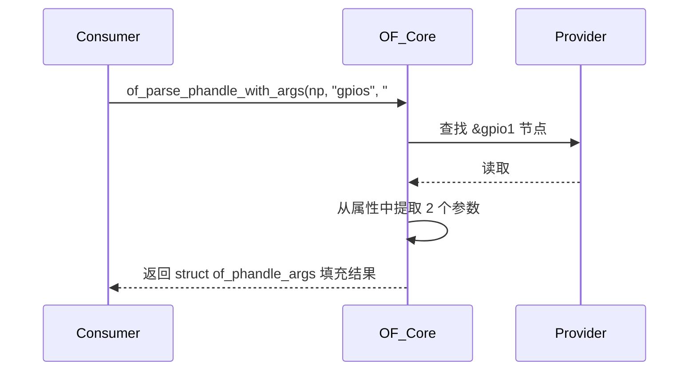

(kernel 6.1 为基准)

# 第1章_struct_gpio_chip

```c
// include/linux/gpio/driver.h

/**
 * struct gpio_chip - GPIO 控制器抽象结构体
 *
 * @label: GPIO 设备的功能性名称，例如部件编号或实现该功能的 SoC IP 模块名称。
 * @gpiodev: 内部状态持有者，是一个不透明结构体（由 gpiolib 管理）。
 * @parent: 可选的父设备，提供这些 GPIO。
 * @fwnode: 可选的固件节点（firmware node），用于描述该控制器的属性。
 * @owner: 指向拥有此 GPIO 控制器模块的引用，防止模块在 GPIO 被使用时被卸载。
 *
 * @request: 可选的钩子函数，用于执行与芯片相关的激活操作，
 *           例如打开模块电源或使能时钟；该函数可能会睡眠。
 * @free: 可选的钩子函数，用于执行与芯片相关的释放操作，
 *        例如关闭模块电源或禁用时钟；该函数可能会睡眠。
 *
 * @get_direction: 返回某个 GPIO “offset” 的方向，0 表示输出，1 表示输入，
 *                 （与 GPIO_LINE_DIRECTION_OUT / GPIO_LINE_DIRECTION_IN 含义相同），
 *                 或返回负数表示错误。建议所有 GPIO 控制器都实现该函数，
 *                 即便是仅输入或仅输出的芯片。
 *
 * @direction_input: 将信号 “offset” 配置为输入，或返回错误。
 *                   对仅输入或仅输出的芯片可以省略。
 *
 * @direction_output: 将信号 “offset” 配置为输出，或返回错误。
 *                    对仅输入或仅输出的芯片可以省略。
 *
 * @get: 读取某个 GPIO “offset” 的当前值，返回 0 表示低电平，1 表示高电平，
 *       返回负数表示错误。
 *
 * @get_multiple: 一次性读取多个 GPIO 引脚的值。“mask” 定义要读取的引脚，
 *                结果保存在 “bits” 中。成功返回 0，否则返回负数错误码。
 *
 * @set: 设置某个 GPIO “offset” 的输出值。
 *
 * @set_multiple: 设置多个 GPIO 的输出值，由 “mask” 定义操作的位。
 *
 * @set_config: 可选钩子，用于执行各种配置操作。
 *              使用与通用 pinconf 相同的打包配置格式。
 *
 * @to_irq: 可选钩子，用于支持非静态的 gpio_to_irq() 映射；
 *          实现该函数时不能睡眠。
 *
 * @dbg_show: 可选函数，用于在 debugfs 中显示 GPIO 芯片内容；
 *            若省略则使用默认实现，但自定义实现可以显示更多状态信息，
 *            如上拉/下拉配置。
 *
 * @init_valid_mask: 可选函数，用于初始化 @valid_mask，
 *                   当并非所有 GPIO 都可用时使用。
 *
 * @add_pin_ranges: 可选函数，用于初始化引脚映射范围（pin ranges），
 *                  当 GPIO 引脚与硬件引脚之间存在特殊映射关系时使用。
 *                  该函数会在添加 GPIO 芯片之后、添加 IRQ 芯片之前调用。
 *
 * @en_hw_timestamp: （依赖于具体芯片）可选函数，用于启用硬件时间戳。
 * @dis_hw_timestamp: （依赖于具体芯片）可选函数，用于禁用硬件时间戳。
 *
 * @base: 该芯片处理的第一个 GPIO 编号；
 *        若在注册时为负值，则表示请求动态分配 GPIO 号。
 *        **弃用说明**：显式设置非负的 base 值（即固定 GPIO 编号）
 *        已被弃用。应始终传递 -1，让 gpiolib 自动选择 base。
 *        长期目标是彻底移除静态 GPIO 编号空间。
 *
 * @ngpio: 此控制器管理的 GPIO 数量；最后一个 GPIO 的编号为 (base + ngpio - 1)。
 *
 * @offset: 当多个 gpio_chip 属于同一个设备时，可用此字段表示设备内的偏移量，
 *          便于友好命名。
 *
 * @names: 若设置，则应为一个字符串数组，用作该芯片 GPIO 的别名。
 *         数组长度必须为 @ngpio，未使用的条目可为 NULL。
 *         名称中可以包含一个无符号整数的 printk 格式化说明符，
 *         将被实际的 GPIO 编号替换。
 *
 * @can_sleep: 若 get()/set() 方法可能睡眠（例如通过 I2C/SPI 控制的 GPIO 扩展器），
 *             必须将此标志置位。
 *             若芯片支持中断，则 IRQ 必须为线程化中断，因为访问芯片寄存器可能睡眠。
 *
 * @read_reg: 通用 GPIO 的寄存器读函数。
 * @write_reg: 通用 GPIO 的寄存器写函数。
 *
 * @be_bits: 若通用 GPIO 使用大端位序（bit31 表示 line0，bit30 表示 line1，以此类推），
 *           则由 GPIO 通用核心设置为 true，仅用于内部管理。
 *
 * @reg_dat: 通用 GPIO 的数据输入寄存器地址。
 * @reg_set: 通用 GPIO 的输出置位寄存器（输出高电平）。
 * @reg_clr: 通用 GPIO 的输出清零寄存器（输出低电平）。
 * @reg_dir_out: 通用 GPIO 的方向设置为输出的寄存器。
 * @reg_dir_in: 通用 GPIO 的方向设置为输入的寄存器。
 *
 * @bgpio_dir_unreadable: 表示方向寄存器不可读，需依赖内部状态追踪。
 *
 * @bgpio_bits: 通用 GPIO 使用的寄存器位数，即寄存器宽度 × 8。
 *
 * @bgpio_lock: 用于锁定 chip->bgpio_data；同时确保影子寄存器与真实寄存器同步写入。
 *
 * @bgpio_data: 通用 GPIO 的影子数据寄存器，用于安全地清除或设置位。
 *
 * @bgpio_dir: 通用 GPIO 的影子方向寄存器，用于安全地设置方向。
 *              值为 1 表示该引脚设置为输出。
 *
 * ---
 *
 * gpio_chip 用于帮助平台抽象不同来源的 GPIO 控制器，
 * 从而可以通过统一的编程接口访问它们。
 *
 * 示例来源包括：
 *   - SoC 内部控制器
 *   - FPGA
 *   - 多功能芯片（multifunction device）
 *   - 专用 GPIO 扩展器（如 I2C/SPI IO expander）
 *
 * 每个 GPIO 控制器管理若干个信号，
 * 通过“offset”参数（范围 0..@ngpio-1）在方法调用中标识。
 * 当使用 gpio_get_value(gpio) 这类 API 时，
 * offset 的值等于 GPIO 全局编号减去 @base。
 */

struct gpio_chip {
	const char			    *label;
	struct gpio_device		*gpiodev;
	struct device			*parent;
	struct fwnode_handle	 *fwnode;
	struct module			*owner;

	int			(*request)			(struct gpio_chip *gc, unsigned int offset);
	void		(*free)   			(struct gpio_chip *gc, unsigned int offset);
	int			(*get_direction)  	(struct gpio_chip *gc, unsigned int offset);
	int			(*direction_input)	(struct gpio_chip *gc, unsigned int offset);
	int			(*direction_output)	(struct gpio_chip *gc, unsigned int offset, int value);
	int			(*get)			    (struct gpio_chip *gc, unsigned int offset);
	int			(*get_multiple)		(struct gpio_chip *gc, unsigned long *mask, unsigned long *bits);
	void		(*set)				(struct gpio_chip *gc, unsigned int offset, int value);
	void		(*set_multiple)		(struct gpio_chip *gc, unsigned long *mask, unsigned long *bits);
	int			(*set_config)		(struct gpio_chip *gc, unsigned int offset, unsigned long config);
	int			(*to_irq)			(struct gpio_chip *gc, unsigned int offset);
	void		(*dbg_show)			(struct seq_file *s, struct gpio_chip *gc);
	int			(*init_valid_mask)	(struct gpio_chip *gc, unsigned long *valid_mask, unsigned int ngpios);
	int			(*add_pin_ranges)	(struct gpio_chip *gc);
	int			(*en_hw_timestamp)	(struct gpio_chip *gc, u32 offset, unsigned long flags);
	int			(*dis_hw_timestamp)	(struct gpio_chip *gc, u32 offset, unsigned long flags);
	int			base;
	u16			ngpio;
	u16			offset;
	const char* const *names;
	bool		can_sleep;

#if IS_ENABLED(CONFIG_GPIO_GENERIC)
	unsigned long 	(*read_reg)	(void __iomem *reg);
	void 		    (*write_reg)(void __iomem *reg, unsigned long data);
	bool be_bits;
	void __iomem *reg_dat;
	void __iomem *reg_set;
	void __iomem *reg_clr;
	void __iomem *reg_dir_out;
	void __iomem *reg_dir_in;
	bool 		 	bgpio_dir_unreadable;
	int 		 	bgpio_bits;
	raw_spinlock_t 	bgpio_lock;
	unsigned long 	bgpio_data;
	unsigned long 	bgpio_dir;
#endif /* CONFIG_GPIO_GENERIC */

#ifdef CONFIG_GPIOLIB_IRQCHIP
	/*
	 * 当启用了 CONFIG_GPIOLIB_IRQCHIP 时，
	 * gpiolib 框架会在内部提供一个 irqchip，
	 * 用于在大多数实际场景中处理 GPIO 中断。
	 */

	/**
	 * @irq:
	 *
	 * 将中断控制器（irqchip）功能与 GPIO 控制器集成在一起。
	 * 这可以在大多数实际场景中用于处理 GPIO 中断。
	 *
	 * 说明：
	 *   gpio_irq_chip 结构体允许 GPIO 控制器直接管理中断，
	 *   无需为每个 GPIO 独立注册外部 irqchip。
	 *   这样可实现 GPIO 与 IRQ 的一体化抽象，
	 *   常用于支持 “GPIO 可中断输入” 的控制器。
	 */
	struct gpio_irq_chip irq;
#endif /* CONFIG_GPIOLIB_IRQCHIP */


    /**
     * @valid_mask:
     *
     * 若不为 %NULL，则保存该芯片中可被使用的 GPIO 位掩码（bitmask）。
     * 仅标记为 1 的 GPIO 可被用户访问。
     *
     * 示例：
     *   若一个芯片声明有 32 个 GPIO，但实际只有 0–23 有效，
     *   则 valid_mask[0] = 0x00FFFFFF，剩余位无效。
     */
    unsigned long *valid_mask;

#if defined(CONFIG_OF_GPIO)
    /*
     * 当启用了 CONFIG_OF_GPIO 时，
     * 所有在设备树（Device Tree）中描述的 GPIO 控制器，
     * 都可以自动获得设备树（OF）中的 GPIO 翻译（translation）支持。
     */

    /**
     * @of_node:
     *
     * 指向代表该 GPIO 控制器的设备树节点（device tree node）。
     * 用于在驱动与设备树之间建立对应关系。
     *
     * 示例：
     *   在 DTS 中定义的节点：
     *     gpio0: gpio@0209c000 {
     *         compatible = "fsl,imx6ul-gpio";
     *         reg = <0x0209c000 0x4000>;
     *     };
     *   内核解析后，gc->of_node 即指向该节点。
     */
    struct device_node *of_node;

    /**
     * @of_gpio_n_cells:
     *
     * 表示形成 GPIO 描述符（specifier）所需的单元数。
     * 即在设备树引用 GPIO 时使用的 <...> 参数个数。
     *
     * 示例：
     *   NXP i.MX 平台的 GPIO 通常为：
     *     #gpio-cells = <2>;
     *   对应语法：
     *     gpios = <&gpio1 3 GPIO_ACTIVE_LOW>;
     *   此时 of_gpio_n_cells = 2。
     */
    unsigned int of_gpio_n_cells;

    /**
     * @of_xlate:
     *
     * 回调函数，用于将设备树中的 GPIO 描述符（specifier）
     * 翻译为芯片内部的 GPIO 号及标志位（flags）。
     *
     * 参数：
     *   @gc       — 当前 GPIO 控制器（gpio_chip）
     *   @gpiospec — 设备树中的 GPIO 描述符
     *   @flags    — 翻译后返回的标志位（如 GPIO_ACTIVE_LOW 等）
     *
     * 返回值：
     *   返回芯片内部的 GPIO 偏移号，或负数表示错误。
     *
     * 示例：
     *   在设备树中：
     *     led0 { gpios = <&gpio1 3 GPIO_ACTIVE_LOW>; };
     *   内核解析时：
     *     of_xlate(gpio_chip_for_gpio1, {3, GPIO_ACTIVE_LOW}, &flags)
     *     → 返回 offset = 3, flags = GPIO_ACTIVE_LOW
     */
    int (*of_xlate)(struct gpio_chip *gc,
            const struct of_phandle_args *gpiospec, u32 *flags);

    /**
     * @of_gpio_ranges_fallback:
     *
     * 当设备树节点 “np” 中没有定义 `gpio-ranges` 属性时，
     * 可选的回调函数用于提供兼容性处理。
     *
     * 说明：
     *   在较早版本的设备树（未引入 gpio-ranges 属性前），
     *   GPIO 与 pinctrl 的对应关系可能依赖于传统方式。
     *   此函数用于在缺少 gpio-ranges 的情况下提供后备映射逻辑，
     *   以维持向后兼容。
     *
     * 示例：
     *   一些旧 SoC 可能没有显式定义 gpio-ranges，
     *   通过该回调可手动建立 GPIO 与引脚控制器之间的关系。
     */
    int (*of_gpio_ranges_fallback)(struct gpio_chip *gc, struct device_node *np);
#endif /* CONFIG_OF_GPIO */
};
```

# 第2章_struct_gpio_irq_chip

```c
// include/linux/gpio/driver.h

/**
 * struct gpio_irq_chip - GPIO 中断控制器
 *
 * 该结构用于在 GPIO 控制器中集成中断控制功能（IRQ chip），
 * 实现 GPIO 到中断的统一抽象。
 */
struct gpio_irq_chip {
	/**
	 * @chip:
	 *
	 * 由 GPIO 驱动程序提供的中断控制器（IRQ chip）实现。
	 * 它定义了该 GPIO 控制器的中断行为。
	 */
	struct irq_chip *chip;

	/**
	 * @domain:
	 *
	 * 中断翻译域（IRQ domain），用于在 GPIO 硬件中断号（hwirq）
	 * 与 Linux 系统的逻辑中断号（IRQ number）之间进行映射。
	 */
	struct irq_domain *domain;

	/**
	 * @domain_ops:
	 *
	 * 与该 IRQ 芯片关联的中断域操作函数表。
	 * 定义如何创建、销毁、映射或查询中断。
	 */
	const struct irq_domain_ops *domain_ops;

#ifdef CONFIG_IRQ_DOMAIN_HIERARCHY
	/**
	 * @fwnode:
	 *
	 * 与该 GPIO/IRQ 控制器对应的固件节点（firmware node），
	 * 在启用分层中断域（hierarchical irqdomain）时必需。
	 */
	struct fwnode_handle *fwnode;

	/**
	 * @parent_domain:
	 *
	 * 若不为 NULL，则表示该 GPIO 控制器的中断域拥有一个父中断域，
	 * 用于建立分层中断结构（hierarchical interrupt domain）。
	 * 存在该字段时，会启用分层中断支持。
	 */
	struct irq_domain *parent_domain;

	/**
	 * @child_to_parent_hwirq:
	 *
	 * 在分层中断架构中，将子中断控制器的硬件中断号（child hwirq）
	 * 转换为父中断控制器的硬件中断号（parent hwirq）。
	 *
	 * - 子硬件中断号对应 GPIO 索引 0..ngpio-1（参见 gpio_chip 的 ngpio）。
	 * - 驱动需要根据 offset 或查表方式计算父中断号和触发类型（IRQ_TYPE_*）。
	 * - 成功返回 0。
	 *
	 * 若部分 GPIO 范围不存在对应的父 HWIRQ，应返回 -EINVAL，
	 * 并通过 @valid_mask 与 @need_valid_mask 屏蔽这些不可用的 GPIO。
	 */
	int (*child_to_parent_hwirq)(struct gpio_chip *gc,
				     unsigned int child_hwirq,
				     unsigned int child_type,
				     unsigned int *parent_hwirq,
				     unsigned int *parent_type);

	/**
	 * @populate_parent_alloc_arg:
	 *
	 * 可选回调，用于为父中断域分配并填充特定的结构体。
	 * 若未指定，则默认使用 gpiochip_populate_parent_fwspec_twocell()。
	 * 若为四单元（four-cell）描述，可使用
	 * gpiochip_populate_parent_fwspec_fourcell() 变体。
	 */
	int (*populate_parent_alloc_arg)(struct gpio_chip *gc,
					 union gpio_irq_fwspec *fwspec,
					 unsigned int parent_hwirq,
					 unsigned int parent_type);

	/**
	 * @child_offset_to_irq:
	 *
	 * 可选回调，用于将 GPIO 控制器的引脚偏移量（offset）
	 * 转换为中断号，供 gpio_to_irq() 回调使用。
	 * 若未实现，则默认回调会直接返回 offset。
	 */
	unsigned int (*child_offset_to_irq)(struct gpio_chip *gc,
					    unsigned int pin);

	/**
	 * @child_irq_domain_ops:
	 *
	 * 该 GPIO IRQ 控制器使用的 IRQ 域操作集。
	 * 若未提供，则会自动填充默认的层级初始化操作。
	 * 某些驱动需要自定义 translate() 回调来完成设备树解析。
	 */
	struct irq_domain_ops child_irq_domain_ops;
#endif /* CONFIG_IRQ_DOMAIN_HIERARCHY */

	/**
	 * @handler:
	 *
	 * 该 GPIO IRQ 芯片使用的中断处理函数，
	 * 通常为内核预定义的中断流处理函数（irq_flow_handler_t）。
	 */
	irq_flow_handler_t handler;

	/**
	 * @default_type:
	 *
	 * GPIO 驱动初始化时的默认中断触发类型，
	 * 例如 IRQ_TYPE_LEVEL_HIGH、IRQ_TYPE_EDGE_RISING 等。
	 */
	unsigned int default_type;

	/**
	 * @lock_key:
	 *
	 * 每个 GPIO IRQ 芯片的 IRQ 锁的 lockdep 类，
	 * 用于内核死锁检测（Lockdep）系统。
	 */
	struct lock_class_key *lock_key;

	/**
	 * @request_key:
	 *
	 * 每个 GPIO IRQ 芯片的 IRQ 请求锁的 lockdep 类。
	 */
	struct lock_class_key *request_key;

	/**
	 * @parent_handler:
	 *
	 * 该 GPIO 控制器父级中断的处理函数。
	 * 若父中断为“嵌套（nested）”结构而非“级联（cascaded）”，则可为 NULL。
	 */
	irq_flow_handler_t parent_handler;

	union {
		/**
		 * @parent_handler_data:
		 *
		 * 若 @per_parent_data 为 false，则该字段为单一指针，
		 * 用作所有父中断的共享数据。
		 */
		void *parent_handler_data;

		/**
		 * @parent_handler_data_array:
		 *
		 * 若 @per_parent_data 为 true，则该字段为一个数组，
		 * 长度为 @num_parents，用于为每个父中断分别提供数据。
		 * 当 @per_parent_data 为 true 时，该指针不能为空。
		 */
		void **parent_handler_data_array;
	};

	/**
	 * @num_parents:
	 *
	 * 表示该 GPIO 芯片拥有的父中断数量。
	 * 例如一个 GPIO 控制器可级联两个上层中断输入。
	 */
	unsigned int num_parents;

	/**
	 * @parents:
	 *
	 * GPIO 芯片的父中断号列表。
	 * 该列表由驱动所有，核心框架只引用不会修改。
	 */
	unsigned int *parents;

	/**
	 * @map:
	 *
	 * 每个 GPIO 引脚对应的父中断号映射表。
	 * 用于精确描述每个 GPIO 的中断来源。
	 */
	unsigned int *map;

	/**
	 * @threaded:
	 *
	 * 若为 true，表示中断处理使用嵌套线程（nested threaded IRQ）。
	 */
	bool threaded;

	/**
	 * @per_parent_data:
	 *
	 * 若为 true，则 parent_handler_data_array 表示一个大小为
	 * @num_parents 的数组，用于存放父中断的专有数据。
	 */
	bool per_parent_data;

	/**
	 * @initialized:
	 *
	 * 标志位，用于追踪 GPIO 芯片中 IRQ 成员的初始化状态。
	 * 防止在初始化完成前被误用。
	 */
	bool initialized;

	/**
	 * @domain_is_allocated_externally:
	 *
	 * 若为 true，表示该 irq_domain 由外部（非 gpiolib）分配，
	 * 因此 gpiolib 在释放时不会自行销毁该 irq_domain。
	 */
	bool domain_is_allocated_externally;

	/**
	 * @init_hw:
	 *
	 * 可选回调，用于在添加 IRQ 芯片前执行硬件初始化。
	 * 通常用于清除中断相关寄存器，以防止产生无效中断。
	 */
	int (*init_hw)(struct gpio_chip *gc);

	/**
	 * @init_valid_mask:
	 *
	 * 可选回调，用于初始化 @valid_mask。
	 * 若某些 GPIO 无法触发中断（例如固定输入），
	 * 则可在此函数中将对应位清零。
	 *
	 * 默认情况下 valid_mask 的前 ngpios 位均为 1，
	 * 回调函数可将不可用的位清为 0。
	 */
	void (*init_valid_mask)(struct gpio_chip *gc,
				unsigned long *valid_mask,
				unsigned int ngpios);

	/**
	 * @valid_mask:
	 *
	 * 若不为 %NULL，则保存该 GPIO 控制器中可作为中断源的 GPIO 位掩码。
	 */
	unsigned long *valid_mask;

	/**
	 * @first:
	 *
	 * 当启用静态 IRQ 分配时使用。
	 * 若设置该值，则 irq_domain_add_simple() 会在初始化时
	 * 分配并映射所有中断。
	 */
	unsigned int first;

	/**
	 * @irq_enable:
	 *
	 * 保存旧的 irq_chip 的 irq_enable 回调指针。
	 * 用于在嵌套或包装 IRQ 逻辑时调用原始实现。
	 */
	void (*irq_enable)(struct irq_data *data);

	/**
	 * @irq_disable:
	 *
	 * 保存旧的 irq_chip 的 irq_disable 回调指针。
	 */
	void (*irq_disable)(struct irq_data *data);

	/**
	 * @irq_unmask:
	 *
	 * 保存旧的 irq_chip 的 irq_unmask 回调指针。
	 */
	void (*irq_unmask)(struct irq_data *data);

	/**
	 * @irq_mask:
	 *
	 * 保存旧的 irq_chip 的 irq_mask 回调指针。
	 */
	void (*irq_mask)(struct irq_data *data);
};
```

# 第3章_struct_gpio_desc

```c
// drivers/gpio/gpiolib.h

/**
 * struct gpio_desc - GPIO 的不透明描述符结构体
 *
 * @gdev:               指向所属 GPIO 设备的指针（父级 gpio_device）
 * @flags:              二进制标志位（bit-level descriptor flags）
 * @label:              使用该 GPIO 的消费者名称（consumer label）
 * @name:               GPIO 线路（line）的名称
 * @hog:                若该引脚被系统预留（hogged），则指向占用该引脚的设备节点
 * @debounce_period_us: 消抖周期（单位：微秒）
 *
 * 说明：
 * - 该结构体的实例由 gpiod_get() 等接口返回，用于替代旧的基于整数编号的 GPIO 句柄。
 * - 相比整数 ID，指向 &struct gpio_desc 的指针在 GPIO 释放之前始终有效，
 *   因此可安全长期引用。
 *
 * GPIO 描述符（gpio_desc）是 gpiolib 框架的核心对象，用于抽象 GPIO 引脚的
 * 状态与配置，而非简单的整数编号。
 */
struct gpio_desc {
	struct gpio_device	*gdev;   /* 指向所属的 GPIO 控制器对象 */
	unsigned long		flags;   /* 状态标志字段，以 bit 方式记录各种 GPIO 状态 */

	/* --- flag 位定义（以下为 flags 字段中每个 bit 的功能定义） --- */
#define FLAG_REQUESTED	        	0   	/* GPIO 已被请求（gpiod_request() 已调用） */
#define FLAG_IS_OUT	        		1   	/* GPIO 当前处于输出模式 */
#define FLAG_EXPORT	        		2   	/* GPIO 已被导出（受 sysfs_lock 保护） */
#define FLAG_SYSFS	        		3   	/* GPIO 已通过 /sys/class/gpio 接口导出 */
#define FLAG_ACTIVE_LOW	        	6   	/* GPIO 为低电平有效（active low） */
#define FLAG_OPEN_DRAIN	        	7   	/* GPIO 为开漏（open-drain）类型 */
#define FLAG_OPEN_SOURCE        	8   	/* GPIO 为开源（open-source）类型 */
#define FLAG_USED_AS_IRQ        	9   	/* GPIO 已连接至中断（IRQ） */
#define FLAG_IRQ_IS_ENABLED    		10   	/* GPIO 对应的中断当前已启用 */
#define FLAG_IS_HOGGED	        	11  	/* GPIO 被系统预留（hogged） */
#define FLAG_TRANSITORY        		12   	/* GPIO 状态在睡眠或复位后可能丢失 */
#define FLAG_PULL_UP           		13   	/* GPIO 具有上拉电阻 */
#define FLAG_PULL_DOWN         		14   	/* GPIO 具有下拉电阻 */
#define FLAG_BIAS_DISABLE      		15   	/* GPIO 禁用了上/下拉偏置 */
#define FLAG_EDGE_RISING       		16   	/* GPIO CDEV 检测上升沿事件 */
#define FLAG_EDGE_FALLING      		17   	/* GPIO CDEV 检测下降沿事件 */
#define FLAG_EVENT_CLOCK_REALTIME 	18 		/* GPIO CDEV 事件报告使用 REALTIME 时间戳 */
#define FLAG_EVENT_CLOCK_HTE      	19 		/* GPIO CDEV 事件报告使用硬件时间戳 (HTE) */

	/* 消费者标识标签，用于记录哪个模块或设备在使用该 GPIO */
	const char		*label;

	/* GPIO 的线路名称（可选） */
	const char		*name;

#ifdef CONFIG_OF_DYNAMIC
	/* 若启用了设备树动态修改（OF_DYNAMIC），
	   则此字段指向占用该 GPIO 的设备节点（hog 节点） */
	struct device_node	*hog;
#endif

#ifdef CONFIG_GPIO_CDEV
	/* 消抖时间，单位为微秒，用于过滤短暂的电平跳变 */
	unsigned int		debounce_period_us;
#endif
};
```

# 第4章_struct_pinctrl_desc

```c
// include/linux/pinctrl/pinctrl.h

/**
 * struct pinctrl_desc - 引脚控制器描述符，用于注册到 pinctrl 子系统
 *
 * @name:                引脚控制器名称（用于标识该控制器）
 * @pins:                指向引脚描述符数组（描述该控制器管理的所有引脚）
 * @npins:               引脚描述符数量，通常使用 ARRAY_SIZE(pins)
 * @pctlops:             pinctrl 操作函数表（可选），用于实现全局性概念，
 *                      如引脚分组、状态管理等。
 * @pmxops:              pinmux 操作函数表（若驱动支持引脚复用功能，则需实现）
 * @confops:             pinconf 操作函数表（若驱动支持引脚配置功能，则需实现）
 * @owner:               提供该 pinctrl 的模块指针（用于引用计数）
 *
 * @num_custom_params:   驱动自定义参数数量（用于从硬件描述中解析自定义属性）
 * @custom_params:       指向驱动自定义参数表，用于解析设备树或 ACPI 中的属性
 * @custom_conf_items:   对应 custom_params 的调试信息表，用于 debugfs 输出显示，
 *                      数组长度必须与 @custom_params 相同。
 *
 * @link_consumers:      若为 true，则在 pinctrl 与其消费者设备之间创建 device link，
 *                      有助于确保挂起/恢复（suspend/resume）时的正确顺序。
 */
struct pinctrl_desc {
	const char *name;                                  // 控制器名称
	const struct pinctrl_pin_desc *pins;               // 管理的引脚描述符数组
	unsigned int npins;                                // 引脚数量
	const struct pinctrl_ops *pctlops;                 // pinctrl 操作集（全局控制）
	const struct pinmux_ops *pmxops;                   // 引脚复用操作集
	const struct pinconf_ops *confops;                 // 引脚配置操作集
	struct module *owner;                              // 模块所属指针，用于引用计数

#ifdef CONFIG_GENERIC_PINCONF
	unsigned int 					    num_custom_params; // 自定义配置参数数量
	const struct pinconf_generic_params  *custom_params;	// 自定义配置参数表
	const struct pin_config_item 		*custom_conf_items; // 自定义参数的调试信息表
#endif

	bool link_consumers;                               // 是否创建与消费者设备的依赖链
};
```


# 第5章_struct_pinctrl_state

```c
// drivers/pinctrl/core.h

/**
 * struct pinctrl_state - 设备的一个 pinctrl 状态
 * @node:   用于挂接到 struct pinctrl 的 @states 链表中的链表节点
 * @name:   此状态的名称
 * @settings: 该状态对应的一组管脚配置（settings）链表
 */
struct pinctrl_state {
    struct list_head node;
    const char *name;
    struct list_head settings;
};

```


# 第6章_struct_of_phandle_args

------

## 6.1_1_主题引入

在设备树（Device Tree, DT）中，一个节点经常通过如下形式引用其他节点的资源：

```dts
gpios = <&gpio1 3 GPIO_ACTIVE_LOW>;
clocks = <&clk_24m>;
interrupts = <GIC_SPI 66 IRQ_TYPE_LEVEL_HIGH>;
```

这些“`<&xxx ...>`”语法在 DTS 中称为 **phandle 引用**。内核解析后，需要把这组引用信息转换成一个可在 C 层统一处理的数据结构，这就是：

> **`struct of_phandle_args` —— “固件句柄参数结构体”**

该结构体是设备树引用关系的统一抽象：

- `phandle` 表示被引用节点（provider）；
- `args` 数组表示随引用传递的参数（如 GPIO 号、极性、触发方式等）。

------

## 6.2_2_结构体定义与头文件位置

### 6.2.1_源码位置

```
include/linux/of.h
```

### 6.2.2_定义

```c
struct of_phandle_args {
	struct device_node *np;    /* 被引用的 provider 节点 */
	int args_count;            /* 参数单元数量 (#*-cells) */
	uint32_t args[MAX_PHANDLE_ARGS]; /* 参数数组 */
};
```

### 6.2.3_宏定义

```c
#define MAX_PHANDLE_ARGS 16
```

表示最多允许携带 16 个参数单元。

------

## 6.3_3_成员详解

| 成员名       | 类型                   | 说明                                                       |
| ------------ | ---------------------- | ---------------------------------------------------------- |
| `np`         | `struct device_node *` | 指向被引用节点（provider）的设备树节点，如 `gpio@0209c000` |
| `args_count` | `int`                  | 参数个数，对应 provider 节点中定义的 `#xxx-cells` 值       |
| `args[]`     | `uint32_t` 数组        | 存储 DTS `<...>` 中的每个参数值，依次排列                  |

------

## 6.4_4_语义与数据流关系

### 6.4.1_设备树中引用模型

```dts
leds {
    compatible = "gpio-leds";
    led0 {
        gpios = <&gpio1 3 GPIO_ACTIVE_LOW>;
    };
};
```

解析逻辑上：

| 字段              | 对应意义                           |
| ----------------- | ---------------------------------- |
| `&gpio1`          | → provider 的 device_node          |
| `3`               | → 第 1 个参数 args[0]（GPIO 编号） |
| `GPIO_ACTIVE_LOW` | → 第 2 个参数 args[1]（极性）      |

最终被封装为：

```c
struct of_phandle_args args = {
    .np = <gpio1 device_node>,
    .args_count = 2,
    .args = { 3, GPIO_ACTIVE_LOW },
};
```

------

## 6.5_5_典型调用链与解析函数

Linux 提供一系列解析接口，以 `of_parse_phandle_with_*` 为前缀。

### 6.5.1_典型函数_of_parse_phandle_with_args()

```c
int of_parse_phandle_with_args(const struct device_node *np,
                               const char *list_name,
                               const char *cells_name,
                               int index,
                               struct of_phandle_args *out_args);
```

| 参数         | 含义                                       |
| ------------ | ------------------------------------------ |
| `np`         | 当前消费者节点（consumer）                 |
| `list_name`  | 属性名，如 `"gpios"`                       |
| `cells_name` | provider 节点中定义的 `#gpio-cells` 属性名 |
| `index`      | 若属性中含多个引用，则指定第几个           |
| `out_args`   | 输出结构体，存放解析结果                   |

**函数作用：**

> 从指定设备节点中解析出属性 `list_name`，读取对应的 phandle，并根据 provider 节点的 `#*-cells` 数量，提取出所有参数值填充到 `of_phandle_args` 中。

### 6.5.2_内核执行路径(以_GPIO_为例)



------

## 6.6_6_与_GPIO_框架的结合

`gpiolib` 内部即通过该结构体实现设备树解析：

```c
int of_get_named_gpiod_flags(struct device_node *np,
                             const char *propname, int index,
                             enum of_gpio_flags *flags)
{
	struct of_phandle_args gpiospec;
	int ret;

	ret = of_parse_phandle_with_args(np, propname, "#gpio-cells", index, &gpiospec);
	if (ret)
		return ret;

	return of_gpio_simple_xlate(&gpiospec, flags);
}
```

解析流程：

1. `of_parse_phandle_with_args()` 解析出 provider 与参数；
2. `of_gpio_simple_xlate()` 根据 `args` 数组解释出引脚号与极性；
3. 封装为 `gpio_desc` 对象返回。

------

## 6.7_7_跨子系统使用示例

### 6.7.1_中断控制器(IRQ)

```dts
interrupts = <GIC_SPI 74 IRQ_TYPE_LEVEL_HIGH>;
```

provider 定义：

```dts
#interrupt-cells = <3>;
```

解析后：

```c
args.np = &gic_device_node;
args.args_count = 3;
args.args = { 74, 0, IRQ_TYPE_LEVEL_HIGH };
```

### 6.7.2_时钟控制器(Clock)

```dts
clocks = <&clk 3>;
```

provider 定义：

```dts
#clock-cells = <1>;
```

解析后：

```c
args.np = &clk_node;
args.args_count = 1;
args.args[0] = 3;
```

### 6.7.3_pinctrl

```dts
pinctrl-0 = <&pinctrl_led>;
pinctrl-names = "default";
```

provider 定义：

```dts
#pinctrl-cells = <1>;
```

解析后：

```c
args.np = &pinctrl_led_node;
args.args[0] = 0;
```

------

## 6.8_8_调试与验证方法

### 6.8.1_使用内核日志输出

在调用 `of_parse_phandle_with_args()` 后可手动打印结果：

```c
pr_info("phandle: %pOF, args_count=%d, args[0]=%d, args[1]=%d\n",
         args.np, args.args_count, args.args[0], args.args[1]);
```

输出示例：

```
phandle: /soc/gpio@0209c000, args_count=2, args[0]=3, args[1]=1
```

### 6.8.2_确认解析路径

使用内核调试开关：

```bash
echo 8 > /proc/sys/kernel/printk
dmesg | grep gpio
```

------

## 6.9_9_关键特性与优点

| 特性     | 说明                            |
| -------- | ------------------------------- |
| 通用性   | 所有 phandle 解析接口共用此结构 |
| 统一性   | 对 GPIO、IRQ、clock 等抽象一致  |
| 可扩展性 | 支持多参数 (`args_count` 可变)  |
| 可调试性 | 可直接打印查看 provider / args  |
| 安全性   | 无需直接访问 DTS 结构或偏移     |

------

## 6.10_10_小结

| 项目          | 内容                                                 |
| ------------- | ---------------------------------------------------- |
| 名称          | `struct of_phandle_args`                             |
| 定义位置      | `include/linux/of.h`                                 |
| 主要用途      | 统一封装设备树中 `<&provider args...>` 的解析结果    |
| 核心字段      | `.np`（节点指针）、`.args_count`、`.args[]`          |
| 典型应用      | GPIO、IRQ、pinctrl、clock、regulator                 |
| 解析接口      | `of_parse_phandle_with_args()`、`of_parse_phandle()` |
| 对应 DTS 属性 | `#gpio-cells`, `#interrupt-cells`, `#clock-cells` 等 |
| 关键特征      | 高度通用、结构简洁、贯穿整个设备树解析框架           |

------


