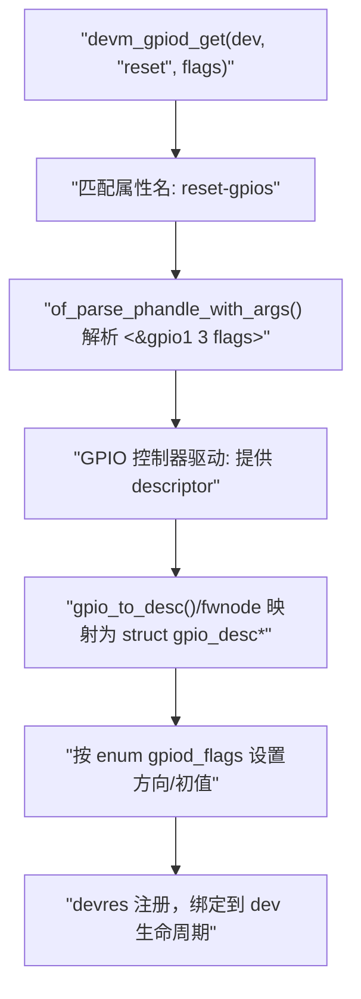
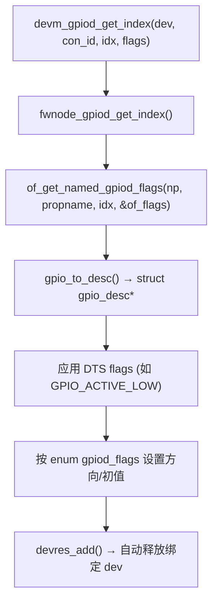
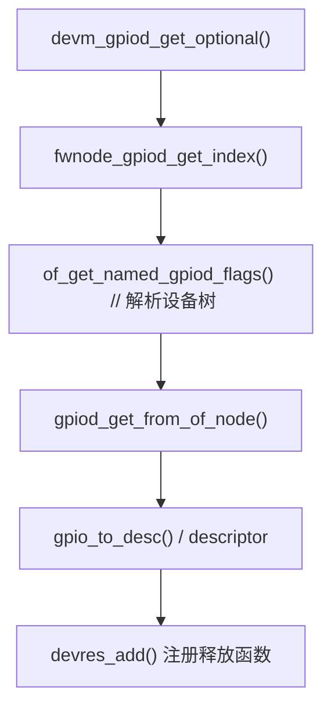
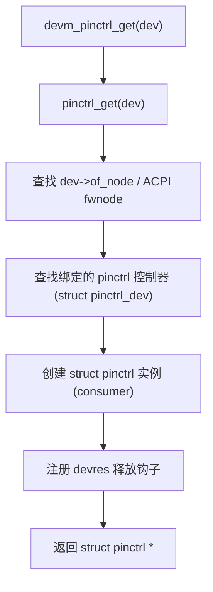

# 第1章_devm_gpiod_get()

## 1.1_1_作用(是什么)

`devm_gpiod_get()` 用于**从固件节点（设备树/ACPI）解析并获取一个 GPIO 描述符 `struct gpio_desc \*`，并在获取时按照给定的初始化标志设置方向/初始电平**。该函数接口没有索引参数传递，因此只能用于单GPIO时使用。该资源通过 **devres** 框架自动托管：

- `probe()` 成功后在 **`remove()` 或设备释放** 时自动回收；
- `probe()` 任何阶段失败时，**已获取的 GPIO 会被自动回滚释放**。

## 1.2_2_使用场景(什么时候用)

- 设备节点存在如 `reset-gpios`、`enable-gpios`、`cs-gpios` 等属性，需要在 `probe()` 中**一次性获取并初始化**；
- 希望**避免手写释放路径**（减少泄漏/差错）；
- 需要消费端 API 的**统一抽象**（`gpiod_*()`）而非老式 `gpio_*()` 编号式接口。
- GPIO的属性配置只能是单引脚。

## 1.3_3_不写的后果(如果不用它)

- 若改用 [gpiod_get()](#第1章_gpiod_get())：你必须**显式在错误路径和 `remove()` 中释放**（调用 `gpiod_put()`），出错时更易遗漏；
- 若直接用旧式 `gpio_request()/gpio_direction_*()`：与现代 GPIO consumer 模型不一致，**无法透明处理 Active-Low/电气特性**，并且易与同一线的其它消费者冲突。

------

## 1.4_4_函数原型与头文件

```c
#include <linux/gpio/consumer.h>

struct gpio_desc *devm_gpiod_get(struct device *dev,
                                 const char *con_id,
                                 enum gpiod_flags flags);
```

**头文件**：`<linux/gpio/consumer.h>`

> （设备树解析间接依赖 `<linux/of_gpio.h>`，但驱动通常只需包含 consumer 头文件。）

------

## 1.5_5_参数与语义(精确定义)

| 参数     | 类型               | 语义与取值要求                                               |
| -------- | ------------------ | ------------------------------------------------------------ |
| `dev`    | `struct device *`  | **消费者设备**。必须绑定到目标固件节点（如 `pdev->dev` 有效且 `dev->of_node` 指向设备树节点）。devres 依赖它做生命周期托管。 |
| `con_id` | `const char *`     | **功能名/消费名**。用于在固件属性里拼接 `<con_id>-gpios` 进行查找（例如 `"reset"` → 属性名 `"reset-gpios"`）。允许为 `NULL`（取默认 `gpios` 或由板级查找表匹配）。 |
| `flags`  | `enum gpiod_flags` | **初始化标志**，决定方向与初始值：`GPIOD_ASIS`（不改向/值）、`GPIOD_IN`、`GPIOD_OUT_LOW`、`GPIOD_OUT_HIGH`。还可按位或 `GPIOD_FLAGS_BIT_NONEXCLUSIVE`（非独占）。 |

> 典型枚举（6.1 系列保持稳定）：
>
> - `GPIOD_ASIS`：保持固件/控制器缺省，不强制方向/电平；
> - `GPIOD_IN`：配置为输入；
> - `GPIOD_OUT_LOW` / `GPIOD_OUT_HIGH`：配置为输出并置初值；
> - `GPIOD_FLAGS_BIT_NONEXCLUSIVE`：声明非独占消费者（控制器可决定是否允许）。

**重要说明**：Active-Low/开漏/上拉下拉等**电气与逻辑极性**来自固件 `<flags>`（例如 `GPIO_ACTIVE_LOW`），**不是** `enum gpiod_flags` 的成员；consumer API 会据此对 `gpiod_set_value()` / `gpiod_get_value()` 做逻辑层反相处理（你始终用“逻辑 1/0”语义编码）。

------

## 1.6_6_返回值与错误码

- 成功：`struct gpio_desc *`（非 `ERR_PTR`），与 `dev` 绑定到 devres。
- 失败：`ERR_PTR(<neg errno>)`，常见：
  - `-ENOENT`：未找到匹配属性或索引；
  - `-EPROBE_DEFER`：控制器尚未就绪（常见于多驱动依赖）；
  - `-EINVAL`：固件参数非法/args 解析出错；
  - `-EBUSY`：该线被互斥占用或不允许复用；
  - `-ENODEV/-ENXIO`：GPIO 控制器缺失或不支持。

> 判断方式：`IS_ERR(desc)`，再取 `PTR_ERR(desc)`。

------

## 1.7_7_解析与绑定流程(数据结构视角)

固件（DTS）到 consumer 的解析路径概要：

- **DTS**（示例）：

  ```dts
  demo@0 {
      compatible = "vendor,demo";
      reset-gpios = <&gpio1 3 GPIO_ACTIVE_LOW>;
  };
  ```

- **解析链（简化）**：



**涉及关键结构**（只列与消费侧相关）：

- `struct gpio_desc`：GPIO 消费端句柄；
- `struct device`：消费者设备，挂接 `fwnode`/`of_node`；
- `struct fwnode_handle`：抽象固件节点（OF/ACPI 统一）；
- `devres` 节点：devm 资源记录项，内含释放回调与 `gpio_desc`。

------

## 1.8_8_与其它获取接口的关系(选型)

| 接口                                              | 特点                                    | 典型用途                   |
| ------------------------------------------------- | --------------------------------------- | -------------------------- |
| `devm_gpiod_get()`                                | 单个 GPIO，devres 托管                  | 最常用、简单               |
| `devm_gpiod_get_optional()`                       | 属性缺失返回 `NULL` 而非错误            | 可选引脚                   |
| `devm_gpiod_get_index()`                          | 多 GPIO（同属性）按索引获取             | `reset-gpios` 多路         |
| `devm_gpiod_get_array()`                          | 一组 GPIO（顺序敏感）                   | 并行线/总线                |
| （非 devm）`gpiod_get()`/`_index()`               | 需手动 `gpiod_put()`                    | 自主管理生命周期或早期阶段 |
| **（不建议新代码）** `of_get_named_gpiod_flags()` | 仅解析 + 返回 desc，不 devres，不设方向 | 框架/通用层自定义流程      |

**实践建议**：驱动 `probe()` 首选 `devm_gpiod_get*()` 家族；仅在框架需要更细粒度控制时使用 `of_get_named_gpiod_flags()`。

------

## 1.9_9_设备树属性命名与_con_id_映射

- `con_id = "reset"` → 查找属性 **`"reset-gpios"`**；
- `con_id = NULL` → 查找 `"gpios"` 或由板级 **GPIO lookup table** 提供的匹配；
- 多路：`reset-gpios = <...>, <...>;` → 用 `devm_gpiod_get_index(dev, "reset", idx, flags)`。

> **索引从 0 开始**，与 `<...>` 在属性里的排列顺序一致。

------

## 1.10_10_示例代码(完整_probe())

```c
#include <linux/module.h>
#include <linux/platform_device.h>
#include <linux/gpio/consumer.h>

struct demo_priv {
	struct gpio_desc *reset;
};

static int demo_probe(struct platform_device *pdev)
{
	struct device *dev = &pdev->dev;
	struct demo_priv *priv;
	int ret;

	priv = devm_kzalloc(dev, sizeof(*priv), GFP_KERNEL);
	if (!priv)
		return -ENOMEM;

	/* 从 "reset-gpios" 获取，作为输出并拉高 */
	priv->reset = devm_gpiod_get(dev, "reset", GPIOD_OUT_HIGH);
	if (IS_ERR(priv->reset)) {
		ret = PTR_ERR(priv->reset);
		if (ret != -EPROBE_DEFER)
			dev_err(dev, "failed to get reset-gpios: %d\n", ret);
		return ret;
	}

	/* 逻辑层面拉低复位，延时后释放 */
	gpiod_set_value_cansleep(priv->reset, 0);
	usleep_range(1000, 2000);
	gpiod_set_value_cansleep(priv->reset, 1);

	dev_info(dev, "probe ok\n");
	return 0;
}

static int demo_remove(struct platform_device *pdev)
{
	/* 无需 gpiod_put()；devm 会自动释放。
	 * 如需要将硬件状态复位为默认，请在此处执行显式逻辑复位。 */
	return 0;
}

static const struct of_device_id demo_of_match[] = {
	{ .compatible = "vendor,demo", },
	{ /* sentinel */ }
};
MODULE_DEVICE_TABLE(of, demo_of_match);

static struct platform_driver demo_drv = {
	.probe  = demo_probe,
	.remove = demo_remove,
	.driver = {
		.name           = "demo",
		.of_match_table = demo_of_match,
	},
};
module_platform_driver(demo_drv);

MODULE_LICENSE("GPL");
```

**对应 DTS 片段：**

```dts
demo@0 {
    compatible = "vendor,demo";
    reset-gpios = <&gpio1 3 GPIO_ACTIVE_LOW>;
};
```

> 说明：`GPIO_ACTIVE_LOW` 导致 consumer 逻辑反相。上例 `GPIOD_OUT_HIGH` 在物理线上可能输出低电平（由控制器/DT极性决定），**你应始终从“逻辑有效/无效”的角度写代码**。

------

## 1.11_11_常见误用与诊断

1. **`dev` 未绑定设备树节点**

- 现象：`-ENOENT` 或找不到属性；
- 排查：确认 `pdev->dev.of_node` 非空；平台设备由 OF 匹配创建。

1. **属性名/`con_id` 不一致**

- 现象：`-ENOENT`；
- 规则：`"reset"` → `"reset-gpios"`，注意复数 **`-gpios`** 与大小写。

1. **索引错误**（用 `_index()`）

- 现象：`-ENOENT`/`-EINVAL`；
- 排查：与 DTS 中 `<...>, <...>` 的顺序一致，基于 0 起算。

1. **方向与初值期望不符**

- 现象：电平与预期相反；
- 原因：**Active-Low** 由 DTS 控制，consumer 做逻辑反相；
- 解决：保持业务语义用 `gpiod_set_value()` 的“逻辑值”，不要以物理 0/1 推导。

1. **并发/共享**

- 现象：`-EBUSY` 或行为异常；
- 规则：默认独占，确需共享用 `GPIOD_FLAGS_BIT_NONEXCLUSIVE`，但仍取决于控制器策略。

1. **探测顺序**

- 现象：`-EPROBE_DEFER`；
- 处理：直接返回该错误，让内核稍后重试。

------

## 1.12_12_调试与验证方法

- **检查解析结果**

  - `cat /sys/kernel/debug/gpio` 查看各控制器线的**消费者名**与**方向/值**；

  - 在驱动中打印：

    ```c
    dev_info(dev, "reset gpio=%d\n", desc_to_gpio(priv->reset));
    ```

    （注意：某些后端不导出稳定编号，`desc_to_gpio()` 只用于调试。）

- **固件节点检查**

  - `hexdump -Cv /sys/firmware/devicetree/base/.../reset-gpios`
  - 确认 phandle、pin、flags 是否与预期一致。

- **功能验证**

  - 以 `gpiod_get_value_cansleep()` 读取；
  - 以 `gpiod_set_value_cansleep()` 切换并观察外设响应或逻辑分析仪波形。

------

## 1.13_13_与中断的关系(简述)

`devm_gpiod_get()` 获取的是**GPIO 线**的 consumer 句柄；若需要转为中断使用，通常：

- 通过 **`gpiod_to_irq(desc)` → `devm_request_threaded_irq()`**；
- 中断触发类型与极性**仍受 Active-Low 等固件极性影响**，需在 `irq_set_irq_type()` 或设备树 `interrupts`/`interrupt-controller` 端正确声明。

------

## 1.14_14_最佳实践(驱动规范)

- `probe()` 中用 `devm_gpiod_get*_optional()` 处理可选引脚；
- 对输出脚，**在获取时就给出期望的初值**（`GPIOD_OUT_LOW/HIGH`），避免时序毛刺；
- 读写跨可能睡眠上下文时统一使用 `*_cansleep` 版本；
- `remove()` 中**如需恢复硬件默认态**（与资源释放不同），请显式设置（devm 不做“复位”操作）。
- 严格区分“逻辑电平”与“物理电平”，不要与 Active-Low 搞混。

------

## 1.15_15_小结(要点回顾)

- **接口**：`devm_gpiod_get(dev, con_id, flags)`；
- **资源管理**：devres 自动托管，免 `gpiod_put()`；
- **固件映射**：`con_id` → `<con_id>-gpios`（例如 `"reset"` → `"reset-gpios"`）；
- **初始化**：`GPIOD_IN / GPIOD_OUT_LOW / GPIOD_OUT_HIGH / GPIOD_ASIS`；
- **极性/电气**：来自 DTS `<flags>`（如 `GPIO_ACTIVE_LOW`），consumer 逻辑自动处理；
- **错误**：`-ENOENT/-EPROBE_DEFER/-EINVAL/-EBUSY` 常见；
- **推荐**：在 `probe()` 使用 `devm_gpiod_get*()` 家族，简单可靠。


# 第2章_devm_gpiod_get_index()

------

## 2.1_概要说明(功能定位)

`devm_gpiod_get_index()`
 用于**从设备节点（device tree / ACPI / firmware node）中，按索引号获取指定功能的第 N 个 GPIO 引脚描述符**。
 属于 **GPIO consumer API** 的一部分，带有 **devres 自动资源管理**机制。

> 简单地说，它在同一功能（如 `"reset-gpios"`）下有多个 GPIO 时，用 `index` 区分要取的哪一个。

------

## 2.2_函数原型与头文件

```c
#include <linux/gpio/consumer.h>

struct gpio_desc *
devm_gpiod_get_index(struct device *dev,
                     const char *con_id,
                     unsigned int idx,
                     enum gpiod_flags flags);
```

- 头文件：`<linux/gpio/consumer.h>`
- 所属模块：GPIO consumer framework（`drivers/gpio/gpiolib.c`）

------

## 2.3_参数详解

| 参数名   | 类型               | 说明                                                         |
| -------- | ------------------ | ------------------------------------------------------------ |
| `dev`    | `struct device *`  | 设备对象。用于查找设备树节点 (`dev->of_node`) 并绑定 devres 生命周期。 |
| `con_id` | `const char *`     | **连接名（consumer ID）**，用于拼接属性名 `<con_id>-gpios`。允许为 `NULL`，此时查找 `"gpios"` 属性。 |
| `idx`    | `unsigned int`     | 索引号（从 0 开始），当属性下定义多个 `<...>` 时，用于选取第几个。 |
| `flags`  | `enum gpiod_flags` | 初始化标志。控制方向、初值和独占性：• `GPIOD_ASIS` — 不改变方向；• `GPIOD_IN` — 设置为输入；• `GPIOD_OUT_LOW` — 输出低电平；• `GPIOD_OUT_HIGH` — 输出高电平；• 可按位或 `GPIOD_FLAGS_BIT_NONEXCLUSIVE` 表示非独占。 |

------

## 2.4_返回值与错误码

| 返回值               | 含义                             |
| -------------------- | -------------------------------- |
| `struct gpio_desc *` | 成功时返回有效 GPIO 描述符指针。 |
| `ERR_PTR(-Exxx)`     | 出错时返回错误指针。常见错误：   |
| `-ENOENT`            | 未找到对应属性或索引超出范围。   |
| `-EPROBE_DEFER`      | 依赖的 GPIO 控制器尚未就绪。     |
| `-EINVAL`            | 属性格式错误、参数非法。         |
| `-EBUSY`             | GPIO 已被占用。                  |
| `-ENODEV`            | 设备无有效节点或控制器不存在。   |

判断：

```c
if (IS_ERR(desc))
    return PTR_ERR(desc);
```

------

## 2.5_工作机制(内核数据流)

### 2.5.1_解析流程(核心路径)



### 2.5.2_数据结构关联

| 结构体             | 关键字段                  | 说明                                   |
| ------------------ | ------------------------- | -------------------------------------- |
| `struct gpio_desc` | `.flags` `.chip` `.hwnum` | GPIO 的逻辑描述符对象                  |
| `struct gpio_chip` | `.label` `.base` `.ngpio` | 控制器信息                             |
| `struct device`    | `.of_node`                | 对应设备树节点，用于属性解析           |
| `devres`           | 内部资源管理节点          | 注册在 `dev->devres_head` 上，自动释放 |

------

## 2.6_DTS_语法与解析规则

**DTS 示例：**

```dts
led-controller@0 {
    compatible = "vendor,led-controller";
    led-gpios = <&gpio1 3 GPIO_ACTIVE_LOW>,
                <&gpio1 4 GPIO_ACTIVE_LOW>,
                <&gpio1 5 GPIO_ACTIVE_LOW>;
};
```

**属性解析逻辑：**

- `con_id = "led"` → 属性名 `"led-gpios"`；
- `idx = 0` → 解析 `<&gpio1 3 GPIO_ACTIVE_LOW>`；
- `idx = 1` → 解析 `<&gpio1 4 GPIO_ACTIVE_LOW>`；
- 以此类推。

------

## 2.7_典型用法示例

```c
static int led_probe(struct platform_device *pdev)
{
    struct device *dev = &pdev->dev;
    struct gpio_desc *led_gpio;
    int i;

    for (i = 0; i < 3; i++) {
        led_gpio = devm_gpiod_get_index(dev, "led", i, GPIOD_OUT_LOW);
        if (IS_ERR(led_gpio)) {
            dev_err(dev, "Failed to get led-gpios[%d]: %ld\n", i, PTR_ERR(led_gpio));
            return PTR_ERR(led_gpio);
        }

        /* 拉高点亮 LED */
        gpiod_set_value_cansleep(led_gpio, 1);
    }

    return 0;
}
```

**行为结果：**

- 自动解析 `"led-gpios"` 属性；
- 依次取 GPIO1_IO03 / GPIO1_IO04 / GPIO1_IO05；
- 每个 `led_gpio` 都会自动绑定 devres；
- 驱动卸载或 probe 失败时自动释放。

------

## 2.8_与其他接口的区别

| 接口名                          | 解析对象     | 是否自动释放 | 支持索引 | 属性拼接         | 说明                 |
| ------------------------------- | ------------ | ------------ | -------- | ---------------- | -------------------- |
| `devm_gpiod_get()`              | 当前设备节点 | ✅            | ❌        | `"con_id-gpios"` | 单 GPIO              |
| **`devm_gpiod_get_index()`**    | 当前设备节点 | ✅            | ✅        | `"con_id-gpios"` | 多 GPIO              |
| `devm_gpiod_get_from_of_node()` | 指定节点     | ✅            | ✅        | 显式属性名       | 不走 con_id 拼接     |
| `gpiod_get_index()`             | 当前设备节点 | ❌            | ✅        | `"con_id-gpios"` | 需手动 `gpiod_put()` |
| `of_get_named_gpiod_flags()`    | 显式 OF 节点 | ❌            | ✅        | 显式属性名       | 仅解析，不设置方向   |

------

## 2.9_内核日志与验证

1. **查看 GPIO 消费者状态：**

   ```bash
   cat /sys/kernel/debug/gpio
   ```

   输出：

   ```
   gpio-3  (led-controller     ) out lo
   gpio-4  (led-controller     ) out lo
   gpio-5  (led-controller     ) out lo
   ```

2. **打印描述符对应编号：**

   ```c
   dev_info(dev, "LED[%d] gpio = %d\n", i, desc_to_gpio(led_gpio));
   ```

3. **错误排查：**

   - 若打印 `-ENOENT` → 检查 DTS 属性名；
   - 若打印 `-EPROBE_DEFER` → 控制器驱动加载顺序；
   - 若打印 `-EBUSY` → 该 GPIO 已被其他 consumer 使用。

------

## 2.10_调用时机与推荐做法

| 阶段                  | 是否推荐   | 原因                             |
| --------------------- | ---------- | -------------------------------- |
| `probe()`             | ✅          | 典型场景，GPIO 初始化并自动释放  |
| `remove()`            | 不需要释放 | devres 会自动释放资源            |
| `suspend/resume`      | 可使用     | 描述符可长期缓存于驱动私有结构体 |
| `initcall` / 早期引导 | ❌          | devres 框架未完全启用            |

------

## 2.11_常见误区与诊断

| 误区                      | 结果                   | 修正                                                |
| ------------------------- | ---------------------- | --------------------------------------------------- |
| 忘记写 `gpio-controller;` | 无法识别该节点为控制器 | 在控制器节点添加该属性                              |
| `#gpio-cells` 不匹配      | of 解析失败            | 需符合控制器驱动要求                                |
| 属性名与 `con_id` 不对应  | 找不到属性             | 例如 con_id="led" → 属性应为 "led-gpios"            |
| 未考虑 `GPIO_ACTIVE_LOW`  | 电平反向               | 按逻辑值控制（active/inactive），不要按物理电平判断 |
| 多个控制器共享            | 报 `-EBUSY`            | 检查复用配置，必要时 `NONEXCLUSIVE`                 |

------

## 2.12_总结

| 项目     | 内容                                                         |
| -------- | ------------------------------------------------------------ |
| 函数名   | `devm_gpiod_get_index()`                                     |
| 头文件   | `<linux/gpio/consumer.h>`                                    |
| 功能     | 从当前设备节点解析 `<con_id>-gpios` 的第 `idx` 个 GPIO 描述符 |
| 特点     | devres 自动管理，支持方向和初值设置                          |
| 典型标志 | `GPIOD_IN`, `GPIOD_OUT_LOW`, `GPIOD_OUT_HIGH`, `GPIOD_ASIS`  |
| 常见错误 | `-ENOENT`, `-EPROBE_DEFER`, `-EINVAL`, `-EBUSY`              |
| 应用场景 | 同一属性有多个 GPIO，需按索引访问                            |
| 对应 DTS | `<&gpioX pin flags>, <&gpioX pin flags>, ...`                |


# 第3章_devm_gpiod_get_from_of_node()

------

## 3.1_函数定位与作用

**接口说明**：

- **从指定的设备树节点 `struct device_node \*` 与属性名**（如 `reset-gpios`）解析并获取一个 **GPIO 描述符 `struct gpio_desc \*`**；
- 按传入的 `enum gpiod_flags` **在获取时设置方向/初值**；
- 通过 **devres** 机制将该 GPIO 资源绑定到 `struct device *dev` 的生命周期，**无需手动释放**。


**该接口适合以下场景**：

- 驱动需要**从非本设备 `dev->of_node` 的节点**（例如子节点、兄弟节点或 MFD 子功能节点）直接解析 GPIO；
- 无需通过 `con_id → "<con_id>-gpios"` 的查找规则，**直接点名属性**。

------

## 3.2_原型与头文件

```c
#include <linux/gpio/consumer.h>

struct gpio_desc *
devm_gpiod_get_from_of_node(struct device *dev,
                            struct device_node *node,
                            const char *propname,
                            int index,
                            enum gpiod_flags flags,
                            const char *label);
```

> 内核版本 5.x/6.x 中该原型保持稳定（若平台裁剪了 OF/ACPI，需确认配置项）。

------

## 3.3_参数语义

| 参数       | 类型                   | 要点                                                         |
| ---------- | ---------------------- | ------------------------------------------------------------ |
| `dev`      | `struct device *`      | **消费者设备**。devres 依赖它做自动释放；日志与调试也以此设备为上下文。 |
| `node`     | `struct device_node *` | **要解析的设备树节点**（可与 `dev->of_node` 不同），例如一个子节点。必须非空且有效。 |
| `propname` | `const char *`         | **属性名**，例如 `"reset-gpios"`、`"enable-gpios"`、或 `"gpios"`。不参与 `con_id` 拼接。 |
| `index`    | `int`                  | 当属性是一个 **GPIO list**（多个 `<...>`）时，选取第 `index` 个（从 0 起）。 |
| `flags`    | `enum gpiod_flags`     | **初始化标志**：`GPIOD_ASIS` / `GPIOD_IN` / `GPIOD_OUT_LOW` / `GPIOD_OUT_HIGH`，可或 `GPIOD_FLAGS_BIT_NONEXCLUSIVE`。**不包含 Active-Low 等极性**。 |
| `label`    | `const char *`         | **消费者标签**，用于 `/sys/kernel/debug/gpio` 等调试输出中标识该占用者；可为 `NULL`。 |

------

## 3.4_返回值与错误码

- 成功：返回非错误指针的 `struct gpio_desc *`；
- 失败：返回 `ERR_PTR(-Exxx)`。常见：
  - `-ENOENT`：属性不存在、索引越界；
  - `-EPROBE_DEFER`：GPIO 控制器/供电等依赖未就绪；
  - `-EINVAL`：属性格式无效、`#gpio-cells` 不匹配等；
  - `-ENODEV` / `-ENXIO`：找不到控制器或控制器不支持该线；
  - `-EBUSY`：该线被独占占用或不允许共享。

判断方式：

```c
if (IS_ERR(desc))
    return PTR_ERR(desc);
```

------

## 3.5_行为细节与数据流

- **固件极性/电气特性**（如 `GPIO_ACTIVE_LOW`、`GPIO_OPEN_DRAIN`、`GPIO_PULL_UP`）来自 **设备树属性 `<flags>`**，由 consumer 框架解析并体现在 `gpio_desc` 的逻辑层：
  - `gpiod_set_value()`/**_cansleep** 接受的是**逻辑值**（有效/无效），而非物理高低电平；
  - 物理电平可能因 Active-Low 而反相。
- `flags`（`enum gpiod_flags`）仅控制**方向/初值**与**独占/非独占**语义，不描述极性。
- 资源释放：与 `dev` 绑定到 devres；**无需 `gpiod_put()`**。
- 线程上下文：若控制器可能睡眠，**读写使用 `_cansleep` 版本**。

------

## 3.6_与相近_API_的边界

| API                                 | 入口定位                                                     | 自动释放              | 方向/初值                        | 属性定位方式                    |
| ----------------------------------- | ------------------------------------------------------------ | --------------------- | -------------------------------- | ------------------------------- |
| `devm_gpiod_get()`                  | `dev->of_node`（或 ACPI/fwnode），通过 `con_id → "<con_id>-gpios"` | ✅                     | ✅                                | `con_id` 拼接属性名             |
| `devm_gpiod_get_index()`            | 同上                                                         | ✅                     | ✅                                | `con_id` + `index`              |
| **`devm_gpiod_get_from_of_node()`** | **显式传入任意 OF 节点+属性名**                              | ✅                     | ✅                                | **`propname`/`index` 直接指定** |
| `gpiod_get_from_of_node()`          | 同上                                                         | ❌（需 `gpiod_put()`） | ✅                                | 同上                            |
| `of_get_named_gpiod_flags()`        | 显式 OF 节点+属性名                                          | ❌                     | **❌（仅解析，不设置方向/初值）** | 同上                            |

**选型建议**：

- 解析源节点就是 `dev->of_node`，且遵循 `<con_id>-gpios`：优先 `devm_gpiod_get*()`。
- 需要从**子节点/指定节点**直接取属性：用 `devm_gpiod_get_from_of_node()`。
- 框架/通用层只想做“解析，不初始化”或需要延后设向：可用 `of_get_named_gpiod_flags()`。

------

## 3.7_典型用法

### 3.7.1_从子节点读取_GPIO(MFD/复合设备常见)

**DTS：**

```dts
demo@0 {
    compatible = "vendor,demo";
    subdev@1 {
        compatible = "vendor,demo-sub";
        reset-gpios = <&gpio1 3 GPIO_ACTIVE_LOW>;
    };
};
```

**驱动：**

```c
static int demo_probe(struct platform_device *pdev)
{
    struct device *dev = &pdev->dev;
    struct device_node *child;
    struct gpio_desc *rst;

    child = of_get_child_by_name(dev->of_node, "subdev@1");
    if (!child)
        return -ENOENT;

    rst = devm_gpiod_get_from_of_node(dev, child,
                                      "reset-gpios", 0,
                                      GPIOD_OUT_HIGH,
                                      "demo-sub-reset");
    of_node_put(child);
    if (IS_ERR(rst))
        return PTR_ERR(rst);

    /* 逻辑复位脉冲 */
    gpiod_set_value_cansleep(rst, 0);
    usleep_range(1000, 2000);
    gpiod_set_value_cansleep(rst, 1);
    return 0;
}
```

要点：

- `propname` 直接写 `"reset-gpios"`；
- `label` 会出现在 `/sys/kernel/debug/gpio` 里，便于排查谁占用该线；
- 无需 `gpiod_put()`，devres 托管释放。

### 3.7.2_同一属性多路_GPIO(用_index_选择)

**DTS：**

```dts
ctrl@0 {
    gpios = <&gpio2 5 GPIO_ACTIVE_HIGH>,
            <&gpio2 6 GPIO_ACTIVE_HIGH>,
            <&gpio2 7 GPIO_ACTIVE_HIGH>;
};
```

**驱动：**同一个设备节点的非标准gpios命名，获取多个gpios属性。采用dev下的of_node成员，该成员在匹配阶段就赋值到了dev下。

```c
for (int i = 0; i < 3; i++) {
    struct gpio_desc *d =
        devm_gpiod_get_from_of_node(dev, dev->of_node, "gpios", i,
                                    GPIOD_OUT_LOW, "ctrl-gpio");
    if (IS_ERR(d))
        return PTR_ERR(d);
    /* 使用 d ... */
}
```

------

## 3.8_常见错误与诊断

1. **`node` 非期望节点**

- 现象：`-ENOENT` / 解析到错误控制器；
- 检查：打印 `node->full_name`；确认属性位于该节点。

1. **属性名拼写错误或应为 `"gpios"`**

- 现象：`-ENOENT`；
- 检查：`of_find_property(node, propname, NULL)` 是否存在。

1. **索引越界**

- 现象：`-ENOENT`；
- 检查：属性 `<...>` 数量是否 ≥ `index + 1`。

1. **极性/电气误解**

- 现象：电平与预期相反；
- 原因：`GPIO_ACTIVE_LOW` 等来自 DTS；
- 对策：用 **逻辑值** 控制，引脚极性放在 DTS 里描述。

1. **控制器未就绪**

- 现象：`-EPROBE_DEFER`；
- 对策：驱动直接返回该错误码，等待后续重试。

1. **共享/独占冲突**

- 现象：`-EBUSY`；
- 对策：确需共享则带 `GPIOD_FLAGS_BIT_NONEXCLUSIVE`，但能否共享由控制器决定。

------

## 3.9_调试方法

- **查看占用情况**：`cat /sys/kernel/debug/gpio`

  - 确认目标线是否出现，方向/值是否正确，消费者标签是否为 `label`。

- **核对设备树**：`hexdump -Cv /sys/firmware/devicetree/base/<path>/<propname>`

  - 核对 phandle、pin、flags。

- **打印辅助**：

  ```c
  dev_dbg(dev, "node: %pOF, prop: %s, idx: %d\n", node, propname, index);
  dev_dbg(dev, "gpio=%d\n", desc_to_gpio(desc)); /* 仅调试用 */
  ```

------

## 3.10_小结(关键点归纳)

- **接口**：`devm_gpiod_get_from_of_node(dev, node, propname, index, flags, label)`；
- **用途**：从**任意指定 OF 节点**直接解析 GPIO，**获取即设向/初值**，并 **devres 自动释放**；
- **差异化**：不依赖 `con_id`，而是显式 `propname` 与 `index`；
- **极性/电气**：源自 DTS `<flags>`，非 `enum gpiod_flags`；
- **诊断路径**：`-ENOENT/-EPROBE_DEFER/-EINVAL/-EBUSY`，结合 debugfs 与 DTS 校验定位。


# 第4章_devm_gpiod_get_optional()

devm_gpiod_get_optional() 的详细技术讲解，涵盖接口定义、语义说明、使用场景、返回值机制、与其他接口的关系以及典型驱动示例。

------

## 4.1_1_函数原型

```c
struct gpio_desc *devm_gpiod_get_optional(struct device *dev,
                                          const char *con_id,
                                          enum gpiod_flags flags);
```

该函数定义于：

```c
#include <linux/gpio/consumer.h>
```

------

## 4.2_2_函数作用

`devm_gpiod_get_optional()` 用于**从设备树（或其他 GPIO 查找表）中获取一个 GPIO 描述符**，但与 `devm_gpiod_get()` 的区别在于：

> 如果对应的 GPIO 属性不存在（未定义），则该函数返回 **NULL**，而不是报错。

这使得驱动编写者可以方便地处理“可选 GPIO”资源的情况。例如，一个外设可能有一个可选的复位引脚（reset-gpios），但某些板级实现并没有提供该 GPIO，此时使用该函数能避免设备加载失败。

------

## 4.3_3_函数参数说明

| 参数名   | 类型               | 说明                                                         |
| -------- | ------------------ | ------------------------------------------------------------ |
| `dev`    | `struct device *`  | 设备对象，用于建立 GPIO 与设备的资源管理关系（devres 机制）。 |
| `con_id` | `const char *`     | GPIO 的消费者名称，对应设备树中的 `<name>-gpios` 属性前缀。例如 `"reset"` 对应 `reset-gpios`。 |
| `flags`  | `enum gpiod_flags` | GPIO 初始化标志，决定其方向和初始电平。                      |

------

### 4.3.1_con_id_与设备树属性的映射关系

假设设备树节点如下：

```dts
mychip@0 {
    compatible = "vendor,mychip";
    reset-gpios = <&gpio1 3 GPIO_ACTIVE_LOW>;
};
```

则驱动中调用：

```c
reset_gpio = devm_gpiod_get_optional(dev, "reset", GPIOD_OUT_LOW);
```

系统会自动查找属性 `"reset-gpios"` 并返回对应 GPIO 描述符。

------

### 4.3.2_flags_常用取值

| 宏                        | 含义                           |
| ------------------------- | ------------------------------ |
| `GPIOD_ASIS`              | 不改变方向，保持设备树中配置。 |
| `GPIOD_IN`                | 设置为输入方向。               |
| `GPIOD_OUT_LOW`           | 输出低电平。                   |
| `GPIOD_OUT_HIGH`          | 输出高电平。                   |
| `GPIOD_FLAGS_BIT_DIR_OUT` | （内部标志）输出方向位。       |

------

## 4.4_4_返回值

| 返回值               | 含义                                       |
| -------------------- | ------------------------------------------ |
| `NULL`               | 对应 GPIO 属性不存在（可选 GPIO 未定义）。 |
| `struct gpio_desc *` | 成功获取到的 GPIO 描述符。                 |
| `ERR_PTR(-errno)`    | 获取失败（如引脚冲突、DTS 配置错误）。     |

------

### 4.4.1_注意事项

- **NULL 不等于错误**：表示可选 GPIO 缺失，这通常是预期行为。
- **IS_ERR_OR_NULL(desc)** 可用于统一判断：

```c
if (IS_ERR_OR_NULL(desc)) {
    if (desc)
        return PTR_ERR(desc); // 真错误
    // 否则 GPIO 未定义，可忽略
}
```

------

## 4.5_5_资源管理机制(devres)

该函数前缀为 `devm_`，意味着它通过 **设备资源管理机制（Device Resource Management）** 自动注册释放回调。

当：

- `probe()` 执行失败；
- 或 `driver remove()` 调用；
- 或设备被卸载时，

内核会自动调用 `gpiod_put()` 来释放该 GPIO。

因此无需手动在 `remove()` 中释放。

------

## 4.6_6_典型使用场景

### 4.6.1_场景_可选复位引脚

某些外设存在可选复位引脚：

```c
static int mychip_probe(struct platform_device *pdev)
{
    struct gpio_desc *reset;

    reset = devm_gpiod_get_optional(&pdev->dev, "reset", GPIOD_OUT_LOW);
    if (IS_ERR(reset))
        return PTR_ERR(reset);

    if (reset)
        gpiod_set_value(reset, 1);  // 拉高复位
    else
        dev_warn(&pdev->dev, "no reset GPIO defined\n");

    return 0;
}
```

设备树中若未定义 `reset-gpios`，此驱动仍可正常工作。

------

### 4.6.2_场景_可选电源使能引脚

```dts
mychip@0 {
    compatible = "vendor,mychip";
    enable-gpios = <&gpio2 5 GPIO_ACTIVE_HIGH>;
};
```

驱动代码：

```c
struct gpio_desc *enable_gpio;

enable_gpio = devm_gpiod_get_optional(dev, "enable", GPIOD_OUT_LOW);
if (!IS_ERR_OR_NULL(enable_gpio))
    gpiod_set_value(enable_gpio, 1);
```

------

## 4.7_7_与其他接口的对比

| 接口                        | 缺少属性时行为        | 是否自动释放 | 用途                     |
| --------------------------- | --------------------- | ------------ | ------------------------ |
| `gpiod_get()`               | 报错返回 `-ENOENT`    | 否           | 强制要求 GPIO 存在       |
| `devm_gpiod_get()`          | 报错返回 `ERR_PTR()`  | 是           | 必须存在且受 devres 管理 |
| `devm_gpiod_get_optional()` | 返回 `NULL`           | 是           | 可选 GPIO，缺省时跳过    |
| `devm_gpiod_get_index()`    | 根据索引获取多个 GPIO | 是           | 用于多 GPIO 组           |
| `devm_gpiod_get_array()`    | 一次性获取多个 GPIO   | 是           | 控制并行引脚阵列         |

------

## 4.8_8_底层调用流程(内核路径)



------

## 4.9_9_调试建议

1. 启用调试日志：

   ```bash
   echo 'file drivers/gpio/gpiolib.c +p' > /sys/kernel/debug/dynamic_debug/control
   ```

2. 确认 GPIO 被正确解析：

   ```bash
   cat /sys/kernel/debug/gpio
   ```

3. 检查 DTS 中属性拼写是否正确，如 `"reset-gpios"` 而非 `"reset_gpio"`。

------

## 4.10_10_小结

| 项目           | 内容                                     |
| -------------- | ---------------------------------------- |
| 函数名称       | `devm_gpiod_get_optional()`              |
| 功能           | 获取可选 GPIO 描述符（自动管理生命周期） |
| 典型用途       | 可选复位脚、可选电源控制脚               |
| 设备树缺省行为 | 返回 NULL，驱动仍能正常运行              |
| 所属子系统     | GPIO consumer API（gpiolib）             |
| 对应释放接口   | 自动调用 `gpiod_put()`                   |
| 常用配合宏     | `IS_ERR_OR_NULL()`                       |

------

是否需要我继续补充它的**源码实现路径（从 gpiolib.c → devres.c）与调用堆栈**部分？
 这一部分可以详细说明它是如何通过 `devres_add()` 自动挂入设备资源链表的。


# 第5章_devm_gpiod_get_index_optional()

------

## 5.1_1_接口定义与位置

```c
#include <linux/gpio/consumer.h>

struct gpio_desc *devm_gpiod_get_index_optional(struct device *dev,
                                                const char *con_id,
                                                unsigned int index,
                                                enum gpiod_flags flags);
```

- **头文件**：`include/linux/gpio/consumer.h`
- **实现文件**：`drivers/gpio/gpiolib.c`
- **导出符号**：`EXPORT_SYMBOL_GPL(devm_gpiod_get_index_optional);`

------

## 5.2_2_函数作用(What)

该函数用于从 **设备树 (Device Tree)** 或 **板级描述 (board file / lookup table)** 中，
 为指定的设备 (`struct device *dev`) 获取某个命名的 GPIO 信号（consumer）。

与普通版本不同：

- 它按 **索引号** 获取同名 GPIO 列表中的第 `index` 根；
- 若该 GPIO 在硬件或设备树中**不存在**，函数直接返回 `NULL`（而不是错误指针）；
- 若存在且成功解析，则返回一个 **GPIO 描述符**（`struct gpio_desc *`）；
- 若出错（设备树有定义但解析失败等），返回 `ERR_PTR()` 形式的错误码。

简而言之：

> **“可选的第 index 根 GPIO，若未定义则跳过，若定义则自动申请并纳入 devres 自动释放机制。”**

------

## 5.3_3_参数说明

| 参数名   | 类型               | 含义                                                |
| -------- | ------------------ | --------------------------------------------------- |
| `dev`    | `struct device *`  | 设备指针，用于绑定 devres 自动资源回收（devm 机制） |
| `con_id` | `const char *`     | GPIO 消费者名称（设备树属性 `<name>-gpios`）        |
| `index`  | `unsigned int`     | 索引号（从 0 起）用于区分同名组的多根 GPIO          |
| `flags`  | `enum gpiod_flags` | GPIO 初始化标志（方向与初始电平）                   |

------

## 5.4_4_可选获取的语义(optional)

`devm_gpiod_get_index_optional()` 的“optional”含义：

- 如果设备树中没有 `<con_id>-gpios` 属性，或者索引超出范围，函数不会报错；
- 它直接返回 `NULL`，表示该 GPIO 是“**非必须的、可缺省的**”；
- 调用者应显式判断 `if (!desc)` 后选择忽略或使用默认行为；
- 与 `devm_gpiod_get_index()` 不同，后者在缺失时会返回 `-ENOENT` 错误。

这种接口通常用于：

```c
reset-gpios、enable-gpios、ctrl-gpios、optional interrupt lines 等。
```

------

## 5.5_5_flags_参数取值(GPIO_初始化行为)

`flags` 取值来自 `enum gpiod_flags`（见 `include/linux/gpio/consumer.h`）：

| 宏名                      | 含义                   | 行为                 |
| ------------------------- | ---------------------- | -------------------- |
| `GPIOD_IN`                | 输入模式               | 设置为输入方向       |
| `GPIOD_OUT_LOW`           | 输出模式，初始为低电平 | 输出并置低           |
| `GPIOD_OUT_HIGH`          | 输出模式，初始为高电平 | 输出并置高           |
| `GPIOD_ASIS`              | 按 DTS 默认方向        | 不主动修改方向       |
| `GPIOD_FLAGS_BIT_DIR_SET` | 内部标志               | 用于内部函数标识方向 |

------

## 5.6_6_典型使用场景

在驱动中，经常用于一组相同功能 GPIO，例如：

```dts
ctrl-gpios = <&gpio1 5 GPIO_ACTIVE_HIGH>,
              <&gpio1 7 GPIO_ACTIVE_HIGH>;
```

驱动端：

```c
for (i = 0; i < 2; i++) {
    d->g_ctrl[i] = devm_gpiod_get_index_optional(dev, "ctrl", i, GPIOD_OUT_LOW);
    if (IS_ERR(d->g_ctrl[i]))
        return PTR_ERR(d->g_ctrl[i]);

    if (d->g_ctrl[i])
        d->ctrl_active_low[i] = gpiod_is_active_low(d->g_ctrl[i]);
}
```

> **说明：**
>
> - 第 0 根 → `<ctrl-gpios>[0]`
> - 第 1 根 → `<ctrl-gpios>[1]`
> - 如果设备树只定义了一个，则第二次调用返回 `NULL`，不报错。

------

## 5.7_7_返回值语义(Return_Values)

| 返回值类型               | 含义                              |
| ------------------------ | --------------------------------- |
| `struct gpio_desc *desc` | 成功：有效 GPIO 描述符            |
| `NULL`                   | 未定义该 GPIO（可选缺失，非错误） |
| `ERR_PTR(-ENOENT)`       | 在 lookup/table 有定义但解析失败  |
| 其他 `ERR_PTR(-Exxx)`    | 其它错误（如请求失败）            |

检查方式：

```c
if (IS_ERR(desc))
    return PTR_ERR(desc);
if (!desc)
    dev_info(dev, "optional GPIO not defined\n");
```

------

## 5.8_8_devm_自动管理机制(与资源回收)

`devm_` 前缀表示该资源通过 **devres（Device Managed Resource）** 系统自动释放。
 这意味着：

- 当设备 `dev` 的 `remove()` 执行，或者 probe 失败回退时；
- 内核会自动释放 `gpio_desc` 对应的资源；
- 无需手动调用 `gpiod_put()`。

相比传统 `gpiod_get_index_optional()`，该版本不需要在错误路径手动清理。

------

## 5.9_9_函数调用路径(源码级)

核心流程（`drivers/gpio/gpiolib-devres.c`）：

```c
struct gpio_desc *devm_gpiod_get_index_optional(struct device *dev,
                                                const char *con_id,
                                                unsigned int index,
                                                enum gpiod_flags flags)
{
    struct gpio_desc *desc;

    desc = gpiod_get_index_optional(dev, con_id, index, flags);
    if (IS_ERR_OR_NULL(desc))
        return desc;

    return devm_gpiod_release(dev, desc); // 注册自动释放回调
}
```

其中 `gpiod_get_index_optional()` → 调用 `fwnode_gpiod_get_index()`，最终解析：

1. 设备树属性 `<con_id>-gpios`；
2. 设备树标志 `GPIO_ACTIVE_LOW`；
3. 方向、初值、标志位；
4. 分配对应的 `gpio_desc`。

------

## 5.10_10_设备树示例(DTS)

```dts
led-consumer {
    compatible = "leaf,mydev-consumer";
    status-gpios = <&gpio3 4 GPIO_ACTIVE_LOW>;
    reset-gpios  = <&gpio3 5 GPIO_ACTIVE_HIGH>;
    ctrl-gpios   = <&gpio3 6 GPIO_ACTIVE_HIGH>,
                   <&gpio3 7 GPIO_ACTIVE_HIGH>;
};
```

驱动：

```c
d->g_status = devm_gpiod_get(dev, "status", GPIOD_OUT_LOW);
d->g_reset  = devm_gpiod_get_optional(dev, "reset", GPIOD_OUT_HIGH);
for (i = 0; i < 2; i++)
    d->g_ctrl[i] = devm_gpiod_get_index_optional(dev, "ctrl", i, GPIOD_OUT_LOW);
```

结果：

| 属性           | 存在性   | 返回值               |
| -------------- | -------- | -------------------- |
| `status-gpios` | 必须     | 有效 desc            |
| `reset-gpios`  | 可选     | 有效 desc 或 NULL    |
| `ctrl-gpios`   | 可选多根 | 有效 desc[i] 或 NULL |

------

## 5.11_11_调试建议

- 启用动态调试：

  ```bash
  echo 'file drivers/gpio/gpiolib.c +p' > /sys/kernel/debug/dynamic_debug/control
  ```

- 用户态查看：

  ```bash
  gpioinfo
  ```

  可确认对应线的分配、方向与标志。

------

## 5.12_12_使用建议与陷阱

✅ **建议：**

- 当 GPIO 不一定存在时，优先用 `_optional`；
- 获取多根 GPIO 时，优先用 `_index`；
- 始终配合 `IS_ERR_OR_NULL()` 检查；
- 与 `devm_` 系列保持一致，避免内存泄漏。

⚠️ **陷阱：**

- `_optional` 版本返回 NULL **不是错误**；
- `devm_` 版本不能混用 `gpiod_put()` 手动释放；
- 若驱动生命周期特殊（如非设备管理资源），应使用非 `devm_` 版本；
- 注意 `flags` 决定方向与初值，不可忽略。

------

## 5.13_13总结表

| 函数                              | 可选性 | 索引 | 自动释放 | 缺失时行为    |
| --------------------------------- | ------ | ---- | -------- | ------------- |
| `gpiod_get()`                     | 否     | 否   | 否       | 返回错误      |
| `gpiod_get_optional()`            | 是     | 否   | 否       | 返回 NULL     |
| `gpiod_get_index()`               | 否     | 是   | 否       | 返回错误      |
| **`gpiod_get_index_optional()`**  | ✅      | ✅    | 否       | **返回 NULL** |
| `devm_gpiod_get_index_optional()` | ✅      | ✅    | ✅        | **返回 NULL** |

------

## 5.14_14_结论

`devm_gpiod_get_index_optional()` 是 **GPIO consumer API** 中最灵活、安全的资源获取接口之一，
 具备以下特征：

- 自动资源管理（`devm_`）；
- 按索引获取（`_index`）；
- 支持可选缺省（`_optional`）；
- 自动解析设备树属性和极性；
- 简化 probe/cleanup 流程。

适用于：

> 驱动中存在多根相似 GPIO 信号、部分可选、需安全回收资源的场合。


---

# 第6章_devm_pinctrl_get()

------

## 6.1_概要说明(功能定位)

`devm_pinctrl_get()` 是 **pinctrl（pin control）子系统的设备管理型资源接口**，用于：

- 从设备节点中获取 **pinctrl 句柄**（`struct pinctrl *`）；
- 将其绑定到指定的 `struct device *`；
- 并在设备释放或 probe 失败时由 **devres 框架自动释放**。

该接口属于 **pinctrl consumer API**，用于驱动中访问和切换设备的 **pin 配置状态**（`default`、`sleep`、`idle` 等）。

------

## 6.2_函数原型与头文件

```c
#include <linux/pinctrl/consumer.h>

struct pinctrl *devm_pinctrl_get(struct device *dev);
```

- **头文件**：`<linux/pinctrl/consumer.h>`
- **实现文件**：`drivers/pinctrl/core.c`、`drivers/pinctrl/devres.c`

------

## 6.3_参数与返回值

| 参数  | 类型              | 说明                                                         |
| ----- | ----------------- | ------------------------------------------------------------ |
| `dev` | `struct device *` | 设备对象（消费者）。其 `.of_node` 或 `.fwnode` 应指向对应设备树节点。 |

**返回值：**

- 成功：返回有效的 `struct pinctrl *`；
- 失败：返回 `ERR_PTR(-Exxx)`。

常见错误码：

| 错误码          | 含义                                        |
| --------------- | ------------------------------------------- |
| `-ENODEV`       | 没有可用的 pinctrl 控制器或设备树无对应节点 |
| `-EINVAL`       | pinctrl 描述错误                            |
| `-EPROBE_DEFER` | 控制器未加载完成，需延迟探测                |
| `-ENOMEM`       | 内存不足                                    |
| `-ENOSYS`       | 平台不支持 pinctrl                          |

------

## 6.4_内核数据结构关联

| 结构体                 | 关键字段                      | 说明                                           |
| ---------------------- | ----------------------------- | ---------------------------------------------- |
| `struct pinctrl`       | `struct pinctrl_state *state` | 表示当前设备的 pin 控制句柄（consumer 端）     |
| `struct pinctrl_state` | `.name`、`.settings`          | 各种状态（如 default、sleep）集合              |
| `struct pinctrl_dev`   | `.desc`                       | 控制器端结构体，描述可用 pin、group、function  |
| `struct device`        | `.of_node`                    | 与设备树节点关联，用于从 DTS 解析 pinctrl 名称 |

------

## 6.5_调用场景与使用目的

`devm_pinctrl_get()` 典型使用于设备驱动的 **probe()** 函数中，用于：

- 获取 pinctrl 句柄；
- 后续通过 `pinctrl_lookup_state()` 获取具体状态；
- 通过 `pinctrl_select_state()` 切换引脚复用配置。

与 `devm_` 前缀接口一样，它由 devres 框架自动释放，无需 `pinctrl_put()`。

------

## 6.6_内核工作机制(解析路径)



> 当 `dev` 卸载或 probe 失败时，devres 自动调用 `devm_pinctrl_release()`，释放所有已分配的 pinctrl consumer 对象。

------

## 6.7_与相关接口的区别

| 接口                        | 是否自动释放 | 说明                                    |
| --------------------------- | ------------ | --------------------------------------- |
| `pinctrl_get(dev)`          | ❌            | 手动管理生命周期，需要 `pinctrl_put()`  |
| **`devm_pinctrl_get(dev)`** | ✅            | 自动绑定 devres，推荐使用               |
| `devm_pinctrl_put()`        | ✅            | 手动提前释放（罕用）                    |
| `pinctrl_lookup_state()`    | —            | 查找状态句柄，如 `"default"`、`"sleep"` |
| `pinctrl_select_state()`    | —            | 切换状态（改变引脚复用/驱动模式）       |

------

## 6.8_DTS(设备树)对应关系

**设备树示例：**

```dts
led@0 {
    compatible = "vendor,led";
    pinctrl-names = "default", "sleep";
    pinctrl-0 = <&pinctrl_led_default>;
    pinctrl-1 = <&pinctrl_led_sleep>;
};
```

**pinctrl 子节点：**

```dts
pinctrl_led_default: ledgrp {
    fsl,pins = <
        MX6UL_PAD_GPIO1_IO03__GPIO1_IO03 0x10b0
    >;
};

pinctrl_led_sleep: ledgrp_sleep {
    fsl,pins = <
        MX6UL_PAD_GPIO1_IO03__GPIO1_IO03 0x1c0
    >;
};
```

在驱动中：

```c
struct pinctrl *pctl;
struct pinctrl_state *state_default, *state_sleep;

pctl = devm_pinctrl_get(&pdev->dev);
if (IS_ERR(pctl))
    return PTR_ERR(pctl);

state_default = pinctrl_lookup_state(pctl, "default");
state_sleep   = pinctrl_lookup_state(pctl, "sleep");

pinctrl_select_state(pctl, state_default);
```

------

## 6.9_驱动中典型使用模式

```c
static int demo_probe(struct platform_device *pdev)
{
    struct pinctrl *pctl;
    struct pinctrl_state *default_state, *sleep_state;

    pctl = devm_pinctrl_get(&pdev->dev);
    if (IS_ERR(pctl))
        return PTR_ERR(pctl);

    default_state = pinctrl_lookup_state(pctl, "default");
    if (IS_ERR(default_state))
        return PTR_ERR(default_state);

    sleep_state = pinctrl_lookup_state(pctl, "sleep");
    if (IS_ERR(sleep_state))
        sleep_state = NULL;  /* optional */

    /* 切换为 default 状态 */
    pinctrl_select_state(pctl, default_state);

    platform_set_drvdata(pdev, pctl);
    return 0;
}

static int demo_remove(struct platform_device *pdev)
{
    struct pinctrl *pctl = platform_get_drvdata(pdev);
    struct pinctrl_state *sleep_state;

    /* 可选：卸载前切换为 sleep 状态 */
    sleep_state = pinctrl_lookup_state(pctl, "sleep");
    if (!IS_ERR(sleep_state))
        pinctrl_select_state(pctl, sleep_state);

    /* 不需调用 pinctrl_put()，devres 自动释放 */
    return 0;
}
```

------

## 6.10_常见错误与排查方法

| 错误类型                      | 典型日志 / 现象                    | 可能原因                             |
| ----------------------------- | ---------------------------------- | ------------------------------------ |
| `-ENODEV`                     | `no pinctrl device found`          | 控制器未注册，或 DTS 无匹配节点      |
| `-EINVAL`                     | `invalid pinctrl property`         | DTS 属性拼写错误，如 `pinctrl-names` |
| `-EPROBE_DEFER`               | 驱动多阶段加载时控制器尚未 ready   | 返回后内核自动重新 probe             |
| `pinctrl_select_state()` 失败 | `could not switch state 'default'` | 状态名称不匹配或未在 DTS 定义        |
| GPIO 不生效                   | 引脚未切换到正确 function          | pinmux 未应用，确认调用顺序          |

**调试命令：**

```bash
cat /sys/kernel/debug/pinctrl/*/pins
cat /sys/kernel/debug/pinctrl/*/pinmux-pins
```

------

## 6.11_与设备树属性的对应逻辑

| 属性名                          | 作用                                     |
| ------------------------------- | ---------------------------------------- |
| `pinctrl-names`                 | 定义所有可切换的状态名                   |
| `pinctrl-0`, `pinctrl-1`, …     | 各状态对应的引脚组                       |
| `#pinctrl-cells`                | 控制器端定义（如 `<mux conf>` 参数个数） |
| `fsl,pins` / `rockchip,pins` 等 | 各 SoC 的具体引脚配置                    |

**解析顺序：**

1. 读取 `pinctrl-names`；
2. 根据顺序解析 `pinctrl-0`、`pinctrl-1`；
3. 建立状态表；
4. `pinctrl_lookup_state()` 以字符串匹配索引。

------

## 6.12_devm_自动释放机制说明

`devm_pinctrl_get()` 调用后，内核会注册一个 devres 资源节点：

```c
devres_add(dev, pctl);
```

当以下任一事件发生时，`devm_pinctrl_release()` 被自动调用：

- probe() 返回错误；
- 驱动卸载（remove 被调用）；
- device_unregister()；

开发者无需手动 `pinctrl_put()`，但如果确实需要提前释放，可使用：

```c
devm_pinctrl_put(dev, pctl);
```

------

## 6.13_小结

| 项目              | 内容                                                |
| ----------------- | --------------------------------------------------- |
| **函数名**        | `devm_pinctrl_get()`                                |
| **头文件**        | `<linux/pinctrl/consumer.h>`                        |
| **作用**          | 获取设备的 pinctrl 控制句柄（并自动管理生命周期）   |
| **常用场景**      | probe() 阶段初始化引脚状态                          |
| **典型配合函数**  | `pinctrl_lookup_state()` / `pinctrl_select_state()` |
| **是否自动释放**  | ✅ 是（由 devres 负责）                              |
| **常见错误**      | `-ENODEV`, `-EPROBE_DEFER`, `-EINVAL`               |
| **典型 DTS 属性** | `pinctrl-names`, `pinctrl-0`, `pinctrl-1` 等        |


