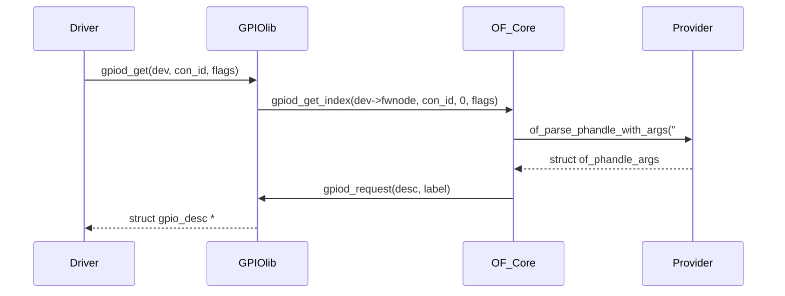
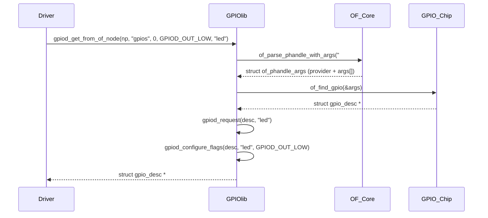

# 第1章_gpiod_get()

------

## 1.1_1_主题引入

在 Linux 4.8 之后，GPIO 子系统逐渐由旧的整数型接口（`gpio_request()` / `gpio_direction_output()`）迁移至 **descriptor-based（描述符机制）**。在这种机制中，驱动不再直接操作 GPIO 号，而是通过一个抽象对象 [`struct gpio_desc`](#struct gpio_desc) 进行管理。

`gpiod_get()` 系列函数正是驱动层**从设备树或 ACPI 等固件描述中解析 GPIO 并获取描述符**的主要入口。它是现代 Linux 驱动框架中操作 GPIO 的首选接口。

------

## 1.2_2_函数原型与头文件位置

```c
#include <linux/gpio/consumer.h>

struct gpio_desc *gpiod_get(struct device *dev,
                            const char *con_id,
                            enum gpiod_flags flags);
```

头文件路径：

```
include/linux/gpio/consumer.h
```

内核实现文件：

```
drivers/gpio/gpiolib.c
```

定义：

```c
/**
 * gpiod_get - 获取指定 GPIO 功能所对应的 GPIO
 * @dev:   GPIO 消费者（consumer），可以为 NULL，用于系统全局 GPIO
 * @con_id: GPIO 消费者内部的功能标识符（function name）
 * @flags: 可选的 GPIO 初始化标志（方向、初始电平等）
 *
 * 返回值：
 * 返回与设备 dev 的功能 con_id 对应的 GPIO 描述符（descriptor）。
 *
 * 若请求的功能未分配任何 GPIO，则返回 -ENOENT；
 * 若在获取 GPIO 的过程中发生错误，则返回其他可由 IS_ERR() 检测的错误码。
 */
struct gpio_desc *__must_check gpiod_get(struct device *dev, const char *con_id,
					 enum gpiod_flags flags)
{
	return gpiod_get_index(dev, con_id, 0, flags);
}
EXPORT_SYMBOL_GPL(gpiod_get);

/**
 * gpiod_get_index - 从多索引 GPIO 函数中获取指定索引的 GPIO
 * @dev:   GPIO 的消费者（device 结构体），对于系统全局 GPIO 可为 NULL
 * @con_id: GPIO 消费者中的功能标识（function 名称）
 * @idx:   在该功能下要获取的 GPIO 索引号
 * @flags: 可选的 GPIO 初始化标志
 *
 * 这是 gpiod_get() 的变体，用于访问定义了多个 GPIO 的函数中除第一个之外的其他 GPIO。
 *
 * 返回：
 *  - 若成功，返回一个有效的 GPIO 描述符（gpio_desc）；
 *  - 若未为指定功能和索引分配 GPIO，返回 -ENOENT；
 *  - 若在获取 GPIO 过程中发生错误，则返回其他 IS_ERR() 错误码。
 */
struct gpio_desc *__must_check gpiod_get_index(struct device *dev,
					       const char *con_id,
					       unsigned int idx,
					       enum gpiod_flags flags)
{
	unsigned long lookupflags = GPIO_LOOKUP_FLAGS_DEFAULT;
	struct gpio_desc *desc = NULL;
	int ret;
	/* 设备名称可能存在，也可能不存在 */
	const char *devname = dev ? dev_name(dev) : "?";
	const struct fwnode_handle *fwnode = dev ? dev_fwnode(dev) : NULL;

	dev_dbg(dev, "为消费者 %s 查找 GPIO\n", con_id);

	/* 是否使用设备树进行 GPIO 查找？ */
	if (is_of_node(fwnode)) {
		dev_dbg(dev, "使用设备树进行 GPIO 查找\n");
		desc = of_find_gpio(dev, con_id, idx, &lookupflags);
	} else if (is_acpi_node(fwnode)) {
		dev_dbg(dev, "使用 ACPI 进行 GPIO 查找\n");
		desc = acpi_find_gpio(dev, con_id, idx, &flags, &lookupflags);
	}

	/*
	 * 若未使用设备树或 ACPI，或者它们的查找未返回结果，
	 * 则使用平台查找表（lookup tables）作为后备方式。
	 */
	if (!desc || gpiod_not_found(desc)) {
		dev_dbg(dev, "使用查找表进行 GPIO 查找\n");
		desc = gpiod_find(dev, con_id, idx, &lookupflags);
	}

	if (IS_ERR(desc)) {
		dev_dbg(dev, "未找到 GPIO 消费者 %s\n", con_id);
		return desc;
	}

	/*
	 * 若传入了连接标签（con_id），则使用该标签；
	 * 否则尝试使用设备名（devname）作为标签。
	 */
	ret = gpiod_request(desc, con_id ?: devname);
	if (ret) {
		/* 若请求失败，且不是非独占访问的情况，则直接返回错误 */
		if (!(ret == -EBUSY && flags & GPIOD_FLAGS_BIT_NONEXCLUSIVE))
			return ERR_PTR(ret);

		/*
		 * 当多个消费者使用同一个 GPIO 线路时，会发生这种情况：
		 * 此时我们不再执行进一步初始化，只返回已有的描述符。
		 * 这是一种特殊处理方式，用于支持固定电源调节器（fixed regulators）。
		 *
		 * FIXME: 需要未来进行更合理、更安全的机制改进。
		 */
		dev_info(dev, "非独占方式访问 GPIO：%s\n", con_id ?: devname);
		return desc;
	}

	/* 根据查找标志与初始化标志配置 GPIO */
	ret = gpiod_configure_flags(desc, con_id, lookupflags, flags);
	if (ret < 0) {
		dev_dbg(dev, "GPIO %s 初始化失败\n", con_id);
		gpiod_put(desc);
		return ERR_PTR(ret);
	}

	/* 通知订阅者该 GPIO 已被请求 */
	blocking_notifier_call_chain(&desc->gdev->notifier,
				     GPIOLINE_CHANGED_REQUESTED, desc);

	return desc;
}
EXPORT_SYMBOL_GPL(gpiod_get_index);
```


------

## 1.3_3_参数与返回值详解

| 参数       | 类型                 | 说明                                                         |
| ---------- | -------------------- | ------------------------------------------------------------ |
| `dev`      | `struct device *`    | 调用此 GPIO 的设备对象。内核通过此设备节点查找其设备树节点或 ACPI 节点。 |
| `con_id`   | `const char *`       | 逻辑连接名（connection ID），与设备树属性名对应。若为 `NULL`，则默认查找 `"gpios"` 属性。 |
| `flags`    | `enum gpiod_flags`   | 请求 GPIO 时的默认方向与初始值设置标志。                     |
| **返回值** | `struct gpio_desc *` | 成功时返回 GPIO 描述符指针；失败返回错误指针 `ERR_PTR(-EINVAL / -ENOENT / -EPROBE_DEFER)` 等。 |

## 1.4_enum_gpiod_flags_枚举定义(部分)

位于 `include/linux/gpio/consumer.h`：

```c
enum gpiod_flags {
    GPIOD_ASIS            = 0,  // 不修改方向，保持当前状态
    GPIOD_OUT_LOW         = 1,  // 配置为输出，初始输出低电平
    GPIOD_OUT_HIGH        = 2,  // 配置为输出，初始输出高电平
    GPIOD_IN              = 3,  // 配置为输入
    GPIOD_FLAGS_BIT_DIR_SET = BIT(2),
};
```

------

## 1.5_4_设备树与_con_id_的关联逻辑

`gpiod_get()` 从 `struct device` 对应的 **设备树节点** (`dev->of_node`) 中查找属性：

| `con_id` 取值 | 查找顺序         | 实际属性名                            |
| ------------- | ---------------- | ------------------------------------- |
| `"reset"`     | `"reset-gpios"`  | 查找设备树中名为 `reset-gpios` 的属性 |
| `"enable"`    | `"enable-gpios"` | 查找 `"enable-gpios"`                 |
| `NULL`        | `"gpios"`        | 默认查找 `"gpios"` 属性               |

## 1.6_示例_设备树节点

### 1.6.1_属性_gpios/gpio

```dts
leds {
    compatible = "gpio-leds";

    led0 {
        gpios = <&gpio1 3 GPIO_ACTIVE_LOW>;
        label = "status-led";
    };
};
```

对应的驱动：

```c
desc = gpiod_get(dev, NULL, GPIOD_OUT_LOW);
```

### 1.6.2_属性_\<name\>-gpios/gpio

```dts
leds {
    compatible = "gpio-leds";

    led0 {
        switch-gpios = <&gpio1 3 GPIO_ACTIVE_LOW>;
        label = "status-led";
    };
};
```

对应的驱动：

```c
desc = gpiod_get(dev, "switch", GPIOD_OUT_LOW);
```

### 1.6.3_解析路径

```
→ gpiod_get()
→ gpiod_get_index()
→ of_get_named_gpiod_flags("gpios")
→ of_parse_phandle_with_args_map(np, propname, "gpio", index, &gpiospec);
→ of_gpio_simple_xlate()
→ gpiod_request()
```

相信读者到这里可以看出，此时传给gpiod_get()的dev参数必然要绑定设备树所对应的设备节点。设备节点的绑定操作通过 `of_match_table` 和内核的隐式 `xxx_probe` 接口绑定设备节点。

------

## 1.7_5_数据结构视角

### 1.7.1_struct_gpio_desc

在上述示例中，通过 `gpiod_get() --> gpiod_get_index() --> of_find_gpio()` 接口中获取desc描述符。struct gpio_desc 参考 [附录 A/struct gipo_desc](#struct gpio_desc)。

驱动拿到 `gpio_desc` 后，所有操作均通过以下接口进行：

```c
gpiod_set_value(desc, 1);
gpiod_set_value_cansleep(desc, 0);
gpiod_get_value(desc);
```

------

## 1.8_6_调用链分析(内核执行路径)



------

## 1.9_7_开发者视角_使用示例

### 1.9.1_示例_GPIO_控制_LED

### 1.9.2_设备树定义

```dts
leds {
    compatible = "gpio-leds";

    led0-gpios = <&gpio1 3 GPIO_ACTIVE_LOW>;
    label = "status-led";
};
```

### 1.9.3_驱动实现

```c
static int demo_probe(struct platform_device *pdev)
{
    struct gpio_desc *led;

    led = gpiod_get(&pdev->dev, "led0", GPIOD_OUT_LOW);
    if (IS_ERR(led))
        return PTR_ERR(led);

    gpiod_set_value(led, 1);  // 点亮 LED

    platform_set_drvdata(pdev, led);
    return 0;
}

static int demo_remove(struct platform_device *pdev)
{
    struct gpio_desc *led = platform_get_drvdata(pdev);
    gpiod_set_value(led, 0);
    gpiod_put(led);
    return 0;
}
```

### 1.9.4_说明

- 在上述的驱动示例中，我们没有获取设备节点的操作。也就是说该示例默认 `pdev->dev` 里面要附带已经找到的设备树节点 `leds` 。如果没有这个操作。则需要开发者执行负责节点查找和绑定操作。
- `"led0"` 对应 `"led0-gpios"`；
- `GPIOD_OUT_LOW` 在获取时即设置为输出并输出低电平；
- `gpiod_put()` 用于释放。

------

## 1.10_8_用户视角与验证方式

### 1.10.1_验证驱动绑定

```bash
dmesg | grep demo-led
```

### 1.10.2_查看_GPIO_状态

```bash
cat /sys/kernel/debug/gpio
```

### 1.10.3_动态控制

可通过 `sysfs` 或 `libgpiod` 工具直接验证是否可控：

```bash
gpiodetect
gpioinfo gpiochip0
gpioset gpiochip0 3=0
```

------

## 1.11_9_错误处理与常见问题

| 错误码          | 含义             | 可能原因                          |
| --------------- | ---------------- | --------------------------------- |
| `-EPROBE_DEFER` | 控制器尚未注册   | 驱动加载顺序问题                  |
| `-ENOENT`       | 设备树属性未找到 | 属性名与 `con_id` 不匹配          |
| `-EINVAL`       | 参数错误         | `#gpio-cells` 与 gpios 引用不匹配 |
| `-EBUSY`        | GPIO 已被占用    | 重复申请未释放                    |

------

## 1.12_10_扩展接口族对比

| 函数                   | 用途                        | 特点                          |
| ---------------------- | --------------------------- | ----------------------------- |
| `gpiod_get()`          | 获取单 GPIO                 | 自动配置方向                  |
| `gpiod_get_index()`    | 获取同属性中第 N 个 GPIO    | 多 GPIO 支持                  |
| `devm_gpiod_get()`     | 设备管理版（devm 自动释放） | 推荐使用                      |
| `gpiod_get_optional()` | 可选 GPIO                   | 不存在时返回 NULL 而非错误    |
| `gpiod_put()`          | 释放 GPIO 描述符            | 必须与 `gpiod_get()` 配对使用 |

------

## 1.13_11_小结

| 项目     | 内容                                                   |
| -------- | ------------------------------------------------------ |
| 函数名   | `gpiod_get()`                                          |
| 定义位置 | `include/linux/gpio/consumer.h`                        |
| 核心作用 | 从设备树或固件中解析 GPIO，返回 `struct gpio_desc *`   |
| 主要参数 | 设备指针、逻辑名、初始配置标志                         |
| 典型用途 | LED、复位引脚、供电使能等外设控制                      |
| 相关接口 | `gpiod_put()`, `devm_gpiod_get()`, `gpiod_set_value()` |
| 常见错误 | 属性名不匹配、解析失败、控制器未注册                   |
| 驱动示例 | 结合 `<name>-gpios` 属性解析并控制外设引脚             |


------

# 第2章_gpiod_get_from_of_node()_接口详解

------

## 2.1_1_主题引入

在驱动框架中，若我们已经明确拿到了某个设备树节点（`struct device_node *np`），则无需再依赖 `struct device`（如 `pdev->dev`）进行 GPIO 解析。

这时就要使用：

> **`gpiod_get_from_of_node()`** —— 直接从指定的 **设备树节点 (of_node)** 中解析并获取 GPIO 描述符（`struct gpio_desc`）。

此接口主要用于：

- 驱动在 **非 platform_device** 场景下；
- 或当 **消费者节点** 并非当前设备；
- 或当我们手动解析其他节点的 GPIO 属性（如 PMIC、子节点等）。

------

## 2.2_2_函数原型与头文件

```c
#include <linux/gpio/consumer.h>

struct gpio_desc *gpiod_get_from_of_node(const struct device_node *node,
                                         const char *propname,
                                         int index,
                                         enum gpiod_flags flags,
                                         const char *label);
```

位于：

```
include/linux/gpio/consumer.h
```

定义实现：

```
drivers/gpio/gpiolib.c
```

------

## 2.3_3_参数说明

| 参数名     | 类型                         | 说明                                                    |
| ---------- | ---------------------------- | ------------------------------------------------------- |
| `node`     | `const struct device_node *` | 指定的设备树节点（consumer 节点）                       |
| `propname` | `const char *`               | 属性名，如 `"gpios"`、`"reset-gpios"`、`"enable-gpios"` |
| `index`    | `int`                        | 若同一属性中包含多个引用，则指定第几个（从 0 开始）     |
| `flags`    | `enum gpiod_flags`           | 获取 GPIO 时的配置标志（方向与初始状态）                |
| `label`    | `const char *`               | GPIO 名称标签（用于 debug/sysfs 标识）                  |
| **返回值** | `struct gpio_desc *`         | 成功返回 GPIO 描述符；失败返回错误指针（`ERR_PTR()`）   |

------

## 2.4_4_gpiod_flags_枚举(方向与初始电平)

```c
enum gpiod_flags {
    GPIOD_ASIS        = 0,  /* 不改变方向 */
    GPIOD_OUT_LOW     = 1,  /* 配置为输出，初始为低电平 */
    GPIOD_OUT_HIGH    = 2,  /* 配置为输出，初始为高电平 */
    GPIOD_IN          = 3,  /* 配置为输入 */
};
```

------

## 2.5_5_函数调用流程(源码层级)

### 2.5.1_源码位置_drivers/gpio/gpiolib-of.c

```c
/**
 * gpiod_get_from_of_node() - 从设备树（OF）节点中获取一个 GPIO
 * @node:     设备树节点的句柄（即要从其中读取 GPIO 属性的节点）
 * @propname: 设备树中表示 GPIO 的属性名称
 * @index:    对于给定属性，要获取的 GPIO 索引号（从 0 开始计数）
 * @dflags:   GPIO 初始化标志（方向、初始电平等配置）
 * @label:    为所请求的 GPIO 指定的标签，用于标识该 GPIO
 *
 * 返回值：
 * 若请求成功，GPIO 引脚将根据提供的 @dflags 进行相应配置。
 *
 * 如果发生错误，则返回一个错误指针（ERR_PTR()）。
 */
struct gpio_desc *gpiod_get_from_of_node(const struct device_node *node,
					 const char *propname, int index,
					 enum gpiod_flags dflags,
					 const char *label)
{
	unsigned long lflags;
	struct gpio_desc *desc;
	enum of_gpio_flags of_flags;
	int ret;

	desc = of_get_named_gpiod_flags(node, propname, index, &of_flags);
	if (!desc || IS_ERR(desc))
		return desc;

	ret = gpiod_request(desc, label);
	if (ret == -EBUSY && (dflags & GPIOD_FLAGS_BIT_NONEXCLUSIVE))
		return desc;
	if (ret)
		return ERR_PTR(ret);

	lflags = of_convert_gpio_flags(of_flags);

	ret = gpiod_configure_flags(desc, propname, lflags, dflags);
	if (ret < 0) {
		gpiod_put(desc);
		return ERR_PTR(ret);
	}

	return desc;
}
EXPORT_SYMBOL_GPL(gpiod_get_from_of_node);
```

### 2.5.2_调用链分析



------

## 2.6_6_与_gpiod_get()_的对比

| 项目             | `gpiod_get()`                                  | `gpiod_get_from_of_node()`               |
| ---------------- | ---------------------------------------------- | ---------------------------------------- |
| 输入参数         | `struct device *dev`                           | `struct device_node *node`               |
| 自动匹配属性名   | 可通过 `con_id` 自动拼接（如 `"reset-gpios"`） | 必须手动指定属性名                       |
| 典型场景         | 驱动 probe() 内解析本设备的 GPIO               | 驱动解析其他节点的 GPIO                  |
| 自动管理（devm） | 有 `devm_gpiod_get()` 版本                     | 无 devm 版本（需手动释放）               |
| 标签自动化       | 使用 `dev_name(dev)` 自动命名                  | 需手动提供 `label`                       |
| 常用场景         | Platform 驱动                                  | 子设备、外部节点解析、PMIC、桥接控制器等 |

------

## 2.7_7_典型使用场景

### 2.7.1_示例_1_从子节点解析_GPIO(例如带多个子设备的_PMIC)

```dts
pmic@60 {
    compatible = "nxp,pmic-demo";
    gpio-controller;
    #gpio-cells = <2>;

    regulator1 {
        enable-gpios = <&pmic 5 GPIO_ACTIVE_HIGH>;
    };
};
```

#### (1)_驱动代码

```c
static int regulator_probe(struct platform_device *pdev)
{
    struct device_node *np = pdev->dev.of_node;
    struct gpio_desc *enable_gpio;

    enable_gpio = gpiod_get_from_of_node(np, "enable-gpios", 0,
                                         GPIOD_OUT_LOW, "reg-enable");
    if (IS_ERR(enable_gpio))
        return PTR_ERR(enable_gpio);

    gpiod_set_value(enable_gpio, 1);
    return 0;
}
```

#### (2)_解析路径说明

1. `np` → 当前 regulator 节点；
2. `enable-gpios` → 读取 `<&pmic 5 GPIO_ACTIVE_HIGH>`；
3. `#gpio-cells = <2>` → 参数个数；
4. 内核构造 `of_phandle_args`；
5. 获取 `gpio_desc`；
6. 配置输出方向与初始状态。

------

### 2.7.2_示例_2_手动解析非当前设备的_GPIO

假设有两个节点：

```dts
leds { compatible = "demo-leds"; };
gpio-hub {
    compatible = "gpio-hub";
    led-gpios = <&gpio2 7 GPIO_ACTIVE_LOW>;
};
```

驱动中：

```c
np = of_find_node_by_name(NULL, "gpio-hub");
desc = gpiod_get_from_of_node(np, "led-gpios", 0, GPIOD_OUT_LOW, "hub-led");
```

此方式绕过 platform_device，直接通过节点名称获取 GPIO。

------

## 2.8_8_释放接口

必须与 `gpiod_put()` 配对使用：

```c
gpiod_put(desc);
```

若未释放，资源不会自动回收，可能导致下次申请时报 `-EBUSY`。

------

## 2.9_9_常见错误与排查

| 错误返回        | 原因                          | 解决方案                            |
| --------------- | ----------------------------- | ----------------------------------- |
| `-ENOENT`       | 属性名错误                    | 确认设备树属性名与 `propname` 一致  |
| `-EINVAL`       | provider 未定义 `#gpio-cells` | 检查 GPIO 控制器节点定义            |
| `-EPROBE_DEFER` | GPIO 控制器驱动未注册         | 延迟加载或调整模块加载顺序          |
| `-EBUSY`        | GPIO 已被请求                 | 确认释放逻辑                        |
| `-EIO`          | provider 无法匹配             | 检查 `gpio-controller` 属性是否存在 |

------

## 2.10_10_调试与验证

1. 打印解析结果：

   ```c
   pr_info("GPIO from %pOF, args_count=%d\n", node, args.args_count);
   ```

2. 观察 `/sys/kernel/debug/gpio`：

   ```bash
   cat /sys/kernel/debug/gpio
   ```

3. 使用 libgpiod 工具验证：

   ```bash
   gpioinfo
   ```

------

## 2.11_11_小结

| 项目     | 内容                                            |
| -------- | ----------------------------------------------- |
| 函数名   | `gpiod_get_from_of_node()`                      |
| 定义位置 | `drivers/gpio/gpiolib.c`                        |
| 输入     | 明确的设备树节点指针 `struct device_node *`     |
| 输出     | GPIO 描述符 `struct gpio_desc *`                |
| 优点     | 无需 `struct device`，灵活适配跨节点解析        |
| 缺点     | 无 devm 版本，需手动释放                        |
| 适用场景 | 子节点 GPIO、外部节点资源获取、非 platform 设备 |
| 配套接口 | `of_parse_phandle_with_args()`、`gpiod_put()`   |
| 常见错误 | -ENOENT, -EINVAL, -EPROBE_DEFER, -EBUSY         |

# 第3章_gpiod_is_active_\*()

------

## 3.1_1_总体概念

`gpiod_is_active_*()` 并不是单一函数，而是一组接口，用于判断 GPIO 引脚的“逻辑激活状态”（active state），即：

> **根据设备树或 ACPI 的极性配置（`GPIO_ACTIVE_LOW` / `GPIO_ACTIVE_HIGH`），返回该引脚当前是否处于“逻辑有效”状态。**

这些函数是 **GPIO consumer API** 的一部分，通常配合 `gpiod_get()` / `devm_gpiod_get()` 一起使用。

------

## 3.2_2_常见函数列表

| 函数名                                                    | 功能描述                                              | 适用场景                     |
| --------------------------------------------------------- | ----------------------------------------------------- | ---------------------------- |
| `gpiod_is_active_low(struct gpio_desc *desc)`             | 判断该 GPIO 是否被标记为 **active-low**               | 查看引脚极性（仅读取配置）   |
| `gpiod_is_active_high(struct gpio_desc *desc)`            | 判断该 GPIO 是否为 **active-high**（即非 active-low） | 与上相反                     |
| `gpiod_get_value_active(struct gpio_desc *desc)`          | 返回该 GPIO 当前的 **逻辑激活状态**（已考虑极性）     | 读取逻辑有效状态             |
| `gpiod_get_value_cansleep_active(struct gpio_desc *desc)` | 同上，但适用于可能睡眠的上下文                        | 读取逻辑有效状态（睡眠安全） |

> ⚠️ “active” 是逻辑层的有效状态（true/false），而不是物理电平高低。
>  若设备树声明了 `GPIO_ACTIVE_LOW`，逻辑有效状态会与电平反向。

------

## 3.3_3_函数定义与所在文件

| 函数                                | 文件                     | 核心实现                                       |
| ----------------------------------- | ------------------------ | ---------------------------------------------- |
| `gpiod_is_active_low()`             | `drivers/gpio/gpiolib.c` | 返回 `test_bit(FLAG_ACTIVE_LOW, &desc->flags)` |
| `gpiod_get_value_active()`          | `drivers/gpio/gpiolib.c` | 调用 `gpiod_get_value()` 后根据极性反相        |
| `gpiod_get_value_cansleep_active()` | 同上                     | 调用 `gpiod_get_value_cansleep()` 后反相       |

------

## 3.4_4_函数语义精解

### 3.4.1_gpiod_is_active_low()

**定义：**

```c
bool gpiod_is_active_low(const struct gpio_desc *desc);
```

**说明：**

- 返回 `true` 表示该 GPIO 在设备树（或固件）中被标记为 `GPIO_ACTIVE_LOW`；
- 返回 `false` 表示为 `GPIO_ACTIVE_HIGH`（默认）。

**典型用途：**

- 判断逻辑极性；
- 打印调试信息；
- 根据极性选择输出逻辑。

**示例：**

```c
if (gpiod_is_active_low(reset_gpio))
    dev_info(dev, "reset line is active low\n");
else
    dev_info(dev, "reset line is active high\n");
```

------

### 3.4.2_gpiod_get_value_active()

**定义：**

```c
int gpiod_get_value_active(const struct gpio_desc *desc);
```

**逻辑：**

```c
return gpiod_get_value(desc) ^ gpiod_is_active_low(desc);
```

**说明：**

- 先读取引脚物理电平；
- 若该引脚为 active-low，则取反；
- 返回逻辑意义上的“是否激活”（1=有效，0=无效）。

**示例：**

```c
if (gpiod_get_value_active(irq_gpio))
    dev_info(dev, "Interrupt is logically active\n");
else
    dev_info(dev, "Interrupt is logically inactive\n");
```

------

### 3.4.3_gpiod_get_value_cansleep_active()

**定义：**

```c
int gpiod_get_value_cansleep_active(const struct gpio_desc *desc);
```

**说明：**

- 与 `gpiod_get_value_active()` 功能相同；
- 适用于可能睡眠的上下文（如 I²C 设备、PMIC 控制器）；
- 内部调用 `gpiod_get_value_cansleep()`。

**示例：**

```c
int active = gpiod_get_value_cansleep_active(button_gpio);
if (active)
    dev_info(dev, "Button pressed (logical active)\n");
```

------

### 3.4.4_gpiod_is_active_high()

**定义：**

```c
bool gpiod_is_active_high(const struct gpio_desc *desc);
```

**说明：**

- 仅为 `!gpiod_is_active_low(desc)`；
- 一般仅用于代码可读性。

------

## 3.5_5_设备树与逻辑映射关系

| DTS 定义                      | 逻辑层解释       | `gpiod_is_active_low()` 结果 | 电平→逻辑有效映射 |
| ----------------------------- | ---------------- | ---------------------------- | ----------------- |
| `<&gpio1 3 GPIO_ACTIVE_HIGH>` | 高电平表示“激活” | false                        | 电平 1 ⇒ active   |
| `<&gpio1 3 GPIO_ACTIVE_LOW>`  | 低电平表示“激活” | true                         | 电平 0 ⇒ active   |

------

## 3.6_6_典型应用场景

1️⃣ **按钮或中断输入检测**

```c
if (gpiod_get_value_cansleep_active(button))
    handle_button_press();
```

→ 无论设备树配置高低有效，逻辑上都能统一判断“按下”。

2️⃣ **复位线逻辑输出**

```c
if (gpiod_is_active_low(reset_gpio))
    gpiod_set_value(reset_gpio, 0);  // 激活复位
else
    gpiod_set_value(reset_gpio, 1);
```

→ 根据极性输出正确“激活信号”。

3️⃣ **中断触发验证**
 在 IRQ handler 中快速判断是否逻辑有效：

```c
if (gpiod_get_value_active(irq_gpio))
    handle_irq_event();
```

------

## 3.7_7_调试与验证方法

1️⃣ 查看 GPIO 极性

```bash
cat /sys/kernel/debug/gpio
```

输出中会显示 `"active-low"` 标记。

2️⃣ 设备树验证

```bash
hexdump -Cv /sys/firmware/devicetree/base/.../gpios
```

检查 `<flags>` 是否为 `GPIO_ACTIVE_LOW`（通常为 `1`）。

3️⃣ 内核调试输出
 在驱动中：

```c
dev_dbg(dev, "GPIO %d is %sactive low\n",
        desc_to_gpio(gpio),
        gpiod_is_active_low(gpio) ? "" : "not ");
```

------

## 3.8_8_小结

| 函数名                              | 主要功能                     | 是否考虑 Active-Low |
| ----------------------------------- | ---------------------------- | ------------------- |
| `gpiod_get_value()`                 | 读取物理电平                 | ❌                   |
| `gpiod_get_value_active()`          | 读取逻辑有效状态             | ✅                   |
| `gpiod_get_value_cansleep_active()` | 读取逻辑有效状态（睡眠安全） | ✅                   |
| `gpiod_is_active_low()`             | 判断是否 Active-Low 极性     | ✅                   |
| `gpiod_is_active_high()`            | 判断是否 Active-High 极性    | ✅                   |

**总结一句话**

> `gpiod_is_active_*()` 系列用于**查询 GPIO 的极性或逻辑有效状态**。
>  它们在内核中将物理电平与逻辑语义分离，使驱动能统一用“逻辑激活”方式操作 GPIO，避免手动处理 Active-Low 反相逻辑。

------

# 第4章_gpiod_set|get_raw_*()

------

## 4.1_1_概念总览

在 GPIO 子系统中存在两类访问接口：

| 类别           | 是否考虑 Active-Low                          | 前缀                                              | 作用层次       |
| -------------- | -------------------------------------------- | ------------------------------------------------- | -------------- |
| **逻辑层接口** | ✅ 会根据 DTS 中的 `GPIO_ACTIVE_LOW` 自动取反 | `gpiod_set_value()` / `gpiod_get_value()`         | 面向“逻辑语义” |
| **原始层接口** | ❌ 不取反，直接操作物理电平                   | `gpiod_set_raw_value()` / `gpiod_get_raw_value()` | 面向“硬件电平” |

`*_raw_*()` 接口主要用于**驱动框架内部**或**对极性反转逻辑有特殊要求的底层驱动**。

------

## 4.2_2_函数列表与定义位置

| 函数名                           | 作用                       | 定义位置（Linux 6.x）    |
| -------------------------------- | -------------------------- | ------------------------ |
| `gpiod_get_raw_value()`          | 获取 GPIO 的**物理电平值** | `drivers/gpio/gpiolib.c` |
| `gpiod_get_raw_value_cansleep()` | 同上，允许睡眠             | `drivers/gpio/gpiolib.c` |
| `gpiod_set_raw_value()`          | 设置 GPIO 的**物理电平值** | 同上                     |
| `gpiod_set_raw_value_cansleep()` | 同上，允许睡眠             | 同上                     |

> 所有 `_cansleep` 版本都用于控制器访问可能会导致睡眠的情况（例如 I²C 扩展 GPIO 芯片）。

------

## 4.3_3_函数原型

```c
int gpiod_get_raw_value(const struct gpio_desc *desc);
int gpiod_get_raw_value_cansleep(const struct gpio_desc *desc);

void gpiod_set_raw_value(struct gpio_desc *desc, int value);
void gpiod_set_raw_value_cansleep(struct gpio_desc *desc, int value);
```

------

## 4.4_4_参数与返回值说明

| 参数    | 类型                 | 说明                                                     |
| ------- | -------------------- | -------------------------------------------------------- |
| `desc`  | `struct gpio_desc *` | GPIO 描述符，来自 `gpiod_get()` / `devm_gpiod_get()`     |
| `value` | `int`                | 设置时使用，`0` = 低电平，`1` = 高电平（**物理电平**）   |
| 返回值  | `int`                | 读取时返回物理电平：`0` 或 `1`；错误返回负值（通常不会） |

------

## 4.5_5_逻辑与原始接口的区别

| 对比项                        | `gpiod_get_value()` / `set_value()` | `gpiod_get_raw_value()` / `set_raw_value()` |
| ----------------------------- | ----------------------------------- | ------------------------------------------- |
| 是否受 `GPIO_ACTIVE_LOW` 影响 | ✅ 会自动反相                        | ❌ 完全按物理电平                            |
| 操作对象                      | 逻辑电平（有效/无效）               | 物理电平（高/低）                           |
| 典型用途                      | 驱动的通用控制逻辑                  | 调试、特殊硬件驱动、底层 pin 测试           |
| DTS 兼容性                    | 高（推荐一般驱动使用）              | 低（需明确理解极性）                        |

------

## 4.6_6_底层实现机制

在 `drivers/gpio/gpiolib.c` 中可见简化实现：

```c
int gpiod_get_raw_value(const struct gpio_desc *desc)
{
    struct gpio_chip *chip = desc->gdev->chip;
    return chip->get ? chip->get(chip, gpio_chip_hwgpio(desc)) : 0;
}

int gpiod_get_value(const struct gpio_desc *desc)
{
    int value = gpiod_get_raw_value(desc);
    if (test_bit(FLAG_ACTIVE_LOW, &desc->flags))
        value = !value;
    return value;
}
```

可以看到：

- `gpiod_get_value()` 会额外判断 `FLAG_ACTIVE_LOW` 并取反；
- 而 `gpiod_get_raw_value()` **不经过任何极性处理**，直接返回硬件寄存器值。

------

## 4.7_7_使用场景与实例

### 4.7.1_1️⃣_调试硬件电平

在调试阶段，如果怀疑 `GPIO_ACTIVE_LOW` 配置错误，可以直接读物理电平：

```c
int val = gpiod_get_raw_value_cansleep(my_gpio);
dev_info(dev, "Physical level = %d\n", val);
```

### 4.7.2_2️⃣_特殊控制器需要跳过逻辑层

某些驱动（如 PMIC、MCU GPIO 扩展芯片）在内部定义了自有极性逻辑，驱动编写者想完全绕过 DTS 的 Active-Low 转换：

```c
gpiod_set_raw_value(my_gpio, 1);  /* 直接输出高电平 */
```

### 4.7.3_3️⃣_快速原始信号测试

在调试外设握手信号（如 RESET, STROBE）时，用 `_raw_` 接口可准确观察电平行为。

------

## 4.8_8_逻辑与原始接口对比示例

假设 DTS 中定义如下：

```dts
reset-gpios = <&gpio1 3 GPIO_ACTIVE_LOW>;
```

| 调用方式                       | 写入值  | 实际输出电平 | 备注                    |
| ------------------------------ | ------- | ------------ | ----------------------- |
| `gpiod_set_value(desc, 1)`     | 1       | **低电平**   | 被反相（逻辑高→物理低） |
| `gpiod_set_raw_value(desc, 1)` | 1       | **高电平**   | 不反相                  |
| `gpiod_get_value(desc)`        | (物理0) | 返回 1       | 被反相                  |
| `gpiod_get_raw_value(desc)`    | (物理0) | 返回 0       | 不反相                  |

------

## 4.9_9_cansleep_版本说明

| 函数                                                         | 是否可能睡眠 | 使用场合                                          |
| ------------------------------------------------------------ | ------------ | ------------------------------------------------- |
| `gpiod_get_raw_value()` / `gpiod_set_raw_value()`            | ❌ 不可睡眠   | 仅用于内存映射 GPIO（SoC 内部 GPIO 控制器）       |
| `gpiod_get_raw_value_cansleep()` / `gpiod_set_raw_value_cansleep()` | ✅ 可能睡眠   | 用于 I²C / SPI GPIO 扩展器（如 PCA9535、TCA6416） |

> 当你无法确定 GPIO 控制器是否会睡眠时，应优先使用 `_cansleep()` 版本。

------

## 4.10_10_调试与验证

1️⃣ **查看 GPIO 状态：**

```bash
cat /sys/kernel/debug/gpio
```

2️⃣ **验证逻辑与物理层差异：**
 在驱动中：

```c
int logic = gpiod_get_value(desc);
int raw   = gpiod_get_raw_value(desc);
dev_info(dev, "logic=%d, raw=%d\n", logic, raw);
```

若 DTS 为 `GPIO_ACTIVE_LOW`，则两者应相反。

------

## 4.11_11_小结

| 函数名                           | 功能                   | 考虑极性 | 可睡眠 | 推荐用途            |
| -------------------------------- | ---------------------- | -------- | ------ | ------------------- |
| `gpiod_get_raw_value()`          | 读物理电平             | ❌        | ❌      | 直接寄存器访问      |
| `gpiod_get_raw_value_cansleep()` | 读物理电平（睡眠安全） | ❌        | ✅      | GPIO 扩展芯片       |
| `gpiod_set_raw_value()`          | 写物理电平             | ❌        | ❌      | SoC GPIO            |
| `gpiod_set_raw_value_cansleep()` | 写物理电平（睡眠安全） | ❌        | ✅      | I²C/SPI GPIO 控制器 |

------

**总结一句话**

> `gpiod_get_raw_*()` / `gpiod_set_raw_*()` 是**底层物理电平接口**，
>  不做任何 `GPIO_ACTIVE_LOW` 反相处理。
>
> 普通驱动应使用 `gpiod_get_value()` / `gpiod_set_value()`；
>  仅在需要**直接访问硬件电平**或**调试 Active-Low 逻辑**时才使用 `*_raw_*()` 系列。


# 第5章_gpiod_get_value()

------

## 5.1_1_接口定义与位置

- **头文件**：`#include <linux/gpio/consumer.h>`

- **原型**：

  ```c
  int gpiod_get_value(const struct gpio_desc *desc);
  ```

- **实现**：`drivers/gpio/gpiolib.c`（通过 `gpio_chip->get()`/缓存路径读取）

------

## 5.2_2_作用(What)

在**非睡眠（原子）上下文**读取一根 GPIO 线的**逻辑值**（已按 active-low/active-high 做极性映射）：

- 返回 `0`：逻辑“非激活”
- 返回 `1`：逻辑“激活”
- **可能返回负值错误码**（如无效描述符、底层读取失败等）

> 逻辑值 = 硬件电平按 `GPIO_ACTIVE_LOW` 规则映射后的结果。

------

## 5.3_3_使用场景(When)

- 处在 **不可睡眠/原子** 路径：硬中断顶半部、`spin_lock_irqsave()` 保护区、`preempt_disable()` 区等。
- 控制器为 **MMIO GPIO** 或保证读取不会触发睡眠。
- 若控制器访问可能睡眠（I²C/SPI/USB/桥接），应改用 **`gpiod_get_value_cansleep()`**。

------

## 5.4_4_与相关接口的区别(Compare)

| 接口                             | 上下文     | 极性映射           | 返回          | 备注            |
| -------------------------------- | ---------- | ------------------ | ------------- | --------------- |
| `gpiod_get_value()`              | **原子**   | **有**             | `0/1` 或 `<0` | 不得睡眠        |
| `gpiod_get_value_cansleep()`     | **可睡眠** | **有**             | `0/1` 或 `<0` | 允许睡眠        |
| `gpiod_get_raw_value()`          | 原子       | **无**（原始电平） | `0/1` 或 `<0` | 绕过 active-low |
| `gpiod_get_raw_value_cansleep()` | 可睡眠     | **无**             | `0/1` 或 `<0` | 绕过 active-low |

选择规则：

- **不确定是否会睡眠 → 用 `_cansleep`**。
- **需要原始电平 → 用 `raw_`** 版本。

------

## 5.5_5_极性与返回语义(Logic_vs_Level)

- 设备树/固件若将该线标注为 `GPIO_ACTIVE_LOW`，则函数会**自动取反**硬件电平，使返回值表示**逻辑“激活/非激活”**而非裸电平。
- 需要“裸电平”作低级调试或时序诊断时，使用 `gpiod_get_raw_value()`。

------

## 5.6_6_方向与可读性(Direction)

- **输入方向**：读取硬件输入寄存器或芯片 `get()` 回调。
- **输出方向**：若控制器支持读回，则读硬件输出/数据寄存器；若不支持，可能读**软件缓存值**（由 gpiolib 维护）。因此：
  - 读输出脚得到的是“当前输出状态”，通常满足需求；
  - 对时序严格/需要硬件实测的场景，建议确保控制器支持输出读回或改用原始读回路径。

------

## 5.7_7_错误与返回值(Errors)

- 成功：`0` 或 `1`。
- 失败：负 errno（如 `-EINVAL/-ENODEV` 等，取决于描述符有效性与芯片实现）。
- 建议调用方按 **`< 0`** 判断错误，而非假设只会返回 `0/1`。

------

## 5.8_8_并发与性能(Concurrency_&_Perf)

- 原子安全，适合中断等时延敏感路径。
- 频繁批量读取多根线时，优先考虑 **批量 API**：
  - `gpiod_get_array_value()` / `_cansleep()`：阵列一次性读取，减少寄存器访问与锁开销。
- 避免在可能睡眠的控制器上误用本函数（将触发 `might_sleep()` 告警或潜在死锁）。

------

## 5.9_9_典型用法(Snippets)

### 5.9.1_原子路径读取(中断处理顶半部)

```c
irqreturn_t foo_irq_handler(int irq, void *data)
{
    struct foo *f = data;
    int v = gpiod_get_value(f->g_line);   /* 原子读取 */
    if (v < 0)
        return IRQ_NONE;

    if (v)
        handle_active_event(f);
    return IRQ_HANDLED;
}
```

### 5.9.2_可睡眠路径请换用_cansleep

```c
/* 进程上下文 / 工作队列 */
int v = gpiod_get_value_cansleep(f->g_line);
if (v < 0)
    return v;
/* 使用 v ... */
```

### 5.9.3_读取原始电平(绕过极性)

```c
int level = gpiod_get_raw_value(f->g_line);   /* 0/1 = 物理电平 */
```

------

## 5.10_10_最小检查清单(Checklist)

-  `desc` 来源合法（`devm_gpiod_get*()`/`gpiod_get*()` 成功且非 `ERR_PTR`）。
-  上下文是否可能睡眠？是 → 改用 `_cansleep`。
-  是否需要原始电平？是 → 改用 `raw` 版本。
-  对返回值 `<0` 做错误处理。
-  若读取输出脚，确认硬件是否支持读回，或理解读到的软件缓存语义。

------

## 5.11_11_结论

`gpiod_get_value()` 用于**原子上下文**读取 GPIO 的**逻辑值**，自动处理 active-low 极性，返回 `0/1` 或负 errno。对于可能睡眠的控制器或进程上下文，使用 `gpiod_get_value_cansleep()`；需要物理电平则使用 `raw` 版本。


------

# 第6章_gpiod_set_value()

## 6.1_1_接口定义与位置

- **头文件**：`#include <linux/gpio/consumer.h>`

- **原型**：

  ```c
  void gpiod_set_value(struct gpio_desc *desc, int value);
  ```

- **实现**：`drivers/gpio/gpiolib.c`（经由 `chip->set()` 或 `set_multiple()` 路径）

------

## 6.2_2_作用(What)

将由 `desc` 标识的 GPIO 线路设置为**逻辑值**：

- `value == 0` → 逻辑 0
- `value != 0` → 逻辑 1
   **注意**：此“逻辑值”会根据 **active-low** 属性做极性映射；若 `desc` 为 `GPIO_ACTIVE_LOW`，内部会取反后再输出。

------

## 6.3_3_上下文与睡眠约束(When)

- 该接口设计为**原子/不可睡眠路径**可用（如硬中断顶半部、`spin_lock` 区域内）。

- **前提**：`desc` 所在的 GPIO 控制器 **不能睡眠**。判断方式：

  ```c
  if (gpiod_cansleep(desc))  // true 表示控制器访问可能睡眠
      // 不能用 gpiod_set_value()，应改用 gpiod_set_value_cansleep()
  ```

- 若在 `gpiod_cansleep(desc) == true` 的线路上调用本函数，底层可能发生睡眠并触发 `might_sleep()` 警告、造成不可预期延迟或死锁风险。

------

## 6.4_4_极性与_raw_语义(Polarity)

- **自动极性**：`gpiod_set_value()` 会根据 `GPIO_ACTIVE_LOW` 自动映射高/低电平，无需调用者手动取反。

- **绕过极性**：若需直接按**物理电平**输出，请使用：

  ```c
  void gpiod_set_raw_value(struct gpio_desc *desc, int value);
  ```

  （`raw` 版本不做 active-low 映射；也同样要求控制器不可睡眠。）

------

## 6.5_5_与_cansleep_版本区别(Compare)

| 接口                             | 可用于睡眠上下文 | 控制器可睡眠 | 极性映射 | 返回值 |
| -------------------------------- | ---------------- | ------------ | -------- | ------ |
| `gpiod_set_value()`              | 否（原子路径）   | 否           | 是       | `void` |
| `gpiod_set_value_cansleep()`     | 是               | 是/未知      | 是       | `void` |
| `gpiod_set_raw_value()`          | 否               | 否           | 否       | `void` |
| `gpiod_set_raw_value_cansleep()` | 是               | 是/未知      | 否       | `void` |

经验规则：**不确定就用 `_cansleep`**；需要绕过极性就用 `raw_` 版本。

------

## 6.6_6_方向配置关系(Direction)

- 本函数**不负责**设定方向。常见做法：

  - 获取时即指定方向与初值：

    ```c
    desc = devm_gpiod_get(dev, "reset", GPIOD_OUT_HIGH);
    ```

  - 或显式设置方向：

    ```c
    gpiod_direction_output(desc, initial_value);
    ```

- 在未正确配置为输出的前提下调用 `gpiod_set_value()` 属于使用错误（虽然函数为 `void`，但实际效果未定义，可能被驱动层拒绝或无效）。

------

## 6.7_7_返回值与错误处理

- 原型为 `void`，不返回错误码。应在**获取阶段**（`gpiod_get*()`/`devm_gpiod_get*()`）与**方向配置**阶段处理错误：

  ```c
  desc = devm_gpiod_get(dev, "status", GPIOD_OUT_LOW);
  if (IS_ERR(desc))
      return PTR_ERR(desc);
  ```

- 运行期问题（如底层控制器临时失败）通常只能通过控制器日志/调试开关观测，接口本身不会上抛错误。

------

## 6.8_8_典型用法(Snippet)

```c
struct gpio_desc *rst;

/* probe 中（可睡眠上下文），配置为输出并给定上电初值 */
rst = devm_gpiod_get(dev, "reset", GPIOD_OUT_HIGH);
if (IS_ERR(rst))
    return PTR_ERR(rst);

/* 需要快速翻转时（原子路径也可调用，但前提是不可睡眠控制器） */
if (unlikely(gpiod_cansleep(rst))) {
    /* 若控制器会睡眠，必须改用 _cansleep 版本 */
    gpiod_set_value_cansleep(rst, 0);
    udelay(10);
    gpiod_set_value_cansleep(rst, 1);
} else {
    gpiod_set_value(rst, 0);
    udelay(10);
    gpiod_set_value(rst, 1);
}
```

------

## 6.9_9_时序与性能(Timing/Perf)

- 该接口适合 **MMIO** 型 GPIO 控制器（寄存器内存映射，写寄存器不睡眠），可用于高频翻转或严格时序控制（例如 bit-banging 的时钟/数据线）。
- 对 **I²C/SPI/远端桥接** GPIO 控制器，应使用 `_cansleep` 版本；频繁翻转会引发总线开销，不适合做高速时序。

------

## 6.10_10_常见误用与规避(Pitfalls)

1. **在 `gpiod_cansleep(desc)==true` 的线路上使用本函数** → 改用 `_cansleep`。
2. **未设置为输出就调用** → 先在 `get` 时用 `GPIOD_OUT_*` 或显式 `gpiod_direction_output()`。
3. **手动翻转 active-low** → 本函数已做映射；若要绕过，改用 `raw_` 版本。
4. **忽视 `desc` 的有效性** → 进入前检查 `IS_ERR_OR_NULL(desc)`。
5. **期望错误返回码** → 本函数 `void`；错误处理前移到获取/配置阶段。

------

## 6.11_11_最小检查清单(Checklist)

-  `desc` 获取成功且非空：`!IS_ERR_OR_NULL(desc)`
-  控制器不可睡眠：`!gpiod_cansleep(desc)`
-  方向为输出（获取时 `GPIOD_OUT_*` 或已 `gpiod_direction_output()`）
-  需要物理电平？使用 `gpiod_set_raw_value()`；否则用 `gpiod_set_value()`
-  高频/严格时序仅用于 MMIO 控制器

------

**结论**：`gpiod_set_value()` 是**原子上下文**下设置 GPIO 逻辑电平的标准接口，自动处理 active-low 映射，要求控制器**不发生睡眠**且已配置为输出；在可能睡眠的控制器或进程上下文中，应使用 `_cansleep` 版本以满足上下文约束与可维护性。


---

# 第7章_gpiod_put()

## 7.1_1_接口定义与位置

- **头文件**：`#include <linux/gpio/consumer.h>`

- **原型**：

  ```c
  void gpiod_put(struct gpio_desc *desc);
  ```

- **实现**：`drivers/gpio/gpiolib.c`（消费者 API，内部走 `gpiod_free()`/引用计数与消费者解绑）

------

## 7.2_2_作用(What)

释放通过 descriptor-based GPIO API 获取的**单个** GPIO 描述符 `desc`，撤销当前消费者与该 GPIO 线的绑定关系并减少引用计数。

> 不会自动恢复引脚方向/电平，也不会释放与该线关联的中断。

------

## 7.3_3_上下文与睡眠约束(When)

- **要求可睡眠上下文**（进程上下文、`remove()`、关闭路径等）；**不要**在硬中断/不可睡眠环境中调用。
- 该释放过程可能触发锁与同步，**不保证原子安全**。
- `desc == NULL` 时为 **no-op**；但 **不得**对 `ERR_PTR(...)` 调用本函数。

------

## 7.4_4_极性与_raw_语义(Polarity)

与设置电平不同，`gpiod_put()` **不涉及极性/电平**：它仅释放描述符。若需要在释放前设置一个安全**逻辑电平**或**物理电平**，请分别使用：

```c
gpiod_set_value_cansleep(desc, 0/1);
gpiod_set_raw_value_cansleep(desc, 0/1);
```

------

## 7.5_5_与_devres_版本区别(Compare)

| 接口               | 获取方式            | 释放方式            | 释放时机                       |
| ------------------ | ------------------- | ------------------- | ------------------------------ |
| `gpiod_put()`      | `gpiod_get*()` 系列 | 手动                | 由驱动控制（错误回滚/移除等）  |
| `devm_gpiod_put()` | `devm_gpiod_get*()` | 手动（可选）        | 可用于**提前**释放 devres 资源 |
| （无需手动）       | `devm_gpiod_get*()` | 自动（devres 框架） | 设备释放/驱动解绑时自动回收    |

> **不要混用**：同一 `desc` 不能既 devres 获取、又用 `gpiod_put()` 释放。

------

## 7.6_6_与方向/状态的关系(Direction)

- `gpiod_put()` **不改变**方向/电平。

- 通常在释放前由驱动**显式设置**离场电平，或依赖 pinctrl 切换至 `sleep`/`default` 状态：

  ```c
  gpiod_set_value_cansleep(desc, 0); // 例如拉低
  gpiod_put(desc);
  ```

------

## 7.7_7_返回值与错误处理

- 原型为 `void`，**不返回错误码**。
- 资源管理的错误应在**获取阶段**与**方向配置**阶段处理（如 `IS_ERR()` 检查）；释放阶段应保证参数有效或为 NULL。

------

## 7.8_8_典型用法(Snippet)

**非 devres：**

```c
struct gpio_desc *led;

/* 获取（指定方向与初值） */
led = gpiod_get(dev, "led", GPIOD_OUT_LOW);
if (IS_ERR(led))
    return PTR_ERR(led);

/* 使用 */
gpiod_set_value_cansleep(led, 1);

/* 移除/回滚：先设安全电平，再释放 */
if (!IS_ERR_OR_NULL(led)) {
    gpiod_set_value_cansleep(led, 0);
    gpiod_put(led);
    led = NULL;
}
```

**devres：**

```c
struct gpio_desc *led;

led = devm_gpiod_get(dev, "led", GPIOD_OUT_LOW);
if (IS_ERR(led))
    return PTR_ERR(led);

/* … 使用 … */

/* 一般无需手动释放；若需提前释放： */
devm_gpiod_put(dev, led);
led = NULL;
```

------

## 7.9_9_时序与性能(Timing/Perf)

- 仅做资源解绑与计数，不涉及实际 I/O 操作；但可能持锁/同步，**不适合在高频、时间敏感的原子路径**调用。
- 在退出路径集中释放多个 GPIO 时，建议先统一设置安全电平，再批量 `gpiod_put()`，减少状态抖动。

------

## 7.10_10_常见误用与规避(Pitfalls)

1. **在中断上下文调用** → 改至可睡眠上下文（如工作队列、`remove()`）。
2. **对 `ERR_PTR` 调用** → 使用 `IS_ERR_OR_NULL()` 检查。
3. **释放后继续使用 `desc`** → 释放后将指针置 `NULL`，避免 UAF。
4. **指望自动复位引脚** → 需要驱动自行设定电平或依赖 pinctrl 状态。
5. **与 devres 混用** → 选择一种资源管理模式并保持一致。

------

## 7.11_11_最小检查清单(Checklist)

- `!in_interrupt()` 且当前上下文允许睡眠
- `!IS_ERR_OR_NULL(desc)`
- 释放前是否已设置安全电平/切换 pinctrl 状态
- 未与 devres 管理混用
- 释放后指针置 `NULL`，避免后续误用

------

**结论**：`gpiod_put()` 用于在**可睡眠上下文**中释放通过非 devres API 获取的 GPIO 描述符；它不改变方向与电平，也不级联释放 IRQ。与 devres 版本配合时，保持获取/释放方式一致是避免资源泄漏与双重释放的关键。
