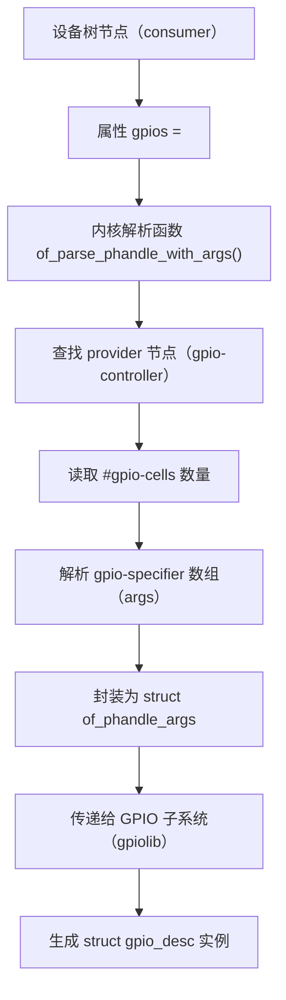
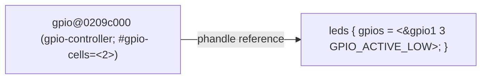
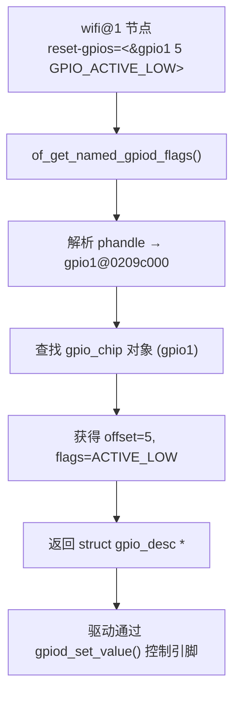
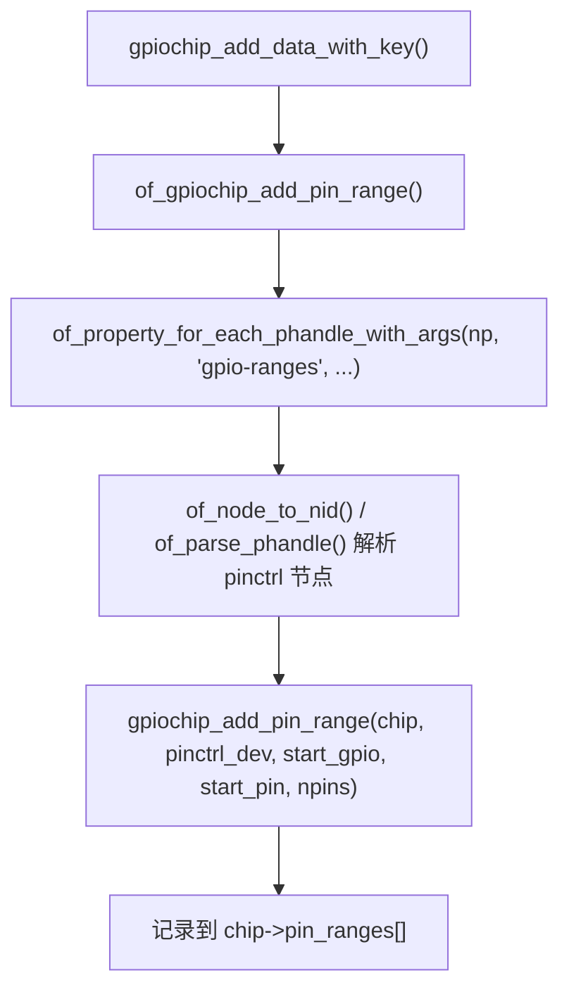
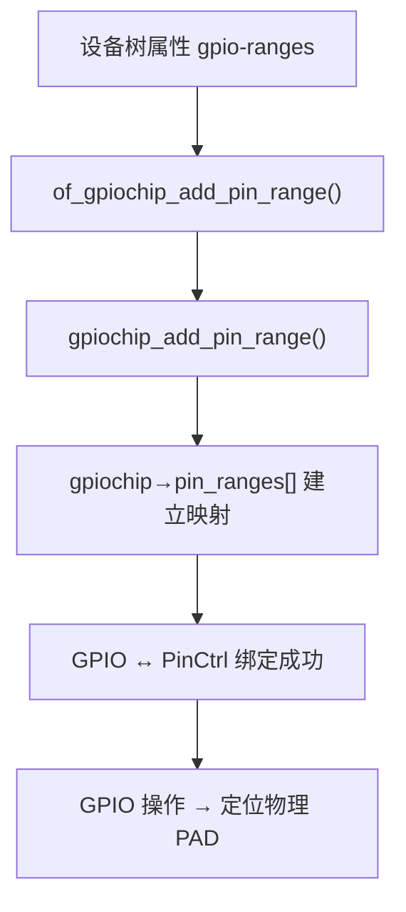

（imx6ull, kernel 6.1为基准）

# 第1章_#gpio-cells

------

## 1.1_1_主题引入

在设备树（Device Tree）中，GPIO 控制器（GPIO Controller）是通过一组标准属性定义的节点。其中最核心的属性之一便是 **`#gpio-cells`** —— 它决定了“消费者（consumer）节点”在引用 GPIO 时，参数应包含多少个单元（cell）以及每个单元的含义。

若没有正确配置该属性，任何 `gpios = <...>` 的引用都会在内核解析阶段失败。它是 GPIO 控制器能否被其他设备正确识别和绑定的关键语法。

------

## 1.2_2_语法定义与基本格式

### 1.2.1_定义位置

`#gpio-cells` 必须定义在 **GPIO 控制器节点** 内部，不能出现在消费者节点中。
 示例如下：

```dts
gpio1: gpio@0209c000 {
    compatible = "fsl,imx6ul-gpio", "fsl,imx35-gpio";
    reg = <0x0209c000 0x4000>;
    gpio-controller;
    #gpio-cells = <2>;
    interrupt-controller;
    #interrupt-cells = <2>;
};
```

### 1.2.2_基本语法格式

```dts
#gpio-cells = <N>;
```

- `N` 为整数，表示每个 GPIO 句柄（phandle）引用时需要携带多少个参数单元。

### 1.2.3_语义解释

| 参数          | 说明                                                         |
| ------------- | ------------------------------------------------------------ |
| `#gpio-cells` | 表示消费者引用时需要提供的附加参数数量                       |
| `<N>`         | 单元数量（cell count），每个单元代表一个数值，用于描述引脚号、电平极性等信息 |

------

## 1.3_3_典型取值与含义

### 1.3.1_N_=_2_最常见模式(Linux_Kernel_通用模型)

大部分 SoC（如 NXP i.MX、TI AM335x、Allwinner、Rockchip）均采用：

```dts
#gpio-cells = <2>;
```

此时引用格式为：

```dts
gpios = <&gpio1 3 GPIO_ACTIVE_LOW>;
```

| 单元序号 | 含义          | 示例值            | 说明                            |
| -------- | ------------- | ----------------- | ------------------------------- |
| 0        | GPIO 引脚编号 | 3                 | 对应控制器内部第 3 号 GPIO line |
| 1        | GPIO 极性标志 | `GPIO_ACTIVE_LOW` | 表示低电平有效                  |

Linux 内核中约定：

- `GPIO_ACTIVE_HIGH`：高电平表示激活；
- `GPIO_ACTIVE_LOW`：低电平表示激活；
- 对应定义位于 `include/dt-bindings/gpio/gpio.h`。

### 1.3.2_N_=_1_极简模型

当平台硬件或驱动默认固定极性时（如所有信号均高电平有效），则仅需提供引脚编号：

```dts
#gpio-cells = <1>;
```

引用：

```dts
gpios = <&gpio1 5>;
```

此时驱动默认认为为 `GPIO_ACTIVE_HIGH`。

### 1.3.3_N_=_3_扩展模型

部分 SoC（如 **ARMv8-A** 某些平台）或 **PMIC 芯片** 需要在描述中包含更多参数，如：

```dts
#gpio-cells = <3>;
```

引用格式：

```dts
gpios = <&gpio3 12 GPIO_ACTIVE_HIGH &gpio_flags>;
```

第三个 cell 可表示：

- 复用功能选择（function）
- 上下拉配置（pull-up/down）
- 电压域或驱动能力等级

这种情况通常由芯片厂商文档定义，并在内核绑定文档中明确说明。

------

## 1.4_4_数据结构视角(内核解析机制)

### 1.4.1_关键结构体关系图



------

### 1.4.2_核心结构体

**内核中用于保存解析结果的结构体：**

```c
struct of_phandle_args {
    struct device_node *np;  // provider 节点指针（即 gpio-controller）
    int args_count;          // #gpio-cells 的数量
    uint32_t args[MAX_PHANDLE_ARGS]; // 对应的参数值数组
};
```

* 其中 `args_count` 就来源于设备树的 `#gpio-cells`。Linux 提供一系列解析接口，以 `of_parse_phandle_with_*` 为前缀。
* 关于 of_phandle_args 参考 [附录 A/struct of_phandle_args](#第6章_struct_of_phandle_args)。


**`of_phandle_args` 在哪里被调用的？**

* 常常在使用它时不是被显式调用，而是调用 `gpiod_*` 通用接口时，附带调用。如在调用 `of_get_named_gpiod_flags()` 时，会在内部调用 `ret = of_parse_phandle_with_args(np, propname, "#gpio-cells", index, &gpiospec);` 获取 `#gpio-cells` 属性。

------

## 1.5_5_开发者视角_编写与解析逻辑

### 1.5.1_控制器侧定义(provider)

在控制器驱动的 `of_xlate` 函数中实现参数解析。例如：

```c
static int imx_gpio_xlate(struct gpio_chip *gc,
                          const struct of_phandle_args *gpiospec, u32 *flags)
{
    unsigned int gpio = gpiospec->args[0];
    unsigned long f = gpiospec->args[1];
    *flags = f;
    return gpio;
}
```

此函数实现了对 `<gpio_number, flags>` 两个单元的解析，对应 `#gpio-cells = <2>`。

### 1.5.2_消费者侧引用(consumer)

消费者节点（例如 LED、按键、复位引脚）通过 phandle 引用：

```dts
leds {
    compatible = "gpio-leds";
    led1 {
        gpios = <&gpio1 3 GPIO_ACTIVE_LOW>;
        default-state = "on";
    };
};
```

* 由内核的 `gpiod_get_from_of_node()` 完成解析，并生成对应的 `struct gpio_desc`。
* 关于 `gpiod_get_from_of_node()` 参考 [附录 B/gpiod_get_from_of_node() 接口详解](#第2章_gpiod_get_from_of_node()_接口详解)。


------

## 1.6_6_用户视角验证与调试

### 1.6.1_查看解析是否正确

```bash
cat /sys/kernel/debug/gpio
```

可查看每个 GPIO 的名称、状态及标志。

### 1.6.2_内核日志

在 `drivers/gpio/gpiolib-of.c` 中可打开调试信息：

```c
pr_debug("parsed GPIO %d from %pOF with flags 0x%x\n",
         gpio, np, flags);
```

### 1.6.3_典型错误信息

若 `#gpio-cells` 未定义或数量不匹配：

```
of_get_named_gpiod_flags: invalid GPIO specifier size (2 vs 3)
```

或：

```
GPIO property size mismatch in node /leds
```

------

## 1.7_7_可视化图示_引用关系



此图表示：
 `leds` 节点通过 `phandle` 引用 `gpio@0209c000` 节点，并提供 2 个参数单元，与控制器定义的 `#gpio-cells=<2>` 对齐。

------

## 1.8_8_调试与验证步骤总结

| 步骤 | 操作                          | 目的                                               |
| ---- | ----------------------------- | -------------------------------------------------- |
| 1    | 检查 `#gpio-cells` 是否定义   | 确认控制器节点配置完整                             |
| 2    | 检查消费者节点参数数量        | 确认 `<phandle args...>` 数量与 `#gpio-cells` 一致 |
| 3    | 查看 `dmesg` 输出             | 捕获 `invalid GPIO specifier` 错误                 |
| 4    | 查看 `/sys/kernel/debug/gpio` | 验证 GPIO 是否正确注册                             |
| 5    | 使用 `libgpiod` 工具操作      | 验证引脚功能是否正常                               |

------

## 1.9_9_小结

| 项目           | 内容                                                        |
| -------------- | ----------------------------------------------------------- |
| 属性名         | `#gpio-cells`                                               |
| 定义位置       | GPIO 控制器节点                                             |
| 数据类型       | `<u32>` 单值                                                |
| 作用           | 指定消费者节点引用 GPIO 时的参数数量                        |
| 常见取值       | `<2>`（标准）、`<1>`（简化）、`<3>`（扩展）                 |
| 与之配套的属性 | `gpio-controller`                                           |
| 驱动接口对应   | `of_parse_phandle_with_args()`、`gpiod_get()`               |
| 调试工具       | `dmesg`, `/sys/kernel/debug/gpio`, `gpiodetect`, `gpioinfo` |

------


# 第2章_\<name\>-gpios/gpio

------

## 2.1_1_主题引入

在设备树中，任何需要使用 GPIO 引脚的外设节点，都必须通过 `<name>-gpios` 或 `gpios` 属性来描述与 GPIO 控制器（provider）的连接关系。

- **provider**：由 `gpio-controller` 属性声明的节点。
- **consumer**：通过 `<name>-gpios` 引用 provider 的节点。

该机制是 Linux GPIO 子系统建立“消费者 → 控制器”映射的唯一入口。内核会在驱动 `probe()` 阶段，通过 `gpiod_get()` / `devm_gpiod_get()` 等接口解析该属性，返回 `struct gpio_desc *`，供驱动直接操作。

------

## 2.2_2_语法格式

### 2.2.1_通用格式

```dts
<name>-gpios = <&gpio-controller offset flags>;
```

### 2.2.2_单_GPIO_情况

```dts
reset-gpios = <&gpio1 3 GPIO_ACTIVE_LOW>;
```

### 2.2.3_多_GPIO_情况

```dts
data-gpios = <&gpio1 3 GPIO_ACTIVE_HIGH>,
              <&gpio1 4 GPIO_ACTIVE_HIGH>,
              <&gpio1 5 GPIO_ACTIVE_HIGH>;
```

### 2.2.4_无命名前缀(历史形式)

```dts
gpios = <&gpio1 6 GPIO_ACTIVE_HIGH>;
```

> 当只有一个 GPIO 且无特定功能名时，历史上允许直接使用 `gpios` 属性。但 **推荐写成 `<name>-gpios`**，语义更清晰，匹配驱动更准确。

------

## 2.3_3_属性字段含义

| 字段               | 含义                               | 示例                                     |
| ------------------ | ---------------------------------- | ---------------------------------------- |
| `&gpio-controller` | 引用目标 GPIO 控制器节点的 phandle | `&gpio1`                                 |
| `offset`           | 引脚号（控制器内部编号，从 0 起）  | `3`                                      |
| `flags`            | 引脚标志位，定义电平有效性和方向   | `GPIO_ACTIVE_LOW`、`GPIO_ACTIVE_HIGH` 等 |

**典型 flag 取值：**

| 标志                                   | 说明                             |
| -------------------------------------- | -------------------------------- |
| `GPIO_ACTIVE_HIGH`                     | 有效电平为高（默认）             |
| `GPIO_ACTIVE_LOW`                      | 有效电平为低                     |
| `GPIO_PULL_UP` / `GPIO_PULL_DOWN`      | 可选，上下拉标志（部分平台扩展） |
| `GPIO_OPEN_DRAIN` / `GPIO_OPEN_SOURCE` | 特殊输出特性（少见）             |

------

## 2.4_4_数据结构视角

### 2.4.1_内核解析入口

位于 `drivers/gpio/gpiolib-of.c`：

```c
struct gpio_desc *of_get_named_gpiod_flags(struct device_node *np,
                                           const char *propname,
                                           int index,
                                           enum of_gpio_flags *flags);
```

解析逻辑：

1. 查找名为 `<propname>` 的属性（如 `"reset-gpios"`）；
2. 获取第 `index` 个单元；
3. 读取引用 phandle → 对应 `struct gpio_chip`；
4. 返回 `gpio_desc *`（GPIO 逻辑描述符）。
5. 详细说明参考 [附录 C/of_get_named_gpiod_flags()](#第1章_of_get_named_gpiod_flags())

驱动侧封装了更简洁的单GPIO版本：

```c
struct gpio_desc *devm_gpiod_get(struct device *dev,
                                 const char *con_id,
                                 enum gpiod_flags flags);
```

> 其中 `con_id` 对应 `<name>`，即属性名前缀部分。例如 `devm_gpiod_get(dev, "reset", GPIOD_OUT_HIGH)` → 查找 `reset-gpios`。
>
> 详细参考 [附录 C/devm_gpiod_get()](#第1章_devm_gpiod_get())

------

## 2.5_5_开发者视角

### 2.5.1_驱动中解析_GPIO

```c
struct gpio_desc *reset_gpio;

reset_gpio = devm_gpiod_get(dev, "reset", GPIOD_OUT_HIGH);
if (IS_ERR(reset_gpio))
    return dev_err_probe(dev, PTR_ERR(reset_gpio), "Failed to get reset GPIO\n");
```

内核自动执行：

1. 定位属性 `"reset-gpios"`；
2. 调用 `of_get_named_gpiod_flags()`；
3. 解析 provider 节点（通过 `phandle`）；
4. 从对应 `gpio_chip` 中获得第 3 号引脚；
5. 设置极性标志为 `GPIO_ACTIVE_LOW`；
6. 返回 `gpio_desc`。

------

### 2.5.2_多_GPIO_数组

驱动可使用：

```c
gpiod_get_array(dev, "data", GPIOD_OUT_LOW);
```

对应 DTS：

```dts
data-gpios = <&gpio1 3 GPIO_ACTIVE_HIGH>,
              <&gpio1 4 GPIO_ACTIVE_HIGH>,
              <&gpio1 5 GPIO_ACTIVE_HIGH>;
```

内核会返回一个 `struct gpio_descs` 数组。

------

### 2.5.3_不写的后果

| 缺失内容                       | 结果                                             |
| ------------------------------ | ------------------------------------------------ |
| 未写 `<name>-gpios`            | 驱动调用 `gpiod_get()` 失败 (`-ENOENT`)          |
| 引用错误的 phandle             | probe 阶段报 `invalid phandle`                   |
| `gpio-controller` 节点不存在   | DTS 编译通过但运行时报 `no such gpio controller` |
| `#gpio-cells` 与参数数量不匹配 | `of_get_named_gpiod_flags()` 报错，GPIO 无法解析 |

------

## 2.6_6_用户视角_DTS_实例

```dts
gpio1: gpio@0209c000 {
    compatible = "fsl,imx6ul-gpio";
    reg = <0x0209c000 0x4000>;
    gpio-controller;
    #gpio-cells = <2>;
    ngpios = <32>;
};

led0: led@0 {
    compatible = "demo,led";
    gpios = <&gpio1 3 GPIO_ACTIVE_LOW>;
    status = "okay";
};

wifi: wifi-module@1 {
    compatible = "vendor,wifi";
    reset-gpios = <&gpio1 5 GPIO_ACTIVE_LOW>;
    enable-gpios = <&gpio1 6 GPIO_ACTIVE_HIGH>;
};
```

| 节点    | 属性                           | 含义                   |
| ------- | ------------------------------ | ---------------------- |
| `led0`  | `gpios`                        | 传统单 GPIO 表达方式   |
| `wifi`  | `reset-gpios` / `enable-gpios` | 同一控制器两个功能引脚 |
| `gpio1` | `gpio-controller`              | provider 控制器        |

------

## 2.7_7_可视化图示

### 2.7.1_Provider_to_Consumer_解析流



------

## 2.8_8_示例代码

### 2.8.1_驱动端(消费者)

```c
// SPDX-License-Identifier: GPL-2.0
#include <linux/module.h>
#include <linux/gpio/consumer.h>
#include <linux/platform_device.h>

struct wifi_dev {
    struct gpio_desc *reset;
    struct gpio_desc *enable;
};

static int wifi_probe(struct platform_device *pdev)
{
    struct wifi_dev *w;
    struct device *dev = &pdev->dev;

    w = devm_kzalloc(dev, sizeof(*w), GFP_KERNEL);
    if (!w) return -ENOMEM;

    w->reset  = devm_gpiod_get(dev, "reset", GPIOD_OUT_HIGH);
    w->enable = devm_gpiod_get(dev, "enable", GPIOD_OUT_LOW);

    if (IS_ERR(w->reset) || IS_ERR(w->enable))
        return dev_err_probe(dev, -EINVAL, "GPIO request failed\n");

    gpiod_set_value_cansleep(w->reset, 0);
    msleep(10);
    gpiod_set_value_cansleep(w->reset, 1);
    gpiod_set_value_cansleep(w->enable, 1);
    dev_info(dev, "WiFi module powered up\n");
    return 0;
}

static const struct of_device_id wifi_match[] = {
    { .compatible = "vendor,wifi" },
    {}
};
MODULE_DEVICE_TABLE(of, wifi_match);

static struct platform_driver wifi_driver = {
    .probe = wifi_probe,
    .driver = {
        .name = "wifi-demo",
        .of_match_table = wifi_match,
    },
};
module_platform_driver(wifi_driver);
MODULE_LICENSE("GPL");
```

驱动加载后：

```
wifi-demo wifi-module@1: WiFi module powered up
```

------

## 2.9_9_调试与验证

| 检查项                 | 命令                                                         | 说明                               |
| ---------------------- | ------------------------------------------------------------ | ---------------------------------- |
| 查看 consumer 引脚绑定 | `cat /sys/kernel/debug/gpio`                                 | 显示 WiFi 的 GPIO 状态             |
| 验证属性存在           | `ls /sys/firmware/devicetree/base/wifi-module@1`             | 查看 `reset-gpios`、`enable-gpios` |
| 驱动日志               | `dmesg                                             | grep wifi-demo` |                                    |
| 手动控制 GPIO          | `echo 0/1 > /sys/class/gpio/gpioN/value`（调试用）           |                                    |

------

## 2.10_10_小结

| 项目       | 说明                                                         |
| ---------- | ------------------------------------------------------------ |
| 属性名     | `<name>-gpios`（推荐） / `gpios`（旧式）                     |
| 属性类型   | `phandle + offset + flags`                                   |
| 作用       | 建立 consumer → provider 的 GPIO 引用关系                    |
| 驱动接口   | `devm_gpiod_get()` / `devm_gpiod_get_array()`                |
| 内核解析链 | `gpiod_get()` → `of_get_named_gpiod_flags()` → `of_parse_phandle_with_args()` |
| 不写后果   | 驱动获取 GPIO 失败 (`-ENOENT`)                               |
| 验证方式   | `/sys/kernel/debug/gpio`、`/proc/device-tree`                |

------


# 第3章_gpio-controller

## 3.1_1_主题引入

`gpio-controller` 是 GPIO 子系统中最核心的设备树属性之一。 它标识一个设备节点具备“**GPIO 控制器功能**”，是系统识别该节点为“GPIO provider（提供者）”的唯一条件。

在 Linux 内核中：

- **带有该属性的节点** 会被 GPIO core 注册为一个 `struct gpio_chip`；
- **未带该属性的节点** 只会被识别为普通外设（consumer），无法供他人引用。

换句话说，没有 `gpio-controller` → 你定义的 GPIO 控制器在系统中“不可见”，任何 `&gpioX` 的引用都会解析失败。

------

## 3.2_2_语法格式

```
gpioX: gpio-controller@address {
    compatible = "vendor,soc-gpio";
    reg = <base_address size>;
    gpio-controller;
    #gpio-cells = <2>;
    ngpios = <32>;
};
```

| 属性                   | 类型           | 必需   | 说明                                    |
| ---------------------- | -------------- | ------ | --------------------------------------- |
| `gpio-controller`      | 空属性（无值） | ✅ 必须 | 声明该节点是 GPIO 控制器                |
| `#gpio-cells`          | 整数           | ✅ 必须 | 定义 consumer 侧引用时参数个数          |
| `ngpios`               | 整数           | 可选   | 指定可用 GPIO 数量                      |
| `reg`                  | 地址区间       | 可选   | 用于内存映射寄存器（SoC GPIO 控制器）   |
| `interrupt-controller` | 空属性         | 可选   | 若控制器还提供中断功能（GPIO-IRQ 复用） |

我是 **GPT-5**。
 下面是对 **设备树属性 `gpio-ranges`** 的系统化讲解，符合你的“书籍章节类”写作标准（含语法、语义、作用、结构关系、示例与内核关联）。

------

# 第4章_gpio-ranges

## 4.1_1_主题引入

在 Linux 内核的 **pin controller（pinctrl）** 与 **GPIO 子系统** 中，`gpio-ranges` 属性用于**建立 GPIO 控制器编号空间与 pin controller 内部 pin 编号空间之间的映射关系**。

它是 **pinctrl 子系统与 GPIO 子系统的交界点**，使得系统能够从逻辑 GPIO 编号找到对应的物理引脚号，从而实现以下功能：

- `gpiod_set_value()` → 定位到对应的物理 pad；
- `gpiochip_add_pin_range()` → 注册 pinctrl 与 gpiochip 的映射；
- `pinmux` 子系统能够进行正确的引脚复用控制。

------

## 4.2_2_属性语法

```dts
gpio-ranges = <&pinctrl N M C>;
```

或可包含多个区段：

```dts
gpio-ranges = <&pinctrl N1 M1 C1>,
              <&pinctrl N2 M2 C2>;
```

------

## 4.3_3_参数语义解释

| 参数         | 含义                               | 类型    | 作用                                    |
| ------------ | ---------------------------------- | ------- | --------------------------------------- |
| `<&pinctrl>` | 引用 pin controller 节点的 phandle | phandle | 指明当前 GPIO 控制器由哪个 pinctrl 控制 |
| `N`          | pinctrl 控制器中的第一个引脚号     | u32     | pin controller 内部 pin 基址            |
| `M`          | 当前 GPIO 控制器的第一个 GPIO 号   | u32     | GPIO 控制器逻辑编号起点                 |
| `C`          | 连续数量                           | u32     | 表示从 N 和 M 开始，共 C 个引脚映射     |

> 换言之：
>
> - pin controller 管理的 pin[N ... N+C-1]
> - 对应 GPIO 控制器的 gpio[M ... M+C-1]

------

## 4.4_4_使用场景与必要性

### 4.4.1_GPIO_控制器必须与_pinctrl_建立映射

- Linux 内核中，GPIO 控制器往往是 SoC 的一部分（例如 i.MX6ULL 的 IOMUXC）。
- 驱动通过 `gpiochip_add_pin_range()` 注册映射表。
- `gpio-ranges` 属性提供该映射信息，使内核知道：**“这个 GPIO 控制器管理的是 pinctrl 中哪一段 pin”**。

### 4.4.2_Pinmux_与_GPIO_的切换依赖该映射

- 在使用 `pinctrl` 配置引脚复用时，pinctrl 子系统需要反查 GPIO 引脚对应的物理 pin。
- 若没有 `gpio-ranges`，`pinctrl` 无法确定 GPIO 的物理 pad，导致：
  - `gpio_direction_input()` / `gpio_direction_output()` 失败；
  - `gpio_request()` 报错；
  - 部分板级复用失效（pinmux 无法生效）。

------

## 4.5_5_驱动层解析机制(开发者视角)

内核中，`gpio-ranges` 的解析主要发生在 **GPIO 控制器注册阶段**：

### 4.5.1_源码路径(Linux_6.1)

- `drivers/gpio/gpiolib-of.c`
- `of_gpiochip_add_pin_range()`

### 4.5.2_调用链



### 4.5.3_内核数据结构

| 结构体               | 关键成员      | 说明                                            |
| -------------------- | ------------- | ----------------------------------------------- |
| `struct gpio_chip`   | `.pin_ranges` | 存放 GPIO 与 pinctrl 之间的映射关系             |
| `struct pinctrl_dev` | `.desc`       | pin 控制器描述，包含 pin_base、npins 等         |
| `struct pinrange`    | `.range`      | 单个区间映射（start_hwirq / start_pin / npins） |

------

## 4.6_6_示例_i.MX6ULL

### 4.6.1_节点定义

```dts
pinctrl: iomuxc@20e0000 {
    compatible = "fsl,imx6ull-iomuxc";
    /* ... */
};

gpio1: gpio@0209c000 {
    compatible = "fsl,imx6ul-gpio";
    reg = <0x0209c000 0x4000>;
    gpio-controller;
    #gpio-cells = <2>;
    gpio-ranges = <&pinctrl 0 0 32>;
    /* pinctrl中的pin[0~31] 对应 gpio1[0~31] */
};
```

解释：

- `&pinctrl`：指向 iomuxc 控制器；
- `0`：在 pinctrl 中的起始 pin；
- `0`：gpio 控制器的第一个引脚编号；
- `32`：映射数量（GPIO1 有 32 根引脚）。

------

## 4.7_7_内核行为验证(注册日志)

加载驱动后，可在内核日志中看到类似输出：

```
gpiochip_add_pin_range(): added pin range 0 -> 0, count 32
pinctrl core: added pinctrl range for gpio1
```

这表示映射生效。

------

## 4.8_8_常见错误与后果(用户视角)

| 问题               | 现象                 | 原因                        |
| ------------------ | -------------------- | --------------------------- |
| 缺少 `gpio-ranges` | pinctrl 无法反查 pin | GPIO 子系统无法定位物理 pad |
| 映射数量错误       | 部分 GPIO 无法使用   | C 值配置错误                |
| 起始偏移错误       | GPIO 控制错误引脚    | N 或 M 错误                 |
| phandle 错误       | probe 阶段解析失败   | &pinctrl 指向错误节点       |

------

## 4.9_9_多控制器映射示例(RK3568)

```dts
pinctrl: pinctrl@fe740000 {
    compatible = "rockchip,rk3568-pinctrl";
    /* ... */
};

gpio0: gpio@fe740000 {
    compatible = "rockchip,gpio-bank";
    gpio-controller;
    #gpio-cells = <2>;
    gpio-ranges = <&pinctrl 0 0 32>;
};

gpio1: gpio@fe750000 {
    compatible = "rockchip,gpio-bank";
    gpio-controller;
    #gpio-cells = <2>;
    gpio-ranges = <&pinctrl 32 0 32>;
};
```

此时：

- `gpio0` 控制 pinctrl[0..31]；
- `gpio1` 控制 pinctrl[32..63]；
- 多个 bank 共享同一个 pinctrl。

------

## 4.10_10_内核验证命令

在目标系统中：

```bash
cat /sys/kernel/debug/gpio
```

输出示例：

```
gpiochip0: GPIOs 0-31, parent: platform/gpio@0209c000, pinctrl range 0-31
gpiochip1: GPIOs 32-63, parent: platform/gpio@020a0000, pinctrl range 32-63
```

说明：`gpio-ranges` 映射已被识别。

------

## 4.11_11_对驱动的影响(开发者视角)

驱动中常用以下操作：

```c
gpio_request();
gpio_direction_output();
```

这些函数内部会通过：

- `gpio_to_desc()` → 找到对应 `gpio_desc`
- `gpio_chip_hwgpio()` → 定位对应物理 pin
- 若注册时已执行 `gpiochip_add_pin_range()`，则能反查到正确 pinctrl 控制器进行配置。

> 否则可能出现：
>
> ```
> pinctrl: failed to lookup the GPIO
> ```
>
> 即 GPIO 未能与 pinctrl 正确映射。

------

## 4.12_12_数据流总结



------

## 4.13_13_小结

| 项目     | 内容                                               |
| -------- | -------------------------------------------------- |
| 属性名   | `gpio-ranges`                                      |
| 定义位置 | GPIO 控制器节点                                    |
| 作用     | 映射 GPIO 控制器编号空间与 pinctrl pin 空间        |
| 典型语法 | `<&pinctrl start_pin start_gpio count>`            |
| 是否必须 | 对 SoC 内部 GPIO 控制器是必须的                    |
| 错误后果 | pinctrl 与 GPIO 子系统脱节，导致 GPIO 无法控制引脚 |
| 解析位置 | `drivers/gpio/gpiolib-of.c`                        |
| 注册接口 | `gpiochip_add_pin_range()`                         |

------

