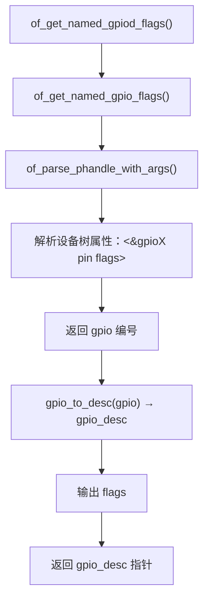
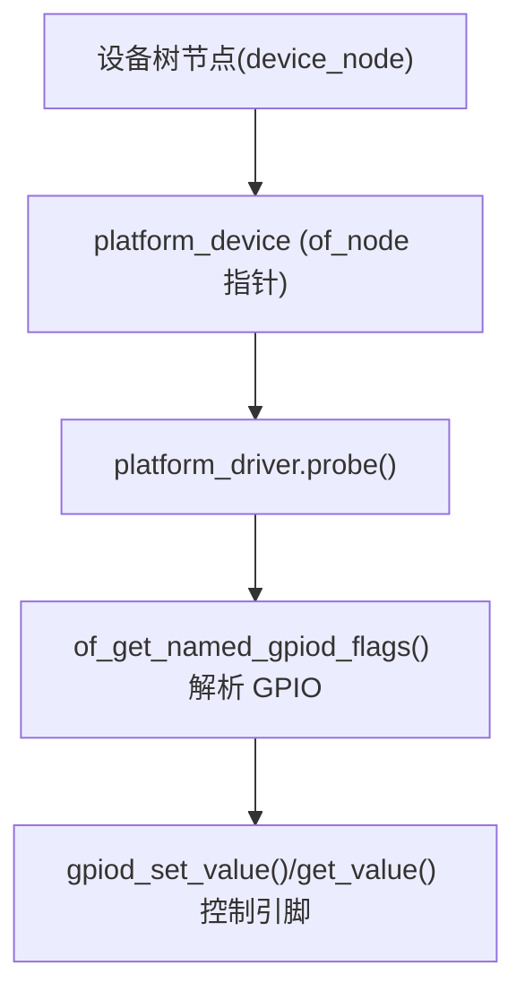

# 第1章_of_get_named_gpiod_flags()

## 1.1_1_主题引入

在 Linux 设备树机制中，GPIO 控制器节点负责描述硬件引脚资源，而外设设备节点通过 GPIO 相关属性（如 `reset-gpios`、`enable-gpios`、`cs-gpios` 等）引用这些引脚。驱动程序需要将设备树中描述的 GPIO 信息解析为内核可操作的结构体（`struct gpio_desc *`），从而控制引脚电平或方向。

`of_get_named_gpiod_flags()` 就是完成这一步的核心函数之一，它从设备树节点中**按属性名读取 GPIO 描述符**，同时解析出 **GPIO 标志位（flags）**。

------

## 1.2_2_函数原型与头文件

```c
#include <linux/of_gpio.h>

struct gpio_desc *of_get_named_gpiod_flags(struct device_node *np,
                                           const char *propname,
                                           int index,
                                           enum of_gpio_flags *flags);
```

------

## 1.3_3_参数说明

| 参数名     | 类型                   | 说明                                                         |
| ---------- | ---------------------- | ------------------------------------------------------------ |
| `np`       | `struct device_node *` | 目标设备节点。通常为驱动中 `pdev->dev.of_node`。             |
| `propname` | `const char *`         | 设备树中描述 GPIO 的属性名，例如 `"reset-gpios"`、`"cs-gpios"`。 |
| `index`    | `int`                  | 当该属性包含多个 GPIO 时，用于指定要获取的第几个（从 0 开始）。 |
| `flags`    | `enum of_gpio_flags *` | 输出参数，返回解析到的 GPIO 标志位，如 `OF_GPIO_ACTIVE_LOW`。可以为 `NULL`。 |

------

## 1.4_4_返回值说明

| 返回值               | 含义                                         |
| -------------------- | -------------------------------------------- |
| `struct gpio_desc *` | 成功返回一个有效的 GPIO 描述符。             |
| `NULL`               | 若属性不存在、解析失败、索引越界或硬件无效。 |

------

## 1.5_5_主要功能

此函数用于：

- 从设备树节点中获取指定属性对应的 GPIO；
- 将设备树中的 **phandle + args** 信息转换为 `gpio_desc`；
- 同时解析该 GPIO 的 **电平有效性标志**（高/低有效、open-drain 等）；
- 为后续 `gpiod_set_value()` / `gpiod_get_value()` 提供统一入口。

------

## 1.6_6_内部调用流程(开发者视角)

以下为函数内部核心执行路径：

```c
of_get_named_gpiod_flags()
 └──> of_get_named_gpio_flags()    // 旧接口（返回 GPIO 编号）
      └──> of_parse_phandle_with_args() // 解析 <&gpioX pin flags>
 └──> gpio_to_desc(gpio)           // 将编号转换为描述符
 └──> 记录 of_gpio_flags 到 *flags // 解析属性的标志位
 └──> 返回 struct gpio_desc *
```

对应的调用关系示意图如下：



------

## 1.7_7_设备树语法与匹配示例

假设设备树如下：

```dts
led@0 {
    compatible = "demo,led";
    status-gpios = <&gpio1 3 GPIO_ACTIVE_LOW>;
};
```

在驱动中获取：

```c
struct device_node *np = pdev->dev.of_node;
enum of_gpio_flags flags;
struct gpio_desc *desc;

desc = of_get_named_gpiod_flags(np, "status-gpios", 0, &flags);
if (!desc)
    return -EINVAL;

if (flags & OF_GPIO_ACTIVE_LOW)
    pr_info("GPIO is active low\n");
```

> 解析结果：
>
> - 控制器：`gpio1`
> - 引脚号：`3`
> - 标志位：`GPIO_ACTIVE_LOW`
> - 对应内核层面 `gpio_desc`，可直接传入 `gpiod_*()` 系列函数。

------

## 1.8_8_与_gpiod_get()_的区别

| 对比项       | of_get_named_gpiod_flags() | gpiod_get()                                 |
| ------------ | -------------------------- | ------------------------------------------- |
| 输入来源     | 直接指定设备节点 + 属性名  | 通过 `struct device` 自动查找对应的设备节点 |
| 适用场景     | 驱动中手动解析 DTS 属性    | 驱动标准化接口，常用于 probe() 内           |
| 返回类型     | `struct gpio_desc *`       | `struct gpio_desc *`                        |
| 是否自动释放 | 否（需手动释放）           | 若使用 `devm_gpiod_get()`，则自动释放       |
| 典型用途     | 内核通用层或特定解析函数中 | 设备驱动标准接口中使用                      |

------

## 1.9_9_flags_标志位取值

`enum of_gpio_flags` 定义于 `include/linux/of_gpio.h`：

```c
enum of_gpio_flags {
    OF_GPIO_ACTIVE_LOW = 0x1,
    OF_GPIO_SINGLE_ENDED = 0x2,
    OF_GPIO_OPEN_DRAIN = 0x4,
    OF_GPIO_TRANSITORY = 0x8,
    OF_GPIO_PULL_UP = 0x10,
    OF_GPIO_PULL_DOWN = 0x20,
};
```

这些标志由设备树 `<flags>` 字段决定，例如：

| DTS 写法                      | 含义       | flags 结果           |
| ----------------------------- | ---------- | -------------------- |
| `<&gpio1 3 GPIO_ACTIVE_LOW>`  | 低电平有效 | `OF_GPIO_ACTIVE_LOW` |
| `<&gpio1 3 GPIO_ACTIVE_HIGH>` | 高电平有效 | `0`                  |
| `<&gpio1 3 GPIO_OPEN_DRAIN>`  | 开漏输出   | `OF_GPIO_OPEN_DRAIN` |

------

## 1.10_10_调用时机(典型用法)

在 **probe() 函数** 中解析 DTS：

```c
static int demo_probe(struct platform_device *pdev)
{
    struct device_node *np = pdev->dev.of_node;
    struct gpio_desc *gpiod;
    enum of_gpio_flags flags;

    gpiod = of_get_named_gpiod_flags(np, "status-gpios", 0, &flags);
    if (!gpiod)
        return -EINVAL;

    gpiod_direction_output(gpiod, 1);
    return 0;
}
```

> 注意：
>
> - 该函数**不会自动申请 GPIO 控制权**，只是解析；
> - 不会自动释放资源；
> - 若想使用 devres 自动管理，应优先用 `devm_gpiod_get()` 或 `gpiod_get()`。

------

## 1.11_11_驱动绑定关系

`of_get_named_gpiod_flags()` 只是**设备树解析层**函数，不涉及驱动匹配。
 通常流程如下：



------

## 1.12_12_调试与验证

### 1.12.1_检查设备树内容

```bash
cat /sys/firmware/devicetree/base/.../status-gpios
```

### 1.12.2_检查_GPIO_映射

```bash
cat /sys/kernel/debug/gpio
```

### 1.12.3_动态验证

```bash
echo 1 > /sys/class/gpio/gpio3/value
```

或内核中打印：

```c
pr_info("gpio = %d, flags = 0x%x\n", desc_to_gpio(desc), flags);
```

------

## 1.13_13_小结

| 项目     | 内容                                     |
| -------- | ---------------------------------------- |
| 函数名   | `of_get_named_gpiod_flags()`             |
| 功能     | 从设备树中按属性名获取 GPIO 描述符与标志 |
| 输入     | 设备节点、属性名、索引号                 |
| 输出     | `gpio_desc *` 与 `flags`                 |
| 特点     | 解析 DTS，不自动管理资源                 |
| 常见替代 | `gpiod_get()`、`devm_gpiod_get()`        |

------

