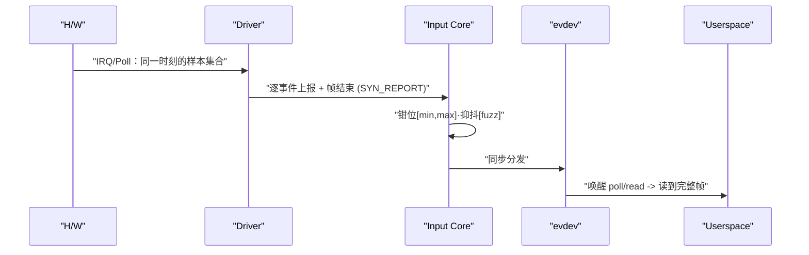

# 第1章_为什么需要_Linux_Input_从问题到最小可跑

## 1.1_引入_/_背景_/_本章目标(以问题为入口)

**现实痛点**

- **噪声与抖动**：触摸停笔 0–1 像素“呼吸”、摇杆机械回中抖动——这些**小步变化要不要上报**？
- **越界与脏数据**：固件偶发异常坐标——**裁剪还是丢弃**？
- **半帧**：多点触摸必须“同一采样时刻一次性交付”，否则上层状态机会乱。
- **多消费者一致性**：桌面、游戏、录屏同时读取，**谁保证顺序与一致**？
- **策略归属**：手势/加速度/死区如果写进驱动会**锁死体验**，分散到应用又**各搞一套**。

**Input 的定位**
 把“人的动作”抽象为**事件帧**并在**内核仅做最小硬约束**：

- 越界**钳位**（`min/max`）；
- 微抖**抑制**（`fuzz`）；
- **帧边界**与同步分发（`SYN_REPORT`）；
- 设备**打开/关闭**与功耗钩子。
   把**手势/加速度/死区/坐标变换**等“手感策略”**明确留给用户态**。

**本章目标**

- 立住**四角色**（硬件/驱动/input core/用户态）心智模型；
- 用“虚拟触摸设备”**先跑起来**，在 `evtest` 看到**帧**；
- 给出**非 devres**与**devres**两版最小模板，为后续 API 深解打底。

------

## 1.2_数据结构视角(不背_API_也能明白)

- **`struct input_dev`**：输入设备对象；你在其上**声明能力**（`evbit/keybit/absbit/propbit`）与**轴参数**（`min/max/fuzz/flat/res`）。
- **帧语义**：一次采样的事件集合以 **`SYN_REPORT`** 结束；多点触控（**MT Protocol B**）还有**槽位（slot）\**与\**MT 帧结束**。
- **轴参数的物理意义**
  - `min/max`：合法工作区，越界**钳位**；
  - `fuzz`：最小可感知变化（单位=该轴单位），**|Δ| ≤ fuzz 不上报**；
  - `flat`：**建议死区**（摇杆常用，触摸通常为 0；由用户态采纳）；
  - `res`：单位分辨率（如 `px/mm`），仅供用户态做物理换算。

------

## 1.3_开发者视角(规则与边界_写对一次_终身不踩坑)

- **规则 A：采集可睡、上报不睡。** I²C/SPI/ADC 采样多需睡眠→放在线程化 IRQ/workqueue；`input_report_*()`/`input_sync()` **不可睡**、IRQ-safe。
- **规则 B：注册前把“物理边界”说清楚。** 设备能力、`min/max/fuzz/flat/res`、`INPUT_PROP_DIRECT` 等必须在注册前一次性声明。
- **规则 C：并发顺序说死。** 关机/休眠：`disable_irq_sync()` → 改电源/状态；读帧 TOCTOU：帧号或“前后检查 data-ready + 有限重读”。

------

## 1.4_用户_/_平台视角(策略为何必须在用户态)

- **统一与可配置**：统一做手势/加速度/死区/坐标变换，体验一致且可调。
- **显示解耦**：旋转/缩放/多屏映射在用户态完成，驱动只上交“干净、低延迟”的帧。
- **可观测与自愈**：用户态可 `EVIOCGABS` 读到 `min/max/fuzz/flat/res`；缓冲溢出时按丢帧提示重同步。

------

## 1.5_可视化图示(结构与时序




------

## 1.6_示例代码(最小按键上报_devres_版)

实验目的：设置按键中断，通过在中断提交的等待队列中读取电平，input模块将电平上报。

### 1.6.1_设备树

```c
demo_key: demo-key@0 {
    compatible = "demo,gpio-key";

    /* 使用 gpio1_18 作为按键输入，低有效（示例） */
    key-gpios = <&gpio1 18 GPIO_ACTIVE_LOW>;

    /* 覆盖键值（可选，不写则默认 KEY_ENTER） */
    linux,code = <KEY_POWER>;

    /* 覆盖去抖时间（可选，不写则默认 10ms） */
    debounce-ms = <10>;
};
```

### 1.6.2_驱动代码

```c
// SPDX-License-Identifier: GPL-2.0
// demo_key_input_devm.c - GPIO 按键 + input（devres 版）
// 需求：双边沿触发；每次触发 10ms 去抖；到期后读取电平并上报稳定态。
// 约定：K&R/tab=4、中文注释、所有“现实语义”均用具名宏（带单位后缀）。

#include <linux/module.h>
#include <linux/platform_device.h>
#include <linux/of_device.h>
#include <linux/of_irq.h>
#include <linux/gpio/consumer.h>
#include <linux/interrupt.h>
#include <linux/input.h>
#include <linux/workqueue.h>
#include <linux/pm_wakeirq.h>

/* ===== 具名宏（单位化）===== */
#define DEMO_DEBOUNCE_10MS    10 /* 去抖时间（毫秒） */
#define DEMO_KEY_CODE_DEFAULT KEY_ENTER
#define DEMO_IRQ_FLAGS        (IRQF_ONESHOT | IRQF_TRIGGER_RISING | IRQF_TRIGGER_FALLING)

/* ===== 设备私有数据 ===== */
struct demo_key {
    struct input_dev *idev;
    struct gpio_desc *gpiod;
    int               irq;

    struct delayed_work dwork;       /* 去抖后的延迟读取任务 */
    unsigned int        debounce_ms; /* 去抖窗口（ms） */
    unsigned int        keycode;     /* 上报的键值 */

    bool state_last; /* 上次稳定态（0=松开，1=按下） */
};

/* ===== 延迟任务：在可睡上下文读取 GPIO 电平并上报稳定态 ===== */
static void
demo_key_read_and_report(struct work_struct *work)
{
    struct demo_key *dk = container_of(to_delayed_work(work), struct demo_key, dwork);
    int level_raw;
    bool pressed;

    /* 在可睡上下文读取（CANSLEEP 版本） */
    level_raw = gpiod_get_value_cansleep(dk->gpiod);

    /* 结合 active-low 语义得到“按下”逻辑态 */
    pressed = gpiod_is_active_low(dk->gpiod) ? level_raw : !level_raw;

    /* 仅当稳定态变化时才上报，避免重复事件扰民 */
    if (pressed != dk->state_last) {
        input_report_key(dk->idev, dk->keycode, pressed);
        input_sync(dk->idev);
        dk->state_last = pressed;
    }
}

/* ===== 中断线程：双边沿触发，每次刷新去抖窗口 ===== */
static irqreturn_t demo_key_irq_thread(int irq, void *data)
{
    struct demo_key *dk = data;

    /* 合并抖动：每次边沿都把延迟任务推后，直到稳定 */
    mod_delayed_work(system_wq, &dk->dwork,
                     msecs_to_jiffies(dk->debounce_ms));
    return IRQ_HANDLED;
}

/* ===== devres 清理钩子：取消延迟任务 ===== */
static void
demo_key_cancel_work(void *data)
{
    struct demo_key *dk = data;

    cancel_delayed_work_sync(&dk->dwork);
}

/* ===== probe：申请 GPIO/IRQ、注册 input 设备 ===== */
static int
demo_key_probe(struct platform_device *pdev)
{
    struct device    *dev = &pdev->dev;
    struct demo_key  *dk;
    struct input_dev *idev;
    unsigned int      val;
    int               err;

    if (!dev->of_node)
        return -EINVAL;

    dk = devm_kzalloc(dev, sizeof(*dk), GFP_KERNEL);
    if (!dk)
        return -ENOMEM;

    /* 1) 获取按键 GPIO（支持 DT: key-gpios = < &gpioX Y GPIO_ACTIVE_{LOW|HIGH} >） */
    dk->gpiod = devm_gpiod_get(dev, "key", GPIOD_IN);
    if (IS_ERR(dk->gpiod))
        return PTR_ERR(dk->gpiod);

    /* 2) 允许 DT 覆盖键值与去抖时间（默认为 10ms、KEY_ENTER） */
    dk->debounce_ms = DEMO_DEBOUNCE_10MS;
    if (!of_property_read_u32(dev->of_node, "debounce-ms", &val))
        dk->debounce_ms = val;

    dk->keycode = DEMO_KEY_CODE_DEFAULT;
    if (!of_property_read_u32(dev->of_node, "linux,code", &val))
        dk->keycode = val;

    /* 3) 分配并注册 input 设备（devres 管理） */
    idev = devm_input_allocate_device(dev);
    if (!idev)
        return -ENOMEM;

    dk->idev         = idev;
    idev->name       = "demo_key_input_devm";
    idev->id.bustype = BUS_HOST;

    /* 声明能力：本设备会上报 dk->keycode 键 */
    input_set_capability(idev, EV_KEY, dk->keycode);

    err = input_register_device(idev);
    if (err)
        return err;

    /* 4) 初始化延迟任务，并把“取消任务”注册为 devres 清理动作 */
    INIT_DELAYED_WORK(&dk->dwork, demo_key_read_and_report);
    err = devm_add_action_or_reset(dev, demo_key_cancel_work, dk);
    if (err)
        return err;

    /* 5) 申请双边沿中断（优先从 GPIO 派生） */
    dk->irq = gpiod_to_irq(dk->gpiod);
    if (dk->irq < 0)
        return dk->irq;

    err = devm_request_threaded_irq(dev, dk->irq,
                                    NULL, /* 无上半部 */
                                    demo_key_irq_thread,
                                    DEMO_IRQ_FLAGS,
                                    "demo_key_irq", dk);
    if (err)
        return err;

    /* 6) 初始化“上次稳定态”，避免首次上报时抖动 */
    {
        int raw        = gpiod_get_value_cansleep(dk->gpiod);
        dk->state_last = gpiod_is_active_low(dk->gpiod) ? raw : !raw;
    }

    /* 可选：作为唤醒源（需要硬件连到可唤醒的中断控制器） */
    device_init_wakeup(dev, true);
    dev_pm_set_wake_irq(dev, dk->irq);

    dev_set_drvdata(dev, dk);
    dev_info(dev, "demo_key: irq=%d, debounce=%ums, code=%u%s\n",
             dk->irq, dk->debounce_ms, dk->keycode,
             gpiod_is_active_low(dk->gpiod) ? ", active-low" : "");

    return 0;
}

static int
demo_key_remove(struct platform_device *pdev)
{
    struct device *dev = &pdev->dev;

    dev_pm_clear_wake_irq(dev);
    device_init_wakeup(dev, false);
    return 0; /* 其他资源由 devres 自动清理 */
}

/* ===== OF 匹配表 ===== */
static const struct of_device_id demo_key_of_match[] = {
    { .compatible = "demo,gpio-key" },
    { /* sentinel */ }
};
MODULE_DEVICE_TABLE(of, demo_key_of_match);

/* ===== 平台驱动描述 ===== */
static struct platform_driver demo_key_driver = {
    .probe  = demo_key_probe,
    .remove = demo_key_remove,
    .driver = {
               .name           = "demo-gpio-key",
               .of_match_table = demo_key_of_match,
               },
};

module_platform_driver(demo_key_driver);

MODULE_LICENSE("GPL");
MODULE_AUTHOR("demo");
MODULE_DESCRIPTION("Devres GPIO key with dual-edge IRQ + 10ms debounce + delayed read");

```

### 1.6.3_C测试代码

```c
// test_demo_key.c - 用户态验证 "GPIO 按键 + input（devres 版）"
// 目标：枚举 /dev/input/event*，匹配设备名或接受 -d 直接指定；
//      使用 poll() 读取 EV_KEY/EV_SYN，按帧打印。

#define _GNU_SOURCE
#include <errno.h>
#include <fcntl.h>
#include <poll.h>
#include <stdbool.h>
#include <stdint.h>
#include <stdio.h>
#include <stdlib.h>
#include <string.h>
#include <sys/ioctl.h>
#include <sys/stat.h>
#include <sys/types.h>
#include <time.h>
#include <unistd.h>

#include <linux/input.h>

/* ===== 具名宏：现实语义一律带单位后缀 ===== */
#define DEMO_DEV_DEFAULT_NAME     "demo_key_input_devm"
#define DEMO_SCAN_EVENT_START     0
#define DEMO_SCAN_EVENT_END       64         /* 扫描 event0..63 */
#define DEMO_NAME_MAX_CHARS       256        /* ioctl 设备名缓存 */
#define DEMO_POLL_TIMEOUT_MS      5000       /* poll 超时（毫秒） */
#define DEMO_READ_BATCH_CNT       16         /* 每次最多读多少个事件 */
#define DEMO_NS_PER_S             1000000000LL

/* ===== 辅助：简单 keycode 名称映射（常用） ===== */
static const char *keycode_name(unsigned code)
{
	switch (code) {
	case KEY_ENTER:     return "KEY_ENTER";
	case KEY_POWER:     return "KEY_POWER";
	case KEY_VOLUMEUP:  return "KEY_VOLUMEUP";
	case KEY_VOLUMEDOWN:return "KEY_VOLUMEDOWN";
	case KEY_MENU:      return "KEY_MENU";
	case KEY_HOME:      return "KEY_HOME";
	case KEY_BACK:      return "KEY_BACK";
	default:            return "KEY_?";
	}
}

/* 毫秒时间戳（单调时钟） */
static uint64_t mono_ms(void)
{
	struct timespec ts;
	clock_gettime(CLOCK_MONOTONIC, &ts);
	return (uint64_t)ts.tv_sec * 1000ULL + ts.tv_nsec / 1000000ULL;
}

/* 查找名字为 DEMO_DEV_DEFAULT_NAME 的 event 设备 */
static int open_device_by_name(const char *want)
{
	char path[64];
	char name[DEMO_NAME_MAX_CHARS];
	int fd, i;

	for (i = DEMO_SCAN_EVENT_START; i < DEMO_SCAN_EVENT_END; i++) {
		snprintf(path, sizeof(path), "/dev/input/event%d", i);
		fd = open(path, O_RDONLY);
		if (fd < 0)
			continue;

		memset(name, 0, sizeof(name));
		if (ioctl(fd, EVIOCGNAME(sizeof(name) - 1), name) < 0) {
			close(fd);
			continue;
		}
		if (strcmp(name, want) == 0) {
			fprintf(stderr, "[INFO] matched \"%s\" at %s\n",
				want, path);
			return fd;
		}
		close(fd);
	}
	return -1;
}

/* 打印一条 input_event（简化，只关心 KEY 与 SYN） */
static void print_event(const struct input_event *ev)
{
	if (ev->type == EV_KEY) {
		const char *name = keycode_name(ev->code);
		const char *st   = ev->value ? "pressed" : "released";
		printf("  EV_KEY  %-12s (%3u)  %-8s  @%ld.%06lds\n",
		       name, ev->code, st,
		       (long)ev->time.tv_sec, (long)ev->time.tv_usec);
	} else if (ev->type == EV_SYN && ev->code == SYN_REPORT) {
		printf("-- SYN_REPORT ------------------------------------\n");
	} else {
		printf("  EV[%04x] code=%u val=%d @%ld.%06lds\n",
		       ev->type, ev->code, ev->value,
		       (long)ev->time.tv_sec, (long)ev->time.tv_usec);
	}
}

/* 用法说明 */
static void usage(const char *argv0)
{
	fprintf(stderr,
		"Usage: %s [-d /dev/input/eventX] [-n devname]\n"
		"  -d  指定设备路径；\n"
		"  -n  指定设备名（默认: \"%s\"）。\n"
		"示例：\n"
		"  sudo %s                     # 自动按名称匹配\n"
		"  sudo %s -d /dev/input/event3\n"
		"  sudo %s -n demo_key_input_devm\n",
		argv0, DEMO_DEV_DEFAULT_NAME, argv0, argv0, argv0);
}

int main(int argc, char **argv)
{
	const char *devpath = NULL;
	const char *devname = DEMO_DEV_DEFAULT_NAME;
	int opt, fd = -1, rc;
	struct pollfd pfd;
	struct input_event ev[DEMO_READ_BATCH_CNT];
	uint64_t t0_ms = mono_ms();

	while ((opt = getopt(argc, argv, "d:n:h")) != -1) {
		switch (opt) {
		case 'd': devpath = optarg; break;
		case 'n': devname = optarg; break;
		default: usage(argv[0]); return 2;
		}
	}

	if (devpath) {
		fd = open(devpath, O_RDONLY);
		if (fd < 0) {
			perror("open devpath");
			return 1;
		}
		fprintf(stderr, "[INFO] open %s ok\n", devpath);
	} else {
		fd = open_device_by_name(devname);
		if (fd < 0) {
			fprintf(stderr,
				"[ERR ] cannot find input device \"%s\"\n",
				devname);
			return 1;
		}
	}

	pfd.fd = fd;
	pfd.events = POLLIN;

	fprintf(stderr, "[INFO] start reading… (poll timeout %d ms)\n",
		DEMO_POLL_TIMEOUT_MS);

	for (;;) {
		rc = poll(&pfd, 1, DEMO_POLL_TIMEOUT_MS);
		if (rc < 0) {
			if (errno == EINTR)
				continue;
			perror("poll");
			break;
		} else if (rc == 0) {
			uint64_t now = mono_ms();
			fprintf(stderr, "[WARN] no events for %llu ms\n",
				(unsigned long long)(now - t0_ms));
			t0_ms = now;
			continue;
		}

		if (pfd.revents & POLLIN) {
			ssize_t n = read(fd, ev, sizeof(ev));
			if (n < 0) {
				perror("read");
				break;
			}
			if (n % sizeof(struct input_event) != 0) {
				fprintf(stderr,
					"[ERR ] partial read: %zd bytes\n", n);
				break;
			}
			size_t cnt = n / sizeof(struct input_event);
			for (size_t i = 0; i < cnt; i++)
				print_event(&ev[i]);
		}
	}

	close(fd);
	return 0;
}

```

### 1.6.4_测试log

```shell
/mnt/nfs/driver # ls
demo_test.out  input_test.ko
/mnt/nfs/driver # insmod input_test.ko
[ 1975.036324] input: demo_key_input_devm as /devices/platform/demo-key@0/input/input4
[ 1975.045189] demo-gpio-key demo-key@0: demo_key: irq=46, debounce=10ms, code=116, active-low
/mnt/nfs/driver # ./demo_test.out
[INFO] matched "demo_key_input_devm" at /dev/input/event1
[INFO] start reading… (poll timeout 5000 ms)
  EV_KEY  KEY_POWER    (116)  pressed   @2001.167874s
-- SYN_REPORT ------------------------------------
  EV_KEY  KEY_POWER    (116)  released  @2001.447926s
-- SYN_REPORT ------------------------------------
  EV_KEY  KEY_POWER    (116)  pressed   @2002.157869s
-- SYN_REPORT ------------------------------------
  EV_KEY  KEY_POWER    (116)  released  @2003.717867s
-- SYN_REPORT ------------------------------------
```


------

## 1.7_调试与验证(最小观测清单)

1. **枚举设备**

```bash
cat /proc/bus/input/devices
```

预期：看到 `demo_hello_input_mt_ndev` 与/或 `demo_hello_input_mt_devm`，并在 `ABS` 列出 `MT_POSITION_X/Y`，`Prop=...DIRECT`。

1. **读取事件（观察帧）**

```bash
sudo evtest /dev/input/eventX
```

预期：三次 `SYN_REPORT`（按下→移动→抬起）；停笔时无 1px 抖动事件（`DEMO_TS_FUZZ_PX=1` 生效）。

1. **读取轴元数据**（与驱动声明一致）

- 通过 `EVIOCGABS(ABS_MT_POSITION_X/Y)` 可见 `min/max/fuzz/flat/res`；应与宏一致。

1. **快速排错口径**

- 慢拖“台阶感” → `*_FUZZ_*` 过大（input core 在丢小变化）。
- 边缘提前顶到头 → `*_MIN/MAX_*` 设窄（input core 在钳位）。
- 看到“半帧” → 上报未严格“先各槽位、再 MT 帧结束、最后 SYN_REPORT”。

------

## 1.8_小结与后续安排

- **一句话**：驱动定义物理边界并交“完整帧”，input core 做硬约束并同步分发，策略全部在用户态。
- **你现在已经**：
  1. 通过 ND/DEVM 两版模板看到了**帧**与 `fuzz` 的效果；
  2. 明确了**注册前声明**与**上报不可睡**两条硬规约。
- **下一章（第 2 章）**：进入 **API 家族总览与“能力/属性声明”**，按“**作用 / 使用场景 / 不写或写错的后果 / 驱动落点**（具名宏示例）”逐条展开：
  - `input_set_capability()` 与位图操作（`evbit/keybit/absbit/propbit`）；
  - `INPUT_PROP_DIRECT/POINTER` 的现实意义与错误配置后果；
  - 最小“能力声明清单”与验证方法。

（本章完）