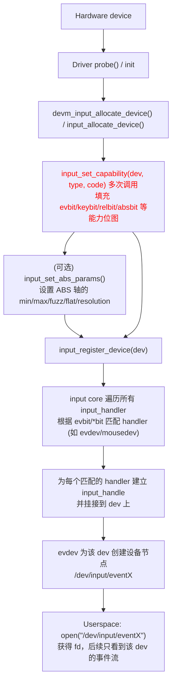
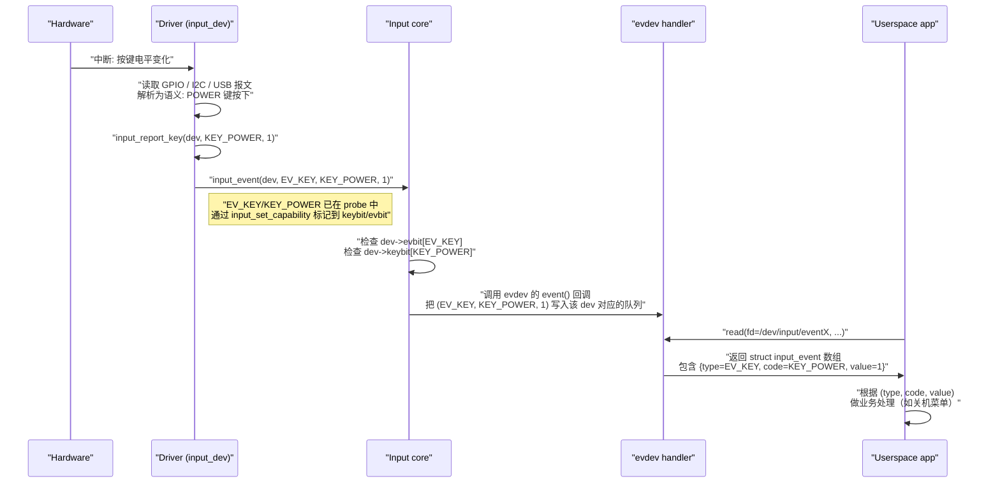
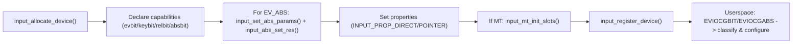

# 第2章_能力与属性声明(input_set_capability()_与位图)

> 章节内容说明：本章从**问题→作用→定位→细节**出发，聚焦“**驱动在注册前如何把‘我会产什么事件’说清楚**”。覆盖 `evbit/keybit/relbit/absbit/propbit` 位图、`input_set_capability()`、`INPUT_PROP_DIRECT/POINTER`、以及与 `input_set_abs_params()`、MT 初始化的**联动关系**。本章给出**可直接嵌入的最小模板**，并提供**验证口径**（`EVIOCGBIT/EVIOCGABS`、`evtest`）。

------

## 2.1_引入_/_背景_/_本章目标(以问题为入口)

**现实问题**

- 用户态只知道 `/dev/input/eventX`，**不知道设备类型**。如何让用户态准确识别“键盘/鼠标/触摸/摇杆”？
- 同一设备既可能上报 `EV_KEY` 又可能上报 `EV_ABS`，**不声明能力**或**声明不全**会导致**事件被丢弃**或被错误分类。
- 触摸屏应被识别为 **DIRECT**（直接作用在显示平面），而鼠标应是 **POINTER**（间接指针）。若**属性位错置**，桌面环境会误配手势与加速度策略。

**本章目标**

- 讲清楚：`input_dev` 中**哪几类位图**承担“能力声明”。
- 规范地使用 `input_set_capability()` 与 `__set_bit()`；何时必须配合 `input_set_abs_params()`、`input_mt_init_slots()`。
- 给出**模板函数**：一行带过“声明键/相对/绝对/属性”的常用组合。
- 会用 `ioctl` 与 `evtest` 验证声明是否生效。

------

## 2.2_数据结构视角(位图与属性位)

- **能力位图（Capabilities bitmaps）**：位于 `struct input_dev` 中，用于**注册前**声明。常用成员：
  - `evbit`：事件类型集合（如 `EV_KEY/EV_REL/EV_ABS/EV_SYN/EV_MSC/EV_SW/...`）。
  - `keybit`：可产生的**键码**集合（如 `KEY_POWER/KEY_ENTER/...`）。
  - `relbit`：可产生的**相对轴**（如 `REL_X/REL_Y/REL_WHEEL/...`）。
  - `absbit`：可产生的**绝对轴**（如 `ABS_X/ABS_Y/ABS_MT_POSITION_X/...`）。
  - `propbit`：**设备属性**集合（如 `INPUT_PROP_DIRECT/INPUT_PROP_POINTER`）。
- **属性位（Properties）**：影响用户态分类：
  - `INPUT_PROP_DIRECT`：直触设备（电容触摸屏、手写板直映显示）。
  - `INPUT_PROP_POINTER`：指针类（鼠标、触控板）。
  - 注：多数直触设备只需设置 **DIRECT**；不要两者同时置位。
- **辅助结构**：
  - `struct input_absinfo`：每条 `EV_ABS` 轴的 `min/max/fuzz/flat/res` 元数据（**必须通过 `input_set_abs_params()` 或等效路径配置**）。
  - MT（多点）需要**额外初始化**：`input_mt_init_slots()` 决定槽位数与 DIRECT/POINTER 语义。

------

## 2.3_开发者视角(_四连问_作用_/_场景_/_不写或写错的后果_/_驱动落点)

### 2.3.1_input_set_capability()

```c
void input_set_capability(struct input_dev *dev, unsigned int type, unsigned int code);
```

- **作用**：同时在 `dev->evbit` 与对应 `*bit`（如 `keybit/relbit/absbit`）置位，表明设备**会产生**某类事件及其**具体 code**。（<span style="color:red">参数 **type** 和 参数 **code** 的值只能说input子系统规定的宏定义，不可以随意创建</span>）。
- **典型场景**：
  - 键设备：`input_set_capability(dev, EV_KEY, KEY_POWER)`。
  - 相对指针：`input_set_capability(dev, EV_REL, REL_X)` / `REL_Y`。
  - 绝对坐标：`input_set_capability(dev, EV_ABS, ABS_X)`……（**注意**：随后**必须**为该轴调用 `input_set_abs_params()` 注入量程与阈值）。
- **不写/写错的后果**：
  - 未声明就上报 → **事件被丢弃**（input core 会忽略未声明的 code）。
  - 只声明 `EV_ABS` 但不设 `absinfo` → 用户态**缺少量程/分辨率**，input core 也无法执行**钳位/抑抖**。
  - 属性位错 → 用户态把直触当鼠标或反之，手势/加速度策略**错配**。
- **驱动落点（顺序约束）**：**注册前**完成：
  1. `input_set_capability()` 声明类型/代码；
  2. 对 `EV_ABS` 轴调用 `input_set_abs_params()` 设置 `min/max/fuzz/flat`；必要时 `input_abs_set_res()`；
  3. 设置 `INPUT_PROP_DIRECT` 或 `INPUT_PROP_POINTER`；
  4. （如为多点）`input_mt_init_slots()`；
  5. `input_register_device()`。

### 2.3.2_set_bit(bit,_dev->propbit/evbit/...)

- **作用**：直接置位，不含“联动”；常用于属性位或一次性启用事件类型。
  - 例：`__set_bit(INPUT_PROP_DIRECT, dev->propbit);`
  - 例：`__set_bit(EV_REP, dev->evbit);`（键盘类重复）
- **注意**：对 `EV_ABS` 轴，仍需 `input_set_abs_params()` 补齐 `absinfo`，否则元数据不全。

### 2.3.3_input_set_capability()_使用说明

提问：

> 根据上述内容，我们已经看到了input_set_capability()参数的使用，但是没有解释它的底层机制是什么，下面将讲解清楚底层机制。

回答：

先把你的几个疑惑拆开回答：

- **它是谁调用？** —— 一般是**设备驱动自己在 probe() 里主动调用**，不是内核在背后“神秘调用”。
- **它的机制是什么？** —— 本质上就是在 `struct input_dev` 里的一堆 **bitmap 字段上置位**，声明“这个设备会产生哪些类型/哪些 code 的事件”。
- **参数只能是内核规定的宏？** —— 对，因为 input 是一套“协议”，事件 type / code 是内核和用户态约定好的**公共命名空间**，你不能随便造。
- **一个 input_dev 只会设置一个类似属性？** —— 不，只要你愿意，一个 `input_dev` 可以设置**很多** capability，比特位是**叠加**的，不是单一属性。

------

#### (1)_驱动里是怎么调用的

典型流程（你以后写自己的 input 驱动基本就这样）：

```c
static int demo_input_probe(struct platform_device *pdev)
{
	struct input_dev *idev;
	int err;

	idev = devm_input_allocate_device(&pdev->dev);
	if (!idev)
		return -ENOMEM;

	idev->name = "demo_buttons";
	idev->id.bustype = BUS_HOST;

	/* 声明它是一个按键设备，支持 KEY_POWER 和 KEY_VOLUMEUP */
	input_set_capability(idev, EV_KEY, KEY_POWER);
	input_set_capability(idev, EV_KEY, KEY_VOLUMEUP);

	/* 如果还有其他类型，比如相对坐标、绝对坐标，也可以继续叠加 */
	// input_set_capability(idev, EV_REL, REL_X);
	// input_set_capability(idev, EV_REL, REL_Y);

	err = input_register_device(idev);
	if (err)
		return err;

	return 0;
}
```

调用点很简单：

- 先 `input_allocate_device()` / `devm_input_allocate_device()`
- 再 **若干次** `input_set_capability()`（或自己手动 set bit）
- 最后 `input_register_device()`

也就是说：**驱动作者明确告诉内核：“我这个设备会产生这些类型/这些 code 的事件。”**

------

#### (2)_input_set_capability_内核内部到底干了啥

看 `struct input_dev`，里面有一堆 bitmap 字段：([kernel.org](https://www.kernel.org/doc/html/v4.17/driver-api/input.html?utm_source=chatgpt.com))

- `evbit[]`：支持的事件类型（EV_KEY / EV_REL / EV_ABS / …）
- `keybit[]`：支持的按键/按钮（KEY_POWER、KEY_A…）
- `relbit[]`：支持的相对轴（REL_X、REL_Y…）
- `absbit[]`：支持的绝对轴（ABS_X、ABS_Y…）
- `swbit[]`：开关类
- `ledbit[]`：LED
- `sndbit[]`：声音
- `ffbit[]`：力反馈
- `propbit[]`：设备属性（INPUT_PROP_DIRECT/POINTER 等）

`input_set_capability()` 的实现大致是这样的（删减 + 口头解释）：([android.googlesource.com](https://android.googlesource.com/kernel/msm.git/%2B/android-msm-hammerhead-3.4-kk-r1/drivers/input/input.c?utm_source=chatgpt.com))

```c
void input_set_capability(struct input_dev *dev,
			  unsigned int type, unsigned int code)
{
	switch (type) {
	case EV_KEY:
		__set_bit(code, dev->keybit);
		break;
	case EV_REL:
		__set_bit(code, dev->relbit);
		break;
	case EV_ABS:
		__set_bit(code, dev->absbit);
		break;
	case EV_MSC:
		__set_bit(code, dev->mscbit);
		break;
	case EV_SW:
		__set_bit(code, dev->swbit);
		break;
	case EV_LED:
		__set_bit(code, dev->ledbit);
		break;
	case EV_SND:
		__set_bit(code, dev->sndbit);
		break;
	case EV_FF:
		__set_bit(code, dev->ffbit);
		break;
	case EV_PWR:
		/* 特殊类型，不设置额外 bit */
		break;
	default:
		/* 打印错误 */
		return;
	}

	/* 最后：把这个 type 也在 evbit 里置位 */
	__set_bit(type, dev->evbit);
}
```

关键点：

- 它**不会覆盖**任何东西，只是往对应 bitmap 里 **OR 一下比特**；
- 调多少次就会多出多少个支持的事件 type+code 组合；
- `dev->evbit` 中记录“支持哪些类型”，每类下面还有子 bitmap（keybit、relbit…）记录“支持该类型下哪些 code”。

所以，`input_dev` **不是“只设置一个属性”**，而是维护一整棵“能力位图”。

------

#### (3)_这些_capability_在哪里用

##### 1)_input_register_device_时匹配_handler

在 `input_register_device()` 里，input core 会遍历所有注册过的 `input_handler`，调用它们的 `match()` 方法，看这个 handler 是否对当前 `input_dev` 感兴趣。`match()` 内一般就是看：

- `dev->evbit` 是否有某些 EV_*；
- 对应的 `keybit/relbit/absbit` 是否有某些 KEY_*/REL_*/ABS_*。([android.googlesource.com](https://android.googlesource.com/kernel/msm.git/%2B/android-msm-hammerhead-3.4-kk-r1/include/linux/input.h?utm_source=chatgpt.com))

例如：

- `mousedev` 可能要求：有 `EV_REL` + `REL_X/REL_Y` + `BTN_LEFT`；
- `joydev` 可能要求：有 `EV_ABS` + 某些 ABS_X/ABS_Y；
- `evdev` 基本对所有设备都能接。

**结论：** capability 直接决定“这个 `input_dev` 会接到哪些上层 handler（evdev/mousedev/joydev 等）”。

##### 2)_用户空间_ioctl_查询能力

用户空间通过 `EVIOCGBIT`、`EVIOCGABS` 等 ioctl，从 `/dev/input/eventX` 中把这些 bitmap 和 abs 参数读出来。内核就是把 `input_dev` 里的 `evbit/keybit/absbit/absinfo` 原样拷给用户。([kernel.org](https://www.kernel.org/doc/html/v4.12/driver-api/input.html?utm_source=chatgpt.com))

你用 `evtest` 时看到的那些“Supported events: EV_KEY …    Event code 116 (KEY_POWER)”就是从这些位图解析出来的。

------

#### (4)_为什么参数只能是内核规定的宏

`EV_*` / `KEY_*` / `REL_*` / `ABS_*` 等宏，其实是**内核 + glibc + libinput + X11/Wayland 等的一套协议常量集合**：([sbexr.rabexc.org](https://sbexr.rabexc.org/latest/sources/a3/b80d6024bd7deb.html?utm_source=chatgpt.com))

- 对内核来说，这些是“不同事件类型/键位/轴”的整数编号；
- 对用户空间来说，`<linux/input.h>` 里同样定义了这些枚举值，用来解析 event 结构体里的 `type` / `code`。

所以：

- 你**不能**随机写一个 `MY_CUSTOM_EVENT = 0x9000` 然后指望用户空间自动识别；
- 如果确实需要私有事件，一般会：
  - 选用已有的“扩展”键值（如 KEY_PROG1…、BTN_TRIGGER_HAPPYx 等），或者
  - 用别的接口（ioctl、sysfs、自定义字符设备）暴露自定义数据。

`input_set_capability()` 只是帮你把这些 **标准常量** 映射成 `input_dev` 的能力位图；它不会创造新的语义。

------

#### (5)_一个_input_dev_会设置多少东西

回到你最后的问题：

> 那么也就是一个 input_dev 它是否只会设置一个类似于属性类型的成员？

明确回答：**不会，一般会设置很多东西，而且分层次：**

1. **事件类型层（type）**
   - `EV_KEY`/`EV_REL`/`EV_ABS`/`EV_SW`/`EV_LED` … → 写在 `evbit[]` 里。
2. **事件 code 层**
   - 按键：`KEY_POWER`、`KEY_VOLUMEUP`、`KEY_ENTER` … → 写在 `keybit[]`。
   - 绝对轴：`ABS_X`、`ABS_Y`、`ABS_PRESSURE` … → 写在 `absbit[]`。
   - 相对轴：`REL_X`、`REL_Y` → 写在 `relbit[]`。([kernel.org](https://www.kernel.org/doc/html/v4.17/driver-api/input.html?utm_source=chatgpt.com))
3. **某些类型的附加参数**
   - 比如 ABS 轴的 `min/max/fuzz/flat/resolution` 保存在 `dev->absinfo[axis]` 中，一般通过 `input_set_abs_params()` 或 `input_abs_set_*()` 设置。([sbexr.rabexc.org](https://sbexr.rabexc.org/latest/sources/a3/b80d6024bd7deb.html?utm_source=chatgpt.com))

另外，`struct input_dev` 还有：

- 当前按键状态 `dev->key[]`（和 `keybit[]` 不同，这是状态位），
- 当前开关/LED 状态 `dev->sw[]` / `dev->led[]`，
- 力反馈设备里的 `struct ff_device *ff` 等。([android.googlesource.com](https://android.googlesource.com/kernel/msm.git/%2B/android-msm-hammerhead-3.4-kk-r1/include/linux/input.h?utm_source=chatgpt.com))

所以可以这样理解（纯技术表述）：

- `input_set_capability()` 配的是**“能力描述”**（这个设备**可能**会产生什么）；
- `input_report_*()` 配的是**“运行时状态”**（此刻**真的**产生了什么事件）。

两者是不同层次的东西，而且一个 `input_dev` 的能力描述通常会包含**几十上百个 code**，远远不止一个“属性成员”。

------

#### (6)_跟你现在的理解对齐一下

你原来的困惑可以这样重述和校正：

1. **“input_set_capability 只是设置一个属性？”**
    → 不是。它是对一堆 bit 的增量置位，可以被调用很多次，构建出整张“能力表”。
2. **“参数只能是宏，所以是不是很死？”**
    → 这些宏本身就是 input 协议的“枚举空间”。你是在告诉内核 & 用户态：“我支持这些标准语义”。
    → 真要搞自定义语义，通常不走 input，而走别的通道。
3. **“机制到底是啥？”**
   → 机制可以总结为两句话：
   - 驱动在 **注册前** 用 `input_set_capability()` 填写 `input_dev` 的能力 bitmap；
   - 内核在 **注册时和运行时** 根据这些 bitmap：
     - 选择合适的 `input_handler` 挂接（mousedev/evdev/joydev 等）；
     - 回答用户空间的能力查询（ioctl/evtest 等）；
     - 过滤/解释事件流。

### 2.3.4_input_set_capability()_参数关系说明

```c
void input_set_capability(struct input_dev *dev, unsigned int type, unsigned int code);
```

**提问：**

> 那么接下来讲解下参数type和code之间的关系，能够让它底层机制透明化？


**回答：**

先给一句“总纲”，然后再拆开：

> 在 Linux input 里，**真正有意义的是三元组 `(type, code, value)`**：
>
> - `type` 决定“这是哪一类事件”（键盘、相对位移、绝对坐标、开关……）
> - `code` 在该类事件内部再细分“是哪一个键/轴/功能”
> - 内核用 `(type, code)` 来**选 bitmap、选语义、选 handler**，用户态也用同一对儿数值来解析事件。([docs.kernel.org](https://docs.kernel.org/input/input.html?utm_source=chatgpt.com))

下面把这两者之间的关系和底层机制完整捋一遍。

------

#### (1)_type_是_事件类别空间

在 `struct input_event` 里，`type` 是一个 16bit 的整数，对应 `EV_*` 宏：([android.googlesource.com](https://android.googlesource.com/kernel/msm/%2B/android-6.0.1_r0.102/include/uapi/linux/input.h?utm_source=chatgpt.com))

```c
struct input_event {
    struct timeval time;
    __u16 type;   /* EV_KEY / EV_REL / EV_ABS / ... */
    __u16 code;   /* KEY_POWER / REL_X / ABS_X / ... */
    __s32 value;  /* 含义随 type&code 不同而不同 */
};
```

常见的 `type` 定义在 `input-event-codes.h`：([developer-docs.wacom.com](https://developer-docs.wacom.com/docs/icbt/linux/kernel-events/kernel-events-basics/?utm_source=chatgpt.com))

- `EV_SYN`     ：同步/边界
- `EV_KEY`     ：键/按钮事件
- `EV_REL`     ：相对量（鼠标位移等）
- `EV_ABS`     ：绝对量（触摸坐标、摇杆轴）
- `EV_SW`      ：开关
- `EV_MSC`     ：杂项
- `EV_LED`     ：LED
- `EV_SND`     ：声音
- `EV_FF`      ：力反馈
- `EV_PWR`     ：电源管理
- ……

内核在 `struct input_dev` 中对应有一组 bitmap：([sbexr.rabexc.org](https://sbexr.rabexc.org/latest/sources/a3/b80d6024bd7deb.html?utm_source=chatgpt.com))

```c
unsigned long evbit[BITS_TO_LONGS(EV_CNT)];
```

这里：

- `EV_CNT` = 可支持的事件类型总数；
- `evbit[type]` 为 1 表示“**这个设备会产生这种类型的事件**”。

所以 **`type` 在 input_dev 里是对 `evbit` 的索引**。

------

#### (2)_code_是_类型内部的子编号

当 `type` 已经确定为某一类之后，`code` 的含义完全由该类决定，分别对应不同的宏空间（也在 `input-event-codes.h` 里）：([docs.kernel.org](https://docs.kernel.org/input/input.html?utm_source=chatgpt.com))

- 若 `type == EV_KEY`：
  - `code` ∈ `[0, KEY_MAX]`，宏为 `KEY_A`、`KEY_ENTER`、`BTN_LEFT` 等
  - 对应 `input_dev->keybit[]` 这块 bitmap
- 若 `type == EV_REL`：
  - `code` 是 `REL_X`、`REL_Y`、`REL_WHEEL`…
  - 对应 `input_dev->relbit[]`
- 若 `type == EV_ABS`：
  - `code` 是 `ABS_X`、`ABS_Y`、`ABS_PRESSURE`…
  - 对应 `input_dev->absbit[]`
- 若 `type == EV_SW`：`SW_LID`、`SW_TABLET_MODE`… → `swbit[]`
- 若 `type == EV_LED`：`LED_NUML`、`LED_CAPSL`… → `ledbit[]`
- 若 `type == EV_SND`：`SND_CLICK` 等 → `sndbit[]`
- 若 `type == EV_FF`：`FF_RUMBLE` 等 → `ffbit[]`

在 `struct input_dev` 里这几块是并列存在的：([sbexr.rabexc.org](https://sbexr.rabexc.org/latest/sources/a3/b80d6024bd7deb.html?utm_source=chatgpt.com))

```c
unsigned long evbit[BITS_TO_LONGS(EV_CNT)];
unsigned long keybit[BITS_TO_LONGS(KEY_CNT)];
unsigned long relbit[BITS_TO_LONGS(REL_CNT)];
unsigned long absbit[BITS_TO_LONGS(ABS_CNT)];
unsigned long swbit[BITS_TO_LONGS(SW_CNT)];
unsigned long ledbit[BITS_TO_LONGS(LED_CNT)];
unsigned long sndbit[BITS_TO_LONGS(SND_CNT)];
unsigned long ffbit[BITS_TO_LONGS(FF_CNT)];
```

**关键关系：**

- `type` 选中“哪一组 bitmap”（keybit / relbit / absbit…），
- `code` 再在该 bitmap 里选中“哪一位”。

因此：

- 数值上 `KEY_ENTER == 28`、`REL_X == 0`、`ABS_X == 0` 互相不会冲突，
- 因为它们不在同一个 bitmap，而是分别在 `keybit[]` / `relbit[]` / `absbit[]` 里。


---

#### (3)_input_set_capability_一次可以设置多个bit类型吗

**提问：**

> input_set_capability 一次可以设置多个bit类型吗？我不是说bit位而是bit组类型。

**回答：**

> **不可以。`input_set_capability()` 一次只能设置“一个 type 对应的一组 bit”**
>  准确说，它一次只会：
>
> - 在 **一个具体子 bitmap**（比如 `keybit` / `relbit` / `absbit` …）里设置一个 bit
> - 然后顺带在 `evbit` 里把这个 `type` 的 bit 置 1
>    它没有“把多个 bit 组一起设置”的模式。

------

#### (4)_input_set_capability(type,_code)_在底层到底做了什么

它的逻辑可以简化理解为两步（伪代码概念化，和内核实现匹配）：([兰德利](https://landley.net/kdocs/Documentation/DocBook/xhtml-nochunks/device-drivers.html?utm_source=chatgpt.com))

```c
void input_set_capability(struct input_dev *dev,
			  unsigned int type, unsigned int code)
{
	switch (type) {
	case EV_KEY:
		__set_bit(code, dev->keybit);
		break;
	case EV_REL:
		__set_bit(code, dev->relbit);
		break;
	case EV_ABS:
		__set_bit(code, dev->absbit);
		break;
	/* 其他 EV_* 对应各自 bitmap */
	}

	/* 最后别忘了把事件类型本身也标记为支持 */
	__set_bit(type, dev->evbit);
}
```

所以：

1. 根据 `type` 选中那一块 bitmap（keybit / relbit / absbit …）；
2. 用 `code` 在里面设一位；
3. 再用 `type` 把 `evbit[type]` 设 1。

**`type` 和 `code` 在这里的关系：**

- `type` 决定“写哪一块 capability bitmap”；
- `code` 决定“在这一块里面哪一位被置 1”；
- `type` 自己再作为一个 bit 写回 `evbit[]`。

------

#### (5)_运行时上报事件时_type_和_code_又如何配合

##### 1)_报告事件_input_report_*_to_input_event

内核有一堆内联函数：([sbexr.rabexc.org](https://sbexr.rabexc.org/latest/sources/a3/b80d6024bd7deb.html?utm_source=chatgpt.com))

```c
static inline void input_report_key(struct input_dev *dev,
				    unsigned int code, int value)
{
	input_event(dev, EV_KEY, code, !!value);
}

static inline void input_report_rel(struct input_dev *dev,
				    unsigned int code, int value)
{
	input_event(dev, EV_REL, code, value);
}

static inline void input_report_abs(struct input_dev *dev,
				    unsigned int code, int value)
{
	input_event(dev, EV_ABS, code, value);
}
```

这里：

- `input_report_key()` 帮你自动填好 `type = EV_KEY`，你只给 `code = KEY_*`。
- `input_report_rel()` 自动填 `EV_REL`，`code = REL_*`。
- ……

然后统一走 `input_event(dev, type, code, value)`：

1. **可选检查**：有些路径会检查 `dev->evbit[type]`、`对应 bitmap[code]` 是否支持，如果不支持可以丢弃或报 debug。
2. 把这条事件 push 到 input core 队列；
3. 依次调用挂在 `input_dev` 上的所有 `input_handler` 的 `event()` 回调（evdev/mousedev/joydev 等）。([docs.kernel.org](https://docs.kernel.org/driver-api/input.html?utm_source=chatgpt.com))

所以事件的“语义身份”是这一对 `(type, code)` ：

- `EV_KEY + KEY_POWER` 表示“电源键事件”；
- `EV_ABS + ABS_X` 表示“X 轴绝对坐标”；
- `EV_SW + SW_LID` 表示“笔记本盖子开关状态”；

只是再加上第三个值 `value` 才构成完整的一条 input_event。

##### 2)_用户态看到的也是_(type,_code,_value)

`/dev/input/eventX` 读出来的就是 `struct input_event` 数组；用户空间的头文件也是同一套宏：([android.googlesource.com](https://android.googlesource.com/kernel/msm/%2B/android-6.0.1_r0.102/include/uapi/linux/input.h?utm_source=chatgpt.com))

- `type` == `EV_KEY` / `EV_REL` / `EV_ABS` …
- `code` == `KEY_*` / `REL_*` / `ABS_*` …
- `value`：按键按下/抬起，坐标数字，开关 ON/OFF，等等。

用户空间的 `evtest`、`libinput`、X/Wayland drivers 全都用这套 `(type, code, value)` 协议。

------

#### (6)_handler/驱动层面如何利用这对_(type,_code)

##### 1)_handler_挂接时看_capability(只看位图)

当你 `input_register_device(dev)` 时，input core 会遍历所有 `input_handler`：([docs.kernel.org](https://docs.kernel.org/driver-api/input.html?utm_source=chatgpt.com))

- 调 handler 的 `match()`，典型写法是根据 `evbit` / `keybit` / `relbit` 等判断设备是否“像键盘/像鼠标/像手柄”。
- 例如鼠标 handler 可能要求：
  - `evbit` 里必须有 `EV_REL`；
  - `relbit` 里有 `REL_X` 和 `REL_Y`；
  - `keybit` 里有 `BTN_LEFT`、`BTN_RIGHT` 等。

这里 handler 只关心 **“哪一位被置 1”**，也就是 `type` + `code` 的 capability 组合。

##### 2)_handler_收到事件时看_(type,_code)

收到 `input_event(dev, type, code, value)` 后，handler 的 `event()` 会再次用 `(type, code)`：

- 判断这是自己关心的类别（比如某 handler 只关心 `EV_KEY` 和 `EV_SW`）；
- 决定怎么翻译到自己内部的逻辑，比如：
  - `EV_KEY + KEY_LEFTCTRL` → 记录 Ctrl 状态；
  - `EV_ABS + ABS_X` → 更新光标 X 坐标；

**所以：**

- `type` 决定“走哪个大类处理逻辑”；
- `code` 决定“该类逻辑内部的具体分支”。

------

#### (7)_把关系总结成一句话

你可以把 **`type` 和 `code` 的关系**在脑子里固定成下面这句话（没有比喻，只是定义）：

> 对同一个 input_dev：
>
> - `type` 在 `evbit[]` 里选择一类事件；
> - 在该类事件对应的 bitmap（keybit/relbit/absbit/…）上，`code` 再进一步选出一个具体能力位；
> - 上报事件时，`input_event(dev, type, code, value)` 用同一对 `(type, code)`，在 input core 和 handler 中贯穿始终。


---

### 2.3.5_input子系统框架说明

下面用**一个流程图（初始化/注册）+ 一个时序图（事件上报）**，把你关心的 *input 运行框架* 和 `input_set_capability()`、`type/code`、多设备不冲突等问题完整串起来。

------

#### (1)_整体逻辑先压成三句话

1. **驱动在 probe 阶段：**
    分配 `input_dev` → 用 `input_set_capability()` 填能力位图（`evbit`/`keybit`/`relbit`/`absbit` …）→ `input_register_device()` 注册。
2. **input core：**
    根据能力位图匹配 `input_handler`（如 `evdev`）→ 为每个 `input_dev` 创建自己的 `/dev/input/eventX` 和事件队列。
3. **运行时：**
    驱动用 `input_report_*()` → `input_event(dev, type, code, value)` → input core 转发给绑定在 *该 dev* 上的 handler → 对应的 `/dev/input/eventX` → 用户态通过 **打开的 fd** 读取各自设备的事件流。

------

#### (2)_初始化/注册流程图_input_set_capability()_的位置



**这张图回答的核心问题：**

- `input_set_capability()` **只在 probe/init 阶段**工作，作用是：
  - 根据 `(type, code)` 在 `keybit/relbit/absbit/...` 中置位；
  - 在 `evbit` 中为对应 `type` 置位；
- 这些能力信息被 input core 用来：
  - 决定给这个 `input_dev` 挂哪些 handler（`evdev` 等）；
  - 决定给它创建哪些 `/dev/input/*` 设备节点；
- **每个 `input_dev` 拥有自己的一套位图 & 自己的设备节点**，不会因为另一个驱动也用了同样的 `(EV_KEY, KEY_POWER)` 就发生冲突。

------

#### (3)_事件上报时序图_type/code_怎么一路传到用户态

下面这张时序图描述“**一次按键事件** 从硬件到用户程序”的完整路径：



**从图里可以看到：**

- `type` / `code` 是协议层面的“事件身份”：
  - 驱动在 probe 阶段用 `input_set_capability()` 静态声明“我会产生哪些 `(type, code)`”；
  - 运行时用 `input_report_*()` / `input_event()` 动态发出“这次事件是哪一个 `(type, code)`，value 是多少”。
- input core 与 evdev 完全靠 `(type, code)` 确定语义和路由：
  - `EV_KEY + KEY_POWER` → “Power 键事件”；
  - `EV_ABS + ABS_X` → “X 绝对坐标”；
  - 但这些都被绑定在“**这个 dev 实例**”上。
- 用户态通过 `fd` 区分设备：
  - `open("/dev/input/event3")` → 只读到 devA 的事件流；
  - `open("/dev/input/event4")` → 只读到 devB 的事件流；
  - 即使两个 dev 都有 `EV_KEY + KEY_POWER` 能力，也只是说明：
     “这两个设备都会产生‘Power 键’这种标准语义”，**不会在内核里互相覆盖或冲突**。

------

#### (4)_把_input_运行框架_再压缩成一个工程视角总结

你可以直接这样记（或者当成文档里的概述段落）：

1. **能力阶段（静态）：**
    驱动在 `probe()` 中分配 `input_dev`，通过 `input_set_capability(dev, type, code)` 和 `input_set_abs_params()` 等接口，为该 `input_dev` 填写能力位图（`evbit/keybit/relbit/absbit/...`），然后调用 `input_register_device()`。input core 根据这些能力位图为每个 `input_dev` 选择合适的 `input_handler`（如 `evdev`），并为每个设备实例创建独立的 `/dev/input/eventX` 节点和事件队列。
2. **事件阶段（动态）：**
    硬件状态变化时，驱动用 `input_report_key()` / `input_report_abs()` / `input_report_rel()` 等接口，将事件编码为统一的 `(type, code, value)`，通过 `input_event()` 提交给 input core。input core 按设备实例将事件分发给挂接在该 `input_dev` 上的所有 handler；其中 `evdev` handler 负责把这些事件转换为 `struct input_event` 数组，供对应的 `/dev/input/eventX` 字符设备节点上的 `read()` 返回。
3. **用户态视角：**
    用户程序通过 `open("/dev/input/eventX")` 获得一个 fd，后续 `read()` 只会看到该设备实例的事件序列。不同的 input 设备，即使声明了完全相同的 `(type, code)` 能力（例如都支持 `EV_KEY + KEY_POWER`），也分别对应不同的 `input_dev`、不同的事件队列和不同的 `/dev/input/eventX`，不会在内核中造成冲突。用户通过选择打开哪一个 `eventX`，自然完成对不同设备事件流的分离。


------

## 2.4_用户_/_平台视角(声明如何被用户态消费)

- `evdev` 通过 `EVIOCGBIT`/`EVIOCGABS` 暴露**能力**与**轴元数据**；桌面堆栈（如 libinput）据此**分类**设备、选择**策略**（手势、加速度、死区、坐标映射）。
- 误置属性位（DIRECT/POINTER）会导致错误策略（如直触被当成相对指针，发生意外加速度/加速度曲线）。
- `EV_REP`（重复）通常由键盘路径使用；触摸/开关不应设置。重复参数（延迟/周期）可由用户态通过 `EVIOCSREP` 或上层策略配置。

------

## 2.5_可视化图示(注册前声明路径)



------

## 2.6_示例代码(可直接复用的声明模板)

> 说明：以下均为**可嵌入函数**，在 `probe()` 或初始化阶段调用；**注册前**完成。

### 2.6.1_键设备能力声明(含可选自动重复)

```c
/* SPDX-License-Identifier: GPL-2.0 */
/* demo_caps_keys.h - 键设备能力声明模板（K&R/tab=4，具名宏） */

#pragma once
#include <linux/input.h>

/* 具名宏（键码本身无需单位；时间/频率必须带单位宏） */
#define DEMO_KEY_PRIMARY_CODE		KEY_POWER
#define DEMO_KEY_SECONDARY_CODE		KEY_VOLUMEUP
#define DEMO_ENABLE_KEY_REPEAT		0	/* 键盘类可置 1；按键/开关置 0 */

static inline int demo_setup_caps_keys(struct input_dev *idev)
{
	/* 声明本设备会上报哪些 key */
	input_set_capability(idev, EV_KEY, DEMO_KEY_PRIMARY_CODE);
	input_set_capability(idev, EV_KEY, DEMO_KEY_SECONDARY_CODE);

	/* 如需重复（键盘路径），开放 EV_REP 类型 */
#if DEMO_ENABLE_KEY_REPEAT
	__set_bit(EV_REP, idev->evbit);
#endif
	return 0;
}
```

### 2.6.2_触摸(单点或多点)能力与属性声明

```c
/* SPDX-License-Identifier: GPL-2.0 */
/* demo_caps_touch.h - 触摸能力与属性声明模板（含 MT-B） */

#pragma once
#include <linux/input.h>
#include <linux/input/mt.h>

/* 具名宏（单位化） */
#define DEMO_TS_X_MIN_PX		0
#define DEMO_TS_X_MAX_PX		799
#define DEMO_TS_Y_MIN_PX		0
#define DEMO_TS_Y_MAX_PX		479
#define DEMO_TS_FUZZ_PX		1
#define DEMO_TS_FLAT_PX		0
#define DEMO_TS_RES_X_PX_PER_MM	5
#define DEMO_TS_RES_Y_PX_PER_MM	5
#define DEMO_TS_SLOTS			10	/* MT-B 槽位数 */

static inline int demo_setup_caps_touch_mt(struct input_dev *idev)
{
	int err;

	/* 直触设备属性（不要与 POINTER 同时设置） */
	__set_bit(INPUT_PROP_DIRECT, idev->propbit);

	/* MT-B 槽位初始化（DIRECT 语义） */
	err = input_mt_init_slots(idev, DEMO_TS_SLOTS, INPUT_MT_DIRECT);
	if (err)
		return err;

	/* 声明绝对轴（必须随后设置 absinfo） */
	input_set_capability(idev, EV_ABS, ABS_MT_POSITION_X);
	input_set_capability(idev, EV_ABS, ABS_MT_POSITION_Y);

	input_set_abs_params(idev, ABS_MT_POSITION_X,
			     DEMO_TS_X_MIN_PX, DEMO_TS_X_MAX_PX,
			     DEMO_TS_FUZZ_PX, DEMO_TS_FLAT_PX);
	input_set_abs_params(idev, ABS_MT_POSITION_Y,
			     DEMO_TS_Y_MIN_PX, DEMO_TS_Y_MAX_PX,
			     DEMO_TS_FUZZ_PX, DEMO_TS_FLAT_PX);

	input_abs_set_res(idev, ABS_MT_POSITION_X, DEMO_TS_RES_X_PX_PER_MM);
	input_abs_set_res(idev, ABS_MT_POSITION_Y, DEMO_TS_RES_Y_PX_PER_MM);

	return 0;
}

/* 若仅单点：使用 ABS_X/ABS_Y + BTN_TOUCH，并仍然设置 DIRECT */
static inline int demo_setup_caps_touch_st(struct input_dev *idev)
{
	__set_bit(INPUT_PROP_DIRECT, idev->propbit);

	input_set_capability(idev, EV_KEY, BTN_TOUCH);
	input_set_capability(idev, EV_ABS, ABS_X);
	input_set_capability(idev, EV_ABS, ABS_Y);

	input_set_abs_params(idev, ABS_X,
			     DEMO_TS_X_MIN_PX, DEMO_TS_X_MAX_PX,
			     DEMO_TS_FUZZ_PX, DEMO_TS_FLAT_PX);
	input_set_abs_params(idev, ABS_Y,
			     DEMO_TS_Y_MIN_PX, DEMO_TS_Y_MAX_PX,
			     DEMO_TS_FUZZ_PX, DEMO_TS_FLAT_PX);

	input_abs_set_res(idev, ABS_X, DEMO_TS_RES_X_PX_PER_MM);
	input_abs_set_res(idev, ABS_Y, DEMO_TS_RES_Y_PX_PER_MM);
	return 0;
}
```

### 2.6.3_相对指针(鼠标类)能力声明

```c
/* SPDX-License-Identifier: GPL-2.0 */
/* demo_caps_mouse.h - 相对指针能力声明模板 */

#pragma once
#include <linux/input.h>

static inline int demo_setup_caps_mouse(struct input_dev *idev)
{
	/* 指针类属性（不要与 DIRECT 同时设置） */
	__set_bit(INPUT_PROP_POINTER, idev->propbit);

	/* 相对轴与常见按钮 */
	input_set_capability(idev, EV_REL, REL_X);
	input_set_capability(idev, EV_REL, REL_Y);
	input_set_capability(idev, EV_REL, REL_WHEEL);

	input_set_capability(idev, EV_KEY, BTN_LEFT);
	input_set_capability(idev, EV_KEY, BTN_RIGHT);
	input_set_capability(idev, EV_KEY, BTN_MIDDLE);

	return 0;
}
```

------

## 2.7_调试与验证(命令与预期)

1. **列出能力位图**（`EVIOCGBIT`，`evtest` 已内置显示）

   ```bash
   sudo evtest /dev/input/eventX
   ```

   观察 `Supported events:` 与 `Properties:` 部分：

   - 触摸（MT-B）应显示 `Event type 3 (EV_ABS)` 下的 `ABS_MT_POSITION_X/Y`，`Properties: direct`。
   - 键设备应显示 `Event type 1 (EV_KEY)` 下包含你的键码；如启用 `EV_REP`，还会显示 `Event type 20 (EV_REP)`。

2. **读取轴元数据**（`EVIOCGABS`）

   - 触摸：`ABS_MT_POSITION_X/Y` 的 `min/max/fuzz/flat/res` 应与驱动宏一致。

3. **错误姿势的直观表现**

   - 忘记 `INPUT_PROP_DIRECT`：桌面把触摸当鼠标，出现意外“加速度/指针加速”。
   - 声明了 `EV_ABS` 但未 `input_set_abs_params()`：`evtest` 无法显示量程；用户态失去单位换算，且内核端**无法钳位/抑抖**。
   - `register` 之后再改位图：**无效**（注册后能力固定），上层看不到变更。

4. **快速自检表**

   - 是否在 **注册前**声明完所有能力与属性？
   - 所有 `EV_ABS` 轴是否都设置了 `min/max/fuzz/flat` 与 `res`（如需要）？
   - 触摸/鼠标的 `DIRECT/POINTER` 是否互斥且正确？

------

## 2.8_小结

- **本质**：能力与属性声明是**驱动对系统的“契约”**——“我会产哪些事件、这些事件的物理边界与单位是什么、我属于直触还是指针”。
- **执行要点**：
  1. `input_set_capability()` 声明类型与 code；
  2. 所有 `EV_ABS` 轴**必须**用 `input_set_abs_params()` 注入 `absinfo`；
  3. 正确设置 `INPUT_PROP_DIRECT/POINTER`；
  4. 多点触控必须 `input_mt_init_slots()`；
  5. 以上**均在注册前**完成。