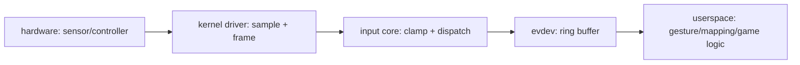
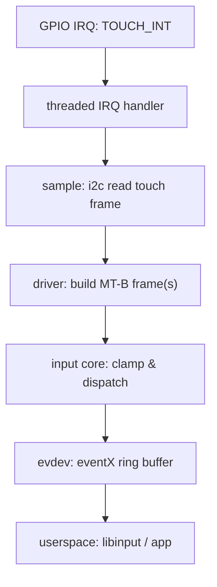
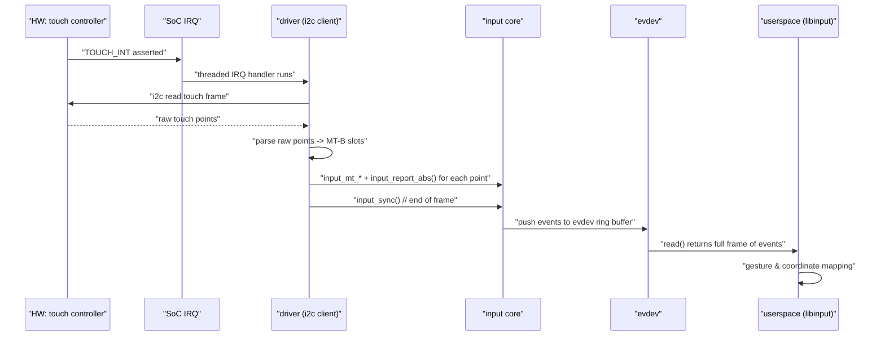
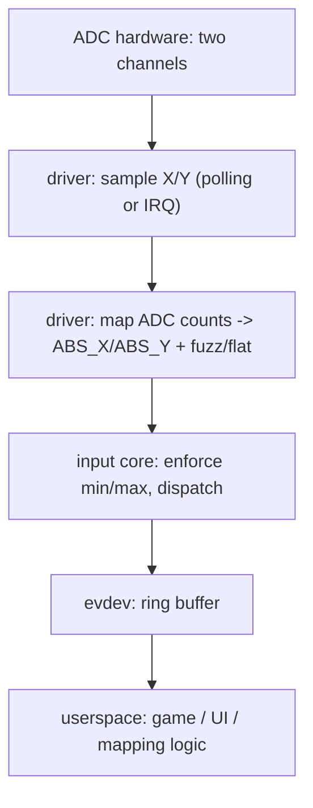
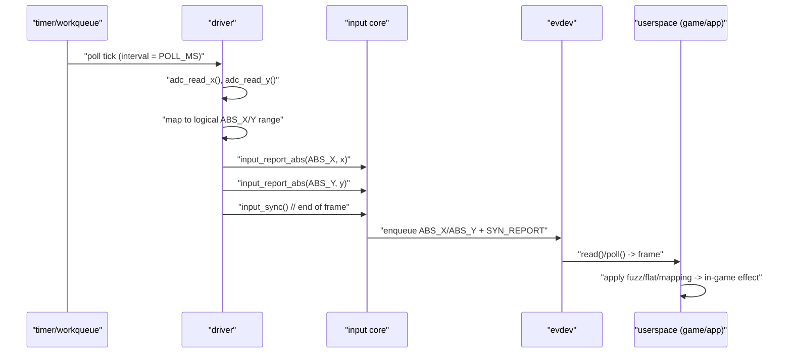

# 第4章_两条完整流水线_触摸屏与摇杆的端到端路径

> **章节内容说明**
>  本章从“**问题→作用→定位→细节**”的视角，把第 3 章的 Hello, Input 模板扩展为两条真实场景的完整流水线：
>
> - **LCD 电容触摸屏**（I²C、多点、DIRECT）；
> - **ADC 双轴摇杆**（轮询/阈值中断）。
>
> 本批次先聚焦触摸屏这条流水线，讲清楚：
>
> - 噪声、越界、同帧一致、多消费者等问题“到底落在哪一层解决”；
> - `min/max/fuzz/res` + 帧语义如何在流水线中发挥作用；
> - 驱动只做“取样 + 成帧 + 声明边界”，手势与坐标变换留给用户态。

------

## 4.1_场景总览_两条流水线的共性与差异

### 4.1.1_是什么_两条流水线的抽象模型

本章讨论的两条流水线可以抽象为同一结构：



- **LCD 电容触摸屏**：
  - HW = 触摸控制器（I²C 挂接，内部有采样与滤波）；
  - DRV = I²C client 驱动，线程化 IRQ 中读出原始点集，成帧上报 `EV_ABS + EV_KEY`；
  - UAPP = 通常是 `libinput` → Wayland/Qt/游戏引擎。
- **ADC 双轴摇杆**：
  - HW = 带机械回中、抖动的电位器 + ADC；
  - DRV = ADC client / 轮询/阈值中断驱动，成帧上报 `EV_ABS`；
  - UAPP = 游戏、UI 控件等。

**共性：**

- 都输出**连续数值**（ABS 轴）和可能的按键事件；
- 需要处理噪声、越界、帧一致性、多消费者等问题；
- 都应该通过 **`min/max/fuzz/flat/res` + 帧语义** 来表达边界和特性。

**差异：**

- 触摸屏通常是 **多点、多手指、复杂手势** → 用户态策略重；
- 摇杆通常只有 **少量轴 + 机械特性明显** → `fuzz` / `flat` 设计更突出。

------

### 4.1.2_干什么_这两条流水线要解决的典型问题

以触摸屏为例，常见问题包括：

1. **噪声**：
   - 静止时坐标在某个小范围内抖动；
   - 手指放上不动，报点仍在抖。
2. **越界**：
   - 控制器硬件输出的 X/Y 超出了屏幕逻辑范围；
   - 面板边缘附近出现“虚点”。
3. **同帧一致性**：
   - 一帧内多个点的坐标必须是同一时刻的快照；
   - 不能出现“X 是旧的，Y 是新的”。
4. **多消费者**：
   - evdev 节点被多个进程打开；
   - 一部分用于系统 GUI，一部分用于手势识别或录制。

对于 ADC 摇杆，则重点在：

- 机械回中抖动；
- 中心死区（flat）；
- 行程两端的非线性和噪声。

**本章的核心目标：**

> 明确：上述问题**在哪一层解决**、需要驱动做什么、哪些交给用户态。

------

### 4.1.3_怎么实现_统一的_问题_to_落点_映射

以 LCD 触摸屏流水线为例，我们先给出一张“问题 → 落点”表：

| 问题           | 推荐解决层    | 驱动需要做的事情                            | 用户态要做的事情                    |
| -------------- | ------------- | ------------------------------------------- | ----------------------------------- |
| 噪声           | 主要在用户态  | 驱动提供稳定采样 + 正确 `fuzz` 建议值       | 滤波、平滑、手势识别                |
| 越界           | 驱动 + core   | 驱动保证基本范围；core 按 `min/max` 钳位    | 剩余坐标变换与裁剪                  |
| 同帧一致性     | 驱动          | 一次中断采一帧点集 → 同一 `SYN_REPORT` 提交 | 按帧消费事件                        |
| 多消费者       | 内核 + 用户态 | input core + evdev 提供多读者；驱动无需区分 | 用户态决定如何使用事件              |
| 手势与坐标变换 | 用户态        | 驱动只声明 `min/max/res` 与原始坐标         | libinput / 应用做缩放、旋转、归一化 |

接下来用一整节（4.2）专门展开“LCD 电容触摸屏”这条流水线。

------

## 4.2_LCD_电容触摸屏流水线(I²C_多点_DIRECT)

> 本节专注于：**1 根 I²C 触摸控制器 + 多点触摸 + DIRECT 属性** 的端到端路径。
>  不直接给完整驱动，而是给出：
>
> - 分层模型；
> - 驱动责任边界；
> - `min/max/fuzz/res` 与帧语义的具体落点；
> - 一个可扩展成后续第 7 章“完整驱动”的骨架。

------

### 4.2.1_是什么_这条流水线的精确定义

我们定义的“LCD 电容触摸屏流水线（I²C，多点，DIRECT）”具有以下条件：

1. **硬件形态：**
   - 一块 LCD + 一块电容触摸面板；
   - 触摸控制器通过 I²C 与 SoC 相连；
   - 触摸控制器用一个 GPIO 向 SoC 产生中断（触摸数据就绪）。
2. **功能特征：**
   - 支持多点触控（至少 2 指），采用 **MT-B（slot-based）**；
   - 报告原始坐标，而不是已经映射到屏幕坐标的结果；
   - 报告类型为 `INPUT_PROP_DIRECT`（直接输入，例如触摸屏）。
3. **软件栈：**
   - 内核：I²C client 驱动 + Input core + evdev；
   - 用户态：libinput / Wayland / Xorg / 其它应用，负责坐标映射与手势策略。

**边界约束：**

- 驱动不做复杂手势（如双指缩放、旋转），只上报原始点集；
- 驱动通过 `min/max/fuzz/res` 精确声明坐标范围和建议参数；
- 所有 dumb 逻辑（比如简单坐标翻转、旋转 180°）也可放在用户态完成。

------

### 4.2.2_干什么_这条流水线需要解决的具体问题

针对 LCD 电容触摸屏，我们列出驱动视角下最关键的四类问题，并标注“谁负责”：

1. **噪声与抖动（Noise/Jitter）**
   - **表现：** 手指静止不动，坐标仍在小范围内跳变；
   - **驱动职责：**
     - 不做重滤波（避免不可调策略绑定到内核）；
     - 提供合理的 `fuzz` 建议值，并根据硬件数据决定分辨率 `res`；
   - **用户态职责：**
     - 根据 `fuzz` + 自身策略实现平滑、滤波、手势。
2. **越界（Out-of-range）**
   - **表现：** 控制器偶尔输出 X/Y 在面板物理范围之外；
   - **驱动职责：**
     - 使用 `min/max` 定义有效范围；
     - 对明显越界值进行钳位或直接丢弃该点；
   - **input core 角色：**
     - 可依赖 min/max 进行基本钳位。
   - **用户态职责：**
     - 做后续逻辑裁剪（如对 UI 区域外的点过滤）。
3. **同帧一致性（Frame Consistency）**
   - **表现：** 一帧中多个点必须是同一时刻采集的快照；
   - **驱动职责：**
     - 每次中断处理一个“完整点集”，不跨中断混合；
     - 对一帧内所有点的上报都使用同一个 `SYN_REPORT` 完成；
   - **用户态职责：**
     - 按帧消费事件（libinput 会按帧解析）。
4. **多消费者（Multi-Consumer）**
   - **表现：** 同一触摸事件流被多个进程使用（桌面系统 + 手势录制）；
   - **驱动职责：**
     - 完全不关心“谁”在用，只管上报完整帧；
   - **input core / evdev：**
     - 提供多 reader 支持，保证每个 FD 拿到独立事件流；
   - **用户态职责：**
     - 决定如何协同使用事件（具体策略与驱动无关）。

------

### 4.2.3_怎么实现_端到端分层流程

#### (1)_层级结构图



各层职责简述：

- **IRQ / TIRQ：**
  - 检测到触摸控制器的“数据就绪”信号；
  - 线程化中断中调用 I²C 读取一帧点集（可睡）。
- **SAMPLE（采样层）：**
  - 使用 `i2c_transfer()` / `i2c_smbus_read_i2c_block_data()` 等读取控制器寄存器；
  - 解析为控制器内部格式的点列表（如 `struct {u16 x; u16 y; u8 id; u8 status;}`）。
- **FRAME（驱动成帧层）：**
  - 将点列表转换为 Input MT-B 格式：
    - `input_mt_slot()` / `input_mt_report_slot_state()`；
    - `input_report_abs()` / `input_report_key()`；
  - 对每一帧调用一次 `input_sync()`。
- **CORE（input core 层）：**
  - 根据 `min/max` 等信息做基本钳位；
  - 将事件分发到各处理层（evdev/…）。
- **EVDEV：**
  - 以环形缓冲形式为每个打开的 FD 提供事件队列。
- **UAPP：**
  - 利用 `min/max/res` 做坐标映射；
  - 根据多指轨迹做手势识别。

------

#### (2)_时序图_一次触摸产生一帧的流程



------

### 4.2.4_驱动落点_I²C_线程化_IRQ_+_MT-B_成帧(高层骨架)

> 本节只给**流水线骨架**，不写完整 case A 的大驱动，那会放到第 7 章。
>  这里的目标是：
>
> - 把“采样可睡、上报不睡”的分层在代码结构中落地；
> - 展示 `min/max/fuzz/res` + MT-B 的典型位置；
> - 同时给出非 devres / devres 两种资源管理的写法思路。

#### (1)_关键数据结构与常量(片段)

```c
/* 分辨率与范围具名宏，带单位 */
#define DEMO_TS_X_MIN_PX		0
#define DEMO_TS_X_MAX_PX		800
#define DEMO_TS_Y_MIN_PX		0
#define DEMO_TS_Y_MAX_PX		480

#define DEMO_TS_FUZZ_PX		2
#define DEMO_TS_FLAT_PX		0
#define DEMO_TS_RES_PX_PER_MM		20

#define DEMO_TS_MAX_SLOTS		10U

struct demo_ts_point {
	u16	x;
	u16	y;
	u8	id;
	u8	status;
};

struct demo_ts_data {
	struct i2c_client	*client;
	struct input_dev	*input;
	struct mutex		lock;		/* 保护内部状态，可睡 */
	unsigned int		max_slots;
	/* 其它控制器私有数据、缓存等 */
};
```

#### (2)_probe_中与本章相关的核心步骤(骨架)

```c
static int demo_ts_probe(struct i2c_client *client,
			 const struct i2c_device_id *id)
{
	struct demo_ts_data *ts;
	struct input_dev *input;
	int ret, i;

	/* devres 分配私有数据 */
	ts = devm_kzalloc(&client->dev, sizeof(*ts), GFP_KERNEL);
	if (!ts)
		return -ENOMEM;

	ts->client = client;
	ts->max_slots = DEMO_TS_MAX_SLOTS;
	mutex_init(&ts->lock);

	/* devres 分配 input_dev */
	input = devm_input_allocate_device(&client->dev);
	if (!input)
		return -ENOMEM;

	ts->input = input;

	input->name = "demo_i2c_touchscreen";
	input->id.bustype = BUS_I2C;
	input->dev.parent = &client->dev;

	/* 声明属性：DIRECT 触摸屏 */
	__set_bit(INPUT_PROP_DIRECT, input->propbit);

	/* 声明事件能力：触摸屏通常有 ABS 与 BTN_TOUCH */
	input_set_capability(input, EV_KEY, BTN_TOUCH);
	input_set_capability(input, EV_ABS, ABS_X);
	input_set_capability(input, EV_ABS, ABS_Y);

	/* 绝对轴参数（min/max/fuzz/flat），res 单独设置 */
	input_set_abs_params(input, ABS_X,
			     DEMO_TS_X_MIN_PX,
			     DEMO_TS_X_MAX_PX,
			     DEMO_TS_FUZZ_PX,
			     DEMO_TS_FLAT_PX);

	input_set_abs_params(input, ABS_Y,
			     DEMO_TS_Y_MIN_PX,
			     DEMO_TS_Y_MAX_PX,
			     DEMO_TS_FUZZ_PX,
			     DEMO_TS_FLAT_PX);

	/* 分辨率推荐使用 absinfo.resolution 字段 */
	input_abs_set_res(input, ABS_X, DEMO_TS_RES_PX_PER_MM);
	input_abs_set_res(input, ABS_Y, DEMO_TS_RES_PX_PER_MM);

	/* 初始化 MT-B 槽位 */
	ret = input_mt_init_slots(input, ts->max_slots, INPUT_MT_DIRECT);
	if (ret) {
		dev_err(&client->dev, "failed to init MT slots: %d\n", ret);
		return ret;
	}

	/* 注册 input_dev */
	ret = input_register_device(input);
	if (ret) {
		dev_err(&client->dev, "failed to register input device: %d\n",
			ret);
		return ret;
	}

	/* 申请中断（推荐 devm_request_threaded_irq）等操作
	 * 放在本章后续或第 7 章详解
	 */

	i2c_set_clientdata(client, ts);

	return 0;
}
```

要点（跟第 3 章呼应）：

- **devres + 非 devres 注册**：
  - 分配使用 `devm_input_allocate_device()`；
  - 注册使用 `input_register_device()`；
  - 失败时直接 `return ret`，devres 自动回滚。
- **声明 `INPUT_PROP_DIRECT`**：
  - 明确告诉用户态这是一个“直接输入设备”（触摸屏）。
- **ABS 轴参数**：
  - `min/max/fuzz/flat` 通过 `input_set_abs_params()` 设置；
  - `resolution` 通过 `input_abs_set_res()` 单独设置。
- **MT-B 槽位初始化**：
  - `input_mt_init_slots()` 决定最大触点数与模式（`INPUT_MT_DIRECT`）；
  - 后续在中断线程中通过 `input_mt_*` 系列 API 填充每一帧。

#### (3)_中断线程中的_采样_+_成帧_轮廓(不展开控制器寄存器)

这里只给出逻辑轮廓，用伪代码示意“采样可睡 + 上报不睡”的分界：

```c
static irqreturn_t demo_ts_irq_thread(int irq, void *dev_id)
{
	struct demo_ts_data *ts = dev_id;
	struct input_dev *input = ts->input;
	struct demo_ts_point points[DEMO_TS_MAX_SLOTS];
	int slots_used, i;

	/* 可睡：I2C 读取一帧点集 */
	slots_used = demo_ts_read_points(ts, points, DEMO_TS_MAX_SLOTS);
	if (slots_used < 0)
		return IRQ_HANDLED;

	/* 成帧上报：不做可睡操作，只做 input_report_* */
	for (i = 0; i < slots_used; i++) {
		struct demo_ts_point *p = &points[i];

		/* 绑定 slot，报告触点存在状态 */
		input_mt_slot(input, p->id);
		input_mt_report_slot_state(input, MT_TOOL_FINGER,
					   p->status);

		/* 只对 active 点上报坐标（可采用钳位逻辑） */
		if (p->status) {
			int x = clamp_t(int, p->x,
					DEMO_TS_X_MIN_PX,
					DEMO_TS_X_MAX_PX);
			int y = clamp_t(int, p->y,
					DEMO_TS_Y_MIN_PX,
					DEMO_TS_Y_MAX_PX);

			input_report_abs(input, ABS_MT_POSITION_X, x);
			input_report_abs(input, ABS_MT_POSITION_Y, y);
		}
	}

	/* BTN_TOUCH 一般可以由“是否有任何 active 点”推导 */
	input_report_key(input, BTN_TOUCH, slots_used > 0);

	/* 帧结束 */
	input_sync(input);

	return IRQ_HANDLED;
}
```

说明：

- `demo_ts_read_points()` 内部可以用 I²C API，可睡；
- 上报部分只用 `input_mt_*` 和 `input_report_abs()` + `input_sync()`，不会睡；
- 越界处理使用 `clamp_t()`，保证不会把明显错误的坐标交给上层。

> 真正完整、可编译的控制器驱动（包括设备树、regmap、上电、ESD 恢复等）会在**第 7 章 案例 A**中完整展开。这里仅把流水线的关键落点标出来。

------


### 4.2.5_用户态视角_libinput_/_evtest_/_EVIOCGABS_怎么用

> 本小节从**用户态**看这条流水线：
>
> - 如何用 `evtest` 和 `libinput debug-events` 验证帧语义和多点行为；
> - 如何用上一章的 `demo_evdev_absinfo` 来检查坐标范围；
> - 如何写一个最小用户态工具，把 MT-B 事件按帧打印出来。

------

#### (1)_工具角色分工

在本书推荐的触摸屏 bring-up 流程中，用户态主要使用三类工具：

1. **`evtest`**
   - 主要用于：
     - 验证驱动上报的事件类型与 code 是否正确；
     - 粗略观察多点触控的事件序列；
   - 优点：
     - 安装方便，文本输出直观；
   - 局限：
     - 对 MT-B 事件只按 `EV_ABS` 流显示，不做 slot 聚合；
     - 不展示 `min/max/fuzz/resolution`（仅部分信息）。
2. **`libinput debug-events`**
   - 主要用于：
     - 在 Wayland/Xorg 环境中，以“手指/手势”视角查看事件；
     - 验证 `INPUT_PROP_DIRECT`、坐标映射、按钮状态等是否符合预期。
   - 优点：
     - 把事件解析为“触点/手势”，更贴近最终使用场景；
   - 局限：
     - 依赖完整桌面栈，不适合极简 rootfs 环境。
3. **本书提供的 `demo_evdev_absinfo` + 你自写的小工具**
   - 主要用于：
     - **静态** 验收 ABS 元数据（`min/max/fuzz/flat/resolution`）；
     - **动态** 分析 MT-B 事件的帧边界与 slot 行为；
   - 优点：
     - 无桌面依赖，适合嵌入式系统；
     - 输出格式完全由你控制，可以直接纳入 CI。

**建议：**

- **早期 bring-up：** 先用 `evtest` + `demo_evdev_absinfo`；
- **接入桌面/游戏场景前：** 再用 `libinput debug-events` 做策略层验证。

------

#### (2)_用_evtest_验证_MT-B_事件流(定性)

假设触摸屏驱动已经按 4.2.4 的骨架实现，并通过 `input_mt_*` 上报 MT-B 事件，那么：

1. 找到设备：

```sh
cat /proc/bus/input/devices
# 找到 Name="demo_i2c_touchscreen" 的条目，记下 Handlers=eventX
```

1. 运行：

```sh
evtest /dev/input/eventX
```

在单指触摸和移动过程中，你会看到类似的输出（省略时间戳）：

```text
Event: type 03 (EV_ABS), code 47 (ABS_MT_SLOT), value 0
Event: type 03 (EV_ABS), code 57 (ABS_MT_TRACKING_ID), value 12
Event: type 03 (EV_ABS), code 53 (ABS_MT_POSITION_X), value 120
Event: type 03 (EV_ABS), code 54 (ABS_MT_POSITION_Y), value 200
Event: type 01 (EV_KEY), code 330 (BTN_TOUCH), value 1
Event: type 00 (EV_SYN), code 00 (SYN_REPORT), value 0

Event: type 03 (EV_ABS), code 47 (ABS_MT_SLOT), value 0
Event: type 03 (EV_ABS), code 53 (ABS_MT_POSITION_X), value 200
Event: type 03 (EV_ABS), code 54 (ABS_MT_POSITION_Y), value 300
Event: type 00 (EV_SYN), code 00 (SYN_REPORT), value 0

Event: type 03 (EV_ABS), code 47 (ABS_MT_SLOT), value 0
Event: type 03 (EV_ABS), code 57 (ABS_MT_TRACKING_ID), value -1
Event: type 01 (EV_KEY), code 330 (BTN_TOUCH), value 0
Event: type 00 (EV_SYN), code 00 (SYN_REPORT), value 0
```

检查要点：

- **有 `ABS_MT_SLOT` 和 `ABS_MT_TRACKING_ID`**：说明是 MT-B 模式；
- 按下时：
  - `TRACKING_ID` 为非负整数（如 12）；
  - `BTN_TOUCH` 变为 1；
- 移动时：
  - 同一 slot（0）上只有坐标更新；
- 抬起时：
  - 对该 slot 上报 `TRACKING_ID = -1`；
  - 若没有其它触点，则 `BTN_TOUCH` 变为 0。

这一步是“定性确认”：**驱动的 MT-B 序列大致正确**。

------

#### (3)_用_demo_evdev_absinfo_定量验收_ABS_元数据

对触摸屏而言，ABS 元数据的验收同样重要：

```sh
./demo_evdev_absinfo /dev/input/eventX
```

期望看到类似输出：

```text
Reading ABS info from /dev/input/eventX

Axis ABS_X (0):
  value      = 0
  minimum    = 0
  maximum    = 800
  fuzz       = 2
  flat       = 0
  resolution = 20

Axis ABS_Y (1):
  value      = 0
  minimum    = 0
  maximum    = 480
  fuzz       = 2
  flat       = 0
  resolution = 20
```

对照驱动里定义的宏：

- `DEMO_TS_X_MAX_PX` / `DEMO_TS_Y_MAX_PX` 是否正确暴露为 `maximum`；
- `DEMO_TS_FUZZ_PX` 是否体现在 `fuzz`；
- `DEMO_TS_RES_PX_PER_MM` 是否体现在 `resolution`。

若不一致，要回到驱动检查：

- 是否用 `input_set_abs_params()`；
- 是否在 `input_register_device()` 之后又错误地修改过 `absinfo`。

------

#### (4)_最小用户态_MT_帧打印器_(按帧解析_MT-B)

有时 `evtest` 的“逐事件打印”不利于观察帧关系，你可能想要一个按帧输出的工具。下面给一个**最小 C 工具**，只做两件事：

- 把 `EV_ABS` / `EV_KEY` 事件收集到一帧；
- 每遇到 `SYN_REPORT` 就打印一行，概括这一帧里的 slot 与坐标。

> 注意：这里的常量没有物理单位含义（只是计数或缓冲大小），仍然使用具名宏方便阅读。

```c
/*
 * demo_mt_frame_dump.c
 * 按帧打印 MT-B 触摸事件
 */

#include <stdio.h>
#include <stdlib.h>
#include <stdint.h>
#include <unistd.h>
#include <fcntl.h>
#include <errno.h>
#include <string.h>
#include <linux/input.h>

#define DEMO_EVENT_READ_COUNT		64

struct demo_slot_state {
	int	slot;
	int	tracking_id;
	int	x;
	int	y;
	int	active;
};

static void demo_print_frame(struct demo_slot_state *slots, int slot_count,
			     int btn_touch)
{
	int i;

	printf("Frame: BTN_TOUCH=%d\n", btn_touch);

	for (i = 0; i < slot_count; i++) {
		if (!slots[i].active && slots[i].tracking_id < 0)
			continue;

		printf("  slot=%d id=%d active=%d x=%d y=%d\n",
		       slots[i].slot,
		       slots[i].tracking_id,
		       slots[i].active,
		       slots[i].x,
		       slots[i].y);
	}
	printf("\n");
}

int main(int argc, char *argv[])
{
	const char *dev_path;
	struct input_event events[DEMO_EVENT_READ_COUNT];
	struct demo_slot_state slots[DEMO_TS_MAX_SLOTS]; /* 需与你驱动一致 */
	int fd, rd, i;
	int current_slot = 0;
	int btn_touch = 0;

	if (argc != 2) {
		fprintf(stderr, "Usage: %s /dev/input/eventX\n", argv[0]);
		return EXIT_FAILURE;
	}

	dev_path = argv[1];

	fd = open(dev_path, O_RDONLY);
	if (fd < 0) {
		fprintf(stderr, "open(%s) failed: %s\n",
			dev_path, strerror(errno));
		return EXIT_FAILURE;
	}

	memset(slots, 0, sizeof(slots));
	for (i = 0; i < DEMO_TS_MAX_SLOTS; i++) {
		slots[i].slot = i;
		slots[i].tracking_id = -1;
	}

	while (1) {
		rd = read(fd, events, sizeof(events));
		if (rd < 0) {
			if (errno == EINTR)
				continue;
			fprintf(stderr, "read error: %s\n", strerror(errno));
			break;
		}

		if (rd == 0)
			continue;

		int ev_count = rd / sizeof(struct input_event);

		for (i = 0; i < ev_count; i++) {
			struct input_event *ev = &events[i];

			if (ev->type == EV_ABS) {
				switch (ev->code) {
				case ABS_MT_SLOT:
					current_slot = ev->value;
					break;
				case ABS_MT_TRACKING_ID:
					slots[current_slot].tracking_id =
						ev->value;
					slots[current_slot].active =
						(ev->value >= 0);
					break;
				case ABS_MT_POSITION_X:
					slots[current_slot].x = ev->value;
					break;
				case ABS_MT_POSITION_Y:
					slots[current_slot].y = ev->value;
					break;
				default:
					break;
				}
			} else if (ev->type == EV_KEY &&
				   ev->code == BTN_TOUCH) {
				btn_touch = ev->value;
			} else if (ev->type == EV_SYN &&
				   ev->code == SYN_REPORT) {
				demo_print_frame(slots,
						 DEMO_TS_MAX_SLOTS,
						 btn_touch);
			}
		}
	}

	close(fd);
	return EXIT_SUCCESS;
}
```

> 说明：
>
> - `DEMO_TS_MAX_SLOTS` 要与你驱动中的值保持一致；
> - 通过这个工具，你可以直接看到“每一帧的 slot 状态”，方便排查“槽未释放/帧乱序”等问题。

------

### 4.2.6_典型坑点与对策_从现象反推驱动问题

本小节给出触摸屏流水线中常见的坑点，以及它们在用户态的表现，方便你从 **现象 → 定位 → 改驱动**。

------

#### (1)_常见坑点列表

| 序号 | 现象（用户态看到的）                                         | 典型原因（驱动侧）                                           | 定位建议                                                     |
| ---- | ------------------------------------------------------------ | ------------------------------------------------------------ | ------------------------------------------------------------ |
| 1    | 手指离开屏幕后，系统仍认为在按压；libinput 报“stuck touch”   | 没有对某些 slot 上报 `TRACKING_ID = -1`；或 `BTN_TOUCH` 逻辑错误 | 用 `demo_mt_frame_dump` 查看所有 slot，在最后一帧检查主动槽是否释放 |
| 2    | 手指在屏幕上移动，轨迹“断断续续”或跳指                       | slot 使用不稳定：同一个 tracking id 在不同 slot 来回切换；或者每一帧都重新分配 tracking id | 检查驱动中 `input_mt_slot()` / `input_mt_report_slot_state()` 的用法，确保对同一物理触点保持 tracking id 不变 |
| 3    | 坐标偶尔跳到远端（如从中间跳到角落再回来）                   | 控制器噪声 + 驱动未做基本钳位；越界值直接上报                | 在驱动中对 `x/y` 使用 `clamp_t()`，并考虑丢弃远离上帧的异常值（限定最大跳变） |
| 4    | 桌面环境识别不到是触摸屏，而当成触摸板或鼠标                 | 没有设置 `INPUT_PROP_DIRECT` 或坐标轴/BTN 定义不规范         | 检查 probe 中 `__set_bit(INPUT_PROP_DIRECT, input->propbit)` 与 `BTN_TOUCH` 等 |
| 5    | libinput 报告设备为“单点触摸”，不支持多指手势                | 未初始化 MT slot（没有 `input_mt_init_slots()`），只上报 `ABS_X/ABS_Y` 和 `BTN_TOUCH` | 在驱动中使用 MT-B API 初始化槽位，并为每个触点上报 `ABS_MT_*` |
| 6    | `EVIOCGABS` 输出的 min/max 为 0 或异常                       | 驱动未调用 `input_set_abs_params()` 或顺序错误               | 回到 probe 中，确认先设置 ABS 参数再 `input_register_device()` |
| 7    | 内核 log 提示“sleeping function called from invalid context” | 在硬中断（非线程化）中做 I²C 访问或其它可睡操作              | 使用线程化 IRQ：`request_threaded_irq()`，在 thread handler 中做 I²C 读写 |

------

#### (2)_对策模板(你可以直接套用)

**1）slot 未释放 / stuck touch：**

- 检查逻辑：

  - 当控制器报告某个触点消失时，必须对对应 slot 调用：

    ```c
    input_mt_slot(input, slot_id);
    input_mt_report_slot_state(input, MT_TOOL_FINGER, 0);
    ```

  - 并在必要时设置 `TRACKING_ID = -1`（由核心 API 负责）。

- 用户态验证：

  - 用 `demo_mt_frame_dump` 重复按/抬动作，看每个 slot 的 `active` 是否正确变为 0。

------

**2）坐标越界：**

- 驱动中做最基本的钳位（防止明显错误上报）：

```c
x = clamp_t(int, raw_x, DEMO_TS_X_MIN_PX, DEMO_TS_X_MAX_PX);
y = clamp_t(int, raw_y, DEMO_TS_Y_MIN_PX, DEMO_TS_Y_MAX_PX);
```

- 不做过度“智能滤波”，把策略交给用户态；
- 重大异常（比如 `raw_x/raw_y` 完全不在期望区间）可以考虑丢弃此帧或某个点。

------

**3）MT-B API 使用错误：**

- 推荐模式（每帧）：

```c
for each point in frame:
    input_mt_slot(input, slot_id);
    input_mt_report_slot_state(input, MT_TOOL_FINGER, active);
    if (active):
        input_report_abs(input, ABS_MT_POSITION_X, x);
        input_report_abs(input, ABS_MT_POSITION_Y, y);

input_report_key(input, BTN_TOUCH, any_active);
input_sync(input);
```

- 确保：
  - 每一帧至少调用一次 `input_sync()`；
  - 对同一物理触点，在其生命周期内 slot_id 不变（由控制器 id 或驱动算法保证）。

------

### 4.2.7_小结_触摸屏流水线的_最低可交付标准

到这里，LCD 电容触摸屏这条流水线的关键点已经全部说明清楚，可以给出一个“最低可交付标准”：

1. **驱动层：**
   - 使用 `devm_input_allocate_device()` 分配 input_dev，`input_register_device()` 注册；
   - 设置 `INPUT_PROP_DIRECT`，声明为直接输入设备；
   - 通过 `input_set_abs_params()` + `input_abs_set_res()` 精确声明 `ABS_X/ABS_Y` 的范围与分辨率；
   - 初始化 MT-B 槽位（`input_mt_init_slots()`）；
   - 在线程化 IRQ 中完成“采集可睡、上报不睡”的 I²C 取帧与 MT-B 成帧；
   - 对越界坐标做基本钳位，对每个触点的按下/抬起正确维护 slot 状态与 `BTN_TOUCH`。
2. **内核 / 处理层：**
   - Input core 负责根据 `min/max` 做基本钳位与分发；
   - evdev 为每个 FD 提供独立的环形缓冲队列；
   - 在多进程场景中保证事件流的可重复消费。
3. **用户态：**
   - 使用 `evtest` 定性验证事件流（MT-B、`BTN_TOUCH`、`SYN_REPORT`）；
   - 使用 `demo_evdev_absinfo` 定量验证 ABS 元数据；
   - 在桌面/游戏环境使用 `libinput debug-events` 验证高层手势与坐标映射；
   - 根据 `fuzz/flat/resolution` 设计自己的滤波、死区和标定策略。
4. **模板与复用：**
   - 你应当将：
     - 第 3 章的 `demo_minimal_input_frames.c` + `demo_evdev_absinfo.c`；
     - 第 4 章的 `demo_ts_probe()` 骨架 + `demo_ts_irq_thread()` 轮廓
        整理到自己的“Input 模板仓库”中，后续移植真实触摸控制器时，只需填充：
     - I²C 寄存器读写；
     - 控制器特有的点格式解析；
     - 中断/上电/ESD 处理等。

> 至此，**LCD 电容触摸屏（I²C，多点，DIRECT）** 这条流水线的抽象和关键实现点已经讲完；
>  在第 7 章的案例 A 中，我们会基于这里的骨架给出**完整可编译的触摸屏驱动**。

------


## 4.3_ADC_双轴摇杆流水线_机械抖动与死区设计

> **本节目标**
>  在第 3 章 “Hello, Input” 和第 4.2 节触摸屏流水线的基础上，给出一条 **ADC 双轴摇杆** 的完整逻辑路径，重点说明：
>
> - 机械回中抖动带来的问题；
> - 为什么 **`fuzz` 用来抑制抖动**、**`flat` 用作建议死区**；
> - 驱动应该做到哪一步，哪些交给用户态；
> - 给出一个可编译的“轮询型虚拟摇杆”驱动骨架。

------

### 4.3.1_是什么_双轴摇杆_+_ADC_的物理模型

#### (1)_典型硬件结构

典型的双轴摇杆由以下几部分组成：

- **两个电位器（X 轴 / Y 轴）**
  - 通过机械结构联动摇杆杆体；
  - 中心位置对应 ADC 中一个近似固定的中值（center）；
  - 两端对应最小/最大 ADC 数值。
- **一个按下开关（可选）**
  - 柄体向下按压触发 `BTN_THUMB` 或 `BTN_JOYSTICK` 类按键。
- **一个或多个 ADC 通道**
  - SoC 内置或外部 ADC，将电位器的模拟电压转换为数字值。
  - 驱动从 ADC 读到“原始计数值”。

在 Input 视角下，这个硬件会被抽象为一个 **具有两个 ABS 轴 + 一个或多个按键** 的输入设备：

- `EV_ABS + ABS_X / ABS_Y`
- `EV_KEY + BTN_*`（可选）

------

#### (2)_物理特性_机械回中_/_抖动_/_非线性

与电容触摸屏不同，摇杆的几个明显物理特性是：

1. **机械回中**
   - 松手后摇杆杆体靠弹簧回到中间位置；
   - 中心附近机械结构存在“自由区”，容易抖动。
2. **抖动（Jitter）**
   - 即使用户尝试保持静止，ADC 读数也会在中心附近来回跳动；
   - 这种跳动在**游戏视角**下会表现为视角轻微抖动、角色左右轻微移动。
3. **非线性与端部不稳定**
   - 行程两端由于机械/电气结构，ADC 值可能不够稳定或非线性；
   - 但通常最关键的是**中心区域的稳定性**。

**结论：**

> 对于摇杆，**中心区域的“死区”与抖动抑制比绝对精度更重要**。
>  这正是 `fuzz` 与 `flat` 的用武之地。

------

### 4.3.2_干什么_这条流水线要解决的核心问题

我们从“问题清单”的角度列出本节要解决的目标，并明确落点。

| 问题            | 目标                                | 推荐落点                                       |
| --------------- | ----------------------------------- | ---------------------------------------------- |
| 机械回中抖动    | 保证“看上去静止时，视角/角色也静止” | 用户态使用 **`fuzz`** 进行滤波，驱动提供建议值 |
| 中心死区        | 把少量轻触/残余力视为“未操作”       | 用户态采纳 **`flat`** 建议值，驱动负责配置     |
| 越界 / ADC 漂移 | 避免异常 ADC 读数导致角色“瞬移”     | 驱动做基本钳位 + 选择合理 `min/max`            |
| 双轴联动        | 确保 X/Y 同帧更新，手感自然         | 驱动按帧上报 X/Y + `SYN_REPORT`                |
| 轮询 / 阈值中断 | 在资源约束下平衡延迟与功耗          | 驱动根据平台选择：定时轮询或 ADC 阈值中断      |

------

### 4.3.3_怎么实现_双轴摇杆流水线分层模型

#### (1)_层级流程图



各层职责：

- **ADC**：
  - 提供原始数字值，如 `[0, 4095]`；
  - 中心附近存在噪声和漂移。
- **SAMPLE（采样层，可睡）**：
  - 轮询（定时器 + workqueue）或阈值中断触发；
  - 读取 X/Y 通道当前值，形成一个“原始样本”。
- **MAP（映射与成帧，不睡）**：
  - 映射原始 ADC 值到逻辑范围（例如 `[-32768, 32767]`）；
  - 根据中心值设置 `min/max` 和 `flat`；
  - 使用 `input_report_abs()` 上报 X/Y，再 `input_sync()` 结束一帧。
- **CORE / EVDEV**：
  - 按声明的 `min/max`、`fuzz` 把事件分发给多个消费者。
- **UAPP**：
  - 根据 `fuzz/flat/res` 配置手感：
    - 中心死区多大；
    - 滑动速度曲线；
    - 过滤小范围抖动。

------

#### (2)_时序图_轮询型双轴摇杆的一帧



------

### 4.3.4_驱动骨架_轮询型虚拟摇杆(EV_ABS_+_fuzz/flat)

> 说明：
>
> - 本例不依赖真实 ADC 硬件，而是构造一个 **纯虚拟、轮询型双轴摇杆模块**；
> - 使用 `input_allocate_device()` + `input_register_device()`（非 devres 模块版本），与第 3 章保持一致；
> - “采集层”用一个定时器 + workqueue 来模拟周期性采样；
>    -重点展示：`min/max/fuzz/flat` 的配置，以及如何按帧上报 ABS 轴。

#### (1)_参数设计与数据结构

我们设定一个典型逻辑范围与中心死区示例：

- 逻辑范围：`[-32768, 32767]`（常见摇杆整数区间）
- 中心死区：±3000（示例）
- 抖动阈值（`fuzz`）：500（示例）

```c
// SPDX-License-Identifier: GPL-2.0
// demo_joystick_adc.c
// 纯虚拟双轴摇杆：轮询型，展示 fuzz/flat 设计

#include <linux/module.h>
#include <linux/input.h>
#include <linux/workqueue.h>
#include <linux/jiffies.h>

/* 逻辑轴范围（单位：计数 CNT） */
#define DEMO_JS_ABS_MIN_CNT		(-32768)
#define DEMO_JS_ABS_MAX_CNT		(32767)

/* 中心值（单位：计数 CNT），虚拟设备固定为 0 */
#define DEMO_JS_CENTER_CNT		(0)

/* 抖动建议值（fuzz，单位：计数 CNT） */
#define DEMO_JS_FUZZ_CNT		(500)

/* 建议死区（flat，单位：计数 CNT） */
#define DEMO_JS_FLAT_CNT		(3000)

/* 轮询周期（单位：毫秒 MS） */
#define DEMO_JS_POLL_INTERVAL_MS	(20)

/* 虚拟轨迹幅值（单位：计数 CNT），用于模拟摇杆运动 */
#define DEMO_JS_AMPLITUDE_CNT		(20000)

struct demo_js_data {
	struct input_dev	*input;
	struct delayed_work	work;
	int			tick;
};

static struct demo_js_data demo_js;
```

解释：

- `DEMO_JS_FUZZ_CNT`：建议用户态对小于 500 的变化视为抖动；
- `DEMO_JS_FLAT_CNT`：建议用户态把 ±3000 范围视为“静止”；
- `DEMO_JS_AMPLITUDE_CNT`：仅用于生成一个模拟轨迹，方便 `evtest` 观察。

------

#### (2)_虚拟采样函数_根据_tick_生成轨迹

为了避免真实 ADC，我们用 `tick` 来生成一个简单轨迹，让 X/Y 随时间变化：

```c
/* 生成一个简单的“正弦近似”轨迹，这里用分段线性代替 */
static int demo_js_generate_axis(int tick, int axis)
{
	int phase = tick % 200;
	int val = 0;

	switch (axis) {
	case ABS_X:
		/* X 轴：模拟左右摇动 */
		if (phase < 50)
			val = DEMO_JS_CENTER_CNT +
			      DEMO_JS_AMPLITUDE_CNT * phase / 50;
		else if (phase < 100)
			val = DEMO_JS_CENTER_CNT +
			      DEMO_JS_AMPLITUDE_CNT *
			      (100 - phase) / 50;
		else
			val = DEMO_JS_CENTER_CNT;
		break;
	case ABS_Y:
		/* Y 轴：模拟前后摇动 */
		if (phase < 50)
			val = DEMO_JS_CENTER_CNT;
		else if (phase < 100)
			val = DEMO_JS_CENTER_CNT +
			      DEMO_JS_AMPLITUDE_CNT *
			      (phase - 50) / 50;
		else
			val = DEMO_JS_CENTER_CNT +
			      DEMO_JS_AMPLITUDE_CNT *
			      (150 - phase) / 50;
		break;
	default:
		val = DEMO_JS_CENTER_CNT;
		break;
	}

	/* 钳位到逻辑范围 */
	if (val < DEMO_JS_ABS_MIN_CNT)
		val = DEMO_JS_ABS_MIN_CNT;
	if (val > DEMO_JS_ABS_MAX_CNT)
		val = DEMO_JS_ABS_MAX_CNT;

	return val;
}
```

> 实际驱动中，这个函数对应“ADC 采样 + 线性映射到逻辑范围”的步骤。

------

#### (3)_轮询工作函数_采样并上报一帧

```c
static void demo_js_work_func(struct work_struct *work)
{
	struct demo_js_data *js;
	int x, y;

	js = container_of(to_delayed_work(work),
			  struct demo_js_data, work);

	/* 采样阶段：这里使用虚拟轨迹代替 ADC 采样 */
	x = demo_js_generate_axis(js->tick, ABS_X);
	y = demo_js_generate_axis(js->tick, ABS_Y);
	js->tick++;

	/* 成帧上报：上报 X/Y，然后 input_sync() */
	input_report_abs(js->input, ABS_X, x);
	input_report_abs(js->input, ABS_Y, y);
	input_sync(js->input);

	/* 重新调度下一次轮询 */
	schedule_delayed_work(&js->work,
			      msecs_to_jiffies(DEMO_JS_POLL_INTERVAL_MS));
}
```

要点：

- 采样逻辑（包括真实 ADC 或复杂计算）可以是可睡的，但这里用简单计算不涉及睡眠；
- 上报过程只调用 `input_report_abs()` + `input_sync()`，符合“上报不睡”的约束。

------

#### (4)_模块_init/exit_注册输入设备并启动轮询

```c
static struct input_dev *demo_js_input_dev;

static int __init demo_js_init(void)
{
	int ret;

	/* 分配 input_dev */
	demo_js_input_dev = input_allocate_device();
	if (!demo_js_input_dev)
		return -ENOMEM;

	/* 填写标识信息 */
	demo_js_input_dev->name = "demo_adc_joystick";
	demo_js_input_dev->phys = "demo/js0";
	demo_js_input_dev->id.bustype = BUS_HOST;
	demo_js_input_dev->id.vendor = 0x0001;
	demo_js_input_dev->id.product = 0x0002;
	demo_js_input_dev->id.version = 0x0001;

	/* 声明能力：双轴摇杆，两个 ABS 轴 + 可选按键 */
	input_set_abs_params(demo_js_input_dev, ABS_X,
			     DEMO_JS_ABS_MIN_CNT,
			     DEMO_JS_ABS_MAX_CNT,
			     DEMO_JS_FUZZ_CNT,
			     DEMO_JS_FLAT_CNT);

	input_set_abs_params(demo_js_input_dev, ABS_Y,
			     DEMO_JS_ABS_MIN_CNT,
			     DEMO_JS_ABS_MAX_CNT,
			     DEMO_JS_FUZZ_CNT,
			     DEMO_JS_FLAT_CNT);

	/* 可以选择添加一个按钮，例如摇杆按下 */
	input_set_capability(demo_js_input_dev, EV_KEY, BTN_THUMBL);

	/* 注册设备 */
	ret = input_register_device(demo_js_input_dev);
	if (ret) {
		input_free_device(demo_js_input_dev);
		demo_js_input_dev = NULL;
		return ret;
	}

	/* 初始化轮询上下文 */
	demo_js.input = demo_js_input_dev;
	demo_js.tick = 0;
	INIT_DELAYED_WORK(&demo_js.work, demo_js_work_func);

	/* 启动轮询 */
	schedule_delayed_work(&demo_js.work,
			      msecs_to_jiffies(DEMO_JS_POLL_INTERVAL_MS));

	pr_info("demo_adc_joystick: registered\n");

	return 0;
}

static void __exit demo_js_exit(void)
{
	cancel_delayed_work_sync(&demo_js.work);

	if (demo_js_input_dev)
		input_unregister_device(demo_js_input_dev);

	pr_info("demo_adc_joystick: unregistered\n");
}

module_init(demo_js_init);
module_exit(demo_js_exit);

MODULE_AUTHOR("demo");
MODULE_DESCRIPTION("Demo ADC-like dual-axis joystick with fuzz/flat");
MODULE_LICENSE("GPL");
```

> 实际 ADC 场景中，你会把：
>
> - `demo_js_generate_axis()` 替换为 “ADC 采样 + 线性映射”；
> - `delayed_work` 替换为 “定时器 + workqueue” 或 ADC 阈值中断触发的工作函数；
> - 若涉及中断或 ADC 通道资源，要考虑 `devm_request_threaded_irq()` / `devm_iio_channel_get()` 等 devres 版本来管理资源释放。

------

### 4.3.5_fuzz_/_flat_/_res_的配置策略与用户态验收

#### (1)_fuzz_抖动抑制建议值

- `fuzz` 表示**建议抖动阈值**：
  - 当连续两帧 ABS 值变化小于 `fuzz` 时，用户态可以选择忽略；
- 对摇杆中心区域来说，建议：
  - 通过实际采样统计中心附近的噪声范围（例如 ±400）；
  - 设定 `fuzz` 略大于噪声范围（例如 500）。

驱动设置位置就是上面的 `input_set_abs_params()` 的第 4 个参数。

------

#### (2)_flat_死区建议值

- `flat` 表示**建议死区大小**：
  - 用户态可以采用：“若 |value - center| < flat 则视为 0”；
- 对双轴摇杆：
  - `flat` 通常比 `fuzz` 大，比如 fuzz 500、flat 3000；
  - 用户可根据游戏手感做调整。

在虚拟驱动中，我们把 `DEMO_JS_FLAT_CNT` 设为 3000，即：

- 在 [-3000, +3000] 区间的值，建议视作“中心未操作”。

------

#### (3)_res_分辨率与物理世界的映射

如果你希望摇杆角度与逻辑值之间有明确对应关系（例如每度多少计数），可以用 `input_abs_set_res()` 设置 resolution：

- 单位通常是“counts per physical unit”；
- 对摇杆来说，可以约定为 “counts per degree” 或 “counts per radian”。

示例（可加在 init 函数中）：

```c
#define DEMO_JS_RES_CNT_PER_DEG		(100)

input_abs_set_res(demo_js_input_dev, ABS_X, DEMO_JS_RES_CNT_PER_DEG);
input_abs_set_res(demo_js_input_dev, ABS_Y, DEMO_JS_RES_CNT_PER_DEG);
```

这样用户态就可以根据 `EVIOCGABS` 中的 `resolution` 字段，推算当前角度。

------

#### (4)_用户态验收(沿用前面工具)

1. 用 `evtest` 观察：
   - `EV_ABS` 的范围是否在设定的 min/max 内；
   - 轮询轨迹是否平滑，`SYN_REPORT` 频率是否合理。
2. 用 `demo_evdev_absinfo` 验证 ABS 元数据：
   - `minimum/maximum/fuzz/flat/resolution` 是否与驱动中宏一致；
   - 作为“摇杆标定”的基础信息。
3. 若需要进一步分析，可以参考触摸屏部分写的“帧打印器”思路，对 ABS 值随时间绘图（用户态脚本完成），观察实际抖动与死区效果。

------

### 4.3.6_常见坑点与纠偏_摇杆特有的_手感问题

| 症状                           | 可能原因                                      | 驱动侧改法                                                   |
| ------------------------------ | --------------------------------------------- | ------------------------------------------------------------ |
| 中心附近轻微手势会导致视角抖动 | `fuzz` 和 `flat` 都太小，无法过滤自然噪声     | 增大 `DEMO_JS_FUZZ_CNT` 和 `DEMO_JS_FLAT_CNT`，或根据实际 ADC 统计重新设定 |
| 视角“迟钝”，小幅操作无反应     | `flat` 设置过大，死区太宽                     | 减小 `flat`，或在用户态允许动态调整                          |
| 轴只在 0～正向变化，没有负向   | 映射时未考虑中心偏移，导致范围不对称          | 将 ADC 中心映射到 0，左右/上下各一半范围                     |
| X/Y 变化不一致，手感“椭圆”     | 两轴的范围 / 分辨率 / 标定不一致              | 分别统计两个轴的端点与中心，单独标定再映射到对称区间         |
| 抖动在端点明显，而中间较平滑   | 行程端部机械/电气结构更不稳定，驱动未额外处理 | 可以对端点区域引入更大 fuzz 或短暂“锁端点”策略（尽量放在用户态实现） |

总体原则：

> 摇杆的“手感”主要由用户态策略决定，驱动只需要：
>  1）提供稳定、连续的数值；
>  2）通过 `fuzz/flat/res` 给出合理建议；
>  3）避免明显错误（越界、乱跳、帧不一致）。

------

### 4.3.7_小结_摇杆流水线与第_3_章模板的关系

回顾本节内容，可以看到：

1. 我们在第 3 章“Hello, Input”的模板基础上，构建了一个 **实际可以模拟摇杆行为的虚拟驱动**：
   - 双轴 `EV_ABS`；
   - 合理设置 `min/max/fuzz/flat/res`；
   - 使用轮询和帧语义 `input_sync()`。
2. 与触摸屏流水线相比：
   - 输入维度少（2 轴 + 若干按键），但“手感”更敏感；
   - 更依赖 `fuzz` / `flat` 的设计；
   - 上报模式较简单（无需 MT-B slot），但对中心区域稳定度要求更高。
3. 通过本节的虚拟驱动，你可以：
   - 在没有真实 ADC 硬件的条件下，先把“摇杆手感”验证流程跑通；
   - 等 ADC 驱动 ready 后，将“虚拟采样函数”替换为真实采样逻辑即可。

> 后续在 **第 8 章 案例 B：ADC 双轴摇杆驱动（完整可编译）** 中，我们会以本节的流水线为蓝本，给出一个与 IIO/ADC 子系统整合的完整驱动，包括：
>
> - ADC 通道获取（devres 与非 devres 对比）；
> - 阈值中断与轮询两种触发方式；
> - 结合实际硬件调过的 `fuzz/flat/res` 参数表。

------

到这里，第 4 章中“两条完整流水线”的**触摸屏流水线（4.2）**和**摇杆流水线（4.3）**的抽象和骨架都已经讲完，可以直接作为后续案例章节的上层设计。