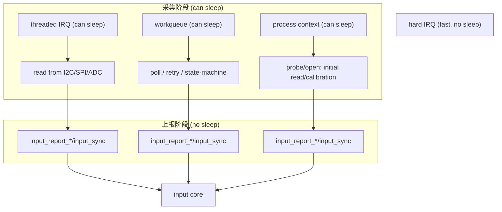
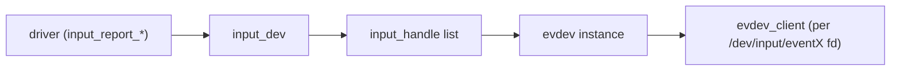
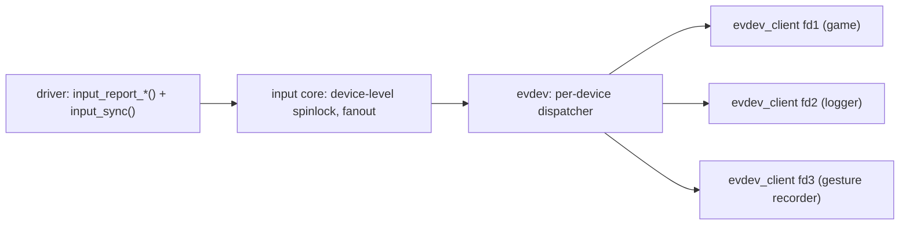
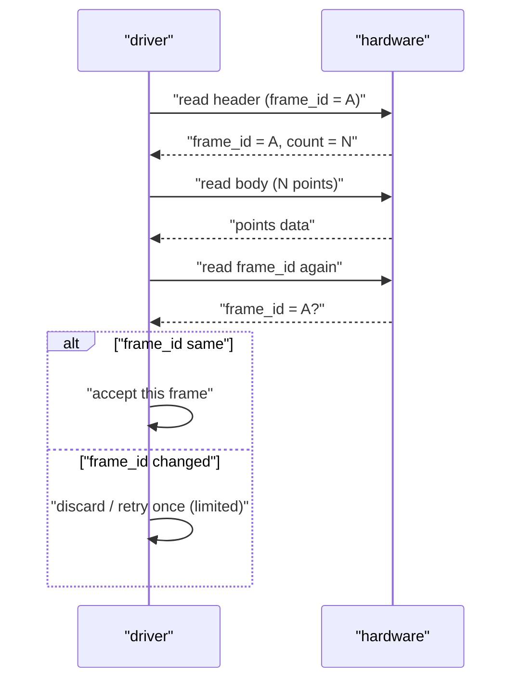
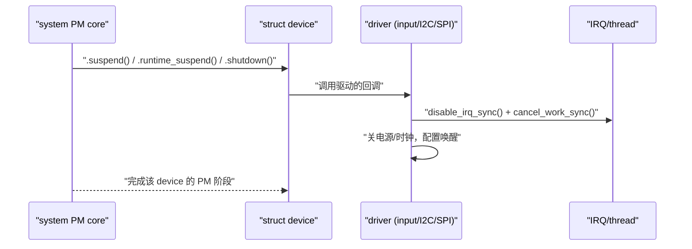
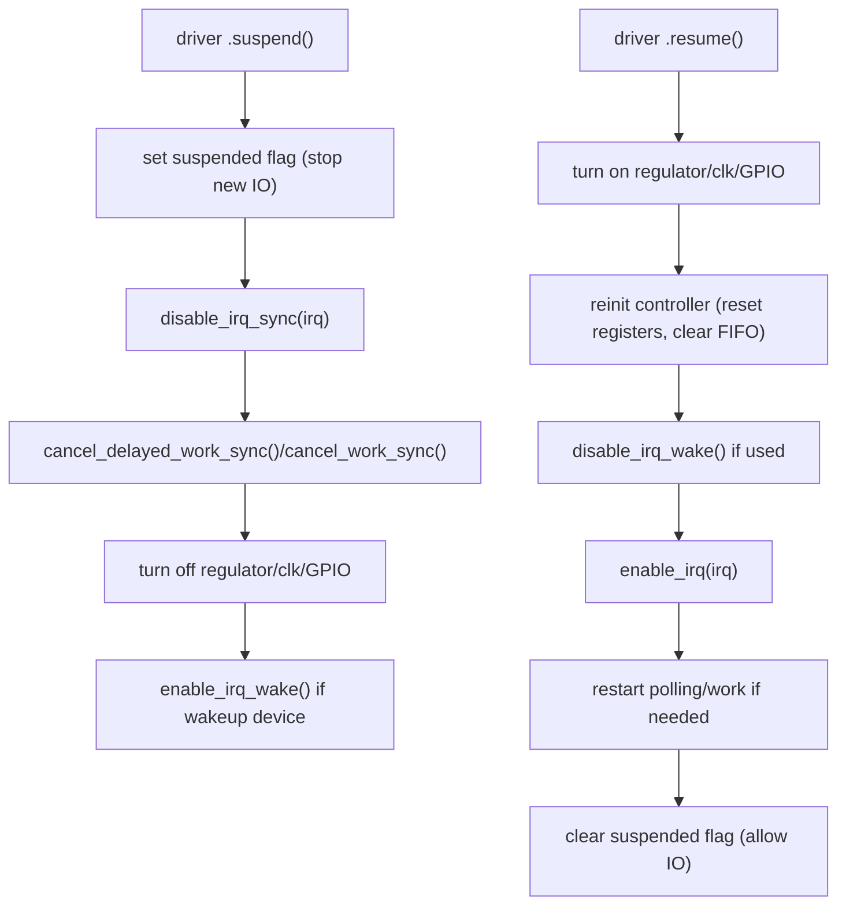
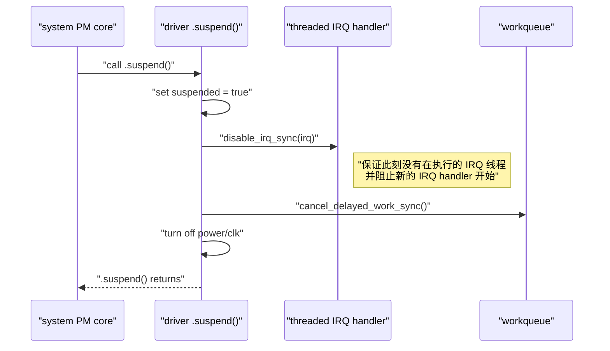

# 第5章_同步与并发语义(必须讲透)

> **章节内容说明**
>  前几章一直在解决“**能不能跑起来**”的问题——最小设备、三帧事件、ABS 元数据、两条流水线。
>  从本章开始，我们转到一个更底层但同样关键的问题：
>
> - **同一设备内部：** 数据采集、上报、PM、关机、用户态关闭，顺序怎么保证？
> - **不同上下文之间：** IRQ / 线程化 IRQ / workqueue / 进程上下文如何协同？
> - **背压与丢帧：** 用户态来不及读时应该怎么办？
>
> 本章不会给你一堆锁 API，而是围绕 Input 的几个“硬约束”建立完整的 **并发心智模型**，后续你在任何设备驱动（触摸屏、摇杆、键盘）中都可以套用。

------

## 5.1_概念总览_Input_驱动的四个关键上下文

### 5.1.1_是什么_四种典型执行上下文

在一个典型的 Input 驱动中，你会同时面对这些上下文（context）：

1. **硬中断（hard IRQ）上下文**
   - 由中断控制器直接唤起；
   - 不能睡眠，只能做极少量工作；
   - 在现代驱动中，**推荐尽量不用**，而采用线程化 IRQ。
2. **线程化 IRQ（threaded IRQ）上下文**
   - 通过 `request_threaded_irq()` 注册；
   - handler 在内核线程中运行，可以睡眠（例如 I²C 读写）；
   - 仍然属于“中断处理路径”，但语义更像“带标记的内核线程”。
3. **工作队列 / 定时器（workqueue / timer）上下文**
   - 用 `queue_work()` / `schedule_delayed_work()` / `hrtimer` 等调度；
   - 常用来“延后处理”一部分工作，比如长时间计算、重试、状态机等；
   - workqueue 运行在内核线程上下文，一般可睡（`system_wq` 等）。
4. **进程上下文（process context）**
   - 例如：probe/remove、`open()`/`release()`、`ioctl` 等；
   - 可以睡眠，可以做阻塞 I/O；
   - 与用户态交互最直接。

**Input 驱动的核心约束：**

> **采集可睡、上报不睡**
>
> - “采集”：各种 I/O、等待、轮询 → 建议在可睡上下文中完成（线程化 IRQ / workqueue / 进程）；
> - “上报”：调用 `input_report_*()` + `input_sync()` → 要求不睡，可在上述任意上下文中执行。

------

### 5.1.2_干什么_为什么要区分这些上下文

如果你不区分上下文，常见问题会直接爆炸：

- 在硬中断中调用可睡 API（I²C、SPI、`mutex_lock()` 等） → 直接触发 “sleeping function called from invalid context”；
- 在复杂路径里一会儿在 IRQ 上下文，一会儿在进程上下文上报事件 → 帧顺序无法推断；
- 在 PM/关机过程中，与上报线程抢同一个锁 → 死锁或随机卡死。

因此，本章要达成的目标之一就是：

> 让你在写 Input 驱动时，**随时能说清楚**：
>  “这个函数在哪个上下文执行，它可以干什么、不能干什么？”

------

### 5.1.3_怎么实现_统一的_上下文职责表

我们先给出一张“上下文 → 建议职责”的速查表，后续小节会逐项展开。

| 上下文类型         | 可睡？       | 典型来源                                      | 建议职责                          | 不建议做的事情                |
| ------------------ | ------------ | --------------------------------------------- | --------------------------------- | ----------------------------- |
| 硬中断（hard IRQ） | 否           | 传统 `request_irq()`                          | 仅做极少量快速状态标记，尽量不用  | I²C/SPI/ADC 访问、复杂逻辑    |
| 线程化 IRQ         | 是           | `request_threaded_irq()` 的 thread handler    | 一帧采样（I²C/ADC）+ 立即成帧上报 | 大量延迟处理、重试计时器等    |
| workqueue / timer  | 视 work 类型 | `schedule_work()` / `schedule_delayed_work()` | 重试、状态机、延迟采样、软轮询等  | 占用太久 CPU 的长算（应拆分） |
| 进程上下文         | 是           | probe/remove/open/release/ioctl               | 资源申请/释放、模式切换、调试控制 | 高频路径上的重复耗时操作      |

下一小节，我们从第一个核心点开始：**采集可睡、上报不睡**。

------

## 5.2_采集可睡_上报不睡_约束_落点与模式

> 本节是整章的基础：只要你理解并贯彻“采集可睡、上报不睡”，绝大部分 Input 并发问题都会自然收敛。

------

### 5.2.1_是什么_一句话的精确定义

**采集可睡、上报不睡**：

1. **采集可睡**
   - 从硬件取样本（I²C/SPI/ADC/寄存器）可以在可睡上下文中执行；
   - 可以使用 `mutex`、`msleep()`、`wait_for_completion()` 等可睡 API；
   - 通常放在：线程化 IRQ / workqueue / 进程上下文 中。
2. **上报不睡**
   - 从 `input_report_*()` 到 `input_sync()` **内部保证不睡眠**；
   - 因此上报路径可以在硬中断、softirq、线程化 IRQ、workqueue、进程上下文中安全调用；
   - 但**你自己**在上报路径中不能插入可睡 API。

换句话说：

> 只要你把所有“可能睡”的操作集中在采集阶段，再在同一上下文里紧接着“短路径上报”，就不会有上下文相关的睡眠问题。

------

### 5.2.2_干什么_为什么要这样分

为什么不直接在硬中断里一口气完成“采集 + 上报”？

1. **硬中断不能睡**
   - 绝大多数真实硬件采集都需要可睡 API（I²C、SPI、IIO 等）；
   - 硬中断里做这些操作会立刻触发 BUG。
2. **输入设备多、事件密集**
   - 触摸屏、鼠标、键盘事件频率都不低；
   - 硬中断里做大量处理会放大中断延迟，影响整个系统。
3. **抽象清晰**
   - “采集可睡” → 把所有 和硬件交互、等待相关、不可预知耗时 的操作放到可睡上下文中；
   - “上报不睡” → 上报逻辑短而固定、性能可预期。

在第 3 章和第 4 章的示例中，你其实已经在实践这件事：

- 触摸屏：
  - 线程化 IRQ 里做 I²C 读帧 + `input_mt_*()` + `input_sync()`；
- 摇杆：
  - `delayed_work` 里做“虚拟采样” + `input_report_abs()` + `input_sync()`。

------

### 5.2.3_怎么实现_典型模式对照(坏写法_vs_好写法)

#### (1)_坏写法_硬中断里_I²C_+_上报

**反例，仅用于说明问题：**

```c
/* 坏写法：硬中断 handler 中做 I2C 访问 */
static irqreturn_t demo_bad_irq(int irq, void *dev_id)
{
	struct demo_ts_data *ts = dev_id;
	struct demo_ts_point p;

	/* 典型错误：硬中断上下文中使用 I2C，可睡 */
	if (i2c_master_recv(ts->client, (u8 *)&p, sizeof(p)) < 0)
		return IRQ_HANDLED;

	/* 上报事件本身没问题，但前面的 I2C 已经违规 */
	input_report_abs(ts->input, ABS_X, p.x);
	input_report_abs(ts->input, ABS_Y, p.y);
	input_sync(ts->input);

	return IRQ_HANDLED;
}
```

问题：

- `i2c_master_recv()` 内部可能睡眠；
- 硬中断上下文睡眠会触发内核警告甚至 BUG；
- 这种写法在现代内核中直接被视为错误。

------

#### (2)_好写法_线程化_IRQ_+_上报

**推荐写法（简化版）：**

```c
/* request_threaded_irq 注册时的 handler：
 * .handler（硬中断）只做“快速确认 + 返回 IRQ_WAKE_THREAD”
 */
static irqreturn_t demo_ts_irq(int irq, void *dev_id)
{
	/* 这里只做极少量工作，通常直接唤醒线程化部分 */
	return IRQ_WAKE_THREAD;
}

/* 真正的处理放在线程化 handler 中，可睡 */
static irqreturn_t demo_ts_irq_thread(int irq, void *dev_id)
{
	struct demo_ts_data *ts = dev_id;
	struct demo_ts_point points[DEMO_TS_MAX_SLOTS];
	int slots_used, i;

	/* 采集：可睡的 I2C 操作 */
	slots_used = demo_ts_read_points(ts, points, DEMO_TS_MAX_SLOTS);
	if (slots_used < 0)
		return IRQ_HANDLED;

	/* 上报：不睡的 input_report_* + input_sync() 路径 */
	for (i = 0; i < slots_used; i++) {
		struct demo_ts_point *p = &points[i];

		input_mt_slot(ts->input, p->id);
		input_mt_report_slot_state(ts->input, MT_TOOL_FINGER,
					   p->status);

		if (p->status) {
			input_report_abs(ts->input, ABS_MT_POSITION_X, p->x);
			input_report_abs(ts->input, ABS_MT_POSITION_Y, p->y);
		}
	}

	input_report_key(ts->input, BTN_TOUCH, slots_used > 0);
	input_sync(ts->input);

	return IRQ_HANDLED;
}
```

这里：

- 硬中断 handler `demo_ts_irq()` 只返回 `IRQ_WAKE_THREAD`，几乎什么都不干；
- 线程化 handler `demo_ts_irq_thread()` 在可睡上下文中做：
  - I²C 采样（可睡）；
  - input 上报（不睡，但不影响当前上下文的可睡性）。

**这正是“采集可睡、上报不睡”的标准实现。**

------

### 5.2.4_workqueue_/_轮询场景下的_采集可睡_上报不睡

在 4.3 摇杆例子里，我们使用了 `delayed_work` 来模拟周期采样。真实场景中，你可能会：

- 使用 workqueue 做软轮询；
- 在 PM/唤醒后重新启动轮询；
- 在错误恢复路径（比如通信失败）中延时重试。

#### (1)_轮询型模式(软轮询)

典型结构：

```c
static void demo_poll_work(struct work_struct *work)
{
	struct demo_dev *d;
	int x, y;

	d = container_of(to_delayed_work(work), struct demo_dev, poll_work);

	/* 采集：可睡的 ADC / I2C / SPI 操作 */
	x = demo_read_axis(d, AXIS_X);	/* 内部可能睡 */
	y = demo_read_axis(d, AXIS_Y);

	/* 上报：不睡 */
	input_report_abs(d->input, ABS_X, x);
	input_report_abs(d->input, ABS_Y, y);
	input_sync(d->input);

	/* 重新调度下一次轮询 */
	schedule_delayed_work(&d->poll_work,
			      msecs_to_jiffies(d->poll_interval_ms));
}
```

要点：

- workqueue handler 运行在内核线程环境，可睡；
- 上报逻辑短而固定，不会引入额外睡眠。

------

### 5.2.5_可视化_采集与上报的层次拆分



> 记住这个图：**采集阶段可以在多种可睡上下文中发生，但无论在哪，最终上报都走相同的“不睡短路径”。**

------

### 5.2.6_调试与验证_如何确认自己没有踩_睡眠_红线

1. **开启内核的 lockdep / 睡眠检测选项**
   - 通常 debug 内核会开启 “sleeping function called from invalid context” 检测；
   - 一旦你在不该睡的地方调用了可睡 API，会直接打出 backtrace。
2. **在 handler 中加上上下文检查（调试期）**

```c
#include <linux/preempt.h>
#include <linux/interrupt.h>

static void demo_debug_ctx(const char *where)
{
	if (in_interrupt())
		pr_warn("demo_input: %s in interrupt context\n", where);
	if (!in_task())
		pr_warn("demo_input: %s not in process context\n", where);
}
```

然后在关键路径中临时插：

```c
demo_debug_ctx("irq_thread");
```

1. **用 ftrace / tracepoints 跟踪 input 事件路径**
   - 开启 input 相关 tracepoints，观察上报路径是否在预期线程中执行；
   - 确认“采集 + 上报”没有跨多个不可控上下文。

------

### 5.2.7_小结_从_哪里可以睡_反推代码结构

本节可以用一句话总结：

> 写 Input 驱动时，不要先想“在哪里上报”，要先想“**采集在哪个可睡上下文里做**”，然后自然接一段短的上报逻辑。

实践准则：

1. **所有 I/O、等待、heavy 运算 → 都放到可睡上下文（线程化 IRQ / workqueue / 进程）里；**
2. **所有 `input_report_\*()` + `input_sync()` 调用 → 不做额外可睡操作，保证路径短而纯粹；**
3. **硬中断 handler 尽量只做 `IRQ_WAKE_THREAD` 或简单标记，不做实际采集和上报。**


---

## 5.3_设备级顺序_input_core_的内部并发语义

> 本小节回答的问题是：
>  **“同一设备的事件，在内核里是以什么顺序被串起来并交给用户态的？”**
>  你已经知道“采集可睡、上报不睡”，现在要在这个基础上看一眼 **input core + evdev** 这一层的并发与顺序保证。

------

### 5.3.1_是什么_从_input_report_*()_到用户态的_设备级总顺序

当你在驱动里写下：

```c
input_report_key(dev, KEY_A, 1);
input_sync(dev);
```

在 input core 看来，会发生几件事（简化视图）：

1. 驱动调用 `input_event(dev, type, code, value)`（`input_report_*` 最终走到这里）；
2. input core 在 **设备级短自旋锁** 下，把这条事件放入 `input_handle` 链接的各个处理层（如 evdev）队列；
3. 对每个打开的 evdev 节点，事件被写入该节点对应的环形缓冲；
4. 唤醒等待在 `poll()/read()` 上的进程。

这里的关键点：

- 对 **同一个 `input_dev`** 来说，input core 以 **调用顺序** 接收 `input_event()`，并在持有一个简短的自旋锁时做“扇出”（fanout）；
- 处理层（evdev）的环形缓冲，对各自读者来说也是顺序的；
- 因此，你在驱动里对同一设备调用 `input_report_*()` + `input_sync()` 的顺序，就是用户态看到的全局顺序（同一设备视角）。

换句话说：

> **设备内部顺序** 是由你调用 `input_report_*()` 的顺序定义的，input core 会用一个短自旋锁把这条顺序“原样传播”到所有消费者。

------

### 5.3.2_数据结构视角_谁在保证_设备级顺序

只看核心几个对象（简化）：

- `struct input_dev`
  - 表示一个 input 设备；
  - 内部有事件处理函数和 handle 链表。
- `struct input_handle`
  - 将 `input_dev` 挂到一个处理层（如 evdev、mousedev、joydev）；
  - 对 evdev 来说，每个 `input_dev` 和每个 `evdev` 实例之间有一个 handle。
- `struct evdev_client`
  - 表示一个打开 `/dev/input/eventX` 的用户态 FD；
  - 内部有一个环形缓冲 + 等待队列，用于记录该 FD 的事件流。

简化成一个图，就是：



**顺序保证点主要有两个：**

1. **`input_dev` 上的“设备级短自旋锁”**
   - 在 `input_event()` 内部加锁，确保对同一设备的事件分发是原子的；
   - 同一设备上不同 CPU 并发调用 `input_report_*()` 也会通过这个锁线性化。
2. **每个 `evdev_client` 自己的环形缓冲**
   - 对于同一个 FD，事件按写入顺序进入 ring buffer；
   - 用户态按照 `read()` 顺序读出，顺序与 input core 扇出顺序一致。

------

### 5.3.3_开发者视角_你需要保证哪些顺序_哪些不用管

站在驱动的角度，你要关心的顺序主要有三种：

1. **单帧内顺序**
   - 一帧（一个 `SYN_REPORT` 之前的一串事件）内的事件顺序；
   - 例如先上报 ABS_X，再 ABS_Y，再 KEY，然后 `SYN_REPORT`。
2. **帧之间的顺序**
   - 第 n 帧和第 n+1 帧是严格有序的；
   - 每次 `input_sync()` 把一帧“提交”，用户态会按顺序看到这些帧。
3. **多上下文并发时的顺序**
   - 如果你的驱动在多个上下文中对同一 `input_dev` 上报事件（**不推荐**），这些调用会通过 input core 的锁被串行化；
   - 但这会使“帧边界”变得难以推断，不建议这么设计。

因此，对你来说最稳妥的模式是：

> **“同一设备的上报，只来自一个明确的“上报线程”（线程化 IRQ / workqueue / poll 线程），不在多个上下文乱写”**。

这样你就不用去脑补 input core 的内锁细节，逻辑也更容易 debug。

------

### 5.3.4_可视化_设备级顺序与多读者(多个_FD)的关系

下面这张图重点表达两件事：

1. 对同一设备，input core 在 `input_dev` 上做一次“扇出”；
2. 每个 `evdev_client` 拥有自己的队列，但顺序与扇出顺序一致。



从 FD 视角看：

- **fd1（游戏）**：按顺序看到所有帧 → 做即时控制；
- **fd2（日志）**：按顺序记录全部事件 → 方便回放；
- **fd3（录制工具）**：按顺序捕获事件 → 用于测试/回放。

**对于驱动来说，它完全不关心这些读者是谁；它只要保证“对同一设备的上报序列是合理的帧序列”就够了。**

------

### 5.3.5_示例模式_单一上报上下文_+_明确帧边界

为了把“设备级顺序”落在代码结构里，你可以采用下面这种通用模式（伪代码，适用于触摸屏 / 摇杆 / 键盘）：

```c
/* 统一的“上报线程”：可以是 threaded IRQ、workqueue 或 kthread */
static void demo_report_frame(struct demo_dev *d)
{
	/* 1. 采集：可睡的硬件访问 */
	struct demo_sample sample;

	if (demo_hw_read_sample(d, &sample) < 0)
		return;

	/* 2. 成帧：只调用 input_report_*()，不做可睡操作 */
	/* 例如：按键设备 */
	input_report_key(d->input, sample.key_code, sample.key_value);

	/* 或触摸/摇杆的 ABS 信息 */
	input_report_abs(d->input, ABS_X, sample.x);
	input_report_abs(d->input, ABS_Y, sample.y);

	/* 3. 帧结束 */
	input_sync(d->input);
}

/* 所有“事件触发”入口最终都调度到同一个 report_frame() */
static irqreturn_t demo_irq_thread(int irq, void *dev_id)
{
	struct demo_dev *d = dev_id;

	demo_report_frame(d);
	return IRQ_HANDLED;
}

static void demo_poll_work(struct work_struct *work)
{
	struct demo_dev *d;

	d = container_of(to_delayed_work(work), struct demo_dev, poll_work);
	demo_report_frame(d);

	schedule_delayed_work(&d->poll_work,
			      msecs_to_jiffies(d->poll_interval_ms));
}
```

要点：

- 统一把**上报逻辑**集中在 `demo_report_frame()` 这种函数里；
- 只允许“一个来源”（或等价的统一路径）来调用这个函数，不在别的地方随便 `input_report_*()`；
- 这样，对同一个 `input_dev` 的所有上报自然就形成了一条 **单一、易推断的设备级顺序**。

------

### 5.3.6_调试与验证_如何确认_帧顺序正确

在实践中，你可以用下面的方法来验证：

1. **`evtest` / 自写工具观察帧边界**
   - 确认每次 `SYN_REPORT` 前的事件组合符合你的预期（例如：X/Y/BTN 一起出现）；
   - 触摸屏：检查 MT 帧是否按“按下 → 移动 → 抬起”顺序展开；
   - 摇杆：检查 ABS_X/ABS_Y 是否成对出现。
2. **多读者场景下比对顺序**
   - 同时运行两份 `evtest` 或一个 `evtest` + 自写 logger；
   - 比对两边的事件序列是否一一对应（允许时间戳存在微小差异）。
3. **在驱动中添加 debug trace（开发期）**

```c
input_report_abs(d->input, ABS_X, x);
trace_printk("demo: frame %d, ABS_X=%d\n", d->frame_id, x);

input_report_abs(d->input, ABS_Y, y);
trace_printk("demo: frame %d, ABS_Y=%d\n", d->frame_id, y);

input_sync(d->input);
trace_printk("demo: frame %d, SYN_REPORT\n", d->frame_id++);
```

再用 `trace_pipe` 或 ftrace 工具看帧顺序，与 `evtest` 输出比照。

------

### 5.3.7_小结_把_设备级顺序_交给结构_而不是记忆

本小节的核心结论可以压缩为：

1. **input core 用一个短自旋锁保证同一设备的事件分发顺序**；
2. **evdev 为每个 FD 提供独立的环形缓冲，但顺序与设备级顺序一致**；
3. 驱动开发者只需要做到两件事：
   - 对同一 `input_dev`，尽量从**单一上报上下文**上报事件；
   - 在该上下文中，明确按“采集 → 成帧 → `input_sync()`”的顺序组织代码。


---

## 5.4_帧一致性与_TOCTOU_data-ready_检查_+_有限重读

> 本小节集中解决一个问题：
>  **“同一帧里的 X/Y/压力/slot 状态，是不是同一时刻的快照？”**
>
> 在很多控制器里，你必须多次访问寄存器或 FIFO 才能读完整一帧数据，如果处理不好，会出现典型的 TOCTOU（Time Of Check, Time Of Use）问题：
>
> - 检查时数据还没准备好，用的时候已经换帧；
> - 或者头信息和点数据不属于同一帧。
>
> 本节给出两种通用模式：
>
> - **帧号模式：header 中带 frame_id，前后一致才接受；**
> - **data-ready + 有限重读模式：前后检查 data-ready 或状态位，最多重读 N 次。**

------

### 5.4.1_是什么_帧一致性与_TOCTOU_在_Input_驱动中的含义

#### (1)_帧一致性(frame_consistency)

在本书的 Input 语境中，一帧（frame）通常包含：

- 一个 header 或状态区：点数、flags、frame_id 等；
- 一组数据：X/Y/pressure/slot 列表；
- 由驱动把这一帧整理为一组 `input_event`，最终以一个 `SYN_REPORT` 结束。

**帧一致性要求：**

> 在同一帧中，所有字段（点数、坐标、按键状态等）必须来自同一时刻的硬件快照，而不是“前半帧来自上一采样，后半帧来自下一采样”。

否则会出现：

- header 说“有 3 个点”，但你读出的点只剩 2 个；
- `ABS_X`、`ABS_Y` 看似同一帧，实际上来自两次不同采样，轨迹会出现不可解释的跳变。

------

#### (2)_TOCTOU_在这里具体指什么

TOCTOU（Time Of Check, Time Of Use）在这里的具体形式是：

1. **你先检查了某个状态位（data-ready、point-count、frame_id）；**
2. **在真正读取数据、使用这些状态之前，硬件又更新了内部 FIFO 或寄存器；**
3. 结果你读取的数据与之前检查的状态不再对应。

表现为：

- “检查时 data-ready=1，以为这一帧稳定了；
   结果读数据时硬件又推了新一帧，导致读的是下一帧部分内容”。

这是很多 I²C 触摸/传感器、SPI 外设中非常常见的问题。

------

### 5.4.2_干什么_为什么必须主动防_TOCTOU

站在 Input 驱动的角度，如果不处理 TOCTOU，会有直接后果：

1. **帧内不一致 → 用户态无法解释轨迹**
   - 单指触摸轨迹出现“回跳”或不连续；
   - 多指时 slot 状态与点数对不上，libinput 会认为驱动不可靠。
2. **误判抖动 / 噪声**
   - 一部分越界值其实是“跨帧混合”的结果，而不是硬件抖动；
   - 你在驱动/用户态做的滤波策略会基于错误的统计。
3. **调试难度极高**
   - `evtest` 输出看起来“偶尔怪一下”，复现不稳定；
   - 抓 raw I²C log 时又发现硬件似乎输出正常，是你读的时机错了。

因此，本节要给你一套 **可实现、可验证的“帧一致性保障模式”**，统一用于触摸屏、摇杆、传感器类 Input 驱动。

------

### 5.4.3_怎么实现(1)_帧号模式(frame_id_前后一致)

许多控制器在数据头部提供一个 **frame_id 或 packet_id** 字段，每产生一帧数据就自增一次。

#### (1)_模式描述

1. 先读 header，拿到 `frame_id`、点数等信息；
2. 再读完整帧的数据区域；
3. 再次读取 header 或 `frame_id`；
4. 若两次读取的 `frame_id` 一致，则认为这一帧内部一致，可以使用；
5. 若不一致，则认为在采样过程中硬件换帧了，做一次 **有限重读**（重新走 1–4）。

这可以抽象为：



#### (2)_优点与边界

- 优点：
  - 语义清晰，“同一 frame_id” 就是一帧的一致性保证；
  - 不需要猜 data-ready 的时机，完全以控制器提供的版本号为准。
- 边界：
  - 依赖硬件设计是否提供 frame_id；
  - 一般不适合无限重读，只做少量尝试（例如重读 1–2 次）。

------

### 5.4.4_怎么实现(2)_data-ready_+_有限重读模式

如果硬件不提供 frame_id，常见的是一个或多个 **data-ready / status / count** 寄存器。

#### (1)_模式描述

以最常见的 “data-ready + count” 为例：

1. 第一次读取 `status`：检查 `DATA_RDY` 和 `POINT_CNT`；
2. 读取数据区：根据 `POINT_CNT` 读 N 个点；
3. 再次读取 `status`：
   - 若 `DATA_RDY` 清零/未变化，且 `POINT_CNT` 与前一次一致，则认为这一帧稳定；
   - 若 `DATA_RDY` 又置位或 `POINT_CNT` 改变，说明在读取过程中硬件已进入下一帧，做**有限重读**。

伪代码抽象：

```c
for (retry = 0; retry < MAX_RETRY_CNT; retry++) {
	read_status(&status1);
	if (!status1.data_rdy)
		return NO_DATA;

	read_points(buffer, status1.count);

	read_status(&status2);

	if (status2.data_rdy == status1.data_rdy &&
	    status2.count == status1.count) {
		/* 认为帧一致 */
		return OK;
	}

	/* 否则：丢弃 buffer，重试一轮 */
}
```

#### (2)_有限重读_的含义

- 不能无限重读，否则会在某些异常硬件上形成死循环；
- 一般建议 **重读 1–3 次**，超过就：
  - 统计一次错误（`dev_dbg`/`dev_warn`）；
  - 丢弃本次采样，等待下一次中断或轮询；
  - 在统计或调试工具中可观察该错误率。

------

### 5.4.5_接口与模式速查表(驱动侧)

这里整理一张表，把“帧一致性相关”的常用元素放在一起，便于你设计自己的读取函数。

| 元素                       | 作用                   | 使用场景                         | 不写/写错后果                        |
| -------------------------- | ---------------------- | -------------------------------- | ------------------------------------ |
| `frame_id`                 | 标识一帧数据的版本号   | 控制器提供 frame counter         | 不利用会放弃一个强有力的 TOCTOU 防护 |
| `DATA_RDY` 标志位          | 指示是否有完整帧可读   | 常见于 I²C 触摸、传感器          | 不检查可能读到半帧或旧帧             |
| `POINT_CNT` / `SAMPLE_CNT` | 写明这一帧的数据长度   | 多点触控、FIFO 类型外设          | 不校验可能读少/读多，帧结构错乱      |
| `MAX_RETRY_CNT`            | 限制重读次数，防死循环 | data-ready / frame_id 检查失败时 | 不设限可能在异常硬件上卡死 IRQ 线程  |
| `dev_dbg` / 统计计数       | 调试 TOCTOU 失配频率   | bring-up / 现场问题复现          | 没有统计信息时，定位变得很困难       |

这些字段一般出现在你的“采集函数”里，比如 `demo_ts_read_points()`。

------

### 5.4.6_对比_/_避坑_/_限制

#### (1)_反模式_1_完全相信第一次_status

反模式：

```c
read_status(&status);
if (!status.data_rdy)
	return;

read_points(buffer, status.count);
/* 直接使用 buffer，不做任何后验检查 */
```

问题：

- 若在 `read_points()` 期间硬件换帧，你读到的是混合帧；
- 在高负载或 I²C 延迟较大时，这类问题极容易触发。

对策：

- 至少做 **一次后验检查**：再次读取 status 并校验关键字段。

------

#### (2)_反模式_2_无限重读直到满足条件

反模式：

```c
while (1) {
	read_status(&s1);
	read_points(...);
	read_status(&s2);
	if (ok)
		break;
}
```

问题：

- 在硬件异常或线路噪声严重时，`ok` 永远为假；
- 线程化 IRQ 长时间卡在这个循环中，会拖垮整个系统响应。

对策：

- 永远使用“有限重读”模式，形如：

```c
for (retry = 0; retry < MAX_RETRY_CNT; retry++) {
	/* ... 检查 ... */
	if (ok)
		break;
}
if (!ok) {
	/* 丢弃本次帧，记录一次错误 */
}
```

并将 `MAX_RETRY_CNT` 设计为一个具名宏，例如：

```c
#define DEMO_TS_MAX_FRAME_RETRY_CNT	3
```

------

#### (3)_反模式_3_在两个上下文中交替读写同一_FIFO

有些驱动会这样设计：

- IRQ handler 中读一部分数据；
- workqueue 中读剩余部分；
- 两边都直接操作控制器 FIFO，没有统一的“帧边界函数”。

问题：

- 帧边界跨上下文，顺序难以证明；
- 出现问题时，难以辨别是 TOCTOU 还是并发访问冲突。

对策：

- 将“读取一帧 + TOCTOU 防护”封装为 **一个函数**，只在一个采集上下文（线程化 IRQ / workqueue）里调用，例如：

```c
static int demo_ts_read_frame(struct demo_ts_data *ts,
			      struct demo_ts_point *buf,
			      int buf_slots);
```

其它上下文都只调度到这个采集上下文，不直接操作硬件。

------

### 5.4.7_示例代码_I²C_触摸屏的_data-ready_+_有限重读

下面给一个简化版的采集函数示例，把“data-ready + 有限重读”真正落到代码层。假设控制器有：

- `REG_STATUS`：包含 `DATA_RDY` 位 和 `POINT_CNT` 字段；
- `REG_POINTS`：点数据区域；
- 每帧最多 `DEMO_TS_MAX_SLOTS` 个点。

#### (1)_常量定义

```c
#define DEMO_TS_REG_STATUS			   0x00
#define DEMO_TS_REG_POINTS			   0x10

#define DEMO_TS_STATUS_DATA_RDY_MASK	0x80
#define DEMO_TS_STATUS_POINT_CNT_MASK	0x0F

#define DEMO_TS_MAX_SLOTS			   10U
#define DEMO_TS_MAX_FRAME_RETRY_CNT		3U
```

#### (2)_采集函数实现

```c
/* 从硬件读取一帧触摸点，带 data-ready + 有限重读 */
static int demo_ts_read_points(struct demo_ts_data *ts,
			       struct demo_ts_point *points,
			       int max_slots)
{
	struct i2c_client *client = ts->client;
	u8 status1;
	u8 status2;
	int retry;
	int ret;
	int count;

	if (max_slots > DEMO_TS_MAX_SLOTS)
		max_slots = DEMO_TS_MAX_SLOTS;

	for (retry = 0; retry < DEMO_TS_MAX_FRAME_RETRY_CNT; retry++) {
		/* 第一次读取 status */
		ret = i2c_smbus_read_byte_data(client, DEMO_TS_REG_STATUS);
		if (ret < 0)
			return ret;

		status1 = (u8)ret;

		if (!(status1 & DEMO_TS_STATUS_DATA_RDY_MASK)) {
			/* 没有数据可读，直接返回 0 */
			return 0;
		}

		count = status1 & DEMO_TS_STATUS_POINT_CNT_MASK;
		if (count > max_slots)
			count = max_slots;

		if (count <= 0)
			return 0;

		/* 读取点数据：根据硬件协议调整长度与格式 */
		ret = demo_ts_hw_read_points(client, points, count);
		if (ret < 0)
			return ret;

		/* 第二次读取 status，做后验检查 */
		ret = i2c_smbus_read_byte_data(client, DEMO_TS_REG_STATUS);
		if (ret < 0)
			return ret;

		status2 = (u8)ret;

		/* data-ready 状态与点数一致，则认为这一帧稳定 */
		if ((status2 & DEMO_TS_STATUS_DATA_RDY_MASK) ==
		    (status1 & DEMO_TS_STATUS_DATA_RDY_MASK) &&
		    (status2 & DEMO_TS_STATUS_POINT_CNT_MASK) ==
		    (status1 & DEMO_TS_STATUS_POINT_CNT_MASK)) {
			return count;
		}

		/* 否则：认为在读取过程中硬件换帧了，丢弃本次结果重试 */
		dev_dbg(&client->dev,
			"frame mismatch, retry %d\n", retry);
	}

	/* 超过最大重试次数，放弃本次帧 */
	dev_warn(&client->dev,
		 "failed to get stable frame after %u retries\n",
		 DEMO_TS_MAX_FRAME_RETRY_CNT);

	return -EAGAIN;
}
```

要点：

- 整个函数在采集阶段执行（例如线程化 IRQ 中）；
- 内部允许睡眠（I²C 访问）；
- 返回值：
  - `0`：无数据；
  - `>0`：有效点个数；
  - `<0`：I²C 错误或重试失败（例如 `-EAGAIN`）；
- TOCTOU 防护逻辑在函数内部，外层只关心“这帧是否可靠”。

这种函数可以直接被上一小节的 `demo_ts_irq_thread()` 调用，形成干净的：

- 采集函数：带 TOCTOU 防护；
- 上报函数：只做 `input_mt_*` + `input_sync()`。

------

### 5.4.8_调试与验证_+_小结

#### (1)_如何验证帧一致性策略生效

1. **在采集函数中统计重试次数**
   - 增加计数器 `frame_retry_cnt`，在 `retry > 0` 时累加；
   - 通过 `debugfs` 或 `sysfs` 导出该计数；
   - bring-up 阶段观察：
     - 正常硬件下重试次数应非常少（甚至为 0）；
     - 若频繁重试，说明硬件帧更新频率与采样时机不匹配，需要调整。
2. **用 `evtest` / MT 帧打印器观察轨迹**
   - 目视检查轨迹是否还存在“莫名回跳、断裂”；
   - 对比启用/禁用 TOCTOU 防护时的轨迹差异。
3. **在异常环境下测试**
   - 降低 I²C 速率、制造轻微干扰，观察重试计数变化；
   - 确认在极端情况下系统不会死锁或卡在中断线程内。

------

#### (2)_小结

本小节在“采集可睡、上报不睡”的前提下，补上了另一个关键维度：**采集阶段内部的帧一致性**。主要结论：

1. **帧一致性** 要求同一帧的所有字段来自同一快照，而不是多次采样的混合；
2. **TOCTOU** 在 Input 驱动里的具体形式，是“检查 status 与读取数据之间硬件状态突变”；
3. 通用对策有两种：
   - **frame_id 模式**：前后读取 frame_id，相同则接受；
   - **data-ready + 有限重读模式**：前后检查 `DATA_RDY` 和 `POINT_CNT`，最多重读 N 次；
4. 必须使用 **有限重读**，以 `DEMO_TS_MAX_FRAME_RETRY_CNT` 这种具名宏约束重试次数，避免死循环；
5. 采集函数内部完成所有 TOCTOU 防护，上报函数只负责 `input_report_*` + `input_sync()`，保证结构清晰。


------

## 5.5_关机_/_休眠顺序_disable_irq_sync()_与电源状态切换

> 本小节围绕一个核心问题：
>  **“系统在关机 / 休眠时，Input 驱动要按什么顺序停采集、停中断、关电源、配置唤醒？”**
>
> 目标是把这件事变成**有步骤、有模板**的固定套路，而不是依赖经验记忆。

------

### 5.5.1_引入_为什么_关机/休眠顺序_是_Input_驱动的高危区

在真实系统里，关机 / 休眠（suspend / shutdown）阶段经常出现以下问题：

- 刚关掉电源 / 时钟，**IRQ 线程里还在访问 I²C/SPI**；
- `remove()` 或 `.shutdown()` 里释放了 `input_dev`，**中断线程晚一步才退出**，导致 use-after-free；
- 设备应当作为唤醒源（wake source），结果：
  - 要么**根本唤不醒**；
  - 要么**一唤就卡死**，因为唤醒时 IRQ/电源时序不对。

这些问题的共同原因是：**采集线程 / IRQ / PM 回调 / 资源释放之间缺少明确的顺序约定**。

Input 驱动一般都满足：

- 采集可睡（线程化 IRQ / workqueue）；
- 上报不睡（`input_report_* + input_sync`）；
- 经常带有中断、时钟、电源域、regulator。

因此，本小节要给出一个 **“默认安全顺序”**，你只需要按模板填空即可。

------

### 5.5.2_数据结构视角_device_/_input_dev_/_IRQ_/_wakeup_的关系

从内核对象关系来看，一个典型的 Input 设备涉及：

- `struct device`
  - 平台 / I²C / SPI 设备本体（`&client->dev` / `&pdev->dev`）；
  - PM 回调 (`dev_pm_ops`)、`device_init_wakeup()`、`enable_irq_wake()` 都挂在这里。
- `struct input_dev`
  - Input 子系统看见的设备；
  - 由驱动在 probe 中 `input_register_device()`；
  - 在 remove / shutdown 中注销。
- IRQ / threaded IRQ
  - `request_threaded_irq()` 或 `devm_request_threaded_irq()` 获取；
  - `disable_irq_sync()` / `enable_irq()` 控制；
  - `enable_irq_wake()` / `disable_irq_wake()` 配置为唤醒源时使用。
- 附属资源（跟 PM 强相关）：
  - `clk` / `regulator` / GPIO / reset 控制器；
  - 可能使用 devres（`devm_clk_get()` / `devm_regulator_get()`），也可能是手工管理。

从 PM 的角度看，系统调度的顺序大致是：



因此，一个安全的顺序必须把：**IRQ→采集线程→电源/时钟** 串联起来。

------

### 5.5.3_开发者视角_推荐的关机_/_休眠顺序

从驱动视角，推荐的 **“标准顺序”** 可以概括为：

1. **禁止新的采集 / 上报逻辑进入（设置内部状态位）**
2. **停中断 & 停采集线程（`disable_irq_sync()` + `cancel_\*_work_sync()`）**
3. **关电源 / 时钟 / 总线（regulator / clk / GPIO / reset 等）**
4. **配置唤醒源（如果需要：`enable_irq_wake()` 或其它 PM 机制）**

对应到各 PM 场景：

- `.suspend()` / `.runtime_suspend()`：
  - 停采集 + 停 IRQ → 关电源/时钟 → `enable_irq_wake()`；
- `.resume()` / `.runtime_resume()`：
  - 先开电源/时钟 → 重新初始化控制器 → 清 pending IRQ → `enable_irq()` / `disable_irq_wake()` → 重启采集。
- `.shutdown()` / `.remove()`：
  - 停采集 + 停 IRQ → 关电源/时钟 → 注销 `input_dev` / 释放资源。

**核心规则：**

> **永远先确保“不会再有线程访问硬件”，再去关电源或释放资源。**
>  对“访问硬件”的所有入口（IRQ 线程、workqueue、kthread）都必须在 PM 回调里被同步停掉。

------

### 5.5.4_用户_/_平台视角_系统关机_/_休眠中的_Input_驱动角色

从整个系统的关机 / 休眠流程看，Input 驱动的角色是：

1. **普通设备（非唤醒源）时：**
   - 在 suspend/shutdown 时停掉采集与上报；
   - 保证不再访问下电的 I²C/SPI/ADC；
   - 不影响其它子系统的关机顺序。
2. **唤醒源设备（例如电源键、某些触摸板）时：**
   - 在 suspend 过程中，把相应 IRQ 配置为 wakeup；
   - 在 resume 时正确撤销 wakeup 配置，恢复为普通 IRQ；
   - 在唤醒过程中，不要在“尚未完全恢复”阶段访问未初始化完的硬件（典型 bug）。

平台（SoC/板级）对 Input 驱动的关键要求是：

- 驱动必须在 `.suspend()` 中 **明确决定**：
  - 自己是不是唤醒源；
  - 是的话，启用 `enable_irq_wake()` 或相应 PM 机制；
- 驱动必须保证：**在关电源前，没有任何在跑的访问硬件的上下文**。

------

### 5.5.5_可视化_标准顺序的流程图与时序图

#### (1)_.suspend()_/.resume()_推荐流程(设备内部视角)



#### (2)_线程化_IRQ_与.suspend()_的交互时序



> `disable_irq_sync()` 是这里的关键：
>  它不仅**禁止新的硬件中断进入 handler**，还会**等待所有正在执行的 handler 完全退出**，
>  这样你可以放心地在之后关电源、释放资源。

------

### 5.5.6_示例代码_suspend/resume/shutdown_模板(含_devres/非_devres_对比)

下面用一个简化的触摸屏/摇杆通用结构，给出 `.suspend()` / `.resume()` / `.shutdown()` 模板。
 重点是顺序和 `disable_irq_sync()` 的使用，硬件细节略去。

#### (1)_私有数据结构与宏

```c
#define DEMO_PM_INVALID_IRQ		(-1)
#define DEMO_PM_POLL_STOP_TIMEOUT_MS	1000

struct demo_input_data {
	struct device		*dev;
	struct input_dev	*input;
	int					irq;
	bool				suspended;
	bool				wakeup_enabled;

	struct delayed_work	 poll_work;
	/* 例如：clk、regulator、GPIO 等资源 */
	/* struct clk *clk; */
	/* struct regulator *vdd; */
};
```

#### (2)_suspend_/_resume(非_devres/普通风格)

```c
static int demo_input_suspend(struct device *dev)
{
	struct demo_input_data *data = dev_get_drvdata(dev);

	/* 1. 标记为挂起，阻止新的采集逻辑进入 */
	data->suspended = true;

	/* 2. 停止软轮询 / workqueue（如果有） */
	cancel_delayed_work_sync(&data->poll_work);

	/* 3. 禁止 IRQ，并等待所有正在执行的 handler 完成 */
	if (data->irq != DEMO_PM_INVALID_IRQ)
		disable_irq_sync(data->irq);

	/* 4. 根据系统策略配置唤醒源 */
	if (device_may_wakeup(dev)) {
		if (enable_irq_wake(data->irq) == 0)
			data->wakeup_enabled = true;
	}

	/* 5. 关电源/时钟（示例，具体视平台而定） */
	/* clk_disable_unprepare(data->clk); */
	/* regulator_disable(data->vdd); */

	return 0;
}

static int demo_input_resume(struct device *dev)
{
	struct demo_input_data *data = dev_get_drvdata(dev);
	int ret = 0;

	/* 1. 开电源/时钟，重新初始化控制器 */
	/* ret = regulator_enable(data->vdd);
	 * if (ret)
	 *	return ret;
	 * ret = clk_prepare_enable(data->clk);
	 * if (ret)
	 *	goto err_disable_reg;
	 */

	/* 2. 撤销唤醒配置（如果之前启用过） */
	if (data->wakeup_enabled) {
		disable_irq_wake(data->irq);
		data->wakeup_enabled = false;
	}

	/* 3. 重新启用 IRQ */
	if (data->irq != DEMO_PM_INVALID_IRQ)
		enable_irq(data->irq);

	/* 4. 重启轮询/采集（如果有） */
	schedule_delayed_work(&data->poll_work,
			      msecs_to_jiffies(DEMO_PM_POLL_STOP_TIMEOUT_MS));

	/* 5. 解除挂起标记 */
	data->suspended = false;

	return 0;

/* err_disable_reg:
 *	regulator_disable(data->vdd);
 *	return ret;
 */
}
```

要点：

- **suspend：**
   1）先停 work（避免 work 内部继续调度自己）；
   2）再 `disable_irq_sync()` 确保没有 IRQ handler 在运行；
   3）再关电源 / 时钟；
   4）最后配置唤醒源。
- **resume：**
   1）先开电源 / 时钟并重新初始化硬件；
   2）撤销唤醒配置；
   3）启用 IRQ；
   4）重启 work/轮询；
   5）清理 `suspended` 标记。

------

#### (3)_devres_风格_devm_request_threaded_irq()_与_PM_的关系

如果你使用 devres：

```c
ret = devm_request_threaded_irq(dev, irq,
				demo_irq_handler,
				demo_irq_thread,
				IRQF_ONESHOT,
				"demo_input", data);
```

则：

- IRQ 的释放（`free_irq`）不需要你在 `.remove()` 手动调用，而是由 devres 在设备注销时统一释放；
- 但 **`disable_irq_sync()` / `enable_irq()` / `enable_irq_wake()` 等** 仍然需要在 PM 回调中**显式调用**，因为 devres 不会帮你自动处理“挂起/唤醒时的状态切换”。

总结：

- **devres 只帮你做“生命周期结束时的释放”，不帮你做“生命周期内部的状态切换”**；
- suspend/resume 这类属于“生命周期内部状态变化”，必须显式写在 PM 回调里。

------

#### (4)_.shutdown()_模板

`.shutdown()` 通常在系统关机或重启时调用。对于 Input 驱动，一般可以沿用 `.suspend()` 的顺序，但不需要配置唤醒源：

```c
static void demo_input_shutdown(struct device *dev)
{
	struct demo_input_data *data = dev_get_drvdata(dev);

	data->suspended = true;

	cancel_delayed_work_sync(&data->poll_work);

	if (data->irq != DEMO_PM_INVALID_IRQ)
		disable_irq_sync(data->irq);

	/* 此处无需 enable_irq_wake()，只需要确保不再访问硬件 */
	/* clk_disable_unprepare(data->clk); */
	/* regulator_disable(data->vdd); */
}
```

注意：

- `.shutdown()` 通常不关心“resume”，因此无需撤销 wakeup；
- 重点是 **保证没有正在访问硬件的上下文**，再关电源以防止 use-after-free / 总线异常。

------

### 5.5.7_调试与验证_如何发现并修复顺序问题

#### (1)_常见症状与对应排查方向

| 症状                                                         | 典型原因                                                     | 排查方向                                                     |
| ------------------------------------------------------------ | ------------------------------------------------------------ | ------------------------------------------------------------ |
| suspend 时内核 backtrace：“sleeping function called from invalid context” | 在 `.suspend()` 中错误使用硬中断 handler 做 I²C，或 suspend 顺序错误 | 检查是否使用线程化 IRQ；确认 suspend 中先停 IRQ 再关电源     |
| resume 后第一次触摸 / 摇杆操作导致内核 oops                  | 仍在使用未重新初始化的硬件，或 resume 顺序颠倒               | 在 `.resume()` 中确认先开电源/时钟、init 控制器，再启用 IRQ  |
| 偶尔在 suspend/resume 或 shutdown 时卡死                     | 某个 work/IRQ handler 一直在访问硬件，`disable_irq_sync()` / `cancel_delayed_work_sync()` 没有覆盖所有入口 | 全文搜索访问硬件函数，确认它们只在受控入口中被调用，必要时增加 `dev_dbg` 标记 |
| 设备应是唤醒源，但无法唤醒系统                               | 未调用 `device_init_wakeup()` / `enable_irq_wake()`，或者 suspend 时提前关掉了作为 wake 源的 IRQ | 确认平台层和驱动中 wakeup 配置是否一致，检查 `sysfs` 中 wakeup 相关节点 |

#### (2)_建议的调试步骤

1. **debug 内核 + lockdep 打开**：
   - 优先在 debug config 下测试 suspend/resume；
   - 一旦有违规睡眠或死锁，尽早暴露。
2. **在 PM 回调中添加临时 `dev_info()`**：
   - 打印每一步顺序：停 work → 停 IRQ → 关电源 / 开电源 → 启 IRQ；
   - 确认日志顺序符合预期。
3. **引入简单的“访问计数器”**：

```c
atomic_t hw_accessing;

static int demo_hw_read(struct demo_input_data *data, ...)
{
	atomic_inc(&data->hw_accessing);
	/* 真正访问硬件 */
	atomic_dec(&data->hw_accessing);
}

static int demo_input_suspend(struct device *dev)
{
	...
	/* 停完 IRQ/work 之后，检查是否仍有访问 */
	if (atomic_read(&data->hw_accessing) != 0)
		dev_warn(dev, "suspend with hw_accessing != 0\n");
	...
}
```

- 帮助你发现“漏网”的硬件访问点。

------

### 5.5.8_小结_把_disable_irq_sync()_固定在模板里的位置

本小节从 **device / input_dev / IRQ / 唤醒源** 的关系出发，给出了一条固定的关机 / 休眠顺序：

1. **先停“逻辑入口”（suspended 标记 + 停 work/poll）；**
2. **再用 `disable_irq_sync()` 把 IRQ 彻底静默并等待 handler 退出；**
3. **然后再关电源/时钟 / 释放硬件资源；**
4. 若为唤醒源，则配合 `enable_irq_wake()` / `disable_irq_wake()` 管理唤醒状态。

并在此基础上给出了：

- devres / 非 devres 风格的 PM 模板；
- `.suspend()` / `.resume()` / `.shutdown()` 的典型写法；
- 常见错误现象与排查路径。

> 与前文的关系：
>
> - 5.2 解决“采集可睡、上报不睡”的上下文边界；
> - 5.3 解决“同一设备内部事件顺序”的线性化；
> - 5.4 解决“采集阶段内部帧一致性”的 TOCTOU 问题；
> - **5.5 解决的是“系统级生命周期变化时，如何有序地停/启采集与 IRQ 与电源”**。


---

## 5.6_背压与丢帧_EV_SYN/SYN_DROPPED_与用户态自愈重同步

> 本小节重点回答：
>  **“用户态读不动时，Input 子系统怎么提示‘你已经丢事件了’，用户态应该怎么自愈重同步？”**
>
> 这涉及两个层面：
>
> - 内核 evdev 处理层的 **背压与丢帧语义**；
> - 用户态收到 `SYN_DROPPED` 后，如何安全地恢复到“已知状态”，而不是继续在错乱轨迹上累加。

------

### 5.6.1_是什么_Input_里的_背压_和_丢帧提示

#### (1)_背压(backpressure)在这里的具体含义

在 evdev 场景下，“背压”具体指：

- 内核中每个 `evdev_client`（即每个 `/dev/input/eventX` 的 FD）都有一个**有限大小的环形缓冲**（ring buffer），例如 N 个 `input_event`；
- 驱动持续通过 `input_report_*()` 上报事件，input core 扇出到各个 evdev client 的队列中；
- 如果某个 FD 持有者长期不 `read()`，该 FD 对应的 ring buffer 就会被写满——这就是“背压”：**内核在往一个已经堆积很多事件的用户缓冲里继续写**。

#### (2)_丢帧(drop)与_EV_SYN_/_SYN_DROPPED

当某个 evdev client 的 ring buffer 满了之后，Input 子系统不会：

- 阻塞驱动的 `input_report_*()`；
- 也不会无限扩展内核 buffer。

而是采用一个明确定义的行为：

1. 丢弃该 client 队列里的一些事件（通常是最旧的）；
2. 在后续事件流中插入一个特殊事件：

```text
type = EV_SYN, code = SYN_DROPPED
```

这就是标准的“丢帧提示”事件。**它只对该 FD 生效**，不会影响其它 FD。

> 语义总结：
>  对某个 evdev client 而言，一旦出现 `EV_SYN/SYN_DROPPED`，就意味着：
>
> - 这之前的事件已有部分或全部丢失；
> - 你不能再根据“旧状态 + 增量事件”来推导当前状态；
> - 必须做一次“状态重同步”。

------

### 5.6.2_干什么_为何要显式支持_丢帧提示_+_自愈重同步

如果忽略 `SYN_DROPPED`，典型后果是：

1. **轨迹与状态永久错误**
   - 触摸屏：丢了一些按下/抬起事件，libinput 侧会认为某些指永远没有抬起；
   - 摇杆：丢了一部分 ABS 差值事件，导致内部状态与真实位置偏离。
2. **高层策略误判**
   - 手势识别器以为用户做了一些不存在的动作；
   - UI 触控逻辑以为某个按钮仍被按下。
3. **调试困难**
   - `evtest` 显示的事件流看上去“偶尔错一下”，重启程序又好；
   - 实际上是因为程序太慢读，buffer 溢出后没有处理 `SYN_DROPPED`。

因此，用户态程序（特别是：**游戏、输入法、手势识别、守护进程**）要实现一套稳定的策略：

> - 看到 `SYN_DROPPED` → 立刻丢弃当前帧上下文 → 做一次“重同步”，重新获取设备的完整当前状态。

------

### 5.6.3_怎么实现(1)_内核_/_驱动侧的责任与_不做的事

从驱动的角度，“背压与丢帧”有几个重要事实：

1. **evdev 的 ring buffer 管理完全在处理层，不在驱动里**
   - 驱动只调用 `input_report_*()`；
   - input core + evdev 会负责把事件塞入各个 client 的队列，并在溢出时插入 `SYN_DROPPED`。
2. **驱动不知道也不需要知道哪些 FD 溢出了**
   - 某个 client 太慢读被 drop，并不影响其它 client；
   - 驱动没有 per-client 视角，因此也不会收到“你溢出了”的回调。
3. **驱动一般不负责额外做节流（throttle）**
   - 一般不建议在驱动中主动 `msleep()` 降速以“照顾慢客户端”；
   - 除非硬件自身要求限制采样频率，否则节流应交给用户态策略或系统层面（比如调节刷新率）。

结论：

> **背压与丢帧是 evdev 处理层和用户态之间的协议问题**，驱动只需要：
>
> - 保证正常情况下按合理频率上报；
> - 不在驱动内部自行实现复杂“重发/缓存”机制，以免与 evdev 的语义冲突。

------

### 5.6.4_怎么实现(2)_用户态的_自愈重同步_模式

用户态程序看到 `EV_SYN/SYN_DROPPED` 时，推荐采取以下通用模式：

1. **立即丢弃当前未完成帧的上下文（本轮收集的事件）**
2. **触发一次“重同步”操作**，重新从设备获取完整当前状态；
3. **从重同步后的第一帧开始，重新建立内部状态**。

不同类型设备的“重同步”方法略有不同：

- **按键类 / 简单开关类**
  - 可以通过 `EVIOCGKEY`、`EVIOCGSW` 等 ioctl 获取按键/开关当前状态；
  - 之后把内部状态重置为 ioctl 返回值。
- **绝对轴类（触摸屏、摇杆）**
  - 通过 `EVIOCGABS` / `EVIOCGMTSLOTS` 等 ioctl 查询当前各轴/各 slot 状态；
  - 或者遵循 evdev 约定：**SYN_DROPPED 之后，内核会发送一帧“完整状态”**，你只需要把接下来的几帧当成“全量状态帧”，不要继续增量合并。

------

### 5.6.5_用户态代码模板_处理_SYN_DROPPED_的最小循环

下面给出一个**通用读取循环模板**，只展示关键逻辑：

- 检测 `SYN_DROPPED`；
- 触发 `re_sync_state()`；
- 恢复正常处理。

#### (1)_具名常量与数据结构

```c
#include <linux/input.h>

#define DEMO_EVENT_BATCH_CNT		64
#define DEMO_RESYNC_MAX_RETRY_CNT	3

struct demo_device_state {
	int	syn_dropped;
	/* 这里存放你自己维护的当前状态，如按键位图/轴值/slot 状态 */
};
```

#### (2)_自愈重同步函数骨架

```c
static int demo_resync_state(int fd, struct demo_device_state *st)
{
	int retry;

	for (retry = 0; retry < DEMO_RESYNC_MAX_RETRY_CNT; retry++) {
		/* 针对不同设备类型，执行一次状态重读：
		 * - 键盘：EVIOCGKEY
		 * - 开关：EVIOCGSW
		 * - 触摸屏/摇杆：EVIOCGABS + EVIOCGMTSLOTS 或者
		 *   直接读取若干帧，把第一帧作为全量状态
		 *
		 * 这里不展开具体 ioctl 调用，只给结构。
		 */

		if (/* 成功重建 st 内部状态 */ 1)
			return 0;
	}

	return -1;
}
```

> 实战中，你会根据具体设备类型实现不同的 `demo_resync_state()` 分支。

#### (3)_主循环_检测_SYN_DROPPED_并调用重同步

```c
static int demo_event_loop(int fd)
{
	struct input_event events[DEMO_EVENT_BATCH_CNT];
	struct demo_device_state state;
	int rd, i;

	memset(&state, 0, sizeof(state));

	for (;;) {
		rd = read(fd, events, sizeof(events));
		if (rd < 0) {
			if (errno == EINTR)
				continue;
			perror("read");
			break;
		}

		if (rd == 0)
			continue;

		int ev_cnt = rd / sizeof(struct input_event);

		for (i = 0; i < ev_cnt; i++) {
			struct input_event *ev = &events[i];

			if (ev->type == EV_SYN &&
			    ev->code == SYN_DROPPED) {
				/* 标记丢帧 */
				state.syn_dropped = 1;
				continue;
			}

			if (state.syn_dropped) {
				/* 丢帧后收到的事件先丢弃，直到重同步完成 */
				continue;
			}

			/* 正常事件处理逻辑：
			 * - 更新内部状态
			 * - 进行手势/控制逻辑
			 */
		}

		/* 一轮 read 结束后，如果发现有 SYN_DROPPED，则尝试重同步 */
		if (state.syn_dropped) {
			if (demo_resync_state(fd, &state) < 0) {
				fprintf(stderr,
					"demo: resync failed, exit\n");
				break;
			}
			state.syn_dropped = 0;
		}
	}

	return 0;
}
```

要点：

- **检测 `EV_SYN/SYN_DROPPED` 的触发点在每个 `input_event` 上，而不是按帧；**
- 一旦遇到，先把 flag 拉起，再在“本轮读完后”进行一次重同步；
- 重同步期间忽略事件，防止把坏数据再混进 new state。

------

### 5.6.6_对比_/_避坑_错误处理方式与后果

#### (1)_反模式_1_完全忽略_SYN_DROPPED

- 症状：
  - 程序只处理 `EV_ABS`、`EV_KEY`，完全不看 `EV_SYN/SYN_DROPPED`；
- 后果：
  - 一旦 buffer 溢出，内部状态永久错误，且后面不会自动恢复；
  - 对触摸屏尤为致命：slot 状态会与真实手指状态严重不一致。

#### (2)_反模式_2_看到_SYN_DROPPED_后立即退出程序

- 症状：
  - 感觉“丢帧了就算了，直接报错退出”；
- 问题：
  - 对前台程序（游戏、UI）来说，用户体验很差；
  - 对后台守护进程（logger / 手势识别）来说，重启反而增加不可控因素。

更合理的做法是：

> **SYN_DROPPED → 重同步 → 记录一次告警，然后继续跑。**
>  只有在重同步失败（例如 ioctl 报错、多次重试失败）时才考虑退出或上报更严重错误。

#### (3)_反模式_3_在驱动里_自己做缓冲_+_重发

- 试图在驱动内部维护一个大循环队列，然后：
  - 每次上报前先检查用户态的消费情况，再决定是否上报；
  - 或者在检测到 `SYN_DROPPED` 后“重发老事件”。

问题：

- 驱动并不知道哪一个 FD 被 drop，也不知道用户态已经处理到哪一帧；
- 与 evdev 的 `SYN_DROPPED` 语义完全冲突，容易产生更大的混乱。

------

### 5.6.7_调试与验证_如何观测背压与丢帧行为

1. **人为制造背压**
   - 写一个程序：打开 `/dev/input/eventX` 后
     - **不读** 或故意 `sleep` 很久再读；
   - 在另一个终端用 `evtest` 正常读，观察两边行为：
     - 慢读的程序中会出现 `SYN_DROPPED`；
     - 正常读的 `evtest` 不会受影响。
2. **统计 `SYN_DROPPED` 次数**
   - 在你的正式程序中增加计数：

```c
if (ev->type == EV_SYN && ev->code == SYN_DROPPED)
	dropped_cnt++;
```

- 可以周期性打印或暴露给监控：
  - 用来评估当前事件处理线程是否“跟得上硬件速度”；
  - 若 dropped_cnt 大，说明程序处理过慢，可能需要优化或改架构。

1. **结合 ABS 元数据进行自检**
   - 在重同步函数中，通过 `EVIOCGABS` 再确认当前坐标/轴值；
   - 将其与最近一次正常帧的值对比，确认自愈逻辑生效。

------

### 5.6.8_小结_把_丢帧_当作协议的一部分_而不是异常

本小节最后可以归纳为以下几点：

1. **背压（buffer 塞满）在 Input/evdev 中是正常情况**，尤其在：
   - 高速事件源（高刷触摸屏、游戏鼠标）；
   - 慢速消费者（调试程序、日志记录器、不小心 `sleep` 的应用）；
2. evdev 提供了明确协议：
   - buffer 溢出时，向该 FD 插入 `EV_SYN/SYN_DROPPED`，提示“你丢帧了”；
   - 之后的事件应被视为从一个新的“基准状态”开始。
3. 驱动无需也不应该干预 `SYN_DROPPED` 的插入与处理，只需要：
   - 正常使用 `input_report_*()` 上报；
   - 避免在驱动中再造一套缓存/重发机制。
4. 用户态应用必须：
   - 显式处理 `SYN_DROPPED`；
   - 通过 ioctl 或协议定义进行**重同步**；
   - 把“偶发丢帧 + 自愈重同步”当作正常运行中的一部分。

> 联系前文：
>
> - 5.2 规定“采集可睡、上报不睡”；
> - 5.3 规定“设备内部的顺序由上报路径决定”；
> - 5.4 解决“采集阶段内部的帧一致性”；
> - 5.5 解决“生命周期变化（suspend/shutdown）中的顺序”；
> - **5.6 则把视角扩展到“用户态消费不及时时，如何通过 `SYN_DROPPED` 与自愈重同步保持系统长期稳定运行”。**

