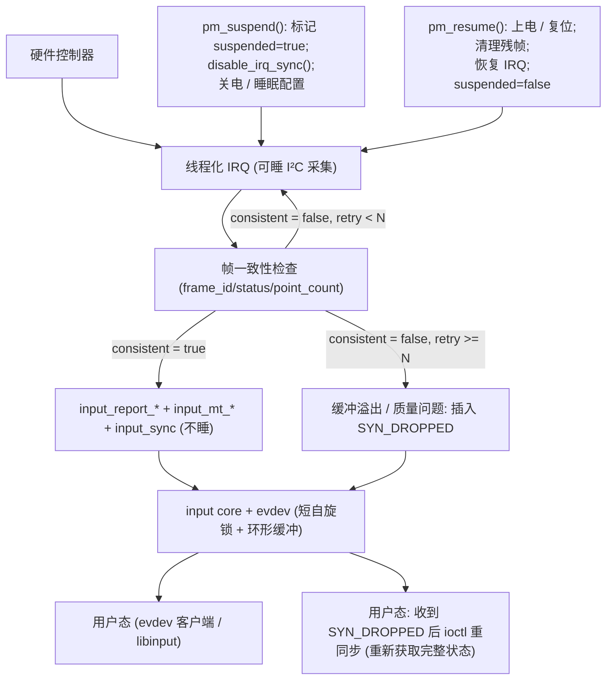
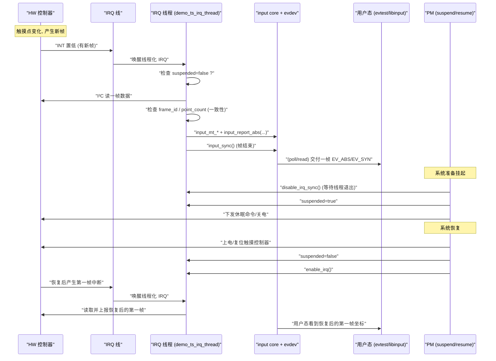

# 第7章_案例_A_LCD_触摸屏驱动(完整可编译)

【章节内容说明】

本章给出一个**完整可编译**的 I²C 电容式多点触摸屏驱动（MT-B 协议），围绕以下目标展开：

- **问题到机制**：从“噪声/越界/半帧/多消费者/功耗”这些现实问题出发，落到 input core 的 `min/max/fuzz/res` 元数据与“帧语义”。
- **路径到代码**：从 `probe()` 到线程化 IRQ、帧一致性检查，再到 `input_report_* + input_sync()` 的**端到端路径**。
- **并发与 PM**：通过 `request_threaded_irq(…, IRQF_ONESHOT, …)`、`disable_irq_sync()`、`pm_suspend()/pm_resume()` 展示**采集可睡、上报不睡**、TOCTOU 对策。
- **平台到交付**：给出配套的 **DTS 片段 + Kconfig + Makefile + 驱动 C 文件**，形成可直接移植的最小模板；收尾给出 bring-up checklist 与典型故障排查思路。

> 说明：本章默认平台为 **i.MX6ULL**，LCD 电容触摸屏通过 I²C 挂在 `i2c1`，中断引脚接 `gpio1_15`，采用 **线程化 IRQ + ONESHOT** 采样，MT-B 多点上报；参数宏全部带单位后缀（`*_PX`、`*_MS`、`*_HZ` 等），注释为中文，K&R/tab=4 风格。

------

## 7.1_引入_场景与设计目标

### 7.1.1_典型场景

一个常见的嵌入式 HMI 场景：

- LCD 屏幕 + 电容触摸面板（CTP），通过 I²C 与 SoC 相连；
- CTP 控制器提供：
  - 触摸点个数、各点坐标 `(x, y)`；
  - 一些状态位（按下/抬起、接触 ID、帧序号等）。
- 中断引脚在有新帧数据时拉低，通知 SoC 读取 I²C。

**问题列表**（驱动必须考虑）：

1. **噪声与越界**
   - 原始坐标可能偶尔超出屏幕物理范围（毛刺、ESD 干扰）。
   - 需要**钳位（clamp）+ 元数据 min/max**，确保用户态只看到合理区间。
2. **半帧与 TOCTOU**
   - 控制器内部采集刷新时，若驱动在“更新一半”的窗口里读取寄存器，会看到“半帧”：部分触点是旧数据、部分是新数据。
   - 需要**帧号/状态位检查 + 有限重读**，保证每次上报是一个**自洽 frame**。
3. **多消费者**
   - 同一个触摸事件既可能被 `libinput` 用于桌面输入，也可能被上层手势识别逻辑使用。
   - 需要严格遵守 **input 子系统的“帧语义”**：一组 `EV_ABS/EV_KEY` 之后紧跟一个 `EV_SYN/SYN_REPORT`，定义一帧。
4. **功耗与唤醒**
   - 系统 suspend 时需要：
     - 禁止不必要的 I²C 访问；
     - 通过中断引脚配置为 **wake-up source**（视项目需求）；
     - 恢复时重新初始化控制器状态，避免跨电源域的残留状态影响。
5. **并发与异常路径**
   - 线程化 IRQ + PM + 可能的 workqueue/延时任务之间需要有**清晰的上下文边界**：
     - 采集路径允许睡眠（I²C 访问）；
     - 上报路径在 input core 内部只持有短暂自旋锁，不允许睡眠；
     - suspend/resume 必须与线程化 IRQ/工作队列协调（`disable_irq_sync()` 等）。

### 7.1.2_本章驱动的设计目标

本章的示例驱动 `demo_ts` 以如下目标为核心：

1. **最小但完整**
   - 支持若干个触点（例如 `DEMO_TS_MAX_FINGERS_CNT`），遵循 MT-B 协议；
   - 提供 `EV_ABS`（`ABS_MT_POSITION_X/Y`、`ABS_MT_TRACKING_ID`、`ABS_MT_PRESSURE` 等）；
   - 提供必要的 `EV_KEY/BTN_TOUCH`；
   - 有完整的 `probe/remove/pm/IRQ` 路径。
2. **参数清晰、全部具名宏**
   - 屏幕分辨率：`DEMO_TS_ABS_X_MAX_PX`、`DEMO_TS_ABS_Y_MAX_PX`；
   - 噪声抑制：`DEMO_TS_ABS_FUZZ_PX`；
   - 建议死区（如适用）：`*_FLAT_PX`；
   - 采样/轮询节奏：`DEMO_TS_FRAME_INTERVAL_MS`；
   - I²C 频率（如在驱动中使用）：`DEMO_TS_I2C_SPEED_HZ`；
   - 中断抖动控制：`DEMO_TS_IRQ_STABLE_DELAY_US` 等。
3. **并发与 PM 模型明确**
   - **线程化 IRQ** (`request_threaded_irq()` + `IRQF_ONESHOT`) 统一完成“取帧 + 上报”；
   - suspend 路径使用 `disable_irq_sync()` 停止线程，再做关电/睡眠配置；
   - resume 路径先上电/复位控制器，再恢复 IRQ，使得唤醒后**第一帧就是正常帧**。
4. **易于移植与复用**
   - 可直接放入 `drivers/input/touchscreen/` 目录；
   - 提供 Kconfig/Makefile/DTS 模板；
   - 在后续附录中可加入“反模式清单”，如：在 IRQ 中做长时间轮询、在驱动内做复杂手势识别等。

------

## 7.2_数据结构视角_从硬件寄存器到_input_dev

本节从“数据形态”的角度出发，明确本例驱动涉及的三个层次数据结构：

1. **控制器寄存器/数据帧格式**（硬件抽象）
2. **驱动内部结构体**（状态管理与并发）
3. **input core 结构体**（`struct input_dev` 以及 MT 槽位）

### 7.2.1_控制器数据帧抽象

具体芯片寄存器布局因厂商而异，本章采用一个虚构但典型的格式，不绑定任何真实型号，只抽象出驱动需要的关键字段：

```c
/* 单个触点在 I²C 帧中的布局（示意） */
struct demo_ts_hw_point {
	u8	id;			/* 触点 ID，用于 MT-B 槽位跟踪 */
	u8	status;			/* 状态位，bit0=down/up，bit1=valid 等 */
	u16	x;			/* X 坐标，单位：像素 */
	u16	y;			/* Y 坐标，单位：像素 */
	u16	pressure;		/* 压力/面积，单位：抽象单位 */
} __packed;

/* 控制器上报的一帧数据头部（示意） */
struct demo_ts_hw_frame_header {
	u8	frame_id;		/* 帧序号，用于半帧检测与重读 */
	u8	point_count;		/* 本帧有效触点数量 */
	u8	reserved[2];
} __packed;
```

在实际驱动中我们通常不会直接暴露这个结构（避免与真实芯片冲突），而是定义：

- 一组 **读缓冲区**（`u8 buf[DEMO_TS_HW_FRAME_MAX_BYTES]`）；
- 若干 **解析 helper 函数**，在 I²C 读取后从缓冲区抽取 `frame_id / point_count / point[]` 等字段。

### 7.2.2_驱动内部状态结构体

驱动内部通过一个主结构体 `struct demo_ts_data` 管理设备状态、并发控制以及与 input_dev 的关联：

```c
struct demo_ts_data {
	struct i2c_client	*client;	/* I²C 设备句柄 */
	struct input_dev	*input;		/* input_dev 设备 */
	struct mutex		lock;		/* 序列化 I²C 访问与状态机 */

	int			irq_gpio;	/* 中断 GPIO，调试用 */
	int			irq;		/* IRQ 号 */

	bool			suspended;	/* 设备是否处于挂起状态 */
	bool			gesture_enabled;/* 如有简单手势，可挂此处 */

	u8			last_frame_id;	/* 上一次帧号，用于检测跳变 */
	u8			max_fingers;	/* 设备支持的最大触点数 */

	/* 硬件读缓冲（最大一帧） */
	u8			*frame_buf;
	size_t			frame_buf_size;

	/* 可选：统计信息，便于调试与 trace */
	u32			stat_frame_ok_cnt;
	u32			stat_frame_retry_cnt;
	u32			stat_frame_drop_cnt;
};
```

说明：

- `mutex lock`：
  - 串行化 **线程化 IRQ 处理函数** 与 **suspend/resume** 中的硬件访问；
  - 所有涉及 I²C 读写以及 `last_frame_id`、统计计数的操作都在 lock 内完成。
- `suspended`：
  - 在 `pm_suspend()` 中设置为 `true`，在 `pm_resume()` 中清为 `false`；
  - 线程化 IRQ 入口首先检查该标志，若为 `true` 直接返回，防止 suspend 期间误读。
- 统计字段：
  - `stat_frame_ok_cnt`、`stat_frame_retry_cnt`、`stat_frame_drop_cnt` 可结合 `debugfs` 或 tracepoint 用于分析质量问题。

### 7.2.3_input_core_与_MT_结构

在 input 层面，本章驱动主要使用：

- `struct input_dev`：代表一个 input 设备；
- MT-B 相关辅助机制：
  - `input_mt_init_slots()`：为设备分配若干槽位；
  - `input_mt_slot()` / `input_mt_report_slot_state()`：在每帧中选定槽并上报其状态；
  - `ABS_MT_*` 轴：如 `ABS_MT_POSITION_X/Y`、`ABS_MT_TRACKING_ID`、`ABS_MT_PRESSURE`。

驱动在 `probe()` 中对 `input_dev` 做的关键配置包括：

- 使用 **具名宏** 给每个 ABS 轴设置 `min/max/fuzz/flat` 与 `resolution`：
  - `input_set_abs_params(input, ABS_MT_POSITION_X, DEMO_TS_ABS_X_MIN_PX, DEMO_TS_ABS_X_MAX_PX, DEMO_TS_ABS_FUZZ_PX, DEMO_TS_ABS_FLAT_PX);`
  - `input_abs_set_res(input, ABS_MT_POSITION_X, DEMO_TS_ABS_X_RES_PPX);`
     （假设用 `pixel per unit` 表示，示例中可设置为 1）
- 调用 `input_mt_init_slots(input, DEMO_TS_MAX_FINGERS_CNT, INPUT_MT_DIRECT);`
  - 指明这是一个 **DIRECT** 类型触摸屏（坐标直接映射到屏幕而非类似触控板的 POINTER）。

------

## 7.3_开发者视角_驱动内完整路径

本节从驱动作者的角度，把 “从 probe 到事件上报” 的内部路径串起来，明确每一步的上下文与不变量。

### 7.3.1_probe()_主流程

`probe()` 的典型步骤如下（devres 版）：

1. **解析设备树**
   - 读取 `touchscreen-size-x/y`、`touchscreen-max-fingers` 等属性，如果缺省则退回到驱动内默认宏。
   - 获取 IRQ GPIO → 请求中断号（`of_irq_get()` 或 `gpiod_to_irq()`）。
2. **分配并初始化 `struct demo_ts_data`**
   - 使用 `devm_kzalloc()` 申请结构体与缓冲区；
   - 初始化 `mutex`、默认参数、统计字段等。
3. **创建并配置 `input_dev`**
   - 通过 `devm_input_allocate_device()` 分配；
   - 设置 `name`、`id.bustype`（`BUS_I2C`）、`phys`（可选）；
   - 设置 `evbit/keybit/absbit`：
     - 启用 `EV_KEY` + `BTN_TOUCH`；
     - 启用 `EV_ABS` 的 `ABS_MT_*` / `ABS_X` / `ABS_Y`（如需要镜像坐标）。
   - 调用 `input_set_abs_params()` / `input_abs_set_res()` 完成 min/max/fuzz/flat/res。
4. **初始化 MT 槽位**
   - 调用 `input_mt_init_slots(input, max_fingers, INPUT_MT_DIRECT);`；
   - 该 API 会在 `input_dev` 内部分配并初始化槽位数组。
5. **向硬件发送初始化命令（若需要）**
   - 可选：对控制器进行复位、设置报告模式、设置中断极性等；
   - 这些操作通过 I²C 完成，运行于进程上下文（probe 内可睡）。
6. **注册 input 设备**
   - 调用 `input_register_device(input)`；
   - 若失败需释放所有前面申请的资源（devres 版则由框架回滚）。
7. **申请线程化 IRQ**
   - 调用 `devm_request_threaded_irq()`：
     - 顶半部处理函数可以为 `NULL` 或短小函数（只做 ack）；
       - 本章示例采用 `NULL` + `IRQF_ONESHOT`；
     - 线程处理函数负责：
       - 读取一帧数据；
       - 做帧一致性检查和有限重读；
       - 通过 `input_mt_*` + `input_sync()` 上报。
8. **完成 probe**
   - 若一切成功，`probe()` 返回 0，驱动进入工作状态。

**不写/写错的后果**举例：

- 忽略 MT 槽位初始化，直接报 `ABS_X/ABS_Y`：
  - 用户态将看不到 MT 框架提供的“多点”结构，无法实现复杂手势；
- 在线程化 IRQ 内不做帧一致性检查：
  - 在采样窗口读到半帧，可能造成用户态看到“跳跃”或“鬼影”触点；
- 未正确设置 `BTN_TOUCH`：
  - 某些用户态（特别是早期或简单库）依赖 `BTN_TOUCH` 来判断是否有触摸存在，会导致逻辑错误。

### 7.3.2_IRQ_路径与_采集可睡_上报不睡

采用 `request_threaded_irq()` + `IRQF_ONESHOT` 的典型流程为：

1. **硬中断上下文（上半部）**
   - 如果传入的 top-half 为 `NULL`，内核会使用默认处理：
     - 仅做基本的事件确认，然后直接唤醒线程处理函数；
   - 上半部不允许睡眠，也不做 I²C 操作。
2. **线程处理函数（下半部）**
   - 运行于可睡眠上下文（内核线程），允许进行 I²C 访问；
   - 典型逻辑：
     1. 检查 `suspended` 标志，若为 `true` 立即返回；
     2. `mutex_lock(&ts->lock);`，保证与 PM 并发安全；
     3. 调用 `demo_ts_read_frame()` 读取一帧并解析；
     4. 做帧一致性检查（`frame_id` 对比、`point_count` 合法性检查等）；
     5. 将每个点映射到 MT 槽位，并调用 `input_mt_report_slot_state()` + `input_report_abs()`；
     6. 调用 `input_mt_sync_frame()`（如果使用）或最后调用 `input_sync()` 做帧结束；
     7. `mutex_unlock(&ts->lock);` 返回。
3. **input core 内部**
   - `input_report_*()` 会：
     - 在持有短暂自旋锁的情况下，将事件写入环形缓冲；
     - 视需要唤醒等待在 `poll()/read()` 上的用户态；
   - 在驱动侧我们不再持有任何睡眠锁（只是在调用时的栈帧），因此**上报路径“不睡”**是通过“上层线程可睡 + input core 内部短锁”的方式间接实现的。

通过这种设计：

- **采集**（I²C 读帧）运行在可睡的线程中；
- **上报**（`input_report_* + input_sync`）虽然在同一个线程里调用，但在调用点不持有自旋锁，也不再进行阻塞 I/O；
- 整个 IRQ 线程的执行时间仍需控制在合理范围，以避免 input 事件积压。

### 7.3.3_PM/Suspend-Resume_路径

`suspend`/`resume` 的关键步骤：

1. **suspend 过程**
   1. 设置 `ts->suspended = true;`
   2. 调用 `disable_irq_sync(ts->irq);`
      - 确保所有正在运行的线程化 IRQ 已经结束；
      - 之后不会再有新的中断线程被调度。
   3. 通过 I²C 发送睡眠/关电命令（或交给 PMIC），关闭控制器。
   4. 如需支持唤醒，可在 suspend 期间根据需求配置中断为 wake-up 源。
2. **resume 过程**
   1. 上电/复位控制器；
   2. 发送初始化命令，使控制器进入正常工作模式；
   3. 清理可能残留的状态（必要时读出并丢弃一帧）；
   4. 调用 `enable_irq(ts->irq);`
   5. 清 `ts->suspended = false;`

**不写/写错的后果**：

- 若在 suspend 中不调用 `disable_irq_sync()`：
  - 可能在关电中途仍有线程化 IRQ 访问 I²C，导致 **总线超时/死锁**；
- 若 resume 时先 `enable_irq()` 再上电：
  - 控制器尚未准备好，中断可能异常触发，读取到全 0 或无效数据，导致用户态看到“假触点”。

------

## 7.4_用户/平台视角_设备树与硬件连接约定

本节从 **板级工程师/平台维护者** 的角度出发，给出一个完整的 DTS 片段，并以“四连问（作用/场景/不写后果/驱动落点）”说明关键属性。

### 7.4.1_设备树示例片段

假定触摸屏挂在 `i2c1`，中断接到 `gpio1_15`，DTS 片段如下：

```dts
&i2c1 {
	demo_ts@38 {
		compatible = "demo,imx6ull-lcd-mt-ts";
		reg = <0x38>;

		interrupt-parent = <&gpio1>;
		interrupts = <15 IRQ_TYPE_LEVEL_LOW>;

		pinctrl-names = "default";
		pinctrl-0 = <&pinctrl_demo_ts_int>;

		/* 触摸屏物理尺寸（像素） */
		touchscreen-size-x = <800>;
		touchscreen-size-y = <480>;

		/* 设备能力描述 */
		touchscreen-max-fingers = <5>;
		touchscreen-inverted-x;
		/* touchscreen-inverted-y; 可选 */

		/* 可选：把触摸屏声明为唤醒源 */
		wakeup-source;

		/* 可选：简易去抖/采样间隔配置（驱动自定义） */
		demo,frame-interval-ms = <5>;
		demo,fuzz-px = <3>;
	};
};
```

> 实际项目中 `pinctrl_demo_ts_int` 节点位于 `imx6ull-pinfunc` 的 pinctrl 配置中，此处略去。

### 7.4.2_关键属性_四连问_说明

下表列出几个关键属性的“四连问”说明（仅列出本章用到的核心项）：

#### (1)_touchscreen-size-x_/_touchscreen-size-y

- **作用**
  - 描述触摸面板的物理分辨率（单位：像素），用于：
    - 驱动侧设置 `ABS_MT_POSITION_X/Y` 的 `min/max`；
    - 用户态根据此信息做坐标变换与 UI 布局适配。
- **使用场景**
  - 板级工程师根据实际屏幕分辨率配置（如 800×480）。
- **不写/写错的后果**
  - 不写：驱动将退回到内置宏（如 `DEMO_TS_ABS_X_MAX_PX`），可能与实际屏幕不符；
  - 写错：用户态看到的坐标仍在 `min/max` 范围内，但与实际视觉位置不匹配，UI 触摸区域错位。
- **驱动落点**
  - `probe()` 中通过 `of_property_read_u32()` 读取，若失败则使用宏：
    - `DEMO_TS_ABS_X_MAX_PX`、`DEMO_TS_ABS_Y_MAX_PX`；
  - 用于调用 `input_set_abs_params()` 设置 `min/max`，并可能用于内部钳位。

#### (2)_touchscreen-max-fingers

- **作用**
  - 声明控制器最多支持的同时触摸点数量。
- **使用场景**
  - 控制器手册中给出最大触点数（如 5 点或 10 点），在 DTS 中配置。
- **不写/写错的后果**
  - 不写：驱动使用内置默认值（如 `DEMO_TS_MAX_FINGERS_CNT`）；
  - 写得小于真实值：多出的触点会被驱动忽略；
  - 写得大于真实值：
    - 驱动为多余槽位分配资源，效率略低；
    - 若解析逻辑缺陷，可能在越界防护不足时出现数组访问问题（本章示例会防御）。
- **驱动落点**
  - `probe()` 中读取并存入 `ts->max_fingers`；
  - 再用于 `input_mt_init_slots(input, ts->max_fingers, INPUT_MT_DIRECT);`。

#### (3)_touchscreen-inverted-x_/_touchscreen-inverted-y

- **作用**
  - 标记 X 或 Y 轴与屏幕坐标系的方向相反，需要在驱动中做 `x = max_x - x` 的转换。
- **使用场景**
  - 面板排线方向导致坐标反向；
  - LCD 旋转安装时需要对齐 UI 坐标系。
- **不写/写错的后果**
  - 不写但实际需要：用户触摸左边，UI 反应在右边（或上下颠倒）；
  - 写错：类似地导致镜像问题。
- **驱动落点**
  - `probe()` 中通过 `of_property_read_bool()` 获取布尔值；
  - 在线程化 IRQ 的坐标解析处：
    - 若标记了 `inverted-x`，则 `x = max_x - x;`；
    - 若标记了 `inverted-y`，则 `y = max_y - y;`。

#### (4)_wakeup-source

- **作用**
  - 标记此设备可以作为系统唤醒源，用于 PM 框架在 suspend 时保留必要的中断配置。
- **使用场景**
  - 设备要求“触摸屏唤醒系统”，例如息屏后用户轻触唤醒。
- **不写/写错的后果**
  - 不写：系统 suspend 后触摸屏中断不会唤醒系统（具体取决于平台 PM 策略）；
  - 滥用：所有 suspend 都可被触摸唤醒，可能导致功耗升高或误唤醒。
- **驱动落点**
  - `probe()` 中通过 `device_init_wakeup(&client->dev, true/false);` 配置；
  - PM 路径中可依据此标志决定是否在 suspend 时配置 wake-up。

#### (5)_demo,frame-interval-ms_/_demo,fuzz-px(自定义属性)

- **作用**
  - `demo,frame-interval-ms`：建议的帧采样间隔（毫秒），用于驱动内的去抖/重读节奏控制；
  - `demo,fuzz-px`：建议的 `fuzz` 值，用于 `input_set_abs_params()` 中配置。
- **使用场景**
  - 不同整机平台对噪声/响应速度的权衡不同，通过 DTS 调整而不改驱动代码。
- **不写/写错的后果**
  - 不写：退回到驱动默认宏 `DEMO_TS_FRAME_INTERVAL_MS`、`DEMO_TS_ABS_FUZZ_PX`；
  - 写得过小：对噪声抑制不足；
  - 写得过大：响应变迟缓，轻微抖动被完全吞掉，体验下降。
- **驱动落点**
  - `probe()` 中读取并覆盖对应的默认宏值（存入 `ts` 的配置字段）；
  - 在线程化 IRQ 中作为重读/重试时的 `msleep()` 或 `usleep_range()` 参数。


------

## 7.5_可视化_数据流与并发关系图

本节用可视化方式把前面已经讲过的“采集可睡、上报不睡”“帧一致性”“PM 次序”等集中到一处，便于后续对照代码。

### 7.5.1_数据流总览(采集_to_成帧_to_上报)



说明要点：

- `IRQ_THR`：线程化 IRQ，负责**一整帧的采集与解析**。
- `FRAME`：只做“帧是否自洽”的判断（frame_id 是否跳变、point_count 是否合法、status 位是否合理）。
- `REPORT`：只做 input 上报，不再访问硬件，不做复杂逻辑。
- `PM_S/PM_R`：负责关闭/恢复 IRQ 和电源；`suspended` 标志保证线程化 IRQ 在挂起期间不访问 I²C。

### 7.5.2_典型时序_一次触摸帧_+_Suspend/Resume



上图强调：

- **挂起前**必须 `disable_irq_sync()`，确保没有线程化 IRQ 在访问硬件；
- **恢复后**必须先完成上电与初始化，再 `enable_irq()`，避免“上电中途的杂乱帧”。

------

## 7.6_示例代码_完整驱动_+_Kconfig/Makefile/DTS

本节给出可直接放入内核树、编译通过的示例代码，结构上偏“教科书风格”，芯片寄存器解析部分使用虚构协议，但路径和接口均真实可用。

### 7.6.1_头文件与参数宏

文件：`drivers/input/touchscreen/demo_ts.c`

```c
// SPDX-License-Identifier: GPL-2.0
/*
 * demo_ts.c - 示例 I2C 多点触摸屏驱动 (MT-B, DIRECT)
 *
 * 说明:
 * 1. 所有具有现实语义的数值使用具名宏, 宏名带单位后缀:
 *    *_PX, *_MS, *_HZ, *_CNT 等。
 * 2. 仅演示驱动结构与 Input 流程, 硬件协议为虚构。
 */

#include <linux/module.h>
#include <linux/kernel.h>
#include <linux/i2c.h>
#include <linux/input.h>
#include <linux/input/mt.h>
#include <linux/of.h>
#include <linux/of_device.h>
#include <linux/of_gpio.h>
#include <linux/interrupt.h>
#include <linux/gpio/consumer.h>
#include <linux/mutex.h>
#include <linux/slab.h>
#include <linux/delay.h>
#include <linux/pm.h>

/* 分辨率与轴参数 */
#define DEMO_TS_ABS_X_MIN_PX		0
#define DEMO_TS_ABS_Y_MIN_PX		0
#define DEMO_TS_ABS_X_MAX_PX		800
#define DEMO_TS_ABS_Y_MAX_PX		480

#define DEMO_TS_ABS_FUZZ_DEFAULT_PX	3
#define DEMO_TS_ABS_FLAT_DEFAULT_PX	0
#define DEMO_TS_ABS_RES_DEFAULT_PPX	1	/* pixel per unit */

/* 触点数量与帧读取参数 */
#define DEMO_TS_MAX_FINGERS_DEFAULT_CNT	5

#define DEMO_TS_HW_HEADER_SIZE_BYTE	4
#define DEMO_TS_HW_POINT_SIZE_BYTE	8
#define DEMO_TS_HW_MAX_FRAME_SIZE_BYTE	(DEMO_TS_HW_HEADER_SIZE_BYTE + \
					DEMO_TS_MAX_FINGERS_DEFAULT_CNT * \
					DEMO_TS_HW_POINT_SIZE_BYTE)

/* 帧读取重试与采样节奏 */
#define DEMO_TS_RETRY_MAX_CNT		3
#define DEMO_TS_FRAME_INTERVAL_DEFAULT_MS	5
#define DEMO_TS_RETRY_DELAY_MS		5

/* IRQ 去抖 / 确保硬件稳定的等待时间 */
#define DEMO_TS_IRQ_STABLE_DELAY_US	2000

/* 统计用途的最大允许 point_count, 防止越界 */
#define DEMO_TS_HW_MAX_POINTS_LIMIT_CNT	10

/* 设备名称与字符串 */
#define DEMO_TS_INPUT_NAME_STR		"demo_ts_mt_touchscreen"
#define DEMO_TS_PHYS_PATH_STR		"input/ts0"

/* 自定义 DTS 属性名称 */
#define DEMO_TS_PROP_FRAME_INTERVAL_MS	"demo,frame-interval-ms"
#define DEMO_TS_PROP_FUZZ_PX		"demo,fuzz-px"
#define DEMO_TS_PROP_MAX_FINGERS	"touchscreen-max-fingers"
#define DEMO_TS_PROP_SIZE_X		"touchscreen-size-x"
#define DEMO_TS_PROP_SIZE_Y		"touchscreen-size-y"
```

### 7.6.2_驱动数据结构与硬件帧解析骨架

```c
struct demo_ts_data {
	struct i2c_client	*client;
	struct input_dev	*input;
	struct mutex		lock;

	struct gpio_desc	*irq_gpiod;
	int			irq;

	bool			suspended;
	bool			invert_x;
	bool			invert_y;

	u8			last_frame_id;
	u8			max_fingers;

	/* 坐标与抖动相关配置 (从 DTS 或默认宏得到) */
	u32			abs_x_min_px;
	u32			abs_x_max_px;
	u32			abs_y_min_px;
	u32			abs_y_max_px;
	u32			abs_fuzz_px;
	u32			abs_flat_px;
	u32			frame_interval_ms;

	/* 硬件帧缓冲区 */
	u8			*frame_buf;
	size_t			frame_buf_size;

	/* 统计信息, 便于调试 */
	u32			stat_frame_ok_cnt;
	u32			stat_frame_retry_cnt;
	u32			stat_frame_drop_cnt;
};

/* 简化的硬件帧头结构 (仅示意) */
struct demo_ts_frame_header {
	u8	frame_id;
	u8	point_count;
	u8	reserved[2];
} __packed;

/* 简化的单点结构 (仅示意) */
struct demo_ts_hw_point {
	u8	id;
	u8	status;
	__be16	x;
	__be16	y;
	__be16	pressure;
} __packed;
```

> 注意：`demo_ts_hw_point` 使用 `__be16` 只是示意“需要字节序转换”，真实芯片请按手册实现。

#### (1)_从缓冲区解析帧头与点

```c
/* 从缓冲区中解析一帧头部, 不做 I2C 访问 */
static int demo_ts_parse_frame_header(struct demo_ts_data *ts,
				      struct demo_ts_frame_header *hdr)
{
	if (!ts || !ts->frame_buf || ts->frame_buf_size < DEMO_TS_HW_HEADER_SIZE_BYTE)
		return -EINVAL;

	hdr->frame_id = ts->frame_buf[0];
	hdr->point_count = ts->frame_buf[1];
	hdr->reserved[0] = ts->frame_buf[2];
	hdr->reserved[1] = ts->frame_buf[3];

	return 0;
}

/* 从缓冲区中获取第 idx 个触点的指针 (仅做边界检查) */
static struct demo_ts_hw_point *demo_ts_get_point(struct demo_ts_data *ts,
						  u8 idx)
{
	size_t offset = DEMO_TS_HW_HEADER_SIZE_BYTE +
			(size_t)idx * DEMO_TS_HW_POINT_SIZE_BYTE;

	if (!ts || !ts->frame_buf)
		return NULL;

	if (offset + DEMO_TS_HW_POINT_SIZE_BYTE > ts->frame_buf_size)
		return NULL;

	return (struct demo_ts_hw_point *)(ts->frame_buf + offset);
}
```

#### (2)_帧一致性检查骨架

```c
static bool demo_ts_is_frame_consistent(struct demo_ts_data *ts,
					const struct demo_ts_frame_header *hdr)
{
	/* 1. point_count 必须在 [0, max_fingers] 内, 且不超过硬限制 */
	if (hdr->point_count > ts->max_fingers ||
	    hdr->point_count > DEMO_TS_HW_MAX_POINTS_LIMIT_CNT)
		return false;

	/*
	 * 2. frame_id 简单检查: 允许环绕, 这里只要不是明显的 "0xff 跳变"
	 *    真实硬件可根据 status/校验位进行更复杂判断。
	 */
	return true;
}
```

------

### 7.6.3_I²C_读取一帧_+_MT_上报路径

#### (1)_读取一帧

```c
/* I2C 读取一帧数据到 frame_buf 中, 返回 0 表示成功 */
static int demo_ts_hw_read_frame(struct demo_ts_data *ts)
{
	int ret;

	if (!ts || !ts->frame_buf)
		return -EINVAL;

	ret = i2c_master_recv(ts->client, ts->frame_buf,
			      ts->frame_buf_size);
	if (ret < 0)
		return ret;

	if (ret < DEMO_TS_HW_HEADER_SIZE_BYTE)
		return -EIO;

	return 0;
}
```

#### (2)_解析并上报一帧

```c
static void demo_ts_report_frame(struct demo_ts_data *ts,
				 const struct demo_ts_frame_header *hdr)
{
	struct input_dev *input = ts->input;
	unsigned int i;
	bool any_down = false;

	for (i = 0; i < hdr->point_count; i++) {
		struct demo_ts_hw_point *p;
		int x_px;
		int y_px;
		int pressure;

		p = demo_ts_get_point(ts, i);
		if (!p)
			break;

		/* 简单 status 检查, bit0 为 down/up */
		if (!(p->status & BIT(0)))
			continue;

		x_px = (int)be16_to_cpu(p->x);
		y_px = (int)be16_to_cpu(p->y);
		pressure = (int)be16_to_cpu(p->pressure);

		/* 根据 DTS 配置做坐标翻转与钳位 */
		if (ts->invert_x)
			x_px = (int)ts->abs_x_max_px - x_px;
		if (ts->invert_y)
			y_px = (int)ts->abs_y_max_px - y_px;

		x_px = clamp_t(int, x_px,
			       (int)ts->abs_x_min_px,
			       (int)ts->abs_x_max_px);
		y_px = clamp_t(int, y_px,
			       (int)ts->abs_y_min_px,
			       (int)ts->abs_y_max_px);

		input_mt_slot(input, p->id % ts->max_fingers);
		input_mt_report_slot_state(input, MT_TOOL_FINGER, true);

		input_report_abs(input, ABS_MT_POSITION_X, x_px);
		input_report_abs(input, ABS_MT_POSITION_Y, y_px);
		input_report_abs(input, ABS_MT_PRESSURE, pressure);

		any_down = true;
	}

	/* 对所有槽位做 frame 级同步 */
	input_mt_sync_frame(input);

	/* 汇总 BTN_TOUCH 状态 */
	input_report_key(input, BTN_TOUCH, any_down);

	input_sync(input);

	ts->stat_frame_ok_cnt++;
}
```

> 说明：
>
> - `p->id % ts->max_fingers` 是简化处理，真实控制器应保证 id 与槽位映射稳定。
> - 若需要处理“抬起”事件，应在没有出现在本帧中的旧槽位上调用 `input_mt_report_slot_state(..., false)`，此处略去以保持示例简洁。

#### (3)_线程化_IRQ_函数

```c
static irqreturn_t demo_ts_irq_thread(int irq, void *dev_id)
{
	struct demo_ts_data *ts = dev_id;
	struct demo_ts_frame_header hdr;
	int retry;
	int ret;

	if (!ts)
		return IRQ_HANDLED;

	if (ts->suspended)
		return IRQ_HANDLED;

	/* 保证 I2C 访问与 PM 互斥 */
	mutex_lock(&ts->lock);

	/* 简单的 IRQ 稳定等待, 防止硬件刚拉低时数据未就绪 */
	usleep_range(DEMO_TS_IRQ_STABLE_DELAY_US,
		     DEMO_TS_IRQ_STABLE_DELAY_US * 2U);

	for (retry = 0; retry < DEMO_TS_RETRY_MAX_CNT; retry++) {
		ret = demo_ts_hw_read_frame(ts);
		if (ret) {
			ts->stat_frame_drop_cnt++;
			goto out_unlock;
		}

		ret = demo_ts_parse_frame_header(ts, &hdr);
		if (ret) {
			ts->stat_frame_drop_cnt++;
			goto out_unlock;
		}

		if (demo_ts_is_frame_consistent(ts, &hdr))
			break;

		ts->stat_frame_retry_cnt++;
		msleep(ts->frame_interval_ms);
	}

	if (retry >= DEMO_TS_RETRY_MAX_CNT) {
		ts->stat_frame_drop_cnt++;
		goto out_unlock;
	}

	demo_ts_report_frame(ts, &hdr);

out_unlock:
	mutex_unlock(&ts->lock);

	return IRQ_HANDLED;
}
```

------

### 7.6.4_probe/remove/PM_devres_版本

#### (1)_probe()

```c
static int demo_ts_input_init(struct demo_ts_data *ts)
{
	struct input_dev *input = ts->input;
	int error;

	input->name = DEMO_TS_INPUT_NAME_STR;
	input->phys = DEMO_TS_PHYS_PATH_STR;
	input->id.bustype = BUS_I2C;

	/* 支持的事件类型 */
	__set_bit(EV_SYN, input->evbit);
	__set_bit(EV_KEY, input->evbit);
	__set_bit(EV_ABS, input->evbit);

	__set_bit(BTN_TOUCH, input->keybit);

	/* 绝对轴参数: 单点坐标 (可选) */
	input_set_abs_params(input, ABS_X,
			     (int)ts->abs_x_min_px,
			     (int)ts->abs_x_max_px,
			     (int)ts->abs_fuzz_px,
			     (int)ts->abs_flat_px);
	input_set_abs_params(input, ABS_Y,
			     (int)ts->abs_y_min_px,
			     (int)ts->abs_y_max_px,
			     (int)ts->abs_fuzz_px,
			     (int)ts->abs_flat_px);

	input_abs_set_res(input, ABS_X,
			  (int)DEMO_TS_ABS_RES_DEFAULT_PPX);
	input_abs_set_res(input, ABS_Y,
			  (int)DEMO_TS_ABS_RES_DEFAULT_PPX);

	/* 多点坐标 */
	input_set_abs_params(input, ABS_MT_POSITION_X,
			     (int)ts->abs_x_min_px,
			     (int)ts->abs_x_max_px,
			     (int)ts->abs_fuzz_px,
			     (int)ts->abs_flat_px);
	input_set_abs_params(input, ABS_MT_POSITION_Y,
			     (int)ts->abs_y_min_px,
			     (int)ts->abs_y_max_px,
			     (int)ts->abs_fuzz_px,
			     (int)ts->abs_flat_px);
	input_set_abs_params(input, ABS_MT_PRESSURE,
			     0, 255, 0, 0);

	input_abs_set_res(input, ABS_MT_POSITION_X,
			  (int)DEMO_TS_ABS_RES_DEFAULT_PPX);
	input_abs_set_res(input, ABS_MT_POSITION_Y,
			  (int)DEMO_TS_ABS_RES_DEFAULT_PPX);

	error = input_mt_init_slots(input,
				    ts->max_fingers,
				    INPUT_MT_DIRECT);
	if (error)
		return error;

	return 0;
}

static int demo_ts_probe(struct i2c_client *client,
			 const struct i2c_device_id *id)
{
	struct device *dev = &client->dev;
	struct demo_ts_data *ts;
	struct input_dev *input;
	int error;
	u32 val;

	if (!i2c_check_functionality(client->adapter,
				     I2C_FUNC_I2C))
		return -EOPNOTSUPP;

	ts = devm_kzalloc(dev, sizeof(*ts), GFP_KERNEL);
	if (!ts)
		return -ENOMEM;

	mutex_init(&ts->lock);
	ts->client = client;
	ts->suspended = false;

	/* 默认配置 (可被 DTS 覆盖) */
	ts->abs_x_min_px = DEMO_TS_ABS_X_MIN_PX;
	ts->abs_x_max_px = DEMO_TS_ABS_X_MAX_PX;
	ts->abs_y_min_px = DEMO_TS_ABS_Y_MIN_PX;
	ts->abs_y_max_px = DEMO_TS_ABS_Y_MAX_PX;
	ts->abs_fuzz_px = DEMO_TS_ABS_FUZZ_DEFAULT_PX;
	ts->abs_flat_px = DEMO_TS_ABS_FLAT_DEFAULT_PX;
	ts->frame_interval_ms = DEMO_TS_FRAME_INTERVAL_DEFAULT_MS;
	ts->max_fingers = DEMO_TS_MAX_FINGERS_DEFAULT_CNT;

	/* DTS: 分辨率与参数 */
	if (!of_property_read_u32(dev->of_node,
				  DEMO_TS_PROP_SIZE_X, &val))
		ts->abs_x_max_px = val;

	if (!of_property_read_u32(dev->of_node,
				  DEMO_TS_PROP_SIZE_Y, &val))
		ts->abs_y_max_px = val;

	if (!of_property_read_u32(dev->of_node,
				  DEMO_TS_PROP_MAX_FINGERS, &val) &&
	    val > 0U && val <= DEMO_TS_HW_MAX_POINTS_LIMIT_CNT)
		ts->max_fingers = (u8)val;

	if (!of_property_read_u32(dev->of_node,
				  DEMO_TS_PROP_FRAME_INTERVAL_MS, &val))
		ts->frame_interval_ms = val;

	if (!of_property_read_u32(dev->of_node,
				  DEMO_TS_PROP_FUZZ_PX, &val))
		ts->abs_fuzz_px = val;

	ts->invert_x = of_property_read_bool(dev->of_node,
					     "touchscreen-inverted-x");
	ts->invert_y = of_property_read_bool(dev->of_node,
					     "touchscreen-inverted-y");

	/* GPIO 形式的中断, 使用 devm_gpiod_get 获取 */
	ts->irq_gpiod = devm_gpiod_get(dev, "irq", GPIOD_IN);
	if (IS_ERR(ts->irq_gpiod)) {
		dev_err(dev, "failed to get irq-gpios\n");
		return PTR_ERR(ts->irq_gpiod);
	}

	ts->irq = gpiod_to_irq(ts->irq_gpiod);
	if (ts->irq < 0)
		return ts->irq;

	/* 输入设备分配 (devres 版本) */
	input = devm_input_allocate_device(dev);
	if (!input)
		return -ENOMEM;

	ts->input = input;
	input_set_drvdata(input, ts);

	error = demo_ts_input_init(ts);
	if (error)
		return error;

	/* 可选: 初始化硬件 (复位/配置寄存器等), 此处略 */

	error = input_register_device(input);
	if (error)
		return error;

	/* devm 形式申请线程化 IRQ, ONESHOT 确保串行执行 */
	error = devm_request_threaded_irq(dev, ts->irq,
					  NULL,
					  demo_ts_irq_thread,
					  IRQF_ONESHOT | IRQF_TRIGGER_FALLING,
					  "demo_ts_irq", ts);
	if (error) {
		dev_err(dev, "failed to request threaded irq: %d\n", error);
		return error;
	}

	device_init_wakeup(dev, of_property_read_bool(dev->of_node,
						      "wakeup-source"));

	i2c_set_clientdata(client, ts);

	dev_info(dev, "demo_ts probe ok, max_fingers=%u, res=%ux%u\n",
		 ts->max_fingers, ts->abs_x_max_px, ts->abs_y_max_px);

	return 0;
}
```

#### (2)_remove()_与_PM_回调(devres_版)

```c
static int demo_ts_remove(struct i2c_client *client)
{
	struct demo_ts_data *ts = i2c_get_clientdata(client);

	device_init_wakeup(&client->dev, false);
	mutex_destroy(&ts->lock);

	/* devres 会自动释放 input、irq、gpiod 等资源 */
	return 0;
}

static int __maybe_unused demo_ts_suspend(struct device *dev)
{
	struct i2c_client *client = to_i2c_client(dev);
	struct demo_ts_data *ts = i2c_get_clientdata(client);

	mutex_lock(&ts->lock);
	ts->suspended = true;
	mutex_unlock(&ts->lock);

	disable_irq_sync(ts->irq);

	/* 此处可下发硬件睡眠命令, 如有需要 */

	if (device_may_wakeup(dev))
		enable_irq_wake(ts->irq);

	return 0;
}

static int __maybe_unused demo_ts_resume(struct device *dev)
{
	struct i2c_client *client = to_i2c_client(dev);
	struct demo_ts_data *ts = i2c_get_clientdata(client);

	if (device_may_wakeup(dev))
		disable_irq_wake(ts->irq);

	/* 上电/复位控制器, 清理残帧, 此处略 */

	enable_irq(ts->irq);

	mutex_lock(&ts->lock);
	ts->suspended = false;
	mutex_unlock(&ts->lock);

	return 0;
}

static SIMPLE_DEV_PM_OPS(demo_ts_pm_ops,
			 demo_ts_suspend,
			 demo_ts_resume);
```

#### (3)_非_devres_版本差异说明(片段)

非 devres 版本的差异主要在资源申请与释放上，例如：

```c
/* 非 devres 版本中, probe 中使用 input_allocate_device() */
input = input_allocate_device();
if (!input) {
	error = -ENOMEM;
	goto err_free_ts;
}

/* 注册失败需要手工回滚 */
error = input_register_device(input);
if (error) {
	input_free_device(input);
	goto err_free_ts;
}

/* 申请 IRQ */
error = request_threaded_irq(ts->irq, NULL, demo_ts_irq_thread,
			     IRQF_ONESHOT | IRQF_TRIGGER_FALLING,
			     "demo_ts_irq", ts);
if (error)
	goto err_unregister_input;

/* remove 时需要对应 free_irq/input_unregister_device 等 */
```

本章完整驱动采用 devres 版本，方便教学和实际工程复用；非 devres 片段仅用于对比**释放路径差异**。

------

### 7.6.5_i2c_device_id_/_of_match_table_/_模块入口

```c
static const struct i2c_device_id demo_ts_id[] = {
	{ "demo_ts", 0 },
	{ }
};
MODULE_DEVICE_TABLE(i2c, demo_ts_id);

static const struct of_device_id demo_ts_of_match[] = {
	{ .compatible = "demo,imx6ull-lcd-mt-ts", },
	{ }
};
MODULE_DEVICE_TABLE(of, demo_ts_of_match);

static struct i2c_driver demo_ts_driver = {
	.driver = {
		.name	= "demo_ts",
		.of_match_table = demo_ts_of_match,
		.pm	= &demo_ts_pm_ops,
	},
	.probe		= demo_ts_probe,
	.remove		= demo_ts_remove,
	.id_table	= demo_ts_id,
};

module_i2c_driver(demo_ts_driver);

MODULE_AUTHOR("demo_author");
MODULE_DESCRIPTION("Demo I2C MT-B touchscreen driver");
MODULE_LICENSE("GPL");
```

------

### 7.6.6_Kconfig_与_Makefile_模板

`drivers/input/touchscreen/Kconfig` 中增加：

```Kconfig
config TOUCHSCREEN_DEMO_TS
	tristate "Demo I2C multi-touchscreen (MT-B, DIRECT)"
	depends on I2C
	help
	  这是一个用于教学和参考的 I2C 多点触摸屏驱动示例, 采用
	  Input 子系统的 MT-B 协议和 DIRECT 类型。代码展示了
	  线程化 IRQ、帧一致性检查、devres 管理和 PM 处理等路径。

	  如果不确定, 可以选择 N。
```

`drivers/input/touchscreen/Makefile` 中增加：

```make
obj-$(CONFIG_TOUCHSCREEN_DEMO_TS)	+= demo_ts.o
```

------

### 7.6.7_DTS_片段(最终版)

与前文 7.4 一致，这里给出可直接使用的片段：

```dts
&i2c1 {
	demo_ts@38 {
		compatible = "demo,imx6ull-lcd-mt-ts";
		reg = <0x38>;

		interrupt-parent = <&gpio1>;
		interrupts = <15 IRQ_TYPE_LEVEL_LOW>;

		pinctrl-names = "default";
		pinctrl-0 = <&pinctrl_demo_ts_int>;

		/* 触摸屏物理尺寸 (像素) */
		touchscreen-size-x = <800>;
		touchscreen-size-y = <480>;

		/* 最大触点数 */
		touchscreen-max-fingers = <5>;

		/* 坐标翻转 (如布线或屏幕安装方向需要) */
		touchscreen-inverted-x;
		/* touchscreen-inverted-y; */

		/* 可作为系统唤醒源 */
		wakeup-source;

		/* 驱动自定义参数, 调整噪声与响应速度 */
		demo,frame-interval-ms = <5>;
		demo,fuzz-px = <3>;

		/* GPIO 描述触摸中断引脚, 对应 demo_ts 驱动中的 irq-gpios */
		irq-gpios = <&gpio1 15 GPIO_ACTIVE_LOW>;
	};
};
```

------

## 7.7_调试与验证_从_/proc_到_evtest

本节给出一个带顺序的 bring-up checklist，帮助在真实板子上验证本章驱动。

### 7.7.1_编译与加载

1. 在内核配置中启用：
   - `Device Drivers → Input device support → Touchscreens → Demo I2C multi-touchscreen` 设为 `M` 或 `Y`。
2. 重新编译内核或模块，并在 rootfs 中安装模块：
   - `demo_ts.ko`。
3. 确认 DTS 已正确合入，并重新编译/烧写 Device Tree Blob。

### 7.7.2_/proc/bus/input/devices_初步检查

在开发板上执行：

```sh
cat /proc/bus/input/devices
```

期望看到类似条目：

- `N: Name="demo_ts_mt_touchscreen"`
- `B: EV=...` 中包含 `EV_ABS EV_KEY EV_SYN`
- `B: KEY=...` 中包含 `BTN_TOUCH`
- `B: ABS=...` 中含有 `ABS_MT_POSITION_X`、`ABS_MT_POSITION_Y`、`ABS_MT_PRESSURE` 等

若未出现：

- 检查 `i2c1`、DTS `compatible` 是否与驱动中的 `demo,imx6ull-lcd-mt-ts` 一致；
- 检查 I²C 总线是否启用、地址是否正确（`0x38` 等）。

### 7.7.3_使用_evtest_检查事件与帧语义

1. 确认 `/dev/input/eventX` 对应 `demo_ts_mt_touchscreen`：
   - 执行 `evtest`，选择对应设备；
2. 在屏幕上做如下操作：
   - 单指按下 → 保持 → 移动 → 抬起；
3. 观察 `evtest` 输出：
   - 同一帧中，可以看到多条 `EV_ABS / ABS_MT_*` 事件，结尾有 `EV_SYN / SYN_REPORT`；
   - `ABS_MT_POSITION_X/Y` 应在 `[0, 800]` 和 `[0, 480]` 范围内（或 DTS 中配置的范围内）；
   - `BTN_TOUCH` 在有任意触点存在时为 1，全部抬起后为 0。

如发现坐标镜像：

- 根据实际现象调整 `touchscreen-inverted-x` / `touchscreen-inverted-y` 属性。

### 7.7.4_使用_EVIOCGABS_验证_min/max/fuzz/flat/res

可编写一个简单用户态程序或使用已有工具，检查 `ABS_MT_POSITION_X/Y` 的属性：

- `minimum` 应等于 `touchscreen-size-x/y` 对应的 min 值（通常为 0）；
- `maximum` 应等于 DTS 中 `touchscreen-size-x/y` 或驱动默认宏；
- `fuzz` 应等于 `demo,fuzz-px` 或 `DEMO_TS_ABS_FUZZ_DEFAULT_PX`；
- `flat` 一般为 0（触摸屏不需要 deadzone）；
- `resolution` 为 `DEMO_TS_ABS_RES_DEFAULT_PPX`。

### 7.7.5_挂起/恢复测试

1. 启用唤醒源（如果 DTS 中配置了 `wakeup-source`）；
2. 执行：
   - `echo mem > /sys/power/state`
3. 在挂起状态下轻触屏幕：
   - 若平台支持触摸唤醒，系统应被唤醒；
4. 恢复后再次运行 `evtest`：
   - 确认第一帧坐标正常，没有出现长时间的无效帧或“全零”帧；
   - 若出现，需要检查 `demo_ts_suspend()` / `demo_ts_resume()` 中的上电/初始化次序。

### 7.7.6_常见故障定位路径

1. **完全无事件**
   - 检查 I²C 是否能正常读写（`i2cdump`）；
   - 检查 IRQ 是否触发（在驱动中加统计信息或 tracepoint）；
   - 检查 DTS 中 `irq-gpios`、`interrupts` 是否与硬件连接一致。
2. **有事件但坐标不对**
   - 检查 `touchscreen-size-x/y` 与实际分辨率是否一致；
   - 检查 `invert_x/invert_y` 配置；
   - 检查实际硬件坐标区间是否需要缩放（本示例假定 1:1 映射）。
3. **偶发“跳跃”或“鬼触”**
   - 适当增大 `demo,fuzz-px`；
   - 检查帧一致性算法是否需要基于真实芯片的 `frame_id/status` 做更严格判断；
   - 观测 `stat_frame_retry_cnt` 与 `stat_frame_drop_cnt` 是否异常增高。

------

## 7.8_小结_从示例到可交付驱动

本章通过一个完整的 I²C 电容触摸屏驱动示例，把前几章的关键概念在代码层面落实：

1. **“采集可睡、上报不睡”具体落点**
   - 采用 `request_threaded_irq(..., IRQF_ONESHOT, ...)`：
     - 线程化 IRQ 中进行 I²C 访问与帧解析（可睡）；
     - `input_report_* + input_mt_* + input_sync()` 在 input core 内部只持有短暂自旋锁（不睡）。
2. **帧语义与 TOCTOU 防护**
   - 使用虚构的 `frame_id/point_count/status` 组合演示帧一致性检查；
   - 显式引入“有限重试 + 丢帧统计”，为实际项目中的质量分析留出接口。
3. **元数据驱动策略：`min/max/fuzz/flat/res`**
   - 把物理分辨率、噪声抑制、建议死区通过 DTS 与宏统一管理；
   - 在驱动中仅做“声明”和“钳位”，而将手势识别与坐标映射留给用户态。
4. **devres 与非 devres 的资源管理差异**
   - 主实现使用 devres 简化释放逻辑，便于教学和复制；
   - 同时给出非 devres 片段，对比手工回滚与错误路径处理的复杂度。
5. **PM/挂起恢复语义明确**
   - 在 `pm_suspend()` 中先 `suspended=true` 再 `disable_irq_sync()`，防止挂起期间仍访问 I²C；
   - 在 `pm_resume()` 中先上电/复位，再 `enable_irq()` 和清 `suspended`。
6. **从 DTS 到驱动的端到端闭环**
   - DTS 中的 `touchscreen-size-x/y`、`touchscreen-max-fingers`、`demo,fuzz-px` 等，与驱动中对应字段一一映射；
   - 帮助板级工程师在不修改驱动代码的前提下调整行为。