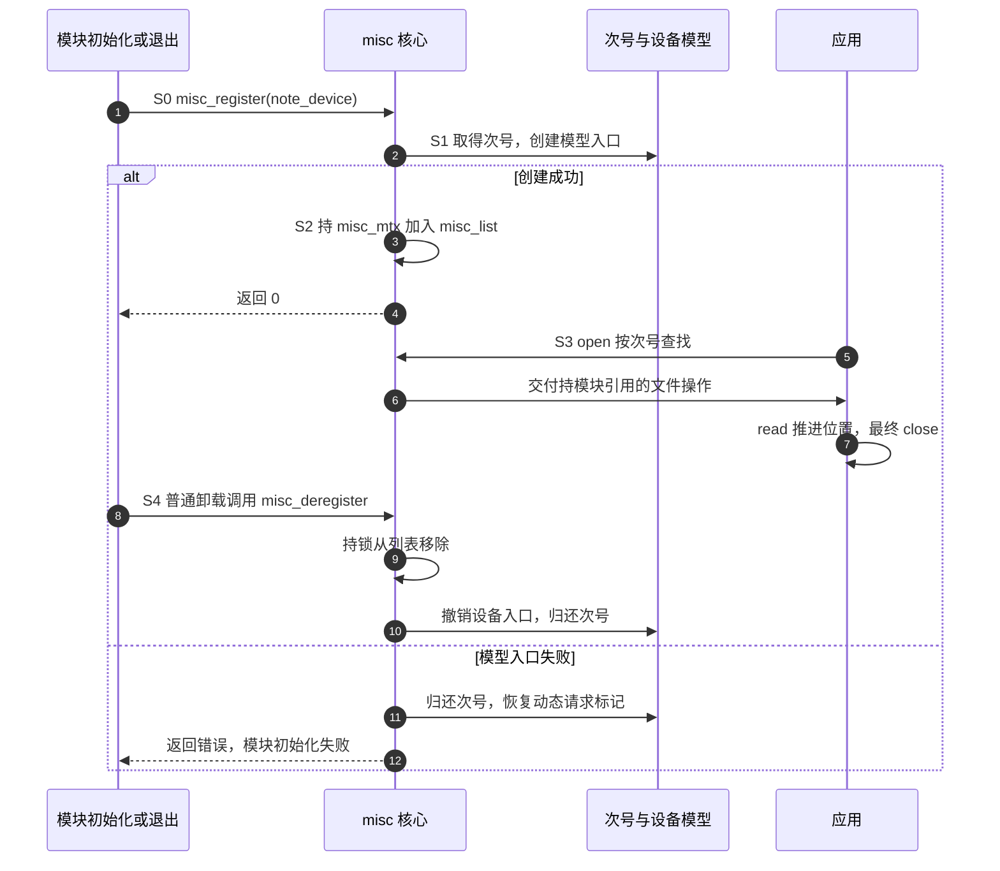

# 第1章\_用misc发布一个小型字符设备

在字符设备实验中，即使只想返回一句问候，也要考虑号段、cdev、class 与节点。那些步骤分别解决真实问题，不能凭空省去；但多个小型服务能不能复用其中的公共设施？

misc 是 miscellaneous 的缩写，这里指 Linux 的一套小型字符设备登记机制。它复用主设备号和分派入口，替每个服务安排次设备号及设备模型入口。本章以固定只读问候为完整例子，承接[字符设备读写契约](../character_device/P05_文件操作契约与数据路径.md)与[设备号登记](../character_device/P02_设备号_注册与设备节点.md)。若刚读过[kobject 属性](../fundamentals/framework_model/kobject讲解.md)，还可以比较两个文件入口的不同用途。

## 1.1\_哪些工作适合共享

一个字符节点通过主、次设备号寻找服务。可以让许多小服务使用同一个主号，再由公共代码根据次号找出各自的操作表。各服务不必独占一整套号码登记与 class，但仍须说明自己的文件操作是什么。

misc 就采用这个办法：固定主号为 10，各服务用 `struct miscdevice` 描述自己的名字、次号和 `file_operations` 操作表。请求动态次号时填写 `MISC_DYNAMIC_MINOR`；它的数值 255 是“请分配”的标记，不是承诺服务以后一定用 255。注册成功后，该结构的 minor 被写成实际号码。

公共分派表与编号分配器都在内核里，锁保护注册、撤销和打开时的查找。节省的工作转移到了这套公共设施，没有消失。驱动仍要维护内容、并发与生命周期；如果需要一整段连续号码、特殊的多实例组织或已有领域子系统协议，应先判断 misc 是否真的合适。

## 1.2\_从一次打开看到分派

用户打开 /dev/note_misc 时，VFS 按字符设备号进入主号 10 的公共 misc_open。它读取次号，在全局 misc_list 中找到匹配的 miscdevice，取得该服务操作表的模块引用，把 file 的操作表换成服务自己的表，然后才调用服务的 open。

公共代码还会把 `file->private_data` 设成该 miscdevice 的地址。本章没有私有可变状态，不使用它。若以后把 miscdevice 内嵌到自定义对象，可在自己的 open 中由这个指针找到外层实例；不能先无条件覆盖它，再希望框架帮你找回实例。


如果没有找到服务，公共路径可能请求装载能处理该设备号的模块后再查一次；仍找不到才失败。这不是“用户任意创建一个节点，内核就会凭名字生成驱动”。本实验显式 insmod，避免把自动装载配置作为隐藏前提。

## 1.3\_完整程序与返回契约

保存为 note_misc.c，或使用[同名材料](../../../labs/kernel/driver_entries/materials/note_misc.c)。程序首行的 SPDX-License-Identifier 标明示例使用 GPL-2.0 许可证，模块元信息沿用 Hello 工程。它没有写操作，不访问硬件，唯一数据是 16 字节的 hello from misc 加换行。

```c
// SPDX-License-Identifier: GPL-2.0
#include <linux/module.h>
#include <linux/init.h>
#include <linux/fs.h>
#include <linux/miscdevice.h>

static const char greeting[] = "hello from misc\n";

static int note_open(struct inode *inode, struct file *file)
{
    int ret = nonseekable_open(inode, file);

    if (ret)
        return ret;
    /* 同一个打开文件被共享时，串行化常规 read 的位置更新。 */
    file->f_mode |= FMODE_ATOMIC_POS;
    return 0;
}

static ssize_t note_read(struct file *file, char __user *buf,
                         size_t count, loff_t *pos)
{
    return simple_read_from_buffer(buf, count, pos,
                                   greeting, sizeof(greeting) - 1);
}

static const struct file_operations note_fops = {
    .owner = THIS_MODULE,
    .open = note_open,
    .read = note_read,
};

static struct miscdevice note_device = {
    .minor = MISC_DYNAMIC_MINOR,
    .name = "note_misc",
    .fops = &note_fops,
    .mode = 0600,
};

static int __init note_misc_init(void)
{
    return misc_register(&note_device);
}

static void __exit note_misc_exit(void)
{
    misc_deregister(&note_device);
}

module_init(note_misc_init);
module_exit(note_misc_exit);
MODULE_LICENSE("GPL");
MODULE_DESCRIPTION("固定只读内容的 misc 教学设备");
```

`simple_read_from_buffer` 根据当前位置和请求长度，把固定内核缓冲区的一段复制给用户并推进位置。传给它的总长度减去字符串末尾的零字符，所以应用不会读到 C 字符串的终止零。读到 16 字节末尾后再读返回 0，即本次打开已到 EOF；重新打开有新的文件位置，又可从头读。这是有限内容，不是“当前暂时无数据”的事件流。

open 中用 nonseekable_open 禁止该文件的定位读取等操作；这里没有为内容提供 seek。FMODE_ATOMIC_POS 要求常规 read 在同一打开文件被共享时协调位置更新，这延续前置窗口章已经解释的位置保护。内容本身是不变数组，无需再为数组加互斥锁；若把它改成可写缓冲区，就必须重新设计内容同步，不能把位置保护当作万能锁。

操作表的 owner 指向本模块。公共打开路径取得它的引用后，普通卸载会受到尚未关闭的文件约束，防止操作表代码先于读者消失。没有 owner 不是“减少一些开销”的等价改写。

name 决定发布名称，mode 0600 使默认节点只对所有者开放读写权限；本例没有 write 回调，所以即使权限允许，写操作仍不在服务契约内。模式控制的是访问许可，操作表决定的是可执行功能。用户空间设备管理规则可能调整最终权限，应以实际节点为准。

## 1.4\_登记成功之前与注销之后

用一轮模块生存期给过程编号。S0 只有静态 note_device，S1 取得次号并创建模型入口，S2 加入可分派集合，S3 用户打开后持有文件，S4 模块退出时撤销登记。号码、列表、模型节点、打开文件引用不是同一份状态。



在这个版本里，创建模型入口发生在加入 misc_list 之前，但这段过程持有 misc_mtx；同时到来的 open 必须等它释放锁，才能看见成功后的分派状态。不能把“节点曾出现”直接当作锁内事务已经结束。

调用方只在注册成功之后才负责注销。注册失败时内部回滚自己已取得的号码等状态，初始化函数返回错误即可；不应无条件再调用 misc_deregister 清理一项根本没成功的登记。

普通模块卸载与运行中热拔插也要分开。这个例子的对象是模块静态数据，打开文件会阻止普通卸载，因而 exit 不会在这些引用仍在时正常运行。但 **misc_deregister 本身并不关闭已有文件**。若在设备热拔插时调用它，旧文件仍可能调用已经保存的操作表，驱动必须另外保活外层对象、标记离线并协调在途操作。不能把这里的静态示例改成注销后立即 kfree 的模板。

## 1.5\_按位置观察内容

与上篇一起使用[材料目录](../../../labs/kernel/driver_entries/materials/README.md)。变量 KDIR 指向目标内核对应的已构建目录，交叉参数按[模块工程](../../../engineering/build/kernel_modules/大纲.md)准备。在目标系统执行装载与读取：

```bash
make -C "$KDIR" M="$PWD" modules
sudo insmod ./note_misc.ko
cat /sys/class/misc/note_misc/dev
sudo cat /dev/note_misc
```

第一条 cat 应显示 10:某个实际次号，第二条打印 hello from misc。不要把示例中的“某个实际次号”抄进 mknod。节点通常由已挂载的 devtmpfs 配合系统管理机制提供；若 /sys/class/misc/note_misc/dev 存在而 /dev/note_misc 不存在，应按[节点排错](../character_device/P12_常见故障与排查.md)检查节点管理及挂载，不先把注册成功推翻。

再运行完整的分段读取观察程序。O_RDONLY 表示只读打开；返回值和字节内容分别检查，out 清理路径归还已经打开的描述符。两次非空读取应为 5 与 11 字节，随后是 0；再次打开后应读到完整 16 字节：

保存下面完整程序为 `misc_probe.c`。它使用 Linux 用户空间头文件和 C11 编译器，编译后在装有对应教学模块的目标运行：

```c
/* 每次打开各自维护读取位置，错误时也关闭已有描述符。 */
#include <fcntl.h>
#include <stdio.h>
#include <string.h>
#include <unistd.h>

static int read_part(int fd, size_t requested, const char *expected)
{
    char data[64];
    size_t length = strlen(expected);
    ssize_t count = read(fd, data, requested);
    if (count < 0) { perror("read"); return 0; }
    if ((size_t)count != length || memcmp(data, expected, length)) {
        fputs("读取内容或长度不符\n", stderr);
        return 0;
    }
    printf("read: %zd bytes\n", count);
    return 1;
}

int main(void)
{
    int fd = open("/dev/note_misc", O_RDONLY), result = 1;
    if (fd < 0) { perror("open"); return 1; }
    if (!read_part(fd, 5, "hello") || !read_part(fd, 64, " from misc\n") ||
        !read_part(fd, 64, ""))
        goto out;
    if (close(fd) < 0) { perror("close"); return 1; }
    fd = open("/dev/note_misc", O_RDONLY);
    if (fd < 0) { perror("reopen"); return 1; }
    if (read_part(fd, 64, "hello from misc\n"))
        result = 0;
out:
    if (close(fd) < 0) { perror("close"); result = 1; }
    return result;
}
```

```bash
cc -std=c11 -Wall -Wextra -Werror -pedantic misc_probe.c -o misc_probe
sudo ./misc_probe
sudo rmmod note_misc
test ! -e /sys/class/misc/note_misc && echo removed
```

预期四行读取字节数依次是 5、11、0、16，程序还逐字节核对 hello、剩余内容和完整问候。第一次打开的两个非空读取合起来正好 16 字节，第三次为空；新打开又得到完整内容。零字节结果在本服务中表示结尾，不表示设备断线。退出后模型入口应消失；如果曾手工建立节点，其路径可能仍在，不能由路径残留推断服务还在运行。

最后单独观察模块引用。上一组已经卸载，因此先重新装载；在终端 A 执行以下完整程序，它打开设备后等待回车，并保证退出时关闭描述符：

```bash
sudo insmod ./note_misc.ko
```

保存下面完整程序为 `hold_open.c`。它使用 Linux 用户空间头文件和 C11 编译器，编译后在装有对应教学模块的目标运行：

```c
/* 保留打开文件，供另一个终端观察普通模块卸载的引用限制。 */
#include <fcntl.h>
#include <stdio.h>
#include <unistd.h>

int main(void)
{
    int fd = open("/dev/note_misc", O_RDONLY);
    int result = 0;
    if (fd < 0) { perror("open"); return 1; }
    puts("设备保持打开；现在可在终端 B 尝试普通卸载。");
    puts("按回车关闭设备：");
    if (getchar() == EOF && ferror(stdin)) {
        perror("stdin");
        result = 1;
    }
    if (close(fd) < 0) { perror("close"); result = 1; }
    return result;
}
```

```bash
cc -std=c11 -Wall -Wextra -Werror -pedantic hold_open.c -o hold_open
sudo ./hold_open
```

在终端 A 按回车前，到终端 B 执行 `sudo rmmod note_misc`。未关闭时应拒绝卸载，因为 file 保存的操作表仍持有模块引用。回到 A 按回车，确认程序结束，再在 B 执行相同命令，此时应成功。只使用普通卸载，不把强制卸载作为测试恢复手段；若还有其他打开者，需先确认并正常关闭它们，不能据第二次失败推断引用已经泄漏。

本例源码按 NXP Linux 6.12.20 固定提交核对；先从[源码索引](../../../research/source_reading/driver_entries/navigation/P01_Linux_6.12_驱动入口源码阅读索引.md)进入，再读[misc 分派的唯一实现](../../../research/source_reading/driver_entries/source_explanations/P01_对象创建与misc分派.md#1.2_misc登记与失败回滚)。读回调使用的公共辅助函数见[simple_read_from_buffer 实现](../../../research/source_reading/character_device/source_explanations/fs/libfs.c.md#1.1_simple_read_from_buffer)。这里列的是预期观察，ARM 语法检查不能替代实际构建、装载和卸载。

## 1.6\_回顾与练习

misc 省去的是每个小服务重复搭建的编号与分派设施。返回数据的规则、每次打开的位置、模块代码寿命和热拔插后的对象寿命仍要分别设计。sysfs 适合本章之前那种小属性；misc 提供一般字符文件操作，不能仅按代码哪份更短来选择。

1. 预测：注册后 minor 不是 255，是否分配失败？
2. 小修改：把问候改成两个汉字和换行，应该用字数还是 sizeof 减一作为字节长度？
3. 排错：移除 owner 后，打开设备期间普通卸载不再可靠受阻。为何这比“读不到问候”更严重？
4. 迁移：把程序用于可拔出的硬件，注销后立即释放包含 miscdevice 的私有结构，旧文件可能在哪里继续引用它？

参考思路：第一题不是，255 是请求标记，应检查返回状态与实际分配值。第二题传输单位是字节，源码编码下的 sizeof 计算数组大小；不能把字符数量当字节数。第三题旧文件保存的回调可能指向已卸载代码。第四题 private_data 或驱动自行保存的实例指针仍可能指向它，须另建旧打开者的生命期协议。

上一篇：[kobject 与属性](../fundamentals/framework_model/kobject讲解.md) · [驱动框架大纲](../fundamentals/framework_model/大纲.md) · 接着观察：[打开、迭代与映射](../file_operations/大纲.md#1.1_沿对象寿命逐步增加约束) · 延伸：[完整字符设备专题](../character_device/大纲.md)。
