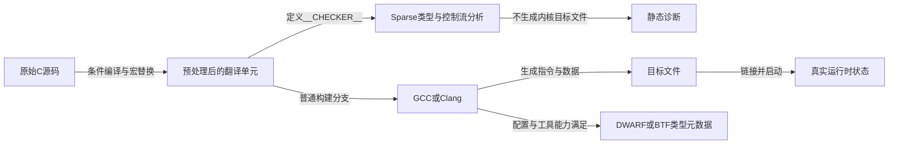
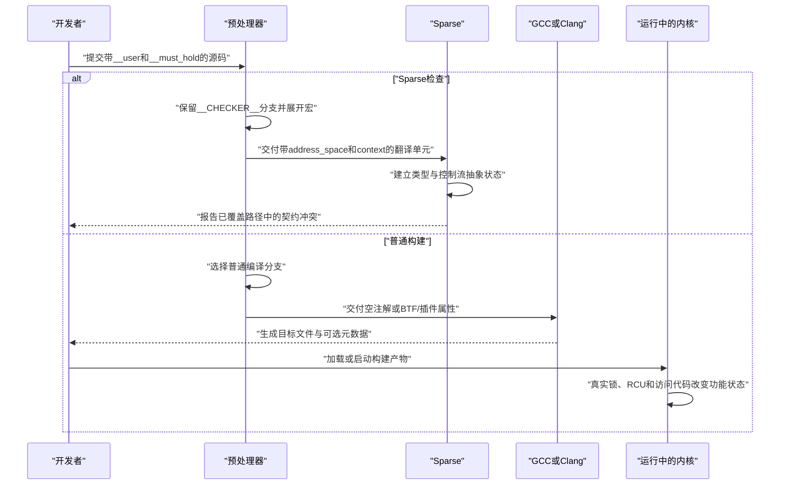

# 第1章\_同一份源码怎样面对多个消费者

## 1.1\_先固定一段贯穿代码

下面这段代码同时出现了用户指针、函数上下文契约和条件加锁。先不要急着背每个宏的定义，只观察它们混在同一份 C 文件里：

```c
int copy_record(struct record __user *src, struct state *state)
    __must_hold(&state->lock);

if (__cond_lock(&state->lock, try_to_lock(&state->lock))) {
    copy_record(user_record, state);
    unlock(&state->lock);
}
```

一个容易形成的直觉是：编译器从上到下阅读源码，遇到 `__user` 和 `__must_hold()`，就顺便执行相应检查。这个模型把几个互不相同的阶段压成了一个动作，因此无法解释下面三个事实：

1. 普通 GCC 构建时，`__must_hold()` 可以完全消失；
2. Sparse 检查时，`__user` 会成为额外的类型限定；
3. 满足条件时，`try_to_lock()` 仍然需要真实代码完成加锁，静态注解本身不会修改锁状态。

要让三个事实同时成立，必须先把“源码由谁消费”展开。

## 1.2\_处理链不是一条只有编译器的直线



箭头代表不同结果：Sparse 主要产生诊断；编译器产生目标代码，也可能附带类型元数据；运行时锁、RCU 和内存访问则由最终指令与内核状态机完成。不能因为这些结果来自同一份源码，就把它们当成同一种状态。

## 1.3\_预处理器先决定后续工具能看见什么

Linux 6.12 的 `include/linux/compiler_types.h` 使用：

```c
#ifdef __CHECKER__
/* Sparse 分支 */
#else
/* 普通编译分支 */
#endif
```

Sparse 会定义 `__CHECKER__`。因此它接收的是上半部分宏定义展开后的翻译单元；正常 GCC/Clang 构建通常接收下半部分。`#ifdef` 不是运行时 `if`：被排除的分支不会进入 C 语法树，更不会在启动后的内核中再次选择。

以 `struct record __user *src` 为例：

```text
Sparse 路径
  __user
    → __attribute__((noderef, address_space(__user)))
    → 带逻辑地址域且禁止普通解引用的指针类型

普通编译路径
  __user
    → STRUCTLEAK插件属性、BTF_TYPE_TAG(user)或空
    → 插件/调试元数据，或者普通指针类型
```

两条路径共享原始记号，但不共享最终语义。

## 1.4\_四类状态必须分开记录

| 层次 | 典型载体 | 谁修改 | 能回答什么 | 不能回答什么 |
| --- | --- | --- | --- | --- |
| 源码契约 | `__user`、`__must_hold()` | 源码作者 | 作者希望工具检查什么 | 工具是否真的运行 |
| 静态分析状态 | Sparse 类型、抽象 context 计数 | Sparse 沿控制流推演 | 已分析路径是否违反类型或上下文契约 | 未分析构建、运行时对象生命期 |
| 编译元数据 | BTF/DWARF type tag | 编译器与调试信息工具 | 类型上保留了什么标签 | 标签对应的协议是否正确执行 |
| 功能运行状态 | 锁字、任务状态、RCU 读侧与对象 | CPU 执行真实内核代码 | 运行时功能动作是否发生 | 所有未来路径是否静态正确 |

`__acquire(lock)` 修改的是 Sparse 的抽象 context 账本；`spin_lock(lock)` 修改的是真实锁相关状态；Lockdep 的 `lock_acquire()` 又修改当前任务的动态检查账本。这三项状态可能在同一接口附近出现，但所有者、生命期和证明能力都不同。

## 1.5\_一次完整处理时序



这条时序直接给出一个重要边界：**静态检查不是内核启动后的后台服务**。它发生在构建阶段；只有开发者、CI 或构建脚本显式运行 Sparse，诊断才会产生。

## 1.6\_现在能够推出什么

遇到奇怪的内核注解时，第一步不应该问“它最终执行了什么指令”，而应依次问：

1. 哪个预处理条件选择了它？
2. 宏展开后，哪个工具能够解析剩余记号？
3. 它附着在类型、声明、函数契约还是普通表达式上？
4. 结果是静态诊断、编译元数据、目标代码还是运行时状态？
5. 没有运行相应工具时，哪一层证据会缺失？

下一章继续把第二步展开：学习 `__attribute__((...))`、`typeof`、语句表达式和可变参数宏怎样组成 Sparse 能够消费的 C 语法外形。

下一篇：[预处理器、GNU 属性与表达式扩展](P02_预处理器_GNU属性与表达式扩展.md)。
