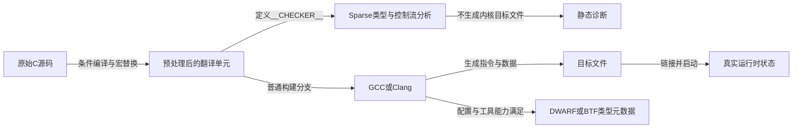
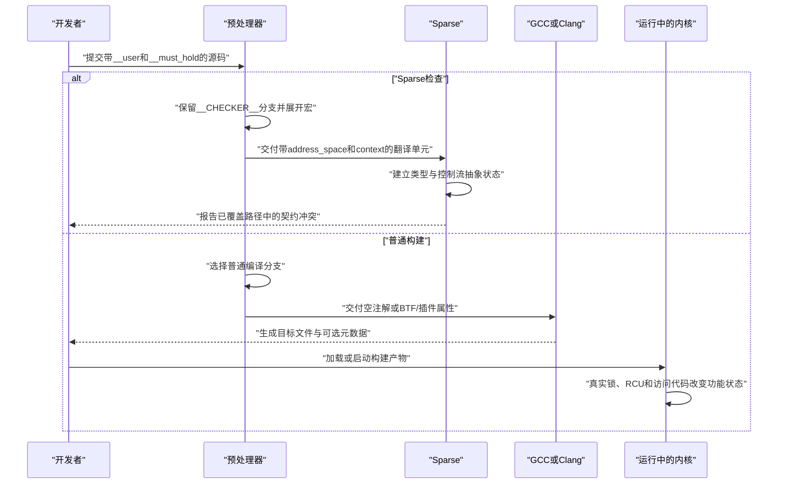

# 第1章\_同一份源码怎样面对多个消费者

## 1.1\_从一次内核代码审查进入静态分析

读者通常不是为了认识几个以下划线开头的宏，才第一次接触静态分析注解。更常见的入口是阅读驱动、系统调用或内核子系统代码时，遇到一条同时涉及用户指针和共享状态的路径：一份记录从用户空间传入，内核准备把它复制到 `state` 中，而 `state` 又必须在持锁状态下才能修改。此时，代码审查至少要回答三个问题：

1. `user_record` 指向的是用户空间，能否像普通内核指针一样直接访问？
2. `copy_record()` 被调用时，当前执行路径是否确实持有 `state->lock`？
3. 如果锁来自一次尝试加锁，分析工具怎样知道只有成功分支才进入持锁状态？

这些问题都不是普通 C 类型系统能够完整表达的。仅执行一次正常的 GCC 或 Clang 构建，编译器可以检查语法、机器类型和它认识的属性，却不一定知道“这个地址来自用户空间”“这个函数要求调用者已经持锁”或者“这个条件为真后静态上下文增加了一次锁持有”。违反这些协议的代码仍可能通过普通编译，随后只在特定输入或并发交错下表现为非法访问、数据竞争或状态破坏。

运行时的用户访问函数和锁操作负责真正完成复制、互斥与状态修改，但它们只有在代码路径实际执行时才产生作用。静态分析解决的是另一个阶段的问题：程序运行以前，沿源码的类型和控制流推演调用约束，尽量提前发现地址空间混用、缺少持锁条件或上下文记账不平衡。它不能替代运行时同步，也不能因为一次检查没有告警就证明所有路径都正确。

为了让分析工具理解这些内核协议，Linux 把 `__user`、`__must_hold()`、`__cond_lock()` 等注解放进普通 C 源码。困难也由此产生：同一个记号会先经过预处理器，再分别面对 Sparse、GCC/Clang、编译器插件或 BTF 工具；有些记号会变成静态分析属性，有些会保留为元数据，有些在普通构建中完全消失。若只用“编译器最终执行了什么”来理解它们，就会把源码契约、静态分析状态、编译产物和运行时功能状态混成一层。

因此，本章暂不逐个深挖注解的完整定义，而是先为读者建立一张处理链坐标：**谁在什么阶段消费这些记号，它改变的是哪一类状态，产生什么结果，又不能证明什么**。下面先用一段贯穿代码固定问题现场，再沿预处理、静态分析、普通编译和运行时逐层展开。

## 1.2\_先固定一段贯穿代码

本章需要观察两个不同位置中的三个记号。下面按条目分别展示；它们不是一段连续、可独立编译的完整程序。

1. **带用户指针和持锁契约的函数声明**

   ```c
   int copy_record(struct record __user *src, struct state *state)
       __must_hold(&state->lock);
   ```

   这里的分号结束整个函数声明，正文没有给出 `copy_record()` 的函数体。`__user` 修饰形参 `src` 的指针类型，`__must_hold()` 则把调用前应当持有 `state->lock` 的上下文契约附着在这个声明上。

2. **取得锁后调用该函数的条件分支**

   ```c
   if (__cond_lock(&state->lock, try_to_lock(&state->lock))) {
       copy_record(user_record, state);
       unlock(&state->lock);
   }
   ```

   这只是某个调用者函数体内部的片段，外围函数、`user_record` 与 `state` 的来源以及数据结构定义都被省略了。`try_to_lock()` 和 `unlock()` 代表真正改变运行时锁状态的操作；`__cond_lock()` 用于向 Sparse 表达“条件成功的分支已经取得锁”。

以上两个条目是分步说明。把函数声明和条件调用放回合法的函数结构后，可以得到下面这个组合示例：

```c
int copy_record(struct record __user *src, struct state *state)
    __must_hold(&state->lock);

int try_copy_record(struct record __user *user_record,
                    struct state *state)
{
    int ret = -EBUSY;

    if (__cond_lock(&state->lock, try_to_lock(&state->lock))) {
        ret = copy_record(user_record, state);
        unlock(&state->lock);
    }

    return ret;
}
```

这个示例补出了调用者函数：`if` 位于 `try_copy_record()` 的函数体内，`user_record` 和 `state` 来自它的形参，`copy_record()` 的返回值也被传回上层。示例仍假定 `struct record`、`struct state`、`-EBUSY`、锁操作以及 `copy_record()` 的实现已经在其他位置定义；这里补全的是与注解讨论直接相关的调用结构，而不是整个可独立构建的翻译单元。

观察这些记号时，一个容易形成的直觉是：编译器从上到下阅读源码，遇到 `__user` 和 `__must_hold()`，就顺便执行相应检查。这个模型把几个互不相同的阶段压成了一个动作，因此无法解释下面三个事实：

1. 普通 GCC 构建时，`__must_hold()` 可以完全消失；
2. Sparse 检查时，`__user` 会成为额外的类型限定；
3. 满足条件时，`try_to_lock()` 仍然需要真实代码完成加锁，静态注解本身不会修改锁状态。

要让三个事实同时成立，必须先把“源码由谁消费”展开。

## 1.3\_处理链不是一条只有编译器的直线



箭头代表不同结果：Sparse 主要产生诊断；编译器产生目标代码，也可能附带类型元数据；运行时锁、RCU 和内存访问则由最终指令与内核状态机完成。不能因为这些结果来自同一份源码，就把它们当成同一种状态。

## 1.4\_预处理器先决定后续工具能看见什么

Linux 6.12 的 `include/linux/compiler_types.h` 使用：

```c
#ifdef __CHECKER__
/* Sparse 分支 */
#else
/* 普通编译分支 */
#endif
```

Sparse 会定义 `__CHECKER__`。因此它接收的是上半部分宏定义展开后的翻译单元；正常 GCC/Clang 构建通常接收下半部分。`#ifdef` 不是运行时 `if`：被排除的分支不会进入 C 语法树，更不会在启动后的内核中再次选择。

以 `struct record __user *src` 为例：

```text
Sparse 路径
  __user
    → __attribute__((noderef, address_space(__user)))
    → 带逻辑地址域且禁止普通解引用的指针类型

普通编译路径
  __user
    → STRUCTLEAK插件属性、BTF_TYPE_TAG(user)或空
    → 插件/调试元数据，或者普通指针类型
```

两条路径共享原始记号，但不共享最终语义。

## 1.5\_四类状态必须分开记录

上一节已经说明，同一个 `__user` 会因预处理分支不同而展开成 Sparse 属性、编译元数据或者空记号。但是，仅知道“宏会有不同展开”还不够。读者继续追踪代码时，很容易把下面几句话误认为同一件事：

- 源码写着“调用 `commit_record()` 前必须持锁”；
- Sparse 在成功分支中把某个 context 计数加一；
- 普通编译产物可能保留 `user` 类型标签；
- CPU 执行 `raw_spin_trylock()` 后真的取得了锁。

它们围绕同一段源码出现，却不是同一个状态的四种叫法，也不是一个变量先后经历的四个阶段。更准确地说，本节要分开的是 **四个观察层中的四本账**。每本账都要用同一组问题定义：状态保存在哪里、谁写入、谁读取、存活多长时间、适合回答什么问题，以及不能形成什么证明。

### 1.5.1\_先确定分类角度与适用场景

这里不按“它们看起来都与锁有关”分类，而按以下四个坐标分类：

1. **观察时刻：** 是阅读源码时已经存在，分析翻译单元时临时产生，写入目标文件后留下，还是程序运行时才出现？
2. **存储载体：** 信息位于 C 源码记号、分析器内存中的抽象状态、ELF/DWARF/BTF 元数据，还是内核对象与 CPU 可见的真实内存中？
3. **读写主体：** 是开发者声明、Sparse 推演、编译器生成，还是 CPU 执行功能代码后修改？随后又由代码审查者、分析器、调试工具或运行路径中的其他 CPU 读取？
4. **证明目标：** 当前问题是在问“作者声明了什么”“某条已分析路径是否违反契约”“构建产物保留了什么标签”，还是“这一次运行中功能动作是否真的发生”？

这组分类在四种场景中尤其有用：

- 阅读一个陌生注解时，用它判断注解属于源码契约、静态检查还是普通编译能力；
- Sparse 没有告警时，用它检查是代码确实满足契约，还是检查工具根本没有运行或路径没有覆盖；
- 查看 DWARF/BTF 时，用它避免把“标签仍然存在”误读成“运行时协议已经执行”；
- 调试竞争、死锁或非法访问时，用它把真实对象状态与工具的影子账本分开取证。

“源码契约”严格来说不是会自行转移的机器状态。本节仍把它纳入四本账，是因为它是其他消费者的共同输入，也是排查语义丢失时必须保留的第一份记录。后面三类状态都不能反过来替作者补出一份源码中从未声明的契约。

### 1.5.2\_用一次完整更新固定四个观察对象

前面的 `try_to_lock()` 主要用于展示宏的形状。为了逐层比较四本账，下面换成一个结构完整的内核侧更新流程：用户空间提交一条记录，内核先把它复制到局部对象，再尝试取得保护共享状态的锁，成功后才提交记录。

```c
#include <linux/errno.h>
#include <linux/spinlock.h>
#include <linux/types.h>
#include <linux/uaccess.h>

struct record {
    u32 value;
};

struct state {
    raw_spinlock_t lock;
    struct record current;
};

static void record_state_init(struct state *state)
{
    /* 对象发布给并发调用者以前，先初始化锁和受保护数据。 */
    raw_spin_lock_init(&state->lock);
    state->current.value = 0;
}

static void commit_record(const struct record *record,
                          struct state *state)
    __must_hold(&state->lock);

static void commit_record(const struct record *record,
                          struct state *state)
{
    /* 该写入只能发生在持有 state->lock 的路径中。 */
    state->current = *record;
}

static int update_record(const struct record __user *user_record,
                         struct state *state)
{
    struct record local_record;

    /* 先完成可能失败的用户访问，不把它放进自旋锁临界区。 */
    if (copy_from_user(&local_record, user_record,
                       sizeof(local_record)))
        return -EFAULT;

    /* 失败分支没有取得锁，也不能调用要求持锁的函数。 */
    if (!raw_spin_trylock(&state->lock))
        return -EBUSY;

    /* 成功分支既真实持锁，也满足 commit_record() 的静态契约。 */
    commit_record(&local_record, state);
    raw_spin_unlock(&state->lock);

    return 0;
}
```

这段代码补全了数据结构、初始化、用户复制、两条失败返回、条件取得、受保护写入、解锁和成功返回。它假定 `struct state` 的所有者会在对象发布前调用 `record_state_init()`，并保证调用期间对象仍然存活；示例没有动态分配资源，因此没有额外的释放路径需要展示。`struct record` 只含一个标量，也让本节能够聚焦地址域与锁契约，而不引入指针所有权问题。

示例使用 `raw_spinlock_t`，是为了让 `__must_hold(&state->lock)`、`raw_spin_trylock(&state->lock)` 与释放路径始终引用同一个上下文身份，不是建议所有业务代码都改用原始自旋锁。实际代码应根据普通内核与 PREEMPT_RT 的锁语义选择 `spinlock_t` 或 `raw_spinlock_t`；无论选择哪一种，本节的四层分类方法都不变。

在本仓库的 Linux 6.12.20 源码基线中，`raw_spin_trylock(lock)` 先保留真实的 `_raw_spin_trylock(lock)` 条件，再通过 `__cond_lock()` 只给 Sparse 的成功路径登记取得事件。需要核对版本化实现时，依次进入[源码总阅读索引](../../../../research/source_reading/compiler_annotations/navigation/P01_Linux_6.12_编译器与Sparse注解源码导读.md#1.6_建议阅读顺序)、[上下文模块链](../../../../research/source_reading/compiler_annotations/navigation/P02_Linux_6.12_compiler_types注解模块概念导读.md#2.5_上下文模块链)和唯一实现讲解[条件取得的展开与分支状态](../../../../research/source_reading/compiler_annotations/source_explanations/P01_Linux_6.12_compiler_types注解宏源码实现.md#1.6.3_条件取得的展开与分支状态)。

### 1.5.3\_第一本账记录源码契约

源码契约存在于开发者提交的声明和类型中。示例里有两条不同的契约：

- `const struct record __user *user_record` 声明指针来自用户地址域，普通内核代码不能把它当成已经验证的内核指针直接解引用；
- `__must_hold(&state->lock)` 声明调用 `commit_record()` 时，当前分析路径应当已经持有对应上下文。

这本账由源码作者写入，由代码审查者、Sparse 和其他能够识别相应属性的工具读取。它从源码被保存时就存在，不需要等到内核运行。它最适合回答“这个接口向调用者承诺或要求了什么”。

但是，契约只是要求，不是执行结果。删除 `__user` 后，正确使用 `copy_from_user()` 的运行路径仍可能工作，但 Sparse 会失去这条地址域边界；删除 `__must_hold()` 后，当前示例仍会真实加锁，但另一个漏锁调用者不再受这条函数入口契约约束。反过来，即使两个注解都写得完整，也不能据此断言构建系统运行了 Sparse，更不能断言某一次运行已经取得真实锁。

### 1.5.4\_第二本账记录Sparse的类型与路径状态

Sparse 读取 `__CHECKER__` 分支展开后的翻译单元，在分析进程的内存中建立临时抽象状态。它至少维护两条彼此正交的轴：

- **类型状态：** `user_record` 属于用户地址域，`local_record` 属于普通内核地址域；`copy_from_user()` 的形参契约构成两类地址之间的受控入口；
- **路径状态：** 当前控制流对 `&state->lock` 的抽象 context 计数是多少，函数调用前置条件和退出平衡是否满足。

沿 `update_record()` 的一次分析周期，可以把静态账本与真实功能状态并列观察：

| 阶段 | 触发与控制流 | Sparse 类型/context 账本 | 对应的真实功能状态 | 退出条件 |
| --- | --- | --- | --- | --- |
| S0 进入 | 调用 `update_record()` | `user_record` 带用户地址域；`&state->lock` 的本路径计数为 0 | `state` 已初始化，但本路径尚未取得锁 | 开始用户复制 |
| S1 复制失败 | `copy_from_user()` 返回非零 | 地址域实参可接受检查；context 仍为 0 | 没有完整取得用户记录，锁状态未被本路径改变 | 返回 `-EFAULT` |
| S1 复制成功 | `copy_from_user()` 返回 0 | `local_record` 成为后续普通内核对象；context 仍为 0 | 局部副本可用，尚未修改 `state->current` | 尝试取得锁 |
| S2 尝试失败 | `raw_spin_trylock()` 返回 0 | `__cond_lock()` 不增加计数，失败路径仍为 0 | 本路径没有取得真实锁 | 返回 `-EBUSY` |
| S2 尝试成功 | `raw_spin_trylock()` 返回非零 | 成功路径执行抽象 `__acquire()`，计数从 0 变为 1 | 底层 trylock 已完成当前配置下的真实取得语义 | 进入受保护区 |
| S3 提交 | 调用 `commit_record()` | 入口要求 1，当前路径也是 1，契约匹配 | CPU 在锁原语保证的临界区内写入 `state->current` | 准备释放锁 |
| S4 释放 | 调用 `raw_spin_unlock()` | 释放路径把计数从 1 恢复为 0 | 底层路径完成与取得配对的功能释放 | 返回 0 |

表中的两列状态只是在同一控制流节点上对照，不能读成“Sparse 先把计数加一，所以 CPU 才取得锁”。运行时根本没有 Sparse 进程参与；Sparse 只是在构建阶段模拟成功和失败路径。真正的 trylock 必须先由底层锁实现产生真假结果，`__cond_lock()` 才能把同一真假关系表达给分析器。

这本账适合回答“Sparse 实际分析到的这条路径是否违反地址域或持锁契约”。它不能覆盖未进入本次翻译单元的代码、未启用 Sparse 的构建、分析器不理解的跨边界行为，也不能证明某个运行时对象没有被提前释放。

### 1.5.5\_第三本账记录编译产物中的类型元数据

普通 GCC/Clang 构建不会继续使用 Sparse 的 context 状态。`__must_hold()` 在普通分支中退化为空，`__cond_lock(x, c)` 只保留真实条件 `c`，因此条件表达式仍然只执行一次，目标代码中的加锁与分支功能不被删除。

`__user` 的去向不同：在构建配置、编译器属性和后处理工具能力都满足时，它可以转成 `BTF_TYPE_TAG(user)`，再进入 DWARF/BTF 类型元数据；能力不满足时也可以退化为空。这本账保存在目标文件或最终内核镜像的相关元数据节中，由编译器和调试信息工具写入，由调试器、BPF 生态工具或其他元数据消费者读取。完整条件和观察方法见 [普通编译、BTF 与运行时边界](P05_普通编译_BTF与运行时边界.md#5.2_先把type_tag理解为类型上的语义元数据)。

它适合回答“普通构建产物是否仍携带 `user` 这一类型标签”。它不能回答 `copy_from_user()` 是否在所有路径上被正确调用，也不能因为镜像中存在 `user` 标签，就推断某次 `raw_spin_trylock()` 成功或者 `state->current` 已经被更新。

### 1.5.6\_第四本账记录功能运行状态

功能运行状态只在目标代码实际执行时产生。对这个例子来说，关键载体包括：

- 用户地址是否可访问，以及 `copy_from_user()` 最终返回多少未复制字节；
- `state->lock` 及相关执行上下文中用于兑现原始自旋锁语义的配置相关状态；
- 当前 CPU 执行到哪条成功或失败分支；
- `local_record` 与受锁保护的 `state->current` 中实际保存的数据。

这些状态由 CPU 执行 uaccess 和锁实现后修改，由后续指令、其他竞争执行者以及运行时诊断工具观察。它适合回答“这一次调用究竟返回了 `-EFAULT`、`-EBUSY` 还是成功”“共享记录是否在真实锁保护下被写入”等运行问题。

源码注解本身不会在这里再次运行。即使普通构建把 `__must_hold()` 完全删除，只要功能代码仍正确执行，锁依然可以被取得和释放；即使 Sparse 曾经无告警，运行时仍可能因为对象生命期错误、未覆盖的调用路径或其他并发缺陷而失败。因此，运行一次成功路径只能形成这次执行的证据，不能替代对所有控制流的静态推演。

### 1.5.7\_Lockdep为什么还要另开一本账

Lockdep 容易造成新的混淆：它确实在内核运行期间工作，但它维护的仍不是 `state->lock` 的功能锁字。启用并接入相应锁原语后，Lockdep 会维护当前任务的持锁链、锁类关系和跨时间累积的依赖图，用于发现不平衡释放或潜在锁序环。真实锁状态回答“现在能否进入临界区”，Lockdep 的影子状态回答“观察到的锁依赖是否违反检查规则”。

因此，本节的四类是理解“源码如何分别进入静态分析、普通编译产物和功能运行”的最小分层；遇到 Lockdep、KCSAN 等动态验证器时，还要在功能运行状态旁边 **另开运行时诊断账本**。检查器未启用、失效或目标路径未被执行时，“没有告警”不能证明功能正确；检查器的影子记录发生变化，也不能代替底层锁原子操作。

### 1.5.8\_最后再汇总四类状态

现在再看表格，每一行都有明确的定义角度和使用场景：

| 观察层 | 定义角度与典型载体 | 写入者与读取者 | 适用场景 | 能形成的证据 | 不能形成的证据 |
| --- | --- | --- | --- | --- | --- |
| 源码契约 | 源码阶段的接口意图；`__user`、`__must_hold()` | 作者写入；审查者与工具读取 | 阅读接口、检查声明是否表达设计约束 | 作者声明了什么类型边界或调用前提 | 工具已经运行、运行时动作已经发生 |
| 静态分析状态 | 单次分析中的临时抽象账本；Sparse 类型与 context 控制流状态 | Sparse 沿已见控制流写入并读取 | 定位地址域混用、漏锁调用和路径记账不平衡 | 已分析翻译单元和路径是否符合已声明契约 | 未分析代码、运行时对象生命期和实际调度交错 |
| 编译元数据 | 构建产物中的描述信息；DWARF/BTF 类型标签 | 编译器与后处理工具写入；调试/BPF 工具读取 | 检查标签是否穿过普通编译链、供后续工具消费 | 产物在当前能力组合下保留了什么类型语义 | 标签对应的访问、加锁或释放协议已经执行 |
| 功能运行状态 | 执行期间的真实对象与控制流；锁原语状态、内存内容和返回值 | CPU 执行功能代码写入；运行路径和观测工具读取 | 调试实际失败、竞争结果和对象变化 | 某次已执行路径上真实发生了什么 | 所有未来输入与未执行路径都静态正确 |

实际排查时，可以先根据问题选账本：问接口要求就看源码契约，问 Sparse 告警就看静态账本，问产物还剩什么就看 DWARF/BTF，问这次机器究竟做了什么就看功能运行状态。只有先选对账本，后续证据才不会答非所问。

## 1.6\_一次完整处理时序

四本账按载体分开以后，还需要把它们放回时间顺序，观察同一份源码怎样走向不同消费者：



这条时序直接给出一个重要边界：**静态检查不是内核启动后的后台服务**。它发生在构建阶段；只有开发者、CI 或构建脚本显式运行 Sparse，诊断才会产生。

## 1.7\_现在能够推出什么

遇到奇怪的内核注解时，第一步不应该问“它最终执行了什么指令”，而应依次问：

1. 哪个预处理条件选择了它？
2. 宏展开后，哪个工具能够解析剩余记号？
3. 它附着在类型、声明、函数契约还是普通表达式上？
4. 结果是静态诊断、编译元数据、目标代码还是运行时状态？
5. 没有运行相应工具时，哪一层证据会缺失？

下一章继续把第二步展开：学习 `__attribute__((...))`、`typeof`、语句表达式和可变参数宏怎样组成 Sparse 能够消费的 C 语法外形。

下一篇：[预处理器、GNU 属性与表达式扩展](P02_预处理器_GNU属性与表达式扩展.md)。
