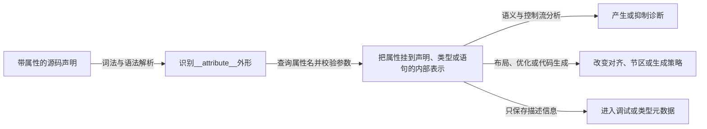

# 第2章\_预处理器\_GNU属性与表达式扩展

## 2.1\_从处理链进入语法层

### 2.1.1\_读者为什么会在这里卡住

上一章已经把源码契约、静态分析状态、编译元数据和功能运行状态分开，也建立了“先找消费者，再判断语义”的处理链坐标。这个结论解决了一个重要误解：`__user`、`__must_hold()` 或 `__cond_lock()` 并不是内核运行时统一调用的一组特殊函数。

但是，读者回到真实代码以后仍会遇到第二层障碍。以前一章完整示例中的条件加锁路径为例，调用点看起来只是普通的 C 条件判断：

```c
/* 只有真实尝试加锁成功，才提交受保护的记录。 */
if (raw_spin_trylock(&state->lock)) {
    commit_record(&local_record, state);
    raw_spin_unlock(&state->lock);
}
```

继续追踪定义，却会看到类似下面的宏链：

```c
#define raw_spin_trylock(lock) \
    __cond_lock(lock, _raw_spin_trylock(lock))

#define __cond_lock(x, c) \
    ((c) ? ({ __acquire(x); 1; }) : 0)
```

即使已经知道 Sparse 与普通编译器是不同消费者，读者此时仍然不能只凭宏名回答以下问题：

1. `_raw_spin_trylock(lock)` 在展开后的表达式里会求值几次？
2. `({ __acquire(x); 1; })` 为什么既能容纳一条分析事件，又能成为 `if` 的条件值？
3. `__acquire(x)` 是函数调用、编译器属性，还是只对 Sparse 有意义的路径事件？
4. 普通构建删除静态记账以后，为什么真实的 trylock 条件仍然保留？
5. 如果换成 `__attribute__((address_space(...)))`，属性究竟附着在函数、指针还是指针目标类型上？

这些问题已经不再是“谁消费源码”的处理链问题，也还没有进入锁算法或地址空间协议本身。它们共同指向中间的一层：**作者写下的友好宏，经过预处理以后，究竟变成了什么语法结构；后续工具又从这个结构的哪个位置取得语义。** 如果这一层没有拆开，读者就只能凭名字猜测宏的作用，无法验证实参求值次数、属性附着位置和普通编译退化是否正确。

### 2.1.2\_为什么不能把它当成普通C逐行阅读

这些写法之所以容易误导，是因为展开前后的代码都保留着 C 的外观，但其中夹入了普通 ISO C、GNU C 扩展和 Sparse 专用记号。几种常见读法分别只看到了局部：

- 把 `#ifdef` 当成运行时分支，会误以为 Sparse 语义与普通编译语义同时存在，实际上未选中的记号根本不会进入当前翻译单元；
- 看到统一的 `__attribute__((...))` 外形，就假定其中所有属性都由 GCC 以相同方式执行，忽略了具体属性名称、附着位置和消费者；
- 看到 `typeof(*p)` 中有 `*p`，就认为运行时一定发生一次解引用，忽略了这里使用的是表达式类型；
- 把 `({ ... })` 当成只能执行语句、不能产生值的普通代码块，就无法解释 `__cond_lock()` 为什么能够放进 `if`；
- 根据 `warning`、`acquire` 或 `private` 等名字直接推断功能，会跳过宏展开后真正剩下的常量、属性、强制转换或分析事件。

正确的阅读单位因此不是某个宏名，而是下面这条转换链：

```text
调用点中的友好宏
  → 预处理条件选择当前分支
  → 宏参数逐层替换
  → 形成属性、类型或值表达式
  → Sparse或GCC/Clang解析剩余结构
  → 产生诊断、元数据、目标代码或空效果
```

链条中的每一步只承担自己的职责。预处理器只选择和替换记号，不理解“锁”或“用户地址”；GNU 语法只提供属性、类型构造和表达式容器，不自动决定由谁赋予语义；Sparse 或普通编译器才会解释自己认识的剩余结构。

### 2.1.3\_本章解决什么又暂时不解决什么

本章不是一份完整的 C 预处理器规范，也不重复通用 [GNU C 扩展](../gnu_extensions/C_language_extension.md) 中的全部语言特性。它只提取阅读内核静态分析注解所需的五种语法角色：

1. 预处理条件与宏替换，决定消费者实际收到哪些记号；
2. GNU 属性，提供附着在声明或类型上的语法容器；
3. `typeof`，根据实参构造新的分析类型；
4. 语句表达式，把路径事件和一个可继续参与控制流的值放在同一表达式中；
5. GNU 可变参数宏与占位回退，使同一调用外形在不同消费者分支中仍然成立。

完成本章后，读者应能拿到一个陌生注解调用，分别写出 Sparse 与普通编译路径的手工展开结果，标出属性附着位置、类型构造、实参求值次数和真正的消费工具。此时得到的仍是 **语法展开模型**：它能说明工具看见了什么，却还没有证明 `address_space` 为什么能够约束指针混用。这个语义问题留到下一章处理。

## 2.2\_预处理条件与宏替换只处理记号

### 2.2.1\_先看为什么需要取得与释放标记

继续沿用 `update_record()` 的锁保护场景。`state->current` 只能在当前执行路径持有 `state->lock` 时修改，因此一次成功操作具有三个功能阶段：

```text
真实功能路径
  尚未持有锁
    → trylock成功并进入临界区
    → 修改state->current
    → unlock并离开临界区

Sparse影子账本
  当前路径计数0
    → __acquire(&state->lock)，计数加1
    → 调用要求计数为1的commit_record()
    → __release(&state->lock)，计数减1并回到0
```

这里的 `0` 和 `1` 描述的是 **Sparse 当前分析路径对同一个上下文身份的抽象计数**：

- `0` 表示当前路径没有登记持有 `&state->lock`，不表示整个系统中的锁字一定处于未锁状态；另一个 CPU 仍可能持有真实锁；
- `1` 表示当前路径已经登记一次持有，不是把真实锁字设置为整数 `1`，也不是 C 布尔值；
- `__acquire(x)` 和 `__release(x)` 是路径上的增减事件，真实 trylock 与 unlock 仍由锁原语完成。

因此，`__context__(x, delta)` 中的第二个参数使用增量：

```c
#define __acquire(x) __context__(x, 1)
#define __release(x) __context__(x, -1)
```

`1` 表示当前路径计数加一，`-1` 表示减一。后续还会看到另一种三参数写法 `context(x, entry, exit)`：

```c
#define __acquires(x)  __attribute__((context(x, 0, 1)))
#define __must_hold(x) __attribute__((context(x, 1, 1)))
#define __releases(x)  __attribute__((context(x, 1, 0)))
```

这里的 `0, 1` 或 `1, 0` 不是增量，而是函数进入与正常退出时应满足的计数。例如 `context(x, 0, 1)` 表示调用前为 0、返回后为 1；`context(x, 1, 0)` 表示调用前为 1、返回后为 0。路径事件与函数边界契约的完整检查留到第 4 章，本节只需要先知道这些数字来自同一轮“取得—使用—释放”过程，而不是凭空约定。

### 2.2.2\_再看预处理器怎样选择记号

有了使用场景，再观察 Linux 为两个消费者准备的定义：

```c
#ifdef __CHECKER__
# define __acquire(x) __context__(x, 1)
# define __release(x) __context__(x, -1)
#else
# define __acquire(x) (void)0
# define __release(x) (void)0
#endif
```

预处理器的工作是选择记号和替换记号。它不知道 `x` 是锁，也不知道 `__context__()` 会怎样改变 Sparse 状态。

一次手工展开可以写成：

```text
原始源码：
  __acquire(&state->lock);
  __release(&state->lock);

定义__CHECKER__：
  → __context__(&state->lock, 1);
  → __context__(&state->lock, -1);

未定义__CHECKER__：
  → (void)0;
  → (void)0;
```

只有完成这一步，才轮到 Sparse 或普通编译器解释剩余语法。Sparse 把 `__context__()` 当成分析事件；普通编译器只看到两个无功能副作用的空表达式。预处理器既没有取得锁，也没有自己维护 0、1 计数。

## 2.3\_GNU属性是语法容器而不是统一功能

### 2.3.1\_先区分语法入口与属性名称

GNU 属性的基本外形是：

```c
__attribute__((attribute_list))
```

这行代码里至少有三种不同来源，不能统称为“用户自定义关键字”：

| 组成部分 | 谁提供 | 用户能够做什么 | 用户不能仅靠源码做到什么 |
| --- | --- | --- | --- |
| `__attribute__` | GCC、Clang、Sparse 等解析器识别的 GNU 风格语法入口 | 在这些工具支持的位置使用 | 用普通宏重新实现解析器语法 |
| `noreturn`、`warn_unused_result`、`aligned` 等属性名 | GCC/Clang 等编译器内建并赋予具体语义 | 把受支持属性附着到自己的函数、变量或类型 | 随意发明新名字后要求编译器自动检查 |
| `address_space`、`noderef`、`context`、`force` 等本专题属性名 | 在 Linux 的 `__CHECKER__` 分支中主要交给 Sparse 识别 | 通过 Linux 包装宏声明分析契约 | 推断普通 GCC 构建必然执行同一种检查 |
| `__user`、`__must_hold()`、`MUST_USE_RESULT` 等友好宏 | Linux 或项目作者用预处理器定义 | 自定义更易读、更易迁移的包装名 | 仅通过包装宏创造新的属性语义 |

`__attribute__` 本身是解析器认识的扩展语法。括号里的属性名则进入 **当前消费者自己的属性表**：找到已知名称，工具才能检查参数和附着位置并记录语义；找不到时，工具可能警告后忽略，也可能拒绝，具体取决于消费者与选项。不能把“语法成功解析”当成“属性已经生效”。

GCC 文档所说的属性名既可能是普通标识符，也可能与保留字同名。因此，判断属性是否有效的关键不是“它长得像不像 C 保留关键字”，而是当前编译器或分析器是否登记并处理这个名称。GCC 允许把受支持属性写成前后都有双下划线的形式，例如 `__noreturn__` 或 `__warn_unused_result__`；这样做主要是防止头文件包含者把裸名字定义成宏，并不是重新定义了一个新属性。

### 2.3.2\_普通源码可以包装属性但不能凭空创造语义

项目作者可以定义自己的友好宏：

```c
#define MUST_USE_RESULT \
    __attribute__((__warn_unused_result__))
```

这里真正执行语义的仍是编译器已经支持的 `warn_unused_result` 属性。用户只定义了 `MUST_USE_RESULT` 这个预处理器别名。下面这种写法则不会自动产生检查器：

```c
#define MY_POLICY __attribute__((my_project_policy))
```

除非 GCC、Clang、Sparse 或加载到编译器进程中的插件已经注册 `my_project_policy`，否则工具不知道它的参数、附着对象以及应该形成什么诊断。GCC 插件接口确实允许插件注册自定义属性和处理回调，但那是扩展编译器本身，不是普通 C 文件仅凭一个 `#define` 就能获得的能力。

### 2.3.3\_编译器怎样把属性变成检查或代码效果

属性的处理过程可以拆成五步：



不同属性只使用其中与自己有关的后续阶段：

- `warn_unused_result` 挂在函数声明上。编译器分析调用表达式时，如果返回值被直接丢弃，就可以在构建阶段报告诊断；
- `noreturn` 挂在函数上。控制流分析据此认为普通返回边不存在，并可用于优化以及其他数据流诊断；
- `aligned` 影响对象或类型的布局约束，后端与链接过程可能据此改变对齐；
- Sparse 的 `address_space` 与 `noderef` 进入扩展类型信息，后续赋值、转换或解引用检查再据此报告类型冲突。

这些动作发生在工具进程内部，不是目标程序运行后调用一个名为 `warn_unused_result()` 或 `address_space()` 的函数。

### 2.3.4\_一个由GCC完成警告的完整例子

下面的示例把受支持属性附着到自定义函数上：

```c
#define MUST_USE_RESULT \
    __attribute__((__warn_unused_result__))

static int parse_record(const char *text) MUST_USE_RESULT;

static int parse_record(const char *text)
{
    /* 返回1表示输入中至少存在一个字符。 */
    return text != 0 && text[0] != '\0';
}

static int import_record(const char *text)
{
    /* 正确路径消费了返回值。 */
    if (!parse_record(text))
        return -1;

    return 0;
}

static void broken_import(const char *text)
{
    /* 故意忽略返回值，GCC可在构建阶段给出警告。 */
    parse_record(text);
}
```

预处理器先把 `MUST_USE_RESULT` 换成 GNU 属性语法。GCC 解析 `parse_record()` 的声明时识别 `warn_unused_result`，把“返回值必须被使用”挂到函数内部表示上。分析 `import_record()` 的调用时，返回值进入 `if`，契约得到满足；分析 `broken_import()` 时，调用结果形成一个被丢弃的表达式，因此 GCC 可以根据对应警告选项报告问题。这里的警告来自编译器对调用表达式的静态检查，不来自 `parse_record()` 函数体主动打印日志。

Sparse 的路径与此平行而不是包含在 GCC 里面：`__user` 在 `__CHECKER__` 分支展开为 `noderef + address_space` 后，由 Sparse 自己的 GNU 属性解析入口查询这两个名称，把结果写入扩展类型，再在后续类型检查阶段形成诊断。普通 GCC/Clang 分支若没有这些记号，就不会执行 Sparse 的地址域检查。

需要核对语言与扩展边界时，可分别查看 [GCC GNU 属性语法](https://gcc.gnu.org/onlinedocs/gcc/Attribute-Syntax.html)、[GCC 常用属性语义](https://gcc.gnu.org/onlinedocs/gcc/Common-Attributes.html)、[GCC 插件注册自定义属性](https://gcc.gnu.org/onlinedocs/gccint/Plugins.html#Registering-custom-attributes-or-pragmas)与 [Sparse 地址空间属性说明](https://sparse.docs.kernel.org/en/latest/annotations.html#address-space)。

## 2.4\_typeof构造依赖实参的类型

`typeof(expr)` 取得表达式的类型，并且可以出现在通常允许类型名的位置。RCU 的类型桥接使用了这种能力：

```c
#define rcu_check_sparse(p, space) \
    ((void)(((typeof(*p) space *)p) == p))
```

按层拆解：

1. `*p` 表示 `p` 指向的对象表达式；
2. `typeof(*p)` 取得对象类型，不读取对象值；
3. `typeof(*p) space *` 构造“指向同类对象、但目标带指定 Sparse 地址域”的指针类型；
4. `(该类型)p` 迫使 Sparse 检查转换；
5. `== p` 继续要求两边类型可比较；
6. 最外层 `(void)` 丢弃没有业务意义的比较结果。

工具识别的是展开后的类型构造，不是 `rcu_check_sparse` 这个名字。

关于 `typeof`、`container_of()` 等通用 GNU C 用法，继续参考 [GNU C 扩展](../gnu_extensions/C_language_extension.md#1.3.1_typeof_获取表达式类型)。本专题只讨论它怎样承载分析契约。

## 2.5\_语句表达式把路径事件放进一个值表达式

GNU C 允许：

```c
({
    statement_1;
    statement_2;
    final_expression;
})
```

整个语句表达式的值来自最后一个表达式。Linux 的条件记账宏使用：

```c
#define __cond_lock(x, c) ((c) ? ({ __acquire(x); 1; }) : 0)
```

如果 `c` 为真，Sparse 在该控制流分支上看到 `__acquire(x)`，同时整个表达式返回 `1`；假分支不登记取得并返回 `0`。它之所以能嵌进 `if (...)`，靠的就是语句表达式把“分析事件”和“条件值”组合成一个 C 表达式。

正常编译分支把它定义成：

```c
#define __cond_lock(x, c) (c)
```

因此不会为了静态记账多执行一次真实加锁。

## 2.6\_typeof与强制转换怎样构造受控逃生口

### 2.6.1\_先看它要约束的真实场景

`__private` 不是 C++ 的 `private`。它借助 Sparse 的 `noderef` 约束，让普通成员访问显得可疑，从而迫使对象实现者把有意访问集中到少量入口。典型场景是：结构体内部有一把锁，其他字段由这把锁保护；模块希望所有锁操作都通过自己的包装函数完成，避免外部代码随手访问成员。

下面给出一个包含初始化、更新和读取的完整操作闭环：

```c
struct guarded_bucket {
    raw_spinlock_t __private lock;
    u32 value;
};

static raw_spinlock_t *guarded_bucket_lock(
    struct guarded_bucket *bucket)
{
    /* 只有对象实现层在这个集中入口绕过__private。 */
    return &ACCESS_PRIVATE(bucket, lock);
}

static void guarded_bucket_init(struct guarded_bucket *bucket)
{
    raw_spin_lock_init(guarded_bucket_lock(bucket));
    bucket->value = 0;
}

static void guarded_bucket_add(struct guarded_bucket *bucket,
                               u32 delta)
{
    raw_spinlock_t *lock = guarded_bucket_lock(bucket);

    raw_spin_lock(lock);
    bucket->value += delta;
    raw_spin_unlock(lock);
}

static u32 guarded_bucket_read(struct guarded_bucket *bucket)
{
    raw_spinlock_t *lock = guarded_bucket_lock(bucket);
    u32 value;

    raw_spin_lock(lock);
    value = bucket->value;
    raw_spin_unlock(lock);

    return value;
}
```

这个对象没有动态资源，因此初始化前不得发布、调用期间保持对象存活即可；示例不需要额外释放函数。`ACCESS_PRIVATE()` 也没有替代锁：`guarded_bucket_add()` 和 `guarded_bucket_read()` 仍然必须执行真实的 `raw_spin_lock()` 与 `raw_spin_unlock()`。

若对象外部直接写：

```c
/* 绕过对象入口直接访问私有锁，Sparse应把它视为可疑访问。 */
raw_spin_lock(&bucket->lock);
```

`bucket->lock` 带有 `__private`/`noderef` 限定，Sparse 可以报告直接访问问题。对象实现者改走 `guarded_bucket_lock()` 后，所有有意越权都汇聚到 `ACCESS_PRIVATE(bucket, lock)`，评审者可以用统一名字搜索并核对这些位置。

### 2.6.2\_再逐层展开这个逃生口

```c
#define ACCESS_PRIVATE(p, member) \
    (*((typeof((p)->member) __force *)&(p)->member))
```

可以按从内到外的顺序阅读：

```text
(p)->member
  → typeof(...)取得成员类型
  → &(p)->member取得成员地址
  → 强制转换为“成员类型 __force *”
  → 最外层*恢复为可读写的成员左值
```

代入 `p = bucket`、`member = lock` 后：

1. `typeof(bucket->lock)` 保留锁成员的准确类型，宏不需要硬编码 `raw_spinlock_t`；对于这个固定成员类型，`typeof` 只取类型，不额外求值 `bucket`；
2. `&bucket->lock` 取得真实成员地址，这是运行时真正使用 `bucket` 的位置；
3. 强制转换的目标指针带 `__force`，明确告诉 Sparse“这里是经过对象实现者审查的有意越权”；
4. 最外层 `*` 把指针恢复成锁成员左值，因此外层既可以取地址传给 `raw_spin_lock_init()`，也可以在其他受控操作中读写该成员。

普通编译分支直接把 `ACCESS_PRIVATE(p, member)` 定义为 `(p)->member`，所以不会增加存储、调用或运行时检查。它的工程作用是 **静态访问纪律与可搜索的越权入口**，不是语言级权限控制。任何调用者在语法上仍能写 `ACCESS_PRIVATE()`；是否只有对象所有者使用，需要代码组织与评审共同保证。

`__force` 也只撤销这一处 Sparse 限定，不能证明对象仍然存活、锁已经初始化、当前上下文允许自旋，或者访问者遵守了锁保护范围。更完整的类型边界继续见 [ACCESS PRIVATE 集中管理有意越权](P03_Sparse地址空间与指针类型契约.md#3.7_ACCESS_PRIVATE集中管理有意越权)。

## 2.7\_GNU可变参数宏与占位回退

### 2.7.1\_为什么回退宏必须接住不定数量的参数

Sparse 认识一个专用内建表达式 `__builtin_warning()`：它可以接收检查条件和常量字符串，在条件能够确定为真时输出静态警告，并把整个表达式的值保持为整数 `1`。普通 GCC 构建不需要执行这项 Sparse 检查，因此 Linux 在非 `__CHECKER__` 分支提供占位回退：

```c
#define __builtin_warning(x, y...) (1)
```

`x` 接收第一个参数，`y...` 接收后面数量可变的全部参数。它近似于：

```c
#define __builtin_warning(x, ...) (1)
```

回退体没有引用 `x` 或 `y`，所以其中的 Sparse 专用表达式和诊断字符串都会在预处理阶段消失；普通编译器最终只看到 `(1)`。常量 `1` 保持了 Sparse 内建表达式的整数结果，使外层宏即使把它放在条件或更大的表达式中，普通构建仍然具有合法语法。

### 2.7.2\_用宏实参副作用检查观察两条路径

下面的教学示例取自 Sparse 自带验证思路：一个包装宏准备执行实参，但希望 Sparse 在实参包含自增、赋值或普通函数调用等副作用时给出提醒。

```c
#define EVALUATE_ARGUMENT(expr) do {                              \
    int annotation_check_result =                                \
        __builtin_warning(!__builtin_safe_p(expr),                \
                          "宏实参可能带副作用: " #expr);        \
    (void)annotation_check_result;                                \
    (void)(expr);                                                 \
} while (0)

static void demonstrate_arguments(int counter)
{
    /* 只计算一个值，Sparse不会报告副作用警告。 */
    EVALUATE_ARGUMENT(counter + 1);

    /* 自增会修改counter，Sparse能够报告这条调用。 */
    EVALUATE_ARGUMENT(counter++);
}
```

第一次调用中，`__builtin_safe_p(counter + 1)` 表示实参没有需要警惕的副作用，警告条件为假。第二次调用中，`counter++` 会修改状态，Sparse 可以让条件成立并输出后面的常量字符串。无论是否报告，`__builtin_warning()` 的表达式值都为 `1`；示例把它保存后显式丢弃，真正的 `expr` 仍由最后一行执行一次。

在普通编译分支中，第二次调用的关键展开过程是：

```text
__builtin_warning(
    !__builtin_safe_p(counter++),
    "宏实参可能带副作用: counter++")

  → x接收检查条件
  → y接收诊断字符串
  → 宏体不引用x与y
  → 整体替换成(1)
```

因此，GCC 不会再看到 `__builtin_safe_p()`，也不会求值藏在该检查参数里的 `counter++`。后面的 `(void)(expr)` 才执行真正的 `counter++`，所以业务实参仍然只求值一次。占位宏的用途由此完整闭合：**接受 Sparse 调用外形，删除普通编译器不认识的检查参数，保留外层表达式需要的类型和值形状，同时不额外执行业务实参。**

这个例子也说明了为什么不能根据 `__builtin_warning` 的名字推断普通构建会打印警告：Sparse 分支由分析器内建逻辑产生诊断，普通分支只是常量回退。具体实现可对照 [Sparse 官方源码中的 `__builtin_warning()`](https://git.kernel.org/pub/scm/devel/sparse/sparse.git/tree/builtin.c)及其[副作用检查验证样例](https://git.kernel.org/pub/scm/devel/sparse/sparse.git/tree/validation/builtin_safe1.c)。

## 2.8\_一套可复用的手工展开顺序

以后遇到复杂宏，可以固定采用下面的顺序：

1. 先确定当前配置定义了哪些条件宏；
2. 删除不会进入翻译单元的条件分支；
3. 从最外层宏逐层替换参数；
4. 标出剩余的 GNU C 扩展和工具专用记号；
5. 判断属性究竟附着在哪个声明或类型上；
6. 判断表达式是否会求值，是否只用于形成类型约束；
7. 最后才讨论诊断、元数据或运行时代码。

完成语法层后，下一章把 `address_space`、`noderef` 和类型桥接函数放进同一套指针契约中，解释它们怎样发现用户指针、MMIO、per-CPU 与 RCU 指针的混用。

上一篇：[同一份源码怎样面对多个消费者](P01_同一份源码怎样面对多个消费者.md)。

下一篇：[Sparse 地址空间与指针类型契约](P03_Sparse地址空间与指针类型契约.md)。
