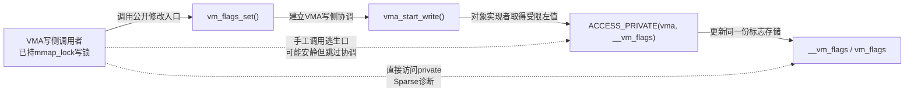

# 第3章\_Sparse地址空间与指针类型契约

## 3.1\_相同机器表示为什么还要分类型

### 3.1.1\_从宏展开走到一次真实的用户记录导入

上一章已经能够把：

```c
char __user *src;
```

展开为 Sparse 可见的 `noderef` 与 `address_space` 属性。这一步解决了“分析器最终看见什么记号”，却还没有解释这些属性为什么值得进入类型系统。读者真正遇到它们时，通常不是在孤立的宏定义里，而是在驱动的 `read`、`write`、`ioctl` 或系统调用实现中：内核函数收到一个来自用户空间的地址，需要把其中的数据导入普通内核对象。

下面用一条结构完整的记录导入路径固定现场。示例省略头文件；调用者负责保证 `dst` 指向仍然存活的内核对象，函数本身不取得 `src` 或 `dst` 的长期所有权：

```c
struct record {
    u32 length;
    u8 payload[64];
};

static int import_record_bad(const struct record __user *src,
                             struct record *dst)
{
    /* 错误：把用户地址当成普通内核对象直接解引用。 */
    struct record tmp = *src;

    if (tmp.length > sizeof(tmp.payload))
        return -EINVAL;

    *dst = tmp;
    return 0;
}

static int import_record(const struct record __user *src,
                         struct record *dst)
{
    struct record tmp;

    /* copy_from_user()返回未能复制的字节数，非零表示导入失败。 */
    if (copy_from_user(&tmp, src, sizeof(tmp)) != 0)
        return -EFAULT;

    /* 只在完整复制后校验内容，校验通过后才更新目标对象。 */
    if (tmp.length > sizeof(tmp.payload))
        return -EINVAL;

    *dst = tmp;
    return 0;
}
```

两条路径处理的是同一批指针比特，但完成的动作并不相同：

1. `import_record_bad()` 直接生成一次普通 C 对象读取；它绕过了用户访问接口所承担的访问检查、故障处理和失败返回，Sparse 也应在 `*src` 处报告受限指针被直接解引用；
2. `import_record()` 先通过 `copy_from_user()` 把用户域数据导入局部内核对象；复制失败时返回且不发布 `tmp`，复制成功后再校验长度，最后才更新 `*dst`；
3. 示例没有动态分配，因此不存在本函数内的释放步骤；真正的资源与生命期边界是“调用期间 `dst` 必须存活，失败返回后调用者不得把未更新的目标当成新记录”。

这个现场说明，`__user` 不是为了改变指针宽度，也不是为了自动执行一次复制。它首先把“这个地址必须经由用户访问协议使用”带进静态类型检查；真正的数据访问仍由 `copy_from_user()` 在运行时完成。

### 3.1.2\_机器表示相同不等于访问契约相同

如果用户地址、MMIO 地址、per-CPU 地址和普通内核地址最终都能装进机器字长的指针，寄存器只能说明“这些比特放得下”，不能说明“应该用哪种协议解释和访问这些比特”。下面不再用四句结论并列带过，而是让四个例子都回答同一组问题：受限指针从哪里来、错误代码省略了哪一步、专用接口补回了什么、失败或拆除时怎样收尾，以及 Sparse 最多能证明到哪里。代码继续省略头文件和驱动注册样板，但保留决定正确性的初始化、正常操作、失败路径与拆除边界。

#### (1)\_用户地址\_把一份记录导入内核对象

上一小节的 `import_record()` 已经给出第一套完整闭环：`src` 是系统调用路径收到的 `struct record __user *`，`tmp` 是当前内核栈上的普通对象，`dst` 是调用者拥有的内核目标对象。

```text
用户地址src
    → copy_from_user()尝试复制到tmp
        → 复制失败：返回-EFAULT，不更新dst
        → 复制成功：校验tmp.length
            → 校验失败：返回-EINVAL，不更新dst
            → 校验成功：把tmp提交给dst
```

错误版的 `struct record tmp = *src` 省略了用户访问入口。即使 `src` 当前碰巧指向已经驻留的页，代码也不能据此取得“以后每次普通加载都安全”的保证；地址可能无效，访问过程也可能需要故障处理。正确版通过 `copy_from_user()` 完成一次有明确成功/失败结果的数据跨域操作，而不是把 `src` 永久转换成普通内核指针。

这个接口还带有执行上下文边界：用户内存访问可能隐式睡眠，调用者不能把示例搬进中断上下文、关闭中断的区间或持有自旋锁的区间。Sparse 能检查 `src` 是否保持 `__user` 类型以及是否发生裸解引用，却不能证明运行时复制必然成功，也不能替调用者检查 `tmp` 中每个业务字段。

继续阅读时，可以先看 [noderef 为什么阻止裸解引用](#3.3_noderef阻止错误的普通解引用)，再看 [接口形参怎样形成合法的跨域入口](#3.4_接口形参怎样把实参送进类型检查)；运行时调用约束可对照 [Linux 官方用户空间访问接口说明](https://docs.kernel.org/kernel-hacking/hacking.html#copy-to-user-copy-from-user-get-user-put-user)。

#### (2)\_MMIO地址\_映射寄存器以后仍不能使用普通指针

假设一个平台设备具有两个由设备手册规定为 32 位小端的寄存器：控制寄存器用于启停设备，状态寄存器用于读取当前状态。驱动先取得 `__iomem` 映射，再通过匹配宽度的访问器读写：

```c
#define DEMO_REG_CONTROL 0x00
#define DEMO_REG_STATUS  0x04
#define DEMO_CONTROL_RUN BIT(0)

struct demo_mmio {
    void __iomem *base;
};

static int demo_mmio_init(struct platform_device *pdev,
                          struct demo_mmio *io)
{
    io->base = devm_platform_ioremap_resource(pdev, 0);
    if (IS_ERR(io->base))
        return PTR_ERR(io->base);

    return 0;
}

static void demo_mmio_start(struct demo_mmio *io)
{
    writel(DEMO_CONTROL_RUN, io->base + DEMO_REG_CONTROL);
}

static u32 demo_mmio_read_status(struct demo_mmio *io)
{
    return readl(io->base + DEMO_REG_STATUS);
}

static void demo_mmio_stop(struct demo_mmio *io)
{
    writel(0, io->base + DEMO_REG_CONTROL);
}

static void demo_mmio_start_bad(struct demo_mmio *io)
{
    u32 *control;

    /* 错误：__force只能压下类型诊断，不能补回MMIO访问语义。 */
    control = (__force u32 *)(io->base + DEMO_REG_CONTROL);
    *control = DEMO_CONTROL_RUN;
}
```

这段代码的完整边界是：

1. `demo_mmio_init()` 先把平台资源转换成 `__iomem` 映射；映射失败时直接返回，后续函数不得运行；
2. `demo_mmio_start()`、`demo_mmio_read_status()` 与 `demo_mmio_stop()` 始终保留 `__iomem` 类型，并通过 `writel()`、`readl()` 完成设备访问；
3. 移除设备以前，驱动先停止新的功能路径并按设备协议调用 `demo_mmio_stop()`；映射由 `devm_` 资源管理在解绑时释放，因此示例不再手工 `iounmap()`；
4. 错误版即使用 `__force` 得到相同数值的普通指针，也只消除了 Sparse 的阻拦。普通 `*control` 写入没有自动获得 MMIO 所需的访问宽度、端序、架构指令和顺序语义。

示例只假定设备手册允许这三个 32 位访问，不假定 `writel()` 返回就表示设备已经执行写入。若设备要求确认 posted write、配置 DMA 描述符或使用 `*_relaxed()`，还必须继续分析设备协议和体系结构顺序。静态类型问题继续看 [address_space 如何建立逻辑指针域](#3.2_address_space建立逻辑指针域)与 [noderef 的访问器边界](#3.3_noderef阻止错误的普通解引用)；运行时顺序进入 [MMIO 访问顺序与屏障](../../../linux/io_model/mmio/P01_MMIO_访问顺序与屏障.md#1.2_为什么必须使用访问器)。

#### (3)\_per-CPU地址\_先选实例再使用普通局部指针

假设模块为每个 CPU 分配一份记录处理统计。`stats->cpu` 不是“当前 CPU 统计对象的普通地址”，而是一个 `__percpu` 偏移；只有把它与某个 CPU 的 per-CPU 基址组合，才能得到可解引用的实例地址：

```c
struct demo_cpu_stats {
    u64 records;
    u64 bytes;
};

struct demo_stats {
    struct demo_cpu_stats __percpu *cpu;
};

static int demo_stats_init(struct demo_stats *stats)
{
    int cpu_id;

    stats->cpu = alloc_percpu(struct demo_cpu_stats);
    if (!stats->cpu)
        return -ENOMEM;

    /* 对象尚未发布，可以逐个初始化所有可能CPU的实例。 */
    for_each_possible_cpu(cpu_id)
        *per_cpu_ptr(stats->cpu, cpu_id) = (struct demo_cpu_stats){};

    return 0;
}

static void demo_stats_account(struct demo_stats *stats, u32 bytes)
{
    struct demo_cpu_stats *local;

    /* local只能在禁止迁移的区间内代表“当前CPU实例”。 */
    preempt_disable();
    local = this_cpu_ptr(stats->cpu);
    local->records++;
    local->bytes += bytes;
    preempt_enable();
}

static void demo_stats_account_bad(struct demo_stats *stats, u32 bytes)
{
    /* 错误：没有选择CPU实例，也没有建立禁止迁移的使用区间。 */
    stats->cpu->records++;
    stats->cpu->bytes += bytes;
}

static void demo_stats_sum_stopped(struct demo_stats *stats,
                                   struct demo_cpu_stats *total)
{
    int cpu_id;

    *total = (struct demo_cpu_stats){};

    /* 只在全部account路径停止后汇总，得到稳定快照。 */
    for_each_possible_cpu(cpu_id) {
        const struct demo_cpu_stats *cpu_stats;

        cpu_stats = per_cpu_ptr(stats->cpu, cpu_id);
        total->records += cpu_stats->records;
        total->bytes += cpu_stats->bytes;
    }
}

static void demo_stats_destroy(struct demo_stats *stats)
{
    /* 调用者必须先停止所有account路径并等待在途调用结束。 */
    free_percpu(stats->cpu);
    stats->cpu = NULL;
}
```

这里有两个容易混在一起的状态：`stats->cpu` 是整个 per-CPU 分配的逻辑入口，`local` 才是本次执行所在 CPU 的普通实例指针。`preempt_disable()` 封闭了“取出 CPU A 实例以后迁移到 CPU B，仍拿着 CPU A 地址继续写”的窗口；它不会自动防止同一 CPU 的中断处理程序同时修改这份结构。示例因此明确假设只有进程上下文调用 `demo_stats_account()`，若中断、NMI 或远端 CPU 也会访问，必须按真实参与者重新选择 `this_cpu_*()` 原语或额外同步。`demo_stats_sum_stopped()` 则故意放在生产者全部停止以后，逐个选择目标 CPU 实例并形成稳定总计；运行中近似汇总需要另一套并发读取约束，不能从本例自动推出。

Sparse 能阻止对 `stats->cpu` 的直接普通解引用，也能检查 per-CPU 接口期待的类型；它不能证明调用者已经停止全部生产者，不能替代 CPU 热插拔或模块拆除协议，也不能判断两个字段是否会被中断并发更新。静态入口继续看 [address_space 的不同逻辑域](#3.2_address_space建立逻辑指针域)与 [noderef 表中的 per-CPU 入口](#3.3_noderef阻止错误的普通解引用)；CPU 实例选择和远端访问限制见 [Linux 官方 this_cpu 操作文档](https://docs.kernel.org/core-api/this_cpu_ops.html#special-operations)。

#### (4)\_RCU地址\_发布取得与对象回收必须组成一条链

最后把 3.1.1 导入的 `struct record` 作为一份只读配置发布给高频读者。共享入口带 `__rcu`；更新 mutex 串行化多个写者；读者只在 RCU 读侧区间内借用当前对象；旧对象必须等一个宽限期以后才能释放：

```c
struct record_slot {
    struct mutex update_lock;
    struct record __rcu *current;
};

static void record_slot_init(struct record_slot *slot)
{
    mutex_init(&slot->update_lock);
    RCU_INIT_POINTER(slot->current, NULL);
}

static int record_slot_read(struct record_slot *slot, struct record *out)
{
    struct record *current;
    int ret = 0;

    rcu_read_lock();
    current = rcu_dereference(slot->current);
    if (!current)
        ret = -ENOENT;
    else
        *out = *current; /* 在读侧区间内复制不可变记录。 */
    rcu_read_unlock();

    return ret;
}

static int record_slot_replace(struct record_slot *slot,
                               const struct record *value)
{
    struct record *new_record;
    struct record *old_record;

    if (value->length > sizeof(value->payload))
        return -EINVAL;

    new_record = kmemdup(value, sizeof(*new_record), GFP_KERNEL);
    if (!new_record)
        return -ENOMEM;

    mutex_lock(&slot->update_lock);
    old_record = rcu_dereference_protected(
        slot->current, lockdep_is_held(&slot->update_lock));
    rcu_assign_pointer(slot->current, new_record);
    mutex_unlock(&slot->update_lock);

    /* 等待替换前可能取得old_record的读者退出，再释放旧对象。 */
    synchronize_rcu();
    kfree(old_record);
    return 0;
}

static int record_slot_read_bad(struct record_slot *slot,
                                struct record *out)
{
    struct record *current = slot->current;

    if (!current)
        return -ENOENT;

    /* 错误：既绕过__rcu类型入口，也没有旧对象生命期保护。 */
    *out = *current;
    return 0;
}

static void record_slot_destroy(struct record_slot *slot)
{
    struct record *old_record;

    /* 调用者此前必须停止新读者和新更新者进入。 */
    mutex_lock(&slot->update_lock);
    old_record = rcu_dereference_protected(
        slot->current, lockdep_is_held(&slot->update_lock));
    rcu_assign_pointer(slot->current, NULL);
    mutex_unlock(&slot->update_lock);

    synchronize_rcu();
    kfree(old_record);
    mutex_destroy(&slot->update_lock);
}
```

这段代码把四项职责分开了：`__rcu` 提供 Sparse 指针域，`rcu_assign_pointer()` 与 `rcu_dereference()` 提供发布—取得入口，`rcu_read_lock()`/`rcu_read_unlock()` 限定读者借用期，`synchronize_rcu()` 延迟旧对象释放。任何一项都不能从另一个接口的名字里自动推出。尤其是 `struct record *current = slot->current`：机器仍然能装下这个地址，普通编译器也可能生成加载，但 Sparse 类型检查和运行时生命期协议同时被绕过。

本例选择同步等待，因此 `record_slot_replace()` 与 `record_slot_destroy()` 必须运行在允许睡眠的上下文。完整的读者、同步/异步更新者和模块退出模式见 [RCU 通用 API 与最小使用闭环](../../../linux/synchronization_and_asynchrony/synchronization/rcu/P03_RCU_通用API与最小使用闭环.md#3.1.2_完整同步实现)；`__rcu`、Sparse 与动态保护条件怎样分工，继续看 [RCU 类型语义、Sparse 与 Lockdep](../../../linux/synchronization_and_asynchrony/synchronization/rcu/P26_RCU_类型语义_Sparse与Lockdep.md#26.1.3_正确的完整代码闭环)。

四个例子现在可以按同一条主线比较：

| 受限指针 | 专用入口产生的普通对象或局部指针 | 仍需另外证明的运行时事实 |
| --- | --- | --- |
| `struct record __user *src` | `copy_from_user()` 填充内核 `tmp` | 复制成功、业务字段有效、调用上下文允许访问用户内存 |
| `void __iomem *base` | `readl()` 返回值或 `writel()` 设备事务 | 设备寄存器宽度、端序、顺序、完成条件和设备生命期 |
| `struct demo_cpu_stats __percpu *cpu` | `this_cpu_ptr()` 返回当前 CPU 实例 | 禁止迁移区间、其他执行上下文并发和拆除同步 |
| `struct record __rcu *current` | `rcu_dereference()` 返回读侧借用指针 | 读侧保护条件、发布顺序、宽限期和唯一回收路径 |

Sparse 的目标是让“访问协议不同”在代码进入运行时以前先表现为类型冲突。这里的“地址空间”首先是分析器建立的 **逻辑指针域**，不能望文生义地直接等同于硬件 MMU 地址空间、页表、设备总线窗口、per-CPU 物理布局或 RCU 宽限期本身。

### 3.1.3\_只会展开宏仍然回答不了什么

回到前面的四类例子，仅知道 `__user`、`__iomem`、`__percpu` 与 `__rcu` 会展开成 GNU 属性，还不足以判断代码是否正确。至少还要回答下面的问题：

1. `address_space` 究竟附着在指针变量、指针目标类型，还是整个函数上？
2. 既然不同 `address_space` 已经不能随意赋值，为什么还要另外增加 `noderef`？
3. `copy_from_user()` 为什么能够同时接收普通内核指针与用户域指针，它的类型签名怎样成为两个逻辑域之间的合法入口？
4. Sparse 是识别 `copy_from_user`、`rcu_check_sparse` 等名字，还是分析这些接口最终形成的类型关系？
5. 如果实现层使用 `__force` 绕过诊断，这个转换究竟证明了什么，又有哪些运行时义务仍未完成？
6. `readl()`、`this_cpu_ptr()` 与 `rcu_dereference()` 为什么能够产出普通值或局部指针，却没有永久取消原始受限指针的访问协议？

这些问题若只按名字猜测，很容易得到两个相反但都错误的结论：要么把 `__user` 当成能够保护访问的运行时安全机制，要么因为普通编译时它通常不改变对象布局和指针宽度，就认为它“什么也没做”。

### 3.1.4\_本章位于哪一层以及读完能做什么

本章只研究 **Sparse 静态类型层**：预处理后的 `address_space` 与 `noderef` 怎样建立逻辑指针域，接口形参和 `typeof` 表达式怎样检查域之间的流动，以及 `__force` 等逃生口怎样显式放宽某一项类型限制。它在整条处理链中的位置如下：


本章不会展开页表、架构 uaccess、MMIO 指令、per-CPU 迁移控制或 RCU 对象回收的完整实现；这些是各访问协议真正兑现安全性的运行时层。它也暂不处理“当前控制流是否已经持锁”这类路径状态，下一章再加入这一条正交检查轴。

读完本章后，读者应能拿到一条指针声明或一次转换，手工标出属性附着位置，判断赋值、比较和解引用是否跨越逻辑指针域，说明应改用哪个专用接口，或者审查一次 `__force` 是否已经有独立依据；最后还要能够明确指出：静态类型检查通过以后，哪些运行时访问、上下文和生命期义务仍需另外证明。后文继续复用 `src`、`base`、per-CPU 入口与 RCU 共享入口，拆解这些接口共同依赖的类型构造方法。

## 3.2\_address\_space建立逻辑指针域

Linux 6.12 的 Sparse 分支定义：

```c
#define __kernel __attribute__((address_space(0)))
#define __user   __attribute__((noderef, address_space(__user)))
#define __iomem  __attribute__((noderef, address_space(__iomem)))
#define __percpu __attribute__((noderef, address_space(__percpu)))
#define __rcu    __attribute__((noderef, address_space(__rcu)))
```

`address_space(name)` 施加在指针目标类型上。Sparse 把不同名称的地址域视为不同类型，并对不受控的赋值、比较或转换发出诊断。

这里的地址域首先是 **静态类型域**，不是对硬件 MMU、页表或总线窗口的声明。`__user` 的真实安全访问仍然由架构访问检查、异常处理和 uaccess 实现完成；`__iomem` 的真实设备事务仍然由 I/O 访问器生成。Sparse 只检查调用者是否遵守了进入这些机制的类型边界。

`__kernel` 使用 `address_space(0)` 显式表示默认内核域。普通未标注指针通常落在这个默认语义中。

## 3.3\_noderef阻止错误的普通解引用

`noderef` 表示带此属性的指针不能通过普通左值解引用：

```c
static u32 read_record_length_bad(const struct record __user *src)
{
    /* 与3.1中的错误导入相同：仍然绕过了用户访问接口。 */
    return src->length;
}
```

这里的 `src->length` 仍然包含对 `src` 的普通解引用，Sparse 应报告受限指针被直接解引用。`noderef` 不是说这个地址永远不可访问，而是说当前表达式绕过了该地址域要求的访问接口。正确形式取决于具体域：

| 指针域 | 常见正确入口 | 裸解引用遗漏了什么 |
| --- | --- | --- |
| `__user` | `copy_from_user()`、`get_user()` | 访问检查、缺页/异常与失败返回 |
| `__iomem` | `readl()`、`writel()` 等 | 设备访问宽度、顺序和架构映射 |
| `__percpu` | `this_cpu_*()`、`per_cpu_ptr()` 等 | CPU 实例选择与抢占/迁移约束 |
| `__rcu` | `rcu_dereference()`、`rcu_assign_pointer()` 等 | 发布/取得语义、类型与动态条件检查 |

表中的接口不是互换关系。`noderef` 只统一表达“不要当普通 C 对象直接访问”，每种地址域仍有自己的功能协议。

## 3.4\_接口形参怎样把实参送进类型检查

`import_record()` 之所以能把 `src` 交给 `copy_from_user()`，不是因为 Sparse 对这个函数名开了特例，而是因为调用者所见的核心类型关系可以简化为：

```c
unsigned long copy_from_user(void *to,
                             const void __user *from,
                             unsigned long n);
```

`to` 接受普通内核指针，`from` 明确要求用户域指针。调用时，Sparse 先检查 `&tmp` 与 `src` 能否分别匹配这两个形参；接口实现再负责实际复制并用返回值报告未复制的字节数。这个函数没有把 `src` 转换成一个以后可以普通解引用的内核指针，而是提供了一次 **受类型约束的数据跨域操作**。

### 3.4.1\_为什么函数体为空仍然能够检查类型

上面的 `copy_from_user()` 同时承担两项职责：它的形参声明了允许接收哪类指针，函数实现则真正完成数据复制。但有些底层包装只需要第一项职责：在接下来的强制转换、汇编入口或低层实现抹去地址空间信息之前，先确认调用者传入的是用户地址，而不需要在检查点执行任何数据操作。

Linux 为这种场景提供了只承担类型约束的空函数：

```c
static inline void
__chk_user_ptr(const volatile void __user *ptr)
{
}
```

函数体是否读写 `ptr`，发生在“调用是否成立”之后。编译器或 Sparse 在建立这次调用时，必须先回答：实参能不能转换成 `const volatile void __user *`。因此，检查点位于 **调用表达式的实参与形参匹配阶段**，不是函数体内部，也不是对 `__chk_user_ptr` 这个名字进行字符串识别。

`const volatile void` 放宽了具体对象类型和限定符的差异，却没有删除 `__user` 地址空间。`struct record __user *` 可以在保留用户地址域的前提下转换为该形参；普通 `struct record *` 仍然属于默认地址域，不能因为目标类型写成 `void *` 就跨域通过。

### 3.4.2\_完整实例\_用同一个空函数检查两种指针来源

下面是一个可单独保存为 `check_user_pointer.c` 的教学实验。它只复现 `__user` 与 `__chk_user_ptr()` 相关的最小机制，不是对 Linux 某个完整用户访问接口的重新实现：

```c
struct record {
    unsigned int length;
};

#ifdef __CHECKER__
/* Sparse 分支：把 __user 保留为类型系统中的命名地址空间。 */
#define __user __attribute__((noderef, address_space(__user)))

/* 函数体为空，形参类型就是这个检查点的全部约束。 */
static inline void
__chk_user_ptr(const volatile void __user *ptr)
{
}
#else
/* 普通编译分支：不改变机器类型，也不生成运行时代码。 */
#define __user
#define __chk_user_ptr(ptr) ((void)0)
#endif

static void verify_record_sources(
    const struct record __user *user_record,
    const struct record *kernel_record)
{
    /* 正确：实参和形参都属于 __user 地址空间。 */
    __chk_user_ptr(user_record);

    /* 错误：普通内核指针不能传给要求 __user 的形参。 */
    __chk_user_ptr(kernel_record);
}
```

用 Sparse 检查这份文件时，可以直接比较两次调用：

```bash
sparse -Waddress-space check_user_pointer.c
```

| 调用 | 实参的关键类型 | 形参要求 | 结果 |
| --- | --- | --- | --- |
| `__chk_user_ptr(user_record)` | `const struct record __user *` | `const volatile void __user *` | 地址空间相同，可以匹配 |
| `__chk_user_ptr(kernel_record)` | `const struct record *` | `const volatile void __user *` | 地址空间不同，应在第二次调用处报告类型不匹配 |

不同 Sparse 版本的诊断措辞可能略有差异，但核心信息会指向“实参类型不正确”或“地址空间不同”。整个过程可以按以下顺序理解：

1. 预处理器为 Sparse 保留 `__user` 属性；
2. Sparse 读取 `__chk_user_ptr()` 的形参类型；
3. 第一处调用把用户域中的 `struct record` 指针转换为同域的 `void` 指针，检查通过；
4. 第二处调用试图把默认地址域指针转换为用户地址域指针，检查失败；
5. 函数体始终为空，因为类型矛盾在进入函数体之前已经形成。

`__chk_io_ptr()` 对 `__iomem` 使用相同方法。Linux 6.12 中这组定义的模块位置可先看 [compiler types 注解模块概念导读](../../../../research/source_reading/compiler_annotations/navigation/P02_Linux_6.12_compiler_types注解模块概念导读.md#2.4_地址空间模块链)，具体条件分支和宏体见 [地址空间注解与类型桥接函数](../../../../research/source_reading/compiler_annotations/source_explanations/P01_Linux_6.12_compiler_types注解宏源码实现.md#1.5_地址空间注解与类型桥接函数)。

### 3.4.3\_普通编译分支为何必须单独观察

在普通编译分支中，这两个入口变成：

```c
#define __chk_user_ptr(x) (void)0
#define __chk_io_ptr(x)   (void)0
```

这时再运行：

```bash
gcc -fsyntax-only check_user_pointer.c
```

普通编译器看到的两次检查都会展开成 `((void)0)`，既没有函数调用，也不会因为地址空间不同而报警。这不是检查失效，而是职责分工：Sparse 分支保存静态类型证据，普通编译分支保证检查点没有运行时成本。

这个分支差异还带来一个容易忽略的调用约束。下面的写法不能被当成“检查指针以后再前移一次”：

```c
static void bad_side_effect(const struct record __user *cursor)
{
    /* 错误用法：普通编译分支不会对 cursor++ 求值。 */
    __chk_user_ptr(cursor++);
}
```

在 Sparse 分支中，`cursor++` 作为函数实参参与表达式分析；在普通编译分支中，宏参数根本没有出现在替换结果里，`cursor` 不会递增。因此这类纯检查入口只能接收 **没有副作用的类型表达式**。如果业务逻辑确实需要更新指针，应把更新写成独立语句，再把更新后的值交给检查点。

## 3.5\_rcu\_check\_sparse不是关键字扫描

RCU 使用：

```c
#define rcu_check_sparse(p, space) \
    ((void)(((typeof(*p) space *)p) == p))
```

它完成的是三步类型构造：

```text
p的目标类型
  → 给目标类型附加期望的space
  → 与p的实际指针类型比较
```

如果把宏改名而保持展开结果，Sparse 仍然能够检查；如果保留宏名却删除 `typeof(*p) space *` 的类型约束，检查就会消失。因此“RCU 静态工具的关键字是 `rcu_check_sparse`”这个模型不成立。

该实现的 Linux 6.12 版本化讲解见 [`rcu_check_sparse()` 静态类型桥接](../../../../research/source_reading/rcu/source_explanations/P01_Linux_6.12_RCU_公共接口与检查机制源码详解.md#1.3.3_rcu_check_sparse静态类型桥接)。

## 3.6\_force与其他类型限定分别改变什么

3.2～3.5 已经说明 Sparse 怎样建立地址域、阻止裸解引用并比较接口类型。现在出现了一个实现层问题：如果一段代码确实需要把原始整数变成受限标志类型，或者需要由对象实现者访问受保护成员，怎样明确告诉 Sparse“这里是有意跨越边界”？

现有的四个名字不能都叫作“逃生口”。`__force` 才是在一次显式转换上放宽 Sparse 额外限定；`__nocast`、`__safe` 与 `__private` 反而是在增加三种不同的限制。下面把四段代码依次放进同一个教学文件 `sparse_qualifier_demo.c`，用同一套条件分支观察 Sparse 和普通编译器分别看见什么。

### 3.6.1\_force实例\_验证原始标志以后进入受限类型

假设外部记录头携带一个普通 `unsigned int` 标志字段，而解析器内部希望使用独立的 `record_flags_t`，防止它与其他整数或标志类型混用。`__bitwise` 建立这个受限整数类型，`__force` 只负责标记经过审查的转换点：

```c
#include <stdbool.h>

#ifdef __CHECKER__
#define __bitwise  __attribute__((bitwise))
#define __force    __attribute__((force))
#define __nocast   __attribute__((nocast))
#define __safe     __attribute__((safe))
#define __private  __attribute__((noderef))
#define ACCESS_PRIVATE(object, member) \
    (*((typeof((object)->member) __force *)&(object)->member))
#else
#define __bitwise
#define __force
#define __nocast
#define __safe
#define __private
#define ACCESS_PRIVATE(object, member) ((object)->member)
#endif

typedef unsigned int __bitwise record_flags_t;

#define RECORD_FLAG_COMPRESSED \
    ((__force record_flags_t)(1U << 0))
#define RECORD_FLAG_CHECKSUM \
    ((__force record_flags_t)(1U << 1))
#define RECORD_FLAG_MASK_RAW ((1U << 0) | (1U << 1))

struct wire_record_header {
    unsigned int raw_flags;
};

static bool decode_record_flags(const struct wire_record_header *header,
                                record_flags_t *out_flags)
{
    unsigned int raw_flags = header->raw_flags;

    /* 先完成运行时范围证明，拒绝协议没有定义的标志位。 */
    if (raw_flags & ~RECORD_FLAG_MASK_RAW)
        return false;

    /* 范围已经验证，才在这个边界上执行受控类型转换。 */
    *out_flags = (__force record_flags_t)raw_flags;
    return true;
}

static bool record_is_compressed(record_flags_t flags)
{
    /* 两个操作数属于同一个受限类型，可以执行约定的位运算。 */
    return (flags & RECORD_FLAG_COMPRESSED) != 0;
}

static record_flags_t decode_record_flags_without_force(
    const struct wire_record_header *header)
{
    /* Sparse应报告普通整数被隐式当成受限类型。 */
    return header->raw_flags;
}

static record_flags_t decode_record_flags_bad_force(
    const struct wire_record_header *header)
{
    /* 虽然不再产生类型诊断，却错误地跳过了未知标志位检查。 */
    return (__force record_flags_t)header->raw_flags;
}
```

四条路径必须按先后关系理解：

1. `header->raw_flags` 仍是来自外部格式的普通整数，可能包含未知位；
2. `decode_record_flags()` 先用 `RECORD_FLAG_MASK_RAW` 证明所有置位都属于协议允许集合；
3. 只有证明成立后，`(__force record_flags_t)` 才把已经验证的数值送入内部受限类型；
4. `decode_record_flags_without_force()` 缺少显式边界，Sparse 可以报告类型混用；`decode_record_flags_bad_force()` 虽然安静，却因为跳过范围检查而仍是错误实现。

这个对照给出了审查 `__force` 的核心问题：**转换之前已经由哪段代码证明它成立？** `__force` 只压下 Sparse 额外限定产生的转换诊断，不会自动生成范围检查，也不会把错误的输入变成合法值。

地址空间指针上的反例更直接。下面两段是需要放在 Linux 内核环境中观察的 uaccess 对照，不属于前面的独立教学文件。它们都想从用户地址取得一个长度，但第一段用 `__force` 抹去地址域后直接解引用：

```c
static int import_length_bad(const unsigned int __user *src,
                             unsigned int *out)
{
    const unsigned int *kernel_ptr;

    /* 错误：只压下地址空间诊断，没有执行用户内存访问。 */
    kernel_ptr = (__force const unsigned int *)src;
    *out = *kernel_ptr;
    return 0;
}

static int import_length(const unsigned int __user *src,
                         unsigned int *out)
{
    unsigned int value;

    /* 正确：通过uaccess入口取得值，并在失败时保持out不变。 */
    if (get_user(value, src))
        return -EFAULT;

    *out = value;
    return 0;
}
```

`import_length_bad()` 没有建立访问检查和故障处理路径；它只是要求 Sparse 接受一次从 `__user` 到默认地址域的转换。`import_length()` 才完成了“尝试读取—检查失败—成功后提交结果”的数据跨域闭环。因此，整数类型边界上的 `__force` 可以在范围验证后合理出现，但用户地址上的同样写法不能替代 `get_user()`。

### 3.6.2\_nocast实例\_提醒宽整数转换但不建立独立类型

`__nocast` 不是放宽，而是一个较弱的转换限制。下面把累计字节数保存在 64 位类型中，希望 Sparse 提醒调用者不要无声地返回或保存成较窄的 `int`：

```c
typedef unsigned long long __nocast record_bytes_t;

static int record_bytes_bad(record_bytes_t bytes)
{
    /* Sparse应报告从带nocast限定的宽整数转换为int。 */
    return bytes;
}

static bool record_bytes_to_uint(record_bytes_t bytes,
                                 unsigned int *out)
{
    /* 先证明目标类型能够保存当前数值。 */
    if (bytes > ~0U)
        return false;

    /* 范围证明成立后，显式放宽这一次转换。 */
    *out = (__force unsigned int)bytes;
    return true;
}

static unsigned long long record_bytes_with_header(record_bytes_t bytes)
{
    /* __nocast允许与普通整数混合，结果也可能丢失该限定。 */
    return bytes + 64U;
}
```

`record_bytes_bad()` 展示它想阻止的事故；`record_bytes_to_uint()` 则先做范围检查，再用 `__force` 标出已经审查的窄化点。第三个函数揭示了 `__nocast` 的弱边界：它不禁止带限定整数与普通整数参加运算，限定也很容易随表达式结果丢失。若需求是“这个标志类型绝不能和其他整数类型混用”，应选择 `__bitwise` 一类更严格的独立类型，而不是把 `__nocast` 当成同等级替代品。

### 3.6.3\_safe实例\_记录已经成立的不为空不变量

`__safe` 也不是运行时检查。它声明一个指针在当前接口或变量上已经被更早的逻辑证明为非 `NULL` 且不会产生陷阱，因此以后再把它放进条件表达式时，Sparse 应提醒“代码正在重新测试一个声明为 safe 的对象”：

```c
struct record_body {
    unsigned int length;
};

static unsigned int record_length_checked(const struct record_body *record)
{
    const struct record_body * __safe checked_record;

    /* 功能路径先完成真实的空指针检查。 */
    if (!record)
        return 0;

    /* 从这里开始，checked_record记录已经成立的不为空不变量。 */
    checked_record = record;
    return checked_record->length;
}

static unsigned int record_length_redundant(
    const struct record_body * __safe record)
{
    /* Sparse应提醒：该形参已经声明为safe，却又被条件测试。 */
    if (!record)
        return 0;

    return record->length;
}
```

第一条路径把职责顺序写清楚了：普通 C 条件先证明 `record != NULL`，随后 `checked_record` 才记录这个已经成立的事实。第二条路径展示 `__safe` 能发现的矛盾。反过来，如果调用者实际可能传入 `NULL`，仅在形参上添加 `__safe` 不会拒绝这个地址、不会插入分支，也不会阻止后续空指针解引用；那是错误的契约声明，而不是安全修复。

### 3.6.4\_private实例\_把成员访问收口到对象实现者

`__private` 展开为 `noderef`，用于让普通成员访问产生诊断。下面的缓存对象由自己的初始化、发布、查询与清理函数管理 `state`，外部代码不应直接写这个字段：

```c
enum record_cache_state {
    RECORD_CACHE_EMPTY,
    RECORD_CACHE_READY,
};

struct record_cache {
    unsigned int __private state;
};

static void record_cache_init(struct record_cache *cache)
{
    ACCESS_PRIVATE(cache, state) = RECORD_CACHE_EMPTY;
}

static bool record_cache_publish(struct record_cache *cache)
{
    if (ACCESS_PRIVATE(cache, state) != RECORD_CACHE_EMPTY)
        return false;

    ACCESS_PRIVATE(cache, state) = RECORD_CACHE_READY;
    return true;
}

static bool record_cache_is_ready(struct record_cache *cache)
{
    return ACCESS_PRIVATE(cache, state) == RECORD_CACHE_READY;
}

static void record_cache_reset(struct record_cache *cache)
{
    ACCESS_PRIVATE(cache, state) = RECORD_CACHE_EMPTY;
}

static void record_cache_break_boundary(struct record_cache *cache)
{
    /* Sparse应报告对private成员的普通访问。 */
    cache->state = RECORD_CACHE_READY;
}
```

这个例子没有动态分配，`cache` 的存储生命期仍由调用者负责；四个对象函数只集中管理字段状态。`record_cache_break_boundary()` 在 C 语法上仍然合法，普通编译器也不会形成真正的私有权限，但 Sparse 分支能够把这种绕过变成诊断。`ACCESS_PRIVATE()` 内部使用一次 `__force` 恢复成员左值，下一节再逐层展开这段受控越权表达式。

### 3.6.5\_把四种效果放回同一张审查表

完成实例以后，四种属性才能按同一个问题比较：它改变了哪条静态规则，运行时还欠什么证明？

| 注解 | 是否属于逃生口 | 实例中改变的静态规则 | 仍然不能替代的运行时事实 |
| --- | --- | --- | --- |
| `__force` | 是，只作用于当前显式转换 | 允许原始整数进入 `record_flags_t`，或抑制额外限定导致的转换诊断 | 标志范围、数据复制、地址有效性、生命期与访问协议 |
| `__nocast` | 否，增加较弱的转换限制 | 提醒 `record_bytes_t` 被窄化或转换为其他类型 | 溢出检查；也不能提供 `__bitwise` 的严格类型隔离 |
| `__safe` | 否，记录不为空且非陷阱的声明 | 对已经声明为 safe 的指针再次做条件测试时给出诊断 | 真实空指针检查、对象生命期和调用者契约正确性 |
| `__private` | 否，增加成员访问限制 | 让 `cache->state` 的普通访问触发 `noderef` 诊断 | C 语言权限控制、并发同步和对象所有权 |

把除 uaccess 对照之外的四段教学代码按顺序合并后可以执行：

```bash
sparse -Wbitwise sparse_qualifier_demo.c
gcc -fsyntax-only sparse_qualifier_demo.c
```

预期 Sparse 把诊断落在未使用 `__force` 的受限标志转换、`record_bytes_bad()` 的窄化、`record_length_redundant()` 的条件测试和 `record_cache_break_boundary()` 的直接成员访问处；`decode_record_flags_bad_force()` 反而可能保持安静，这正好证明“无诊断”不等于范围验证已经完成。普通 GCC 分支会擦除这些 Sparse 属性和转换标记，但保留所有真实的条件判断、赋值与返回路径。

这组属性的稳定语义可对照 [Sparse annotations 文档](https://sparse.docs.kernel.org/en/v0.6.4/annotations.html)；Linux 6.12 如何用 `__bitwise` 与 `__force` 构造受限整数类型，见 [Linux 6.12 Sparse 类型检查说明](https://docs.kernel.org/6.12/dev-tools/sparse.html#using-sparse-for-typechecking)。本仓库中的版本化定义和普通编译退化继续看 [其他限定与 ACCESS PRIVATE 逃生口](../../../../research/source_reading/compiler_annotations/source_explanations/P01_Linux_6.12_compiler_types注解宏源码实现.md#1.7_其他限定与_ACCESS_PRIVATE逃生口)。

## 3.7\_ACCESS\_PRIVATE集中管理有意越权

### 3.7.1\_需求从哪里来\_字段可读不等于允许任意修改

上一节已经说明，`__private` 能让 Sparse 诊断普通成员访问，`ACCESS_PRIVATE()` 则能在指定位置恢复这个成员的左值。但如果不先知道它要保护什么，这两个宏很容易被误解为“一个制造警告，另一个消除警告”。

内核对象中有一类字段，**读取字段值** 可以是普通操作，**修改字段值** 却不是一次孤立赋值。修改者还可能必须先取得某把锁、屏蔽中断、建立内存顺序、排除并发读者，或者只能在对象尚未发布的初始化阶段写入。C 结构体没有语言级的私有成员，因此单靠字段名无法迫使调用者经过这些协议。

面对这个需求，三种直觉写法有不同缺口：

1. 把字段保持为普通可写成员：实现简单，但任何调用者都能绕过对象的修改 helper；
2. 只把字段声明为 `const`：能阻止普通赋值，但对象自己的实现函数也失去了合法写入通道；
3. 对外提供只读视图，另设一个 `__private` 写视图，并且只在对象所有者的 helper 中使用 `ACCESS_PRIVATE()`：普通调用者可以读，直接写会遇到编译期阻力，而实现所有者仍能在完成真实协议后修改它。

Linux 6.12 的 VMA 标志就是第三种设计。以下声明从 `include/linux/mm_types.h` 裁剪而来，为了突出访问边界而省略了 `struct vm_area_struct` 的其他成员：

```c
union {
    const vm_flags_t vm_flags;       /* 普通调用者通过这个视图读取标志。 */
    vm_flags_t __private __vm_flags; /* 对象实现者使用的受限写视图。 */
};
```

两个成员位于同一个 `union` 中，因而是同一份存储的两种访问视图，不是需要同步的两份标志。`vma->vm_flags` 允许读取，它的 `const` 限定阻止普通赋值；`vma->__vm_flags` 保留可写类型，但 `__private` 让 Sparse 拒绝普通代码直接解引这个成员。真正的写入入口由 `vm_flags_init()`、`vm_flags_set()` 等 helper 按对象状态分工。

### 3.7.2\_完整场景\_修改已进入VMA树的标志

假设内核的某条 VMA 写侧路径已持有 `mmap_lock` 写锁，现在需要为一个已经进入 VMA 树的对象增加 `VM_DONTEXPAND` 标志。下面三个版本的最终位运算看似一样，它们对对象协议的遵守程度却完全不同：

```c
static void mark_vma_bad_direct(struct vm_area_struct *vma)
{
    /* 错误：直接解引private成员，Sparse应报告诊断。 */
    vma->__vm_flags |= VM_DONTEXPAND;
}

static void mark_vma_bad_escape(struct vm_area_struct *vma)
{
    /* 错误：可能让Sparse安静，却绕过了VMA写侧协调。 */
    ACCESS_PRIVATE(vma, __vm_flags) |= VM_DONTEXPAND;
}

static void mark_vma(struct vm_area_struct *vma)
{
    /* 正确：调用对象所有者提供的修改入口。 */
    vm_flags_set(vma, VM_DONTEXPAND);
}
```

第一个版本的问题最容易看到：调用者直接访问了 `__private` 成员，Sparse 能在这一行建立诊断。第二个版本更危险：调用者已经知道逃生口，因此可能不再收到 Sparse 诊断，但它只恢复了成员左值，没有执行 VMA 协议。

第三个版本才是普通调用者应使用的入口。`include/linux/mm.h` 中的 `vm_flags_set()` 先调用 `vma_start_write()`，再由 helper 内部通过 `ACCESS_PRIVATE(vma, __vm_flags)` 取得受限左值并执行位或。在启用 `CONFIG_PER_VMA_LOCK` 时，`vma_start_write()` 还会在已持有 `mmap_lock` 写锁的前提下更新 VMA 的写侧序列，使并发的 per-VMA 读者在外层写锁释放或降级前不能进入。未启用该配置时，这一步不生成额外动作，但外层 `mmap_lock` 的调用契约仍然存在。



这条路径也解释了为什么不能把 `ACCESS_PRIVATE()` 本身当成 VMA 的公开修改 API。它只完成“让对象实现者取得成员左值”这一步；锁、序列号更新、对象所处阶段和修改语义都由外层 helper 承担。所以 Linux 还要按场景提供不同入口：

| VMA所处场景 | 应使用的入口 | 入口承担的额外语义 |
| --- | --- | --- |
| VMA尚未进入VMA树 | `vm_flags_init()` | 直接初始化受限存储，不需要树内并发协调 |
| 已在树中，增加或清除部分标志 | `vm_flags_set()` / `vm_flags_clear()` | 先执行 `vma_start_write()`，再修改指定位 |
| 已在树中，重置整个标志值 | `vm_flags_reset()` | 明确断言调用者持有需要的写锁，再执行重置 |

因此，`ACCESS_PRIVATE()` 实际上服务于两级边界：第一级用 `__private` 阻止普通代码不经思考地解引字段；第二级把逃生口收进对象 helper，让真正的同步、阶段和状态转换协议有一个统一实现位置。

### 3.7.3\_第二个场景\_RCU节点锁为什么也要藏在包装后面

VMA 例子保护的是“写字段前必须完成协调”。Linux 6.12 的 Tree RCU 还给出了另一种需求：有时对象内部存放的本来就是锁，但调用者仍不能只执行原始加锁操作。`kernel/rcu/tree.h` 中的 `struct rcu_node` 把节点锁声明为受限成员：

```c
struct rcu_node {
    raw_spinlock_t __private lock; /* 必须通过RCU节点锁包装访问。 */
    /* 省略其他节点状态。 */
};
```

Tree RCU 会在树的不同层级之间先释放一个节点锁，再获得另一个节点锁。单独依靠这两次原始锁操作，不足以提供 RCU 这条路径需要的跨节点顺序。因此 `kernel/rcu/rcu.h` 提供 `raw_spin_lock_rcu_node()`、`raw_spin_lock_irqsave_rcu_node()` 等包装：包装内部用 `ACCESS_PRIVATE()` 取得 `lock`，执行原始加锁，然后再执行 `smp_mb__after_unlock_lock()` 补足该协议所需的顺序。

```text
错误路径：
调用者
  -> raw_spin_lock_irqsave(&ACCESS_PRIVATE(rnp, lock), flags)
  -> 只完成原始加锁
  -> 跳过RCU节点包装要求的额外顺序

正确路径：
调用者
  -> raw_spin_lock_irqsave_rcu_node(rnp, flags)
  -> 包装内部通过ACCESS_PRIVATE取得lock
  -> 执行原始加锁
  -> 执行smp_mb__after_unlock_lock()
  -> 进入符合RCU节点协议的临界区
```

错误路径再次证明，调用 `ACCESS_PRIVATE()` 最多只能证明“这里有意访问了受限字段”，不能证明这个访问符合对象协议。将它放在 RCU 包装内部，才能让外部调用者不容易忘记额外的顺序步骤。

### 3.7.4\_审查ACCESS\_PRIVATE时要问什么

`ACCESS_PRIVATE()` 在普通编译分支中仍退化为直接成员访问，所以它不增加锁、屏障或运行时权限检查。它的工程价值是让静态分析中的有意越权具有统一名字，从而可以通过例如下列命令审查：

```bash
rg -n 'ACCESS_PRIVATE\(' include kernel mm
```

对每个命中点，不应只看转换是否有效，而应继续核对：

1. 这里是对象所有者的内部 helper，还是普通调用者为了消除诊断而手工越权？
2. 访问前后应有的锁、中断状态、屏障、写侧序列或初始化阶段检查在哪里？
3. 调用者是否应该改用现成公开 helper，而不是直接使用 `ACCESS_PRIVATE()`？
4. 普通编译时宏会退化为直接成员访问，所以必要的真实协议是否仍由周围代码完整实现？
5. 对象生命期、指针有效性和并发所有权是否有另外证明？宏本身不提供这些保证。

因而，`__private` 与 `ACCESS_PRIVATE()` 并没有为 C 创造真正的私有字段。它们建立的是一条可审查边界：无意的直接访问会被 Sparse 指出，有意的访问点可用名字检索，对象所有者则把这个点收进完整协议的 helper 里。Linux 6.12 中的 VMA 标志与 RCU 节点锁分别展示了“修改前协调”和“加锁后补足顺序”两种实际用途。

先从 [Linux 6.12 compiler types 注解模块概念导读](../../../../research/source_reading/compiler_annotations/navigation/P02_Linux_6.12_compiler_types注解模块概念导读.md#2.4_地址空间模块链)确认这类字段与实现所有权的关系；需要查看 `typeof`、取地址、`__force` 和再解引如何组成宏体时，再进入 [compiler types 注解宏源码实现](../../../../research/source_reading/compiler_annotations/source_explanations/P01_Linux_6.12_compiler_types注解宏源码实现.md#1.7_其他限定与_ACCESS_PRIVATE逃生口)核对唯一实现讲解。

## 3.8\_地址空间检查的证明边界

回到 `import_record()`：Sparse 没有报告地址域冲突，只能支持“`src` 经过了一个类型上接受 `__user` 指针的入口”，不能证明这次复制必然成功。运行时仍要检查 `copy_from_user()` 的返回值，并且只有成功路径才能消费和发布 `tmp`。

更一般地说，Sparse 报告类型兼容只能形成以下有限结论：在本次翻译单元、当前配置分支和已经建立的类型传播中，没有观察到相应地址域冲突。它不能单独证明：

- 用户地址在运行时一定有效；
- MMIO 设备仍在电源开启状态；
- per-CPU 指针使用期间任务没有迁移；
- RCU 目标对象尚未回收；
- 所有配置分支和其他翻译单元都已经检查。

下一章加入另一条正交状态轴：同一个指针类型正确的函数，仍可能在错误的锁上下文中调用。Sparse 使用 `context()` 与 `__context__()` 沿控制流维护这本账。

上一篇：[预处理器、GNU 属性与表达式扩展](P02_预处理器_GNU属性与表达式扩展.md)。

下一篇：[Sparse 上下文与控制流记账](P04_Sparse上下文与控制流记账.md)。
