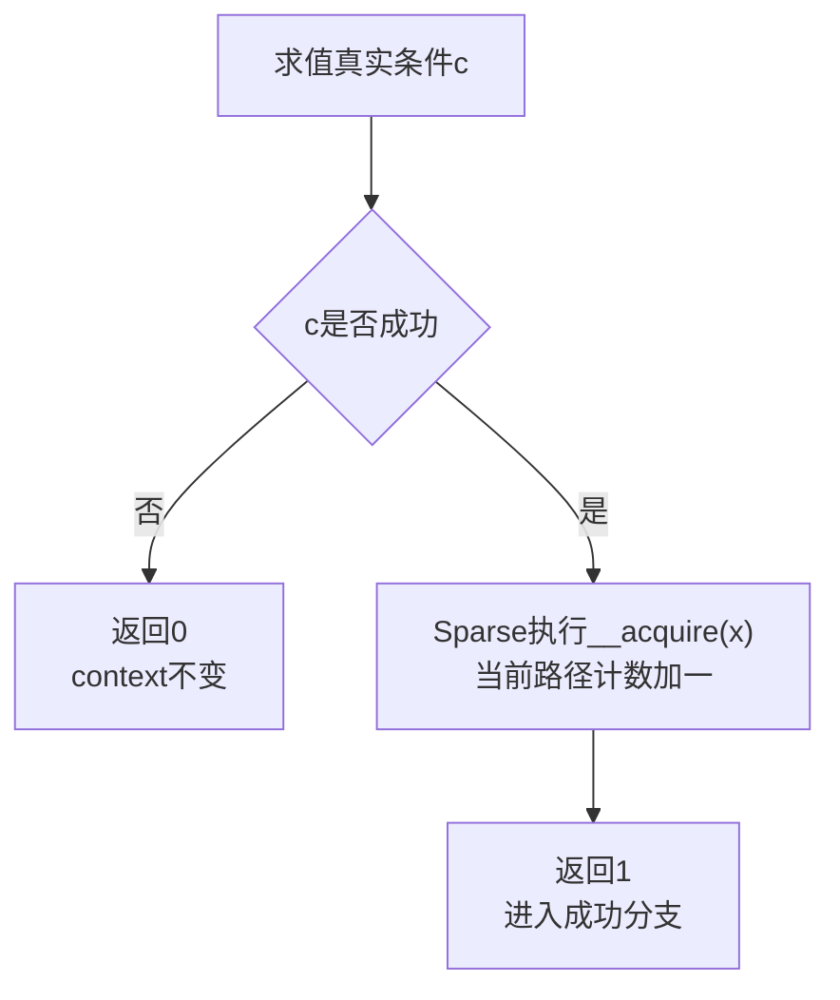
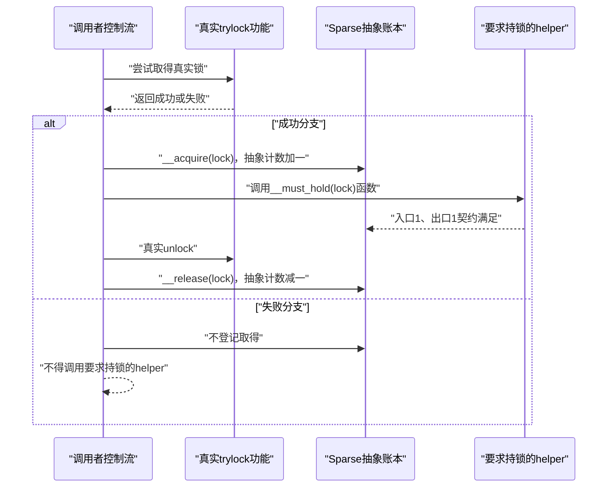

# 第4章\_Sparse上下文与控制流记账

## 4.1\_类型正确仍然可能在错误时机调用

### 4.1.1\_从用户地址类型走到一次带trylock的更新

上一章已经用记录导入场景说明：`struct record __user *` 不能当成普通内核指针解引，必须通过 `copy_from_user()` 把数据导入内核对象。现在再加一个真实工程约束：多个执行路径共享同一个 `state->current`，更新者只愿意尝试取锁，锁正被占用时立即返回 `-EBUSY`，不在这里自旋等待。

下面是这条路径的完整教学实例。代码位于 Linux 内核环境，省略头文件；`state` 由调用者分配并在所有路径停止后销毁，本函数不取得它的长期所有权：

```c
struct record {
    u32 length;
    u8 payload[64];
};

struct state {
    raw_spinlock_t lock;
    bool accepting;
    struct record current;
};

static void state_init(struct state *state)
{
    raw_spin_lock_init(&state->lock);
    state->accepting = true;
    memset(&state->current, 0, sizeof(state->current));
}

static void state_stop_accepting(struct state *state)
{
    raw_spin_lock(&state->lock);
    state->accepting = false;
    raw_spin_unlock(&state->lock);
}

static int commit_record_locked(const struct record *record,
                                struct state *state)
    __must_hold(&state->lock);

static int commit_record_locked(const struct record *record,
                                struct state *state)
{
    /* 锁内只检查共享状态并提交已导入的内核记录。 */
    if (!state->accepting)
        return -ESHUTDOWN;

    state->current = *record;
    return 0;
}

static int try_import_record(const struct record __user *src,
                             struct state *state)
{
    struct record tmp;
    int ret;

    /* 可能睡眠的用户内存访问必须在raw spinlock之外完成。 */
    if (copy_from_user(&tmp, src, sizeof(tmp)) != 0)
        return -EFAULT;

    if (tmp.length > sizeof(tmp.payload))
        return -EINVAL;

    /* 失败分支没有取得锁，直接返回。 */
    if (!raw_spin_trylock(&state->lock))
        return -EBUSY;

    /* 只有trylock成功分支才能进入受保护helper。 */
    ret = commit_record_locked(&tmp, state);

    /* commit_record_locked()成功或失败都必须在返回前解锁。 */
    raw_spin_unlock(&state->lock);
    return ret;
}
```

调用者先执行 `state_init()`；需要拒绝后续提交时调用 `state_stop_accepting()`，最后还要停止所有新调用并等待在途调用退出，才能销毁承载 `state` 的存储。嵌入式 raw spinlock 没有额外释放函数，但这不会自动完成外层对象的生命期封闭。

这个实例已经满足上一章的类型契约：`src` 始终保持 `__user` 类型，数据也确实在取 raw spinlock 以前通过 `copy_from_user()` 进入 `tmp`。然而，程序的正确性还取决于时间顺序：`raw_spin_trylock()` 返回真以后才能调用 `commit_record_locked()`，且后者即使因 `state->accepting == false` 返回 `-ESHUTDOWN`，调用者也仍然欠着一次解锁。

如果把错误处理写成下面这样，所有指针类型仍然正确，但失败路径会带着真实锁返回：

```c
static int try_import_record_bad_exit(const struct record __user *src,
                                      struct state *state)
{
    struct record tmp;
    int ret;

    if (copy_from_user(&tmp, src, sizeof(tmp)) != 0)
        return -EFAULT;

    if (tmp.length > sizeof(tmp.payload))
        return -EINVAL;

    if (!raw_spin_trylock(&state->lock))
        return -EBUSY;

    ret = commit_record_locked(&tmp, state);
    if (ret)
        return ret; /* 错误：失败路径漏掉解锁。 */

    raw_spin_unlock(&state->lock);
    return 0;
}
```

这不是“锁指针类型错了”，而是 **进入某条控制流路径时已经建立的状态，没有在该路径退出前清偿**。Sparse 的 context 检查就是为这类“取得与释放是否在每条路径上配对”的问题维护一个流敏感整数账本。

### 4.1.2\_需要分开的三类状态

阅读这类代码时，至少要把三个层次分开：

| 状态 | 保存在哪里 | 谁修改 | 它能证明什么 |
| --- | --- | --- | --- |
| `src` 的地址空间类型 | Sparse 解析得到的 C 类型 | 声明、宏展开和显式转换 | 这个指针是否经过允许的类型入口 |
| 真实锁功能状态 | `state->lock` 及底层锁实现 | `raw_spin_trylock()` / `raw_spin_unlock()` 的功能路径 | 运行时是否真正取得互斥与锁所带的顺序 |
| Sparse context 账本 | 分析器沿控制流基本块传播的抽象整数 | `context` 函数属性和 `__context__` 路径事件 | 已接入注解的取得、释放是否在分析可见路径上平衡 |

这三类状态彼此不会自动同步。`__user` 类型正确不代表已经持锁；Sparse 账本加一不代表真实硬件原子操作成功；真实锁已经取得也不代表分析器一定看见了对应事件。二者只有在锁原语的正确时间点接入注解，才能在给定翻译单元中形成有用的对照。

### 4.1.3\_为什么本章现在必须出现

仅凭上一章的类型模型，读者还无法回答下列问题：

1. `__must_hold(&state->lock)` 中的“进入时持有”怎样变成分析器可见的函数边界契约？
2. 普通取锁每次都成功，trylock 却有真、假两条路径；Sparse 怎样只在成功路径加一？
3. `commit_record_locked()` 自己返回 `-ESHUTDOWN` 时为什么仍然算“保持上下文不变”，而解锁债务继续归外层调用者？
4. `__context__(x, 1)` 是 C、GNU 属性还是 Sparse 自己规定的语句，项目代码能否随意改变它的意义？
5. `context(x, 0, -1)` 中的负数究竟是计数结果，还是工具约定；它是否真能把函数返回值绑定到成功分支？

本章只解决 **Sparse 静态 context 账本如何由函数属性、函数体标记和控制流分支共同形成**。真实自旋锁算法、内存顺序和 Lockdep 的运行时依赖图不在这里重复展开。读完后，读者应能手工沿 `try_import_record()` 的成功、失败路径写出账本值，判断漏标、错标与精确分支传播之间的区别，并说明静态无告警仍缺少哪些运行时证明。

## 4.2\_context属性声明函数边界契约

Linux 6.12 定义：

```c
#define __must_hold(x) __attribute__((context(x, 1, 1)))
#define __acquires(x)  __attribute__((context(x, 0, 1)))
#define __releases(x)  __attribute__((context(x, 1, 0)))
```

`context(x, entry, exit)` 可以先按设计意图读成：分析函数体时，该函数入口假定抽象计数为 `entry`，正常返回时期望计数为 `exit`；在调用点，这个契约通常向调用者传播 `exit - entry` 的账本变化。

| 宏 | 进入计数 | 退出计数 | 函数角色 |
| --- | ---: | ---: | --- |
| `__must_hold(x)` | 1 | 1 | 函数体在已有上下文中执行，并保持账本不变 |
| `__acquires(x)` | 0 | 1 | 函数建立该上下文 |
| `__releases(x)` | 1 | 0 | 函数撤销该上下文 |

第一个参数 `x` 通常写成锁地址或受保护对象，便于人阅读“这笔账意图对应谁”。但这里必须说明当前工具边界：Sparse 0.6.4 文档把第一参数定义为用于识别上下文的文档性表达式，其 IR 文档也标明 `OP_CONTEXT.context_expr` 尚未用于检查。也就是说，它并没有建立“每把锁各有一个独立计数器”的精确映射，而是沿当前函数的控制流跟踪聚合计数。

这个限制使 `__must_hold(x)` 必须被读成 **函数体的入口/退出契约和对开发者的锁定意图**，不能宣称它必然在每个调用点识别“正好是这把锁”。例如 `context(x, 1, 1)` 对调用者的数值变化是零；调用点是否真的已持有 `x` 仍不能单靠这个属性形成完整证明。[Sparse context 属性文档](https://sparse.docs.kernel.org/en/v0.6.4/annotations.html#context-ctxt-entry-exit) 给出了稳定语义，[Sparse IR 的 OP\_CONTEXT 说明](https://sparse.docs.kernel.org/en/v0.6.4/IR.html#op-context) 则可用来核对当前实现粒度。

## 4.3\_context语句标记函数体内的状态变化

### 4.3.1\_context双下划线语句的语义由谁规定

Linux 6.12 在 `include/linux/compiler_types.h` 中定义：

```c
#define __acquire(x) __context__(x, 1)
#define __release(x) __context__(x, -1)
```

这里必须分开“宏名是谁定义的”和“语法的意义是谁规定的”：

| 层次 | 所有者 | 能够决定什么 |
| --- | --- | --- |
| `__context__(...)` 语句 | Sparse 分析器 | 将 `__context__` 作为保留词解析成 `STMT_CONTEXT`，再降低为 `OP_CONTEXT` 指令；增量必须是分析器能求值的常量表达式 |
| `__acquire(x)` / `__release(x)` 宏 | Linux 通用编译器注解层 | 在 `__CHECKER__` 分支把有意图的名字映射到 Sparse 语句，在普通 GCC/Clang 分支退化为 `(void)0` |
| 具体调用点 | 锁原语或对象协议的实现者 | 决定在功能取得成功、功能释放完成或失败回滚的哪个时间点登记静态事件 |

因此，项目作者完全可以定义自己的包装宏，例如 `record_session_enter(x)` 展开为 `__acquire(x)`，但他不能用一个普通 C 宏重新规定“`__context__(x, 1)` 表示什么”。该语义写在 Sparse 前端和 context 检查实现中：

- `delta` 为 `1`：当前分析路径的抽象计数加一；
- `delta` 为 `-1`：当前分析路径的抽象计数减一。

第一个参数 `x` 会被解析和保存为语义识别表达式，但如 4.2 所述，Sparse 0.6.4 的 context 检查尚未用它维护每个对象的独立账本。真正改变当前路径整数的是第二参数 `delta`。[Sparse 0.6.4 的语句解析代码](https://git.kernel.org/pub/scm/devel/sparse/sparse.git/tree/parse.c?h=v0.6.4#n2439) 和 [OP\_CONTEXT 线性化代码](https://git.kernel.org/pub/scm/devel/sparse/sparse.git/tree/linearize.c?h=v0.6.4#n2060) 展示了这两步。

### 4.3.2\_完整实例\_一次记录导入会话怎样进入和退出

为了把“真实功能状态”与“Sparse 账本”对照清楚，下面先不实现第二把锁，而是定义一个只由当前调用者使用的记录导入会话。`active` 是真实的功能状态；context 标记只用来检查“开始—结束”是否在每条控制流路径上配对。调用者必须先执行 `record_session_init()`，禁止嵌套 `record_session_begin()`，并且不能让多个 CPU 共享同一个会话。该会话不提供多 CPU 互斥，因此不能用它替代锁。

```c
struct record_session {
    bool active;
    struct record staged;
};

static void record_session_init(struct record_session *session)
{
    session->active = false;
    memset(&session->staged, 0, sizeof(session->staged));
}

static void record_session_begin(struct record_session *session)
    __acquires(session);

static void record_session_begin(struct record_session *session)
{
    /* 先建立真实会话状态。 */
    session->active = true;

    /* 再告诉Sparse：当前路径的抽象账本加一。 */
    __acquire(session);
}

static int record_session_stage(const struct record __user *src,
                                struct record_session *session)
    __must_hold(session);

static int record_session_stage(const struct record __user *src,
                                struct record_session *session)
{
    struct record tmp;

    /* active才是运行时功能检查，不是Sparse账本。 */
    if (!session->active)
        return -EPERM;

    if (copy_from_user(&tmp, src, sizeof(tmp)) != 0)
        return -EFAULT;

    if (tmp.length > sizeof(tmp.payload))
        return -EINVAL;

    session->staged = tmp;
    return 0;
}

static void record_session_end(struct record_session *session)
    __releases(session);

static void record_session_end(struct record_session *session)
{
    /* 先结束真实会话。 */
    session->active = false;

    /* 再告诉Sparse：当前路径的抽象账本减一。 */
    __release(session);
}

static int import_record_session(const struct record __user *src,
                                 struct record_session *session)
{
    int ret;

    record_session_begin(session);
    ret = record_session_stage(src, session);

    /* 无论stage成功还是失败，都必须结束会话。 */
    record_session_end(session);
    return ret;
}

static int import_record_session_bad(const struct record __user *src,
                                     struct record_session *session)
{
    int ret;

    record_session_begin(session);
    ret = record_session_stage(src, session);
    if (ret)
        return ret; /* 错误：真实active状态和Sparse债务都未清理。 */

    record_session_end(session);
    return 0;
}
```

正确路径可以用同一组阶段追踪：

| 阶段 | 触发动作 | `session->active` | Sparse抽象值 | 退出条件 |
| --- | --- | ---: | ---: | --- |
| S0 | `record_session_init()` 完成 | `false` | 0 | 调用者准备开始导入 |
| S1 | `record_session_begin()` 设置功能状态并执行 `__acquire(session)` | `true` | 1 | 会话建立 |
| S2 | `record_session_stage()` 复制并校验记录 | `true` | 1 | 成功或任一失败码返回给外层 |
| S3 | 外层无条件调用 `record_session_end()` | `false` | 0 | 会话债务清偿，函数可返回 |

`record_session_stage()` 返回错误不等于会话已经结束；它的 `__must_hold(session)` 边界是 1 进、1 出，因此失败码只改变功能结果，不清偿外层债务。`import_record_session()` 把 `record_session_end()` 放在统一收尾位置，所以成功和失败都从 1 回到 0；错误版在 `ret != 0` 时提前返回，既留下 `active = true` 的真实功能错误，也会让 Sparse 在函数退出处看到未平衡计数。

这个实例也给出了注解作者的责任边界：

1. 遗漏 `__acquire()` 或 `__release()` 会使真实功能正确而静态账本错误，形成误报；
2. 真实取得尚未成功就提前执行 `__acquire()`，会让账本比功能状态先走一步，可能掩盖后续误用；
3. 可能失败的取得不能无条件登记加一，必须把事件放到已经证明成功的分支，这正是 4.5 中 `__cond_lock()` 存在的原因。

函数属性描述边界预期，函数体中的标记描述内部路径怎样兑现预期。它们都不执行功能动作；真实锁原语还必须在相应位置完成原子操作、等待、抢占或 IRQ 管理。普通 GCC/Clang 构建擦除 `__acquire()` 和 `__release()` 以后，`active`、复制、校验和清理代码仍必须独立构成完整协议。

## 4.4\_它不是内存序acquire与release

名称相似容易造成严重混淆：

| 记号 | 所属层次 | 修改什么 | 是否生成同步指令 |
| --- | --- | --- | --- |
| `__acquire(lock)` / `__release(lock)` | Sparse 静态分析 | 抽象 context 计数 | 否 |
| `smp_load_acquire()` / `smp_store_release()` | Linux 内存顺序 | 编译器/CPU 可观察顺序 | 视架构实现而定 |
| `spin_lock()` / `spin_unlock()` | 真实锁功能 | 锁状态及其隐含顺序 | 是或进入体系结构实现 |
| `lock_acquire()` / `lock_release()` | Lockdep 动态检查 | 当前任务影子账本和历史依赖 | 仅检查器代码，不取得功能锁 |

因此，给函数加 `__acquires(lock)` 不会让它获得互斥性；删除注解也不会取消真实锁，但会失去相应静态诊断。

## 4.5\_条件取得必须把账本绑定到成功分支

trylock 只有成功时才建立持锁状态。若无条件写入静态账本，失败分支就会被错误地当成持锁。Linux 使用：

```c
#define __cond_lock(x, c) \
    ((c) ? ({ __acquire(x); 1; }) : 0)
```



例如 `raw_spin_trylock(lock)` 在 Linux 6.12 中包装 `_raw_spin_trylock(lock)`：真实内部函数决定是否成功，`__cond_lock` 只把成功事实映射到 Sparse 的对应分支。

## 4.6\_条件取得的调用时序



这个时序显示了功能状态与静态状态的配对要求：若功能成功却漏掉静态登记，会产生误报；若功能失败却错误登记，会掩盖真实误用。

## 4.7\_cond\_acquires的负值不能按普通计数读取

### 4.7.1\_负一首先是条件退出的哨兵值

Linux 6.12 的定义是：

```c
#define __cond_acquires(x) \
    __attribute__((context(x, 0, -1)))
```

普通 `context(x, entry, exit)` 契约把 `entry` 和 `exit` 写成非负整数，因为它们表示固定的入口、退出计数。条件取得却没有唯一退出值：失败时仍为 0，成功时应为 1。Linux 在函数属性中写 `-1`，意图把它用作“退出账本由返回结果决定，不是一个固定整数”的哨兵值。它绝不表示“函数成功后欠了一把锁”，也不应执行 `0 + (-1)` 得到负一账本的算术推导。

但“Linux 用这个值表达意图”不等于“Sparse 已经实现了返回值传播”。在 Sparse 0.6.4 的调用线性化逻辑中，一个函数的 `out < 0` 时会把调用点退出值归一为 0；对 `context(x, 0, -1)` 而言，这使 `out - in` 成为 0，调用点不会产生加一事件。更关键的是，这条逻辑没有读取被调函数的布尔返回值，因此真、假分支都不会因这个属性自动得到不同账本。

下表把每个数字的地位分开：

| 部分 | 应如何读 | 不能推出什么 |
| --- | --- | --- |
| `x` | 本声明意图描述的上下文对象 | 当前 Sparse 不因此建立每个 `x` 的独立账本 |
| `0` | 函数进入时意图未持有该上下文 | 不代表真实锁一定未被其他 CPU 持有 |
| `-1` | 条件退出的哨兵，表示不能声明一个固定退出计数 | 不是负计数，也没有编码“返回真表示成功” |
| 函数返回值 | 真实功能层告知调用者是否取得锁 | Sparse 0.6.4 不会单凭 `__cond_acquires(x)` 把它关联到 context 变化 |

### 4.7.2\_详细实例\_真实锁已取得但账本仍为零

假设某个底层适配函数在另一个翻译单元中实现：返回 `true` 时已经真正取得 `state->lock`，返回 `false` 时没有取得。头文件试图单独用 `__cond_acquires()` 声明这项契约：

```c
extern bool state_try_lock_by_attribute(struct state *state)
    __cond_acquires(&state->lock);
```

下面的调用者在 **功能层** 是配对的：失败立即返回，成功后提交已经导入的记录，最后解锁。但如果期望 `__cond_acquires()` 自动教会 Sparse 成功分支，就会得到错误结论：

```c
static int commit_with_attribute_only(const struct record *record,
                                      struct state *state)
{
    int ret;

    if (!state_try_lock_by_attribute(state))
        return -EBUSY;

    /* 功能上已持锁，但该属性没有让Sparse分支账本加一。 */
    ret = commit_record_locked(record, state);

    /* 真实解锁正确；Sparse却可能从0减一并报unexpected unlock。 */
    raw_spin_unlock(&state->lock);
    return ret;
}
```

只看 `__cond_acquires()` 时，Sparse 在调用点看到的账本过程是：

```text
进入commit_with_attribute_only：C = 0
    -> state_try_lock_by_attribute()
       属性context(x, 0, -1)在调用点不生成加一
    -> 返回true后进入if成功后续：C仍为0
    -> raw_spin_unlock()登记释放：C = -1
    -> Sparse观察到unexpected unlock，而不是0回到0
```

与之对照，把真实尝试结果直接交给 `__cond_lock()`，才会把 `__acquire()` 放进当前条件表达式的真分支：

```c
static int commit_with_explicit_branch(const struct record *record,
                                       struct state *state)
{
    int ret;

    if (!__cond_lock(&state->lock,
                     state_try_lock_by_attribute(state)))
        return -EBUSY;

    /* 只有真实尝试成功时，当前分支才已登记C = 1。 */
    ret = commit_record_locked(record, state);
    raw_spin_unlock(&state->lock); /* C从1回到0。 */
    return ret;
}
```

两条路径可按功能状态和静态账本并排追踪：

| 调用方式与返回结果 | 真实锁状态 | 成功/失败后的Sparse账本 | 后续解锁的静态结果 |
| --- | --- | ---: | --- |
| 仅 `__cond_acquires()`，返回 `false` | 未取得 | 0 | 不执行解锁，账本保持0 |
| 仅 `__cond_acquires()`，返回 `true` | 已取得 | 0 | 释放事件使账本从0变成-1，可能诊断意外解锁 |
| `__cond_lock(x, c)`，`c` 为假 | 未取得 | 0 | 不进入成功后续 |
| `__cond_lock(x, c)`，`c` 为真 | 已取得 | 1 | 解锁使账本从1回到0 |

这个实例的结论不是“负一会把账本减一”，而是恰好相反：**它标记固定退出值不适用，但当前 Sparse 也没有因此自动获得分支传播能力**。需要精确账本时，必须沿真实表达式确认 `__cond_lock()` 或等价的成功分支标记仍然存在。若把尝试结果先保存到普通变量，再在较远的代码中判断，还应实际运行 Sparse 验证当前版本是否能保留该分支关系，不能仅凭人的数据流直觉断言。

因此要区分两种能力：

- `__cond_acquires(x)` 在 Linux 声明中表明“该函数可能条件取得”的契约意图，但 Sparse 0.6.4 没有单凭这个函数属性建立返回值敏感的调用者分支账本；
- `__cond_lock(x, c)` 把 `__acquire(x)` 直接放进条件表达式的真分支，能够显式建立分支级账本。

修改 trylock 包装时，不能只看函数声明中是否出现 `__cond_acquires`，还要沿真实调用表达式确认成功条件怎样传递。[Sparse 0.6.4 的调用线性化逻辑](https://git.kernel.org/pub/scm/devel/sparse/sparse.git/tree/linearize.c?h=v0.6.4#n1539) 可以直接核对负退出值的处理；Linux 侧先从 [Linux 6.12 compiler types 注解模块概念导读](../../../../research/source_reading/compiler_annotations/navigation/P02_Linux_6.12_compiler_types注解模块概念导读.md#2.5_上下文模块链)建立调用点顺序，再进入 [上下文注解与条件取得](../../../../research/source_reading/compiler_annotations/source_explanations/P01_Linux_6.12_compiler_types注解宏源码实现.md#1.6_上下文注解与条件取得)核对具体宏体。

## 4.8\_静态上下文检查能证明到哪里

一次 `-Wcontext` 无告警至少依赖：

1. 本次确实由 Sparse 解析；
2. 目标函数和底层原语都正确接入了注解；
3. 相关配置分支进入了翻译单元；
4. 分析器能够追踪当前控制流和包装层；
5. 条件取得路径确实用 `__cond_lock()` 或等价分支标记登记成功，没有把 `__cond_acquires()` 的负退出值误当成已实现的返回值传播；
6. 没有通过错误的 `__force`、内联汇编或不可见实现绕开契约。

即便全部满足，它仍然不证明真实锁实现无缺陷、不证明运行时不存在未建模锁类别依赖，也不证明对象生命期正确。由于本章核对的 Sparse 实现跟踪的是聚合计数，而不是以 `x` 为键的每锁账本，“某次取得与某次释放数量平衡”也不足以证明它们必然对应同一把锁。运行时锁依赖由 [Lockdep 专题](../../../linux/synchronization/lockdep/大纲.md#1.1_专题定位) 继续检查；类型、动态上下文和对象生命期的分工见 [RCU 类型语义](../../../linux/synchronization/rcu/P26_RCU_类型语义_Sparse与Lockdep.md#26.1.6_三类检查不能互相替代)。

下一章回到普通 GCC/Clang 分支：Sparse 属性消失以后，`__user`、`__percpu` 和 `__rcu` 为什么有时仍会留下 BTF 标签，又为什么这些标签不能承担静态或运行时检查。

上一篇：[Sparse 地址空间与指针类型契约](P03_Sparse地址空间与指针类型契约.md)。

下一篇：[普通编译、BTF 与运行时边界](P05_普通编译_BTF与运行时边界.md)。
