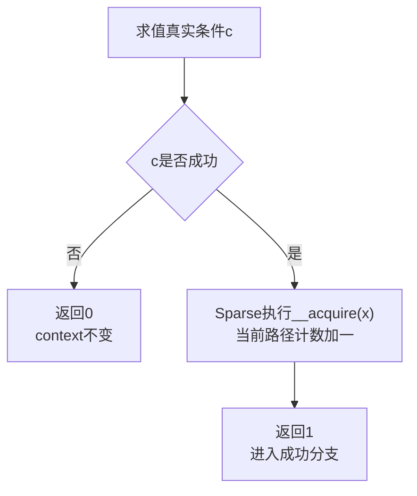
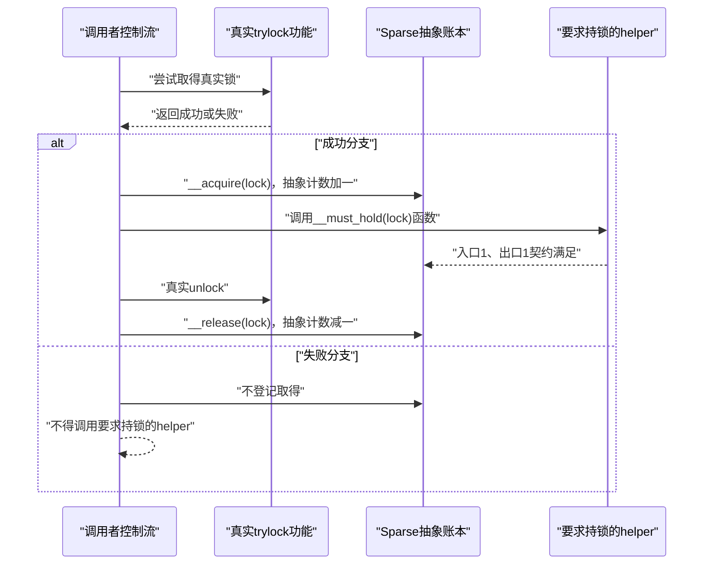

# 第4章\_Sparse\_上下文与控制流记账

## 4.1\_类型正确仍然可能在错误时机调用

上一章建立了指针类型契约。假设下面的 `state` 类型完全正确：

```c
void update_state(struct state *state)
    __must_hold(&state->lock);
```

调用者仍可能在没有持锁时进入 `update_state()`。这种错误不是两个指针类型不兼容，而是 **当前控制流路径缺少前置状态**。Sparse 因此维护另一套正交账本：某个抽象上下文进入函数时是多少，沿路径发生了哪些增减，退出时应该是多少。

## 4.2\_context属性声明函数边界契约

Linux 6.12 定义：

```c
#define __must_hold(x) __attribute__((context(x, 1, 1)))
#define __acquires(x)  __attribute__((context(x, 0, 1)))
#define __releases(x)  __attribute__((context(x, 1, 0)))
```

`context(x, entry, exit)` 可以读成：调用该函数时，分析器期望 `x` 的抽象计数处于 `entry`；函数正常返回后，调用路径上的计数成为 `exit`。

| 宏 | 进入计数 | 退出计数 | 函数角色 |
| --- | ---: | ---: | --- |
| `__must_hold(x)` | 1 | 1 | 要求调用者已经持有，并保持不变 |
| `__acquires(x)` | 0 | 1 | 函数建立该上下文 |
| `__releases(x)` | 1 | 0 | 函数撤销该上下文 |

第一个参数 `x` 是用来标识上下文的表达式，常见写法是锁地址或受保护对象。Sparse 不会因为这个表达式叫 `lock` 就自动认识锁；真正的规则来自 `context` 属性与路径事件。

## 4.3\_context语句标记函数体内的状态变化

```c
#define __acquire(x) __context__(x, 1)
#define __release(x) __context__(x, -1)
```

`__context__(x, delta)` 是 Sparse 能识别的语句形式：

- `delta` 为 `1`：当前分析路径的抽象计数加一；
- `delta` 为 `-1`：当前分析路径的抽象计数减一。

一个最小模型可以写成：

```c
static void fake_lock(int *lock) __acquires(lock)
{
    /* 此处省略真实功能动作，本例只展示Sparse账本。 */
    __acquire(lock);
}

static void fake_unlock(int *lock) __releases(lock)
{
    __release(lock);
}
```

函数属性描述调用边界，函数体中的标记描述内部路径怎样兑现边界。真实内核原语还必须在相应位置完成真正的原子操作、等待、抢占或 IRQ 管理。

## 4.4\_它不是内存序acquire与release

名称相似容易造成严重混淆：

| 记号 | 所属层次 | 修改什么 | 是否生成同步指令 |
| --- | --- | --- | --- |
| `__acquire(lock)` / `__release(lock)` | Sparse 静态分析 | 抽象 context 计数 | 否 |
| `smp_load_acquire()` / `smp_store_release()` | Linux 内存顺序 | 编译器/CPU 可观察顺序 | 视架构实现而定 |
| `spin_lock()` / `spin_unlock()` | 真实锁功能 | 锁状态及其隐含顺序 | 是或进入体系结构实现 |
| `lock_acquire()` / `lock_release()` | Lockdep 动态检查 | 当前任务影子账本和历史依赖 | 仅检查器代码，不取得功能锁 |

因此，给函数加 `__acquires(lock)` 不会让它获得互斥性；删除注解也不会取消真实锁，但会失去相应静态诊断。

## 4.5\_条件取得必须把账本绑定到成功分支

trylock 只有成功时才建立持锁状态。若无条件写入静态账本，失败分支就会被错误地当成持锁。Linux 使用：

```c
#define __cond_lock(x, c) \
    ((c) ? ({ __acquire(x); 1; }) : 0)
```



例如 `raw_spin_trylock(lock)` 在 Linux 6.12 中包装 `_raw_spin_trylock(lock)`：真实内部函数决定是否成功，`__cond_lock` 只把成功事实映射到 Sparse 的对应分支。

## 4.6\_条件取得的调用时序



这个时序显示了功能状态与静态状态的配对要求：若功能成功却漏掉静态登记，会产生误报；若功能失败却错误登记，会掩盖真实误用。

## 4.7\_cond\_acquires的负值不能按普通计数读取

```c
#define __cond_acquires(x) \
    __attribute__((context(x, 0, -1)))
```

这里的 `-1` 是条件取得的特殊约定，不表示函数返回后真的把 context 计数变成负一。更重要的是，在本专题对应的 Sparse 行为中，单靠函数声明上的这个负退出值，分析器不能把“返回真”自动关联为调用者成功分支中的一次取得。

因此要区分两种能力：

- `__cond_acquires(x)` 表明函数可能条件取得，但不能据此假设所有调用者分支都得到精确传播；
- `__cond_lock(x, c)` 把 `__acquire(x)` 直接放进条件表达式的真分支，能够显式建立分支级账本。

修改 trylock 包装时，不能只看函数声明中是否出现 `__cond_acquires`，还要沿真实调用表达式确认成功条件怎样传递。先从 [Linux 6.12 compiler types 注解模块概念导读](../../../../research/source_reading/compiler_annotations/navigation/P02_Linux_6.12_compiler_types注解模块概念导读.md#2.5_上下文模块链)建立调用点顺序，再进入 [上下文注解与条件取得](../../../../research/source_reading/compiler_annotations/source_explanations/P01_Linux_6.12_compiler_types注解宏源码实现.md#1.6_上下文注解与条件取得)核对具体宏体。

## 4.8\_静态上下文检查能证明到哪里

一次 `-Wcontext` 无告警至少依赖：

1. 本次确实由 Sparse 解析；
2. 目标函数和底层原语都正确接入了注解；
3. 相关配置分支进入了翻译单元；
4. 分析器能够追踪当前控制流和包装层；
5. 没有通过错误的 `__force`、内联汇编或不可见实现绕开契约。

即便全部满足，它仍然不证明真实锁实现无缺陷、不证明运行时不存在未建模锁类别依赖，也不证明对象生命期正确。运行时锁依赖由 [Lockdep 专题](../../../linux/synchronization/lockdep/大纲.md#1.1_专题定位) 继续检查；类型、动态上下文和对象生命期的分工见 [RCU 类型语义](../../../linux/synchronization/rcu/P26_RCU_类型语义_Sparse与Lockdep.md#26.1.6_三类检查不能互相替代)。

下一章回到普通 GCC/Clang 分支：Sparse 属性消失以后，`__user`、`__percpu` 和 `__rcu` 为什么有时仍会留下 BTF 标签，又为什么这些标签不能承担静态或运行时检查。

上一篇：[Sparse 地址空间与指针类型契约](P03_Sparse地址空间与指针类型契约.md)。

下一篇：[普通编译、BTF 与运行时边界](P05_普通编译_BTF与运行时边界.md)。
