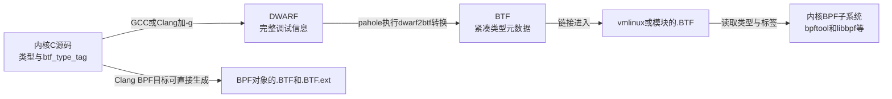

# 第5章\_普通编译\_BTF与运行时边界

## 5.1\_Sparse分支结束后还剩下什么问题

### 5.1.1\_从Sparse账本走向真正用于运行的构建产物

第 3 章已经说明，Sparse 可以把 `__user`、`__percpu` 和 `__rcu` 解释成彼此不同的逻辑地址域；第 4 章又说明，`__must_hold()`、`__acquire()` 和 `__release()` 可以形成沿控制流传播的 context 账本。这两类能力都发生在 **Sparse 分析阶段**：它们帮助开发者发现类型或路径契约冲突，却不负责生成最终运行的内核指令。

现实工程不会在 Sparse 报告结束后停住。开发者还要用 GCC 或 Clang 完成普通内核构建，链接出 `vmlinux` 或模块，再让 CPU 真正执行 uaccess、trylock、共享状态更新和解锁。于是，同一份源码必须同时满足两个看似矛盾的要求：

- 进入 Sparse 时，注解要尽可能保留严格的类型和控制流语义；
- 进入普通编译器时，Sparse 专用语法不能破坏构建，真实功能表达式又不能因注解退化而改变求值或分支。

本章讨论的转折就发生在这里：**当 `__CHECKER__` 不再定义时，静态分析账本会退出当前构建路径，但源码中的全部语义记号并不一定都变成空白。** 有些注解必须消失，有些表达式包装必须保留真实业务条件，另一些类型意图还可能作为 DWARF（Debugging With Attributed Record Formats，带属性记录格式的调试信息）或 BTF（BPF Type Format，BPF 类型格式）元数据继续进入构建产物。BPF 这一名称源自 Berkeley Packet Filter（伯克利包过滤器），在现代 Linux 中已扩展为更通用的受验证程序运行技术。

### 5.1.2\_实际遭遇\_同一条记录更新路径进入普通内核构建

继续使用第 4 章的 [带 trylock 的完整记录更新场景](P04_Sparse上下文与控制流记账.md#4.1.1_从用户地址类型走到一次带trylock的更新)。下面只摘出本章需要追踪的翻译边界；完整初始化、停止接收和对象销毁约束仍以前章为准：

```c
static int commit_record_locked(const struct record *record,
                                struct state *state)
    __must_hold(&state->lock);

static int try_import_record(const struct record __user *src,
                             struct state *state)
{
    struct record tmp;
    int ret;

    /* 用户内存访问先在raw spinlock之外完成。 */
    if (copy_from_user(&tmp, src, sizeof(tmp)) != 0)
        return -EFAULT;

    if (!raw_spin_trylock(&state->lock))
        return -EBUSY;

    ret = commit_record_locked(&tmp, state);
    raw_spin_unlock(&state->lock);
    return ret;
}
```

在 Sparse 路径中，读者已经知道怎样观察这段代码：`src` 带有用户地址域，`commit_record_locked()` 声明入口账本为 1，`raw_spin_trylock()` 的成功表达式通过 `__cond_lock()` 登记取得，释放路径再把账本恢复为 0。

现在改用普通 GCC/Clang 构建，同一组记号会发生不同变化：

| 源码记号或动作 | 普通构建中的去向 | 必须保留的结果 |
| --- | --- | --- |
| `__must_hold(&state->lock)` | 声明属性退化为空 | 函数 ABI（Application Binary Interface，应用二进制接口）不因是否运行 Sparse 而改变 |
| trylock 包装中的 `__cond_lock(x, c)` | 退化为真实条件 `c` | 底层 trylock 仍只求值一次，成功和失败分支不被改写 |
| `__user` | 按配置和工具能力变成插件属性、`BTF_TYPE_TAG(user)` 或空 | 普通编译器始终能接受声明；能力满足时可保留类型元数据 |
| `copy_from_user()`、`raw_spin_trylock()`、提交和解锁 | 继续生成真实目标代码 | 运行时功能路径仍由 CPU 和内核实现完成 |

因此，普通构建不是把“Sparse 分析过的结果”直接打包进可执行内核。Sparse 与普通编译是使用同一份源码的两条消费者路径：

```text
同一份带注解C源码
  ├─ 定义__CHECKER__ → Sparse扩展类型和context账本 → 静态诊断
  └─ 未定义__CHECKER__ → GCC/Clang目标指令
                         └─ 按能力附带DWARF/BTF类型元数据

目标指令 → CPU执行 → 真实uaccess、锁和共享对象状态
类型元数据 → 调试器、pahole、BPF工具等消费者读取
```

这张分流关系是理解本章的起点。目标指令与类型元数据可能位于同一个 ELF（Executable and Linkable Format，可执行与可链接格式）产物中，但它们承担的职责不同：前者参与执行，后者供工具描述和观察类型。

### 5.1.3\_所谓其他工具消费者具体是谁

这里的“消费者”不是泛指“以后也许有工具能用”，而是指 **实际读取某种源码属性或编译产物，并据此产生新产物、诊断或运行规则的组件**。同一个 `__user` 记号可能沿不同构建分支交给不同消费者，但这些消费者读取的输入、发生的阶段和提供的保证并不相同：

| 消费者 | 英文身份与中文说明 | 它读取什么 | 它在本章场景中做什么 | 它不会自动做什么 |
| --- | --- | --- | --- | --- |
| GCC / Clang | GCC 是 **GNU Compiler Collection，GNU 编译器套件**；Clang 是 LLVM 项目的 C/C++ 等语言前端，`Clang` 不是需要展开的缩写 | 预处理后的 C 声明、表达式和受支持属性 | 生成目标指令；启用调试信息时还可生成 DWARF，Clang 的 BPF 目标也可直接生成 BTF | 不自动建立 Sparse 的地址域或 context 账本 |
| STRUCTLEAK GCC 插件 | `STRUCTLEAK` 可按名称读作 **structure leak，结构体信息泄漏**；这是 Linux 插件名而非标准缩写，`STRUCTLEAK_PLUGIN` 是构建分支标记 | 普通编译分支为 `__user` 提供的 `user` 属性，以及插件分析到的局部变量 | 按所选加固级别识别并零初始化可能泄漏未初始化栈内容的变量；5.10 再说明它为何借用 `__user` | 不检查用户指针是否经过 `copy_from_user()`，也不替代 Sparse 地址域检查 |
| `pahole` | `dwarves` 工具集中的数据布局观察与 **DWARF-to-BTF 转换工具**；命令名没有需要强行展开的官方英文全称 | GCC/Clang 生成并放入 ELF 的 DWARF 类型信息 | 查看结构体成员、空洞和填充；在内核 BTF 构建中读取 DWARF、去重类型并编码 BTF | 不生成内核业务指令，不在运行时检查 uaccess 或锁协议 |
| `readelf` / `llvm-dwarfdump` / GDB / LLDB | ELF/DWARF 查看器与调试器；GDB 是 **GNU Debugger，GNU 调试器**，LLDB 是 LLVM 项目的调试器名称而非需要展开的标准缩写 | ELF 段、DWARF 类型、变量和调试记录 | 回答“当前产物中有没有对应调试类型信息” | 看到标签本身不等于它们为 Linux 的 `user`、`rcu` 等字符串实现了协议检查 |
| `bpftool` | **BPF tool，Linux BPF 子系统的命令行工具** | 内核、文件或对象中的 BTF 与其他 BPF 状态 | 转储 BTF 类型链，让开发者观察 `TYPE_TAG 'user'` 是否存在 | 转储成功只提供观察证据，不会回头修改已经生成的内核指令 |
| libbpf 与内核 BPF 子系统 | **libbpf，Linux BPF 用户态支持库**，以及内核中的 BPF 加载、验证和类型处理路径 | BPF 对象、内核 BTF、重定位信息和特定 BTF 标签 | 用 BTF 完成程序加载、类型匹配、CO-RE（Compile Once – Run Everywhere，一次编译、到处运行）重定位或特定 BPF 语义检查；只有明确认识的标签才产生相应规则 | 不会把任意字符串都解释成通用内核协议，也不能替代普通内核 C 代码的 Sparse 检查 |

这几类工具形成的是一条 **分阶段流水线**，不是几个并列的“检查器”：编译器先生成目标代码和调试类型；`pahole` 可以把 DWARF 转成 BTF；`bpftool` 可以把 BTF 展示出来；libbpf 或内核 BPF 路径才可能在自己的业务中消费特定类型信息。至于 STRUCTLEAK，它走的是 GCC 插件分支，解决的是未初始化栈内容泄漏问题，并不经过 DWARF-to-BTF 转换后才工作。

因此，“不给 Sparse 使用不等于没有其他消费者”应展开成更精确的判断：先确定当前构建选择了哪个宏分支，再确定产物交给了谁，最后检查那个消费者究竟为该属性或字符串实现了什么动作。不能从“有消费者”直接跳到“仍有同等强度的检查”。

### 5.1.4\_最容易发生的误判\_看见TYPE\_TAG就以为仍在检查

假设开发者完成普通内核构建以后执行：

```bash
bpftool btf dump file vmlinux format raw
```

并在输出中找到了类似 `TYPE_TAG 'user'` 的节点。这个观察能够支持的直接结论是：`user` 字符串已经穿过当前编译与转换链，进入这个 `vmlinux` 的 BTF 类型图。它不能直接证明下面任何一项：

- 普通 GCC/Clang 已像 Sparse 一样拒绝用户地址域与内核地址域混用；
- 运行时会在裸解引用用户指针以前自动插入 `copy_from_user()`；
- `commit_record_locked()` 的每个调用点都真的持有 `state->lock`；
- 这一次 `try_import_record()` 调用已经成功复制、取锁并更新记录。

误判产生的原因，是把四件不同的事情压缩成了“标签有语义”一句话：

| 层次 | 本例中的对象 | 能回答的问题 |
| --- | --- | --- |
| 源码设计意图 | `__user`、`__must_hold()` 等友好记号 | 作者希望表达什么协议边界 |
| 静态检查状态 | Sparse 地址域与 context 账本 | 已接入的源码路径是否违反分析规则 |
| 编译产物元数据 | DWARF/BTF 中的类型和字符串标签 | 哪些类型意图被保存到当前产物 |
| 运行时功能状态 | 用户地址可访问性、真实锁和 `state->current` | 这一次执行实际发生了什么 |

元数据只是 **语义载体**。只有某个下游消费者读取标签，并为特定字符串规定检查规则，标签才会成为该检查器的输入；BTF 编码本身不会主动执行 uaccess、锁、per-CPU 或 RCU 协议。

### 5.1.5\_本章所处层次与读完后的判断能力

本章位于“预处理分支已经确定”与“运行时功能真正发生”之间，重点追踪下面这条产物流：

```text
C类型上的友好注解
  → 普通编译分支中的属性或空宏
  → 编译器生成的目标代码与可选DWARF
  → pahole转换或BPF目标直接生成BTF
  → 最终元数据消费者
```

接下来只解决五个问题：

1. type tag 附着在 C 类型关系的哪一层，为什么不改变对象布局和 ABI；
2. DWARF 与 BTF 在传递这段元数据时分别承担什么职责；
3. Linux 6.12 的配置、编译器和 `pahole` 能力怎样共同决定标签保留或退化；
4. 为什么 Sparse 检查、BTF 元数据和运行时协议不能互相替代；
5. 应该观察预处理结果、DWARF、BTF、目标指令还是运行状态，才能回答手头的具体问题。

本章不会展开完整 DWARF 规范、BPF 验证器内部算法，也不会重复 uaccess、per-CPU、RCU 和锁专题的真实运行机制。读完后，读者应能拿到一个源码注解和一个具体构建产物，逐层指出它经过了哪个消费者、留下了什么状态、能够形成哪种证据，以及还缺少哪一种静态或运行时验证。

## 5.2\_先把type\_tag理解为类型上的语义元数据

先看一个脱离 Linux 宏封装的最小例子：

```c
int __attribute__((btf_type_tag("user"))) *pointer;
```

从对象布局和机器 ABI 看，`pointer` 仍然是一个普通的 `int *`。`btf_type_tag("user")` 没有在指针旁边增加字符串字段，也没有改变 `int` 的大小，更不会在解引用前自动插入检查。它增加的是一项可随调试类型信息继续传递的字符串语义：这个指针所指向的类型带有 `user` 标签。

Clang 对这个属性规定了两个关键边界：只有启用 `-g` 时它才产生效果；属性放在指针类型上时，标签关联到指针所指向的类型。可以先把它记成下面这个模型：

```text
C类型关系
  + 字符串语义标签"user"
  = 可供后续工具读取的类型元数据
```

这里常说的“BTF/DWARF type tag”是便于理解的简称。更精确的说法是：源码使用 `btf_type_tag` 属性，编译器可以把它保存在 DWARF 中；BPF 目标还可以直接把它写入 `.BTF`。标签是否最终存在，仍取决于调试信息开关、编译器、转换工具和构建配置。

## 5.3\_为什么普通C指针还需要额外语义

下面四种声明在某个具体 ABI 上可能具有相同的指针宽度和传参方式，但内核要求的访问协议完全不同：

| 源码类型 | 软件语义 | 典型访问要求 | type tag本身能否执行要求 |
| --- | --- | --- | --- |
| `int *` | 普通内核指针 | 按对象所属协议访问 | 不能 |
| `int __user *` | 指向用户地址空间 | 通过 uaccess 接口访问并处理失败 | 不能 |
| `int __percpu *` | per-CPU 指针 | 通过 per-CPU 接口取得当前或目标 CPU 实例 | 不能 |
| `int __rcu *` | 受 RCU 协议管理的指针 | 按发布、取得和生命期协议访问 | 不能 |

普通 C 类型只能表达“它们都是指向 `int` 的指针”，无法独立承载完整的用户访问、CPU 实例选择或 RCU 生命期协议。Sparse 选择把这些差异变成可参与赋值和解引用检查的逻辑地址域；普通编译路径则可以把同一设计意图保存成字符串元数据，交给后续工具继续识别。

因此，type tag 的价值不是创造一个新的机器级类型，而是避免语义在普通编译后只剩下无差别的裸指针。它传递的是 **“这个类型还有额外协议”**，不是 **“该协议已经执行”**。

## 5.4\_DWARF与BTF分别承担什么

### 5.4.1\_pahole为什么会出现在内核BTF生成链中

第一次看到 `pahole` 时，最容易把它误认为一种调试信息格式，或者误以为它是内核运行后负责检查 BTF 的守护程序。实际上，`pahole` 是一个 **构建期用户空间命令**，属于名为 `dwarves` 的工具集；`dwarves` 是项目和软件包名，不是另一种调试格式。`pahole` 的命令名也不是需要背诵英文展开的标准缩写，理解它在本章中的角色比猜名字来源更重要。

`pahole` 最初也是最直观的用途，是读取 ELF 文件中的 DWARF 类型信息，把结构体成员偏移、大小、对齐、填充和“空洞”重新展示成接近 C 声明的形式。例如已有一个带 DWARF 的 `vmlinux` 时，可以查询某个结构体：

```bash
# 确认工具是否安装以及实际版本
pahole --version

# 从vmlinux的调试类型中查看指定结构体的布局
pahole -C task_struct vmlinux
```

这里的 `-C task_struct` 是“选择名为 `task_struct` 的类型”，不是编译 C 文件。输出可帮助开发者观察成员偏移、缓存行跨越、填充字节和结构体空洞，但这些观察仍来自编译产物中的类型记录。

Linux 内核构建后来复用了 `pahole` 的另一项能力：把 DWARF 转换成更紧凑的 BTF。在典型内核构建中，它位于下面这个位置：

```text
GCC/Clang使用-g编译C源码
  → 目标文件和中间vmlinux携带DWARF
  → Kbuild调用pahole读取并去重DWARF类型
  → pahole编码BTF并写入ELF的.BTF相关内容
  → 最终vmlinux、模块或/sys/kernel/btf/vmlinux供下游读取
```

这条链说明了 `pahole` 出现的意义：普通内核 GCC/Clang 构建通常先产生 DWARF，`pahole` 承担 DWARF-to-BTF 转换；它既不是 DWARF 或 BTF 规范本身，也不是 BPF 验证器。Clang 为 BPF 目标编译程序时可以直接生成 `.BTF` 和 `.BTF.ext`，那是另一条不依赖 `pahole` 转换的路径。

在构建日志中看到 `BTF` 阶段，或在 `make V=1` 的详细命令中看到 `pahole`，表示构建已经越过普通 C 编译，正在从调试类型生成 BTF。此处失败应先检查工具是否安装、版本是否满足和 DWARF 输入是否存在，不能把它误诊为“内核运行时不支持 BTF”。

`CONFIG_DEBUG_INFO_BTF` 开启时，Kbuild 会探测 `pahole` 的版本和功能。Kbuild 是 Linux 内核构建系统的项目内名称，不是需要强行展开的标准缩写。工具版本不仅决定“能不能生成某种 BTF”，还可能决定 type tag、模块 BTF 等具体特性是否可用。因此源码中写了 `BTF_TYPE_TAG(user)`，并不能越过 `pahole` 能力门槛直接证明最终 `vmlinux` 一定含有该标签；5.6 会继续拆解这些条件。Linux 官方 BTF 文档也把 `pahole` 明确放在 [DWARF-to-BTF 转换器](https://docs.kernel.org/bpf/btf.html#btf-generation) 的位置。

### 5.4.2\_DWARF与BTF的职责对照

DWARF 和 BTF 都能携带类型相关信息，但服务范围和表示规模不同：

| 维度 | DWARF | BTF |
| --- | --- | --- |
| 主要定位 | 通用调试信息格式 | 面向 Linux/BPF 的紧凑元数据格式 |
| 常见内容 | 类型、变量、函数、源文件、行号、作用域、位置和内联信息等 | 类型与字符串，以及函数、行号等 BPF/内核工具需要的信息 |
| 内核构建中的常见生成者 | GCC或Clang在启用调试信息时生成 | `pahole`从DWARF转换并写入内核BTF |
| 典型消费者 | GDB、LLDB、`readelf`、`llvm-dwarfdump`、`pahole` | 内核BPF子系统、libbpf、bpftool、BPF验证器和类型观察工具 |
| 是否执行用户指针或RCU协议 | 否 | 否；必须由具体消费者解释标签 |

Linux 内核启用 `CONFIG_DEBUG_INFO_BTF` 时，常见生成链是：



图中的两条路径不能混为一条：构建本机内核时通常由 `pahole` 把 DWARF 转成 BTF；以 BPF 为目标编译程序时，Clang 可以直接生成 `.BTF` 和 `.BTF.ext`。源码属性相同，不代表每个目标都经过相同的工具和中间产物。

## 5.5\_BTF\_KIND\_TYPE\_TAG怎样挂入类型链

BTF 为类型标签定义了 `BTF_KIND_TYPE_TAG`。以 `int` 指针上的 `user` 标签为例，类型关系可以抽象为：

```text
PTR
  -> TYPE_TAG "user"
       -> INT "int"
```

存在限定符或 `typedef` 时，规范中的完整顺序是：

```text
ptr
  -> 零个或多个type_tag
  -> 零个或多个const、volatile、restrict或typedef
  -> base_type
```

`TYPE_TAG` 节点保存非空字符串，并通过 `type_id` 指向下一层类型。它没有对象大小，也不是对象内存中的成员；工具沿类型 ID 链读取时，才能重新看到 `user`、`percpu`、`rcu` 等字符串语义。

这里还要区分三个名称相近但层次不同的概念：

| 名称 | 所在层次 | 含义 |
| --- | --- | --- |
| `__attribute__((btf_type_tag("user")))` | C源码属性 | 请求工具链给类型附加字符串语义 |
| `BTF_KIND_TYPE_TAG` | BTF编码 | BTF类型图中承载该字符串的节点种类 |
| `DW_TAG_structure_type`、`DW_TAG_pointer_type`等 | DWARF编码 | 表示某个DWARF调试信息节点本身属于哪一类 |

因此，DWARF 名称中的 `DW_TAG_*` 不是这里所说的字符串 type tag。前者是 DWARF 自己的节点分类，后者是附加到 C 类型并由工具链传递的语义。

## 5.6\_BTF\_TYPE\_TAG的启用门槛

下面开始进入版本化实现。先从 [Linux 6.12 编译器与 Sparse 注解源码导读](../../../../research/source_reading/compiler_annotations/navigation/P01_Linux_6.12_编译器与Sparse注解源码导读.md#1.1_基线与阅读任务)建立源码坐标，再通过[普通编译模块链](../../../../research/source_reading/compiler_annotations/navigation/P02_Linux_6.12_compiler_types注解模块概念导读.md#2.6_普通编译模块链)理解职责；具体宏体只在 [BTF TYPE TAG能力门槛](../../../../research/source_reading/compiler_annotations/source_explanations/P01_Linux_6.12_compiler_types注解宏源码实现.md#1.4_BTF_TYPE_TAG能力门槛)唯一展开。

仓库基线 Linux 6.12.20 的逻辑可以概括为：

```c
#if defined(CONFIG_DEBUG_INFO_BTF) && \
    defined(CONFIG_PAHOLE_HAS_BTF_TAG) && \
    __has_attribute(btf_type_tag) && \
    !defined(__BINDGEN__)
# define BTF_TYPE_TAG(value) \
    __attribute__((btf_type_tag(#value)))
#else
# define BTF_TYPE_TAG(value)
#endif
```

必须同时满足：

1. 内核配置要求生成 BTF 调试信息；
2. `pahole` 工具链支持 BTF type tag；
3. 当前编译器识别 `btf_type_tag` 属性；
4. 当前不是需要避开该属性的 bindgen 处理路径。

任何一个条件不满足，宏就为空。这是能力探测和可退化构建，不是运行时开关。

还要注意，源码中出现非空宏分支只证明“构建条件允许编译器接收该属性”，不能单独证明某个最终 `vmlinux` 或模块的 `.BTF` 中一定保留了目标标签。完整证据还要观察实际编译参数、DWARF、`pahole` 转换结果和最终 BTF 转储。

## 5.7\_普通分支中的地址域宏矩阵

### 5.7.1\_读表以前先拆开地址域名和工具名

这组宏把三类名称挤在了同一张表里：Linux 的友好类型注解、构建配置产生的分支标记，以及生成或读取元数据的工具。第一次阅读时，应先为每个专有名词建立身份：

| 名称 | 英文与中文含义 | 它属于哪一层 | 深入阅读入口 |
| --- | --- | --- | --- |
| `__kernel` | **kernel address space，内核默认地址域** | Linux/Sparse 友好类型注解；普通分支为空 | [address space建立逻辑指针域](P03_Sparse地址空间与指针类型契约.md#3.2_address_space建立逻辑指针域) |
| `__user` | **user address space，用户地址域** | 标记来自或指向用户空间的地址；运行访问仍要使用 uaccess 接口 | [用户记录怎样导入内核对象](P03_Sparse地址空间与指针类型契约.md#%281%29_用户地址_把一份记录导入内核对象) |
| `__iomem` | **I/O memory，输入/输出设备内存地址域** | 标记 MMIO（Memory-Mapped I/O，内存映射输入/输出）等 I/O 映射地址，要求使用相应 I/O 访问原语 | [MMIO地址的完整实例](P03_Sparse地址空间与指针类型契约.md#%282%29_MMIO地址_映射寄存器以后仍不能使用普通指针) |
| `__percpu` | **per-CPU storage，每 CPU 独立存储地址域** | 标记需要先选择当前或目标 CPU 实例的指针 | [per-CPU地址的完整实例](P03_Sparse地址空间与指针类型契约.md#%283%29_per-CPU地址_先选实例再使用普通局部指针) |
| `__rcu` | **Read-Copy Update protected pointer，读-复制-更新协议保护的指针** | 标记需要遵守 RCU 发布、取得和生命期协议的指针 | [RCU地址的完整实例](P03_Sparse地址空间与指针类型契约.md#%284%29_RCU地址_发布取得与对象回收必须组成一条链) |
| `STRUCTLEAK_PLUGIN` | `STRUCTLEAK` 可按名称读作 **structure leak，结构体信息泄漏**；这是 Linux GCC 插件分支名，不是 C 标准关键字 | 普通 GCC 编译期加固分支，具体用途见 5.10 | [STRUCTLEAK插件分支](#5.10_STRUCTLEAK插件分支是第三种消费者) |
| `BTF_TYPE_TAG(value)` | **BTF type tag，BTF 类型标签** 的 Linux 包装宏 | 源码属性入口；门槛满足时形成 `btf_type_tag("value")` | [BTF TYPE TAG启用门槛](#5.6_BTF_TYPE_TAG的启用门槛) |
| GCC 插件 | **GNU Compiler Collection plugin，GNU 编译器插件** | 随 GCC 编译过程加载并执行额外分析或代码变换 | [其他工具消费者具体是谁](#5.1.3_所谓其他工具消费者具体是谁) |
| BTF 工具 | 不是单个工具名，而是 BTF 生产、读取和使用工具的统称 | `pahole` 负责常见内核 DWARF-to-BTF 转换，`bpftool` 负责观察，libbpf/内核 BPF 路径按场景消费 | [pahole的位置](#5.4.1_pahole为什么会出现在内核BTF生成链中)与[下游消费者](#5.9_下游消费者才决定标签有没有检查语义) |

表中的英文说明用于建立准确身份，不表示每个名字都有正式“全称”。像 BTF、DWARF、GCC 这样的缩写应给出展开；像 `pahole`、Clang 这样的命令或项目名则应直接说明归属和职责，不能为了形式统一杜撰英文展开。

### 5.7.2\_理解名词以后再读展开矩阵

| 宏 | 普通编译分支 | 主要消费者 | 结果类别 |
| --- | --- | --- | --- |
| [`__kernel`](P03_Sparse地址空间与指针类型契约.md#3.2_address_space建立逻辑指针域) | 空 | 无额外注解消费者 | 普通 C 类型 |
| [`__user`](P03_Sparse地址空间与指针类型契约.md#%281%29_用户地址_把一份记录导入内核对象) | [`STRUCTLEAK_PLUGIN`](#5.10_STRUCTLEAK插件分支是第三种消费者) 属性，或者 [`BTF_TYPE_TAG(user)`](#5.6_BTF_TYPE_TAG的启用门槛) | STRUCTLEAK GCC 插件，或者编译器、`pahole` 与下游 BTF 工具 | 插件输入或类型元数据 |
| [`__iomem`](P03_Sparse地址空间与指针类型契约.md#%282%29_MMIO地址_映射寄存器以后仍不能使用普通指针) | 空 | 无额外注解消费者 | 普通 C 类型 |
| [`__percpu`](P03_Sparse地址空间与指针类型契约.md#%283%29_per-CPU地址_先选实例再使用普通局部指针) | [`BTF_TYPE_TAG(percpu)`](#5.6_BTF_TYPE_TAG的启用门槛) | 编译器、`pahole` 与下游 BTF 工具 | 类型元数据 |
| [`__rcu`](P03_Sparse地址空间与指针类型契约.md#%284%29_RCU地址_发布取得与对象回收必须组成一条链) | [`BTF_TYPE_TAG(rcu)`](#5.6_BTF_TYPE_TAG的启用门槛) | 编译器、`pahole` 与下游 BTF 工具 | 类型元数据 |

这张表只描述本专题对应的 Linux 6.12 公共头文件分支。Sparse 路径中的 `address_space` 和 `noderef` 约束不能从普通分支反推；普通构建成功也不能替代 Sparse 检查。

具体退化宏和参数求值不变量见[普通编译分支怎样退化](../../../../research/source_reading/compiler_annotations/source_explanations/P01_Linux_6.12_compiler_types注解宏源码实现.md#1.8_普通编译分支怎样退化)。

## 5.8\_Sparse类型检查与BTF元数据不能互相替代

BTF type tag 可以把 `user`、`percpu` 或 `rcu` 之类的字符串关联到类型信息，供调试、BPF 和其他类型消费者观察。它不具备下面这些能力：

- 在赋值时拒绝两个 Sparse 地址域混用；
- 在运行时拦截用户指针裸解引用；
- 自动执行 `rcu_dereference()`；
- 维护锁或 context 计数；
- 保证对象生命期和内存顺序。

可以用一条最小映射理解：

```text
源码中的__rcu
  ├─ Sparse分支 → 受限指针类型 → 静态诊断
  └─ 普通分支 → btf_type_tag("rcu")或空 → 类型元数据或无额外产物
```

两个分支保留的是同一个设计意图，但证明能力完全不同。

| 对比项 | Sparse分支 | 普通编译中的type tag路径 |
| --- | --- | --- |
| 主要消费者 | Sparse | 编译器、`pahole`、BTF及其下游工具 |
| `__user`表示 | `noderef + address_space(__user)` | `btf_type_tag("user")`或空 |
| 修改的状态 | 分析器的逻辑类型与控制流状态 | 调试/BTF类型元数据 |
| 能否在赋值时诊断地址域混用 | 能，在注解与路径可见范围内 | type tag自身不能 |
| 能否改变对象布局或ABI | 不能 | 不能 |
| 能否执行真实uaccess、per-CPU或RCU动作 | 不能 | 不能 |

判断一段代码是否“受检查”时，不能只问标签是否存在。必须继续问：哪个消费者读取了它，这个消费者为该字符串定义了什么规则，以及目标路径是否真的进入了该消费者。

## 5.9\_下游消费者才决定标签有没有检查语义

BTF 是元数据载体，不是一个见到任意字符串就自动执行协议的通用验证器。`user` 标签进入 BTF 后，可以被工具观察和传播，但普通内核执行不会因此自动禁止裸解引用，也不会自动改写为 `copy_from_user()`。如果没有消费者为某个标签实现规则，它就只是可查询的字符串语义。

BPF 的 kptr 提供了一个反例：BPF map 值可以使用 `__kptr`、`__kptr_untrusted` 等 BTF 标签描述特殊指针，BPF 子系统会结合这些标签和相应接口执行自己的验证规则。这里产生约束的不是 `BTF_KIND_TYPE_TAG` 这个编码节点本身，而是 BPF 加载与验证路径明确认识这些标签，并为它们规定了访问和交换边界。

这个例子只能推出一条通用结论：**type tag 可以成为语义检查的输入，但检查能力来自具体消费者**。不能据此反推 `user`、`percpu`、`rcu` 和 `kptr` 由同一套规则检查，也不能把 BPF 的 kptr 生命周期契约搬到普通内核指针上。

## 5.10\_STRUCTLEAK插件分支是第三种消费者

Linux 内核需要防止未初始化的内核栈内容随着结构体复制泄漏给用户空间。普通编译器的未初始化变量警告并不能覆盖所有“变量地址被传给另一个函数、编译器假设被调用者会完成初始化”的情况；STRUCTLEAK GCC 插件因此在编译阶段识别目标局部变量，并按所选加固级别插入零初始化。

在最窄的 `GCC_PLUGIN_STRUCTLEAK_USER` 模式中，候选对象是 **栈上包含 `__user` 属性的结构体**。为了让插件在普通 GCC 分支仍能看见这个标记，Linux 6.12 使用：

```c
#ifdef STRUCTLEAK_PLUGIN
# define __user __attribute__((user))
#else
# define __user BTF_TYPE_TAG(user)
#endif
```

这里的 `user` 是交给插件的自定义 GCC 属性，不是 Sparse 的 `address_space(__user)`，也不是 BTF 中的 `user` 字符串节点。插件使用它寻找需要防泄漏初始化的栈对象，随后改变的是普通编译产生的初始化代码；它并不检查某个指针是否通过 `copy_from_user()` 或 `copy_to_user()`。

更强的 `GCC_PLUGIN_STRUCTLEAK_BYREF` 与 `GCC_PLUGIN_STRUCTLEAK_BYREF_ALL` 会把覆盖面扩大到更多按引用传递、可能未初始化的栈变量，因此不能把整个插件概括成“只处理用户指针”。本章矩阵只解释为什么 `compiler_types.h` 在 `STRUCTLEAK_PLUGIN` 分支中要把 `__user` 映射为插件属性；完整安全加固策略仍由相应 Kconfig 和 GCC 插件实现决定。[Linux 6.12.20 的 STRUCTLEAK Kconfig 说明](../../../../research/source_reading/linux/security/Kconfig.hardening)解释了插件要弥补的未初始化变量缺口，同一文件的 USER 模式说明则给出 `__user` 标记与零初始化的关系。

因此不能写出“`__user` 就是某一个固定属性”的绝对结论。稳定结论是：它表达用户指针边界；具体展开由分析器、插件、调试配置和工具能力决定。

## 5.11\_上下文宏在普通构建中怎样退化

```c
#define __must_hold(x)
#define __acquires(x)
#define __releases(x)
#define __acquire(x) (void)0
#define __release(x) (void)0
#define __cond_lock(x, c) (c)
```

这里有两类退化：

- 声明属性直接消失，不改变函数 ABI；
- 表达式宏保留真实条件 `c`，删除分析事件。

尤其是 `__cond_lock(x, c)` 不能退化成常量真或假，否则会改变 trylock 的真实控制流。它必须保留 `c` 的求值次数和返回语义。

`__chk_user_ptr(x)` 退化成 `(void)0`，意味着 `x` 不求值。设计新的静态检查辅助宏时，也应明确普通分支是否允许求值参数；不能无意中让调试/分析开关改变业务副作用。

## 5.12\_builtin\_warning回退只提供表达式形状

### 5.12.1\_需求背景\_静态检查参数不能变成第二次业务求值

假设一个公共宏要返回调用者传入的表达式，同时希望 Sparse 在实参带有自增、赋值或普通函数调用等副作用时发出提醒。检查只应发生在分析阶段；普通 GCC/Clang 构建必须继续得到合法表达式，而且真正的业务实参仍然只能求值一次。

Sparse 提供 `__builtin_safe_p()` 与 `__builtin_warning()` 来表达这项检查。普通编译器不认识这组 Sparse 内建语义，因此 Linux 在非 `__CHECKER__` 分支定义：

```c
#define __builtin_warning(x, y...) (1)
```

`x` 接住检查条件，`y...` 接住一个或多个诊断参数；宏体故意不引用它们。预处理器因此删除普通编译器不认识的检查表达式和诊断字符串，只留下整数常量 `1`。这个 `1` 的用途是维持外层表达式的值和类型形状，不表示“检查通过”，也不会调用编译器诊断接口或在运行时打印信息。

### 5.12.2\_完整实例\_检查一次\_业务表达式仍只执行一次

下面是一个可以由普通 GCC/Clang 编译的完整教学程序。它模拟公共宏既想让 Sparse 检查副作用，又必须在普通构建中返回真实表达式结果的场景；这是用于解释退化语义的独立样例，不是 Linux 上游调用点的原样摘录：

```c
#include <stdio.h>

/* 模拟Linux非__CHECKER__分支提供的普通编译回退。 */
#define __builtin_warning(x, y...) (1)

/*
 * Sparse能够理解检查参数；普通编译时，检查参数被上面的回退删除。
 * 最后一行才是真正的业务求值位置。
 */
#define CHECK_THEN_EVALUATE(expr) ({                            \
    int annotation_shape =                                    \
        __builtin_warning(!__builtin_safe_p(expr),             \
                          "实参可能带有副作用: " #expr);      \
    (void)annotation_shape;                                    \
    (expr);                                                    \
})

static unsigned int allocation_calls;

static unsigned int allocate_record_id(void)
{
    allocation_calls++;
    return allocation_calls;
}

int main(void)
{
    unsigned int base = 40;
    unsigned int plain_value;
    unsigned int allocated_id;

    /* 纯计算表达式：不修改程序状态。 */
    plain_value = CHECK_THEN_EVALUATE(base + 2);

    /* 函数调用带有副作用，但普通运行时仍只能调用一次。 */
    allocated_id = CHECK_THEN_EVALUATE(allocate_record_id());

    printf("plain=%u allocated=%u calls=%u\n",
           plain_value, allocated_id, allocation_calls);

    /* 用退出码验证结果和单次求值不变量。 */
    if (plain_value != 42 || allocated_id != 1 || allocation_calls != 1)
        return 1;

    return 0;
}
```

普通构建和执行方式为：

```bash
gcc -std=gnu11 -O0 -Wall -Wextra warning_shape_demo.c \
    -o warning_shape_demo
./warning_shape_demo
```

预期输出是：

```text
plain=42 allocated=1 calls=1
```

第二次调用包含两份 `expr` 文本：一份位于检查参数中，一份位于宏体最后的业务表达式中。但普通分支的展开顺序是：

```text
CHECK_THEN_EVALUATE(allocate_record_id())
  → __builtin_warning(
        !__builtin_safe_p(allocate_record_id()),
        "实参可能带有副作用: allocate_record_id()")
  → 普通回退不引用x和y，整个检查调用替换成(1)
  → 剩余业务表达式allocate_record_id()只执行一次
  → allocated_id = 1，allocation_calls = 1
```

如果普通回退错误地引用或求值 `x`，普通编译器不仅可能遇到不认识的 `__builtin_safe_p()`，还可能让带副作用的实参在检查位置和业务位置各执行一次。这个完整例子因此固定了三项设计要求：检查参数在普通分支消失，外层表达式仍有合法整数形状，业务实参求值次数不变。

在 Sparse 路径中，`base + 2` 属于无副作用表达式，`allocate_record_id()` 这类普通函数调用则可触发提醒；Sparse 负责诊断而不生成这个演示程序的运行指令。两条路径的逐步宏展开见 [GNU可变参数宏与占位回退](P02_预处理器_GNU属性与表达式扩展.md#2.7_GNU可变参数宏与占位回退)。

### 5.12.3\_从实例返回阅读纪律

只有把宏放回完整调用表达式，才能知道常量 `1` 是被保存后丢弃、用于条件选择，还是参与更大的计算。宏名只是作者提供的入口名称，证明语义必须来自当前配置下的展开结果、实参求值次数与调用位置；不能因为名字里有 `warning` 就宣称普通构建会产生警告。

## 5.13\_从源码到结果的观察路径

### 5.13.1\_make\_C=1与C=2决定检查哪些文件

Linux Kbuild 中的命令行变量 `C` 用来控制源码检查器的覆盖范围，默认检查器是 Sparse。`C=1` 和 `C=2` 不是告警等级，也不是“运行一次或两次”，它们的区别是 **一个源文件即使不需要重新编译，是否仍要交给检查器**：

| 命令 | 哪些文件交给Sparse | 适合场景 | 容易误解的边界 |
| --- | --- | --- | --- |
| `make C=1` | 本次增量构建中确实要重新编译的 C 文件 | 边改边查；只检查刚修改并触发重编译的文件，速度较快 | 已经最新、无需重编译的文件不会因为 `C=1` 再次接受检查 |
| `make C=2` | 当前构建目标范围内的 C 文件，无论它们是否需要重新编译 | 已经完成一次普通构建后，对当前目标做较完整的静态检查 | “当前目标范围”不等于所有配置、所有架构和所有未被 Kbuild 选中的源码 |

这两个命令不会替开发者安装 Sparse。执行以前必须已经准备好内核 `.config`，并确保 `sparse` 命令能够从当前 `PATH` 找到；否则 Kbuild 只能报告检查器不可用，不能产生本章讨论的类型或 context 诊断。

例如已经构建过内核，随后只修改了一个驱动文件：

```bash
# 只对本次需要重新编译的文件附加Sparse检查
make -j8 C=1

# 即使目标文件已经是最新的，也重新检查当前配置会构建的源文件
make -j8 C=2

# 把内核树内的覆盖范围限制在一个目录目标
make C=2 drivers/net/ethernet/

# 检查一个树外模块；M=指定该外部模块目录
make C=2 M=/path/to/external_module
```

第一次从干净输出目录完整构建时，大量文件本来就需要编译，因此 `C=1` 会顺带检查这些文件；在后续没有源码变化的增量构建中，`C=1` 可能几乎没有检查动作，而 `C=2` 仍会运行检查器。反过来，`C=2` 也不会检查当前 `.config` 没有选中的驱动、未进入目标的体系结构实现或命令所选目录、目标与树外模块范围以外的文件。

Kbuild 会把该变量记录为 `KBUILD_CHECKSRC`；如需给 Sparse 增加参数，可以使用 `CF=...`。判断一次检查到底覆盖了什么时，还应结合构建目标、`.config`、`M=` 范围和详细命令输出，不能只看终端最后有没有警告。[Linux Sparse 官方文档](https://docs.kernel.org/dev-tools/sparse.html#using-sparse)明确给出了 `C=1` 与 `C=2` 的这一区别。

本节只建立 **构建变量的语义边界**。怎样先完成普通模块构建、故意让目标保持最新、分别保存 `C=1/C=2` 的 `V=1` 日志，再用 `CF` 打开单变量反例，由下一章的 [E7 Kbuild 对照实验](P06_在Linux内核中使用Sparse与设计注解.md#6.10_E7把独立实验迁移到真实Kbuild目标)完整展开。

### 5.13.2\_先按问题选择观察工具

| 想确认的问题 | 应观察什么 | 推荐工具 | 不能用什么替代 |
| --- | --- | --- | --- |
| 条件分支和宏怎样展开 | 预处理输出 | `gcc -E`、构建详细命令 | 运行日志 |
| 类型/上下文契约是否冲突 | Sparse 诊断 | `make C=1/C=2`、`sparse` | 普通 `make` 成功 |
| 生成了什么指令 | 目标文件反汇编 | `objdump`、`llvm-objdump` | BTF 标签 |
| BTF 中保留什么类型标签 | `.BTF` 与类型转储 | `pahole`、`bpftool btf dump`、`readelf` | Sparse 无告警 |
| 真实锁/RCU路径怎样运行 | trace、告警、测试和状态 | Lockdep、KCSAN、ftrace、专项实验 | 静态类型正确 |

### 5.13.3\_沿产物确认type\_tag是否真正保留

若要观察本章的 type tag 链，可以按产物逐层核对：

```bash
# 确认目标ELF是否含有DWARF与BTF相关段
readelf -S vmlinux

# 查看DWARF；具体注解显示形式取决于编译器与工具版本
readelf --debug-dump=info vmlinux

# 以原始形式查看最终BTF类型链与TYPE_TAG
bpftool btf dump file vmlinux format raw
```

看到 `TYPE_TAG 'user'` 可以证明该字符串已经进入当前转储的 BTF 类型链；看不到时则要沿配置、编译参数、DWARF 生成、`pahole` 能力和类型是否进入最终产物逐层排查。两种结果都不能直接替代 Sparse 诊断或运行时测试。

## 5.14\_本章现在能够证明什么

遇到“BTF/DWARF type tag”时，可以先建立以下边界：

1. 它是在不改变对象布局和 ABI 的前提下，给 C 类型附加可传递的字符串语义；
2. Clang 可以在启用调试信息时把标签保存在 DWARF 中，BPF 目标还可以直接生成 BTF；
3. 内核构建通常由 `pahole` 把 DWARF 转换为 BTF，最终是否保留标签受配置和工具能力共同约束；
4. `BTF_KIND_TYPE_TAG` 负责在 BTF 类型图中编码标签，但不会自行执行用户访问、per-CPU、RCU 或锁协议；
5. Sparse 地址域检查与 BTF 元数据传递服务不同阶段，任一方的成功都不能替代另一方的证据；
6. 当 BPF 等下游消费者明确认识某类标签时，标签才可能成为具体语义检查的输入；
7. `pahole` 是内核常见 DWARF-to-BTF 构建工具，不是运行时检查器；
8. `make C=1` 与 `make C=2` 改变的是 Kbuild 送入检查器的文件范围，不代表不同的 Sparse 告警等级。

观察工具必须与问题层次匹配。下一章把预处理、Sparse、BTF 转储和运行时工具组织成可操作流程，并明确普通开发者怎样在不修改运行内核的情况下参与检查。

上一篇：[Sparse 上下文与控制流记账](P04_Sparse上下文与控制流记账.md)。

下一篇：[在 Linux 内核中使用 Sparse 与设计注解](P06_在Linux内核中使用Sparse与设计注解.md)。

## 5.15\_参考资料

- [DWARF调试信息格式官方网站](https://dwarfstd.org/)
- [Clang btf type tag属性](https://clang.llvm.org/docs/AttributeReference.html#btf-type-tag)
- [Linux BPF Type Format文档](https://docs.kernel.org/bpf/btf.html)
- [pahole与dwarves工具源码仓库](https://git.kernel.org/pub/scm/devel/pahole/pahole.git/)
- [Linux内核构建的pahole要求](https://docs.kernel.org/process/changes.html#pahole)
- [Linux使用Sparse进行类型检查](https://docs.kernel.org/dev-tools/sparse.html)
- [Linux 6.12.20 STRUCTLEAK加固配置](../../../../research/source_reading/linux/security/Kconfig.hardening)
- [BPF特殊map字段与kptr兼容性边界](https://docs.kernel.org/bpf/bpf_design_QA.html#q-what-is-the-compatibility-story-for-special-bpf-types-in-map-values)
