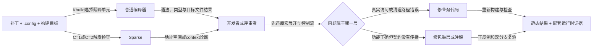
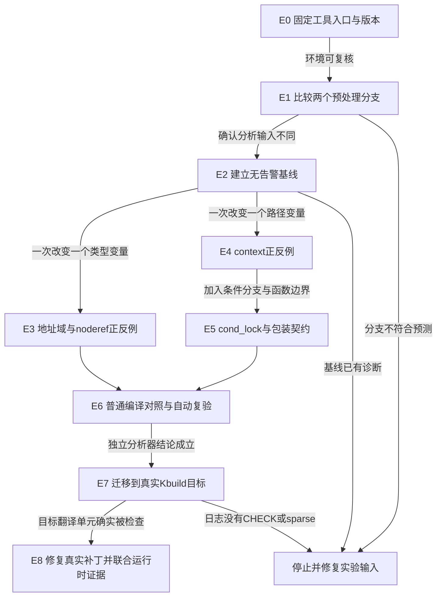
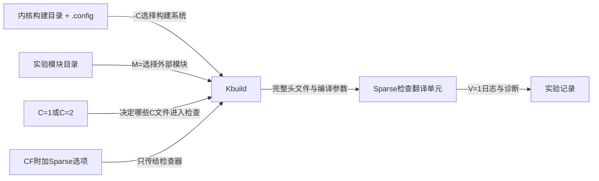
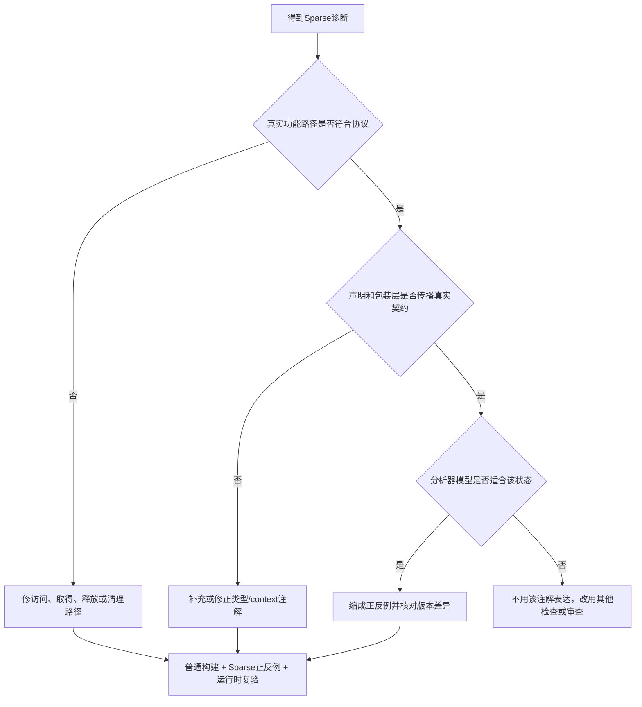

# 第6章\_在Linux内核中使用Sparse与设计注解

## 6.1\_从一份普通编译通过的补丁进入Sparse工作流

### 6.1.1\_前五章留下的不是语法问题而是工程问题

前几章已经分别建立了三个结论：Sparse 可以把 `__user`、`__iomem` 等记号解释成地址空间类型，可以沿控制流维护 context 账本，而普通编译、DWARF/BTF 和运行时工具又各自消费不同证据。DWARF 是 **Debugging With Attributed Record Formats**，即“使用带属性记录格式进行调试”的通用调试信息格式；BTF 是 **BPF Type Format**，即“BPF 类型格式”，其中 BPF 原名 **Berkeley Packet Filter**，即“伯克利包过滤器”，现代 Linux 文档通常直接把 BPF 当作子系统名称使用。DWARF 与 BTF 在上一章的[职责对照](P05_普通编译_BTF与运行时边界.md#5.4.2_DWARF与BTF的职责对照)中已经展开，本章只使用“它们保存构建产物中的类型信息”这一结论。到这里，读者已经能够解释“一个注解是什么”，但还没有完成一次内核开发中更常见的任务：

> 修改一份内核或驱动代码以后，怎样确认 Sparse 确实检查了这份改动，怎样把一条诊断还原到具体控制流，又怎样决定应修业务代码、补包装层契约，还是根本不该新增注解？

这个缺口很重要，因为下面三种看似省事的判断都不成立：

1. 普通 `make` 成功，只能说明普通编译分支通过，不能推出 Sparse 分支已经运行；
2. Sparse 报警，不等于应立即加入 `__force`、强制转换或新属性，真实访问路径和解锁路径可能本来就错了；
3. Sparse 没有报警，也不能推出运行时锁顺序、RCU（Read-Copy Update，读-复制-更新）生命期、数据竞争和硬件访问协议全部正确。

因此，本章讲解的不是一组互不相干的命令，而是一条 **补丁进入静态检查、诊断回到源码、修复以后重新建立证据** 的工程闭环。

### 6.1.2\_实际开发现场\_一次错误返回悄悄绕过了解锁

继续使用第 4 章的记录导入场景。完整实例已经给出 `state` 初始化、用户记录复制、trylock 成功与失败、共享状态提交、错误清理和对象生命期边界，见 [4.1.1 从用户地址类型走到一次带 trylock 的更新](P04_Sparse上下文与控制流记账.md#4.1.1_从用户地址类型走到一次带trylock的更新)。下面只截取一次代码评审中真正会看到的 **问题补丁**，不是另一个省略初始化和收尾的独立示例：

```diff
     ret = commit_record_locked(&tmp, state);
-    raw_spin_unlock(&state->lock);
-    return ret;
+    if (ret)
+        return ret; /* 错误：失败路径带着已经取得的锁返回。 */
+
+    raw_spin_unlock(&state->lock);
+    return 0;
```

这次改动制造问题的过程可以按时间顺序还原：

1. `raw_spin_trylock(&state->lock)` 返回成功，真实执行路径已经取得锁；
2. `commit_record_locked()` 发现 `state->accepting == false`，于是返回 `-ESHUTDOWN`；
3. 这个返回值只表示“记录没有提交”，并不会替调用者释放此前取得的锁；
4. 新增的 `if (ret) return ret;` 绕过 `raw_spin_unlock()`，错误路径带着锁离开；
5. 普通编译器仍可能接受这份代码，因为类型、语法和机器指令生成都没有因此失效；
6. 如果测试只覆盖 `state->accepting == true` 的成功路径，运行结果也可能暂时正常；
7. 只有当该源文件确实进入 Sparse，锁原语和辅助函数的 context 契约也正确接入时，静态账本才有机会在错误返回处暴露不平衡。

这里的关键转折是：**“普通编译通过”与“成功路径运行正常”都没有覆盖这条失败路径的静态证明义务。** 开发者需要先让构建系统把正确源文件、正确配置分支和正确宏展开交给 Sparse，再根据诊断回到第 2～4 步定位根因。第 5 章的 [C=1 与 C=2 覆盖范围说明](P05_普通编译_BTF与运行时边界.md#5.13.1_make_C=1与C=2决定检查哪些文件) 正是这条工作流的前置知识。

### 6.1.3\_谁在这条工作流中负责什么

`Sparse` 是工具名称，不是需要展开的英文缩写；它是面向 C 代码、尤其常用于 Linux 内核的语义解析和静态分析工具。`Kbuild` 是 Linux 内核构建系统的惯用名称，也不应臆造英文全称；它根据 `.config`、构建目标和依赖关系选择源文件，并组织普通编译器与检查器的调用。这里所说的 **翻译单元**（translation unit），是一个 `.c` 文件连同预处理后实际纳入的头文件和宏展开结果形成的编译输入。



各参与者的职责必须分开理解：

| 参与者 | 输入 | 产出与本章角色 | 不能单独保证什么 |
| --- | --- | --- | --- |
| 内核或驱动作者 | 业务协议、接口类型和成功/失败路径 | 在接口上维护地址域、整数域和 context 契约，并修复自己改动暴露的问题 | 不能靠注解把错误功能路径变正确 |
| Kbuild | `.config`、构建目标、依赖状态、`C=`、树外模块目录 `M=` 和 Sparse 选项 `CF=` | 选择翻译单元并组织普通编译或 Sparse 检查 | 没有进入目标或配置的源码不会自动获得覆盖 |
| 普通编译器 | 普通预处理分支和 C 源码 | 产生对象文件，并检查普通类型、语法及自身支持的属性 | 不负责兑现所有 Sparse 专用地址域和 context 规则 |
| Sparse | `__CHECKER__` 分支、展开后的类型与控制流 | 报告已建模的类型域混用和 context 不平衡 | 不执行真实锁操作，也不观察实际运行路径 |
| 开发者、评审者与 CI | 构建命令、原始诊断、补丁和检查范围 | 判断诊断根因、选择修复层次并保存可复核证据；CI 是 Continuous Integration，即 **持续集成** | “终端没有警告”不能自动升级为整份驱动正确 |
| 运行时验证工具与测试 | 实际内核配置、被执行路径和运行事件 | 观察 Lockdep 锁依赖、KCSAN 数据竞争、KASAN 非法内存访问等动态事实 | 只运行成功路径时仍可能看不到上述错误返回 |

表中的 `Lockdep` 是 Linux 内核锁依赖关系验证器的惯用名称；KCSAN 是 **Kernel Concurrency Sanitizer**，即“内核并发消毒器”；KASAN 是 **Kernel Address Sanitizer**，即“内核地址消毒器”。它们的共同点只是都消费运行时事件，不表示三者检查同一种状态，也不表示 Sparse 可以被其中任一个替代。

普通开发者当然有资格运行 Sparse：它工作在构建主机的静态分析阶段，不要求先修改正在运行的内核，也不要求在目标板上取得 root 权限。实际门槛只是能取得与改动一致的源码和配置、准备生成头文件、安装 Sparse，并说明本次命令覆盖了哪些翻译单元。只有加载实验模块、启动目标内核或收集 Lockdep 等动态证据时，才进一步涉及目标机版本、模块签名、内核配置和权限。

### 6.1.4\_本章只解决哪一段闭环

本章处在 **工程使用与注解设计** 层，承接前文已经成立的语义模型，不再重复推导地址空间类型、context 计数和 BTF 生成链，也不把 Sparse 诊断冒充真实锁、uaccess（user access，用户空间访问接口）、RCU 或设备 I/O（Input/Output，输入/输出）协议的运行时证明。后续各节依次解决：

1. 怎样安装 Sparse，并确认终端调用的确实是它；
2. 怎样先建立可复核实验地图，而不是把多类警告混在一次命令里；
3. 怎样比较 `__CHECKER__` 与普通编译分支，并建立无告警基线；
4. 怎样用 A/B 和单变量实验分别验证地址域、`noderef` 与 context 契约；
5. 怎样用 `C=1`、`C=2`、树内目录目标、树外模块的 `M=` 和 Sparse 选项 `CF=` 把独立结论迁移到 Kbuild；
6. 怎样把一条诊断还原为对象、宏展开、控制流、契约来源和修复位置；
7. 什么时候应修功能代码，什么时候才有理由用红灯—绿灯流程设计新注解；
8. 怎样联合运行时工具，并把“无告警”写成受配置、版本、范围和执行路径限制的条件结论。

读完本章，读者面对一份新的内核补丁时，应能独立完成“选择目标 → 确认 Sparse 运行 → 解释诊断 → 修复正确层次 → 准备正反例 → 联合运行时证据限定结论”的闭环，而不是只会复制 `make C=2` 或用强制转换让警告消失。

## 6.2\_安装并确认Sparse入口

### 6.2.1\_先明确Sparse安装在哪里以及谁调用它

Sparse 应安装在 **编译内核或驱动的构建主机** 上，供补丁作者、评审者、自动化脚本和 Kbuild 调用。即使目标内核运行在 ARM、RISC-V 或另一块开发板上，Sparse 仍是构建主机执行的用户空间程序：它读取 C 源码、预处理结果、包含路径和目标架构参数，把诊断写到标准错误输出，但不生成将要烧写到开发板的内核映像，也不需要进入目标板运行。

一次典型交付关系是：

| 提供者或调用者 | 把什么交给谁 | 当前作用 | 不负责什么 |
| --- | --- | --- | --- |
| Sparse 上游项目 | 把源码、发布压缩包和文档交给发行版维护者或开发者 | 发布分析器本身 | 不替具体发行版配置软件源 |
| Linux 发行版 | 把已构建的软件包及依赖交给构建主机 | 提供最省事、可随系统更新的安装路径 | 软件包版本不一定等于上游 Git 最新提交 |
| 内核或驱动开发者 | 把 C 文件或 Kbuild 构建目标交给 Sparse | 在提交以前解释和修复诊断 | 不需要先把工具安装到目标板 |
| Kbuild | 把当前配置、包含路径、宏和目标架构参数连同翻译单元交给 Sparse | 让真实内核文件在正确构建上下文中接受检查 | 不会自动安装 `sparse` 命令 |
| CI 系统 | 在固定镜像中安装版本并执行 Kbuild 检查 | 让同一检查可重复运行；CI 是 Continuous Integration，即持续集成 | 没有记录镜像、版本和检查范围时，无告警仍不可复核 |

因此，交叉编译 ARM 内核时，不应下载一个 ARM 版 Sparse 放到开发板上再检查源码；应在 x86-64、ARM64 或其他实际构建主机上安装 **能够在该主机运行** 的 Sparse，再由 Kbuild 传入目标架构信息。

本节命令使用 Linux shell 语法，适用于原生 Linux、WSL 2（Windows Subsystem for Linux 2，第二代 Windows Linux 子系统）中的 Linux 发行版、Linux 虚拟机或 CI 容器。Windows 开发者可以在 WSL 2 或 Linux 虚拟机中执行这些命令；本节不把 PowerShell 中出现同名命令当成 Kbuild 已经能够使用的 Linux 工具。Sparse 自身以普通用户权限运行，只有通过系统包管理器安装软件时通常需要管理员权限。

### 6.2.2\_官网文档源码仓库与发布包分别在哪里

第一次寻找 Sparse 时，应先区分“阅读文档”“取得开发源码”和“下载固定发布包”三个入口：

| 入口 | 官方地址 | 适用场景 | 版本边界 |
| --- | --- | --- | --- |
| Sparse 官方文档 | [https://sparse.docs.kernel.org/](https://sparse.docs.kernel.org/) | 查安装方式、注解、类型系统、选项和发布说明 | 文档站的 `latest` 表示当前站点内容，不等于本机已经安装该版本 |
| Linux 内核使用说明 | [https://docs.kernel.org/dev-tools/sparse.html](https://docs.kernel.org/dev-tools/sparse.html) | 查 Kbuild 的 `C=1`、`C=2`、`CF` 和 `__CHECKER__` 接入 | 解释 Linux 内核怎样调用 Sparse，不提供发行版软件包 |
| Sparse 官方 Git 仓库 | [https://git.kernel.org/pub/scm/devel/sparse/sparse.git](https://git.kernel.org/pub/scm/devel/sparse/sparse.git/) | 取得开发分支、指定标签或具体提交 | 分支会继续变化；实验必须记录提交 ID |
| kernel.org 发布包目录 | [https://www.kernel.org/pub/software/devel/sparse/dist/](https://www.kernel.org/pub/software/devel/sparse/dist/) | 下载固定版本的 `.tar.gz`、`.tar.xz`、签名和校验和 | 目录中的最终发布版可能早于 Git 开发版本，不能只凭文件日期猜兼容性 |

普通内核开发首先选择发行版软件包。只有下面几种情况才值得改用源码或发布压缩包：发行版没有提供 Sparse、发行版版本缺少正在核对的语义、需要复现某个固定版本，或者正在验证一个上游修复。不要从名字相近的 “SuiteSparse” 数值计算库下载；它与本章的 C 语义分析器不是同一个项目。

### 6.2.3\_优先通过Linux发行版安装

下面命令由具有软件安装权限的用户在 **构建主机** 执行。软件包管理器负责下载适合本机构建架构的程序、验证发行版仓库签名并安装运行依赖；安装完成后，普通开发者运行 Sparse 不需要 `sudo`。

Debian、Ubuntu 以及 Ubuntu WSL 发行版：

```bash
# 更新软件包索引。
sudo apt update

# 下载并安装Sparse及其运行依赖。
sudo apt install sparse
```

Fedora：

```bash
sudo dnf install sparse
```

Arch Linux：

```bash
sudo pacman -S sparse
```

发行版是否提供某个版本可以先从包索引观察，例如 [Debian sparse 软件包](https://packages.debian.org/sparse)、[Fedora sparse 软件包](https://packages.fedoraproject.org/pkgs/sparse/sparse/)和 [Arch Linux sparse 软件包](https://archlinux.org/packages/extra/x86_64/sparse/)。不同发行版的版本号不同并不表示安装错误；真正需要记录的是 **本次实际执行的版本和路径**。

CI 容器通常已经以 root 用户执行安装步骤，此时不写 `sudo`，并使用适合非交互脚本的包管理命令。例如 Debian/Ubuntu 基础镜像可以写成：

```bash
apt-get update
apt-get install --no-install-recommends -y sparse
```

若 `apt` 报告找不到 `sparse`，应先检查发行版版本、软件源组件和包索引，而不是立即添加来历不明的 PPA（Personal Package Archive，个人软件包存档）。下面两条命令分别观察当前软件源是否认识该包，以及准备安装哪个版本：

```bash
apt-cache policy sparse
apt-cache show sparse
```

### 6.2.4\_需要固定版本或开发版时从源码安装

从源码构建的最低目标只是得到 `sparse` 和随安装提供的 `cgcc` 编译器包装脚本；`cgcc` 是命令名，不需要杜撰英文全称。当前上游构建还会按依赖情况选择若干辅助程序：`c2xml` 把 C 语义信息导出为 XML，`semind` 使用 SQLite 建立语义索引，`test-inspect` 使用 GTK 图形界面观察分析结果，`sparse-llvm` 则接入 LLVM 后端。libxml2 是 XML 处理库，SQLite 是嵌入式数据库，GTK 是图形界面工具包，LLVM 是编译器基础设施项目名称。缺少这些可选依赖时，基础 `sparse` 仍可构建，但终端会明确显示相应辅助程序被禁用。第一次只为检查 Linux 内核时，不必为了消除这些提示安装全部依赖。

以 Debian/Ubuntu 构建主机为例，先准备基础构建工具：

```bash
sudo apt update
sudo apt install build-essential git pkg-config perl curl xz-utils
```

若确实需要 `c2xml` 或 `semind`，再按用途安装可选开发包：

```bash
# libxml2-dev用于构建c2xml，libsqlite3-dev用于构建semind。
sudo apt install libxml2-dev libsqlite3-dev
```

#### (1)\_下载Git开发版并记录提交

下面使用 kernel.org 的 HTTPS 仓库地址。HTTPS 通常比官方文档示例中的 `git://` 更容易穿过企业或校园网络防火墙：

```bash
# 下载当前Sparse开发源码。
git clone https://git.kernel.org/pub/scm/devel/sparse/sparse.git
cd sparse

# 开发分支会继续变化，构建前保存不可变提交ID。
git rev-parse HEAD

# 构建当前源码。
make -j"$(nproc)"

# 安装到当前用户的~/.local，不修改系统目录。
make PREFIX="$HOME/.local" install
```

这里的 `PREFIX` 是安装前缀：上例会安装到 `$HOME/.local/bin` 和 `$HOME/.local/share/man`。上游默认 `PREFIX=$HOME`，所以直接执行 `make install` 通常会安装到 `$HOME/bin`；它不是默认写入 `/usr/local`。不要习惯性执行 `sudo make install`，否则 `$HOME` 可能变成 root 的家目录，最终普通用户反而找不到刚安装的工具。

#### (2)\_下载固定发布包并核对哈希

下面把 `0.6.4` 当作 **固定版本示例**，不是对“永远最新版本”的声明。执行前应先打开官方发布包目录，选择与实验目标相符的版本：

```bash
SPARSE_VERSION=0.6.4
SPARSE_BASE_URL=https://www.kernel.org/pub/software/devel/sparse/dist

# 下载固定版本源码包和官方签名校验和文件。
curl -fLO "$SPARSE_BASE_URL/sparse-$SPARSE_VERSION.tar.xz"
curl -fLO "$SPARSE_BASE_URL/sha256sums.asc"

# 只抽出目标文件的哈希，再检查下载内容是否完整一致。
grep " sparse-$SPARSE_VERSION.tar.xz$" sha256sums.asc \
    > "sparse-$SPARSE_VERSION.sha256"
sha256sum -c "sparse-$SPARSE_VERSION.sha256"

# 解压、构建并安装到当前用户目录。
tar -xf "sparse-$SPARSE_VERSION.tar.xz"
cd "sparse-$SPARSE_VERSION"
make -j"$(nproc)"
make PREFIX="$HOME/.local" install
```

`sha256sum` 成功只说明下载文件与 `sha256sums.asc` 中的哈希一致。若要验证该校验和文件的发布身份，还必须安装提供 `gpg` 命令的 GnuPG，通过独立可信渠道取得并确认签名密钥，再执行：

```bash
gpg --verify sha256sums.asc
```

没有确认签名密钥时，不能把一次哈希匹配描述成已经验证了发布者身份。

### 6.2.5\_安装后要同时确认路径版本和调用身份

只看 `sparse --version` 仍可能漏掉一个问题：系统中可能同时存在发行版版本、`$HOME/bin` 版本和 `$HOME/.local/bin` 版本，而当前 shell 与 CI 实际调用的并不是同一个文件。安装后至少执行：

```bash
# 显示当前PATH首先找到的Sparse。
command -v sparse

# 列出PATH中能够找到的所有同名命令，便于发现版本遮蔽。
type -a sparse

# 输出当前实际执行版本。
sparse --version

# 查看与当前系统安装配套的命令手册。
man 1 sparse
```

发行版软件包通常会把手册放入系统手册路径。从源码安装到 `$HOME/.local` 后，如果 `man 1 sparse` 暂时找不到条目，可以直接指定文件观察：

```bash
man -l "$HOME/.local/share/man/man1/sparse.1"
```

常见路径及其来源是：

| 路径示例 | 通常来自哪里 | 应核对什么 |
| --- | --- | --- |
| `/usr/bin/sparse` | 发行版软件包 | 包管理器记录的版本是否符合项目要求 |
| `$HOME/bin/sparse` | 上游默认 `make install` | `$HOME/bin` 是否进入当前 shell 和 CI 的 `PATH` |
| `$HOME/.local/bin/sparse` | 显式 `PREFIX=$HOME/.local` 安装 | 是否遮蔽或被 `/usr/bin/sparse` 遮蔽 |

若源码已经安装到 `$HOME/.local/bin`，但 `command -v sparse` 仍然找不到，可以先在当前 shell 临时加入路径：

```bash
export PATH="$HOME/.local/bin:$PATH"
hash -r
command -v sparse
sparse --version
```

确认无误后，再按所用 shell 的规则把该目录加入启动配置。不要只在交互终端修改 `PATH`，却假定非交互 CI 或 `sudo` 环境会自动继承同一值。

### 6.2.6\_常用命令按任务分类

| 命令 | 什么时候用 | 预期观察 | 不能据此推出什么 |
| --- | --- | --- | --- |
| `command -v sparse` | 确认命令入口 | 输出当前首先命中的可执行文件路径 | 不能说明其他同名版本不存在 |
| `type -a sparse` | 排查多版本遮蔽 | 列出当前 shell 可见的全部同名入口 | 不能说明 CI 使用同一份 `PATH` |
| `sparse --version` | 记录工具版本 | 输出版本号或包含提交信息的版本字符串 | 不能说明任何目标文件已经被检查 |
| `man 1 sparse` | 查询本机版本支持的选项 | 打开与安装包配套的手册 | 在线 `latest` 文档可能与本机版本不同 |
| `sparse file.c` | 检查不依赖复杂构建参数的独立 C 文件 | 无问题时通常静默，有问题时向标准错误输出诊断 | 不能可靠替代真实内核文件的 Kbuild 参数 |
| `sparse -Waddress-space -Wcontext file.c` | 在独立实验中显式启用地址空间和 context 检查 | 观察类型域混用和上下文不平衡 | 当前版本可能已经默认启用，显式写出只是便于复现实验 |
| `sparse -Wsparse-all file.c` | 探索本机版本提供的更多 Sparse 告警 | 可能出现比项目默认基线更多的诊断 | 不适合未经评估就直接设为全项目零告警门禁 |
| `sparse -Wsparse-error file.c` | 需要让 Sparse 告警导致非零退出的 CI 实验 | 出现 Sparse 告警时命令失败 | 旧代码已有告警时可能阻断与当前补丁无关的构建 |
| `sparse -fmax-errors=20 -fmax-warnings=20 file.c` | 大量诊断淹没首个根因时 | 最多显示指定数量的错误和警告 | 截断输出不代表后续问题不存在 |
| `make C=1` 或 `make C=2` | 检查真实 Linux 内核构建目标 | Kbuild 使用正确配置、头文件和参数调用 Sparse | 两者的差别不是告警严格程度，范围见 [E7 Kbuild 对照实验](#6.10_E7把独立实验迁移到真实Kbuild目标) |

`cgcc` 是随 Sparse 安装的编译器包装脚本，可在普通 C 项目中把编译与 Sparse 检查组合起来；Linux 内核已经有自己的 Kbuild 接入，因此本专题优先使用 `make C=1/C=2`，不要求把内核编译器替换成 `cgcc`。

### 6.2.7\_完整实例\_从安装确认到正反例诊断

假设一名驱动开发者刚在 Ubuntu 构建主机执行了 `sudo apt install sparse`。`sparse --version` 能证明命令可以启动，却还不能证明当前可执行文件真的识别本专题使用的地址空间属性。下面建立一个不依赖 Linux 内核头文件的安装验收实验，同时准备正确路径和故意错误路径。

实验边界如下：

- 环境是带有 Sparse 0.6.4 或兼容版本的 Linux shell；
- 代码是结构完整的独立教学程序，不是 Linux 上游源码摘录；
- `__user` 被简化为一个 `address_space(1)` 属性，只验证地址空间类型能否参与形参检查；
- 实验不执行用户内存访问，也不证明 `copy_from_user()`、Kbuild 或真实内核配置正确。

把下面代码保存为 `sparse_install_smoke.c`：

```c
/*
 * 这个教学宏只建立Sparse地址空间类型，不执行真实用户内存访问。
 */
#define __user __attribute__((address_space(1)))

static void accept_user_pointer(const int __user *value)
{
    /* 正确接口继续要求用户地址空间指针。 */
    (void)value;
}

static void accept_kernel_pointer(const int *value)
{
    /* 普通内核指针接口不接受用户地址空间指针。 */
    (void)value;
}

static void check_pointer_boundary(const int __user *source)
{
#ifdef BUILD_BAD_PATH
    /* 故意错误：把用户地址空间指针交给普通指针形参。 */
    accept_kernel_pointer(source);
#else
    /* 正确路径：地址空间类型从实参传播到同域形参。 */
    accept_user_pointer(source);
#endif
}

/* 静态存储期指针默认初始化为空，只用来形成完整调用入口。 */
static const int __user *test_source;

int main(void)
{
    check_pointer_boundary(test_source);
    return 0;
}
```

先运行正确基线：

```bash
command -v sparse
sparse --version
sparse -Waddress-space sparse_install_smoke.c
```

第三条命令在正确路径上通常不输出地址空间诊断。这里的“静默”只有在前两条命令已经确认入口和版本后才有意义，否则还不能排除命令未安装或调用了错误程序。

再通过预处理宏启用故意错误路径：

```bash
sparse -Waddress-space -DBUILD_BAD_PATH sparse_install_smoke.c
```

诊断的行号和排版会随版本变化，但输出应至少包含与下面相同的核心事实：调用 `accept_kernel_pointer(source)` 时，实参和形参属于不同地址空间。

```text
sparse_install_smoke.c:...: warning: incorrect type in argument 1 (different address spaces)
```

这个诊断类别也可以在 Sparse `v0.6.4` 自带的[地址空间验证用例](https://git.kernel.org/pub/scm/devel/sparse/sparse.git/tree/validation/address_space.c?h=v0.6.4)中核对；示例没有要求逐字匹配行号、列号和类型打印格式。

最后验证 CI 失败语义：

```bash
sparse -Wsparse-error -Waddress-space \
    -DBUILD_BAD_PATH sparse_install_smoke.c
echo $?
```

故意错误存在时，`-Wsparse-error` 会使命令以非零状态退出；shell 中的 `$?` 因而不应为 `0`。若要清理实验文件，可以执行：

```bash
rm -f sparse_install_smoke.c
```

这个实例完成了四项验收：当前 shell 能定位 Sparse、版本可记录、正确地址域传播保持安静、错误地址域传递产生诊断且能够转为 CI 失败。它仍然没有证明 Kbuild 会调用同一个路径，也没有提供真实内核 `.config`、生成头文件和体系结构参数。6.3～6.9 先建立完整的单变量实验闭环，[E7](#6.10_E7把独立实验迁移到真实Kbuild目标) 再运行 Kbuild 对照，把“工具安装正确”推进为“目标内核翻译单元确实进入检查”。

### 6.2.8\_常见安装与入口故障怎样定位

| 现象 | 常见原因 | 先执行什么 | 修复方向 |
| --- | --- | --- | --- |
| `sparse: command not found` | 软件包未安装，或用户安装目录不在 `PATH` | `command -v sparse`、`apt-cache policy sparse` | 完成安装，或把准确的用户安装目录加入当前环境 |
| `type -a sparse` 出现多个路径 | 发行版版本与源码版本并存 | 逐个执行绝对路径加 `--version` | 选择并记录项目需要的版本，统一开发机与 CI 的 `PATH` |
| 交互终端可用但 CI 找不到 | CI 使用非交互 shell 或不同镜像 | 在 CI 日志打印 `command -v sparse` 和 `sparse --version` | 在镜像中安装，或显式设置 CI 的 `PATH` |
| `make` 提示缺少 libxml2、SQLite、GTK 或 LLVM | 可选辅助程序依赖没有安装 | 查看警告具体点名哪个程序被禁用 | 只使用基础 `sparse` 时可记录后继续；需要该辅助程序时再补依赖 |
| 直接执行 `sparse drivers/foo.c` 出现大量缺头文件或宏错误 | 绕过了 Kbuild 的配置、生成头文件和编译参数 | 在内核树运行 `make V=1` 并进入 [E7](#6.10_E7把独立实验迁移到真实Kbuild目标) | 用 `make C=1/C=2` 检查真实内核目标 |
| 正反例都没有产生诊断 | 调用了错误版本、没有启用错误分支或文件内容不一致 | `type -a sparse`、`sparse --version`、检查 `-DBUILD_BAD_PATH` | 先恢复 6.2.7 的命令和源码，再扩大到内核构建 |

安装完成的判据不是“包管理器返回成功”，而是 **明确的可执行文件路径 + 可记录的版本 + 正确样例静默 + 错误样例产生预期类别诊断**。只有这四项同时成立，后续 `make C=1/C=2` 的无告警结果才有资格继续解释。

## 6.3\_先画实验地图再运行命令

前面的安装说明只回答“怎样取得工具”，还没有回答“怎样用实验把前五章的概念逐项变成证据”。如果直接运行一次 `make check-all`，终端也许会出现许多警告，但读者无法判断哪条警告由地址域、`noderef`、调用前置条件、返回债务还是分支合流产生。真正能够研究机制的实验必须先建立干净对照，再一次只改变一个变量。

本章使用仓库中的 [Sparse 地址空间与上下文记账实验](../../../../labs/foundations/c_language/P01_Sparse地址空间与上下文记账/README.md#1.1_实验目标) 作为贯穿场景。独立实验不依赖内核启动，最后再通过一个不加载的外部模块接入真实 Kbuild。完整路线如下：



各阶段的完成物不是一句“通过”，而是一项可交付证据：

| 阶段 | 待验证问题 | 唯一主要改变量 | 必须保存的证据 | 何时停止 |
| --- | --- | --- | --- | --- |
| E0 | 当前 shell 调用的是哪个 Sparse？ | 工具入口 | 路径和版本 | 找不到工具或版本不明 |
| E1 | `__CHECKER__` 是否改变分析输入？ | 预处理宏 | 两份 `.i` 输出及差异 | 两分支没有预期差异 |
| E2 | 正确样例能否形成干净对照？ | 不打开反例宏 | 无诊断输出 | 基线已有警告 |
| E3 | 不同类型错误是否可分别触发？ | 一个 `BAD_ADDRESS_*` 或 `BAD_NODEREF` | 对应诊断类别 | 一次出现无法归因的多类错误 |
| E4 | 三种 context 失败是否具有不同时间边界？ | 一个 `BAD_CONTEXT_*` | 路径账本和诊断 | 无法写出 `0/1` 路径 |
| E5 | 条件结果和跨函数传播怎样影响账本？ | 条件事件位置或函数属性 | 两分支账本、红绿对照 | 功能动作与注解真假未核对 |
| E6 | 普通编译与 Sparse 消费边界是否可观察？ | 消费者 | GCC 结果、Sparse 结果和 `verify` 结果 | 把静默误当成工具已运行 |
| E7 | Kbuild 是否检查目标翻译单元？ | `C=`、`M=`、`CF=` | `V=1` 日志、配置和目标 | 日志没有检查器入口 |
| E8 | 应修功能路径还是注解传播？ | 最小修复 | 修复前后正反例与动态证据 | 只压警告而没有解释根因 |

开始实验前先写下预测。若运行结果推翻预测，应回到前一阶段修正模型，而不是跳到结论或加入 `__force`。

## 6.4\_E0固定环境版本与实验记录

### 6.4.1\_确认谁给谁使用

Sparse 安装在开发者或 CI 的 Linux 构建主机上，由开发者直接调用，或由 Kbuild 在 `C=1/C=2` 路径中调用；它不需要先加载到目标板，也不需要 root 权限。进入仓库实验目录：

```bash
cd labs/foundations/c_language/P01_Sparse地址空间与上下文记账
make doctor
```

预期依次看到 Sparse 的实际路径和版本、GCC 的实际路径和版本、GNU make 版本。把这些内容复制进实验记录。若 `make doctor` 在 `command -v sparse` 处失败，回到 6.2 完成安装；此时“没有诊断”没有任何证明力，因为分析器根本没有运行。

### 6.4.2\_先准备证据表而不是只保存截图

每一轮至少记录：

```text
实验阶段与日期：
操作系统和发行版：
Sparse/GCC/GNU make的路径与版本：
待验证假设：
本轮唯一改变量：
完整命令和原始输出：
预期与实际是否一致：
类型状态或路径账本怎样变化：
本轮能证明什么、不能证明什么：
```

原始输出用于复核，路径账本用于解释，证明边界用于防止过度结论；三者不能互相替代。

## 6.5\_E1与E2从分析输入走到干净基线

### 6.5.1\_E1比较Sparse分支和普通编译分支

先只运行预处理器：

```bash
make preprocess-sparse > /tmp/sparse-branch.i
make preprocess-compiler > /tmp/compiler-branch.i

grep -nE 'address_space\(|noderef|__context__|__attribute__.*context' /tmp/sparse-branch.i
grep -nE 'address_space\(|noderef|__context__|__attribute__.*context' /tmp/compiler-branch.i
```

第一条 `make` 命令定义 `__CHECKER__`，预期在输出中保留 `address_space`、`noderef`、`context` 或 `__context__`；第二条不定义 `__CHECKER__`，这些实验宏应退化为空属性或普通表达式。此阶段只证明两个消费者收到不同输入，还没有证明 Sparse 会怎样解释这些记号。

若两份输出相同，先检查 `make` 打印的命令、当前目录和搜索范围。真实内核文件还依赖生成配置与大量 include 参数，不能脱离 Kbuild 只执行一条简化的 `gcc -E file.c` 后就断言内核分支是什么。

完整的预处理观察步骤见实验的[1.4 先观察两个预处理分支](../../../../labs/foundations/c_language/P01_Sparse地址空间与上下文记账/README.md#1.4_先观察两个预处理分支)。

### 6.5.2\_E2建立后续所有反例的共同基线

默认源码保留三条正确路径：

```c
static void address_space_good(struct record __user *source)
{
    check_user_pointer(source);
}

static void context_good(int *lock)
{
    fake_lock(lock);
    requires_lock(lock);
    fake_unlock(lock);
}

static void conditional_context_good(int *lock, int succeeds)
{
    if (__cond_lock(lock, succeeds)) {
        requires_lock(lock);
        fake_unlock(lock);
    }
}
```

运行：

```bash
make check-good
```

预期没有地址空间、`noderef` 或 context 诊断。三条路径分别说明：同域指针进入同域形参；无条件取得路径的账本是 `0 → 1 → 1 → 0`；条件取得的成功和失败分支最终都回到 `0`。

如果正确基线已经报警，必须停止。先确认是不是工具版本、附加 `SPARSE_FLAGS`、实验源码或宏环境发生变化，再决定修实验还是调整版本边界。一个不干净的基线无法支持后续“唯一变量导致诊断”的因果结论。

## 6.6\_E3用A/B实验拆开地址域与noderef

### 6.6.1\_空函数的诊断究竟来自哪里

第 3 章已经说明空函数可以把实参送进类型检查；这里用 A/B 实验验证，而不是再次接受一句结论。实验源码包含：

```c
static inline void
check_boundary_pointer(const volatile void __boundary_user *pointer)
{
    (void)pointer;
}
```

实验 A 保留 `__boundary_user → __user`，把普通内核对象传给它：

```bash
make check-address-boundary
```

预期出现 `different address spaces`。实验 B 保持调用者、对象和空函数体完全不变，只把形参契约退化为空：

```bash
make check-address-boundary-erased
```

预期诊断消失。唯一改变量和观察结果如下：

| 实验 | 形参类型 | 实参类型 | 函数体 | 预期 |
| --- | --- | --- | --- | --- |
| A | `const volatile void __user *` | 普通内核对象地址 | 空 | 地址域不匹配 |
| B | `const volatile void *` | 同一个普通内核对象地址 | 相同 | 地址域诊断消失 |

因此，检查由 **函数声明形成的类型边界** 完成，与函数名是否像检查器、函数体是否读内存无关。B 中诊断消失也不表示调用安全，只表示类型证据被删除。

### 6.6.2\_地址域赋值和受限指针解引用不是同一错误

先只启用地址域赋值：

```bash
make check-address-assignment
```

唯一反例是：

```c
struct record *plain = source;

(void)plain;
```

它不解引用 `source`，预期核心诊断是 `different address spaces`。再恢复基线，只启用裸解引用：

```bash
make check-good
make check-noderef
```

唯一反例是：

```c
return source->value;
```

它没有先转换为普通指针，预期核心诊断是 `dereference of noderef expression`。前者检查指针能否在逻辑域之间流动，后者检查受限指针能否绕过专用访问协议；把两段代码放在同一反例里会让次生诊断污染因果关系。

本阶段只能证明 Sparse 区分了这些静态误用，不能证明真实 `copy_from_user()` 完成了页故障处理、范围检查和错误返回。完整命令、预期和故障定位见实验的[类型边界](../../../../labs/foundations/c_language/P01_Sparse地址空间与上下文记账/README.md#1.6_类型边界实验_空函数怎样把实参送进检查)与[地址空间和 noderef](../../../../labs/foundations/c_language/P01_Sparse地址空间与上下文记账/README.md#1.7_地址空间与noderef实验_把两种错误拆开)两节。

## 6.7\_E4把三种context错误还原成三条时间线

“context 不平衡”只是总类别，不是根因。本阶段从入口账本 `0` 出发，一次打开一个反例：

```bash
make check-context-call
make check-good

make check-context-exit
make check-good

make check-context-release
make check-good
```

对应的完整函数是：

```c
static void context_bad_call(int *lock)
{
    requires_lock(lock);
}

static void context_bad_exit(int *lock)
{
    fake_lock(lock);
}

static void context_bad_release(int *lock)
{
    fake_unlock(lock);
}
```

必须逐条画账本：

| 反例 | 完整路径 | 预期诊断线索 | 错误发生的时间边界 |
| --- | --- | --- | --- |
| 未持有调用 | `入口0 → requires_lock要求1` | `context check failure` 或版本等价诊断 | 调用 helper 以前 |
| 取得后返回 | `入口0 → fake_lock +1 → 退出1` | `wrong count at exit` | 函数返回时 |
| 没有取得就释放 | `入口0 → fake_unlock -1` | `unexpected unlock` | 释放事件发生时 |

第一种违反被调用者的入口要求；第二种在返回路径留下债务；第三种试图从不存在的状态中扣减。它们可能都提到 lock，但修复位置并不相同。详细的预期结果与比较表见实验的[1.8 context 基本实验](../../../../labs/foundations/c_language/P01_Sparse地址空间与上下文记账/README.md#1.8_context基本实验_前置状态退出债务与错误释放)。

在真实补丁中也应使用相同方法：把每个 `return`、`goto` 和错误分支列出来，从函数入口沿路径累计事件，而不是根据 `lock`、`unlock` 的函数名猜测检查器“应该知道”。

## 6.8\_E5研究条件取得和跨函数契约传播

### 6.8.1\_条件取得为什么必须在成功分支登记

正确实现把布尔结果和 `+1` 事件放在同一个表达式中：

```c
if (__cond_lock(lock, succeeds)) {
    requires_lock(lock);
    fake_unlock(lock);
}
```

两条路径是：

```text
失败：入口0 → condition为0 → 不登记 → 退出0
成功：入口0 → condition非0 → 登记+1 → 使用时为1 → 释放-1 → 退出0
```

现在运行错误变体：

```bash
make check-conditional-context
```

错误代码在判断结果以前无条件执行 `__acquire(lock)`：

```c
__acquire(lock);
if (succeeds) {
    requires_lock(lock);
    fake_unlock(lock);
}
```

成功路径仍能回到 `0`，失败路径却以 `1` 退出。预期出现 `different lock contexts for basic block`、`wrong count at exit` 或版本等价诊断。这个实验把 `__cond_lock()` 的作用限定得很清楚：它不执行 trylock，而是让 **功能结果为真** 与 **静态账本增加** 共享同一个控制流边界。若 `succeeds` 本身谎报真实锁状态，静态账本仍会跟着谎言走。

### 6.8.2\_包装函数体内有事件为什么还需要函数属性

`fake_lock()` 同时具有：

```c
static void fake_lock(int *lock) __acquires(lock)
{
    (void)lock;
    __acquire(lock);
}
```

`__acquire(lock)` 核对实现体确实从 `0` 走到 `1`；`__acquires(lock)` 则声明调用者在函数返回后应看到 `0 → 1`。运行红灯实验：

```bash
make check-wrapper-contract
```

该目标只擦掉函数属性，保留函数体事件。预期包装函数自身出现未声明的退出变化，调用者也失去跨函数传播。再恢复绿灯：

```bash
make check-good
```

由此可以得到三个不能混写的事实：真实包装函数做了什么、Sparse 怎样核对包装函数体、调用者怎样得到入口/出口契约。实验详情见[条件取得](../../../../labs/foundations/c_language/P01_Sparse地址空间与上下文记账/README.md#1.9_条件取得实验_为什么记账必须跟随成功分支)和[包装层契约](../../../../labs/foundations/c_language/P01_Sparse地址空间与上下文记账/README.md#1.10_包装层契约实验_函数体正确不等于调用者看得见)。

## 6.9\_E6用消费者对照和自动断言封闭独立实验

### 6.9.1\_让普通编译器看到所有故意错误

实验目标同时打开前面所有 `BAD_*` 反例，但不定义 `__CHECKER__`：

```bash
make compile-compiler
```

预期 GCC 在 `-Wall -Wextra -Werror -fsyntax-only` 下通过。原因不是反例安全，而是普通分支把 Sparse 专用地址域和 context 语义退化掉了。这一轮把第 5 章的“不同消费者”变成可观察事实：相同源码在普通 C 类型系统中可接受，在 Sparse 类型和路径模型中却可以产生诊断。

### 6.9.2\_自动复验正反例的诊断类别

```bash
make verify
```

`make verify` 先重复普通 GCC 对照，再由 `verify.sh` 断言：正确基线静默；删除空函数形参契约以后诊断消失；地址域、`noderef` 和各类 context 反例分别出现预期类别。脚本不固定行号和整句输出。一个完整成功结果会以多行 `PASS ...` 结束，并包含：

```text
PASS verify: 所有正反例都满足当前实验的类别断言
```

若脚本失败，必须检查它保留的实际输出。可能原因包括：基线出现新诊断、Sparse 版本改变措辞、某个开关没有进入源码，或者实验假设被新版本推翻。不能为了让脚本变绿而把正则扩成任意 `warning`，否则类别断言会失去意义。

### 6.9.3\_最后才练习混合报告分类

```bash
make check-all 2>&1 | tee /tmp/sparse-check-all.log
```

此时目标不是数警告，而是把每条诊断回指到 E3～E5 的单变量实验。若无法判断某条是首因还是次生结果，重新只打开相应一个宏。到这里，读者已经证明独立 Sparse 入口能够消费实验契约；下一步才轮到 Kbuild。

## 6.10\_E7把独立实验迁移到真实Kbuild目标

### 6.10.1\_为什么还要第二层实验

直接执行 `sparse file.c` 只能证明分析器可运行。真实内核翻译单元还依赖 `.config`、生成头文件、体系结构选项、include 路径和 Kbuild 选择结果。仓库实验的 `kernel_module/` 提供一个可构建但不加载的外部模块，用它验证 `M=`、`C=` 和 `CF=` 的数据流：



这一步需要一棵已经配置、能够构建外部模块的 Linux 内核构建目录。若源目录与输出目录分离，应传入包含 `.config` 和生成头文件的构建目录。

### 6.10.2\_建立普通模块构建基线

```bash
cd labs/foundations/c_language/P01_Sparse地址空间与上下文记账/kernel_module

kernel_build=/absolute/path/to/kernel/build
make KERNEL_BUILD="$kernel_build" doctor
make KERNEL_BUILD="$kernel_build" build
```

预期生成 `sparse_kbuild_probe.ko`，但本实验不执行 `insmod`。如果 `build` 失败，应先解决内核配置、生成头文件、编译器或模块构建问题；在普通翻译单元尚未成立时，Sparse 输出不具备可比基线。

### 6.10.3\_用已是最新状态的目标验证C=1与C=2

在刚完成 `build`、模块源码没有变化的前提下执行：

```bash
make KERNEL_BUILD="$kernel_build" check-c1 \
    2>&1 | tee /tmp/sparse-kbuild-c1.log

make KERNEL_BUILD="$kernel_build" check-c2 \
    2>&1 | tee /tmp/sparse-kbuild-c2.log

grep -E 'CHECK|sparse' /tmp/sparse-kbuild-c1.log
grep -E 'CHECK|sparse' /tmp/sparse-kbuild-c2.log
```

`C=1` 只对本轮因依赖变化而重新编译的 C 文件运行 Sparse；目标已经是最新状态时，日志可能没有检查动作。`C=2` 对选中范围内的 C 文件运行 Sparse，即使相应对象不需要重新编译。二者改变的是 **覆盖范围**，不是 `-Wcontext` 等诊断严格程度。

若两份日志都包含编译动作，先查模块是否真的已经完成基线构建、时间戳是否变化、前一轮是否失败；不能脱离目标状态机械比较行数。

### 6.10.4\_用CF制造Kbuild内的正反例

```bash
make KERNEL_BUILD="$kernel_build" check-good
make KERNEL_BUILD="$kernel_build" check-bad
```

`check-good` 通过 `C=2 CF="-Wcontext"` 检查正确分支；`check-bad` 再由 `CF` 追加 `-DBUILD_BAD_ADDRESS`，只让 Sparse 看见：

```c
const int *plain = source;
```

预期正确分支没有本实验地址域诊断，错误分支出现 `different address spaces`。这组命令证明了 `M=` 选择外部模块、`C=2` 触发检查、`CF` 传递分析选项以及目标文件实际进入 Sparse。

### 6.10.5\_迁移到正在修改的树内目录

外部模块实验通过以后，再把同一方法应用到真实补丁。第一次不必扫描整棵树，可选择受影响目录：

```bash
kernel_tree=/absolute/path/to/linux
target_dir=drivers/base/

make -C "$kernel_tree" V=1 C=2 CF="-Wcontext" "$target_dir" \
    2>&1 | tee /tmp/sparse-target.log

grep -E 'CHECK|sparse' /tmp/sparse-target.log
```

树内目录作为构建目标限制检查范围；树外模块使用 `M=`；`CF` 只附加 Sparse 选项。记录 `.config`、内核提交、目标目录、Sparse 版本和完整日志，才能把“终端没警告”升级为“指定翻译单元在这些条件下没有产生相应诊断”。

## 6.11\_E8从一条诊断定位到正确修复层

### 6.11.1\_五项还原法

不要只复制警告文本。每条诊断至少还原：

| 项目 | 要回答的问题 | 实验中怎样取得 |
| --- | --- | --- |
| 原始对象 | 哪个变量、成员、锁或地址域冲突？ | 看诊断行和相邻声明 |
| 展开结果 | 当前配置下宏变成什么类型或 context 事件？ | E1 预处理输出或 Kbuild `V=1` 命令 |
| 控制流 | 诊断位于哪个成功、失败、合流或返回路径？ | 逐路径写 `0/1` 账本 |
| 契约来源 | 形参类型、函数属性还是语句事件建立要求？ | 回到声明与宏定义 |
| 修复位置 | 功能访问、接口类型还是注解传播错误？ | 与真实协议和正反例对照 |

### 6.11.2\_把开篇错误返回走完一遍

开篇补丁在 `commit_record_locked()` 失败时直接返回。假设 Kbuild 日志已经证明目标文件进入 Sparse，诊断指向该函数的错误返回。还原路径：

```text
S0 入口：state->lock账本为0
S1 trylock成功：真实锁取得，静态成功分支登记+1
S2 commit_record_locked返回-ESHUTDOWN：锁所有权没有变化，账本仍为1
S3 if (ret) return ret：绕过unlock，函数以1退出
S4 Sparse在退出路径观察到声明期望0、实际为1
```

正确修复应改变真实清理路径，而不是在 `return` 前插入一个只改静态账本的 `__release()`：

```c
ret = commit_record_locked(&tmp, state);
raw_spin_unlock(&state->lock);
return ret;
```

修复后的失败路径和成功路径都执行真实 `raw_spin_unlock()`，静态契约只是跟随功能事实。复验顺序为：

1. 重新运行目标目录或模块的 `C=2` 检查；
2. 保留一个故意删除解锁的反例，确认诊断能力没有因错误注解而消失；
3. 用 Lockdep 和能覆盖 `-ESHUTDOWN` 分支的测试观察真实运行事件；
4. 把结论限定在实际配置、目标和执行路径。

### 6.11.3\_怎样决定修业务代码还是修注解



只有真实协议成立而契约传播缺失时，才进入注解设计。`__force`、强制转换或孤立的 `__acquire()` 不能用来替代错误的用户访问、设备 I/O、RCU 生命期或真实解锁。

## 6.12\_用红灯绿灯流程设计新的注解

假设项目引入一个包装接口，成功返回时保持对象锁，并提供成对释放：

```c
void object_lock(struct object *object)
    __acquires(&object->lock);

void update_object_locked(struct object *object)
    __must_hold(&object->lock);

void object_unlock(struct object *object)
    __releases(&object->lock);
```

不要先写属性再寻找理由，按下面顺序推进：

1. **固定功能事实：** 列出无条件成功、失败回滚、trylock 成功/失败和所有返回；确认哪个分支真实取得，返回时是否继续持有。
2. **准备红灯：** 至少建立未取得调用 `update_object_locked()`、取得后错误返回、没有取得就释放三个反例，并记录预期路径账本。
3. **建立最小契约：** 无条件取得并保持的函数才声明 `__acquires()`；释放函数声明 `__releases()`；只要求保持而不改变计数的 helper 使用 `__must_hold()`。
4. **处理条件取得：** trylock 的真实布尔结果必须与 `__cond_lock()` 的 `+1` 位于同一个成功分支，失败和回滚路径不能登记。
5. **验证实现体：** 包装函数体中的 `__acquire()`、`__release()` 事件用于核对实现是否兑现声明，不能取代调用者可见的函数属性。
6. **取得绿灯：** 正确路径静默，三个红灯反例仍分别产生预期类别；若错误样例也静默，说明契约没有真正限制调用者。
7. **复验普通分支：** 确认注解不会重复求值实参，不改变 ABI，不制造真实锁动作或新控制流。
8. **补运行时证据：** 用 Lockdep、专项测试和失败注入覆盖真实取得、失败回滚与释放。

仓库实验中的 `make check-wrapper-contract` 与 `make check-good` 正好模拟第 5～6 步：只删除 `__acquires()` 就使函数体事件和调用者传播失配，恢复后重新闭合。完整迁移任务见实验的[1.14 从实验结论迁移到新注解](../../../../labs/foundations/c_language/P01_Sparse地址空间与上下文记账/README.md#1.14_从实验结论迁移到新注解)。

不应为每个业务布尔值滥用 context。只有状态确实具有跨函数的入口/出口要求、能够由稳定表达式标识，而且正反例能证明分析器消费了契约时，才适合接入。

## 6.13\_把静态结果接入其他证据并限定结论

### 6.13.1\_先写证明问题再选工具

| 待证明问题 | 首选证据 | 相邻工具或实验 | 仍未覆盖什么 |
| --- | --- | --- | --- |
| 宏到底展开成什么 | 预处理输出 | GCC/Clang `-E` | 分析器是否按预期解释 |
| 地址域和整数域是否混用 | Sparse 类型系统 | 编译器警告、Smatch | 真实访问是否成功、安全 |
| 函数 context 是否配对 | Sparse `-Wcontext` | 本章单变量实验 | 真实锁是否取得、锁顺序是否正确 |
| 实际锁顺序和 IRQ 依赖 | 运行路径事件 | Lockdep、KUnit、kselftest | 未执行路径 |
| 数据竞争 | 运行时访问冲突 | KCSAN、专项压力测试 | 没被调度出的交错 |
| 越界与释放后访问 | 内存访问插桩 | KASAN、对象生命期审查 | 未执行对象路径 |
| 大规模接口模式迁移 | 语义匹配与变换 | Coccinelle | 变换后的功能正确性 |
| 指令和屏障是否生成 | 目标文件反汇编 | `objdump`、`llvm-objdump` | 运行时协议和硬件状态 |
| BTF type tag 是否保留 | BTF/DWARF 转储 | `pahole`、`bpftool btf dump`、`readelf` | 下游消费者是否采用正确语义 |

Lockdep 是锁依赖关系验证器；KUnit 是 Kernel Unit Testing，即“内核单元测试”框架；kselftest 是 Linux 内核自测试集合；KCSAN 是 Kernel Concurrency Sanitizer，即“内核并发消毒器”；KASAN 是 Kernel Address Sanitizer，即“内核地址消毒器”。这些工具消费的状态不同，不能用“都没报警”把它们合并成一个无限结论。

### 6.13.2\_把无告警写成条件命题

合格结论是：

> 在记录的内核提交、配置、Sparse 版本、构建目标和 `CF` 选项下，`V=1` 日志证明目标翻译单元已经进入 Sparse；当前可见的地址域转换与 context 路径没有产生相应诊断。独立实验的故意错误样例仍能触发预期类别。

不能扩写为：

> 这个驱动已经没有用户指针、锁、RCU、对象生命期或并发问题。

静态无告警依赖注解完整性、配置分支和分析器能力；动态无告警依赖检查器已启用且相关路径真的执行；功能正确性还依赖硬件、内存顺序、错误恢复和对象所有权。只有把每项证据放回自己的层次，结论才可复核。

## 6.14\_迁移练习\_为新地址域设计整套研究方案

看到下面的新宏时，不先查现成答案：

```c
#ifdef __CHECKER__
#define __device_handle \
    __attribute__((noderef, address_space(__device_handle)))
#else
#define __device_handle
#endif
```

使用 E0～E8 方法完成一份实验设计：

1. 写出它修饰的准确类型位置，以及普通编译和 Sparse 分支的预处理结果；
2. 准备正确基线：受限句柄只传给同域空检查函数，不裸解引用；
3. 准备三个单变量反例：普通指针冒充句柄、句柄降格为普通指针、句柄被直接解引用；
4. 擦掉空检查函数形参上的地址域，验证调用点诊断是否随契约消失；
5. 比较普通 GCC 与 Sparse 输出，说明消费者边界；
6. 用脚本断言正确样例静默、三个反例分别出现预期类别；
7. 通过外部模块或受影响目录的 `C=2 V=1` 日志证明 Kbuild 真正检查目标文件；
8. 指出哪个 API 承担真实设备操作、对象生命期和并发协议；
9. 比较新地址域与已有 `__iomem`、不透明结构体或句柄 API，说明为什么值得新增；
10. 列出运行时或硬件侧还需要什么证据。

如果读者能让正确样例与每个错误样例形成单变量对照，并能解释诊断消失是“契约被删除”而不是“行为安全”，就已经能够研究新的内核注解，而不只是记住 `__user` 和 `__rcu` 的定义。

上一篇：[普通编译、BTF 与运行时边界](P05_普通编译_BTF与运行时边界.md)。

返回：[专题大纲](大纲.md#1.3_阅读依赖图)。

## 6.15\_参考资料

- [Linux 内核 Sparse 文档](https://docs.kernel.org/dev-tools/sparse.html)
- [Linux 内核 Kbuild 外部模块与 M= 参数](https://docs.kernel.org/kbuild/modules.html#command-syntax)
- [Sparse 注解语义](https://sparse.docs.kernel.org/en/latest/annotations.html)
- [Sparse v0.6.4 地址空间验证用例](https://git.kernel.org/pub/scm/devel/sparse/sparse.git/tree/validation/address_space.c?h=v0.6.4)
- [Sparse v0.6.4 context 验证用例](https://git.kernel.org/pub/scm/devel/sparse/sparse.git/tree/validation/context.c?h=v0.6.4)
- [GCC GNU 属性语法](https://gcc.gnu.org/onlinedocs/gcc/Attribute-Syntax.html)
- [GCC typeof 语法](https://gcc.gnu.org/onlinedocs/gcc/Typeof.html)
- [Clang btf type tag 属性](https://clang.llvm.org/docs/AttributeReference.html#btf-type-tag)
