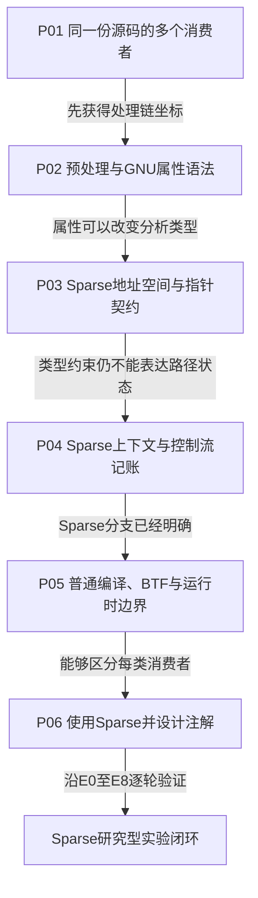

# 第1章\_Linux\_内核编译器与静态分析注解专题大纲

## 1.1\_专题定位

Linux 内核源码中的 `__user`、`__rcu`、`__must_hold()`、`__force` 和 `BTF_TYPE_TAG()` 看起来都像 C 语法的一部分，但它们并不由同一个参与者以同一种方式消费。本专题从一段源码的完整处理链出发，区分预处理器、GCC/Clang、Sparse、编译器插件和 BTF 工具各自看到的记号、维护的状态以及产生的结果。

本专题不重复 [GNU C 扩展](../gnu_extensions/C_language_extension.md) 中的内联汇编、布局属性和通用宏技巧，也不重复 [RCU 类型语义](../../../linux/synchronization_and_asynchrony/synchronization/rcu/P23_RCU_类型语义_Sparse与Lockdep.md) 与 [Lockdep 专题](../../../linux/synchronization_and_asynchrony/synchronization/lockdep/大纲.md#1.1_专题定位) 的子系统功能模型。这里建立的是可被这些专题共同复用的 **编译期注解心智模型和工具用法**。

## 1.2\_读者起点与最终结果

读者只需要掌握 C 指针、函数、宏和基本编译流程。最常见的错误模型是：

- 认为 Sparse 只是按关键字扫描源码；
- 认为 `__attribute__((...))` 中的所有属性都由 GCC 执行；
- 认为 `address_space` 必然对应硬件 MMU 地址空间；
- 认为 `__acquire()` 会真正取得锁，或者等价于 acquire 内存序；
- 认为普通构建中宏变为空，就说明这些契约可以忽略；
- 认为一次 Sparse 无告警足以证明运行时并发、对象生命期和路径覆盖都正确。

完成专题后，读者应能把任意注解宏还原为以下链条：

```text
原始记号
  → 预处理选择与宏展开
  → 某个消费者实际解析的类型、属性或表达式
  → 分析器状态、编译元数据或目标代码
  → 能证明的结论与仍未覆盖的边界
```

## 1.3\_阅读依赖图



这条顺序按 **认知依赖** 而不是按工具名称排列。P05 先解释普通构建、BTF 和 `make C=1/C=2` 分别改变哪一层，P06 才把这些结论组织成可执行流程；如果把安装命令或 Kbuild 实验提前到 P03、P04 以前，读者虽然能够复制命令，却还无法区分类型诊断、路径账本、构建覆盖范围和运行时状态。反过来，P05 只保留构建变量的语义与观察边界，完整的环境准备、单变量实验和故障修复统一由 P06 与实验文档承担，避免两章各维护一套操作教程。

默认学习路径是 **P01～P06 → 研究型实验**。需要核对 Linux 6.12 具体宏体时，可在读完 P05 后进入[版本化源码总阅读入口](../../../../research/source_reading/compiler_annotations/navigation/P01_Linux_6.12_编译器与Sparse注解源码导读.md#1.1_基线与阅读任务)，核对完实现分支再回到 P06；这条支线提供版本证据，不取代跨版本稳定的正文主线。

## 1.4\_章节问题链

1. [同一份源码怎样面对多个消费者](P01_同一份源码怎样面对多个消费者.md)
   - 前置：知道 C 文件需要编译。
   - 本章问题：为什么源码中的一个宏不能只按“最终会不会生成指令”理解？
   - 建立：预处理器、Sparse、编译器、插件/BTF 与运行时的分层图。
   - 留下：每种奇怪语法究竟怎样与声明、类型或表达式绑定？
2. [预处理器、GNU 属性与表达式扩展](P02_预处理器_GNU属性与表达式扩展.md)
   - 前置：已经区分源码消费者。
   - 本章问题：`#ifdef`、`__attribute__`、`typeof`、语句表达式和可变参数宏分别改变哪一层？
   - 建立：从原始文本到解析器输入的机械展开方法。
   - 留下：Sparse 怎样利用相同语法建立比普通 C 更严格的指针类型？
3. [Sparse 地址空间与指针类型契约](P03_Sparse地址空间与指针类型契约.md)
   - 前置：能够手工展开宏。
   - 本章问题：机器表示相同的指针，为什么可以在分析器中成为不能混用的类型？
   - 建立：`address_space`、`noderef`、类型桥接函数以及受控逃生口。
   - 留下：只有类型仍无法表达“当前路径是否持有某项上下文”。
4. [Sparse 上下文与控制流记账](P04_Sparse上下文与控制流记账.md)
   - 前置：理解类型限定与控制流是两个维度。
   - 本章问题：函数进入、退出和 trylock 分支怎样形成一套静态账本？
   - 建立：`context()` 契约、`__context__()` 路径事件和条件取得边界。
   - 留下：正常 GCC/Clang 构建为什么还保留部分标签，又为什么不会执行 Sparse 账本？
5. [普通编译、BTF 与运行时边界](P05_普通编译_BTF与运行时边界.md)
   - 前置：已经理解 Sparse 分支的语义。
   - 本章问题：`btf_type_tag` 怎样在不改变对象布局和 ABI 的前提下，把内核语义从 C 类型传到 DWARF/BTF，又为什么不能替代 Sparse 或运行时协议？
   - 建立：type tag 类型链、DWARF→`pahole`→BTF 生成链、普通编译能力门槛、下游消费者语义和证明边界。
   - 留下：开发者怎样确认工具真正运行、路径真正被检查并解释结果？
6. [在 Linux 内核中使用 Sparse 与设计注解](P06_在Linux内核中使用Sparse与设计注解.md)
   - 前置：能够判断每个记号的消费者和状态副作用。
   - 本章问题：怎样把前五章的语义结论变成一条从环境确认、单变量反例、消费者对照、自动断言到真实 Kbuild 的可复核研究流程？
   - 建立：E0～E8 实验地图、预处理与无告警基线、地址域和 context 的 A/B 实验、`make C=1/C=2`、`M=`、`CF`、诊断还原及红灯—绿灯注解设计法。
   - 输出：能够从头完成[地址空间与上下文记账实验](../../../../labs/foundations/c_language/P01_Sparse地址空间与上下文记账/README.md#1.1_实验目标)，证明目标翻译单元确实进入 Sparse，并明确静态无告警的证明边界。

## 1.5\_版本化源码与实验入口

- 总阅读入口：[Linux 6.12 编译器与 Sparse 注解源码导读](../../../../research/source_reading/compiler_annotations/navigation/P01_Linux_6.12_编译器与Sparse注解源码导读.md#1.1_基线与阅读任务)。
- 模块概念导读：[Linux 6.12 compiler types 注解模块概念导读](../../../../research/source_reading/compiler_annotations/navigation/P02_Linux_6.12_compiler_types注解模块概念导读.md#2.1_模块问题与实现所有权)。
- 唯一实现讲解：[Linux 6.12 compiler types 注解宏源码实现](../../../../research/source_reading/compiler_annotations/source_explanations/P01_Linux_6.12_compiler_types注解宏源码实现.md#1.1_关联入口与实现边界)。
- 独立实验：[Sparse 地址空间与上下文记账](../../../../labs/foundations/c_language/P01_Sparse地址空间与上下文记账/README.md#1.1_实验目标)。
- RCU 场景：[RCU 类型语义、Sparse 与 Lockdep](../../../linux/synchronization_and_asynchrony/synchronization/rcu/P23_RCU_类型语义_Sparse与Lockdep.md#23.5_Sparse具体检查什么)。
- 动态检查对照：[RCU 与子系统检查适配](../../../linux/synchronization_and_asynchrony/synchronization/lockdep/P07_RCU与子系统检查适配.md#7.1_没有实体mutex为何仍需要动态契约)。
