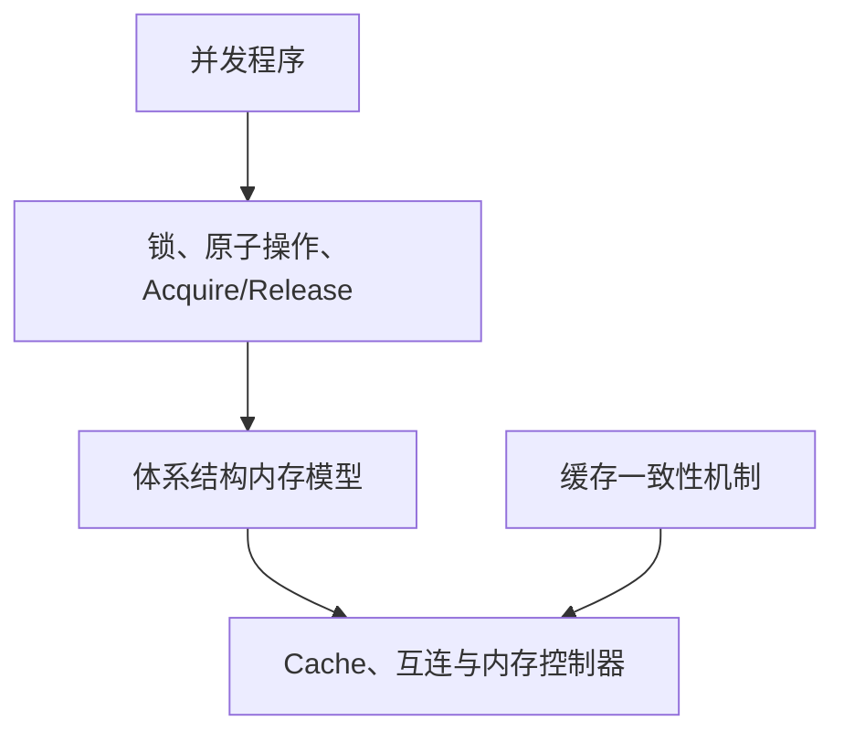
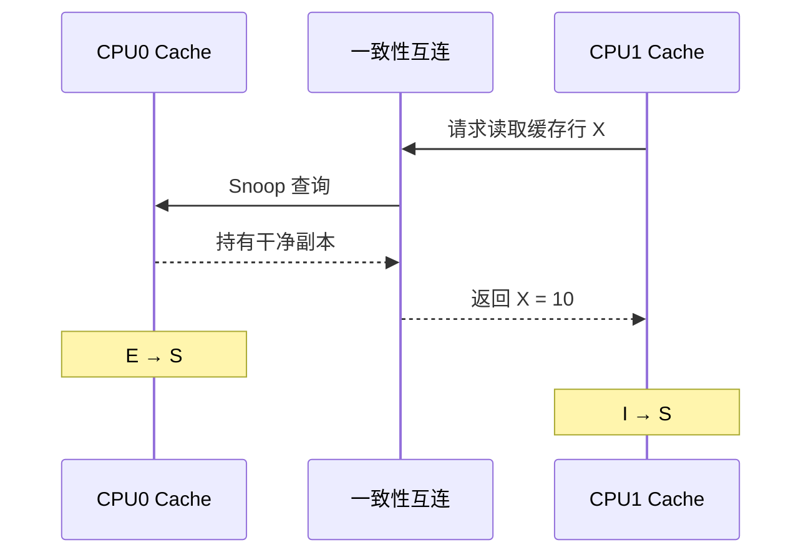
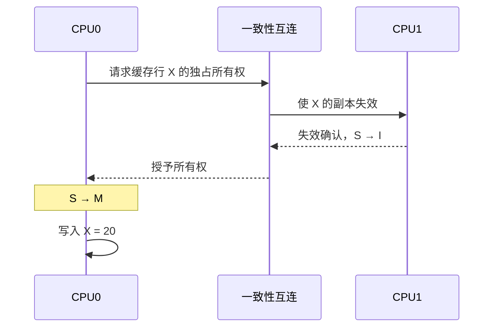
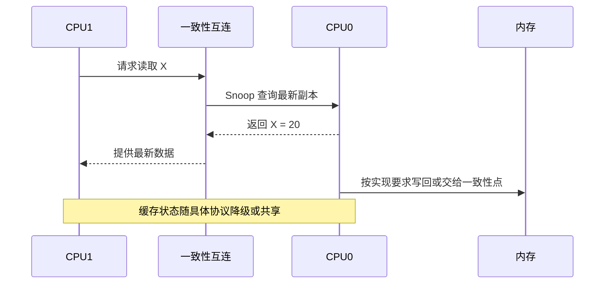
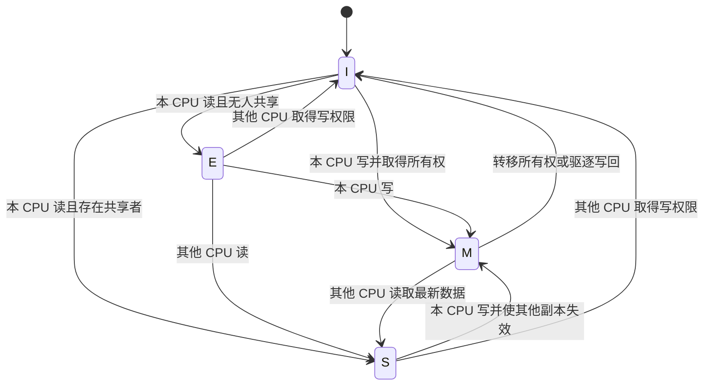
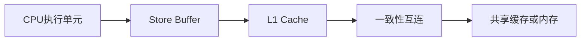
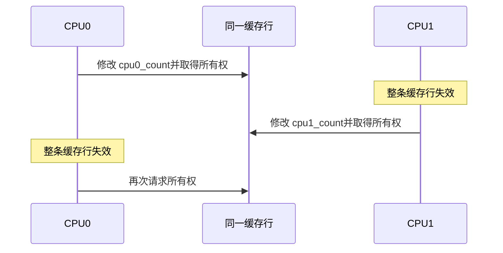
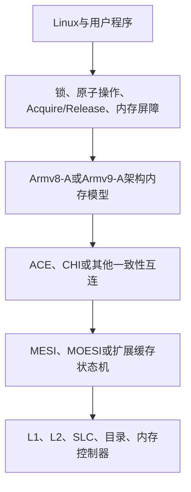
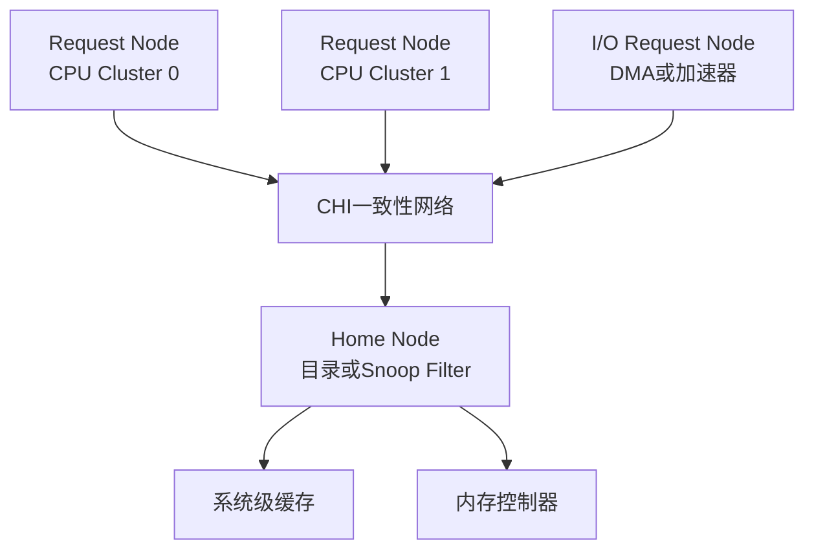

# 第1章\_MESI缓存一致性协议与Arm多核系统

MESI 是理解多核处理器缓存一致性的经典模型。它描述一条缓存行在多个处理器缓存中的所有权、共享关系和新旧状态，回答的是：当多个 CPU 缓存了同一物理地址的数据时，硬件怎样避免它们长期使用相互矛盾的副本。

学习 MESI 时必须先划清三个边界：

- MESI 管理的是缓存行，不是 C 语言变量；
- MESI 解决缓存一致性问题，不直接规定不同地址的访问顺序；
- Armv8-A 和 Armv9-A 定义架构行为，但不强制具体处理器只能实现经典 MESI。

## 1.1\_概念边界与问题背景

### 1.1.1\_先区分一致性与内存序

“缓存一致性”和“内存一致性模型”经常被混用，但二者解决的问题不同。

| 概念 | 主要问题 | 典型机制 |
| --- | --- | --- |
| 缓存一致性（Cache Coherence） | 同一内存位置的多个缓存副本如何保持一致 | MESI、MOESI、目录协议、Snoop |
| 内存序（Memory Ordering） | 多个内存访问可以按什么顺序被其他 CPU 观察 | Acquire/Release、DMB、`smp_mb()` |
| 软件同步 | 程序如何建立互斥、发布与消费关系 | 锁、原子操作、RCU、内存屏障 |

可以把它们的关系理解为：



缓存一致性保证针对同一缓存行的写入能够传播并使旧副本失效；内存序则约束多个访问之间的可观察顺序。前者成立，并不意味着后者自动满足程序需要。

### 1.1.2\_为什么多核缓存需要一致性协议

假设内存中的 `X` 初始为 `10`，CPU0 和 CPU1 都读取了它：

```text
CPU0 Cache：X = 10
CPU1 Cache：X = 10
内存：       X = 10
```

如果 CPU0 把 `X` 改成 `20`，写回缓存（Write-back Cache）通常不会立即把新值写入主存：

```text
CPU0 Cache：X = 20
CPU1 Cache：X = 10
内存：       X = 10
```

此时硬件必须知道：

- 哪个副本包含最新数据；
- 哪些副本仍然可以读取；
- 哪个 CPU 拥有写权限；
- 其他 CPU 再次访问时应从哪里取得最新数据。

MESI 用缓存行状态和一致性事务表达这些信息。它的目标不是让主存时刻保持最新，而是让一致性系统始终能够定位最新副本，并阻止 CPU 使用已经失效的旧副本。

### 1.1.3\_一致性的粒度是缓存行

MESI 管理的基本单位通常是 Cache Line，而不是单个变量。很多处理器使用 64 字节缓存行，但具体大小由实现决定。

```c
struct shared_data {
    int ready;
    int value;
};
```

即使 CPU 只修改 `ready`，硬件转移所有权或使副本失效时，处理的也是包含 `ready` 和 `value` 的整条缓存行。这一事实既解释了缓存一致性的工作方式，也解释了后文的伪共享问题。

## 1.2\_MESI状态与一致性事务

### 1.2.1\_MESI的四种稳定状态

MESI 由四种状态的英文首字母组成：Modified、Exclusive、Shared 和 Invalid。

| 状态 | 含义 | 可读取 | 可直接写入 | 其他缓存可有有效副本 | 主存副本 |
| --- | --- | ---: | ---: | ---: | --- |
| M（Modified） | 独占且已修改 | 是 | 是 | 否 | 可能已经过期 |
| E（Exclusive） | 独占但未修改 | 是 | 是 | 否 | 与缓存一致 |
| S（Shared） | 多个缓存可共享 | 是 | 否 | 是 | 经典 MESI 中与缓存一致 |
| I（Invalid） | 当前副本无效 | 否 | 否 | 不限制 | 对本缓存无意义 |

#### (1)\_Modified

`M` 表示当前缓存拥有唯一有效且已经修改的副本。最新数据位于该缓存中，主存可能仍是旧值。缓存行被驱逐或响应其他 CPU 的一致性请求时，脏数据必须被写回或转交到系统认可的一致性位置。

```text
CPU0：M，X = 20
CPU1：I
内存：   X = 10
```

#### (2)\_Exclusive

`E` 表示当前缓存拥有唯一有效副本，而且数据尚未被修改。由于其他缓存没有有效副本，本 CPU 第一次写入时通常可以在本地完成 `E → M`，不必先广播失效请求。

```text
CPU0：E，X = 10
CPU1：I
内存：   X = 10
```

#### (3)\_Shared

`S` 表示多个缓存可以持有相同的干净副本。CPU 可以读取它，但要写入之前必须先取得独占所有权，并使其他缓存中的副本失效。

```text
CPU0：S，X = 10
CPU1：S，X = 10
内存：   X = 10
```

#### (4)\_Invalid

`I` 表示缓存行在逻辑上无效。缓存 SRAM 中可能仍残留旧比特，但处理器不能把它们作为有效数据返回；下一次访问必须重新发起请求。

```text
CPU0：M，X = 20
CPU1：I，X = 10  ← 物理内容可能仍在，但已经不可使用
```

### 1.2.2\_一次完整的状态转换

下面用两个 CPU 对同一缓存行的读写说明 MESI 的核心过程。图中的状态是教学用的稳定状态，实际微架构还会加入等待数据、等待失效确认等瞬态状态。

#### (1)\_CPU0首次读取

初始时两个缓存都没有有效副本：

```text
CPU0：I
CPU1：I
内存：X = 10
```

CPU0 读取 `X` 并发生 Cache Miss。如果一致性系统确认没有其他有效副本，CPU0 可以获得 `E`；有些实现也可能保守地授予共享状态，因此不能把“首次读取必然得到 E”当作软件可依赖的规则。

```text
CPU0：E，X = 10
CPU1：I
内存：   X = 10
```

#### (2)\_CPU1随后读取

CPU1 发起共享读请求后，CPU0 的独占副本变为共享副本：

```text
CPU0：E → S
CPU1：I → S
```



#### (3)\_CPU0取得写权限

CPU0 不能直接修改 `S` 状态的缓存行。它必须发起升级或所有权请求，等待其他共享副本失效后再写入：



结果是：

```text
CPU0：M，X = 20
CPU1：I
内存：   X = 10
```

#### (4)\_CPU1再次读取

CPU1 再次读取时不能使用本地无效副本。由于最新数据位于 CPU0 的 `M` 缓存行中，一致性系统必须从拥有者或一致性点取得 `20`，而不能直接返回主存中的旧值 `10`。



### 1.2.3\_简化状态机与一致性事务



一致性请求在不同协议中名称并不完全相同，但可以抽象为两类：

- 共享读：只请求可读副本，允许其他 CPU 继续持有副本；
- 所有权请求：请求可写的唯一副本，同时使其他副本失效。

常见资料可能把后一类操作称为 Read For Ownership、Read Unique 或 Read Exclusive。这些名称来自不同总线或互连语境，不应机械地当成同一协议中的固定命令。

真实硬件还存在 `IS`、`SM`、`MI` 等瞬态状态，用于表示请求已发出但数据、权限或确认尚未全部到达。MESI 的四个字母主要描述便于理解的稳定状态，并不是完整的微架构状态机。

## 1.3\_内存序与性能影响

### 1.3.1\_MESI不等于内存屏障

考虑经典的消息传递：

```c
/* CPU0 */
data = 42;
ready = 1;

/* CPU1 */
if (ready == 1)
    value = data;
```

缓存一致性可以分别维护 `data` 和 `ready` 所在缓存行的新旧状态，却不必保证 CPU1 按源代码顺序观察到这两个地址的写入。Store Buffer、乱序执行和互连中的独立事务都可能影响观察顺序。

Linux 内核中可以用 Release/Acquire 建立发布与消费关系：

```c
/* CPU0：先初始化数据，再发布 ready。 */
data = 42;
smp_store_release(&ready, 1);

/* CPU1：看到 ready 后，才能读取已发布的数据。 */
if (smp_load_acquire(&ready))
    value = data;
```

这里的职责分工是：

- MESI 一类机制保证同一缓存行不会长期存在相互矛盾的有效副本；
- Arm 内存模型规定 Load/Store 可以怎样重排和被观察；
- Acquire/Release 或内存屏障为程序建立所需的先后关系。

### 1.3.2\_StoreBuffer为何影响可见性

处理器通常不会让执行流水线一直等待缓存行所有权和一致性事务完成，而是先把写入放入 Store Buffer：



因此，“写指令已经执行”不等于“其他 CPU 已经能够观察到该写入”。MESI 管理缓存行状态和所有权，内存屏障则约束写缓冲、缓存访问和其他内存操作之间的顺序。

### 1.3.3\_伪共享与缓存行抖动

两个线程即使修改不同变量，只要变量位于同一缓存行，也会竞争整条缓存行的写权限：

```c
struct counters {
    int cpu0_count;
    int cpu1_count;
};
```

```text
| cpu0_count | cpu1_count | 其余数据…… |
|<------------- 同一 Cache Line ------------->|
```

CPU0 写入后，CPU1 的整条缓存行副本失效；CPU1 随后写入时又会反向夺取所有权。缓存行在两个 CPU 之间反复迁移，这就是 False Sharing（伪共享），其外在表现也常被称为 Cache Line Bouncing。



常见优化方法包括：

- 把不同 CPU 高频写入的数据分散到不同缓存行；
- 使用 per-CPU 数据减少共享写热点；
- 避免多个核反复写入同一全局计数器；
- 只在测量证明有必要时增加缓存行对齐或填充。

Linux 内核提供 `____cacheline_aligned`、`____cacheline_aligned_in_smp` 等对齐标记，但手工填充不能硬编码假设所有平台的缓存行都是 64 字节。

## 1.4\_Arm多核系统中的实现关系

### 1.4.1\_Armv8与Armv9没有规定必须使用MESI

Armv8-A 和 Armv9-A 是 A-profile 体系结构版本，定义指令集、异常模型、内存模型以及软件可观察的行为。具体 CPU 或 SoC 可以使用 MESI、MOESI、目录式协议或厂商扩展状态机，只要最终满足体系结构要求。

因此，下面的等式并不成立：

```text
Armv8 = MESI
Armv9 = MOESI
```

更准确的层次关系是：



这张图用于区分抽象层次，并不表示每个具体系统都严格按同一方向逐层实现。

### 1.4.2\_ACE与CHI负责传递一致性事务

Arm SoC 常通过一致性互连在 CPU Cluster、系统级缓存和其他主设备之间交换请求、响应、Snoop 与数据。

#### (1)\_ACE

AMBA ACE 是 AXI 的一致性扩展，可让具有缓存的主设备参与硬件一致性。ACE-Lite 面向不保存完整一致性缓存状态、但需要发起一致性访问的 I/O 主设备。

ACE 使用的状态语义比经典四状态 MESI 更丰富，例如 UniqueClean、UniqueDirty、SharedClean 和 SharedDirty。它们可以借助 MESI/MOESI 理解，但不应与 MESI 四个字母逐项等同。

#### (2)\_CHI

AMBA CHI 面向规模更大的多核和异构系统，把 Request、Response、Snoop 与 Data 等通道分离，并通过 Home Node、目录或 Snoop Filter 管理缓存行的位置和所有权。



目录记录某条缓存行可能位于哪些节点，使互连能够定向发送 Snoop，而不必无条件广播给所有 CPU。MESI/MOESI 描述“缓存行处于什么状态”，ACE/CHI 则更侧重“请求、失效、数据和所有权怎样在系统中传递”。

### 1.4.3\_CPU一致性与DMA一致性的边界

CPU 集群内部保持一致，并不代表所有 DMA 设备都会自动参与同一个一致性域。设备是否具有硬件一致性能力，取决于 SoC 互连、IOMMU、设备端口和平台配置。

Linux 驱动不能仅凭“CPU 使用 MESI”就跳过 DMA API。驱动仍应使用 `dma_alloc_coherent()`、`dma_map_*()`、`dma_sync_*()` 等接口表达设备访问方向和所有权转换，由体系结构代码处理一致或非一致平台之间的差异。

### 1.4.4\_扩展协议为何存在

经典 MESI 便于教学，但现代处理器通常需要更丰富的状态和事务：

- MOESI 增加 Owned，允许某个缓存持有脏数据并与其他缓存共享；
- MESIF 增加 Forward，指定共享副本中的响应者；
- 目录协议记录缓存行持有者，降低大规模系统中的广播成本；
- 实际微架构还会加入大量瞬态状态处理并发事务。

这些扩展没有改变核心问题：硬件仍需追踪最新数据、读共享者和写所有者，并在权限转移时正确处理失效与数据传递。

## 1.5\_总结与参考资料

### 1.5.1\_核心结论

MESI 可以压缩成两组判断：

```text
数据是否有效、是否最新？
当前 CPU 是否拥有独占写权限？
```

四种状态可以这样记忆：

```text
M：只有我持有最新的脏数据。
E：只有我持有，数据尚未修改。
S：多个缓存共享，写前必须先取得所有权。
I：本地副本无效，不能继续使用。
```

最后应牢牢记住三个层次：

1. MESI/MOESI 管理缓存行副本和所有权；
2. ACE/CHI 等互连负责传输一致性事务；
3. Arm 内存模型与 Linux 同步原语负责建立软件需要的访问顺序。

只有把三者分开，才能正确分析锁竞争、缓存行抖动、RCU、内存屏障以及 DMA 一致性问题。

### 1.5.2\_参考资料

- [Arm：Memory ordering](https://developer.arm.com/documentation/102336/latest/)
- [Arm：AMBA AXI and ACE Protocol Specification](https://developer.arm.com/documentation/ihi0022/latest/)
- [Arm：Learn the architecture - Introducing AMBA CHI](https://developer.arm.com/documentation/102407/latest/)
- [Linux 内核：Memory Barriers](https://docs.kernel.org/core-api/wrappers/memory-barriers.html)
- [Linux 内核：Dynamic DMA mapping Guide](https://docs.kernel.org/core-api/dma-api-howto.html)
