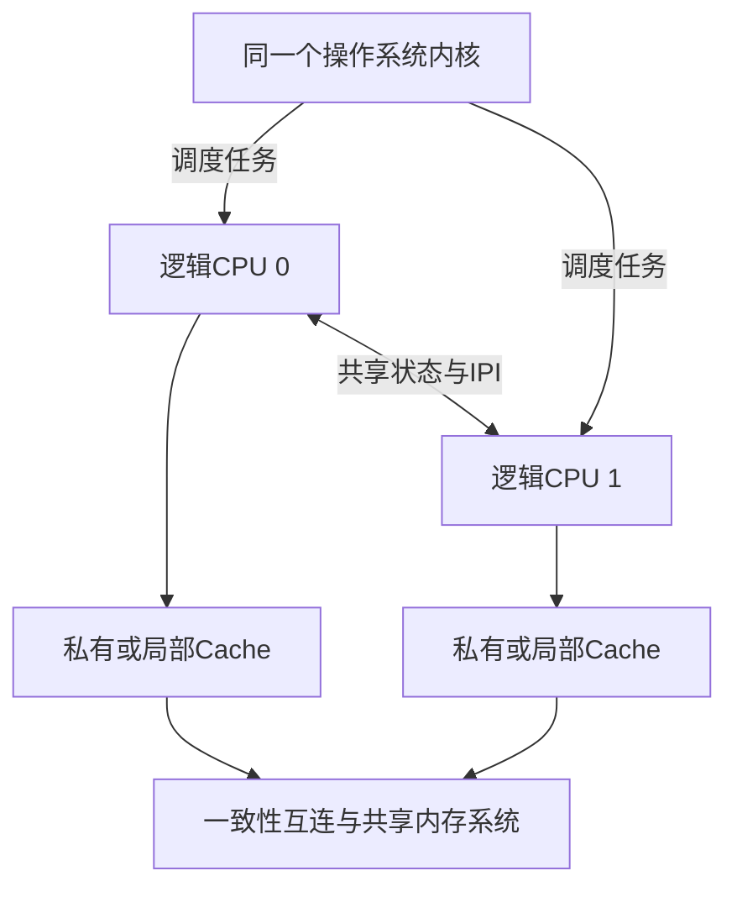
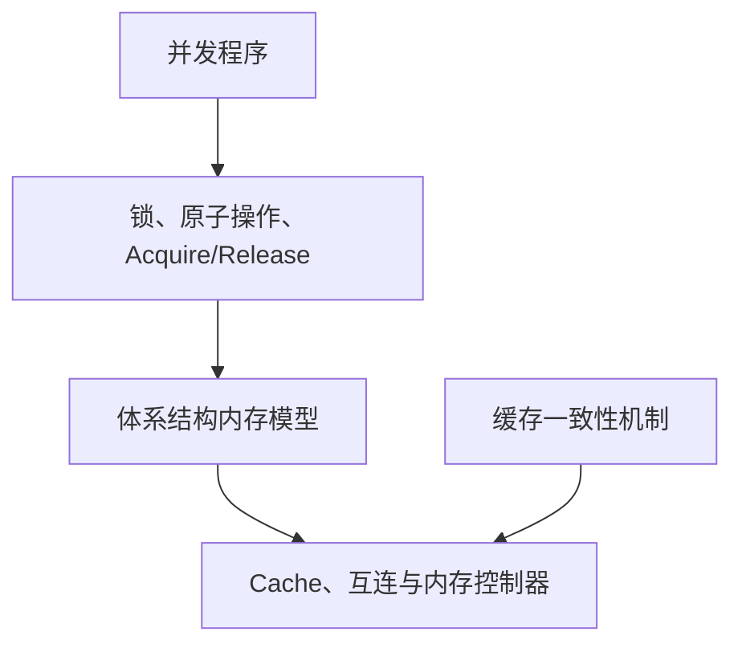

# 第1章\_缓存一致性问题与缓存行

RCU、spinlock、SMP 内存屏障和中断亲和性都会反复出现 CPU0、CPU1 与“另一个 CPU”，但这些名字只有放回多处理器系统后才有意义。本章先建立 SMP 的参与者与共享资源坐标，再从“多个 CPU 可以并行访问同一内存”推出缓存一致性问题，最后进入缓存行和 MESI。

## 1.1\_SMP是什么以及对称体现在哪里

本节先固定 SMP 的正式名称和基本参与者，再依次拆开硬件拓扑、Linux 构建能力以及 UP/AMP/NUMA 边界。完成这些区分后，后文的“另一个 CPU”“跨 CPU”和“共享内存”才具有可复用的准确含义。

### 1.1.1\_SMP的中英文全称与系统模型

SMP 的英文全称是 **Symmetric Multiprocessing**，中文通常译为 **对称多处理**，也可按上下文称为“对称多处理系统”或“对称多处理架构”。它描述的不是某一种 CPU 型号，而是一种系统组织方式：两个或更多可执行 CPU 由同一个操作系统实例管理，可以并发执行内核和用户任务，并通过共同的主存地址空间交换状态。

这里的 **对称** 首先表示操作系统角色和软件入口基本对等：CPU 不被永久划分成“只能运行内核的主处理器”和“只能接受固定工作的从处理器”，调度器可以把普通任务安排到任一合适的 online CPU，CPU 也可以通过共享内存、IPI 和其他跨 CPU 原语协作。



“对称”不保证物理距离、缓存容量、运行频率和性能完全相同。NUMA 系统中 CPU 到不同内存节点的距离可以不同；Arm big.LITTLE 等异构多核的 CPU 容量也可以不同。只要它们仍由同一个 Linux 调度与内核实例作为普通 CPU 管理，就不能仅凭性能不对称把系统改称为 AMP。

### 1.1.2\_SMP不等于多核也不排斥NUMA

下面这些名称位于不同分类轴，可以同时成立：

| 名称 | 它描述什么 | 与 SMP 的关系 |
| --- | --- | --- |
| 多核（multi-core） | 一个物理封装或处理器内含多个核心 | 多核经常提供多个 SMP CPU，但 SMP 不限定核心位于同一封装 |
| SMT | 一个物理核心暴露多个硬件线程 | 每个硬件线程可表现为 Linux 逻辑 CPU，仍共享同一 SMP 内核 |
| 多 Socket | 系统安装多个处理器封装 | 可以组成 SMP，也可能进一步形成 NUMA 拓扑 |
| UMA / NUMA | CPU 访问不同内存位置的距离是否均匀 | NUMA 不否定共享地址空间；ccNUMA 通常仍运行 SMP 内核 |
| 缓存一致性 | 多个缓存副本怎样保持同一地址的一致视图 | 是共享内存 SMP 的硬件基础之一，不是 SMP 这个缩写本身 |

因此，“四核”只说明核心数量，不自动说明操作系统是否以 SMP 方式管理；“SMP”也不等于“所有 CPU 到所有内存都等距”。Linux 文档中的 CPU 通常是 **逻辑 CPU**：它可能对应一个核心、一个 SMT 硬件线程，或者不同 Socket 中的一个可调度执行单元。

### 1.1.3\_Linux中的CONFIG\_SMP表示构建能力

在 Linux 语境中，`CONFIG_SMP=y` 表示内核构建包含同时管理多个逻辑 CPU 所需的调度、CPU mask、跨 CPU 调用、IPI、per-CPU 状态以及相应同步分支。它说明这份内核 **具备 SMP 能力**，不等于启动后此刻一定有两个以上 CPU online；SMP 内核仍可通过启动参数、热插拔或平台限制只保留一个 online CPU。

`CONFIG_SMP=n` 表示 UP（Uniprocessor，单处理器）构建，不再需要防范远端 CPU 与当前 CPU 真正并行执行。但它没有删除同一 CPU 上的抢占、中断、softirq、NMI、设备和 DMA 参与者，所以不能从“UP”推出“所有锁、屏障与生命周期协议都可以删除”。

Linux 的 `CONFIG_SMP` 也不自动回答下面的问题：

- 当前有多少 possible、present、online 或 active CPU；
- CPU 之间是 UMA 还是 NUMA，缓存层级和性能是否相同；
- 内核是否启用抢占、PREEMPT_RT 或 `CONFIG_PREEMPT_RCU`；
- 某段共享内存代码需要哪种锁、屏障或对象生命周期协议。

这些问题分别由运行时 CPU 状态、硬件拓扑和其他 Kconfig/子系统契约回答。Linux 提供的跨 CPU 调用与 online CPU 选择可从 [SMP primitives](https://docs.kernel.org/core-api/SMP.html) 继续核对；SMP 内核启动时也可以限制 bring-up 的 CPU 数量，这说明“构建能力”和“当前 online 集合”是两件事。

### 1.1.4\_SMP与UP\_AMP的选择边界

| 系统模型 | 执行角色 | 内存与软件组织 | 不能据此推出 |
| --- | --- | --- | --- |
| UP | 一份内核只并行运行在一个 CPU 上 | 仍可能有抢占、中断和设备并发 | 不等于无需任何同步 |
| SMP | 多个 CPU 作为同一内核中的普通调度与协作参与者 | 通常共享地址空间，通过一致性、屏障、锁和 IPI 协作 | 不等于延迟均匀、强内存序或性能相同 |
| AMP（Asymmetric Multiprocessing，非对称多处理） | 处理器被赋予固定或显著不同的软件角色 | 可能分别运行不同 OS/固件，并通过 mailbox、共享缓冲区或专用协议通信 | 不等于只要 CPU 性能不同就是 AMP |
| ccNUMA | 多节点共享地址空间并保持缓存一致，但访问距离不均匀 | 可以继续运行同一 SMP 内核 | 不等于“非对称多处理” |

从这个公共坐标进入各 Linux 子系统时，问题会分别变成：

- [Linux SMP 屏障与顺序域](../../../linux/synchronization_and_asynchrony/synchronization/memory_ordering/P03_Linux_SMP屏障与顺序域.md#3.3_SMP_屏障给普通内存增加方向)：多个 CPU 怎样建立普通内存观察顺序；
- [RCU 分类坐标与内核配置](../../../linux/synchronization_and_asynchrony/synchronization/rcu/P04_RCU_分类坐标与内核配置.md#4.3_公共接口为什么会隐藏配置)：`CONFIG_SMP` 为什么使普通 RCU 选择 Tree RCU；
- [SMP 与中断亲和性、IPI](../../../linux/synchronization_and_asynchrony/asynchrony/interrupts/P10_SMP_与中断亲和性_IPI_机制.md#10.2_SMP_场景下中断要解决的核心问题)：中断怎样选择目标 CPU，CPU 怎样主动通知另一个 CPU；
- [自旋锁](../../../linux/synchronization_and_asynchrony/synchronization/locks/P01_自旋锁.md#1.1_自旋锁解决什么问题)：多个 CPU 怎样围绕同一锁字建立互斥。

## 1.2\_缓存一致性的概念边界与问题背景

MESI 是理解多核处理器缓存一致性的经典模型。它描述一条缓存行在多个处理器缓存中的所有权、共享关系和新旧状态，回答的是：当 SMP 中的多个 CPU 缓存了同一物理地址的数据时，硬件怎样避免它们长期使用相互矛盾的副本。

学习 MESI 时必须先划清三个边界：

- MESI 管理的是缓存行，不是 C 语言变量；
- MESI 解决缓存一致性问题，不直接规定不同地址的访问顺序；
- Armv8-A 和 Armv9-A 定义架构行为，但不强制具体处理器只能实现经典 MESI。

### 1.2.1\_先区分一致性与内存序

“缓存一致性”和“内存一致性模型”经常被混用，但二者解决的问题不同。

| 概念 | 主要问题 | 典型机制 |
| --- | --- | --- |
| 缓存一致性（Cache Coherence） | 同一内存位置的多个缓存副本如何保持一致 | MESI、MOESI、目录协议、Snoop |
| 内存序（Memory Ordering） | 多个内存访问可以按什么顺序被其他 CPU 观察 | Acquire/Release、DMB、`smp_mb()` |
| 软件同步 | 程序如何建立互斥、发布与消费关系 | 锁、原子操作、RCU、内存屏障 |

可以把它们的关系理解为：



缓存一致性保证针对同一缓存行的写入能够传播并使旧副本失效；内存序则约束多个访问之间的可观察顺序。前者成立，并不意味着后者自动满足程序需要。

### 1.2.2\_为什么多核缓存需要一致性协议

假设内存中的 `X` 初始为 `10`，CPU0 和 CPU1 都读取了它：

```text
CPU0 Cache：X = 10
CPU1 Cache：X = 10
内存：       X = 10
```

如果 CPU0 把 `X` 改成 `20`，写回缓存（Write-back Cache）通常不会立即把新值写入主存：

```text
CPU0 Cache：X = 20
CPU1 Cache：X = 10
内存：       X = 10
```

此时硬件必须知道：

- 哪个副本包含最新数据；
- 哪些副本仍然可以读取；
- 哪个 CPU 拥有写权限；
- 其他 CPU 再次访问时应从哪里取得最新数据。

MESI 用缓存行状态和一致性事务表达这些信息。它的目标不是让主存时刻保持最新，而是让一致性系统始终能够定位最新副本，并阻止 CPU 使用已经失效的旧副本。

### 1.2.3\_一致性的粒度是缓存行

MESI 管理的基本单位通常是 Cache Line，而不是单个变量。很多处理器使用 64 字节缓存行，但具体大小由实现决定。

```c
struct shared_data {
    int ready;
    int value;
};
```

即使 CPU 只修改 `ready`，硬件转移所有权或使副本失效时，处理的也是包含 `ready` 和 `value` 的整条缓存行。这一事实既解释了缓存一致性的工作方式，也解释了后文的伪共享问题。

下一篇：[MESI 状态机与一致性事务](P02_MESI_状态机与一致性事务.md)。
