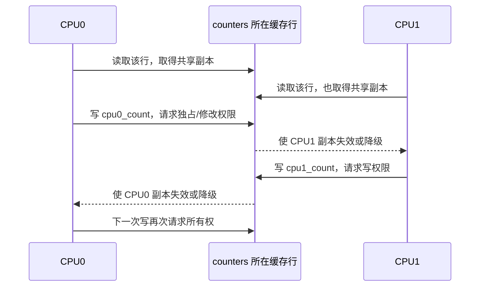

# 第3章\_缓存行所有权竞争与伪共享

## 3.1\_从变量竞争追到缓存行所有权

两个线程修改不同 C 变量，不代表硬件处理的是两个独立一致性对象。缓存一致性协议通常以 Cache Line 为粒度维护共享、失效和写权限：

```c
struct counters {
    unsigned long cpu0_count;
    unsigned long cpu1_count;
};
```

```text
| cpu0_count | cpu1_count | 其余字节…… |
|<----------- 同一条 Cache Line ----------->|
```

CPU0 只改 `cpu0_count`，也必须取得整条缓存行的可写所有权；CPU1 随后只改 `cpu1_count`，仍要让 CPU0 的该行副本失效或降级，再取得同一条行的所有权。软件字段互不重叠，硬件写权限却发生冲突，这就是 false sharing（伪共享）。

## 3.2\_真共享和伪共享的共同成本与不同原因

| 类型 | CPU 是否访问同一字段 | 缓存行是否相同 | 修复方向 |
| --- | --- | --- | --- |
| 真共享 | 是 | 是 | 减少全局更新、分片、批处理或改变算法 |
| 伪共享 | 否 | 是 | 调整布局、分离写热点、per-CPU 存储 |
| 只读共享 | 多 CPU 读同一字段 | 是 | 通常可共同持有共享副本，不反复争夺写权限 |

两类写共享都表现为缓存行所有权转移、失效流量和流水线等待；差别在于伪共享可以仅通过改变布局消除，而真共享反映的是算法确实要求多个 CPU 更新同一逻辑状态。

## 3.3\_一次所有权来回迁移的完整过程



可观察后果包括：

- Store 需要等待所有权；
- 一致性互连产生额外探测、失效和响应；
- 后续读可能因本地副本失效再次取数；
- Store Buffer 和未完成访存队列积压；
- 核数增加后吞吐量不再近似线性扩展。

这里不要求数据每次都写回 DRAM。最新数据可以直接由另一个缓存或共享缓存层提供；瓶颈是缓存行权限和最新副本的位置不断变化。

## 3.4\_全局原子计数为什么特别容易成为热点

```c
atomic_fetch_add(&global_readers, 1);
```

原子 RMW 比普通 Store 更明确地要求：读取旧值、计算新值、在竞争者之间形成不可分割更新。若每次操作都更新同一全局计数：

1. 所有 CPU 争夺同一缓存行；
2. 每个 RMW 必须基于前一次更新后的最新值；
3. 缓存行在逻辑上形成串行化点；
4. 高并发读路径即使访问不同业务对象，也被该计数器连接起来。

这解释了 per-CPU counter、分片计数、批量汇总以及 RCU 读侧局部状态的价值：它们不是让缓存一致性消失，而是把高频写分散到不同所有权域，只在低频阶段合并。

## 3.5\_为什么读共享和写共享的扩展性不同

多个 CPU 只读同一行时，可以各自在 Shared 状态持有副本，读取主要支付首次填充和容量/冲突 Miss 的成本。任何 CPU 开始写入后，都需要排除或更新其他可读副本，所有权才成为频繁通信资源。

因此“RCU reader 仍然会访问共享 cache”与“RCU reader 避免全局共享写”并不矛盾：前者可能有普通读 Miss，后者避免每次查找都触发写权限迁移。若读侧代码主动修改共享对象字段，写共享成本和字段级同步责任都会重新出现。

## 3.6\_布局优化必须先确认真正的写入者

常见布局策略：

- 把不同 CPU 高频写入的字段放到不同缓存行；
- 使用 per-CPU 数据，让每个 CPU 写自己的副本；
- 将高频写字段与大量只读字段分开；
- 对统计值做本地累加，低频批量合并；
- 将锁与它保护的热点数据按实际访问模式布局。

但填充并非免费：

- 增加对象尺寸和缓存容量压力；
- 可能让原本同读的字段分散到多行，增加读 Miss；
- 数组中每个元素对齐到整行会显著放大内存占用；
- 缓存行大小和共享层级因实现而异；
- 结构体布局变化会影响 ABI、DMA 描述符或设备格式。

所以应由测量证明存在所有权竞争，再按写入者边界调整，不应给所有结构体机械加 64 字节 padding。

## 3.7\_怎样从性能现象定位到缓存行

研究过程应保存：

1. 负载中哪些 CPU/线程执行写入；
2. 热点地址映射到哪个对象和字段；
3. 两个字段是否落在同一缓存行；
4. 所有权转移或 HITM/类似事件是否集中在该行；
5. 分离字段后吞吐量、延迟和一致性流量是否同步变化。

Linux 平台可以按架构和工具能力使用 `perf c2c`、相关 PMU 事件、`pahole`、BPF 或采样剖析。不同 CPU 的事件名称和可解释范围不同，必须记录处理器型号、内核版本和 perf 版本，不能把某款 x86 的事件直接套到 Cortex-A7。

最小 A/B 实验应保持业务工作量不变，只改变字段布局；若同时改变算法、锁和批处理，就无法归因收益来自消除伪共享还是其他因素。

## 3.8\_与\_Store\_Buffer\_和内存顺序的边界

Store Buffer 可以暂时吸收写入等待所有权的延迟，却不能取消最终的所有权竞争；内存屏障可以限制访问观察顺序，却不能让多个 CPU 同时拥有同一缓存行的写权限。

```text
缓存一致性：谁拥有最新缓存行和写权限
缓存行竞争：这些权限在参与者之间多频繁迁移
Store Buffer：等待迁移时写入暂存在哪里
内存顺序：暂存和传播允许产生哪些观察结果
```

Store Buffer 与乱序执行的权威说明见[体系结构内存顺序专题](../memory_ordering/大纲.md)。本章只维护缓存行粒度的所有权与性能问题。

## 3.9\_方案选择核对表

| 观察到的问题 | 先检查 | 可能方案 |
| --- | --- | --- |
| 多 CPU 更新同一计数 | 是否真共享、是否要求每次精确 | per-CPU、分片、批处理或降低精确度 |
| 不同字段写入仍互相拖慢 | 字段地址是否同一缓存行 | 分离布局或按写入者分组 |
| 加 padding 后读性能下降 | 只读字段是否被分散、对象是否膨胀 | 缩小对齐范围或调整冷热布局 |
| 只有一个 writer 仍很慢 | 是否是读 Miss、锁、NUMA 或内存带宽 | 不要误诊为伪共享 |
| RCU reader 扩展性差 | 是否在读侧写共享统计或引用数 | 改用本地统计、批量汇聚或重新界定生命期 |

## 3.10\_本章验收

1. 能从两个不同字段追到同一缓存行的写权限竞争。
2. 能区分真共享、伪共享和只读共享。
3. 能解释为什么全局原子计数在高核数下形成串行化点。
4. 能说明 per-CPU/分片转移了什么成本，以及汇总成本仍在哪里。
5. 能设计只改变布局的 A/B 实验，并承认 PMU 事件的平台边界。
6. 能区分缓存行所有权、Store Buffer 和内存顺序三个机制。

上一篇：[MESI 状态机与一致性事务](P02_MESI_状态机与一致性事务.md)。

下一篇：[Arm ACE、CHI 与一致性域](P04_ARM_ACE_CHI_与一致性域.md)。
