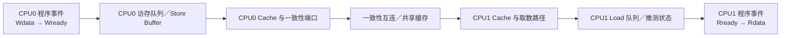
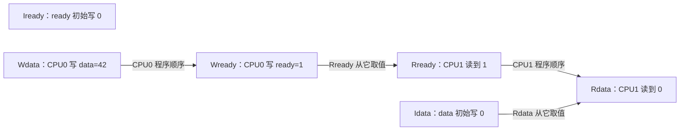

# 第1章\_为什么需要体系结构内存模型

## 1.1\_从一个看似不可能的结果开始

CPU0 先写数据、再写标志；CPU1 先读标志、再读数据：

```c
/* 初始值：data = 0，ready = 0。 */

/* CPU0：生产者。 */
data = 42;       /* Wdata */
ready = 1;       /* Wready */

/* CPU1：消费者。 */
r0 = ready;      /* Rready */
r1 = data;       /* Rdata */
```

人的第一直觉通常是：只要 `r0 == 1`，CPU1 就已经看到了 CPU0 的第二次写，因此更早的 `data = 42` 也应该可见，`r1` 必然为 `42`。这个推理偷偷加入了一个没有写在程序里的前提： **所有 CPU 必须按 CPU0 的程序顺序观察两个不同地址。**

真实系统可能允许 `r0 == 1 && r1 == 0`。造成它的具体路径可以是编译器移动访问、写缓冲让不同地址在不同时间传播、读取推测，或体系结构本来就不要求这个观察顺序。体系结构内存模型的第一项工作，就是公开规定哪些结果允许、哪些结果禁止，使软件不必猜某颗微架构内部的瞬时实现。

## 1.2\_顺序一致性是有用直觉而不是默认事实

最容易理解的模型是 Sequential Consistency（SC）：

1. 每颗 CPU 的操作保持本 CPU 程序顺序；
2. 所有 CPU 的操作可以交错，但仿佛放在一条全局总序中；
3. 每次读取取得这条总序中该地址最近一次写入的值。

在 SC 下，可以把两个 CPU 的操作排成：

```text
Wdata → Wready → Rready → Rdata
```

于是 Rdata 不可能再读取初始值。但若处理器要求每次写都等到所有相关缓存和互连事务完成后才继续，长延迟会直接卡住执行流水线。现代处理器通常使用写缓冲、未完成访存队列、推测和多条并行事务来隐藏延迟；这些优化迫使架构允许比 SC 更丰富的观察结果。

弱内存模型不是“处理器随便乱来”，而是 **架构只保留软件真正需要且显式声明的顺序，其余顺序允许实现自由优化。**

## 1.3\_先区分四种顺序

| 顺序 | 所属视角 | 示例 |
| --- | --- | --- |
| 程序顺序（program order） | 单个线程源码或模型事件 | CPU0 中 Wdata 写在 Wready 前 |
| 执行/发射顺序 | 某颗具体微架构内部 | 指令何时发射、推测、完成或退休 |
| 传播顺序 | 写入何时对不同观察者可见 | CPU1 先看到 Wready，CPU2 以后才看到 |
| 观察顺序 | 某个读取实际从哪个写入取值 | Rready 从 Wready 取到 1，Rdata 从初始写取到 0 |

软件正确性最终依赖的是体系结构承诺的 **可观察结果**，而不是某次反汇编中看见的指令排列，也不是厂商对流水线的非契约性示意图。

## 1.4\_一次跨\_CPU\_读取有哪些参与者



这张图不是宣称所有 CPU 都采用同一微架构，而是提醒分析必须覆盖：

- 写入离开执行单元后可能仍停在本地队列；
- 获得缓存行写权限和传播数值是需要时间的事务；
- 不同地址可能走不同缓存行和不同未完成事务；
- 读取可能在更早指令完全完成前发起；
- 编译器还可能在指令进入 CPU 之前改变访问次数和位置。

后续章节会逐层加入约束，不能用一句“CPU 乱序”把这些参与者压成黑盒。

## 1.5\_缓存一致性为什么仍然不够

缓存一致性主要回答同一内存位置：

- CPU0 和 CPU1 都缓存 `ready` 时，谁拥有最新副本；
- CPU0 写 `ready` 时，CPU1 的旧副本怎样失效；
- CPU1 再读 `ready` 时从哪里取得新值。

它并不自动规定 `data` 和 `ready` 两个地址之间的传播先后。完全可以同时满足：

```text
ready：CPU1 已经取得最新值 1
data： CPU1 此刻仍允许取得旧值 0
```

这不违反任何单地址一致性。缓存行状态和所有权的完整过程见[缓存一致性专题](../cache_coherence/大纲.md)；本专题继续解决跨地址观察顺序。

## 1.6\_先把执行写成事件图

对消息传递例子，先不谈屏障，只画事件：



错误结果之所以仍能闭合，是因为图中没有一条跨 CPU 顺序边强迫 Wdata 先于 Rdata。若发布端增加 release、取得端增加 acquire，并且 Rready 读到该发布值，就能把：

```text
Wdata → release 发布 → acquire 取得 → Rdata
```

连成体系结构必须尊重的顺序链。屏障不是“刷新缓存”的魔法，而是往事件图里增加禁止某些交错的边。

## 1.7\_为什么不能直接要求所有访问全序

更强顺序会减少实现自由度，典型代价来源包括：

1. 等待早先写入达到架构要求的可观察点；
2. 阻止后续 Load 提前发起或使用推测结果；
3. 限制多个缓存未命中并行重叠；
4. 在多层互连中等待传播或确认；
5. 让编译器放弃原本合法的调度、合并和寄存器复用。

代价不等于“每个屏障都清空所有缓存”，也不能用一个固定纳秒数概括。它取决于屏障方向、前后访问、缓存命中、共享者数量、体系结构和微架构。软件应只表达正确性所需的边，但这要求先准确写出要禁止的结果。

## 1.8\_另一个反例\_两个\_CPU\_都读到零

Store Buffering（SB）模式：

```c
/* 初始值：x = 0，y = 0。 */

/* CPU0 */              /* CPU1 */
x = 1;                  y = 1;
r0 = y;                 r1 = x;
```

若两颗 CPU 都先把自己的写放入本地 Store Buffer，再从尚未收到对方写入的缓存状态读取另一个地址，就可能得到：

```text
r0 == 0 && r1 == 0
```

两颗 CPU 都按自己的程序执行了“先写后读”，同址一致性最终也会让 x、y 都变成 1；反直觉结果来自 **写入完成执行与远端已经观察到之间存在时间窗口**。第三章将沿这个窗口逐步展开，不能把它简化成“CPU 把两条指令交换了”。

## 1.9\_内存模型给软件的三类答案

一套可用的体系结构内存模型至少要回答：

| 问题 | 需要的答案 |
| --- | --- |
| 单次事件是什么 | 哪些宽度/对齐的访问不可分割，哪些可能撕裂 |
| 无同步时允许什么 | 同址一致性、不同地址观察、传播和依赖的最低保证 |
| 怎样增加顺序 | 屏障、acquire/release、原子 RMW 或依赖关系禁止哪些结果 |

模型通常以“允许/禁止某类执行”给出契约，不保证某个允许结果一定能在有限压力测试中出现，也不承诺某颗 CPU 的内部结构与教学图完全相同。

## 1.10\_本章留下的问题

当前事件图仍默认 `Wdata`、`Rdata` 各自是不可分割的一次访问。下一章先检查这个最低前提：访问宽度、对齐和实现怎样决定读者会看到完整旧值、完整新值，还是半新半旧的混合值。

## 1.11\_本章验收

1. 能指出“看到 ready 就一定看到 data”暗含了哪条跨地址顺序。
2. 能区分程序顺序、内部执行、传播和观察顺序。
3. 能解释缓存一致性为什么不自动排序两个地址。
4. 能画出 MP 和 SB 的事件，并指出缺少哪条跨 CPU 边。
5. 能解释放松顺序解决了什么延迟问题，以及增加屏障为什么不是免费操作。

下一篇：[访问粒度、对齐与撕裂](P02_访问粒度_对齐与撕裂.md)。
