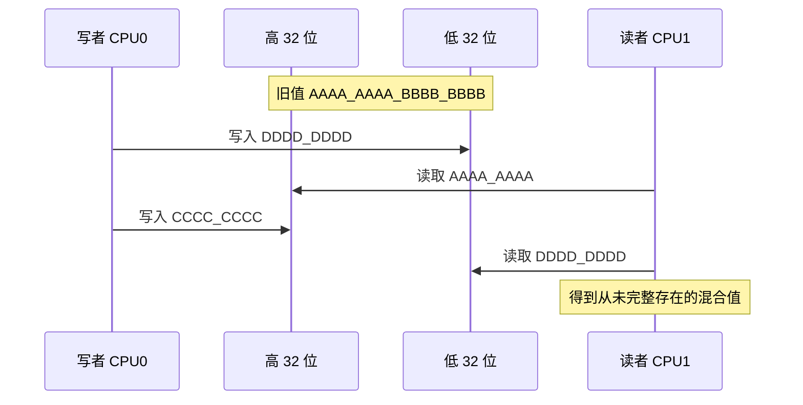

# 第2章\_访问粒度\_对齐与撕裂

## 2.1\_排序之前先确认事件能否保持完整

上一章把每个 Load/Store 画成一个事件，但源码中的一次赋值不必天然对应一个不可分割的硬件事务。若一个 64 位值在某个平台上被拆成两次 32 位访问，那么“这次读发生在那次写之前还是之后”已经不足以描述结果；读者还可能一半取自旧写、一半取自新写。

因此，并发分析的第一层不是屏障，而是：

```text
源码对象 → 编译器生成的访问宽度 → ISA 允许的单次访问 → 总线/缓存处理粒度
```

任何一层发生拆分，都必须核对体系结构是否仍给出不可分割保证。

## 2.2\_四种常被混称为原子的保证

| 保证 | 真正含义 | 不能推出 |
| --- | --- | --- |
| 不撕裂访问 | 读到完整旧值或完整新值 | `x++` 不丢更新 |
| 原子读—改—写 | 读取、计算、条件写回作为竞争协议的一步 | 与其他地址有序 |
| 多字段快照 | 一组字段来自同一逻辑版本 | 单字段指令不可分割即可实现 |
| 事务原子性 | 多次访问整体提交或回滚 | 普通 CPU 原子指令自动提供数据库事务 |

本章的“访问原子性”只指第一项。后面若出现 `atomic`、exclusive monitor、CAS 或锁，会明确写出它们承担的是哪一级保证。

## 2.3\_宽度怎样逼出拆分

假设执行单元、寄存器或内存数据通路的原生访问宽度为 32 位，而对象宽度为 64 位。实现可能生成：

```text
写者：先写低 32 位，再写高 32 位
读者：先读高 32 位，再读低 32 位
```



即使每次 32 位事务都完全符合缓存一致性，组合后的 64 位 C 对象仍然撕裂。缓存一致性不能把软件自行拆开的多个事件重新拼成一个事务。

## 2.4\_对齐为什么改变访问路径

自然对齐意味着对象地址是其访问宽度要求的整数倍。例如 4 字节对象通常期望地址可被 4 整除。对齐能让地址落在实现期望的边界内，避免：

- 一次访问跨越两个自然对齐字；
- 跨越缓存行或页边界；
- 使用只能处理对齐地址的指令时触发异常；
- 编译器或硬件为了兼容未对齐地址而拆成多次较小访问。

但“已自然对齐”仍不是跨所有体系结构的万能原子保证。还要核对对象宽度、指令类型、内存属性和目标架构。某些设备内存甚至禁止普通未对齐访问；普通可缓存内存的结论不能外推到 MMIO。

## 2.5\_packed\_结构体怎样改变编译器选择

```c
struct __attribute__((packed)) record {
    unsigned char tag;
    unsigned long long value;
};
```

`value` 位于偏移 1，编译器不能再假定它按 8 字节自然对齐。不同目标可能：

- 生成多条字节或半字访问再拼接；
- 使用体系结构支持的未对齐 Load/Store；
- 调用辅助函数；
- 在某些内存类型或配置下触发对齐异常。

这正是为什么源码层的“一次 `value` 读取”不能直接充当并发事件定义。配套[反汇编实验](../../../../labs/foundations/computer_architecture/memory_ordering/P01_访问宽度_对齐与ARM反汇编/README.md)会对 Cortex-A7 目标比较对齐 `u32`、对齐 `u64` 与 packed `u64` 的生成指令。

## 2.6\_地址跨界让问题更复杂

即使对象类型本身常被架构原子访问，如果地址跨越关键边界，仍可能失去保证。例如：

```text
缓存行 A | 对象前半部分
缓存行 B | 对象后半部分
```

硬件需要处理两条缓存行的权限、填充和异常条件。体系结构手册通常会分别规定自然对齐访问、未对齐访问和特定原子指令的约束；不能只根据“CPU 是 64 位”推导任意 64 位地址都不可分割。

页边界还会引入第二次地址翻译和可能的 fault。并发正确性代码应避免把关键同步字放在 packed 或可能跨界的位置，而不是依赖压力测试碰运气。

## 2.7\_不撕裂为什么仍然不够

### 2.7.1\_读改写仍会丢失更新

```c
/* 两颗 CPU 都可能先读到 10，再分别写回 11。 */
counter = counter + 1;
```

即使对 `counter` 的单次读、单次写都不撕裂，整个“读 → 加一 → 写回”仍由多个事件组成。两个执行者交错后会丢失一次更新；需要原子 RMW、锁或分区计数。

### 2.7.2\_两个完整字段仍可能来自不同版本

```c
struct range {
    void *base;
    size_t len;
};
```

`base` 和 `len` 各自完整，不代表 reader 取得的“新 base + 旧 len”构成合法快照。多字段不变量要靠锁、版本检查或不可变对象整体替换。

### 2.7.3\_完整指针仍可能指向未初始化对象

指针不可撕裂只排除“半个旧地址 + 半个新地址”。若对象字段写入还未按要求传播，reader 可以取得完整新指针却看到旧字段。跨地址顺序将在 P03～P05 继续解决。

## 2.8\_指针原子性在无锁算法中的准确位置

无锁指针发布通常依赖三个独立前提：

1. **取指针本身不撕裂；**
2. **对象初始化先于入口发布被观察；**
3. **旧对象在仍有读者时不被复用或释放。**

第一项属于本章；第二项属于内存顺序；第三项属于生命周期算法。RCU、hazard pointer 或引用计数是在这些底层前提之上构造对象协议，不是“指针天然原子”一句话的同义词。

## 2.9\_怎样验证而不越界推断

| 证据 | 可以确认 | 不能单独确认 |
| --- | --- | --- |
| 反汇编 | 编译器为给定选项生成几条什么指令 | 体系结构是否承诺所有运行都原子 |
| 体系结构手册 | 某类指令、宽度、对齐和内存类型的契约 | 编译器是否真的选择该指令 |
| 压力测试 | 某机器、某构建中曾观察到的结果 | 长时间没观察到就证明结果禁止 |
| 内存模型/Litmus | 模型允许或禁止的抽象执行 | 未建模的撕裂、异常、MMIO 或编译器变化 |

研究记录必须同时保存目标三元组、编译器版本、优化选项、结构体布局、反汇编和体系结构边界。只贴一段 C 代码和一次运行结果，不能支撑可迁移结论。

## 2.10\_本章验收

1. 能画出一次宽访问怎样被拆分并形成混合值。
2. 能解释自然对齐解决什么、没有解决什么。
3. 能区分不撕裂、原子 RMW、多字段快照和事务原子性。
4. 能说明 packed、跨缓存行和跨页边界为何需要额外核对。
5. 能把指针不撕裂、发布顺序和对象生命周期分成三条责任轴。
6. 能用“反汇编 + 架构契约”组合证据，而不把未观察到撕裂当成证明。

上一篇：[为什么需要体系结构内存模型](P01_为什么需要体系结构内存模型.md)。

下一篇：[乱序执行、Store Buffer 与观察时机](P03_乱序执行_Store_Buffer与观察时机.md)。
