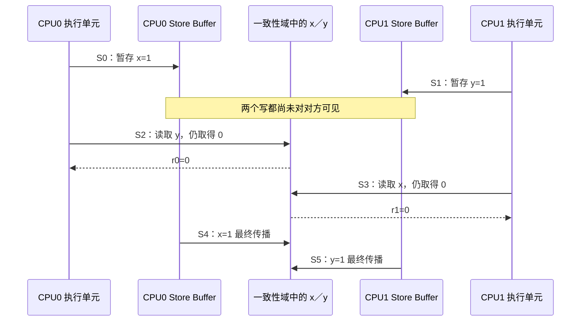

# 第3章\_乱序执行\_Store\_Buffer与观察时机

## 3.1\_为什么写指令不能总在缓存事务完成后才继续

CPU 要写一个当前没有独占权限的缓存行时，可能需要：

1. 完成地址翻译和权限检查；
2. 向一致性互连请求该缓存行的可写所有权；
3. 等待其他 CPU 的共享副本失效或降级；
4. 取得所需数据和确认；
5. 把新值并入本地缓存状态。

若执行流水线在每次 Store 上都同步等待这些步骤，远端共享者越多、互连越远，停顿越长。Store Buffer 的价值是先保存“地址、数据、大小以及相关状态”，让较早写入在后台完成所有权和传播事务，同时允许核心继续执行不必等待的后续指令。


这张图描述的是通用因果模型，不要求所有微架构的队列名称和字段完全相同。软件依赖的是体系结构规定的结果，不是对某款 CPU 私有实现的猜测。

## 3.2\_程序执行完成不等于远端已经观察

一条 Store 可以经历多个时间点：

```text
S0：指令被译码并进入执行窗口
S1：地址和数据准备完成
S2：写入进入 Store Buffer，后续指令可继续
S3：获得缓存行写权限并更新一致性域中的最新副本
S4：某个远端 CPU 的后续 Load 实际取得新值
```

不同材料中的“写完成”可能指 S2、S3 或更强条件。如果不先说明观察者和完成点，“CPU0 已经执行 data=42”不能推出 CPU1 此刻必然读到 42。

体系结构屏障通常要求某些早先访问在允许后续访问跨过之前达到规定的有序点，但不能笼统改写成“所有数据已经回写 DRAM”。最新值可以仍在缓存层级中，只要架构要求的观察顺序已经得到满足。

## 3.3\_同址转发和跨址绕行必须分开

CPU0 刚把 `x = 1` 放入自己的 Store Buffer，紧接着又读取 `x`：

```c
x = 1;
r0 = x;
```

为了保持单线程语义，核心通常可以从自己的未完成写入向后续同址 Load 转发新值，使 `r0 == 1`，无需等写入先对远端可见。

但后续读取另一个地址 `y`：

```c
x = 1;
r0 = y;
```

如果地址、依赖和体系结构允许，读取 `y` 没有理由等待 `x` 的所有权事务完成。于是对本 CPU 来说，程序顺序仍是“写 x，再读 y”；对另一 CPU 的观察而言，写 x 却可能尚未出现。

**Store-to-load forwarding 维护本核同址直觉，Store Buffer 绕行则制造跨地址反直觉。** 两者同时存在，并不矛盾。

## 3.4\_Store\_Buffering\_结果怎样逐步形成

初始 `x = 0, y = 0`：

```c
/* CPU0 */              /* CPU1 */
x = 1;                  y = 1;
r0 = y;                 r1 = x;
```



结果 `r0 == 0 && r1 == 0` 的关键不是把每颗 CPU 的两条源码指令简单“交换”，而是：

1. 本地 Store 已经被执行单元接受；
2. Store 仍在等待对外可见；
3. 后续跨址 Load 可以取得当前可见旧值；
4. 两个写之后仍会正常传播，最终内存状态为 `x = 1, y = 1`。

这个过程保持同址一致性，也不要求任一 CPU 读回自己的旧 x/y。

## 3.5\_Load\_为什么也可能提前

处理器还会尝试让多个 Cache Miss、地址翻译和依赖无关的 Load 并行进行。一个较后的 Load 可能提前发出甚至暂时得到值；若后来发现预测、依赖或一致性条件不成立，微架构必须取消或重放，保证最终退休结果符合体系结构模型。

因此要区分：

- **内部推测：** 指令曾经发起或取得过临时值；
- **体系结构可见结果：** 程序最终能够观察和提交的值；
- **外部传播：** 本 CPU 的写何时被其他观察者读取。

屏障和依赖约束的是最终允许结果以及某些访问能否越过有序点，不要求核心完全停止所有内部准备工作。用“屏障后 CPU 不再乱序执行任何东西”描述会把契约说得过强。

## 3.6\_缓存行所有权等待是写缓冲的现实来源

Store Buffer 并不取代缓存一致性。它恰恰经常用于覆盖一致性事务的延迟：CPU 可以先收下写入，再等待获得缓存行的修改权限。

若多个 CPU 高频写同一缓存行，所有权仍会来回传递，Store Buffer 只能吸收部分瞬时延迟，无法消除串行化资源。缓存行竞争、伪共享以及 per-CPU 数据为何有效，由[缓存行所有权竞争与伪共享](../cache_coherence/P03_缓存行所有权竞争与伪共享.md)详细解释。

关系可以概括为：

```text
一致性协议：谁拥有同一缓存行的最新有效副本
Store Buffer：本核写入在等待该协议推进时暂存在哪里
内存模型：这些暂存和传播允许造成哪些软件可见结果
```

## 3.7\_屏障必须改变哪一段因果链

若 SB 模式要求禁止两个读取都为 0，就必须阻止每颗 CPU 的“后续 Load 越过尚未对外有序的早先 Store”。全屏障可以要求：

```text
CPU0：Store x → full fence → Load y
CPU1：Store y → full fence → Load x
```

至少有一个 Load 必须在对方写入已经进入所需顺序关系后取值，从而打破 0/0 执行所需的环。只在一边加屏障通常不够，因为另一边仍可形成缺口；只使用写屏障也不能限制后续读取。

P05 将从具体禁止结果推导屏障方向。这里先保留成本直觉：屏障之所以有成本，是它迫使流水线或访存系统等待本来可以继续重叠的工作达到有序点。

## 3.8\_不要用微架构故事替代架构契约

Store Buffer 是理解 SB 结果的高价值模型，但正确研究步骤是：

1. 先用体系结构内存模型确认结果允许或禁止；
2. 再用 Store Buffer、Load speculation 等机制解释为什么实现愿意允许它；
3. 用性能计数器或文档研究具体处理器如何实现；
4. 不把某次观察不到、某款核心没有公开该队列，误写成全平台保证。

同一个允许结果可以由多种内部路径产生；同一种内部优化也必须被架构约束在允许结果集合内。

## 3.9\_研究示例怎样记录

针对 SB 压力测试，至少记录：

- CPU 型号、体系结构版本和核心数量；
- 编译器版本、优化级别和生成汇编；
- 共享变量是否使用语言/内核认可的并发访问；
- 线程固定在哪些 CPU，是否跨 NUMA 节点；
- 每种结果的次数、总迭代数和运行时长；
- 同一测试对应的形式模型结果。

观察到 0/0 能证明当前执行允许它；观察不到只能说明有限样本未命中。完整证据层级见 [P07](P07_反汇编_压力测试与形式化验证边界.md)。

## 3.10\_本章验收

1. 能把一次 Store 分成被执行单元接受、进入缓冲、获得所有权和被远端读取等时间点。
2. 能解释同址转发为何不与跨址乱序矛盾。
3. 能逐步画出 SB 的 0/0 结果，而不是只说“CPU 交换了指令”。
4. 能区分内部推测与架构可见结果。
5. 能说明 Store Buffer 隐藏了什么延迟、屏障又恢复了哪类等待成本。

上一篇：[访问粒度、对齐与撕裂](P02_访问粒度_对齐与撕裂.md)。

下一篇：[一致性序、传播与多副本原子性](P04_一致性序_传播与多副本原子性.md)。
