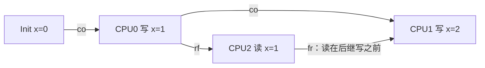
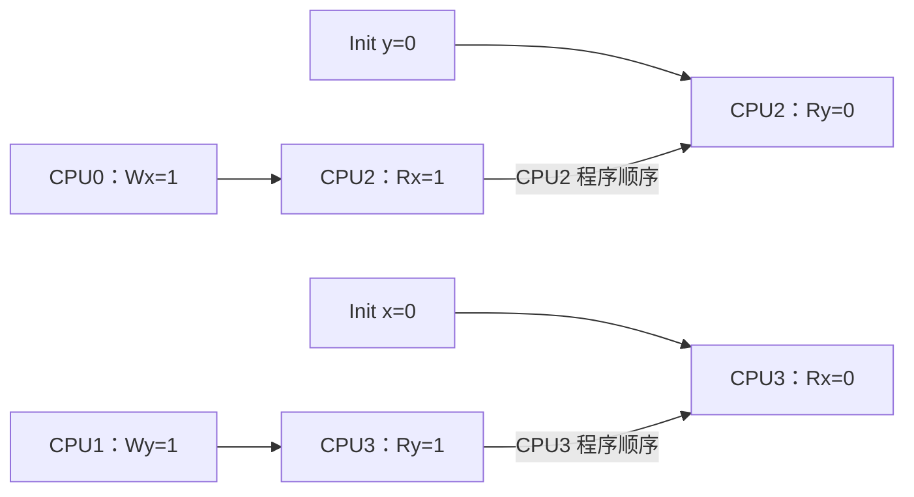
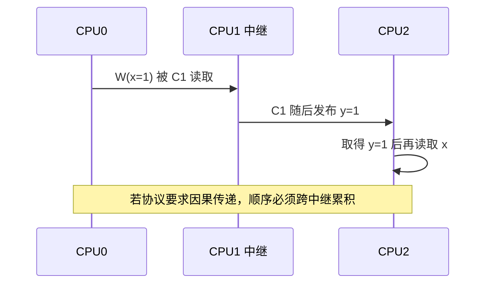

# 第4章\_一致性序\_传播与多副本原子性

## 4.1\_从两个\_CPU\_扩展到多个观察者

MP 和 SB 只需要两个 CPU，就能说明跨地址顺序不是默认保证。当系统有多个写者和多个观察者时，还会出现更深的问题：

- 对同一地址的多次写，所有观察者是否必须认同一个先后？
- 一次写在某个 CPU 可见后，是否已经同时对所有 CPU 可见？
- CPU1 看到 CPU0 的写并继续发布新状态时，CPU2 能否只看到后者却看不到前者？
- 两个 reader 能否对两个独立 writer 的先后得出相反结论？

这些问题分别涉及一致性序、传播、多副本原子性和累积性，不能都压缩成“cache 最终一致”。

## 4.2\_同一位置需要一致性序

假设 `x` 初始为 0，CPU0 写 1，CPU1 写 2。对同一位置，模型需要组织出一个写入顺序，例如：

```text
Init(x=0) → W0(x=1) → W1(x=2)
```

或：

```text
Init(x=0) → W1(x=2) → W0(x=1)
```

具体由竞争交错决定，但不同观察者不能长期把同一对写入认成互相矛盾的相反顺序，否则同址状态无法收敛。形式模型常把这条每位置写序称为 coherence order（`co`）。

缓存一致性协议通过缓存行状态、所有权和事务来实现这类保证，完整状态机见[缓存一致性专题](../cache_coherence/大纲.md)。内存模型使用抽象关系描述结果，不要求软件知道协议是 MESI、MOESI 还是目录式。

## 4.3\_读取来源和被覆盖关系

分析一次读取时，至少要记录三类关系：

- **program order（po）：** 同一执行者的事件顺序；
- **reads-from（rf）：** 读取实际取得哪个写入的值；
- **coherence order（co）：** 同一地址写入的顺序。

若 R 从 Wold 取值，而 Wnew 在同址一致性序中位于 Wold 之后，那么 R 与 Wnew 之间还存在“读取发生在更新前”的约束，形式模型常用 from-read（`fr`）表达。把 `po/rf/co/fr` 画成图，可以发现某些结果会形成模型禁止的环。



## 4.4\_传播不等于一次全局广播完成

“写已经传播”必须指定观察者。一个抽象执行可以经历：

```text
CPU1 已可读取 W0
CPU2 尚未可读取 W0
CPU3 通过另一个同步事件间接得知 W0
```

某些体系结构或内存类型提供更强的多副本原子性；另一些模型允许一个写先对部分观察者可见，再通过后续传播到其余观察者。软件若需要把“我已看到某写”继续传递给第三方，就可能需要具有累积性的屏障或同步链。

不能从“缓存一致性会广播失效”直接推出写在同一瞬间对所有 CPU 可见。具体互连可以定向发送、分层汇聚或经过共享缓存，架构只需满足对外契约。

## 4.5\_IRIW\_为什么检验多观察者一致意见

Independent Reads of Independent Writes（IRIW）使用两个独立写者和两个 reader：

```c
/* 初始 x = 0, y = 0。 */

/* CPU0 */        /* CPU1 */
x = 1;            y = 1;

/* CPU2 */        /* CPU3 */
r0 = x;           r2 = y;
r1 = y;           r3 = x;
```

关注结果：

```text
CPU2：r0=1, r1=0   // 认为 x 的写先可见
CPU3：r2=1, r3=0   // 认为 y 的写先可见
```



这个结果没有让任何单一地址违反一致性：每个 reader 对 x、y 分别取得了允许的值。它检验的是两个观察者是否必须对 **两个独立地址的写入相对可见顺序** 达成一致。不同体系结构和屏障选择可能给出不同答案。

## 4.6\_WRC\_为什么引出累积传播

Write-to-Read Causality（WRC）可以写成：

```c
/* 初始 x = 0, y = 0。 */

/* CPU0 */        /* CPU1 */              /* CPU2 */
x = 1;            r0 = x;                 r1 = y;
                  y = 1;                  r2 = x;
```

若 CPU1 先读到 `x == 1`，再发布 `y == 1`，CPU2 读到 `y == 1` 后，软件可能希望它也必须看到 `x == 1`。这不只是 CPU1 排列自己的两个访问；CPU1 还要把 **从 CPU0 观察到的先前写** 累积进向 CPU2 的发布链。



某些屏障只排列本 CPU 自己的访问，某些同步原语还具有模型要求的累积效果。选择屏障时若忽略中继参与者，就可能在两 CPU MP 测试中正确，在三 CPU 因果链中失败。

## 4.7\_多副本原子性要准确表述

可以把 multi-copy atomicity 粗略理解为：某个写一旦对一个非写者 CPU 可见，是否同时以规定方式成为其他观察者可见的全局事实。实际定义会受体系结构、内存类型和模型术语影响，因此文档中应避免：

- 把某个架构的普通内存结论外推到设备内存；
- 把“现代实现通常更强”写成跨版本契约；
- 把缓存协议的广播实现等同于架构级多副本原子性；
- 只靠两线程测试判断多观察者属性。

IRIW、WRC 和 ISA2 一类至少三参与者的 Litmus Test，才会显式暴露这类传播问题。

## 4.8\_一致性\_排序与生命周期仍是三件事

| 机制层 | 回答的问题 |
| --- | --- |
| 同址一致性 | 同一位置的写入和读取怎样形成可接受关系 |
| 跨址内存顺序 | 多个位置的事件怎样形成 happens-before/传播约束 |
| 对象生命周期 | 旧地址何时不再被任何执行者使用并可复用 |

即使硬件对写入提供很强的传播保证，也不知道一个 C 指针何时逃逸、一个 RCU 读者何时退出，或引用计数何时归零。硬件模型是对象协议的基础，不是对象协议本身。

## 4.9\_本章验收

1. 能用 `po/rf/co/fr` 描述一次读取来自哪个写入。
2. 能区分同址一致性与多个地址的相对观察顺序。
3. 能解释“对 CPU1 可见”为什么不自动等于“同时对所有 CPU 可见”。
4. 能逐步说明 IRIW 在检验什么，而不是把它误写成单地址旧值问题。
5. 能解释三 CPU WRC 为什么需要考虑累积传播。
6. 能把一致性、排序和生命周期分开。

上一篇：[乱序执行、Store Buffer 与观察时机](P03_乱序执行_Store_Buffer与观察时机.md)。

下一篇：[屏障、Acquire/Release 与依赖顺序](P05_屏障_Acquire_Release与依赖顺序.md)。
