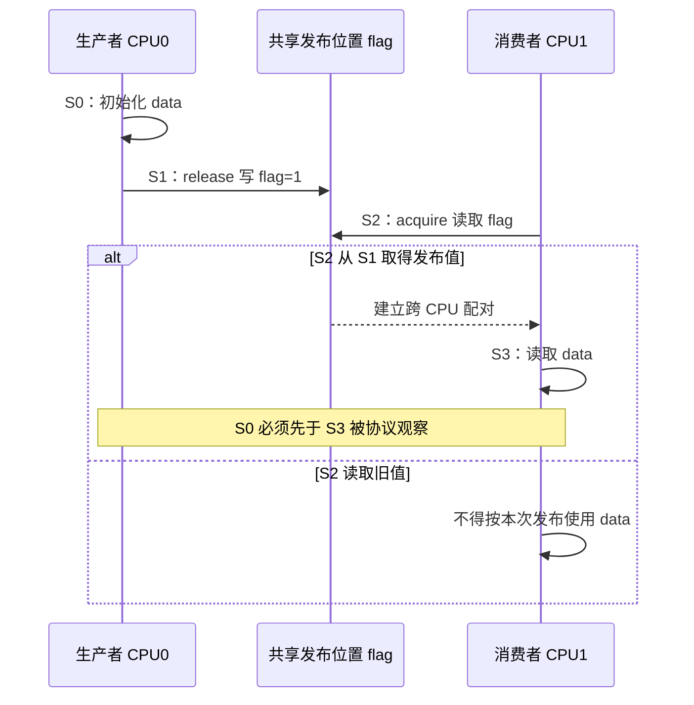
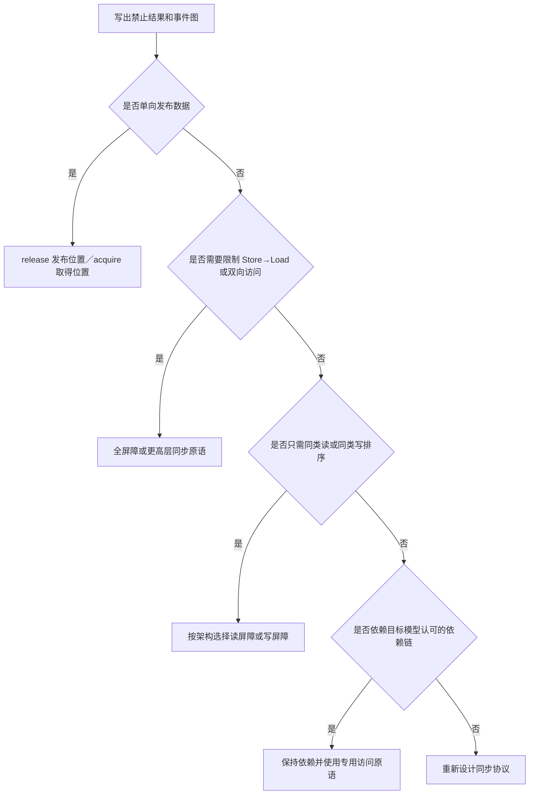

# 第5章\_屏障\_Acquire\_Release与依赖顺序

## 5.1\_从要禁止的结果反推顺序边

面对并发错误，不能先问“这里加哪条最强屏障”，而应先写出：

1. 哪个 CPU 生产数据；
2. 哪个事件表示数据已经发布；
3. 消费者依据哪个读取确认发布；
4. 哪些后续访问只有在确认后才合法；
5. 要禁止的具体寄存器结果是什么。

以消息传递为例，要禁止 `flag == 1 && data == 0`，需要形成：

```text
生产者写 data
    → 发布端顺序
生产者写 flag
    → 读取来源关系
消费者读 flag=1
    → 取得端顺序
消费者读 data
```

屏障、release/acquire 或依赖关系的作用，是为这张事件图补上缺失边。

## 5.2\_四类常见顺序能力

| 能力 | 约束方向 | 典型问题 |
| --- | --- | --- |
| 写屏障 | 早先写 → 后续写 | 先初始化描述符，再更新生产者索引 |
| 读屏障 | 早先读 → 后续读 | 先取得发布标志，再读取载荷 |
| 全屏障 | 屏障前读写 → 屏障后读写 | 阻止 Store→Load 绕行等双向模式 |
| acquire/release | 围绕一个具体取得/发布访问的单向顺序 | 生产者—消费者消息传递 |

实际体系结构可能把这些能力映射到不同指令、指令属性或更强实现。表格表达的是最小语义方向，不是统一机器指令表。

## 5.3\_Release\_只把此前访问推到发布之前

生产者：

```text
W(data) → store-release(flag=1) → 后续访问
```

release 保证此前相关访问不能在可观察顺序上越过这次发布 Store，但一般不约束发布之后的访问必须留在后面。它适合把“已经完成的初始化”交付出去，不是一个双向栅栏。

如果多个写者同时更新 `data` 和 `flag`，release 也不决定谁拥有写权限。互斥、原子状态转换或单写者约束必须由协议另行提供。

## 5.4\_Acquire\_只把此后访问留在取得之后

消费者：

```text
此前访问 → load-acquire(flag) → R(data)
```

acquire 防止后续相关访问在可观察顺序上跑到取得操作之前，但一般不把 acquire 之前的访问强制推到更早。它的意义还依赖读取来源：消费者必须真正取得协议所认可的发布值，才能把生产者的先前初始化连接过来。

若 acquire 仍读到旧标志，消费者只能得出“尚未取得本次发布”，不能偷偷使用载荷再声称发布契约成立。

## 5.5\_配对怎样形成端到端顺序



这里并不要求 CPU0 把整个 cache 写回 DRAM，也不要求 CPU1 广播确认。体系结构只需保证协议禁止 `flag=1 && data=旧值` 这一执行。

## 5.6\_为什么\_SB\_通常需要更强的双向约束

SB 模式每边都是 Store→Load：

```text
CPU0：W(x) → R(y)
CPU1：W(y) → R(x)
```

单纯 release Store 只排列它之前的访问，而这里需要限制发布 Store 之后的 Load；单纯 acquire Load 只排列它之后的访问，而这里没有需要保护的后续访问。因此 MP 中恰当的 release/acquire 不能机械套到 SB。

在两边的 Store 与 Load 之间放置全屏障，才能直接补上两条 Store→Load 边并打破 0/0 环。这个对比说明原语选择取决于事件方向，不取决于“都是两个 CPU 共享两个变量”的表面相似性。

## 5.7\_依赖顺序为什么比显式屏障更脆弱

某些架构或内存模型会利用事件之间的依赖：

- **地址依赖：** 第一次读取的值参与计算第二次访问地址；
- **数据依赖：** 第一次读取的值参与计算后续写入的数据；
- **控制依赖：** 第一次读取决定是否执行后续分支中的访问。

```c
p = load_pointer();
value = *p; /* 第二次 Load 地址依赖第一次读取出的 p。 */
```

依赖不是“源码看起来有关”就必然存在：编译器常量传播、值推导、条件合并或推测可以改变机器级依赖；不同体系结构对控制依赖能排序 Load 还是 Store 的规则也不同。通用代码应使用目标软件环境认可的依赖原语，不能用一个普通 C `if` 自创可移植屏障。

## 5.8\_中继传播为什么需要累积性

三 CPU WRC 中，CPU1 不仅要排列自己的“读 x → 写 y”，还要把它从 CPU0 读到的 `x=1` 继续传给观察 `y=1` 的 CPU2：

```text
CPU0 W(x=1)
  → CPU1 R(x=1)
  → CPU1 发布 y=1
  → CPU2 取得 y=1
  → CPU2 R(x)
```

若某个屏障只约束 CPU1 自己发起的本地访问，却不把已观察到的外部写纳入传播链，CPU2 仍可能取得 `y=1` 后读到旧 x。体系结构文档和形式模型会以 cumulative、propagation 等术语说明哪些原语能传递这种因果关系。

这也是为什么两线程 MP 成功不足以证明一个同步原语能安全连接任意长的多 CPU 链。

## 5.9\_屏障成本来自被迫等待和失去重叠

屏障可能迫使处理器：

- 等待早先访存达到规定有序点；
- 暂缓后续 Load 使用推测结果；
- 限制 Store Buffer 排空与新访问并行；
- 等待某些一致性或传播确认；
- 重放跨过屏障而后来发现不合法的内部工作。

具体成本取决于屏障类型、前后是否真有未完成访问、缓存命中和拓扑。release/acquire 常能比无差别全屏障保留更多并行性，但仅当协议确实是单向发布—取得时才正确。

## 5.10\_选择流程



如果还需要写者互斥、等待唤醒、多字段快照或对象回收，应优先选同时提供这些保证的更高层原语，不能期待屏障顺带完成。

## 5.11\_本章验收

1. 能从禁止结果推导需要补哪条顺序边。
2. 能说明 release 和 acquire 各自只约束哪个方向。
3. 能解释 acquire 读取旧值时为什么没有取得本次发布。
4. 能说明 MP 的 release/acquire 为什么不能直接解决 SB。
5. 能区分地址、数据和控制依赖，并说明编译器为何会影响它们。
6. 能在三 CPU 中继场景识别累积传播需求。

上一篇：[一致性序、传播与多副本原子性](P04_一致性序_传播与多副本原子性.md)。

下一篇：[Litmus Test 并发交错推演](P06_Litmus_Test_并发交错推演.md)。
