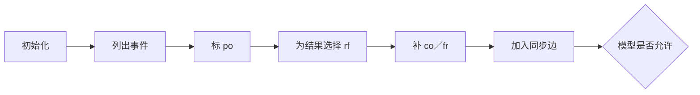

# 第6章\_Litmus\_Test\_并发交错推演

## 6.1\_Litmus\_Test\_不是普通压力测试

Litmus Test 把真实程序缩成少量参与者、共享位置和访问事件，再向内存模型询问某个结果是否允许：

```text
初始状态 + 每个参与者的事件 + 关注结果 + 目标内存模型
```

形式工具会枚举模型允许的抽象执行，回答 `Sometimes`（关注结果存在）、`Never`（被模型禁止）或相应分类。它不依赖某个结果在当前机器上是否容易出现，也不需要靠随机调度碰运气。

压力测试回答“这台机器这次运行观察到了什么”；Litmus 模型回答“在给定模型中是否存在这种执行”。二者应互相校验，但不能互相替代。

## 6.2\_先固定读图规则

每个测试都按同一顺序分析：

1. 写出所有共享变量初始值；
2. 给每个 Load/Store 编号；
3. 标出每个参与者内部的程序顺序 `po`；
4. 为关注结果选择读取来源 `rf`；
5. 补上同址一致性 `co` 与由旧值读取推出的 `fr`；
6. 加入屏障、acquire/release、依赖或锁产生的顺序边；
7. 检查模型是否因环、传播或其他公理禁止该执行。



## 6.3\_MP\_消息传递

```c
/* 初始 data=0, flag=0。 */
P0: data=1; flag=1;
P1: r0=flag; r1=data;
```

关注 `r0=1 && r1=0`。无顺序时，P1 可以从新 `flag` 写取值，同时从 `data` 的初始写取值；同址一致性没有被破坏。

加入“data 写 → release flag → acquire 读到 flag → data 读”后，关注结果被禁止。MP 用来回答： **发布点能否把此前初始化交给取得该发布的消费者。**

## 6.4\_SB\_Store\_Buffering

```c
/* 初始 x=0, y=0。 */
P0: x=1; r0=y;
P1: y=1; r1=x;
```

关注 `r0=0 && r1=0`。每个读取都从初始写取值，形成两条“读取发生在对方新写之前”的关系。若两条 Store→Load 都没有被排序，执行可以闭合；两边加入全屏障后，顺序环被打破。

SB 用来回答： **本地写尚未对外有序时，后续读取能否先取得另一个地址的旧值。**

## 6.5\_LB\_Load\_Buffering

```c
/* 初始 x=0, y=0。 */
P0: r0=x; y=1;
P1: r1=y; x=1;
```

关注 `r0=1 && r1=1`。两个读取若都要从对方程序顺序中更晚的写取值，会形成“仿佛因果从未来闭环”的执行。不同模型对 Load→Store、依赖和推测有不同约束。

LB 与 SB 的事件方向相反，不能因为代码布局相似就选择同一种屏障。

## 6.6\_IRIW\_独立写的独立读取

```c
/* 初始 x=0, y=0。 */
P0: x=1;
P1: r0=x; r1=y;
P2: y=1;
P3: r2=y; r3=x;
```

关注 `r0=1, r1=0, r2=1, r3=0`。两个 reader 分别先看到不同 writer 的新值，再读到另一地址的旧值。IRIW 不检验单一缓存行是否一致，而检验多个观察者对独立写传播顺序的约束。

在两个 reader 的两次 Load 之间加入合适的强屏障，模型可以强制它们不能形成相反观察环；只给 writer 各加一次普通 Store，不会自动让读者达成全局顺序。

## 6.7\_WRC\_中继因果

```c
/* 初始 x=0, y=0。 */
P0: x=1;
P1: r0=x; y=1;
P2: r1=y; r2=x;
```

关注 `r0=1, r1=1, r2=0`。P1 已看到 CPU0 的新 x，又让 P2 看到新 y，但 P2 仍读取旧 x。WRC 用来检验中继同步是否具有累积传播能力。

只分析 P1 自己的 `r0 → y` 顺序不够，还要问 P1 是否把它从 P0 观察到的写一并带入向 P2 的顺序链。

## 6.8\_ISA2\_两段发布链

ISA2 可理解为把消息传递再延长一跳：

```text
P0：写 payload，再发布 flag1
P1：取得 flag1，再发布 flag2
P2：取得 flag2，再读取 payload
```

它检验 release/acquire、屏障或依赖能否在多段链上组成传递闭包。一个原语即便能处理直接 P0→P1，也可能不足以把外部观察经 P1 传播给 P2。

## 6.9\_六种模式的选择价值

| 模式 | 参与者结构 | 主要暴露的问题 |
| --- | --- | --- |
| MP | 一生产者一消费者 | 发布—取得是否交付初始化 |
| SB | 两边 Store→Load | 写缓冲与双向 Store→Load 排序 |
| LB | 两边 Load→Store | 推测、依赖和因果闭环 |
| IRIW | 两 writer 两 reader | 多观察者对独立写的传播顺序 |
| WRC | writer—中继—reader | 已观察写能否累积传播 |
| ISA2 | 两段发布链 | 多跳同步的传递性 |

这张表不是“看见代码形状就套模板”。真实算法可能同时包含多个模式，需要把关键事件抽出来分别检查。

## 6.10\_怎样从真实代码缩成\_Litmus

以队列发布为例：

```c
slot[index] = item;
producer_index = index + 1;
```

缩减步骤：

1. 只保留一个槽位 `data` 和一个发布索引 `flag`；
2. 把生产者写槽位映射为 Wdata，写索引映射为 Wflag；
3. 把消费者读索引映射为 Rflag，读槽位映射为 Rdata；
4. 把错误条件写成 `Rflag==new && Rdata==old`；
5. 分别测试无序、屏障、release/acquire 版本；
6. 再回到真实代码检查多写者、环回代际和生命周期是否引入新状态。

Litmus 只验证抽出的顺序核心，不会自动验证数组越界、ABA、对象释放或等待唤醒。

## 6.11\_允许结果和观测结果不可混淆

- `Sometimes` 表示模型中至少存在一种满足条件的执行，不表示硬件每次都会出现。
- `Never` 表示在该模型和测试表达范围内被禁止，不表示未建模的编译器撕裂、MMIO 或数据竞争也安全。
- 压力测试出现模型禁止结果，首先检查测试是否有 C 语言未定义行为、模型是否选错、编译器访问是否标记正确，以及目标硬件是否符合所声明架构。
- 压力测试长期未出现允许结果，不能把测试次数当成证明。

## 6.12\_配套实验

[Linux LKMM Litmus 实验](../../../../labs/kernel/memory_ordering/P02_LKMM_Litmus_消息传递与屏障/README.md)提供 MP、SB 和 IRIW 的成对测试：先运行无序版本确认坏结果在模型中 `Sometimes`，再加入 release/acquire 或全屏障确认相应结果变为 `Never`。实验还要求保留 `herd7` 版本、Linux 模型版本和完整输出。

## 6.13\_本章验收

1. 能按初始化、事件、`po/rf/co/fr` 和同步边推演测试。
2. 能分别说出 MP、SB、LB、IRIW、WRC、ISA2 检验什么。
3. 能从真实发布代码缩出最小 MP 测试。
4. 能区分模型允许、硬件观察和程序正确性。
5. 能指出 Litmus 没有验证的生命周期、编译器和 I/O 边界。

上一篇：[屏障、Acquire/Release 与依赖顺序](P05_屏障_Acquire_Release与依赖顺序.md)。

下一篇：[反汇编、压力测试与形式化验证边界](P07_反汇编_压力测试与形式化验证边界.md)。
