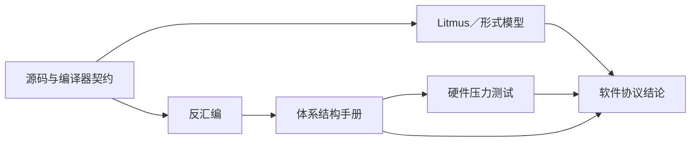

# 第7章\_反汇编\_压力测试与形式化验证边界

## 7.1\_为什么需要多层证据

内存顺序问题跨越源码、编译器、ISA、微架构和软件协议。单一工具最多验证其中一层：



可靠结论必须说明证据链在哪一层成立、哪一层仍是假设。下面固定一套可复用研究流程。

## 7.2\_第一层\_先写禁止结果

不要从汇编或屏障名字开始。先记录：

```text
参与者：CPU0 生产者，CPU1 消费者
共享状态：data、flag
初始值：data=0，flag=0
业务要求：读到 flag=1 后不得读到 data=0
关注结果：rflag=1 && rdata=0
```

这一步决定后续实验究竟在验证什么。没有具体结果条件，跑十亿次循环也只得到难以解释的数字。

## 7.3\_第二层\_检查编译器生成访问

反汇编回答：

- 源码访问是否被合并、消除或重复；
- 宽访问是否被拆成多条指令；
- 屏障或 acquire/release 映射成什么指令序列；
- 不同优化级别、编译器和目标三元组是否改变结果。

至少保存：

```text
compiler --version
完整编译命令
预处理后源码或关键宏展开
目标架构选项
目标函数反汇编
```

反汇编不能证明微架构不会重排，也不能证明指令在未对齐地址、设备内存或异常路径上的全部行为。

## 7.4\_第三层\_核对体系结构契约

体系结构手册或正式内存模型用于确认：

- 哪些访问宽度和对齐条件不撕裂；
- 普通内存、设备内存和不可缓存内存是否有不同规则；
- barrier/acquire/release 指令禁止哪些可观察结果；
- 是否以及怎样保证多副本原子性、依赖和累积传播。

教学性的 Store Buffer 图只能解释动机，不能取代架构规范。若结论只在 ARMv7、ARMv8-A 或 x86 成立，标题和正文必须保留架构边界。

## 7.5\_第四层\_用\_Litmus\_穷举抽象状态

Litmus 工具适合验证小型并发核心：

1. 把真实程序缩成少量事件；
2. 选择明确的目标模型；
3. 写出 `exists` 或 `forall` 条件；
4. 保存工具版本、模型版本和完整输出；
5. 成对比较无序与加序版本。

Linux LKMM 的模型文件、使用入口和限制见 [Linux 6.12 LKMM 源码与模型导读](../../../../research/source_reading/memory_ordering/P01_Linux_6.12_LKMM_源码与模型导读.md)。LKMM 是 Linux 软件契约，不等同于任一 CPU 架构模型。

## 7.6\_第五层\_硬件压力测试只提供存在性证据

压力测试可以：

- 证明某个结果在指定硬件、内核、编译器和二进制上确实出现过；
- 比较屏障前后结果分布和吞吐量；
- 暴露编译器或测试框架引入的意外同步；
- 为性能成本提供特定平台数据。

压力测试不能：

- 用“跑了很久没出现”证明模型禁止；
- 在包含语言级数据竞争时直接归因硬件；
- 把 x86 结果外推到 ARM 或反之；
- 用用户态测试覆盖内核中断、RCU、MMIO 或 DMA 语义。

结果表必须同时列出分子和分母，例如“0/0 出现 37 次 / 10^8 次”，不能只说“偶现”。

## 7.7\_第六层\_回到真实协议补齐未建模状态

即使 MP Litmus 证明发布顺序正确，真实代码仍可能失败于：

- 多个生产者同时写发布字段；
- flag 环回造成代际混淆；
- 对象在消费者使用期间被释放；
- 等待路径漏唤醒；
- 访问跨越 MMIO/DMA 域；
- 错误处理分支绕过同步原语。

形式测试验证的是抽出的顺序核心。代码审查还必须恢复对象所有权、状态机、错误路径和执行上下文。

## 7.8\_一个完整研究记录模板

| 项目 | 应记录内容 |
| --- | --- |
| 假设 | 哪个结果应允许或禁止，原因是什么 |
| 源码 | 最小测试与真实代码位置 |
| 编译器 | 名称、版本、选项、目标三元组、反汇编 |
| 架构 | ISA 版本、CPU 型号、内存类型、对齐条件 |
| 形式模型 | 模型名称/版本、测试文件、完整输出 |
| 硬件运行 | CPU 绑定、迭代数、结果分布、时间和性能计数器 |
| 结论 | 被证实的最小命题和不能外推的边界 |
| 复现 | 依赖安装、命令、预期结果、清理方法 |

## 7.9\_配套实验怎样分工

- [访问宽度、对齐与 ARM 反汇编实验](../../../../labs/foundations/computer_architecture/memory_ordering/P01_访问宽度_对齐与ARM反汇编/README.md)验证“源码对象不天然对应单条指令”，并要求分别保存 host 与 Cortex-A7 目标输出。
- [READ_ONCE 编译器访问实验](../../../../labs/kernel/memory_ordering/P01_READ_ONCE_编译器访问实验/README.md)比较普通读取和 ONCE 形式在 `-O0/-O2` 下的访问次数，验证的是编译器层，不宣称跨 CPU 已有顺序。
- [Linux LKMM Litmus 实验](../../../../labs/kernel/memory_ordering/P02_LKMM_Litmus_消息传递与屏障/README.md)比较 MP、SB、IRIW 的允许结果，验证 Linux 模型层，不模拟任意硬件撕裂或 MMIO。

## 7.10\_常见研究失误

| 失误 | 为什么结论无效 |
| --- | --- |
| 只看源码顺序 | 编译器和体系结构契约尚未检查 |
| 只看反汇编 | 未证明硬件观察顺序 |
| 只跑压力测试 | 未出现不等于模型禁止 |
| 只跑 Litmus | 真实代码可能包含模型外状态和错误路径 |
| 用 `volatile` 消除数据竞争 | 它没有自动建立跨 CPU 同步协议 |
| 在测试框架中加入重锁/全屏障 | 可能把要观察的弱序结果一并消掉 |
| 不记录版本 | 编译器、模型和架构实现变化后无法复现 |

## 7.11\_专题结论

内存顺序研究不是寻找一句“CPU 会乱序”的解释，而是建立闭环：

```text
具体错误结果
→ 最小事件模型
→ 编译器访问形态
→ 体系结构允许集合
→ 形式模型验证
→ 硬件存在性观察
→ 回到真实协议补齐生命周期与异常路径
```

沿这条链得到的结论才能被 RCU、锁、无锁队列、驱动和其他专题稳定复用。

## 7.12\_本章验收

1. 能为同一结论选择反汇编、架构手册、Litmus 或压力测试，而不是混用证据。
2. 能写出包含版本、目标、结果分布和边界的实验记录。
3. 能解释模型禁止与硬件未观察到的根本区别。
4. 能从最小 Litmus 回到真实代码补齐多写者、代际和生命周期。
5. 能明确 Linux LKMM 与 CPU 架构模型不是同一个模型。

上一篇：[Litmus Test 并发交错推演](P06_Litmus_Test_并发交错推演.md)。

下一步：[Linux 内存顺序专题](../../../linux/synchronization_and_asynchrony/synchronization/memory_ordering/大纲.md)。
