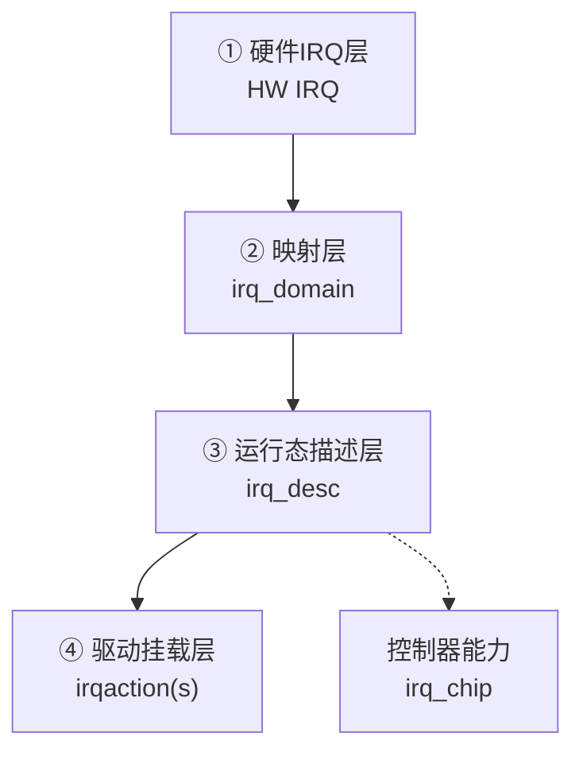

# 第3章_Linux_的中断抽象_irq_chip_irq_domain_与_irq_desc

## 3.1_本章目标

前两章已经把问题铺开了：

- 第1章说明了**为什么一定要有中断**，以及它对操作系统的意义；
- 第2章说明了**在一块真实的 SoC 上中断一定是分层的**，既有主控制器（如 GIC），又有子控制器（如 GPIO irqchip），而且可能还有多核分发。

本章要解决的问题只有一个：**Linux 怎么把这种“硬件上确实是分层的、多来源的、编号不稳定的中断体系”抽成一套“驱动看起来是统一的”中断接口。**
 这一章讲的就是 Linux 那套“三件套”：

1. `struct irq_chip` —— 把“控制器能做什么”抽象成一组统一操作；
2. `struct irq_domain` —— 把“硬件里那个号”映射成“Linux 里能用的号”；
3. `struct irq_desc` —— 把“一条中断线在运行时的全部状态”封装起来，驱动注册就是挂到这里。

理解了这三样，后面再看 `request_irq()` / `devm_request_irq()` / 设备树里的 `interrupts = <...>` 就是顺的。

------

## 3.2_Linux_面临的三个现实约束

在设计中断子系统时，Linux 不是从零开始想象的，它其实是被下面这三个现实问题“逼”出来的：

1. **硬件中断号不稳定**
   - 不同 SoC、不同板级，GPIO 中断号都可能变；
   - 同一块芯片上的不同中断控制器，自己的“硬件号”范围也不一样；
   - 所以，Linux 不能让驱动“直接写硬件号”。
2. **中断来源是分层的**
   - 有的中断直接来自 GIC；
   - 有的中断来自 GPIO irqchip，要先经过 GPIO 再到 GIC；
   - 所以，Linux 必须能表示“这个中断是这颗 GPIO 控制器上第 7 路，最终挂在 GIC 的某个入口上”。
3. **驱动作者不能被迫懂所有控制器**
   - 一个通用驱动应该只说：“我要这条中断”；
   - 不应该被要求知道：“这条中断实际上是 GPIO 触发的，要先清 GPIO，再通知 GIC”；
   - 所以，Linux 必须把“控制器差异”挡在中断子系统这一层。

针对这三个现实，Linux 的做法是：**把“控制器的能力”“中断号的映射”“中断线的运行状态”拆开，单独建数据结构来管。**

------

## 3.3_irq_chip_控制器能力的统一描述

### 3.3.1_为什么需要_irq_chip

硬件层面，不同中断控制器能做的操作其实是高度相似的：

- 打开/屏蔽一条中断；
- 告诉控制器这条中断要哪种触发方式（上升沿、下降沿、电平）；
- 对已经处理过的中断做结束/确认（ACK/EOI）；
- 有的还能设置目标 CPU、设置优先级。

Linux 的思路是：**不让上层代码直接去访问具体控制器寄存器，而是用一张“这颗控制器能做哪些动作”的函数表来描述它**。这张函数表，就是 `struct irq_chip`。

### 3.3.2_核心思路

- 每一种中断控制器（GIC、GPIO irqchip、自定义 irqchip）在注册时，都会提供一个 `struct irq_chip`;
- 这个结构体里填上“打开中断用哪个函数”“设置类型用哪个函数”“ack 用哪个函数”；
- 以后内核要对“这条中断”做具体操作时，就去找这条中断所绑定的 irq_chip，然后调用里面的函数。

也就是说：

> **irq_chip 是“Linux 对这颗中断控制器的驱动”**。

驱动作者写中断处理函数时，不需要关注 irq_chip，因为这部分一般是平台/控制器驱动写好的；但要知道它的存在，知道“我在驱动里调用的 `irq_set_irq_type()` 最终是落到 irq_chip 的 set_type 上去的”。

------

## 3.4_irq_domain_把硬件号变成_Linux_号

### 3.4.1_问题本质

第2章说过：真实的 SoC 上，一层是 GPIO，自顾自地编号；上一层是 GIC，也自顾自地编号；外设控制器可能又有自己的中断线号。**这些“硬件号”都不是我们在驱动里想看到的那个“irq number”。**

Linux 的目标是：

1. 驱动只看到一个**统一的** IRQ 号（整数）；
2. 这个整数在 Linux 内部是**唯一的**；
3. 至于这个整数对应底下哪一层的哪个硬件号，这个事交给中断子系统去管。

### 3.4.2_irq_domain_做的事

`struct irq_domain` 做的就是这件事：**在某一个控制器下面，把“硬件里的那个号（hwirq）”映射成“Linux 世界里的号（virq）”。**

可以这样理解：

- 每个中断控制器（尤其是子控制器）都有自己的 irq_domain；
- 设备树里写的 `<N>`，实际是说“在这个控制器下面的第 N 个中断”；
- 启动时，Linux 会根据 DTS 把“这个控制器”注册成一个 irq_domain；
- 当驱动说“我要这个设备的中断”时，Linux 会去相应的 domain 里把这个“硬件号”翻译成一个真正的 Linux IRQ；
- 驱动拿到的就是统一编号。

用一张简单的示意来表示：

```text
硬件世界：GPIO控制器里的第 7 号中断
       ↓ irq_domain 映射
Linux 世界：irq 42
```

驱动用的就是 42，真正怎么打到 GPIO、怎么再上报到 GIC，由 irq_domain + irq_chip 再完成。

### 3.4.3_为什么一定要这么做

- 因为硬件号会变，Linux IRQ 不能跟着变；
- 因为有多级中断，必须有父/子域；
- 因为有些控制器只有 8 个中断，有些有 160 个，不统一就没法写上层。

所以可以下一个结论：

> **irq_domain 是 Linux 里“多控制器、多级中断”的核心缓冲层，它把硬件的多样性挡在下面，让上面的驱动只看到整数 irq。**

------

## 3.5_irq_desc_一条中断线在运行时的完整状态

### 3.5.1_为什么还需要一层_irq_desc

到这里你可能会问：有了 irq_chip（能操作控制器）、有了 irq_domain（能把硬件号翻成 Linux 号），为什么还要一个 irq_desc？

原因是：**还缺一个“这条中断现在的运行状态”这一层。**

一条中断线在运行过程中，会有很多“跟当前时刻有关”的信息：

- 它现在是打开的还是屏蔽的；
- 它当前绑定的是哪一个 irq_chip；
- 它当前的触发方式是什么；
- 有没有线程化的 handler 在等它；
- 有多少个驱动挂在这条中断上（共享中断）；
- 已经触发过多少次，要不要统计；
- 是不是在处理过程中临时屏蔽了、要不要延后再处理。

这些信息都不是 irq_chip 或 irq_domain 能放的，因为：

- irq_chip 是“一个控制器的能力描述”，不是“某一条线的当前状态”；
- irq_domain 是“编号翻译关系”，也不是“运行时状态”。

所以 Linux 又搞了一个结构：`struct irq_desc`，**一条中断线对应一个 desc**，所有跟“当前这条中断线正在发生什么”有关的东西都放这里。

### 3.5.2_驱动注册其实就是_往_desc_里挂_action

当驱动调用 `request_irq()` 时，内核做的事可以概括成这样几步：

1. 根据你传进来的 irq 号，找到对应的 `struct irq_desc`；
2. 在这个 desc 下面新建一个“中断动作”（`struct irqaction`），里面有你的 handler、name、irqflags；
3. 把这个 action 挂到 desc 的链表里；
4. 如果这是第一次有驱动挂这条中断，还要去对应的 irq_chip 那里把这条中断真正打开。

也就是说：

> **驱动的中断注册，实际上就是“请把我的回调挂到这条中断线的 desc 上”。**

有了这个前提，Linux 才能做到共享中断：同一条 desc 下有多个 action，来了就一个个问“是不是你的”，第一个说“是”就结束。

------

## 3.6_三者的关系图示

下面这个图可以直接放文档里，说明三者是怎么配合的（注意这里是逻辑关系，不是代码调用顺序）：



含义：

- **底下**：硬件里的那个号；
- **往上一层**：irq_domain 把它翻成 Linux 看到的号；
- **再往上**：irq_desc 维护这条线此刻的状态；
- **最后**：驱动的回调（irqaction）挂在 desc 下面；
- 真正要对硬件做事的时候，再去找这条中断所关联的 irq_chip。

------

## 3.7_为什么驱动代码可以写得这么_天真

Linux 很多驱动代码看上去都很简单：

```c
int irq = platform_get_irq(pdev, 0);
ret = devm_request_irq(dev, irq, my_isr_thread_func, 0, dev_name(dev), dev);
```

然后它就假定：

- 这个 irq 真的能进；
- 它的触发方式已经在硬件里配好了；
- 它能在 `/proc/interrupts` 里看到计数；
- 它不需要知道中断是从 GPIO 来的还是从 GIC 来的。

之所以能这么写，是因为**前面那三层（irq_chip、irq_domain、irq_desc）已经把“硬件中断的多样性”都吃掉了**。
 所以，本章其实是在解释一句很多人知道的口头话：

> “Linux 的驱动开发是建立在内核已经帮你把硬件抽象过一层的前提上的。”

而中断这条线的“那一层抽象”，就是这三件套。

------

## 3.8_与下一章的衔接

到这里为止，我们有了这样一条逻辑链：

1. 硬件上：中断是多层的、多来源的，需要控制器汇聚（第2章）；
2. Linux 为了通吃各种 SoC，把多层、多来源拆成三个概念：**控制器能力（irq_chip）**、**号的映射（irq_domain）**、**运行时状态（irq_desc）**；
3. 驱动注册只是“往 desc 上挂 action”。

下一章就可以进入**“Linux 驱动怎么拿中断号、怎么注册、怎么选 `devm_request_irq()` vs `request_irq()`、怎么处理共享中断、为什么有时候 DTS 写了触发方式还要在驱动里 `irq_set_irq_type()` 再钉一次”**，也就是从“内核有这套抽象”走向“开发者怎么实际用”。